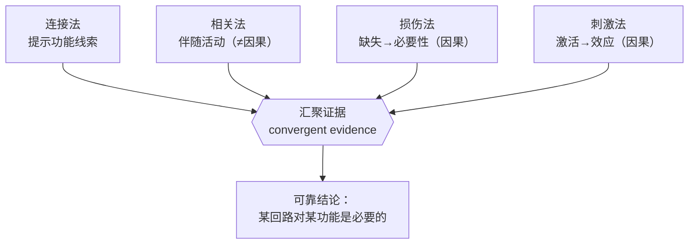
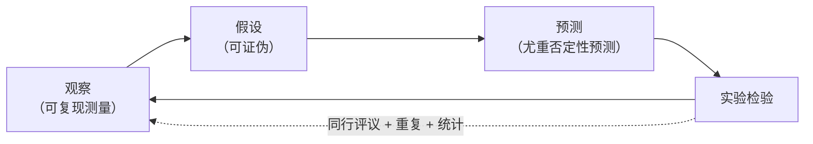
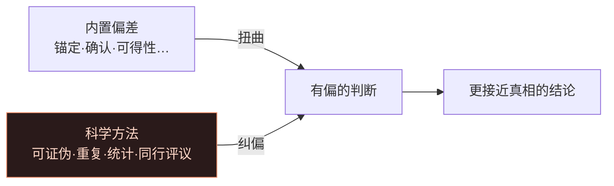

# 第1章 导论 · 详解（Introduction）

> 《脑与行为：认知神经科学视角》Eagleman & Downar (2016)
> 本章开篇以开普勒 1604 年观测超新星起笔：星空中的超新星固然壮丽，但更罕见奇妙的，是开普勒颅内那团"三磅重的宇宙"——它能觉察自身存在、反思自身奥秘。本章由此确立全书立场：**心智即大脑所生成之物**，并交代研究工具、思维陷阱、全书"大问题"与应用前景。

---

## ① 概念解释

### 1.1 核心概念速查表

| 概念 | 英文 | 一句话解释 |
| --- | --- | --- |
| 认知神经科学 | cognitive neuroscience | 研究大脑如何加工信息、构建记忆、导航决策，并由万亿部件产生一个"人"的学科 |
| 心智即大脑所生成 | mind = brain generates | 全书核心立场：思想、情绪、抉择皆由无思想的生物部件运作产生 |
| 涌现性质 | emergent property | 系统整体才有、单个组件不具备的特性（喜剧不属于任一晶体管） |
| 神经元与胶质细胞 | neurons & glia | 大脑基本细胞，共数千亿；单个神经元约连上万邻居 |
| 两类数据 | two bodies of data | 连接心智与大脑须同时立足①行为规律②生物机制 |
| 心理适应 | psychological adaptation | 神经功能多是提高祖先繁殖成功率的进化适应 |
| 三大生存功能 | survival functions | 内稳态、争斗行为、繁殖 |
| 连接法 | connectional methods | 追踪输入输出推断功能（示踪剂、DTI） |
| 相关法 | correlational methods | 测行为时脑活动找相关脑区（fMRI/PET/EEG/MEG） |
| 损伤法 | lesion methods | 由脑损伤的功能缺失推断功能（病人"Tan"） |
| 刺激法 | stimulation methods | 主动激活脑区看效应，建立因果（TMS/tDCS） |
| 认知偏差 | cognitive biases | 内置且扭曲推理的思维捷径 |
| 科学方法 | scientific method | 观察→假设→预测→实验的纠偏工具箱 |
| 绑定问题 | binding problem | 如何把分散特征整合成统一知觉 |
| 侧化 | lateralization | 左右半球功能分工 |

### 1.2 涌现：从分子到心智的层级（示意图）

> 关键点：把身体拆成分子只是"无趣的化学堆"，按**特定组织关系**重排，才复原出会做梦、有意志的你。心智是组织关系的**涌现**产物，而非某个部件的属性。

---

## ② 概念间关系

### 2.1 关系一览表

| 关系 | 内容 |
| --- | --- |
| 心智 ← 涌现 ← 神经元网络 | 心智是海量简单部件相互作用涌现的整体性质——"心智即大脑所生成"的逻辑支柱 |
| 进化 → 三大生存功能 → 专长与盲区 | 大脑为生存优化，故擅长觅食避险却不天生擅长"理解自身"，需科学方法纠偏 |
| 四种方法互补、层层设防 | 连接→线索；相关→伴随（无因果）；损伤/刺激→因果（有噪声）；四者汇聚才可靠 |
| 认知偏差 ↔ 科学方法 | 偏差是"病"，科学方法是"药"；研究者也是有偏差的大脑，故需制度化纠偏 |
| 本章范式 → 后续各章 | "两类数据+四方法+科学方法"是全书统一范式，各章用它攻克一个大问题 |

### 2.2 四种方法如何"汇聚证据"（示意图）

---

## ③ 提问-回答

**Q1：既然神经元本身"无知无觉"，心智怎么可能从中产生？**
靠**涌现**。喜剧不属于任何单个晶体管、却在整台电视中上演；心智属于组织化的神经元网络整体。拆成分子是无趣化学堆，按特定关系重组就复原了你。

**Q2：为什么"相关不等于因果"？**
fMRI 见某区在手被热探针刺激时激活，未必是"疼痛脑区"——它可能只在抑制"缩手"冲动，而冲动随疼痛增强，制造"表征疼痛"的假象。可能有隐藏第三因素 C 同时影响 A、B。故需损伤/刺激等因果研究支撑。

**Q3：损伤研究有哪些坑？**
三大陷阱：①损伤很少"干净"，常横跨两三区域，难判谁最关键；②未见缺损也不能断定无关（残留组织可能够用）；③缺损须谨慎评估，否则会犯"青蛙没了腿就变聋"式推理错误。

**Q4：大脑是通用计算机吗？它凭什么理解自己？**
不是。大脑被进化专门优化来解决内稳态/争斗/繁殖，如同肺专司呼吸。它能一点点看清自己，靠的不只是电极和 MRI，更靠一套抵消自身偏差的**科学方法**。

**Q5：确认偏差在 Wason 卡片任务里怎么体现？**
命题"若一面元音则另一面偶数"。多数人翻"A"和"2"。翻"2"是确认偏差（背面元音也只支持不证明）；真正能证伪的是翻"5"。人总找支持证据，懒于寻找能证伪自己的那张牌。

---

## ④ 科学研究已确定的结论

### 4.1 三大生存功能（大脑被优化去解决的问题）

| 功能 | 英文 | 含义 |
| --- | --- | --- |
| 内稳态 | homeostasis | 维持能量、体温、水分等生存参数在安全范围 |
| 争斗行为 | agonistic behavior | 对抗天敌/对手、争夺领地与猎物 |
| 繁殖 | reproduction | 觅偶、繁育、促进后代存活 |

### 4.2 四种研究方法对比（本章方法论核心）

| 方法 | 原理 | 代表技术 | 能提供 | 主要局限 |
| --- | --- | --- | --- | --- |
| 连接法 | 追踪输入/输出 | 示踪剂、DTI | 功能"线索" | 需先知输入输出区功能；须被更直接观察证实 |
| 相关法 | 测行为时脑活动 | PET、fMRI、EEG、MEG | 伴随活动的详细图景 | **相关≠因果**；可能有隐藏第三因素 |
| 损伤法 | 看损伤后缺失 | 尸检/MRI 定位 | 因果：某区对某功能必要 | 损伤不"干净"；缺损难解读 |
| 刺激法 | 主动激活脑区 | 电刺激、TMS、tDCS | 因果：活动→功能 | 刺激会扩散到远隔区域 |

### 4.3 认知偏差（可复现的心理学现象）

| 偏差 | 定义 | 例子 |
| --- | --- | --- |
| 锚定偏差 | 被第一观察（锚）过度影响 | 社保号末两位竟影响竞价出价 |
| 确认偏差 | 只找支持己见的证据 | Wason 卡片任务普遍误答 |
| 可得性启发 | 越易想起越觉得可能 | 越易回忆的情景感觉越可能发生 |
| 情感启发 | 用"我感觉如何"替换"我怎么想" | 以情绪代替分析 |
| 错觉相关 | 把无关事件看成有关联 | 感知实不存在的关系 |
| 信念偏差 | 因结论难信而否定有效论证 | 拒绝正确但反直觉的推理 |

### 4.4 已确定的结论清单

- 一切现有经验证据都支持**心智由神经系统的物理过程生成**：损伤一小块脑组织可特异性夺走理解音乐、命名动物、看颜色或判断风险的能力，而损伤同等大小的小指毫无此类影响。
- 四类方法各有确证用途与已知局限，**汇聚证据**是标准做法，方法论本身成熟可靠。
- 损伤法经典因果证据确立：Broca 病人"Tan"证明左额叶 Broca 区对语言产生必要。
- 刺激可因果性改变功能：自 Hitzig & Fritsch（1870）、Penfield & Jasper（1940s）到今天的 TMS/tDCS 均可重复。
- 人类认知内置大量系统性偏差，半个世纪已命名逾百种。
- 科学方法（可证伪、可重复、统计、同行评议）能有效纠偏。

---

## ⑤ 开放性未解决的问题与研究方向

### 5.1 本章明确抛出的开放问题

| 开放问题 | 方向描述 |
| --- | --- |
| 大脑能否完整理解自身？ | 为生存优化、非为自我认知设计的器官，是否具备构建自身准确模型的能力，仍开放 |
| 如何跨越"描述层级"鸿沟？ | 认知层描述与生物部件层相距甚远，两层不可分割却难互相还原，缺统一理论 |
| 硬件/软件之分是否成立？ | 大脑中软硬件界线模糊、甚至不存在，挑战"信息如何被脑实现" |
| 四大方法的技术局限 | 损伤法盼用基因操控获"干净"损伤；刺激法需分辨直接/扩散效应；相关法需严格区分相关与因果 |

### 5.2 全书"大问题"→ 章节映射

| 大问题 | 章 |
| --- | --- |
| 信息如何在神经活动中编码？ | 3 |
| 大脑如何在稳定与改变间平衡？ | 4 |
| 为何视觉与眼睛关系甚少？ | 5 |
| 大脑如何把不同感官拼成一个世界（绑定）？ | 6 |
| 大脑如何控制行动？ | 7 |
| 什么是意识？ | 8 |
| 记忆如何存储与提取？ | 9 |
| 大脑为何睡眠与做梦？ | 10 |
| 语言的独特能力从何而来？ | 11 |
| 我们如何做（非理性）决策？ | 12 |
| 情绪是什么？ | 13 |
| 我们如何设定优先级？ | 14 |
| 我如何知道你在想什么？ | 15 |
| 脑与心智的障碍由何而来？ | 16 |

### 5.3 认知神经科学的四大回报（应用方向）

| 回报 | 说明 |
| --- | --- |
| 修复失调的大脑 | 把机制理解转化为神经/精神疾病疗法 |
| 增强人类能力 | 感觉替代/添加、脑机接口 |
| 人工认知的蓝图 | 从脑的原理反哺人工智能设计 |
| 脑相容的社会政策 | 改进目击者指认、"向需求而非供给宣战"的成瘾治理、循证可定制量刑 |

### 5.4 科学方法迭代循环（示意图）

---

## ⑥ 完整性核对（对照原文 KEY PRINCIPLES）

> 严格校验：本详解逐条覆盖第 1 章章末 8 条 KEY PRINCIPLES（原文第 3960 行起），无遗漏。

| # | 原文 KEY PRINCIPLE（要点） | 本详解对应位置 |
| --- | --- | --- |
| 1 | 人脑是已知宇宙中最复杂、最非凡的对象之一 | 引子 + ①概念 |
| 2 | 认知神经科学旨在理解脑如何产生知觉、情绪、觉察、记忆、计划、决策等 | ①认知神经科学 |
| 3 | 不能仅靠理解组件来理解整体如何运作 | ①涌现 + ②2.1 + Q1 |
| 4 | 结构连接、脑-行为相关、损伤效应、刺激效应共同揭示机制 | ④4.2 四方法表 + ②2.2 图 |
| 5 | 大脑并非天生为理解自身而设计，内置认知偏差干扰逻辑推理 | ④4.3 偏差表 + Q4 |
| 6 | 科学方法工具箱可纠正内置偏差 | ①科学方法 + ⑤5.4 图 |
| 7 | 已知很多，但仍有大问题待解（编码、感官整合、意识、记忆、决策…） | ⑤5.2 大问题映射 |
| 8 | 进展或带来疾病新疗法、能力增强、人工认知蓝图、更明智的社会政策 | ⑤5.3 四大回报 |

---

## ⑦ 认知偏差 · 成因(Why) · 对策

> 本章是全书"认知偏差"的总纲：大脑为生存优化，天生带有系统性思维捷径，会扭曲对世界（乃至对大脑自身）的判断。下表列出本章明确提到的偏差、其**成因(Why)**与**对策**。总对策是那套"科学方法工具箱"。

| 认知偏差 | 成因（Why） | 解决方案 / 对策 |
| --- | --- | --- |
| 锚定偏差 anchoring | 大脑把首个观察当参照点并过度加权，以省认知资源 | 主动设想多个不同起点、用客观基准/数据重新校准；警惕"第一印象/初诊/初始报价" |
| 确认偏差 confirmation | 倾向维护既有信念、减少认知失调，故只找支持证据 | 用可证伪思维主动寻找反例（Wason 任务里去翻"5"）；引入同行评议 |
| 可得性启发 availability | 易被回忆之事被误当作更频繁/更可能 | 用基率与统计数据替代"印象"；核对真实频率 |
| 情感启发 affect heuristic | 用容易的"我感觉如何"替换更难的"我怎么想" | 分离情绪与证据、延迟判断、要求列出理由 |
| 错觉相关 illusory correlation | 大脑是模式识别器，倾向在随机中"看出"关联 | 对照实验 + 统计显著性检验，区分巧合与真关系 |
| 信念偏差 belief bias | 因结论反直觉就否定其实有效的论证 | 分离"论证有效性"与"结论可信度"；形式逻辑训练 |

**总对策——科学方法工具箱**：可证伪的假设、可重复性（多方法/多团队重复）、统计推断、同行评议，共同抵消个体大脑的偏差。

---

*本详解忠于第 1 章原文（STARTING OUT 引子、研究方法、批判性思维、大问题与回报各节）与章末 KEY PRINCIPLES / KEY TERMS，术语中英并列，OCR 拼写已据常识还原。*
