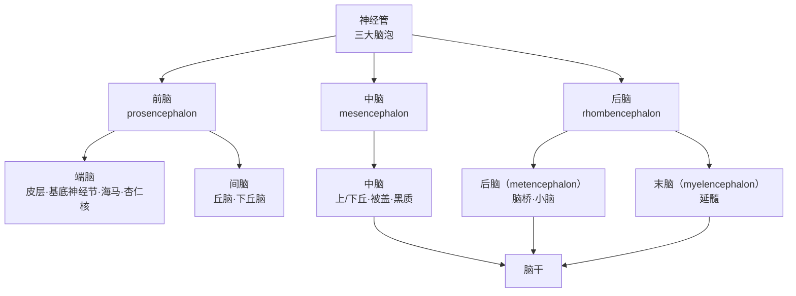
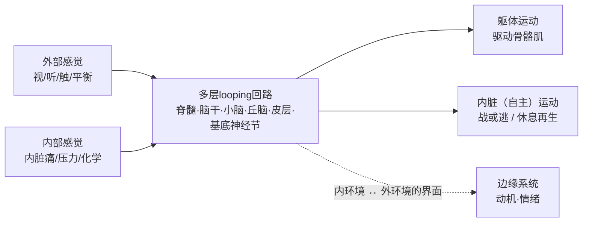
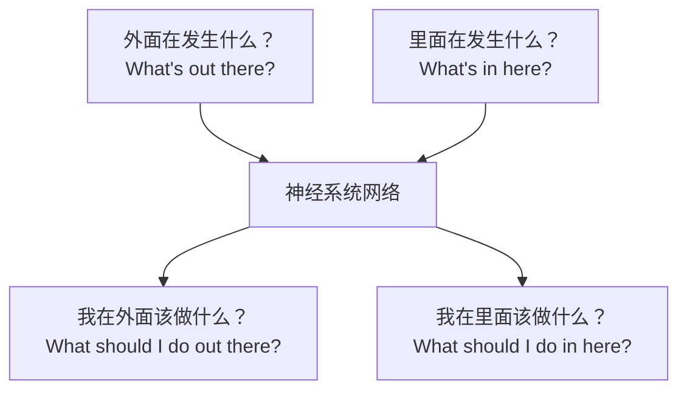

# 第2章 脑与神经系统 · 详解（The Brain and Nervous System）

> 《脑与行为：认知神经科学视角》Eagleman & Downar (2016)
> 本章以"地球上最小的哺乳动物（凹脸蝠，仅 2 克重、脑长四分之一英寸）与最大的抹香鲸（脑重近 20 磅）"起笔：两者演化路径分岔逾 8000 万年，可它们（乃至盲鳗、果蝇）的神经系统却拥有**共同的底层结构**。本章由此从外周到皮层"从头到尾"巡览神经系统：分节组织、外周-脊髓-脑干-小脑-间脑-端脑层层叠加的回路，最终汇成一个连通"内外世界"的四边形大脑。

---

## ① 概念解释

### 1.1 核心概念速查表

| 概念 | 英文 | 一句话解释 |
| --- | --- | --- |
| 中枢神经系统 | central nervous system | 脑 + 脊髓，信息加工与整合的中心 |
| 外周神经系统 | peripheral nervous system | 连接脊髓与全身、内脏的输入输出神经 |
| 分节组织 | segmental organization | 神经系统沿头尾轴分段排列（皮节/肌节） |
| 前脑/中脑/后脑 | fore-/mid-/hindbrain | 胚胎期三大脑泡，后再细分为成体各结构 |
| 躯体神经系统 | somatic nervous system | 控制随意肌、应对外部世界 |
| 自主神经系统 | autonomic nervous system | 自动调节内脏（交感/副交感） |
| 交感/副交感 | sympathetic / parasympathetic | 战或逃 vs 休息与再生两种模式 |
| 反射弧 | reflex arc | 感觉神经元直连运动神经元的最简回路 |
| 中枢模式发生器 | central pattern generator | 无需感觉输入即可自发产生节律运动的回路 |
| 脑干 | brainstem | 延髓+脑桥+中脑，脑与脊髓的通信枢纽 |
| 小脑 | cerebellum | "小脑袋"，含中枢神经系统最多神经元，主协调运动 |
| 下丘脑 | hypothalamus | 内稳态与基本驱力（饥渴、体温、睡眠）的调控核心 |
| 丘脑 | thalamus | 通往皮层的中继站与皮层区间同步器 |
| 大脑皮层 | cerebral cortex | 分四叶的最精细回路，主司高级认知 |
| 基底神经节 | basal ganglia | 发起并维持内驱性皮层活动（尤其运动） |
| 边缘系统 | limbic system | 连通内外世界、主导动机与情绪的一组结构 |

### 1.2 神经系统的层级与胚胎分化（示意图）

> 关键点：脑在演化中通过**在既有输入-输出之间插入更多神经元层**来精细化功能。全章正是"从最简单回路（外周/脊髓）逐层向上加调制"的巡览。

---

## ② 概念间关系

### 2.1 关系一览表

| 关系 | 内容 |
| --- | --- |
| 共同底层结构 ← 分节+前端膨大 | 所有脊椎动物都有分节的中枢神经系统，前端膨大成脑；结构古老且高度保守 |
| 外周 → 脊髓 → 脑干 → 前脑 | 层层向上，每一级"插入更多中间神经元"来调制下级回路 |
| 躯体系统 vs 自主系统 | 前者管"身体在外部世界的运动"，后者管"内脏的自动响应" |
| 交感 ↔ 副交感 | 一对相反模式：战或逃 vs 休息与再生 |
| 下丘脑 ↔ 皮层（经丘脑） | 下丘脑发"动机警报"，皮层负责把驱力拆成目标与行动计划 |
| 杏仁核 vs 下丘脑 | 输出相似（驱动内脏/动机），但杏仁核取**外部感觉**输入，下丘脑取**内部**输入 |
| 边缘系统 = 内外世界的界面 | 连接内环境感觉输入与运动输出，产生动机与情绪 |

### 2.2 四边形大脑：内外世界的桥接（示意图）

---

## ③ 提问-回答

**Q1：为什么把大量神经元集中放进一个"脑"里，而不是均匀分布全身？**
因为演化选择了两栖式方案。像水母那样辐射对称的动物用分布式"神经网"协调缓慢的节律收缩；而两侧对称、有前后端的动物需要在**前端**集中传感器与额外回路来"操舵"，前端脊髓因此膨大成脑。集中带来的高效协调，胜过"分散不易受伤"的好处。

**Q2：脊髓离开大脑还能"走路"吗？**
能。谢灵顿的学生 T. Graham Brown 发现：麻醉猫即使脊髓被完全切断所有外周感觉输入、甚至与脑隔离，脊髓仍能自发驱动踏步。由此他提出神经系统的基本功能单元不是反射弧，而是能**自发产生节律运动**的中枢模式发生器（CPG），感觉输入只是"调整"而非"驱动"。

**Q3：单突触反射和多突触反射差别为何重要？**
单突触反射（如膝跳反射）只有一个突触，简单但僵硬——若拉伸反射不可关闭，弯手臂时三头肌会顽抗，你会"僵住"。多突触反射在中间插入**中间神经元**（尤其抑制性中间神经元），可让屈肌收缩时关闭对侧伸肌的拉伸反射，从而带来灵活性。

**Q4：口渴时下丘脑为什么还要"求助"皮层？**
下丘脑能感知血压下降、体液渗透压升高，并发起自主（升心率、缩血管）与内分泌（抗利尿激素）代偿——但它**没有找水、喝水的回路**。觅水需要多感觉输入、记忆、方案权衡与复杂运动。于是下丘脑发出"动机警报信号"，经丘脑转给大脑皮层去决定怎么做。

**Q5：杏仁核和下丘脑都能驱动内脏状态，二者如何互补？**
下丘脑的驱力来自**内部**器官（内需）；杏仁核则直接取**外部**感觉（视、听、嗅），对外界威胁（捕食者）或机会（食物、配偶）作出情绪与动机反应。只靠内需的生物不会躲避外敌，故杏仁核是下丘脑的必要补充，也是情绪记忆的快速学习者。

---

## ④ 科学研究已确定的结论

### 4.1 外周神经系统的四类神经元与两大分区

| 分区 | 输入（传入 afferent） | 输出（传出 efferent） | 功能 |
| --- | --- | --- | --- |
| 躯体神经系统 | 躯体感觉神经元（皮肤/肌/关节） | 运动神经元（骨骼肌） | 外部世界的随意运动 |
| 自主神经系统 | 内脏感觉神经元 | 自主神经元（内脏） | 内部世界的自动调节 |
| ↳ 交感 | — | 胸段+上腰段发出 | 战或逃：心率↑、血压↑、血流至肌肉 |
| ↳ 副交感 | — | 骶段或脑干发出 | 休息与再生：心率↓、促消化 |

### 4.2 中枢神经系统"从下到上"的结构与功能

| 层级 | 关键结构 | 核心功能 |
| --- | --- | --- |
| 脊髓 | 灰质（细胞体）/白质（长程连接）、背根/腹根 | 反射弧、中枢模式发生器 |
| 后脑 | 延髓、脑桥 | 延髓：呼吸/心率/血压等生命中枢；脑桥：中继+觉醒/睡眠/吞咽 |
| 中脑 | 上丘/下丘、导水管周围灰质、黑质、蓝斑、中缝核 | 视/听定向、命令发生器、意识调节、多巴胺/去甲肾/5-羟色胺来源 |
| 小脑 | 叶片(folia)→小叶→叶、浦肯野细胞 | 平滑精确协调运动、前向模型预测；亦涉语言/记忆/情绪 |
| 间脑 | 下丘脑（核团）、丘脑（中继/板内/网状核） | 内稳态与基本驱力；通往皮层的中继与同步 |
| 端脑 | 四叶皮层、基底神经节 | 高级认知；发起并维持内驱性皮层活动 |

### 4.3 大脑皮层四叶及主要功能

| 叶 | 关键区 | 功能 |
| --- | --- | --- |
| 额叶 | 初级运动皮层（中央前回）、前额叶、眶额皮层 | 运动计划与执行、目标规划、价值/优先级设定 |
| 顶叶 | 初级躯体感觉皮层（中央后回）、上/下顶小叶、楔前叶 | 触觉/本体感觉、空间定位、按形式组织刺激、想象与导航 |
| 颞叶 | 初级听觉皮层、梭状回、旁海马回 | 听觉、腹侧视觉通路（识别面孔/物体） |
| 枕叶 | 初级视觉皮层（距状沟内） | 视觉处理（位置/朝向/形状/颜色/运动） |

### 4.4 十二对脑神经与脑干核团（要点）

| 脑神经 | 名称 | 主要功能 |
| --- | --- | --- |
| I | 嗅神经 | 嗅觉（从大脑发出） |
| II | 视神经 | 视觉（从大脑发出） |
| III/IV/VI | 动眼/滑车/展 | 眼球运动、瞳孔缩小 |
| V | 三叉神经 | 咀嚼肌；面/口触痛觉 |
| VII | 面神经 | 面部表情肌；舌前2/3味觉；泪/唾液分泌 |
| VIII | 前庭蜗神经 | 听觉与平衡 |
| IX | 舌咽神经 | 舌后1/3味觉；吞咽反射 |
| X | 迷走神经 | 副交感主通路；降心率、促消化 |
| XI | 副神经 | 头颈肩部分肌肉运动 |
| XII | 舌下神经 | 舌肌运动 |

### 4.5 已确定的结论清单

- 所有脊椎动物（乃至无脊椎动物）神经系统有**共同底层结构**：分节 + 前端膨大集中控制；且左右交叉（左半球连右侧身体）。
- 脊髓灰质分层（背侧多感觉、腹侧多运动）；感觉从背根入、运动从腹根出。
- 反射弧连接输入输出；CPG 可无感觉输入自发产生节律运动（走/游/呼吸）。
- 延髓破坏迅速致命——它含呼吸与心率/血压的关键 CPG。
- 小脑含中枢神经系统最多神经元，跨物种布线高度一致，主司平滑协调运动（"前向模型"）。
- 下丘脑经三类响应（自主/内分泌/行为）维持内稳态，并作为神经内分泌"主控腺"经垂体释放激素。
- 丘脑是通往皮层的中继站，也在皮层区间同步（涉注意与意识）；板内核受损可深度降低意识水平。
- 基底神经节经"皮层→纹状体→苍白球→丘脑→皮层"环路发起并维持内驱运动。

---

## ⑤ 开放性未解决的问题与研究方向

### 5.1 本章明确抛出的开放问题

| 开放问题 | 方向描述 |
| --- | --- |
| 中枢神经系统如何、几次演化而来？ | 神经元与脑可能在多条谱系中独立起源；具体过程与次数仍在争论 |
| 小脑的确切角色是什么？ | 公认协调运动，但"精细化运动、匹配环境"的确切机制仍有争议；且新证据牵涉语言/记忆/注意/情绪 |
| 脊髓损伤能否治愈？ | 神经与白质束损伤后不再生，瘢痕与空洞形成障碍；神经干细胞移植有望但有免疫、成瘤等风险——被称为"21世纪神经科学的圣杯" |
| 边缘系统究竟包含哪些结构？ | "情绪与动机系统"概念有用，但两本神经解剖书很少在具体成员上完全一致 |
| 意识如何依赖丘脑？ | 丘脑（尤板内核）在同步/觉醒中的作用与意识的关系仍待厘清（深部脑刺激"唤醒"案例是线索） |

### 5.2 相关研究方向与技术

| 方向 | 技术/证据 |
| --- | --- |
| 脊髓损伤修复 | 神经干细胞移植、皮质类固醇抗炎、克服瘢痕/空洞 |
| 意识障碍干预 | 丘脑板内核深部脑刺激（Schiff 团队"唤醒"病人） |
| 皮层功能定位 | 细胞构筑学（Brodmann 分区）、免疫组化、算法自动分区 |
| 跨物种比较 | 从盲鳗到人共享回路，揭示保守与新颖之处 |

### 5.3 四边形大脑：全章统一视角（示意图）

---

## ⑥ 完整性核对（对照原文 KEY PRINCIPLES）

> 严格校验：本详解逐条覆盖第 2 章章末 12 条 KEY PRINCIPLES（原文第 7094 行起），无遗漏。

| # | 原文 KEY PRINCIPLE（要点） | 本详解对应位置 |
| --- | --- | --- |
| 1 | 所有脊椎动物神经系统具分节组织+前端膨大集中控制；用内/外感觉输入；多层叠加日益复杂的输入-输出回路 | 引子 + ①1.2 + ②2.1 + Q1 |
| 2 | 外周神经系统采集体内外感觉输入送入中枢，并把输出送至内脏与肌肉 | ④4.1 |
| 3 | 简单脊髓反射让感觉直导运动（少涉中枢）；CPG 支持更复杂协调运动如运动/移行 | ③Q2/Q3 + ④4.2 |
| 4 | 脑干中更精细的反射与 CPG 处理特殊感觉输入并控制头部特殊运动 | ④4.2（脑干）+ ④4.4 |
| 5 | 脑干含延髓、脑桥、中脑；中继脑-脊髓间信息，是多数脑神经的起源 | ④4.2 + ④4.4 |
| 6 | 小脑含中枢神经系统多数神经元，组织为叶片→小叶→叶 | ①1.1 + ④4.2（小脑） |
| 7 | 小脑的庞大回路支持平滑、精确、协调的运动 | ④4.2 + ④4.5 |
| 8 | 下丘脑协调内稳态（含睡眠与进食）；丘脑是通往皮层的感觉中继，并协调皮层区间信息流 | ①1.1 + ④4.2 + Q4 |
| 9 | 大脑皮层提供最精细的感觉/运动/中间功能回路，分额、颞、顶、枕四叶 | ④4.3 |
| 10 | 基底神经节回路发起并维持内驱性皮层活动，尤与运动控制相关 | ④4.2 + ④4.5 |
| 11 | 边缘系统含下丘脑、部分丘脑、黑质、杏仁核、海马及皮层边缘区，主司动机与情绪 | ②2.1 + ④4.5 + Q5 |
| 12 | 神经系统回路跨越感觉与行动、内世界与外世界，连接"里外在发生什么"与"我该做什么" | ②2.2 + ⑤5.3 |

---

## ⑦ 认知偏差 · 成因(Why) · 对策
> 本章偏神经解剖与进化基础，鲜有经典"认知偏差"，但恰好纠正了大众对大脑最流行的几种误区——它们多源于忽视"分层同源、跨物种保守"这一核心事实。

| 认知偏差 / 误区 | 成因（Why） | 解决方案 / 对策 |
| --- | --- | --- |
| "左脑型/右脑型人格"（理性 vs 艺术二分） | 把两半球轻度功能偏侧化夸大为固定人格类型；媒体简化传播 | 依神经解剖：两半球经胼胝体密集互联、协同工作；偏侧化是相对而非"非此即彼"，本章强调左右交叉的共同底层结构 |
| "人只用了 10% 的大脑" | 误解"沉默皮层"与局部激活成像；励志话术推波助澜 | 全章逐区证明每个结构都有明确功能（延髓破坏即致命）；无冗余闲置区，脑代谢占全身能耗约 20% |
| "人脑与动物脑截然不同、另起炉灶" | 以人类认知的独特性，反推神经结构也全新独有 | 本章反复证据：从盲鳗、果蝇到人共享分节+前端膨大的底层回路；差异在于"插入更多神经元层"，而非另造新结构 |
| "脑越大越聪明" | 直觉把绝对脑重等同于智力 | 凹脸蝠 2 克脑 vs 抹香鲸 20 磅脑的对比：结构组织与相对回路精细化，而非绝对体积，才是关键 |
| "反射就是神经系统的基本单元" | 膝跳等单突触反射直观易懂，被当作运作范式 | Graham Brown 的踏步实验：基本单元是能自发产生节律的中枢模式发生器（CPG），感觉输入只作调制 |

*本详解忠于第 2 章原文（STARTING OUT 引子、外周神经系统、脊髓、脑干、小脑、间脑、端脑、边缘系统与四边形大脑各节）与章末 KEY PRINCIPLES / KEY TERMS 整理，术语中英并列，OCR 拼写已据常识还原。*
