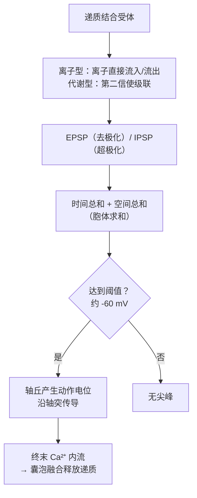
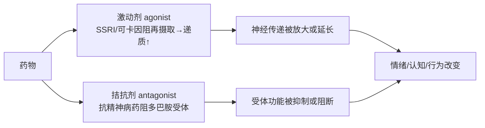

# 第3章 神经元与突触 · 详解（Neurons and Synapses）

> 《脑与行为：认知神经科学视角》Eagleman & Downar (2016)
> 本章以"歌舞伎名角坂东三津五郎醉后逞强、吞下四份河豚肝而中毒身亡"起笔：河豚毒素（tetrodotoxin）**阻断动作电位**——大脑发出的指令因电信号无法抵达肌肉而全然失效，最终死于窒息。全章由此深入神经系统的最小单元：神经元如何用**化学信号（突触传递）与电信号（动作电位）**在庞大网络中通信，以及这些"尖峰"（spikes）究竟编码了什么信息。

---

## ① 概念解释

### 1.1 核心概念速查表

| 概念 | 英文 | 一句话解释 |
| --- | --- | --- |
| 神经元 | neuron | 神经系统最重要的细胞，能远距离快速传电信号（人脑约千亿个） |
| 神经元四区 | four zones | 树突（收）、胞体（整合）、轴突（传）、轴突终末（出） |
| 神经元学说 | neuron doctrine | Cajal 提出：脑由离散细胞而非连续网络构成 |
| 胶质细胞 | glial cells / glia | 支持细胞：髓鞘、清理递质、调节化学环境、免疫 |
| 突触 | synapse | 神经元间信号传递的接触点（"原生质之吻"） |
| 神经递质 | neurotransmitter | 由突触前释放、扩散过突触间隙的化学信使 |
| 受体 | receptor | 膜上专司结合递质的蛋白（离子型/代谢型） |
| EPSP / IPSP | excitatory/inhibitory postsynaptic potential | 兴奋性（去极化）/抑制性（超极化）突触后电位 |
| 动作电位 | action potential / spike | 全或无、恒定大小的电信号，神经元的通信"字母" |
| 阈值 | threshold | 约 -60 mV，达到即在轴丘触发尖峰 |
| 髓鞘与郎飞结 | myelin & nodes of Ranvier | 绝缘层加跳跃式传导，大幅提速 |
| 时间/空间总和 | temporal/spatial summation | 胞体对同时或多分支到达的信号求和 |
| 速率编码 | rate coding | 用单位时间内的尖峰数（发放率）编码刺激 |
| 群体编码 | population coding | 由一群神经元的临时"联盟"共同表征刺激 |
| 巧合探测器 | coincidence detector | 神经元靠众多兴奋输入同时到达才发放 |

### 1.2 神经元四区与信号流（示意图）

> 关键点：神经元四区对应四大功能——**收集（树突）、整合（胞体）、传导（轴突）、输出（终末）**。突触是链条延续之处，从千亿细胞的并行活动中涌现出认知与行为。

---

## ② 概念间关系

### 2.1 关系一览表

| 关系 | 内容 |
| --- | --- |
| 化学信号 ↔ 电信号 | 树突/突触=化学；轴突=电（动作电位）；终末又转回化学，循环往复 |
| EPSP + IPSP → 求和 → 阈值 | 胞体像做加法：兴奋累加、抑制抵消；总和达阈才发放尖峰 |
| 递质 ≠ 兴奋/抑制本身 | 决定兴奋或抑制的是**受体的作用**，非分子本身（如 GABA 幼年兴奋、成年抑制） |
| 髓鞘 → 跳跃传导 → 提速 | 郎飞结间跳跃式传导，既加快又省能；脱髓鞘（MS）则信号受损 |
| 速率编码 → 群体编码 | 单神经元"嘈杂"，靠群体临时联盟实现精确、灵活、抗噪 |
| 药物 ↔ 神经传递各环节 | 精神活性药作用于释放/受体/再摄取/通道（激动剂/拮抗剂） |
| 局部编码 vs 群体编码 | "祖母细胞"式一对一不可行；分布式群体编码更强大灵活 |

### 2.2 从刺激到发放：信号整合流程（示意图）

---

## ③ 提问-回答

**Q1：河豚毒素为什么致命？**
它精准阻断**电压门控 Na⁺ 通道**的孔道，使通道无法开放、离子无法通过。没有 Na⁺ 通道活动就没有动作电位；没有动作电位，所有通信停止——包括膈肌等呼吸肌，于是窒息而死。正因它直击神经系统最基本的信号机制，其毒性约为氰化钾的 100 倍。

**Q2：动作电位为什么是"全或无"、且只向前传？**
达阈后 Na⁺ 涌入使膜迅速反转，随即 K⁺ 外流使膜复极——每次尖峰大小恒定（全或无）。它靠"邻近通道被去极化而依次开放"沿膜传播（如一排捕鼠夹依次弹开）。因刚发放处有**不应期**（Na⁺ 通道暂难再开），尖峰无法回退，只能向前。

**Q3：说递质是"兴奋性"或"抑制性"，为什么不严谨？**
决定兴奋或抑制的不是分子本身，而是**受体的作用**。经典例子：发育中的动物 GABA 因其受体让 Cl⁻ 外流而产生 EPSP（兴奋）；成年后受体改为让 Cl⁻ 内流，GABA 遂产生 IPSP（抑制）。分子未变，改变的只是它结合受体后的后果。

**Q4：单个神经元"噪声"大，大脑如何做到精确？**
靠**群体编码**。单神经元逐试次可变、且有自发背景发放，单个尖峰并不可靠。但一群相似神经元的活动可对噪声求平均，在任一试次上实现精确。这比"用少量精确元件"更高效——如色觉只用三类感受器却能分辨上万种颜色，靠的是三者相对活动的群体表征。

**Q5："祖母细胞"（一个细胞对应一个人）为何不成立？**
三大问题：①神经元数量远不足以为一生能识别的所有模式各配一个；②脑细胞会自然死亡，若一对一编码，记忆会像旧相册掉照片般"一个个突然消失"，而实际记忆是随年龄"平缓、优雅地退化"；③外科医生要恰好找到那唯一的祖母细胞，无异于大海捞针。故大脑必用更强大灵活的分布式群体编码。

---

## ④ 科学研究已确定的结论

### 4.1 神经元的分类

| 分类维度 | 类型 | 特征 |
| --- | --- | --- |
| 按功能 | 感觉（传入 afferent） | 直接响应外界信号（光/声/压力/气味） |
| 按功能 | 运动（传出 efferent） | 直接输出到肌肉/腺体，是信号离开神经系统的末步 |
| 按功能 | 中间神经元 | 位于感觉与运动之间；哺乳动物绝大多数属此类 |
| 按形态 | 多极 multipolar | 多树突，最常见 |
| 按形态 | 双极 bipolar | 一端一树突、一端一轴突（视网膜/内耳） |
| 按形态 | 单极 monopolar | 单一突起分两向（触/痛感觉神经元） |
| 共性 | 有丝分裂后 postmitotic | 神经元不像其他细胞那样分裂 |

### 4.2 四类胶质细胞

| 类型 | 英文 | 功能 |
| --- | --- | --- |
| 少突胶质细胞 | oligodendrocytes | 中枢内髓鞘化（一个可包裹多达 50 条轴突） |
| 施万细胞 | Schwann cells | 外周髓鞘化（一个只包裹一条轴突） |
| 星形胶质细胞 | astrocyte | 结构支持、维持胞外化学平衡、修复、供养、调节血流 |
| 小胶质细胞 | microglia | 中枢免疫前线，占胶质约 20%，吞噬清除外来体 |

### 4.3 两类突触后受体对比

| 受体 | 机制 | 速度 | 特点 |
| --- | --- | --- | --- |
| 离子型 ionotropic | 递质门控，直接开孔让离子流动 | 快 | 常只选择性通过某种离子（如 GABA→Cl⁻） |
| 代谢型 metabotropic | 经 G 蛋白等第二信使级联间接改变细胞 | 慢 | 可调邻近通道/酶/基因表达；约半数药物靶此类 |

### 4.4 已确定的结论清单

- Cajal 的神经元学说确立：脑由**离散细胞**组成，需跨微小间隙通信。
- Loewi（1921 前后）青蛙心脏实验证明突触传递是**化学**的（获 1936 诺奖）。
- 递质清除有三途径：降解、扩散、**再摄取**（小分子递质最常见）。
- 静息膜电位约 -70 mV；Na⁺ 内流去极化产生 EPSP，K⁺ 外流/Cl⁻ 内流超极化产生 IPSP。
- 动作电位由电压门控 Na⁺/K⁺ 通道序列开合产生；髓鞘经**跳跃式传导**提速并省能。
- 尖峰到达终末→电压门控 **Ca²⁺** 内流→囊泡融合释放递质，链条闭环。
- 神经元常对特定刺激"调谐"（如面孔细胞）；单细胞记录（Hubel & Wiesel，1981 诺奖）揭示视皮层组织原理。
- 神经元是**巧合探测器**：约万个输入，靠众多兴奋输入时空重合才发放。

---

## ⑤ 开放性未解决的问题与研究方向

### 5.1 本章明确抛出的开放问题

| 开放问题 | 方向描述 |
| --- | --- |
| 神经编码到底是什么？ | 尖峰的"含义"仍未解；速率编码只是起点，非全部 |
| 时间编码有多重要？ | 电鱼/同步发放研究提示精确时序也携带信息，但整体证据仍混合、未定论 |
| "噪声"活动如何解读？ | 膜电压涨落与自发尖峰或非纯噪声，可能编码情境（近期经验、奖惩、内外状态） |
| 尖峰之外的活动？ | 非尖峰神经元（视网膜/下丘脑）、胶质细胞是否参与信息处理、胞内生化级联的角色 |
| 联盟如何形成？ | 神经元结成临时联盟：相互兴奋维持高发放 vs 同步发放，两机制孰主仍待厘清 |
| 记录技术瓶颈 | 现只能记录少量细胞；需同时测数千至百万神经元才能理解群体时间编码 |

### 5.2 传统实验范式的局限（为何仍有争议）

| 局限 | 问题 |
| --- | --- |
| 只记录少数细胞 | 错过跨大群体的时间编码 |
| 用简单非自然刺激 | 蜂鸣/光条便于分析，但回避了自然场景的复杂性 |
| 轻度麻醉动物 | 减少运动但改变细胞互动，且动物并未真正"知觉"刺激 |
| 无行为反应 | 难判刺激对整脑是否有意义 |

### 5.3 精神活性药作用于神经传递各环节（示意图）

---

## ⑥ 完整性核对（对照原文 KEY PRINCIPLES）

> 严格校验：本详解逐条覆盖第 3 章章末 8 条 KEY PRINCIPLES（原文第 9518 行起），无遗漏。

| # | 原文 KEY PRINCIPLE（要点） | 本详解对应位置 |
| --- | --- | --- |
| 1 | 神经元与胶质细胞是神经系统的基本构件 | ①1.1 + ④4.1 + ④4.2 |
| 2 | 神经元含四区：树突（收）、胞体（求和）、单轴突（传尖峰）、终末（传化学信号） | ①1.2 + ②2.2 |
| 3 | 神经元经突触结成致密网络，突触是化学传递之处 | ①1.1 + ④4.4 |
| 4 | 胶质细胞助降解递质、包髓鞘提速、调节神经元周围化学环境 | ④4.2 |
| 5 | 递质扩散过突触间隙、结合突触后受体 | ②2.2 + ④4.3 |
| 6 | 树突以小幅分级电压变化解码信息；胞体求和；输出取决于总和是否达阈 | ①1.2 + ②2.2 + Q2 |
| 7 | 神经元不用单个尖峰、而用发放频率编码（速率编码）；单个嘈杂、群体精确 | ④4.4 + ⑤5.1 + Q4 |
| 8 | 神经编码涉及神经元群体在瞬时联盟中协同工作 | ②2.1 + ⑤5.1 + Q5 |

---

## ⑦ 认知偏差 · 成因(Why) · 对策
> 本章聚焦神经元与编码，纠正的多是把"单个细胞/单个脉冲"当作信息载体的直觉误区——本章强调群体编码、统计求平均与噪声的意义。

| 认知偏差 / 误区 | 成因（Why） | 解决方案 / 对策 |
| --- | --- | --- |
| "祖母细胞"：一个神经元对应一个概念/一个人 | 单细胞记录发现"面孔细胞"等调谐现象，被外推为一对一编码；直觉上简单可控 | 三大反驳：神经元数量不足、细胞死亡会致记忆"整块消失"（实际是平缓退化）、无法定位那唯一细胞——故必用分布式群体编码 |
| "单个尖峰/单个神经元就能可靠编码信息" | 教科书示意图常画单神经元对单刺激发放，掩盖其逐试次可变性 | 单神经元嘈杂、有自发背景发放；靠一群相似神经元对噪声求平均，才在任一试次实现精确（如三类感受器辨上万色） |
| "神经递质天生分兴奋性/抑制性" | 谷氨酸常兴奋、GABA 常抑制的经验被当作分子固有属性 | 决定兴奋或抑制的是受体的作用：GABA 在幼年经受体产生 EPSP（兴奋）、成年产生 IPSP（抑制），分子未变 |
| "膜电压涨落和自发放电只是无意义噪声" | 信号处理传统把非刺激锁定的活动当作待滤除的噪声 | 本章提示这些"噪声"或编码情境（近期经验、奖惩、内外状态），是尚待破解的编码维度 |
| "只记录少数细胞、用简单刺激就能读懂神经编码" | 传统实验范式受技术限制，追求可分析性 | 需同时记录数千至百万神经元、用自然刺激与清醒行为动物，才能捕捉跨群体的时间编码 |

*本详解忠于第 3 章原文（STARTING OUT 河豚引子、脑的细胞、突触传递、尖峰电信号、神经编码、个体与群体各节及 MS/局部麻醉等案例）与章末 KEY PRINCIPLES / KEY TERMS 整理，术语中英并列，OCR 拼写已据常识还原。*
