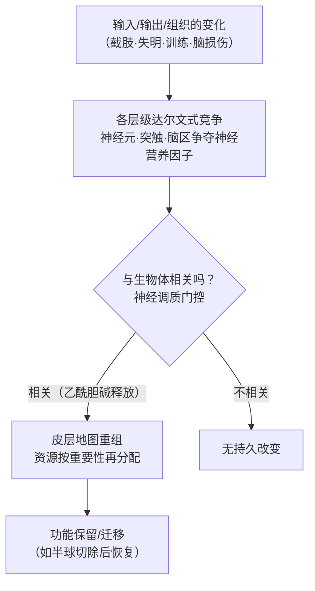
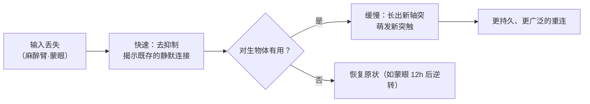
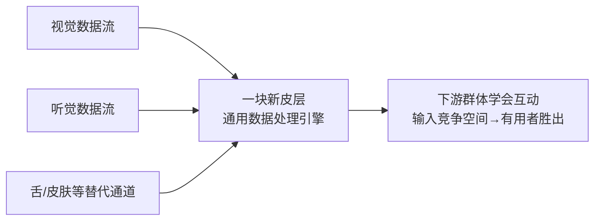

# 第4章 神经可塑性 · 详解（Neuroplasticity）

> 《脑与行为：认知神经科学视角》Eagleman & Downar (2016)
> 本章以"半个大脑的孩子"起笔：患拉斯穆森脑炎的 6 岁男孩 Matthew 接受了**半球切除术**（切除整个大脑半球），空腔被脑脊液填满，可他此后几乎无认知或行为缺陷地正常生活——因为剩下的半脑**动态重连**、接管了缺失功能。全章由此确立核心原则：**大脑不是硬布线的固定器官，而是按"对生物体的重要性"分配资源、在各层级进行达尔文式竞争的动态系统。**

---

## ① 概念解释

### 1.1 核心概念速查表

| 概念 | 英文 | 一句话解释 |
| --- | --- | --- |
| 可塑性 | plasticity | 大脑物理地改变并保持改变的能力（学习记忆之基） |
| 半球切除术 | hemispherectomy | 切除半个大脑；8 岁前施行常恢复良好 |
| 小人图 | homunculus | 身体在运动/感觉皮层上的地形图式表征 |
| 去传入 | deafferentation | 切断感觉输入，引发皮层大规模重组 |
| 幻肢 | phantom limb | 缺失肢体仍有感觉（皮层重组的知觉后果） |
| 适应性编码 | adaptive coding | 按生物体需要多分或少分神经资源 |
| 门控 | gating | 只在"重要之事"发生时才允许可塑性改变 |
| 神经调质 | neuromodulators | 弥散广播、标记奖惩与警觉、门控可塑性的化学信号 |
| 胆碱能 | cholinergic | 释放乙酰胆碱、驱动可塑性（源自基底前脑） |
| 敏感期 | sensitive period | 大脑最具可塑性的时间窗口，过后更难改变 |
| 化学亲和假说 | chemoaffinity hypothesis | Sperry：轴突按分子地址（梯度）预定连接 |
| 眼优势柱 | ocular dominance columns | 视皮层左右眼交替条纹，源于空间竞争 |
| 神经营养因子 | neurotrophins | 靶细胞分泌、决定神经元存活的"生命货币" |
| 凋亡/坏死 | apoptosis / necrosis | 受控/失控的细胞死亡（发育雕刻手段） |
| 感觉替代/添加 | sensory substitution / addition | 用异常通道向脑输入信息 / 增加新感觉 |

### 1.2 可塑性的核心逻辑：竞争→重组（示意图）

> 关键点：可塑性从突触分子到肉眼可见的大体解剖，遍及各层级。**核心是有限资源的"你死我活"竞争**——地图随生物体最重要的目标而重绘。

---

## ② 概念间关系

### 2.1 关系一览表

| 关系 | 内容 |
| --- | --- |
| 输入变化 → 皮层重组 | 截肢/失明后，闲置皮层被邻区接管（不"闲置浪费"） |
| 功能 ← 连接（非身份/位置） | 神经元的功能取决于其输入输出；获得相同连接即可接管功能 |
| 练习 ↔ 相关性（门控） | 光练习不够，还需神经调质（乙酰胆碱）标记"此事重要"才改变 |
| 注意 → 乙酰胆碱 → 可塑性 | 注意引发胆碱能释放；局部抑制确保只改该改之处 |
| 敏感期 ↔ 年龄 | 幼脑遍浸胆碱能、缺抑制，故普遍可塑；成脑靠注意局部门控 |
| 硬布线 ↔ 世界经验 | 基因给"粗略草图+一般机制"，经验精调为细节（先天×后天交织） |
| 快 vs 慢机制 | 快：解除抑制、揭示既存连接；慢：长出新轴突/新突触 |

### 2.2 皮层重组的两种时间尺度（示意图）

---

## ③ 提问-回答

**Q1：为什么切掉半个大脑还能几乎正常生活？**
因为神经元的**功能取决于连接、而非身份或位置**。剩余半脑通过突触/神经元层级的竞争，既快速"揭示"了原本被抑制的跨半球既存连接，又随时间长出新轴突、萌发新突触，从而在更小的地盘上重绘地图、接管缺失功能。Matthew 只有 6 岁、尚在敏感期且富余回路多，恢复尤佳。

**Q2：幻肢现象说明了什么？**
截肢后，原本代表手的皮层被邻近的脸部表征"侵入"，但接管不彻底——手所投射到的下游区域仍在"期待"手的信息。于是触碰脸颊/下颌会引发"幻手被触"之感。它揭示：**痛、暖、触虽感觉像embodied在肢体里，实则产生于大脑**——"无脑，无痛"。

**Q3："熟能生巧"够不够改变大脑？**
不够。关键更深的原则是**相关性**。实验：正常鼠练习两周使前爪皮层区扩大 30%、技能改善；而基底前脑胆碱能神经元被毁的鼠，同样练习该区反缩小 22%、准确率毫无长进。故可塑性不只靠重复，还需神经调质系统编码"任务的重要性"。

**Q4：为什么幼儿的脑更易改变？**
存在权衡：可塑 vs 高效。幼脑富含胆碱能递质、却缺少后来才出现的抑制性递质，因此呈现**无需注意聚焦的普遍可塑性**——像照片整体逐渐显影。成脑则靠注意引发的胆碱能释放加局部抑制，只在特定处改变，像点彩画家一点点上色。婴儿因而是人类的"研发部门"。

**Q5：先天基因与后天经验各占多少？**
Sperry 蝾螈实验（旋转眼球、视神经按原地址长回，蝾螈遂倒着看世界）证明连接的**大致布局由基因预设**（化学亲和假说），且经验无关。但人只有约 2.5 万个蛋白编码基因，不可能硬布线一切；基因像"高度压缩的食谱、标注'加世界经验以解压'"。经验（如自控运动的小猫才发育出正常视觉）是正确解包的必要条件。

---

## ④ 科学研究已确定的结论

### 4.1 可塑性的经典证据

| 现象/实验 | 观察 | 结论 |
| --- | --- | --- |
| 猴臂去传入 12 年 | 原臂区被响应脸部触觉的邻区接管 | 皮层地图随输入重组 |
| 人截肢/幻肢 | 触脸引发幻手感；改变越大痛越重 | 知觉产生于脑，非肢体 |
| 蒙眼 2 天 | 初级视皮层响应触/听；12h 后逆转 | 既存连接被快速揭示 |
| 先天盲 | 视皮层调谐至触/听，感觉更敏锐 | 脑按输入分配资源 |
| 猴精细/转钥匙训练 | 相应运动皮层区扩大、邻区缩小 | 行动与目标反映于脑结构 |
| 音乐家脑（Omega 征） | 键盘手/弦乐手脑不同、肉眼可辨 | 人生选择改变大体解剖 |

### 4.2 门控可塑性的神经调质机制

| 要素 | 作用 |
| --- | --- |
| 乙酰胆碱（胆碱能，源自基底前脑/基底核） | 学习任务时活跃，按奖惩强度驱动，标记"该改变了" |
| 电刺激胆碱能神经元 | 增强靶区可塑性；阻断则降低 |
| 局部抑制性递质 | 抵消胆碱能弥散效应，确保只改特定区 |
| 注意 | 引发更多乙酰胆碱释放，聚焦可塑性 |

### 4.3 神经竞争的两种生物机制

| 机制 | 例子 | 要点 |
| --- | --- | --- |
| 空间竞争 | 神经肌肉接头（多轴突→一轴突）、眼优势柱 | 一个位置只容一个胜者；活动依赖分离 |
| 营养因子竞争 | 神经生长因子/神经营养因子（Levi-Montalcini，1986 诺奖） | 靶细胞分泌"生命货币"；得之者生，失之者凋亡 |

### 4.4 已确定的结论清单

- 皮层重组即使在成年也持续，且遍及分子到大体解剖各层级。
- 中风失语常随时间部分恢复，机制是语言功能**迁移至右半球**（后续右侧中风会重损恢复的语言）。
- 地图能压缩、拉伸、交替以适配可用组织（青蛙视顶盖切半/移植第三眼实验）。
- 发育中产生多出约 50% 的神经元；未能竞得营养因子者大量凋亡（受控死亡，避免殃及邻居）。
- 敏感期真实存在：斜视性弱视、二语习得、语音音位辨别均随年龄下降。
- 输入通道可替换：视觉输入改道至雪貂听皮层，听皮层遂"看"；新皮层像通用数据处理引擎。
- 感觉替代（BrainPort 舌电极助盲人"看"、攀岩）与感觉添加（eyeborg 听颜色、含紫外红外）皆源于可塑性。

---

## ⑤ 开放性未解决的问题与研究方向

### 5.1 本章相关的开放问题与前沿

| 开放问题/方向 | 描述 |
| --- | --- |
| 先天×后天如何精确交织？ | 经验依赖与经验独立的相互作用复杂；"灵活与基因控制并不对立"仍待厘清 |
| 少基因如何造复杂脑？ | 仅约 2.5 万蛋白编码基因如何建千亿神经元的脑——基因组像压缩文件、细胞机器是解压器 |
| 敏感期由何决定？ | 不同功能敏感期不同（音位早于词汇），其分子闸门与可重开性仍在研究 |
| 直接脑机接口 | 或可把信息流（天气、股市数据）直接接入皮层，令其成为新知觉 |
| 感觉添加的边界 | 基因工程小鼠/猴获新色觉；人类 DIY 感觉扩展能走多远 |
| 可重构机器 | 借动态重组原理造"不预设全部细节、用与世界互动完成布线"的计算机/装置 |

### 5.2 快慢机制与感觉替代/添加对照

| 维度 | 快速机制 | 缓慢机制 |
| --- | --- | --- |
| 本质 | 解除抑制、揭示既存静默连接 | 长出新轴突、萌发新突触 |
| 时程 | 数小时至数天 | 数周至数月/年 |
| 触发 | 输入突然丢失 | 短期改变被证明有用后接续 |
| 数量 | 静默连接数量有限 | 支持更广泛持久的重连 |

### 5.3 通用皮层：任何输入都能被"读懂"（示意图）

---

## ⑥ 完整性核对（对照原文 KEY PRINCIPLES）

> 严格校验：本详解逐条覆盖第 4 章章末 8 条 KEY PRINCIPLES（原文第 11660 行起），无遗漏。

| # | 原文 KEY PRINCIPLE（要点） | 本详解对应位置 |
| --- | --- | --- |
| 1 | 大脑动态重组回路以适应感觉输入的变化 | 引子 + ①1.2 + ④4.1 + Q2 |
| 2 | 大脑重组以支持输出变化，经可塑性门控神经调质按相关性分配资源 | ②2.1 + ④4.2 + Q3 |
| 3 | 神经通路自我调整以适配可用脑组织；神经元功能源于输入输出而非身份/位置；相似连接可行相似功能 | ④4.4（地图压缩/失语） + Q1 |
| 4 | 存在敏感期，此时脑最具可塑性；幼脑更灵活、更少专门化 | ①1.1 + Q4 + ④4.4 |
| 5 | 回路的极一般布局由基因编程，真实世界经验将其精调为更细的程序 | ②2.1 + Q5 |
| 6 | 发育早期，神经元与突触必须成功竞争生长因子，否则死亡 | ④4.3 + ④4.4（凋亡） |
| 7 | 可塑性改变兼用快与慢两种机制 | ②2.2 + ⑤5.2 |
| 8 | 大脑"包裹"有用输入，开启感觉替代之门；神经系统可塑性或助开发直连大脑的先进设备以扩展人类能力 | ④4.4 + ⑤5.1/5.3 |

---

## ⑦ 认知偏差 · 成因(Why) · 对策
> 本章的核心正是推翻"大脑硬布线、成年不可变"的旧观念——所纠正的误区多源于把脑当作功能固定、位置天定的静态器官，对策=可塑性、竞争重绘与敏感期证据。

| 认知偏差 / 误区 | 成因（Why） | 解决方案 / 对策 |
| --- | --- | --- |
| "成年大脑固定不可改变" | 神经元有丝分裂后不再分裂，被误推为整脑结构也定型 | 皮层重组终生持续、遍及分子到大体解剖：中风失语迁至右半球、音乐家脑肉眼可辨、猴训练后运动区扩大 |
| "脑区功能天生固定、位置决定身份" | 小人图等定位图给人"一区一功能、写死"的印象 | 神经元功能取决于输入输出连接、而非身份或位置；获相同连接即可接管——半球切除后剩余半脑重绘地图 |
| "关键期一过就彻底无法学习/恢复" | 把"敏感期"误读为不可逾越的硬闸门 | 敏感期真实存在（弱视、二语、音位辨别随龄下降），但成脑仍靠注意引发的胆碱能门控实现局部可塑，恢复只是更难非不可能 |
| "熟能生巧——光靠重复练习就能改变大脑" | 直觉将练习量等同于脑改变量 | 还需相关性门控：胆碱能被毁的鼠同等练习反使皮层区缩小 22%；可塑性需神经调质标记"此事重要" |
| "痛/触/暖等感觉真实存在于肢体中" | 感觉主观上"定位"于身体部位 | 幻肢证明知觉产生于大脑而非肢体——"无脑，无痛"；截肢后邻区侵入手区致触脸引发幻手感 |
| "基因把大脑一切细节都硬布线好了" | Sperry 化学亲和实验证明布局由基因预设，易被推广为"全部预设" | 仅约 2.5 万蛋白编码基因不可能写死千亿神经元；基因是"压缩食谱、须加世界经验解压"，经验是正确解包的必要条件 |

*本详解忠于第 4 章原文（STARTING OUT 半脑男孩引子、动态重组、按相关性分配资源、使用可用组织、敏感期、硬布线vs经验、重组机制、更换输入通道各节及幻肢/BrainPort/eyeborg 等案例）与章末 KEY PRINCIPLES / KEY TERMS 整理，术语中英并列，OCR 拼写已据常识还原。*
