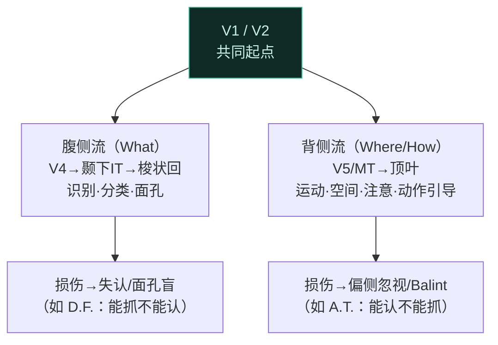
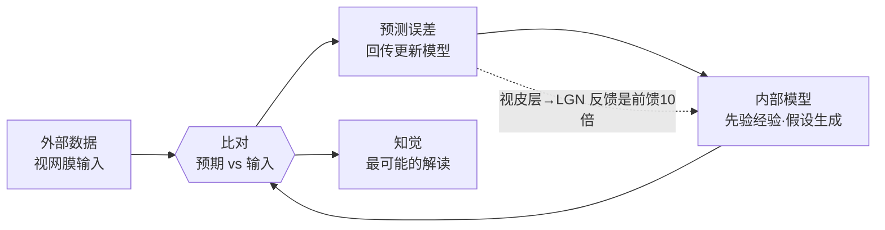

# 第5章 视觉 · 详解（Vision）

> 《脑与行为：认知神经科学视角》Eagleman & Downar (2016)
> 本章以盲人滑雪冠军 Mike May 起笔：一次化学爆炸令他 3 岁失明，四十多岁角膜移植手术成功、光线重新照进视网膜，可他望着儿子的脸却**只看到一片视觉噪声**——因为大脑不知道如何解读这些信号。由此确立本章核心立场：**"看见"不是免费的**，视觉与眼睛关系甚少，我们看到的不是"外界真实存在之物"，而是**大脑构建的内部模型**。本章沿视网膜→LGN→V1→腹侧/背侧流的通路，展示视觉的层级结构，最后揭示知觉是主动、循环、依赖预期的推断过程。

---

## ① 概念解释

### 1.1 核心概念速查表

| 概念 | 英文 | 一句话解释 |
| --- | --- | --- |
| 感觉转导 | sensory transduction | 光子经视杆/视锥细胞转为神经电信号的过程（光转导） |
| 视杆与视锥 | rods & cones | 视杆约 9000 万、对暗光敏、无色觉、低空间分辨；视锥约 450 万、亮光工作、三种对应红/绿/蓝、高空间分辨 |
| 中央凹 | fovea | 视网膜中央、视锥密集、空间分辨率最高的区域 |
| 感受野 | receptive field | 能调制某神经元活动的那块视觉空间 |
| 中心-周边结构 | center-surround | 视网膜节细胞感受野结构，专测明暗边缘、实现对比增强 |
| 视神经/视交叉 | optic nerve / chiasm | 节细胞轴突汇成视神经，在视交叉处鼻侧纤维交叉到对侧 |
| 外侧膝状体 | LGN | 丘脑中继站，含大细胞层（深度/亮度/运动）与小细胞层（形状/颜色） |
| 初级视皮层 V1 | primary visual cortex | 又称纹状皮层；神经元朝向调谐、含简单/复杂细胞、视网膜拓扑组织 |
| 视网膜拓扑 | retinotopic | 相邻神经元对应视野中相邻位置的映射方式 |
| 立体视觉 | stereo vision | 利用两眼视差（disparity）计算三维深度 |
| 层级 | hierarchy | 沿通路上行，神经元响应越来越抽象的刺激 |
| 腹侧流 | ventral stream | "什么"通路：识别、分类物体，达颞下皮层 |
| 背侧流 | dorsal stream | "哪里/如何"通路：空间位置、与物体互动，达顶叶 |
| 无意识推断 | unconscious inference | 大脑基于先验经验对输入做"最可能"解读（Helmholtz） |
| 循环/回路性 | recurrence / loopiness | 前馈与反馈一样多，视觉系统是内外信号交汇的环路 |

### 1.2 视觉通路层级（Mermaid）

```mermaid
flowchart LR
  R["视网膜<br/>视杆/视锥→节细胞<br/>中心-周边感受野"] --> C["视交叉<br/>鼻侧纤维交叉"]
  C --> L["LGN（丘脑）<br/>大细胞层/小细胞层"]
  L --> V1["V1 纹状皮层<br/>朝向调谐·简单/复杂细胞"]
  V1 --> V2["V2<br/>错觉轮廓·曲线"]
  V2 --> VEN["腹侧流→V4→颞下(IT)<br/>"什么"：物体/面孔"]
  V2 --> DOR["背侧流→V5/MT→顶叶<br/>"哪里/如何"：运动/空间/注意"]
  classDef hi fill:#123,stroke:#4f9cf9,color:#dce9f7;
  class V1 hi;
```

> 关键点：信号沿层级上行，感受野越来越大、刺激越来越抽象——从视网膜的"光点"到 IT 的"面孔识别"。但层级并不完整：连接是**相互（reciprocal）**的，高层向低层回投，且大脑大量使用**并行处理**。

---

## ② 概念间关系

### 2.1 关系一览表

| 关系 | 内容 |
| --- | --- |
| 转导 → 层级 → 知觉 | 光子先被转导为信号，再沿层级逐步抽象，但知觉并非"到达终点线"才产生 |
| 视杆/视锥 → 大/小细胞 → 背/腹侧流 | 视杆经大细胞（magno）供给背侧流"运动/深度"；视锥经小细胞（parvo）供给腹侧流"形状/颜色" |
| 两眼分离 → V1 汇合 → 立体视 | 两眼信号在 LGN 与 V1 前始终分离，V1 首次汇合，利用视差算出三维 |
| 层级损伤 → 缺失严重程度递增 | 损低层→失明（暗点）；损高层→特异缺失（面孔盲、运动盲） |
| 前馈 ↔ 反馈（循环） | 视皮层向 LGN 投射的轴突是反向的 10 倍，发送"预测"，回传"预测误差" |
| 外部数据 ↔ 内部模型 | 知觉=外部输入与内部预期的比对；做梦/幻觉是"内部模型脱锚" |

### 2.2 腹侧流 vs 背侧流（Mermaid）



---

## ③ 提问-回答

**Q1：Mike May 手术成功、光线进入视网膜，为什么还"看不见"？**
因为**看见不是免费的**。光子成功转导为信号并到达视皮层，但他的大脑没有可与新输入比对的**内部模型**——多年失明使视觉系统未曾训练。经过数周主动练习（伸手触摸、敲击物体），他把预期与输入对齐后，才"看见了光"。这说明视觉需要练习与内部预期。

**Q2：马赫带（Mach bands）和赫尔曼栅格错觉从何而来？**
来自视网膜节细胞的**中心-周边感受野**与对比增强。落在较亮马赫带上的感受野，因部分周边处于较暗区、受抑制较少，故响应更强（更亮）；落在较暗带上的感受野受周边抑制更多（更暗）。栅格交叉点的抑制性周边接收更多光，故响应减弱、显灰点。

**Q3：为什么整个右视野都由左半球处理，而非"左眼给右脑"？**
因为在**视交叉**处，携带右视野信息的纤维（右眼鼻侧 + 左眼颞侧对应右视野的部分……）交叉/不交叉后被按**视野**而非按眼重新分选。结果：整个右视野由左半球处理，整个左视野由右半球处理，与信息由哪只眼捕获无关。

**Q4：运动盲（motion blindness）患者说明了什么？**
1978 年 Melissa 因一氧化碳中毒损伤 V5，能看物体与位置却看不到运动，世界像"频闪快照"。这揭示**运动与位置对大脑是可分离的**：对物理学家运动=位置变化，对大脑运动是"画上去"的——正如瀑布错觉、旋转的蛇：静止图像若恰当激活运动探测器，就能看到运动。

**Q5：盲视（blindsight）与 Anton 综合征分别揭示了什么？**
盲视：V1 受损者主观"看不见"，猜测却显著高于概率——约 10% 视网膜输出绕过 LGN，经上丘、杏仁核、丘脑枕，足以携带无意识视觉。Anton 综合征：卒中致盲却**否认失明**，因内部模型仍在运转、只是脱离了外界锚定——本质上等同于把做梦入侵到清醒状态。二者都证明"看见"依赖多个脑区与内部模型，而非单纯视皮层完整。

---

## ④ 科学研究已确定的结论

### 4.1 视觉通路各站功能表

| 结构 | 英文 | 核心功能 |
| --- | --- | --- |
| 视网膜节细胞 | retinal ganglion cells | 中心-周边感受野，检测明暗边缘、对比增强 |
| 视交叉 | optic chiasm | 鼻侧纤维交叉，按视野重新分选（交叉后称视束） |
| LGN 大细胞层 | magnocellular | 处理视杆信息：深度、亮度、运动（→背侧流） |
| LGN 小细胞层 | parvocellular | 处理视锥信息：精细形状、颜色（→腹侧流） |
| V1 纹状皮层 | primary visual cortex | 朝向调谐、简单/复杂细胞、眼优势柱、超柱、立体视 |
| V2 | secondary | 更大感受野，响应错觉轮廓（Kanizsa 方形） |
| V4 / 颞下 IT | ventral tertiary | 复杂形状→物体/面孔（梭状回面孔区），位置/大小不变性 |
| V5/MT / 顶叶 | dorsal tertiary | 运动检测、空间关系、注意聚光灯引导 |

### 4.2 层级损伤 → 缺失对照表

| 损伤部位 | 缺失（英文） | 表现 |
| --- | --- | --- |
| 初级视皮层 V1 | scotomas | 暗点，视野内视力减退或完全失明 |
| 次级视皮层 V2 | visual agnosias | 物体识别/意义丧失 |
| 颞下皮层（腹侧）| prosopagnosia | 面孔盲：见五官却认不出脸 |
| V5/运动区（背侧）| motion blindness | 运动盲：世界如快照 |
| 顶叶双侧（背侧）| Balint / hemineglect | 注意转向障碍、同时失认、偏侧忽视 |

### 4.3 编码策略与其它结论

| 编码 | 英文 | 说明 |
| --- | --- | --- |
| 稀疏编码 | sparse coding | 少量邻近神经元响应特定刺激（如熟悉面孔），越熟悉越稀疏 |
| 群体编码 | population coding | 大量神经元以不同程度响应（如房屋、一般形状） |

- 约 **30% 皮层**用于视觉（触觉 8%、听觉 3%），远超其他感觉。
- 立体视：随机点立体图证明**深度计算不需物体识别**，视差本身即可产生深度（Julesz）。
- V1 朝向调谐由 Hubel & Wiesel 意外发现；简单细胞对特定位置+朝向，复杂细胞对任意位置的朝向。
- 视皮层→LGN 的反馈轴突是前馈的 **10 倍**，符合"发送预测、回传误差"的循环模型。
- **感觉≠知觉**：感觉是信号检测，知觉需内部模型不断比对。

---

## ⑤ 开放性未解决的问题与研究方向

### 5.1 本章明确抛出的开放问题

| 开放问题 | 方向描述 |
| --- | --- |
| 视网膜"语言"如何破译？ | 视网膜编码极复杂、至今大部分未解，制约仿生视网膜芯片分辨率提升 |
| 盲视的机制？ | 皮层下通路（上丘/丘脑枕/杏仁核）如何在 V1 受损时携带无意识视觉，尚不明确 |
| 绑定问题 | 分散特征如何整合为统一知觉，本章未解、留待后续 |
| 循环网络如何理解？ | 前馈=反馈的大规模循环网络难研究（人更擅长想"流水线"），是最有前景方向之一 |
| 内部模型与意识 | "知觉只在预期匹配输入时产生"等框架，可能是理解意识的钥匙 |

### 5.2 主动知觉的证据（研究方向）

| 现象 | 英文 | 说明 |
| --- | --- | --- |
| 眼动审讯场景 | Yarbus 实验 | 不同问题使眼睛以不同轨迹搜索画面——视觉是主动的 |
| 盲点 | blind spot | 每眼一处无感光区（可容 17 个月亮），大脑"填充"使人无感 |
| 多稳态知觉 | multistability | Necker 立方体等在解读间来回翻转 |
| 双眼竞争 | binocular rivalry | 两眼图像迥异时，知觉在高层表征间竞争，赢者通吃 |
| 变化盲视 | change blindness | 只把外界一小片纳入内部模型，故察觉不到大变化 |

### 5.3 主动、循环的视觉模型（Mermaid）



---

## ⑥ 完整性核对（对照原文 KEY PRINCIPLES）

> 严格校验：本详解逐条覆盖第 5 章章末 9 条 KEY PRINCIPLES（原文第 14168 行起），无遗漏。

| # | 原文 KEY PRINCIPLE（要点） | 本详解对应位置 |
| --- | --- | --- |
| 1 | 看似毫不费力，但约 30% 的大脑用于构建视觉 | 引子 + ④4.3 结论 |
| 2 | 视网膜感光细胞把光子转导为神经信号，上行至视觉系统高层 | ①1.1 转导 + ①1.2 图 + ④4.1 |
| 3 | 视觉系统是层级的，从精细细节构建到更大概念 | ①1.2 图 + ②2.1 + Q4 |
| 4 | 损伤低层→缺乏感觉（失明），损伤越高→越特异的知觉缺失（能看但不能识别） | ④4.2 损伤表 + Q5 |
| 5 | 信息越抽象越分两条流：腹侧流（是什么）、背侧流（在哪/如何互动） | ②2.2 图 + ④4.1 |
| 6 | 视觉是主动而非被动的：我们无意识地用眼睛审讯世界，把细节拉入内部模型 | ⑤5.2 表 + Q1 + ⑤5.3 图 |
| 7 | 视觉场景依赖内部生成的活动，与外界数据同等重要 | ①循环 + Q5(Anton) + ⑤5.3 |
| 8 | 视觉系统同时含前馈与反馈投射，是"回路性"的 | ②2.1 前馈↔反馈 + ⑤5.3 图 + ④结论 |
| 9 | 我们所见很大程度来自无意识推断——对"外界为何"的预期 | ①无意识推断 + ⑤5.3 + 结论 |

---

## ⑦ 认知偏差 · 成因(Why) · 对策

> 本章反复证明"看=被动接收"是错的：视觉是大脑主动构建的内部模型，因此它天然带有系统性偏差。下表列出本章真正涉及的知觉错觉与误区，各给成因与对策，忠于原文立场——知觉的可靠性要靠外部测量与对照来担保，而非"眼见为实"。

| 认知偏差 / 错觉 | 成因（Why） | 解决方案 / 对策 |
| --- | --- | --- |
| 变化盲视（change blindness） | 大脑每刻只把外界一小片纳入内部模型，未被注意处并不实时更新，故大变化也察觉不到 | 承认视觉带宽有限；主动逐点"审讯"关键区域，用前后对照或叠加比对（difference view）检出变化 |
| 非注意导致的"视而不见"（inattentional blindness） | 注意是知觉的闸门，未获注意的信号进不了内部模型，等于没看见（如大猩猩实验） | 明确知道"看"需分配注意；重要目标用独立检查、清单或多人交叉观察，不依赖"应该会注意到" |
| 期望驱动的知觉（先入为主后才"看见"胡子男） | 知觉是无意识推断（Helmholtz）：大脑先生成最可能假设，输入被套进预期，故先有概念才"看清" | 意识到先入之见在塑造所见；先记录原始输入再解读，用盲法/他人独立判读消除期望污染 |
| 马赫带 / 对比错觉 | 视网膜中心-周边感受野做侧抑制、增强边缘对比，主观亮度≠物理亮度 | 知觉本就是"关系"而非绝对量；需绝对值时用光度计等仪器测量，不靠眼睛估读 |
| 填充（filling-in）与盲点 | 每眼有无感光的盲点，大脑据周边内容主动"填补"，令人对缺口毫无察觉 | 用单眼盲点实验主动暴露缺口；牢记"无缝主观体验"可能是构建物，不等于信息完整 |
| "看=被动接收"的误解 | 直觉以为眼睛像相机被动录像，忽视约 30% 皮层在主动构建、反馈投射多于前馈 | 采用"主动内部模型"视角：把知觉当作可错的假设，用测量、对照与多次采样校正 |

*本详解忠于第 5 章原文（STARTING OUT: Mike May 引子、视知觉、视觉系统解剖、仿生视网膜、高级视觉区、主动知觉、依赖预期各节）与章末 KEY PRINCIPLES / KEY TERMS，术语中英并列，OCR 拼写已据常识还原。*
