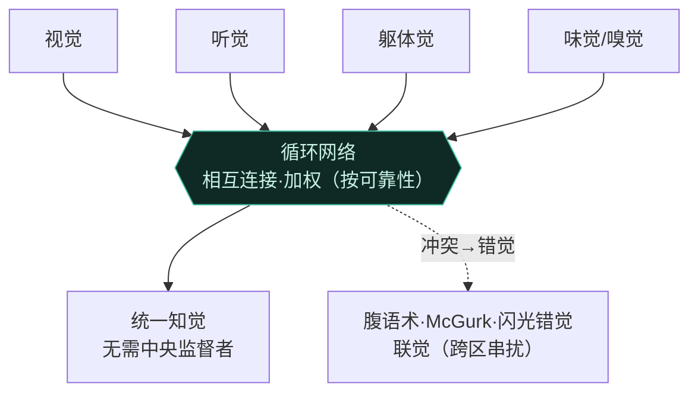

# 第6章 其他感觉 · 详解（Other Senses）

> 《脑与行为：认知神经科学视角》Eagleman & Downar (2016)
> 本章以"仿生耳之人"Michael Chorost 起笔：因风疹先天几乎全聋，人工耳蜗把外界声音绕过损坏的内耳、经 16 枚电极直送听神经。开机时第一句话像"Zzzzzz szz szvizzz ur brfzzzzzz?"，练习数月后才变成"你早饭吃了什么？"。由此把第 5 章视觉的**转导、层级、主动知觉**原理推广到**听觉、躯体感觉、化学感觉**，并进一步提出：大脑是**多感觉的**，它费尽周折把独立感官缝合成一个统一世界（绑定问题），最后连"时间"也是大脑构建的一种感觉。

---

## ① 概念解释

### 1.1 核心概念速查表

| 概念 | 英文 | 一句话解释 |
| --- | --- | --- |
| 转导 | transduction | 把外界能量转为体内神经代码（各感觉共同起点） |
| 心理物理学 | psychophysics | 系统改变物理刺激、测量对应知觉变化（韦伯定律、最小可觉差） |
| 基底膜 | basilar membrane | 耳蜗内按频率排布振动，形成音调拓扑图 |
| 内/外毛细胞 | inner/outer hair cells | 内毛细胞把声转为电信号；外毛细胞主动机械放大、锐化调谐 |
| 音调拓扑 | tonotopic | 相邻频率映射到皮层相邻位置（A1 的组织方式） |
| 标记线编码 | labeled line | 不同神经元只携带某一感觉的某一方面（如某频率、某视野点） |
| 前庭系统 | vestibular system | 半规管+耳石器，感知头部旋转、加速度、相对重力位置 |
| 躯体感觉 | somatosensory | 遍布全身的触觉、温度、痛觉、本体觉、内感受 |
| 机械/温度/伤害感受器 | mechano/thermo/nociceptors | 分别转导压力振动、温度、组织损伤（痛） |
| 本体觉 | proprioception | 身体自身位置与运动的感觉（肌梭、高尔基腱器官） |
| 内感受 | interoception | 感知身体内部状态（饥、渴、内脏、情绪） |
| 躯体拓扑 | somatotopic | S1 中的身体表面地图（小人 homunculus） |
| 化学感觉 | chemical senses | 味觉与嗅觉，靠分子结合、用模式编码（非标记线/非地图） |
| 多感觉/绑定问题 | multisensory / binding problem | 大脑如何把分离的感官整合成统一物体的知觉 |
| 时间知觉 | time perception | 跨越所有感觉的"元感觉"，是大脑的构建 |

### 1.2 听觉转导链（Mermaid）

> 关键点：所有感觉都先把外界能量**转导**为动作电位这一"通用货币"，再送入按感受器排布方式组织的**初级皮层**，然后由次级/三级皮层做更抽象的加工。

---

## ② 概念间关系

### 2.1 关系一览表

| 关系 | 内容 |
| --- | --- |
| 各感觉共享原理 | 都：转导→初级皮层地图→次级/三级抽象加工（视觉第5章原理推广） |
| 标记线 vs 模式编码 | 听/视/躯体觉用标记线（单神经元携单一信息）；味/嗅用群体模式编码 |
| 双通道 → 定位 | 两耳耳间时差/强度差→声源定位；两鼻孔到达时差→嗅源定位（同一策略） |
| 感受器分工 → 触觉丰富性 | 快/慢适应、深/浅、大/小感受野的机械感受器组合，产生细粗、快慢的触感 |
| 疼痛 = 上行信号 × 情境 | 伤害感受器信号 + 注意/情绪/内啡肽 → 闸门控制理论决定最终痛感 |
| 多感觉整合 ← 循环连接 | 前馈=反馈的循环连接让各感官互相影响，无需"中央监督者"即成统一知觉 |
| 统一知觉需要时间 | 各感觉处理速度不同，大脑"等最慢信号"，故知觉滞后于现实约1/10秒 |

### 2.2 多感觉整合与绑定问题（Mermaid）

---

## ③ 提问-回答

**Q1：人工耳蜗为什么开机时只听到"Zzzzz"、几个月后才能听懂？**
因为**听见和看见一样不是免费的**。耳蜗植入绕过损坏内耳、经 16 电极把声音直送听神经，但这是"电信号外语"，大脑必须学着解读。经数月练习，Michael 的大脑才把"Zzzzzz szz szvizzz ur brfzzzzzz?"解读为"你早饭吃了什么？"——转导只是第一步，知觉需要训练。

**Q2：基底膜为什么一端窄紧、一端宽松？这对功能有何关键？**
这使**不同频率激活不同部位**：基部窄紧对高频、顶部宽松对低频，形成**音调拓扑图**，把复杂声音分解为组分频率。相邻毛细胞特征频率仅差 0.2%（钢琴相邻琴键差 6%）。这样每个频率只激活一小群毛细胞与对应听神经纤维，构成"标记线"编码。

**Q3：味觉/嗅觉的编码为什么与视觉/听觉不同？**
味嗅是**化学**感觉，靠分子与受体（多为 GPCR）结合。每个嗅受体神经元只表达一种受体，但每种受体能响应多种带同一分子特征的气味分子，因此用**群体模式编码**（哪些受体被激活的组合）而非标记线或地图，才能分辨成千上万种刺激。嗅觉还独特地**不经丘脑**、直达皮层，故能直接影响记忆与情绪。

**Q4：疼痛为什么"因人因境而异"，甚至可无明显来源？**
因为伤害感受器的上行信号只是痛觉的一部分。**闸门控制理论**：痛感取决于伤害性与非伤害性通路活动的平衡，信息在脊髓汇聚，容量有限——过载则"闸门"关闭、阻断更多痛；负面情绪等则使该区敏化。故情境、注意、内啡肽都调节最终痛感，甚至出现神经病理性疼痛（无伤害感受器来源）。

**Q5：为什么"当下"其实滞后于现实？大脑如何解决时间绑定？**
不同感觉由不同神经架构以不同速度处理。要正确判断时序，视觉系统只能**等最慢的信息到达**——约 1/10 秒。这就是电视音画同步有约 100 毫秒容差的原因。碰你的脚趾和鼻子会觉得同时（尽管鼻信号先到），因为大脑等齐了最慢信号。代价是知觉"活在过去"，像有小延时的直播。

---

## ④ 科学研究已确定的结论

### 4.1 感觉系统对比表

| 感觉 | 转导器 | 初级皮层地图 | 编码策略 |
| --- | --- | --- | --- |
| 视觉 | 视杆/视锥（光子） | V1 视网膜拓扑 | 标记线 |
| 听觉 | 内毛细胞（振动） | A1 音调拓扑 | 标记线（按频率） |
| 躯体觉 | 机械/温度/伤害感受器 | S1 躯体拓扑（小人） | 标记线（按身体部位） |
| 味觉 | 味细胞（分子/GPCR） | 额岛盖/前岛 | 群体模式编码 |
| 嗅觉 | 嗅受体神经元（GPCR） | 鼻脑（不经丘脑） | 群体模式编码 |

### 4.2 躯体感觉五类信息表

| 类型 | 英文 | 感受器/机制 | 说明 |
| --- | --- | --- | --- |
| 触觉 | touch | 迈斯纳/默克尔（浅、小野）、帕西尼/鲁菲尼（深、大野） | 快/慢适应组合出细粗、振动的触感 |
| 温度 | temperature | 冷/暖温度感受器 | 检测相对体温的变化率；辣椒素→暖、薄荷醇→凉 |
| 痛觉 | pain | 伤害感受器（机械/热/化学/多觉/静息） | Aδ 快锐痛、C 纤维慢钝痛；闸门控制 |
| 本体觉 | proprioception | 肌梭（长度/速度）、高尔基腱器官（张力） | 缺失致命性（Ian Waterman：熄灯即倒地） |
| 内感受 | interoception | 内脏牵张/化学感受器 | 饥渴、内脏、"你感觉如何"、自我觉察基础 |

### 4.3 声源定位与前庭系统

| 机制 | 英文 | 说明 |
| --- | --- | --- |
| 耳间时差 | interaural timing | 定位短促声（哪耳先到）；巧合探测器（上橄榄核） |
| 耳间强度差 | interaural volume | 定位高频声（头挡住远耳） |
| 半规管 | semicircular canals | 三个互相正交，感知三维旋转与角加速度 |
| 耳石器 | otolith organs | 利用惯性感知线加速度与头部倾斜（水平/垂直） |
| 前庭-眼反射 | vestibulo-ocular reflex | 头动时反向补偿眼动，使视觉锁定目标 |

- **韦伯定律**跨感觉成立：最小可觉差是初始强度的固定比例。
- 人耳灵敏度接近物理极限：鼓膜可觉察小至一个氢原子直径的位移；灵敏度再高就会被空气分子随机运动淹没。
- **多感觉神经元**：同时/同位置的双模态线索使反应超过单模态之和；按可靠性加权（模态适宜性假说）。
- 联觉源于相邻脑区**串扰增加**（如字母-颜色联觉者听字母时 V4 更活跃），有遗传性，约 1/20 人。
- 时间与记忆紧密相连：危险时刻杏仁核令记忆更密集，回放时"显得更长"（自由落体实验：并非真"慢动作"）。

---

## ⑤ 开放性未解决的问题与研究方向

### 5.1 本章明确抛出的开放问题

| 开放问题 | 方向描述 |
| --- | --- |
| 绑定问题 | 无单一"汇聚"脑区，如何让分散感官整合成统一物体的知觉，仍未解 |
| 信息素在人类的作用 | 人鼻有与小鼠相同受体，行为证据存在（MHC/T恤实验），但影响程度未定 |
| 内感受与自我觉察 | 内感受通路如何区别于其他躯体信息、如何构成自我觉察的生理基础 |
| 大规模循环网络 | 前馈=反馈的富连接网络研究甚少，"孤立部件"式研究可能注定失败 |
| 时间障碍 | 时间构建系统受损会是什么样？失语/阅读障碍/精神分裂可能是时序问题 |
| 听力再生 | 2013 年小鼠内毛细胞再生使部分听力恢复，人类应用尚待研究 |

### 5.2 多感觉错觉（研究方向）

| 错觉/现象 | 英文 | 说明 |
| --- | --- | --- |
| 腹语术 | ventriloquism | 视觉俘获听觉定位，声音"来自"嘴的方向 |
| McGurk 效应 | McGurk effect | 音"ba"配唇形"ga"→听成"da"；睁眼即改变听觉 |
| 闪光错觉 | illusory flash | 一闪配两声→看成闪了两次（听觉俘获视觉） |
| 联觉 | synesthesia | 感官混合（听色、尝形），跨区串扰增强 |
| 病感失认 | anosognosia | 否认自身瘫痪/失明；前扣带监控冲突受损（Douglas 大法官案） |

---

## ⑥ 完整性核对（对照原文 KEY PRINCIPLES）

> 严格校验：本详解逐条覆盖第 6 章章末 8 条 KEY PRINCIPLES（原文第 17063 行"KEYPRINCIPLES"起，OCR 无空格），无遗漏。

| # | 原文 KEY PRINCIPLE（要点） | 本详解对应位置 |
| --- | --- | --- |
| 1 | 各感觉系统共享操作原理：感受器把数据转导为电信号 | ①1.1 转导 + ①1.2 图 + ④4.1 |
| 2 | 初级感觉区被次级/三级皮层环绕，加工层级递增抽象（音调→你最爱的歌） | ②2.1 + ④4.1 + ④4.2 |
| 3 | 声音是空气压力波，冲击鼓膜使之同频振动，最终经基底膜转导为神经信号 | ①1.2 听觉转导链 + Q2 |
| 4 | 除化学感觉外，多数感觉用标记线：每个神经元只携带一种感觉的一个方面 | ①标记线 + ②2.1 + ④4.1 |
| 5 | 躯体感觉=全身的感觉反馈：触觉、温度、痛觉、本体觉、内脏反馈 | ④4.2 五类信息表 |
| 6 | 化学感觉（味/嗅）按化学性质检测，用皮层激活模式而非标记线/地图 | Q3 + ④4.1 + ①化学感觉 |
| 7 | 大脑是多感觉的，最优整合各感官（甚至联觉）；绑定问题 | ②2.2 图 + ⑤5.2 + Q5 |
| 8 | 时间知觉涵盖其他感觉；不同输入处理速度不同，大脑构建统一时间知觉 | ①时间知觉 + Q5 + ④4.3 |

---

## ⑦ 认知偏差 · 成因(Why) · 对策

> 本章展示各感官并非"客观记录仪"：大脑最优整合多路输入并统一其时间线，这带来跨感官俘获与时序错觉。下表列出本章真正涉及的错觉与误区，各给成因与对策——对策的核心是多感觉整合意识、客观计时与交叉验证。

| 认知偏差 / 错觉 | 成因（Why） | 解决方案 / 对策 |
| --- | --- | --- |
| 麦格克效应（McGurk effect） | 大脑最优整合视听信息，视觉唇形改写了听觉音位，睁眼即听成不同音（ba+ga唇形→da） | 意识到"听"受视觉污染；需辨音时闭眼或单独呈现音频，用录音等单通道客观核对 |
| 时间顺序错觉 /"现在"滞后 | 不同感官处理速度不同，大脑事后重排并统一为一个"现在"，主观同时≠客观同时 | 用仪器客观计时（时间戳/示波器）判定先后，不靠"感觉哪个先"来推断因果或顺序 |
| "感官是客观记录"的误解 | 直觉以为感官如实照录世界，忽视各觉都在转导、编码并被主动整合（含腹语术、闪光错觉、联觉） | 树立多感觉整合意识：把每种感觉当作可被其他感官改写的估计，关键判断用交叉验证 |
| 病感失认（anosognosia） | 前扣带等监控冲突的系统受损，病人否认自身瘫痪/失明，主观确信与客观状态严重脱节 | 不以"病人自述无恙"为准；用客观行为测试与影像交叉核对，由第三方独立评估功能 |

*本详解忠于第 6 章原文（STARTING OUT: 仿生耳引子、检测世界数据、听觉、躯体感觉系统、化学感觉、大脑是多感觉的、时间知觉各节）与章末 KEY PRINCIPLES / KEY TERMS，术语中英并列，OCR 拼写已据常识还原。*
