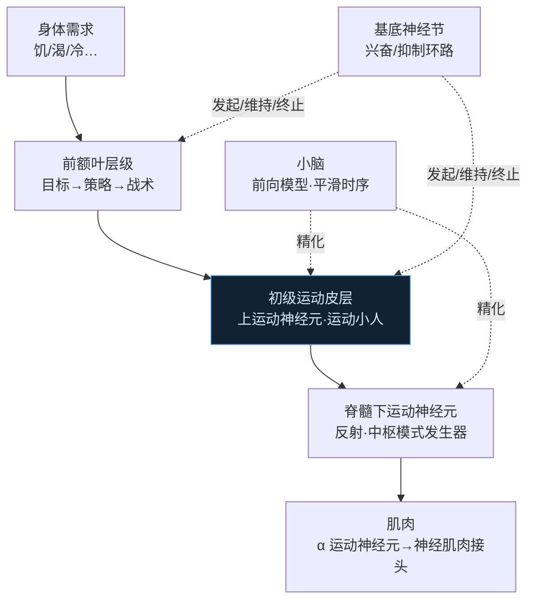

# 第7章 运动系统 · 详解（The Motor System）

> 《脑与行为：认知神经科学视角》Eagleman & Downar (2016)
> 本章以**闭锁综合征**起笔：《Elle》杂志主编 Jean-Dominique Bauby 因脑干卒中，意识清醒却几乎全身瘫痪，只剩左眼睑能动。他靠助理逐字母移指、他眨眼选字，以每字 2 分钟、二十万次眨眼，完成回忆录《潜水钟与蝴蝶》。这提醒我们：**运动是大脑几乎所有活动的最终目的**（看、听、导航、说话都为了行动）。本章自下而上讲运动控制层级：肌肉→脊髓（反射与中枢模式发生器）→小脑（前向模型）→初级运动皮层→前额叶（目标→策略→战术→动作），并以自由意志的神经科学收尾。

---

## ① 概念解释

### 1.1 核心概念速查表

| 概念 | 英文 | 一句话解释 |
| --- | --- | --- |
| 骨骼肌 | skeletal muscle | 大脑操纵外部环境的工具；拮抗肌成对（屈肌/伸肌） |
| 神经肌肉接头 | neuromuscular junction | 运动神经元与肌纤维的类突触，递质为乙酰胆碱 |
| 下运动神经元 | lower motor neurons | 脊髓腹角，α（驱动肌纤维）、γ（维持肌梭张力） |
| 运动单位 | motor unit | 一个 α 运动神经元及其支配的所有肌纤维；由小到大募集 |
| 脊髓反射 | spinal reflex | 最简单运动，如深腱反射（膝跳） |
| 中枢模式发生器 | central pattern generator | 脊髓振荡回路，自发产生行走等节律运动 |
| 皮质脊髓束 | corticospinal tract | 上运动神经元→下运动神经元，锥体交叉，人类精细运动主通路 |
| 小脑 | cerebellum | 神经元多于大脑其余部分总和；精化协调运动、前向模型 |
| 前向模型 | forward modeling | 预测信号到达时肢体/目标位置，克服神经传导延迟 |
| 初级运动皮层 | primary motor cortex | 中央前回，运动小人；按身体部位/动作类别/多维度组织 |
| 群体编码 | population coding | 众多神经元各有模糊方向偏好，合矢量得精确运动方向 |
| 前额叶层级 | prefrontal hierarchy | 需要→目标→策略→战术→动作，前后向层级控制 |
| 基底神经节 | basal ganglia | 兴奋/抑制皮层-皮层下环路，发起/维持/终止活动 |
| 内/外侧运动系统 | medial/lateral motor | 内侧受内部动机引导、外侧受外部感觉引导 |
| 准备电位 | readiness potential | 自主动作前 >1 秒即出现的脑活动（Libet 实验） |

### 1.2 运动控制层级（Mermaid）



> 关键点：这是**前后向层级**——长期目标层层分解为认知操作→前运动皮层的动作序列→运动皮层的具体运动→脊髓下运动神经元的肌肉收缩模式。基底神经节负责按正确顺序发起/维持/终止，小脑负责平滑时序。

---

## ② 概念间关系

### 2.1 关系一览表

| 关系 | 内容 |
| --- | --- |
| 运动是大脑活动的最终目的 | 看、听、导航、设目标、说话皆服务于行动；植物无运动故无神经元 |
| 上运动神经元 → 下运动神经元 → 肌肉 | 皮质脊髓束经锥体交叉，右半球控左侧身体；Bauby 卒中即伤锥体交叉 |
| 反射/CPG ← 下行调节 | 脊髓反射与节律运动本可自主，但受脑的下行运动通路调节，组合为随意运动 |
| 小脑前向模型 ↔ 运动+感觉 | 建前向模型需感觉与运动连接，小脑二者皆有海量输入 |
| 前后向层级 ↔ 内外侧并行 | 既有前→后的抽象层级，又有内侧（内部动机）/外侧（外部感觉）两套并行 |
| 基底神经节直接/间接通路 | 直接通路兴奋、间接通路抑制；亨廷顿（间接受损→多动）vs 帕金森（多巴胺缺失→少动） |
| 意图 ≠ 运动指令 | 准备电位早于意识意图；意图更像"感觉"（顶叶），运动无意识地发生 |

### 2.2 基底神经节直接/间接通路（Mermaid）

```mermaid
flowchart TB
  CTX["皮层"] --> STR["纹状体<br/>（尾状核+壳核）"]
  STR -->|"直接通路（兴奋总效应）"| GPi["内侧苍白球"]
  STR -->|"间接通路（抑制总效应）"| GPe["外侧苍白球→丘脑底核"]
  GPe --> GPi
  SN["黑质<br/>多巴胺输入"] -. "调节" .-> STR
  GPi --> TH["丘脑"] --> CTX
  HD["亨廷顿：间接通路先损<br/>→舞蹈样多动"] -. .-> STR
  PD["帕金森：多巴胺缺失<br/>→僵直/静止性震颤/少动"] -. .-> SN
  classDef hub fill:#0f2a24,stroke:#3fbf9f,color:#c8f0e4;
  class STR hub;
```

---

## ③ 提问-回答

**Q1：闭锁综合征为什么会发生？Bauby 为何只剩眼睑能动？**
脑干（延髓锥体水平）卒中损伤了**锥体交叉**——几乎全部运动输出都经此"瓶颈"。因此皮层无法向身体几乎任何部位发指令，产生近乎全瘫。控制眼肌的部分脑神经在锥体交叉**上方**离开脑干，故得以幸免，Bauby 才能靠左眼睑眨眼"口述"回忆录。

**Q2：脊髓离断的猫为何还能在跑步机上走？这说明什么？**
Graham Brown 发现，即使切断脑干、隔绝所有下行输入，脊髓仍能产生简单行走动作。这证明脊髓神经元构成**中枢模式发生器**：兴奋性中间神经元驱动运动神经元，又逐渐激活抑制性中间神经元使自己关闭，形成振荡节律；跨中线的抑制中间神经元保证左右交替。人类更依赖下行控制，但基本节律回路仍在脊髓。

**Q3：小脑的"前向模型"要解决什么问题？**
神经传导有延迟。要接住快速飞来的球，你得把手伸向球**将要到**的位置，而非它现在的位置；而且每块肌肉延迟还不同。**前向模型**（源于工程学，如遥控月球车需提前发"停"信号）预测信号到达时肢体和目标的位置。小脑同时接收感觉与运动皮层的海量输入，恰好具备做前向模型的条件；小脑损伤者追踪移动目标困难，正符合此说。

**Q4：为什么初级运动皮层的"地图"如今变得如此难懂？**
经典运动小人基于极短（10–20 毫秒）阈值刺激。改用**持续刺激**（500 毫秒，更接近自然）后发现：①诱发的是完整动作（手到嘴、伸手抓握）而非单块肌肉抽动；②不同区按动作**类别**编码而非身体部位；③无明显方向群体编码，而是驱向共同的**最终姿势**；④与前运动皮层无明显边界。故运动皮层更像把众多运动"维度"（力、方向、姿势……）压到二维皮层片上，视情境显得部分躯体拓扑、部分姿势、部分类别。

**Q5：Libet 实验与顶叶刺激实验对"自由意志"意味着什么？**
Libet 发现自主动作前脑的**准备电位**早于意识意图约半秒以上；fMRI 更发现额极活动可在意识决定前 8–10 秒预测左右手选择。刺激实验进一步分离：刺激前运动皮层→产生动作但患者否认动了；刺激顶叶→产生"想动/已动"的**意图感**却毫无肌肉抽动。故意识意图更像一种**感觉**（顶叶）而非运动的原因——我们"自由"之感，或许只是顶叶一辈子练就的、对额叶下一步动作的预测。

---

## ④ 科学研究已确定的结论

### 4.1 运动控制层级表

| 层级 | 结构 | 功能 |
| --- | --- | --- |
| 肌肉 | 骨骼肌/神经肌肉接头 | 收缩执行；乙酰胆碱为递质 |
| 脊髓 | 下运动神经元/反射/CPG | 反射、节律运动，受下行调节 |
| 小脑 | 三层皮层（浦肯野细胞输出） | 精化协调、平滑时序、前向模型、亦有非运动功能 |
| 初级运动皮层 | M1（中央前回） | 向脊髓输出，按身体部位/动作类别组织 |
| 前额叶 | 前运动/背外侧/额极 | 目标→策略→战术→动作的控制层级 |
| 基底神经节 | 纹状体/苍白球/黑质 | 兴奋/抑制环路，发起/维持/终止活动 |

### 4.2 下行运动通路 & 神经肌肉药理

| 通路/物质 | 英文 | 作用 |
| --- | --- | --- |
| 皮质脊髓束 | corticospinal | 人类精细运动主通路，锥体交叉（80% 交叉为外侧束） |
| 红核脊髓束 | rubrospinal | 控制肢体（如二头肌/股四头肌），卒中后可代偿 |
| 前庭脊髓束 | vestibulospinal | 头颈躯干近端平衡 |
| 顶盖脊髓束 | tectospinal | 捕捉/回避移动目标（人类多被皮层接管） |
| 网状脊髓束 | reticulospinal | 惊跳与逃避反射 |
| 箭毒/罗库溴铵 | curare/rocuronium | 阻断乙酰胆碱受体→肌肉松弛（手术用） |
| 肉毒毒素 | botulinum toxin | 阻乙酰胆碱释放→瘫痪；微量即"Botox" |
| 士的宁/破伤风毒素 | strychnine/tetanospasmin | 阻断抑制→全身痉挛致死 |

### 4.3 基底神经节疾病 & 前额叶层级

| 疾病/层级 | 机制 | 表现 |
| --- | --- | --- |
| 亨廷顿病 | 尾状核/壳核变性，间接（抑制）通路先损 | 舞蹈样多动、去抑制、进行性痴呆、情绪失调 |
| 帕金森病 | 黑质多巴胺神经元丧失，间接通路过度活跃 | 僵直、运动迟缓、静止性震颤（深部脑刺激可缓解） |
| 感觉控制 | 前运动皮层 | 按感觉线索选反应（绿=走） |
| 情境控制 | 后外侧前额叶 | 按当前情境选规则 |
| 情节控制 | 前外侧前额叶 | 按当前情节选情境 |
| 分支控制 | 额极皮层 | 保持长期目标、多任务 |

- 上运动神经元用**群体编码**：单神经元方向偏好模糊（~90°），合矢量得精确方向。
- **镜像神经元**（腹侧前运动 F5）：自做动作与看他人做同一动作皆放电，需动作有目标；或为模仿/理解意图的基础。
- 顶叶多张**空间地图**（眼中心/头中心/臂中心/抓握），各连对应前额叶区。
- 内/外侧双系统：内侧（SMA/pre-SMA/额极）驱动**内部生成**（自定步调）动作；外侧驱动**外部线索**引导动作；损伤致失动性缄默或利用行为。
- 多任务难在运动控制的**串行架构**（须按序、一次一步），而感觉知觉是并行的、易多任务。

---

## ⑤ 开放性未解决的问题与研究方向

### 5.1 本章明确抛出的开放问题

| 开放问题 | 方向描述 |
| --- | --- |
| 运动皮层的组织原则 | 究竟按肌肉、方向、姿势还是多维度？群体编码与共同姿势之争未决 |
| 小脑计算功能 | 40 年提出多种模型（前向模型、滤波、学习算法），无共识；小脑亦管认知/情绪 |
| 基底神经节的共同计算 | 环路"抑制抑制者"极复杂，其统一计算本质仍在争论 |
| 镜像神经元的意义 | 是否为心智理论/模仿/语言演化基础，尚有争议 |
| 脑机接口 | 电极信号随胶质增生衰减、解码困难，仍不及 Bauby 的眨眼卡；21 世纪重大技术挑战 |
| 自由意志的本质 | 意识意图是感觉而非动因？"自由"之感的神经基础仍开放 |

### 5.2 意图与运动的分离（自由意志研究，Mermaid）

```mermaid
flowchart LR
  FP["额极活动<br/>决定前 8–10 秒可预测左右手"] --> RP["准备电位<br/>SMA/pre-SMA，动作前 >1 秒"]
  RP --> AW["意识意图<br/>约动作前 200 ms"]
  AW --> MV["实际动作"]
  PAR["刺激顶叶<br/>产生"意图/已动"感、无肌肉抽动"] -. "意图=感觉" .-> AW
  PM["刺激前运动皮层<br/>产生动作、患者否认动了"] -. "运动=无意识" .-> MV
  classDef hub fill:#241a2e,stroke:#c58bf0,color:#ecdcf7;
  class RP hub;
```

---

## ⑥ 完整性核对（对照原文 KEY PRINCIPLES）

> 严格校验：本详解逐条覆盖第 7 章章末 9 条 KEY PRINCIPLES（原文第 20165 行起），无遗漏。

| # | 原文 KEY PRINCIPLE（要点） | 本详解对应位置 |
| --- | --- | --- |
| 1 | 肌肉是大脑操纵外部环境的工具 | ①骨骼肌 + ②2.1 + ④4.1 |
| 2 | 运动动作电位经类突触的神经肌肉接头激活肌肉收缩的电化学机制 | ①神经肌肉接头 + ④4.2 |
| 3 | 脊髓运动神经元在反射弧与中枢模式发生器的简单回路中运作，受局部感觉与脑的下行调节 | ①脊髓反射/CPG + Q2 + ④4.1 |
| 4 | 小脑经前向模型进一步精化协调运动，并参与非运动功能 | ①前向模型 + Q3 + ④4.1 |
| 5 | 初级运动皮层向脊髓输出，按身体部位、动作类型、可能还有其他维度组织 | Q4 + ①群体编码 + ④4.1 |
| 6 | 前额叶提供运动控制层级：需要→更具体的目标、策略、战术、动作 | ①前额叶层级 + ①1.2 图 + ④4.3 |
| 7 | 基底神经节经兴奋/抑制的皮层-皮层下环路，发起并维持运动控制过程 | ②2.2 图 + ④4.3 + ①基底神经节 |
| 8 | 外侧运动区受外部感觉输入引导，内侧运动区受内部动机与优先级引导 | ①内/外侧运动系统 + ④结论 |
| 9 | 神经科学开始探索随意/非随意行为的机制，涉及对自由意志的理解 | ⑤5.2 图 + Q5 |

---

## ⑦ 认知偏差 · 成因(Why) · 对策

> 本章末节把运动与自由意志的直觉逐一拆解：意识意图更像一种"感觉"而非动因，运动的发起、代理感与他人意图判读都可被实验解离。下表列出本章真正涉及的错觉与误区，各给成因与对策——对策关键是意图-运动分离实验与前向模型视角。

| 认知偏差 / 错觉 | 成因（Why） | 解决方案 / 对策 |
| --- | --- | --- |
| 自由意志错觉（"我先决定才动"） | 准备电位与额极活动早于意识意图数秒出现，意识意图约在动作前 200 ms 才到，"决定"更像事后感觉 | 用意图-运动分离实验（Libet/额极解码）校正直觉；把意识意图当作对已启动过程的报告，而非因 |
| 异手 / 代理感错觉 | 刺激顶叶可产生"想动/已动"之感却无肌肉抽动，刺激前运动皮层可致真动作而患者否认——意图感与运动可分离 | 认识到代理感是独立生成的信号；靠客观运动记录而非主观"是我在动"来判定动作归属 |
| 对运动"毫不费力"的错觉 | 小脑经前向模型预测感觉后果并抵消，流畅协调被自动完成，掩盖了背后海量计算 | 采用前向模型视角：把顺滑当作预测成功的结果；由损伤/失衡（小脑病变）反推其真实计算负荷 |
| 镜像误读他人意图 | 镜像系统用自身运动表征去模拟他人动作，易把自己的目标/预期投射为对方的意图 | 意识到"读心"是内部模拟而非直读；对他人意图存疑并用外部证据核实，勿以己度人 |

*本详解忠于第 7 章原文（STARTING OUT: 闭锁综合征引子、肌肉、脊髓、小脑、运动皮层、前额叶、基底神经节、内外侧运动系统、自由意志各节）与章末 KEY PRINCIPLES / KEY TERMS，术语中英并列，OCR 拼写已据常识还原。*
