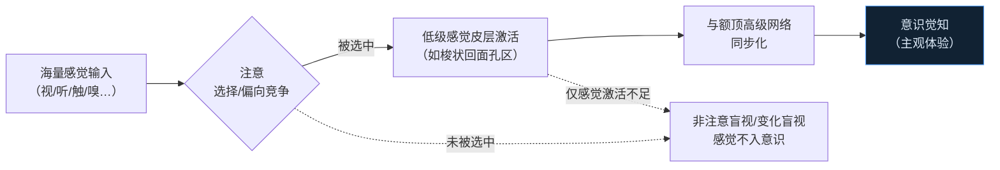
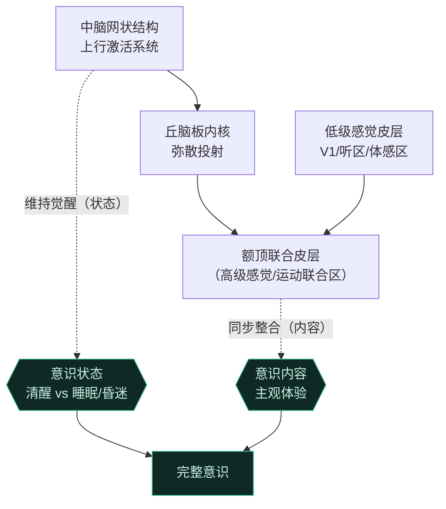
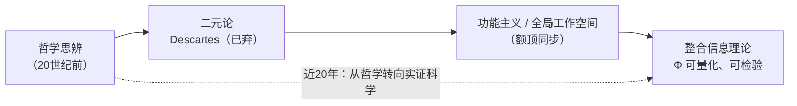

# 第8章 注意与意识 · 详解（Attention and Consciousness）

> 《脑与行为：认知神经科学视角》Eagleman & Downar (2016)
> 本章以"意识之流"起笔：闭上眼审视自己，皮肤的痒、牙齿的咬合、呼吸声——无数感觉本在意识门槛之下，一旦转移**注意**才浮上水面。感觉如溪面涟漪，转瞬即逝，其下涌动着永不浮出、"视而不见"的暗流。由此确立本章两条主线：**没有注意就没有觉知**；意识既有"内容"（contents），也有"状态"（state），二者分别由皮层高级联合区与脑干-丘脑深部结构支撑。

---

## ① 概念解释

### 1.1 核心概念速查表

| 概念 | 英文 | 一句话解释 |
| --- | --- | --- |
| 注意 | attention | 把感觉与行动整合、服务共同目的的选择过程；意识觉知的前提 |
| 觉知/意识内容 | awareness / contents of consciousness | 注意聚焦某片感觉环境时产生的主观体验 |
| 意识状态 | state of consciousness | 能否进行主观体验的大框架（清醒/睡眠/昏迷等） |
| 变化盲视 | change blindness | 视觉中断（翻页/闪烁/泥点）时，即使大变化也察觉不到 |
| 非注意盲视 | inattentional blindness | 注意在别处时，意料之外的显著刺激（如大猩猩）被完全忽略 |
| 隐性误导 | covert misdirection | 目光仍在物体上，但注意被引开，仍会漏看——魔术的原理 |
| 定向范式 | orienting paradigm | Posner 用有效/无效线索测反应时，量化视空间注意 |
| 奇异刺激范式 | oddball paradigm | 一串重复刺激中偶插入偏差刺激，测脑对"奇异项"的反应 |
| 知觉竞争 | perceptual rivalry | 同一刺激产生多种主观知觉（双眼竞争、老妇/少女图） |
| 自上而下/自下而上 | top-down / bottom-up | 主动聚焦（内源）vs 被显著刺激吸引（外源） |
| 意识的神经相关物 | neural correlates of consciousness | 与意识知觉相关的特定脑区或神经生理过程 |
| 偏向竞争模型 | biased-competition model | 众多神经元集群竞争主导活动，高级区自上而下偏向胜者 |
| 同步化 | synchronization | 远近神经元同时放电，可绑定特征、协调信息、支撑意识 |
| 半侧忽略 | hemineglect | 右顶叶损伤后忽视左半侧空间——注意本身的"盲" |
| 网状激活系统 | ascending reticular activating system | 中脑网状结构向丘脑/皮层的上行激活投射，维持觉醒 |
| 板内核 | intralaminar nuclei | 弥散投射的丘脑核，对维持意识状态至关重要 |
| 全局工作空间 | global workspace theory | 意识是把各专门处理器整合为一体的"全局工作台" |
| 整合信息理论 | integrated information theory (Φ) | 意识 = 信息量大 + 高度整合；用 Φ 量化 |

### 1.2 注意 → 意识：信息如何被筛选（示意图）

> 关键点：眼睛可直接注视文字，若注意在别处，文字仍不入意识。意识知觉不是被动接收，而是对世界一小片的**主动建构**。

---

## ② 概念间关系

### 2.1 关系一览表

| 关系 | 内容 |
| --- | --- |
| 注意 → 觉知（必要条件） | 没有注意就没有觉知；变化盲视/非注意盲视/魔术误导均为证据 |
| 意识内容 ↔ 意识状态 | 先要"在场"（清醒状态）才谈得上"体验什么"（内容）；二者由不同脑区支撑 |
| 低级感觉激活 + 额顶同步 → 主观体验 | 单纯感觉皮层激活不够，须与广布额顶网络同步方生觉知 |
| 偏向竞争 → 单神经元/群体效应 | 高级区自上而下偏向，增强信噪比、消除相关噪声、增高频同步 |
| 皮层网络（内容）vs 中脑-丘脑（状态） | 顶/额联合区损伤→忽略（内容缺陷）；中脑网状/板内核损伤→昏迷（状态缺陷） |
| 同步化 = 手段而非本质 | 全同步=癫痫发作反而失去意识；关键是同步带来的信息状态"曲目" |
| 各意识理论层层递进 | 二元论（已弃）→功能主义/全局工作空间→整合信息理论（Φ） |

### 2.2 意识的完整神经架构（内容+状态）（示意图）

---

## ③ 提问-回答

**Q1：为什么说"没有注意就没有觉知"？有哪些经典证据？**
三类证据：①**变化盲视**——飞行员在模拟着陆时竟没看到跑道上的大飞机；实验中约半数人没发现问路者被"换了个人"。②**非注意盲视**——数传球次数时近半数人没看到走过屏幕、捶胸的"大猩猩"。③脑成像证据——注意字母流时额顶颞网络会区分真词/假词；一旦转去注意图片，同一网络对真词假词不再区分，等于在没注意时"变盲"。

**Q2：定向范式和奇异刺激范式各测什么？**
**定向范式**（Posner）：中央注视，线索箭头预测目标位置——有效线索有"反应时收益"，无效线索有"反应时代价"，用**行为指标**量化视空间注意，可测自上而下（内源）与自下而上（外源）。**奇异刺激范式**：一串重复刺激里偶插偏差项，用 EEG/MEG/fMRI 测脑对奇异项的**生理反应**；插入"新异奇异项"可探非自主注意。二者互补，但都不直接测觉知本身。

**Q3：半侧忽略（hemineglect）为何证明它是注意缺陷而非单纯失明？**
右顶叶损伤患者（如卡车司机 Timothy）只吃盘子右半、只读词的右半、画钟只画右半。关键证据：①跨越多种感觉通道（视、听、触甚至嗅）；②连**想象**的场景也忽略左侧（Bisiach 的米兰广场实验，忽略的建筑随想象视角改变）；③纯感觉损伤者知道自己缺陷并设法补偿，忽略患者却"对注意本身盲"。故是注意/觉知的缺陷，不是感觉缺陷。

**Q4：为什么"广布同步化"不足以解释意识？同步化到底重要在哪？**
反例：①深睡的慢波是广布低频同步，却几乎无意识体验；②把全皮层同步到极致=癫痫大发作，患者完全失去意识。所以**同步本身不是关键**。真正重要的是同步带来的巨大"信息状态"曲目——如同 100 个 LED，各自独立是噪声，全体同步只有开/关两态，唯有部分协调才能表征海量图案。同步是让神经元组装成有用信息状态的**手段**。

**Q5：麻醉如何在不损伤脑结构的前提下抹去意识？**
麻醉剂经血流作用全脑，增强抑制或减弱兴奋，整体降低代谢。剂量足够时意识**突然**（翻转开关式，而非渐暗）消失。关键在丘脑：麻醉使丘脑神经元超极化、从紧张性放电转为爆发式放电，切断丘脑-皮层的功能同步（并非解剖连接受损）。动物实验中直接向板内核微量注射麻醉剂即可致无意识，反之电刺激板内核可唤醒。丘脑像"乐队指挥"，失去它皮层各区仍活跃却无法协同成有用整体。

---

## ④ 科学研究已确定的结论

### 4.1 意识状态谱系表

| 状态 | 英文 | 觉醒（睁眼/睡眠周期） | 觉知（主观体验） | 典型脑机制 |
| --- | --- | --- | --- | --- |
| 清醒 | wakefulness | 有 | 有 | 网状结构高频紧张放电，皮层高频低幅 |
| REM 睡眠 | REM sleep | 睡眠中 | 有（生动梦） | EEG 近似清醒（"矛盾睡眠"） |
| 非REM 深睡 | non-REM sleep | 睡眠中 | 极弱/无 | 低频高幅慢波，皮层去耦合 |
| 麻醉 | anesthesia | 无 | 无 | 代谢降至~40%，丘脑下移、皮层去同步 |
| 昏迷 | coma | 无（不能唤醒） | 无 | 中脑网状/上脑桥或丘脑损伤，代谢~50% |
| 植物状态 | vegetative state | 有（睡醒周期） | 无 | 高级联合区活动缺失，低级感觉区可应答 |
| 最小意识状态 | minimally conscious state | 有 | 波动微弱 | 板内核等受损，深部电刺激可部分唤醒 |
| 脑死亡 | brain death | 无 | 无 | "空颅"PET、平线 EEG，不可逆 |

### 4.2 注意的神经机制（多尺度）

| 尺度 | 现象 | 关键发现 |
| --- | --- | --- |
| 大区域 | 意识相关网络 | 变化/非注意盲视、双眼竞争中，只有额顶联合区广布激活才产生觉知 |
| 单神经元 | 增益提升 | 注意增大对被注意刺激的反应增益，降低激活阈值，特征选择性不变（V4 面孔/房屋实验） |
| 神经群体 | 消除相关噪声 | 注意主要降低群体的**相关噪声**，个体放电仅微增而行为大幅改善 |
| 同步化 | 频段分工 | 注意增高 gamma(~40Hz)同步、降低 alpha(~10Hz)同步；增强远程皮层间同步 |
| 偏向竞争 | 集群竞争 | 同一脑区内多神经元集群竞争，高级区（如前额叶）自上而下偏向相关输入 |

### 4.3 意识理论对比表

| 理论 | 英文 | 核心主张 | 现状 |
| --- | --- | --- | --- |
| 二元论 | dualism (Descartes) | 心与身根本分离，心为非物质 | 神经科学基本抛弃（难解释非物质如何影响物质） |
| 功能主义 | functionalism | 心理状态取决于其功能角色而非"硬件" | 主流之一 |
| 高阶理论 | higher-order theory | 意识需对低阶表征的"高阶再表征" | 功能主义分支，尚存未解问题 |
| 全局工作空间 | global workspace theory | 意识是把各专门处理器整合为全局可用的"工作台" | 与额顶同步发现契合 |
| 整合信息理论 | integrated information theory | 意识=高信息量+高整合（Φ）；癫痫过度整合、麻醉整合丧失均致无意识 | 可经神经成像检验，实验进行中 |

### 4.4 已确定的结论清单

- **注意是觉知的前提**：变化盲视、非注意盲视、魔术误导、脑成像四路证据汇聚——不注意即不觉知。
- **注意把感觉与行动整合**以服务共同目的；此过程精细、易被疾病/药物/睡眠打断。
- **意识内容依赖广布额顶联合网络**：单纯低级感觉皮层激活不足以产生主观体验，须与高级网络同步。
- **注意在单神经元层提升信噪比、在群体层消除相关噪声**，显著改善行为表现。
- **意识状态由中脑网状结构与丘脑板内核维持**：损伤致昏迷；深部脑刺激（丘脑起搏器）可唤醒最小意识患者（Daniel 案例）。
- **改变放电模式（而非损伤结构）即可开关意识**：睡眠、麻醉均为例证。
- 二元论已被弃，功能主义/全局工作空间/整合信息理论为当代主要框架，尚无共识。

---

## ⑤ 开放性未解决的问题与研究方向

### 5.1 本章明确抛出的开放问题

| 开放问题 | 方向描述 |
| --- | --- |
| "难问题"：为何有主观体验？ | 为何任何放电模式会产生"红不同于绿"的主观感受，仍无定论，或需未发现的科学新原理填补"解释鸿沟" |
| 高阶表征的"特殊"何在？ | 梭状回本身就是高阶表征，为何不足以生成感受？额顶高阶区到底特殊在哪，高阶理论说不清 |
| 单一注意网络还是多个？ | 早期设想统一注意网络，近十年发现随任务（空间/非空间、外部/内部）神经相关物差异极大 |
| "有觉知却不自知"是否存在？ | 梭状回或产生感受但需额顶方能报告——需巧妙实验验证"awareness without awareness" |
| 高低频同步为何效果相反？ | 为何高频同步导向注意觉知、低频同步反之，机制未明 |
| 现有神经科学能否解释意识？ | 是否原则上可解释，抑或需全新科学原理，学界无共识 |
| 单一脑区网络为何产生不同节律？ | 丘脑等固定结构如何生成清醒/睡眠不同振荡及其转换 |

### 5.2 研究方法与工具（本章）

| 方法/工具 | 用途 |
| --- | --- |
| 定向范式 / 奇异刺激范式 | 行为/生理指标量化注意（含自上而下/自下而上） |
| 知觉竞争（双眼竞争、歧义图） | 感觉输入不变而知觉改变，分离意识知觉 |
| 掩蔽（masking） | 短暂闪现+掩蔽，制造有无意识知觉的对比 |
| 单细胞记录（猴 V4 微电极） | 观察注意对单神经元增益/阈值的影响 |
| 局部场电位 / EEG / MEG / fMRI | 群体同步、频段分析、意识状态对比 |
| TMS "回声"探测 | 向皮层发脉冲看其扩散——清醒时广布回响，睡眠/麻醉时局限 |
| 深部脑刺激（丘脑板内核） | 因果性恢复最小意识患者的意识水平 |

### 5.3 应用与前沿

| 方向 | 说明 |
| --- | --- |
| 唤醒受损大脑 | 丘脑深部脑刺激唤醒最小意识/植物状态患者（Daniel 案例） |
| 意识水平的客观评估 | 用 Φ 或 TMS-EEG 复杂度评估昏迷/植物状态患者残余意识 |
| 忽略症康复 | 冷水灌耳（前庭刺激）短暂缓解半侧忽略与躯体妄想（Sarina 案例） |
| 与魔术师合作 | 神经科学家借舞台误导技术设计新的注意实验 |

### 5.4 意识研究的历史转向（示意图）

---

## ⑥ 完整性核对（对照原文 KEY PRINCIPLES）

> 严格校验：本详解逐条覆盖第 8 章章末 **10 条** KEY PRINCIPLES（原文第 23227 行起），无遗漏。

| # | 原文 KEY PRINCIPLE（要点） | 本详解对应位置 |
| --- | --- | --- |
| 1 | 没有注意就没有对感觉或行动的意识觉知 | 引子 + ①1.2 图 + ②2.1 + Q1 |
| 2 | 注意把我们的感觉与行动联结起来服务共同目的 | ①注意词条 + ②2.1 |
| 3 | 研究者发展了实验方法：定向范式（反应时）、奇异刺激范式（脑活动）、知觉竞争（歧义刺激） | ④4.2 + ⑤5.2 + Q2 |
| 4 | 注意与觉知需要包括高级感觉/运动联合区在内的广布皮层网络的活动 | ①1.2 图 + ④4.2 + ④4.4 |
| 5 | 注意通过提高探测神经元放电率、并降低群体中无关背景"噪声"来改善刺激识别 | ④4.2（单神经元/群体）+ Q4 |
| 6 | 神经同步化帮助这些广布活动模式保持协调、区别于竞争模式 | ①同步化词条 + ④4.2 + Q4 |
| 7 | 特定脑区与机制维持意识状态 | ②2.2 图 + ④4.1 谱系 + Q5 |
| 8 | 这些机制可被损伤或药物打断，产生无意识状态而大脑结构大体完好 | ④4.1（昏迷/麻醉）+ Q5 |
| 9 | 解释意识如何由神经活动产生的理论包括：二元论（已被神经科学基本抛弃）、功能主义（意识源于脑活动的特定功能）、整合信息理论（意识收集并整合大量世界信息） | ④4.3 理论对比表 |
| 10 | （承上）功能主义与整合信息理论为当代主要探索方向，尚无共识 | ④4.3 + ④4.4 + ⑤5.1 |

---

## ⑦ 认知偏差 · 成因(Why) · 对策
> 本章最深刻的启示是：我们坚信"看见了整个世界"，实则只觉知到注意所及的一小片。以下系统性误区皆源于**注意容量有限 + 意识对自身盲区无感**；对策的共同内核是——承认盲区、主动扫描、多方核对，而非信任"眼见为实"的直觉。

| 认知偏差 / 错觉 | 成因（Why） | 解决方案 / 对策 |
| --- | --- | --- |
| 非注意盲视（inattentional blindness） | 注意在别处（数传球）时，意料之外的显著刺激（走过的"大猩猩"）根本不入意识——注意是觉知的前提，未被选中的感觉被丢弃 | 承认注意容量有限、一次只能聚焦一处；关键场景主动分配注意、有意扫描全场，勿假设"显著必被看到" |
| 变化盲视（change blindness） | 翻页/闪烁/眨眼等视觉中断打断了前后比对，即使大变化（问路者被换人、跑道上的飞机）也察觉不到——记忆未存"全景录像" | 对重要变化用外部参照（前后对照、清单、拍照留存），不依赖"我应该会注意到变化"的错觉 |
| 魔术的隐蔽误导（misdirection / covert attention） | 目光仍停在物体上，但注意被引开，觉知随注意而非视线走，故"看着也漏看"——魔术师正是操纵注意而非视线 | 意识到"注视≠注意到"；防骗/审查时刻意把注意从被引导处移开、独立核查被忽略的环节 |
| "我们看见了整个世界"的错觉 | 意识知觉是对世界一小片的主动建构，而非被动全盘接收；大脑不会报告"这里没注意"，于是主观上感觉视野完整无缺 | 时时提醒知觉是抽样与建构；重要判断多角度取样、他人复核，用工具（录像/仪器）补足感官盲区 |
| 忽视症患者否认缺陷（anosognosia / 半侧忽略） | 右顶叶损伤使左半空间连同"存在左侧"的觉知一并丧失，患者对注意本身盲，故坚信自己完好、否认缺陷 | 借客观检查（画钟、二等分线段测试）与他人反馈揭示盲区；前庭刺激（冷水灌耳）等可短暂恢复觉知以配合康复 |

*注：原文第 8 章 KEY PRINCIPLES 将二元论/功能主义/整合信息理论合并为一条陈述，本表拆分末条以突出理论谱系，实质要点全覆盖。本详解忠于第 8 章原文（STARTING OUT 意识之流、觉知需注意、研究方法、神经机制、半侧忽略、注意调制位点、同步化、昏迷与植物状态、麻醉与睡眠、意识理论各节）与章末 KEY PRINCIPLES / KEY TERMS，术语中英并列，OCR 拼写已据常识还原。*
