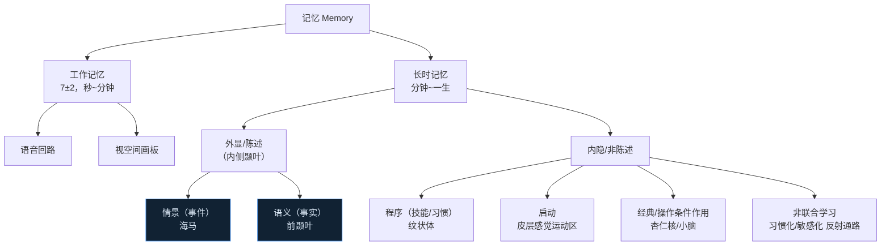
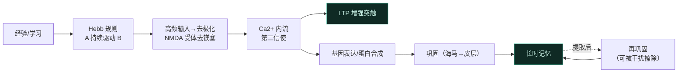
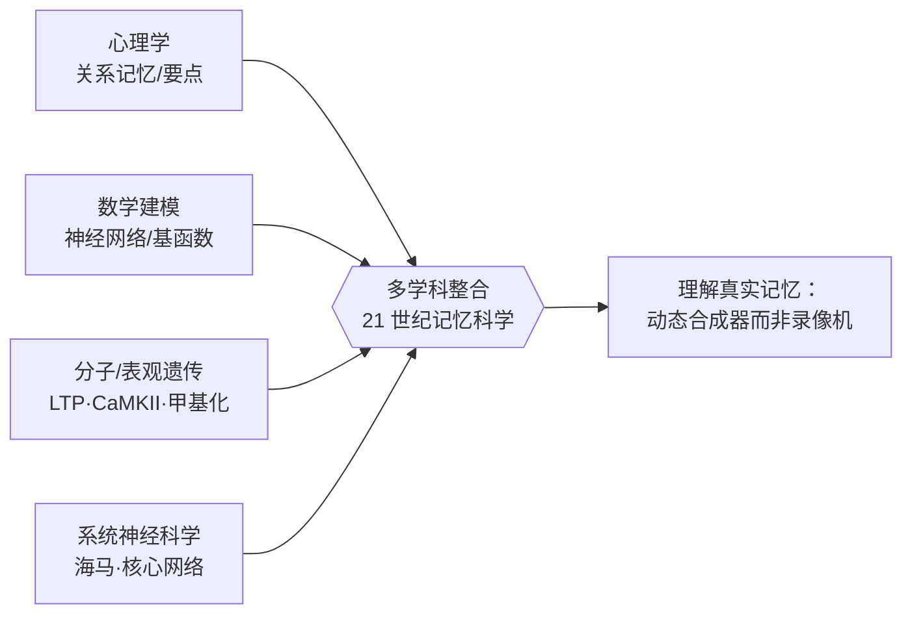

# 第9章 记忆 · 详解（Memory）

> 《脑与行为：认知神经科学视角》Eagleman & Downar (2016)
> 本章以"无法遗忘的女人"Jill Price 起笔：给她任一日期，她能秒答星期几、当天做了什么、有何新闻——却对采访者衣着一片空白。这提示记忆并非铁板一块，而是**多套独立系统**。全章由此展开：记忆分类、内侧颞叶与海马、"记忆未来"（prospection）、虚构（confabulation）、记忆的分子机制（LTP/LTD 及其边界），最终坦承——记忆之谜远未解开。核心立场：**记忆不是录像机，而是动态合成器**，为预测未来、满足生存需求而"重构"过去。

---

## ① 概念解释

### 1.1 核心概念速查表

| 概念 | 英文 | 一句话解释 |
| --- | --- | --- |
| 工作记忆 | working memory | 用信息处理当前任务，容量约 7±2 项，持续数秒到一两分钟 |
| 长时记忆 | long-term memory | 编码/储存/提取信息可达数分钟至一生，容量极大 |
| 内隐（非陈述）记忆 | implicit / nondeclarative | 无需意识即可表达（骑车技能、条件反射） |
| 外显（陈述）记忆 | explicit / declarative | 可被有意识回忆和表达（事实、事件） |
| 程序性记忆 | procedural memory | 技能与习惯，靠重复习得，纹状体关键 |
| 启动效应 | priming | 过去经验提高对刺激的反应（知觉/语义启动） |
| 经典条件作用 | classical conditioning | 刺激-刺激关联（巴甫洛夫的狗），杏仁核/小脑参与 |
| 操作条件作用 | operant conditioning | 行为-结果关联（斯金纳的鼠压杆） |
| 情景记忆 | episodic memory | 有时间地点的自传体事件，可"心理时间旅行" |
| 语义记忆 | semantic memory | 关于世界的事实知识，与具体经历脱钩 |
| 熟悉感 vs 回忆 | familiarity vs recollection | 模糊的似曾相识 vs 场景/时间/细节的丰富重建 |
| 海马 / 内侧颞叶 | hippocampus / medial temporal lobe | 情景与空间记忆的核心，含 CA1–4、齿状回、海马旁 |
| 位置细胞 / 网格细胞 | place cells / grid cells | 海马编码特定地点 / 内嗅皮层形成网格地图 |
| 顺行/逆行遗忘 | anterograde / retrograde amnesia | 术后新记忆不能形成 / 术前旧记忆丧失（H.M.） |
| 预见/记忆未来 | prospection | 用同一核心网络想象未来、重建过去 |
| 核心网络 | core network | 海马+内侧前额叶+内侧顶叶+外侧颞顶等，服务回忆与想象 |
| 虚构 | confabulation | 编造并笃信不存在的现实；源于抑制无关记忆失败 |
| 长时程增强/抑制 | LTP / LTD | 依放电历史强化/减弱突触，记忆的主流细胞机制 |
| NMDA 受体 | NMDA receptor | 谷氨酸受体，"符合探测器"，LTP 诱导的关键 |
| 巩固/再巩固 | consolidation / reconsolidation | 短时→长时记忆的固化；提取后须再次固化 |
| 神经发生 | neurogenesis | 成年海马每天新生数千神经元，或参与记忆 |
| 表观遗传 | epigenetics | DNA 甲基化/组蛋白乙酰化等可遗传的基因开关，参与记忆 |

### 1.2 记忆分类树（工作/长时→外显/内隐→情景/语义/程序）（示意图）

> 关键点：H.M. 术后不能形成新**情景**记忆，却仍能学会镜像描星（**程序**记忆）、保留旧**语义**知识、工作记忆正常——正是这套"分类学"的活教材。

---

## ② 概念间关系

### 2.1 关系一览表

| 关系 | 内容 |
| --- | --- |
| 情景记忆 ↔ 预见（prospection） | 同一核心网络既重建过去也想象未来；海马损伤者既失忆又无法想象新场景 |
| 空间记忆 ↔ 情景记忆 | 海马兼管地点与事件；进化上"领地地图需事件更新"，故合用一套回路 |
| 内侧颞叶（细节）↔ 内侧前额叶（相关性） | 颞叶建立情景细节与语境；前额叶抑制无关记忆、匹配当前需求 |
| 虚构 = 抑制失败 | 前额叶/眶额受损→无法抑制无关记忆→编造并笃信（与 H.M. 颞叶损伤不同） |
| 记忆错误 = 重构的代价 | 记忆存"要点"而非录像，故有"记忆七宗罪"（错误归因/暗示性/偏差） |
| LTP/LTD → 突触改变 → 学习 | Hebb 规则"同发放者共连结"；NMDA 受体作符合探测器 |
| 巩固 ↔ 再巩固 | 记忆需反复激活-巩固-再激活-再巩固；再巩固期可被干扰而擦除（恐惧记忆） |
| 突触之外的机制 | 新生神经元、酶自持（CaMKII/CPEB/朊蛋白）、表观遗传并行储存 |

### 2.2 从经验到长时记忆：分子机制链（示意图）

---

## ③ 提问-回答

**Q1：为什么 H.M.（Henry Molaison）是记忆神经科学最重要的案例？**
他因难治癫痫于 27 岁切除双侧内侧颞叶（含海马、海马旁回、杏仁核）。术后：①严重**顺行遗忘**——无法形成新情景记忆，采访者离开片刻回来须重新自我介绍；②渐进**逆行遗忘**——术前数日记忆近乎全失，越久远保留越多；③**内隐记忆完好**——多次练习学会镜像描五角星却对练习本身毫无记忆；④**语义记忆与工作记忆**（7±2）正常。这精准划出记忆系统的分类边界。

**Q2：海马既管情景记忆又管空间导航，如何统一？**
进化视角：脑本质是**预测器官**。在自然界，食物/水/庇护/配偶很少近在手边，动物需领地地图，而地图须用新事件不断更新才准确——**空间地图需情景记忆才有用**。海马独特回路支持快速学习与高信息容量，正好兼顾。伦敦出租车司机后海马随导航经验增大；世界记忆冠军用"位置法"（method of loci）把待记项放在熟悉路线的地标上——都印证空间与情景同源。

**Q3："记忆未来"（prospection）是什么？有何证据？**
2007 年发现海马损伤者不仅失忆，也**无法想象新经历**（要他想象站在博物馆，只说"什么都出不来……不真实"）。神经成像显示回忆过去与想象未来共用一个**核心网络**（海马+内侧前额叶+内侧顶叶/楔前叶+外侧颞顶）。这套"情景记忆系统"既记录过去也**预测未来**——沙漠中口渴的动物既忆水坑又须预测哪个最可能有水。记忆的进化功能是预测如何满足生存需求。

**Q4：虚构（confabulation）患者的记忆到底出了什么问题？**
自发虚构患者（如"有个 30 岁婴儿要喂"的妇人）不是痴呆或精神妄想，核心缺陷是**无法抑制当前无关的记忆**。图片序列重复检测实验中，重排后他们不断把"上一轮见过"误报为"本轮见过"（false positive 逐轮增多）。损伤在**内侧眶额/前额叶**（常因前交通动脉瘤破裂），与 H.M. 的内侧颞叶损伤截然不同——腹内侧前额叶通过抑制核心网络的同步来剔除无关记忆。

**Q5：LTP/LTD 是记忆的全部答案吗？还有哪些"突触之外"的机制？**
不是。30 多年研究支持突触可塑性对记忆**必要**，但少有数据证明其**充分**；LTP/LTD 甚至可能主要是防止癫痫过载/突触关停的稳态机制。突触之外的候选：①**神经发生**——成年海马每天新生神经元，或作临时"脚手架"；②**酶自持**——CaMKII/CPEB 可自我激活、抵抗蛋白更替（朊蛋白式）；③**表观遗传**——DNA 甲基化、组蛋白乙酰化作可遗传的基因开关。记忆机制或在多个空间尺度上并行。

---

## ④ 科学研究已确定的结论

### 4.1 记忆系统分类表

| 系统 | 子类 | 例子 | 主要脑结构 | 意识可及 |
| --- | --- | --- | --- | --- |
| 工作记忆 | 语音回路 / 视空间画板 | 记电话号码、心中图像 | 前额叶等 | 是（暂时） |
| 外显·情景 | episodic | 大学第一天、新年夜 | 海马、内侧颞叶 | 是 |
| 外显·语义 | semantic | "羊有四条腿" | 前颞叶 | 是 |
| 内隐·程序 | procedural | 骑车、打字、弹琴 | 纹状体 | 否 |
| 内隐·启动 | priming | 见"car"加速对"truck"反应 | 皮层感觉运动区 | 否 |
| 内隐·条件作用 | classical/operant | 铃声流涎、压杆取食 | 杏仁核（情绪）/小脑（骨骼肌） | 否 |
| 内隐·非联合学习 | habituation/sensitization | 适应热水温 / 烫后更敏感 | 反射通路（各级） | 否 |

### 4.2 内侧颞叶结构与海马功能理论

| 结构/理论 | 英文 | 作用/主张 |
| --- | --- | --- |
| 海马（CA1–4、齿状回、下托） | hippocampus | 情景与空间记忆核心，位置细胞在此 |
| 海马旁区（周嗅/内嗅） | parahippocampal region | 物体识别（前通路）/空间记忆（后通路）双通路输入 |
| 杏仁核 | amygdala | 情绪记忆，赋予刺激正负价值，前海马联系紧密 |
| 网格细胞 | grid cells | 内嗅皮层，网格状覆盖环境，与位置细胞群共同精确定位 |
| 陈述理论 | declarative theory | 海马对所有可有意识回忆的记忆关键，但仅在记忆新时 |
| 多重痕迹理论 | multiple-trace theory | 海马对情景记忆永远必要，唯语义可脱离海马 |
| 双过程理论 | dual-process theory | 海马管"回忆"细节；"熟悉感"靠海马外结构 |
| 关系理论 | relational theory | 海马储存要素间关系，供灵活新用 |
| 认知地图理论 | cognitive map theory | 海马本为领地地图，被借用于情景记忆 |

### 4.3 记忆七宗罪之三种"扭曲"（健康脑也有）

| 错误 | 英文 | 定义 | 例子 |
| --- | --- | --- | --- |
| 错误归因 | misattribution | 把回忆归给错误来源/时间/地点/人 | 强奸受害者误指电视上见过的心理学家为凶手 |
| 暗示性 | suggestibility | 事后暗示植入虚假记忆 | 诱导"童年在商场走失"；近百%在假证人下签假供 |
| 偏差 | bias | 当前信念无意识扭曲对过去的回忆 | 关系变差后记得当年感情更糟；War of the Ghosts 实验 |

### 4.4 已确定的结论清单

- **记忆有多套系统**（工作、长时、内隐、外显），各有独立功能与神经解剖；H.M. 案例是活教材。
- **内侧颞叶（海马、海马旁区、杏仁核）**对创建/储存长时语义与情景记忆关键。
- **预见性记忆帮助预测未来**——用同一核心网络想象食物在哪、他人会如何行动，赋予生存优势。
- **记忆不像录像**，只存"要点"，故有记忆错误（七宗罪）；抑制无关信息失败会导致虚构。
- **当前公认的储存机制是 LTP 与 LTD**——改变突触连接强度；NMDA 受体作符合探测器诱导 LTP。
- **研究者正积极探索突触之外的机制**：新生神经元、酶功能改变（CaMKII/CPEB/朊蛋白）、DNA 表观遗传修饰。
- **再巩固可被擦除**：恐惧记忆经激活后注射蛋白合成抑制剂（anisomycin）可消除——对 PTSD 有治疗前景。
- **脊椎与无脊椎共享机制**：Aplysia 非联合学习研究（Kandel 等）获 2000 年诺奖。

---

## ⑤ 开放性未解决的问题与研究方向

### 5.1 本章明确抛出的开放问题

| 开放问题 | 方向描述 |
| --- | --- |
| 记忆全由 LTP/LTD 来吗？ | 30 年研究支持"必要"但难证"充分"；或另有细胞机制，或 LTP/LTD 只是稳态机制 |
| 神经网络模型是否解释人脑记忆？ | Hopfield 网存像素/音素，人脑却存"要点/关系"与不变性——似在解错问题 |
| 新生神经元为何早夭？ | 成年海马新神经元常数日/数周即死，其在记忆中的确切角色未明 |
| 尖峰时序如何影响学习？ | 时序不对称 Hebb 规则：A 先于 B 则增强、反之减弱——需纳入未来模型 |
| 相关性/语境如何编码进网络？ | 真脑靠神经调质、前额叶目标-策略过滤无关输入，人工网络尚缺此 |
| Jill Price 的超忆之谜 | 哪套系统异常、脑结构是否不同、是否强迫性"囤积"过去，仍待解 |

### 5.2 记忆的巩固-遗忘-洞见（睡眠联动，示意）

| 过程 | 机制/证据 |
| --- | --- |
| 复演（rehearsal） | 睡眠中海马位置细胞重放白天轨迹（Tetris 梦、鼠"梦跑"），巩固入长时记忆 |
| 遗忘（forgetting） | Crick-Mitchison"反 Hebbian"：REM 擦除虚假关联，防止网络"记忆泥浆" |
| 洞见（insight） | 睡眠重构记忆、提取隐藏规则——睡后领悟隐规则概率翻倍 |
| 再巩固擦除 | 提取时的脆弱窗口——对 PTSD 治疗有潜力 |

### 5.3 记忆研究的未来方向

| 方向 | 说明 |
| --- | --- |
| 亚显微塑性探针 | 开发新技术探测生化级联、表观遗传等突触之外的改变 |
| 更真实的记忆观 | 建模须纳入"只记与生存相关、与既有知识相连的少数细节" |
| 基函数/不变性编码 | 存"基面孔"系数而非像素，解决大小/光照/旋转不变性难题 |
| fMRI 测谎的伦理 | 区分真假记忆的成像技术尚不可靠，且涉及"读心"伦理争议 |

### 5.4 记忆研究的多学科整合（示意图）

---

## ⑥ 完整性核对（对照原文 KEY PRINCIPLES）

> 严格校验：本详解逐条覆盖第 9 章章末 **7 条** KEY PRINCIPLES（原文第 26660 行起），无遗漏。

| # | 原文 KEY PRINCIPLE（要点） | 本详解对应位置 |
| --- | --- | --- |
| 1 | 有多套记忆系统——工作、长时、内隐、外显，各有独立功能与神经解剖 | ①1.2 分类树 + ④4.1 分类表 + Q1 |
| 2 | 内侧颞叶含多个结构（海马、海马旁区、杏仁核）对创建储存长时语义/情景记忆重要 | ①海马词条 + ④4.2 + Q1 |
| 3 | 预见性记忆帮助预测未来，赋予生存优势（猜食物在哪、他人如何行动） | ②2.1 + ④4.4 + Q3 + ⑤ |
| 4 | 记忆系统不像录像存信息，而存要点；由此产生记忆错误（七宗罪），抑制无关信息失败导致虚构 | ④4.3 七宗罪 + ②2.1 + Q4 |
| 5 | 当前公认储存机制为 LTP 与 LTD——改变神经元间突触连接强度 | ①LTP/LTD 词条 + ②2.2 图 + Q5 |
| 6 | 研究者积极探索其他机制：新增神经元、改变细胞内酶功能、影响 DNA 表观遗传修饰 | ②2.1（突触之外）+ ④4.4 + Q5 |
| 7 | 逾一世纪研究后理解仍不完整，诸多谜题待解（是否全由 LTP、神经网络模型是否有用） | ⑤5.1 开放问题表 + ⑤5.3 |

---

## ⑦ 认知偏差 · 成因(Why) · 对策
> 本章的核心立场——**记忆不是录像机，而是为预测未来而"重构"过去的动态合成器**——正是一切记忆偏差的总根源。记忆只存"要点"、提取时即重建，故极易被来源、暗示与当前信念污染。对策的共同内核：把记忆当作可错的重建，用外部记录与多源印证替代"我记得很清楚"的自信。

| 认知偏差 / 错觉 | 成因（Why） | 解决方案 / 对策 |
| --- | --- | --- |
| "记忆像录像"的误解 | 记忆只保存"要点"（gist）而非逐帧影像，提取即重建；主观上却感觉细节完整清晰 | 承认记忆是重构而非回放；重要事实靠笔记、照片、录音等外部记录留存 |
| 错误归因（misattribution） | 把回忆归给错误的来源/时间/地点/人——细节真实但来源张冠李戴（受害者误指电视上见过的心理学家为凶手） | 提取时刻意追溯来源（"我在哪、从谁处知道的"）；关键归因需外部佐证核对 |
| 暗示性（suggestibility） | 事后的诱导性提问或他人叙述会植入并不存在的虚假记忆（"童年商场走失"、假证人下近百%签假供） | 询问用中性、非诱导性提问；目击指认采用双盲、序列呈现等改进程序，避免暗示污染 |
| 偏差（bias） | 当前的信念、情绪与自我形象会无意识地重塑对过去的回忆（关系变差后记得当年感情更糟；War of the Ghosts 按既有图式改编） | 意识到"现在"在改写"过去"；用当年的原始记录（日记、聊天）校准，而非凭现在的感觉推断 |
| 虚构（confabulation） | 内侧眶额/前额叶受损使人无法抑制当前无关的记忆，于是编造并笃信不存在的现实（"有个 30 岁婴儿要喂"） | 识别为额叶损伤体征而非说谎；临床上多源事实核对、结构化提问以约束无根据的编造 |
| 目击证词过度自信 | 记忆的重构性 + 上述七宗罪叠加，却主观感到"历历在目"，自信度与准确度脱节 | 改进指认程序（双盲、序列、警示"凶手可能不在其中"）；司法不以自信度作真伪判据，重物证与多源印证 |

*本详解忠于第 9 章原文（STARTING OUT 无法遗忘的女人、记忆的种类、海马与颞叶、记忆未来、虚构、记忆机制、突触可塑性之外的前沿、记忆之谜各节）与章末 KEY PRINCIPLES / KEY TERMS，术语中英并列，OCR 拼写已据常识还原。*
