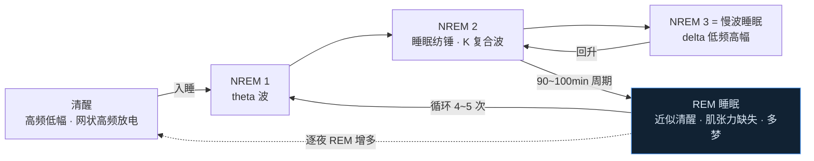
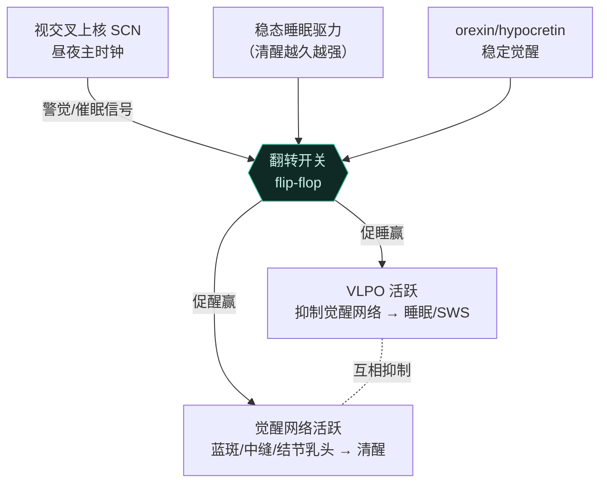
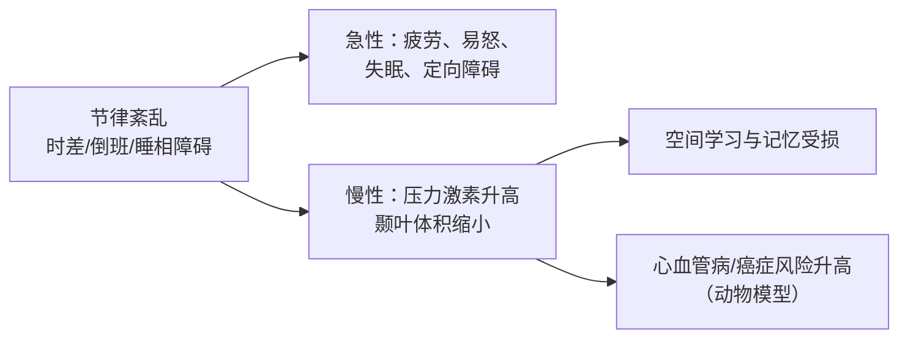

# 第10章 睡眠 · 详解（Sleep）

> 《脑与行为：认知神经科学视角》Eagleman & Downar (2016)
> 本章以"游走于睡与醒之间"起笔：1987 年 Kenneth Parks 深夜驱车 14 英里、刺死岳母，事后毫无记忆——他的 EEG 证实是"杀人梦游"（homicidal somnambulism）。睡眠不是简单的"关机"：脑在睡眠中几乎与清醒同样活跃，而**清醒、REM、NREM 是同一套机器运行的三种不同任务**。全章确立：所有物种都睡→睡眠有重要生物功能；睡眠由相互抑制的**翻转开关**网络控制；其主功能或在于**信息处理（学习与重构）**；梦、昼夜节律、睡眠剥夺与睡眠障碍皆由此展开。

---

## ① 概念解释

### 1.1 核心概念速查表

| 概念 | 英文 | 一句话解释 |
| --- | --- | --- |
| 脑电图 | electroencephalography (EEG) | 记录大量神经元同步的场电位，反映脑活动大尺度结构 |
| 脑波频段 | delta/theta/alpha/beta/gamma | 从<4Hz 到 30-100+Hz；delta 标志慢波睡眠 |
| 慢波睡眠 | slow-wave sleep (SWS) | NREM 第 3 阶段（最深），低频高幅脑波 |
| REM / 非REM 睡眠 | REM / NREM sleep | REM 神经最活跃、近似清醒（"矛盾睡眠"）；NREM 占 80%、分三阶段 |
| 肌张力缺失 | atonia | REM 期主要肌群被神经回路"瘫痪"，防止把梦演出来 |
| PGO 波 | pontogeniculo-occipital waves | 源自脑桥→外侧膝状体→枕叶，先于 REM，或为梦的神经相关物 |
| 腹外侧视前核 | ventrolateral preoptic nucleus (VLPO) | 下丘脑促睡核，活跃时抑制觉醒网络 |
| 觉醒网络 | arousal network | 蓝斑/中缝核/结节乳头核+网状激活系统，促清醒 |
| 相互抑制/翻转开关 | mutual inhibition / flip-flop | 睡与醒两网络互相抑制，形成双稳态，只能居其一 |
| 昼夜节律 | circadian rhythm | 内源约 24 小时（实测 24h11min）的节律，控制睡-醒周期 |
| 视交叉上核 | suprachiasmatic nucleus (SCN) | 下丘脑的主时钟，位于视交叉上方 |
| 授时因子 | zeitgebers | 校准节律的环境线索，最重要是光暗周期 |
| 视网膜下丘脑束 | retinohypothalamic tract | 含黑视素的节细胞把光信息直送 SCN |
| 松果体 / 褪黑素 | pineal gland / melatonin | 释放"黑暗激素"褪黑素，夜升晨降 |
| 多相/单相睡眠 | polyphasic / monophasic sleep | 一日多次睡 vs 一次睡；多相在动物界是常态 |
| 激活-合成模型 | activation-synthesis model | 梦是皮层为脑干随机活动"编故事"，本无深意 |
| 清醒梦 | lucid dreaming | 睡者意识到自己在做梦、甚至能掌控剧情 |
| 微睡眠 | microsleeps | 严重剥夺时秒级的短暂入睡，本人常不自知 |
| 失眠/嗜睡/异态睡眠 | insomnia / hypersomnia / parasomnias | 难入睡 / 过度嗜睡 / 睡中复杂行为（梦游等） |
| 发作性睡病 | narcolepsy | 因 orexin/hypocretin 不足致猝倒、直接跌入 REM |
| 致死性家族失眠 | fatal familial insomnia | 朊蛋白病，进行性失眠致死 |

### 1.2 睡眠三态切换：清醒 / REM / NREM（示意图）

> 关键点：一夜循环 4-5 次、每次 90-100 分钟；随夜深，深睡减少、REM 增多。REM 的 EEG 更像清醒而非深睡，故称"矛盾睡眠"。

---

## ② 概念间关系

### 2.1 关系一览表

| 关系 | 内容 |
| --- | --- |
| 睡 ↔ 醒（相互抑制） | VLPO 促睡网络与觉醒网络互相抑制，形成翻转开关双稳态 |
| orexin/hypocretin → 稳定觉醒 | 该激素稳定翻转开关于清醒态；缺失→开关不稳→发作性睡病 |
| 昼夜节律 → 睡-醒时相 | SCN 主时钟经褪黑素等把节律锚定光暗；节律紊乱→时差/睡相障碍 |
| SCN ← 光 ← 视网膜下丘脑束 | 黑视素节细胞（非视杆/锥）把光直送 SCN 校准节律 |
| REM ↔ 清醒（相似又不同） | EEG 都高频、乙酰胆碱共用；差异在肌张力缺失、丘脑角色、无外部输入 |
| 睡眠 → 学习/记忆（信息处理） | 复演（重放轨迹）+ 遗忘（清除虚假关联）+ 洞见（重构提取隐规则） |
| 梦 = 随机活动 + 记忆语境 | 激活-合成模型：脑干随机输入被皮层编成故事，背景来自记忆/恐惧/愿望 |
| 网络"交接不畅" → 异态睡眠 | 状态切换时部分脑区已换、部分未换→梦游/夜惊/REM 行为障碍 |

### 2.2 睡-醒翻转开关与昼夜节律调控（示意图）

---

## ③ 提问-回答

**Q1：睡眠为什么是"翻转开关"？orexin 起什么作用？**
促睡网络（下丘脑 VLPO）与觉醒网络（蓝斑去甲肾上腺素、中缝核 5-HT、结节乳头核组胺、脑桥/基底前脑乙酰胆碱+网状激活系统）**相互释放抑制性递质**。这种相互抑制形成**双稳态**：系统只能处于睡或醒之一，不能两者兼得（胜方压制败方）。但纯相互抑制会"卡死"在一态，故需外力扰动切换。**orexin/hypocretin**（下丘脑）稳定系统于清醒态；发作性睡病者该激素神经元被自身免疫破坏，开关失稳，故会在不当时间猝跌入 REM（猝倒、睡眠瘫痪）。

**Q2：昼夜节律从哪来？如何被光校准？为何不是精确 24 小时？**
节律是**内源生成**的——SCN 细胞在培养皿中仍维持自身节律；SCN 天生周期约 **24 小时 11 分**，个体差异仅 ±16 分钟。它经**授时因子**（zeitgebers，最重要是光暗）被**牵引**（entrained）。光信息不走视杆/视锥，而由含**黑视素**的视网膜节细胞经**视网膜下丘脑束**直送 SCN；SCN 再指挥**松果体**分泌**褪黑素**（"黑暗激素"，夜升晨降）。Sifre 洞穴实验证明：无光暗线索时人的节律漂移到约 25 小时——节律是被太阳"校准"的近似周期。

**Q3：睡眠的四种理论各是什么？哪种证据最强？**
①**恢复说**——省能、补充代谢/递质；但睡眠时神经高度活跃，且高活动的马睡 3h、低活动的考拉睡 19h，与之矛盾。②**生存优势说**——夜间少活动可避险；但夜行动物也睡、夜视可进化解决，说服力弱。③**模拟稀有情境说**——发育期 REM 占比高，或在肌肉关闭下"演练"神经程序；无直接证据，威胁模拟理论未获支持（高犯罪区居民反而更少威胁梦）。④**信息处理说**——学习、巩固、遗忘、重构；**数据最支持此说**，故本章重点讨论。

**Q4：睡眠如何服务学习与记忆？涉及哪三个过程？**
①**复演（rehearsal）**——鼠跑迷宫后 REM 期海马位置细胞重放同样序列（"梦跑"），Tetris 新手当晚梦见落块；SWS 慢波在参与任务的脑区局部增强，预测次日成绩。②**遗忘（forgetting）**——Crick-Mitchison"我们做梦以遗忘"：REM 以"反 Hebbian"削弱随机激活的虚假关联，防止网络变"记忆泥浆"（无 REM 的针鼹脑更大）。③**洞见（insight）**——睡眠重构记忆、提取隐藏规则；实验中睡过者领悟隐规则的概率是不睡者的两倍（Loewi 梦中想出蛙心实验）。

**Q5：为什么说"脑常被卡在睡与醒之间"？异态睡眠与 Kenneth Parks 案如何印证？**
睡与醒各是庞大网络，切换时理应各系统平稳交接；但网络大而复杂，有时**部分脑区已切换、部分未切换**，即产生**异态睡眠**（parasomnias）。**NREM 异态**（梦游、夜惊、磨牙、睡食）是脑试图从 SWS 直接跳到清醒被"卡住"；**REM 异态**（REM 睡眠行为障碍——肌张力缺失缺席、把梦演出来；睡眠瘫痪——肌张力缺失延续到醒后）。Kenneth 的 EEG 显示每夜 10-20 次试图**从 SWS 直接跳到清醒**——这是无法伪造的客观证据，陪审团据此判其无罪。

---

## ④ 科学研究已确定的结论

### 4.1 睡眠阶段表（三态对比）

| 状态 | 英文 | EEG 特征 | 生理特征 | 主观体验 |
| --- | --- | --- | --- | --- |
| 清醒 | wakefulness | 高频低幅、gamma | 正常肌张力，响应外界 | 完整意识 |
| NREM 1 | non-REM stage 1 | theta 波出现 | 困倦/放松 | 极少 |
| NREM 2 | non-REM stage 2 | 睡眠纺锤、K 复合波 | 心率呼吸变慢 | 少 |
| NREM 3 (SWS) | slow-wave sleep | delta 低频高幅 | 最深睡，难唤醒 | 无/仅碎片感觉 |
| REM | REM sleep | 高频低幅（近清醒） | 心率呼吸加快、肌张力缺失、阴茎勃起 | 80% 生动叙事梦 |

### 4.2 昼夜节律解剖-机制表

| 结构/概念 | 英文 | 作用 |
| --- | --- | --- |
| 视交叉上核 | SCN | 下丘脑主时钟，内源约 24h11min |
| 视网膜下丘脑束 | retinohypothalamic tract | 黑视素节细胞把光直送 SCN |
| 松果体 | pineal gland | 分泌褪黑素入脑脊液 |
| 褪黑素 | melatonin | "黑暗激素"，夜升晨降，非直接睡眠激素 |
| 授时因子 | zeitgebers | 校准节律的环境线索（光暗最重要） |
| 时差 | jet lag | 节律与当地昼夜错位，致疲劳、易怒、失眠 |
| 睡相障碍 | delayed/advanced sleep phase syndrome | 睡-醒时相后移/前移；非24小时综合征 |

### 4.3 睡眠障碍分类表

| 大类 | 英文 | 代表 | 机制/要点 |
| --- | --- | --- | --- |
| 失眠 | insomnia | 入睡难/维持难；致死性家族失眠 | 持续性过度觉醒；朊蛋白病可致死 |
| 嗜睡 | hypersomnia | 发作性睡病（含猝倒） | orexin/hypocretin 不足，翻转开关失稳 |
| 异态睡眠 | parasomnias | 梦游/夜惊/REM 行为障碍/睡眠瘫痪/性睡症 | 状态切换时网络交接不畅 |
| 昼夜节律障碍 | circadian rhythm disorders | 睡相延迟/前移、非24小时 | SCN 时相与社会时钟错位 |

### 4.4 已确定的结论清单

- **所有物种都睡**（连果蝇也有睡-醒周期；海豚单半球轮睡），表明睡眠是重要生物功能。
- **睡眠中脑几乎与清醒同样活跃**——不是"关机"，而是同一机器换任务。
- **脑有三种截然不同的状态**（清醒、REM、NREM），可经 EEG 区分，代表同一机器运行不同任务。
- **昼夜时钟（SCN）使睡-醒周期与光暗对齐**，内源生成、被光牵引。
- **睡眠虽或涉恢复与神经程序演练，其主功能似为学习与信息重构**（复演/遗忘/洞见，数据最支持）。
- **梦内容或由记忆/恐惧/愿望在随机皮层活动语境下被解读**（激活-合成模型）。
- **梦主要发生在 REM**，依赖边缘/旁边缘/联合区网络；顶叶损伤可致梦丧失。
- **短期睡眠剥夺损害认知与情绪**（微睡眠、易怒、判断力下降），但可逐步适应更短睡眠。
- **睡眠由复杂神经网络实现**，多种睡眠障碍是该网络内通信的崩溃。

---

## ⑤ 开放性未解决的问题与研究方向

### 5.1 本章明确抛出的开放问题

| 开放问题 | 方向描述 |
| --- | --- |
| 睡眠的确切功能是什么？ | 恢复/生存/演练/信息处理四说非互斥亦非完备，主功能仍待定 |
| 睡眠如何重构记忆、激发洞见？ | 洞见与信息重构机制远未理解（即使脱离睡眠语境也不清楚） |
| 单一固定结构如何产生不同节律？ | 丘脑等固定结构如何生成不同振荡及其转换，机制未明 |
| 梦有意义吗？能否照亮意识？ | 梦内容是否有义、能否作研究意识的工具，尚不确定 |
| 梦为何有理性叙事与虚假记忆？ | 我们在梦中接受荒诞情节与假记忆，机制成谜 |
| 睡眠 vs 清醒谁是"默认态"？ | 究竟睡是默认、醒需特殊活动，还是相反，仍可争论 |
| 不适感由睡眠剥夺还是压力所致？ | 睡差常伴压力源（考试/截止），二者贡献需实验分离 |

### 5.2 睡眠的四种理论对比表

| 理论 | 英文 | 核心主张 | 证据状况 |
| --- | --- | --- | --- |
| 恢复说 | restoration | 省能、补充代谢与递质 | 睡时神经高活跃、马/考拉睡时长矛盾，非全部答案 |
| 生存优势说 | survival advantage | 夜间少动避险 | 夜行动物也睡、夜视可进化，说服力弱 |
| 模拟稀有情境 | simulation | 肌肉关闭下演练神经程序 | 无直接证据；威胁模拟理论未获支持 |
| 信息处理 | information processing | 学习、巩固、遗忘、重构 | **数据最支持**，本章重点 |

### 5.3 梦研究的方法与前沿

| 方法 | 说明 |
| --- | --- |
| 唤醒报告 | REM 期唤醒 → 80% 报告叙事梦；NREM 梦更像思绪 |
| 清醒梦实验 | 用约定眼动测"梦中 10 秒"≈真实 10 秒（LaBerge） |
| 药物/疾病改变梦内容 | 抗抑郁药抑制 REM；多巴胺能药使梦更生动可怖；顶叶损伤致梦丧失 |
| REM vs NREM 对比成像 | 以 NREM 为对照，分离意识觉知相关脑区（腹侧视觉流、边缘系统更活跃） |

### 5.4 昼夜节律紊乱的影响链（示意图）

---

## ⑥ 完整性核对（对照原文 KEY PRINCIPLES）

> 严格校验：本详解逐条覆盖第 10 章章末 **9 条** KEY PRINCIPLES（原文第 29235 行起），无遗漏。

| # | 原文 KEY PRINCIPLE（要点） | 本详解对应位置 |
| --- | --- | --- |
| 1 | 所有物种都睡，表明睡眠是重要生物功能 | ④4.4 + 引子 |
| 2 | 脑在睡眠中是活跃的——几乎与清醒时一样活跃 | ①脑活跃 + ④4.4 |
| 3 | 脑经 EEG 可见三种不同状态：清醒、REM、NREM——同一机器运行不同任务 | ①1.2 三态图 + ④4.1 阶段表 |
| 4 | 昼夜时钟这一内在节律使睡-醒周期与光暗对齐 | ②2.2 图 + ④4.2 + Q2 |
| 5 | 睡眠虽或涉恢复与神经程序演练，主功能似为学习与信息重构 | ⑤5.2 四理论 + Q3 + Q4 |
| 6 | 梦内容或由记忆、恐惧、愿望、希望在随机皮层活动语境下被解读 | ②2.1（梦）+ ④4.4 + ⑤5.3 |
| 7 | 梦主要发生在 REM，依赖边缘/旁边缘/联合区网络的活动 | ④4.4 + ⑤5.3 |
| 8 | 短期睡眠剥夺对认知与情绪有负面影响；但可对更短睡眠作长期调整 | ④4.4 + ⑤5.1 |
| 9 | 睡眠由复杂神经网络实现；若干睡眠障碍是该网络内通信的崩溃 | ②2.1 + ④4.3 睡眠障碍表 + Q5 |

---

## ⑦ 认知偏差 · 成因(Why) · 对策
> 关于睡眠的误区多源于**主观感受不可靠**：微睡眠时本人毫无察觉，梦被赋予并不存在的深意，人们又高估自己"少睡也高效"的能力。对策的共同内核是——用客观测量（EEG、睡眠监测）与循证睡眠卫生替代直觉，让作息顺应而非对抗昼夜节律。

| 认知偏差 / 错觉 | 成因（Why） | 解决方案 / 对策 |
| --- | --- | --- |
| 低估睡眠剥夺的影响（"我没事"） | 严重剥夺时会出现秒级**微睡眠**，本人常不自知；判断力与自我监控本身也被削弱，故主观自评失真 | 用客观指标（EEG/睡眠监测、反应时测试）而非自我感觉评估状态；疲劳时不驾驶/不做高危决策，靠制度而非意志 |
| "少睡也高效"的错觉 | 剥夺初期靠代偿掩盖损害，主观"习惯了"，但认知与情绪的客观损害持续存在——适应的是感受而非表现 | 承认多数人需要充足睡眠；以客观表现而非"感觉够了"为准，保证规律、足量睡眠 |
| "梦有预言/深意"的误读 | 激活-合成模型指出梦多是皮层为脑干随机活动"编故事"，人却本能地为荒诞情节赋予意义与预兆 | 理解梦的随机-合成机制，不把梦当预言或隐藏讯息；如作素材可，作决策依据不可 |
| 青少年作息误区（"晚睡是懒散"） | 青春期昼夜节律（SCN 相位）自然后移，早晨上课与生理时钟错位，被误解为意志/纪律问题 | 认清是生理性相位延迟而非懒惰；顺应节律调整作息与上学时间，善用晨光等授时因子牵引 |
| 忽视睡眠障碍的客观性 | 梦游、夜惊、杀人梦游等异态睡眠像"装的"，凭主观难辨真伪（Kenneth Parks 案） | 以 EEG 等客观证据诊断（Parks 每夜 10-20 次从 SWS 直跳清醒无法伪造）；循证治疗而非道德归因 |

*本详解忠于第 10 章原文（STARTING OUT 睡与醒之间、脑与睡眠、EEG、昼夜节律、脑为何睡眠、做梦、睡眠剥夺与睡眠障碍各节及 Kenneth Parks 结局）与章末 KEY PRINCIPLES / KEY TERMS，术语中英并列，OCR 拼写已据常识还原。*
