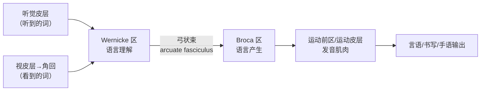
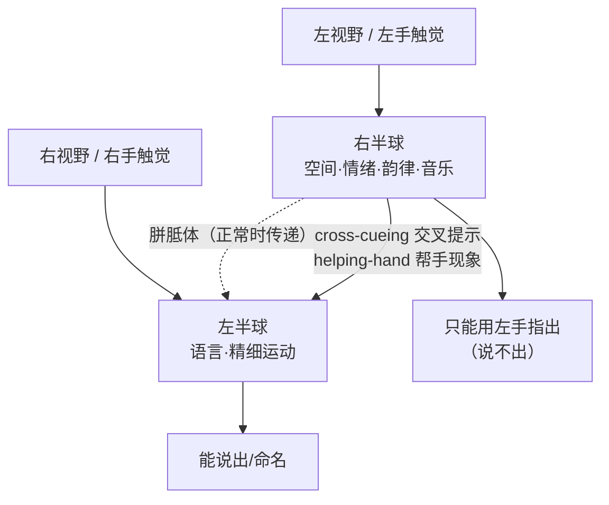
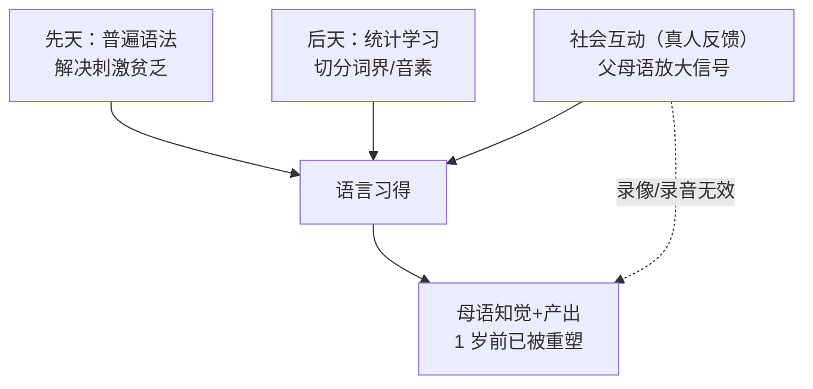

# 第11章 语言与偏侧化 · 详解（Language and Lateralization）

> 《脑与行为：认知神经科学视角》Eagleman & Downar (2016)
> 本章以电影《国王的演讲》中患口吃的乔治六世起笔：一位并非医生也非科学家的朋友，靠让国王"像小学生一样唱歌、像水手一样咒骂"竟治好了他。原因在于——国王大脑某一区域未被充分激活，唱歌与咒骂让他重获自己声音的**听觉反馈**，闭合了语言回路。由此本章展开：**言语≠语言≠沟通**、失语症类型、Wernicke-Geschwind 语言回路、左右半球偏侧化与裂脑人、以及语言在先天与后天交互中的发育。

---

## ① 概念解释

### 1.1 核心概念速查表

| 概念 | 英文 | 一句话解释 |
| --- | --- | --- |
| 言语 | speech | 一个人说话时发出的声波输出（舌、喉、气道产生） |
| 语言 | language | 把想法翻译成可与他人共享的信号（一套习得的符号-意义规则） |
| 沟通 | communication | 无论媒介为何，把想法从一人传到另一人 |
| 语法 | grammar | 把词按特定方式组合的规则系统 |
| 失语症 | aphasia | 因脑损伤导致产生或理解语言能力丧失（非肌肉问题） |
| Broca 区 | Broca's area | 左额下回，负责语言**产生**（表达性失语的病灶） |
| Wernicke 区 | Wernicke's area | 左颞上回后部，负责语言**理解**（接受性失语的病灶） |
| 弓状束 | arcuate fasciculus | 连接 Wernicke↔Broca 的轴突束，损伤致传导性失语 |
| Wernicke-Geschwind 模型 | Wernicke-Geschwind model | 语言回路的经典简化电路图（听/看→理解→产出→发音） |
| 韵律 | prosody | 语调、重音、节奏——"语言的音乐"，多偏侧化到右半球 |
| 失读症 | dyslexia | 发育性阅读障碍，与左半球语言网络异常相关 |
| 偏侧化 | lateralization | 左右半球功能分工；语言是最偏侧化的脑功能 |
| Wada 测试 | Wada test | 向一侧颈动脉注射巴比妥麻醉半球，判定语言优势半球 |
| 失用症 | apraxia | 左半球损伤致无法按指令做精细动作（非瘫痪） |
| 裂脑人 | split-brain patients | 切断胼胝体后左右半球独立运作的病人 |
| 胼胝体 | corpus callosum | 连接两半球的最大轴突束（2 亿轴突） |
| 统计学习 | statistical learning | 婴儿脑对语音输入做频率分析，找出词界与音素 |
| 父母语 | parentese | 高音调、拉长词的婴儿导向言语，助婴儿捕捉信号 |
| 普遍语法 | universal grammar | Chomsky：婴儿先天带有一套组织语言的基本规则 |
| 刺激贫乏论 | poverty of the stimulus | 儿童接触的语言样本太少，不足以从零建模，故需先天结构 |

### 1.2 语言回路：Wernicke-Geschwind 模型（Mermaid 图）

> 关键点：Wernicke 区恰卡在**初级听皮层**（听）与**角回**（看）之间，无论输入来自耳还是眼都能处理语言；输出经弓状束到 Broca 区编排产出，再交运动皮层执行。

---

## ② 概念间关系

### 2.1 关系一览表

| 关系 | 内容 |
| --- | --- |
| 言语 → 语言 → 沟通 | 三者递进：声波是言语，英语这套编码是语言，传达"我渴了"的概念是沟通；自闭症言语在但沟通损，Williams 综合征言语语言在但沟通损 |
| Broca 区 ↔ Wernicke 区（经弓状束） | 前者管产出、后者管理解，弓状束把"理解"连到"产出"；切断则致传导性失语（能懂能说但不能复述） |
| 损伤部位 → 失语类型 | 病灶决定缺陷：额叶→Broca 失语；颞叶→Wernicke 失语；弓状束→传导性；广泛→全面性 |
| 左半球 ↔ 右半球 | 左管语言与精细运动（失用症）；右管空间、情绪、面孔、音乐与**韵律**——故 Wernicke 病人仍保留语调、能笑里根演讲 |
| 先天（普遍语法）↔ 后天（统计学习） | 语言由基因倾向 + 环境输入交互获得：婴儿做统计学习切分音素，但先天普遍语法解决"刺激贫乏" |
| 社会互动 → 语言学习 | 纯统计提取不够，需社会反馈：Kuhl 实验证真人互动才有音素学习，录像/录音无效 |

### 2.2 偏侧化与裂脑人信息流（Mermaid 图）

---

## ③ 提问-回答

**Q1：失去舌头无法说话，算失语症吗？**
不算。失语症特指因**脑损伤**导致产生或理解语言的能力丧失，与发音肌肉/器官无关。舌头/声带问题属于构音障碍（dysarthria）或发声障碍（dysphonia）。埃及 Ebers 纸草记载 4500 年前一名头伤失语者口舌无恙，正是这一区分的雏形。

**Q2：Broca 失语和 Wernicke 失语核心区别是什么？**
Broca 失语（表达性/非流利）：理解基本完好，但**产出费力、无语法（agrammatical）、找词困难（anomia）**；病人苦恼于说不出（"困在玻璃瓶里"）。Wernicke 失语（接受性/流利）：语法流利但**内容无意义（词沙拉）、有新造词（neologism）与错语（paraphasia）**，且**理解受损**，病人常保持愉快、困惑他人为何听不懂。

**Q3：弓状束损伤会怎样？**
造成**传导性失语**：理解正常、产出正常，但**不能复述**。因为 Wernicke（理解）到 Broca（产出）的连接被切断，无法把语言信息从输入快速搬到输出——让病人重复简单句子即可测出。

**Q4：切断胼胝体（2 亿轴突）后病人为何看似正常？**
胼胝体确有重要功能，但须精巧实验才能揭示。Sperry 让裂脑人左手持物：因左手感觉入右半球、而语言在左半球，病人说不出物名，只能左手指认。两半球可独立同时学习、行动，一侧只能靠**交叉提示**（如右半球引发皱眉暗示左半球出事）沟通。

**Q5：语言是先天还是后天？**
两者交互。后天：婴儿对输入做**统计学习**切分词界与音素，1 岁前知觉系统已被母语重塑（日本婴儿 10 月龄丧失区分 R/L 能力）。先天：跨文化语法相似、发育里程碑一致、"刺激贫乏"——样本太少不足从零学会，故需**普遍语法**。且社会互动（真人而非录像）才有效。

---

## ④ 科学研究已确定的结论

### 4.1 失语症类型对比表

| 失语类型 | 英文 | 病灶 | 产出 | 理解 | 复述 | 标志特征 |
| --- | --- | --- | --- | --- | --- | --- |
| Broca 失语 | Broca's aphasia | 左额下回 | 费力、无语法 | 基本完好 | 差 | 找词困难(anomia)、电报式言语 |
| Wernicke 失语 | Wernicke's aphasia | 左颞上回后部 | 流利但无意义 | 严重受损 | 差 | 词沙拉、新造词、错语；保留韵律 |
| 传导性失语 | conduction aphasia | 弓状束 | 正常 | 正常 | **不能复述** | 输入→输出搬运受阻 |
| 全面性失语 | global aphasia | 左外侧皮层广泛（大脑中动脉） | 不能 | 不能 | 不能 | 三者缺陷合并 |

### 4.2 左右半球功能分工表

| 功能 | 优势半球 | 依据 |
| --- | --- | --- |
| 语言（产生+理解） | 左 | 92% 右利手、69% 左利手/双利手语言在左；Wada 测试确认 |
| 精细运动控制 | 左 | 左半球损伤致失用症（apraxia） |
| 空间能力 | 右 | 三维-二维图像匹配右半球更强 |
| 情绪/面孔/心境 | 右 | 右半球更善知觉表情与情绪 |
| 音乐/旋律 | 右 | 右侧 Wernicke 类似区损伤致失乐症(amusia) |
| 韵律（语调节奏） | 右 | 故 Wernicke 病人保留"语言的音乐"，能笑里根演讲 |

### 4.3 已确定的结论清单

- **言语、语言、沟通三者可分离**：自闭症言语在而沟通损；Williams 综合征言语语言在而沟通损。
- **关键脑区各司其职且可分离损伤**：Broca 区管产出、Wernicke 区管理解，损伤各致独特缺陷；不限口语——聋人 Broca 区损伤同样丧失手语表达。
- **Wernicke-Geschwind 模型虽不完整但临床有用**：真实通路还含左顶下小叶旁路，基底节/丘脑损伤也可致失语；仅 Broca 区损伤常暂时可恢复，若累及白质与邻近结构则永久。
- **命名分区**：名词在左前颞叶、动词在左运动前区（averbia）；不同物类命名可选择性受损。
- **偏侧化早现且可测**：2 月龄婴儿语音已偏侧化处理；Wada 测试与 fMRI 均可定优势半球。
- **胼胝体功能真实存在**：裂脑实验证两半球可独立学习/行动，靠交叉提示与帮手现象协调。
- **口吃机制**：口吃者 Broca 区/岛叶/辅助运动区活动过高，但颞叶听觉区活动降低——缺自身声音听觉反馈；延迟回放或唱歌增加反馈可减轻（解释国王唱歌之效）。

---

## ⑤ 开放性未解决的问题与研究方向

### 5.1 本章明确抛出的开放问题

| 开放问题 | 方向描述 |
| --- | --- |
| 语言是否人类独有？ | 争论不休：Kanzi（倭黑猩猩）由观察习得 150 符号、理解 agent-verb-recipient 结构，达 2-2.5 岁儿童理解水平，但是否"真语言"仍辩论 |
| L1 与 L2 编码是否不同？ | Ojemann-Whitaker 电刺激映射与影像证据提示 L1/L2 编码略异，解释为何双语中风只损一种语言，但机制未清 |
| 普遍语法细节是否成立？ | 争议激烈：可否用相似性泛化、概率学习、名词先具体等替代解释"刺激贫乏"，Bickerton 的克里奥尔语解释亦有争议 |
| 平面颞（planum temporale）与语言优势关系 | 左侧通常更大，但约 30% 语言优势者反在非优势侧更大，且孕 29 周即增大（先于语言习得），关联不牢 |
| 口吃因果证据 | fMRI 仅相关，需中风/损伤后开始口吃的病例提供因果，但此类病人少，尚无定论 |

### 5.2 语言发育里程碑（Mermaid 图）

### 5.3 先天与后天如何交互（Mermaid 图）

---

## ⑥ 完整性核对（对照原文 KEY PRINCIPLES）

> 严格校验：本详解逐条覆盖第 11 章章末 8 条 KEY PRINCIPLES（原文第 31452 行起），无遗漏。

| # | 原文 KEY PRINCIPLE（要点） | 本详解对应位置 |
| --- | --- | --- |
| 1 | 言语=说话发出的声音；语言=把想法译成可共享的信号（如言语或书写）；沟通=把信息从一人传到另一人 | ①1.1 速查表 + ②2.1 + Q1 |
| 2 | 人类沟通独特在其表达意图、彰显身份、广播社会信号的方法几乎无限复杂 | ①言语/语言/沟通 + ④4.3 |
| 3 | 虽整个脑产生语言，但关键区域在语言理解与产生中扮演核心角色；每区损伤各致独特沟通问题 | ④4.1 失语类型表 |
| 4 | Broca 区在左半球额叶，参与语言产生；Wernicke 区在左半球颞叶，参与语言理解 | ①1.1 + ①1.2 图 + ④4.1 |
| 5 | Broca/Wernicke 区损伤致产生或理解问题，即 Broca 失语与 Wernicke 失语 | ④4.1 + Q2 |
| 6 | 语言回路的简化电路（Wernicke-Geschwind 模型）虽不完整，仍提供有用的语言缺陷临床分类 | ①1.2 图 + ④4.3 + Q3 |
| 7 | 两半球外观对称，但功能有别：语言通常在左半球、空间能力在右半球 | ④4.2 半球分工表 + ②2.2 图 |
| 8 | 语言要素在发育中由遗传倾向与环境输入结合获得；此发育过程与人类先天语言能力交互 | ⑤5.2/5.3 图 + Q5 |

---

## ⑦ 认知偏差 · 成因(Why) · 对策
> 语言与偏侧化研究充满被误读的空间：左半球"解释器"会为不知情的行为编造理由，流行文化又把偏侧化夸张成"左脑/右脑型人格"，并把语言等同于思维本身。以下列出本章真正涉及的系统性误区，各给成因与对策。

| 认知偏差 / 误区 | 成因（Why） | 解决方案 / 对策 |
| --- | --- | --- |
| 左半球"解释器"虚构（confabulation） | 裂脑实验中，右半球依指令行动（如左手指认），持有语言的左半球却不知真因，便自动编造一个听似合理的解释并深信不疑——大脑天生厌恶"不知道" | 认识到"自我解释"未必反映真实起因；以裂脑双侧独立实验（Gazzaniga/Sperry）为证，把内省报告当作待检验假设而非事实 |
| "左脑型/右脑型人格"流行误解 | 偏侧化确有分工（语言偏左、韵律偏右）被大众心理学夸大为固定人格标签，商业与自助读物推波助澜 | 记住偏侧化是**程度而非绝对**：两半球经胼胝体持续协作，正常人无"单侧主导人格"；分工是统计倾向而非非此即彼 |
| 语言＝思维的过度等同 | 语言是最偏侧化、最显性的认知功能，易被误当作思维的全部；失语却不失智的病例常被忽视 | 区分言语/语言/沟通三者：Broca/Wernicke 失语者仍能思考、推理、有情绪；语言是思维的载体之一而非等价物 |
| 偏侧化"绝对化"（语言纯在左脑） | "92% 右利手语言在左"被简化为"人人语言在左脑" | 用基率与个体差异校正：约 8% 右利手、31% 左利手语言优势在右或双侧；须 Wada/fMRI 个体确认，勿以群体倾向套个体 |

*本详解忠于第 11 章原文（STARTING OUT 口吃国王引子、失语症、语言网络、偏侧化与裂脑人、语言发育各节及 Baby with No Privacy 研究方法）与章末 KEY PRINCIPLES / KEY TERMS，术语中英并列，OCR 拼写已据常识还原。*
