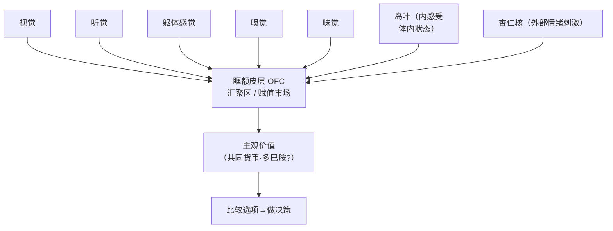
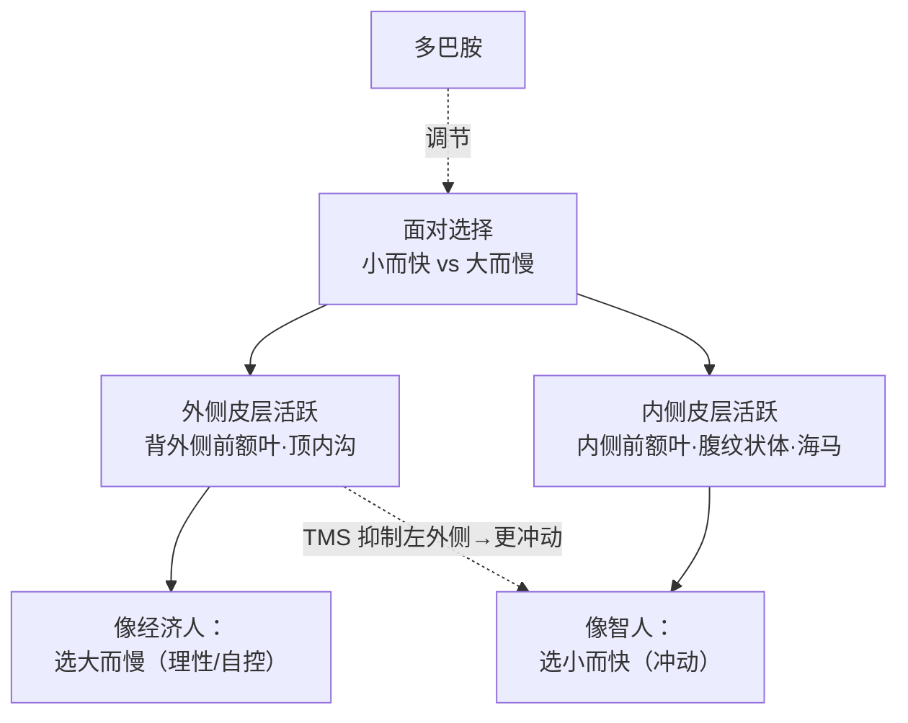
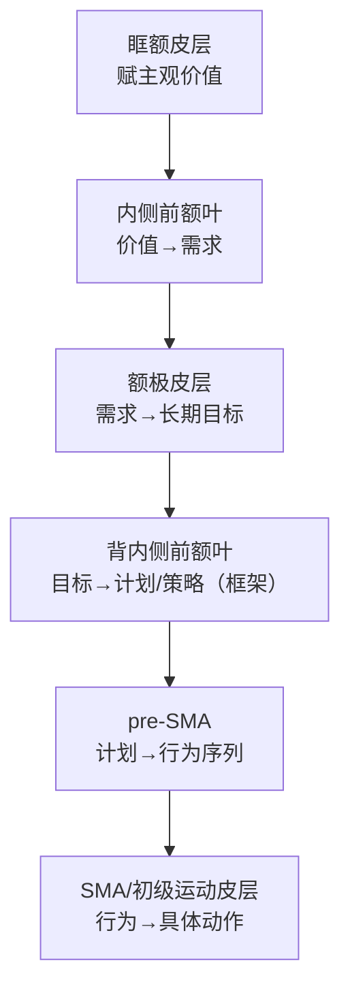
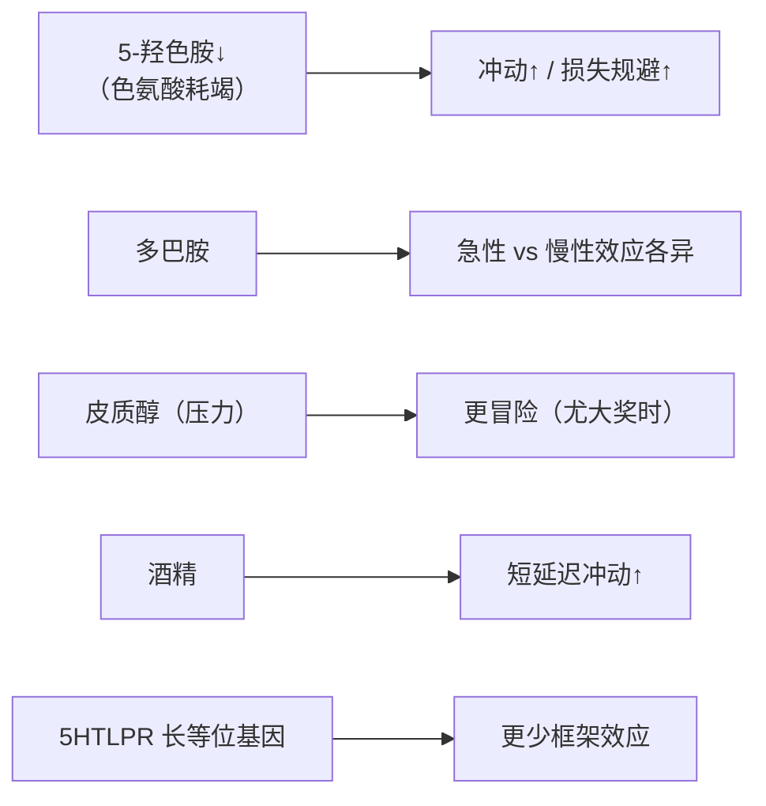

# 第12章 决策 · 详解（Decision Making）

> 《脑与行为：认知神经科学视角》Eagleman & Downar (2016)
> 本章以珠峰"死亡地带"的致命抉择起笔：为什么经验丰富的登山者明知须在午后两点前折返，却仍执意冲顶，甚至付出生命？缺氧固然损害判断，但**人类常在明知更好选择的情况下做出非理性决定**。以伊索寓言《蝎子与青蛙》为线索，本章追问：我们如何决策？为何非理性？这些从何而来？大脑如何用**主观价值的共同货币**在互斥选项间比较，并用**内侧前额叶层级**与多套系统、神经递质来调控决策。

---

## ① 概念解释

### 1.1 核心概念速查表

| 概念 | 英文 | 一句话解释 |
| --- | --- | --- |
| 效用 / 期望效用 | utility / expected utility | 某行动带来的价值或愉悦量；期望效用综合奖赏大小、概率、时间等 |
| 经济人 | Homo economicus | 假想的完全理性者，永远选期望效用最大的选项 |
| 理性选择理论 | rational choice theory | 描述理想理性主体如何在市场中最大化效用的原理 |
| 行为经济学 | behavioral economics | 用实证而非理论方法研究真人的实际决策 |
| 相对偏好 | relative preferences | 人按相对而非绝对判断价值（引入次优 C 可改变 A/B 偏好） |
| 风险规避 / 风险寻求 | risk averse / risk seeking | 中等概率收益时规避风险；小概率大奖时反寻求风险 |
| 前景理论 | prospect theory | Kahneman & Tversky：损益两侧曲线形状不同、零点处有"折点" |
| 框架效应 | framing effect | 同一结果按"收益/损失"措辞不同，选择随之翻转 |
| 禀赋效应 | endowment effect | 已拥有之物被赋予更高价值（卖价 > 买价） |
| 损失规避 | loss aversion | 对失去的在意大于对等量获得的在意（禀赋/框架的根源） |
| 延迟折扣 | delay discounting | 越晚的奖赏价值越低；人呈双曲线（近处陡、远处平） |
| 双曲折扣 | quasi-hyperbolic discounting | 对即时奖赏赋值过高，致偏好反转（小而快 vs 大而慢） |
| 双系统模型 | dual-systems model | 直觉系统(1，快/无意识) vs 理性系统(2，慢/有意识) |
| 主观价值共同货币 | common currency of subjective value | 脑把异质选项换算成可比较的统一价值（多巴胺或为其载体） |
| 眶额皮层 | orbitofrontal cortex (OFC) | 汇聚各感觉+内感受+杏仁核输入，评定刺激主观价值的"市场" |
| 腹内侧前额叶 | VMPFC | 按即时/内部价值赋值；框架效应中调节杏仁核 |
| 前岛叶 | anterior insula | 内感受"厌恶直觉"之源，驱动损失规避与风险规避 |
| 意动 | conation | 由内部冲动、驱力、动机引导自主行为（与认知互补） |

### 1.2 主观价值：眶额皮层作为"共同货币市场"（Mermaid 图）

> 关键点：OFC 把外部刺激属性（甜/冷/友好/敌意）与身体当前内部状态对照，据此判定"此刻该刺激对个体有多大价值"——同一巧克力吃到饱足时价值递减即证。

---

## ② 概念间关系

### 2.1 关系一览表

| 关系 | 内容 |
| --- | --- |
| 经济人 ↔ 智人 | 经济人完全理性；智人系统性偏离——不正确纳入不确定性、被框架左右、给已拥有之物加价 |
| 损失规避 → 禀赋效应 + 框架效应 | 二者皆为损失规避的副产品：已拥有→决策被"框"为失去；损失框→转向冒险 |
| 双曲折扣 → 冲动/成瘾 | 小而快之奖看似大于大而慢之奖（如香烟/暴饮/拖延），近处陡峭折扣是根源 |
| 内侧 vs 外侧前额叶 | 内侧(medial)=即时/内部/情绪/冲动（智人）；外侧(lateral)=延迟/外部/计算/自控（经济人）；试次间此消彼长 |
| 腹侧纹状体/VMPFC vs 前岛叶 | 前者代表奖赏价值、驱动趋近；后者内感受、驱动损失规避——前景理论损益曲线两形状对应两系统 |
| 主观价值 → 内部引导决策层级 | OFC 定价后，内侧前额叶层级把价值转成目标→计划→行为→动作（意动 conation） |
| 神经递质/激素 → 策略倾向 | 多巴胺、5-羟色胺、皮质醇等调节冲动性、损失规避与风险偏好；5HTLPR 基因影响框架敏感性 |

### 2.2 双系统与延迟折扣的神经切换（Mermaid 图）

---

## ③ 提问-回答

**Q1：为什么人既买彩票又买保险？**
因为**风险态度随损益与概率翻转**。小概率大收益（彩票）时人变**风险寻求**，愿超额付费追逐；小概率大损失（可投保灾难）时人变**风险规避**，愿超额付费规避。经济人绝不会如此不一致，但智人在不确定下"不一致主宰一切"，正被**前景理论**描述。

**Q2：框架效应与禀赋效应是什么？**
框架效应：同一救治方案，按"救 200 人"（收益框）多数选确定选项，按"死 400 人"（损失框）多数转向赌博——结果相同、措辞不同却翻转选择。禀赋效应：给学生马克杯后仅 10% 愿换巧克力，给巧克力后仅 11% 愿换杯——**已拥有即加价**，是损失规避的副产品。

**Q3：人比黑猩猩更有耐心吗？**
对**抽象奖赏（金钱）**看似是，人愿等数天数年。但对**食物这类原初奖赏**，直接对比中**人反而更冲动**：延迟 2 分钟时，人 80% 转选即时小奖，黑猩猩却 70% 愿等大奖。金钱无即时进化价值，故"人更耐心"多适用于抽象奖赏。

**Q4："坏决策来自坏脑子"这一直觉错在哪？**
非理性是**智人的普遍特征**，智力/教育/教养都无法根除；情境、框架、损益前景深刻影响决策。归因偏差（对应偏差）让我们把自己行为归于情境、把他人行为归于品性。更好的替代是"过时脑子"假说：我们继承狩猎采集祖先的脑，尚未适应现代文明，故理性与直觉两系统拉锯。

**Q5：脑用什么在"苹果和橘子"间比较？**
用**主观价值的共同货币**。当选项异质（三个番茄 vs 两个柚子），无汇率表可查，须读自身内部状态、偏好，预测哪种更改善整体状态，把两者换算成统一的主观价值。**眶额皮层**是核心赋值市场，**多巴胺**被提议为该共同货币；不同类选项（资源/目标/计划/动作）在不同"市场"中定价。

---

## ④ 科学研究已确定的结论

### 4.1 决策偏差与不一致对照表

| 现象 | 英文 | 经济人预测 | 智人实际 | 神经关联 |
| --- | --- | --- | --- | --- |
| 相对偏好 | relative preferences | 绝对、不受 C 影响 | 引入次优 C 可改变 A/B 偏好 | —— |
| 风险规避/寻求 | risk aversion/seeking | 按期望值一致 | 中概率收益规避、小概率大奖寻求 | 腹纹状体/VMPFC(趋近) vs 前岛叶(规避) |
| 框架效应 | framing effect | 措辞无关 | 收益框选确定、损失框选冒险 | 杏仁核；VMPFC/OFC 高者更理性 |
| 禀赋效应 | endowment effect | 买卖同价 | 卖价 > 买价 | 右岛叶（卖出时活动↑） |
| 双曲折扣 | hyperbolic discounting | 指数、稳定 | 近处陡、远处平，偏好反转 | 即时→内侧系统加入 |

### 4.2 三大情绪理论……（此处见第13章）——本章：决策神经系统对比表

| 系统 | 脑区 | 输入 | 特点 | 对应人物 |
| --- | --- | --- | --- | --- |
| 直觉系统（系统1） | 内侧前额叶/腹纹状体/杏仁核 | 内部状态·情绪·过往经验 | 快、无意识、并行、难言明 | 智人 |
| 理性系统（系统2） | 背外侧前额叶/顶内沟 | 外部世界线索 | 慢、有意识、序列、可言语 | 经济人 |
| 损失规避子系统 | 前岛叶 | 内感受"厌恶直觉" | 驱动损失/风险规避（禀赋效应） | —— |
| 奖赏趋近子系统 | 腹纹状体/VMPFC | 奖赏价值 | 随收益概率增而增，驱动冒险 | —— |

### 4.3 已确定的结论清单

- **人类系统性非理性**：相对偏好、风险态度翻转、框架效应、禀赋效应、双曲折扣，皆可复现，非"坏脑子"个例。
- **禀赋效应古老**：卷尾猴亦有（与人 3000 万年前分家），机制年代久远；黑猩猩风险偏好与人相反。
- **延迟折扣有独立神经系统**：即时奖赏额外招募内侧皮层（内侧前额叶、内侧眶额、腹纹状体、左后海马——多属边缘系统）；延迟决策由外侧（背外侧前额叶、顶内沟）主导。
- **因果证据**：TMS 抑制**左外侧前额叶**使人更冲动（选小而快），右侧或假刺激无效——证外侧前额叶对冲动控制必要。
- **风险决策双机制**：腹纹状体/VMPFC 管奖赏趋近，前岛叶管损失规避；VMPFC 损伤者仍有损失规避、岛叶损伤者几乎无视风险。
- **主观价值网络**：内侧前额叶、后扣带、腹纹状体的活动追踪延迟奖赏的主观价值（双曲曲线）；风险奖赏与延迟奖赏的价值基质部分重叠、部分不同。
- **内部引导决策层级**：OFC 定价→内侧前额叶(需求)→额极(目标)→背内侧前额叶(计划/框架)→pre-SMA/SMA(行为/动作)，各层用内部因素赋优先级（意动）。
- **递质/激素调控**：低 5-羟色胺增冲动与损失规避；多巴胺（右葡萄糖胺）急性/慢性效应各异；皮质醇使人更冒险；酒精增短延迟冲动。

---

## ⑤ 开放性未解决的问题与研究方向

### 5.1 本章明确抛出的开放问题

| 开放问题 | 方向描述 |
| --- | --- |
| 连接两决策系统的回路如何工作？ | 内侧(价值)与外侧(自控)如何互连调节仍是认知神经科学活跃前沿 |
| 主观价值的"共同货币"究竟是什么？ | 多巴胺被提议为货币，但是否唯一、如何在不同"市场"通用尚未定 |
| 神经递质在决策中的确切角色 | 研究不完整：多巴胺急性 vs 慢性、ADHD vs 健康人效应相反；大量细节未知 |
| 为何少数人先天更少受框架效应？ | 5HTLPR 长等位基因者更少框架效应、更多背/腹内侧前额叶激活；是否存在其他先天策略特质 |
| 如何把非理性机制"化 bug 为 feature"？ | 神经经济学初生，Ulysses 契约、框架/折扣工具如何改进健康/教育/财务决策仍在探索 |

### 5.2 内部引导决策的层级（Mermaid 图）

### 5.3 神经递质与激素对决策的调节（Mermaid 图）

---

## ⑥ 完整性核对（对照原文 KEY PRINCIPLES）

> 严格校验：本详解逐条覆盖第 12 章章末 9 条 KEY PRINCIPLES（原文第 34711 行起），无遗漏。

| # | 原文 KEY PRINCIPLE（要点） | 本详解对应位置 |
| --- | --- | --- |
| 1 | 经济人是智人的假想表亲，权衡所有因素、计算期望效用、永选价值最大者 | ①1.1 经济人 + ②2.1 |
| 2 | 智人并非总理性：不纳入不确定性、被框架左右、给已拥有之物加价 | ④4.1 偏差表 + Q1/Q2 |
| 3 | 延迟折扣：更看重近期奖赏；一研究发现人比黑猩猩更冲动 | ①双曲折扣 + Q3 |
| 4 | 脑含多套决策系统，其输出并不总一致 | ④4.2 系统对比表 + ②2.2 图 |
| 5 | 神经影像正揭示这些竞争系统如何产生常见的不一致/非理性决策 | ④4.3 + ②2.2 图 |
| 6 | 主观价值的共同货币让脑比较选项；其在不同神经"市场"运作（资源/目标/计划/动作） | ①1.2 图 + Q5 + ④4.3 |
| 7 | 内侧前额叶层级用内部因素给竞争的资源、目标、计划、动作、运动赋优先级 | ⑤5.2 层级图 + ④4.3 |
| 8 | 脑可用不同策略在不同情境部署不同决策机制，容许更灵活行为 | ④4.3 策略 + ⑤5.1 |
| 9 | 新兴的神经经济学或可帮助改进人类决策、避免其更具破坏性的非理性 | ⑤5.1 + THE BIGGER PICTURE |

---

## ⑦ 认知偏差 · 成因(Why) · 对策
> 本章是全书决策偏差的重镇：智人系统性偏离"经济人"的理性假设，被框架、损益、时间与情境反复左右。以下列出本章明确讨论的偏差，各给神经/心理成因与可操作对策。

| 认知偏差 / 误区 | 成因（Why） | 解决方案 / 对策 |
| --- | --- | --- |
| 框架效应（framing effect） | 同一结果按"收益"或"损失"措辞呈现时，损失框激活杏仁核、推人转向冒险；VMPFC/OFC 对情绪框的调节因人而异 | 主动**重新框定**：把同一决策同时用收益与损失两种表述算一遍，取一致结论；提高对措辞的元认知警觉 |
| 损失厌恶 / 禀赋效应（loss aversion / endowment） | 前岛叶的内感受"厌恶直觉"使失去之痛大于等量获得之乐，已拥有之物被自动"框"为将失去而加价（卖价>买价） | 把决策重述为"若尚未拥有，会否以此价买入？"；以机会成本对齐买卖两端，剥离占有带来的情绪加成 |
| 延迟折扣 / 现时偏差（present bias） | 面对即时奖赏，内侧前额叶/腹纹状体等边缘系统额外加入，形成双曲折扣：近处曲线陡峭，使小而快看似胜过大而慢，酿成冲动与拖延 | **拉长时间视野**、显性化未来价值；预先承诺（尤利西斯契约）绑住未来的自己，用外侧前额叶的自控预设选项 |
| 锚定（anchoring） | 初始数值/参照点先入为主地设定评估基准，相对偏好使后续判断围绕锚点微调而非绝对定价 | 主动寻找多个独立参照与外部基准，警惕对方给出的第一个数字；以统计数据而非首现印象作评估起点 |
| 沉没成本谬误（sunk cost） | 已投入的资源被损失厌恶放大，退出被"框"为承认损失，情绪上难以接受，遂继续加注（珠峰冲顶式抉择） | 只按**边际的未来成本与收益**决策；把已花费视作不可回收、与当下无关；预设折返/止损线并事先承诺遵守 |
| "经济人"完全理性假设的偏差 | 理性选择理论假定人永选期望效用最大者，但智人受多套竞争决策系统、情绪与情境驱动，非理性是普遍特征而非"坏脑子" | 承认偏差普遍存在、智力/教育无法根除；借神经经济学工具（重新框定、预先承诺、用统计/基率）把 bug 化为可管理的 feature |

*本详解忠于第 12 章原文（珠峰引子、蝎子与青蛙、经济人与理性选择、可预测的非理性、非理性从何而来、脑如何决策、主观价值共同货币、内部引导决策层级、决策调节者、Ulysses 契约等节）与章末 KEY PRINCIPLES / KEY TERMS，术语中英并列，OCR 拼写已据常识还原。*
