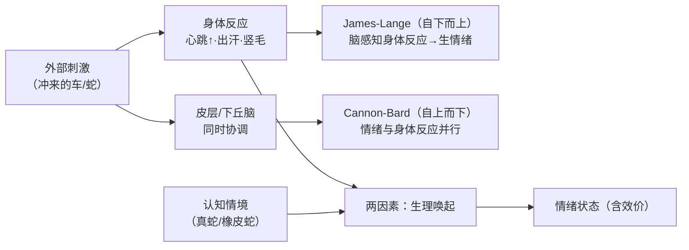
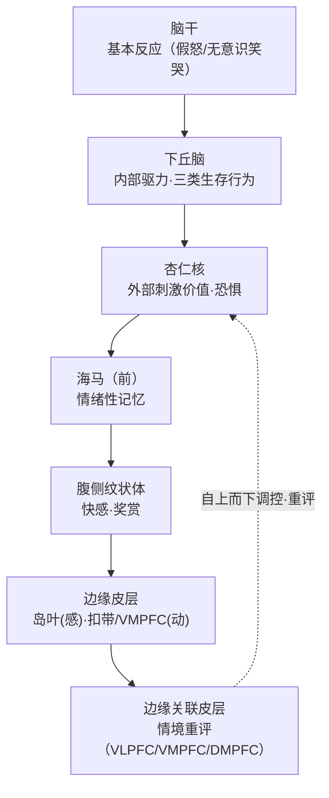
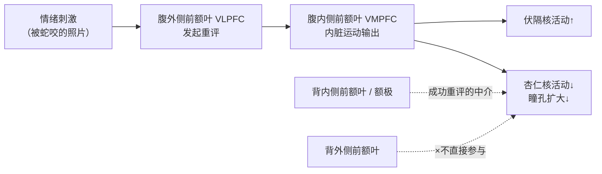
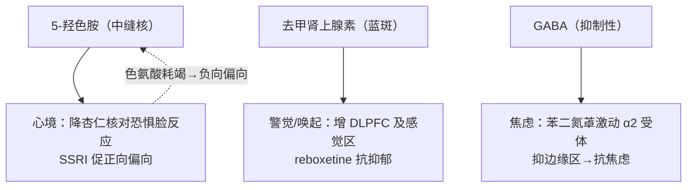

# 第13章 情绪 · 详解（Emotions）

> 《脑与行为：认知神经科学视角》Eagleman & Downar (2016)
> 本章以 Susanna 的故事起笔：帕金森病人接受丘脑底核深部脑刺激（DBS），当右侧最下两触点通电的瞬间，她被"深不见底的悲伤"淹没、失控痛哭；关掉即缓解，再开又几乎立刻回来。**若情绪能在开关一拨间被点燃或熄灭，那它必有电路图、必是物质过程。** 本章由此系统梳理：三大早期情绪理论（James-Lange 自下而上 / Cannon-Bard 自上而下 / 两因素）、核心边缘结构（下丘脑、杏仁核、海马、腹侧纹状体）、边缘皮层（岛叶、扣带、VMPFC）与情绪重评，以及 5-羟色胺、去甲肾上腺素、GABA 三大神经化学影响。

---

## ① 概念解释

### 1.1 核心概念速查表

| 概念 | 英文 | 一句话解释 |
| --- | --- | --- |
| James-Lange 理论 | James-Lange theory | 自下而上：先有身体反应，脑感知身体反应后才生情绪（"因发抖才害怕"） |
| Cannon-Bard 理论 | Cannon-Bard theory | 自上而下：情绪与身体反应在皮层/下丘脑层面被同时协调 |
| 两因素理论 | two-factor theory | Schachter-Singer：生理唤起 + 认知情境共同决定情绪（及其效价） |
| 自下而上/自上而下 | bottom-up / top-down | 情绪从内脏信号涌起 vs 从皮层情境向下驱动 |
| 假怒 | sham rage | 去皮层猫自发出现的嘶叫龇牙等威胁反应，无内在情绪 |
| 内感受 | interoception | 对体内生理状态（痛、饿、渴、心跳等）的感知 |
| 下丘脑 | hypothalamus | 协调三类生存行为、监测血液、经三通路调节内环境的"主内分泌腺" |
| 三类动机行为 | motivated behaviors | 生殖、摄食（appetitive）、争斗（agonistic） |
| 杏仁核 | amygdala | 向外看世界，评定外部刺激情绪价值并发起相应反应（尤恐惧） |
| 基底外侧 / 中央内侧杏仁核 | basolateral / centromedial | 前者"值多少"（追踪价值），后者"该做什么"（执行反应） |
| 恐惧条件化 | fear conditioning | 中性声音与电击配对后，声音单独即引发恐惧反应 |
| 海马（前/后） | hippocampus | 前部→情绪性记忆与应激；后部→空间记忆导航 |
| 腹侧纹状体 | ventral striatum | 快感与奖赏的"享乐热点"；损伤致快感缺失（anhedonia） |
| Papez 环路 | circuit of Papez | 连接下丘脑-丘脑-扣带-海马的情绪表达环路（1937） |
| 岛叶（前/后） | insula | 边缘感觉皮层：后部基本内脏感觉，前部整合为"感受" |
| 扣带皮层 | cingulate cortex | 边缘系统的"运动皮层"，可调控下位边缘结构 |
| 腹内侧前额叶 | VMPFC | "直觉/躯体标记"的发生器；情绪重评中抑制杏仁核 |
| 躯体标记假说 | somatic marker hypothesis | 情绪决策靠脑预先生成的内脏信号（"别去那儿"的直觉） |
| 情绪重评 | reappraisal | 依情境调整对刺激的情绪反应（VLPFC→VMPFC→抑杏仁核） |

### 1.2 情绪的双通路：自下而上 vs 自上而下（Mermaid 图）

> 关键点：现代观点多**兼收两端**——情绪既有内脏（自下而上）成分，也有皮层情境（自上而下）成分；且从单一系统转向**多套部分可分离的系统**，解剖描述日趋精细。

---

## ② 概念间关系

### 2.1 关系一览表

| 关系 | 内容 |
| --- | --- |
| 三理论演进关系 | James-Lange（纯自下而上）→ Cannon-Bard（纯自上而下，引入下丘脑/皮层）→ 两因素（调和二者）；今日多兼收 |
| 情绪 vs 情绪表达可分离 | 假怒、假性延髓情绪（pseudobulbar affect）证明"内在情绪"与"外在表达"是两条可分离通路 |
| 下丘脑（向内）↔ 杏仁核（向外） | 下丘脑监测体内、管三类生存行为；杏仁核评外部刺激价值——互补，共为核心边缘结构 |
| 杏仁核内部：值多少 → 该做什么 | 基底外侧追踪价值 → 中央内侧执行反应；恐惧条件化经此回路强化 |
| 海马前/后 → 杏仁核连续谱 | 后海马(地点)→前海马(事件+情绪)→杏仁核(当前刺激情绪价值)，功能连续过渡 |
| 核心边缘 → 边缘皮层层级 | 下丘脑/杏仁核/海马/腹纹状体生成基本情绪；岛叶(感)/扣带·VMPFC(动)生成并调控"感受" |
| 边缘皮层 → 情绪重评 | 关联皮层(VLPFC→VMPFC→DMPFC/额极)按情境重评，抑制杏仁核、增强伏隔核 |
| 神经递质 → 情绪，须经神经元 | 5-羟色胺/去甲肾/GABA 只有改变特定回路神经元放电才影响情绪；效果取决于哪些神经元被影响 |

### 2.2 情绪的神经层级（Mermaid 图）

---

## ③ 提问-回答

**Q1：三大情绪理论如何区分？**
**James-Lange（自下而上）**：内脏反应在先，脑感知它才生情绪——极端形式说若身体反应被阻断则无情绪。**Cannon-Bard（自上而下）**：Cannon 指出去内脏猫仍有情绪、内脏反应太慢太不特异，故主张丘脑分两路，一路到皮层生情绪、一路到下丘脑生身体反应。**两因素（Schachter-Singer）**：注射肾上腺素的被试情绪强度更大，但效价（欣快/愤怒）取决于身旁演员营造的情境——生理唤起 + 认知情境共同定情绪。

**Q2：假怒和假性延髓情绪说明了什么？**
说明**内在情绪与外在表达可分离**。去皮层猫出现"假怒"（嘶叫龇牙但无真情绪）；多发性硬化病人因皮层-脑干抑制性连接受损出现**假性延髓情绪**——无内在悲喜却失控大笑大哭。二者证明情绪的"发生"与"表现"是两条独立通路。

**Q3：下丘脑管什么？为何被称"主控腺"？**
下丘脑协调三类生存行为：**生殖、摄食、争斗**；并能直接监测血液成分（电解质、血糖、激素、免疫标志）。它有三条输出通路——自主（交感/副交感）、神经内分泌（经垂体控制全身内分泌腺，故称主内分泌腺）、动机（上行至纹状体与皮层组织复杂行为）。DBS 误刺激下丘脑可即时引发暴怒或惊恐发作，含真实主观情绪。

**Q4：杏仁核损伤（如"无惧女子"S.M.）会怎样？**
S.M. 双侧杏仁核缺失（Urbach-Wiethe 病），智力、记忆、语言正常，其他情绪（喜怒惊悲厌）皆在，**唯独不能体验或识别恐惧**——面对蛇、鬼屋反觉兴奋好奇。杏仁核并非"所有情绪"中枢，而是特化于**威胁评估与恐惧部署**；失去它，"恐惧的进化价值丧失"，令她屡陷险境。

**Q5：VMPFC 与"躯体标记"如何指导决策？**
爱荷华赌博任务(IGT)中，健康人吃亏后转向"安全牌组"，且在**碰危险牌组前**就产生皮肤电反应(GSR)，如预感恶果。VMPFC 损伤者却持续抽危险牌、无法生成**预期性 GSR**——**躯体标记假说**认为情绪决策靠脑预先生成内脏"别去那儿"信号；VMPFC 病人之缺陷非智力问题，而是无法生成这种预警直觉。

---

## ④ 科学研究已确定的结论

### 4.1 三大情绪理论对比表

| 理论 | 英文 | 方向 | 核心主张 | 关键证据/难点 |
| --- | --- | --- | --- | --- |
| James-Lange | James-Lange theory | 自下而上 | 先有身体反应，脑感知后才生情绪（"因哭才悲"） | 纯自主失败(pure autonomic failure)病人报告情绪减弱，支持内脏有份 |
| Cannon-Bard | Cannon-Bard theory | 自上而下 | 情绪与身体反应在丘脑分两路、皮层/下丘脑协调 | 去内脏/去皮层动物仍有情绪；内脏反应太慢太不特异 |
| 两因素 | two-factor theory | 双向调和 | 生理唤起 + 认知情境共同决定情绪与效价 | 肾上腺素+情境实验；吊桥实验（唤起被误归为性吸引） |

### 4.2 核心边缘结构功能表

| 结构 | 英文 | 主要功能 | 损伤/刺激效应 |
| --- | --- | --- | --- |
| 下丘脑 | hypothalamus | 三类生存行为、监测血液、三输出通路 | 肿瘤致暴食/暴怒；DBS 误刺激致惊恐 |
| 杏仁核 | amygdala | 评外部刺激价值、恐惧条件化 | S.M. 无惧；Kluver-Bucy 综合征 |
| 海马（前） | anterior hippocampus | 情绪性记忆、应激激素调节 | 与抑郁/PTSD 中海马体积减小相关 |
| 腹侧纹状体 | ventral striatum | 快感与奖赏"享乐热点" | Olds-Milner 自我刺激；损伤致快感缺失 |
| 岛叶 | insula | 后部内脏感觉、前部整合为"感受" | 前岛叶癫痫可产生极乐/焦虑等情绪 |
| 扣带皮层(ACC) | cingulate cortex | 边缘"运动皮层"、心理努力/冲突 | 损伤失"努力感"但 Stroop 表现如常 |
| VMPFC | VMPFC | 生成躯体标记/直觉、情绪重评 | Phineas Gage；IGT 缺陷；损伤反不抑郁 |

### 4.3 已确定的结论清单

- **三理论各有优劣、无绝对优胜**：现代账目多兼收自下而上与自上而下，并从单一系统转向多套可分离系统。
- **下丘脑协调三类动机行为**（生殖、摄食、争斗），并经自主/内分泌/动机三通路作用。
- **杏仁核**接收外部感觉输入、评定刺激情绪价值、发起相应反应（尤其恐惧）；"值多少"(基底外侧)到"该做什么"(中央内侧)。
- **前海马**在记忆事件情绪意义中关键；后海马管空间（伦敦出租车司机后海马增大）。
- **腹侧纹状体**活动与奖赏行为、快感相关；是"享乐热点"，损伤致 anhedonia。
- 这些核心边缘回路似**生成主观感受与动机**，兼配相应激素与自主反应。
- **边缘皮层（岛叶、扣带、VMPFC）**影响海马与杏仁核，对生成与调控情绪至关重要。
- **情绪重评**依情境评估并改变反应，涉 VMPFC、VLPFC、DMPFC；**DLPFC 并不直接参与重评/调控情绪**（损伤/影像双证）。
- **脑刺激或损伤**：伤及核心边缘区改变情绪状态，伤及边缘关联皮层则改变情绪调节（DMPFC 损伤→高抑郁；VMPFC 损伤→反不抑郁）。
- **5-羟色胺、去甲肾上腺素、GABA** 是与情绪回路最相关的三递质，须经改变神经元活动方起效；相应药物用于治疗抑郁与双相障碍。

---

## ⑤ 开放性未解决的问题与研究方向

### 5.1 本章明确抛出的开放问题

| 开放问题 | 方向描述 |
| --- | --- |
| 为何主观情绪体验涌现于此层级（下丘脑）而非他处？ | 下丘脑是首个将"感知输入-表征驱力-修改内部状态"三功能绑在一起的层级，但机制无人确知 |
| 海马体积减小是抑郁之因还是果？ | 抑郁/PTSD/双相常见海马缩小，但究竟致病还是应激激素的副作用尚不清 |
| 抑郁时 VMPFC 为何反常放大情绪？ | 重评时 VMPFC 高活动在抑郁者反增杏仁核活动；究竟是放大还是抑制失败，需因果（TMS/刺激）研究区分 |
| DBS 的长期结局与伦理 | 结局参差（帕金森运动改善但生活质量未必），何时利大于弊、患者期望是否现实，伦理待厘清 |
| 如何预测抗抑郁药类型？ | 5-羟色胺 vs 去甲肾上腺素网络效应不同，或可事先预测何种抗抑郁药对某患者有效，免去试错 |

### 5.2 情绪重评的皮层机制（Mermaid 图）

### 5.3 三递质对情绪的影响（Mermaid 图）

---

## ⑥ 完整性核对（对照原文 KEY PRINCIPLES）

> 严格校验：本详解逐条覆盖第 13 章章末 10 条 KEY PRINCIPLES（原文第 38171 行起），无遗漏。

| # | 原文 KEY PRINCIPLE（要点） | 本详解对应位置 |
| --- | --- | --- |
| 1 | 三大情绪理论：James-Lange（自下而上）、Cannon-Bard（自上而下）、Schachter-Singer 两因素（二者皆重要） | ④4.1 三理论表 + ①1.2 图 + Q1 |
| 2 | 下丘脑协调三类生存行为：生殖、摄食、争斗（统称动机行为） | ①下丘脑 + ④4.2 + Q3 |
| 3 | 杏仁核接收外部世界感觉输入，解释刺激情绪价值并发起相应情绪反应 | ①杏仁核 + ④4.2 + Q4 |
| 4 | 另一重要边缘结构是海马；前海马在记住事件情绪意义中关键 | ①海马 + ④4.2 |
| 5 | 腹侧纹状体活动与奖赏行为和快感相关 | ①腹侧纹状体 + ④4.2/4.3 |
| 6 | 这些核心边缘回路似生成主观感受与动机，并配相应激素与自主反应 | ②2.2 层级图 + ④4.3 |
| 7 | 边缘皮层（岛叶、扣带、VMPFC）影响海马与杏仁核，对生成与调控情绪重要 | ①边缘皮层 + ④4.2/4.3 |
| 8 | 情绪重评：依情境评估并改变反应，涉 VMPFC、VLPFC、DMPFC | ⑤5.2 重评图 + Q5 |
| 9 | 同区可调节情绪，但 DLPFC 并不直接参与重评或调控情绪 | ④4.3 + ⑤5.2 图 |
| 10 | 脑刺激/损伤可改变情绪状态（核心边缘区）或情绪调节（关联皮层）；5-HT/NE/GABA 三递质影响情绪，相关药治抑郁与双相 | ④4.3 + ⑤5.3 图 + 引子 Susanna |

---

## ⑦ 认知偏差 · 成因(Why) · 对策
> 情绪不是理性的对立面，而是判断与决策的组成部分；但当唤起来源被错认、当心境给认知染色时，它也会系统性地扭曲判断。以下列出本章涉及的情绪相关偏差与误区，各给成因与对策。

| 认知偏差 / 误区 | 成因（Why） | 解决方案 / 对策 |
| --- | --- | --- |
| 心境一致性判断偏差（mood-congruent） | 当前心境会给记忆提取与评估染色：悲伤时更易忆起并放大负面信息，愉快时反之——情绪状态成为无意识的判断底色 | 做重要判断前先识别并标注当下心境；用情绪**重评（reappraisal）**（VLPFC→VMPFC 抑杏仁核）调整反应，或延后到情绪平稳再定 |
| 情感启发（affect heuristic）——以感受代替分析 | 面对复杂选项时，脑用 OFC/VMPFC 生成的"好坏感受"（躯体标记）快速替代费力的理性计算，直觉虽高效却可被无关情绪污染 | 认识直觉是有用的第一近似而非终判；对高风险决策补以显式的证据与基率核算，让感受与数据相互校验 |
| 生理唤起的错误归因（吊桥效应） | 两因素理论：生理唤起本身无标签，脑据当下情境为其编造原因；吊桥上的心跳加速被误归为对同伴的吸引 | 区分**唤起的真实来源**：先问"我的心跳/紧张是不是来自无关情境（咖啡因、运动、环境）？"再决定其情绪含义，避免张冠李戴 |
| "无情绪的纯理性更优"的误解 | 直觉上认为剔除情绪能让决策更理性；忽视了情绪为选项赋予主观价值、提供"别去那儿"的预警 | 用**躯体标记假说**反驳：VMPFC 损伤者情绪淡漠反而决策灾难（IGT 屡抽危险牌、无预期性 GSR）；情绪对良好决策是**必要**而非障碍 |

*本详解忠于第 13 章原文（Susanna DBS 引子、早期情绪理论、核心边缘结构、边缘皮层与情绪、情绪重评、神经化学影响各节及多个案例研究）与章末 KEY PRINCIPLES / KEY TERMS，术语中英并列，OCR 拼写已据常识还原。*
