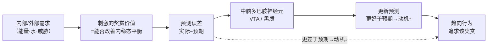
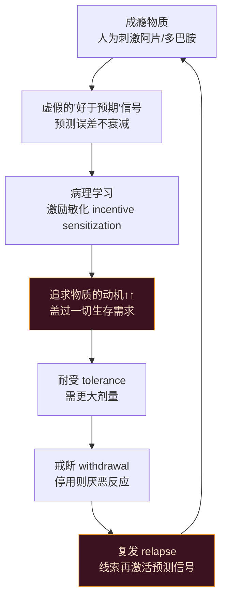
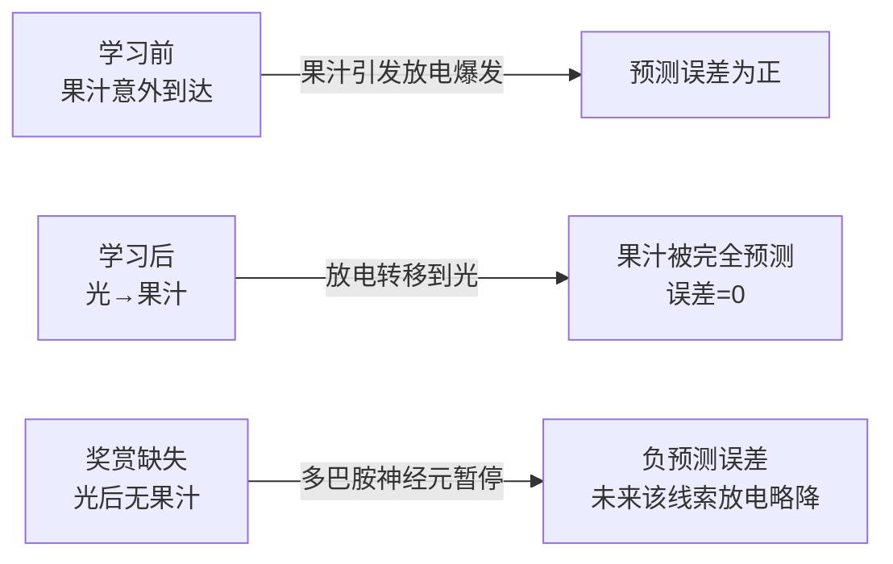

# 第14章 动机与奖赏 · 详解（Motivation and Reward）

> 《脑与行为：认知神经科学视角》Eagleman & Downar (2016)
> 本章以 STARTING OUT"比生存本身更重要"起笔：受人尊敬的医生"Frank"在心脏病发作、命悬一线之际，仍每隔几小时偷偷溜出去抽烟——**对香烟的渴求竟盖过了求生本能**。由此引出全章主线：动机与奖赏的架构古老而关乎生存，成瘾则是这套架构被"劫持"、扭曲成病理形态的结果。

---

## ① 概念解释

### 1.1 核心概念速查表

| 概念 | 英文 | 一句话解释 |
| --- | --- | --- |
| 动机 | motivation | 情绪的"运动侧"，为竞争的生存驱力设定优先级的信号 |
| 内驱力 vs 外驱力 | internal / external drives | 内驱力（能量/水/体温等）由下丘脑协调；外驱力（威胁/交配/社会）由杏仁核协调 |
| 内感受 | interoception | 大脑对身体内部状态的感知，为设定动机优先级提供依据 |
| 内稳态 | homeostasis | 把内部参数维持在生存最优点附近 |
| 应激稳态 | allostasis | 面对外部挑战，通过生理/行为改变而非维持恒定来达成稳定 |
| 下丘脑 | hypothalamus | 内稳态与内驱动机的评估中枢，含二十余核团（弓状核、室旁核等） |
| 杏仁核 | amygdala | 接收外界感觉输入，评估外部刺激对生存繁殖的意义并发起反应 |
| 多巴胺 | dopamine | 传递奖赏与动机信号的核心递质，编码"预测误差" |
| 奖赏 | reward | 使机体内稳态/应激稳态平衡更接近理想设定点的任意刺激 |
| 预测误差 | prediction error | 实际结果与预期结果之差，是关联学习的关键 |
| 喜欢 vs 想要 | liking vs wanting | 喜欢=当下的愉悦感（阿片系统）；想要=对未来愉悦的预期（多巴胺系统） |
| 阿片系统 | opioid system | 缓解疼痛、增加愉悦的天然化学系统（μ/κ/δ/nociceptin 受体） |
| 成瘾 | addiction | 一种病理性动机、学习与奖赏疾病 |
| 耐受/戒断/复发 | tolerance/withdrawal/relapse | 成瘾三大标志：需更大剂量、停用则难受、戒后易复发 |
| 动机式访谈 | Motivational Interviewing (MI) | 从个人价值观内部"引出"改变动机的技术 |

### 1.2 奖赏学习：从预测误差到动机（示意图）

> 关键点：多巴胺放电并不编码"奖赏本身"，而是编码**预测误差**。完全被预测到的奖赏不再引起多巴胺爆发；缺失预期奖赏则产生"负爆发"。

---

## ② 概念间关系

### 2.1 关系一览表

| 关系 | 内容 |
| --- | --- |
| 下丘脑 ↔ 杏仁核 分工 | 下丘脑管内部驱力，杏仁核管外部威胁/机会；两者输出均为自主、内分泌、动机三路 |
| 动机 ← 内感受 ← 内稳态 | 动机须先知身体缺什么（内感受），才能设定优先级；前岛叶整合内部状态 |
| 多巴胺 = "动机的共同货币" | 全脑仅约 50 万多巴胺神经元，却为无数竞争驱力定优先级；解决"羚羊喝水 vs 躲鳄鱼"两难 |
| 喜欢（阿片）≠ 想要（多巴胺） | 成瘾中"想要"随暴露递增且难消退，"喜欢/快感"却下降——两套回路分离 |
| 递质是信使，不是功能 | 同一递质在不同脑区/时间尺度有不同效应；多巴胺≠"奖赏物质" |
| 自然奖赏 → 病理奖赏 | 成瘾物质人为刺激阿片/多巴胺，制造虚假奖赏与"永远好于预期"，触发病理学习 |
| 岛叶 ↔ 成瘾 | 前岛叶追踪"渴求"这种内部状态；岛叶损伤者戒烟几率高逾百倍 |

### 2.2 成瘾恶性循环（示意图）

---

## ③ 提问-回答

**Q1：为什么医生 Frank 心脏病发作后仍无法戒烟？成瘾为何"明知有害仍继续"？**
成瘾从核心上**重塑了动机回路本身**，把它扭曲成异于常态的形态。物质人为刺激阿片/多巴胺系统，制造"改善"的幻觉与"永远好于预期"的虚假预测误差，使追求物质的动机不断增强，最终盖过求生等基本需求。此时"通常的动机物理学不再适用"。

**Q2：为什么大脑需要一个"动机的共同货币"？**
生存是平衡术：口渴的羚羊要喝水，但水坑里潜伏鳄鱼。两个驱力冲突时，满足一个常意味着牺牲另一个。大脑需要一种可比较不同行动/目标相对价值的通用尺度——这正是中脑多巴胺活动的作用。

**Q3：一个人如何可能强烈"想要"香烟，却只"轻微享受"它？**
因为**喜欢与想要是两套系统**。喜欢是当下内感受性的愉悦（μ-阿片系统），想要是对未来愉悦的习得性预期（多巴胺系统）。成瘾中，反复暴露使快感（rush）递减，但为获取物质所愿付出的努力反而递增。吸烟者常报告"没多少乐趣，却有强烈的强迫性"。

**Q4：阿片系统如何贡献奖赏与快感？为何说"快感中枢/奖赏中枢"过于简单？**
μ-（及 δ-）阿片受体介导镇痛与欣快/奖赏，κ-阿片受体反而产生厌恶。μ-激动剂增强自然奖赏（如高糖溶液）的"喜爱"行为。但阿片是一个庞大递质家族（脑啡肽、强啡肽、β-内啡肽），分布全脑、功能重叠——"每种递质在不同脑区刺激受体就有不同功能"，故无单一"中枢"。

**Q5：为什么帕金森病人服大剂量多巴胺药后可能变成病理性赌徒？**
多巴胺增强药会把"永远好于预期"的信号注入奖赏回路，触发对赌博、购物、性等的病理性激励学习。案例中 Kathy（44 岁确诊帕金森）出现病理性赌博、性欲亢进、强迫购物；降低剂量后行为恢复正常。约 10–15% 服此类药者会出现此类冲动控制障碍。

---

## ④ 科学研究已确定的结论

### 4.1 内/外驱力与两大结构

| 结构 | 英文 | 主管驱力 | 代表机制/核团 |
| --- | --- | --- | --- |
| 下丘脑 | hypothalamus | 内部（能量/水/体温/昼夜/应激/繁殖/防御） | 弓状核 leptin→NPY(增食)/POMC(减食)；ob/ob 小鼠缺瘦素而肥胖 |
| 杏仁核 | amygdala | 外部（威胁/交配/社会/依恋/联盟） | 基底外侧核（快至 25 ms 响应威胁）；中央内侧核为输出；终纹床核协调应激 |

### 4.2 四种阿片受体（功能对照）

| 受体 | 英文 | 主要效应 |
| --- | --- | --- |
| μ-阿片受体 | mu | 镇痛、欣快、奖赏、依赖；呼吸抑制、便秘等副作用 |
| κ-阿片受体 | kappa | 反奖赏、烦躁不悦（dysphoric）、负强化；亦有脊髓镇痛 |
| δ-阿片受体 | delta | 部分镇痛、参与阿片依赖，可能有抗抑郁效应 |
| nociceptin 受体 | nociceptin | 了解较少，分布与功能仍在研究 |

### 4.3 成瘾治疗药物一览（确定性疗法）

| 物质 | 代表药物 | 机制 |
| --- | --- | --- |
| 酒精 | 苯二氮䓬类 | 戒断期增强 GABA，防致命性戒断（发热/谵妄/癫痫） |
| 酒精 | 纳曲酮 naltrexone | 阿片拮抗剂，钝化饮酒快感、减渴求 |
| 酒精 | 阿坎酸 acamprosate | 重建 GABA/谷氨酸平衡，降复发风险 |
| 酒精 | 双硫仑 disulfiram | 抑制乙醛脱氢酶，饮酒后剧烈恶心呕吐（威慑） |
| 尼古丁 | 尼古丁贴/胶/吸入 | 递减非吸入尼古丁，避戒断与渴求 |
| 尼古丁 | 安非他酮 bupropion | 轻度抑制多巴胺再摄取，减渴求与吸烟快感 |
| 尼古丁 | 伐尼克兰 varenicline | 尼古丁受体部分激动剂，够缓戒断而不足维持成瘾 |
| 阿片 | 美沙酮 methadone | 长效阿片替代，缓戒断、恢复正常生活 |
| 阿片 | 丁丙诺啡 buprenorphine | 部分激动剂，弱激动 μ 受体同时阻断其他阿片，无过量之虞 |
| 多巴胺类（可卡因/冰毒） | —— | 目前无证实有效药物 |

### 4.4 已确定的结论清单

- 自然动机（进食、饮水、繁殖）告诉大脑当下缺什么、如何为需求赋值。
- 下丘脑主内稳态与内驱动机；杏仁核评估外部因素重要性；**多巴胺是最常传递奖赏与动机信号的递质**。
- 大脑通过比较预期与实际结果学习预测奖赏；"好于预期"增强未来该行为动机（Rescorla-Wagner / 时序差分模型，与多巴胺神经元放电高度吻合）。
- 喜欢≠想要：喜欢是当下愉悦（μ-阿片），想要是对未来愉悦的预期（多巴胺）。
- 阿片是天然镇痛增乐化学物；可被吗啡、海洛因、可待因等合成阿片模拟。
- 已发现多型阿片受体：刺激某些减痛（μ/δ），刺激另一些（κ）产生不悦。
- 多巴胺对动机与奖赏预测学习尤为重要，尤其基于"多意外"为奖赏赋值。
- 递质是信使不是功能：阿片、多巴胺像所有递质一样，功能取决于在何处刺激受体。
- 成瘾是病理性动机、学习与奖赏之疾。
- 成瘾物质人为刺激阿片/多巴胺，制造虚假奖赏与虚假未来预测，点燃异常学习；追求物质的动机渐盖过一切（甚至基本生存需求）；逆转困难，因需"反学习"。
- 目前多数物质依赖的治疗**并不有效**；发现更好疗法可能需要机遇（serendipity）+ 对基本机制的更深理解。

---

## ⑤ 开放性未解决的问题与研究方向

### 5.1 本章明确抛出的开放问题

| 开放问题 | 方向描述 |
| --- | --- |
| 能否找到"不成瘾的阿片"？ | 一个多世纪来仍在寻找可复制阿片镇痛/欣快而不产生依赖的物质 |
| 多巴胺的统一功能是什么？ | 同一多巴胺回路既管运动又管奖赏，学界尚无统一计算解释（空间差异 vs 时间尺度差异两说不互斥） |
| 幸福为何难以追上？ | "享乐跑步机"：期望随奖赏同步加速，预测误差迅速归零；正性心理学寻解（心流、正念、规律小确幸） |
| 成瘾疗法为何难产？ | 免疫接种（主动/被动）、伊博格碱 ibogaine、前岛叶损伤三条线索均困难重重 |
| 前岛叶启示能否转化为疗法？ | 岛叶损伤者戒烟率高逾百倍，但手术切除风险巨大；需无创、保留其他功能的方法（TMS/tDCS） |

### 5.2 三条"机遇型"未来疗法线索

| 线索 | 现状 |
| --- | --- |
| 免疫接种（抗可卡因抗体） | 主动接种个体差异大、大剂量可淹没免疫；被动接种维持短、昂贵，尚未成主流 |
| 伊博格碱 ibogaine | 西非伊博加树皮天然物，作用于多受体家族；报告可长效抗成瘾但机制"混乱"、有心脏/小脑毒性，多国列为非法，人体研究稀少 |
| 前岛叶靶点 | 中风损伤前岛叶者"身体忘了吸烟的冲动"；DBS 有效但侵入昂贵，TMS/tDCS 或为无创出路 |

### 5.3 奖赏学习的多巴胺放电三阶段（示意图）

---

## ⑥ 完整性核对（对照原文 KEY PRINCIPLES）

> 严格校验：本详解逐条覆盖第 14 章章末 11 条 KEY PRINCIPLES（原文第 41239 行起），无遗漏。

| # | 原文 KEY PRINCIPLE（要点） | 本详解对应位置 |
| --- | --- | --- |
| 1 | 自然动机（吃、喝、繁殖）帮大脑知道当前需要什么、如何为需求赋值 | ①内驱/外驱 + ④4.4 |
| 2 | 下丘脑管内稳态与内驱动机；杏仁核评估外部因素；多巴胺最常传递奖赏/动机信号 | ①1.1 + ④4.1 + ②2.1 |
| 3 | 大脑通过比较预期与实际结果学习预测奖赏；"好于预期"增强未来动机 | ①1.2 图 + ⑤5.3 + Q1 |
| 4 | "喜欢"与"想要"不同：喜欢=当下的幸福感，想要=对未来幸福的预期 | ①喜欢vs想要 + Q3 |
| 5 | 阿片是天然减痛增乐化学物，可被吗啡、海洛因、可待因等合成阿片模拟 | ①阿片系统 + Q4 |
| 6 | 已发现多型阿片受体：刺激某些减痛，刺激另一些产生不悦 | ④4.2 四受体表 |
| 7 | 多巴胺对动机与奖赏预测学习重要，尤其基于奖赏的意外程度赋值 | ①多巴胺 + ④4.4 |
| 8 | 阿片与多巴胺（如所有递质）功能多样，取决于在脑中何处刺激受体 | ②递质是信使 + ④4.4 |
| 9 | 成瘾是病理性动机、学习与奖赏之疾 | ②2.2 图 + ④成瘾 |
| 10 | 成瘾物质人为刺激阿片/多巴胺制造虚假奖赏与未来预测，点燃异常学习，动机渐盖过基本需求；逆转难因需反学习 | ②2.2 图 + Q1 |
| 11 | 多数物质依赖当前治疗无效；更好疗法或需机遇 + 更深机制理解 | ④4.3 + ⑤5.2 |

---

## ⑦ 认知偏差 · 成因(Why) · 对策
> 动机与奖赏架构古老而关乎生存，一旦被物质"劫持"或被主观误读，就会催生一系列系统性误区：把"想要"当"喜欢"、把当下线索当理性选择、把适应误当幸福、把成瘾道德化。看清 wanting/liking 的分离，才能对症下药。

| 认知偏差 / 误区 | 成因（Why） | 解决方案 / 对策 |
| --- | --- | --- |
| "想要=喜欢"：以为强烈渴求的东西必带来同等快乐，于是拼命追求 | 想要（多巴胺预期系统）与喜欢（μ-阿片当下愉悦）本是两套回路；成瘾中"想要"随暴露递增、"喜欢/快感"却下降，两者分离 | 认识 wanting≠liking：追求前自问"是真享受还是只被驱动"；用真实愉悦而非渴求强度来校准选择 |
| 现时偏差 / 线索诱发渴求：戒断者一遇烟酒线索便旧态复萌，高估眼前、低估未来后果 | 成瘾物质制造"永远好于预期"的虚假预测误差；环境线索经关联学习再激活多巴胺预测信号，前岛叶追踪的"渴求"压过远期理性 | 识别并回避触发线索、打断线索-反应链；结合替代疗法（尼古丁替代/美沙酮）降低急性渴求 |
| 享乐适应（hedonic treadmill）：误以为得到某物就能持久变幸福 | 期望随奖赏同步加速，预测误差迅速归零；多巴胺只对"意外之好"放电，稳定所得很快不再带来爆发 | 认清适应机制，别把幸福押在单次大奖赏上；用心流、正念、规律的"小确幸"维持体验，管理而非追逐预期 |
| "意志力薄弱"的道德化误解：把成瘾看作个人品格缺陷或懒惰 | 成瘾其实是动机、学习与奖赏回路被病理性重塑（奖赏系统被劫持），"通常的动机物理学不再适用"，非单纯意志问题 | 把成瘾当疾病治疗而非道德审判；用动机式访谈从个人价值观内部引出改变动机，配合循证药物与行为干预 |
