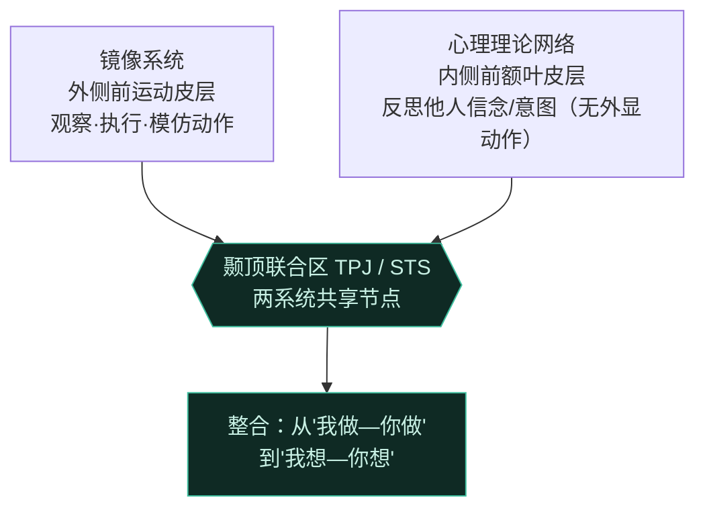

# 第15章 社会认知 · 详解（Social Cognition）

> 《脑与行为：认知神经科学视角》Eagleman & Downar (2016)
> 本章以 STARTING OUT"为一件黄 T 恤冒生命危险？"起笔：环法自行车赛的桂冠不过是一件人人花 80 美元就能买到的黄色骑行衫（maillot jaune），却值得精英选手冒死亡与身败名裂之险。**是社会情境把一块布变成珍宝**。社会情绪与动机是人类"例外性"的根源——它们既造就了交响乐与探险，也填满了人类的耻辱厅。本章追问这些社会力量的神经机制。

---

## ① 概念解释

### 1.1 核心概念速查表

| 概念 | 英文 | 一句话解释 |
| --- | --- | --- |
| 社会知觉 | social perception | 从面孔、声音、姿态等非言语线索解读社会信号 |
| 梭状回面孔区 | fusiform face area | 腹侧视觉通路中识别面孔的关键区，损伤致面孔失认 |
| 快速印象 | snap judgments | 杏仁核 100 ms 内对可信度/支配性的判断，常不准却有影响 |
| 颞极 | temporal pole | 表征社会语义知识（名/职业/概念如"圆滑""吝啬"）；与杏仁核相连修正印象 |
| 颞上沟 | superior temporal sulcus (STS) | 视听交界，解析目光、动作、意图性等社会线索 |
| 心理理论 | theory of mind | 推断他人思想、信念、欲望、意图并知其可能异于己 |
| 一/二阶心理理论 | first/second-order ToM | 一阶=预测他人想法；二阶=推断第三方对他人想法的看法 |
| Sally-Anne 任务 | Sally-Anne task | 经典错误信念测验，五岁后才可靠通过 |
| 镜像神经元 | mirror neurons | 观察或执行同一有意图动作时都放电（猴脑 F5），可能是心理理论基础 |
| 共情 | empathy | 对他人推断出的情绪产生恰当的自身情绪反应 |
| 情绪模仿/情绪传染 | emotional mimicry/contagion | 共情前身：无意识同步表情；情绪状态在人际间扩散 |
| 情绪心理理论 | emotional theory of mind | 推断他人内在情绪（喜怒哀惧）的能力 |
| 认知/情绪共情 | cognitive/emotional empathy | "我理解你的感受" vs "我感受到你的感受"（双分离） |
| 精神病态 | psychopathy | 能懂他人痛苦却无情绪共情，缺乏内疚 |
| 社会奖赏/社会厌恶 | social reward/aversion | 赞扬、声望等激活腹侧纹状体；排斥、批评是强负强化 |
| 催产素/加压素 | oxytocin/vasopressin | 调节社会行为的肽类递质，促亲和或攻击（依性别与情境） |
| 自我意识 | self-awareness | 反思自身思想情感的能力，与社会认知回路高度重叠 |

### 1.2 社会认知的层级（示意图）

> 关键点：从社会知觉→心理理论→共情→社会情绪，是逐层升级的加工链。自我认知在很大程度上是社会认知的"特例"——反思自己用的正是表征他人心智的同一套回路。

---

## ② 概念间关系

### 2.1 关系一览表

| 关系 | 内容 |
| --- | --- |
| 杏仁核 ↔ 颞极 | 杏仁核 100 ms 内出"快速印象"（常不准），颞极的社会语义知识可下行修正之——或许是全脑最重要的社会通路之一 |
| 镜像系统 ↔ 心理理论网络 | 二者在颞顶联合区（TPJ）附近有重叠；镜像系统偏外侧前运动皮层（观察/执行动作），心理理论网络偏内侧前额叶（反思心智） |
| 情绪模仿 → 情绪传染 → 共情 | 模仿=表情匹配（反射性）；传染=情绪扩散（无需推断）；共情=加上情绪心理理论的主观体验 |
| 认知共情 ⊥ 情绪共情 | 双分离：腹内侧前额叶损伤→认知共情受损；腹外侧前额叶损伤→情绪共情受损 |
| 社会奖赏 = 非社会奖赏共货币 | 金钱奖赏与社会赞扬共用腹侧纹状体；但内侧前额叶只对社会奖赏激活（声望→心理理论） |
| 催产素 ↔ 加压素 | 曾被简化为"亲和肽" vs "攻击肽"；实则效应随性别/情境而变，更像"促群内亲和+护群御外" |
| 自我意识 ← 心理理论 | 自我意识可能建立在心理理论之上（社会认知军备竞赛的下一步），≈二阶心理理论；镜像测验仅十来个物种能过 |

### 2.2 镜像系统 vs 心理理论系统（示意图）

---

## ③ 提问-回答

**Q1：为什么我们仅凭面孔骨骼就对陌生人的可信度、能力做出瞬间判断？这准确吗？**
杏仁核经丘脑捷径可在 100 ms 内识别情绪甚至更抽象特质（吸引力、可信度、支配性）。研究显示 100 ms 印象可预测国会选举结果达约 70%，且更长观看时间并不提高准确度。但骨骼结构其实是可信度的**糟糕预测器**：某些面孔恰好像是基本情绪表情的"稀释版"（可信≈友好识别的扬眉微笑，支配≈肢端肥大的下颌），产生虚假却有影响的社会意图信号。

**Q2：镜像神经元是什么？它如何可能支撑心理理论？**
镜像神经元在猴子**执行**某动作及**观看**他人做同一动作时都放电（首见于 1990 年代猕猴 F5 区），对有目的的动作（如抓取物体）放电最强。它能表征动作意图，故可能是理解意图（心理理论的一个成分）的基础。人脑有以腹侧前运动皮层为中心的类似镜像系统。此外还发现"反镜像神经元"（执行时↑、观察时↓），可解释我们如何在表征他人意图的同时把它与自身区分开。

**Q3：情绪模仿、情绪传染与共情有何区别？**
三者层级递进：**模仿**是无意识的表情同步（如反射，见 Edinger-Westphal 核瞳孔缩放的边缘系统调控）；**传染**是情绪状态在人际间扩散（无需心理推断，如婴儿听到别的婴儿哭就哭）；**共情**是加入情绪心理理论的主观体验——同时包含他人情绪与自身恰当反应。缺任一环节，共情就在不同点上崩解。

**Q4：精神病态与孤独症的共情缺陷有何不同？**
孤独症患者两种共情都缺：既缺认知共情（心理理论任务差），也缺情绪共情/传染（可能对哭泣者茫然而非染上恐惧），涉及 STS、内侧前额叶及外侧镜像系统的广泛异常。**精神病态**者心理理论任务通常正常、能识别他人情绪状态，看似社会正常——差别在于"他们就是不在乎"：明知他人痛苦却不产生情绪传染或共情。可为先天，也可后天获得（获得性反社会人格常见于额颞叶痴呆或腹内侧/眶额损伤）。

**Q5：催产素真是"拥抱荷尔蒙"、加压素真是"攻击荷尔蒙"吗？**
过于简化。催产素促亲和、配对键结、育幼（信任游戏中投资者更慷慨、更宽容背叛），但也促母羊驱赶非亲后代、增强人类的群内偏袒与排外（"抱团荷尔蒙"）。加压素促社会支配与攻击（金仓鼠"侧腹标记"实验），但在雌性中反使面孔显得更友好，在雄性草原田鼠中亦促配对与育幼。二者效应随**性别与情境**而变，尚不能简单称敌友。

---

## ④ 科学研究已确定的结论

### 4.1 社会认知子能力一览

| 子能力 | 英文 | 关键脑区 | 代表证据 |
| --- | --- | --- | --- |
| 面孔识别 | face recognition | 梭状回面孔区 | 损伤致面孔失认 |
| 社会语义知识 | social semantic knowledge | 颞极 | 左颞极损伤忘名人名；额颞叶痴呆失社会概念 |
| 社会线索解析 | social cue parsing | 颞上沟 STS | 直视目光、有目的动作激活更强；孤独症异常 |
| 心理理论 | theory of mind | 内侧前额叶、TPJ、楔前叶/后扣带 | Sally-Anne、囚徒困境、讽刺理解 |
| 共情 | empathy | 前岛叶、前扣带 | 观看爱人受痛激活自身痛网络（情感成分） |
| 自我意识 | self-awareness | 颞极、TPJ、楔前叶、内侧前额叶 | 镜像测验；自我反思任务 |

### 4.2 共情的双分离与相关障碍

| 类型 | 损伤/异常部位 | 表现 |
| --- | --- | --- |
| 认知共情受损 | 腹内侧前额叶皮层 | 错误信念/换位思考差，情绪识别与传染保留 |
| 情绪共情受损 | 腹外侧前额叶皮层 | 心理理论保留，情绪识别与传染受损 |
| 精神病态（先天） | 腹内侧/眶额/额极灰质↓（+颞极/背内侧前额叶） | 懂他人痛苦却无内疚，终身反社会 |
| 获得性反社会 | 双侧眶额 + 前颞叶（案例 J.S.） | 智力/记忆/心理理论完好，却无悔无同情、暴力冲动 |
| 孤独症谱系 | STS、内侧前额叶、外侧镜像系统 | 认知与情绪共情双缺，"心盲" |

### 4.3 社会神经递质对照

| 递质 | 英文 | 主导效应 | 性别/情境差异 |
| --- | --- | --- | --- |
| 催产素 | oxytocin | 亲和、配对、育幼、增信任 | 促群内偏袒兼护群御外；雌性受体密度更高 |
| 加压素 | vasopressin | 支配、攻击、雄性配对键结 | 雄性受体多；雌性中反促友好；草原田鼠 AVPR1a↑→单配 |

### 4.4 已确定的结论清单

- 大脑用广泛脑区网络与特定通路，从面孔、声音、身体表达等视听输入解读社会线索。
- 大脑含表征他人思想、信念、目标的机制（心理理论），部分依赖观察/执行意图动作时放电的镜像神经元；孤独症谱系障碍揭示其被破坏时的后果。
- 情绪模仿与情绪传染为表征他人情绪状态奠基（"共情"）；精神病态是缺乏正常共情的例证。
- 心理理论、共情、社会知识、社会知觉均汇入内脏运动通路，产生社会驱动的情绪与动机；欺骗涉及内、外部引导行为控制通路间的认知冲突。
- 催产素与加压素是社会行为调节剂，可促亲和或攻击，取决于性别与情境。
- 自我意识有多种子形式；其中反思自身思想情感这种类人能力在进化史上罕见出现，其神经回路与心理理论、共情等社会认知子形式高度重叠。

---

## ⑤ 开放性未解决的问题与研究方向

### 5.1 本章明确抛出的开放问题

| 开放问题 | 方向描述 |
| --- | --- |
| 是否存在"内侧镜像神经元"？ | 假设一套表征内在动机/信念的内侧镜像与反镜像神经元；已在扣带运动区发现"痛觉镜像"线索，但证据仍不足 |
| 是否存在"镜像内感受器"？ | 前岛叶在体验/观看厌恶或疼痛时都激活，但 fMRI 分辨率不足以判定是否同一群神经元 |
| 动物是否有真正的心理理论？ | 多物种有知觉/动机层心理理论，但均缺"信息性心理理论"（过错误信念任务）；仍在争论 |
| 自我意识为何如此罕见？ | 仅十来个物种能过镜像测验；自我意识可能是高度社会且竞争物种的"军备竞赛"产物 |
| tDCS/rTMS 能否改变欺骗行为？ | 已能改变道德判断与欺骗；引发"强迫说真话"而非"测谎"的伦理隐忧 |

### 5.2 应用与伦理前沿

| 议题 | 说明 |
| --- | --- |
| 催产素/加压素的社会应用 | 曾设想用于审讯、约会、军队；但因效应随性别情境两面而变，前景不确定；已试用于孤独症/精神分裂的社会缺陷 |
| 神经刺激与欺骗 | tDCS 于背外侧前额叶可增欺骗反应时（利测谎）；于额极皮层反可增强欺骗技巧、降内疚感 |
| 自我意识网络非专属性 | 楔前叶等区也参与空间导航、情景记忆等；不存在单一"自我区" |

### 5.3 情绪传染的下行调控回路（示意图）

---

## ⑥ 完整性核对（对照原文 KEY PRINCIPLES）

> 严格校验：本详解逐条覆盖第 15 章章末 6 条 KEY PRINCIPLES（原文第 44934 行起），无遗漏。

| # | 原文 KEY PRINCIPLE（要点） | 本详解对应位置 |
| --- | --- | --- |
| 1 | 大脑用广泛网络与特定通路，从面孔、声音、身体表达等视听输入解读社会线索 | ①社会知觉 + ④4.1 |
| 2 | 大脑含表征他人思想/信念/目标的机制（心理理论），部分依赖镜像神经元；孤独症揭示其被破坏后果 | ①心理理论/镜像 + ②2.2 + Q2 |
| 3 | 情绪模仿与情绪传染为表征他人情绪奠基（共情）；精神病态是缺乏正常共情的例证 | ①情绪模仿/传染 + ④4.2 + Q3/Q4 |
| 4 | 心理理论、共情、社会知识、社会知觉均汇入内脏运动通路产生社会情绪与动机；欺骗涉内外部控制通路的认知冲突 | ①1.2 图 + ④社会情绪 + Q5 |
| 5 | 催产素与加压素调节社会行为，可促亲和或攻击，取决于性别与情境 | ①催产素/加压素 + ④4.3 + Q5 |
| 6 | 自我意识有多种子形式；类人的自我反思罕见出现，其回路与心理理论、共情高度重叠 | ①自我意识 + ②2.1 + ⑤5.1 |

---

## ⑦ 认知偏差 · 成因(Why) · 对策
> 社会认知让我们能读心、共情、结盟，却也内置了一批系统性捷径：瞬间凭面孔定人、把内在归因套在他人行为上、偏爱同类而刻板化异类、把自己的心理投射到他人身上。这些捷径快而常错，需用心理理论与经验主动校正。

| 认知偏差 / 误区 | 成因（Why） | 解决方案 / 对策 |
| --- | --- | --- |
| 基本归因错误：把他人行为归于其内在品性，而低估情境因素 | 心理理论默认为他人行为寻找"心理原因"，加之只见他人外显行为、见不到其所处情境的内部约束 | 有意识地把情境纳入解释；运用心理理论换位思考——"若我处其境会如何"，抵消对内因的过度归因 |
| 仅凭面孔快速判断可信度/能力：100 ms 内定人且深信不疑 | 杏仁核经丘脑捷径极速评估可信度、支配性；某些骨骼恰似基本情绪表情的"稀释版"，发出虚假社会信号 | 警惕第一印象只是快而糙的猜测（面孔是可信度的糟糕预测器）；用后续实际经验修正、验证，勿据面相下结论 |
| 内群体偏好 / 外群体刻板印象：偏袒"自己人"、以刻板标签概括"外人" | 社会脑天然区分群内/群外；催产素等在促群内亲和的同时增强排外偏袒（"抱团荷尔蒙"），刻板化省认知成本 | 警惕刻板印象、主动接触个体化信息；意识到群体标签是启发式而非事实，以证据评价个人而非类别 |
| 投射偏差：把自己的心理状态、知识与情绪默认为他人也具有 | 心理理论以自身心智为模板去模拟他人；镜像/情绪传染机制先天让"我"与"他"的状态易混同 | 用心理理论校正——他人信念可异于己（错误信念的启示）；主动求证对方视角，区分"我知/我感"与"他知/他感" |
