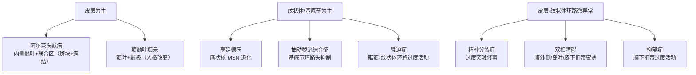
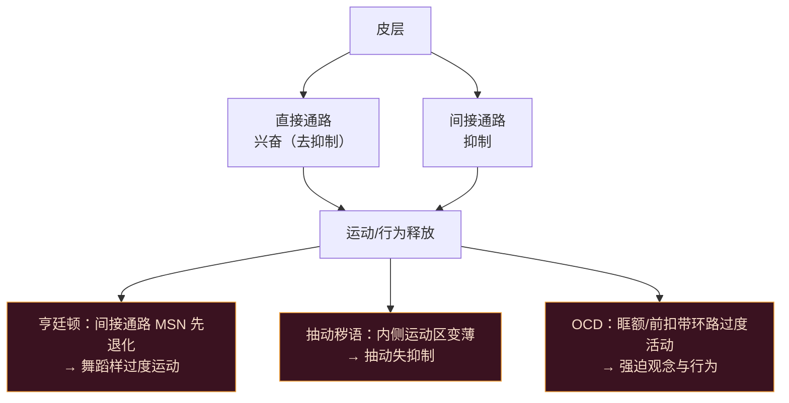
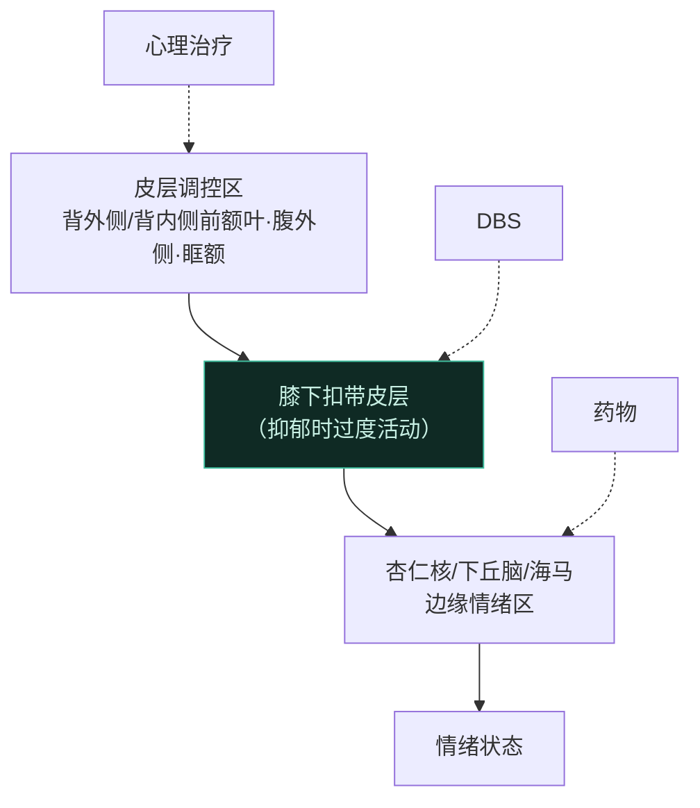

# 第16章 神经与精神障碍 · 详解（Neurological and Psychiatric Disorders）

> 《脑与行为：认知神经科学视角》Eagleman & Downar (2016)
> 本章以 STARTING OUT"癫痫：神圣的疾病"起笔：几千年来癫痫发作被归因于灵体附身、巫术，而早在约 2400 年前希波克拉底就在《论神圣的疾病》中断言——它"并不比其他疾病更神圣，而是有其自然的原因"，且"喜悦、悲伤、疯狂皆源于脑，别无他处"。全章由此展开：**从传统"神经科"到传统"精神科"，一切疾病都"别无来源，只来自大脑"**，两者的分界其实相当人为。

---

## ① 概念解释

### 1.1 核心概念速查表

| 概念 | 英文 | 一句话解释 |
| --- | --- | --- |
| 痴呆 | dementia | 记忆、语言、判断、社交等高级功能的渐进性衰退 |
| 阿尔茨海默病 | Alzheimer's disease | 最常见痴呆，情景记忆进行性受损，脑内积斑块与缠结 |
| β-淀粉样斑块 | amyloid plaques | β-淀粉样肽在神经元外聚集成的不可溶斑块 |
| 神经纤维缠结 | neurofibrillary tangles | 过度磷酸化的 tau 蛋白脱离微管、在胞内结块 |
| ApoE4 | apolipoprotein E4 | 阿尔茨海默病最强已知遗传风险因子 |
| 额颞叶痴呆 | frontotemporal dementia | 累及额、颞叶，发病更早，主要改变人格而非记忆（"灵魂的癌症"） |
| 语义性痴呆 | semantic dementia | 颞极受损，丧失抽象概念知识本身（非只是词） |
| 亨廷顿病 | Huntington's disease | 单基因（huntingtin CAG 重复）致命遗传病，舞蹈样不自主运动+痴呆+精神症状 |
| 舞蹈症 | chorea | 面、躯干、肢体扭动样不自主运动 |
| 中型多棘神经元 | medium spiny neurons (MSNs) | 纹状体 90% 神经元，GABA 抑制性，亨廷顿病中退化 |
| 抽动秽语综合征 | Tourette syndrome | 儿童期起病，运动/发声抽动，与 OCD 重叠 |
| 强迫症 | obsessive-compulsive disorder (OCD) | 强迫观念+强迫行为的慢性循环，跨越神经/精神分界 |
| 精神分裂症 | schizophrenia | 有阳性与阴性症状的精神病，"年轻人的痴呆" |
| 神经阻滞剂/抗精神病药 | neuroleptics/antipsychotics | D₂ 多巴胺受体拮抗剂，减阳性症状 |
| 双相障碍 | bipolar disorder | 躁狂与抑郁交替，锂盐/抗癫痫药稳定情绪 |
| 抑郁症 | depression | 缺乏愉悦、动机、能量的高致残全球性疾病 |

### 1.2 障碍按脑系统归类（示意图）

> 关键点：神经科 vs 精神科的分界不真正取决于脑异常的有无或位置，而反映了我们古老的**二元直觉**——某些功能似乎"属于灵魂"。VBM 等技术正不断缩小这道概念鸿沟。

---

## ② 概念间关系

### 2.1 关系一览表

| 关系 | 内容 |
| --- | --- |
| 神经科 ↔ 精神科 分界人为 | 影响运动/感觉/记忆者归"神经元"，影响情绪/判断/社会者归"灵魂"；实则都是脑病，只是网络与损伤更微妙 |
| "哪里"+"什么"异常 | 诊断两问：脑异常在何处、是什么；四种痴呆各异其位（内侧颞叶/额颞/纹状体） |
| 斑块 ≠ 病因 | 清除斑块后认知不改善；斑块可能是神经元抗氧化"烧尽"后的灰烬，与最忙"枢纽区"重叠 |
| 基底节环路失衡 → 多样症状 | 亨廷顿、抽动秽语、OCD 均源于皮层-基底节直接/间接环路失衡；症状类型取决于哪条环路受累 |
| 单基因 vs 多基因 | 亨廷顿是罕见的"单基因病"；多数病由基因-基因、基因-环境交互决定，单基因效应小 |
| 神经发育 → 成年发病 | 精神分裂/双相的错误布线在胎/童期埋下，青春期修剪后才显症 |
| 多巴胺 ↔ 谷氨酸假说 | 皮层-纹状体-丘脑环路含多递质；低谷氨酸、高多巴胺、低 GABA 均可致皮层过度活动，两假说不互斥 |
| 膝下扣带 = 抑郁枢纽 | 该区在抑郁中过度活动，无论药物/心理/电休克/DBS，康复者均回落至正常 |

### 2.2 皮层-纹状体环路失衡与三病（示意图）

---

## ③ 提问-回答

**Q1：既然免疫疗法能清除阿尔茨海默病的淀粉样斑块，为何患者认知并不改善？**
即使脑几近无斑块，患者仍同样迅速地衰退、同样严重受损。这印证了一个长期困惑：许多有大量斑块者痴呆却轻，反之亦然。新观点认为**斑块可能不是病因，而是后果**——最繁忙的功能"枢纽区"（与默认网络、淀粉样沉积图高度重叠）因长期代谢过载而"烧尽"，斑块是神经元抗氧化自保后留下的灰烬。清斑块疗法"扫走了灰烬却没扑灭火"。

**Q2：亨廷顿病为何一个单基因突变能引发如此多样的神经与精神症状？**
突变型 huntingtin 蛋白使纹状体中型多棘神经元（MSN，占纹状体 90%、GABA 抑制性）退化。由于**间接（抑制）通路的 MSN 比直接（兴奋）通路先受累**，早期表现为去抑制：舞蹈样运动、难以多任务、情绪与行为失控。随病程进展兴奋通路也受损，症状转向过度抑制（淡漠、僵直）。CAG 三核苷酸重复越多，发病越早越重（"遗传早现"）。

**Q3：为什么抽动秽语综合征的抽动可被短暂抑制，而帕金森震颤、舞蹈症不能？**
抽动在情境要求时（如演讲、社交）**可被暂时抑制**一段时间，但抑制期间冲动持续累积，一旦解除，抽动往往更频以"补偿"。而舞蹈症与帕金森震颤是真正不自主的，无法轻易压制，甚至睡眠时仍持续。这与内侧运动区（SMA、pre-SMA、扣带运动区）对内生冲动的抑制控制有关——这些区在抽动秽语中变薄。

**Q4：为什么说 OCD 模糊了神经科与精神科的分界？**
OCD 传统属精神科，但其症状也见于许多"神经科"病（亨廷顿、抽动秽语、PANDAS 链球菌感染后）。基底节卒中可致"获得性 OCD"，也有长期 OCD 患者卒中后反而好转。神经影像一致显示眶额-纹状体、前扣带/背内侧前额叶两条环路过度活动。运动抽动、强迫检查、强迫清洗之别，更多在于**哪条基底节环路受累**，而非神经/精神的根本鸿沟。

**Q5：抑郁真的只是"化学失衡"吗？膝下扣带扮演什么角色？**
"化学失衡"过于简单：抗抑郁提升 5-羟色胺不等于抑郁是"缺 5-羟色胺"（"头痛不是缺阿司匹林"），且安慰剂常与 SSRI 同样有效，去甲肾上腺素/多巴胺、BDNF 亦有关。更整合的**边缘-皮层失调模型**认为抑郁源于边缘区（杏仁核等）与调控它们的皮层区互动异常。**膝下扣带皮层**是枢纽：抑郁时一贯过度活动，向杏仁核输出情绪调控；康复者（无论药物/心理治疗/电休克/DBS）该区活动均回落至正常，治疗抵抗者则持续过度活动，DBS 抑制之常带来缓解。

---

## ④ 科学研究已确定的结论

### 4.1 疾病-脑异常-治疗对照表（核心）

| 疾病 | 主要脑异常 | 主要症状 | 现有治疗 |
| --- | --- | --- | --- |
| 阿尔茨海默病 | 内侧颞叶+联合区 β-淀粉样斑块、tau 缠结 | 情景记忆、导航、执行功能进行性受损 | 胆碱酯酶抑制剂、NMDA 拮抗剂（仅短期轻效，无长期有效） |
| 额颞叶痴呆 | 额叶+颞极萎缩（发病 40–50 岁） | 人格/社会行为剧变、缺乏自知；语义性痴呆失概念 | 无有效治疗；抗抑郁/抗精神病药缓解行为症状 |
| 亨廷顿病 | 尾状核 MSN 退化（单基因 CAG 重复） | 舞蹈样不自主运动、痴呆、冲动、抑郁 | 无治愈；丁苯那嗪减多巴胺控舞蹈症，神经阻滞剂控精神症状 |
| 抽动秽语综合征 | 基底节+内侧运动区环路（儿童期） | 运动抽动、发声抽动，可短暂抑制 | 多以教育为主；重症用神经阻滞剂；部分或与链球菌自免相关 |
| 强迫症 | 眶额-纹状体、前扣带/背内侧前额叶环路过度活动 | 强迫观念+强迫行为（清洗/检查/对称/囤积） | 认知行为疗法（暴露与反应预防）、SSRI 高剂量、神经阻滞剂、DBS |
| 精神分裂症 | 皮层过度修剪、皮层-纹状体微环路异常 | 阳性（幻觉/妄想/思维紊乱）+阴性（淡漠/退缩/情感平淡） | 抗精神病药（D₂ 拮抗）减阳性症状，对阴性症状无效 |
| 双相障碍 | 腹外侧/腹内侧/背内侧前额叶、岛叶、膝下扣带变薄 | 躁狂与抑郁交替 | 锂盐、抗癫痫药（丙戊酸/卡马西平/拉莫三嗪）、抗精神病药稳定情绪 |
| 抑郁症 | 膝下扣带过度活动；边缘-皮层失调 | 持续低落、快感缺失、动机与能量缺乏 | 心理治疗、药物（多用 SSRI）、躯体治疗（rTMS/ECT/DBS） |

### 4.2 精神分裂症的阳性与阴性症状

| 阳性症状（多出来的） | 阴性症状（丢失的） |
| --- | --- |
| 幻觉（多为听幻觉、怪异躯体感觉） | 言语/思维贫乏 |
| 妄想（被害、援引、被动/被控制） | 淡漠、缺乏意志 |
| 思维/行为紊乱（松散联想、新语症） | 社会退缩、情感平淡（flat affect） |

### 4.3 抑郁症三大类治疗

| 类别 | 英文 | 代表 | 特点 |
| --- | --- | --- | --- |
| 心理治疗 | psychotherapy | 认知行为疗法 | 与药物疗效相当、效果更持久，但耗时且供不应求 |
| 药物治疗 | pharmacotherapy | SSRI（氟西汀等）、TCA、MAOI、SNRI、安非他酮 | 新药更安全但不比 1950 年代更有效 |
| 躯体治疗 | somatic therapy | rTMS、电休克(ECT)、深部脑刺激(DBS) | rTMS 最温和；ECT 最有效（重症）；DBS 用于难治性（约 60% 显著改善） |

### 4.4 已确定的结论清单

- 阿尔茨海默病：进行性情景记忆、导航、执行功能受损；假说归因于 β-淀粉样斑块与 tau 缠结堆积；各种生物医学疗法仅提供短期益处，长期均无效。
- 额颞叶痴呆：累及额、颞叶（阿尔茨海默累及内侧颞叶）；发病更早、主要改变人格；目前无有效治疗。
- 亨廷顿病：单基因突变致进行性、终致死性神经退行；头身不自主运动+冲动+抑郁；目前无治愈。
- 抽动秽语综合征：患者被迫做不必要重复动作；此强迫促使研究者提出其与 OCD 重叠；病因不清，部分或有自免解释。
- 传统上按有无明确解剖学基础分神经科（有）/精神科（无，且影响情绪、冲动、成瘾）；随对脑的了解加深，这一分界愈显不合理。
- OCD：慢性循环——侵入性痛苦想法只能靠仪式化行为暂时驱散、常反复；虽传统属精神科，许多症状与新疗法更似神经科疾病。
- 精神分裂症：有阴性与阳性症状；神经阻滞/抗精神病药可减阳性症状（不总有效），但不控阴性症状；有神经发育、多巴胺、谷氨酸等多种理论。
- 双相障碍：躁狂与抑郁交替；有遗传影响，特定皮层区变薄；治疗用锂盐或抗癫痫药稳定情绪波动。
- 抑郁症：缺乏愉悦、动机与能量；已识别遗传与神经化学因素；治疗含心理治疗、药物（多为 SSRI）及电休克、DBS 等侵入选项（难治性）。

---

## ⑤ 开放性未解决的问题与研究方向

### 5.1 本章明确抛出的开放问题

| 开放问题 | 方向描述 |
| --- | --- |
| 斑块若非病因，代表什么？ | 或为"枢纽区"代谢烧尽的灰烬；清斑块疗法失败促使重新定位真正病因 |
| 单基因病为何是罕见特例？ | 多数病由基因-基因、基因-环境交互决定，难以映射到单一基因（如精神分裂、抑郁、抽动秽语） |
| OCD 是单一疾病吗？ | 儿童期/成年期起病、清洗/检查/囤积各激活不同环路，或为多种疾病的共同终点 |
| 精神分裂如何从早期事件"引信"到成年发病？ | 神经发育理论：胎/童期错误迁移布线，青春期过度修剪后显症；或需发病前神经保护干预 |
| 治疗为何多靠"机遇"？ | 氯丙嗪、锂盐、MAOI、丙戊酸等多为偶然发现；能否从"设计"而非"偶然"造出疗法仍未知 |
| 精神病耻感如何消除？ | 部分靠公众教育，部分靠更好疗法降低对工作/家庭/社会生活的影响 |

### 5.2 分类学困境与研究方法

| 议题 | 说明 |
| --- | --- |
| "先有分类还是先懂病"的循环 | 要懂病须更好分类，要更好分类须先懂病；VBM 等有望打破僵局 |
| 体素形态测量学(VBM) | 高分辨 MRI 逐体素测灰质厚薄，元分析可定位精神病的脑异常，桥接神经/精神分界 |
| 从"脑影像到床边" | 神经影像锁定膝下扣带→DBS 治难治性抑郁，示范基础发现如何转化为疗法 |

### 5.3 抑郁的边缘-皮层失调与治疗靶点（示意图）

---

## ⑥ 完整性核对（对照原文 KEY PRINCIPLES）

> 严格校验：本详解逐条覆盖第 16 章章末 9 条 KEY PRINCIPLES（原文第 48597 行起），无遗漏。

| # | 原文 KEY PRINCIPLE（要点） | 本详解对应位置 |
| --- | --- | --- |
| 1 | 阿尔茨海默病：情景记忆、导航、执行功能进行性受损，归因于 β-淀粉样斑块与 tau 缠结；各疗法仅短期有益，长期无效 | ①阿尔茨海默 + ④4.1 + Q1 |
| 2 | 额颞叶痴呆：累及额颞叶（阿尔茨海默累及内侧颞叶），发病更早，主要改变人格；目前无有效治疗 | ①额颞叶痴呆 + ④4.1 |
| 3 | 亨廷顿病：单基因突变致进行性终致死神经退行，头身不自主运动+冲动+抑郁；无治愈 | ①亨廷顿 + ④4.1 + Q2 |
| 4 | 抽动秽语综合征：被迫做不必要重复动作，提示与 OCD 重叠；病因不清，部分或有自免解释 | ①抽动秽语 + ④4.1 + Q3 |
| 5 | 传统按有无解剖基础分神经科/精神科；随对脑了解加深这一分界愈显不合理 | ②神经↔精神 + ①1.2 图 |
| 6 | OCD：侵入性想法靠仪式行为暂驱散的慢性循环；虽传统属精神科，症状与疗法更似神经科 | ①强迫症 + ④4.1 + Q4 |
| 7 | 精神分裂症：有阳性与阴性症状；抗精神病药减阳性不控阴性；有神经发育、多巴胺、谷氨酸等理论 | ①精神分裂 + ④4.2 + ②多巴胺↔谷氨酸 |
| 8 | 双相障碍：躁狂与抑郁交替；有遗传影响、特定皮层变薄；用锂盐或抗癫痫药稳定情绪 | ①双相 + ④4.1 |
| 9 | 抑郁症：缺乏愉悦/动机/能量；已识别遗传与神经化学因素；治疗含心理治疗、药物（多 SSRI）、ECT/DBS 等 | ①抑郁 + ④4.3 + Q5 + ⑤5.3 |

---

## ⑦ 认知偏差 · 成因(Why) · 对策
> 从希波克拉底"喜悦、悲伤、疯狂皆源于脑"到今天，人们对脑病仍抱有一批根深蒂固的误区：把"神经病"与"精神病"二分、给精神疾病贴污名、以为抑郁"想开点就好"、以为"有效的疗法就等于懂了病因"。破除它们的钥匙是承认一切障碍皆"出自大脑"，并坚持公共教育与循证治疗。

| 认知偏差 / 误区 | 成因（Why） | 解决方案 / 对策 |
| --- | --- | --- |
| "神经病 vs 精神病"二分：以为二者是本质不同的两类病 | 古老的身心二元直觉——影响运动/感觉/记忆者归"神经元"，影响情绪/判断/社会者归"灵魂"；这道分界其实相当人为 | 认识一切障碍皆"别无来源，只来自大脑"，差别只在网络与损伤更微妙；用 VBM 等技术缩小这道概念鸿沟 |
| 对精神疾病的污名化：视患者为危险、可耻或咎由自取 | 二元误区让人把精神症状当"人品/意志"问题而非脑病；对看不见解剖病灶者更易归咎于个人 | 公共教育去污名——精神障碍与神经障碍同为脑功能异常；配合更好疗法降低其对工作、家庭与社会生活的影响 |
| "抑郁是想开点就好"：以为抑郁是主观消极、靠意志即可克服 | 抑郁被误当情绪选择，而非膝下扣带过度活动、边缘-皮层失调的脑功能障碍；"化学失衡"式简化也误导公众 | 循证治疗：心理治疗、药物（多为 SSRI）、rTMS/ECT/DBS 等躯体治疗；把抑郁当可治疾病，勿以意志论苛责 |
| "疗法有效=懂病因"：认为药物起效就证明已理解疾病机制 | 许多疗法（氯丙嗪、锂盐、MAOI、丙戊酸）实为偶然发现；"抗抑郁提 5-羟色胺"不等于"抑郁缺 5-羟色胺"（如"头痛非缺阿司匹林"） | 区分"有效"与"懂机制"；坚持循证治疗同时深究病理，推动从"偶然"走向"设计"的疗法开发 |
