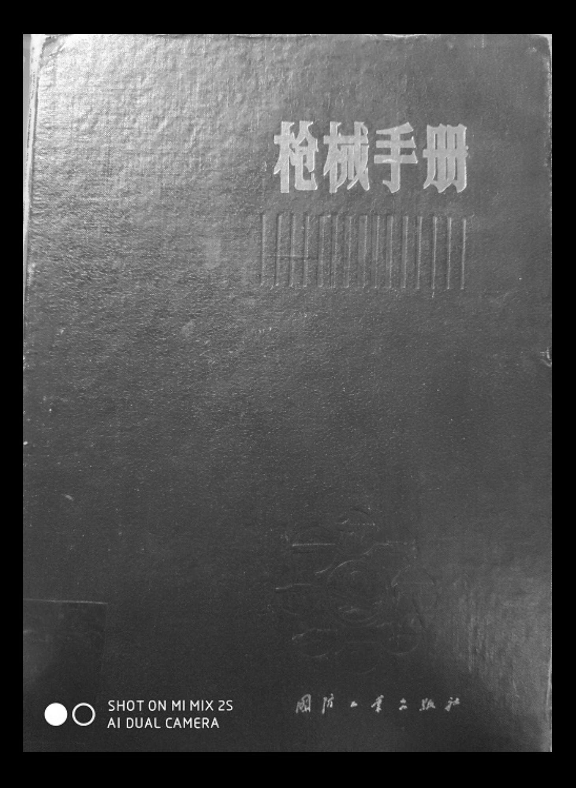

---

创械手册

19 不大的原道记的面面是来的

兵器工业部《枪械手册》编写组

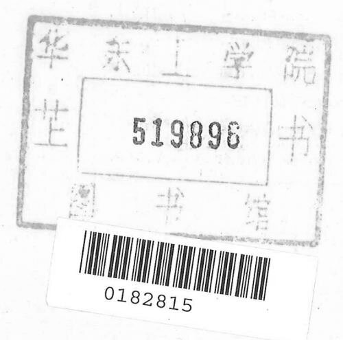

 $\mathcal{L}$ 

不在床 。

國防工業品版产

( 路口画系地在 对动力隐患工器类。 " 法海三 果藤消费

学业部教育单、新国 184篇四十一条四门每单开照出业工图图

1. 电平静分

---

## 内容提要

本书是在总结建国以来我国枪械产品研制及生产经验的基础上编写 的,主要介绍了建国以来我国研制与仿制的各类枪械产品。

全书共分八章。第一章总论,主要介绍了枪械的发展简况、枪械生产 质量要求的特点及质量保证体系等情况。从第二章起,主要介绍了手枪、 冲锋枪、步枪、机枪、大口径机枪、运动枪及其它枪械的性能、结构、动作原 理、研制过程、生产中易出现的问题及使用中的有关情况等内容。

本书通俗易懂、图文并茂,并附有较多的彩色全貌照片及附表。对枪械 设计、制造、管理、教学及其他有关人员均有较大的参考价值。

## 枪械手册

兵器工业部《枪械手册》编写组 责任编辑 盖铭杰  $*$ 

國防一学出版社出版 国防工业出版社印刷厂印装 内部发行

787×1092 1/16 印张 72 1/2 1705千字 1986年6月第一版 1986年6月第一次印刷 印数: 0,001-3,000冊 统一书号: N15034 · 2969 定价: 22.25元

---

| CQ5.56 毫米自动步枪 …………………………………………………………… 407 第八节                                        |  |
|-----------------------------------------------------------------------------------------|--|
| 1979年式7.62 毫米半自动狙击步枪 …………………………………………… 126 第九节                                       |  |
|  第五章 枪 机                                                                       |  |
| 概述 ……………………………………………………………………………………………… 第一节                                          |  |
| 1953年式7.62 毫米轻机枪 ……………………………………………………………………………………………… 第二节                            |  |
|  1955年式 7.62 毫米坦克机枪 第三节                                                           |  |
|  1958年式 7.62 毫米连用机枪 第四节                                                           |  |
|  1956年式 7.62 毫米轻机枪 第五节                                                            |  |
|  1956年-1式7.62毫米轻机枪 第六节                                                            |  |
|  1974年式 7.62 毫米轻机枪 第七节                                                            |  |
|  1953年式 7.62 毫米重机枪 第八节                                                            |  |
| .534 1957年式 7.62 毫米重机枪 第九节                                                        |  |
| . 1959年式 7.62 毫米坦克机枪 第十节                                                          |  |
| 1967年式7.62 毫米轻重两用机枪 …………………………………………567 第十一节                                         |  |
| 1967年-1式7.62毫米重机枪 …………………………………………579 第十二节                                           |  |
| 1967年-2式7.62毫米重机枪 ………………………………………………626 第十三节                                         |  |
| 1980年式7.62 毫米多用途机枪 …………………………………………637 第十四节                                          |  |
| 1983年式7.62毫米战车机枪 ……………………………………………658 第十五节                                           |  |
| 仿苏 PIIK7.62 毫米轻机枪 …………………………………………………664 第十六节                                        |  |
| 大口径机枪 …………………………………………………………………………679 第六章 概述 ………………………………………………………………………………………679 |  |
| 第一节 1954年式12.7毫米高射机枪 …………………………………………………683                                          |  |
| 第二节 1959年式12.7 毫米坦克高射机枪枪身 ………………………………………718                                         |  |
| 第三节 1954年式12.7毫米舰用机枪 ………………………………………………………………………………………………                            |  |
| 第四节  1959年式12.7 毫米航空机枪                                                            |  |
| 第五节  1977年式12.7 毫米高射机枪 第六节                                                     |  |
| 新12.7 毫米高射机枪……………………………………………………………769 第七节                                           |  |
| 1956年式14.5 毫米四联高射机枪 ……………………………………………771 第八节                                         |  |
|  1958年式14.5毫米二联高射机枪 第九节                                                           |  |
| 第十节 1969年式14.5 毫米二联舰、艇两用机枪 ……………………………………901                                            |  |
| 1959年-1式14.5 毫米二联舰用机枪 ………………………………………903 第十一节                                        |  |
| 1956年式14.5 毫米二联艇用机枪 ………………………………………905 第十二节                                          |  |
| 1975年式14.5 毫米单管高射机枪 …………………………………………908 第十三节                                         |  |
| 1975年-1式14.5毫米单管高射机枪 ……………………………………934 第十四节                                          |  |
| 第十五节 1980年式14.5 毫米单管高射机枪 …………………………………………943                                            |  |
| 第七章 运动枪 ……………………………………………………………………………………………                                             |  |
| 第一节 运动手枪 ……………………………………………………………………………… 973                                             |  |
| 一、概述 ………………………………………………………………………………………………                                               |  |
| 二、庆华牌 SS01 5.6 毫米速射运动手枪 …………………………………………………………976                                       |  |
|                                                                                         |  |

 $\overline{V}$

---

|       |  |  |  |  | 三、庆华牌 MS01 5.6 毫米慢射运动手枪 ………………………………………………………………982   |
|-------|--|--|--|--|-------------------------------------------------------|
| 四、    |  |  |  |  | 西湖牌-1型5.6 毫米慢射运动手枪 ………………………………………………………………990        |
| 五、    |  |  |  |  | 庆华牌 PS5.6 毫米普及运动手枪……………………………………………………………………995       |
| 六、    |  |  |  |  | 庆华牌 ZS01 7.62 毫米转轮运动手枪 …………………………………………………………1000     |
|       |  |  |  |  | 七、庆华牌 BS01 5.6 毫米标准运动手枪 ……………………………………………………………… 1006 |
| 第二节   |  |  |  |  | 峨眉牌 EM 系列比赛步枪 ……………………………………………………1016                |
| 第三节   |  |  |  |  | 健卫型(JW)5.6 毫米运动步枪 ……………………………………………… 1034             |
| 第四节   |  |  |  |  | 快鹿牌气枪…………………………………………………………………………1049                 |
| 第五节   |  |  |  |  | 12号猎枪 ……………………………………………………………………………1056               |
| 第八章   |  |  |  |  | 其它枪械…………………………………………………………………………1070                  |
| 第一节   |  |  |  |  | 1957年式26毫米信号枪 ………………………………………………………1070               |
| 第二节   |  |  |  |  | 11 毫米 I 型救生信号枪 ……………………………………………………1076               |
| 第三节   |  |  |  |  | 仿美 M79 40 毫米榴弹发射器 …………………………………………………… 1078           |
| 第四节   |  |  |  |  | 弹道枪………………………………………………………………………………………………               |
|       |  |  |  |  | 附录………………………………………………………………………………………………                |
| 附录工   |  |  |  |  | 各式枪械所用枪弹技术资料 ………………………………………………………… 1102              |
| 附录I   |  |  |  |  | 各式枪械基本射表……………………………………………………………1127                   |
| 附录Ⅲ   |  |  |  |  | 译名表………………………………………………………………………………………………               |
| 附录 IV |  |  |  |  | 缩写、全名对照表 ……………………………………………………………………………………1150         |
|       |  |  |  |  |                                                       |

 $\overline{VI}$

---

## **金融出版图 人员开展 第一章 总 论 论** 表明的对象 第一条条

十四世纪初期, 适音主业准备本的发展, 世界各国阿宾天然的大城镇, 建设线路机

南宋寿春府 (今安徽考县) 制造子一种 突火枪 (图 1-2-1)。这两 火枪 也 早川根竹節 "最晚, 请内装有人活, 再性"小意"(类似于弹心用火络大西治疗后, 起,可发出火焰,

## 第一节 枪械的作用与分类

**的位态小照整日旅** 

"情是以火药为能源,利用火药在管形发射具内燃烧产生的气体能量发射弹头的武器。 通常把口径在20毫米以下的武器叫做枪(便携式榴弹发射器除外)。现在,常将枪及其 所使用的枪弹合称为枪械系统。

他 枪是步兵装备最早、使用面最广、需要量最大的基本武器, 又是特种兵(即: 装甲 兵、炮兵、空军、海军、空降兵、公安部队和警卫人员等)的自卫和杀伤敌人的战斗武 器;同时也在装甲车辆、飞机、舰艇上广泛采用。此外,枪械在国内外还普遍用于民用。 如: 使用在体育运动中的射击比赛, 狩猎及生产建设中等等。

枪有不同的分类方法:

由《試驗辦事時期信息

按口径分: 一般可分为小口径枪和大口径枪。

按用途分:可分为手枪、冲锋枪、步枪、轻重机枪、大口径机枪、运动枪以及近来 开发的便携式榴弹枪等。本书各章节即按此分类进行介绍。

按自动方式分: 又可分为非自动武器和自动武器, 现代军用枪械绝大多数都属于自 动武器。自动武器的自动方式通常可分为以下三大类:

第一类: 枪机后坐式。是利用弹壳在火药气体作用下抵压枪机向后运动, 完成自动 循环的武器。这类武器按其结构不同还可分为自由枪机式和半自由枪机式两种。自由枪 机中又有枪机复进到位后击发枪弹底火的和在枪机尚未到达其最前位置时就击发枪弹底 火的前冲击发式两种。半自由枪机式是通过枪机上的某些附加机构,以达到延迟枪机后 坐的作用。这种武器结构多样,有的利用机构的约束限制枪机发射时的位移;有的则靠 减缓枪机在发射瞬间的速度; 还有的则利用气体的作用来达到延迟后坐的目的。

第二类。枪管后坐式。是利用发射时枪管的后坐运动完成自动工作循环的武器。枪 管后坐式又分为短后坐与长后坐式两种,其中短后坐式应用最广。

第三类: 导气式。利用膛内导出的火药气体推动活塞或某些类似的机构, 完成自动 工作循环的武器。这类武器在现代枪械中应用十分普遍。

## 第二节 枪械的发展简史

## (一)步枪

步枪按装填方式分为前装枪和后装枪。弹药从枪管口部装入弹膛的叫做前装枪;弹 药从枪管尾部装入弹膛的叫做后装枪。 医中脑病毒 医消毒产生成血管

前装枪有管形火枪,火门枪、燧发枪和火帽枪等。使用的子弹,开始用石弹,后来 采用了各种铅弹。前装枪最早出现的一种管形火枪,是我国南宋军事学家陈规于公元 1132年 (宋高宗绍兴二年) 发明的。该枪枪管由巨竹制成, 由两人拿着, 先 把 火 药装 在竹筒内, 在临阵交锋时, 点着后用来烧伤敌人。到了公元 1259年 (宋理宗开庆元年)

---

南宋寿春府(今安徽寿县)制造了一种突火枪(图 1-2-1)。这种火枪也是用粗竹筒 做成, 筒内装有火药, 再装"子窠"(类似子弹)。用火将火药点着后, 起初发出火焰, 接着"子窠"就被射出去,并发出巨大的声音。火枪的主要作用在烧人,而突火枪却能 发出"子窠"打人,比火枪前进了一步,也为管形武器的发展打下了基础。

十四世纪初期,随着工业和技术的发展,世界各国研究兵器的人增多,很快就出现 了原始步枪,叫火门枪。它系一极简单的铁管,别无其它零件,采用实体球形弹丸,由 枪口将黑火药和球形弹丸装入枪管内,从火门点燃火药。这种枪的威力虽大大超过了突

> 火枪,但其缺点是很笨重,最古的火门枪口径超过了 22. 毫米, 重达 10 公斤左右, 弹丸重 50 克; 射击时后坐力 很大,要求射手要有强壮的身体,使用很不方便。后 来,随着制造小口径枪管技术的提高,枪的口径减小到

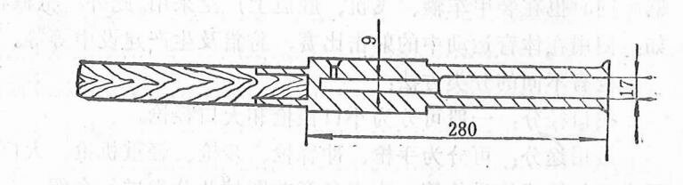

图1-2-1 突火枪

图1-2-2 带木托的铁管火门枪

17 毫米, 重量减轻到5公斤。为了使用和携带方便, 又装上了直形木托 (图 1-2-2)。 为了简化火器的操作方法,于十五世纪改进了原来的用手拿火绳点燃发射药的方法。 把一种所谓的"火绳枪机"(弯形轴)安装 在枪上并能围绕扳机轴转动,扳机一端固定 有引火绳, 如图 1-2-3所示。当 射手扣扳机另一端时, 引火绳便靠向点火孔。火绳枪机。 的使用简化了射手射击时的操作,从而出现了一种单人武器——火绳枪。

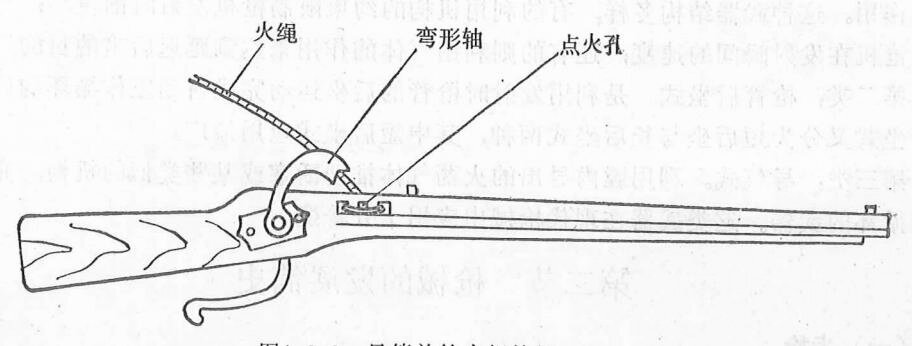

图1-2-3 最简单的火绳枪机

十五世纪末期, 为了简化前装手续, 减少气体的泄出, 使弹丸在枪膛内起紧塞作用 和提高装填速度, 发明了原始的直线式膛线。在直线式膛线出现后, 又发明了螺旋式膛 线, 使步枪的性能起了根本的变化。加之将球形弹丸改成长圆形弹丸, 不但便于嵌入膛 线,减少了弹丸和膛壁之间的空隙,且螺旋式膛线可使弹丸作旋转运动,既能闭塞火药 气体,又能改善弹道和提高射击精度,因而大大地增强了射击威力。所以螺旋式膛线很

!!!!!!!!!!!!!!!!!!!!!!!!!!!!!!!!!!!!!!!!

---

快就代替了直线式膛线。

十六世纪初期, 出现了轮式发火枪。意大利科学家芬奇也改良了他自己发明的转轮: 式发火机构。它的发火原理是将击锥内的燧石压在钢轮上, 钢轮 在 弹簧的作用下转动, 钢轮表面的细齿摩擦燧石产生火花,点燃火药,如图 1-2-4 所示。但是,这种机构复杂,

钢轮在有污秽时即发不出火花, 不能点燃火药。因而在当时使用 这种枪时,往往用火绳枪机作为 备份枪机。

为了取代复杂的轮式发火机 构及难以克服的故障。在 1525年 又发明了撞击式打火枪。这种发 火机构是把紧夹在击锥夹口内的 燧石, 用来打击火药池盖上方的 打火板,从而打出了火花,点燃了 引火药, 如图 1-2-5 所示。这种 击火机构的采用, 简化了射击过 程, 提高了射击精度。随着撞击 式击火机构的发展及不断完善, 到十七世纪末, 发火枪已得到普 遍地采用。

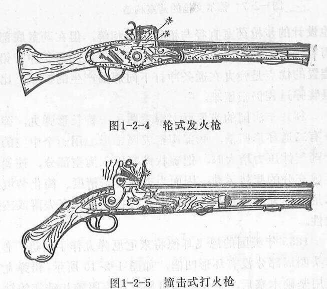

1801305年英国福西士发明了新的击头法, 它是用 击锤打击一种含有雷汞的引爆药, 因 而可用它的火焰点燃药室内的黑火药。到了十九世纪二十年代铜火帽已经被应用。它是 将含有雷汞的引爆药装入铜火帽壳内,发射时,把装有引爆药的铜火帽套在"击砧"上, 击砧上的孔直接与枪膛的装药室连接。击锤打击铜火帽,点燃引爆药,火花通过击砧孔 道而点燃火药。这种方法既不受天气影响,也减少了不发火次数,这种枪称为火帽枪, (见图 1-2-6)。但是这种装填过程仍很复杂, 为了简 化装 填 方 法, 法 国 军 官德尔文

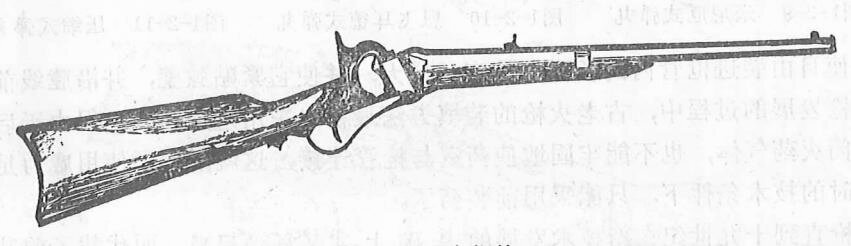

火帽枪 图1-2-6

1825 年设计了一种枪尾部带药室的步枪,其药室直径小于枪管线膛部分 的直径,球形 弹丸能自由地滚入枪管中,并被阻挡在药室前端突起部的地方。用通条撞击铅弹丸将其 压扁, 使能紧紧地填满膛线, 如图 1-2-7 所示。这种枪的缺点是, 弹丸被压扁后, 失去 了膛线赋予它的旋转运动, 使射击精度受到较大影响。

十九世纪四十年代,另一位法国军官图温南上校设计了一种步枪(如图 1-2-8 所示)。

米二日管理 0581

---

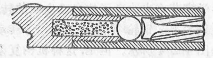

 $-4$ 

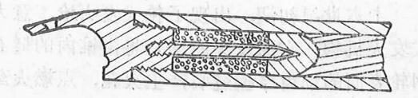

是美丽为少古门基独的头

## 图1-2-7 德尔文枪的药室构造

图1-2-8 图温南枪的构造

他设计的步枪药室直径与枪管口径相等,但在药室底部拧入一根坚固的钢心杆;杆的四 周容纳发射药, 铅弹丸顶在钢心杆上, 当用通条冲打铅弹丸时, 就把它压入膛线。这种 按置的优点是弹丸在通条冲打下向周围产生的扩张, 比在德尔文步枪里面要规则 得 多。 但装弹过程仍很困难。

1849年法国的米尼厄上尉发明了一种长形弹丸, 弹丸呈圆柱形、尖头, 围绕圆柱部 分有二道环形凹槽, 底部掏空成圆锥形, 用一个中空的碗状 铁塞堵上, 见图 1-2-9。当 火药气体压力增大时, 把碗状铁塞压入掏空部分, 使铅弹丸尾部膨胀而嵌入膛线, 从而 形成充分的旋转运动;因而为提高射击精度、简化装填过程、减小口径创造了条件。但 米尼厄弹丸的缺点是在飞行中有时将碗状铁塞失落或改变位置, 影响了弹丸飞行的一 致性。

1853年美国的恩飞耳德将米尼厄弹丸作了改进,他用锥形坚硬木塞代替碗形铁塞, 弹头圆周部分没有环形凹槽, 如图 1-2-10 所示。铅弹丸直径为 0.55 英寸, 发射后膨胀。 使用坚硬木塞后,扩张更为可靠,可克服碗状铁塞的缺点。

1852年英国军械师维尔金 逊和 奥 地利炮兵军官洛林同时发明了圆柱形尖头的压缩 式弹丸, 在弹丸的圆柱部刻了两道很深的凹槽, 如图 1-2-11 所示。它是 利用火药的爆

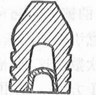

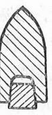

图1-2-9 米尼厄式弹丸 图1-2-10 恩飞耳德式弹丸 图1-2-11 压缩式弹丸

炸力量, 使自由装进枪管内的长弹丸的直径增大, 并使它紧贴膛壁, 并沿膛线前进。 在步枪发展的过程中, 古老火枪的装填方法最初也采用过后装式。但由于后装枪不 能保证密闭火药气体,也不能牢固地使药室与枪管连接,这就限制了使用威力足够的装 药, 在当时的技术条件下, 只能采用前装药了。

后装枪直到十九世纪在新技术发展的基础上才又复兴起来,而代替了前装药的方 法。1840年普鲁士采用了击针式后装枪。这种枪是普鲁士的德来塞发明的,他在发明了 用撞针突然撞击弹壳内的起爆药而使装药引燃的方法以后, 设计了带有这种装置的后装 枪。其特点是: 将一个针形的长击针装在滑动的枪机内。使用的枪弹是纸制药包、自备 点火药的定装式枪弹。弹丸与火药用一填塞物隔开,填塞物后装一爆帽。射击时,击针 尖穿透装药的纸药包,并以其撞击力点燃弹丸底部的点火药,如图 1-2-12 所示。击针 枪和定装式枪弹(弹丸、火药和底火结合为一体)出现后,在简化装填手续和提高射速

---

方面比前装枪显示出巨大的优越性,使用这种枪一分钟可进行五次准确地射击。但是这

种枪使用的是纸药筒,发射后残片须 由下一发弹丸排出枪膛, 枪机也不能 闭塞火药气体。

十九世纪六十年代开始采用了金 属药筒。这种药筒是英国皇家实验所 博克萨发明的,是将黄铜片卷成筒壁, 以铁片做成筒底与底缘, 筒底正中装 火帽。1865年美国的斯乃德枪首先采 用了这种药筒。1871年英国使用了 马梯尼·亨利枪,它所用的弹药,是 将药筒上部缩小, 把黄铜片卷成的筒 壁改进为冲压成型的弹壳。这在当时 是一种较好的制造法, 它解决了枪机 完全闭塞火药气体的问题,并能可靠 地将装有击发药的火帽固定在底部

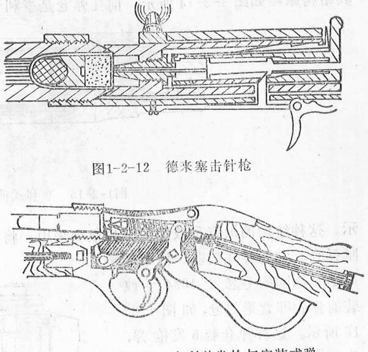

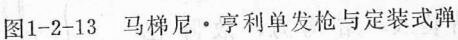

上。类似这种构造的枪弹一直沿用至今。与此同时,步枪也采用了滑动枪机(即在开、 闭锁时可沿枪膛轴线方向运动的枪机。这种滑动枪机具有完成抽壳、抛壳和重新装填枪 弹的作用,这样可大大简化装填过程,提高发射速度,见图 1-2-13。

步枪弹仓在后装枪上使用较早的是1860年亨利及斯宾塞枪。步枪采用弹仓后,发

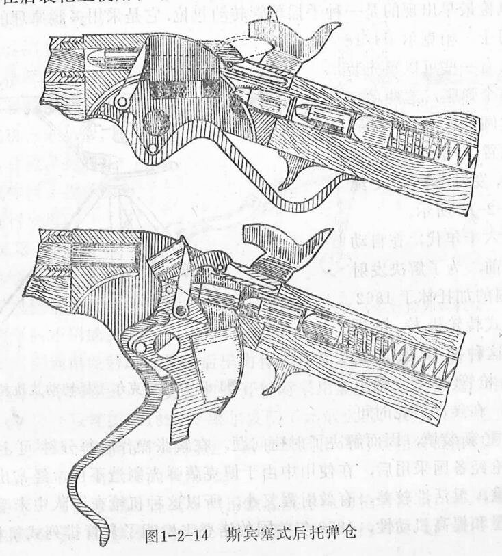

---

射速度大增,每分钟可发射 10 发左右。1867年英国采用斯宾 塞后 托弹仓枪为制式枪, 其结构原理如图 1-2-14 所示。前托弹仓是亨利于 1860 年设计的,其原理如图 1-2-15 所

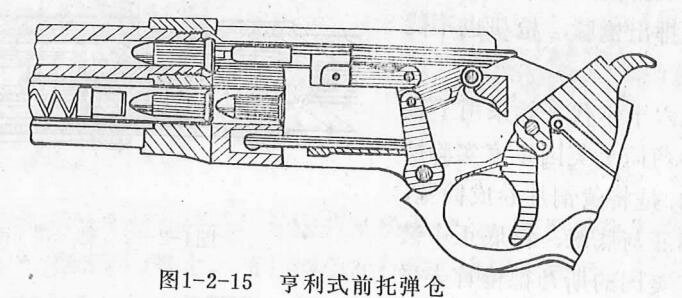

示。这种结构的缺点是故障多,故很少采用。将枪弹装入机匣里进弹口处的弹仓叫做机 匣弹仓。它的样式较多, 使用最

广的是德国的毛瑟于 1884年改 装的弹仓即盒形弹仓,如图 1-2-16 所示。这种弹仓装5 发枪弹, 分双排装入,结构好,故障也 少,使用较广。

(二) 机枪

机枪按自动化程度分为非自 动机枪和自动机枪。

图1-2-16 毛瑟式盒形弹仓

非自动机枪最早出现的是一种手摇单管转动机枪,它是采用多膛原理的武器。这种枪

是英国的詹姆士·帕克尔于1718 年发明的, 它有一些可以预先装 填好弹药的单个弹膛,这些单个 的弹膛联接成圆形, 依次转动到 对准枪管的位置。转动是靠手摇 曲柄来完成的,发射药利用火绳 点火, 如图 1-2-17 所示。

十九世纪六十年代, 在自动 武器未出现以前, 为了解决发射 速度问题,美国的加托林于1862 年发明了多管式转轮机枪,如图 1-2-18 所示。这种枪 口 径 11 毫 米, 膛线 12 条, 枪管 10 支, 采用 了定装式枪弹, 在转动鼓轮时可

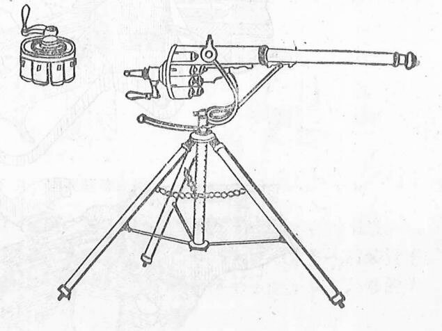

图1-2-17 帕克尔手摇转动式机枪

以机械 化进行重 新装填, 因而解决了射速问题, 在紧张操作时每分钟 可达300至350 发。加托林机枪经各国采用后,在使用中由于博克萨弹壳制造不良,经常出现故障,加 之机枪过于笨重,灵活性较差,有效射程又小,所以这种机枪在军队中未受到欢迎。为 进一步减轻重量和提高机动性, 1878年美国的诺登飞发明了多管排列式机枪,其构造为

---

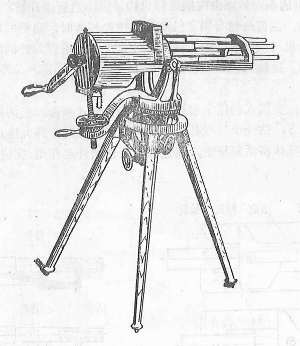

图1-2-18 加托林式轮转机枪

5 支枪管作一字 排列, 固定不动, 如图 1-2-19 所示。这种机枪后坐和复进都是由扳动侧 方的机柄来完成, 弹匣 垂直安装在枪上,弹匣内的枪弹借枪弹本身的重量而下降。发射

时, 5支枪管同时进行齐 射。在自动武器的发展中, 多管排列式机枪起了很大的 作用, 自动武器的主要机构 与多管排列式机枪很相似。 其不同处是自动武器是利用 发射时火药气体所产生的力 来转动机构进行发射。

1884年英籍美国人希 兰·马克沁发明了自动机 枪,并获得了机枪第一次专 利权,这是被军队使用的第

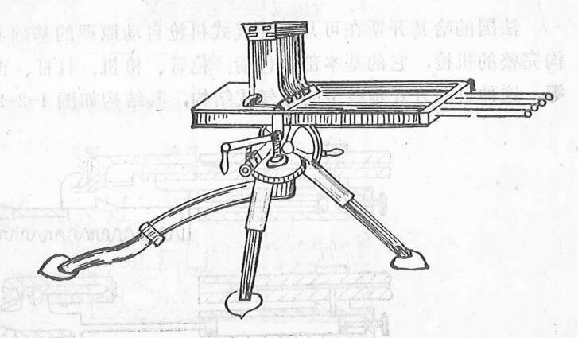

图1-2-19 诺登飞多管排列式机枪

一种自动武器。它利用发射时枪管的后坐力作为连续 射击的原 动力,使一向被认为有害 的后坐力, 变为有用的能量。马克沁机枪开始时采用黑火药发射弹丸, 由于火药压力不 稳定, 自动机工作一致性差。1885年维尔发明了无烟火药, 威力比黑色火药大得多, 马 克沁改用无烟火药后, 解决了上述问题, 终于研制出具有实用价值的自动武器。马克沁 机枪的出现,开创了自动武器的新纪元。 机叶盒油油除香器蒸润金人标避应率量 肥家

marini

第 马克沁机枪的自动原理, 是直接利用膛底压力推动枪管后坐, 采用曲柄连杆机构闭 锁, 用帆布做成弹带, 以供连续射击, 发射速度每分钟约 600 发, 它的 自动方式如图

---

1-2-20 所示。枪机的纵向运动由曲柄连杆机构操纵, 当后坐开始, 枪机随枪 管节套框 后坐到一定距离后,加速凸轮与固定机匣上的滚轮相遇时,曲柄回转打开枪膛。复进时, 曲柄反向回转使枪机关闭枪膛。为了解决持续射击引起枪管灼热的问题, 在枪管外部装 有水套,进行冷却。这种机枪必须安放在各式枪架上射击,总重超过40公斤,机动 性很差。

十九世纪末期, 美国人勃朗宁发明了可儿特导气式机枪, 它的构造是在枪管下面距 枪口约1英尺的地方, 钻一个导气孔, 内装活塞。发射时, 弹丸经过导气孔后, 它后面 的一部分高压火药气体将活塞压下,通过杠杆及连结杆起作用,完成退壳及装弹等动作。 如图 1-2-21 所示。

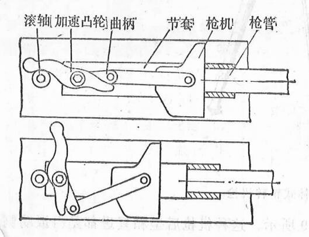

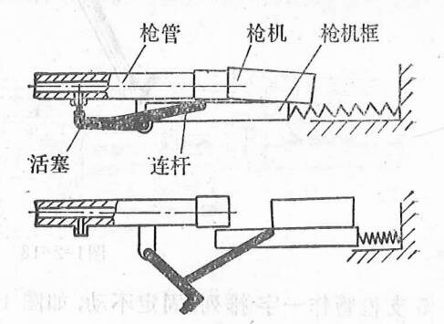

图1-2-20 马克沁机枪的后坐方式

图1-2-21 可儿特导气式机枪构造

法国的哈其开斯在可儿特导气式机枪自动原理的基础上,于1914年制造出一支机 构完整的机枪, 它的基本部件包括: 枪管、枪机、杠杆、击针、活塞、活塞杆和复进簧 等, 这种自动方式是典型的导气式结构, 其结构如图 1-2-22 所示。

图1-2-22 哈其开斯导气式机枪

1902年德国人柏格门发明了枪机自由后坐式机枪,它的自动方式是全靠枪机的质量 来阻止火药气体压力, 使枪机后退延迟, 如图 1-2-23 所示。这种机枪结构简单,制造方 便, 它的缺点是常有破坏弹壳和不连发的故障出现。枪机半自由后坐式机枪, 原系德国 发明, 后来奥地利人守瓦兹洛色利用由枪机带动的曲柄连杆机构, 使枪机受到巨大的机 械阻力而产生减速效果, 以达到枪机延迟后坐的目的。经过改进,于1907年被奥地利用 作制式机枪, 如图 1-2-24 所示。前冲击发式枪机后坐武器的结构形式基本上与枪机 自

8

---

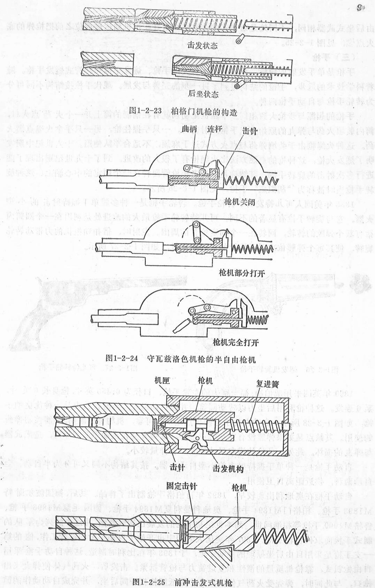

 $\mathcal{Q}_0$

---

(由后坐式武器相同,不同处是前冲式的击发机构恰好在枪机到达最前位之前把枪弹的底 火点燃, 见图 1-2-25。

(三) 手枪

手枪是单手发射的短枪。早期的手枪有火绳手枪、燧发手枪和转管式燧发手枪。随 **着科学技术的进步, 手枪的结构得到了进一步的完善与发展。现代手枪按结构不同可分** 为转轮手枪与自动手枪两种。

手枪的起源与步枪大致相同。十四世纪初期就有在铜制的筒上开一个火 药 点火口, 筒内装填火药与弹丸的原始火绳手枪。射击时,一只手握住枪,另一只手拿火绳点燃火 药。这种火绳枪由于装填弹药与点火方式过于麻烦,不适合军队使用。十六世纪中期发 **明了**燧发火枪,这种枪的点燃方法比火绳枪有了很大的改进。到了十九世纪则出现了能 进行多次射击的旋转手枪,其结构是利用多根枪管回转在一个固定的中心轴上。这种旋 转手枪当时被称为"胡椒瓶"手枪, 见图 1-2-26 所示。

1835年美国人可儿特发明了转轮手枪。转轮手枪是一种多膛单手握持射击 的 小 型 火器, 它与旋转手枪有显著的不同。可儿特转轮手枪最大的改进处是利用在一个圆筒内 卡钻有数个弹膛的转轮,回转在一个固定枪管的周围。发射时,借扣动扳机的力带动转轮 文 旋转, 使其每个弹膛依次对正枪管的位置而发射, 如图 1-2-27 所示。

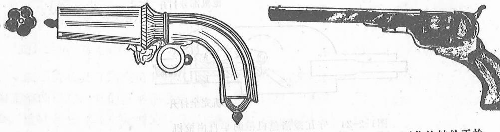

图1-2-26 燧发机旋转手枪

1890年英国采用威伯勒·福士别力的左轮手枪, 口径为 0.455 英寸, 枪身长 6 英 寸, 系6连发。这种枪利用后坐力以转动圆筒,并能自动退壳,当时被认为是一种优良的手 枪, 如图 1-2-28 所示。自动左轮手枪的优点是动作可靠, 机构坚固耐用,并能控制弹药 的使用。其缺点是如果弹膛没有完全对正枪管, 则弹丸会在运动中遇到障碍, 造成武器 与弹丸的损坏。此外, 此枪的横向尺寸较大, 容弹量较小。

自动手枪是一种单手握持射击的小型自动火器。按其结构不同又可分为半自动、全 自动两种, 供近距离自卫使用。

自动手枪在奥地利出现较早, 1892年肖伯格手枪制出了样品。其后,德国波尔谢特 M1893 手枪、柏格门M1894 手枪、奥地利曼利夏M1894 手枪、德国 毛瑟M1896 手 枪、 鲁格M1900 手枪等相继问世。到本世纪初手枪的发展已达到高潮,并逐步的列为军队的 制式手枪而取代转轮手枪。1897年美国人勃朗宁也开始了自动手枪的设计工作,他 的第 一支手枪是采用自由后坐原理的自动手枪,于1898年在比利时制造。这种自动手枪 采用 自由枪机式, 靠枪机质量的惯性和复进簧力与枪管抵紧。击发后, 火药气体使弹丸飞出 枪口, 与此同时, 弹壳受火药气体的压力作用抵压枪机一同后坐, 并完成自动动作的循

!!!!!!!!!!!!!!!!!!!!!!!!!!!!!!!!!!!!!!!!

---

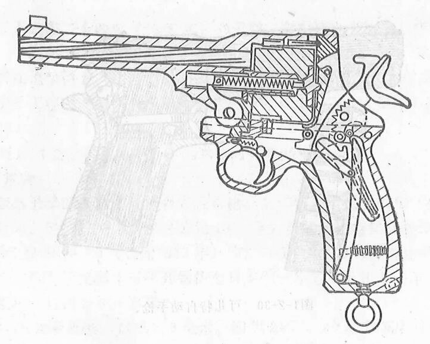

图1-2-28 威伯勒自动左轮手枪

环, 见图 1-2-29。

从十九世纪末期到二十世纪初期, 出现了很多种自动手枪, 其中具有代表性的有美

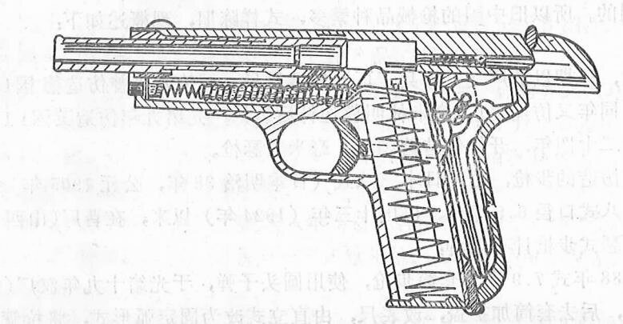

图1-2-29 勃朗宁自动手枪

国的可儿特枪管后坐式自动手枪, 如图 1-2-30 所示。该枪采用枪管摆动闭锁, 发射时。 火药气体推动弹丸飞出枪膛,同时通过弹壳底部推动枪机带动枪管一同后坐,枪管以铵 链为轴, 尾部向下摆动, 使枪管脱离枪机而开锁, 此时枪管不动枪机继续后退, 直至枪 管和枪机之间的供弹口能供弹时为止。这时在复进簧的作用下开始复进,装填新弹,继 续射击,直至枪弹射完。但是最初的可儿特自动手枪由于握把与枪管成直角,射出的枪 弹在10米左右便进入土中。为了在紧急情况下不经瞄准,借食指指物的纯熟能力,举枪 射击, 便可命中。于1911年加以改进, 将握把与枪管的角度增大为110度, 使握把向后 倾斜,便于枪管与握把食指平行。改进后的可儿特手枪,精度好、杀伤力大、发射迅速 及作用可靠,合乎军用手枪的要求,至今仍为美军的制式手枪。

---

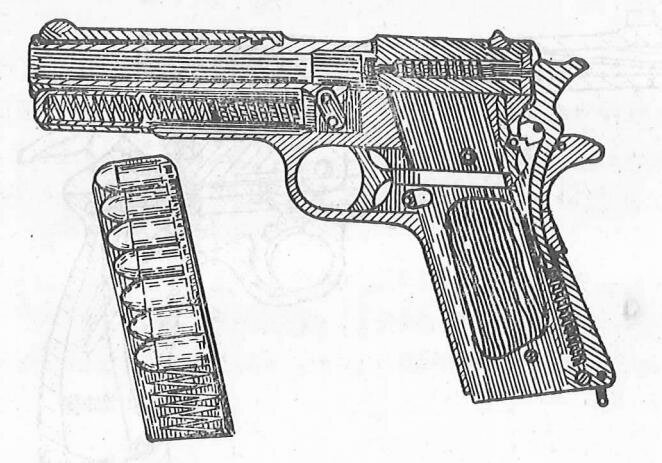

图1-2-30 可儿特自动手枪

## 第三节 旧中国时期枪械的生产概况

我国是最早发明火药和生产火器的国家。世界上最早的铜火镜, 就是我国元朝至顺 三年(公元1332年)用铜铸造的。当时我国兵器制造技术在世界上是领先的,但由于 腐朽没落的封建统治, 科学技术逐步落后, 到后来大多数枪支弹药均从国外购买, 只有 少数是自己仿制的。所以旧中国的枪械品种繁多, 式样陈旧, 现概述如下:

(一) 步枪

旧中国步枪, 早期以沪厂(上海兵工厂)制造最早, 同治六年曾仿造德国11毫米 老毛瑟前装枪, 同年又仿造美13毫米林明敦边针后装枪, 光绪九年仿造英国11毫米单 发黎意枪,光绪二十四年,开始仿造德国 7.9 毫米毛瑟枪。

旧中国后期仿造的步枪,分为日本三八式 (日本明治38年,公元1905年)与德国 毛瑟两大类;三八式口径 6.5 毫米, 民国十三年 (1924年) 以来, 在晋厂(山西太 原兵 工厂) 制造。毛瑟式步枪计有四种:

第一种: 1888年式7.9 毫米套筒步枪, 使用圆头子弹, 于光绪十九年汉厂(汉阳兵 工厂)仿造此枪,后去套筒加护盖,改表尺,由直立式改为固定弧形式,将枪管加大, 即所谓汉阳式步枪。

第二种: 1898年式7.9 毫米毛瑟步枪使用尖头子弹, 粵厂 (广东石井兵 工厂)、沪 厂, 辽厂(沈阳兵工厂)先后曾仿造此枪,但有改变之处。巩厂(河南巩县兵工厂)于 民国二十三年 (1934年) 也曾仿造1898年式7.9 毫米毛瑟步枪。

第三种: 1904年式 6.8 毫米新毛瑟步枪, 于光绪二十三年 (1907年) 在粤厂 开 始 制造。民国元年 (1912年),力求提高精度, 定名为元年式步枪。民国八年 (1919年)粤 厂将其口径改为7.9 毫米, 将弹膛外部加大; 随后四川兵工厂也作了改变, 但仅将枪膛 扩大为7.9 毫米; 巩厂将枪管改为汉阳式而略加变动。自民国十七年 (1928年) 以后, 便生产7.9毫米元年式步枪。

第四种: 1924年式7.9 毫米短管毛瑟步枪, 此枪曾购买不少, 其机件与 德国 1898 年式7.9 毫米毛瑟步枪相同, 惟枪管长为 590 毫米, 比九八式短约 150 毫米, 所以叫短.

---

毛瑟枪, 巩厂于民国二十四年 (1935年) 八月间, 向德国购到该枪工作图纸及量具等。 即开始制造,于同年十月正式出品,定名为中正式步枪。实际上即是"24式"步枪。在 抗战期间, 浙江也曾仿造, 定名为七七式步枪。在1945年我军于胶东采用6.5 毫米口 径。仿造辽宁兵工厂生产的7.9 毫米改良毛瑟的九八式与三八式步枪, 定名为45式步 枪及马枪。

1947年辽厂(九十厂)生产7.9毫米临时式步马枪。

(二) 轻机枪

旧中国制造最早的是丹麦麦特森式轻机枪, 粤厂于光绪三十四年 (公元 1908年)仿 造, 口径8毫米。沪广于民国四年(公元1915年)仿造法国哈其开斯轻机枪, 口径为 7.9 毫米。后于民国十一年(公元1922 年)宁厂(金陵兵工厂)仿造法国绍沙式轻机枪, 口径为8毫米。辽广于民国十三年开始仿造日本十一年式(大正十一年)轻机枪,定名 为一三式轻机枪,口径为6.5毫米。

捷克 ZB-26 式轻机枪, 口径 7.9 毫米。四川 21 厂、40 厂和 巩县 11 厂等厂曾大量 仿造, 所以国内这种枪数量很多。在抗战期间, 浙江也曾改造, 而称为七七式轻机枪。

(三) 重机枪

旧中国制造重机枪最早的是金陵制造局,自清朝光绪十年开始仿造美国的加托林连 装管机枪(俗称六门连珠炮),及美国诺登飞连装管机枪(俗称四门神机枪)。到民国三年 仿造德国的马克沁机枪, 民国十三年开始造新式马克沁重机枪, 当时国内其它各厂也进 行仿造。民国二十三年宁厂由德国取得1908式马克沁重机枪工作图样,完全照样仿造。 较前大有进步,于民国二十四年十月正式出产品,制定二四式。

民国八年粤厂仿造奥国1907年式守瓦兹洛色重机炮, 称为粤式六八水机关枪。汉厂 仿造美国勃朗林M1917年式重机枪加以改造,于民国十年十月十日造成,故名卅节式, 此枪以后湘、桂、陕、川诸省, 沪厂等均先后仿造。最后由巩县兵工厂加以改良, 增设 高射装置, 故又称改良卅节式重机枪。 计上端

日本三八式重机枪, 粤厂于民国八年仿造, 晋厂于民国十三年开始仿造, 口径为 6.5 毫米。辽厂曾加以改良, 定名为一三式重机枪, 口径仍为 6.5 毫米。

(四) 手枪

旧中国用的手枪为左轮、勃朗宁、自来得等。左轮手枪是仿史密斯·威尔逊式,口径 为 0.38 英寸及 0.32 英寸两种, 均为 6 连发, 由伪中央修械厂生产。勃朗 宁 (1900 式) 手枪系自动装填式,口径为7.65 毫米,弹匣容量为7发。自来得即德国毛瑟1898式手 枪, 口径为 7.65 毫米, 分 10 发与 20 发两种, 前者为自动装填式, 后者能全自动 与 半 自动选择射击,均配有木壳。以上各枪当时宁厂、沪厂、汉厂、巩厂、晋厂均有生产。

(五) 冲缝枪

冲锋枪最早是由沪厂、宁广、汉厂等仿造的德国柏克门冲锋枪,口径为7.63 毫米。 但是巩厂及辽厂制造的, 除自动发射外,还能半自动发射,有调节装置。此后又有仿美国 汤姆生M1921 冲锋枪, 口径为 0.45 英寸, 粤厂自民国十二年初至十三年底进行了仿制。 晋厂于民国十五年, 设立专厂进行仿制, 但外表微有差别, 口径为11 毫米,四川二十一 军修械所也进行了仿制,并加两脚架,口径改为7.63 毫米。1947年辽广仿制美国M3A1 式 0.45 英寸 (11.43) 冲锋枪, 定名为三六式 (民国三十六年)。

---

## 第四节 革命根据地枪械的生产概况 11 11 31 3

一、革命根据地的枪械生产经历了一个从无到有、从小到大的发展过程、根据地最早的 国防工业是1931年在井岗山建立的第一个兵工厂,由七八个人组成。同年在江西兴国 县又成立了中央军委兵工厂,共250余人,主要以修枪为主,至1932年中央兵工厂扩 大到 450 多人, 建立了两个分厂, 先后共修配和制造了 40,000 多支步 枪、400、000 多万 发子弹、60,000 多枚手雷、5000 多个地雷; 修理了 2000 多挺机枪、100 多门迫击 炮、 2门山炮, 以及制造了大量的刺刀、铁镐、铁锹等, 为红军立下了不朽的功劳。

抗日战争爆发后, 延安兵工厂的广大职工发挥了创造精神, 在设备简陋、原材料缺 乏的情况下, 克服了种种困难, 于1939年研制出第一支口径为7.9 毫米的步马枪,命名 为无名式步枪, 该枪曾受到毛泽东同志的赞扬。当时该厂一个月能生产40至50支 步枪。 米湾之3 米容口 , 保服靴发生一张

1 但是, 当时八路军的武器装备是低劣的, 数量严重不足。在这种情况下, 军队坚决 执行了"取之于敌"的方针,为了及时修好缴获的武器,到1938年,八路军各部在山西 境内的修械所有十三个, 达1000余人, 这些修械所在极端困难的条件下,完成了许多重 要任务。到1938年,晋察冀军区供给部修械所的职工,在完成修械任务的前提下,发 扬创造精神,仿制了"八音子"手枪、"手提式冲锋枪"、"捷克式步枪"等。当年八 路军 总部在阳城县举行的胜利品展览会上,展出了他们所制造的枪支,朱德同志对此给予了 高度的赞扬。

1938年冬, 八路军总司令部决定成立八路军总部修械所。有职工一百余人,机器设 各十余部、虎钳十八台,主要生产步枪。月产量由开始三、五支提高到六十余支,这就 是太行兵工厂的前身。

1939年, 日寇实行三光政策, 根据地修械所受到威胁, 总部修械所迁往黎城县 黄崖 洞进行扩建。工厂建成投产时,共有切削机床、动力设备等40多部,全厂职工近千人, 每月能生产七九步枪 200 余支、掷弹筒数十门、50 炮弹 30 余发以及刺刀、地雷等武器, 年产量可装备十六个团。

黄崖洞兵工厂制造的主要武器有: 五五式步枪、八一式七九步枪。五五式步枪是汉 阳兵工厂造的七九步枪的改进型,于1940年初,试制成功的。当年,正值朱德同志五十 五寿辰, 工厂为了表达对总司令的敬爱, 故定名为五五式步枪。这种步枪的枪管口径为 7.92 毫米, 有4条右旋膛线, 缠距为 240 毫米, 线膛长 534 毫米, 枪管长 600 毫 米, 瞄 准基线长 503 毫米, 枪长 (不装刺刀) 1110 毫米, 全枪长(带刺刀) 1390 毫米, 全枪重 4.55公斤。金属件全部用道轨钢制作。枪托采用核桃木,每支枪都配有刺刀。刀重 400 克, 刀鞘重 150 克。

1940年7月, 该厂在五五式步枪基础上, 参照延安兵工厂造的无名式步枪, 又试制 成功一种新式的七九马步枪, 枪管比五五式步枪短 150 毫米, 重量 3.06 公斤, 比五五式 步枪精巧、坚固、美观, 深受部队欢迎。受到了八路军总部给予嘉奖。定名为八一式步 枪(当年八月一日试制成功)。此后,工厂一直生产这种枪。

的。黄崖洞兵工厂初创时期, 是我军的步枪制造厂,主要生产五五式和八一式步枪,1940 年至1941年,为步枪产量的最高时期,共生产步枪五千多支,1941年夏,由于掷 弹筒

---

和五〇弹的投产, 步枪产量逐渐减少, 直至停造, 转由高峪兵工厂、梁沟兵工厂继续生 产。黄崖洞兵工厂集中力量生产五○掷弹筒及五○弹。从此,黄崖洞兵工厂成为我军的 西山人群提大单 1891 (铁料收去 炮弹厂。

1939年秋,组建西安兵工厂,主要制造步枪,有机器十余部,职工300余人,由于 组织得力, 到年底, 月产步枪 30 来支。为了保障工厂安全, 该厂于 1940 年春迁往辽县 为整 的 水系命 当书输出了人葬纸 沙甲基 高峪村。

1940年春, 在河南省武安县梁沟村, 组建梁沟兵工厂, 于同年秋天工厂建成, 设备 安装完毕, 正式投入批量生产, 主要生产步枪、手枪、掷弹筒以及六〇迫击炮弹。工厂 有三节锅炉一台,发电机一部,机床三十六台,职工近600人。是一个厂房较大,设备 较多的兵工厂。

一太行军事工业。经过三年的建设与发展,已具有相当生产规模。各工厂都有固定厂 - 址, 产品对象明确, 生产有了专业化分工, 并规定了初步的工艺规程, 工厂内部建立了 相应的管理机构和管理制度,采用了一定数量的机械设备。到1941年,军工部各厂职工 总数达 3300 余人, 拥有相当 1000 马力的蒸汽动力设备和简易机床 124 台, 月产七九步 枪近 300 支, 步枪刺刀 880 多把, 五〇掷弹筒 80 多门, 五〇炮 弹 2000 多 发, 手 榴 弹 5000 多枚, 复装子弹 28000 多发。

人 八年抗日战争, 太行各兵工厂, 自力更生制造的主要武器有, 步枪 9758 支,复装子 弹 2.237.524 发, 手榴弹 580774 枚, 掷弹筒 2,500 门, 五〇弹 198,020 发, 八二迫击炮 弹 37,967 发,雷汞 144 斤,发射药 7236 斤等。装备了八路军,有力的支援了抗日 战争。当我最不好的时

1945年8月15日,日本帝国主义宣布无条件投降,中国人民的抗日战争取得了最 后胜利。人民军队收复了大片土地,接收不少日伪企业,有一部分充实到人民军事工 业, 使兵工厂规模扩大, 生产条件改善, 技术队伍加强, 军火生产能力得以提高。

1946年6月, 蒋介石反动派在美帝国主义的扶持下, 悍然撕毁国共两党协定, 背信 弃义,发动内战,国内形势急剧变化。为适应局势,1947年初,各兵工厂又全部恢复 军火生产,并经调整扩充,发展到19个兵工厂,11,000余名职工。从此这些工厂逐步 减少了枪械的制造,集中力量生产火药、炸弹、子弹、炮弹和迫击炮弹等战争大量消耗 的弹药, 支援解放战争。

## 第五节 新中国成立后的枪械发展概况

新中国成立以后, 党和政府对枪械行业十分关怀。建国初期派了许多优秀干部领导 枪械行业的生产建设, 首先是恢复生产, 支援解放战争与抗美援朝战争。接着是建设与 改造了枪械各有关行业,建立了较先进的教学、科研基地。三十多年来,研制和生产了 各种枪械,大量装备了人民解放军,在反对外来侵略、保卫社会主义祖国的斗争中,做 出了贡献。与此同时,培养了大量的工程技术人员、技术工人及管理人员,并支援了各 方面的建设。

解放后枪械生产的发展,大致可以分为以下几个阶段。( )

建国前夕至 1952年

同整个国民经济情况一样, 当时也处在恢复整顿时期, 大多数厂仍然继续生产过去

---

的产品, 如马克沁机枪、德式手枪等等。但已开始接触苏式装备, 着手进行测绘 仿 制。

首先测绘的是苏 1941 年式 ППШ 冲锋枪, 1950 年夏投入批量生产, 命名为 1950年 式冲锋枪, 1951年大量投入生产。主要装备了志愿军, 有力的支援了抗美援朝战争。该 枪配有容弹三十发的长形弹匣或七十二发的圆形弹鼓,全枪结构简单,便于大量生产, 但其射击频率过高难于掌握, 射击精度较差。1949~1950年间还测绘了苏联1933年TT 式手枪,并转入了仿制生产, 命名为 1951年式手枪。

1953年至1959年 11

1953年开始, 即着手从苏联引进第一批枪械产品技术资料。以两年多的时间进行了 技术资料的翻译、技术人员与技术工人的培训、聘请苏联专家、调整生产线、补充与检 修设备、制造工艺装置及进行产品试制等工作。至此,我国开始正规生产苏式装备。这 些产品 1953年至 1954年先后投产的有: 1953年式步骑枪 (仿苏式步骑枪)、1953年式 轻机枪 (仿苏 ДПМ 式机枪)、1953 年式重机枪 (仿苏 CГ 式重机枪)(均发射 苏 联 1908 年式 7.62 毫米枪弹, 即我国生产的 1953 年式 7.62 毫米枪弹)。1954 年式冲锋枪及 1954 年式手枪 (使用 1951年式手枪弹)。其中 54 式手枪是苏 TT 式手枪 (我 51 式 手 枪) 的 改进型, 克服了原枪使用不安全的缺点, 具有精度较好、安全可靠等优点, 作为部队的 制式装备,至今仍然大量生产,是我国军用枪服役周期最长的产品之一。

1954年式 12.7 毫米高射机枪, 仿苏 IIIIKM 机枪, 配有轮式高平两用枪架,可对 空中及地面目标射击。 海 新 的 000 8 前隔期

1 1956年前后,我国又进一步引进了苏联产品、初期包括全套技术资料、样品、部分 零部件、毛坯件及关键复杂的量规、校对量规等。这是一次全面的技术引进、也是枪械 生产一次较大规模的技术改造。通过生产准备、试制生产,一批新产品在1956年相继定 型并投入生产。主要包括: 音 业务的目录不要就 地子男女工具业科室独人 麻痺冠

1956年7.62 毫米班用武器族, 包括: 56 式冲锋枪 (苏 AK47 突击步 枪)、56 式 半 自动步枪 (苏CKC半自动步枪) 和 56 式班用轻机枪 (苏 PΠ口 班用机枪) 均发射 1956 年式步机枪弹(苏7.62毫米 M43 中间型枪弹)。这三种枪械的试制成功。使我国班、排 装备大为改观,实现了班用武器弹药通用化,并使威力大大增强,此外武器弹药系统重 量及尺寸的缩小,又进一步提高了机动性。目前, 它们是我国步兵班装备数量最多的 武器。

1957年式重机枪 (苏 CFM 重机枪) 它是 CF-43 重机枪的改进型, 主要是将 53 式 的轮式架改为框式轮架, 基本保持了原枪的威力, 但重量却由 44.5 公斤 减 轻 到 38 公 斤。58 式 7.62 连用机枪, 系 口Π 式机枪的变形枪, 采用弹盘、弹链两种供弹方式, 配 可更换的加重枪管,其实际射速较 53 式机枪为高, 但其后坐能量不足, 重量 较 大, 影 响了灵活性。1956年式 14.5 四联高射机枪和 1958年式 14.5 二联高射机枪是枪械 中口 径、威力、结构形状及重量最大的产品,主要用以对付超低空目标和地面轻型装甲目标。 这几种产品试制生产以后,使我军步兵装备基本配套齐全。此外,为适应其它军兵种发展 的需要, 还先后试制了车、舰、机载枪械。供装甲车辆配套的产品有:1955年式7.62毫米 坦克机枪 (苏ДТ坦克机枪)、1959年式 7.62 坦克机枪 (苏 СГМТ 坦克机枪)、1959年式 12.7坦克机枪(苏 口LLK 高射机枪枪身),这几种至今仍为坦克车辆配套使用。供舰艇配 套的有: 59-1式 14.5 双联机枪、1965 年式 14.5 双联机枪。供飞机配套的有: A12.7 毫

16

---

来航空机枪。供特种需要的有57式26毫米信号枪等。除这些军用枪以外,还试制了5.6 毫米小口径运动枪和比赛枪、7.62毫米大口径运动枪和各种猎枪等。在此期间建立了较 完善的弹道器材生产基地,以满足生产的需要。

随着上述产品的试制、投产,不仅使我军装备状况有很大的改善,也使枪械行业的 生产技术水平有很大的提高,主要表现在:主要产品以产品为对象、按工序进行排列组 成了流水式生产线;工具及设备维修能力大大加强,保证了产品的生产及扩大再生产。

在工程技术方面, 配合新产品的试制生产, 新工艺、新技术得到应用。在枪管加工 方面: 枪管内孔采用电解液压抛光, 提高了加工膛线前的光洁度; 枪管膛线挤压 成形, 代替传统的拉削膛线,大大提高了生产效率;有些产品弹膛镀铬,提高了耐腐蚀能力。 在毛坯精化方面, 开始试用熔模精密铸造, 冷挤压工艺。在机械加工方面, 采用一些专 用机床, 气动夹具, 拉削工艺等, 减轻了体力劳动, 提高了生产效率。在表面处理方面, 采用了磷化喷漆,提高了抗蚀性能。其它如喷丸、冷作硬化等工艺的应用对提高产品质 量亦起到了良好的效果。在正式这个乐趣要自动单独高峰。而我激情都是不断

1960年~1966年的国家精度和临潼管理的建造者 (1) 11 12 12 12 12 13 13 14 15 16 17 18

五十年代末期, 枪械行业也和全国各条战线一样, 人人奋发图强, 力争迅速改变我 国的一穷二白的面貌。在党的三结合方针的指引下,工厂、院校、研究所与部队相结合, 设计定型了一批新产品。如: 步冲合一的 63 式自动步枪, 是我国第一个设计定型 的军 用枪械, 它具有动作可靠、点射稳定性好等优点。64 式微声冲锋枪和67 式微声 手枪, 消声、消烟性能良好,填补了装备的缺门,满足了特种部队的需要。64 式手枪是中、高 级指挥员使用的小型自卫武器,结构紧凑、能联动击发、使用安全可靠。67 式轻重两 用机枪,具有重量轻、体积小,机动性好的优点。69式双 14.5 机枪能舰、艇两用,使 用方便。

当时, 为了适应部队作战的需要, 对现行生产的产品又进行了许多改进。

在提高战斗性能方面, 60年代初, 将 56 式半自动步枪、冲锋枪原设计 的剑形刺刀 改为棱形刺刀, 提高了强度; 改进了枪机结构, 使56 式半自动步枪空枪射击寿命大为 提高。在解决勤务操作方面,56年式班用机枪改进设计了弹盒挂架等部位,便于部队战 士扛枪,并改名为56-1式班用机枪;56式 14.5 四联高射机枪改进杠杆机构, 解决了行 军、战斗状态转换困难的问题; 56 式冲锋枪弹匣取消后突筋, 握持时不再卡手。在 提高 机动性方面, 57 式重机枪的轮式框形架, 改为三角架, 减轻了重量, 便于使用和携 带; 54式 12.7 高射机枪改进设计了新枪架, 简化了工艺, 重量大大减轻。这些改进, 都受 到部队干部、战士的欢迎和好评。 医黑血管 有不 医性动脉结固素

为了降低成本, 配合采用新工艺及生产中发现的质量问题。将56式冲锋枪 的锻造 机匣改为冲压机匣、改进了复进机结构, 节省了原材料和刀具; 56 式 14.5 高射 机枪加 长了枪管复进簧, 解决了枪管复进不到位和取不着弹的故障, 适应了枪弹钢 壳 化 的 需 要, 提高枪管套的连接强度, 解决了位移, 断齿的毛病。 ------------------------------------

- 随着我国工业的发展,技术水平的提高,枪械新材料、新工艺、新技术的研究和采 用也取得很多成果。

新材料的应用: 于六十年代研制定型的我国第一代新枪用钢种, 50 硼 A 代替 50 A, 30 硅锰钼钒 A、30 铬锰钼钛 A 代替铬镍合金钢, 在保证产品性能的前提下, 节约了我国

---

资源缺乏的合金元素。56 式半自动步枪、冲锋枪,63 式自动步枪采用玻璃钢枪托, 护盖、 握把代替木材, 取得较好的效果。工程塑料也开始应用, 63 式自动步枪弹匣, 各种枪的 油壶、手枪握把等都采用了工程塑料。异型钢材也得到应用。

冲压结构的应用: 56 式冲锋枪, 63 式自动步枪机匣、56 式半自动步枪击 火 支 架, 14.5 枪身机匣盖,受弹机座等件原来均为锻件,经多年研制改为冲铆(焊)结构,节 约了原材料和刀具。图温的了五朵。船皿大会认兼科群备进入具工,进行出发生表

一 精密铸造工艺普遍推广使用, 56 式冲锋枪有十余种零件以精铸代替 锻 件, 14.5 四 联, 舰二联机枪有几十种。精铸件良品率逐步提高, 机械化程度不断提高, 建立了数条 自动制壳生产线,采用自动压模机等。

精锻技术开始试验与应用,枪管、枪刺进行了多次冷锻试验。热锻 12.7 高射机枪 枪管进行了小批试生产, 从六十年代末投产至今, 取到很好的经济效果。枪管内膛大余 量挤光,具有效率高、操作简单、表面光洁度高等优点,并起到强化作用。

机械化自动化程度提高, 如高效单能自动车床, 多头组合铣床, 多工位自动 机床, 表尺座等自动生产线, 倒角去毛刺机械化, 弹链冲压自动化机床等相继设计制造成功。 工具硬质合金化水平普遍提高, 广泛采用电加工机床, 线切割机床等。

为了解决枪管寿命问题,枪管内膛以双层镀铬提高底层金属硬度等方法,增强了铬 层的附着力, 延缓了脱铬和烧蚀, 使 14.5 枪管单管寿命提高到 1000 发以上。为了提高 表面防腐能力, 以电泳涂漆进行表面处理, 采用防锈油等薄层油封及气相缓蚀包装等。 对提高表面防腐能力,改善外观,便于使用,改善劳动条件都有明显作用。

和 在热处理方面, 可控硅中频淬火, 回火、小件自动连续淬火炉等均已用于生产。

. 在焊接方面, 创造了以铜银合金为点焊头的二脉冲点焊机。二氧化碳气体保护焊亦 已广泛应用。

此外, 还建立了枪械非标准设备制造点, 成套制造枪管等专用设备, 供国内外新建 工厂使用。

总的来说, 从 1960年至 1966年, 是枪械行业发展历史上最好的时期之一。至1966 年,枪械行业的各项技术经济指标,如产量、劳动生产率,综合良品率、一次交验合格 率,材料消耗定额,产品成本及均衡生产均创造了历史最好水平。

同时, 枪械的新厂建设项目也在迅速增加, 几个老企业为新厂建设提供了干部、技 术工人, 非标设备、产品及工艺技术资料, 枪械生产能力成倍增长。

1977年到现在

1977年以来, 我国枪械的科研、生产得到比较快的恢复和发展。

新产品开发的速度加快,为部队装备和外销提供了更多种枪械。63 式自动步枪 通过 数年攻关, 解决了单发精度不好, 膛外炸壳等问题, 性能达到了原设计要求。67 式 轻重 机枪, 在部队调查后, 组织攻关组, 对精度不好, 顶弹故障多及膛外炸壳等三个 疵病, 进行改进, 达到生产定型, 命名为 67-1 式重机枪。在此基础上, 进一步改进枪架 等 结 构, 重量更为减轻, 命名为 67-2 式重机枪。在 56-1 式冲锋枪的基础, 重新设计了侧向 折叠的活动枪托, 解决了原枪托松动大的缺点, 命名为 56-2 式冲锋枪。64 式手枪, 改 进了发射机构, 增大了击发能量, 达到生产定型。77 式 12.7 高射机枪是我国自行 研制 的第一代大口径机枪, 该抢型式新颖, 结构尺寸紧凑, 重量大幅度减轻, 性能良好。该

---

枪的定型投产, 使该口径枪械装备到营、增强了步兵的火力。79式轻型冲锋枪具有轻便 灵活的特点, 装备了特种兵。77 式手枪具有单手装填的特点。80 式手枪、81 式自 动步 枪和班用机枪定型投产后,为我国班用武器提供了又一新品种。班用机枪采用的弹鼓装 弹结构为我国首创,别具一格。

82 式 14.5 舰用机枪是在 69 式 14.5 舰用机枪的基础上进行研究改进的。它 克服了 原枪架结构上的缺陷, 操作使用方便, 增强了刚度, 保证了全枪射击的稳定性。

与此同时,在测绘、改进、仿制产品等方面,也取得了许多成果,这批产品,有的 补充了部队装备的缺门, 如测绘仿制的 CB口7.62 半自动狙击步枪, 威力大, 精度 好。有 的产品经济效益显著, 如 75 式 75-1 式 14.5 单管高射机枪、80 式 14.5 单管轮 式 高 射 机枪和 80 式 7.62 多用途机枪 (IIKMC) 是最有代表性的产品。80 式 7.62 多用途机枪 是当前世界上重量最轻的通用机枪之一,结构简单,动作可靠,机动性好,使用方便, 克服了原苏式重机枪易掉弹头的故障。PIIK7.62 班用机枪和M79 榴弹发射器系统的测 绘仿制成功, 为我军增加了技术储备。尤其是通过对M16A, 5.56 毫米自动步枪和M79 榴弹发射器的测绘, 改进, 更促进了枪械工程技术的发展, 摸索和积累了对铝合金构件 的设计,压制、加工、装配等一系列经验,增长了知识,提高了设计和工艺水平。

为适应体育运动射击比赛的发展, 改进设计了小口径比赛手 枪、步 枪, 和比 赛 猎 枪, 受到了运动员的好评。民用枪械也增加花色品种, 运销欧美。

近年来,一些枪械获得优质产品。有三种枪获得国家金质奖,有二种枪获得国家银 质奖,有十二种枪获得部优质奖。

几年来,基础理论研究和测试技术研究也取得不少成果。如缓蚀剂提高枪管寿命的 研究、膛口流场及声场的研究。闪光摄影、高速连续脉冲 x 光摄影、激光摄影及声定位 精度靶等设施的研究与建成, 为分析研究武器性能提供了新的手段。

枪械的科研和生产, 尽管生产能力较大, 制造能力较强, 但自行研究、设计的产品 试制周期长, 设计与工艺水平不高, 影响了设计产品的先进性。所以与世界先进水平相 比尚有较大的差距。为此,必须建立一支高水平的科技队伍,加强基础理论、应用技术 的研究和测试手段的建设, 积极引进国内外的先进技术, 以加快新一代枪械的科研与生、 产。为进一步改善部队装备、提高经济效益做出贡献。

## 第六节 枪械生产质量要求的特点

对于武器的战术技术要求, 许多著作中都有专门的论述, 就不再重复, 本节针对枪 械的特点,介绍在科研、改进和生产中易产生的质量问题。

## 一、可靠性

枪械大部分为单人手提武器, 使用时多为贴身操作。射击时膛内处于高温高压状态, 自动机连续高速运动, 一旦发生事故, 就有危害人身安全的可能, 故产品在使用中保证 安全, 最为重要。在生产中, 诸如炸膛、炸壳, 不闭锁击发等现象, 是绝对不允许出现 的,一旦出现必须采取措施杜绝。如某机枪,由于卡壳,使下一发子弹进膛而不能闭锁, 且由于枪管射弹多而弹膛温度高, 烤燃枪弹而自爆, 致使试验时炸伤了射手, 经过采取 措施, 杜绝卡壳, 防止自燃, 才解决了这个问题, 再如某自动步枪, 某12.7高射机枪也

---

因弹壳在弹膛外露出过多而引起炸壳,经改变枪管的结构尺寸,才避免再发生。这样的 问题, 在研制和生产过程中必须严肃认真对待, 不能有丝毫的马虎和麻痹, 否则将会造 成严重的后果,枪毁人亡。整个产品就可能因此而被否定或淘汰。

枪的可靠性还表现在火力的持续而不中断地射击,因为枪械主要用于近距离战斗, 任何不能很快排除的故障都会贻误战机,达不到保存自己,消灭敌人的目的。所以, 无论在设计和生产中都不允许故障率超过规定范围。尤其是连续出现同类故障,必须 加以克服。有的故障, 出现的频率虽然不高, 而这种故障却难以排除, 这也是不允 许的。

在各种恶劣条件下,枪械必须能正常工作。枪械要在各种气候(严寒、高温、潮湿、 干燥、风沙、淋雨)和自然环境(山地、平原、从林沙漠)下使用;操作人员的训练状 态、熟练程度、操作习惯也不相同; 各使用单位的贮存条件、维修条件, 擦拭润滑方法 也有差异,上述这些差异就从不同的角度对枪的质量提出了不同的要求。甚至有时是互 相矛盾的。这就要求在产品设计及制造上要综合考虑。保证各种条件下的使用。同时, 也要向使用者指明产品的特点, 提供说明书, 使之能正确地使用维护, 使枪械经常处于 良好的技术状态。 散 影 心理性 冷冷 进行的 平静 计生息水平 计变形类 化摄影的系统的 使学习的

## **大心的人的爱的人,一个人,准备的确的性质的**,我们的人的过去分词

准确性系指枪的射击精度和散布精度。它不仅是衡量威力的重要技术指标,而且也 是训练中极为重要的考核项目, 新产品能否取信于部队, 精度是极为重要的因素 之一。 以我国研制的枪械来说, 1963年式自动步枪, 1974 式班用机枪, 1967 式轻重两用机枪, 三种枪发到部队后,经一段时间使用,所反映的共同弱点就是精度不好。至于比赛枪的 满你圆半径更是以毫米计算。故枪械的精度要好,不仅是少数样品枪精度要好,而且大 量生产的枪仍应保持良好的精度,不仅新枪精度要好,而且经过长期操作使用后仍应保 卡持良好的精度。" 长图 。当我张曲晶首节数节前说, 不不

## 计预有较大的 视频 试生,必须是水。支部本平的科索提供,加强基础贴合成材料设术 当已预除的特殊方 流出地 11 1 三、耐 久 進 15 b 特 1 的 m的 海南干海 图 2 m m

枪械按其所发射枪弹的有效工作时间或自动循环的次数来说,其寿命是不长的,就 是按射击范围(或技术条件的规定)射击所规定的寿命发数,少则九小时,多则不过几 天。寿命(或大型)试验,是每种产品研制和生产中的一大难关,它是产品设计是否优 良, 工厂生产质量是否稳定的综合反映, 它理所当然的引起各方面的重视, 要求生产各 个环节都始终保持正常。任何寿命试验发生重大技术质量问题的产品,都是不能交付部 队使用的。

射弹发数作为衡量寿命的指标无疑是需要的, 然而, 这不过是一个方面(以后将近 一步说明)。在实际使用中,还要求枪有一定的使用寿命,即要求枪械是一种经久耐用, 勒务性能良好的武器。一支枪的使用周期可达十年,二十年甚至更长的时间,在这么长 《的时期内存放、运输、反复勤务操作,它都必须能保持正常工作。武器要能经得起摔打, 主要零部件不破损,不丧失工作能力。我们经常看到,在实际使用中,往往不是由于累 计射弹数达不到寿命, 而是由于长期操作使用使枪支报废, 或者因型号陈旧而被 淘 汰。 所以, 在设计和生产中对使用寿命应予以足够的重视。

---

稳定性是指枪械生产对零部件一致性的要求。从枪械产品的精度、光洁度等级总的 情况来看, 要求并不很高。但由于是大量生产, 其互换性要求较高(这里所指的互换 不仅是技术条件中所规定的互换件,而且还包括所有在使用中可能更换的零部件。在生 产装配过程中, 许多零部件的配合部位, 也不允许以修配的方法或者配专用件的方法来 满足装配的要求)。这样就要求各类零部件严格按照规定的尺寸、公差、形状,光洁度 加工、严格控制超差品, 在大量生产中始终保持质量的一致性。

## 五、机动性

现代战争对于枪械的机动性要求比以往任何时候更为严格,由于现代化步兵机械化 程度空前提高,接触时间短,要求火力反应快,必须迅速开火,且要求射手在各种状态 下能方便地向不同的目标转移火力。能在进攻和防御状态中以不同的姿势方便地进行射 击。为了火器转移迅速,要求武器重量大幅度减轻,外廓尺寸尽量紧凑。从我国生产的 几种武器中可以明显看出这种趋势, 以重机枪为例: 1953年式重机枪重44.5公斤; 1957 式重机枪(轮架的)为38公斤,三脚架的为28公斤;1967-1式轻重机枪25公斤; 1967-2 式重机枪 15.6 公斤; 1980 年式多用途机枪 12.6 公斤。经过二十多年, 重 机 枪 的重量减轻了三分之二以上。而且轮廓尺寸逐步减小,在各种条件下都能迅速开火。步 枪的小口径化,无托结构、无壳弹及枪的研究都是为了减轻步枪系统的重量,提高机动 性以利于在各种条件下(如丛林、壕沟、地道、装甲车辆、飞机内等)都能方便地操作, 充分发挥其作用。

## "六经济性

枪械生产量大, 装备面广, 随着科学技术的发展, 新装备不断出现, 战术思想不断 变化, 枪械的更新也会加快, 相应要求研制、试生产、大批生产的周期要短, 因而要求 枪械产品的加工工艺性要好,零部件尽量通用化、标准化、产品尽量系列化;考虑一般 设备和工具能进行生产, 便于战时动员。原材料来源广阔、尽可能立足国内。以上是产 品经济性的一个方面。

另一方面, 由于枪械行业和国民经济其它部门一样, 各个企业在向社会提供产品的 同时要向国家提供积累, 企业由单纯生产型向生产经营型转变, 枪械作为商品出现在国 内外市场上,必然要具有竞争性,这就给产品的经济性带来新的课题,一是成本应低, 在价格上占优势, 从产品设计、试制生产、试验, 销售各个环节都必须认真考虑, 使在 同档次的枪械中,达到消耗最小,售价最低;二是枪械作为商品必须在 造 型款 式、外 观、装璜、包装使用等方面能满足各类用户的不同要求,低档产品要实用、价廉,高档 产品要美观,大方、豪华、精致,逐步占领和扩大市场,以取得最佳的经济效益为目标。 这就是经济性的新的课题, 新的含义。

## 第七节 枪械质量保证体系

, 现代质量管理的根本, 不是检查, 而是在工程管理中保证质量, 即建立质量保证体

---

系。所谓质量保证体系, 就是为了保证稳定地生产出使用者满意的产品。从产品的研究、 设计、试制、大量生产到部队验收使用,以及部队情报反馈的整个过程中,建立起各部 门, 各单位的明确分工和责任制度, 使它们之间严密协调的工作, 使影响产品质量的每 个环节, 各个阶段和一切因素都能控制起来, 在质量缺陷发生之前(或最初阶段)能够 早期报警,采取预防措施,防患于未然。

质量保证体系如图。

的气势脚突对

商的 子公司

湿沫魚 原 染草

51 月以子

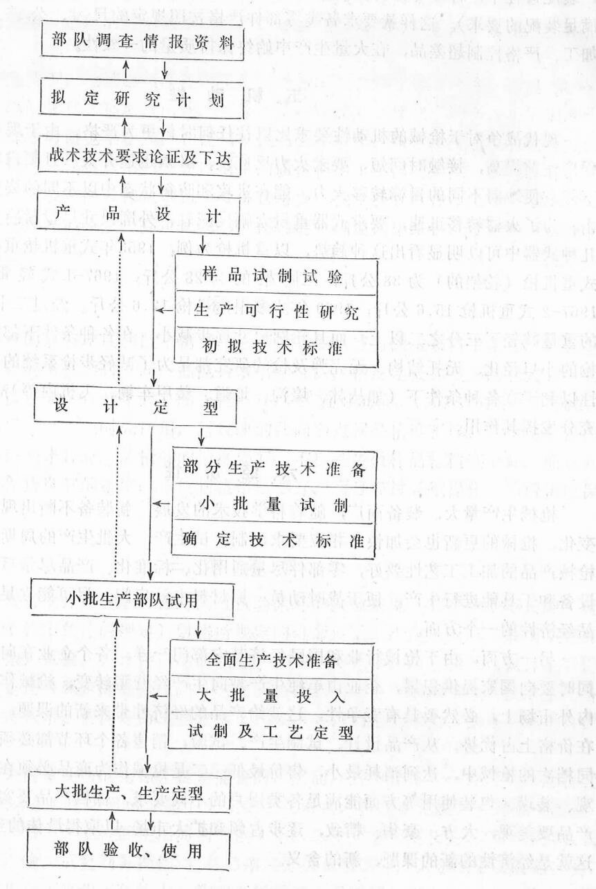

一、新产品的论证和研制阶段

这阶段是企业生产技术活动的关键环节,是对产品质量最有决定性影响的时期。研

19 月 新 川 必

---

制阶段的成果是设计定型,但它只是样品的定型。如果开发新产品的论证、研制、试验、 评审和试生产各个环节没有做好,在生产中质量问题会层出不穷,尽管生产过程中再努 力,再严格控制,都难以生产出符合使用要求的产品。这一阶段的工作,对企业的前途 影响很大,因此必须引起足够的重视。 4.5. 文雅 计选示 (传出本) 不是

在论证过程中要从以下几方面着手:

1. 此种产品是否为部队所需要, 是我们这项工程是否开展的最基本的出发点。

2. 这种产品虽然需要, 但也应以下达的战术技术要求指标来衡量一下, 在技术上 是否有研制、生产的可能, 用价值分析法分析其成本价格能否为军方所接受。

3. 企业能动员多大能力, 对该产品进行研制、生产和销售。本企业承担这项任务, 所达到的技术性能是否能与同类型产品竞争。是品气特性资本、中毒比喻新融入

研制阶段要注意的问题.

1. 把供选择的方案进行评价, 挑选一种进行详尽设计。在技术设计中要充分研究: (1) 同类老产品在部队使用中的优缺点, 取其所长, 补其所短, 老产品在结构、选 材、工艺等方面的得失,也要认真借鉴。

(2) 在样品试制过程中, 要严格按照设计的产品图, 加工中有修改必须及时在产 品图上反映,防止图实不符。提供试验的样品,必须有完整的技术资料为依据,结构、 尺寸、公差、硬度等等数据,尽可能记载实际数字。

样品的制造加工尽量仿效大批生产的方式,使原形样品尽可能适应今后大量生产。

(3) 样品试验不仅要注意那些例行的试验项目, 尤其要注意那些代用性能难以表 示的真正的使用特性。这些试验都要达到前面所说的"质量目标"的水平,无论从整体 上,从细节上都应是完整的。

新产品研制的人员组织:

1. 主任(或总) 设计师制度: 该负责人应该是一个项目从产品论证、研制、投产、 销售到部队使用服务为止, 在整个阶段中负技术责任。这样做的好处是克服过去由于分 段管理, 导致技术信息, 情报传递不好, 工作中不衔接、不协调等弊病, 较好的解决工 艺和设计的争议,达到设计与工艺,质量和成本的统一。

2. 常驻工程师(技术员)制度: 在试制和大量生产时, 为把设计意图传达到生产 上去,要建立设计人员在生产技术指挥系统常驻的制度。在大量试制生产中,往往会发 生设计时预料不到的问题,通过这种常驻制度,设计人员可以配合现场迅速采取措施。

另一方面,工艺和检验部门,派工程师(技术员)在研制阶段常驻设计部门,可以 把过去生产中工艺、检验的经验教训、体现到新产品中,同时也把新产品的第一手资料 带回去。这样做也有助于设计和生产、检验的协调、有助于新产品的顺利投产。

## 从、当前麻實圖總合計工书 一二、小批生产和试验阶段

小批试生产, 试验是承前启后的阶段, 它可以减少从样品到大量生产的风险。小批 试生产的数量,可根据产品的大小及生产纲领的情况作不同的决定,数量可在几十到几 百支(挺)的范围内变动。在这阶段,通过部队试验试用,进一步评价产品的适用性及 生产的可行性。

1. 小批试生产, 一般应在正规的体现一定工程能力的生产车间进行,这样可预先发

---

现以后大批生产将会遇到的问题。所加工的零部件尽可能体现分布性,而不是由个别熟 练工人修配零部件。

2. 小批试制前, 要进行设计评审工作, 以达到质量问题的早期报警。新产品使用中 出现的毛病,大多数是产品设计本身的缺陷,越是复杂的产品就越突出。通过设计评审 可以及早补救这些不足。

设计评审应该: (1) 由各方面工程师 (技术员) 如工艺、检验、维修, 使用及未 参加该项目设计的设计师组成, 由主管生产技术负责人主持; (2) 有计划、有准备的进 行,参与者事先对产品情况有足够的了解;(3)设计人员采取合作的态度,认真听取各 方面的意见,但设计人员可以保留最后决定权。

3. 小批试制过程中, 注意考核产品是否符合大批量生产, 注意收集有关工时, 成 本、工艺适应性,产品合格率等数据,为大量生产的技术准备提供依据。

4. 试验评价.

新击试验是评价产品性能的主要手段,是产品设计定型和生产定型必不可少的 步骤。

工厂试验: 工厂试验是产品试验评价的第一步, (1) 试验条件尽量体现部队 使用 的真实情况, (2)试验的要求尽量按战术技术指标进行。通过后提交基地试验。

基地试验:基地试验是对产品全面系统的评价。

工厂要提供试验数据,产品图等技术资料。由于基地试验全面,测试比较完备、评 价经验比较丰富。经过全面的测试和各种条件的试验,可以得到全面评价。

部队试验: 基地试验与实战情况还有一定的差异, 故还需进行部队试验。部队试验 是接近实战条件下的试验。最好由使用、科研和生产诸方面的人员组成试验小组,首先 要让部队了解产品性能和使用特点, 达到正确操作, 在不同地区和季节按计划进行。

我国是一个大国, 地理、气候条件有很大差别, 部队数量很大, 战士体力、身材、 习惯也不同, 援外和外销的产品更要面向全世界, 这些复杂的条件都要充分考虑, 在通 常情况下都要适应。然而对那些出现概率较小的极端情况,则要视具体情况全面考虑后 而定。

## 我会打开 小的中间两分大的 如三、大量生产阶段 计汽车的员人将划立数据 六十

。 通过全面生产技术准备,完成生产定型,达到大量生产。 地质图 不精彩 圆形装主

1. 生产准备阶段 (图)

正确掌握产品设计意图,通过工艺、工装的设计,确保产品设计质量的实现。发现 产品技术资料的问题,要及时进行反馈。

(1) 制定工艺规程: 使零部件按合理的工艺规程加工, 各工序合理配置和衔接,从 工序上保证产品设计要求与经济合理。

(2) 工艺装置设计:

量具: 选择基准, 设计符合要求的量具, 使能准确地控制零件的尺寸与公差。

刀具:按照工艺要求,决定刀具类型、选择刀具材料。 医少点面 道 道 主

夹具: 根据工艺及选用的设备, 确定夹持原则, 设计具体结构。

模具:按零件或毛坯的几何形状尺寸采用与设计模具。

 $24$

---

在整个工装设计过程中。要充分考虑通用化、标准化。便于生产和转换品种。

(3) 工装制造及安装: 工装要按工艺要求, 在设备上安装、调试, 达到定型。

生产准备阶段, 重要的问题是工艺方法(工序、工装)必须确保新产品性能。不能 要求产品图,技术要求无原则地迁就工艺,不能牺牲产品性能来方便生产加工。在生产 **技术准备阶段要十分注意打好技术基础, 良好的操作习惯, 这对今后保证产品质量具有** 决定性影响。另一方面, 在工艺设计中为达到较好的经济效果, 在不影响性能的前提下。 对产品图也可做些必要的修改,但必须慎重从事。

在调试生产线过程中, 逐步增大投入批量是稳妥的, 每批试制后, 投入量加大一个 数量级,如开始几十件,到几百件,上千件。

2. 大量生产

(1) 接受定货, 拟定生产年度计划, 通知有关部门。 (1) 要求是

(2)采购原材料、辅料及外协件。

(3) 调整生产线, 工艺合理布置, 在制品流程合理。

(4) 零部件的合理批量、周期, 根据总装配的生产计划、使零部件的生产均衡、 协调。

大量生产的质量保证关键在控制。原材料、零件、部件总装,包装的每道工序要严 格控制。每个岗位的人员都必须对产品质量负责。机械加工要控制工程能力, 使机床、 工具 操作者等诸因素处在正常状态, 保证零件尺寸的分布和偏差。热表加工必须经常 分析和测量各种数据。大量生产中, 对有缺陷的产品进行分析, 找出产生缺陷的根本原 因,采取措施,防止再发生。大量生产中出现不合格品,要在找出原因,采取纠正措施, 防止再发生的前提下,分析不符合标准的产品是否适用,不适用者应退修或报废,适用 者应根据情况处理。大量生产中如遇重大质量事故, 或零部件严重不合格, 要采取果断 措施,必要时切断零部件的流转线,进行整顿。

3. 售后服务

til Bake Terlus

野野原血员知用身不良

(1) 认真听取使用部门的意见, 不护短, 具体分析, 正确处理。

(2) 访问使用部队, 进行技术服务, 提供技术说明及零备件。

(3) 不断改进质量, 针对产品存在的问题, 进行诊断, 根据轻重缓急, 安排顺序。 组织攻关。

(4) 不断搜集反映, 综合整理, 迅速反馈, 为发展新产品提供情报信息。

事枪是古家家都说不识用的,要求能光发融人,首先命中。平时由要求有自好的财

日本本的内华的省务规制之桥

光、水材数器

---

枪

技术准备阶段要十分注意打好技术基础。良好的操作习惯、

激量缓。如开始儿十件

4. 5. 1 4 1. 0

在整个工造设计过载中,具充分参启通用传、标准化、应于生产和特换品种。 工委船造及安装,工业加压工艺要求,在设备上安装,调试,进河途壁。

## 述 概

一、手枪的性能、用途及战术技术要求

(一) 性能和用涂

这对今后保证产品玩量具有

手枪是近距离上单人使用的自卫武器。主要装备部队指挥员、特种兵和公安保卫人 损, 用以杀伤50米内的有生目标。

手枪的有效射程一般为 50 米, 但有的手枪以专用枪托肩射时, 有效射 程 可 达 100 米, 在150 米以内可以杀伤面目标, 弹头在500 米的距离上, 还能保持对人体的杀伤作 用;手枪一般均为单发、半自动射击,但也有少数手枪能连发或点射。

手枪多采用发射威力较小的枪弹,我国目前采用的手枪弹有: 7.62×17、7.62×25 和9×18毫米三种。枪口动能为 20~50公斤·米。 林康西番草大陆当岗个

1 国产手枪全长一般为 160~300 毫米, 不装实弹时的全重一般为 0.5~1.1公斤, 装 满弹的全重为 0.55~1.2 公斤、金属利用系数一般为 12.6~52 公斤· \* / 公斤, 见本节末 附表。

想 根据使用需要及技术的发展, 手枪也朝着弹药通用化, 武器系列化的方向发展。目 前,多数国家的手枪采用9毫米口径,有的还在研究小口径和积极发展手枪族。

(二) 手枪的战术技术要求

1. 成力

《 (1) 弹丸的作用效果 和 精心素素 , 就是不 , 我们的 particular the

手枪用于在紧急情况下杀伤极近距离的有生力量,因此它具有足够的停止作用,以 使敌人迅速丧失战斗能力。为提高手枪的停止作用,通常采取增大口径或采用较钝的弹 头。由于目标常有轻型防护(如避弹衣等),所以手枪在有效射程内,还应有在击 穿防 护层后进行杀伤的能力。如: 64 式 7.62 手枪在 50 米处的动能为 18 公斤 · 米, 用它射 击 50 米目标时, 能穿透每层为1 毫米的 8 层尼龙布或两层棉垫加一层羊皮的防护 层 后 进行杀伤。

(2) 战斗射速

手枪的战斗射速一般为 30 发/ 分左右。自动手枪的战斗射速: 半自动时 为 40 发/ 分; 连发时为 120 步/分左右。为保证手枪有较高的战斗射速,一般采用速换式弹匣供弹,设 置有空仓停机机构。

手枪一般为半自动射击, 以完成自卫为主, 在紧急情况下使用时反应要迅速。

(3) 射击精度

手枪是在紧急情况下使用的,要求能先发制人,首先命中。平时也要求有良好的射 击精度。为此, 应采用低冲量枪弹, 瞄准装置要设置在同一基础件上, 并应增长瞄准基

---

## 图2-3-封2 手枪安全可靠保险操作方便

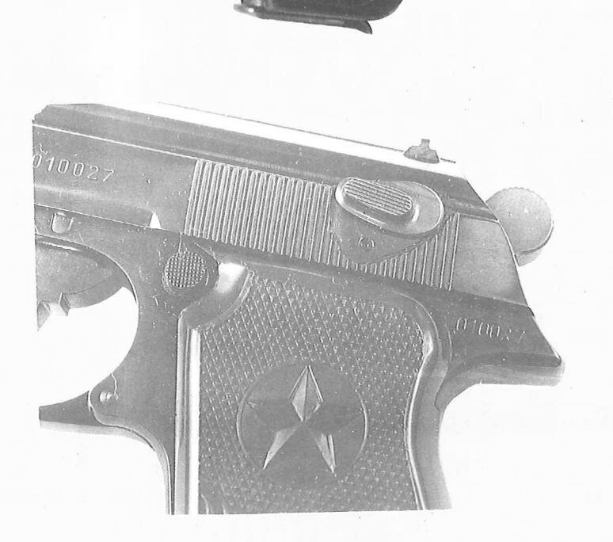

图2-3-封1 1964年式7.62毫米手枪

图2-2-封1 1954年式7.62毫米手枪

---

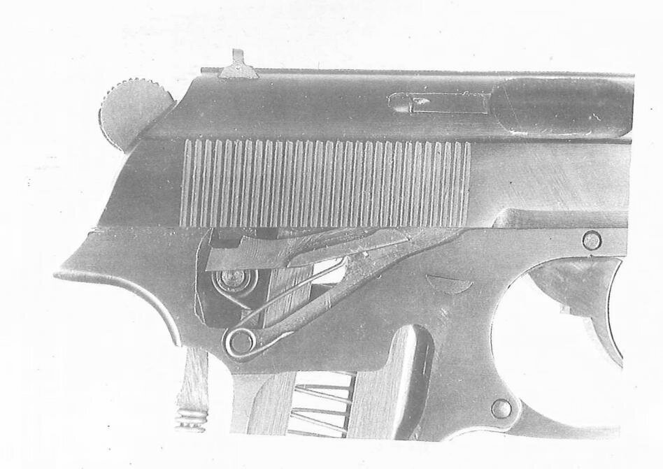

图2-3-封3 具有双动扳机(开火及时准确)

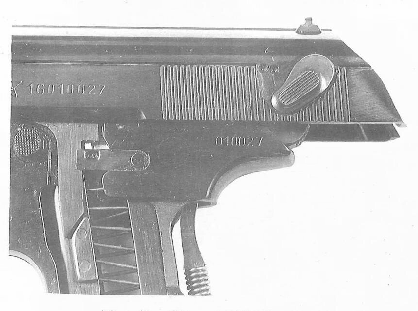

图2-3-封4 弹匣回闩新颖弹尽指示醒目

---

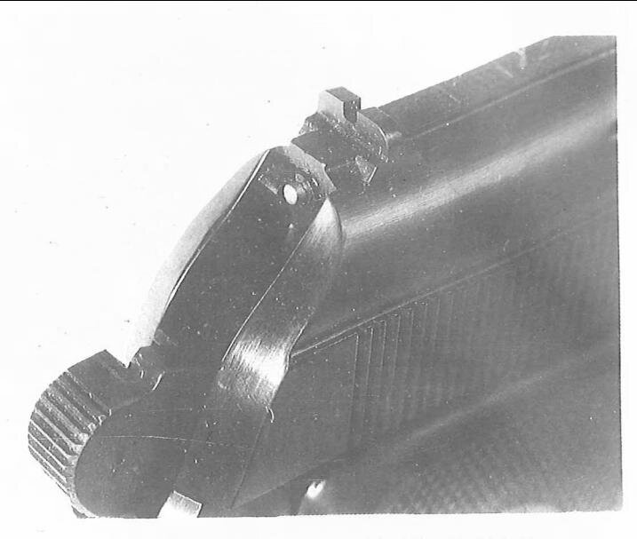

图2-3-封5 弹膛指示鲜明使用方便有数

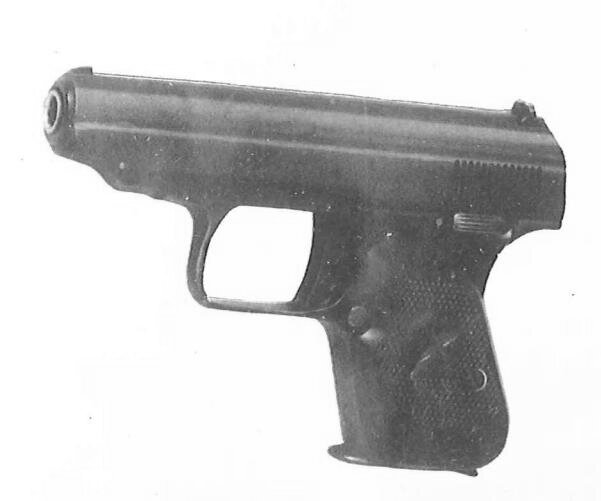

图2-5-封1 1977年式7.62毫米手枪

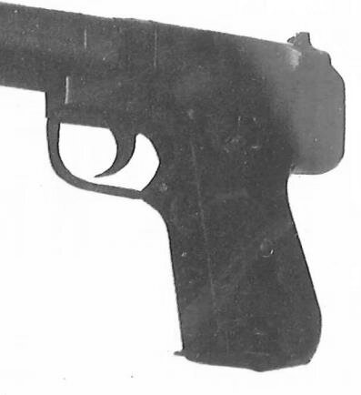

图2-4-封1 1967年式7.62毫米微声手枪

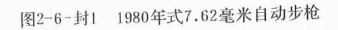

---

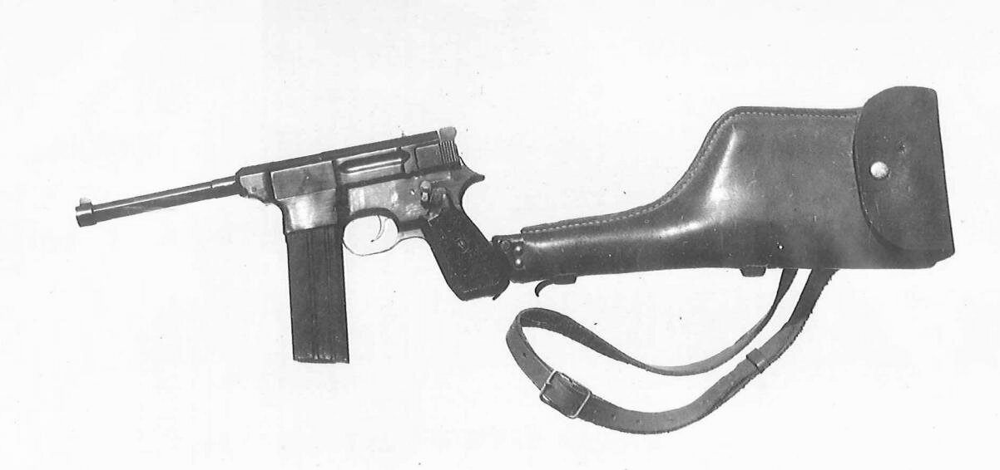

图2-6-封2 1980年式7.62毫米自动手枪(装具枪托)

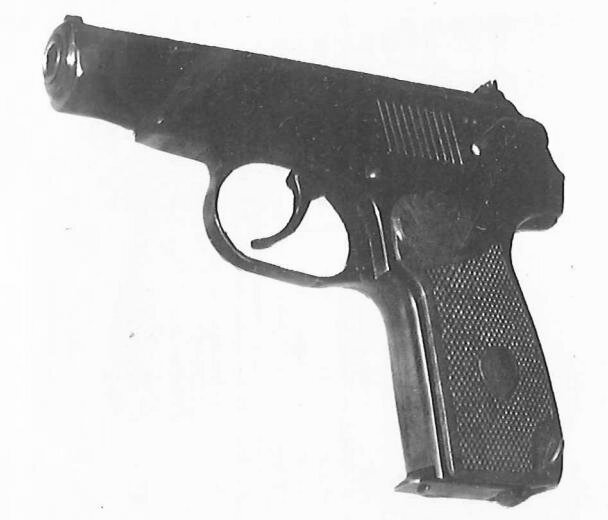

图2-6-封3 1980年式7.62毫米 自动手枪 (装具枪托)。

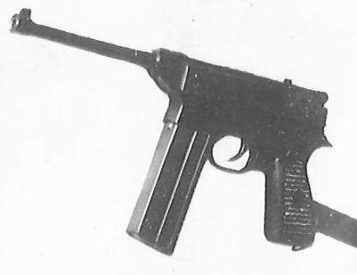

图2-7-封1 1959年式 9 毫米手枪

---

线, 尽量将虎口握持部位上移; 扳机最好是预告式日引力要平稳而适中; 因手枪多处于 本能射击,故握把应少许向后倾斜,握持要舒适。对于自动手枪,为提高对较远目标单 步或点射的射击效果,要设计配套的肩托或支撑。对微声手枪还要设置简易的夜瞄 装置。

一般手枪的射击精度是以单发射击来进行检查。其射击密集度一般用散布圆半径 R. 和 R, , ● 来表示。它是在一定射距上, 以 10 发或 20 发为1 靶, 单发进行射 击。在生产中为保证产品质量,又考虑到试验的方便和降低成本,每支手枪一般都以单 发射弹 4 发 (自动手枪还需检验 20 发射 击 密 集 度), 以 4 发 或 3 发 (当 有 1 发 为 意 外弹时) ●弹着点的平均弹着点对检查点的偏差值和它们的散布圆的大小。来 评定是否符合规定,并以此进行检验和验收。实践表明,此试验方法是经济可 行的。

|              | 25米固定靶架单发射击精度要求 |                     |               | 检验试验要求与验收试验要求                                    |
|--------------|-----------------|---------------------|---------------|--------------------------------------------------|
| 枪 名称 手 | 射弹数 (发)      | 平均弹着 点偏差 (厘米) | 散布值 (发)    | 平均弹着 散布值 点偏 射弹数 (发) 差 (发) (厘米) |
| 54式7.62手枪    | $\frac{4}{1}$   | $\leqslant$ 5       | $\leq 10$     | 验收试验要求同左 。等创动                                 |
| 64式7.62手枪    | $\overline{4}$  | $\leqslant$ 5       | $\leqslant$ 8 | 同 Ŀ.                                          |
| 67式7.62微声手枪  | $4\overline{4}$ | $\leqslant$ 5       | $\leq 10$     | , 加賀首树囊(4) 特拉树基 $\leq 10$ $\leq 10$        |
| 77式7.62手枪    | 4               | $\leqslant$ 5       | $\leqslant$ 8 | 验收试验要求同左                                         |
| 80式7.62手枪    | 射距50米           | $\leqslant$ 5       | $\leq 18$     | 4 发射击精度的验收同左、单 发每靶20发取连续3靶平均值                 |
| 59式9.0 手枪    | 4               | $\leqslant$ 5       | $\leq 10$     | 验收试验要求同左                                         |

4 但对具有不同闭锁方式的手枪, 需注意因发射差角不同而产生平均弹着点的定差。 现将本章所介绍手枪射击精度的规定指标及试验方法列表如下.

2. 机构动作可靠性

手枪是随身携带、用于短兵相接的战斗中,要求机构动作可靠,射击和携带过程中 要绝对安全。

机构动作可靠性是以在使用条件下允许的故障率来衡量的。手枪寿命试验中允许的 故障率一般小于 0.5%(其中包括因手枪的缺陷造成的瞎火率不超过 0.1%) 不允许发生 危及射手和友邻的故障。手枪常见的故障为卡壳、卡弹等。

手枪允许出现的故障率是寿命试验中的一个指标,在机构动作可靠性试验中是不允 许出现故障的。

现将本章所介绍手枪的允许故障率、试验故障率、故障类别和平均故障率列表 如下:

● R50 被布半数必中圆半径, 即以平均弹着点为圆心, 包含弹着点数50%的圆半径。

 $R_{100}$ -一散布全数必中圆半径, 即以平均弹着点为圆心, 包含全部弹着点的圆半径。

● 意外弹的判定: 较远 1 发的弹孔到另外 3 个较密集弹孔的平均弹着点的距离, 大于这 3 发中最远距 离 的 1 发到该平均弹着点距离的2倍时,较远的这发弹就是意外弹。

---

| 手枪名称        | 障 率 (%)   | 允许故试验故障 率范围 (%)       | 寿 命 故 障 统 计 试 验 |                |                 |          |               |         |         |                 |                 |                                          |                                                  |                      |
|-------------|-----------------|-----------------------------|--------------------------------------|----------------|-----------------|----------|---------------|---------|---------|-----------------|-----------------|------------------------------------------|--------------------------------------------------|----------------------|
|             |                 |                             | 卡 売                               | 不 击发        | $\ddagger$ 弹 | 有弹 停机 | 复进不 到 位 | 弹 低头 | 不 抛壳 | 其它              | 故障 总数 (次) | 试验 次数                                 | 总射弹数 (发)                                      | 平均故 率 障 (%) |
| 54式7.62手枪   | 0.5             | 0.030 $\sim 0.47$        | 18                                   | $\mathbf{1}$   | $\mathbf{1}$    | 13       |               |         | 25      | 3               | 61              | 10                                       | 30000                                            | 0.2                  |
| 64式7.62手枪   | $\leqslant 0.3$ | $\mathbf{0}$ $\sim 0.33$ | $\overline{5}$                       |                |                 | T        |               |         |         |                 | $\overline{6}$  | 10                                       | 15.000                                           | 0.04                 |
| 67式7.62微声手枪 |                 |                             | $\overline{2}$                       | $\overline{2}$ |                 |          | $\mathbf{1}$  |         |         | 1               | 6               | $\overline{4}$                           | 半自动                                              | 0.19                 |
| 77式7.62手枪   | $\leq 0.33$     |                             | $\mathbf{1}$                         |                | 9               |          | $\mathbf{1}$  |         |         |                 | 11              | !!!!!!!!!!!!!!!!!!!!!!!!!!!!!!!!!!!!!!!! | 3200 !!!!!!!!!!!!!!!!!!!!!!!!!!!!!!!!!!!!!!!! | 0.07                 |
| 80式7.62手枪   | $\leqslant 0.3$ |                             | $\overline{2}$                       |                | $\overline{2}$  |          |               | 5       |         | $6\phantom{1}6$ | 16              | $6\phantom{1}6$                          | 17.319                                           | 0.09                 |
| 59式9.0手枪    | $\leqslant 0.3$ |                             | 39                                   |                |                 |          |               |         |         | $6\phantom{1}6$ | 45              | 4                                        | 12000                                            | 0.385                |
|             |                 |                             |                                      |                |                 |          |               |         |         |                 |                 |                                          |                                                  |                      |

对手枪零、部件寿命要求是指按规定要求进行寿命射击试验承受的射弹数,其中并 未包含长期使用磨损、腐蚀等的影响。手枪的寿命: 一般中型手枪为 3000 发; 小型 手 枪为 1500 发; 自动手枪为 4000 发; 微声手枪为 800 发。手枪的小零件和基本零件寿命 一致。在寿命终了时,零件不允许破断,允许有不影响手枪安全和动作可靠性的裂纹和 崩缺。

手枪在射击和操作使用时必须安全。保险机构保险位与射击位的变换比其他枪种更 要确实明显, 在手枪上要设置完整的保险机构, 为手动安全保险、到位保险、自动保险 及射击保险等。手枪处于安全保险位时,击发发射机构必须能保证手枪活动件被锁住不 能运动,而不能完成装填。自动保险则是将处于停机位的击锤,由阻铁限位,使之不能 向前运动。这种机构的作用是膛内有弹时,当有外力撞击击锤时而防止击发。射击保险 是手枪装上弹匣后, 在射击时, 因它最后的几何封闭件被刚性定位, 使活动件不能从枪 上脱出,从而保证射手安全。

对微声冲锋枪,除提出与一般军用手枪相同的要求外,还要求在发射配套的枪弹时, 使枪口声、光和烟达到规定的指标。

3. 机动性

手枪是随身携带和手持射击的武器, 要求结构紧凑, 特别要便于隐蔽携带。对于中 型手枪,长度不应大于200毫米;小型手枪长度约为150毫米左右。满装枪弹手枪的重 量: 中型手枪应不大于1公斤; 小型手枪则为 0.5公斤左右。

在手枪的机动性中开火的及时性很重要。要先发制人就必须出枪快、开火快,这就 要求:手枪外形无过分突出的部分;从枪套内取枪的动作要符合一般习惯,并要简便迅 速;最好设有弹膛指示器,以便在隐蔽携带和举枪射击时能清楚的识别;要设计双动扳 机(即联动机构); 设计快速回闩(如用装填的弹匣回闩等)、余弹显示装置和单手装填 机构等。

此外, 各机构安排要合理, 操作部位的配置也要适当。如发射方式或状态的转换、 空弹匣的卸下、手枪的装填等,只需用持枪手就能完成。最好射手无须做特殊动作就能 使击发机处于待发状态。手枪的状态和快慢机位置应有明确的显示,以便能迅速判断并 做出反应。在出枪的同时,应能很方便的打开保险。

4. 勤务性

手枪的分解结合一般不用专用工具或少用工具。当零、部件结合不正确时,应不能

---

装配成枪。手枪的操作顺序及旋转方向应符合习惯。首先装填力应小于10公斤, 扳机力 一般在1.5~4.5公斤左右, 联动击发力要小于7.5公斤, 单手装填力也不应大于9 公斤。

手枪维修要简便,训练时应容易掌握。零件表面应尽量平整,易于擦拭涂油。对微 声手枪的消音装置及其元件、枪管等金属表面应涂镀防腐层,清理与擦拭也要方便。

5. 经济性

除与其他自动武器相同外,手枪也要实现系列化,以提高生产效率和降低成本。 本章所介绍手枪的金属利用率如下表:

| 序号             | 名 枪      |      |      | 带枪弹的重量Q(公斤) 枪口动能 Eo (公斤·米) 金属利用率 n = $\frac{E_0}{O}$ (公斤·米/公斤) |
|----------------|-------------|------|------|----------------------------------------------------------------|
|                | 54式7.62手枪   | 0.94 | 49   | 52.1                                                           |
| $\overline{c}$ | 64式7.62手枪   | 0.61 | 24.7 | 40.5                                                           |
| 3              | 67式7.62微声手枪 | 1.12 | 14.1 | 12.6                                                           |
| $\overline{4}$ | 77式7.62手枪   | 0.55 | 24.7 | 44.9                                                           |
| 5              | 80式7.62自动手枪 | 1.21 | 62.9 | 52                                                             |
| $6\phantom{1}$ | 59式 9.0手枪   | 0.81 | 30.9 | 38.1                                                           |

## 二、手枪的主要战术技术诸元

本章各手枪的诸元多为实测值,少数为计算值。其中内、外弹道诸元为普通弹时的 数据。

| 序 号         | 武器 名称        | 口径 $\widehat{\phantom{m}}$ 毫 米 | 初速 (米 (秒)       | 有效 射程 (米)                | 重 枪 带空弹匣 带实弹匣 (公斤) | 枪长 (毫米)  | 枪管米    | 膛     |                | 线 导程 旋条(毫米) | 瞄准基弹匣 线 (毫米)(发) | 长容量            | 自动 原理           | 闭锁 方式 | 射击 方式 | 弹药型号                                | $\widehat{\phantom{0}}$ 枪公 口斤 动米能 | 备 注 |
|----------------|-----------------|-----------------------------------------|-----------------------|--------------------------------|--------------------------------|-------------|--------|-------|----------------|-------------------|-----------------------|----------------|--------------------|----------|----------|-------------------------------------|--------------------------------------------|--------|
| $\mathbf{1}$   | 54式 手枪       |                                         | $7.62 420\sim$ 440 | 50                             | 0.85 0.94                   | 196         | 116 右  |       | $\overline{4}$ | 240               | 156                   | $\overline{8}$ | 枪管短 座 后      | 枪管 起落 | 单发       | 51式7.62 毫米手枪弹                    | 49                                         |        |
| $\overline{2}$ | 64式 手枪       |                                         | $ 7.62 ^{300}$ 320 | 50                             | 0.56 0.61                   | 155         | 86.5右4 |       |                | 240               | 117.2                 | $\overline{7}$ | 自由 枪机           | 惯性 闭锁 | 单发       | 64式7.62 24.7                        |                                            |        |
| 3              | 67式 微声 手枪 | 7.62                                    | $230 -$ 250        | 30                             | 1.05 1.12                   | 226.286.5右4 |        |       |                | 240               | 195.5                 | 9              | 非自动 枪闩旋  枪机式性闭锁 |          |          | 67式7.62 与自由转或惯单发毫米微声手 14.1 枪弹 |                                            |        |
| $\overline{4}$ | 77式 手枪       |                                         | $ 7.62 ^{300}$ 320 | 50                             | 0.5 0.55                    | 148.586.5右  |        |       | $\overline{4}$ | 240               | 127                   | $\overline{7}$ | 自由 枪机           | 惯性 闭锁 | 单发       | 64式7.62 24.7                        |                                            |        |
| $\overline{5}$ | 30% 手枪       |                                         | 7.62.470              | 肩 50, 射可达 $100 - 150$ | $\frac{1.1}{1.21}$             | 302.2       |        | 140右4 |                | 240               | 236.5                 | 10 或 20  | 枪管短 座 后      | 卡铁 旋转 | 单发       | 51式7.62 62.9 连发毫米手枪弹             |                                            |        |
|                | 59式 手枪       | 9                                       | $290 -$ 315        | 50                             | 0.73 0.81                   | 161         | 93.5右  |       | $\overline{4}$ | 252               | 129.4                 | $\mathbf{8}$   | 自由 。枪机          | 惯性 闭锁 | 单发       | 59式9毫30.9 米手枪弹                   |                                            |        |

军用手枪主要战术技术诸元表

第二节 1954年式 7.62 毫米手枪

## 一、简 述

12. 弹回直

1954 年式 7.62 毫米手枪是仿苏联 TT1930/1933 年式 7.62 毫米 手枪, 于 1954 年生 产定型, 简称 54 式 7.62 手枪。 1951年式7,62 查米于检验。

!!!!!!!!!!!!!!!!!!!!!!!!!!!!!!!!!!!!!!!!

---

## **1915年第一次前千小文社 地震 二、用途、配备与诸元**

(一) 用途

本检是我军基层指挥员, 公安保卫和特业分队人员使用的自卫武器, 用以杀伤50米 以内的有生目标。

(二) 配备 每支手枪配有2个弹匣。以下,引顾亲源突漂舟斜在,我向保养先后自出去 (三) 战斗性能诸元 , 先十般率用麻鼠合成体正阳不和兽 1. 有效射程 2. 枪口动能 3. 战斗射速 4. 弹匣容量 5. 第一发装填力 6. 扳机力 (四) 弹道诸元 1. 初速 2. 25 米处弹道高

3. 平均最大膛压 AND HELL IN THE UNIT

- (五) 结构诸元
	- 1. 口径 2. 手枪全长 第 第
		- 高

3. 枪管长 4. 膛线

5. 自动方式 6. 闭锁方式 7. 发射方式 8. 供弹方式 9. 瞄准基线长

10. 瞄准装置

11. 枪全重

12. 弹匣重

(六) 使用枪弹 1954年式7.62 意米平枪是枯满酸 T 1930/1933年式7.62 毫米 1951年式7.62毫米手枪弹。

50米 49公斤 米 30发/分 8发 9.5~10公斤 2~5公斤  $420 - 440* / \omega$ 远着木迷木影感主的梦寺儿三儿的 12.5厘米  $1850 - 2100$ 公斤/厘米2 7.62毫米 196毫米 30毫米 128.5毫米 116毫米 4条、右旋 导程 240 毫米 枪管短后座 枪管起落 单发 弹匣供弹 156毫米 固定式矩形准星 方形缺口照门 带1个空弹匣 0.85公斤 带 8 发实弹匣 0.94公斤 空弹匣 0.078公斤 满装实弹 0.163公斤

年龄 不为 标准 清单 中华

香寒乳公司, 100, 130, 79, 79

---

三、自动原理及主要机构

(一) 自动原理和运动参数

1. 自动原理

54 式手枪全枪结构如图 2-2-1 所示。

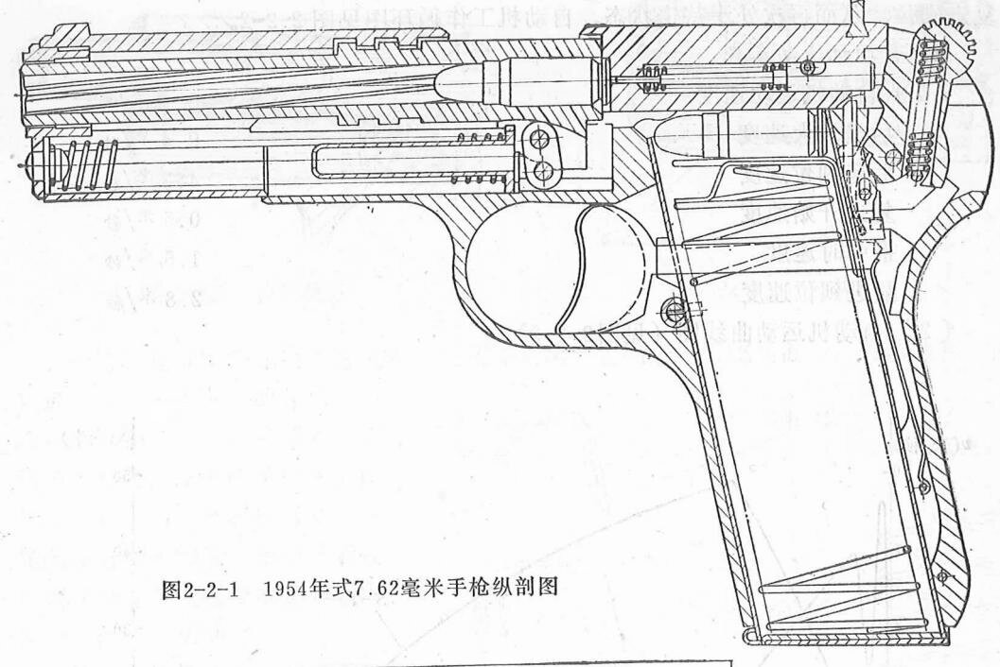

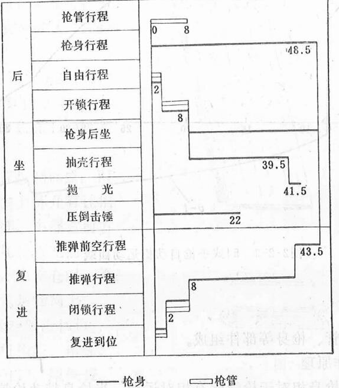

图2-2-2 54式手枪自动机工作循环图

---

枪弹被击发后,火药气体推弹丸向前,同时通过弹底将动量传给枪身。枪身通过它 中部的闭锁凹槽带动枪管一同后坐。当共同走完2毫米的自由行程后,由于连杆的作用, 使其逐渐开锁。开锁后,枪管因受枪底把限位而停止运动。枪身依其惯性后坐,完成压 倒击锤、压缩复进簧、抽壳、抛壳并后坐到位。复进时,靠复进簧伸张,推枪身复进并 完成推弹,输弹入膛。枪身撞击枪管尾端面后,带动枪管一同复进,共同完成闭锁,并 复进到位,从而再次处于待击状态。自动机工作循环图见图 2-2-2。

| $\rightarrow$ $\rightarrow$ $\rightarrow$ $\rightarrow$ $\rightarrow$ $\rightarrow$ $\rightarrow$ |           |
|---------------------------------------------------------------------------------------------------|-----------|
| (1) 自动机运动速度                                                                                       |           |
| 后坐最大速度                                                                                            | $9.4$ 米/秒 |
| 后坐到位速度                                                                                            | 4.2米/秒    |
| 复进开始速度                                                                                            | $0.5$ 米/秒 |
| 推弹时速度                                                                                             | 1.5 米/秒   |
| 复进到位速度                                                                                            | 2.8 米/秒   |
| 白动机运动曲线网(回图2-2-3) $\left( \begin{array}{c} 2 \end{array} \right)$                              |           |

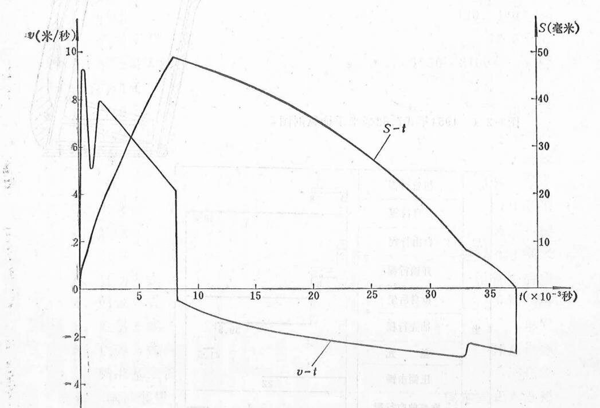

图2-2-3 54式手枪自动机运动曲线

(二) 主要机构

1. 闭锁机构

闭锁系统主要由枪管、枪身等部件组成。

(1) 开锁时的动作原理

枪身一开始后坐,枪身相对于枪管就有相对运动。当枪身带动枪管共同走完自由行 程后, 由于连杆围绕着枪身扣轴转动, 枪管在后坐的同时, 以锁套作为支点而转动, 使

2. 自动机话动参数

---

其后部下降,枪管上部闭锁突筋逐渐从枪身闭锁凹槽中解脱。当枪管突筋完全脱离枪身 闭锁凹槽后, 枪身在火药气体后效期内继续加速, 至最大速度后, 靠其惯性 后 坐到位。 检管旋转向下直至与枪底把相撞停在后方成开锁状态(见图2-2-4)。

(2) 闭锁时的动作原理 (见图2-2-5)

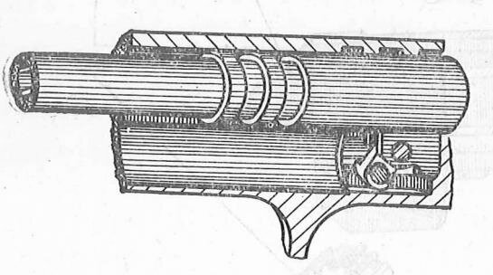

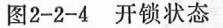

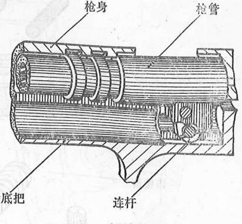

闭锁状态

枪身在复进簧的作用下复进时, 当其弹底窝突台撞击枪管尾端面后, 带动枪管一同

复进。此时由于连杆的作用, 使 枪管后部旋转向上。枪管上方突 筋进入枪身的闭锁凹槽中而完成 刚性闭锁。当枪管和枪身共同走 完闭锁自由行程后, 由于枪管连 杆槽两侧壁下圆弧受枪身和轴限 位而使之停止运动。

枪身与枪管的开闭锁行程为 6 毫米。闭锁支承面积 为 0.782 厘米2。

2. 供弹机构 (见图2-2-6)

供弹机构由弹匣身、托弹 板、托弹簧、弹匣盖扣和弹匣盖 组成。

弹匣身由钢管拉制而成。两 侧开有观察孔, 左上部开有让枪 身扣突齿的敞开部,中部右前方 开有弹匣扣槽。托弹板左前方冲 有向下的弯形部。当空仓时,推 动枪身扣突齿使它运动向上。 "一

1 3. 击发发射和保险机构 张菲 主要由击火机构座、击锤、 一喜剧八路不 击锤簧、击针、阻铁、阻铁簧、非香革石 画棉培用 单发杠杆、扳机和扳机簧等组成,其结构如图 2-2-7 所示。 心性肺性衰变症 (1)

图2-2-6 弹匣

枪底把

图 2-2-5

---

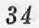

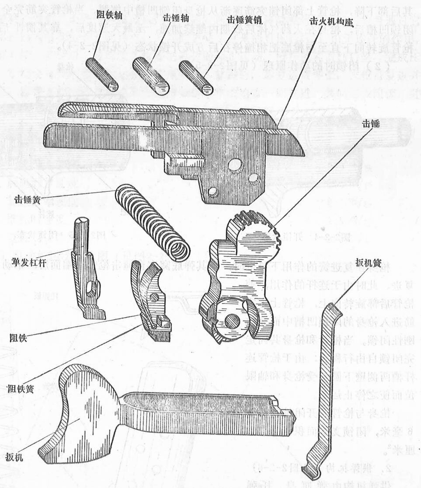

图2-2-7 击发发射机构

击针、击针簧、击针销装在枪身上。击针的强制突出量为1.3~1.7毫米,惯性突出 量为1.75~2.17毫米。

击火机构座是该部件的基础件。除扳机和扳机簧外,其余各件均组装在其上。长短 翼内侧有导壳斜面,并在长翼内侧设有退壳突齿。后下部压有击锤簧销,以支承击 锤簧。

击锤前下部有待击发与保险两突齿,中间有容击锤簧的圆孔。阻铁上装有阻铁簧, 上部有待击发齿,下部有扳机推压时的咬合凹部,左下侧有一保险用方形突起。单发杠 杆头部为圆柱形,下部有椭圆孔,此孔和阻铁共轴。单发杠杆圆柱部插入枪底把相应孔 中和阻铁轴导引上下运动。单发杠杆下部内侧有一"7"形缺口为保险时用。扳机为封 闭框式结构,后下部有与扳机簧作用的斜面,后部有推压阻铁的突起部。

(1) 击发发射机构动作原理

---

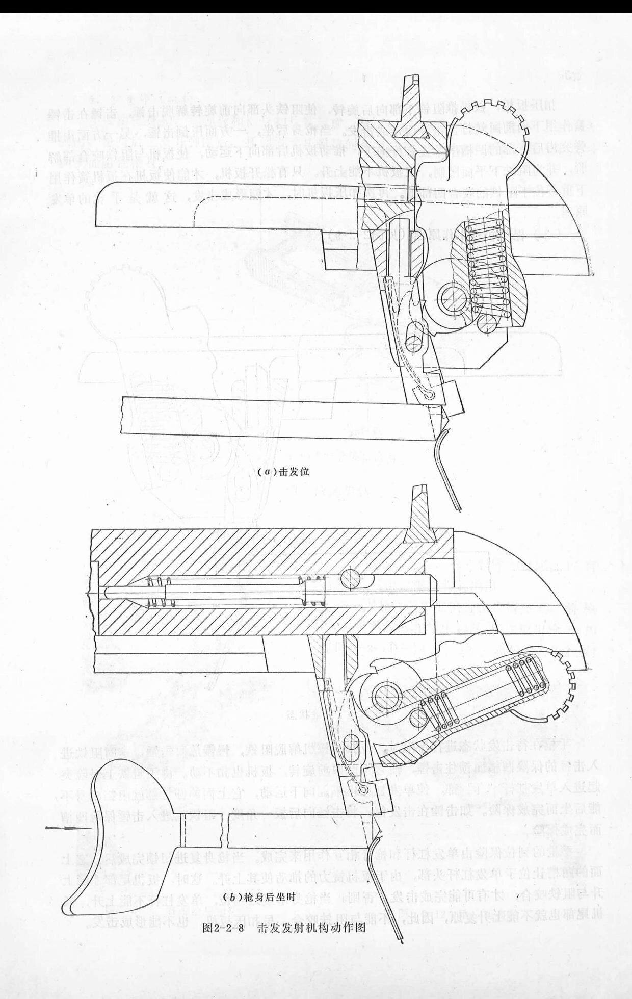

---

扣压扳机, 扳机推阻铁下部向后旋转, 使阻铁头部向前旋转解脱击锤, 击锤在击锤 簧作用下向前回转打击击针而形成击发。当枪身后坐,一方面压倒击锤,另一方面由推 弹突齿后下部的凹槽压单发杠杆向下, 推动扳机后部向下运动, 使扳机与阻铁咬合部解 脱,并为阻铁下平面限制, 使扳机不能上升。只有松开扳机, 才能使扳机在扳机簧作用 下重新位于阻铁的咬合凹部前。再次扣压扳机时,才能形成击发,这就是手枪的单发 原理。

(2) 保险机构工作原理 (见图2-2-9)

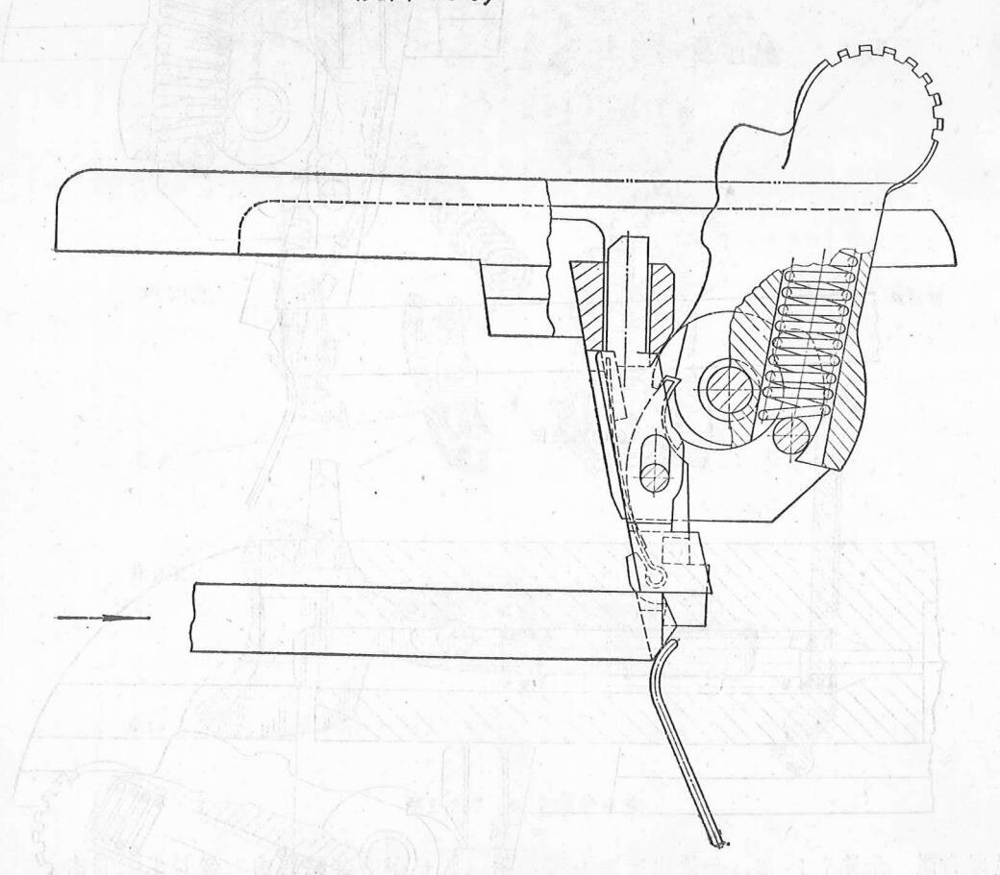

图2-2-9 保险状态

手枪在待击发状态进行保险时,应扣动扳机解脱阻铁,慢慢放回击锤,这时阻铁进 入击锤的保险凹槽而锁住击锤, 使它不能向前旋转, 扳机也扣不动。由于阻铁上保险突 起进入单发杠杆"7"部, 使单发杠杆也不能向下运动, 它上面的圆柱部就阻挡枪身不 能后坐而完成保险。如击锤在击发位,将击锤向后扳一角度,阻铁就进入击锤保险凹槽 而完成保险。

手枪的到位保险由单发杠杆和枪身相互作用来完成。当枪身复进闭锁完成后,它上 面的凹槽让位于单发杠杆头部, 由于扳机簧力的推动使其上升。这时, 扳机尾部才能上 升与阻铁咬合,才有可能完成击发。否则,当枪身未复进到位,单发杠杆不能上升,扳 机尾部也就不能上升复原, 因此, 不能与阻铁咬合, 虽扣压扳机, 也不能形成击发。

---

## 4. 空仓停机机构

道, 脚可取下, 但细冷意, 向前提枪身 主要由枪身扣、托弹板和枪身扣片簧组成。其工作原理如图 2-2-10 所示。弹匣内无 弹时, 枪身后坐离开弹匣后, 托弹板受托弹簧的作用, 其上左侧的弯形部推枪身扣旋转 向上而阻住枪身。 检身扣簧

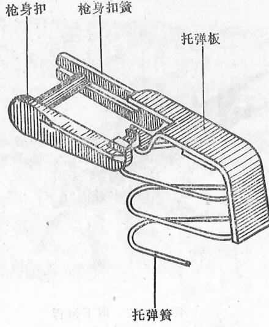

图2-2-10 空仓停机机构

四、分解与结合

(一) 不完全分解

1. 右手持枪, 并用拇指按弹匣扣到位, 向下取出弹匣;

2. 向后拉枪身, 检查弹膛和弹底窝内有 无枪弹。如有枪弹,将其取出;

3. 用弹匣盖对准枪身扣片簧突 起, 将枪 身扣片簧从枪身扣槽中解脱,向左取出枪身扣 (见图 2-2-11 与图 2-2-12)。将枪身部件拉向

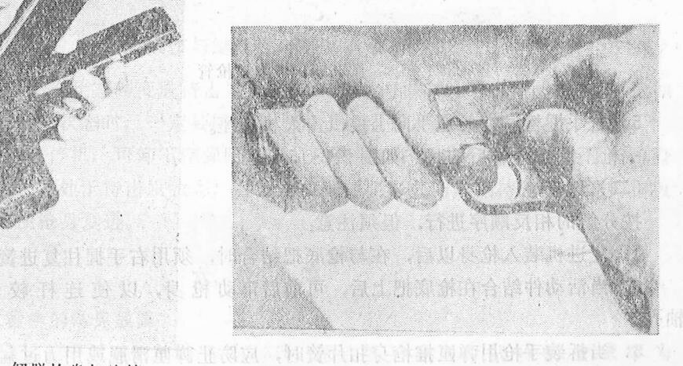

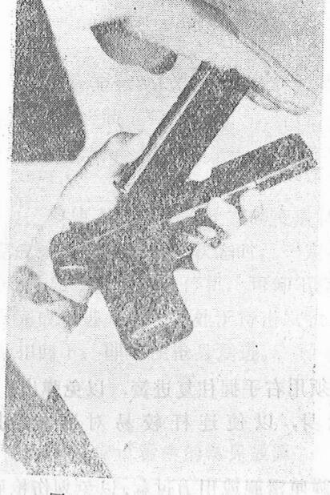

图2-2-11 解脱枪身扣片簧

图2-2-12 取出枪身扣

---

前, 即可取下。但须注意: 向前拉枪身时, 要用手握住复进簧, 以免它弹出。

4. 将枪身仰置, 推复进簧导杆向前, 使之与枪管脱离后, 向上抬起, 便可卸下复进 机。将锁套旋转 180°后, 向前取下锁套, 而后取下枪管 (见图 2-2-13 与图 2-2-14)。

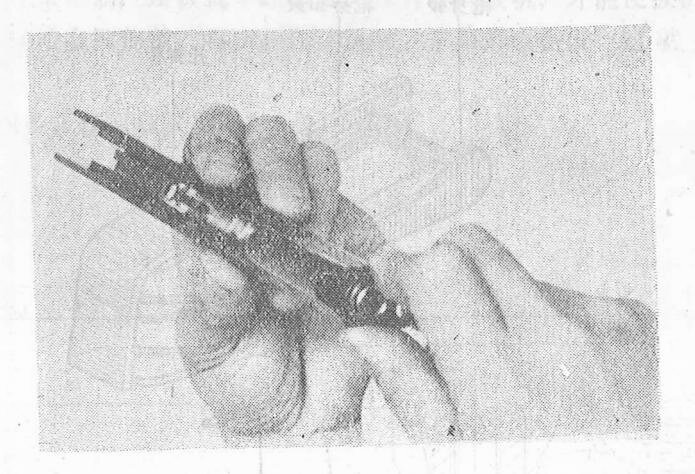

图2-2-13 取下锁套

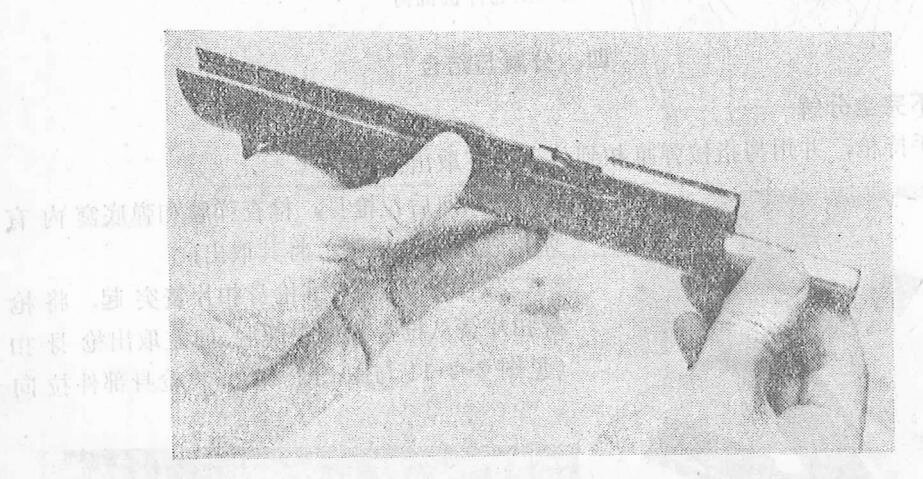

图2-2-14 取出枪管

5. 右手握枪底把, 左手向上提出击火机构座。

手枪不完全分解后的状态如图 2-2-15 所示。

(二) 结合

按分解的相反顺序进行,但须注意:

1. 复进机装入枪身以后, 在与枪底把结合时, 须用右手握住复进簧, 以免弹出;

2. 当活动件结合在枪底把上后, 可前后窜动枪身, 以使连杆较易对准枪身批 轴孔;

3. 当拆装手枪用弹匣推枪身扣片簧时, 应防止弹匣滑脱或用力过猛,以免划伤枪底 把和手;

---

其单壳宽, 计主顺向图 计文件 2012-2-15 不完全分解状态

4. 结合至装弹匣前, 应多次拉动枪身, 以检查手枪结合是否正确。然后扣压扳机, 解脱击锤,再装上弹匣。

## , 铺子设饰并人提供时食 情随音至其 五、操作与维修保养的注意事项

1. 要使手枪由保险状态转变成待击发状态, 只需用拇指向后压击锤即可。但手枪如 已完成装填并处于保险状态时,一定要防止外力使击锤成待发状态或走火;大量是

2. 如手枪已空仓停机, 可卸下空弹匣, 换上实弹匣, 向后拉枪身少许,松手后枪身 即可完成复进并使手枪处于待击发状态,如无需更换弹匣,此时,用持枪右手的拇指扳 枪身扣向下, 即可使枪身复进。 来要量益叠面景 ,量灵鹰类工的雕叠益气(S

## 同类的 ( ) 等于 学生 ( ) 方、故 障

## (一) 寿命试验中的常见故障行 动复胎不时对开觉,中国土击惊主, 要支箱达

54 式手枪寿命试验中规定的故障率≤0.5%, 而连续 10 次寿命 试验的故障率为 0.03~0.47%。常出现的故障是卡壳、不抛壳等。如内断资票兼备道瓣则普 (mmas.s

脑偏素(小)

采取了上述措施后, 消除了离敌障

---

| 序号                             | 射弹总数   | 故 障 (次)   |                |              |                |                         |                |        |                |            |
|--------------------------------|--------|-----------------|----------------|--------------|----------------|-------------------------|----------------|--------|----------------|------------|
|                                | (发)    | $\ddagger$ 壳 | 不抛壳            | 有弹停机         | 卡 弹         | 不上弹                     | 不击发            | 停 机 | 故障总数 (次)    | 故障率 (%) |
| $\mathbf{1}$                   | 3000发  | $\frac{1}{4}$   |                |              |                |                         |                |        | $\overline{4}$ | 0.13       |
| $\sqrt{2}$                     |        | $\mathbf{1}$    |                |              |                |                         |                |        | $1\,$          | 0.03.      |
| $\overline{3}$                 |        |                 | $\overline{7}$ | $\mathbf{1}$ |                |                         | ٠              |        | 8              | 0.27       |
| $\boldsymbol{4}$ $\sqrt{5}$ |        | 9               | $\overline{2}$ |              | $\mathbf{1}$   |                         |                |        | 12             | 0.4        |
| $6\phantom{1}6$                |        |                 | 5              | 9            |                |                         |                |        | 14             | 0.47       |
| $\overline{7}$                 |        | 3               |                |              |                |                         |                |        | $\overline{3}$ | 0.1        |
| 8                              |        |                 | $\mathbf{1}$   |              |                | $\overline{\mathbf{2}}$ | $\mathbf{1}$   |        | $\frac{1}{2}$  | 0.13       |
| 9                              |        |                 |                |              |                | 1                       |                |        | $\mathbf{1}$   | 0.03       |
| 10                             |        |                 |                |              |                |                         |                | 3      | 3              | 0.1        |
|                                |        | $\mathbf{1}$    | 10             |              |                |                         |                |        | 11             | 0.37       |
| 合计                             | 30000发 | 18              | 25             | 10           | $\overline{1}$ | $\overline{3}$          | $\overline{1}$ | 3      | 61             | 0.2        |

(二) 产生故障的原因及解决措施

1. 不抛壳

产生原因: 弹匣口部尺寸、形状不符合图纸规定, 有的弹匣口翼代替退壳挺撞击弹 壳,至使弹壳速度减小而留在枪内。

解决措施;加工时保证弹匣口部尺寸、形状符合图纸要求,加强质量控制。

通过加强工艺和检验后,使故障率控制在允许范围内。

2. 有弹停机

产生原因: 当弹匣内还有枪弹时, 次发弹在向上运动中, 弹头推动枪身扣升起, 枪 身复进时被枪身扣挂住。

解决措施.

将枪身扣齿下棱及两立棱都倒成1×45°角,并在两角相交处以圆弧连接,避免弹头 与尖棱碰刮。

长生达改进后,消除了故障。特性的创新,我们的国家的国家和国的综合分

3. 空仓不停机

故障表现: 弹匣内已无枪弹, 枪身未停在后方。甚至有的枪身扣齿进入托弹板下面, 取不出弹匣, 拉不动枪身。

产生原因: 枪身扣齿与托弹板的叠盖值小于图纸规定的 0.5 毫米; 托弹板在弹匣内 摆动量过大(最大间隙达0.36毫米)。

解决措施.

1(1) 将托弹板加宽 0.1 毫米, 减小它在弹匣内的摆动, 1 1 1 前半 2 1 2 3 1 1 1

(2) 严格控制加工装配质量, 保证叠盖量要求。

采取了上述措施后,消除了该故障。

4. 扳机下落

故障表现: 在射击过程中, 放开扳机不能复位, 无法进行下一发的射击。

产生原因: 扳机与扳机簧接触的突台偏向左侧 (扳机簧与扳机的接触宽度为1.47~ 2.26mm), 当扳机簧在枪底把簧槽内位置偏斜时, 簧头部圆弧向右脱离扳机突台, 不能

!!!!!!!!!!!!!!!!!!!!!!!!!!!!!!!!!!!!!!!!

---

使扳机复位。

解决措施, 将枪底把片簧槽位置右移 0.5 毫米。该故障则消除。

(三) 使用过程中出现的主要故障及解决措施

射击过程中一般易出现的故障为卡弹、卡壳、不击发与复进不到位。其排除方法 如下:

1. 卡弹

产生的原因

(1) 弹匣口部变形;

(2) 托弹板运动不灵活;

(3) 上弹坡有毛刺。

排除方法

(1) 按要求修整弹匣口部;

(2)更换新托弹簧,修整托弹板,擦托弹板并涂油;

(3) 刮修上弹坡毛刺。

2. 卡壳

产生的原因

(1) 弹匣口部形状不合要求, 弹匣上升量高, 造成弹壳口翼碰撞弹壳,因其速度小 而使弹壳留在枪内。

在采取上述综合措施后,除一次因加工工艺不合理,在根部出现裂纹外,至今未曾

(2) 拉壳钩抓弹壳无力, 定位不确实;

(3) 退壳突齿撞堆或有毛刺。

排除方法

(1) 按要求修整弹匣抱弹口及控制弹匣上升量;

(2)更换拉壳钩簧;

(3) 修整退壳突齿或倒毛刺。

3. 不击发

产生原因: 击锤簧失效, 击锤运动阻力大。

排除方法

(1)更换新击锤簧;

(2) 擦拭清理击发发射机构并涂油。

在这里的一个小孩, 我们是我们的人的人, 我们的 我们的 我们的 我们的

产生原因 2000 model of 2000 the different of the distribution of the different of the property of the different of

(2) 击火机构座长短翼变形;

(3) 枪管尾部有毛刺。

排除方法 ....................................

排除万法 [6] (1) 更换新复进簧, 全枪擦拭涂油;

(2) 校正击火机构座两翼, South Struck Struck Struck Struck Struck Struck Struck Struck Struck Struck Struck Struck Struck Struck Struck Struck Struck Struck Struck Struck Struck Struck Struck Struck Struck Struck Struck Struck Stru

10 四室在新加工公司

四火 在海外内存工造余器动力

校正后尽快选行去应力回火。

(3) 溶火后清理由滚光改为电信的洗,

3 将两双根部圆角加大, 由原R0.3

---

## ,和静则第对大、零、部件寿命公然读出跟家创养 、

高生者医用过量中的医中毒原料 (二)

1) 弹阻口溜形水不合要求, 确审上升量

## (一) 常见破损件

手枪的寿命规定为3000发,破损次数较多的零件是击火机构座和击针。

历次寿命试验破损件统计表 ·

| 序号             | 破损件名称 | 规定寿命  | 实际寿命(发)       | 优 损 部 破       |
|----------------|-------|-------|---------------|------------------------|
|                | 击火机构座 | 3000发 | $1460 - 3000$ | 长短翼根部圆角处               |
| $\overline{2}$ | 击针    |       | $1782 - 3000$ | 矩尖端约6毫米处 不能互联举斗(金)     |
| 3              | 击针销   |       | $1416 - 3000$ | 开口根部断一半 顺言言遠距土 (2)     |
| $\overline{4}$ | 枪身    |       | 3000          | 抛壳口后圆弧部位裂纹 一类试剂能    |
| 5              | 单发杠杆  |       | $2696 - 3000$ | 下端部折断                  |
| $6\phantom{a}$ | 枪身扣   |       | $2726 - 2873$ | 短扣齿根部断 口 照 性 给 头要 "(上) |
|                | 枪管    |       | $2000 - 3000$ | 下部连杆槽圆角处裂纹 第二 (3)      |
| 8              | 扳机    |       | $2700 - 3000$ | 前圆弧和左杆圆根部裂纹 第二章 篇 (8)  |
| $\overline{9}$ | 锁套    |       | 3000          | 铸造浇口处裂纹                |
| 10             | 拉壳钩   |       | $2416 - 2549$ | 钩齿部掉渣                  |
| 11             | 弹匣身   |       | $1000 - 3000$ | 因烈肉土 前圆弧鼓包和裂纹       |

(二)破损件的原因分析及解决措施

1. 击火机构座

在大量生产初期,该零件曾多次破损。破损的时机为射弹 1460~3000 发。破损部位 均在长短翼根部的圆角处。在击火机构的38次破损中,一翼单独破损所占比例数:短翼 为 0.29、长翼为 0.16。两翼先后破损占 0.55。

击火机构座用 50Az 圆钢锻造后机加而成。热处理硬度为 HRC40~45。该零件承 受着击发发射零、部件和弹壳的冲击力,本身形状也较复杂,且两翼细长。

(1)破损原因

1 两翼在机加、淬火及淬火后的清理过程中,均易出现变形,须校正。同时两翼 根部圆角仅有 0.3 毫米, 校正时受力较大, 产生了内应力。加之机加后的校正没能及时 回火, 在零件内存在残余张应力。

2 两翼根部接刀不光滑, 有刀痕, 在射击过程中产生应力集中。

(2) 解决措施

1 减少淬火变形: 加工完两翼后, 将击火机构座高温回火, 消除加工造成的残余 张应力; 淬火由油淬改为 180~250℃硝盐等温淬火, 以减少变形;

2 淬火后清理由滚光改为电解酸洗;

3 取消加工过程中不应有的校正工序, 对变形的零件必须校正时,应精心地进行, 校正后尽快进行去应力回火;

4 将两翼根部圆角加大, 由原 R 0.3+0.2 改为 R 1+0.2; 光洁度由原 V 4 改 为 V 6; 圆 角接点要求光滑;

5 热处理前, 根部圆角处留有足够的加工余量。热处理后再精加工, 去掉可能的 脱炭层。

在采取上述综合措施后, 除一次因加工工艺不合理, 在根部出现裂纹外, 至今未曾

---

破损过。5~8.8 画满前离古绿一, 这是产生灵气, 这是 时间是中国方向表面文团在

2. 击针销机时频其。沿船工士的面直垂管的固线特击的宽设现象。影响特击 2.

原结构为圆钢机加实心件。在寿命射击中从开口处折断一半。

破损原因: 击针销为击针前冲的限位零件, 受力大, 弹性小, 开口根部圆角小而光 洁度不高。产生应力集中。

解决措施, 将圆实心开口销改为钢板卷制的弹性销。改后 经 寿 命 试验。未出现过 破断。

黑箭调频付击 81-3-S图

管 (d) 3. 枪

后部连杆槽两圆角处裂纹。

破损原因: 因根部圆角为R0.5~R0.7, 产生应力集中疲劳破损。

解决措施: 将原两侧的两个圆角改为一个圆弧, 圆弧半径为R1.6~R1.7毫米。改 后经试验再未出现过裂纹。

4. 枪 身

在寿命试验中, 该件在抛壳口后圆弧部产生裂纹。

破损原因: 该圆弧部受力较大, 原枪身淬火线在抛壳口中部以前, 后圆弧部未进行 热处理、强度低;有的零件该部断面又偏薄;加之抛壳口光洁度偏低,产生应力集中。

改进措施: 将裂纹部位进行热处理, HRA63~68, 提高其强度; 抛壳口 光 洁度由 原▽6改为▽7; 控制淬火部位长度。改后该部位未出现裂纹。

5. 扳 机

支杆圆弧根部断裂。

破损原因: 机加工不当, 圆弧部加工时对刀过深, 造成局部过薄并有切痕, 出现疲 劳破损。

解决措施: 提高加工质量, 加强检验后, 此部位未出现裂纹及破损。

| 试验时机   | 样本数N(支) | 平均弹着点至检查点距离(厘米) |      | 射击密集度 D(厘米) |      |
|--------|---------|-----------------|------|-------------|------|
|        |         | X 值 均     | 标准差S | 值 X 均 | 标准差S |
| 寿命开始   |         | 4.47            | 2.03 | 7.77        | 2.99 |
| 1000发后 | 11      | 4.14            | 1.87 | 6.21        | 3.64 |
| 2000发后 |         | 3.65            | 1.69 | 7.84        | 2.41 |
| 寿命结束   |         | 3.46            | 1.18 | 6.46        | 4.30 |

人 寿命试验中 4 发射击精度的变化情况

1 注: D-包括 4个 (或3个) 弹着点散布圆的直径。 S-3、L B-11 2011 11

由上表可看出: 手枪寿命试验中的4发射击精度变化不大, 因此枪管寿命未终。

, 电颜谱如下高器 ... 01 7 九、生产过程中的主要问题与解决措施 ... Tu

## (一) 生产过程中的重大结构与工艺更改情况 制合溢版土用来 人类的表数或

1. 击针 原击针结构为四段圆柱体, 光洁度为▽8, 在前直径为2毫米与3毫米的 圆柱过渡部不允许有粗刀痕。材料为 25CrNiWA 的冷拉直条磨光钢丝, 热处理 硬度为  $HRC44 \sim 50$

---

击针在历次的寿命试验中曾14次断裂或产生裂纹。一般在离前端面5.6~8毫米处。 断口为疲劳断裂。疲劳源在击针装配位置垂直面的上下部位。其破损情况如图 2-2-16 所示。 进根群集从中未损合法。


图2-2-16 击针破断情况

破损原因

(1) 受力分析

击针在工作时, 除受击锤撞击力和由此引起的各种反作用力、力偶外, 在击针尖部 还要受到另一种弯曲应力。在手枪击发后,枪身带动枪管行经自由行程、开锁行程时, 枪管与枪身在垂直方向就产生相对运动。因击针突出量大,后端受击锤限制,击针尖此 时仍突出弹底窝平面。这样使击针尖受到一附加的垂直作用力,使断裂部位产生了弯曲 应力。这可由击针断裂疲劳源的起点正好在通过击针中心线的垂直面内而证明。

(2) 结构因素

如上所述,击针前部为 + 2 与 + 3 相连接的两个圆柱体,在交接处用圆弧过渡。因后 部直径大、强度、刚度都较高, 在直径为 · 2与圆弧的切点附近受力较大, 断面又较小。 故成为危险断面。

(3) 材质及工艺因素

① 材质: 当原材料含碳量在 0.21~0.28%的上限时, 则击针的塑、韧性 均降低。

2 热处理时如回火不足或回火温度偏高时,影响零件的塑、韧性,使强度下降。

3 在两直径的过渡区存在横向磨削纹,可能产生应力集中。

4 枪身击针台阶孔的不同轴度不合要求, 增大了前圆柱部的弯曲应力。 解决措施:

(1) 改变结构形状:

将中部直径为3毫米的圆柱改为去掉两侧, 剩下厚为2.1毫米的扁平体。使它在受 力时, 最大弯曲应力断面由击针尖移到扁平杆部的中间。改为扁平体后, 增加了击针的 弹性。改进前后的情况如图 2-2-17 所示。

(2) 改善击针受力情况。改变击针突出量: 强制的突出量由原 1.3~1.7 毫米改为 1~1.3 毫米; 惯性的突出量由原 1.75~2.17 毫米改为 1.35~1.77 毫米。尖 部 直 径由 原 φ 2. 3: 13 毫米改为 φ 1.98.008 毫米。加强质量控制, 保证枪身击针孔的不同 轴 度符合 规定。

(3) 提高加工光洁度。采用液体擦光工艺, 使光洁度达到▽10, 提高了疲劳强度。 改进后的效果: 采用上述综合措施后, 使击针满足了3000 发的寿命要求。

2. 弹膛增加镀铬 原枪管弹膛不镀铬, 后增镀铬。在直径方向上的铬层厚度为0.03 毫米。枪管外表面增加了氧化处理。改进后,提高了抗腐蚀性能。

3. 锁套由原切削件改为精铸件, 简化了加工, 该零件的材料利用率 由原 13.4%提

---


强虎的展现,原因唇内那高爽松、气<mark>微好</mark>吃惊,抢警武板造时,火火狼气孔等能定

逐方向飞传, 视位看内部或甚张为鱼的分层裂红, 在就医养的时间,


的国家发展需求商务的材料及热症处理

图2-2-17 击针改进情况

中度 宽声 打剑 受院 不的严重的事来学

## 高到 28.8%。

4. 击针销由原切削件改为薄钢板卷制。 基本原因故障测入探讨的骨痛, 学校主

---

(二) 生产过程中发生的重大质量问题

1. 枪管炸裂

在高压弹射击试验时,在枪管弹膛连杆座中间发生过炸裂。裂开长度为56毫米,最 大宽度为2毫米。共有十余根枪管出现该问题,其情况如图 2-2-18 所示。


(a)外观

图2-2-18 枪管炸裂情况

造成的原因: 原材料内部有夹渣、气孔等疵病。枪管在锻造时, 夹杂和气孔等沿压 延方向延伸, 使枪管内部产生张开型的分层裂纹。在高压弹射击时, 由疵病部位裂开。

当问题出现后, 对原材料进行了复验, 对不合格材料予以报废, 对同批同炉号材料 所制成的成品在高压弹试验后,严格检验。

2. 阻铁折断

手枪仅射击3发枪弹,阻铁就折断。

折断原因: 经检查, 材料内部的晶粒间与晶粒内部存在连续性形状不一的微裂纹; 材料内部由于冶炼时存有严重的夹灰、非金属夹杂和带状组织;阻铁下料的纤维方向是 横向的, 使材料强度降低。

问题的处理, 将有上述疵病的原材料和由上述原材料制成的成品报废。

3. 阻铁从阻铁簧结合孔处折断

在手枪自动性射击试验时,出现此问题。

折断原因: 原材料存在碳偏析。由于碳偏析使材料变脆。由试验证明: 该零件在原 材料碳偏析情况下, 强度下降 37%。

问题的处理: 对由同批材料制成阻铁成品而装配的千余支手枪进行返检, 全部更换 新阻铁。对该批原材料进行复验,不合格报废并加强原材料检验工作。

十、主要零、部件的材料结构及工艺特征

(一) 零、部件的数目

| 部 |             |  | 10                                                          |  |
|---|-------------|--|-------------------------------------------------------------|--|
|   | 零件总数(种)     |  | 45                                                          |  |
|   | 零件数 ____ |  | 46 on har works with 250 million design prices ------ |  |

(二) 主要零、部件的材料及热表处理

主要零、部件的材料及热表处理可见下表: 2000000000000000000000000000000000000

---

| 零件名称 号 序                                                                                                                                                         | 料 材                                                                                                                 | 毛坯形式                                                           | 处 理 热                                                                                                                                                                  | 表面处理                                                             |
|------------------------------------------------------------------------------------------------------------------------------------------------------------------------|------------------------------------------------------------------------------------------------------------------------|----------------------------------------------------------------|------------------------------------------------------------------------------------------------------------------------------------------------------------------------------|------------------------------------------------------------------|
| 枪管 赚 枪底把 $\overline{2}$ 枪身 3 击针 $\overline{4}$ 拉壳钩 5 击锤 6 阻铁 $\overline{7}$ 单发杠杆 8 击火机构座 9 扳机 10 复进簧 11 | $50A_E$ 45 50A z 25CrNiWA $50A_z$ $50A_Z$ 50 50 50A Z 50 高 $[-61]$ | 圆钢 型锻 型锻 圆钢 扁钢 扁钢 扁钢 扁钢 型锻 型锻 钢丝 | HRC40~15 局部 HRA63~68 $HRC44 \sim 50$ $HRC44\sim49$ $HRC46 \sim 50$ $HRC45 \sim 49$ $HRC_{40} \sim 45$ $HRC_{40} \sim 45$ $HRC38 - 43$ 回火240~260°C | 内膛镀铬氧化 氧化 氧化 $\div$ 氧化 氧化 氧化 氧化 氧化 氧化 |

(三) 主要零、部件的结构特征

1. 枪管 (见图 2-2-19)


图2-2-19 枪管 格在首径为10厘米的圆内, 宜平均弹着点

弹膛及线膛的尺寸公差及光洁度要求如图所示。弹膛及线膛均镀铬。铬层厚度(在 直径方向):线膛 0.02~0.1 毫米;弹膛为 0.03 毫米。双目面的如笔素分散口(

《当君1 佛头

中非对应的交融工工由责

2. 手枪总装的主要要求

(1) 枪管尾端面与枪身弹底窝凸肩的空隙不小于 0.05 毫米;

(2) 拉壳钩头部与枪管拉壳钩槽的空隙不小于 0.05 毫米; 计干的量类

(3) 托弹板与枪身扣突齿的叠盖值应不小于 0.5 毫米;

(4) 单发杠杆要求运动灵活。当枪身后退 2.5 毫米时, 单发杠杆应压着扳机,此时 波柏试的每支手枪用2个弹配由订货代表亲自以每分钟 10~15 发的单度 4 和试

47

---

(5) 击锤在保险位, 拉动枪身向后方,击锤头部与枪身横壁间应有不小于3毫米的 空隙:

(6) 以 20.985 毫米弹形量规放入弹膛, 枪身不应 闭 锁; 放入 20.435 毫米量 规, 枪身应闭锁;

(7) 枪身和枪管沿抛壳口上部直线段的空隙不应大于 0.4 毫米, 周边不 小于 0.05 毫米:

(8) 击火机构座在枪底把上的垂直松动量不应大于 0.4 毫米, 纵向移动不大于 0.3 毫米;

(9) 击锤在保险位时, 在扳机上加上不大于 20 公斤的静力, 击锤不应从保险位脱 开,允许有松动。

(四)、标准件、借用件等分类统计表

| 类别 | 标准件 | 借用件 | 外购件 | 精铸件 | 焊接件 | 异形钢件 有色金属件 木制件 | 其他非 |  |
|----|-----|-----|-----|-----|-----|----------------|-----|--|
| 数量 |     |     |     | --  |     |                |     |  |

十一、成品检验和验收的试验项目及技术指标

(一) 机构动作可靠性试验

1. 瑠 弹 试 验

用满装练习弹的弹匣装于手枪上作蹓弹试验。枪身复进时应依次推弹入膛并闭锁。 当快速向后拉枪身时, 枪弹应可靠地被拉出并有力地抛出。

 $B - B$ 

2. 强装药弹试验

每支手枪用两发 51 式 7.62 毫米强装药弹进行射击试验(在缺乏强装药弹时,可用 普通弹加温至 60℃, 保温 90 分钟来代替), 射击后, 枪管、枪身不允许有机械 损伤、裂 纹与其他缺陷。

3. 机构动作可靠性试验

每支手枪用其配属的两个弹匣, 用手持各射击 8 发枪弹。发射速度每秒钟不得超过 2发。在射击过程中不允许出现因手枪本身的原因而发生的故障。

(二) 射击精度试验

将手枪夹在固定支架上, 在 25 米射距上, 对如图 2-2-20 规定的靶纸射弹 4 发。当 4个或3个(当有1发为意外弹时)弹着点包括在直径为10厘米的圆内,且平均弹着点 距检查点的距离不大于5厘米时, 则射击精度为合格。 光效差公平只商量发致如作

(三) 订货代表验收的项目及技术指标 0 《 魏 第 1 米 5 1.0-50.0 刘 第 1 (前下 4 百

1. 订货代表由工厂提交的验收批中抽出 20~40 支手枪,但不得少于5 %,检查其 零件是否有图纸及技术条件所不许可的锉修,弯曲及其他缺陷。当发现疵病时,订货代 表抽取2倍数量的手枪检验,第二次发现疵病时,全批手枪返回重新检验和修整。

2. 订货代表从工厂一昼夜检验合格的手枪中抽取1%进行检验射击。

1. (1) 机构动作可靠性的射击抽验 《 是自意音性 《 素果本国头要书耳大单 ()

被抽试的每支手枪用2个弹匣由订货代表亲自以每分钟 10~15 发的速度射击 32 发

48

---


枪弹, 此时不允许出现因手枪的原因而造成的故障。如发生故障, 则从发生故障的各批 手枪中抽取2倍数量的手枪按规定的程序重新进行动作可靠性的射击检验,此时不许发 生任何故障。如复试时发生故障,则应研究发生故障的原因,并将全批手枪返回工厂重 新修整与检验。再按一般程序重射。 1 17 02.7 推薦 电自主空话广告 mt

(2) 射击精度的抽验

被抽试的每支手枪,夹持在固定的支架上,由工厂原射手射击 4 发枪弹,按上述射 击精度试验的要求检验其射击精度。当射击精度不符合规定的要求时,则允许同一射手 或其他射手重射这些手枪。当符合规定的要求时,则全批枪认为合格。如复试射击精度 时, 一批内虽仅有1支手枪的射击精度不合, 则全批手枪返回工厂重新检验并进行射击 第1 浓睡 精度的试验。

当被抽试手枪的动作可靠性与射击精度抽验合格时,则全批手枪送往涂油和包装。

(四) 互换性试验

每季度从本季度验收合格的产品中抽取 10 支进行互换性试验。

参加互换性试验的零部件有;击针、击针簧、击针销、拉壳钩簧、拉壳钩销、复进 簧、复进簧导杆、复进簧堵头、弹匣扣销、弹匣扣簧、枪身扣簧、击锤簧、击锤轴、阻 铁轴、扳机片簧、弹匣盖扣、弹匣盖、阻铁结合共18件。第三80万条的 着高 壁室

十支手枪拆开后, 将互换零件渗混在一起, 然后不加选择地装成十支手枪。当不能 装配时可以更换零件,但总数不得超过2次。装配成枪后,进行射击精度和机构动作可

---

靠性试验,其方法和要求同前。

(五) 寿命试验

1. 每季度从本季度验收合格的手枪中, 抽取1支进行3000发枪弹的寿命试验。

2. 以手持进行射击。每射完1组 (104发枪弹由手枪配属的两个弹匣循环装填) 枪弹后,冷却手枪并擦试涂油。

在寿命开始、终了及每射击 1000 发枪弹后,均需进行射击精度试验。

3. 手枪经 3000 发枪弹射击后, 零部件不得有破损, 故障率不得超过 0.5%。射击 过程中,允许打磨枪身内筋后端上的金属突起。

(六) 其它试验

每支成品枪管以专用装置进行2发高压弹射击试验。试验后,线、弹膛应符合量规 要求。枪管经外观及探伤检验应无裂纹、胀大、掉铬及其他缺陷。

## 十二、包 装

包装方法

枪炮混合油热蘸油封

包装 包装 最大外廓尺寸 (长 包装箱名称 毛重 箱重 材 料 ×宽×高)(毫米) (公斤)(公斤) 54式7.62手枪40支座品包装箱  $675 \times 400 \times 417$ 58 全木板, 上下盖系胶合板 9.5 枪炮混合油热蘸油封 54式7.62手枪备件包装箱  $776 \times 222 \times 295$ 

## 包装箱与包装方法如下表

## 十三、配套件及备附件

 $26$ 

 $11$ 

全木板

不见诸吉 集团身生变工石

(一) 配 套 件

手枪除本身所带的1个弹匣外,另配弹匣1个。每支手枪配枪套及背带各1件,配 弹匣套及枪缰绳各1件。装具由用户另行定货。

(二) 备 件

1. 维修备件: 每 400 支手枪备左右护板部件各 20 个; 弹匣部件 16 个; 枪管 12 根 及击火机构座 8件;

2. 备件包装箱内包装有: 阻铁、阻铁簧各40个; 左右护板部件20套;击针及枪身扣 簧各 20个;复进簧、单发杠杆、拉壳钩簧及拉壳钩各 12个;击锤簧 8 根及击锤 4个。

 $(5)$  附件

通条1根。

第三节 1964年式 7.62 毫米手枪

## 、简 述

图 1964年式 7.62 毫米手枪是我国自行设计的产品,于 1964年设计定型, 198 0年 生 产定型, 简称 64 式 7.62 手枪。 新 新 (第)

·第7本枪具有以下的优点: 1. 10000000000000000000000000000000000

1. 体积小, 重量轻, 外形美观;

50

---

- 2. 射击精度较好;
- 3. 设有弹匣回闩, 弹膛指示、弹尽指示、联动击发及射击保险等机构;
- 4. 结构紧凑、维护保养容易、使用操作方便、利于隐蔽携带。

## 二、用途、配备与诸元

气公 200 分 调度器  $(-) 用 途$ 本枪是指挥员、公安保卫人员使用的自卫武器, 用以杀伤50米以内的有生目标。 , 的休生米差 &a ! 先至 1801-(二)配 备 每支手枪配备弹匣 2个。 (三)战斗性能诸元  $50*$ 1. 有效射程 23.5 公斤·米 2. 枪口功能 30发/分 3. 战斗射速 7发 4. 弹匣容量 待击发 1.5~3公斤 5. 扳机力 联动击发<6.5公斤 容弹匣时 9公斤 6. 弹匣回闩力 实弹匣时 6 公斤 待击发 6 毫米 7. 扳机行程 联动击发<12毫米 (四)弹道诸元 300~320米/秒 1. 初速  $V_{50} = 292.5*/\psi$ 2. 落速  $T_{50} = 0.17$ 秒 3. 飞行时间  $H_{25} = 12.5$ 厘米 4. 弹道高  $\leqslant$ 1200公斤/厘米2 5. 平均最大膛压 ≤1400公斤/厘米2 6. 单发最大膛压 (五)结构诸元 7.62 毫米 1. 口径 155 毫米 2. 枪全长 25 毫米 宽 103 毫米 高 86.5 毫米 3. 枪管长 4条, 右旋, 4. 膛线 导程 240 毫米 了这天为10自动方式,包含活燃料的 510公81.0 改变自动 , 法平司由自由枪机 惯性闭锁 6. 闭锁方式 **主题人兼非一共主日 单发并有联动机构** 7. 发射方式 SAS-S B 弹匣供弹工 (b D 8. 供弹方式

11. 拾全重

雷铜牌 81

---

9. 瞄准基线长 (5) 10. 瞄准装置 击浪效效油作频, 东部凤凰、东南湖松、广 矩形准星 。 在地人作为非然始端了医, 由我并深世时, 思容带动, 方形缺口照门, 单

11. 枪全重

12. 弹匣重

## (六)使用"枪"弹的调系如果, 新通见自国思维这人见望要公司, 计部基础本,

1964年式7.62毫米手枪弹。

## 三、 第二十三章 三、 自动原理及主要结构

云南已發頭 發用 空 空弹匣: 0.039公斤

117.2 毫米

0.56 公斤

实弹匣: 0.091公斤

个文和學帝國的文部

上,右效审批

新银半路 3 是容别做 1 , 达那就 3

(一) 自动原理和运动参数

1. 自动原理 8.88

全枪结构图见图 2-3-1。


米 008 11 图2-3-1 1964年式7.62毫米手枪纵剖图

本枪为枪机自由后坐式,枪闩重为 0.18公斤。枪弹被击发后,枪闩在弹底火药气 体压力作用下后坐。在后坐过程中开锁、压倒击锤、压缩复进簧、抽壳、抛壳并后坐到 位。然后在复进簧的作用下枪闩复进、推弹入膛并封闭弹膛, 使手枪处于 待击发 状态。 自动机工作循环图见图 2-3-2。 六式艳朴

 $52$

---


64 式手枪自动机工作循环图 图 2-3-2

- 2. 自动机运动参数
- (1) 自动机运动速度 8.7米/秒 后坐最大速度 5.9米/秒 后坐到位速度  $2.4$ 米/秒 窗料机 复进推弹速度 4 米/秒 复进到位速度 (2) 自动机运动曲线 (见图 2-3-3)
- 


数数

---

(二) 主要机构

1. 发射机构

主要由扳机、扳机簧、拉杆、拉杆簧、阻铁、阻铁簧、击锤、击锤簧杆和击锤簧等 组成。其待击发状态见图 2-3-4。

算行坐司日休


图2-3-4 待击发状态 (图展) 发前小三类点点 (S)

手扣扳机击发后,枪闩后坐(或拉枪闩装填时),其右侧下部的凹槽与拉杆上的突起 "a"相互作用, 迫使拉杆尾部下降, 与阻铁钩解脱, 阻铁在其簧力作用下向后回转。当 枪闩后坐将击锤压倒到一定角度时, 阻铁的待击齿则位于击锤待击齿下方, 等待与之啮 合。此时, 拉杆上的工作钩"b"则位于阻铁突齿"c"的下方(与阻铁脱离)。当枪闩复 进到位, 击锤被阻铁扣合成待击发状态。如松开扳机(若是拉枪闩装填, 此时扳机是松 开的), 拉杆因扳机带动向后运动, 当工作钩"b"滑过阻铁突齿"c"后,由于拉杆簧 作用, 使拉杆升起, 直至被枪底把突起"d"定位。此时,拉杆钩与阻铁又重新钩合,只 有再扣扳机才能击发。手枪以此动作完成单发。

联动击发见图 2-3-5。

当扳机下部处于极前位时,拉杆因受扳机和扳机簧的带动及枪底把突起"d"的约束, 使拉杆最后面的联动突齿位于停机位击锤的联动突齿"e"的后面,且两突齿相互有一 定的叠盖量。

如出现不发火, 将扳机松开后(或膛内有弹、解脱保险、击锤处于回跳位时), 意欲 进行联动补火或联动击发, 只需用手扣压扳机, 扳机牵引拉杆向前, 拉杆上联动突齿驱 使击锤上部向后旋转。当继续扣扳机时,作平面运动的拉杆,因其上的圆弧面与枪底把 突起"d"相互作用, 强迫拉杆尾部向下运动, 致使拉杆、击锤两联动突齿的重叠量越 来越小。当击锤向后旋转约 60°左右时, 拉杆与击锤滑脱, 形成联动击发。此时阻 铁因 拉杆工作钩的带动, 在击锤击发瞬间, 其上的待击齿与击锤待击齿之间 保 持一 定 的空

54

---


图2-3-5 联动击发状态

黥, 使阻铁不受击锤的撞击。

2. 空仓阻闩及弹匣回闩机构

主要由阻闩抛壳挺、回闩片及簧片等组成。(见图 2-3-6)。

阻闩抛壳挺平时受扳机簧力的作用定位于枪底把上平面。当射完最后一发枪弹后,枪

闩后坐一段距离时, 托弹板在托 弹簧的作用下向上运动。托弹板 左边的突齿路经簧片时将其顶 起,解脱它对阻闩抛壳挺的约束, 托弹板同时推动阻闩抛壳挺沿逆 时针方向旋转上升,其上的停机 齿"a"阻住复进的枪闩而示弹 尽。这时取下空弹匣, 插入实弹 匣,并用手向上击拍一下弹匣盖, 因弹匣身上点焊的回闩片斜面 "b"作用于阻闩抛壳挺回闩斜 面"c",迫使阻闩抛壳挺沿顺时 针方向旋转, 解脱枪闩。枪闩在 复进簧作用下推弹入膛并关闭弹


, 古贤好王和公而得有 , 怪意施王用分直

图2-3-6 阻闩及回闩机构

膛, 即完成回闩动作。如不更换弹匣, 也可用手拍击一下弹匣盖, 由同样的动作原理亦 可完成回闩动作。

簧片由铆钉固定在枪底把上,其作用是限住阻闩抛壳挺。阻闩抛壳齿里侧还设有抛 先突齿。 网络南洋蜂蜜高,海榆南南平出海的普通古书画古阿利迪西 船击船械的回答

---

3. 弹膛指示器

主要由指示杆、指示杆簧、指示杆套及指示杆销组成(见图 2-3-7), 指示杆套用指


图2-3-7 弹膛指示机构

示杆销固定,而指示杆销则由保险限住。

该机构位于枪闩击针孔上方。当膛内有弹时,弹壳底平面顶在镀铬的白色指示杆上, 使其突出枪闩尾部的击锤槽平面。在举枪射击时,可看到此白色突起;如隐蔽携带时,可 直接用手触摸到。这样可给射手以预告。当膛内无弹时,指示杆在其簧力作用下推向前 方, 后端面则不突出枪闩击锤槽平面。 **最好 图图 留置人** 

4. 保险机构

(1) 安全保险

主要由保险与保险簧组成。主要动作原理如图 2-3-8 所示。


图2-3-8 安全保险状态

**个地门好风美啊。然** 

膛内有弹需要保险时,用手向上推保险到位,保险完成下列动作。 医胃蛋白原

1 1 ① 当手枪处于待击发位时, 保险在旋转过程中, 它上面的突起推阻铁上臂使其旋 转向前解脱击锤,与此同时击锤在击锤簧的作用下向前旋转,与旋转中的保险钩撞击后,

---

回到停机位, 保险钩继续旋转直至进入击锤左侧的凹槽内。保险钩钩住凹槽, 钩背顶住 凹槽内壁, 既使击锤不能撞击击针, 又使击锤不能后倒。

② 由于击锤不能向后压倒, 拉杆联动突齿受击锤联动齿阻挡。扳机也只能在扣动 一小段距离后,被拉杆阻住不能继续扣压。

3 保险上的圆柱面随保险转动逐渐进入枪底把凹槽"a"内。将枪闩锁住, 使之 不能向后移动。

(2) 到位保险 (见图 2-3-9)


图2-3-9 到位保险机构

手枪的到位保险是由枪闩右侧的凹槽与拉杆上的突起"a"共同完成的。当枪闩复 进到距最前位 2%5 毫米以上时, 拉杆突起就不能完全进入枪闩凹槽, 此时扣扳机带动拉 杆向前, 由于枪闩压拉杆, 使后部旋转向下, 其钩部不能与阻铁突耳钩合, 虽扣扳机也 不能解脱击锤。只有当枪闩复进到距最前位为 0.4 毫米以内时, 拉杆突起才能完全进入 枪闩凹槽, 扣扳机拉杆才能与阻铁突耳钩合形成击发。

(3) 自动保险 (见图 2-3-10)

击锤簧通过击锤簧杆作用在击锤上,同时使击锤处于停机位的静力平衡状态,因此, 它具有 101° ~104° 的回跳角。此时, 因击锤上的保险齿" a"被阻铁待击齿顶 住, 使位 于后极限位的击针尾端与击锤撞击面之间仍有不小于 0.3 毫米的间隙。手枪膛内有弹时, 保险处于开启位, 当外力撞击击锤时, 因有阻铁的刚性支承, 不会造成手枪的偶发。

(4) 射击保险 (见图 2-3-11)

结合手枪的最后封闭环是扳机框。它是由扳机框簧单向弹性定位在枪底把上。为确 保射手安全, 在弹匣插入枪底把弹匣槽后,因扳机框后尾部突起"a"由弹匣刚性限位, 使之扳不开。这样枪闩在射击时,不能从枪底把上脱出。只有卸下弹匣后,才能拉开扳

---


---

机框, 卸下枪闩, 以此完成手枪的射击保险(有的手枪无此结构,枪闩后坐滑脱伤人,故 叫射击保险)。

(一) 不完全分解

分解前需拉枪闩向后,检查膛内有无枪弹。当确认膛内无弹和被空仓阻闩时,方能 进行分解。

1. 右手握握把, 用拇指按弹匣扣到位后, 即可取下弹匣;

2. 右手持枪, 左手拉扳机框向下, 当上部拉出枪底把后, 向左 (或向 右) 扳 一角 度, 使其抵住和停在扳机框槽的左(或右)侧上。然后左手握枪闩拉到最后位置, 再将 枪闩尾部向上抬起,借复进簧力向前卸下枪闩。

3. 从枪管上向前取下复进簧。

图 2-3-12 是自卫手枪不完全分解后的状态。


图2-3-12 不完全分解后的状态

(二) 结合、按分解的反顺序进行

五、操作及维修保养的注意事项

拆装枪闩时,一定要紧握枪闩的花纹部,防止滑脱,以免撞坏弹膛口部。

## 六、故 障

(一) 射击中常见故障

64 式手枪寿命射击试验中规定的故障率为≤0.3%, 10 次寿命试验统计的故障率为 1 ~0.33%。出现次数较多的故障是卡壳。

---

|  |  |  | 10次寿命试验故障分类统计表 |  |
|--|--|--|----------------|--|
|--|--|--|----------------|--|

|                                | 射弹 (发) | 障 故 (次)  |              | 故障启数 (次)           | 故障率 (%)         |
|--------------------------------|--------|----------------|--------------|--------------------|-----------------|
| 号 序                         |        | 壳 卡         | 不阻闩          |                    |                 |
| 上上 $\mathbf{1}$             | 1500   | NEUNI          | 3年13         |                    | <b>RH 94 13</b> |
| $\overline{2}$                 | 1500   |                |              | $\blacksquare$     | HO.             |
| $\overline{3}$                 | 1500   | 5 1 |              | $\sqrt{5}$         | ηn. 0.33     |
| $\pmb{4}$                      | 1500   |                |              |                    |                 |
| $-5$                           | 1500   |                |              |                    |                 |
| $6\phantom{.}6$                | 1500   |                | $\mathbf{1}$ | $\mathbf{1}$ o. | 0.066           |
| $\overline{7}$                 | 1500   |                | $0.1 - 1.1$  |                    | 最 SI-8-2 間      |
| $\mathcal{L}$ : $\,$ 8 $\,$ | 1500   |                |              |                    |                 |
| $\overline{9}$                 | 1500   |                |              |                    |                 |
| 10                             | 1500   |                |              |                    |                 |
| 计 合                         | 15000  | $\overline{5}$ |              | $6\overline{6}$    | 0.0004          |

(二) 主要故障卡壳产生的原因及解决的措施

产生原因: 为减小手枪的后坐速度, 在弹膛内开有 4 条螺旋槽。当槽深超过图纸规 定或螺旋槽的导转侧有毛刺时, 使得抽壳阻力加大, 自动机后坐速度降低; 抛壳挺齿部 有毛刺,影响了正常抛光。

解决的措施, 按产品图严格控制螺旋槽的深度, 在弹膛镀铬前将螺旋槽导转侧毛刺 清理干净; 按产品图规定将抛壳挺齿部正常倒棱, 清除毛刺。采取上述措施后, 该故障 已消除。

## 七、零、部件寿命

自 1979年至 1981年本手枪先后共进行了 10 支每支 1500 发的寿命试验, 零、部件 均无破损。

## 八、射击密集度

|                                                                                          |                                  | 米) (厘 $R_{50}$                        |                                                    | (厘 米) $R_{100}$                          |                                                            |
|------------------------------------------------------------------------------------------|----------------------------------|---------------------------------------------|----------------------------------------------------|---------------------------------------------|------------------------------------------------------------|
| 季度序号                                                                                     | 样本数N(支)                          | $\overline{X}$ 值 均                    | S 差 准 标                                   | X 值 均                                 | 差 S 准 标                                              |
| 1 $\sqrt{2}$ $\overline{3}$ $\overline{4}$ $\overline{5}$ $6\phantom{1}6$ | 10 10 10 10 10 10 | 2.64 3.0 2.64 2.83 2.41 2.58 | 0.443 0.424 0.431 0.398 0.281 0.306 | 6.0 6.82 6.18 6.84 5.45 6.13 | 1.09 1.115 1.428 0.931 0.737 0.667 1.153 |
| $\overline{7}$ 8                                                                      | 10 10                         | 2.69 3.09                                | 0.258 0.544                                     | 6.36 7.05                                | 1.177                                                      |

连续八个季度共 80支枪射击密集度统计

---

## 九、研制及生产过程中的主要问题及解决措施

(一)研制阶段的主要问题及解决措施

1. 提高射击密集度方面的措施 1. 1. 1. 1. 1. 1. 1. 1. 1. 1. 1. 1. 1.

本手枪的枪、弹、药系统均为研制的新产品,三者互相制约,紧密联系。随着研制 工作的进展,射击精度问题越来越突出,且三方面的因素相互交织在一起。

1961年以前, 用旧弹 (即用 51 式手枪弹头截短而得) 作精度试验, 其结果达 到了 要求。1962年以来, 弹丸及枪管内膛设计均作了修改, 发现射击密集度变坏。后经一年 多的试验研究,找出了影响手枪射击密集度有关枪、弹、精度枪架几方面的因素(因受 射手条件限制,试验均以专用枪架进行)。

枪弹方面: 作了弹丸形状、紧口、装药偏差各项对比试验, 其 25 米的 射击 密集度 有较大的差别, 结果如下表.

| $35 - 338 + 10$ 枪 弹 类 别 | 射 密 集度 击 (厘 米) |           |
|-------------------------------------|-------------------------------|-----------|
|                                     | $R_{\,\mathrm{50}}$           | $R_{100}$ |
| 用51式手枪弹截短制成的手枪弹 (II-125药)           |                               | 5.0       |
| 手枪新药 (双基方片药)                        | 3.8                           | 8.        |

精度枪架方面: 曾作了多种形式的夹持试验, 得出枪架对精度有一定影响, 但不是 决定性的因素。

手枪方面: 主要是枪管对射击密集度的影响, 首先改变了枪口圆的形式, 将枪管壁 厚差控制在允许范围内, 结果对精度提高不大; 二是改变外部形状及长度, 其目的是想 改变枪管的振动情况, 但由于枪管短 (只 86.5 毫米), 加之变动有限, 故效果也不显著; 三是线膛尺寸, 当阳线尺寸接近上限时精度较差。阴线尺寸在下限, 如 φ7.85+0.03 时, 精度较好。其密集度值如下表:

| 阴线尺寸(毫米)    | 射击密集度 (厘米)            |
|-------------|-----------------------|
|             | $R_{50}$ $R_{100}$ |
| 67.92       | 3.3 8.9            |
| $\phi$ 7.86 | 2.9 6.2            |

四是坡膛结构。第一次由原双锥坡膛(光锥长4毫米,半角22',线锥长4毫米,半 角 1°39',) 改为单锥 (半角 50') 后, 精度大有好转。原枪管:  $R_{50} = 4.77$  厘米;  $R_{100} =$ 10.1 厘米; 改后枪管: R50=3.07 厘米、R100=7.1 厘米; 五是枪管的不直度。因枪管为 薄壁圆筒结构, 若内膛呈波纹状, 就会使枪管在射击时振动加大。因此用校正、擦铅等 工序来提高枪管的直线度, 使手枪的射击密集度得以提高。通过采取上述的单锥坡膛, 提 高直线度, 将线膛尺寸、壁厚差控制在允许范围内, 用机械擦铅, 阳线抛光、内膛镀铬 等措施, 使手枪 25 米射击密集度达到了 R50≤3.5 厘米, R100≤ 8 厘米的要求。

2. 保证机构动作可靠性方面的措施

由于手枪的战术使命,要求在保证足够威力条件下,力求轻、薄、小巧,这就决定 了它必需采用较轻的自动机工作。在这种工作条件下,各机构工作的及时性和协调性显

---

得特别重要。手枪曾出现过空膛、跟机及空仓不阻闩,主要就是因高速运动的自动机所 引起的故障。

(1) 空膛

此故障是待供弹上升运动的时间大于自动机运动所具有的供弹时间而造成的供弹不 及时。下表是几种手枪供弹时间的对比值。而此前就说不素薄。她一刻的

| 手 枪      | 种 类   | 计算得到的枪弹上升时间 $(X10^{-3}$ 秒 | 测冲速得到的枪闩的可能供弹时间 $(X10^{-3})$ |
|-------------|----------|------------------------------|---------------------------------|
| 六四式手枪       | $77$ #   | $3.59 - 2.15$                | $4.45 - 3.96$                   |
|             | $8^{\#}$ | $3.59 - 2.15$                | $3.24 - 3.03$                   |
| 马卡洛夫手枪      |          | $4.94 - 2.18$                | $11.95 \sim 10.72$              |
| 7.65毫米华尔特手枪 |          | $4.69 - 2.71$                | $5.82 - 5.48$                   |

由上表看出: 本手枪的供弹及时性处于临界状态, 当条件变化时就可能出现空 膛。 通过试验得出, 增加枪闩质量和增加自动机行程是解决空膛的有力措施。

1 枪闩质量的影响

枪闩原重为 0.161公斤, 射击时空膛发生率为 17%。当重为 0.194公斤时, 发生率 则为 1.5%。当重 0.221 公斤时, 不出现空膛。其原因是枪闩质量增加, 减小了自动机 的运动速度, 延长了可能的供弹时间。 2011年 10月 2014年

② 自动机行程的影响

增加自动机工作行程, 是解决空膛最有力的措施。如行程增加 0.52 毫米, 枪闩运 动允许的供弹时间延长 14.5%; 行程增加 1.68 毫米, 时间则增长 25%。

根据上述,将枪闩宽度增加1毫米,重量增至 0.18公斤,自动机行程由 35 毫米增 至39毫米,这样就消除了空膛的故障。

(2) 跟机

故障产生原因: 是枪闩复进到位时的速度有 4~5 \*/秒, 因而产生了剧烈的复进 撞击,从而使阻铁自动解脱击锤而形成击火。这对要求安全可靠的自卫手枪来说是决不 容许的。自动解脱击锤的原因是击锤、阻铁咬合面斜角不正确。在接触面上对阻铁的合 力作用线偏于阻铁轴的外侧, 使阻铁自开。还有阻铁簧的扭矩小于 1.5 公斤·毫米时,也 可能出现跟机。通过改进设计将击锤待击面原向内斜 1°~2°改为 3°~4°, 阻铁支持 面 由原 10° 改为 7°, 其互相咬合量定为1毫米, 这样使作用在阻铁支持面上的合力作用线 偏向阻铁轴的内侧; 适当增大了阻铁簧扭矩, 由原 3.9 公斤·毫米改 为 6.5 公斤·毫 米; 减小了枪闩离开击锤时的击锤空回角, 减轻了击锤与阻铁咬合时的冲击; 为确保 安 全, 手枪在总装配时以专门的技术要求检验手枪出现跟机的可能性。通过这些措施,使手枪 的跟机故障得以消除。

(3) 空仓不阻闩与有弹阻闩

不阻闩与阻闩是两个矛盾的事物,但它们统一在阻闩抛壳挺这一零件中。这一矛盾 是本手枪的特殊性决定的, 即由手枪自动机质量小、运动速度高所引起的。当时手枪自 动机重量为 0.18 公斤, 后坐最大速度为 9.5~10.5 \*/秒, 后坐到位速度 也 有 8 \*/秒左 右。因此,剧烈的到位撞击使阻闩抛壳挺能克服扳机簧力的阻力矩而绕其 轴 旋转上升。

62

---

这就有可能造成有弹阻闩。由于自动机高速的后坐、复进运动,在空仓时托弹板推阻闩 抛壳挺上升运动不及时, 又可能出现空仓不阻闩。

基于上述问题, 通过选取适当的扳机簧力(该簧扭矩定为 14.5 公斤·毫米); 增大阻 闩抛壳挺与枪闩间的上下间隙(为1.8毫米);将自动机工作行程由原39毫米增至41.3 毫米; 在阻闩抛壳挺的托弹板作用面上加一斜面, 使更有效地利用主动力等措施, 使该 故障基本得以克服。但由于此机构工作仍接近临界状态,因此在某些条件(如工艺加工、 质量稍差等)变化时,仍有时出现。

3. 保证手枪使用性能方面的措施

与手枪配套的 64 式 7.62 毫米手枪弹, 与国外 7.65 毫米手枪弹性能相近, 而实际 初速略高于国外同类产品。由于手枪要求轻薄小巧,故自动机重量受到限制。这样就产 生了使用者连续发射枪弹多时,感到虎口疼痛——即射击时震手的问题。

(1) 弹膛螺旋槽的产生。

手枪发射后, 自动机在后坐过程中, 要完成一系列动作, 要产生轻微的撞击、振动, 最后自动机剩余的能量以剧烈的到位撞击传递给枪底把。这种传递是瞬时发生的。这强 大的冲击振动经枪底把金属件直接传递给了射手的虎口部。由于这种重复的 撞 击 与 刺 激, 使射手感到疼痛。当发射枪弹多时, 就感到麻木。由下表的试验可以看出。

| 序号                                       | 枪 名 <b>SEE 45</b> | 径 耳 (毫米) | 枪口动能 (公斤·米) | 自动机重量 (公斤)     | 自动机后坐 到位速度 (米/秒) | 自动机后坐 到位动能 (公斤·米) | $\eta_2$ | 手握射击感觉 |
|------------------------------------------|-------------------------|----------------|----------------|-------------------|------------------------|-------------------------|----------|--------|
|                                          | 59式手枪                   | 9              | 30             | 0.288             | 6.1                    | 5.35                    | 1.07     | 不震手    |
| $\overline{2}$                           | 64式手枪                   | 7.62           | 22.4           | 0.152             | 9.2                    | 6.5                     | 1.8      | 震 手    |
| 3                                        | 64式手枪                   | 7.62           | 22.4           | 0.18              | 8.1                    | 5.9                     | 1.6      | 震 手 |
| $\overline{4}$                           | 64式手枪                   | 7.62           | 22.4           | 0.21              | 6.9 1.1.1           | 5                       | 1.5      | 轻微震手   |
| 5 1                           | 64式手枪                   | 7.62           | 22.4           | 0.18              | 6.5                    | 3.8                     | 1.04     | 不震手    |
| !!!!!!!!!!!!!!!!!!!!!!!!!!!!!!!!!!!!!!!! | 64式手枪                   | 7.62           | 22.4           | 用插销将枪闩 固锁在枪底把上 |                        |                         |          | 不震手    |

注: 12-自动机后坐到位动能与手枪基础件重量之比。

鉴于射击震手的主要原因是自动机后坐到位的剧烈撞击,因而解决的主要途径应设 法减小自动机后坐到位撞击时的动能。原拟增加自动机质量和设置弹形缓冲装置未达到 上述目的,但由于要增加全枪重量和受手枪空间的限制而未能实现。以后在弹药不变的 情况下, 在弹膛内加工四条螺纹槽, 用增大抽壳阻力的方法来减低自动机的后坐 速度。 其结构如图 2-3-13 所示。


图2-3-13 弹膛及射后弹壳上的螺旋槽 的复数计计算 天面

---

■考虑到手枪的威力较小, 膛压较低 (P平均≤1250 公斤/厘米2); 弹壳材料 为黄铜, 延 伸性好; 弹壳为直筒形, 利用弹壳旋转和附加摩阻力完全有可能; 目前电解加工已是成 熟的工艺。这些都是实现此方案的有力条件。通过对弹膛加工各种形槽的试验,并经射 击证明, 在保证不出现断壳条件下, 在这些不同类型的槽中, 以螺旋槽的工艺及减速效 果最佳意潜管认作主用临温袋窗画对三滴擦一曲土面

(2) 螺旋槽参数对自动机后坐速度的影响

弹膛螺旋槽参数计有: 螺距、槽宽、条数、槽深、槽长、旋向等 6 个。由结构确定 槽数定为 4 条, 右旋, 长为 10 毫米。其中以螺距、槽深、槽宽对自动机运动影响较大, 见图 2-3-14。


由上面可看出: 螺距越小、槽愈深, 自动机后坐速度越小, 甚至后坐不到位。螺距 在某一临界值以上时, 弹壳被挤压的凸部就可能沿槽的导转侧发生旋转。这时槽的深度 影响不甚明显。槽的宽度在一定的螺距下,与以上两参数相比,影响较小。

(3) 使用效果

经综合试验后,本枪弹膛采用了螺距为 24 毫米,槽宽为 1.9 毫米, 深度为0.075~ 0.11 毫米的螺旋槽。此时,手枪自动机的后坐到位速度由原 9.2 \*/秒降至 6.5 \*/秒。 与弹膛不加工槽的手枪进行了射击对比试验。弹膛不开槽的手枪不能连续握持射击 100 发, 而开槽后的手枪连续握持射击700 发以上也无痛感。

64

---

为考验手枪弹膛开槽后对自动机动作可靠性的影响, 曾做了高压弹、减装药弹(枪 通初速降低 10%), 升温弹 (普通弹升温至 50℃) 等的射击试验, 结果表明自动机均能 正常工作。此外还取两支手枪做了寿命试验。另取两支作了半寿命试验,结果抽壳、 抛壳均可靠。由于自动机后坐速度降低,使手枪原发生的空仓不阻闩故障也得以彻底解 决。至于弹壳硬度的影响问题,从生产工艺来看,在正常情况下的允许偏差内,还不致 于影响到抽壳条件的剧烈变化。

15 (二)生产定型前后的重大改进项目 -- 第二十五章 第二十五章

小儿好计定型后的重大改进口, 我们有一个人的事情, 我们的

(1) 弹膛加工四条螺距为 24 毫米、槽宽为 1.9 毫米, 深为 0.075~0.11 毫米的螺 旋槽;

(2) 增加射击保险、将扳机框尾部延长, 伸入枪底把弹匣槽, 以弹匣刚性定位扳 机框, 伸之扳不开;

(3) 将枪底把虎口部形状改形, 将压虎口部位加长, 以解决肥大手握枪不当时,击 2) 底头的四头短腰, 落立山山 160 锤有时撞虎口的问题。

2. 生产定型前后出现的重大问题及解决措施

(1) 有弹阻闩

该故障在研制阶段曾出现过, 74年生产鉴定时, 两支枪均出现此故障。其中一支 出了15次,另一支出现一次。

下产生的原因, 虽弹膛切有4条螺旋槽, 但自动机后坐到位时的撞击能量对于质量较 小的基础件枪底把来说仍是较大的。

由于枪闩后坐撞击产生的震动, 再加上某些不利因素, 射击时阻闩抛 壳挺仍有可能跳到阻闩位置。从

解决措施, 增加限位簧片, 用铆 钉固定于枪底把上, 用以阻止在射击 过程中,阻闩抛壳挺因震动而产生的 跳动。只有当弹匣内枪弹射完后,托 弹板侧齿抬起簧片,同时顶起阻闩抛 壳挺完成阻闩。其结构如图 2-3-18 所示。

结构改进后, 使故障彻底消除。

(2) 击发无力


图2-3-18 带簧片的阻闩机构

在研制阶段该故障也曾发生过。经枪、弹研制厂多次协调与研究,枪弹改进了定位 条件, 底火改进了边壁厚度, 落锤试验的上限值控制在一定的范围内; 手枪也调正了击 发能量及各部配合, 使问题得以解决。

在设计定型与小批生产阶段,一直使用原研制厂生产的枪弹。而后来生产定型使用 的是另一工厂生产的同种枪弹。在射击试验中,枪弹的瞎火率高达1.73%。

**大国故障产生的原因, 是手枪击发能量不够和底火发火感度低所致。** 

1. 1 数点手枪的击发能量 。我对达了由京果, 果有主要为主要是要是不是

---

31. 临於 增加能源方面 计自动指示器 计语言的 影响 普散 可配偶的 计部分 (格

State 将击锤顶销向外移 0.35 毫米, 击锤簧 的 H1=28.2, H2=23.4, 分 别 调 至 H1= 28.6, H2=23.8 以增大击锤簧力。击锤头部加重 1.9 克, 增大了击锤转动惯量。

b. 减小击发机构工作时的能量损失

》》(a) 击锤停机角由 101°~105°改为 101°~103°, 使击锤击发越过停机位后克服击 锤簧能量的损失减小:

(b) 使击锤簧杆上停机位的工作点到击锤轴中心的距离缩短 0.55 毫米, 这样不仅 减小了阻力臂, 而且使停机位击锤压缩击锤簧的行程减小, 因而能量损失也随之减小;

(c)将击锤打击击针的平面改为突出的4°斜面, 在打击击针面时, 该面近于垂直, 减少撞击时能量损失。

对 对 de: 缩小公差, 提高能量下限值 和 , State and Market of State and Ma

(a) 联动击发角由原 57°~65°改为 59°~65°;

(b) 将击锤簧力的下限值提高 0.7 公斤。 第 2 1 1 1 1 1 1 1 2 1 1 1 2 1 1 1 2

(2) 底火的发火感度, 落锤由原 160 毫米高落下 100% 发火 减小到 120 毫米高落 下100%发火。

改进后的效果: 通过对硫化锑底火击发试验, 底火上的击针窝深度改前平均为0.27 毫米, 改后为 0.366 毫米。按改后底火的落锤落高 120 毫米100%发火所需 的击发能量 为 0.0162 公斤·米计算, 改前击发能量为 0.016 公斤·米, 略低于所需的能量, 改后为 0.0216公斤·米, 较前提高了35%; 射击试验表明: 用改前手枪发射改后枪弹仍有不击 火故障, 而用改后手枪均未发生不击火故障。

此外,还进行了枪和弹的极限配合试验,用高能量手枪发射高感度底火枪弹,发火 率为 100%, 无底火击穿现象; 用低能量手枪发射低感度枪弹, 发火率也是 100%。

综合上述可得出,手枪的击发无力故障,已彻底解决。

(3) 拉杆断裂

拉杆在射击 1422 发后发生断裂。

断裂原因: 断裂部有尖角, 易产生应力集中; 拉杆原材料 为 30CrMnMoTiA 采用 普通淬火有回火脆性, 射击中拉杆与枪底把撞击。

解决措施: 断裂部原尖角改为圆角 R0.5, 热处理由普通淬火改为等温 淬 火, 以提 高拉杆的冲击韧性; 在枪底把容拉杆尾端处增加一个 R5×2.5 的小槽, 使 与 拉 杆不干 涉。(见图 2-3-19 所示)。

(4) 空仓不阻闩

产生的原因: 扳机扣到位时, 其上方突齿"a"顶住扳机簧与阻闩抛壳 挺 的 外 伸 轴, 使阻闩抛壳挺上抬不到应有的阻闩高度 (见图 2-3-20 所示)。

(新行系师新姓) 二五单点

解决措施: 将扳机突齿高由原 5.4 毫米改为 5 毫米, 消除了干扰, 排除了故障。

(5) 回闩片脱落

手 手枪在射完 1000 发左右时, 回闩片从弹匣上脱落。

产生原因: 点焊时焊头为悬臂, 压力偏低工件焊接面未清理干净, 焊接不牢。

解决措施: 严格贯彻点焊工艺守则, 清理好工件焊接面, 调整好点焊电流和通电时 间, 改点焊头悬臂支撑为垂直支撑, 焊点由2点改为3点, 使焊接强度满足了要求。

---


图2-3-19 增加小槽后的枪底把

 $p5$ 

图2-3-20 扳机与阻闩抛壳挺干涉

(6) 击锤裂纹

在生产中发现击锤顶销孔周围产生裂纹。

 $2.5 + 0.5$ 

裂纹的原因: 击锤顶销配合过盈量过大, 热处理工艺采用普遍淬火。

解决措施: 击锤孔销与其孔的过盈量由原 0~0.035 毫米减小 为-0.005~+0.015. 毫米,并采用分组装配;将击锤用普通淬火改为等温淬火,并严格执行热处理工艺。 通过上述办法, 基本上解决了击锤裂纹问题。

(三) 生产定型前后的重大改进项目

1. 取消握把骨架、透明窗

更改原因: 因握把材料改为玻璃钢或聚碳酸脂后强度提高, 握把内再用不着放钢质 骨架。因增加簧片,原握把上压合的透明窗被簧片挡住,不能起弹仓观察孔作用。

改后效果: 新结构握把强度可满足使用要求。

2. 增加簧片和铆钉, 以解决有弹阻闩的故障。

3. 回闩片原结构为点焊后精加工回闩斜面。现改为回闩片加工到成品后再点焊。

4. 为提高手枪击发能量, 如前所述, 将击锤、击锤簧杆、击锤簧等修改了部分尺 寸及部分装配要求。

(四) 生产过程中重大工艺更改

1. 背带环由原单个冲压成型改为连续缠制, 提高工效3倍。

2. 枪闩外形由原手工抛光改为成型磨削, 提高了表面质量和工效 2.5 倍。

3. 用冷挤压和拉削加工代替原精铣照门及照门槽。

4. 将冷拉弹匣坏壁厚控制在规定尺寸的中限, 使手工整形工效提高3倍。

5. 枪闩下平面在热处理后不平度超过了 0.1 毫米, 给整形带来困难。采用分级淬火 代替普通淬火以减少变形, 使枪闩该道工序的合格率由原 65%提高到 98%。

6. 为提高弹匣扣的装配可选性, 将弹匣扣尺寸 3.8d。分为三组, 保证了质量, 提 高了工效。

---

## 十、主要零部件的材料、结构及工艺特征

(一) 零部件的数目

| win's.                                                                                                                                                                                                                         |  | 部 件 数 | <b>NUMBER OF RESIDENT ASSESSED TO A REPORT OF A STATE OF A 44 YO F. A STATE OF DESIGN ASSESSED TO A REPORT OF A STATE OF A STATE OF A STATE OF A STATE OF A STATE OF A STATE OF A STATE OF A STATE OF A STATE OF A STATE OF A ST</b> |  | the second property state states of the fundation of the State and Constitution of the Constitution of the Constitution of the Constitution of the Constitution of the Constitution of the Constitution of the Constitution of | <b>LAND ARTISTS AND CONTROL TO THE REPORT FOR THE CASE OF A</b> | <b>CONSIDERATION CONSIDERED IN THE CONSULTANT OF A PARTIES OF A PARTIES</b>                                                                                                                                                          |
|--------------------------------------------------------------------------------------------------------------------------------------------------------------------------------------------------------------------------------|--|-------|--------------------------------------------------------------------------------------------------------------------------------------------------------------------------------------------------------------------------------------|--|--------------------------------------------------------------------------------------------------------------------------------------------------------------------------------------------------------------------------------|-----------------------------------------------------------------|--------------------------------------------------------------------------------------------------------------------------------------------------------------------------------------------------------------------------------------|
|                                                                                                                                                                                                                                |  | 零件种数  |                                                                                                                                                                                                                                      |  |                                                                                                                                                                                                                                | 48                                                              |                                                                                                                                                                                                                                      |
| Applementary Accounts the Company of the Section 1999 of the Section 1999 of the Section 1999 of the Section 2006 of the Section 2007 of the Section 2007 of the Section 2007 of the Section 2007 of the Section 2007 of the S |  | 零件数   |                                                                                                                                                                                                                                      |  |                                                                                                                                                                                                                                |                                                                 | <b>Service Control of the Control of the Control of Control of Control of Control of Control of Control of Control of Control of Control of Control of Control of Control of Control of Control of Control of Control of Control</b> |

## (二) 主要零、部件的材料及热、表处理

| 序号             | 零件名称  | 料 材       | 毛坯形式 | 处 热 理       | 表面处理   |
|----------------|-------|--------------|------|-------------------|--------|
| $\mathbf{1}$   | 枪管    | $50B_A$      | 圆钢   | $HB 241 \sim 305$ | 内膛镀铬氧化 |
| $2$ .          | 枪底把   | 40Cr         | 型锻   | HRC $35 \sim 41$  | 氧化     |
| $\overline{3}$ | 枪闩    | $50B_A$      | 圆钢   | HRC $41~147$      | 氧化     |
| $\overline{4}$ | 击针    | 30CrMnMoTiA  | 圆钢   | HRC $45 \sim 51$  | 氧化     |
| 5              | 拉壳钩   | 30CrMnMoTiA  | 圆钢   | HRC $45 \sim 51$  | 氧化     |
| 6              | 击锤    | 30CrMnMoTiA  | 扁钢   | $HRC$ $45~3$      | 氧化     |
| $\overline{7}$ | 拉杆    | 30CrMnMoTiA  | 扁钢   | HRC $45 \sim 51$  | 氧化     |
| 8              | 阻闩抛壳挺 | 50 B         | 扁钢   | HRC $45 \sim 51$  | 氧化     |
| 9              | 扳机    | 50 B         | 扁钢   | HRC $41 \sim 47$  | 氧化     |
| 10             | 扳机框   | 50B          | 型锻   | HRC $41 \sim 47$  | 氧化     |
| 11             | 复进簧   | 高 $\sim 1.2$ | 钢丝   | 回火 240~260°C      |        |
| 12             | 击锤簧   | 高 一  1       | 钢丝   | 回火 240~260°C      |        |

(三) 主要零、部件的结构特征

1. 枪管 (见图 2-3-21)

枪管弹膛及线膛尺寸公差及光洁度要求如图 2-3-21 所示。枪管内膛镀铬, 在 直 径 方向的铬层厚度为 0.03~0.08 毫米, 枪管与枪底把连接采用压配合。压配合后弹 膛 大 小端直径分别为 φ 8.558+0.05 和 φ 8.5+0.05, 二锥体大端直径为 φ 7.9+0.05。弹膛加工有 4 条螺距为 24 毫米、深度为 0.075~0.11 毫 米, 宽 度为 1.9 毫米的螺旋槽, 以降低自动 机后坐速度。

ud metuni kalendera se

2. 击针、杆部为三棱形

头部为球 R0.8.0.1 毫米与 30°锥体相切。光洁度为 ▽7。 击 针 的 强 制 突 出 量 为 1.12~1.35 毫米; 惯性突出量为 1.35~1.9 毫米。

3. 手枪总装配的主要要求

(1) 当打开或关上保险时, 位于极后位置的击针尾端面与击锤间的空隙均不得小 于 0.3 毫米;

(2) 关上保险, 击锤由待击发位解脱的时刻, 应在保险旋转 33°~40°范围内。手

---


图2-3-21 枪管

 $67.62 + 0.05$ 

 $\phi$ 8.66+0.06

枪在保险状态时,枪闩被锁在枪底把上,向后移动量应为 0.2~1毫米,扳机游动量不 大于4毫米;

(3) 击锤的停机角应为 101°~103°。击锤自铅垂线起到待击发位的旋转角应不 小 于 67°, 联动击发角为 51°~65°;

(4) 扣压扳机到位时, 阻铁后外形与击锤保险面之上部外形间的空隙 不 小于 0.1 毫米, 拉杆与阻铁的钩合量不小于1.3毫米;

(5) 枪闩在后方, 扣压扳机到位, 拉杆钩上平面与阻铁突起下平面之间隙不 小 于  $0.3$ 毫米;

(6) 枪闩在最前方, 拉壳钩前端面与枪管拉壳钩槽间的间隙应不小于 0.05 毫米;

(7) 在待击发位击发或联动击发时, 在击锤解脱瞬间, 扳机定位齿与枪底把 间应 有不小于 0.2 毫米的间隙:

(8) 当枪闩距到位处 2.5 毫米时, 扣扳机不许击发; 当距到位处 0.4 毫米时, 扣扳 机应完成联动击发或待击发位击发;

---

!!!!!!!!!!!!!!!!!!!!!!!!!!!!!!!!!!!!!!!!

(9) 空仓停机时, 阻闩抛壳挺末端上抬量不小于3毫米;

(10) 弹匣与弹匣扣的咬合量为 0.5~0.8 毫米。

(四) 标准件、借用件等分类统计表

| 类别 | 标准件 | 借用件 | 外购件 | 精铸件 | 焊接件 | 异形钢件 有色金属件 | 木制件 | 其他非 金属件 |
|----|-----|-----|-----|-----|-----|------------|-----|------------|
| 数量 |     |     |     |     |     |            |     |            |

十一、成品检验和验收的试验项目及技术指标

## (一) 机构动作可靠性检验

1. 强装药弹射击试验

经检验合格的每支手枪用2发强装药弹作射击试验。射后不允许零、部件出现裂纹 和破损(如无强装药弹,允许用普通弹加温到60℃, 保温 90 分钟来代替)。

2. 机构动作可靠性试验

每支手枪以所属的两个弹匣(其中每个弹匣作联动和待击击发各7发)共28发枪弹 进行动作可靠性射击试验,试验中不允许产生由于手枪本身原因而出现的任何故障。

## (二) 射击精度试验

机构动作可靠性试验合格后, 在专用枪架上, 当射距为 25 米时,用图 2-3-22 规定


图2-3-22 靶纸

---

的靶纸射弹 4 发, 当 4 个或 3 个 (有一发为意外弹时) 弹着点包括在 8 厘米的圆内, 且 平均弹着点到检查点的距离在任何方向不超过5厘米,则认为射击精度合格。

(三) 订货代表验收的项目与指标

1. 从工厂提交验收的每批 (100支) 手枪中, 抽取不少于 5 %的成枪进行尺寸、动 作和外观的检验;

2. 订货代表从工厂检验合格的每批手枪中抽取2%进行机构动作可靠性试验。被 抽试的每支手枪用其配属的两个弹匣, 各射击 28 发枪弹 (其中 14 发为联动射击),此时 不允许发生任何故障。如发生故障,工厂应立即会同订货代表查明并消除本批手枪不合 格的因素, 然后重新复试。如故障原因并查明, 则在交验批内加倍 (4%) 抽取, 进行 复试。复试时,如有一支手枪发生故障,则全批枪退回工厂返修和检验,并按规定程序 重新进行射击试验。

3. 订货代表从合格批中抽取 2 %, 按上述规定的方法和要求检验射击精度。如第一 靶不合格,允许重射两次。若不合格,则全批枪退回工厂重新作射击精度试验。

(四) 互换性试验

1. 每季度从验收合格的手枪中抽取 10 支进行互换性试验;

手枪完全互换的零件有15种,弹匣扣簧、扳机框顶销、扳机框簧、扳机框轴、指示 杆簧、拉壳钩簧、拉壳钩顶销、托弹簧、扳机轴、击锤轴、阻铁簧、击锤簧、复 进 簧、 拉杆簧和握把螺钉。

实际互换的零件有6种: 弹匣扣、击针、拉壳钩、击锤簧杆、弹匣和握把。

2. 将10 支参试枪拆开,进行外观检查、按规定进行硬度、簧力及磁力探伤 检 查。 同时对全枪长、宽、高及重量进行检查。

3. 将实际互换的零件、完全互换的零件分别混合起来, 然后不加选择地重新装配 成枪, 检查完全互换件是否保证了成枪的要求及是否符合产品图纸规定的间隙 和 叠 合 量。而后按机构动作可靠性及射击精度试验的规定进行射击试验。通过试验,检查实际 互换件是否能保证手枪的正常射击。

(五) 寿命试验

1. 每季度从本季度验收合格的手枪中抽取 1 支进行 1500 发的寿命试验。

2. 试验的步骤与方法

(1) 每组98 发枪弹 (14个弹匣、每个弹匣的第1发为联动击发) 用手握持, 以每 分钟 20~25 发的射速进行射击。射完1组后卸下枪闩, 冷却枪管, 并擦拭涂 油。射完 第5组、第10组及寿命结束后, 应将 手枪完全分解, 清洗、擦拭并对各零、部件进行 外观检查。

(2) 在寿命开始和结束时, 按射击精度试验规定作射击精度试验。在相同时机, 按 同样规定进行手枪射击密集度试验:共射3靶,每靶10发。寿命开始时,三靶平均值:  $R_{50}$  < 3.5 厘米、 $R_{100}$  < 8 厘米; 结束时,  $R_{50}$  < 6 厘米、 $R_{100}$  < 14 厘米。

(3) 寿命试验前后, 检查复进簧、击锤簧、托弹簧的簧力; 对枪闩、击 针、拉 壳 钩、阻铁、击锤簧杆、枪底把部件、击锤部件及保险部件等进行磁力探伤检验及必要的 技术检查。

3. 手枪寿命试验合格标准 手枪经 1500 发枪弹射击后, 必须符合下列各条:

 $71$

---

(1) 各零件无破损, 音樂 特斯特文法费一样) 中华美 工产 意大利博爾聯的

(2) 射击精度符合要求; (2) 以前是 bill some mill some mill

(3) 因手枪本身毛病引起的故障率不超过 0.3% (不超过5次),其中瞎火 故障不 超过 0.1% (不超过 2次),则认为试验合格。(一)

注:零、部件破损判定标准:

(1) 由于弹簧变形妨碍机构正常动作时, 算破损, internal

(2) 寿命后发现的裂纹 (枪管、枪闩, 枪底把除外), 如不影响动作可靠性, 则不算破损。但工厂应 研究 其原因,并在今后生产中采取措施;

(3) 允许握把有不妨碍动作的内部崩落及裂纹。

(六) 其他试验

每支成品枪管以专用装置进行2发高压弹射击试验。试验后,弹膛与线膛均应符合 要求。枪管经外观及探伤检验,应无裂纹、胀大及其他缺陷。

## 十二色色 装

(一) 包装箱数据

| 序号                     | 称 箱 攵 装                                                                  | 最大外廓尺寸长 包装毛重包装箱重 ×宽×高(毫米)                                                                                            | (公斤)     | $(\wedge$ F)             | 料                                           |
|------------------------|-----------------------------------------------------------------------------------|-------------------------------------------------------------------------------------------------------------------------|----------|--------------------------|---------------------------------------------|
| $\mathbf{2}$ 3 4 | 64式7.62手枪、20支包装箱 64式7.62手枪, 20支礼品枪包装箱 64式7.62手枪, 礼品盒手枪套包装箱 64式7.62手枪、礼品盒 | $570 \times 290 \times 204$ $570 \times 295 \times 204$ $570 \times 298 \times 204$ $216 \times 142 \times 46$ | 17 11 | 5.5 5.5 3.6 0.6 | 木 松 木 松 木 松 聚丙烯(盒内有金丝绒衬垫) |

(二)包装方法

1. 产品箱的包装方法

(1) 将手枪清洗擦拭后, 浸 FY-5 防锈油 (FY-5 防锈油 1 份, 直溜煤 油 5 份);

(2) 将气相缓蚀剂纱布袋 (内装 0.5 克亚硝酸二环己胺和碳酸环己胺, 为 5:1 的 混合干粉), 1 支手枪及其附件、备份弹匣一并装入塑料袋内后密封;

(3) 将密封好的塑料袋装入箱内, 用压板定位牢靠后封箱。

2. 礼品盒包装箱: 内装外套聚乙烯塑料袋的手枪盒10个,手枪套及弹匣袋各 10个。

## 十三、配套件及备附件

计步端路 , 18 放进 (一) 配套件

《 除手枪所配的1个弹匣外, 还有配套弹匣、64式7.62 手枪枪套(半套)各1个。 1 (二) 备 件

每百支手枪备击锤部件、拉杆簧各3件;弹匣部件、握把、指示杆销、击针、拉壳 钩簧、拉壳钩、扳机簧、阻铁、阻铁簧、拉杆各2件,保险部件、扳机轴、击锤簧杆、 复进簧各1件;簧片5件。单书路向学义再联繫礼 把群员自新。请黄明击

(三)附件

每支手枪配通条、尖冲各1件。 2004 2004 2005 1000 2006 2006 2007

---

## 第四节 1967年式7.62 毫米微声手枪

## 一、简述

1967年7.62 毫米微声手枪是我国自行设计的产品,于1967年设计定型,简称67式 7.62微声手枪。

本枪与同类型枪相比,具有以下的特点:

新鲜粉料 创新的 中外外面口

1. 采用了速燃火药, 亚音速的外弹道设计, 以消除弹丸飞行的激波, 再利用消音 装置降低膛口压力和屏蔽噪声,加上刚性闭锁封住枪管尾端,从而使枪口声变态且减弱。 使之突然间辨别不出是枪声:

2. 手枪结构紧凑, 体积小, 携带方便;

3. 射击精度良好:

4. 构造较简单,不需工具便可不完全分解,使用操作方便。

## 二、用途、配备与诸元

(一) 用途

(三) 诸 元

本枪是侦察人员和特工人员使用的特种手枪, 用以杀伤 30 米以内的有生目标。 (二) 配 备

每支手枪配备2个弹匣。

| 1. 有效射程   | 30 米                                                                                       |
|-----------|--------------------------------------------------------------------------------------------|
| 2. 枪口动能   | 14.1公斤·米                                                                                   |
| 3. 枪口声    | 《80分贝(传感器在枪口水平面正右方1米处)                                                                     |
| 4. 枪口光    | 基本无光 (个别射弹有少许火星)                                                                           |
| 5. 弹匣容量   | 9发.                                                                                        |
| 6. 第一次装填力 | 10公斤                                                                                       |
| 7. 扳机力    | 1.5~4.5公斤                                                                                  |
| (四) 弹道诸元  |                                                                                            |
| 1. 初速     | $230 - 250$ 米/秒                                                                            |
| 2. 落速     | $v_{30} = 221*/\psi$                                                                       |
| 3. 最大膛压   | $1450 \leqslant P_m \leqslant 2200 \frac{R}{\sqrt{m}} / \frac{2.2}{\sqrt{m} \cdot 10^{2}}$ |
| (五) 结构诸元  |                                                                                            |
| 1. 口径     | 7.62 毫米                                                                                    |
| 2. 手枪全长   | 226.2毫米                                                                                    |
| 全宽        | 市 1919年10時 张海安 34年用意 , 加击基面自由 1 30毫米                                                       |
|           | 文氏生用T全高的植物过去向时,流入单批的油浆复白剂。治眼26毫米                                                           |
| 3. 射效调整   | 1. 1. 1. 1. 1. 1. 1. 1. 1. 1. 1. 1. 1. 1                                                   |
|           | 1. 1. 1. 1. 1. 1. 1. 1. 1. 1. 1. 1. 1. 1                                                   |
|           | 4. 枪管长 1000000000000000000000000000000000000                                               |
|           |                                                                                            |

---

5. 4条、右旋、导程 240 毫米 6. 自动方式 ( ) ( ) ( ) ( ) ) ( ) ( ) ) ( ) 非自动与自由枪机式 7. 闭锁方式 (非自动) 枪闩旋转 (半自动) 惯性闭锁 8. 供弹方式 弹匣供弹 19. 发射方式 1001年 品首開出新日開新長辦千載益來讓 80. 单发的01 10. 瞄准基准线 195.5 毫米 11. 瞄准装置 方形缺口照门、矩形准星, 注 静 田际群 《解释确合》本 控调作用, 注意工作才**并有三立柱式长效荧光装置** 普通出社商团副工业带1个空弹匣1.05公斤非洲工程 12. 手枪全重 带1个实弹匣1.12公斤 13. 空弹匣重  $0.031$  公斤 (六) 使用枪弹

1967年式7.62 毫米微声手枪弹。(可通用1964年式7.62 毫米手枪弹,枪口声、光、 烟不要求)


三、自动原理及主要机构

图2-4-1 1967年式7.62毫米微声手枪纵剖图

## (一) 自动原理

全枪结构图见图2-4-1。

微声手枪处于非自动射击时,需用手拉完成开锁、压倒击锤、压缩复进簧、抽壳、 "抛壳及后坐到位动作。枪闩复进时的推弹入膛、闭锁及复进到位动作可用手力完成;也 可依靠复进簧的储存能量来完成。不过, 此时活动件复进到位有撞击声。

当半自动射击时, 枪机框与枪闩结合成一体, 以自由枪机的方式自动完成装填, 使 手枪再次处于待击发状态。自动机工作循环图见图2-4-2。

 $.74$

---

## (二) 主要机构

1. 闭锁机构 计合作器的

本枪通过操纵变换块。使枪 门与枪机框得到不同 的 运 动 联 系, 从而使手枪可呈刚性闭锁与 半自动惯性闭锁的两种状态。

(1) 手动的刚性闭锁机构 (非自动闭锁机构)

刚性闭锁系统由枪闩、枪机 框、变换块枪管和枪底把组成。 其构造如图 2-4-3 所示。

变换块在枪机框中上部的方


图2-4-2 67式微声手枪自动机非自动工作循环图

槽内可左右移动, 由装在枪机框上的定位销和定位销簧定位于非 自动(H) 与 半 自动 (A)。枪机框后下部有容枪闩杆部的圆孔,枪 机 框上加工有螺距为88毫米的左旋螺旋 槽。两侧内部有导轨,以导引枪机框在枪底把上运动。正上方设 有复 进 簧孔。枪闩为 "T"型结构,头部有对称的直角左右闭锁突耳,后部圆杆部的中部加工有一开闭锁用 的圆柱, 右上方装有拉壳钩与拉壳钩簧,击针装在枪闩中央。枪底把前面有与套筒联接的 圆柱及断隔突台部, 中间是枪管孔, 在枪机框撞击面后右边有一闭锁凹槽, 左边有一闭 锁支承突起部、中部与后部的两侧有导引枪机框运动的导轨,中部设有弹匣槽,后部的空 膛供容击发发射机构及撞击铁用。


图 图 图2-4-3 非自动闭锁机构

当变换块推向右侧被定位销定于手动位(即变换块在右侧显出"H")时, 变换块上 的半圆直槽位于枪机框上不完整的开闭锁螺旋槽的延续位置,与其构成了完整的定位槽。 当用手力推动枪机框在枪底把上作往复直线运动时,由于枪机框与变换块共同组成的螺

熟有圆丝虫

---

旋槽上的闭锁面带动枪闩上的圆柱突耳, 迫使枪闩在复进到位后沿顺时针方向旋转 25° 而完成闭锁;当枪机框后退时,由于此螺旋槽的开锁面的带动,迫使枪闩沿逆时针方向 本枪通过鳞纵变换块 使枪 旋转而开锁。其动作原理如图 2-4-4 所示。


## 图2-4-4 闭锁方式变换原理图

在闭锁时, 枪闩右闭锁突耳进入枪底把右侧相应的凹槽, 而左闭锁突耳则支承在枪 底把左侧的突出部。闭锁时支承接触面积为 27.8 毫米2。

(2) 半自动状态的惯性闭 锁机构

半自动闭锁枪机见图2-4-5。

此时的闭锁系统由枪闩与枪 机框的结合体、枪底把和枪管组 成。

处于半自动状态的手枪复进 到位并完成闭锁, 此时枪闩上的 圆柱突耳正好处在螺旋槽终段的 变换块上半圆直槽中。当向左侧 推动变换块(变换块在左侧显出

"A")并被定位销定位时, 变换 块半圆直槽带动枪闩上圆柱突耳 使枪闩沿逆时针方向旋转25°,使


图2-4-5 半自动闭锁枪机

枪闩左右闭锁突耳在水平位置而完成开锁。同时由于枪闩连同变换块一起由变换块定位 销定位, 故枪闩对枪机框不能相对运动, 从而使枪闩与枪机框结合为一体组成了惯性闭 当用手力推动检机瓶在棕麻机上程和 锁的枪机,其重量为0.19公斤。

---

因微声手枪要求射击时声音越小越好, 所以除了膛口安装消音装置外, 还选用了手 动的刚性闭锁和半自动的惯性闭锁两种闭锁方式。前者能消除射击时高压火药气体自枪 管后端泄出所产生的噪声与手枪自动装填时活动件复进到位时的撞击声; 后者使手枪具 右较高的实际射速,以对付同时出现的多个有生目标。因此, 它将良好的消音效果与火 力的迅速转移较好地结合在一起。

2. 消音装置

手枪的消音装置主要由套筒、后网与前网小部件,衬套、橡皮碗、碗座和筒盖等组 成。其结构如图2-4-6。


套筒为钢制薄壁件,内装全部消音元件。它的后部以断隔突台和光柱部与枪底把连 接,下面开有两短槽,以容护圈的两侧壁,将套筒周向定位住。前部有螺纹连接筒盖、 前上部焊有准星。

后网罩在枪管后部侧排气孔。其上有一突起与枪底把定位, 保证它与枪管排气孔的 正确位置。钢制碗座既可保证橡皮碗与枪膛轴线的同轴度、又可使橡皮 碗 只 受 弹丸冲 击力。

消音装置的主要功能是大幅度地减弱由于高温高压火药气体从膛口喷出, 发生突然 膨胀形成急剧的压力波而产生强烈的空气动力噪声。由理论与实验得出,减弱枪口噪声 最积极的措施是降低膛口压力。声强的大小是与声压幅度的平方成正比的。当膛口压力 俞高, 所产生的压力激波的能量愈大, 空气分子振动的振幅也就愈大, 发出的声音就愈 响。为减低手枪膛口压力, 在距枪管尾端 25 毫米高膛压区断面的阴线上开有对称的 4 个直径为3毫米的排气孔,在排气孔与枪管口部罩有由铜丝网卷成的阻性消音元件后网、 中网与枪口网。

虽然通过降低膛口压力减弱了枪口噪声、但其响度仍较大。手枪上设置的两个橡皮 碗, 每个碗中心有一个直径为5 毫米的孔作为弹丸通道, 主要用来屏蔽因高压火药气体 喷出而产生的噪声。因此,微声手枪的消音装置是以阻性和屏蔽式消音为主。

3. 击发、发射机构

主要由击锤、击锤簧杆、击锤簧、击锤簧座、击针、阻铁、阻铁簧、拉杆、扳机、 扳机簧等组成。其结构如图 2-4-7 所示。

击锤为半外露式。击针为三棱形, 用前锥体与枪闩击针孔定位限制其惯性突 出量。.

---


(b)单发机构图 等其一图 (b) (b) (b) (b) (b) (b) (b) (b) (b) (b) 第二 突出满其精弱的安全 图2-4-8 到位保险与单发机构 人情点 人名根平氏通讯

78

---

去针的强制突出量为 1.38~1.63 毫米; 惯性突出量为 1.55~2.10 毫米。

发射机构采用扳机带动拉杆的单动式结构。拉杆由钢板冲压而成。手枪的单发与到 位保险是由拉杆上的突起"a"与枪机框右侧相应凹槽"b"互相作用而完成,见图  $-1-8$ 

当手枪击发后(或手拉枪机框后退时), 由于凹槽"b"撞拉杆突起"a", 使拉杆 绕扳机上拉杆轴孔向下旋转, 解脱拉杆与阻铁的钩合, 阻铁在阻铁簧作用下向后 旋转, お杆工作钩则位于阳铁"c"下。当击锤再次与阻铁咬合后,如松开扳机, 拉杆在扳机 審作用下向后运动, 当脱离阻铁"c"的约束时, 它的工作钩又上升再次位于阻铁突起 "c"的后面并与之有一定的叠盖值。如再次扣压扳机, 即可形成击火。以此原理完成 手枪的单发。当枪机框复进到位时, 凹槽"b"让位于拉杆突起"a", 才能 使 拉杆钩 引阻铁而解脱击锤。当枪机框未复进到位(即手枪未完成闭锁时), 虽扣 压 扳机, 由于 枪机框压拉杆向下旋转, 使它不能完成钩引阻铁而解脱击锤的动作, 则可完成手枪的到 位保险。

本枪的扳机簧不仅提供扳机复位的动力,而且它的长臂外伸,上面的钩还托住拉杆 伸其向上旋转复位。使它重新能与阻铁钩合。

4. 供弹机构

手枪采用弹匣供弹, 弹匣母线与枪膛轴线的夹角为100°, 弹匣身由无缝钢管控制而 成。弹匣由击锤簧座定位于枪底把弹匣槽中,弹匣盖以托弹簧末圈的突起完成纵向定位, 其前端的外伸部在射击时可托手指, 在拆装手枪时, 又可当起子用。

5. 保险机构

当手枪处于击发状态, 保险推向保险位时, 此时保险的圆柱部紧贴阻铁前面, 使扳 机扣不住; 由于阻铁的待击齿将击锤限位, 故击锤不能压倒; 当手枪处于待击发 状态, 将保险推于保险位时, 同理由于保险的圆柱部限制住阻铁而扣不动扳机。在手枪的上述 两种状态下。保险扳把上的突起卡入枪机框相应的凹槽, 使枪机框拉不动。当保险位于 开启位时, 保险轴的缺口让位于阻铁, 使之能完成正常的发射动作。

除安全保险外,手枪还有自动保险。其工作原理为,当击锤在击锤簧杆 半圆凹槽 "a"及突起部"b"的作用下处于停机位时, 其回跳角为101°~104°, 位于击 锤 保险 齿"c"下的阻铁可阻止击锤向前回转, 撞击不到击针 (见图2-4-9)。

6. 其它机构

手枪复进机装于枪机框的上方中央, 由复进簧和复进簧杆组成。复进簧杆以其前部 的对称突台与枪底把扣合。

枪机后坐到位的撞击是由撞击铁承受的,撞击铁呈"U"形,由撞击铁轴上的方形 突起, 进入轴孔上的相应凹槽带动它旋转。因撞击铁是手枪运动件拆装的封闭件, 所以 只有向前旋转撞击铁, 使之消除与枪机框的叠盖值后, 方能从枪底把上卸下枪机。

夜瞄装置: 在照门上装有两个立式荧光管, 准星上装有一个荧光管。管体为透明有 机玻璃, 内装放射性长效荧光粉, 下有一塑料堵头封住。荧光管用胶粘于照门和准星的 荧光管孔内。由于在每个荧光管孔腔后面加工有一透槽, 从后面瞄准时, 在夜间即能看 见3条亮光,以此对准目标。其结构如图 2-4-10 所示。

---


图2-4-10 夜瞄装置

---

## 四、分解与结合

大学业、

(一) 不完全分解

分解前, 需进行安全检查。先取下弹匣, 打开保险, 拉枪机框向后, 检查膛内有无 检弹,如有枪弹,应将其取出。简述从 不用用用精神者 自动 医神经性

1. 用手向后推击锤簧座到位后, 即可取下弹匣; 2000

2. 用弹匣盖上的起子插入复进簧杆起子槽并向前推,待解脱与枪底把的扣合后,旋 转90°, 缓慢放松, 向后取下复进簧和复进簧杆;

3. 当枪机位于最前位时, 推变换块于半自动位, 而后压倒击锤成待击发状态。用弹 **匣盖的起子插入枪底把右后部撞击铁轴头部的起子槽内, 沿顺时针方向旋转撞击铁至最** 前位, 向后推枪机框, 即可拆下枪机框与枪闩的结合体, 见图2-4-11。


图2-4-11 取下枪机


于基、山美群国平米阿平行西地强力图2-4-12 取下枪闩

4. 将变换块推至非自动位后, 仰置枪机框, 用一手拉枪闩向前, 移约 8 毫米以后, 沿顺时针方向旋转枪闩,即可从枪机框中取出枪闩(见图2-4-12)。 机联结人类

---

5. 分解消音装置

(1) 用手向下拉护圈, 使它与套筒卡槽分离(如拉不开护圈, 也可以先冲下护圈 轴,再从正下方取下护圈);

(2) 拧下筒盖, 用附件中的钩子钩住碗座, 向前取出橡皮碗部件及前网帽;

(3) 将套筒旋转 60°后, 向前拉即可取下。从套筒后面用钩子钩住衬套后 端 之 凸 缘,向后拉出衬套、枪口网和前网垫圈。用冲子从枪底把中拨出后网结合。 手枪不完全分解后的状态如图 2-4-13 所示。


图2-4-13 不完全分解状态

## (二) 结合

按分解的反顺序进行,但需注意:

1. 套筒与枪底把结合后, 需将准星对准正上方, 然后将护圈两侧翼卡入套筒 相 应 开口槽内,再装上护圈轴;

2. 拆装复进簧及复进簧杆时, 要用手盖住复进簧杆端面, 以防导杆跳出丢 失 或伤 人。复进簧杆装入并与枪底把扣合后,其后端面应与枪机框后平面齐平或稍突出,起子 槽应在水平位置;

3. 装入枪机框与枪闩的结合体后, 撞击铁应在其簧的作用下回到工作位置。此时。

---

撞击铁轴头部的起子槽应处于铅垂位置, 第二三章 医高效学 计

4. 为保证手枪的射击精度、装入橡皮碗小部件后, 要拧紧筒盖。

## **《中華本語時間》 五、操作与维修保养的注意事项**

(内)电台策制证工的传输管理发展条件码 (可以用更出篇节题

## (一) 操作使用

1. 当需要枪口声小时, 手枪应以非自动方式进行发射;

2. 只有当枪机、枪机框与枪闩的结合体复进至最前位时,才能进行手枪非自动与 漁村 前之 半自动射击状态的转换;

3. 当以半自动状态进行射击时, 须用力才能完成手枪的动作循环。只有当枪 闩 完 成闭锁、枪机框复进到位后,方能击发:

4. 在手枪射击前, 应检查复进簧导杆与撞击铁轴是否处于所规定的正确位置。当确 认无误后,方可射击。

5. 因微声手枪以手动射击为主, 故瞄准装置是以非自动射击时的弹道诸元装定的。 当手枪以半自动方式射击时,则需根据每支手枪在这两种不同射击状态下平均弹着点差 进行修正。(当射距为30米时, 非自动比半自动的弹道点高, 其差值的变化范围约为  $5 - 23$ 厘米):

6. 进行射击校正时, 照门移动不能过量。否则, 就会因复进簧杆卡照门而拉 不 动 枪机框。若必须过量调整,则可从枪机框的复进簧孔锉修照门下部圆弧凹槽。

(二) 保养

1. 手枪在射击后, 应立即擦拭、涂油。特别是消音装置和枪底把前部必须完全分 解, 擦拭干净、不得留有火药残渣;

2. 各种铜丝网在射击一定弹数后, 应卸下用煤油(或汽油)浸泡后, 洗刷干净;

3. 碗座擦拭干净后, 内膛不宜涂油, 以免橡皮碗因油的作用而变质,

4. 根据使用需要, 更换橡皮碗、橡皮碗实际寿命一般在 100~150 发左右。 第中国 油泡油 我德·志图铜制带戏

## · 中国中国 · 六、故 · 南障的 ·

## (一) 射击中发生的故障

14126

微声手枪整个寿命射击试验规定的故障率如下: 800 发寿命射弹的 3/4 以非自动 射 击、不允许出现故障;其余的1/4 为半自动射击,故障不得超过1次,即半自动射击时 的故障率为 0.5%, 寿命试验的故障率分析见表:

| 射弹总数 序 号                           |                                                 | (次) 障 故  |       |                |                | 故障率                         | 注    |
|------------------------------------------|-------------------------------------------------|----------------|-------|----------------|----------------|-----------------------------|------|
| (发)                                      | 不抽壳                                             | 壳 卡         | 复进不到位 | 不发火            | (次)            | $\frac{0}{6}$               |      |
| !!!!!!!!!!!!!!!!!!!!!!!!!!!!!!!!!!!!!!!! |                                                 |                |       | <b>ATTIL</b> C |                | $\Omega$                    | 常温寿命 |
| 390                                      |                                                 |                |       |                | $\overline{2}$ | 0.5                         | 高温寿命 |
| 410                                      |                                                 |                |       |                | 3              | 0.7                         | 低温寿命 |
|                                          |                                                 |                |       |                |                | $\theta$                    | 常温寿命 |
|                                          |                                                 |                |       |                |                | 0.5                         | 常温寿命 |
| 3200                                     | 1                                               | $\overline{2}$ | л.    |                |                | 0.2                         |      |
|                                          | !!!!!!!!!!!!!!!!!!!!!!!!!!!!!!!!!!!!!!!! 800 |                |       |                |                | 故障总数 6 $\overline{2}$ |      |

tar Barbara a shi ne a

---

84

(二) 主要故障产生的原因及解决措施 网络西提干小海摩干地南部大摩特普

1. 不抽壳 的 网络

产生的原因是微声手枪弹的最高膛压弹单发跳动较大,在高温射击时,膛压更高。 如果个别弹膛的加工有疵病(光洁度不合格或有个别横纹等),或闭锁的不利配合因素。 就可能出现此故障。通过按要求控制弹膛加工质量和合理的调整弹形量规的尺寸。可消 除此故障。

三 2. 卡 壳 壳

产生的原因是抛壳挺与弹壳的叠盖值不够,在个别情况下,因弹匣位置变化而使弹匣 翼撞击弹壳,使弹壳留在枪内。通过加大抛壳的叠盖值,控制弹匣上升量后,该故障消除。

## 七、零、部件寿命

1. 出现的破损件

寿命试验中破损件统计如下:

| 序 号        | 破损件名称  | 规定寿命 (发)                              | 实际寿命 (发)                              | 破损情况        | 注                             |
|---------------|--------|------------------------------------------|------------------------------------------|-------------|-------------------------------|
|               | 枪底把    | !!!!!!!!!!!!!!!!!!!!!!!!!!!!!!!!!!!!!!!! | $\approx 800$                            | 击锤槽裂纹       |                               |
| $\mathcal{D}$ | 橡皮碗    | !!!!!!!!!!!!!!!!!!!!!!!!!!!!!!!!!!!!!!!! | $\approx 150$                            | 弹丸通道周围裂纹与剥落 | 以快速20~25发/分和慢速10 发/分交替进行射击 |
|               | 后 网 | !!!!!!!!!!!!!!!!!!!!!!!!!!!!!!!!!!!!!!!! | !!!!!!!!!!!!!!!!!!!!!!!!!!!!!!!!!!!!!!!! | 击穿1处        |                               |

" 2. 破损原因分析及解决措施 " " " " " "

(1) 枪底把

枪底把毛坯为精铸件。击锤槽经加工后,底部为尖角。射击时因击锤撞击产生应力 集中而形成裂纹。将尖角改为圆角R1 后, 达到了寿命要求。

(2) 橡皮碗

破损的原因是弹丸通过时的冲击及高温、高压火药气体的复合作用。通过多方案试 验, 选取了丁腈-26 作橡皮碗, 达到了消音、精度与寿命的良好配合。但寿命仍达不 到 200 发的要求。因此只能多带备件来解决。

 $(3)$  后网

**一 后网击穿是因为枪管排气孔直接对着该件, 受高压火药气体喷射所致。通过将后网** 材套上的排气孔移位,把火药气体喷到衬套上,从而达到寿命要求。

## 八、研制及生产过程中的主要问题和解决措施

(一)研制阶段的问题与解决措施

微声手枪射击时原产生强烈的声响,这种声音是许多频率和声强都不相同的声音杂 乱组合而形成的噪声。射击时产生声音的因素很多,但其中最主要的是弹丸在空气中以 超音速飞行时产生的声音和膛口火药气体迅速喷出时产生的排气噪声。在研制过程中, 着重解决了这两种噪声源的问题。

(1)减弱弹丸飞行声音

由实验表明: 当弹丸速度远小于声速时, 声强随着弹丸速度的增高而逐渐增大, 但

---

85

增加的幅度较小。当弹丸飞行的马赫数M= =0.9~1之间时, 声强增加得特别显 著。而在M=1.1时声强有个极大值

(见图2-4-14)。

由上图可得出: 枪弹在空气中飞 行时所产生的声音, 基本上决定于 弹丸的飞行速度。当其速度接近音速 时。将产生强烈的空气波动噪声。因 此, 只有限制弹丸飞行时的马赫数为 M<0.9时, 才能获得显著的消声效 果。


人都 不 并用的公司

(2)减弱膛口排气噪声

当采用亚音速方案后, 虽消除了弹丸飞行激波的影响, 但在弹丸飞离膛口的 瞬 间, 由于大量火药气体自障口喷出所产生的压力波而形成的声响也必须予以减弱。为此,必 须在降低膛口压力的同时,设计一套高效能的消音装置来完成此任务。

通过试验得出: 降低膛口压力是减弱枪口排气噪声最积极的措施。除在微声手枪弹 中采用了速燃火药、较小的药室容积、增大装填密度及增大燃烧速度以提高最大膛压并 降低枪口压力外, 还在枪管的一定部位上开侧排气孔, 使弹丸在尚未出膛口以前, 即有 部分火药气体自侧孔排出。从而大幅度地降低膛口压力,减弱枪口排气噪声。枪管开孔 降低膛口压力对声音的影响见下表。

| 枪口开孔情况                                        | 弹丸重 9 (克) | 装药量 ω (克)                      | m (米/秒) | 声强级 (分贝)                              |
|-----------------------------------------------|--------------|-----------------------------------|------------|------------------------------------------|
| 不开孔 and in Blatterson, and I would thought | 4.8          | 0.122 <b>Contract Contract</b> | 237.6      | 86                                       |
| 距尾端40mm处开4个φ2的孔                               | 4.8          | 0.129                             | 236.4      | !!!!!!!!!!!!!!!!!!!!!!!!!!!!!!!!!!!!!!!! |

注: 试验条件

(1) 64式7.62自卫手枪枪管; (2) 球形火药; (3) 屏蔽式消音装置。

| 排气孔直径 (毫米) | 使用枪弹          | 平均声强 (分贝) | 测试条件          |
|---------------|---------------|--------------|---------------|
|               | 装双基松质球药的微声手枪弹 | 107.4        | 1.室内;         |
|               |               | 99.4         | 2. 德LSM2型 测声仪 |
|               |               | 106.1        |               |

枪管上不同孔径对声音的影响见下表。

根据试验结果, 微声手枪在距枪管尾端 25 毫米的阴线上开有对称的 4 个直 径 为 3 毫米的排气孔。

降低了膛口压边还必须配以高效的消音装置,方能取得良好的消音效果。在研制消 音装置时, 必须考虑保证弹丸的正确飞行; 使武器的射击精度与杀伤作用受影响 最 小; 手枪在火药残渣污染的条件下能保证有良好的消音效果及勤务使用性能。通过对金属与

---

非金属网状物组成的阻性装置, 由金属材料组成多空腔连续膨胀的抗性装置及由不同橡 胶材料构成的屏蔽式装置分别进行了试验,其结果如下表所示。

| 装置名称    | 构 况 情 成                              | 声强级 (分贝)                              | 注 |
|---------|-----------------------------------------------|------------------------------------------|---|
| 阻性消音装置  | 内径为29毫米, 长 205毫米的消音筒, 内装孔径 9 毫米的铜 丝网片叠合。   | 89                                       |   |
| 抗性消音装置  | 消音筒同上, 内装16个弹丸通道为9毫米连续膨胀的金属碗                  | !!!!!!!!!!!!!!!!!!!!!!!!!!!!!!!!!!!!!!!! |   |
| 屏蔽式消音装置 | 消音筒同上, 内装12个同上的金属碗, 并有3块厚5毫米、 中心孔径为5毫米的橡胶板 | 85                                       |   |

由上表可看出,每种装置都有一定的消音效果,但以屏蔽式的效果好些。在研制初 期, 发展了同心双筒与平行双筒两种屏蔽式装置。其构造和演变过程如下页表所示。

在试验过程中, 对长 125 毫米的平行双筒结构又进行了改进试验。将副筒堵死, 只 有主筒起消音作用,所测得的声强只差 0.1~0.4 分贝。其情况为下表所示。

| 号     | 弹数 射 已 |                        |                                                        | 强 声       | 注       |
|-------|--------------|------------------------|--------------------------------------------------------|--------------|---------|
| 枪     | 本 枪       | 皮 碗                 | 铜丝网                                                    | (分贝)         | 可测 禪    |
| $36*$ | 850          | $\overline{0}$ Y(3) | $\begin{array}{ c c c c c c c c c c c c c c c c c c c$ | 82.5 82.6 | 副筒用木头堵死 |
| $36*$ | 900          | $\overline{0}$         | !!!!!!!!!!!!!!!!!!!!!!!!!!!!!!!!!!!!!!!!               | 82.7 82.8 | 副筒用木头堵死 |
| $39*$ | 300          | 100                    | 300                                                    | 83.4 83.8 | 副筒用木头堵死 |
| $36*$ | 950          | $\theta$               | $\overline{0}$                                         | 83.7         |         |
| $39*$ | 400          | $\mathbf{0}$           | $\overline{0}$                                         | 84.0         | 副筒用木头堵死 |

鉴于上面结果,手枪采用了长125 毫米单筒,以阻性和屏蔽为主的消音装置。这不 但简化了结构, 减轻了重量, 而且便于使用和携带。

手枪的消音不光是减弱枪口声,其枪尾音也是不可忽视的因素。通过不同闭锁方式 对消声影响的试验,得出了下面的结果。

| 序 县 | 射击时枪机的闭锁情况         | 声强(分贝) |
|--------|--------------------|--------|
|        | 枪机严密闭锁、不能自动退壳      |        |
|        | 转轮枪闭锁形式、射击时弹壳口部有缝隙 |        |
|        | 惯性闭锁、射击时自动退壳       | 92     |

注: 使用1964年式7.62毫米自卫手枪弹及屏蔽式消音装置

根据上述结果, 同时考虑到微声手枪是特殊情况下使用的武器, 为避免高压火药气 体从枪尾溅出而发声,故采用了以非自动为主的闭锁机构。

12. 提高射击精度方面的措施单位, 普美音前的效应也确认必承认用自相下环的

在微声手枪的研制过程中, 枪口消音与射击威力始终是一对主要的矛盾。因此在减 弱手枪枪口声的同时, 与之紧密相连的就是努力提高手枪的射击威力, 特别是手枪的射

---


---

击精度。在这方面采取的主要措施是:

(1) 弹丸初速对精度的影响

如上所述,为了消声,手枪弹丸的初速要求限制在声速以下。根据声速 a = ykgRT, 它仅是气温T的函数。如最低气温以一40℃计算, a值约为300\*/秒左右。为保证微 声手枪在最低气温下也有良好的消音效果, 弹丸的速度必须小于300\*/秒, 通过对64式 和54式手枪弹不同重量量的两种弹头,以不同初速进行了多次单发射击密集度试验,得 出如图2-4-15的曲线。


图2-4-16 西亚切阻力定律的 n (v) 函数曲线

从曲线看出: 弹丸速度在260~290\*/秒的区间变化时, 密集度显著变坏, 特别是

---

270\*由西亚切阻力定律的 n (v)函数曲线 (图2-4-16)得 到解看就应数,不愿就商商要要有时通行是商车业

米/秒, n (v) 急剧地变化, 即此时空气阻力的变化 **随着下稳定。考虑到枪弹制造误差对速度差值的影响, 为** 保证信由密集度,其初连选在 260\*/秒以下,定为 230~ 250米

仙

特立姿单发10发的射击密集度要求R50≤8厘米, Rios 点的距离在任何方向不得超过5厘米。

表着重注意提高射击密集度。而此问题在微声手枪上。 是和打于手枪安装了消音装置,故枪的射击准确度不合要 求。岁"。开始时平均弹着点距检查点的距离"S"在不 规则:米。所以微声手枪的射击准确度与枪口消音装置是 紧紧广的侧面又统一在同一装置中, 它们互相联系又互相 制约片的强度试验只能一并进行。通过一年多的试验研 消音筒 (即套筒) 与基础件枪底把的连接 配合情 究. 况;

影响

与枪底把为可拆转合的悬臂结构,其配合间隙的大小 关系, 二是套筒与枪膛中心的不同轴度。通过试验和分析 得出理的配合间隙,才能正确地讨论不同轴度的影响。

## 试验为下表:

| 枪 | 情      | 况          | s的变化范围 (厘米)  | 差值 (厘米) |
|---|--------|------------|-----------------|------------|
|   | 4 动射击) |            | $0.9 - 16$      | 15.1       |
|   | 7 动射击) |            | $1.6 \sim 11.5$ | 9.9        |
|   |        | 一体 (半自动射击) | $3.7 - 9$       | 5.3        |

对, 下所有精度数据,如无特殊说明,均系此情况)。

陈越小, S值的变化值就愈小, S变化的原因是因膛 口高皮碗的冲击及因弹丸强行通过橡皮碗中心孔的冲击力 使得出发,其连接最好是过盈配合;为满足勤务使用要 求, 如规定一合理的配合间隙。

曾试验了三种结构方案,其结果见下表:

| 式 形 接              | S变化范围 (厘米)      |
|--------------------------|-----------------|
| 柱长20毫米, 径向间隙为0.01~0.03毫米 | $0.7 \sim 12.5$ |
| 长度及间隙同上)                 | 定位不牢、无结果        |
| 1 (配合长度及间隙同上)            | $2.6 - 8.8$     |

| (续)                                      |                |  |  |
|------------------------------------------|----------------|--|--|
| 弹数 发)                                 | 破损情况           |  |  |
|                                          | 60 见图2-4-16之 e |  |  |
|                                          | 06 见图2-4-16之子  |  |  |
| 60                                       | 通道崩落           |  |  |
| 18                                       | 裂纹             |  |  |
| 18                                       |                |  |  |
|                                          | 60 裂纹          |  |  |
| 18                                       | 裂纹 圓        |  |  |
| 18                                       | 裂纹             |  |  |
| 18                                       | 裂纹             |  |  |
| 18                                       | 起毛36发裂纹        |  |  |
| 9                                        | 起毛27发裂纹        |  |  |
| $\overline{9}$                           | 裂纹,约5毫米        |  |  |
| !!!!!!!!!!!!!!!!!!!!!!!!!!!!!!!!!!!!!!!! | 裂纹             |  |  |

仙峰秋余03击博

研制初期,

计

 $\epsilon$

---

b. 套筒与枪膛轴线不同轴的影响

击精度。在这方面采取的主要措施是:

(1) 弹丸初速对精度的影响

如上所述,为了消声,手枪弹丸的初速 它仅是气温了的函数。如最低气温以一4 声手枪在最低气温下也有良好的消音效身 和54式手枪弹不同重量量的两种弹头。 出如图2-4-15的曲线。


在套筒与枪底把连接紧密的情况下, 就可检查! 况进行了试验,结果情况为下表所示:

| 套筒与枪膛轴线的不同轴度            |        |                                            |
|-------------------------|--------|--------------------------------------------|
| 数值(毫米)                  | 偏 向 | S的变化范目                                     |
| 0.345 0.230 0.150 | 右      | (厘米) $0.9 - 16.0$                       |
| 0.005                   | 右      | $5.4 - 7.8$ $2.4 - 23.0$ $3.1 - 7.8$ |

当套筒与枪膛轴线的不同轴度愈小,

就愈小。反之,因橡皮碗呈不对称破坏,弹着点就偏! 在试验时,为解决套筒与枪底把配合间隙较大时 口部加一套筒定位环。不同轴情况虽得到了一些改善, 不但射击准确度仍有变化, 还使射击密集度扩大, 此词

| 径向定位情况 | 不同轴度 (毫米) | $\overline{u}$             |  |
|--------|-----------|----------------------------|--|
|        |           | 10发射引                      |  |
| 有定位环   | 0.03      |                            |  |
| 无定位环   | 0.18      | $1.4 - 9.7$ $1.0 - 6.9$ |  |

2 消音元件对射击准确度的影响

微声手枪采用了阻性铜丝网与橡皮碗屏蔽相结合的 形和损坏对射击精度影响颇大。

a. 橡皮碗的影响

橡皮碗是消音的主要元件。射击时, 由于弹丸强制通 冲击破坏;因高温高压火药气体急剧膨胀作用与弹丸机械 了理化性能,由于多种因素促成的弹丸对橡皮碗作用的不 因此,在射击中橡皮碗的强度及状态的变化直接影响手枪 如下表所示。

橡皮碗结构形状,材料的改进及强度试验情况

|                |     |                       | <b>CALLAND IN THE</b>                      |
|----------------|-----|-----------------------|--------------------------------------------|
| 序号             | 碗形  | 橡胶材质                  | 预 期 效 果                           |
|                | 原碗  | $232^{*}(T)$ 腈-26) | 《德同合詞的聚合一定                                 |
| $\overline{c}$ | 薄型  | $232*(T)$ 腈-26)    | 提高弹形, 减少阻力                                 |
| 3              | V形碗 | $232*(T)$ 腈-26)    | 加大通道孔, 弹丸自由通过, 用突起的斜锥体, 在火药气体作用下收缩以屏蔽消音 |
| $\overline{4}$ | 前R型 | $232*(T)$ 腈-26)    | 减小阻力, 减轻弹丸剪切冲击, 提高精度                       |

!!!!!!!!!!!!!!!!!!!!!!!!!!!!!!!!!!!!!!!!

---

## (续)

| 查出两者#                       |                 |      |                              |                                      |        |                                          |            |
|-----------------------------|-----------------|------|------------------------------|--------------------------------------|--------|------------------------------------------|------------|
|                             | 序号              | 碗形   | 橡胶材质                         | 预 期 效 果 巩 举 当                  | 使用枪弹   | 射弹数 (发)                               | 破损情况       |
| 范围                          | 5               | 前后R型 | $232^{\text{*}}$ (T 腈-26) | 减小阻力,弹丸自动导中,提高精度                     | 老 208弹 | !!!!!!!!!!!!!!!!!!!!!!!!!!!!!!!!!!!!!!!! | 见图2-4-16之e |
| 6.0                         | $\mathbf{r}$    | W型   | $232^{\pm}(T)$ 腈-26)      | 增加弹性、减小阻力、由于火药气体作用自动收 缩、增加屏蔽作用    | 老 208弹 | 106                                      | 见图2-4-16之子 |
| $\overline{8}$ 3.0       | $\overline{7}$  | 原碗   | 无硫                           |                                      | 老 208弹 | !!!!!!!!!!!!!!!!!!!!!!!!!!!!!!!!!!!!!!!! | 通道崩落       |
| A Habert (道)             |                 | 原碗一  | 京104*                        | 取其耐热性、自我类主的管理等单                      | 老 206弹 | 18                                       | 裂纹         |
| 皮碗 偏向                    | 陆 地皮         | 原则。  | #课风对橡 (小)                 | 邵式硬度~76, 取其耐磨性 每                  | 老 208弹 | 18                                       |            |
| 团 时枪                     | 三凱子             | 原碗   | 京2* (丁腈)                  | 邵式硬度~50, 增加弹性                        | 老 208弹 | 60                                       | 裂纹         |
| 善, <b>仁</b> H 比试验2 | 因日 $\#^{11}$ | 原碗   | 沈6628 (丁腈)                | 与原胶同,但工艺方法不一样                        | 老 208弹 | AV. 18                                | 裂纹         |
| 刘弹的密 (                      | 12              | 原碗   | 沈1054 (丁腈)                | (米里) 抗冲击剪切                        | 老 208弹 | 18                                       | 裂纹         |
|                             | 13              | 原碗   | 沈1078 (丁腈)                | 抗冲击剪切                                | 老 208弹 | 18                                       | 裂纹         |
| $2.5 - 8.5$ 1.           | 14              | 原碗   | 沈3465 (氯丁)                | 抗冲击剪切                                | 老 208弹 | 18                                       | 起毛36发裂纹    |
|                             | 15              | 原碗   | 沈106-1 (氯丁)               | 抗冲击剪切                                | 老 208弹 | 9                                        | 起毛27发裂纹    |
| 的消音装》                       | 16              | 原碗   | 沈9-31 (丁腈)                | 路面出 81-8-41- 反射 抗冲击剪切 南河 | 老 208弹 | $\overline{9}$                           | 裂纹,约5毫米    |
|                             | 17              | 原碗   | 沈1000-1 (丁腈)              | (线000%) 抗冲击剪切 高快线 0 的城         | 老 208弹 | 60                                       | 裂纹         |
|                             |                 |      |                              |                                      |        |                                          |            |

制通过 机械库 熱熱 的不均, 省

 $\epsilon$ 

锥体,

手枪消式 合演型


注: 1.枪弹装药为双基小方片药; 2.试验射速为60~80发/分。

(a)正常型


 $(d)$ 前R型


(b)正常薄型

(e) 前后R型


07击1

(c)V型


(f) W型

图2-4-17 不同结构橡皮碗的强度情况

---

测声结果见下表。

| 号 序         | 橡皮碗类型                       | 试验用弹的装药 | 声强值(分贝) |
|----------------|-----------------------------|---------|---------|
|                | 原 型                      | 密质球药    | 83.2    |
| $\overline{2}$ | 薄 型                      | 密质球药    | 84.5    |
| 3              | 型                           | 密质球药    | 83.8    |
| 4              | 前 R型                     | 密质球药    | 84      |
| 5              | 前后R型                        | 密质球药    | 83.1    |
| 6              | W 型 <b>Constitute</b> | 密质球药    | 85.1    |

综上所述, 橡皮碗不单是消音的主要元件, 还能起弹丸导向作用。通过大量试验得 出: 当橡皮碗的弹丸通道为5毫米、材料选用丁腈-26、洛氏硬度 为50~58, 采用钢制 外座圈定位,其隔板厚为6毫米时,可以得到射击准确度、消声性能、强度与防油性能 较为理想的配合。

当采用上述结构的橡皮碗后, 进而试验了它对射击准确度的影响。试验时, 为消除 套筒配合的影响,采用了联身筒。铜丝网为分段式。其结果如图2-4-18所示。

注: 图中每一点代表10发射弹的数值

由图2-4-18可看出, 橡皮碗由 0 发射击到第 6 靶 (即60发) 后, 其平均弹着点左移 约5厘米。此时换上新橡皮碗射击1靶(第7靶),平均弹着点又回到原来第1靶的位 置。当把套筒内的消音元件取出,以空筒射击(第8、9靶),则平均弹有点与 橡 皮碗 射击50余发弹时的位置近。由此可以明显地看出,橡皮碗对弹丸运动有着某种校正作 用。当橡皮碗较新时, 校正作用较大。随着射弹数的增加, 其校正作用减小。当橡皮碗. 磨损或机械损伤后, 弹着点就偏移到除去消音元件后套筒与枪底把系统所固有的位置。 这个过程说明了橡皮碗重新装拆后,其位置的改变和在射击过程中不对称的机械 损伤, 是引起平均弹着点漂移的原因之一。

追

月枪

 $208$ 

08

b. 铜丝网的影响

研制初期,原铜网是长为81毫米的整体管状套在枪管上。因受高压火药气体的压缩, 使之变短、弯曲和乱头、枪口声增大,精度变坏。对此,研究了以下七种结构方案,见下表。

| 号 代 | 前段 | 中段    | 段 后 网座形状 网形 | 说           | 明      |
|--------|----|-------|----------------------|-------------|--------|
|        |    | 原整体管状 |                      | 原           | 结 构 |
|        | 片状 | 片状    | 日形 片状             | 前段及中段在同一钢套内 |        |
|        | 管形 | 片状    | Ⅱ形 管状             | 前段及中段在同一钢套内 |        |
|        | 管形 | 管形    | 管状 「形             | 前段及中段为一体    |        |
|        | 管状 | 片状    | 日形 片状             | 前段及中段在同一钢套内 |        |
|        | 管状 | 无     | 管状 形              |             |        |
|        | 管状 | 无     | 管状 元形             | 后段再分三部分     |        |

92

---

## 其具体结构如图2-4-19所示。


图2-4-19 铜丝网改进情况

目椎

208

诣

08

---

## 测声结果见下表。

|                  | 枪口声          | 缩 短 情 况 |           |         |           | 射后前段乱 |
|------------------|--------------|------------------|-----------|---------|-----------|-------|
| 铜网形式             | (分贝)         | 射                | 前         | 射       | 后         | 头折弯情况 |
| $\sim 1$         |              | 前中段              | 段 后    | 前中段     | 段 后    |       |
| $\overline{A}$   | $82.9/77.4*$ | 长81毫米            |           | · ~70毫米 |           | 乱头并折弯 |
| $\boldsymbol{B}$ | 82.9         | 59               | 18        | ~1      | ~16       | 乱头    |
| $\overline{C}$   | 82.2         | 59               | 22        | ~10     | ~16       |       |
| D                | 82.1         | 59               | 20.5      | ~1.57   | ~18       |       |
| E                | 81.9         | 59               | 18        | ~1.54   | ~16       |       |
| $\boldsymbol{F}$ | 81.7         | 25               | 22        | 25      | ~17       |       |
| $\overline{G}$   | $77.8*$      | 25               | $8 + 9.5$ | 25      | $8 + 9.5$ |       |

注: 1. 铜网均为30目;

2. 单消音筒加两个橡皮碗;

\* 为JS-1声级计测得, 其余为德LSM2声级计测得。

通过对比, 微声手枪的铜丝网, 改进成G型结构。它不仅解决了变形和乱头 问题, 而且去掉了中段的38毫米的铜网,减轻了重量,降低了成本,对消声性能也影响不大。

(3) 闭锁方式的影响

微声手枪在非自动射击时,采用了刚性闭锁。半自动射击时,采用惯性闭锁。因此 它们的发射差角,初速不能一样,加上消音装置的复合影响,使射击准确度发生变化。

| 枪 号 | 闭锁方式 | S变化范围(厘米)            | 注      |
|--------|------|----------------------|--------|
| $185*$ | 惯性闭锁 | $1.6 - 1.7$          | 5 靶的数值 |
| $185*$ | 刚性闭锁 | $1.1 - 13$ $\sim$ | 8 靶的数值 |

1 闭锁方式不同, S的变化见下表:

闭锁间隙及枪机框后坐量不同对S的影响见下表: !!!!!!!!!!!!!!!!!!!!!!!!!!!!!!!!!!!!!!!!

| 枪号     | 自动机情况     | 非 动       |                | (厘米) S   |         | 非、半S差值 |
|--------|-----------|--------------|----------------|-------------|---------|--------|
|        |           | 闭锁间隙 (毫米) | 枪机框后移量 (毫米) | 非 动 自 | 半自 动 | (厘米)   |
| $184*$ | 本枪        | 0.12         | $\sim$ 4       | 22.3        | 2.8     | 19.5   |
| $184*$ | 用 185 枪代用 | 0.3          | $\sim$ 8       | 4.6         | 2.5     | 2.1    |

注: 为消除橡皮碗影响, 表中S的数值系空筒射击而得。

## 3 有消音元件时, 非自动与半自动S的差值见下表:

| 枪 号 |                  | S值及平均弹着点的坐标 (厘米)  |           |  |
|--------|------------------|-------------------|-----------|--|
|        | 非 动 自      | 宋 动 自       | 非、半s点y坐标差 |  |
| $183*$ | 2.6(0.5, 2.5)    | $3.4(2.3, -2.5)$  |           |  |
| $184*$ | 4.5(0.3, 4.4)    | $8.1(6.4, -4.9)$  | 9.3       |  |
| $185*$ | $7.7(-1.6, 7.6)$ | $5.7(-0.2, -5.8)$ | 13.4      |  |

---

由上述结果可看出: 手枪射击时刚性闭锁较惯性闭锁平均弹着点高, 且此差值随枪 而异。

另外, 由于微声手枪初速低, 弹丸形状对精度的影响, 有时是不同于常规的。如微 声手枪弹尾部由 R1 改为 R1.75, 在弹道枪上测试时, 射击密集度符合要求; 而在 本枪 射击时, 其 R50 由 3 厘米扩大到 8 厘米, R100由5.6厘米扩大至12.4厘米, 因此必须十分 重视。

综上所述的原因分析及试验结果,为保证手枪消音性能与射击精度的良好配合,采 取了如下措施:

(1) 套筒与枪底把采用断隔台转合连接, 径向配合间隙定为0.01~0.04毫米;

(2) 橡皮碗选用丁腈-26原型, 并由钢制座定位。消音元件间的轴向定位由弹性 改为刚性:

(3) 铜网由原整体网改为枪口网、中网及后网。

经改进设计后的微声手枪,其射击精度试验,在同一条件下,每项最大与最小值之 差如下表所示。其变动情况如图2-4-20所示。

| 枪号     | 射态  | 射击              | 准确度(厘米)                    |                     |                          | 密集度 (厘米)             |            | s 点坐标变化量(厘米)               |                          |      |
|--------|-----|-----------------|----------------------------|---------------------|--------------------------|----------------------|------------|----------------------------|--------------------------|------|
|        |     | 靶数              | $\boldsymbol{\mathcal{S}}$ | $\boldsymbol{\chi}$ | $\mathcal{Y}$            | $R_{50}$             | $R_{100}$  | 非自动                        | 非与半                      | 半自动  |
| $183*$ | 非自动 | $6\phantom{.}6$ | 1.9                        | 0.9                 | 1.6                      | 1.3                  | 3.1        | x 坐标差 3.1               | $\overline{\phantom{a}}$ |      |
|        |     |                 | 2.4                        | $-2.2$              | 0.8                      | 2.5                  | 5.7        |                            |                          |      |
|        | 半自动 | $\mathbf{1}$    | 3.4                        | 2.3                 | $-2.5$                   | 1.6                  | 7.9        | $\overline{\phantom{a}}$   | <b>y</b> 坐标差 4.1      |      |
| $184*$ | 非自动 | 8               | 3.2                        | 2.5                 | $\overline{2}$           | 3.7                  | 5.8        | <b>y坐标差</b> 4.0         | Ϊ                        |      |
|        |     |                 | 6.4                        | 2.2                 | $6\phantom{a}$           | 2.8                  | 6.2        |                            |                          |      |
|        | 半自动 | $\mathbf{1}$    | 8.1                        | 6.4                 | $-4.9$                   | 1.7                  | 1.7        |                            | ソ坐标差 10.9             |      |
| $185*$ | 非自动 | 10              | 0.3                        | 0.1                 | $-0.2$                   | $\mathbf{1}$         | 4.2        | <b>y坐标差</b> 7.8 x 标差 |                          |      |
|        |     |                 | 7.7                        | $-1.6$              | 7.6                      | 3.6                  | $\sqrt{6}$ |                            |                          |      |
|        |     |                 | 7.7                        | $-6.2$              | 4.4                      | 3.9                  | 9.6        |                            |                          |      |
|        |     |                 | 3.3                        | 2.2                 | 2.4                      | 2.3                  | 5.3        | 8.4                        |                          |      |
|        | 半自动 | $\mathbf{1}$    | 5.7                        | $-0.2$              | $-5.8$                   | $\overline{3}$ g. | 7.2        |                            | ソ标差 13.4              |      |
| $186*$ | 半自动 | $\sqrt{3}$ ų | 2.5                        | 2.5                 | $\overline{\phantom{0}}$ | 2.2                  | 8.6        | 硼酸                         | トリン酢                     | ソ标差  |
|        |     |                 | 2.6                        | 0.8                 | $-2.4$                   | 2.2                  | 9.9        |                            |                          | 2.4  |
| $187*$ | 半自动 | $\mathbf{3}$    | 4.9                        | $-4.6$              | 1.6                      | 3.3                  | 6.5        |                            |                          | ソ标差  |
|        |     |                 | 4.4                        | $-4.4$              | 0.2                      | 2.8                  | 5.2        |                            |                          | 1.4  |
| $188*$ | 半自动 | $6\phantom{.}6$ | 2.6                        | 2.6                 | $\bf{0}$                 | 2.1                  | 7.4        |                            |                          | y标差  |
|        |     |                 | 8.8                        | $-8.7$              | $-1$                     | $\pmb{4}$            | 9.1        |                            |                          | 11.3 |

注: 表内每支手枪在各种射击状态中两两相对值, 只列出了最大值与最小值, 全部靶次情况见图2-4-20。

微声手枪经一年多的精度试验研究,采取综合措施改进设计后,手枪的射击密集度 符合要求,手枪射击准确度的变化已较前大为缩小,基本上满足了使用要求。若按实战。

---

特通


图2-4-20 采取综合措施后的射击精度情况 注: 1.图示结果系以固定架夹紧手枪, 25米射距瞄准射击而得; 2.上部图形表示平均弹着点的变化情况。每一点代表10发的平均弹着点, 有箭头之点, 代表最后的一靶。

射击10~20发后拆装擦拭一次, 则准确度的变化将更小。但因其本身结构的特点, 射击 准确度的变化必然要大于无消音装置的普通军用手枪。可是由于微声手枪具 有 消 音 装 置, 使射击时的后坐力减小, 手枪的跳动也减小, 则有利于射击精度的提高。如某一指 挥员, 在30米射距上, 用微声手枪射击150发, 脱靶率为 6 %; 而54式手枪的脱靶率 则 为37%。

(二) 生产定型前后的重大改进项目

1. 枪机框传力面尺寸由20.9毫米改为21.05毫米

更改原因: 半自动射击时此面承受撞击, 公差积累使其厚度的极小值只有1.9毫米, 因强度不够出现裂纹。

2. 枪机框螺旋槽前段加倒角1.5×45°

更改原因: 机构动作可靠性射击时, 有的枪机在复进时卡滞, 停在导轨中部。加倒 角改变枪机框对枪闩的作用点,避免楔紧。

---

3. 后网改进

意的更改原因: 射击100余发后就严重缩短, 影响消音及精度。 建菌氯 因愿责更

解决措施: 将后网衬套上的单排 4个孔改为 2排12个孔, 后排小孔对枪管排气孔偏 转26.5°, 使排出的火药气体不直接作用在铜网上, 而是由间隙从12个孔作用在后 网 及 中网上。改进情况如图2-4-21所示。


图2-4-21 后网改进情况

改进后, 后网满足了400发的寿命要求。

4. 拉壳钩改进 300-1000

更改原因: 原片簧结构强度不够, 射击400余发后破断。

解决措施: 将其改为U形复合扭簧和转动或拉壳钩, 寿命达1000发以上, 但拆装要 领不好掌握。改进前后结构如图2-4-22所示。

经宣再 游泳的

6. 番筒前端罐段部外直径加大0.5毫米

改前

5. 枪闩改进

更改原因: 因拉壳钩结构改进, 枪闩在闭锁突耳在射击661发时出现裂纹。 解决措施:

图2-4-22 拉壳钩及簧的改进情况

(1) 将原拉壳钩缩短并使其槽后端封闭, 枪机框传力面受力情况得到改善;

(2) 在右闭锁突耳根部加 Ro.s 圆角, 消除应力集中;

(3) 热处理硬度由原 HRC41~47降为 HRC37~42, Haller in

(4) 右突耳根部进行喷丸处理, 提高疲劳强度;

(5) 减短右突耳作用臂长度。当即自然寻野时的

改进后, 寿命达到1400发以上。

---

6. 套筒前端螺纹部外直径加大05毫米

更改原因: 原筒壁厚度较薄, 射击时受挤压涨大, 螺纹部限制不了筒盖, 造成筒盖 解决情谊,将后网讨意上的单排4个孔改为2排12个孔,后排小孔对检管排气出3

出货网点 2

除改进尺寸加大壁厚外, 将螺纹部增加局部淬火, 硬度为 HRC41~47。经试验,满 足了寿命要求。

九、主要零部件的材料、结构及工艺特征

(一)零部件数目见下表 (以1个弹匣计算):

(二) 主要零、部件的材料及热表处理见下表:

| 部 | the contract of the R Street Street and Contract of the Constitution of the Constitution of the Constitution of the Constitution of the Constitution of the Constitution of the Constitution of the Constitution of the Consti 件 数 <b>Service Scient</b> control and interesting and the |   | <b>Contract Contract Contract</b> a the street of the Council 12种15个 |                                          |
|---|------------------------------------------------------------------------------------------------------------------------------------------------------------------------------------------------------------------------------------------------------------------------------------------------------|---|----------------------------------------------------------------------------|------------------------------------------|
|   | 零件种数                                                                                                                                                                                                                                                                                                 |   | $257 - 357 + 1$                                                            | 62                                       |
|   | 零件 the property of the control of the control of the control of the control of the control of the control of the control of the control of the control of the control of the control of the control of the control of the control                                                                 | 数 |                                                                            | !!!!!!!!!!!!!!!!!!!!!!!!!!!!!!!!!!!!!!!! |

| and the second control of the second the bank of the state of the state and the state of the state of the state of |               |                   |           |                               |                        |  |  |  |
|-----------------------------------------------------------------------------------------------------------------------|---------------|-------------------|-----------|-------------------------------|------------------------|--|--|--|
| 序 号                                                                                                                | 零部件名称         | 材 料            | 毛坯形式      | 热处理硬度                         | 表面处理                   |  |  |  |
| $\overline{2}$                                                                                                        | 枪 管 枪底把 | <b>50AE</b> 50 | 圆钢 精铸件 | 布氏硬度241~302                   | 弹膛、线膛及外表外露部镀铬          |  |  |  |
| 3                                                                                                                     | 枪 日        | 50                | 圆钢        | $HRC35 - 41$ $HRC37 - 42$  | 氧 化 氧 化       |  |  |  |
| 5                                                                                                                     | 击 针 枪机框 | 50 50          | 圆钢 型锻  | $HRC41 - 47$ $HRC41 - 47$  | 氧 化 氧 化 机学 |  |  |  |
| 6                                                                                                                     | 拉壳钩 击 锤 | 25CrNiWA          | 扁钢        | $HRC46 - 51$                  | 氧 化                 |  |  |  |
| 8                                                                                                                     | 撞击铁           | 50 50          | 扁钢 精铸件 | $HRC45 \sim 51$ $HRC45-51$ | 氧 化 氧 化       |  |  |  |
| 9 10                                                                                                               | 复进簧 击锤簧    | $I-0.9$ $I-1$  | 钢丝 钢丝  | 回火240~260℃ 回火240~260°C     |                        |  |  |  |

(三) 主要零、部件的结构特征

1. 枪管

枪管弹、线膛尺寸公差及光洁度如图2-4-23所示。弹、线膛均镀铬, 铬层厚度; 沿 直径方向为0.04~0.08毫米, 线膛一面铬层厚度允许到0.01毫米。枪管外表除去后面压 配合部位外均镀铬。用百分表检验时, 枪管外表面公差允许在0.08毫米范围内。弹膛一 锥的前端面为枪弹定位部, 此面必须垂直, 不许出现倾斜面。枪管后部的 4个侧排气孔 钻在阴线上, 应互相对称, 且在同一断面上。枪管与枪底把采用配合连接分组的过盈量 为 0~0.035毫米。压合后, 枪管弹膛尺寸要求与64式7 62手枪相同。

2. 击针 (见图2-4-24) 击针尖不允许有凹痕。

3. 手枪总装的主要要求

(1) 弹匣口内基准点应凹入枪底把上基准面2.1~2.5毫米;

(2) 当处于非自动射击状态时, 枪闩两闭锁突耳与枪底把闭锁支承面应均匀接触, 其接触面积应不小于40%;

(3) 当半自动状态射击时, 枪机框与枪闩的传力面应均匀接触, 其接触面积应不 小于40%;

208

---


(4) 射前, 在非自动状态时, 16.95毫米弹形量规用不大于7公斤的静力应闭锁; 17.03毫米弹形量规当用20公斤静力时应不闭锁。射后17.03毫米弹形量规用20公斤静力 应不闭锁。

(5) 在非自动状态, 当手枪闭锁到位时, 使枪闩闭锁突耳与枪底把闭锁支承面接 触,此时枪机框与枪闩传力面间,在射前不应接触。射后此接触情况不作检查。但在非 自动射击时,不许撞击锤形成待击发状态。

(6) 当击锤在待发位时, 阻铁支持面与击锤待击面应接触。此时允许击锤待击面 根部有空隙, 顶部不许有空隙。

(7) 当枪机框复进距最前位在2.5毫米以上时, 扣动扳机, 不允许击锤从待击发位。 解脱,当距离为0.4毫米时,扣动扳机必须击发。

---

(8) 套筒后端面与枪底把有效接触面的 2 / 3 范围内不允许0 05毫米厚薄规 进入。 在其余1/3范围内允许进入,但0.1毫米厚薄规不许进入。套筒内的橡皮碗座 √26.5+0.045 定位部与枪膛轴线的不同心度不得大于0 15毫米。

(四) 标准件、借用件等分类见下表:

| 类别 | <b>CENTRAL</b> 标准件 | 借用件 | 外购件 | 精铸件 | 焊接件 | 异形钢件 有色金属件 | 木制件 | 其它非 金属件                          |
|----|-----------------------|-----|-----|-----|-----|------------|-----|-------------------------------------|
| 数量 |                       |     |     |     |     | (铜网绕制)     |     | <b>CONTRACTOR</b> OF THE CONTRACTOR |

## 十、成品检验和验收的试验项目及技术指标

(一) 机构动作可靠性试验

1. 瑠弹试验

手枪用练刀弹蹓弹过程中, 无论手扣扳机与否, 绝对不允许击锤从待击发位 自行 解脱。

2. 强装药弹射击试验

每支手枪在进行射击试验前, 以非自动状态射击 2 发67式7.62毫米强装药弹。射击 后各闭锁零、部件不允许有机械损伤、裂纹和其它缺陷。

3. 机构动作可靠性试验

每支手枪以其配属的两个弹匣, 用手握共射击18发枪弹。以半自动、手动方式交替 进行,此时不允许发生因手枪本身的毛病而出现的故障。

(二) 射击精度试验

手枪夹在专用枪架上, 射距25米, 以自动方式对与64式7 62手枪相同的靶纸, 射弹 4发,其结果应符合以下要求:

1. 靶纸上 4个或3个 (当有1发为意外弹时) 弹着点应包括在直径为10厘米的圈 内;

2. 这4个或3个弹着点的平均弹着点与检查点的距离, 在任何方向均不应大于5 厘米。

(三) 订货代表验收项目及技术指标

订货代表进行精度抽验射击时, 靶纸上 4个或 3个 (1发为意外弹时) 弹着点应句 括在10厘米圆内,平均弹着点距检查点偏向任何一方不大于10厘米,则手枪抽验的射击 准确度与密集度为符合要求。

(四) 舱口声及枪口光的试验

(1) 在漆黑夜静开阔地, 手枪用非自动发射, 测声仪传感器位于 枪口同一水平 面正右方 1 米处,测得的声强级不大于80分贝(国家标定值。用 JS- 1 型 精 密 声 级 计 "快"档C位置测定, 或用其他同类频率区段仪器测定)。

208

(2) 在漆黑之夜, 手枪以非自动射击, 在30米处的任何方向用肉眼观察, 具有火 星的射弹不应超过射弹总数的20%。

(五) 寿命试验

(1) 手枪的寿命为800发, 全部寿命射弹的 3 / 4 为非自动射击, 其余的 1 / 4 射弹

100

---

为半自动射击。

(2) 用手握持, 以每分钟20~25发/分速度进行射击。以108发枪弹为一组。射完一 知后。可用水冷却全枪, 卸下自动机进行擦拭并正常涂油。

(3) 射完 4 组检弹。将手枪全部拆开擦拭用目力或放大镜检查各零件的状况。

(4) 在寿命试验开始与终了时(均应换上新橡皮碗) 讲行射击密集度与射 击 准确 度试验。手枪的非自动方式, 在25米射距上用专用枪架进行射击。每次3靶, 每靶10 发, 3 靶平均值 R50≤4.5厘米, R100≤10厘米, 且平均弹着点距检查点偏向任何一方不 大于10厘米 (每射击10发可拆装橡皮碗1次)。

(5) 在寿命试验开始与结束时(均应换上新橡皮碗)。进行枪口声的测定, 以观察 变化情况。

(6) 每射完2组, 更换全部橡皮碗。

(7) 手枪寿命试验后, 应符合下列要求:

1 钢制零件不许破损。允许有个别裂纹。但不得影响机构动作性能:

② 非自动射击时, 不允许出现故障, 半自动射击时, 故障不得超过 1 次;

3 橡皮碗寿命不应低于100发, 在寿命范围内, 橡皮碗的弹丸通道孔不得 有大于 2 毫米的裂纹; 通道孔后部允许崩落, 但沿轴向长度不得超过3 毫米;

4 枪口网寿命为800发, 后网及中网的寿命应不低于400发。在规定寿命范围内不 允许出现严重乱头或排气孔处被火药气体烧穿等疵病●。

## 大其它试验

每根成品枪管用1发高压弹 (P平均=2750±100公斤/厘米2)试验枪管强度。射击后 枪管应符合产品图要求,不允许产生任何变形与裂纹。

## 十一、包装箱尺寸见下表

| 包装箱名称               | 最大外廓尺寸 (长×宽×高)(毫米)       | 包装毛重 (公斤) | 包装箱重 (公斤) | 材料 | 包装方法 |
|---------------------|-----------------------------|--------------|--------------|----|------|
| 67式7.62毫米微声手枪20支包装箱 | $628 \times 330 \times 272$ |              |              | 红松 | 原油包装 |

## 十二、配套件及备附件

(一) 配套件

| 每支手枪配备2个弹匣。 |                |  |
|-------------|----------------|--|
| (二) 备件      |                |  |
| 橡皮碗         |                |  |
| 后 网      | 2 0 |  |
| 中 网      | 2. $\Lambda$   |  |
| (三) 附件      |                |  |

每支手枪配附件部件1个。其中包括: 通条、钩子、冲子各1个。

+ (4) (5) 两项试验只作积累资料参考用, 不作验收的依据。

---

## 第五节 1977年式7.62毫米手枪

## 一简 !!!!!!!!!!!!!!!!!!!!!!!!!!!!!!!!!!!!!!!!

1977年式7.62 毫米自卫手枪是我国自行设计的产品,于1978年设计定型,1981年生 产定型, 简称 77 式 7.62 手枪,。

77式自卫手枪为我军指战员和公安部队新装备。77式自卫手枪具有以下的特点。

1. 设有单手装填机构, 提高了手枪开火的及时性;

2 手枪构造较简单,工艺性较好;

3. 手枪体积小, 重量较轻, 机动性较好。

## 二、用途、配备与诸元

(一) 用 途

本枪是团以上指挥员使用的自卫武器,用以杀伤50米以内的有生目标。

(二) 配 备

每支手枪配备3个弹匣。

(三) 诸 元

| 1. 有效射程              | $50+$                                           |
|----------------------|-------------------------------------------------|
| 2. 枪口动能              | 24.7公斤 · 米                                      |
| 3. 侵彻力               | 侵入50米处匀质松木板的深度为115毫米                            |
| 4. 弹匣容量              | 7发                                              |
| 5. 装填力               | 扣拉活动护圈, 单手装填力不大于9公斤                             |
| 6. 板机力               | 2~3公斤                                           |
| 初速 7 7 | $v_{10} = 300 - 320$ */#                        |
| 8. 落速                | $v_{50} = 290* / \omega$                        |
| 9. 平均最大膛压            | $P_{\text{max}} < 1464 \text{ m/s}$ / $\mu *^2$ |
| 10. 口径               | 7.62毫米                                          |
| 11. 手枪全长             | 148.5毫米                                         |
| 宽                    | 25毫米                                            |
| 高                    | 100毫米                                           |
| 12. 枪管长              | 86.5毫米                                          |
| 13. 膛线               | 4条,右旋                                           |
|                      | 导程240毫米                                         |
| 自动方式 14.          | 自由枪机式                                           |
| 闭锁方式 15.          | 惯性闭锁                                            |
| 16. 发射方式             | 单发                                              |
| 17. 供弹方式             | 弹匣供弹                                            |
|                      |                                                 |

目前77式7.62手枪的改进型正处在设计定型试验阶段。  $\bullet$ 

 $2081$

---

127毫米 固定矩形准星, 方形缺口照门 带空弹匣 0.5公斤 带实弹匣 0.55公斤 空弹匣 0.035公斤 实弹匣 0.087公斤

18. 瞄准基线长 19. 瞄准装置 20. 枪全重

21. 弹匣重

(四) 使用枪弹

1964年式7.62毫米手枪弹


AMAS

## 图2-5-1 1977年式7.62毫米手枪纵剖图

二、自动原理及主要机构


图2-5-2 77式手枪自动机工作循环图

(一) 自动原理和运动参数

1. 自动原理

全枪结构如图 2-5-1 所示。

本枪为自由枪机式武器。它依靠枪闩惯性闭锁。枪闩重量为 0.23公斤。当枪弹击发

103

---

后, 高压火药氧体推弹丸向前,枪闩即开始后坐,在后坐过程中, 枪闩完成抽壳、压缩复 进簧、抛壳、压下单发杠杆等动作,并后坐到位。在复进簧力作用下,枪闩向前复进。 在复进时, 枪闩完成推弹并送弹入膛, 使击针挂机, 压缩击针簧等动作成为待击发。自 动机工作循环图见图2-5-2。

| (二) 主要机构 |           |
|----------|-----------|
| 复进到位速度   | 2.6米/秒    |
| 复进开始速度   | $0.8$ 米/秒 |
| 后坐到位速度   | $6.9*/$ 秒 |
| 后坐最大速度   | 7.7米/秒    |
| 自动机运动参数  |           |

1. 单手装填机构

主要由活动护圈、挂钩、挂钩簧等组成。其结构及相互关系如图 2-5-3 所示。


图2-5-3 单手装填机构

活动护圈在最前方位置与固定护圈构成一完整的护圈。活动护圈以枪底把为导向作 平移运动。枪闩上设有绕其连接轴旋转的挂钩。当用持枪手的食指和压活动护圈时,带 动挂钩使枪闩一起向后运动, 压缩复进簧与活动护圈簧。当枪闩后退到位时, 挂钩的斜 面触及枪底把前方搭子而抬起,与活动护圈解脱。枪闩在复进簧力作用下向前运动, 推 弹入膛, 完成了首发装填。当扣压活动护圈向后时, 也压缩活动护圈簧。当松开食指时, 活动护圈在其簧力作用下又回到最前方。

 $208$ 

2. 击发机构

本枪采用击针式击发机构。击针和击针簧均装于枪闩中。击针簧导杆、击针簧座连 接在枪闩上。当枪闩复进时,击针被击发阻铁阻于后方而使击针簧受压缩。击针头部为 圆锥体, 击针尖部为球形 R = 0.7毫米, 表面镀铬。

3. 发射机构与保险机构

由扳机、击发杆、击发阻铁、单发杠杆、保险等件组成,这些零件均装在枪底把上

---

当击针被阻铁阻于后方时,手枪呈待击发状态。当扣压扳机时,击发阻铁被推旋转 向下。 解脱与击针的扣合。击针在其簧力作用下前冲击发。枪闩后坐时,枪闩压单发杠杆。单 发灯杆向下压击发杆, 使之与阻铁解脱。击发阻铁在其簧力作用下向上抬起, 等待再次 与击针扣合, 只有松开扳机, 击发杆在其簧力作用下再次抬起, 重新位于击发阻铁工作 面的前方, 当再次扣压扳机时, 才能形成击发, 用此动作原理完成单发。

安全保险: 将保险推到保险位时, 使击发阻铁不能下降,可阻止击针不能前冲击发: 同时保险阻住枪闩, 使枪闩不能后退。

到位保险: 是由单发杠杆与枪闩共同完成的。当枪闩复进不到位时, 由于单发杠杆 不能进入枪闩的相应凹槽,单发杠杆一直压住击发杆,使之不能与击发阻铁扣合,不能 形成击发。反之, 只有当枪闩复进到位时, 扣扳机才能形成击发。

## 四、分解与结合

## (一) 不完全分解

在分解前,应向后拉枪闩,进行安全检查。当确认弹匣与膛内无弹时,方可进行不。 完全分解。

1. 用姆指按下弹匣卡笋扣销,弹匣即可取下;

2. 将保险扳把旋到垂直位(即分解位), 拉枪闩至最后方, 将其后部向上提起, 使 枪闩与枪底把导轨脱离, 然后向前慢松枪闩, 即可取下;

183. 向前取下复进簧 不完全分解后的手枪如图 2-5-4 所示。


图2-5-4 不完全分解状态

## (二) 结合

按分解的反顺序进行。

## 五、操作与维修保养的注意事项

1. 当手枪装上有实弹的弹匣后, 扣压活动护圈使枪闩完成推弹入膛, 然后 微 松活 动护圈使扳机恢复原位,手枪即成待击发。此时再扣压一下活动护圈,压动扳机即可 击发。

---

106

2. 用单手完成装填后, 松开活动护圈恢复原位时, 只能扣扳机进行击发。

3. 如不用单手装填, 用手拉枪闩后退到位亦可完成装填。此情况下击发 也 只能扣 扳机,而不能扣压活动护圈。 自进行成界的过 与击针扣合,只有松开鼓机,击发杆在其资力作用下再?

## 面的前方, 当再次扣压板机时, 才能向 小上 大上出的原理

本枪寿命试验中规定的故障率为 (0.33%。六次寿命试验的实际 故 障 率 为0.07~ 0.3%。出现次数较多的故障是卡弹。六次寿命试验的故障统计如下表 编辑图图采博同

| 序 号         | 射弹总数 |    | 故 障 | (次)   |      |         |
|----------------|------|----|--------|-------|------|---------|
|                | (发)  | 卡壳 | 卡弹     | 复进不到位 | 故障总数 | 故障率 (%) |
|                | 1500 |    | 3      |       |      |         |
|                | 1500 |    |        |       |      | 0.2     |
| 3              | 1500 |    |        |       |      |         |
| 4              | 1500 |    |        |       |      | 0.3     |
| 5              | 1500 |    | 4      |       |      |         |
| $6\phantom{1}$ | 1500 |    |        |       |      | 0.27    |
| 合计             | 8500 |    |        |       |      | 0.07    |
|                |      |    |        |       | 11   | 0.13    |

## 2. 分析除放出应真性的(中), 特许 七、零部件寿命

本枪规定寿命为1500发。在六次寿命试验中主要破损件是握把和弹匣。其具体情况 如下表。

| 序 号                            | 破损零件及部位                                                                       | 注                                            |  |
|-----------------------------------|-------------------------------------------------------------------------------|----------------------------------------------|--|
| $\overline{2}$ 3 :5 $-6$ | 复进簧头部断裂半圈。 握把断裂, 退壳挺尾部断裂。 无 握把、弹匣槽口部有裂纹。 握把、弹匣槽口部有裂纹,击针簧断下4圈 无 | 常温寿命 常、高、低温综合寿命 同上 常温寿命 同上 同上 |  |

本枪握把材料为聚碳酸脂,裂纹的原因是注塑后的去应力工序处理不好,内部有残 存应力所致。弹匣槽口部裂纹则是由于此部位圆角小而产生应力集中导致裂纹的产生。

## 八、主要零部件的材料及热、表面处理

(一)零部件的数目: 见下表:

| 部 | $\mathbf{f}$ | <b>CONTRACTOR IN THE STATE AND RESIDENTS OF PERSON FOR ANY</b> 数 | APPROXIMATE AND AN ADDRESS OF THE RESIDENCE OF THE R. P. LEWIS CO., LANSING, MICHAEL AND CONTROL CONTROL TO A TO CONTROL. |
|---|--------------|---------------------------------------------------------------------|---------------------------------------------------------------------------------------------------------------------------|
|   | 零件种数         |                                                                     |                                                                                                                           |
|   | 零件件数         |                                                                     | 5 1                                                                                                            |

---

## 11(二) 主要零部件的材料及热、表面处理 计用 用精 化二硫酸酯 化学

| 号 序          | 零部件名称 | 料 材       | 毛坯形式 | 热 处 理 | 表面处理        |
|-----------------|-------|--------------|------|-------------|-------------|
|                 | 枪管    | <b>50BA</b>  | 圆钢   | HB241-302   | 内膛镀铬, 外表氧化  |
| $\mathcal{D}$   | 枪底把   | 40CrA        | 锻件   | HRC38-43    | 氧化          |
|                 | 枪闩    | 40CrA        | 扁钢   | HRC42-47    | 氧化          |
|                 | 击针    | 30CrMnMoTiA  | 圆钢   | HRC46-52    | 外表镀铬, 内表面氧化 |
| $5\overline{ }$ | 拉壳钩   | 30CrMnMoTiA  | 扁钢   | HRC46-52    | 氧化          |
| 6               | 复进簧   | 高 $I - 01.2$ | 钢丝   | 回火240~260°C |             |

(三) 检管的结构特征 (图2-5-5)

图2-5-5 枪管

枪管的内膛尺寸公差和光洁度要求如图 2-5-5 所示。弹膛和线膛镀铬, 直径方 向的 铬层厚度为0.03~0.08毫米。枪管与枪底把采用轻压配合,并加枪管销定位。枪管压合 后, 弹膛尺寸与64式手枪相同。为增加抛壳阻力, 降低枪机后坐速度, 在距枪管尾端 6 毫米处加工有一直径为 8.72 毫米的鼓形凹槽。通过自然环境试验证明, 该结构保证了手 枪各机构的协调,工作可靠。

## 网络新闻学家科学术九、成品检验和验收的试验项目及技术指标

(一) 机构动作可靠性试验

1. 瑠弹试验

每支手枪用所配属的三个弹匣,每个弹匣装满7发练刀弹,用扣压活动护圈的方式, 对每个弹匣蹓弹7发。而后用手拉枪闩, 对每个弹匣蹓弹7发。此时,不允许出现故障。

2. 强装药弹射击试验

每支手枪验收合格后,均射击2发64式7.62毫米强装药弹。射后,全枪不应有破断、 裂纹和其他缺陷。

10. 3. 机构动作可靠性试验 的复数 人名斯特拉斯 机自动机 化示斜子

---

每支手枪以所配属的3个弹匣,用手持每个弹匣射击7发(每个弹匣的第1发用单 手装填射击), 在射击过程中, 不允许发生因枪的原因而出现的故障。

(二) 射击精度试验

1 每支手枪夹持在专用的枪架上,当靶距为 25 米时, 对按图 2-5-6 规定的靶纸射弹 4 发。如果4发或3发(当有1发意外弹时)的弹着点包括在8厘米的圆环内,并且平均 弹着点距检查点的距离在任何方向不超过5厘米,则认为射击精度合格。


(三) 订货代表验收项目及技术指标

1. 机构动作可靠性的抽验

订货代表从工厂试验机构动作可靠性合格的手枪中, 抽取5%的成枪, 每支手枪所 配属的弹匣射击42发(每个弹匣的第一发为单手装填射击),此时不允许发生因枪的原因 而出现的故障。

2. 射击精度的抽验

1 订货代表从工厂检验射击精度合格的手枪中, 抽取2%, 按上述4发射击精度试验 方法和要求, 由工厂射手复验其射击精度。若不合要求, 允许重射一次。若重射 合格, 则全批枪合格;若重射不合格,则全批进行返修,并重新进行射击精度试验。

(四) 互换性试验 (四)

1. 每季度由验收合格的手枪中, 取10支进行互换性试验。

手枪完全互换件有19种: 活动护圈簧、活动护圈簧杆、护圈销、击发机构轴、扳机

108

---

窨、顶头、扳机顶杆、保险簧、复进簧、单发杠杆簧、弹匣扣销、弹匣扣簧、阻 铁 簧、 硝卡箸、击针簧、击针簧杆、拉壳钩簧、托弹簧、握把螺钉。

不完全互换件有8种:击针、拉壳钩、击发阻铁、单发杠杆、保险、弹匣身、托弹 板及握把。

2. 将参加试验枪的零部件拆下并混合, 不加选择地重新装配成枪, 对完全互换的零 部件要保证装配要求; 对不完全互换件要求保证能正常射击。按下面规定进行机构动作 可靠性和射击密集度试验:

每支手枪以手持射击方式射击42发枪弹,(每个弹匣第1发用单手装填射击)不允 许出现因枪的原因而发生的故障。

每支手枪按射击精度试验的方法和要求, 进行射击密集度试验。每靶10发, 共射3 靶, 取3靶平均值。允许个别枪(不得超过2支)的 R50≤4厘米, R100≤9厘米。其他 的参试枪均应符合规定的指标。

(五) 寿命试验

1. 每季度从验收合格的手枪中,抽取1支进行1500发枪弹的寿命试验。

2. 在寿命开始或终了时, 进行手枪的密集度试验。试验方法与要求同于射击精度 试验。寿命后,手枪的射击密集度 $R_{50} \leqslant 4.5$ 厘米, $R_{100} \leqslant 10$ 厘米。

3. 用手持枪,以每分钟 20~25 发的速度进行射击。每组射击 15 个弹匣共 105 发枪 弹,每个弹匣的第1发用单手装填射击。每组射完后,水冷枪膛及不完全分解活动部件, 并擦拭涂油。每射完5组 (525发) 后,将手枪完全分解,对零部件进行清洗、擦拭和检验。

4. 射击 1500 发枪弹后,手枪各零件无破损; 射击密集度符合要求; 因手枪 本 身毛 病所引起的故障次数不超过5次 (其中瞎火次数不超过2次), 则认为手枪寿命合格。

手枪射击 1500 发枪弹后, 除枪底把、枪管及枪闩外, 其他零件发现裂纹, 但不影响 手枪的动作可靠性和破断件不超过1个时, 则该批手枪为基本合格。但工厂应找出原因。 加以解决。

## 十、包 装

(一) 包装箱数据

| 包                      | 装 | 箱 |  | 称 | 最大外廓尺寸 (长×宽×高) (毫米) (公斤) | 包装毛重包装箱重 | (公斤) | 材料 | 包装方法    |
|------------------------|---|---|--|---|-----------------------------|----------|------|----|---------|
| 1977年式7.62手枪20支包装箱     |   |   |  |   | $570 \times 290 \times 204$ | 20       |      | 松木 | 气相缓蚀剂包装 |
| 1977年式7.62手枪3000支备件包装箱 |   |   |  |   | $520 \times 380 \times 180$ | 13       | 6.7  | 松木 | 同上      |

实数并备调 金田

(二) 包装箱内物品

20支产品包装箱: 手枪 20 支、通条 20 根、尖冲 20 根。

## 十一、配套件及备份件

(一) 配套件

每支手枪除本身所带弹匣外、另配两个备份弹匣。其他配套件由用户自行定货。

---

(二) 备件及附件 的信赖的 人工的复数 的复数 人工的 人工的 人工

1. 备件

每 每 100 支手枪备击发机构轴、扭簧及挂钩轴各3件;顶头、销卡簧各4件;扳机簧、 扳机顶杆、击发杆、保险簧、阻铁簧、击针、击针簧、击针簧杆、拉壳钩、拉壳钩簧、拉 壳钩顶杆、握把及弹匣部件各文件; 保险、击发阻铁、单发杠杆及复进簧各1件。

2. 附件

金承(进修動準期開用

每支手枪配通条和尖冲各1件。

第六节 1980年式7.62毫米自动手枪

## 述

1980年式 7.62 毫米自动手枪是我国自行设计的产品,于1980 年设计定型,简称80式 7.62手枪。

80式手枪原拟代替54式手枪。 2014年1月1日 11:00 11:00 11:00 11:00 11:00 11:00 11:00 11:00 11:00 11:00 11:00 11:00 11:00 11:00 1

的结果试验, 每期10发, 步时3

脚其, 来调 e > 所 取油下

第十本枪是针对54式手枪存在的下列主要问题进行改进的。

1. 射击威力不够, 射击精度和射程不能满足实战的要求;

2. 保险机构工作不够可靠;

3. 寿命较低。

本枪与54式手枪相比,具有以下优点:

1. 精度好

手枪自动方式采用管退平移, 瞄准基线长。并配有专用的装具或匕首肩托, 可提高 手枪的单、连发精度。50米立姿手持单发的 R50 是: 80 式为 8.5 厘米; 54式为10厘米, 同 一射距卧姿装具肩托点射为11.5厘米。 ------------------------------------

2. 射程远

手枪初速为470\*/秒, 150米卧姿肩射时, 贯穿能力强, 能命中半数以上。

3. 威力大

手枪枪口活力大, 配有10 发、20 发两种直弹匣,能单、连发, 用持枪手拇指即可迅 速变换。除自卫外, 还可用于突击战斗。

4. 机构动作可靠

手枪的故障率≤0.3%, 具有较强的抗风沙能力。

5. 零、部件强度好,寿命为4000 发。

6. 外形较美观, 保险可靠, 操作使用较方便。

## 二、用途、配备与诸元

。 (外 特德

(一) 用途

本枪是基层指挥员、特种作业分队使用的自卫和突击战斗的武器。用以 杀 伤 50 米 以内的有生目标。

(二) 配备

每支手枪拟配 10 发弹匣 1个, 20 发弹 匣 2个。

110

---

50 米 (肩射为 100 米) 第1章 80:170 米170 ≈1425米 (射角≈40°) 62.9公斤 · 米 1157发/分 10 发和 20 发 11公斤 图 1 2.5~4.5公斤 大小20mm **前進 计数据 1470 米/秒**  $1850 - 2100$ 公斤/厘米2 7.62毫米 302.2 毫米 29 毫米 141.1 毫米 140 毫米 装具肩托≈350 毫米 匕首肩托≈319.5 毫米 4条、右旋、导程 240 毫米

枪管短后座 卡铁旋转 连发和单发 弹匣供弹 236.5 毫米 矩形准星、 方形缺口照门

> 1.1公斤 1.21公斤 1.37 公斤

0.083公斤 0.186公斤 0.135公斤 0.34公斤

14. 肩托重 装具肩托

(三) 战斗性能诸元

- 1. 有效射程
- 2. 瞄准具装定射程

验院道士欢迎调查单

- 3. 最大射程
- 4. 枪口动能
- 5. 理论射速
- 6. 弹匣容量
- 7. 第1发装填力
- 8. 扳机力
- (四) 弹道诸元
- 1. 初速
	- 2. 平均最大膛压
	- (五) 结构诸元
		- 1. 口径
		- 2. 枪全长

宽

- 高 3. 枪管长
- 4. 肩托长
- 5. 膛线
- 6. 自动方式 7. 闭锁方式 8. 发射方式 9. 供弹方式
- 11. 瞄准装置
- 10. 瞄准基线长
- 

带 10 发空弹匣

带10发实弹匣

带 20 发实弹匣

10 发空弹匣

10 发实弹匣

20 发空弹匣

20 发实弹匣

12. 枪全重

13. 弹匣重

 $111$

---

0.32公斤

匕首肩托

(六) 使用枪弹

1951年式7.62毫米手枪弹。

三、自动原理及主要机构

(一) 自动原理和运动参数

1. 自动原理

全枪结构图见下页图 2-6-1。

手枪使用时,可通过操纵快慢机而得到全自动、半自动和保险三种状态。

连发时,枪弹被击发,火药气体通过弹壳底部作用于枪闩,枪闩带动节套、卡铁一 同后坐。完成开锁后,枪闩依其惯性向后运动并完成压倒击锤、抽壳、抛壳、压缩复进 簧等动作、后坐到位。在复进簧作用下枪闩复进并完成推弹、送弹入膛、解脱节套卡扣, 和节套共同完成闭锁,节套解脱连发机等动作后,复进到位。自动机工作 循 环 图 见图 2-6-2。此时, 由于单发阻铁不参与击锤啮合而形成连发。

单发时,枪闩与节套工作过程同上,只因单发阻铁参与工作而形成单发。


2. 自动机运动参数

(1) 自动机运动速度

---


---

| 后坐最大速度                                                                                                  |  | 8.5 米/秒      |
|---------------------------------------------------------------------------------------------------------|--|--------------|
| 后坐到位速度                                                                                                  |  | $5.3 * / 10$ |
| 复进开始速度                                                                                                  |  | 1.3 米/秒      |
| 复进到位速度                                                                                                  |  | $0.6$ 米/秒    |
| $\frac{1}{2}$ at the $\frac{1}{2}$ at $\frac{1}{2}$ it $\frac{1}{2}$ is $\frac{1}{2}$ and $\frac{1}{2}$ |  |              |

(2) 自动机运动曲线 (见图 2-6-3)


图2-6-3 80式手枪自动机运动曲线

(二) 主要机构

1. 闭锁机构

闭锁系统由枪底把、枪闩、枪管、节套、卡铁及击火座组成。闭锁方式为旋转卡铁 刚性闭锁。

枪底把上部有前、中、后三段导轨以导引节套; 前部有与水平线成 9°的 后 倾 弹匣 槽;弹匣槽后有空仓挂机室,以导引空仓挂机上下运动; 后中部的深凹槽可容纳并定位击 火座; 后部有锁铁槽, 右侧内部有节套卡扣槽。节套前部压有枪管; 中部有容卡铁的卡 铁室及耳轴室,下部有与枪底把导轨配合的导槽,后下部中间有压连发机用的凹槽,上 部有导引枪闩运动的导槽;右前上方开有抛壳窗;后上部中央加工有压合照门用的燕尾 槽, 后左侧下部设有快慢机保险时的卡入槽, 后右侧下部设有节套卡扣凹槽。枪闩中央 为复进簧孔腔, 前部有击针室; 下部前面为推弹突笋; 中下部有容卡铁闭锁突齿的凹 槽;后部为拉手的花纹部;右侧后突部的前下方设有解脱节套卡扣的斜面;前上方装有 拉壳钩。击火座中部设有卡铁室、开闭锁斜面和闭锁支承面;后上部的突出部为枪闩后 坐到位的撞击部; 最后上部的小突起是复进簧支持座和击针支托部; 下部空腔为容纳击 发发射机构。

开锁时, 枪闩通过卡铁带动节套后坐。在 0.8~1 毫米的自由行程内, 因击 火座上 闭锁支承面与水平线成5°的夹角,这时枪闩获得加速。当枪闩后坐3.9毫米时,完成开 锁。开锁状态如图 2-6-4(b) 所示。其速度由 6.3 \*/秒加速到 8.6 \*/秒。开锁 后,枪闩 在后效期内继续获得动量增量而惯性后坐,节套因其上的卡铁被击火座限位而产生斜冲 击。节套卡扣限制了节套撞击后的前冲, 使之停在后方等待枪闩。

---


图2-6-4 闭锁机构

当枪闩复进推弹入膛时, 其右侧斜面解脱节套卡扣后, 枪闩与节套一同复进。由于 击火座上闭锁斜面的作用, 使卡铁旋转嵌入枪闩上卡铁凹槽而完成闭锁。卡铁前后两排 闭锁齿的支承面积为 29 毫米2。

2. 供弹机构

供弹具中 10 发弹匣作为常备弹匣, 而 20 发弹匣主要用于战斗。

弹匣由弹匣身、托弹板、衬板、托弹簧、弹匣盖扣及弹匣盖组成。如图 2-6-5 所示。弹 回身是矩形断面、两侧各压有两条导弹突筋的异形钢件。托弹板采用冲压点焊结合且能

---


图2-6-6 击发发射机构

---

自动补偿枪弹锥度积累的可旋转式结构。弹匣身后突筋用以导引托弹板上空仓挂机突齿。 3. 击发、发射机构


---

由击发发射机构主要由击锤、击针、扳机、常合阻铁、单发阻铁、保险杆、连发机、 快慢机等组成 (见图 2-6-6), 并组装于击火座上。

击锤簧置于击锤内。击针系扁形并放在复进簧中央,击针强制突出量为1.3~1.52 毫米, 惯性突出量为 1.52~1.7 毫米。

击锤下前部有两个突齿, 上突齿与连发机扣合, 下突齿为待击突齿, 可与单发阻铁 和常合阻铁咬合, 待击突齿后面左侧有一凹槽, 为保险时容保险杆钩部用。常合阻铁前 部通孔与扳机上耳轴连接,后中部左侧的半圆形凹槽与长圆形通孔与快慢机配合,后部 待击突齿与击锤咬合。单发阻铁前部长圆孔与扳机下耳轴配合,可相对于扳机作纵向移 动, 中间有一盲孔, 供装配单发阻铁簧与顶销用, 后中部半圆孔与快慢机配合, 后部待 击突齿可与击锤咬合。保险杆前部通孔与常合阻铁同与扳机上耳轴配合,前下部有一突起 为定位扳机簧用,后中部的定型槽与快慢机配合,后钩为保险时锁击锤用。连发机长翼 伸入节套连发机室内,短翼与击锤上突齿扣合,右侧凹槽为连发机簧室,中部通孔与击 火座上连发机轴配合。快慢机外侧有板把部,装有定位簧和钢球,在工作轴部与单发阻 铁、常合阻铁、保险杆相对应的配合位置,加工有不同形式的定型突起。扳机在扳机轴 孔的上下方各有一耳轴分别与常合阻铁、保险杆和单发阻铁配合,后上部有扳机簧孔与 让保险杆用的凹槽,下前部有扳机钩,下后部有密封枪底把用的弯形钩。

发射机构采用由扳机直接带动与击锤直接作用的三杆结构。

(1) 单发射击的动作原理 (见图 2-6-7)

快慢机定于单发位(D)时, 其上的缺口让位于单发阻铁, 在单发阻铁 簧力 作用 下,单发阻铁能前后移动。当手扣扳机至拯后位时,由于单发阻铁簧的驱使,在击锤压 倒过程中, 单发阻铁进入击锤待击齿下方并与之啮合。此时常合阻铁与击锤脱离。因与 这两阻铁配合的耳轴分别位于扳机转轴的上下方, 当松开扳机并复位时, 因扳机 带动。 单发阻铁逐渐脱离咬合, 而常合阻铁则交替进入咬合。只有当扳机恢复原位, 再次扣压 扳机又能形成击发, 以此原理完成单发。此时, 连发机的功用是到位保险。

(2) 连发射击的动作原理 (见图 2-6-8)

快慢机定于连发位(L)时, 由于其圆柱部的拨动, 使单发阻铁与击锤脱离运动联 系。此时只有常合阻铁能与击锤咬合。如击锤成待击位, 扣压扳机使常合阻铁与击锤的 咬合解脱,形成击发。枪闩后坐压倒击锤。枪闩复进时,击锤被连发机扣合。枪闩带动 节套复进到位并压倒连发机, 便形成连发。如射击中松开扳机, 因击锤与常合阻铁再次 咬合而使手枪停射。此时连发机有双重作用,一是真正的连发机,二是到位保险。

(3) 安全保险

当手枪完成装填处于待击发状态, 此时如将快慢机推于保险位 (B), 因其上 的 圆 柱面阻住常合阻铁, 使扳机扣不动。同时快慢机扳把卡之节套左侧凹槽, 使活 动件 拉 不动。

当膛内有弹,将处于击发位的击锤向后扳一角度,其下部突起被保险杆钩合,保险 杆被快慢机突起锁住, 击锤不能向前移动; 常合阻铁后平面将击锤圆弧部限位, 而常合 阻铁因中部凹槽被快慢机定型突起锁住,不能向前运动,从而使击锤不能后仰成待击 发。这样, 就完成了手枪的已装填保险。

(4) 射击保险

---


图2-6-9 保险状态

当击锤位于待击发,击锤后下圆弧位于锁铁上方,使锁铁上抬受限制,因而不能从 枪底把相应凹槽中解脱。击火座与活动件就牢靠地定于枪底把上。当击锤处于击发位, 扣扳机到位时,同理因保险杆尾部将锁铁限位不能上抬而构成射击保险。

4. 锁铁

见图 2-6-10。

由锁铁、锁铁闩、锁铁闩簧 及销组成,锁铁以耳轴与击火座 联接。当枪闩后坐到位,撞击 击火座后部突起部时,击火座通 过锁铁将手枪部分后坐能量传递 给枪底把时,锁铁则以锁铁闩锁 住, 它是手枪拆装时的最后封闭 件。


5. 空仓挂机

在弹匣槽后方, 装有空仓挂机、挂机簧、挂机簧顶销及空仓挂机销。当弹尽时, 托 弹板推动空仓挂机上升阻闩于后方,以示弹尽和冷却弹膛,当卸下空弹匣或重新装上实 弹匣后, 向后拉枪闩少许, 空仓挂机在挂机簧推动下向下运动, 此时如松开枪闩, 在复 进簧伸张下, 即复进到位。

## 四、分解与结合

## (一) 不完全分解

分 分解前, 应进行安全检查。打开保险, 拉枪闩向后, 检查膛内有无枪弹。当枪闩复

---

进被阻于后方,说明弹匣内无弹。

1. 用持枪的右手食指按弹匣扣到位后, 即可取下弹匣。

2. 将击锤向后扳一角度, 使之下部被保险杆钩住后, 左手握住枪底把, 右手 拿 冲 子顶锁铁闩上的锥窝向前并向上推, 使锁铁从枪底把相应凹槽内解脱。见图 2-6-11。

左手握枪管,拇指扣住弹匣槽,用力向前拉枪底把。当前移约25 毫米时,右手握 枪底把用其拇指向上推击火座, 即可卸下击火座、节套与枪闩部件。见图 2-6-12。


图2-6-11 顶入锁铁闩


图2-6-12 卸下活动件与击火座部件

3. 将击火座、节套、枪闩部件的结合体仰置, 左手握节套, 右手握击火座向 前 推 约5毫米,将其前部向上抬解脱卡铁后,缓慢放开即可卸下击火座部件(见图 2-6-13)。 14. 左手仰握节套, 右手捏卡铁沿逆时针方向旋转约120°后, 沿同方向并向前取下

---


---

122

卡铁。向后抽出枪闩, 卸下复进簧 (见图 2-6-14)。


图2-6-14 取出卡铁

不完全分解后的手枪如图 2-6-15 所示。

**Callin** งคนแนนแนนแนนแนนแนนแนนแนนแนนแนน

图2-6-15 不完全分解状态

## (二) 结合

结合按分解的反顺序进行,但需注意:

1. 结合卡铁时,将卡铁对节套垂直放置。先将卡铁左边长耳轴倾斜装入节套相应通 孔后, 沿顺时针方向旋转卡铁, 并使短耳轴进入节套相应半圆槽后, 将卡铁 旋转 向下 (见图 2-6-16)。

2. 击火座部件与节套、枪闩部件结合时, 左手握节套及枪闩后部, 并用其后掌部 轻托复进簧, 右手握击火座以其复进簧座两突起挂住复进簧并慢推向前完成结合(小心 复进簧蹦出或变形)(见图 2-6-17)。

---


图2-6-16 结合卡铁


力残曲, 托弹力作用线后移造成, 解决的措施是将弯边

五、操作与维修保养的注意事项

1. 装填时需拉枪闩尾部花纹, 不要错拉节套。

2. 当对不同距离上的目标进行射击时,可参考下表的弹道高以修正瞄准点来实现。

| <b>CONTRACTOR</b> 射距(米) | <b>AN ARRANGEMENT SHOP SUPPORT FOR</b> 25 | 50   | <b>BEST WITH WALKER</b> 75 | <b>SAT PERMIT AND PROPERTY OF STATE AND</b> 90.93 | 100  | <b>TIL IV SIX HOPMAN</b> 125 | 150  | 170 |
|----------------------------|----------------------------------------------|------|-------------------------------|------------------------------------------------------|------|---------------------------------|------|-----|
| 弹道高 (厘米)                   | 11.6                                         | 20.1 | 25                            | 26                                                   | 25.6 | 21.4                            | 11.9 |     |

不同射距上的弹道高 (固定枪架射击测得值)

3. 在完成手枪结合后或射击前, 必须检查锁铁闩在击火座凹槽中是否被其簧推至 正常位置(锁铁闩处于正常位置时,它后部应与击火座后外形齐平或稍凹入)。经检查 该件确实处于正确位置时, 方能射击。

 $123$ 

新会道旅游

---

4. 如用两手操枪射击, 非持枪手只能握弹匣槽外部或弹匣, 不能握持或触及节套, 以免划伤。同样,枪管或节套均不能做为手枪射击时的依托支承,以免妨碍手枪自动动 作的完成。

5. 手枪已完成装填, 击锤处于待击发, 如此时要实施保险, 可用持枪手拇指 扳住 击锤, 然后扣扳机解脱击锤并松开, 慢放击锤, 直至被保险杆钩住, 再将快慢机推向保 险位即完成。

## 六、故 障

## (一) 射击中常见故障

80 式自动手枪寿命射击试验中规定的故障率为≤0.3%,常见的故障是卡壳、弹低。 头和单发连。

| 序 号                | 射 弹 (发) | 故 障 (次)  |    |     |    |                |    | 故障 总数     | 故障率          | 注           |
|-----------------------|---------------|----------------|----|-----|----|----------------|----|--------------|--------------|-------------|
|                       |               | 卡壳             | 卡弹 | 弹低头 | 击发 | 单发连            | 顶弹 | (次)          | (%)          |             |
| $\mathbf{1}^{\prime}$ | 4000          |                |    |     |    |                |    |              | 0.025        | 1为综合寿命试验,常  |
| $\overline{2}$        | 2876          |                |    | 5   |    |                |    | 5            | 0.17         | 温、高温、低温射弹各为 |
| 3                     | 2296          |                |    |     |    |                |    |              | 0.04         | 总射弹数的 1/3;  |
| 4                     | 2753          |                |    |     |    | 6              |    | 8            | 0.29         | 2寿命其余射弹均为精  |
| 5                     | 2652          |                |    |     |    |                |    | $\mathbf{0}$ | $\mathbf{0}$ | 度射击用弹。      |
| 6                     | 2742          |                |    |     |    |                | 1  | 1            |              |             |
|                       | 17319         | $\overline{2}$ |    | 5   |    | $6\phantom{1}$ | 1  | 16           | 0.09         |             |

六次寿命试验故障分类统计

(二) 故障产生的原因及解决措施

1. 卡壳

主要原因是节套抛壳窗干扰。通过将抛壳窗向后加大2毫米, 抛壳挺向枪管方向延 伸 0.4 毫米消除了该故障。

2. 弹低头

主要原因是冲压的托弹板前弯边部角度小,其旋转角不能补偿枪弹的锥度积累;托 弹板对托弹簧导引不良, 使之受力弯曲, 托弹力作用线后移造成。解决的措施是将弯边 角由 7° 改为 10°; 改善托弹簧定位, 使该故障基本消除。

3. 单发连

手枪处于单发射击, 射手在毫无精神准备的情况下突然出现连发,手枪不易把持住。 产生的原因主要是单发阻铁运动不灵活。解决的办法: 一方面加大单发阻铁簧力, 另一 方面改善运动导引,减小接触面积。使故障得以消除。

## 七、零、部件寿命

(一) 常见破损件

本枪常见破损件有 4个。破损次数较多的是节套, 除节套在以后详述外, 其余零件 的情况如下:人阿摩茨平常新我宣测大击计函写司令 油管公常在于低口方图》置立常五

---

| 号              | 破损件名称 | 规定寿命(发) | 实际寿命(发)        |
|----------------|-------|---------|----------------|
|                | 枪底把   | 4000    | $\approx 4000$ |
| $\overline{a}$ | 节套    | 4000    | $2450 - 3958$  |
| 3              | 锁铁    | 4000    | $\approx$ 1100 |
|                | 保险杆   | 4000    | $2511 - 2920$  |

(二) 主要破损件的原因分析及解决措施

1. 枪底把

曾数次产生裂纹,裂纹的部位全是后导轨,如图 2-6-18 所示。


图2-6-18 枪底把裂纹

产生裂纹的原因: 在枪底把的前、中、后三段导轨中, 后导轨较薄弱, 其根部无圆 角,且倒棱不好,因而产生裂纹。

通过在导轨根部增加圆角R0.3; 后导轨进入部原尖角改为圆角R0.5; 光洁度按要 求加工后, 满足了寿命要求。

2. 锁铁与保险杆


锁铁与保险杆裂纹部位如图 2-6-19 及图 2-6-20 所示。

产生裂纹的原因: 锁铁在手枪射击时要承受部分后坐力。在力的作用下, 锁铁有向 上旋转的趋势。由于锁铁闩的限位, 使锁铁外伸尾部受弯曲, 加之外伸尾根部原 无圆 角, 根部至锁铁闩锁孔的断面积较小而形成裂纹。保险孔上定型孔边缘裂纹, 则是由于 击锤在击发旋转过程中与运动中的保险杆后钩部干扰,使后钩部承受击锤撞击而形成

---

裂纹。

解决的措施, 将锁铁外伸尾根部增加圆角R0.5, 减少应力集中。同时将锚铁 闩 销 孔前移使受力断面加大, 解决了锁铁裂纹问题。对保险杆通过改进设计, 消除了击锤与 它的撞击和干涉, 使强度满足了寿命要求。

## 八、研制过程中的主要问题及解决措施

## (一) 解决零部件寿命方面的措施

本手枪的节套,其上压有枪管,质量大,是活动件,又是枪闩运动的导引件,它在 射击时, 除承受膛底火药气体压力引起的作用力外, 还承受着后坐与复过到位的剧烈撞 击。因此,从研制以来,节套破损一直是手枪强度问题的核心。

1. 破损部位

节套曾先后在枪管孔、后导轨、后横梁中性面及连发机室出现过破损,如图2-6-21 所示。


图2-6-21 节套的破损部位

2. 破断原因

(1) 枪管与节套压配合的过盈量大, 其值为 0.02~0.045, 节套的热处理硬度也 较高, 为 HRC 45~51。

(2) 后导轨受力断面积小强度不够, 保险卡槽与节套卡和卡槽顶部圆角 小, 产生 应力集中。

(3) 节套卡铁轴室倒角小于卡铁耳轴根部圆角半径, 使后横梁承受较大的楔劈力, 致使从中性面断裂,其情况如图 2-6-22 所示。

3. 解决措施

(1) 枪管与节套压配合过盈量改为 0.01~0.03 毫米, 孔光洁度按规定加工。

(2) 材料由 50 B 钢改为 30 CrMnMoTiA, 热处理硬度选为 HRC 45~51, 提高其 强度和冲击韧性。

(3) 将后端局部加宽 2 毫米, 使 其受力断面积增大 47%。将保险槽与节套卡扣槽 顶部圆角增至 $R0.5$ 与 $R0.3$ 。

(4) 卡铁耳轴根部圆角为R0.7, 节套上卡铁耳轴室相应部倒角1×45°, 并加强 击锯在击发灵程过程中与还动中的保险杆后尚部干扰,他后伸部东宅击来, (制造量)

126

---


(5) 节套后横梁部改为如图 2-6-19 中点划线部分所示, 以分散应力。同时, 连发 机室后部两尖角改为 R 0.8。

者 节套在采取上述综合措施后, 寿命满足了 4000 发的要求。

(二) 提高射击精度方面的措施

为提高手枪的射击精度, 选用了较高的初速 (470\*/秒), 枪管平移短后坐的自动方 式; 增长了瞄准基线和采用长套筒式节套并加长运动导引部(长为147毫米); 因弹匣 置于手枪前部,手枪重心前移,使游动件质心接近枪膛轴线。复进簧力作用在枪膛轴线 上, 以获得较好的动平衡性能。还考虑到手枪射速高, 后坐能量较大, 为提高手枪远距 离单发和点射精度, 还研制了与之配套的装具和匕首肩托。

从手枪 50 米立姿装具肩托点射精度结果得出: 每次点射的 3 发弹构成了不同 高 度 的3个弹着群。首发、第二发、第三发的集群中心,相对于平均弹着点的垂直坐标分别 为 (-110) 厘米、4 厘米与 80 厘米。针对此情况, 主要改善了肩托与手枪、肩托各 零 部件间的配合、由原松动配合改为滑配合; 将装具肩托骨架支杆料厚由 1 毫米改 为 1.5 毫米, 两支杆间增加连接板, 使刚度和稳定性提高。经改进设计后, 精度显著提高, 其 结果如下表: "你们不是你们的

|                |                      |            |              |             |               |               |                     | 单位: 埋米      |
|----------------|----------------------|------------|--------------|-------------|---------------|---------------|---------------------|-------------|
| 序号             | 项目及方法                |            | 散布半径         |             | 70%密集界        |               | 平均弹着点坐标             |             |
|                |                      |            | $R_{50}$     | $R_{100}$   | 低 高        | 方 向        | $\boldsymbol{\chi}$ | $\mathbf v$ |
|                | 装具肩托卧姿 · 100米点射精度 | 改进前 改进后 | 86.3 20   | 173 43.5 | 131.6 30.0 | 155.6 38.5 | $-12.5$             | 22.5        |
| $\overline{2}$ | 匕首肩托卧姿 100米点射精度   | 改进前 改进后 | 58.5 19.5 | 116 56.5 | 84 32.5    | 119.5 51.5 | $-29$               | 13.5        |

注: 1. 装具肩托为3支枪9靶平均值; 2. 匕首肩托为1支枪3 靶平均值。 (1)

---

(三) 保证机构动作可靠性方面的措施

1. 常温机构动作可靠性方面

本手枪也和其他自动武器一样,常温机构动作的故障也主要发生在供弹机构。主要 故障为弹低头与跳卡弹。

(1) 弹低头

故障表现形式: 在射击过程中, 枪闩复进推弹时, 弹被推低头, 顶在弹匣前内壁而 使手枪停射。故障率多达 2~5%。

造成该故障的主要原因: 一是手枪采用直弹匣供弹, 容量为20发, 枪弹在弹匣内 未遵循弧形排列, 枪弹之间未保证线接触, 它们在弹匣内呈五指张开形排列, 二是对手 持无依托发射的手枪, 在后坐冲量作用下向上跳动, 这时大容量弹匣内枪弹受惯性力作 用出现上升不及时且弹头低下的现象。

遵循弹匣内枪弹弧形排列的客观规律,主要将托弹板由原在弹匣内只能平移运动, 政为既能平移、又能回转的结构。这样就可自动补偿枪弹锥度的积累;弹匣的枪弹口由 原来(+6°) 改为(-4°); 弹匣断面由原平板梯形改为矩形断面、在枪弹第一锥体相 应部压有二条导弹内突筋,其尺寸比枪弹正三角形排列时对应尺寸大 0.2 毫米。这样就 由弹匣枪弹口的 (-4°) 与旋转托弹板之间构成了 10 发枪弹弧形排列所需 14°44'的 夹 角。为使弹匣能正角度供弹,将直弹匣由原在手枪上垂直安装,改为弹匣下部前倾 9° 安装。山阿 武道姑分息 示面的

为克服惯性力对弹匣内枪弹的影响,加大了托弹簧力,选用了直径为1.3毫米的钢 丝。通过在托弹板下加焊一衬板、弹匣盖由原与弹匣身垂直安装改为84°、改善托弹簧 运动导引等, 将托弹簧力作用线前移。

在采取上述综合措施后, 弹低头故障基本消除。手枪的故障率也降到0.3%以下。

(2) 跳、卡弹

手枪在试验中曾出现过弹匣内待供的弹在枪闩后坐时跳出枪外,第2发枪弹被枪闩 推入膛并闭锁的现象。有时也出现枪弹斜叉着卡在枪管后端上半周。

针对此问题, 修整了弹匣枪弹口, 消除了前大后小的状态; 在结构允许 的条件下 尽量提高待供弹位置, 适当增加待供弹与枪管尾端面的距离; 进弹路线设计 得"光滑、 连续"。采取了上述措施后,故障未能完全消除。后来发现手枪冲速最大值超过10.5 \*/秒就出现, 在 9~9.5\*/秒以下就不发生上述故障。经分析,因手枪采用弹匣双排双边 轮流供弹, 受枪闩后坐的影响, 弹匣内的待供弹离开了原正确位置而使弹头向内 偏 斜。 其偏斜的程度随后坐冲速的增加而加剧。又因手枪弹用于引导的第一锥体较短, 此情况 就越严重。当待供弹在进弹过程中回不到应有的正确位置,就出现斜卡的情况。当枪闩 最大后坐冲速超过某定值以高速离开待供弹底瞬间时,原已偏斜的枪弹在托弹簧力作用 下从弹匣跳出。根据手枪性能需要, 自动机最大后坐冲速限制在 9\*/秒以下就可消除 该 故障。

2. 使用条件下机构动作可靠性方面。

手枪在使用条件试验中, 曾出现后坐、复进不到位与扳机不复位的故障。

(1) 后坐与复进不到位

手枪在扬尘、扬尘后淋雨及浸河水试验中出现因后坐能量小而不抽壳、因枪闩后坐

---

不到位而打不连,致使试验终止。其中手枪后坐不到位是关键。只有自动机后坐 到位, 才能谈得上解决复进不到位的问题。因为对对对对对对对对对对对

1 后坐不到位

为解决此故障, 一方面加大自动机后坐能量; 另一方面是减小后坐阻力。其主要措 施是:

a. 自动方式采用枪管短后坐, 枪闩在开锁时获得加速, 在结构设计上保证自动机 得到适当的后坐冲速。

b. 增加自动机质量。自动机重量由原 0.15 公斤增至 0.193 公斤; 枪闩与节 套 的 质量比由原 0.49 增至 0.63 四半工日針产而平土

c. 适当减小自由行程和卡铁闭锁时的咬合高度, 在保证安全可靠的前提下, 适当 提早开锁, 它对后坐冲速影响如下表:

|         | 项目 内容                        | 参试手枪条件 医白色 医水理学                         | 后坐冲速值 (最大/到位)                                               |                                    |                                                 |                              | (米/秒)                                         |                                                          |
|---------|---------------------------------|--------------------------------------------|-------------------------------------------------------------|------------------------------------|-------------------------------------------------|------------------------------|-----------------------------------------------|----------------------------------------------------------|
|         |                                 |                                            |                                                             | $\overline{c}$                     | 3                                               | $\Lambda$                    | $\overline{5}$                                | 平均                                                       |
| 枪号 Ѭ | - 186 改 I~76003 # | 自由行程 1.3毫米 其余条件相同,                      | C2 3/5. $\infty$                                      | 9/5.8                              | 8/6 !!!!!!!!!!!!!!!!!!!!!!!!!!!!!!!!!!!!!!!! | /5.8 $\sigma$ $\infty$ | $\infty$ $\Omega$ $\infty$ $\circ$ . | 8/5.7 $\ddot{\circ}$                                  |
|         | 改 $1 - 76003$ *                 | 自由行程 1.3毫米 其余条件相同,                      | $\circ$ .2/6 $\sigma$                                 | $\overline{1}$ .3/7 $\sigma$ | $\Omega$ .8/6. $\infty$                   |                              |                                               | $\ddot{\theta}$ $\circ$ $\overline{ }$ $\sigma$ |
|         | 改 I~76003*                      | 其余条件相同,卡铁后齿咬合 1.4毫米 其余条件相同,卡铁前齿咬合 1.2毫米 | $\omega$ 5/5 $\ddot{\circ}$                           | .1/5 $\infty$                   | 4/5.1 $\infty$                               |                              |                                               | 8.3/5.2                                                  |
|         | 改 I~76003*                      | 其余条件相同, 卡铁后齿咬合 1.2毫米                       | $\circ$ 3/5. !!!!!!!!!!!!!!!!!!!!!!!!!!!!!!!!!!!!!!!! | $\infty$ 9/5                    | 8/6 $\infty$                                 | $\infty$ 8.9/5.           | $\infty$ .8/5. $\infty$                 | $\overline{1}$ 8/5 $\infty$                        |

根据此结果,手枪自由行程定为 0.8~1 毫米;卡铁咬合高度前齿定为 0.9~1.1 毫 米; 后齿定为 1.3~1.5 毫米。

d. 取消节套上原卡铁闭锁支承面, 由卡铁耳轴承受高压火药气体的作用。这样,使 自动机最大后坐速度提高约 0.3 \*/秒。

e. 为减少抽壳阻力, 在弹膛的二、三锥体开有 6 条深 0.15 毫米的纵槽。

f. 减小击锤阻力, 改变了枪闩与击锤的传速比和效率。

采取上述措施后, 枪闩的最大后坐冲速由原 7.5~8 \*/秒增至8.5~9 \*/秒, 保证了 在使用条件下手枪均能可靠的后坐到位。

②. 复进不到位

在使用条件试验时, 复进不到位一般表现为节套和枪闩结合为一体停在解脱连发机 位置或推弹位置。为排除此故障采取了下述措施。

a. 通过试验, 选用直径为 0.8 毫米的钢丝缠制复进簧, 则复进不到位 频 繁 的 出 现, 选用直径为 0.9 毫米的钢丝, 则后坐不到位频繁的出现。因此, 根据手枪现有的结 构和空间, 选用了直径为 0.85 毫米的钢丝。经调整改进, 降低了弹簧刚度,增加了预压 所用枪弹或力较小,加之受下枪钳构的限制,其自动机运动能,装有见量参关审其,

---

| 期 时 | 复 进 簧 参 量 |           |             |          |  |  |  |  |
|--------|-----------------------|-----------|-------------|----------|--|--|--|--|
|        | 预压力 (公斤)              | 终压力(公斤)   | 刚度 (公斤/毫米2) | 能量(公斤·米) |  |  |  |  |
| 改 前 | $2.4 - 3$             | $5.5 - 7$ | 0.058       | 0.283    |  |  |  |  |
| 改 后 | $2.6 - 3.2$           | $5.3 - 6$ | 0.05        | 0.276    |  |  |  |  |

b. 消除卡铁对枪闩复进运动的楔紧而引起的附加摩阻力。

手枪节套后坐到位后,原先无零件约束,使之在撞击后可带动卡铁前冲。这样,由 于击火座上闭锁斜面的作用, 使卡铁齿上平面与枪闩下半面产生楔紧。为解决此 问题, 增设了节套卡扣,消除了此附加摩阻力。同时,由于节套卡扣对自动机工作周期延长了 约 0.0048秒, 使手枪理论射速由原 1252 发/分降至 1138 发/分, 其下降率为 9 %。

c. 减少复进阳力

主要是加大击锤连发待击角, 使枪闩只在复进的 3.8 毫米区段内与之摩擦; 考虑到 节套解脱连发机时的存速仅 0.8 \*/秒左右, 将连发机长翼增长了 0.65 倍, 减少了阻力。

为解决手枪后坐与复进不到位,除上述措施外,还加强了手枪的密封性。因结构需 要而不能封严的部位, 如进去的泥沙, 在结构上不能造成"死区", 一定要疏导,使之对 流。在枪底把卡铁室两侧留有空槽以便泥水流通,否则留有大量泥沙,会增加复进阻 力。与此同时,可合理的加大配合间隙。如枪闩与节套的导轨配合原 为 2.5 d。/D。, 后 改为 2.3d6/2.3D6, 并将导轨断隔以减少阻力。采取上述综合措施后。改进后的手枪 与 原来手枪使用条件对比试验结果如下表:

| 序号                                                                                     | 使用          | 每支                                       | 射弹时机     | 枪 号                     |                   |           | 故     | 障    | (次) |           |          |     |
|----------------------------------------------------------------------------------------|-------------|------------------------------------------|----------|----------------------------|-------------------|-----------|-------|------|-----|-----------|----------|-----|
|                                                                                        | 条件 数     |                                          |          |                            | 复进不 到位         | 后坐不 到位 | 扳机不复位 | 击发无力 | 卡壳  | 卡弹        | 弹低头      | 不抛壳 |
| $\frac{1}{1+2\epsilon} \frac{1}{\epsilon} \frac{\partial}{\partial \epsilon}$ $\,1$ | 常温          | 90                                       | 改前 改后 | $2^*/3^*$ $8^*/12^*$    | 0/1               |           |       |      |     |           |          |     |
| $\overline{c}$                                                                         | 绕枪管 油线转动 | 60                                       | 改前 改后 | $2^*/3^*$ $8^*/12^*$    | 1/0               |           |       |      | 1/0 |           |          |     |
| $\overline{\phantom{a}3}$                                                              | 高温          | 60                                       | 改前 改后 | $2^{*}/3^{*}$ $8*/12*$  |                   |           |       |      |     | 0/1       |          | Ð   |
| $\sqrt{4}$                                                                             | 低温          | 90                                       | 改前 改后 | $2^*/3^*$ $8^*/12^*$    |                   |           |       |      |     |           | $11 - 7$ |     |
| $\sqrt{5}$                                                                             | 淋雨          | !!!!!!!!!!!!!!!!!!!!!!!!!!!!!!!!!!!!!!!! | 改前       | $2^*/3^*$                  |                   |           |       |      |     |           |          |     |
| $\,6\,$                                                                                | 扬尘          | 90                                       | 改前 改后 | $2^*/3^*$ $8^*/12^*$    | 1/0               |           | 1/0   |      |     |           | 3/1      |     |
| $\overline{7}$                                                                         | 扬尘后 淋雨   | 90                                       | 改前 改后 | $2*/3*$ $8^*/12^*$      | 3/0               |           | 连续/6  | 0/5  |     |           |          |     |
| 8                                                                                      | 浸河水         | 60                                       | 改前       | $\frac{2^*/3^*}{8^*/12^*}$ | $\frac{1/2}{1/2}$ | 3/1       | 1/0   |      |     | $\lambda$ |          | 0/2 |

注:空白处皆为%。

由上述结果可看出, 经改进设计后, 手枪通过使用条件试验的能力有提高。但由于 所用枪弹威力较小, 加之受手枪结构的限制, 其自动机运动能量的储备处于"临界值"。

---

当各种条件配合良好时,浸河水能基本通过;反之,则通不过。但其故障只有复进不额。 位, 节套停在解脱连发机位。此时, 用手是易于排除的。

(2) 扳机不复位

手枪在使用条件试验时,有的曾连续出现扳机不复位。

普成的原因是常合阻铁、单发阻铁和保险杆组成做平面运动的三杆件,且在快慢机 轴处为面接触。因它们与击撞啮合时在轴颈处产生摩阻力急剧加大所致。针对此情况。 首先将发射机各零件间、零件与击火座之间的面接触改为前后端局部接触;改善各件的 云动导引,避免构件的倾斜卡滞;将扳机簧孔由盲孔改为通孔,消除了泥沙的积聚。经 改进后, 此故障基本消除。

## 九、主要零、部件的材料、结构及工艺特征

(一) 零、部件的数目

零、部件数目见下统计表:

| 数 部 件                                                                      |     | 12 1.160 |
|----------------------------------------------------------------------------------|-----|-------------|
| 零件种数                                                                             |     | 58          |
| 零件数 <b>PRIMARY ROLL FOR THE STATE</b> aft dashe we subcomf a turn a stress | --- | ---- 58  |

| (二) 主要零、 | 部件的材料及热处理 |
|----------|-----------|
|          |           |

| 序号             | 零件名称 | 料 材               | 毛坯形式 | 热 处 理     | 表面处理       |
|----------------|------|----------------------|------|-----------------|------------|
| $\mathbf{1}$   | 枪管   | 50BA                 | 无缝钢管 | HR压痕直径3.9~3.6mm | 内膛镀铬, 外表氧化 |
| $\overline{2}$ | 节套   | 30CrMnMoTiA          | 型锻   | 1               | 氧化         |
| $\overline{3}$ | 枪底把  | 50                   | 型锻   | $HRC38 - 44$    | 氧化         |
| $\overline{4}$ | 枪闩   | 30CrMnMoTiA          | 型锻   | $HRC45 \sim 51$ | 氧化         |
| 5              | 击针   | 30CrMnMoTiA          | 圆钢   | $HRC45 \sim 51$ | 氧化         |
| 6              | 拉壳钩  | 30CrMnMoTiA          | 方钢   | $HRC45 \sim 51$ | 氧化         |
| $\overline{7}$ | 击火座  | 30CrMnMoTiA          | 扁钢   | $HRC45 \sim 51$ | 氧化         |
| 8              | 击锤   | 30CrMnMoTiA          | 扁钢   | $HRC45 \sim 51$ | 氧化         |
| 9              | 快慢机  | 30CrMnMoTiA          | 圆钢   | $HRC45 \sim 51$ | 氧化         |
| 10             | 锁铁   | 30CrMnMoTiA          | 方钢   | $HRC45 \sim 51$ | 氧化         |
| 11             | 卡铁   | 30CrMnMoTiA          | 扁钢   | $HRC45 \sim 51$ | 氧化         |
| 12             | 弹匣身  | 35                   | 异形钢材 | 上部HRC38~44      | 氧化         |
| 13             | 复进簧  | 高 $\sim$ $\phi$ 0.85 | 钢丝   | 回火240~260℃      |            |
| 14             | 击锤簧  | 高 $\sim 01$          | 钢丝   | 回火240~260℃      |            |

(三) 主要零、部件的结构特征

1. 枪管

枪管弹膛、线膛尺寸及光洁度要求如图 2-6-23 所示。弹膛、线膛均镀铬,直径方向 的铬层厚度: 线膛为 0.04~0.08 毫米; 弹膛为 0.01~0.03 毫米。枪管与节套采用压配。 合连接,其过盈量为 0.01~0.03 毫米。枪管压合后,弹膛尺寸:一锥大小端分别为 φ 9.9+0.05, φ 9.5+0.04。二锥中径 为 φ 9.025, 二锥 小 端 为 φ 8.55+0.04。三锥 小 端 为 φ8.5+0.04。为减小抽壳力, 在弹膛的第二、三锥体加工有6条深0.15 毫米的纵槽。

2. 击针

---


当各种条件配合透照时, 法河东能进本通过, 反之, 则通不过。但其故障只有复进不到


 $26.5^{+0.45}$ 

-10.63

(2) 相关(

枪管

!!!!!!!!!!!!!!!!!!!!!!!!!!!!!!!!!!!!!!!!

新颜堂台


器体加工有 6 集

 $0 - 2$ 

132

 $V - V$

---

3 为提高击针的疲劳强度, 两扁平面的加工横刀痕, 应顺成轴向 (见图 2-6-24)。


图2-6-24 击针

3. 手装总装的主要要求

(1) 射前将 20.585 毫米的弹形量规放入弹膛, 以 5 公斤静力推枪闩应闭锁; 20.735 毫米弹形量规 20 公斤静力不应闭锁。

(2) 卡铁闭锁突齿与枪闩齿的啮合高度: 后齿 1.3~1.5 毫米; 前齿 0.9~1.1 毫 米。卡铁闭锁齿与枪闩的接触面积不小于60%。开闭锁自由行程为 1-0.2 毫米。

(3) 射击强装药弹后, 将 20.785 毫米弹形量规放入弹膛, 以 20 公斤静力 推 枪闩 不应闭锁。

(4) 弹匣内基准点对枪底把上基准面的垂直高度为7.2.。毫米; 扳弹匣下部至最 前位。此垂直高度不得小于 6.7 毫米; 扳弹匣至最后位, 不得大于 7.6 毫米。

(5) 当节套复进至距最前位大于 1.7 毫米时, 连发机不允许解脱; 当距最前位1毫 米时。连发机必需解脱。

(6) 当枪闩复进到与节套后端面距离为2毫米时, 节套卡扣不应解脱;当此距离为 1.5 毫米时则必须解脱。

(7) 手枪经 4000 发寿命试验后, 将 20.935 毫米弹形量规放入弹膛内, 以 20 公斤 静力推枪闩应不闭锁。此时扣扳机不应击发。

| 类别 | 标准件 | 借用件 | 外购件 | 精铸件 | 焊接件 | 异形钢材 有色金属件 | 木制件 | 其他非 |
|----|-----|-----|-----|-----|-----|------------|-----|-----|
| 数量 |     |     |     |     |     |            |     |     |

(四) 标准件、借用件等分类统计表

十、成品检验和验收的试验项目及技术指标

## (一) 机构动作可靠性试验

1. 瑠弹试验 ( 1. 1. 1

目用练习弹作蹓弹试验。枪闩应依次推弹入膛并闭锁。当快速向后拉枪闩时,枪弹应 可靠地被抓出并有力地抛出。

2. 强装药弹射击试验

---

装配好的经检验合格的每支手枪, 射击 2 发 51 式 7.62 毫米强装药弹(最大平均压 力为 2300±100公斤/ 厘米2), 射击后, 枪管、枪闩、节套、卡铁不允许有机械损伤、裂纹 与其他缺陷。

3. 机构动作可靠性射击试验

手枪在射击精度试验合格后,每支手枪用所配属的其余2个弹匣,以手持进行机构 动作可靠性的射击试验。小弹匣的 10 发枪弹进行单发射击;未进行精度射击试验 的大 弹匣内的 20 发枪弹进行连发射击。在射击过程中,不允许出现由于手枪本身的原因而 产生的任何故障。

(二) 射击精度试验

手枪瞄准基线检查合格后, 用专用枪架以规定的靶纸 (见图 2-6-25), 射距为50米。 以手枪配属的任一 20 发大弹匣满装枪弹, 单发射击 4 发。


图 1000 1000 1000 1000 图 2-6-25 靶纸

当 4个或3个(当有1发为意外弹时)弹着点包括在直径为18厘米的圈内,并且 平均弹着点至检查点的距离在任何方向不超过5厘米,则认为射击精度合格。同时考核 该弹匣供弹的可靠性。

(三) 订货代表验收项目及技术指标

1. 经工厂检验部门验收合格的零部件, 在送入半成品库之前, 按批提交订货 代 表 检验。订货代表由提交批内抽取不少于5%(但每批不少于5支)的零部件进行外观和 所规定的量规检验。当发现疵病时,则全批零部件返回工厂重新检验,再交 订货代表 验收。

2. 手枪射击精度的抽验

---

工厂检验精度合格后, 订货代表从每批手枪中抽取2%(但不少于1支)在靶场由工 厂原射手进行手枪的4发射击精度与20发射击密集度试验。手枪4发单发射击精度的 符合射击精度试验要求。4发射击精度合格后,还需检验手枪50米固定架20发的单发 射击密集度。其连续3 靶的平均值: R50≤8 厘米, R100≤16 厘米。手枪射击精度 符合 上述两项规定者为合格。如手枪的射击精度或射击密集度不符合上述规定,允许同一射 手再射击一次。如结果符合规定,则全批手枪合格,否则,全批手枪返回工厂重新检验 到致(不得超过;个)。工厂应合明眼间,采取有效需施(预用 射击精度。

4 3. 机构动作可靠性的抽验 01 股不大商品的中国商店

在包装前, 订货代表从每批 100 支成枪中抽取 2 %, 在靶场用其本身的 3 个 弹 匣, 以 50 发枪弹(射弹分配: 小弹匣 10 发枪弹及一个大弹匣的 20 发枪弹, 以每分钟 20~ 25 发速度进行单发;另一个大弹匣的 20 发枪弹先进行两个 3~5 发的短点 射, 其余 枪 弹进行连发射击)。用手持进行射击,此时不允许出现因手枪本身原因而产生的故障。如 发生故障, 工厂应立即会同订货代表查明并消除本批手枪不合格的原因, 再根据 规 定, 重新进行射击。如不合格的原因未能确定,该枪以加倍数量的枪弹,按上述程序进行射 击。在复试时再发生故障,则全批手枪返回工厂重新修整和检验,并按一般程序重新进 行射击试验。

(四) 互换性试验

1. 每季度逐月的从验收合格的手枪中, 抽取 10 支进行互换性试验。

手枪完全互换的零部件有 21 种: 节套卡扣簧、复进簧、护板螺钉、弹匣扣簧、弹 匣扣销、空仓挂机、空仓挂机簧、挂机簧顶销、空仓挂机销、击针销、拉壳钩簧、拉壳 钩销、击锤簧、击锤轴、连发机簧、单发阻铁簧、阻铁簧顶销、扳机簧、扳机轴、托弹 板部件和弹匣盖扣部件。

实际互换的零部件有11种: 弹匣扣、击针、拉壳钩、击锤、扳机、单发阻 铁、保 险杆、常合阻铁、弹匣身、快慢机部件和弹匣部件。

2. 将进行互换试验的零部件拆下, 逐件进行外观、规定的量规、硬度检验。然后 将它们掺混在一起,不加选择地重新装配成手枪。按手枪机构动作可靠性与射击精度试 验的规定检验手枪的 4 发射击精度、20 发单发射击密集度与机构动作的可靠性。

(五) 寿命试验

1. 每季度从本季度验收合格的手枪中, 抽取 1 支进行 4000 发枪弹的寿命试验。

2. 试验的步骤与方法

(1) 每组用6个弹匣(两个10发弹匣,四个20发弹匣),射击100发枪弹;用 手枪配属的3个弹匣 (1个10发、2个20发弹匣) 循环使用。

(2) 用1个装满10发枪弹和1个装满20发枪弹的弹匣,以每分钟20~25发的 射速进行短点射, 其余枪弹进行连发射击。以手持射击寿命总弹数的1/3; 其余总弹 数的 2 / 3, 将手枪装在配套的肩托上, 按上述方法交替, 以抵肩进行射击。

(3) 每 组 100 发枪 弹射完后, 用水冷却枪膛。手枪射击 1000 发枪弹后, 要完全分 解, 对零件进行清理、擦拭与外观检查后, 并正常涂油。

(4) 在手枪寿命试验开始或结束时, 检查复进簧、拉壳钩簧、击锤簧的托力; 对 主要零部件进行磁力探伤检验。同同,更都交管除题精食单的商图显赫干本高量的

---

113. 手枪寿命试验合格标准: 和博中的青光记录到 计 11. 12. 12. 12. 12. 12. 12. 12. 12. 12.

"手枪经 4000 发枪弹射击后,必须符合下列各条, "请是我的一个人"

(1) 零部件不允许破断。如剑箭型 计第二节器计算法 未要强力的第三性合同

(2) 主要零件(枪底把、节套、击火座、枪闩、枪管、卡铁、锁铁),不允许有目 视可见的裂纹。最重要的精神的是精神的神经的。

(3) 零部件不失去正常工作能力。除主要零件外,其余零部件经磁力探伤发现有 裂纹 (不得超过3个),工厂应查明原因,采取有效措施,加以解决。

(4) 因手枪本身的毛病所发生的故障率不超过 0.3 % (其中包括因手枪的缺陷造 成的瞎火率不超过 0.1 %) ( ) 。 《 《 《 《 》 》 《 》 《 》 》 《 》 》 《 》 》 《 》 》 《 》 》 《 》 》 《 》 》 《 》 》 《 》 》 《 》 》 《 》 》 《 》 》 《 》 》 《 》 》 《 》 》 《 》 》 《 》 》 《 》 》 《 》 》 《 》 》 《 》 》 《 》 》 《 》 》 《 》 》 《 》 》 《 》 》 《 》 》 《 》 》 《 》 》 《 》 《 》 《

(5) 以 20 公 斤 静推力, 推 20.935 毫米弹形量规不应闭锁。

并(六)其它试验:《你卡斯卡斯菲生光年开采 站 动用第十个一段 ,我敢 计工作所 #2

B 每支成枪枪管以专用装置进行 2 发高压弹 (平均最高 膛 压 为 2850±250公斤/厘米2) 射击试验。试验后, 弹膛与线膛均应符合规定的量规要求。枪管经外观及探伤检验, 应 无裂纹、胀大及其他缺陷。

十一、配套件及附件

(一) 配套件


人,认计所有最古 新闻点录 新图2-6-26 装具肩托

为提高本手枪远距离的单发精度和连发精度,同时考虑到勤务使用的需要,备有配

---

套的装具与匕首两种肩托。

1. 装具肩托 (见图 2-6-26)

此肩托是皮革或人造革全封闭式装具。为承受手枪后坐力,在盒内设有钢板冲压点 焊结合的骨架。为避免与手枪磨碰,在骨架外包有皮革套。前部铆有钢制连接头,以 "T"形突起与枪底把连接,并由卡扣将其锁住。为便于瞄准和射击,在支架上联 有 贴 腮板。

2. 匕首肩托 (见图 2-6-27)


图2-6-27 匕首肩托

匕首除作肩托外, 还可用于格斗。

当按下卡销后,握把即可向后抽拉,至最后位沿图面的顺时针方向旋转95°,再被 卡销定位就可用于抵肩。刀鞘有不对称的凹槽,用以确定握把与连接头的正确位置。

握把包容匕首后柄部并被卡销定位,如按刀惯用手握柄部,用手掌与手指的对握作 用, 将卡钩和刀鞘的钩合解脱, 便可抽出匕首。

(二)附件 10 1

腰髓内白

每支手枪配有通条1根。其头部是一圆柱的冲子;通条拉环部挤有一起子。

第二 第七节 1959年式9毫米手枪

## 一简述

1959年式9毫米手枪是仿苏联马卡洛夫9毫米手枪 (IIM),于 1959年定型, 简称。 59 式 9.0 手枪。

## 二、用途、配备与诸元

量量(一)用涂方里带比甲来的外的汁 前向止前非利平片

本 本枪是指挥员和公安保卫人员使用的自卫武器, 用以杀伤50米以内的有生目标。

**野夏商清(一)**

---

(二) 配备 每支手枪配备2个弹匣。 (三) 诸元 计前往分类式 具微发照样金融符人如英古印法所用 1. 有效射程 50 米 2. 枪口动能 30.9公斤·米 3. 战斗射速 30发/分 4. 弹匣容量 8发 5. 第一发装填力 9.2公斤 6. 扳机力 待击发 1.5~3.5 公斤 联动击发≤7.5公斤 7. 初速 290~315\*/秒 8. 平均最大膛压  $\leqslant$ 1200公斤/厘米2 9. 弹道高 (25 米处) 12.5 厘米 10. 口径 9毫米 11. 枪全长 161 毫米 宽 30.5 毫米 高 127 毫米 93.5 毫米 12. 枪管长 13. 膛线 4条、右旋 导程 252 毫米 14. 自动方式 自由枪机 15. 闭锁方式 一 上 四 三 代惯性闭锁 哪怕而面高過高量。 医雌鼠原四单发并有联动击发 16. 发射方式 17. 瞄准基线长出生产和原 计四面群体不正常(1.01129.4 毫米 。所科拉手用河口美地, 的宝鱼十连把带得后**宛形准星** 18. 瞄准装置 第四出版博量 、 第二方形缺口照门 19. 枪全重 带1个空弹匣≤0.73公斤 12 一个微不通好意题。上展前甘酮一品精大带1个实弹匣 0.81公斤之日 20. 弹匣重 空弹匣 0.0453 公斤 < 3 3 3 3 3 3 3 3 3 3 3 4 3 2 3 3 4 3 4 3

(四) 使用枪弹

1959年式9毫米手枪弹

## 三、自动原理及主要机构

A 3 1 0 1 1 1 1 1 1 1 1 1 1 1 1 1 1 1 1 1

(一) 自动原理

全枪结构见图 2-7-1。

手枪被击发后, 高压火药气体推弹丸向前, 枪闩在弹底压力作用下获得 动量而后 处。在弹丸离开膛口的瞬间,枪闩后坐很小一段距离。在后效期结束时,枪闩获得最大 者坐速度, 以后依其惯性后坐。在后坐时, 枪闩完成抽壳、压缩复进簧、压倒击锤、分

---


## 图2-7-1 1959年式 9 毫米手枪纵剖图


图2-7-2 59式手枪自动机工作循环图

离拨杆与阻铁完成单发、抛壳后,与扳机框撞击。在复进簧的推动下,枪闩复进推弹。 送弹入膛并复进到位,手枪再次处于待击发状态。自动机工作循环图见图 2-7-2。

| (二) 自动机运动参数                                    |           |
|------------------------------------------------|-----------|
| 自动机运动速度 , 特别                                |           |
| 后坐最大速度                                         | 9.5米/秒    |
| 图2-7-4 讲发发射机构词主要图件 后坐到位速度                   | $5.5*$ /秒 |
| <b>大家 新点发 的</b> <b>Pilot</b> 复进开始速度      | $0.2$ 米/秒 |
| 轴线的左右耳轴孔、它们组成击锤运动的回 推弹时速度                   | 2.4米/秒    |
| 实合则出符官循中人(S-T-S 图则参)"D"因突.3.6*/p的合义者 复进到位速度 |           |
| 自动机运动曲线 (见图 2-7-3) 中華科共。今者出来志规的合观符舞声拥立 2.   |           |
| 发演作用 应, 可使击速停在回跳位, 使它获得了与水平线成11 (三) 主要机构    |           |
| 那有时靠卖拉任运动的圆弧巴槽。左侧中部设有保险突伤。. 1 闭锚胡椒          |           |

 $\overline{\mathcal{A}}$  :

---


图2-7-3 59式手枪自动机运动曲线

本手枪发射9毫米直弹壳小威力枪弹,因此利用枪闩质量施行惯性闭锁。枪闩的重 量为 0.288公斤。

2. 击发发射机构

击发发射机构主要由击锤、击发簧、击针、扳机、拉杆、拨杆、阻铁等组成。其绪 构如下所示。


图2-7-4 击发发射机构的主要零件

击锤上钻有共轴线的左右耳轴孔, 它们组成击锤运动的回转轴。前部上方设有与阻 铁咬合的自动保险突齿"a"(参见图 2-7-2),中部有待击咬合突齿"b",下部有在联动击 发时与拨杆咬合的联动突齿"c"。其下部有一圆弧突部, 它与击锤上的另一凹槽, 在击 发簧作用下,可使击锤停在回跳位, 使它获得了与水平线成 110°的回跳角。击 锤 右 下 部有一推动拉杆运动的圆弧凹槽。左侧中部设有保险突齿。

---

击发簧为钢板冷压成型, 上部为分两支的片簧。后支的宽片簧给击锤提供能量; 前 支窄片簧是扳机复位簧, 也给拨杆提供在手枪宽度方向上转动的复位力偶。下部加工成 封闭准圆形, 内侧设有弹匣挂钩, 外部加工有花纹, 便于用手推压。击发簧通过击发簧 卡板与握把螺丝固定在枪身上。

击针前大半段为三棱形,尾部为圆柱体。后左侧有保险定位用的凹槽。击针以其前 30° 锥体与枪闩击针孔定位。

扳机上压有扳机轴。扳机拉杆轴孔的内侧, 有 20°的内锥体, 主要供手枪单发强 制 滑击微输血 分离时拉杆摆动用。

拉杆前后各加工有一耳轴。前耳轴与扳机连接,后耳轴与拨杆结合。前耳轴后倾 4°, 它与扳机上轴孔 20°锥面作用, 不让拉杆向外侧挤靠, 以改善联动击发时拉杆头部 的运动导引。


图2-7-5 击发发射机构动作图

拨杆下部的轴孔用以和拉杆结合。下内侧有一定型凸轮与拨杆簧联系。内侧上中部 有一尖形突齿, 它与击锤联动齿互相作用, 完成联动击发时后推击锥的动作。上后部有 "V"形缺槽。在待击发射时, 它上抬阻铁解脱击锤; 在联动击发时, 与阻铁右侧 定型

---

突笋"e"作用(见图 2-7-5),完成联动解脱击锤。最上的片状部与枪闩定型槽相互作 用而完成拨杆的单发强制分离。

《国铁两侧也鍃有共轴线的两耳轴。后上部有待击突齿。右侧 有 近 于 半 圆 的 突 笋 "e",它与拨杆"V"形缺槽发生运动联系。上部有一直钩形突起"f"(见图 2-7-5) 与保险作用, 解脱待击位的击锤。

(1) 手枪由枪闩压倒击锤成待击时的动作 (见图 2-7-5 (2) (3))

**《当击锤处于待击发位时, 扣动扳机, 带动拉杆和拨杆向前运动, 通过拨 杆上"V"** 形缺槽顶阻铁右侧突笋"e",使阻铁沿顺时针方向旋转而解脱击锤形成击发。

图 (2)联动击发时的动作 (见图 2-7-5 (5)(6)) (2)

"《当手枪已装填,击锤处于自动保险位(即停机位),打开保险,因拨杆片簧的作用, 拉杆处于最后位。拨杆上的联动尖突齿位于击锤的联动突齿"c"下面。扣压扳机时, 拉杆后端沿枪身上 5°斜面向前运动, 拨杆推动击锤向后旋转并压缩复进簧。因拨杆 逐 渐升高, 其上的"V"缺槽将阻铁顶起。在击锤后倒的同时, 拨杆以"V"形缺槽绕阻 铁右侧突笋"e"转动, 使拨杆联动尖突齿与击锤联动齿"c"逐渐脱开。当击锤的旋 转角约 55°时, 击锤滑脱向前旋转打击击针成联动击发。此时, 因拨杆已顶起阻 铁, 击 锤在旋转过程中,不会触及阻铁的待击突

齿。

(3) 单发动作的完成。(见图 2-7-5)

击发时, 拨杆上部进入枪闩右侧定型 凹槽(即单发杠杆室)内。枪闩在后坐 时, 单发拨杆室 35°斜面与拨杆作用, 拨 杆连同拉杆在手枪的宽度方向上向外摆 动, 拨杆的"V"形缺槽与阻铁右侧突笋 "e"则被强制分离。当枪闩后坐压倒击

锤时,阻铁又在其簧作用下进入击锤待击 齿下并与之咬合, 使手枪再次成待击发状 态。只有松开扳机后, 拨杆和拉杆在拨


杆簧的作用下, 沿手枪宽度方向向内摆动恢复原位, 使拨杆上"V"形缺槽又重新处于阻 铁右侧突笋"e"下面。如再次扣压扳机又重复上述动作而击发(见图 2-7-6)。

3. 保险机构

(1) 安全保险

手枪安全保险主要依靠保险完成 (见图 2-7-7)。当手枪在待击发状态时, 如将保险 由开启位推向保险位时, 因保险杆部前缺口底面与阻铁钩部作用, 使阻铁上抬而解脱击 锤, 击锤旋转向前。因保险杆部后端突出部转向下方, 顶住击锤, 使击锤不 能 打 击 击 针。保险杆部后面的钩部进入击锤左侧凹槽并钩住击锤上保险突笋, 使击锤不能向后转 动。保险杆部突出部因转向下方顶住枪身的导轨, 使枪闩拉不动。

 $(2)$ 到位保险

- 是依靠枪闩上后部单发拨杆室与拨杆完成。只有当枪闩复进到位后, 拨杆方进入该 糟,才能与阻铁突笋作用,形成击发,否则枪闩的单发拨杆室始终将拨杆拨向右侧,使

---

其与阻铁不发生联系,不能形成击发(见图 2-7-6)。


(a) 保险处于射击位置


(b) 保险处于保险位置

## 图2-7-7 安全保险

(3) 自动保险

手枪已完成装填,保险处于开启位,击锤位于停机位,阻铁在其簧作用下,进入击 锤自动保险突齿下。当击锤受外力作用向前旋转时,因阻铁顶住,而打不倒击针,形成 自动保险。

## 四、分解与结合

手枪在分解前,必须取下弹匣,拉枪闩向后,检查膛内是否有弹,如有弹,应将其 取出。

(一) 不完全分解

1. 用非持枪手拇指推击发簧枪纹部向后, 解脱与弹匣的钩合, 即可取下弹匣。

2. 拉扳机框向下,并向左 (或向右),扳一角度后,将其限制突笋卡在枪身板机框 槽两侧的棱上 (见图 2-7-8)。


## 图2-7-8 拉开扳机框

3. 用非持枪手握枪闩尾部花纹, 将其拉到最后。然后将尾部向上提, 向前缓慢 松 开, 即可取下枪闩 (见图 2-7-9)。

4. 从枪管上向前取下复进簧。

---


10 出出四不百日 新闻对面 图2-7-9 卸下枪闩

不完全分解后的手枪如图 2-7-10 所示。


图2-7-10 不完全分解状态

(二) 结合

依分解的反顺序进行。但在装枪闩时,须握枪闩的花纹部,以免滑脱。损伤枪管。

---

## 五、操作注意事项

1. 本手枪设有联动击发装置, 当手枪已完成装填, 只要将保险打开, 可直接 扣 压 扳机, 就能形成击发。当手枪需进行补火时, 只需再次扣压扳机, 即能形成击发。

2. 本手枪没有待击发位保险, 当需实施安全保险时, 只需扳动保险至保险位, 此 时击锤解脱,旋转向前,但不能形成击发。

#### 六、故 障

# (一) 四次寿命试验的故障分析

手枪在寿命试验时,允许的故障率为《0.3%。常见的故障为不击发和不停机,现 将4次寿命射击试验的故障分类统计如下:

|             | 射弹数           | (次) 障 故 |                   |     | 故障总数     | 故障率           |
|-------------|---------------|---------------|-------------------|-----|----------|---------------|
| 序号          | (发)           | 不击发           | 不停机               | 掉弹匣 | (次)      | (%)           |
|             | 3000 3000  | 18 16      | 3 $1.31 - 1.1$ |     | 21 18 | 0.7 0.6    |
|             | 3000          |               |                   |     |          | 0.033         |
| 4 计 合 | 3000 12000 | 5 39       | 5                 |     | 5 45  | 0.166 0.38 |

(二) 故障产生的原因及解决措施

1. 不击发

产生原因: 因射击中保险跳动大, 击锤与保险卡滞。

解决措施: 修整击锤与保险的接触部位或更换保险。

2. 不停机

产生原因, 托弹板上停机突齿低或缺角。

解决措施: 控制加工质量, 更换合格的托弹板。

## 七、零、部件寿命

(一) 寿命破损件分类统计

手枪规定寿命为3000 发, 4次寿命中的破损件如下表所示。

 $\frac{1}{2} \int_{\mathbb{R}^3} \frac{1}{\sqrt{2}} \left( \frac{1}{\sqrt{2}} \right)^2 \left( \frac{1}{\sqrt{2}} \right)^2 \left( \frac{1}{\sqrt{2}} \right)^2 \left( \frac{1}{\sqrt{2}} \right)^2$ 

| 破损件名称  | 规定寿命 (发) | 实际寿命(发) | 破损情况   |
|--------|----------|---------|--------|
| 铁 阻 | 3000     | 3000    | 保险钩部断裂 |
| 弹匣身    | 3000     | 3000    | 前圆弧出突包 |
| 把 握 | 3000     | 2400    | 下部掉渣   |

## (二) 阻铁破损分析

韦 寿命试验时, 每射击 104 发, 就有 16 发是联动击发, 就是每次联动击发, 必 须 扳 动一次保险。为了省力, 射手把扳动保险拨动阻铁的动作, 用木块撞击保险来完成。在 3000 发射弹中, 要撞击阻铁保险钩 348 次。加之阻铁在该部位断面小, 故而断裂。

解决措施: 纠正射手在寿命射击时不合理操作, 使阻铁保险钩不受撞击, 则阻铁强

---

度可满足寿命要求。

## 八、生产定型前后的重大改进项目

主要是缩小体积改善外观,将握把的后背缩短了3毫米,减小了虎口及扳机的距 离, 以适合中国人手型。

## 九、主要零部件的材料、结构及工艺特征

(一) 零部件数目

联,用特尔

| 部件数  | 11                                       |
|------|------------------------------------------|
| 零件种数 | !!!!!!!!!!!!!!!!!!!!!!!!!!!!!!!!!!!!!!!! |
| 零件数  | 37                                       |

(二) 主要零部件的材料及热表处理

| 序 号                  | 零部件名称 | 材 料           | 毛坯形式 | 热处理             | 表面处理    |
|-------------------------|-------|------------------|------|-----------------|---------|
|                         | 枪管    | 50A              | 型锻   | $HB241 - 302$   | 内膛镀铬、氧化 |
| $\overline{\mathbf{2}}$ | 枪身    | 50               | 型锻   | HRC35~1         | 氧化      |
| 3                       | 枪闩    | 50               | 型锻   | HRC40~47        | 氧化      |
|                         | 击针    | 25CrNiWA         | 圆钢   | $HRC41 \sim 47$ | 氧化      |
| 5                       | 保险    | 35CrMnSiA        | 扁钢   | $HRC45 \sim 51$ | 氧化      |
| 6                       | 拉杆    | 50               | 方钢   | HRC40~47        | 氧化      |
|                         | 拨杆    | 35CrMnSiA        | 扁钢   | $HRC45 \sim 51$ | 氧化      |
| 8                       | 阻铁    | 30CrMnSiA        | 扁钢   | $HRC45 \sim 51$ | 氧化      |
| 9                       | 击锤    | 35CrMnSiA        | 型锻   | $HRC45 \sim 51$ | 氧化      |
| 10                      | 拉壳钩   | 25CrNiWA         | 扁钢   | $HRC45 \sim 51$ | 氧化      |
| 11                      | 击发簧   | T 8 A | 钢带   | $HRC52 \sim 55$ | 氧化      |
| 12                      | 复进簧   | 高 $I - 01.4$     | 钢丝   | 回火240~260℃      |         |

(三) 主要零部件的结构特征

1. 枪管

内膛尺寸公差与光洁度要求如图 2-7-11 所示。枪管的弹膛及线膛均镀铬,在直径方 向上, 线膛铬层厚度为 0.03~0.08 毫米。弹膛在一面上的铬层厚度为≥0.01 毫米。枪 管与枪身采用压配合, 过盈量为 0~0.035 毫米。枪管在压合前, 弹膛尺寸如图 2-7-11 所示。压合后一锥大、小端尺寸分别为Φ10.06+0.06、Φ10+0.06, 二锥大端尺寸为 φ 9.41+0.085。弹壳在弹膛内用弹壳前端面定位。枪管的壁厚允差为±0.1 毫 米。

2. 击针

击针强制突出量为 1.1~1.35 毫米; 惯性突出量 1.35~1.9 毫米 (见图 2-7-12)。

3. 手枪装配的主要要求

(1) 打开保险, 击锤的保险突齿抵住阻铁时, 位于拯后位置的击针与击锤间 的 空 隙不得小于 1.5 毫米。由木田

(2) 关上保险, 击锤抵住保险的突起部, 此时位于拯后位置的击针与击锤间的空 隙不得小于 0.8 毫米。 机果粉图画 , 打击某人出击其命令

146

---


图2-7-11 枪管


图2-7-12 击针

(3) 当击锤解脱时, 关闭保险时的旋转角应在 22°~34°。

(4) 联动击发时, 击锤的旋转角应不小于55°。

(5) 击锤位于待击位时, 阻铁平面应与击锤平面相接触。在击锤待击齿顶部 允许 有空隙, 而根部不许有空隙。

(6) 当枪闩距到位处在2毫米以上时, 不允许击锤从待击发位解脱。距到位处 0.4 毫米时,击锤必须能从待击发位和联动待击位击发。

(7) 待击发位的扳机工作行程, 在距扳机转动中心 19.5 毫米检验, 其长度不得超 过 2.5 毫米。

(8) 当压住扳机时, 拨杆的分开突起部突出枪身基面应不小于10.2毫米。

(9) 当空仓挂机时, 按下枪闩卡的力应为:

无弹匣时,不小于 0.7公斤;

有弹匣时,不大于4.5公斤。 的 第二

[8] (10) 无论手扣扳机与否, 当枪闩从枪闩卡解脱或枪闩有力地向后退并随即向 前 运 动时,均不允许击锤从待击发位解脱。

中的主编法合业第月日从

1 (11) 当手枪处于保险状态时, 应保证: 枪闩锁在枪身上, 枪闩向后的移动量 不 应 超过2毫米; 击锤不得与击针和枪闩接触; 扣扳机不能使击锤击发。性喘出量 满手资金

(12) 当扣住扳机时, 待击发位的击锤应有力地向前转动, 而不卡住保险齿, 同时撞 击击针, 以后击锤应自动地停在自动保险位。

---

(四) 标准件、借用件分类统计

| 类别 | 标准件 | 借用件 | 外购件 | 精铸件 | 焊接件 | 异形钢材件有色金属件 | 木制件 | 其它非 金属件 |
|----|-----|-----|-----|-----|-----|------------|-----|------------|
| 数量 |     |     |     |     |     |            |     |            |

十、成品检验和验收的试验项目、方法及技术指标

(一) 机构动作可靠性试验

1. 瑠弹试验

每个弹匣装8发练习弹,依次进膛,手枪所有机构和零件均应可靠地、灵活地运动 和工作,不得有卡滞。当枪闩后坐时,枪弹应依次被拉壳钩抓出并被枪闩卡有力地 抛出。

2. 强装药弹试验

每支手枪用2发强装药枪弹进行射击试验。射击后,不允许零件上有裂纹或破损 (当无强装药枪弹时,允许使用加热到 60℃的普通枪弹进行试验)。

3. 机构动作可靠性试验

每支手枪用 2个弹匣各 16 发枪弹 (其中 8 发为联动击发) 以手持进行机构动 作 可 靠性射击试验。此时,手枪不许产生任何故障。

(二) 射击精度试验

每支手枪在校正瞄准线后,用专用枪架,射距为25米,按图 2-7-13 规定的 靶 纸。 射击 4 发枪弹。当 4 个或 3 个 (如有 1 发为意外弹时) 弹着点全在直径 10 厘米圆内, 且 平均弹着点与检查点的距离在任何一方不超过5厘米者,则认为该手枪射击精度合格。

(三) 订货代表的验收项目及技术指标

订货代表从验收合格的每批 100 支手枪中, 抽取2 %进行动作可靠性的射击试验。 被试的每支手枪用手持以每分钟 20~25 发的速度射击 64 发枪弹 (其中 16 发为联 动击 发),此时不允许出现故障。

当参试枪如发生故障,工厂应立即会同订货代表查明并消除本批手枪不合格的原因, 然后根据本规定重新进行射击试验。如不合格的原因未能确定,则由检验批内取加倍数 量的手枪(4%),按上述程序进行射击试验。在复试时,只要发生故障,则全批手枪返 回工厂重新检查、修整,并按一般程序提交检验。

(四) 互换性试验

1. 从每月验收合格的手枪中, 抽取 10 支进行互换性试验。

2. 将参试的 10 支手枪拆开, 对零、部件进行外观、热处理硬度及规定 的量规检 验。然后按规定的实际互换和完全互换的零件分别混合起来,不加选择地重新装配 成枪。

3. 手枪实际互换的零部件共7种: 击发簧、击针、拉壳钩(退壳钩)、弹匣簧、击 发簧卡板、握把部件、弹匣部件。

完全互换的零件有 10 种: 扳机框顶销、扳机框簧、扳机框轴、阻铁簧、枪闩卡、握 把螺钉、复进簧、拉壳钩顶销、拉壳钩簧、弹匣盖。 小动曲房曾创新市

!!!!!!!!!!!!!!!!!!!!!!!!!!!!!!!!!!!!!!!!

---

4. 检验由混合起来的零部件装成的手枪是否符合成枪要求。按机构动作可靠性、射 击精度或射击密集度试验的规定,进行射击试验。但当手枪射击精度不合要求时,允许 重新射击。

5. 互换性检验时,如 用混合起来的零件不能装配 成手枪或装成的手枪不符合 机构的可靠性要求时,则从 零件制造、验收及相应量具 磨损的正确性方面寻找原 因。

6. 根据检验和试验结 果, 编制手枪互换检验报告 表。其中要注明检验时所发 现的各种缺陷及消除缺陷的 方法。

(五) 寿命试验

1. 从每季度验收合格 的手枪中抽取1支进行3000 发枪弹的寿命试验。

2. 每组 104 发枪弹。 用手持以每分钟 20~25发 的速度进行射击。每组前16


图2-7-13 靶纸

发为联动击发。每组射击后, 手枪放在水中或空气中冷却, 将手枪不完全分解, 清理并 正常涂油。

3. 在寿命开始及终了时, 按上面规定检验手枪的 4 发射击精度。在同样时机, 按 同样的规定检验手枪 25 米的射击密集度。每靶 10 发, 连续 3 靶, 其平 均 值: R50≤ 4 厘米、R100≤10 厘米(密集度试验不一定进行)。

4. 手枪在每射完 1000 发后, 要完全分解, 进行清理, 用肉眼进行检查。在寿命开 始和结束时检查击发簧、复进簧和托弹簧的簧力,并对主要零部件进行磁力探伤检验。

5. 手枪经 3000 发枪弹射击后, 各零件上不应有破损及因手枪的毛病而造成的故障 率不超过 0.3 %(其中包括因手枪的毛病而造成的瞎火率不超过 0.1%)。射击密集度及 射击准确度不应超出上述射击精度试验的规定。如符合上述各条者,则手枪寿命试验为 合格。

一阳 水 時 同 安 声 【12类元】 经数据单位指数单元 美国基本国际主要工作集中的

注: (1) 妨碍机构正确动作的弹簧变形算破损。

(2) 射击3000发后, 用磁力探伤器所查出的零件裂纹, 如不影响手枪动作的可靠性, 则不算破损。但在此 情况下,工厂必须研究产生裂纹的原因并在生产中采取措施防止裂纹的出现。

(3) 在试验过程中, 许可握把上有不妨碍手枪正常动作的内部崩落和裂纹。

---

## 第三章 冲 锋 枪

## 第一节 概 述

一、冲锋枪的性能、用途及战术技术要求

冲锋枪是单兵使用的发射手枪弹的轻型自动武器,主要以猛烈的火力杀伤近距离内 的有生目标。

微声冲锋枪是侦察分队使用的特种武器,用来隐蔽地杀伤 200 米以内的有生目标。

我国五十年代初生产的发射手枪弹的五零式、五四式冲锋枪,其有效射程为200米。 是步兵近距离冲击和反冲击战斗的突击武器。但由于其性能落后,步兵分队已不 装 备。 目前,我国生产的发射中间型枪弹的五六式冲锋枪,虽属于突击步枪,但由于习惯的原 因, 仍在本章内讨论。

目前, 在以枪族化为主发展突击步枪的同时, 我国仍保留着发射手枪弹、重量有了 大幅度减轻的轻型冲锋枪, 它的威力介于突击步枪和大威力手枪之间, 主要 装 备 特 种 部队。

发射中间型枪弹 (突击步枪) 的冲锋枪和常规步枪相比能保持火力密度, 减小后坐 冲量,以改善连发效果。其有效射程又比发射手枪弹的冲锋枪要远,火力强度大。

冲锋枪是单兵携带的武器,故要求其重量要轻,在各种自然条件下机构动作要确实 可靠。冲锋枪的装备数量大, 因此, 使用的勤务性与生产的经济也很重要。

为适应战争的需要,目前正在积极发展突击步枪,发射手枪弹的冲锋枪也在轻型化。 它们都在向系列化方向发展。

## 二、冲锋枪的战术技术要求

1. 威力

冲锋枪在有效射程内, 弹丸具有的能量足够以杀伤有生目标。在实战中, 有生目标 有时具有轻型防护(如钢盔、避弹衣等)。因冲锋枪除配有普通弹外,还配有穿甲燃烧 弹、燃烧曳光弹等。

在保证冲锋枪近距离内具有所需威力的前提下,应减轻枪弹重量,在这种情况下还 要保证其直射距离。为获得低伸的弹道和提高弹丸作用效果,冲锋枪的口径应向小口径 或9毫米发展。

冲锋枪是以点射和连发方式来保持火力的。它一般采用大容量的弹匣供弹,弹匣采 用速换式,保证了较高的战斗射速。单发的战斗射速约为40岁/分,连发时约为90~ 100发/分。

书读体一般都设置有发射方式选择器,用专门的机构来控制单发与连发。连发时每 组射弹的数量, 是由射手来控制的。

为保证武器的射击准确度和射击密集度, 对采用导气式的冲锋枪 (突击步枪) 来说,

---


图3-2-封1 1950年式7.62毫米冲锋枪


图3-3-封1 1954年式7.62毫米冲锋枪


---


---


图3-5-封1 1965年-1式7.62毫米冲锋枪(战斗状态)


图3-6-封1 1956年-2式7.62毫光冲锋枪 (不带刺刀型)


图3-6-封2 1956年-2式7.62毫米冲锋枪 (带刺刀型)

---


图3-6-封3 1956年-2式7.62毫米冲锋枪 (行军状态)


图3-7-封1 1964年式7.62毫米微声冲锋枪


图3-8-封1 1979年式7.62毫米冲锋枪 (战斗状态)

---

一般设置有调节器,以控制导气装置内火药气体的压力冲量,减少枪膛中心与导气室中 心的距离; 使活动件质心尽量接近枪膛轴线;采用直枪托或减小与枪膛轴线的水平夹角; 增长活动件的运动导引,适当提高它们的配合精度,在弹膛前增加坡膛(第5锥体)和 设置小握把等,都是提高射击精度、特别是点射精度的有效措施。

冲锋枪的射击密集度一般用散布圆半径 R50 和 R100 来表示, 它是在一定射距 F. 以 20 发单发和短点射方式进行。在生产中,为保证冲锋枪射击精度符合要求,又便于试 验和降低成本,每支冲锋枪是以单发射弹4发,以4发或3发(当有1发为意外弹时) 弹着点的平均弹着点对检查点的偏差值和它们的散布圆直径的大小,来评定是否符合规 定,并以此来进行检验和验收。由长期大量的生产和使用实践证明,这种试验方法是经 济可行的。

现将本章所介绍的各种冲锋枪在100米的射击精度、试验方法及规定指标列表如下:

| 000,0010 (il lü x             | 单发射击精度要求       |              |                                  | 检验试验要求 与验收试验要求 |              |                | 83.O 试验值 |                                  |                  |                         |                  | 寿命试验后 对R50的要求 |                               |
|----------------------------------|----------------|--------------|----------------------------------|-------------------|--------------|----------------|-------------|----------------------------------|------------------|-------------------------|------------------|------------------|-------------------------------|
| 000.003 $.80.0 - .$ 称 名 | 射弹数            | 平均弹          | 散布值                              | 射弹数               | 平均弹          | 散布值样           | 本           | $R_{50}$ (厘米)                 |                  | $R_{100}$ (厘米)       |                  | 射 弹           | 寿命后 <b>R50的</b> |
|                                  | (发)            | 着点偏差 (厘米) | (厘米)                             | (发)               | 着点偏差 (厘米) | (厘米)           | 数 支      | 均 值 $\frac{\textbf{d}}{X}$ | 标 准 差 S | 均值 $\overline{X}$    | 标 准 差 S | 数 (发)         | 扩大倍 数                      |
| 50式7.62冲锋枪                       | 30米, 连发 5 发 |              | 至少有 4发在直 径为13.5 的圆内     |                   |              |                |             |                                  |                  | <b>AN</b>               |                  | NU. V            | 元長い                           |
| 54式7.62冲锋枪 4 三字               | 1次连射 4发     | 于3个          | 中心与检查点重 合、直径为17厘米 圆内的弹着点不少 |                   |              |                |             |                                  |                  | B.                      | 1a               |                  |                               |
| 56式7.62冲锋枪                       | $\overline{4}$ | $\leq$ R5    | $\leq 15$                        | $\overline{4}$    | $\leq R7$    | $\leq 15$      |             |                                  |                  | 38 5.63 1.22 13.41 2.54 |                  |                  | 点射每 靶20发,                  |
| 56-1式7.62冲锋枪                     | 同上             |              |                                  | 同上                |              |                |             | 654.751.01                       |                  | 11.58 2.23              |                  |                  | 3 靶平均 值为寿命 开始时的 2倍。  |
| 56-2式7.62冲锋枪                     | 同上             |              |                                  | 同上                |              |                |             | 145.420.92                       |                  | 14.60 2.44              |                  |                  |                               |
| 64式7.62微声冲锋枪                     | $\sqrt{4}$     | $\leq$ R5    | $\leq 15$                        | $\overline{4}$    | $\leq R10$   | $\leqslant$ 15 |             |                                  |                  | W.                      |                  |                  | 呼                             |
| 79式7.62冲锋枪                       | $\overline{4}$ | $\leq R7$    | $\leq 24$                        | 同左                |              |                |             |                                  |                  |                         |                  |                  |                               |

2. 机构动作的可靠性

冲锋枪是手提式武器, 在各种使用条件下的机构动作可靠性是非常重要的。冲锋枪 在射击和使用时应安全可靠, 零、部件要有一定的使用寿命。目前, 冲锋枪正努力减轻 重量, 但机构动作可靠性的要求, 仍丝毫不能降低。

机构动作可靠性是以各种使用条件下允许的故障率作为衡量的指标。冲锋枪允许的 故障率一般为 0.3~0.5%。在自然环境的试验条件下,必须保证各机构动作确实可靠。 对发射手枪弹的冲锋枪来说, 在这种条件下, 要确保其动作可靠性是比较困难的。冲锋 枪在射击过程中,不允许出现炸壳、断壳故障,常见的故障是卡壳、卡弹和跳弹,在设

---

计与加工装配过程中, 对有关零、部件的要素必须予以重视。

冲锋枪机构动作可靠性的试验和验收,目前是以抽样检查、实弹射击的方法进行。 在机构动作可靠性试验中, 不允许出现因枪本身的原因而发生的任何故障。现将本章所 介绍的各种冲锋枪的允许故障率、试验故障率、故障类别和平均故障率对比列表如下:

| 漏                         | 允许故              | 试验                   | LE LE HET 寿命试验故障统计 |        |                |                |              |                   |                   |                |              |                |                |                  |
|---------------------------|------------------|----------------------|-----------------------|--------|----------------|----------------|--------------|-------------------|-------------------|----------------|--------------|----------------|----------------|------------------|
| 名 称 $1.6 - 10 - 10$ | 障率 (%)        | 故障率 范围 $(\%)$  | 卡 売                | 卡 弹 | 不 上 弹    | 跳 弹         | 单 发 连  | 扳 机 不复 位 | 复进 不 到 位 | 其 他         | 故障总数 (次)数 | 验 次         | 试总射弹数 (发)   | 平均故 障率 (%) |
| 54式7.62冲锋枪                | $\leqslant 0.6$  | $0.01 -$ 0.37     |                       |        |                |                |              |                   |                   |                |              |                | 231 10 200,000 | 0.12             |
| 56式7.62冲锋枪                | $\leqslant 0.35$ | $ 0.01 -$ 0.27    | 15                    | 29     | $\bf{4}$       | 13             |              |                   |                   | 5              | 66           |                | 10 100,000     | 0.07             |
| 56-1式7.62冲锋枪              | $\leqslant$ 0.35 | $0.01 -$ 0.19     | 25                    | 23     | $\overline{3}$ | $\overline{5}$ |              |                   |                   |                | 56           |                | 10 100,000     | 0.06             |
| 56-2式7.62冲锋枪              | $\leqslant 0.35$ | 0.02                 | $\overline{2}$        |        |                |                |              |                   |                   |                |              | $\mathbf{1}$   | æ              | 0.02             |
| 64式7.62微声冲锋枪              | $\leqslant 0.3$  | $0.0125 -$ 0.0875 | $\overline{7}$        |        | 心思             |                | $\mathbf{1}$ |                   |                   | $\overline{4}$ | 12           |                | 3 24,000       | 0.05             |
| 79式7.62冲锋枪                | $\leqslant 0.3$  | $0.08 -$ 0.38     | 47                    | 17     |                | 11             |              | $\overline{2}$    | $\mathbf{1}$      |                | 78           | $\overline{7}$ | 38,515         | 0.2              |

对微声冲锋枪,主要是减小射击时的枪声,并使其变态,在夜间和白天射击时不致 因枪口光和烟暴露目标, 以便隐蔽地完成侦察任务。

冲锋枪的主要零、部件(如枪管、机匣、枪闩、枪机框等)的使用寿命要一致。除 个别易损小零件(如弹簧)允许低于基本件外,其他零、部件均要满足寿命的要求。在 寿命射击试验后,零件不允许破损,但允许有不影响射击动作和使用性能的裂纹和崩缺。

发射中间型枪弹的冲锋枪寿命为 10000~15000 发; 发射手枪弹的 冲 锋 枪 寿 命 为 5000~8000 发。在上述规定的寿命射弹内,枪管寿命并未终止。冲锋枪零件尺寸和断 面均较小,工作条件极不利(如击锤、击针、拉壳钩及弹簧等),因此,确保热处理的质 量、提高疲劳寿命,在设计与加工装配过程中应给予足够的重视。

冲锋枪是随身携带的武器, 使用操作必须安全, 故其保险机构状态要明显, 动作要 确实可靠。安全保险除使发射机构不能击发外,一般还兼作行军保险,使自动机不能完 成退弹与装填。

3. 机动性

神神锋枪是近战武器, 要求它在紧迫的战斗中, 不因地势及其他障碍而限制其发挥火 力。长度要尽可能短,故常采用短枪管及折叠枪托,对乘车战斗的步兵可减小在战车内 的回转半径。

神锋枪机动性的关键是减轻重量。为此, 除改进结构外, 还常采用轻金属及工程塑 料, 以减轻单兵的负荷, 提高其运动速度。

4. 勤务性

一种锋枪是单兵的主要武器,携带要方便,背枪时一定要舒适与稳定。快慢机一定要

---

|                         |          | 置脚闭工               |      | 口径                               | 初速               | 表尺               | 有效               | 射击                                 |                        | 射速(发/分)                   | 枪重(公斤) |          |                                       | 枪全长(毫米)                     | 枪管长  |
|-------------------------|----------|--------------------|------|----------------------------------|------------------|------------------|------------------|------------------------------------|------------------------|---------------------------|--------|----------|---------------------------------------|-----------------------------|------|
| 字号                      |          | 武器名称               |      | (毫米)(米/秒)                        |                  | 射程 (米)        | 射程 (米)        | 方式                                 | 理论                     | 战斗                        | 装满弹    | 带空 弹匣 | 战斗 状态                              | 行军 状态                    | (毫米) |
| $\mathbf{1}$            |          | 50式冲锋枪             |      | 7.62                             | 500              | 100 200       | 200              | 单发                                 | $900 -$ 1000        | 单: 40 连:105            | 4.31   | 3.63     | 840                                   |                             | 270  |
| $\mathbf{2}$            | 渇        | 54式冲锋枪             |      | 7.62                             | 490              | 100 维存 200 | 200 o | 连发                                 | $550 -$ 700         | 短点射: 70 长点射: 100 | 3.65   | 3.3      | 811.5                                 | 616.1                       | 250  |
| 3                       | 56式冲锋枪   |                    | 7.62 | 710                              | 800              | 单: 400 点: 300 | 单发 连发         | 600                                | 单: 40 连: 90~ 100 | 4.52                      | 4.03   | 1100     | 874                                   | 415                         |      |
| $\overline{4}$          | 56-1冲锋枪  |                    | 7.62 | 710                              | 800              | 单: 400 点: 300 | 单发 连发         | 600                                | 单: 40 连: 90~ 100 | 4.29                      | 3.8    | 878      | 645                                   | 415                         |      |
| $\overline{5}$          | 56-2式冲锋枪 |                    | 7.62 | 710                              | 800              | m. 400 点: 300 | 单发 连发         | 600                                | 单: 40 连: 90~ 100 | 4.39                      | 3.9    | 874      | 654                                   | 415                         |      |
| $6\phantom{.}$          | 64式微声冲锋枪 |                    | 7.62 | $290 -$ 305                   | 100 200       | 200              | 单发 连发         | 1000                               | 单: 30 点: 60         | $*3.65$                   | $*3.4$ | 850      | 630                                   | 245                         |      |
| $7\phantom{.}$          | 79式冲锋枪   |                    |      | 7.62                             | 515              | 200              | 200              | 单发 连发                           | 1000                   | 单: 40 连: 70~ 100    | 2.11   | 1.9      | 740                                   | 470                         | 250  |
|                         | 线 膛   |                    |      | 瞄准                               | 弹匣容量             | 自动               | 闭锁               |                                    |                        |                           |        | 枪口动能     |                                       | 注                           |      |
| 序号                      |          | 导程 旋向条数 (毫米) |      | 基线长 (毫米)                      | (发)              | 方式               | 方式               | 号 药 型 弹                   |                        |                           |        |          | (公斤·米)                                | 备                           |      |
| $\mathbf{1}$            | 右        | $\overline{4}$     | 240  | 200: 363.9 100: 366.9   | 35 71 (弹鼓) | 自由 枪机         | 惯性 闭锁         | PERMITTS 51式7.62毫米手枪弹           |                        |                           |        |          | 枪重是带35 $(x - 1)$ 71.2 发弹匣的重量 |                             |      |
| $\overline{2}$          | 右        | $\overline{4}$     | 240  | 200: 348.25 100: 353.25 | 35               | 自由 枪机         | 惯性 闭锁         | 51式7.62毫米手枪弹 下现                 |                        |                           |        |          | 68.4 0.11                          |                             |      |
| $\overline{\mathbf{3}}$ | 右        | $\overline{4}$     | 240  | 378                              | 30               | 导气式              | 枪闩 回转         | 56式7.62毫米各种枪弹                      |                        |                           |        |          | 203                                   |                             |      |
| $\overline{\mathbf{4}}$ | 右        | $\overline{4}$     | 240  | 378                              | 30               | 导气式              | 枪闩 回转         | 56式7.62毫米普通弹、曳光燃 烧弹、曳光弹、穿甲燃烧弹   |                        |                           |        |          | 203                                   |                             |      |
| $\overline{5}$          | 右        | $\sqrt{4}$         | 240  | 378                              | 30               | 导气式              | 枪闩 回转         | 56式7.62毫米各种枪弹                      |                        |                           |        |          | 枪重为 203 不带刺刀型                   |                             |      |
| $6\phantom{.}$          | 右        | $\overline{4}$     | 240  | 334                              | 20 30.        | 自由 枪机         | 惯性 闭锁         | 64式7.62毫米微声冲锋枪弹 (或51式7.62毫米手枪弹) |                        |                           |        |          | 34.4                                  | *为20发弹匣 枪口声≤84分贝         |      |
| $\sqrt{7}$              | 右        | $\sqrt{4}$         | 240  | 215                              | 20               | 导气式              | 枪机 回转         | 崽 51式7.62毫米手枪弹                  |                        |                           |        |          | 74                                    | $x \rightarrow \frac{1}{2}$ |      |

2年44年 浅的

153

---

便于射手操作,不挪动位置就能进行状态的变换,拉机柄(或装填手柄)的配置,要考 **虑左、右撇射手均能方便操作,不需要工具就能方便迅速进行不完全分解。全枪各部分** 要防尘, 维护擦拭要方便。要尽量提高零、部件的通用互换率, 训练操作应简单, 易于 掌握

5. 经济性

冲锋枪是大量装备的武器, 因此, 选择最佳的结构方案, 尽量减少零、部件的品种 和数量, 设计形状简单的零件, 采用最经济的加工方法, 都有着重要的意义。

目前, 在冲锋枪实现系列化的同时, 还应积极采用冲、铆、焊接等新工艺, 精化毛 坯,扩大新型金属材料及非金属材料的应用。

## BIA 1818 8.8 8.8 三、冲锋枪的主要战术技术诸元

本章各冲锋枪的诸元多为实际测量值,少数为计算值。其中内外弹道诸元均为普通 弹的数据, 见上页表。

第二节 1950年式7.62毫米冲锋枪

## oss four for leading which was in the set

- 1950年式7.62 毫米冲锋枪是仿苏联 1941年式 IIIIII7.62 毫米冲锋枪, 于 1950年 生产定型, 简称 50 式 7.62 冲锋枪。

## 二、用途、配备与诸元

(一) 用 途

本枪曾是我军步兵分队使用的自卫武器, 用以杀伤 200 米以内的有生目标。

(二) 配 备

本枪配备 35 发弹匣 4个, 也可以安装 71 发弹鼓。

(三) 诸 !!!!!!!!!!!!!!!!!!!!!!!!!!!!!!!!!!!!!!!! 1 右波卧理

|              | 4. 日入刀 生                                          | t is the |       |    | $200$ 米     |
|--------------|---------------------------------------------------|----------|-------|----|-------------|
|              | 2. 表尺射程 则 / 柳康普深 285.10 be / 日游                |          |       |    | 200 米       |
|              | 3. 枪口动能 物酸酸甲囊 地式史 新特 好同                        |          |       |    | 71.2公斤·米    |
|              | 4. 理论射速                                           |          |       |    | 900~1000发/分 |
|              | 5. 战斗射速 取到明着米拉银,不为明                            |          | 17.77 |    | 连发 105发/分   |
|              |                                                   |          |       |    | 单发 40发/分    |
|              | <b>标的有效率鉴别, 平安和 , 三、清 · 出自 - 1.02</b> 6. 供弹具容量 |          |       |    | 弹匣 35发      |
| <b>「耳部」。</b> | ·集制海道基础设入18项目 参加 add                              |          |       |    | 弹鼓 71发      |
|              | 7. 第一发装填力 (新年): 489, (大18)                     | 出版社      |       |    | 9.5公斤       |
|              | 3. 扳机力 整条 医阿尔伯氏 医颞侧                            |          |       |    | 单发 3.5公斤    |
|              |                                                   |          |       | 连发 | 2.5公斤       |
|              | 9. 初速                                             |          |       |    | 500米/秒      |
|              | 10. 最大平均膛压                                        |          |       |    | 2100公斤/厘米2  |
|              |                                                   |          |       |    |             |

---

| 口径 11.    | 7.62毫米           |
|--------------|------------------|
| 全枪长 12.   | 840毫米            |
| 全枪宽          | 70毫米             |
| 全枪高          | 206.5毫米 不带弹匣  |
|              | 270毫米 带弹匣     |
| 枪管长 13.   | 270毫米            |
| 膛线 14.    | 4条、右旋、导程240毫米    |
| 自动方式 15.  | 自由枪机             |
| 闭锁方式 16.  | 惯性闭锁             |
| 发射方式 17.  | 单发或连发            |
| 瞄准基线长 18. | 100 米 366.9 毫米   |
|              | 200 米 363.9 毫米   |
| 瞄准装置 19.  | 柱形准星、L型表尺        |
| 20. 枪全重      | 带1个空弹匣 3.63公斤    |
|              | 带1个实弹匣 4公斤       |
|              | 带1个实弹鼓 5.1公斤     |
| 弹匣重 21.   | 空弹匣重 0.34公斤   |
|              | 满装实弹匣重 0.7公斤     |
|              | 空弹鼓重 1.05公斤      |
|              | 满装实弹鼓重 1.81公斤 |

(四) 使用枪弹

1951年式7.62 毫米手枪弹

## 三、自动原理及主要机构

(一) 自动原理和运动参数

1. 自动原理

全枪结构见图 3-2-1。击发后, 高压火药气体推动弹丸向前, 机心通过弹壳受弹底 压力作用而后坐。在后坐过程中,机心完成抽壳、压缩复进簧、抛壳等动作。后坐到位 撞击缓冲垫后, 机心在复进簧的作用下复进, 完成推弹、送弹入膛动作并复进到位, 再 次完成击发。

自动机工作循环图见图 3-2-2。

2. 自动机运动参数

(1) 自动机运动速度

最大后坐速度 后坐到位速度 复进开始速度 复进到位速度

(2) 自动机运动曲线 (图3-2-3)

 $8.6$  米/秒  $2.3$ 米/秒  $0.3*/$ 秒  $2.4 * /$ 秒 155

---


---


图3-2-3 50式冲锋枪自动机运动曲线

(二) 主要机构

1. 闭锁机构

主要由机心组成。机心的重量为 0.62公斤。机心弹底窝中心装有固定式击针,击针 突出量为 1.1~1.4 毫米。正上方装有平移的拉壳钩, 后部装有拉手, 拉手上装有 可 滑 动的保险。

2. 发射机构

主要由扳机、扳机活销部件、阻铁、单发杠杆、单发机、单发机柄部件、扳机簧、 阻铁簧等组成。发射机的零件装在发射机座中,其构造如图 3-2-4 所示。

(1) 单发射击时的动作 (见图3-2-5)

当推单发机部件向后时,单发杠杆座连同其上的单发杠杆皆运动至后方,且单发杠 杆后斜面位于扳机活销前方。当扣压扳机时,扳机活销压阻铁向下,解脱与机心的扣合。 同时也压单发杠杆后端,因它绕轴转动,使其前端翘起。机心在复进簧作用下向前复进 并击发。当机心复进时, 压单发杠杆前部,使它绕单发杠杆轴沿图面的顺时针方向旋转, 它的后端推扳机活销向后, 使之与阻铁强制分离。阻铁在其簧力作用下, 使后部上升。 当机心后坐到位并复进时, 重新与阻铁扣合, 再次形成待击发状态。只有当松开 扳 机, 它在扳机簧的作用下使前部上抬,扳机活销头重新又能与阻铁扣合。再次扣扳机,又能 击发,以此完成单发。

(2) 连发射击时的动作 (见图 3-2-6)

将单发机部件推向前时, 单发杠杆与扳机活销脱离运动联系。扣压扳机, 解脱机心 与阻铁扣合后, 即形成击发。扣住扳机不放, 阻铁便不能上升, 挂不住机心, 直至弹匣 内的枪弹发射完为止。如松开扳机,由于阻铁挂住机心而形成停射。

157

---


,应当频准而不同图3-2-5 单发状态 对开发成 儿大宗皇实常着的内

---


保险装在机心拉手上,可借导轨左右移动。保险以保险活销和其资定位。护管的右

图3-2-6 连发状态

3. 护 管

护管与护手座以铰链连接。护管前段四面加工有散热孔。前端焊接有支持枪管用的 枪管导板,口部焊有护管前板。它的前上方连接有准星座、准星和准星护翼。后部上方 连接有照门座、其上装有照门。中上部开有抛壳口。护管以其后部的护管锁盖部件与护 手座连接。中部铆接有枪管座,用以压合枪管。它和机匣共同导引机心往复运动。

4. 弹匣

为左右弹匣片点焊而成的前后带突筋的弧形弹匣。供弹采用双排单进单供的方式。 5. 保险机构

本枪的安全保险由装配在机心上的保险来完成,其结构如图 3-2-7 所示。


图3-2-7 安全保险 音服气颤动时的黑谷生

. u Ay

---

保险装在机心拉手上,可借导轨左右移动。保险以保险活销和其簧定位。护管的右 下方,开有机柄槽,机柄在其中可前后运动。当机心处于最前位与挂机位上,在护管机 柄槽上方开有两个保险位置缺口,可让保险推入。机心在上述两个位置施行保险时,因 保险卡入护管,故不能形成击发或拉机心向后。

6. 缓冲器

在护管尾部安置有用耐油橡胶压制的缓冲垫,用来吸收自动机多余的后坐能量。 护管前端与焊接在其上的护管前板构成了膛口装置(图3-2-8)。驻退室四周由护管


本轮的安全保险由装配在机心上的保险来完成,其结构如图 3-2-7 所示,

构成, 它的左、右、上三面均开有敞开的排气孔, 而底部是封闭的。高温高压火药气体 自膛口喷出, 在驻退室内突然膨胀, 向上喷射的火药气体产生的反作用抑制枪口上 跳, 火药气体冲击护管前板而起驻退作用。

## 四、分解与结合

在分解前,需对冲锋枪进行安全检查。卸下弹匣,打开保险,并拉机心向后,检查 枪膛内不得有枪弹。

(一) 不完全分解

1. 右手握枪托颈部, 左手拇指扳下弹匣锁把, 然后按弹匣锁 到位后, 即可取下 弹匣。

2. 用右手拇指向前推护管锁盖。左手握住护管前端, 使枪口向下旋转, 打开护管 (见图3-2-9)。

3. 手握机心稍向后拉, 将机心抬起,然后向旁边取出机心和复进机(见图3-2-10)。 本枪不完全分解后的状态如图 3-2-11 所示。

(二) 结合

按分解的相反顺序进行。

160

---


---


---

## 3-2-1-11.2. 的设法展区以特性书馆复写中(二) 五、故 障

冲锋枪在射击中产生的故障有:不抛壳、卡弹、供弹不及时与单发连。

1 不抛壳

产生原因: 机心运动导引不正, 弹壳与退壳齿重叠量减小, 抛壳路线发生变化。弹 壳撞在抛壳口上。

解决措施. 保证加工质量和选配零件, 使弹壳与退壳齿的重叠量达到要求, 消除了 故障。

2. 卡弹

产生原因: 弹匣在枪上位置低, 上弹路线陡, 子弹卡在枪管与机心之间。

解决措施: 修整弹匣定位面, 选配弹匣, 提高弹匣位置。

3. 供弹不及时

产生原因: 托弹板过宽, 弹匣内壁不干净, 托弹板卡滞。

解决措施: 修铧托弹板, 擦拭涂油。

4. 单发连

产生原因: 单发杠杆推压扳机活销不到位, 使它不能与阻铁分离。

解决措施: 校正或更换单发杠杆, 在单发时, 使扳机活销能与阳铁强制分离。

## 六、生产过程中的主要问题及解决措施

1. 生产中改进项目

枪管材料原为钨钢, 价格昂贵。52年改为普通碳素钢 50 A, 内膛采用了镀铬工艺。 使寿命达到了要求,枪膛的清理擦拭也容易了。

2. 生产中的重大质量问题

(1) 1950 年有 11,000 支枪的弹匣不能百分之百的互换。

产生原因: 因刚开始生产, 图纸尺寸公差、量具及工艺操作控制不严, 使产品达不 到要求。

问题处置: 该批产品用来装备地方部队。

(2) 通条划伤枪膛

产生原因: 通条前平面尺寸偏大, 当通条插入枪管稍有不正时, 前平面与枪膛摩擦 而划伤内膛。

解决措施: 修锉该批通条前平面, 使之符合要求; 严格控制该部位的加工质量。

(3) 托弹簧轴距不均

产生原因: 钢丝含碳量和粗细不一, 组织不均。

出现的后果: 使 30~40% 的弹簧需进行修整。

## 七、主要零、部件的材料、结构及工艺特征

(一) 零、部件数目

| 部件数  | 32 |
|------|----|
| 零件种数 | 92 |
| 零件数  | 97 |
|      |    |

---

| 序号                 | 零部件名称                    | 料 材                    | 毛坯形式 | 热 理 处             | 处理 面 表            |
|--------------------|--------------------------|---------------------------|------|-------------------------|-------------------------|
| $\mathbf{1}$       | 枪 管                   | 50A                       | 圆钢   | 布氏压痕直径 3.6~3.9毫米     | 内膛镀铬氧化                  |
| $\sqrt{2}$         | 枪管 座                  | 50钢                       | 扁钢   |                         | 氧化                      |
| $\overline{3}$     | 管 护                   | 20钢                       | 钢板   |                         | 氧化                      |
| $\pmb{4}$          | 机 心                   | 50钢                       | 扁钢   | HRC 40 ~47   | 氧化                      |
| $\sqrt{5}$         | 针 击                   | 30CrNi 3       | 圆钢   | 局部淬火 $HRC44 \sim 51$ | 氧化                      |
| $6\phantom{a}$     | 拉壳钩                      | 30CrNi 3       | 扁钢   | $HRC44 \sim 51$         | 氧化                      |
| $\overline{7}$     | 拉壳钩片簧                    | T8A                       | 钢带   | $HRC47 \sim 53$         | 氧化                      |
| $\overline{\bf 8}$ | 箱 机                   | 20钢                       | 钢板   |                         | 氧化                      |
| $\overline{9}$     | 单发杠杆                     | 50钢                       | 钢板   | HRC40~17                | 氧化 有論                |
| 10 1    | 铁 阻                   | 50钢                       | 锻件   | HRC40~17                | 氧化                      |
| 11                 | 扳机活销                     | 50钢                       | 扁钢   | $HRC_{40} \sim 47$      | <b>图 四里</b> 氧化       |
| 12                 | <b>CITY LAST.</b> 复进簧 | $\mathbb{Z}$ UG 高 【-φ1 | 钢丝   | 机生 回火 220~250°C      | YŢ. 南部峰 其春命达到了要求。 |

## (二) 主要零部件的材料及热表处理

## (三) 主要零部件的结构特征

1. 枪管 (见图3-2-12) 机正的百二位百曲不同倾齿计支 000.11 百单 0801 (1)


图3-2-12 枪管

---

内膛尺寸公差及光洁度如图 3-2-12 所示。枪管与枪管座过渡配合, 以 + 12 毫米 枪 管销定位。枪管前端以焊接在护管上的枪管导板支承, 其配合 为φ14.146/φ14.2..... 内膛均镀铬。铬层厚度为0.03毫米。

2. 击针 (见图3-2-13)

机心与击针的配合为  $\phi$  5+0.075, 并以击针销限位。


**第4章 理問 检查 我做 94.5 的 一 型 放射 :图3-2-13 . 击针 picts tries** 

3. 总装的主要要求

(1) 机箱后部与枪托接触面必须紧密接触。但从上平面往下4毫米范围内许 可 有 0.2毫米以内的空隙。

(2) 枪管在枪管导板内, 许可半径方向松动在 0.2 毫米以内。

(3)根据机心。许可锉修退壳挺高度。机心前端面拉至退壳挺前端面时, 将机心上 圆背紧靠护管内面。退壳挺在机心槽中的高度不得小于弹底窝缺口深度的一半。

(4) 弹匣必须互换。机心复进时, 不应触及弹匣后口及上口两侧。弹匣后口鼻梁不 应碰着退壳挺。许可弹匣垂直松动在 0.5 毫米以内。

(5) 自枪膛中心起计算, 准星高度为 31±1.75 毫米; 200 米表尺高度为 33.8±0.5 毫米; 100 米表尺高度为 32.67±0.5 毫米。

(6) 当阻铁扣住机心时, 护管上后保险口的位置, 应较保险的位置落后1~2.5 II H 大平部的汽油基准管标米薄SS T 方路Bet 毫米。

(7) 单发机在单发位置时, 扣压扳机, 阻铁即被压下, 同时单发杠杆前端应抬起。 若加力将单发杠杆前端压下,其后端即应将扳机活销推回,同时阻铁与扳机活销的接触 即自行脱离。

(8) 单发机在连发位置时, 单发杠杆不应使扳机活销与阻铁脱离。

(四) 标准件、借用件等分类统计

| 标准件:    | 12                                       | 借用件:     |         |
|---------|------------------------------------------|----------|---------|
| 外购件:    |                                          | 精铸件:     |         |
| 焊接件:    | !!!!!!!!!!!!!!!!!!!!!!!!!!!!!!!!!!!!!!!! | 异形钢材件: 0 | 不行智量表示的 |
| 有色金属件:  |                                          | 木制件:     |         |
| 其它非金属件: |                                          |          |         |

---

1. 机构动作可靠性试验

每支冲锋枪用1个弹匣装30发枪弹,先单发射击3发,其余为连发射击,以此检验 机心与击针的配合为中5. 。。。 并以击针销限位。 下列各项:

内障均衡格, 棕层厚度为0.03毫米

其它非金融件:1

(1) 击火须确实;

(2) 击针突出量须合规定要求;

(3) 保险须确实:

(4) 拉机心、须运动灵活;

(5) 单发机构工作须可靠;

(6) 复进簧能量须符合规定:

(7) 连发不得中断;

(8) 拉壳钩不得有变形;

(9) 机心推弹面不得有变形。

2. 射击精度试验

当靶距为30米,表尺放在低位,枪放在固定的枪架上。首先以数发枪弹调整好准 星后, 由射手连发射击5发, 至少有4发枪弹在规定的直径为13.5厘米的圆环内。符合 上述规定者, 射击精度为合格。

 $0.44.6.6$ 

1 3. 春命射击试验 不合而平日从雨, 她想要把你从面颜不得就是照言演演了!)

作寿命试验的冲锋枪, 用所配属的弹匣, 射击枪弹 4000 发。

每射击 240 发后, 冲锋枪以冷却 15 分钟。之后再连续射击。每射完 480 发后, 冲锋 枪不完全分解,擦拭并正常涂油。

寿命射击后, 各零部件不得破损或发生重大变形, 枪管内 膛 直 径 不 得 涨 大 0.03 4) 新闻小额互换。就心复进时,不应触及弹照后口及 口两侧 神丽的 1.6

## **第19章 第1997年式7.62毫米冲锋枪 1998年**

## 1.2-In 静置前的创新变动,可以简加 述

1954年式7.62毫米冲锋枪是仿苏1943年式 Π, Π, C, 7.62毫米冲锋枪, 于1954年生产 定型,简称54式7.62冲锋枪。有进兵四米四、四进车的人如军的会员主副会员

本枪与50式冲锋枪相比,具有以下优点:

重量轻、理论射速和故障率低、压弹容易、有可折叠的金属枪托; 大量采用冷冲压 和铆焊工艺; 制造简便, 成本可降低17%, 便于大量生产。

## 二、用途、配备与诸元

(一) 用途

本枪曾是步兵分队使用的主要自动武器,用以杀伤200米以内的有生目标。

(二) 配备

每支冲锋枪配备弹匣 6个。

---

| (三) 性能与诸元    |                                       |
|--------------|---------------------------------------|
| 1. 有效射程      | 短点射时 200米                             |
|              | 长点射时 100米 法司制                      |
| 2. 表尺射程      | 100米和200米 广建                       |
| 3. 枪口动能      | 68.4公斤 · 米 山西市 一种小鱼                |
| 4. 理论射速      | 650~700发/分                            |
| 5. 战斗射速      | 短点射时 70发/分                            |
|              | 长点射时 100发/分                        |
| 6. 弹匣容量      | 35发                                   |
| 7. 第一发装填力    | 7.3公斤                                 |
| 扳机力 8.    | 1.2~2.5公斤                             |
| 初速 9.     | 490米/秒                                |
| 10. 平均最大膛压   | ≤2100公斤/厘米2                           |
| 口径 11.    | 7.62毫米                                |
| 12. 枪全长      | 打开枪托 811.5毫米                       |
|              | 折叠枪托 616.1毫米                       |
| 宽            | 78毫米                                  |
| 高            | 247毫米                                 |
| 枪管长 13.   | 250毫米                                 |
| 14. 膛线    | 4条、右旋 Set Black at 21              |
|              | <b>The South Street Street S30 毫米</b> |
| 自动方式 15.  | 自由枪机                                  |
| 16. 闭锁方式  | 惯性闭锁                                  |
| 发射方式 17.  | 连发 95 可靠到 56.9600               |
| 18. 瞄准基线长 | 200米, 348.25毫米                        |
|              | 100米, 353.25毫米                        |
| 瞄准装置 19.  | 柱形准星, L型表尺, 方形缺口                      |
| 枪全重 20.   | 带 带1个空弹匣 3.3公斤                        |
|              | 带 1个实弹匣 3.65公斤                        |
| 21. 弹匣重      | 空弹匣 $0.25$ 公斤                      |
|              | 满装弹匣 0.62公斤                        |
| (四) 使用检弹     |                                       |

1951年式7.62毫米手枪弹。

## 三、自动原理及主要机构

(一) 自动原理和运动参数

1. 自动原理

全枪结构见图3-3-1。

冲锋枪击发后, 高压火药气体一方面推动弹丸向前运动, 另一方面通过弹壳底部作

---


---

169

用在枪闩上使之后坐。枪闩重量为0.546公斤,是弹丸重量的99倍。加之有复进簧力、抽 壳阻力和摩擦阻力等的作用,故在弹丸出膛口瞬间,枪闩的向后移动量很小,起到了懦 性闭锁的作用。枪闩在后效期作用终了时,后坐速度达到最大值,以后就依其惯性后 坐。在后坐过程中, 它完成抽壳、压缩复进簧、抛壳后, 后坐到位并撞击缓冲器。在复 讲管的推动下, 枪闩完成推弹、送弹入膛、闭锁并再次击发。自动机工作循环图见图  $3 - 3 - 2$ 

2. 自动机运动参数

(1) 自动机运动速度 10.6米/秒 后坐最大速度 4米/秒 后坐到位速度 1.4 米/秒 复讲开始速度 3.3 米/秒 推弹时速度 3.6米/秒 复讲到位速度 (2) 自动机运动曲线图 (见图3-3-3)

(二) 主要机构

1. 自动机

主要由枪闩构成。枪闩在机匣内以其外圆柱面作为运动的上导引,以机柄下平面、 击发机匣上平面作为运动的下引导而作往复运动。枪闩用铆接在其上的机柄周向 定 位。 弹底窝中央装有击针。击针尖对弹底窝平面的突出量为0.955~1.46毫米。右上方装有 拉壳钩, 中下部设有机柄槽。左侧开有容复进簧的半圆槽, 中部有复进簧栓孔。后下部 开有与击发阻铁咬合的凹槽。本枪自动机工作全行程为 140 毫米, 理论射速是650~700 发/分, 这对零部件的寿命、各机构动作的协调性、射击密集度都带来好处。

2. 机匣

为钢板整体冷冲压而成。前部横断面为"II"形,后部横断面为半圆与直线相切。机 匣最前面铆焊有减震器与枪管导板, 前左侧铆焊有前背带环。在"Π"形部三面均冲有 散热孔。机匣中部铆焊有衬铁托架,它和机匣构成衬铁托架室以容纳衬铁。枪管与衬铁 采用滑配合。枪管后部突台由衬铁定位,用枪管销将衬铁、枪管与机匣和衬 铁 托 架 连 接。在机匣中部右上方开有抛壳口;左侧向内冲有方形突包以定位复进机上的拨 壳器; 正上方铆有表尺座。机匣后部焊接有机匣底板、机匣底盖和后背带环,它后部的半圆形。 空腔则作为枪闩运动的上引导。

3. 发射保险机构

主要由阻铁、扳机、联杆、套管、扳机簧和保险等组成。其结构如图 3-3-4 所示。

(1) 连发时的动作

本枪发射机构是连发的(见图3-3-5)。扣压扳机时, 迫使套管沿联杆向后滑动, 压 缩扳机簧。扳机通过扳机轴带动阻铁沿逆时针方向旋转,解脱枪闩而形成击发。如扣住 扳机不放,则形成连发,直至弹匣内枪弹射完为止。如松开扳机,由于扳机簧的 作用。 使阻铁重新上升, 扣住枪闩停止射击。

(2) 保险时的动作

保险机构为手动定型槽式 (见图3-3-6)。当向后扳动保险时, 保险前圆形槽沿撑杆

---


---


---

上升, 使保险前端高于击发机构上平面, 保险上定型槽宽部与扳机轴脱离, 而其窄部将 扳机轴卡住, 使扳机扣不动, 阻铁也无法转动。若枪闩处于最前位, 则因保险机的前端。 挡住机柄, 向后拉不动枪机形成安全保险。

(3) 击发机构

击针装在枪闩上, 当枪闩靠复讲簧的能量复进到位时, 使击针撞击底火而击发。

4. 退壳机构

拉壳机构为弹性结构。工作时, 拉壳钩绕它下部突笋旋转。退壳机构属于刚性顶壳 机构, 由拨壳器组成。它铆接在复进簧导杆的前端。当枪闩后坐时, 拉壳钩将弹壳从膛 内拉出, 当弹壳底平面碰撞拨壳器时, 即从机匣右上方抛壳口抛出。

5. 复进机构

由复进簧导杆,复进簧、拨壳器、复进簧栓等组成(见图3-3-7)。


复进簧导杆铆接固定在缓冲器夹上,缓冲器由复进簧及其导杆、缓冲器夹上的两突 爪定位。复进簧套在导杆上, 前端顶在复进簧栓上, 拨壳器铆接在复进簧导杆前端。

本枪的复进机除给枪闩提供复进能量外, 还兼作退壳机构。复进机安排在枪闩左侧, 可使得枪闩加工省去了容复进策的深孔, 在机构上使退壳机构与复进机 合一, 简 化 了 结构。

6. 枪托及卡笋结构

主要由左、右枪托架杆,撑肩耳、撑肩等组成,它们均为钢板冲压件,其结构如图 3-3-8所示。

撑肩耳分别焊接在左、右枪托架杆上。撑肩与左右枪托架杆以铆钉联接。左枪托架 杆上铆有撑肩片簧,为撑肩提供摩擦力,使其不能随便转动。撑肩上冲切有一金属突台, 为射击时定位撑肩用。

在两撑肩耳上加工有缺口,用来定位枪托。枪托卡笋为垂直按压式。枪托卡笋两端 设有突肩, 它可进入撑肩耳上的缺口定位枪托。卡笋突肩与撑肩耳槽的配合为 6 :8:18 毫 米。肩托在战斗状态时, 与水平线成13°的夹角。

缓冲器用酚醛布板制成, 安装在钢板冲压的缓冲器夹上, 用来吸收自动机剩余的后; 坐能量。

!!!!!!!!!!!!!!!!!!!!!!!!!!!!!!!!!!!!!!!!

---

7. 腔口装置

由减震器、枪管导板点焊结合而成(见图3-3-9)。枪管导板以两侧的"IT"形部与机 匣点焊结合。减震器与准星座用铆钉与机匣连接。后部加工有Φ13.5D。的枪管导孔。 前部加工有φ10Dα的弹丸 通道。减震器半圆腔上部除中间留有连接带外, 两侧金属均 去掉。半圆腔下部则保持着完整的带状。由于驻退室火药气体上喷, 其反作 用力抑制 枪口上跳;火药气体冲击半圆腔前壁,则对全枪起制退作用。


## 四、分解与结合

在分解前须进行安全检查, 卸下弹 匣, 打开保险, 稍拉枪闩向后, 检查膛内 确认无枪弹后, 将枪闩放回前方。

(一) 不完全分解

1. 用握弹匣手的拇指按弹匣卡 笋 到 位后,向下取出弹匣;

2. 将枪闩放回到最前方后, 再向前 推压击发机匣卡铁, 解脱联杆与机匣底板 的扣合后, 向下旋转打开击发机匣部件 (见图3-3-10)。

---


---


---

3. 手握枪闩和机柄, 稍向后拉, 即可取下枪闩和复进机 (见图3-3-11)。 不完全分解后的状态如图3-3-12所示。 (二)结合: 依分解的相反顺序进行。


图3-3-12 不完全分解状态

## 五、操作使用时的注意事项

1. 打开枪托: 左手握弹匣, 右手向上扳动枪托,撑肩耳的突出部压住枪托卡笋。继 续向后回转枪托, 直至听到"卡达"一声, 枪托卡笋进入枪托撑肩耳相应卡槽, 枪托即 被定位。然后转动撑肩, 直至撑肩的左侧突起被左枪托架杆顶住, 枪托即成战斗状态。

2. 折回枪托 (见图3-3-13)

先收回撑肩, 压下按钮, 使枪托卡笋从撑肩耳的卡槽内脱出, 向上转动枪托, 直至 枪托卡笋到撑肩耳的相应部位, 枪托折在机匣上方后停止转动。

## 六故 障

## (一) 射击时的常见故障

本枪规定的故障率为 < 0.6%, 而统计10次试验的故障率为0.01~0.37%。10次寿 命试验故障率统计如下表:

| 序号                                                 |                          | 故                                     | 障              |                | (次)                                |     | 故障总数                                                               | 故障率                                                                            |
|----------------------------------------------------|--------------------------|---------------------------------------|----------------|----------------|------------------------------------|-----|--------------------------------------------------------------------|--------------------------------------------------------------------------------|
|                                                    | 不抛壳                      | 卡弹                                    | 跳弹             | 弹缩头            | 后坐不到位                              | 不上弹 | (次)                                                                | (%)                                                                            |
| $\overline{2}$ 3 4 5 6 8 9 10 | 5 6 31 10 42 | 5 $\overline{2}$ $\overline{2}$ | i pr 4 4 | $\overline{2}$ | $\boldsymbol{2}$ $\overline{7}$ |     | 13 18 36 15 52 73 6 $\overline{2}$ 4 12 | 0.065 0.09 0.18 0.075 0.26 0.37 0.03 0.01 0.02 0.06 |
| 合计                                                 |                          |                                       |                |                |                                    |     | 231                                                                | 0.12                                                                           |

---


---

178

(二) 产生故障原因分析及解决措施

1. 不抛壳

产生原因: 机匣内部左侧的方形突包高度不够(机匣钢板材料有厚的),突包表面至 机匣对面右侧的距离有的偏大、拨壳器的头部倒棱角亦有的偏大。由于上述原因,造成 抛壳时的叠盖量不够。

解决措施: 对方形突包高度和突包表面至对面的距离用量规控制, 严格按拨壳器头 部的倒棱要求加工, 使故障彻底消除。

2. 卡弹

产生原因,弹匣上托弹板的定位突包位置不合图纸要求,低于规定尺寸,托弹板未 升到应有的位置。使进弹路线变陡。进弹时使弹头顶在枪管尾部。

解决措施: 在冲托弹板定位突包时, 严格按图纸尺寸加工, 该故障即消除。

3. 跳弹

产生原因: 弹匣口枪弹部曲率过小。使其对枪弹的作用力与铅垂方向的夹角过大。 当枪闩的推弹突笋与枪弹分离时,枪弹上跳,枪弹部限制不住,故枪弹跳出。

解决措施, 使弹匣抱弹部圆弧半径小于枪弹相应部半径, 使该故障基本消除。

## 七、零部件寿命

冲锋枪规定的寿命为20,000发。

(一) 9 次寿命试验破损统计表

| 序号             | 破损件名称 | 规定寿命 (发) | 实际寿命 (发)     | 破损情况          |
|----------------|-------|-------------|-----------------|---------------|
|                | 拉壳钩   | 20000       | $5000 - 20,000$ | ①钩嘴部掉渣; ②尾部断裂 |
| $\overline{2}$ | 枪管    | 20000       | $7326 - 20,000$ | 扇形台断裂         |
| 3              | 缓冲器夹  | 20000       | $1260 - 20,000$ | 左右两爪破断        |
|                | 机匣底板  | 20000       | $4620 - 20,000$ | 两裂            |
| 5              | 击发机匣  | 20000       | $8570 - 20,000$ | 开裂            |
| 6              | 枪托卡笋室 | 20000       | 7200            | 开裂            |
|                | 前后背带环 | 20000       | $5294 - 16,930$ | 开裂            |
| 8              | 枪托撑肩  | 20000       | $5000 - 14,200$ | 开裂            |
| 9              | 枪托架杆  | 20000       | $6140 - 13,420$ | 开裂            |

(二) 主要破损件的原因分析及解决措施

在破损件中, 以拉壳钩和枪管破损次数较多。

1. 拉壳钩

材料规定为 30CrNis。锻件毛坯经机加而成。热处理硬度为 HRC40~47。由53年 9 月至55年5月的寿命试验中, 曾破损过16次, 其中尾部断裂两次, 其余均为钩部掉渣。

破损原因:

(1) 工艺规定采用油炉830~850℃加热后淬火, 420~470℃硝盐炉回火后空冷。如 操作不当造成脱炭或淬火温度低,则造成硬度偏低,此时回火温度只能采用 420~430℃. 这样使30CrNi3钢还未脱离回火脆性区,因而使零件冲击韧性下降。

(2) 锻造流线为纵向, 不合理; 钩嘴根部圆角小, 产生应力集中。

---

(3) 拉壳钩尾部较原仿制品薄, 因加工疵病造成拉壳钩运动受阻, 在射击时 受 到。 不应有的冲击和弯曲。

(4) 枪弹弹壳底缘厚薄不均。

解决措施

(1) 淬火加热由油炉改为铅炉, 防止脱炭; 回火温度由420℃提高至470℃,回火时 间由5分钟增至25分钟;回火后空冷改为水冷;

(2) 使锻造流线由纵向转为与钩嘴平行;

(3) 提高加工质量, 严格控制装配尺寸与表面质量;

(4) 将弹底缘厚度不合格的枪弹挑出。

通过上述措施, 使强度基本上满足了寿命要求。

2. 枪管扇形台断裂

枪管材料为50A, 热处理硬度为 HB229~255。在寿命试验中, 扇形突合根部曾 断 裂过7次。

破损原因

(1) 枪管扇形突台承受枪闩复进到位的剧烈撞击, 厚度只 4 毫米, 强度不够;

(2) 枪管突台和衬铁定位面间有空隙,枪管销未淬火,强度低,射击时枪管前后移动。 解决措施

(1) 将枪闩弹底窝深度3.7毫米改为3.5毫米, 使枪闩不直接撞击枪管尾端面;

(2) 将枪管销热处理,提高强度;

(3) 结合枪管时, 扇形突台与衬铁紧密接触, 防止射击时枪管移动。

采取上述措施后,枪管强度满足了寿命要求。

## 八、主要零部件的材料、结构及工艺特征

(一) 零部件数目

| 部件数                                       | 22  |
|-------------------------------------------|-----|
| and the company in the control of 零件种数 | 91  |
| 零件数                                       | 103 |

## (二) 主要零部件材料及热表处理

| 序号                                                                                                   | 零部件名称                                                                       | 材料                                                                                                                        | 毛坯形式                                                                 | 热处理                                                                                                                                             | 表面处理                                                     |
|------------------------------------------------------------------------------------------------------|-----------------------------------------------------------------------------|---------------------------------------------------------------------------------------------------------------------------|----------------------------------------------------------------------|-------------------------------------------------------------------------------------------------------------------------------------------------|----------------------------------------------------------|
| $\overline{2}$ $\overline{3}$ 4 5 $\frac{6}{7}$ 8 $\overline{9}$ 10 11 12 | 机匣 衬铁 枪管 枪闩 拉壳钩 击针 拨壳器 击发机匣 阻铁 联杆 枪托卡笋 复进簧 | 20钢 50钢 50A 50钢 30CrNi 3 30CrNi 3 50钢 20钢 50钢 50钢 50钢 $P - \phi 1$ | 钢板 圆钢 圆钢 圆钢 锻件 圆钢 圆钢 钢板 钢板 圆钢 圆钢 钢丝 | $HR229 - 255$ 后部50毫米, HRC37~44 前部30毫米, $HRC40\sim47$ $HRC40 \sim 47$ HRC40~17 $HRC40 \sim 47$ HRC40~17 $HRC40-47$ 回火 | 氧化 氧化 内膛镀铬外表氧化 氧化 氧化 氧化 氧化 氧化 氧化 |

---

■ (三) 主要零部件的结构特征 ( ) ( ) ( ) ( ) ( ) ( ) ( ) ) ( ) ) ( ) ) ( ) ) ( ) ) ( ) ) ( ) ) ( ) ) ( ) ) ( ) ) ( ) ) ( ) ( ) ) ( ) ) ( ) ) ( ) ) ( ) ) ( ) ) ( ) ) ( ) ) ( ) ) ( ) ) ( ) ) ( ) ) ( ) ) ( ) ) ( ) ) ( ) ) ( ) ) ( ) ( )

1. 枪管


图3-3-14 枪管

枪管与衬铁配合为 φ 16.5D5/d4。枪管从后部装入, 以后端突肩轴向定位, 不 能 前 移。以枪管销限制枪管不能后移。内膛镀铬, 铬层厚度: 0.03 毫米 (在半径方向上)。 <mark>枪管前部与减震器枪管导孔配合为 φ 13.5De/de, (图3-3-14)。</mark>

2. 击针

击针尖为 R1球面, 外以60°锥体相切。它以拉壳钩的下突笋定位。击针与枪闩击针 孔的配合为 + 4.5 $D_6/d_{46}$ , (图3-3-15)。

3. 成枪装配的主要要求

(1) 机匣与减震器结合 后, 机匣前端面一侧 要紧密接 触,另一侧可以有间隙,但与机 匣中心线要垂直;

(2) 枪管与机匣装配后,径 向松动量不得大于0.24毫米:

(3) 表尺在表尺座中左右 移动量不得大于0.15毫米;

(4) 枪闩在机匣内上下松 动许可在0.1~0.8毫米;

(5) 机匣与击发机匣 经 联


杆锁好后, 许可松动在0.32毫米以内, 同时击发机 匣 卡铁亦许可松动;

(6) 在保险位置时, 许可扳机松动少许, 以阻铁不脱离枪闩为准。推保险向前时, 位于最前位的枪闩不应与枪管后平面接触;

(7) 撑肩伸开到位后, 许可摆动在1°30'以内;

(8) 许可弹匣垂直松动在0.51毫米以内, 前后松动在0.8毫米以内;

1180

---

(9) 枪膛中心线至准星尖高为29.3毫米, 100米和200米的照门上平面至枪膛 中心 的高分别为30.94和32.04毫米。

## (四) 标准件、借用件分类统计

| 类别 | 标准件 | 借用件 | 外购件 | 精铸件 |  |  | 焊接件 异形钢材件 有色金属件 木制件 其他非金属件 |
|----|-----|-----|-----|-----|--|--|----------------------------|
| 数量 | 26  |     |     |     |  |  |                            |

## 九、成品检验和验收的试验项目及技术指标

## (一) 机构动作可靠性试验

每支冲锋枪以各装10发枪弹的两个弹匣进行射击,每个弹匣分两次进行,每次4~6 发。在试验过程中,不允许发生任何故障及损坏。

## (二) 射击精度试验

射距为50米, 由射手带软垫将枪支于肩上, 表尺定在"20"上, 射击时许可用枪架 (但枪架须经订货代表同意),对规定的靶纸(以20厘米直径黑圈作瞄准点,该瞄准点最 下沿低于检查点24厘米) 1次发射 4 发枪弹。如中心与检查点重合, 直径为17厘米的圆 内弹着点不少于3个时,则冲锋枪的射击精度为合格。

(三) 互换性试验

1. 从成品库中取出当月装成的冲锋枪10支做互换性试验;

2. 做互换性试验的零件有: 拉壳钩、拉壳钩簧、击针、复进机部件、弹匣卡笋、托 弹簧、弹匣:

3. 在掺混前, 对零部件进行外观和规定的量规检验, 检查全部参试弹匣安装 在 冲 锋枪上的装配情况。

4. 零部件混合后, 不加选择地重新装配成枪。对成枪进行检验后, 每支冲锋枪用 掺混后的弹匣射击 210 发枪弹, 检验冲锋枪的机构动作可靠性。同时检验冲锋枪的压弹 力、各零件的热处理硬度。

(四) 寿命试验

 $\Delta$ 

1. 1 支冲锋枪的寿命射弹为20,000发;

2. 进行寿命试验的冲锋枪, 应做外观检查和用量规检验。试验开始前应将弹匣、枪 膛擦拭干净,全部零部件正常涂油;

3. 以 210 发枪弹为 1 组,用长点射与短点射 (3~5发) 进行射击。射完 1 组后冷却 枪管,弹膛应再涂油;

4. 每射击2500发后, 应对零件进行外观检查, 清理涂油;

5. 每射完5000发后, 应以量规检验线膛、弹膛、击针突出量以及拨壳器与对 面 机 匣内壁间的距离:

6. 在寿命试验开始及射完5000发、10000 发、15000 发及寿命结束时, 检验冲锋枪 的射击精度, 当射距为50米、表尺定在"20"上, 每靶射击20发枪弹, 共3靶, 以测定冲 锋枪的射击密集度;

7. 冲锋枪经20,000发枪弹射击后, 如任何一个零件损坏或在寿命全过程中所 产 生 的故障超过0.6%时,冲锋枪的寿命试验为不合格。

---

## 第四节 1956年式7.62毫米冲锋枪

简 !!!!!!!!!!!!!!!!!!!!!!!!!!!!!!!!!!!!!!!! (四) 無麻 (四)

单发 400 米

!!!!!!!!!!!!!!!!!!!!!!!!!!!!!!!!!!!!!!!!

203+10.1

**PART** 

+ 1956年式 7.62 毫米冲锋枪是仿苏联卡拉什尼柯夫 (AK) 1947年式 7.62 毫 米 突 击步枪,于1956年生产定型。简称 56式 7.62 冲锋枪。

## 二、用途、配备与诸元

不允许发生任何故障及损坏。

(一) 用涂

本枪是步兵分队使用的自动武器, 用以杀伤 400 米以内的有生目标。

(二) 配备

每支枪配备 4个弹匣。

(三) 战斗性能诸元

1. 有效射程

| 点射 300 米 1 次发射 6 发热弹制 时中心与微重                   | 203+10 |
|---------------------------------------------------|--------|
| 2. 表尺射程 800 米 测时导枪的射击错度为行结。                 |        |
| 3. 枪口动能 203公斤 · 米                              | 2030N  |
| 理论射速 4. 600发/分 海南 计单直示责 11 计中心计数         |        |
| 5. 战斗射速 单发 40 发/分 有一个人都会 拉尔哈特 计部分           |        |
| 连发 90~100发/分                                      |        |
| 6. 弹匣容量 30发 郑 机晶石 机原子 机平衡 有意                |        |
| 7. 第一发装填力 9.25公斤                               |        |
| 8. 扳机力 单发1.5~2.5公斤                             |        |
| 连发 2~3.5公斤 特氏菌用菌标量中温特                          |        |
| (四) 弹道诸元                                          |        |
| 1. 初速 普通弹 710 米/秒                              |        |
| 2. 落速 $v_{300} = 450* / 40$ , 快的60.08-600LL |        |
| 3. 飞行时间 $T_{300} = 0.54$ 秒 6. 应付收价就价的目量地转   |        |
| 4. 弹道高 $H_{300} = 0.35$ 米 临会 美石             |        |
| 5. 平均最大膛压 2800公斤/厘米2 (3) 很总意料 具点外制,         |        |
| (五) 结构诸元                                          |        |
| 1. 口径 7.62 毫米 此意事所 一音 就取取合理                 |        |
| 2. 枪全长 枪刺打开时 1100 毫米 持告人为性 - 개월 달라       |        |
| 枪刺折叠时 874 毫米                                      |        |
| 宽 《双类 ODGEL K OGGOT K GRUZH M M THAM 63 毫米     |        |
| 高 255 毫米 推弹杯 对 植卵体植物                        |        |
| 3. 枪管长 415 毫米                                  |        |
| 4. 膛线 4条、右旋、导程 240 毫米                          |        |
| 5. 自动方式 导气式                                    |        |
|                                                   |        |

182

---

| 6. 闭锁方式     | 枪闩回转             |
|-------------|------------------|
| 7. 发射方式     | 单发和连发            |
| 8. 导气孔距枪管   |                  |
| 尾端距离        | 303.6毫米          |
| 9. 导气孔直径    | 4.4 毫米           |
| 10. 导气孔与枪膛  |                  |
| 轴线夹角        | 26°              |
| 11. 导气室初始容积 | 1.78 厘米3         |
| 12. 瞄准基线长   | 378 毫米           |
| 13. 瞄准装置    | 柱状准星、方形缺口照门      |
| 14. 供弹方式    | 弹匣供弹             |
| 全枪重 15.  | 带一个空弹匣 4.03公斤 |
|             | 带一个实弹匣 4.52公斤 |
| 弹匣重 16.  | 0.33公斤 空弹匣    |
|             | 0.82公斤 满装实弹匣  |
| (六) 使用枪弹    |                  |

183

1956年式7.62毫米普通弹、曳光弹、曳光燃烧弹和穿甲燃烧弹。

三、自动原理及主要机构

(一) 自动原理和运动参数

1. 自动原理

全枪结构见图3-4-1. 冲锋枪击发后, 弹丸在高压火药气体压力作用下向前运动。当弹 丸经过导气孔瞬间, 一部分火药气体通过导气孔进入导气室冲击活塞,推动枪机框后坐。 枪机框经过9 毫米的自由行程后, 带动枪闩完成开锁、抽壳、压倒击锥、压缩复进簧、 抛壳等动作后,后坐到位。在复进簧的推动下,枪机框带动枪闩一同复进。在复进过程中, 完成推弹上膛、枪闩预转、闭锁, 在路经 8 毫米的闭锁自由行程中, 枪机框压倒连发机 等动作后复进到位。如保险定于单发位置,则冲锋枪再次处于待击状态;如保险定于连 发位置,则再次形成击发。自动机工作循环图见图 3-4-2。

2. 自动机运动参数

| 自动机运动速度 (1) |         |
|----------------|---------|
| 后坐最大速度         | 8.5 米/秒 |
| 后坐到位速度         | 3.9米/秒  |
| 复进开始速度         | 1.8米/秒  |
| 推弹时速度          | 3.2米/秒  |
| 复进到位速度         | 3米/秒    |

(2) 自动机运动曲线 见图 3-4-3。

(二) 主要机构工作原理

1. 机匣

机匣部件由枪管座、机匣体、尾座、保险部件与护手等主要零(部)件组成,其构

---


---


图3-4-3 56式冲锋枪自动机运动曲线

造如图 3-4-4 所示。

机管座小部件以铆钉和机匣体铆接。枪管座的衬铁室内用衬铁铆钉将衬铁铆在枪管 座上, 衬铁上有供枪闩预转用的预转斜面, 后上方有导引枪弹的圆弧面。枪管座中央有 与枪管压配合的圆孔,后部左上与右下有螺距为3毫米的右旋闭锁螺旋支承面,后下部 有定位弹匣用的前卡扣板室,左闭锁肩的后平面为枪机框复进到位的撞击点。

机匣小部件, 由 1.5 毫米厚的 40 (40Cr 或 40MnB) 钢板冲压成型的机 匣 体, 左、 右导轨点焊在它的前上部两内侧而成。机匣最上方压有"「]"形导引枪机框运动的左、 右上导轨; 左右导轨的上平面在机匣内构成导引枪闩随枪机框往复运动的下导轨; 前下 方压有导引弹匣用的左右对称的内突起, 容纳弹匣的弹匣槽; 中间有击发机构轴孔, 扳 机容槽。护手垫板与护手用铆钉铆接在机匣下面。保险小部件主要由保险和保险扳把铆 接而成,并以机匣体上的保险轴孔与右侧的保险定位凹槽,将保险定于单发和连 发 位。 护手垫板侧面的定位突起则是保险扳把向下扳动的限位器。机匣体中装有支撑套管,用 支持套管铆钉将其铆接在机匣体上。它的作用是增加机匣体的刚度,减少变形。尾座以 尾座铆钉与机匣体连接, 尾座前平面是枪机框后坐到位的撞击面, 它的上部有安装导向 杆座和机匣盖用的导槽,尾座与机匣体结合所形成的空穴,用来容纳枪托头部,尾部的 尾铁与木托用木螺丝连接。

2. 闭锁机构

本枪采用枪闩回转式刚性闭锁机构。该机构主要由枪闩、枪管、枪管座(机匣)等 构成。本枪自动机重为 0.52公斤, 枪闩与枪机框的质量比为 0.2。

枪闩头部有左右对称的闭锁突耳。突耳上有螺距为3毫米的闭锁螺旋面。上方设有

---


---

---


---


---

194

(二) 结合

结合时, 按分解的相反顺序进行。结合后应将枪机框拉至最后方, 并放开使其复进 到位, 扣压扳机, 以此检查各零部件的结合是否正确。经检 查 确 认 无 误 后, 再 关 闭 保险。

(三) 拆装注意事项

1. 将枪机框、枪闩部件装入机匣时, 应先将枪闩部件装入枪机框部件内, 沿枪机 框螺旋槽旋转,将枪闩推至最前方。这时枪闩的左右闭锁突耳就位于水平位,这样才能 装入。

2. 结合机匣盖时, 先使其前端插入表尺座后端的半圆槽内, 而后推机匣盖后 端 向 前并往下压, 使导向杆座的后突笋进入机匣盖的方孔内。

## 五、操作与维修保养的注意事项

1. 为了安全与防尘, 平时应关闭保险;

2. 本枪刺刀为可折叠式。当刺刀由行军状态转变为战斗状态时,需捏住刺刀柄后拉, 使其卡笋斜面脱离准星座后, 朝枪口方向旋转 180°, 用刺刀柄上卡钩挂在准 星 座 前部 卡钩上即完成。

刺刀由战斗状态转换为行军状态,须控住刺刀柄花纹部向枪口前方拉起,使之解脱 准星座卡钩后, 朝枪托方向旋转180°, 直至刺刀柄上斜面被准星座相应斜面卡住即完成。

3. 擦拭枪膛时, 必须以通条穿过附件盒盖, 再将附件盒盖套在枪口上, 以免 通条 碰划枪膛。

4. 每次射击后须立即擦拭, 特别是导气箍、活塞导管、活塞和枪膛, 要往复多次 擦拭,干净后再正常涂油。当导气孔因射击而残存有火药烟渣积垢时,可用瓦斯孔铰刀 将其清理干净。

## 六、故 障

(一) 射击中常见的故障

56 式冲锋枪在寿命试验中的故障率规定为≤0.35%, 在统计的 10 发寿命试验中 的 故障为 0.01~0.27%, 其具体情况如下表:

| 序号             | 射弹 (发) | 故 障 (次)  |                |    |                |         |       | 故障总数 (次) 故障率(%) |                |      |
|----------------|-----------|----------------|----------------|----|----------------|---------|-------|-----------------|----------------|------|
|                |           | 卡壳             | 卡弹             | 跳弹 | 不上弹            | 击发机构轴跳出 | 枪闩不闭锁 | 通条窜出            |                |      |
| $\mathbf{1}$   | 10000     | $\mathbf{1}$   | 11             | 10 |                |         | 3     |                 | 26             | 0.26 |
| $\overline{2}$ | 10000     |                | $\overline{c}$ |    |                |         |       |                 | $\sqrt{2}$     | 0.02 |
| $\overline{3}$ | 10000     | $\overline{2}$ | $\overline{2}$ | 3  | $\overline{4}$ |         |       |                 | 11             | 0.11 |
| $\sqrt{4}$     | 10000     | $\mathbf{1}$   | $\overline{2}$ |    |                |         |       |                 | $\frac{4}{3}$  | 0.04 |
| 5              | 10000     | $\mathbf{1}$   | $\mathbf{1}$   |    |                |         |       |                 | $\overline{2}$ | 0.02 |
| 6              | 10000     | $\overline{4}$ | 3              |    |                |         |       |                 | $\overline{7}$ | 0.07 |

---

195 (续)

| 序号              | 射弹 (发) | (次) 障 故  |                |           |     |         |       |      | 故障总数(次)        | 故障率(%) |
|-----------------|-----------|----------------|----------------|-----------|-----|---------|-------|------|----------------|--------|
|                 |           | 卡壳             | 卡弹             | 跳弹        | 不上弹 | 击发机构轴跳出 | 枪闩不闭锁 | 通条窜出 |                |        |
| $7\phantom{.0}$ | 10000     | $\overline{2}$ | $\overline{c}$ |           |     |         |       |      | 4              | 0.04   |
| .8              | 10000     |                | $\overline{2}$ |           |     |         |       |      | 3              | 0.03   |
| 9               | 10000     | $\overline{2}$ | $\overline{2}$ |           |     |         |       |      | $\overline{4}$ | 0.04   |
| 10              | 10000     |                | $\overline{2}$ | Col. Inc. |     |         |       |      | 3              | 0.03   |
| 合计              | 100000    | 15             | 29             | 13        | 4   |         | 3     |      | 66             | 0.066  |

在出现的故障率中以卡壳及卡弹次数较多。

(二) 产生故障的原因和解决措施

1. 卡壳

故障表现; 枪闩后退时, 未能将弹壳从抛壳口抛出, 当其复进时, 将弹壳卡在枪闩 和枪管尾端之间。

产生原因:

(1) 冲锋枪在抛壳过程中, 弹壳要与机匣盖上抛壳口的斜棱相碰撞。当这个斜棱 位置不合图纸要求时,易出现卡壳;

(2) 机匣部件右前部弹壳让位斜面未加工到位, 弹壳在抛出时受干扰;

(3) 退壳挺尺寸短或尖部存在圆弧和倒角, 它与弹壳的叠盖值小;

(4) 拉壳钩簧接近寿终时, 力量减弱, 抓壳不牢;

(5) 拉壳钩装配尺寸不合, 枪机框后坐运动不平稳。

解决措施:

(1) 保证各零、部件尺寸及装配要求, 特别是抛壳挺、拉壳钩的装配尺寸, 机匣 盖抛壳口斜棱、机匣上让弹壳斜面等,要按规定加工并严格检验。

(2) 保证枪闩与枪管弹膛的同心度;

(3) 保证机匣导轨平整和尺寸要求。

2. 卡弹

故障表现: 枪弹不能按预定的路线入膛, 而卡在枪闩与弹匣前壁或枪管尾端之间。 产生原因:

(1) 衬铁后部导弹圆弧面位置高, 使上弹路线变陡;

(2) 衬铁导弹部的宽度尺寸、倒圆和光洁度未达到要求;

(3) 机匣、枪管座、弹匣等的配合尺寸中, 有的未达到要求, 使待供弹位置 或 进 弹路线不正确;

(4) 弹匣位置不正确或枪闩推弹突笋前棱倒角过大等, 使推弹叠盖值变小。 解决措施:

(1) 枪管座上衬铁室下平面尽量按中、下限尺寸加工;

(2) 衬铁后上方的导弹部尺寸和光洁度按要求加工;

(3) 保证机匣、枪管座、弹匣等互相配合尺寸的要求, 供弹匣在机匣上的位置符

---

196

合规定。

(4) 严格检验枪闩推弹部, 枪管上弹坡尺寸, 保证推弹叠盖值不小于1.5 毫米;

(8) (5) 认真贯彻工艺规程, 做好质量保证工作。

## 七、零、部件寿命

## (一) 常见破损件

56 式冲锋枪自生产以来, 先后有 10 种零件出现过破损, 其情况如下表:

| 序号             | 破损件 名称 | 规定寿命 (发) | 实际寿命 (发)              | 破损部位及情况                                                | 主要破损原因                                                                                                          |
|----------------|-----------|-------------|--------------------------|--------------------------------------------------------|-----------------------------------------------------------------------------------------------------------------|
| $\mathbf{1}$   |           | 15000       | $8173 - 13625$           | 颈部R5处折断                                                | ①颈部R5处有刀痕, 切口等引起了 应力集中;                                                                                      |
|                | 击锤        | 10000       | 13890                    | 同上                                                     | ②代用料30CrMnMoTiA钢冲击韧性 不够,不能满足寿命要求。                                                                            |
| $-2$           | 击针        | 15000       | $6150 - 13536$           | 离头部18毫米左右凹槽处折断 $\Omega$                             | 原圆形击针断面变化大,寿命 $\Omega$ 较低;                                                                                |
|                |           | 10000       | $6051 - 10334$           | $\circled{2}$ 距尾端 (14~20) 毫米处折断                     | ②表面质量不好,有横刀纹、毛刺 等引起应力集中, 早期破损。                                                                               |
| 3              | 拉壳钩簧      | 10000       | $6480 - 13860$           | $\Omega$ 一端的 1~3股断 0.5~2圈; (2) 两端同时断裂各1股1圈左右。 | 钢丝原材料质量不好; $\Omega$ 工作时3股钢丝受力不均; (2) 本身稳定性差, 易弯曲与拉壳 (3) 钩底部摩擦; 摩擦后的簧易受腐蚀。 $\circled{4}$ |
| $\overline{4}$ | 复进簧       | 15000       | $7650 - 15000$           | $\textcircled{1}$ 两端分别断裂 (2) 中间部分断裂           | $\Omega$ 原材料质量不好; (2) 烫簧头时处理不当。                                                                        |
| 5              | 扳机        | 15000       | $12000 - 15000$          | 扳机轴孔左或右上方出现裂纹                                          | $\Omega$ 加工质量不好,产生应力集中;                                                                                      |
|                |           | 10000       |                          | 지도 승규에서 그 신혼을 받았                                       | 本身安全系数小。 (2)                                                                                                 |
| $6\phantom{a}$ | 枪管座       | 15000       | $6000 - 15000$           | 左右闭锁肩裂纹                                                | 右闭锁肩安全系数小; $\Omega$                                                                                          |
|                | (机匣)      | 10000       |                          |                                                        | 闭锁肩根部产生应力集中。 (2)                                                                                             |
| $\overline{7}$ | 枪闩        | 15000       | $5630 - 15000$           | 杆与头洽接部断裂 !!!!!!!!!!!!!!!!!!!!!!!!!!!!!!!!!!!!!!!!   | 枪闩、枪机框、枪管座不同心, $\Omega$ 螺杆部受弯曲;                                                                           |
|                |           | 10000       |                          | (2) 左闭锁肩断裂 计编辑程序 医原子                             | 表面质量不好, 圆角小产生应 (2) 力集中; 热处理不当或原材料 含碳量 $\circled{2}$ 偏高。                                          |
| 8              | 拉壳钩       | 15000       | $7212 - 13950$           | 钩嘴根部断裂 $\circled{1}$ $\circled{2}$ 爪部掉渣       | 材质不合要求,表面加工质 $\Omega$ 量差; 钩嘴根部圆角小,产生应力 $\circled{2}$ 集中。                                         |
| 9              | 机匣盖       | 15000       | $\approx 10000$          | $\Omega$ 方孔左右底角, 左右后圆角 尾端裂纹                      | 圆角小,产生应力集中; $\Omega$                                                                                         |
|                |           | 10000       |                          | 2 保险扳把缺口圆角处裂纹                                          | 加工装配不当, 增大 机 匣 盖 $\circled{2}$ 受力。                                                                        |
| 10             | 导向杆       | 10000       | $\approx 10000$ 15000 | 偏 村別 揚目 二碘苯酚医                                          | 铆接质量不好,产生应力集中; $\Omega$                                                                                      |
|                | 座部件       |             |                          | 销轴断裂                                                   | (2) 销轴松动,承受剪切力。                                                                                              |

---

## (二) 主要破损件的原因分析与解决措施

1 击锤

该零件在冲锋枪中承受剧烈的冲击。原规定材料为 25CrNiWA, 热处理硬度为  $HRC 45 \sim 51$ 平家编集 高年第1891

(1) 历年来的破损情况

|                |       |       | 序号试验日期规定寿命实际寿命 | <b>MARK HILL AND PER T</b> はりりけし 因 原 损 破 |
|----------------|-------|-------|----------------|---------------------------------------------------------|
|                | 57年9月 | 15000 | 13625          | 妥 R5处有点滴分析的硝酸腐蚀, 出现坑后, 成为疲劳源。                        |
| $\overline{2}$ | 59.11 | 15000 | 11389          | 采用代用料30CrMnSiA制造, 其冲击韧性比35CrNiWA低。                      |
| 3              | 60.2  | 15000 | 9526           |                                                         |
| $\overline{4}$ | 60.4  | 15000 | 8173           | 化三硝基苯 计不是主义化 医中身骨 医肾 人名麦克 医心的 山方旅费與公司合理: 我认真是美国地面    |
| 5              | 60.7  | 15000 | 11869          |                                                         |
| 6              | 61.6  | 15000 | 11999          | R5处光洁度低。                                                |
|                | 79.5  | 10000 | 13890          |                                                         |

上述破断部位全在最小截面 R5 处, 断裂外观及断口如 图 3-4-13 及 3-4-14 所示。

(2) 断裂原因分析


图3-4-13 击锤断裂外观

击锤断裂情况可分为三个阶段;

第一阶段: 从试生产至 1959年, 采用了 25CrNiWA 钢制造, 质量较 稳 定, 只 出 现过一次破断。其原因是检查钢号时, 在击锤的颈部 R5 处点滴硝酸, 因未及时擦 拭干 净, 腐蚀成凹坑, 造成应力集中而提前破损。

第二阶段: 从1959年 4 季度以后,采用代用料 30CrMnSiA, 它和规定的 25CrNiWA 材料性能相比如下:

 $25CrNiWA$ : HRC 44~49;  $a_K=9.8\sim10^{-14}$   $\frac{1}{\pi}$   $\frac{1}{\pi}$   $\frac{1}{\pi}$   $\frac{1}{\pi}$   $\frac{1}{\pi}$   $\frac{1}{\pi}$  $\sigma_b \approx 180 \frac{\text{A}}{\text{F}} \left/ \frac{1}{\frac{\text{A}}{\text{F}} \right)^2}$ 

30CrMnSiA: HRC 45~51;  $a_K = 6 \sim 8 \text{ Å} \text{F} \cdot \text{K} / \text{R} \text{K}^2$ 

 $\sigma_b = 165$  公斤/毫米2

由于 30CrMnSiA 本身的机械性能较差, 击锤本身危险断面的安全系数又小, 加工 过程中稍有偏差, 如光洁度不好等, 就可能提前断裂。后虽将热处理改为等温淬火, ak 值由原来的 7.1 公斤 · \*/ 厘 \* 提高至 8.4 公斤 · \*/ 厘 \* 2, 但寿命仍不能满足要求。

app r 旅域外界旅游感

做三路殿, 1961 年以后, 原以


图3-4-14 击锤断口

---

第三阶段: 1961年以后, 原材料仍采用 25CrNiWA。但也出现过一次破裂, 其断 裂时机是在射弹 11999 发以后。这就说明用 25CrNiWA 制造的击锤, 安全系数也 不是 很大的。如加工质量稍有波动(如上述酸腐蚀、R5处有横向刀痕、刻痕、左耳R1.5 小 衔接不好, 光洁度差等等) 就可能提前破断。因此, 关键在于提高击锤的疲劳强度。从 1961年开始, 击锤采用了喷丸处理, 使寿命满足了15000 发的要求。后来因冲 铆 机 匣 冲锋枪寿命定为 10000 发, 击锤喷丸工艺在 1970 年取消。采用正常工艺生产的击锤,已 能满足 10000 发寿命的要求。

(3) 改进措施与结论

由上述经历的三个阶段可以看出, 提高击锤表面加工质量, R5、R1.5 处过渡圆滑, 不许有横刀痕和刻痕, 拆装枪时注意减少击锤 R5 部位同连发机短翼嗑碰; 严格回火 工 艺, 温度控制在 250℃以下, 时间不得少于 300 分钟, 这些都可以提高击锤的疲劳强度, 但这些措施的效果是有限的。提高击锤疲劳强度的有力措施是对 25CrNiWA 的击锤 进 行喷丸处理。喷丸的工艺规范是: 用直径为 0.75~1 毫 米、长1 毫 米 的高强度弹簧钢 丝的小颗粒, 以每分钟 11 公斤的供给量, 打击零件表面 4~5 分钟, 结果在零件表面形 成一层均匀的强化层,其深度为 0.08~0.12 毫米。由于这层强化层不 但 掩盖了表面刀 痕等缺陷,而且在表面形成了压应力区,使得在射击过程中抵销了一部分产生的应力, 因而提高了击锤的疲劳强度。事实证明用 25CrNiWA 制造击锤且采用喷 丸处理的九年 之中, 该零件在寿命试验中重未断裂过, 说明了这项措施十分有效。

通过试验得出: 经正常工艺加工的击锤其寿命: 用 25CrNiWA 材料 的 为 11000~ 14000 发; 而用 30CrMnSiA 的则为 8000~12000 发。因此要使击锤满足 15000 发的 要 求, 最好采用 25CrNiWA 的原材料, 在严格控制机械加工和热处理工艺的同时, 还要 进行喷丸处理。

2. 击针

采用 25CrNiWA 冷拉直条磨光圆钢制造, 热处理硬度 HRC 44~50。原击针断 面 为圆柱形, 后改为扁形, 长短边的长度比 ≈ 2.4。

(1) 历来破断情况

自生产定型以来, 在历次寿命试验中, 击针曾先后 14 次破断。其中圆柱形击 针 破 断过5次; 扁形击针破断过9次、在头部凹槽 R1.55 处或头部曾断裂过8次、尾部断 裂过6次; 断裂的部位均在头部的击针销槽处和距尾端 10~25 毫米处, 为疲劳断口,破 断时机为 6150~13536 发之间。断裂件的外观及断口如图 3-4-15 及图 3-4-16 所示。

图 图3-4-15 击针破断外观

---

图3-4-16 击针断口

(2) 破断原因分析

1960年以前, 击针为圆柱形, 因其弹性变形能力差, 在表面质量和受力条件稍有波 动时。可能提前断裂。

为提高击针寿命, 将其改为扁形。它的弹性变形能力好, 弥补了圆柱形击针的不足。 但由于击锤撞击时,击针的下棱弯曲应力最大,如下棱表面有横向刀痕,尤其在四条棱 边上有粗刀花、伤痕或圆弧小于 0.5 毫米时, 就可能成为疲劳源, 造成提前破断。此期 间击针破断部位在距尾端 10~25 毫米处的数量明显增加, 就证明了这一点。

根据上述情况, 从 1962年起, 对扁形击针因磨削存在的横纹, 增加了光整工序,消 除了構刀纹, 击针寿命满足了 15000 发的要求。

1969年以后,取消了上述光整工序,击针则又出现过早破断。后虽增加了光整工序, 但是未能消除横刀痕,寿命仍不能满足要求。1975年以后,采用了液体擦光工艺,消除 了横向磨纹, 使四棱光滑, 击针寿命满足了15000 发的要求。

(3) 改进措施及结论

① 击针改为扁形, 与圆柱形相比, 弹性好, 改善了受力条件, 使抗弯强度 提 高。 但这种低温回火的高强度材料, 对表面的加工质量是很敏感的。如表面质量好时, 寿命 可超过 15000 发; 如表面有横刀纹、清棱或接点不圆滑等疵病, 则寿命可 降 至 6000 发 左右。

2 为提高扁形击针的表面质量, 先是用砂纸、油平锉手工光饰四棱及消除横刀纹, 使加工痕迹成纵向, 击针寿命满足了15000 发的要求。因加工时的劳动强度大,效率低, 如加工不慎,易残留横纹,故将该工序改为液体擦光。

3 液体擦光工艺; 将击针放入装有煤油、机油、硬脂酸和磨料混合的液体滚筒中, 滚筒旋转,工件被均匀滚动擦光,消除了横向磨纹,光洁度可达▽10,并在表面形成了 很浅的压应力层。自 1975年采用该工艺后,质量一直很稳定。

4 为提高击针的抗弯强度, 扁部的厚度由 1.7 毫米增至 1.9 毫米。

6 加大击针四条棱边的圆弧并严禁碰伤、腐蚀和刀痕等。 计分内的 黑干市

通过上述改进后, 击针寿命满足了 15000 发的要求。

3. 拉壳钩簧

(1)破损情况

拉壳钩簧是由三股直径为 0.5 毫米钢丝拧成钢索后再缠绕而成。材料为高工弹簧 钢丝。

根据寿命试验情况看,先后出现过不同程度的断裂,属56式冲锋枪的易损零件,断 断部位在簧的两端 1~2 圈处的一股或两股(多数为一端),承受射弹发数一般在7000~ 15000 发之间波动, 个别情况亦有超过 15000 发的。拉壳 钩 簧 断 裂 外 观 如 图 3-4-17 所示。

---

(2) 破断原因

(I) 材料因素, 弹簧钢丝本身存在横向和纵向裂纹及表面硬化、锈蚀等疵病, 工作


图3-4-17 拉壳钩簧破断外观

图3-4-18 复进簧断裂外观

过程中成为簧断裂的隐患。

(2) 工艺方面的因素: 拉壳钩簧的缠制工艺, 现为两种方法, 根据各厂实践情况看, 采用绳与篭联合缠制的工艺方法为好,采用绳与簧分开缠制的工艺方法,在簧成型的过 程中, 有松扣现象。两种缠制工艺方法在截簧或拼头时头部都易产生松股, 这样簧在工 作过程中, 各股受力不能保持均匀一致, 受力大的股首先疲劳断裂。

1 3 截簧时在第一圈表面 (多数为内表面) 可能留有钳印或刀痕, 成为疲劳断裂的 起点。

(4) 拉壳钩的簧孔边缘倒角太小, 可能对簧起剪断作用。

(3) 解决措施

1 (1) 控制材料质量

a. 与有关钢厂联系, 尽量提高钢丝生产的质量;

1. b. 材料优选使用, 增加弯曲试验, 根据钢丝弯曲次数的多少, 决定是否使用;

c. 加强材料的保管, 以防锈蚀。制造过程中防止划伤、切痕等疵病的出现。

( 高 不 小儿下

② 改进加工工艺方法

a. 采用钢丝绳和簧联合缠制的工艺方法, 在缠制中合股应紧,钢丝绳的扣距控制在 中下限, 簧的内径控制在上限为好, 簧头由原来的磨头改用机械拼头, 保持簧的两端第 一圈不要松股;

b. 采用油炉回火。

3 改变拉壳钩的簧孔边缘尺寸, 将 0.5×45°改为 R 1, 同时注意簧孔槽底及枪 闩 拉壳钩室孔底部的加工质量。

4. 复进簧

由直径为 1.2 毫米高 I 钢丝绕制, 在 240~260℃时进行回火。

(1)破损情况及原因

由复进簧破断的情况看,承受射弹发数在10000 发左右变动(未经喷丸处理的簧)。 一般断裂部位发生在靠前端或后端约 200 毫米处。断裂情况见图 3-4-18。

---

复进簧断裂的主要因素是复进簧本身钢丝材料性能的不均匀性。如果和复进簧内外 相配合的导向杆座拉配合、枪机框等零件的有关部位加工不良,将会增加复进簧断裂的 可能性。

1 (2) 防止断裂的措施, 出了米克 " " 高速小中時85 糖子 原本 " " 时间

1 加强钢丝质量的控制:

2 将复进簧由硝盐炉回火改为油炉回火, 第四百英国第十三三百万英国

3 严格控制枪机框有关部位的加工质量。 職 SN-880 AH SN MEN (6)

a. 保证簧孔光洁度要求。 出生 火力就就就飞回 , 就是我就说了他做不起。

b. 避免簧孔孔径偏小, 尽量控制在中上限。00 或要对, Mob 群氯 面探性

Te. 防止簧孔孔口R太小。

d. 枪机框同活塞铆合后, 增加对孔径的检验, 以发现并修整由于铆合不当造成孔 径的变形。

1 4 4 保证导向杆座结合的有关要求 1 1 1 1 1 1 1 1

a. 导向杆和座铆接后, 应保证导向杆上下外圆表面和两侧面间的不直 度 在 0.3 毫 米范围内, 两侧面与导向杆座侧面的不对称度在 0.1 毫米范围内。

b. 导向杆与导向杆座铆接后, 用手搬动应能左右微动, 但不允许甩动。

c. 在导向杆 R1 和 φ 8.8 相切处, 全长上抛光出一过渡圆 (可选标准样 品), 不 许 有尖棱或凹凸等疵病。

6 对复进簧采用喷丸强化处理, 提高其疲劳强度, 以弥补钢丝材料本身难以避免 的某些缺陷。

在采取上述措施后,复进簧寿命满足了15000 发的要求。

5. 机匣 (枪管座)

锻造机匣由 40Cr 钢型锻毛坯(冲铆机匣枪管座由 40MnB 钢或 40Cr 钢型锻毛坯) 经切削加工而成。其热处理硬度为 HRC40~44。

(1)破损情况及原因

机匣(枪管座)断裂部位发生在右闭锁支承肩,由于枪管座右侧壁的刚度和强度较 差, 右闭锁支承肩根部内角R0.5 和下部R2加工质量没有充分保证, 工作受力后 产生 应力集中,造成断裂。承受射弹发数一般在 6000~15000 发之间。一 顺音 服装 暗生

(2) 解决措施

1 增强枪管座右侧壁的刚度和强度用于 不自身指指 要求关系程序计和

La. 增加右侧壁厚度, 据计算原最小厚度约 1.96 毫米, 现控制在 2.2 毫米以上, 两 侧减量槽深由原 2.5-0.4 毫米改为 1.5-0.4 毫米。

b. 粗精刮枪管座3毫米螺旋时, 在 φ 26.5+0.28 圆上对右边的切入深度, 由原规定 可到 0.2 毫米控制在 0.1 毫米以内。

c. 右闭锁支承肩根部内角必须保证R≥0.5 (由原R0.3 改为R0.5 或严格控制 在 R0.5+0.1), 以利于避免应力集中。

2 改善枪管座右闭锁支承肩下方R2处的形状。 网络爱尔兰人语普通系

a. R2 处的厚度由原来 0.2 毫米改为 1 毫米。 1 1 1 1 1 1 2 2 2 1 1 2 1 2 1 2 2 3 2 1 2 2 2 2

b. R2 处上下厚度的交角处应去除锐角、尖角做成光滑的圆角。并保证光洁度达到

---

202

6级,其儿何形状和光洁度按样品进行生产或验收。 2014年1月11日

的 c. R2处和闭锁支承肩部在淬火前应留有足够的火后加工余量, 以保证成品消除变 形、脱炭及微裂等。

3 右闭锁支承肩下部R2到中心距离 8+0.36 毫米改为 9+0.36 毫米, 以避免尖棱。加 工方法由钳工修锉改为靠铣消除顺纹。

4 淬火后校正尺寸检查改在电解酸洗前,避免因返修增加酸洗次数。

6 硬度控制在 HRC38~42, 加工右闭锁支承肩内角 R 0.5 采用铰加工。

⑥ 属外协加工的锻件毛坯,回厂后增加正火,以改善组织。

7 材料可考虑将 40MnB 改为 40Cr。

8 减少热处理变形,严防校正用力过猛,在扭校机匣左右导轨平直度发现异常响 声时,应严格挑出。 "我们是跟我的,我的时间。"

6. 枪 闩

发射时, 枪闩承受火药气体压力, 它的材料为 30CrMnSiA, 由型锻毛坯经切削加 工而成, 热处理硬度 HRC45~51。

(1)破损情况及原因

枪闩寿命试验中断裂部位出现在左闭锁肩根部、杆与头的结合部。承受射弹发数在 10000 发左右波动, 一般为疲劳断裂。主要原因是: 左闭锁肩根部 R1、杆与头 的结合 部 R1.5~2 处的表面加工质量差,工作中造成应力集中而断裂。

(2) 解决措施

① 左闭锁肩

a. 必须保证枪闩杆部和螺旋面(回转)及枪管的同心度, 用夹持器检查必须 使 枪 机框在自由行程内运动灵活。

b. 各部位的加工尺寸和光洁度必须符合要求, 特别是闭锁肩根部应力槽 R1的光 洁度必须达到7级,槽两边按样品倒棱角,闭锁肩 35°斜面必须符合产品图要求, 为保 证质量, 小闭锁肩安排火后加工。

c. 装配时合理选配枪机框和枪闩, 尽量避免小闭锁肩 R1 被锉平而影响受力条件。 尽可能使大小闭锁肩贴合面均等(≥60%), 若不相等时, 亦应保证大闭锁肩贴合面大 于小闭锁肩贴合面。

d. 左闭锁肩 35 度斜面根部 R 0.3 改为 R 0.5。

e. 进行等温淬火处理, 清除氧化皮应采用喷砂的工艺方法。

[1] f. 修整枪机框 100 毫米螺旋槽开锁面 R3 处, 使之圆滑结合, 并将规定许 可 有 切 痕在 0.4 毫米内, 改为切入在 0.4 毫米内。

g. 成枪装配严格检查, 若发生枪闩, 枪管座右闭锁肩撞击, 全部修整枪机框 开 锁 螺旋面R3处。

2 2 杆和头结合部 2 15 200 200 3

a. 恢复火后加工, 消除热处理变形的影响, 保证零件各部位的同心度。

b. 保证杆和头结合处的 R 应圆滑过渡, 符合图纸要求。

c. 及时向钢厂反映材料质量问题, 并在生产中改变枪闩检验硬度部位, 以利 于 挑 出碳偏析的零件。

---

本审打号位置。将检号由尾端移到侧面,减少尾端的补击应力的表式,了

材料为 25CrNiWA 圆钢。热处理硬度为 HRC45~51。

(1) 破损情况及原因

拉壳钩断裂均为钩嘴部位, 主要是钩嘴槽表面光洁度没有保证及根部R偏小, 受力 后容易形成应力集中, 使钩嘴沿根部断裂, 承受射弹发数一般为7000~14000 发, 断口 为腐蚀疲劳断裂。第一年的门程 到西服处线 动血油混凝集器切面

(2) 解决措施

1000 增加对原材料进行高温回火外理 计数据 的复数人民的 网络阿尔斯

② 保证钩嘴槽的加工光洁度, 不允许有明显的刀花。

3 严格控制钩嘴槽底部R0.6~0.9 的尺寸, 并尽量加工在中上限。

(4) 严格控制销孔与钩嘴槽的平行度, 以避免钩嘴单边受力断裂。

6 回火处理要严格执行规定的工艺规范, 如回火时间应保证 300 分钟。

6 尽量不采用酸洗,以免产生氢脆。

18. 机匣盖子半面 的过去时的第三人称单数

由厚1毫米的钢带冲压成型。热处理硬度为 HRC51~56。

(1)破损情况

机匣盖裂纹发生在扳把部位R3、方孔左右底角、左右后圆角及尾端等处、裂纹长度 最短为 0.5 毫米, 最长达 18 毫米, 承受射弹发数在 10000 发上下变动。

(2)破损原因

1 方孔左右底角裂纹 ( ) ( ) ( ) ) ( ) ( ) ) ( ) ( ) ) ( ) ( ) ) ( ) ( ) ) ( ) ( ) ) ( ) ( ) ( ) ( ) ( ) ( ) ( ) ( ) ( ) ( ) ( ) ( ) ( ) ( ) ( ) ( ) ( ) ( ) ( ) ( ) ( ) ( ) ( ) ( ) ( ) ( ) ( ) ( ) ( ) ( ) ( ) ( ) ( ) ( ) ( ) ( ) ( )

a. R0.5 加工不好, 有清棱现象, 造成应力集中。

b. 尾座上导轨槽加工不当, 向后切入, 射击过程增大了复进机对方孔的冲击力。

2 扳把部位 R3 处裂纹, 主要是手工修正产生清棱, 射击振动 受力, 造 成 应 力 集中。

3 左右后圆角处裂纹

a. 装配校正砸后圆角, 使圆变小, 应力增大。

b. 压曲不当有印痕, 模具不当使冲压R小。

c. 手工抛光使两侧尺寸抛的太薄, 实际强度降低。

d. 后端与机匣接触面的平直度不好, 造成局部受力。

4 尾端面裂纹 的大食的东西的东口东西大陆的

a. 尾座上的导向座槽加工不当, 向后切入, 射击过程增大了复进机对机匣盖 尾 端 的冲击力, 第六世 新科学

5. b. 导向座后按头铸造后不加工, 形状不规整, 同机匣盖贴合不匀。 则最是要性向

人 c. 后端打号增加了该部位的预应力。" 前着 医雌甾醇 素素糖原性受阻应药 用

 $(3)$  解决措施

1 棱角部位加工或修正应有足够的R,防止清棱产生应力集中, 带头器 (8)

2 导向座后按头, R4及后平面加一道修正工序, 确保全面贴合, 接 触 均 匀不 别劲。 (2) 输台时,尽可能区小学应得应与导向有端面的问题,

深洲市 的情绪的 普格斯 (未死属此力) 面蘭 製油 山

3 尾座上的导向座槽加工要严防向后切入,以利于机匣盖受力条件的改善。

一种旗

---

204

 $\circled{4}$ 变更打号位置, 将枪号由尾端移到侧面, 减少尾端的冲击应力。

严格按工艺规定进行装配校正,尾端 20 毫米不允许校正,保证冲压圆角的完  $(5)$ 整性。

6 冲压模具勤检查、勤修正,防止有压痕,并防止使后圆角变小。

9. 扳机

材料为 50BA, 由型锻毛坯机加而成。热处理硬度 HRC40~47。

(1)破损情况

扳机破损部位发生在与击锤咬合部左挂钩处及轴孔上方。承受射弹数一般在9000~ 15000 发之间。 保证构略操的加工光洁度。不允许有助量的刀花

(2)破损原因

1 左挂钩 R5 部位, 加工粗糙, 光洁度没有保证。 ------------------------------------

2 轴孔部位:面梁克画词处回映,选展大工商主要合法部门建工业大国

a. 击锥突耳部同扳机轴孔上平面不平行, 使扳机轴孔上方单边受力。

b. 扳机轴孔上方平面两侧清棱, 受击锤突耳背部打击后, 易产生毛刺, 继续 射击 在毛刺尖部容易形成应力集中。 2009日 医美国肌运动 黑人河事常用地来去工具由

(3) 解决措施

O 板机左挂钩 R5 部位的加工应保证光洁度要求, 注意清除明显的刀痕。

2 轴孔部位

a. 轴孔上方平面两侧注意倒棱, 以避免射击过程中因与击锤撞击而出现毛刺。

b. 提高关联件的加工质量, 击锤突耳背部加工要平直, 并与轴孔平行, 扳机 轴 孔 注意不能倾斜,扳机两壁上平面尽量保证在同一平面内。

c. 机匣上的击锤轴孔与扳机轴孔保持平行, 以保证装配后各件 运 动 平 稳, 受 力 均衡。

10. 导向杆部件

导向杆部件中破损的是销轴。销轴材料 45 钢丝。

(1) 断裂情况

销轴断裂发生在导向杆座和导向杆两件结合的接触面部位,一般属受剪切力断裂, 承受射弹发数在 10000 发左右变动, 个别情况不足 5000 发即断裂。 的 化

(2) 断裂原因

1 导向杆座和导向杆两零件内侧孔口未倒角或倒角太小,影响铆合质量。

2 两件配合孔不同心, 铆接后销轴变形而有清根台阶出现, 造成应力集中。

3 两配合件结合后, 同心度 0.1 毫米未满足要求, 经校正, 扳动使销轴松动。导 向杆座与机匣尾座配合不当,可能使导向杆与运动轴线产生一倾斜角度,当在枪机框簧 孔内运动时受到强制约束, 使销轴配合部位松动。上述两种松动的出现, 复进机在往复 运动中, 使销轴受剪力作用(主要属此力)而断裂。

(3) 解决措施

不一① 导向插座孔两端口部倒棱 0.2~0.3 毫米。平日医主乐 美对合画画

2 铆合时, 尽可能减小导向杆座与导向杆端面的间隙。

3 导向杆座后部 R 4.5 与两侧面的交接应圆滑, 尽量避免尖角, 以免在尾座槽 内

---

## 卡滞。改变受力情况。

4 保证部件装配及总装过程中的质量,特别是同心度、灵活性的要求。

## 八. 射击密集度

(一) 单发

| 序号             | 样本数 $N(\n, t)$ |     | R 50 (厘米) | $R_{100}$ (厘米) |       |  |
|----------------|-------------------|-----|----------------------|----------------|-------|--|
|                |                   | 均值元 | 标准差 s                | 均值             | 标准差 s |  |
|                | 10                | 6.5 | 1.49                 | 14.6           | 2.13  |  |
| $\overline{2}$ | Ð                 | 5.5 | 1.05                 | 12.8           | 2.7   |  |
| 3              | h.                | 4.8 | 0.9                  | 11.6           | 2.4   |  |

#### (二) 寿命试验中射击密集度的变化

| 试验时机   | 样本数 $N($ 支 | 单 发        |       |                | 射 点 |               |            |                |       |
|--------|---------------|---------------|-------|----------------|--------|---------------|------------|----------------|-------|
|        |               | $R_{50}$ (厘米) |       | $R_{100}$ (厘米) |        | $R_{50}$ (厘米) |            | $R_{100}$ (厘米) |       |
|        |               | 均值对           | 标准差 s | 均值で            | 标准差 s  | 均值元           | 标准差 s      | 均值で            | 标准差 s |
| 寿命开始   | 15            | 5.2           | 0.90  | 13.6           | 2.96   | 8.7           | 1.64       | 20.7           | 3.07  |
| 5000发后 |               | 4.8           | 0.90  | 11.6           | 1.70   |               | (2) 中間 にっか |                |       |
| 寿命结束   |               | 4.95          | 1.2   | 11.9           | 1.71.  | 9.05          | 2.38       | 21.4           | 5.02  |

注: 1. 每支枪单发与点射的射击密集度是射距为 100米时, 枪夹持在固定靶架上进行的。

2. 射击密集度是每支枪连续3靶、每靶20发的平均值。

由试验结果看出: 冲锋枪寿命试验中单发和点射的射击密集度基本没有变化, 因此 枪管并未寿终。

## 九、生产过程中的主要问题及解决措施

# (一) 生产过程中的重大结构及工艺更改情况

56 式 7.62 冲锋枪自 1957 年大量生产以来, 进行了不少改进, 已改进的零件数 占 全枪总零件数的 53%,其中主要改进项目有: 第 11章 第 11章 第 11章 第 11章 21章 21章

1. 锻造机匣改为冲铆结合机匣 大意意的计意图而上图图面 一般的 医血中性

原机匣采用型锻毛坯经切削加工而成。劳动强度大,材料利用率及生产效率低,成 本高。对此,将机匣改进为钢板冲压件,用点焊结合而成机匣体部件。枪管座为锻件经 切削加工, 尾座是精铸毛坯经少量加工, 然后用铆钉连接而组成机匣部件。改进前的构 造如图 3-4-19 所示, 改进后的结构如前图 3-4-1 所示。

| 政进后, 冲锋枪的基本性能未变, 减少了切削工序, 减轻了劳动强度, 节省了设备。 降低了刀具消耗。改进前材料利用率只有16%, 改后每千支钢材消耗由原来5吨降为 1.5吨,也降低了成本。上增为上次的国际、进利益用水齿花带背上器、王小进图式变

2. 刺刀改进

刺刀原为剑形后配式, 我国一直未正式生产, 根据使用要求, 65年设计与生产了不 可拆,但可折叠的三棱锥形刺刀。它刚性好,易刺入。毛坯便于热轧加工。

---


图3-4-19 锻造机匣

3. 弹匣改为无筋型

原弹匣后部有一条供点焊结合用的突筋, 射击时卡手; 冲压加工弹匣左右壁时, 常 发生重叠、皱纹、裂纹等疵病。改为无筋弹匣后,不但使用方便,有利于点射精度的提 高, 而且也改善了弹匣冷冲压的工艺性。

4. 复进机改进

原复进簧导管、导杆、挡圈均为切削件, 且导 管 还 是 深 孔 加 工 件 $\left(\frac{L}{D}\approx17\right)$ , 效率低。对此, 进行了改进, 其结构如前所述。改进前后, 每千支钢料消耗由原 406.5 公斤降为75公斤, 材料利用率由原 17.3%提高到 94%, 工序数、设备和人员都减少 了,不但结构合理,性能稳定,而且经济效果好。

5. 木制件改为玻璃钢件

本枪的枪托、护木、护盖、握把原为木质件, 它们对材质要求高, 只有少数几种能 满足要求;加工时,木材利用率很低,成品对坯料的利用率只有 28.6%, 对木 材 资源 短缺的我国是一个重要的问题。采用玻璃增强塑料代替木材后,不但它的机械强度、耐 腐蚀、抗虫蛀等性能好, 而且可为国家节约优质木材 600 余立方米 (年产按 20 万 支 计 算)。同时全枪木质件全改为玻璃钢件,相应地取消了护木后箍等5种零件,使生产效 率得以提高,并可便于专业化协作配套。但目前玻璃钢件存在有凉、滑、重,手感不好 等缺点,有待进一步改善。

6. 一些零件改为无屑或少屑加工

为提高生产率,降低成本,先后将准星座、护木前箍、弹匣后扣扳、活塞导管扣、 表尺座等8种零件的毛坯由锻件改为精铸件;将表尺扳、游标、保险垫圈的毛坯由型钢 改为钢板冲压、将上背带环改为钢丝成型,将原枪管由锻件毛坯经深孔加工改为无缝钢 管,并将原枪管与机匣的螺纹配合改为圆柱形压配合。

八 7. 油壶的改进 第三 群群

原油壶为两头镀锌薄铁板焊接结构,原材料从外国进口。根据使用情况,改为单头

---

塑料油壶。它不但结构简单,工艺性好,且成本低,便于大量生产,为国家节约了 外汇。

(二) 生产过程中发生过的重大质量问题

1. 枪管座闭锁肩断裂

在生产中曾个别发生。断裂部位在左、右闭锁肩根部圆角公。断裂的时机是射弹1~ 31 发间 (含2发强装药弹), 断口为脆性断裂。

经金相分析, 组织为回火屈氏体, 有明显的马氏体型态的方向性。断裂的主要原因 是淬火后的回火温度低和回火时间短(30分钟)所致。通过加强热处理质量的控制,适 当提高回火温度。增长回火时间(45分钟),使枪管座强度满足了寿命要求。

2. 机匣 (锻造) 硬度不合

产生原因: 管理不善, 造成混料。

解决措施: 逐件进行光谱分析, 从 5000 余件中挑出混料工件。

## 十、主要零、部件的材料、结构及工艺特征

(一) 零部件的数目

| 部件数  | 26  |
|------|-----|
| 零件种数 | 109 |
| 零件数  | 122 |
|      |     |

(二) 主要零部件的材料及热表处理

| 序号             | 零部件名称  | 材               | 料 | 毛坯形式       | 理 处 热      | 表面处理    |
|----------------|--------|-----------------|---|------------|------------------|---------|
|                | 枪管     | <b>50BA</b>     |   | 无缝钢管       | $HB241 \sim 285$ | 内膛镀铬氧化  |
| $\overline{2}$ | 机匣体小部件 | 40钢             |   | 钢板         | $HRC40-47$       | 氧化      |
| 3              | 枪管座    | 40MnB           |   | 型锻         | HRC40~44         | 氧化      |
| $\overline{4}$ | 尾座     | 50钢             |   | 精铸         | $HRC38 \sim 45$  | 氧化      |
| 5              | 枪机框    | 30CrMnMoTiA     |   | 型锻         | $HRC45 \sim 51$  | 氧化(磷化)  |
| 6              | 活塞     | 50BA            |   | 圆钢         | $HRC38 \sim 43$  | 外表镀铬    |
| $\overline{7}$ | 枪闩     | 30CrMnSiA       |   | 型锻         | $HRC45 \sim 51$  | 氧化 (磷化) |
| 8              | 击针》    | 25CrNiWA        |   | 圆钢         | $HRC44 \sim 50$  | 氧化      |
| $\overline{9}$ | 拉壳钩    | 25CrNiWA        |   | 圆钢         | $HRC45 \sim 51$  | 氧化      |
| 10             | 击锤     | 25CrNiWA        |   | 型锻         | $HRC45 \sim 51$  | 氧化      |
| 11             | 连发机    | 50PA            |   | 型锻         | HRC40~17         | 氧化      |
| 12             | 扳机     | <b>50BA</b>     |   | 型锻         | HRC40~17         | 氧化      |
| 13             | 阻铁     | <b>50BA</b>     |   | 型锻         | HRC40~17         | 氧化      |
| 14             | 导气箍    | 50钢             |   | 型锻         | $HRC38 \sim 43$  | 氧化      |
| 15             | 复进簧    | 高 【- $\phi$ 1.2 |   | 钢丝         | 回火240~260°C      | 喷丸处理    |
| 16             | 拉壳钩簧   | 高 $[-60.5]$     |   | 三股钢索 - 1.1 | 回火240~260°C      | 喷丸处理    |
| 17             | 击锤簧    | 高 $ \phi$ 0.9   |   | 三股钢索 φ 2   | 回火240~260°C      | 喷丸处理    |

(三) 主要零、部件的结构特征

1. 枪管:

枪管的尺寸公差及光洁度要求见图 3-4-20。枪管的内膛镀铬, 直径方向上的铬层 厚度: 线膛 0.04~0.1 毫米; 弹膛 0.01~0.05 毫米。许可的壁厚差: 准星座与线 膛 部

---


208

雅都然时攻点

---

分≤0.2 毫米;表尺座、导气箍与线膛部分≤0.3 毫米;其余部分≤0.5 毫 米。枪 管 与 枪管座采用压配合连接,其过盈量为 0.015~0.045 毫米。 -----------------------------------量宜使本普遍的精神,600 干小不动斑面合加 半72. 击针管员 连, 的地方面向其亦

击针光洁度要求为▽8 和▽7。在击针的扁平面上要求顺刀痕,(不允许出现横向刀 纹)。扁形断面棱角倒圆, 以液体擦光代替磨光, 以提高光洁度 (见图 3-4-21)。 检测程时间循


图3-4-21 击针

09 3. 冲锋枪总装的主要要求《吃除江去不达过高量》赞古去能受阿斯逊教官学派

(1) 以不小于 4公斤·米、3公斤·米的扭力矩分别检验枪管与枪管座与导气箍、 推星座压配合的牢固性。

(2) 在装配表尺小部件后, 要保证枪膛中心至表尺上平面的高度H及瞄准角 a,其 要求加下表:

|                | 高度 $H = (B + f) \pm 1$ |                | 瞄准角      |
|----------------|------------------------|----------------|----------|
| 表尺板读数          | $\boldsymbol{B}$       |                | $\alpha$ |
|                | 49                     | $0.33 \pm 0.1$ | 0°03'    |
|                | 49                     | $0.88 \pm 0.1$ | 0°08'    |
|                | 49                     | $1.54 \pm 0.1$ | 0°14'    |
| 3              | 49                     | $2.31 \pm 0.1$ | 0°21'    |
| $\overline{4}$ | 49                     | $3.18 \pm 0.1$ | 0°29'    |
| 5              | 49                     | $4.20 \pm 0.1$ | 0°38'    |
| 6              | 49                     | $5.48 \pm 0.1$ | 0°50'    |
| $\overline{8}$ | 49.                    | $7.02 \pm 0.1$ | 1°04'    |
| D              | 49                     | $1.54 \pm 0.1$ | 0°14'    |

注: B-枪膛中心线至准星尖的高度;

f-表尺板缺口顶部到准星上平面的距离, Song model ( ) ( ) ( ) ( ) ( ) ( ) ( ) ( ) ( ) (

(3) 枪闩未闭锁时, 连发机应牢固地卡住击锤; 枪闩闭锁后,枪机框复进距最前位 3~6毫米时, 连发机与击锤应解脱。用压击锤急速放开的方法来检验连发机与击锤咬

---

合的牢固性。第10公公瑞余其,常事名0公益期代目益广告,第只养,米塞20公公

(4) 将枪闩熏煤油烟, 用量规压枪闩中心的办法, 使枪闩与枪管座闭锁肩贴合, 此 贴合面积应不小于60%, 且枪机框借本身重量在其自由行程内, 应灵活移动, 不许 行度要求为V8 和V7。在击针的扇平面上要求顾月晓,《不允许出现概备

(5) 成枪在射击试验后, 当 32.85 毫米弹形量规放入弹膛, 以不大于15公斤静力推 枪机框时应闭锁, 当 32.95 毫米弹形量规放入弹膛, 以30公斤静力 推 枪 机 框 时 不 应 闭锁。

(6) 枪机框在运动过程中, 不许摩擦机匣盖。枪机框到达最后位时, 不许碰机匣盖 后壁与导向杆座。此时复进簧导管座应有不小于0.5毫米的活动量。

(7) 将表尺板抬高到30° 范围内, 应有力地回到原位。表尺板的左右摆动量每边不 大于0.15毫米。

| 类别 | 标准件 借用件 | 外购件 | 精铸件 |  |  | 要接件 异形钢件 有色金属件 木制件 其它非金属件 |
|----|---------|-----|-----|--|--|---------------------------|
| 数量 |         |     |     |  |  |                           |

(四) 标准件、借用件等分类统计表

## 十一、成品检验和验收时试验项目及技术指标

(一) 机构动作可靠性试验

1. 强装药弹射击试验

每支冲锋枪用两发强装药弹(最高压力不大于3450公斤/厘米2,最低压力不小于3100 公斤/厘米2)试验闭锁机构的强度。试验后,当给枪机框施加30公斤静推力时,不应闭锁 32.95毫米的弹形量规; 在闭锁机构各零、部件上, 不许有裂纹、机械损伤和胀大等缺 陷; 弹壳上不许有粗糙环状压痕或断裂。

2. 机构动作可靠性射击试验

射击时将枪托支于缓冲支架上或用抵肩进行。用两个弹匣的25发枪弹进行机构动作 可靠性的射击试验。其中一个弹匣装满30发枪弹,进行10发单发射击;另一弹匣装15发 枪弹, 以2~5发的短点射进行射击。在25发枪弹的射击中, 不允许出现因冲锋枪本身 原因而发生的任何故障。

(二) 射击精度试验

冲锋枪在调整与检查瞄准线后, 用有依托的专用枪架, 对按图3-4-22所规定的靶纸, 射距为100米, 游标定于表尺刻度"3"上, 单发射击 4发枪弹。当 4发或 3发(当有 1发为意外弹时), 弹着点包括在直径为15厘米的圆内 (或有3个弹着点进入靶纸 检 查 环内)且平均弹着点至检查点的距离在任何方向不超过5厘米,则射击精度为合格。

(三) 订货代表验收项目及技术指标

1. 动作可靠性的抽验

包装前, 订货代表从提交验收合格的冲锋枪中, 每批 100 支抽取 1 支进行 120 发枪 弹的射击试验。其中30发为连发、30发为单发,其余为短点射。射击试验中如出现一次 故障, 应查找原因。有明显疵病者,则全批冲锋枪修整重新检验合格后,按上述规定进行

210

---


第二次动作可靠性射击试验。若无明显疵病可继续射击到180发。如没有出现故障,则 全批冲锋枪动作可靠性为合格。若再出现一次故障而又无明显疵病,可加倍抽取冲锋枪 按上面的规定各射击 120 发。若无故障,则全批冲锋枪为合格。若出现故障,则全批冲 锋枪返回工厂按一般程序重新进行射击试验与交验。

2. 射击精度的抽验

中国经工厂精度射击试验合格的冲锋枪, 以30~50支为一批, 在靶场提交订货代表进行 抽验。抽验数量为每批1支,抽验批及抽验的枪为同一射手射击。

按射击精度试验的规定单发射击4发,当靶纸上4个或3个(当1发为意外弹时) 弹着点包括在直径为15厘米的圆内(或三个弹着点都进入靶纸检查环)且平均弹着点距检 查点的距离不大于7厘米者,射击精度为合格。

当抽验不合格时,允许同一射手再射击2靶, 2靶的平均值符合上面规定时,则认 为该批枪为合格。如复试不符合要求时,则该批冲锋枪返回工厂,按一般程序重新进行 射击精度的射击试验与抽验。 (四) 互换性试验 用33.15毫米弹带量规, 以30公斤销量大式的选择过高。

1. 互换性射击试验, 每季度进行一次。每次试验, 从本季度逐月验收合格的成枪中 抽取10支进行。

√冲锋枪实际互换的零部件有7种: 连发机√阻铁√扳机、击锤、拉壳钩、保险部件 及握把。

完全互换的零、部件有20种;击锤簧、阻铁簧、通条、击发机构轴、弹匣部件、击

---

针(惯性突出量不要求)、拉壳钩簧、击针销、拉壳钩销、托弹簧、弹匣盖、弹匣盖扣、 弹匣身小部件、托弹板小部件、连发机簧、握把螺丝、复进簧、挡圈、复进簧导杆、导 向杆部件。

2. 将参加互换试验的零、部件拆下, 对枪机框、枪闩、扳机、连发机、击锤、阻 铁、击发机构轴、保险部件等进行硬度检验,对枪机框、枪闩部件、机匣盖、扳机、连 发机、击锤、阻铁、击针、击发机构轴、保险部件、弹匣部件、拉壳钩、击锤簧、复进 簧、连发机簧、拉壳钩簧、复进机、活塞导管部件等应进行主要尺寸或弹簧力的 检 查。 然后将他们混合,不加选择地重新装配成成枪,对成枪各部分的尺寸和动作进行 检验。 抽取5支,每支枪均进行三靶,每靶20发枪弹的单发射击密集度试验(方法与要求同于 寿命试验的射击密集度)。按上面规定进行机构动作可靠性的射击试验。

3. 对在互换性试验中所发现的缺陷,工厂应在短期内予以排除。

(五) 寿命试验 (冲铆机匣冲锋枪)

1. 每季度从本季度订货代表验收合格的冲锋枪中, 抽取1支进行 10,000 发枪弹的 寿命射击试验。

2. 试验步骤与方法

(1) 冲锋枪置于带缓冲的支架上, 4个弹匣120发枪弹为1组。冲锋枪要以战斗和 行军两种状态交替进行。每射击120发后,拆下机匣盖、复进机部件、枪机框与枪闩部 件、通条、护盖、护木等,将冲锋枪弹匣口前的部分浸入水中冷却。

(2) 寿命开始与每射完 2500 发后, 清洗涂油一次, 拉壳钩簧经航空汽油浸 泡后, 刷净火药残渣。寿命开始与终了时,应检查拉壳钩簧、击锤簧、复进簧、连发机簧的托 力。对成枪的主要部位尺寸进行检查。对主要零部件应进磁力探伤。

(3) 在寿命开始、终了及射完5000发后, 应检验冲锋枪的单发射击密集度。将枪置 于带有缓冲的支架上, 射距为100米, 游标定在表尺刻度"3"上, 由同一射手射击3 靶, 每靶20发, 其3靶的平均值 R50≤7厘米, R100≤16厘米。

(4) 寿命开始与终了时, 检验冲锋枪的点射射击密集度。按上款的规定,由同一射 手, 以2~5发的短点射射击3靶, 每靶20发枪弹, 求出3靶的平均值。寿命结束时的 点射弹着点散布半径不允许超过寿命开始时的2倍。

(5) 冲锋枪经10,000 发寿命射击后, 达到下列各项要求者, 则认为寿命试验 合格。

① 故障率不超过0.35%, 但不得出现因枪本身的原因而引起的炸壳、断壳。

2 零件无破损。但允许有不影响射击动作和使用性能的变形、裂纹、崩缺。当出 现不影响射击动作和性能的裂纹时, 工厂应分析裂纹产生的原因, 并在生产中采取防止 措施。

3 寿命试验后, 用33.15毫米弹形量规, 以30公斤静推力不应闭锁。

(六) 其它试验

1. 每支成品枪管以专用装置射击 2 发56式7.62毫米高压弹 (平均最大膛压 为 4000 ±100公斤/厘米2)。试验后, 枪管经外观及探伤检验, 不许有裂纹、胀大、掉铬及其他缺 陷, 弹、线膛均应符合量规要求。

2. 弹匣射击试验

 $212$

---

## $213$

每批弹匣抽出25%供冲锋枪作机构动作可靠性试验用。在射击过程中,不许出现因 弹匣而造成的故障, 若有1个弹匣出现故障时, 则全批弹匣进行返检。

| (一) 包装箱数据                                   |                                                            | 包裝毛重包裝箱重                                       | 材料         | 注           |
|---------------------------------------------|------------------------------------------------------------|------------------------------------------------|------------|-------------|
|                                             | 最大外廓尺寸                                                     | (公斤) (公斤)                                   |            |             |
| 包装箱名称                                       | 长×宽×高(毫米)                                                  | !!!!!!!!!!!!!!!!!!!!!!!!!!!!!!!!!!!!!!!! 71 | 针叶松 针叶松 | 枪炮混合油 包装 |
|                                             | $983 \times 452 \times 328$ $556 \times 266 \times 296$ | $-6$ 26 5.5 25                        | 针叶松        |             |
| 1956年式7.62冲锋枪10支包装箱 1956年式7.62冲锋枪团用备件包装箱 | $556 \times 266 \times 244$                                | 着他米那38.下足                                      |            |             |
| 1956年式7.62沖锋枪维修备件包装箱                        |                                                            | 一个纸的时代 the state of the state of            |            | $-104$      |

(1) 取下箱盖、取出卡板。将箱内接缝处抹上腻子, 在箱底铺上包装纸。 (2) 将涂好油的附件和弹匣放在规定格内并盖上纸, 用木螺钉固定住木垫。 (二)包装方法

(3) 在卡板上垫上包装纸条。然后将经过热蘸枪炮混合油后并已冷却好的冲 锋枪 分成两层,每层5支放入箱内,用卡板固定住,盖上包装纸。 (4) 详细填写装箱单。枪号要准确, 字迹要工整、清晰、文物要符合。 (5) 盖箱前, 要经严格检验。当确认包装品齐全和完整, 履行完规定手续后, 提交

(6) 经订货代表验收合格后, 箱盖上抹好腻子, 盖好并用木螺钉固定,再用钢钉钉 驻厂军代表验收。

冲锋枪除按厚油工艺包装外,有的现改进为薄防锈油和气相缓蚀剂包装。后两种方 好,然后铅封。 (三)包装方法改进

冲锋枪10支、弹匣40个、起子10个、附件盒10个、油壶10个、毛刷10把、通条头10 法较厚油包装好, 是发展的方向。 (四) 10支产品箱内包装物品

个、瓦斯孔铰刀5把。

## 十三、配套件及备附件

(一) 配套件

除冲锋枪本身所带的1个弹匣外,还有配套弹匣3个。每支冲锋枪还有背带1根, 弹匣袋1个。装具由用户另行订货。

(二) 备件

 $\sqrt{2}$ 

弹匣部件50个、击针50个、拉壳钩25个、准星25个、枪闩15个、击锤簧10个、阻铁簧 10个、拉壳钩簧10个、连发机5个、连发机簧5个、表尺片簧5个、护盖部件5个、击

锤5个、复进簧垫圈5个。

---

214

图更2. 维修各件 長佳的語 活發結型發動引心身用者對實地角 was 出版面解放器

维修备件以500支为一批, 备件共9种共125件。计有:

弹匣部件30个、击针25个、机匣盖15件、枪闩15个、表尺板10件、枪机框10个、活 塞10个、刺刀5件、护盖部件5个。

(三) 附件

每支冲锋枪配附件盒、起子、油壶、毛刷、通条头各1个。每10支枪配瓦斯铰孔刀 5 把。

第五节 1956年-1式7.62毫米冲锋枪

## 一、简 沭

1956年-1式7.62毫米冲锋枪是仿苏联卡拉什尼柯夫1947年式折叠枪托(AKC)7.62 毫米冲锋枪,于1963年生产定型,简称56-1式7.62冲锋枪。

本枪是1956年式7.62毫米冲锋枪的变型枪。

## 二、用途、配备与诸元

(一) 用途

本枪是空降兵、炮兵、坦克兵等特种分队使用的基本自动武器。用以杀伤 400 米以 内的有生目标。

(二) 配备

每支冲锋枪配 4个弹匣。

(三) 战斗性能诸元

1. 有效射程

2. 表尺射程 3. 枪口动能 4. 理论射速

5. 战斗射速

6. 弹匣容量

7. 第一发装填力

8. 扳机力

- (四) 弹道诸元
	- 1. 初速
	- 2. 落速

3. 飞行时间

1. 本部 4. 弹道高 1. 第一

5. 平均最大膛压

单发400米 ile - 2 1 1 1 1 1 点射300米 800米 203公斤 · 米  $600$ 发/好 单发 40发/分 连发 90~100发/分 30发 9.25公斤 单发 1.5~2.5公斤 连发 2~3.5公斤

> 普通弹: 710\*/秒  $v_{300} = 450*$ /#  $T_{300} = 0.54$ 秒  $H_{300} = 0.35$   $\frac{1}{2}$ 2800公斤/后来

---

| (五) 结构诸元       |               |
|----------------|---------------|
| 1. 口径          | 7.62毫米        |
| 2. 全枪长         | 打开枪托≤878毫米    |
|                | 枪托折叠 645毫米 |
| 宽              | 80毫米          |
| 高              | 255毫米         |
| 3. 枪管长         | 415毫米         |
| 膛线 4.       | 4条、右旋、导程240毫米 |
| 5. 自动方式        | 导气式           |
| 6. 闭锁方式        | 枪闩回转          |
| 7. 发射方式        | 单发和连发         |
| 3. 导气孔距枪管尾端距离  | 303.6毫米       |
| 9. 导气孔直径       | 4.4毫米         |
| 10. 导气孔与枪膛轴线夹角 | $26^\circ$    |
| 11. 导气室初始容积    | 1.78毫米3       |
| 瞄准基线长 12.   | 378毫米         |
| 13. 瞄准装置       | 柱状准星,方形缺口照门   |
| 14. 供弹方式       | 弹匣供弹          |
| 15. 全枪重        | 带一个空弹匣 3.8公斤  |
|                | 带一个实弹匣 4.3公斤  |
| 弹匣重 16.     | 空弹匣 0.325公斤   |
|                | 满装实弹匣0.82公斤   |
|                |               |

## (六) 使用枪弹

1956年式7.62毫米普通弹、曳光燃烧弹、曳光弹、穿甲燃烧弹。

## 三、自动原理及主要机构

本枪的自动原理工作循环图和主要结构同于56式7.62冲锋枪。全枪结构见图3-5-1。 56-1式7.62冲锋枪设置有可折叠的钢质枪托,除此外的主要结构皆同于56式7.62冲 锋枪。

枪托主要由铁把部件和固定装置两部分组成。铁把部件由左、右支杆,撑肩组成。 左、右支杆为钢板冲压件。撑肩用铆钉与左、右支杆铆接。

枪托固定装置的装配情况如图 3-5-2 所示铁把部件用撑肩轴连接在机匣上, 并围绕 着撑肩轴旋转。在撑肩轴套管外侧装有撑肩卡笋。撑肩卡笋与按钮用一圆柱销连成一体。 撑肩卡笋在卡簧的推动下, 始终有向外运动的趋势。在铁把部件的左支杆部件上加工有 容纳撑肩卡笋上定位卡笋的圆形配合孔。因左支杆部件上两定位孔与撑肩卡笋的作用, 将铁把部件可靠地定位在战斗或行军的位置上。在战斗状态时, 铁把部件支杆与枪膛中 心线的夹角为10°。在行军状态时,铁把部件支杆水平地位于机匣两侧。

---


---

## 四、分解与结合

不完全分解结合与56式7.62冲锋枪相同。

## 五、操作与维修保养的注意事项

冲锋枪行军状态与战斗状态的转换须注意:

1. 由行军状态转换成战斗状态: 用右手拇指按下枪钮, 使卡笋脱离左支杆上 的卡 笋孔。然后, 左手将铁把部件向下旋转, 直至卡笋进入左支杆的卡笋孔内。再将撑肩向 下转至与支杆成109°角, 即成战斗状态。

2. 由战斗状态转为行军状态: 将撑肩下端向上转, 与支杆部件贴严,用右手拇指按 压按钮, 使卡笋脱离支杆部件上的卡笋孔, 再由左手将铁把向前转到位, 使卡笋重新进 入卡笋孔内, 即成行军状态。(见图3-5-3)


图3-5-3 折回检托

## 障 六、故

常见故障及其原因分析、排除方法与56式7.62冲锋枪相同。 现冲铆机匣结构的56-1式7.62冲锋枪, 寿命定为10,000发, 故障率≤0.35%。10次 寿命试验的故障率为0.01~0.19%,具体情况统计如下表:

---

| 序号                  | 故 障 (次)        |                |                         |                | 故障总数                               | 故障率   |  |
|---------------------|----------------------|----------------|-------------------------|----------------|------------------------------------|-------|--|
|                     | 壳 卡               | 卡 弹         | 不上弹 弹 跳           |                | (次)                                | (%)   |  |
|                     |                      |                |                         |                |                                    | 0.01  |  |
| $\overline{2}$ 3 |                      |                | $\frac{1}{2}$           | 作員 歪        | $\overline{2}$                     | 0.02  |  |
| $\overline{4}$      |                      | $\overline{4}$ |                         |                | $\overline{7}$                     | 0.07  |  |
| $\overline{5}$      |                      | $\mathbf{1}$   | $\overline{\mathbf{c}}$ | $\frac{3}{2}$  | $\boldsymbol{6}$                   | 0.06  |  |
| $6\phantom{a}$      | 15 $\overline{5}$ | 4 州外        | 用有手拇                    | 心想半点乱          | 19                                 | 0.19  |  |
| $\overline{7}$      |                      |                |                         |                | $\overline{5}$                     | 0.05  |  |
| 册 8              | 做 $\overline{2}$  | 9 1 | 斗平道                     |                | $\overline{9}$                     | 0.09  |  |
| 9                   |                      |                | 熟                       | 淋科成似           | $\theta$ 3 ellt 赋 | 0.03  |  |
| 10                  | 聖護書籍                 |                |                         | :杰米泽:          |                                    | 0.03  |  |
| 合计                  |                      | $\mathbf{1}$   |                         |                | $\overline{1}$                     | 0.01  |  |
|                     | 25                   | 23             | $\mathbf{3}$            | $\overline{5}$ | 56                                 | 0.056 |  |

## 七、零部件寿命

(8-2-2期以)、法共等于金融

常见破损件及其原因分析、解决措施与56式7.62冲锋枪相同。

## 八、射击密集度

(一) 单发

| 季度 样本数 序号 <b>N(支)</b> |                 |      | $R_{50}$ (厘米) | $R_{100}$ (厘米) |       |  |
|--------------------------------|-----------------|------|---------------|----------------|-------|--|
|                                |                 | 均值对  | 标准差 s         | 均值对            | 标准差 s |  |
| $\mathbf{1}$                   | $\overline{5}$  | 6.3  | 0.64          | 14.6           | 1.77  |  |
| $\sqrt{2}$                     | $\sqrt{5}$      | 5.0  | 0.58          | 12.2           | 1.42  |  |
| $\overline{3}$                 | 5               | 3.9  | 0.77          | 10.6           | 1.50  |  |
| $\overline{4}$                 | 5               | 5.6  | 0.81          | 14.8           | 1.66  |  |
| $\sqrt{5}$                     | $\overline{5}$  | 4.8  | 1.07          | 10.5           | 1.29  |  |
| $6\phantom{a}6$                | $\overline{5}$  | 5.2  | 1.58          | 12.3           | 3.13  |  |
| $\overline{7}$                 | 5               | 3.9  | 0.90          | 10.5           | 2.10  |  |
| $\overline{\mathbf{8}}$        | $\overline{5}$  | 4.0  | 2.28          | 9.5            | 0.64  |  |
| $\overline{9}$                 | $\overline{5}$  | 4.1  | 0.41          | 10.8           | 1.87  |  |
| 10                             | $\sqrt{5}$      | 5.0  | 0.75          | 11.9           | 1.28  |  |
| 11                             | $5\phantom{.0}$ | .4.1 | 0.73          | 10.1           | 1.20  |  |
| 12                             | $\sqrt{5}$      | 5.2  | 0.68          | 11.7           | 2.31  |  |
| 13 °                | $\sqrt{5}$      | 4.7  | 0.33          | 11.1           | 1.70  |  |

## (二) 寿命试验中射击密集度的变化

| 试验时机    | 样本数 N(支) | 单 发           |       |                | 射 点 |                                                           |       |                |       |
|---------|-------------|------------------|-------|----------------|--------|-----------------------------------------------------------|-------|----------------|-------|
|         |             | $R_{50}$ $(厘$ 米) |       | $R_{100}$ (厘米) |        | $R_{50}$ (厘米)                                             |       | $R_{100}$ (厘米) |       |
|         |             | 均值x              | 标准差 s | 均值で            | 标准差 s  | 均值を                                                       | 标准差 s | 均值对            | 标准差 s |
| 寿命开始    |             | 4.98             | 0.66  | 12.4           | 2.43   | 8.53                                                      | 2.83  | 19.7           | 6.75  |
| 5,000发后 | $-20$       | 4.70             | 0.66  | 12.5           | 2.00   | $\overline{\phantom{000000000000000000000000000000000000$ |       |                |       |
| 寿命结束    |             | 4.99             | 0.66  | 12.8           | 2.75   | 7.73                                                      | 2.02  | 18.9           | 4.25  |

注: 1. 每支枪单发与点射的射击密集度是射距为 100米时, 枪夹特在固定靶架上进行的。

2. 射击密集度是每支枪连续3靶、每靶20发的平均值。 第21.5-10.0 美学科对的创新命法

 $218$

---

由试验结果看出: 56-1式7.62冲锋枪寿命试验中单发和点射的射击密集 度 变 化 不 大。因此枪管寿命未终。

## 九、生产过程中的重大结构与工艺更改情况

(1) 左、右支杆毛坏由锻件改为钢板。

改进原因。原支杆由锻件机加而成,工艺复杂,成本高,效率低。

改后效果: 改为钢板冷冲压成型后机械加工, 成本低, 效率高。

(2) 支杆与撑肩结合原为销子插入撑肩缺口定位, 改后是撑肩突台和支杆接 触 定 位。改进后的结构简单,工艺性好。

(3) 机匣由锻造毛坏机械加工改为冲铆结合结构。改后的经济效果同于56式冲 锋枪。

## 十、主要零、部件的材料、结构及工艺特征

| the box company of the project states of the form of the company of the project of the company | <b>COLOR OF MUSEUM OR THE</b> |     |  |
|------------------------------------------------------------------------------------------------|-------------------------------|-----|--|
| 部件数                                                                                            |                               | 26  |  |
| 零件种数                                                                                           | <b>CALLED</b>                 | 110 |  |
| 零件数                                                                                            |                               | 123 |  |

(一) 零、部件的数目

(二)、主要零、部件的材料及热表处理

| 序号             | 零部件名称  | 材料  | 毛坯形式 | 热处理             | 表面处理 |
|----------------|--------|-----|------|-----------------|------|
|                | 尾座     | 50钢 | 精铸   | $HRC38 \sim 45$ | 氧化   |
| $\overline{2}$ | 撑肩卡笋   | 50钢 | 圆钢   | $HRC40\sim47$   | 氧化   |
| 3              | 撑肩     | 40钢 | 钢板   | $HRC38 - 43$    | 氧化   |
| 4              | 左支杆小部件 | 40钢 | 钢板   | $HRC38 \sim 43$ | 氧化   |
| 5              | 右支杆小部件 | 40钢 | 钢板   | HRC38~13        | 氧化   |

除上述零部件外。本枪的护木和护盖均采用玻璃钢制成,其余主要零部件的材料和 热表处理均与56式7.62冲锋枪相同。

(三) 冲锋枪总装的主要要求

除与56式7.62冲锋枪相同的装配要求外,还有下列的主要要求:

1. 枪托从战斗状态转换成行军状态时, 撑肩支杆不许触及护木。在不影响枪 托 折 放的情况下,撑肩许可触及弹匣。

2. 选配撑肩轴套管, 并允许铧其右端, 使之可靠地顶在机匣体的十字筋上。当拧紧 撑肩轴套圈后,撑肩轴套管不许松动,并要保证机匣体上口的尺寸。

3. 选配撑肩卡笋, 使其确切地固定左支杆并使左支杆末端的松动量不大于3毫米。 射击试验后,撑肩左支杆的松动许可不大于5毫米。用手力应能按下按钮,手放开后撑 肩卡笋应有力地固定住支杆。

4. 当撑肩轴套圈拧紧时, 与撑肩轴连接的零件间在1/4的接触面上许可有不大于 ●.2毫米的局部空隙。射击试验后, 在支杆的末端许可按样品有不显著的横向松动。

---


马舞精神进渡的零件简洁工/X的接触菌上库可有不大于 9.2毫米的局部空隙。射击试验后,在支柱的水端许可设带品有不显著的读问松动。

---

5. 当保险板把处于任意位置时, 右支杆不允许触及保险板把。

6. 如图3-5-4所示, 射击试验前  $H_1 = 58^{+6}$  毫米, 射击试验后  $H_1 = 58^{+8}$ 毫米。往下 压靠使尺寸增大时检验 H1。射击试验前 α1=109° +3°, 射击试验后 α1=109° +3°, 往下压 靠。使角度减小时检验α。

(四) 标准件、借用件分类统计表

| 类别 | 标准件 | 借用件 | 外购件 | 精铸件 | 焊接件 | 异形钢材件有色金属件 | 木制件 | 其他非 金属件 |
|----|-----|-----|-----|-----|-----|------------|-----|------------|
| 数量 |     | 86  |     |     |     |            |     |            |

## **1. 医自由 计中心成品检验和验收的试验项目方法及技术指标**

除肩托外,其余均与56式7.62冲锋枪相同。

一流 静电 ST

南朝 管 医自由的

## 十二、包 装

(一) 包装箱数据

| 包装箱名称                   | 最大外廓尺寸 长×宽×高(毫米)         | 包装毛重 (公斤) | 包装箱重 (公斤) | 料 材 | 注 |
|-------------------------|-----------------------------|--------------|--------------|--------|---|
| 56-1式7.62冲锋枪 10支包装箱  | $761 \times 544 \times 363$ | 66.5         | 16.6         | 针叶松    |   |
| 56-1式7.62冲锋枪 用备件包装箱  | $556 \times 296 \times 266$ | 26           |              | 针叶松    |   |
| 56-1式7.62冲锋枪 维修备件包装箱 | $556 \times 266 \times 244$ | 25           | 5.5          | 针叶松    |   |

(二) 包装方法

与56式7.62冲锋枪相同。3米 001 的无X的, 器头肉自本基面用的第三人称单

(三) 产品包装箱内装

冲锋枪10支, 弹匣40个、起子、附件盒、油壶、毛刷、通条头各10件, 瓦斯孔铰刀 5 把。

## 十三、配套件及备附件

1. 备用件

每 500 支为一批, 配击针、弹匣部件各50件; 准星、拉壳钩、拉壳钩簧各25件; 击 锤簧、阻铁簧、复进簧各10件;击锤、连发机、连发机簧、表尺簧、复进簧挡圈、护盖 部件各5件。

2. 维修备件

根据产品数量, 按如下比例配备: 击针5%; 机匣盖、枪闩3%; 表尺板、枪机框、 量容和单 ? 活塞各2%;弹匣部件6%;护盖部件各1%。

3. 附件

与56式7.62冲锋枪相同。

· 精神病患者: 28-7% --- 137801-

一 计模点数一篇 丁

---

## 1956年-2式7.62毫米冲锋枪

以版职办于任意位置的, 右支程不值的触及保险病理

计请得 , 日 想觉切大做女男谢就

1956年-2式7.62 毫米冲锋枪是 1956 年式和 1956 年-1 式 7.62 毫米冲锋枪 的 改 进 型,于1980年设计定型, 1981年生产定型, 简称 56-2 式 7.62 冲锋枪。

56-2式7.62 冲锋枪将取代 56式7.62 冲锋枪和 56-1式7.62 冲锋枪。

本枪是针对 56-1式 7.62 冲锋枪存在的折叠枪托易松动、射击密集度(特别是点射 时)不佳,不便握持和拚刺、56式7.62 冲锋枪不能折叠且枪托消耗木材量大等问题而 改进设计的。这种将原铁、木托合一的结构, 是取两者之长, 补两者之短。本枪与56式 和 56-1 式 7.62 冲锋枪相比, 具有以下的优点:

1. 本枪具有向右侧折叠的枪托, 枪托采用直移式斜面卡笋刚性定位,可自动补偿 磨损。

2. 枪的射集密集度(特别是点射时)优于56-1式7.62 冲锋枪,接近56式7.62 冲锋枪。

3. 枪托采用钢板冲压的框式结构加玻璃钢护板, 既便于贴腮和白刃格斗, 又节约 木材。

4. 枪托伸折方便, 便于携带和行军,特别是穿雨衣背枪。

5. 本枪能代替 56 式和 56-1 式 7.62 冲锋枪, 因此可较大地提高原生产线的综合生 产能力。

6. 本枪附件改进后已小型化, 且能放在枪托内,便于携带和使用。

## 二、用途、配备与诸元

(一) 用途

本枪是单兵使用的基本自动武器, 用以杀伤 400 米以内的有生目标, 并能用刺刀及 枪托格斗。 藤西霞鳞唇品弯 (三)

沖燒枪10支。神阿40个、起子、附件盒、制壶、毛刷、重条头各16备酒(二)1较天

每支冲锋枪配 4个弹匣。

(三) 战斗性能诸元

--------------------------------------单发 400 米 1. 有效射程 点射 300 米 击 将23 2. 表尺射程学表示,具部: 消05并书语思着,持法音, 制一 300 米 真中 图 3. 枪口动能 素 , 葡萄食養 , 甲尖黄 , 骨白 , 骨白 x m 203 公斤·米 600 发/分 4. 理论射速 单发 40 发/分 5. 战斗射速 公 100 大 3只表 10 3 日出 盖 则 15 %, 计 5 %, 10 号 3 %; 表尺板, 枪 则 框, 。第1者自语篇卷 。第8年增加单 30发 6. 弹匣容量 9.25公斤 7. 第一发装填力 8. 扳机力 单发 1.5~2.5公斤

图可称: (201-D 目錄加带機):

---

连发 2~3.5公斤 (四) 強道诸元 普通弹 710 米/秒 1. 初速 2. 落速  $v_{300} = 450$  米/秒  $T_{300} = 0.54$ 秒 3. 飞行时间  $H_{\rm{300}} = 0.35$   $*$ 4. 弹道高 2800 公斤/厘米2 5. 平均最大膛压 (五) 结构诸元 1. 口径 7.62 毫米 2. 全枪长 打开枪托 874 毫米 枪托折叠 654 毫米 打开刺刀与枪托 1100 毫米 枪托折叠 68 毫米 宽 高 255 毫米 415 毫米 3. 枪管长 4条、右旋 4. 膛线 导程 240 毫米 5. 自动方式 导气式 6. 闭锁方式 枪闩回转 单发和连发 7. 发射方式 303.6 毫米 8. 导气孔距枪管尾端距离 4.4 毫米 9. 导气孔直径 10. 导气孔与枪膛轴线夹角  $26°$ 11. 导气室初始容积 1.78厘米3 12. 瞄准基线长 378 毫米 13. 瞄准装置 柱状准星 方形缺口照门 14. 供弹方式 弹匣供弹 15. 枪全重 不带刺刀冲锋枪: 带1个空弹匣: 3.9公斤 带1个实弹匣: 4.4公斤 带刺刀冲锋枪: 带1个空弹匣4.1公斤 带1个实弹匣 4.6 公斤 16. 弹匣重 空弹匣 0.325 公斤 实弹匣 0.82 公斤 (六) 使用枪弹

1956年式7.62毫米普通弹、曳光燃烧弹、曳光弹、穿甲燃烧弹。

223

---


---

## 你在战斗状态、玻璃钢压调的左、右护弧结合和枪把 制造第八世的第三章第四十一章 自动原理及主要机构

本枪自动原理、自动机工作循环图和主要结构与56式7.62 冲锋枪相同。主要改进 有: 冲锋枪分为带折叠式刺刀与不带刺刀两种; 取消衬铁; 枪托改进后为向右侧折叠及 用斜面定位。全枪结构见图 3-6-1。

(一) 取消衬铁 机模制 计数字结

56 式和 56-1 式 7.62 冲锋枪的衬铁用铆钉铆在枪管座上。在生产中,因衬 铁 铆 接 工艺不当, 使枪管座在衬铁铆钉处裂纹, 导致整个枪身部件报废;在冲锋枪寿命试验中, 曾出现过衬铁铆钉破断和衬铁松动问题。为解决上述问题,把原衬铁完成枪弹导引、枪 : 闩闭锁前预转和回转闭锁后定位的三个作用部位直接设置在枪管座上, 衬铁上的预转斜 面直接在枪管座上铣制而成,取消了衬铁和衬铁铆钉。通过调整尺寸,在保持原进弹路 线不变,不减小枪闩推弹部推弹叠盖值的情况下,对有关部位尺寸作了相应的改进。取 消衬铁前后的情况,如图 3-6-2 所示。

通过设计与生产定型试验表明: 取消衬铁后, 不会发生因铆接衬铁不当而导致枪管 座裂纹的问题, 保证了与56式和56-1式 7.62 冲锋枪的互换性。

(二) 枪托改进

枪托部件由枪托、枪托座、枪托卡笋、枪托卡笋簧、尾座、左右护板、附件室簧、 附件簧托板、枪托轴等组成,其结构如图 3-6-3 所示。


图3-6-3 枪托部件

枪托是由 1.5 毫米厚的钢板冲压成"II"形断面的整体框式结构。尾座以铆钉与机 匣体连接。它右面有与枪托座连接的耳轴;下耳轴上设有行军状态定位枪托用的15°斜 面、左面设有与枪托卡笋啮合的10°工作斜面。枪托卡笋受其簧作用或用手按压,在枪 托座上作上下直移运动,它上面的 11°斜面与尾座的 10°斜面啮合以定位枪托。枪 托座 用铆钉与枪托连接,右侧两支耳与尾座以枪托轴连接,前平面与尾座相应的后平面接触,

---

与枪托卡笋斜面共同将枪托部件定位在战斗状态。玻璃钢压制的左、右护板结合在枪托 前部的两侧。两护板间的空间为容纳附件盒用。附件盒身部件的弹性卡销可进入枪托相 应的孔内, 将它固定于枪托中。62 已请指要注册提取前并工具位自 , 照顾底自语本

## 四、分解与结合

有一本德检公为带折叠式

在分解前,须取下弹匣,拉枪机框向后,检查膛内和枪闩弹底窝内是否有枪弹。如 右应将其取出。中气尘心。土割管斜舟侧门侧川为新的身合上 30.1 元1-00 味大 63

开 不完全分解与结合和 56 式 7.62 冲锋枪相同。 计 计 计 计 计 计 计 计 计 计

機業(節) 1 2 1 2 2 2 2 2 2 2 2 2 2 2 2 2 2 2 2

程笔也为了安全和防尘,平时应关闭保险。陈对长江市难,对面随着土,自治济特直面

理, 2. 枪托变换状态的方法 计区 不愿量的的 人名

把原对铁完成检弹导引、枪

由行军状态变为战斗状态: 按下卡笋, 转动枪托约30°后松开卡笋, 继续转动枪 托 至战斗状态(见图 3-6-4) 关金下 和 计

从战斗状态转换成行军状态: 按下卡笋, 向机匣右侧方向旋转枪托约 15°后松 开卡 笋,继续转动枪托至行军状态(见图 3-6-5)。

3. 取出附件盒时, 先打开刺刀, 取出通条。用通条头顶附件盒定位销向下, 附件


图3-6-4 打开枪托

---


---

盒部件即可向后弹出(见图 3-6-6)。

4. 将附件装入附件盒时, 要将毛刷部件装在上、通条头部件装在下, 起子部件装 在中间,且毛刷与通条头部件的螺纹部分朝外放。

5. 左右护板的折装方法

左右护板在一般情况下不分解。如需分解时, 首先拧下护板螺钉, 后用起子将附件 室内左护板扣板向下转 40°, 即可取下左护板。再旋右护板扣板, 取下右护板和附件室 簧。护板的安装按上述反顺序进行。

6. 用通条擦拭枪膛时, 要用附件盒身保护枪口, 防止通条擦伤膛线 (见图3-6-7)。


图3-6-6 取出附件盒

图3-6-7 保护枪口

六、故 障

本枪寿命试验的故障率规定《0.35%。自投产以来,寿命试验中的故障率一般能达 到规定的要求。

## 七、零、部件寿命

自生产以来,除拉壳钩簧外,其他零、部件均满足了10000 发寿命的要求。

228

---

(一) 单发

| 季度序号                                              | 样本数 N (支) | R 50 (厘米) |       | $R_{100}$ (厘米) |       |  |
|---------------------------------------------------|-----------|----------------------|-------|----------------|-------|--|
|                                                   |           | 均值对                  | 标准差 s | 均值对            | 标准差 s |  |
|                                                   |           | 5.0                  | 0.20  | 14.0           | 1.10  |  |
| <b>A C CLASS CAR SHORE HOME PARTIES TO BE THE</b> |           | 5.4                  | 0.33  | 15.0           | 2.69  |  |

## (二) 寿命试验中射击密集度变化

| 试验时机   | 样本数 (N支)    | 单             |       | 发              |       | 点                    |                | 射                     |       |
|--------|----------------|---------------|-------|----------------|-------|----------------------|----------------|-----------------------|-------|
|        |                | $R_{50}$ (厘米) |       | $R_{100}$ (厘米) |       | R 50 (厘米) |                | R 100 (厘米) |       |
|        |                | 均值对           | 标准差 s | 均值™            | 标准差 s | 均值"                  | 标准差 s          | 均值式                   | 标准差 s |
| 寿命开始   |                | 6.0           | 1.63  | 14.9           | 3.70  | 7.7                  | 1.27           | 19.0                  | 1.93  |
| 5000发后 | $\overline{4}$ | 5.4           | 0.73  | 14.8           | 4.35  |                      | $\mathbb{R}^n$ |                       |       |
| 寿命结束   |                | 6.2           | 1.42  | 16.3           | 5.05  | 8.3                  | 2.38           | 18.7                  | 2.78  |

注: 1.每支枪单发与点射的射击密集度是射距为 100米时, 以抵肩有依托射击。 2. 射击密集度是每支枪连续3靶、每靶20发的平均值。

由试验结果看出: 56-2 式 7,62 冲锋枪寿命试验中单发和点射的射击密集度变化不 大。因此枪管寿命未终。

## 九、研制及生产过程中的主要问题及解决措施

(一) 研制阶段的问题及解决措施

根据部队使用意见, 现行装备的 56-1 式 7.62 冲锋枪由行军状态转换成战斗状态时 需要三个动作才能完成, 故勤务性不好; 在行军状态携带不方便, 背枪时硌人; 射击时 贴腮困难, 冬天易将脸部冻伤; 枪托折叠 1800 次左右后, 发现由行军状态转换成战斗 状态时, 卡笋失效; 枪托支杆摆动大, 射击时变形, 点射精度不好。同时, 56 式和56-1式 7.62 冲锋枪在同一生产线上交替生产,由于枪托结构不同,生产线、工装和设备 均需调整。每转产一次,需要2~3个月的时间,浪费了大量工时。针对上述情况,研制 了具备 56 式和 56-1 式 7.62 两种冲锋枪使用性能的 56-2 式 7.62 冲锋枪。

通过试验和论证,确定了整体钢板冲压框式结构、垂直按压卡笋,以卡笋斜面定位、 向右侧折叠的结构方案。通过设计与生产定型表明: 本枪枪托伸折灵活, 使用方便, 点 射时的射集密集度优于 56-1 式 7.62 冲锋枪, 接近 56 式 7.62 冲锋枪。

1. 提高射击精度的措施

为提高射击精度, 特别是点射时的射击密集度, 除设计刚性好的枪托、采用了自动 补偿磨损的斜面卡笋, 增加贴腮外, 还将支杆与枪膛轴线所成的夹角,由原 10°改成 4°, 使冲锋枪射击时的跳动减小, 提高了稳定性。

2. 提高机构动作可靠性的措施

在通过设计定型试验后, 曾试制了三种样枪进行了部队试验。经步兵和装甲兵等的

---

试用,一致认为:该结构紧凑合理,能自动补偿磨损,便于平时训练、执勤,符合实战 要求, 拔下通条取附品的操作时间比原 56-1 式 7.62 冲锋枪减少了 30 秒 至 1 分; 枪 托 向右折叠, 枪的左侧贴身舒服稳定, 不挂扯衣服; 枪托折叠后体积小, 便于应付紧急情 况; 枪托折叠速度比 56-1/式 7.62 冲锋枪快 1 倍, 便于贴腮和刺杀; 射击密 集 度 优 于 56-1 式 7.62 冲锋枪, 可取代 56 式和 56-1 式 7.62 两种冲锋枪。

在研制阶段,存在的主要问题是枪托防左刺惯性撞击时,有的能自动折转(即枪托 由战斗状态自动转为行军状态)。

产生自开的原因是原尾座和卡笋的啮合斜面均为15°, 这种结构在战斗状态按压卡 笋比较省力。在工厂试验阶段,进行了枪托由行军状态转变为战斗状态的试验,在7000 次左右时, 枪托无摆动; 经15000 发寿命试验后也未出现松动; 在战斗状态的枪托中部 施加60公斤静压力,未出现自动折转。但在部队试验的防左刺中,由于冲击力的作用, 有的枪托产生自开。这是因旧结构中15°的斜面啮合角远大于tg-1 f (f-摩擦系数。如 取  $f = 0.15$ ,  $\alpha = \text{tg}^{-1}$ 0.15 = 8°31′) 不能自锁所致。为防止枪托自开和使垂直按卡笋的 力在合适的范围内, 将尾座工作斜面由原 15° 改为 10°, 还将枪托的状态转换 了 20,000 次, 由于该系统的磨损使卡笋上升量的变化如下表:

| 折叠次数     | 战斗状态卡笋 上升量(毫米) | 累计(毫米)   |
|----------|-------------------|----------|
| $\Omega$ | $\mathbf{0}$      | $\Omega$ |
| 2,000    | 0.1               | 0.1      |
| 4,000    | 0.2               | 0.3      |
| 6,000    | 0.2               | 0.5      |
| 8,000    | 0.1               | 0.6      |
| 10,000   | 0.1               | 0.7      |
| 12,000   | $\mathbf{0}$      | 0.7      |
| 20,000   |                   | 0.7      |

当枪托折叠了 20,000 次后, 枪托上下左右均无 摆动; 在枪托中部加上60公斤压力,未产生自开; 以 枪托折叠过 20,000 次的冲锋枪, 在战斗状态施以防 左刺惯性 撞击,枪托未产生自开;枪托折叠 20,000 次以后,卡笋的上升量为 0.7 毫米,而卡笋的设计磨损 补偿量为 1~1.2 毫米, 满足了使用要求。

(二) 生产定型前后的重大改进

1. 枪托左右护板材料原采用聚碳酸脂,有自行 开裂现象, 且两表面网纹尖, 握持不适。将材料改为

玻璃钢, 两侧网纹改为直条纹。

2. 枪托抵肩部沟纹槽较多, 射击时有疼感。为增大抵肩接触面积, 将原 11 条沟槽 改为5条,消除了痛感。

3. 原设计附件放在背具上, 与枪分离,使用不便; 原枪托上左右护板间的空槽后端 敞口, 易积脏物且擦拭不便。为解决上述问题, 设计了新附件盒, 把它放在两护板间的 空槽内,并用弹性卡销定位。取附件盒时,可由附件室簧自动弹出。这不但解决了枪与 附件分离的问题,又将两护板间空槽后端封闭,避免进尘土。

1. 4. 改进拉壳钩簧加工工艺, 由原钢索和簧分别缠制, 改为同时缠制,提高了该零件 的寿命。

**世界 计 主要零部件的材料、结构及工艺特征** 

| 类 别 | 不配刺刀冲锋枪                                  | 配刺刀冲锋枪 |
|--------|------------------------------------------|--------|
| 部件数    | 24                                       | 24     |
| 零件种数   | 104                                      | 108    |
| 零件数    | !!!!!!!!!!!!!!!!!!!!!!!!!!!!!!!!!!!!!!!! | 120    |

(一)、零、部件的数目

230

---

## (二) 主要零部件的材料及热表处理

除与56式冲锋枪相同的主要零部件外,还有下表各件:

| 序号 | 零部件名称 | 材 料 | 毛坯形式 | 热处理          | 表面处理 |
|----|-------|--------|------|--------------|------|
|    | 枪托    | 40钢    | 钢带   | $HRC37 - 42$ | 氧化   |
|    | 枪托座   | 50钢    | 精铸   | $HRC37 - 42$ | 氧化   |
|    | 枪托卡笋  | 50钢    | 圆钢   | HRC42~18     | 氧化   |
|    | 尾座    | 50钢    | 精铸   | HRC38~15     | 氧化   |

## (三) 主要零部件的结构特征

1. 枪托

枪托由厚为1.5 毫米的钢带整体冲压成型。断面呈"II"形。底部压有防滑花纹。 枪托与枪托座铆接, 经机械加工后, 左右护板结合在枪托上。枪托在战斗状态时, 与枪 膛轴线成 4° 夹角, 见图 3-6-8。

2. 枪托卡笋

结构形状呈"丄"形。圆柱顶部有网纹。中部有与尾座啮合的11°斜面。在"丄"形 右肩部设有行军状态定位用的 15°斜面(见图 3-6-9)。

3. 尾座

· 大部有机匣盖槽与导向杆座导槽。后部左侧的突起上, 有与卡笋啮合的 10°斜 面。 右侧两突耳可通过枪托轴与枪托座连接。后部中间有断开的两平面,以支承枪托座、前 部有两孔,通过铆钉与机匣体连接(见图 3-6-10)。 出当本大陆画高同中 口食中的

4. 附件

改进后附件共5件:毛刷部件、通条头部件、起子部件、瓦斯孔铰刀、附件盒身 部件。另外还有油壶部件 (见图 3-6-11)。第十十卷 111 - 12 - 1

压痛把,其内部可吉附件。

---


| 组别 |                                                         |  |  |
|----|---------------------------------------------------------|--|--|
|    | $6.65_{-0.1}$ $6.75_{-0.1}$ $6.85_{-0.1}$ $6.95_{-0.1}$ |  |  |

图3-6-9 枪托卡笋


图3-6-10 尾座

. 越起子部件上的起子中间有一缺口, 在擦枪时可卡住通条颈部, 在推拉通条时, 起子 作手柄用。附件盒身两侧有大小两个同心的圆孔,在擦拭枪膛时,大圆孔要套在枪口部, 保护枪口;中间两侧的大小长孔,可插起子头做起子柄用;前右侧斜长孔可用来扳护盖 压销把;其内部可容附件。

长金51 枪托的主要装配要求第十五 ,科猫火杀血 ,科雅阿尔,科拉共科诺行进式

(1) 带1个空弹匣、附件盒部件冲锋枪的重量为: 1) 常整壶帐 医学区 带墙

232

---

## 不配刺刀型 配刺刀型

3.9±4%公斤 4.1±4%公斤


**成品检验和政的协议的可以转发核发挥** 

(2) 附件盒部件应能100%的互换。附件盒定位销应可靠地将附件盒部件 固定 在 枪托内。用通条尾端压附件盒定位销时,附件盒应在附件室簧的作用下自动弹出。

(3) 枪托座前平面与尾座后定位面, 上下两面均应接触, 其面积分别应不小于16 毫米2。

(4) 枪托在战斗状态时, 在距枪托轴中心 170 毫米处, 枪托对枪管中心的左右 摆 动量不得大于1.1毫米。为达到此目的,允许修锉枪托座前平面。

(5) 折叠状态枪托的右护板应紧贴在保险圆球头部。战斗状态的枪托应可靠地定 位,不许松动。

(6) 枪托卡笋应运动灵活。枪托由战斗状态或折叠状态转换时, 应转动自如, 不许 卡滞。

枪托由战斗状态转换为行军状态时, 按枪托卡笋力不大于 10 公斤计算; 由行 军状 态变换为战斗状态时, 按枪托卡笋力不大于8公斤计算。而古州美国的

(7) 枪托在战斗状态时, 枪托卡笋与尾座贴合面接触高度应≥3毫米。 **1. 其余要求均同于 56 式或 56-1 式冲锋枪。前** 1. 前 1. 前 1. 前 1. 前 1. 前 1. 前 1. 前 1.

| 类 | 别     | 标准件 | 借用件 | 外购件 | 精铸件 | 焊接件 | 异形钢件 有色金属件 木制件 | 其他非 金属件 |
|---|-------|-----|-----|-----|-----|-----|----------------|------------|
| 数 | 不配刺刀型 |     | 87  |     |     |     |                |            |
| 量 | 配刺刀型  |     | 91  |     | 10  |     |                |            |

(四)标准件、借用件统计表 和继续 病日主意的可调整辞真具来 085 将条箱 类

三面自人塔

---

### 十一、成品检验和验收的试验项目及技术指标

基本与56式7.62冲锋枪相同。在互换性试验中,要求附件盒能100%地互换,要 装入自如。

东黑旗县理

想的小 三道

## 十二、包装

(一) 包装箱数据

| 包装箱名称                    |                           |    |                | 最大外廓尺寸 (长× 宽×高) (毫米)       | 包装毛重包装箱重 (公斤) | (公斤) | 材料   | 包装方法                 | 注         |
|--------------------------|---------------------------|----|----------------|-------------------------------|------------------|------|------|----------------------|-----------|
|                          | $56 - 257.62$ 冲锋枪10支包  | 型号 |                | $983 \times 452 \times 348$   | 71               | 16   | 针叶松  | 厚油封 (70%炮 油30%枪油) |           |
|                          | 装箱                        |    | $\overline{2}$ | $938 \times 468 \times 355.5$ |                  |      | 钢板木材 | 同上                   | 已设计 定型 |
| 56-2式 7.62 冲锋枪用备件 包装箱 |                           |    |                | $556 \times 296 \times 266$   | 26               | 6    | 针叶松  | 厚油封, 蜡纸包裹         |           |
|                          | 56-2式 7.62 冲锋枪维修备 件包装箱 |    |                | $556 \times 244 \times 266$   | 25               | 5.5  | 针叶松  | 蜡纸包裹 厚油封,         |           |

(二) 产品包装箱内包装物品与56-1式冲锋枪相同。

# 本 宝 园 科群金科糊丝画器 1999年三、配套件及备附件

(一)配套件和备附件与56-1式7.62冲锋枪相同。 外立食中開乳器用量所用。内温量

31 4(二) 附件: 11

每支冲锋枪配附件1套。计有: 附件盒部件、附件盒身部件、起子部件、通条头部 件、毛刷部件、油壶部件共6种。零件计有14种14件:瓦斯孔铰刀、附件盒身、附件 盒座、附件盒定位销、附件盒定位簧、起子头、冲子、冲子铆钉、通条头,通条管、毛 刷管、毛刷头、油壶盖、油壶体各1件。

## 开不 调自《新发<mark>第七节》1964年式7.62毫米微声冲锋枪</mark> 开始《8)

## 尔学 计由 12 比比公司 干大不止现示,简是, 体系非正示止类特性发生强由注释

1964年式7.62毫米微声冲锋枪是我国自行设计的产品,于1964年设计定型,简称64 式7.62微声冲锋枪。如果是就对而合规图显示差升升的,相称对平衡亦升的(了

本枪发射配套的枪弹时,具有良好的"三微"(微声、微光、微烟)性能及射击精 度, 能杀伤 200 米具有轻型防护的有生目标, 本枪体积和重量较小, 结构较紧凑, 便于 携带和使用。

#### 二、用途、配备及诸元

(一) 用途

本枪是侦察分队使用的特种武器,用以杀伤 200 米以内的有生目标。

---

(二) 配备 每支冲锋枪配装 20 发弹匣 4个, 30 发弹匣 2个。 重显隆 St (三) 战斗性能诸元 1. 有效射程 200米 2. 表尺射程 100和200米 3. 枪口动能 34.4公斤·米 4. 微声、微光、微烟性能 [1] [1] [1] [1] [1] [1] [1] 枪口声 《84分贝(传感器位于枪口水 平面右前侧 1.2×1.2 米处) 枪口光 黑夜单发射击时,距枪口50米处看不到光 白天和月明夜, 单发射 枪口烟 击不致因烟而暴露目标 图 . 图 新闻武華 200 米射距, 2.5 毫米厚垂直 5. 穿甲能力 放置的 50 钢板,应100%穿透 6. 理论射速  $\leq 1000$   $\frac{1}{4}$ 单发: 30发/分 7. 战斗射速 **点射. 60发/分** 20发和30发 8. 弹匣容量 3~6.5公斤 9. 扳机力 (四) 弹道诸元 1. 初速 普通弹290~305\*/秒 2. 平均最大膛压 2450公斤/厘米2 (五) 结构诸元 1. 口径 7.62 毫米 2. 全枪尺寸 (长×宽×高) 战斗状态 850×70×220毫米 行军状态 630×70×220毫米 3. 枪管长 11 245毫米 4条、右旋 4. 膛线 导程 240 毫米 5. 自动方式 自由枪机式 6. 闭锁方式 惯性闭锁 孤形弹匣供弹 7. 供弹方式 单发和连发的效率 8. 发射方式 图如晶如脉制度是 10 . 334毫米 第.TX8 9. 瞄准基线长 10. 瞄准装置 双照门、方形缺口和柱状准星

(有三立柱式长效萤光瞄准装置)

1 3.4公斤 #1个20发空弹匣, 3.4公斤 10

美西西普瑞克普许王的 不显出图 带1个20发实弹匣3.65公斤单十和

11. 枪全重

---

12. 弹匣重

不带弹匣 3.2公斤 20发空弹匣 0.2公斤 20发实弹匣 0.45公斤 30发空弹匣 0.25公斤 30发实弹匣 0.63公斤

(六) 使用枪弹

1964式7.62毫米微声冲锋枪弹(必要时,可通用1951年式7.62毫米手枪弹)。

山跡 翠 径

## 三、自动原理及主要机构

(一) 自动原理和运动参数 (一)

1. 自动原理

全枪结构见图 3-7-1。

枪弹被击发后, 膛内高压火药气体推弹丸向前运动, 此时, 靠惯性闭锁的枪机, 因 受弹底传递的火药气体压力作用获得动量而后坐。在后坐过程中,完成开启弹膛、抽壳、 压缩复进簧、抛壳、压下阻铁并后坐到位。在复进簧的作用下,枪机开始复进。当冲锋 枪的单发连杆定于单发位时, 枪机复进一定距离就被阻铁挂于后方; 当单发连杆位于连 发位时, 则枪机复进时完成推弹、送弹入膛、闭锁并击发。自动机工作循环图见图3-7-3。

2. 自动机运动参数

(1) 自动机运动速度

| 最大后坐速度 |  | $6.9*/$ 秒  |
|--------|--|------------|
| 后坐到位速度 |  | $4.4*$ /秒  |
| 复进开始速度 |  | $0.67*/$ 秒 |
| 推弹时速度  |  | 3 米/秒      |
| 复进到位速度 |  | $3.51*/$ 秒 |
|        |  |            |

(2) 自动机运动曲线 见图 3-7-4。

(二) 主要结构

1. 闭锁机构

如图 3-7-5 所示。枪机是闭锁机构的主要零件。它前面装有击针。右上方装有拉壳 钩和拉壳钩簧。上部中央有复进簧孔。后下部有与阻铁扣合的斜面。枪机的重量为 0.4 公斤。击针的突出量为1.35~1.55毫米。

2. 消音装置

消音装置由套筒、套筒盖、消音碗部件、定位筒、定位环、支架等组成。如图3-7-6所示。

套筒为钢制圆筒,消音元件均装在其中。套筒中部通过定位筒定于支架前部。后端 有 39×3 毫米的断隔方牙螺纹, 通过中间联接件背环, 使其与机匣紧密配合。套筒上的 8×7.5毫米的键槽, 可与机匣相应部位周向定位, 以避免点焊在套筒上的瞄准装置错位 和改变枪的射击密集度。套筒前部装有消音碗部件, 它以定位筒定位。最前端装有左旋 螺纹的套筒盖, 用来紧压消音碗部件。套筒正上方安装有瞄准装置。

消音碗部件主要由不同规格的13个钢制镀铬消音碗串联而成。各消音碗之间用两根: 联杆串在一起。两连杆前端,有一可压倒的提环,便于消音碗部件的拆装。

236

---


---


(a)连发时自动机工作循环


(b)单发时自动机工作循环


图3-7-4 64 式微声冲锋枪自动机运动曲线

---


图3-7-5 枪机


"合同对政治的事例是主义,其地关"图3-7-6 消音装置,乱工出"的"出生",这一时间射频知觉 民主联邦市政府, 社长上的在地域及于大学人民、科技、科技、科技、科技、科技、科技、会

---

装置的消音原理: 是利用枪管侧面开的 9 排共 36 个孔,在弹丸未出膛口前泄出火药 气体,以降低膛口压力。通过侧孔排出的和膛口喷出的火药气体在套筒内膨胀,再经过 前面的消音碗, 使火药气体变换流动状态消耗能量, 以减弱枪口声。

3. 击发机构

本枪采用枪机前冲击发。当枪机被阻铁扣在后方时,复进簧积蓄的位能作为枪机复 进的动力, 待枪机复进到位时, 利用其能量击发底火。

4. 发射机构 (见图3-7-7)


图3-7-7 发射机构

主要由扳机、阻铁、变换挺及单连发杆等组成。

单发射击的原理如图 3-7-8 (b) 所示。

当单连发杆定于单发位时,其缺口让位于变换挺,使变换挺位置升高,其后钩部钩 住阻铁。当扣压扳机带动变换挺向前运动,阻铁也被变换挺带动使阻铁头部旋转下降,以 至解脱枪机而击发。但当枪机复进时压下变换挺,变换挺又与阻铁脱离。此时阻铁在其 簧力作用下,头部旋转向上,等待再次扣住枪机。只有当松开扳机后,变换挺后钩部方 能再次与阻铁扣合而形成待发,再扣扳机才能击发。

连发射击时的动作原理, 如图 3-7-8 (a) 所示。

当单连发杆定于连发位时, 由于其上的圆柱面压住变换挺, 使它的位置下降, 变换 挺后钩部以其下部与阻铁钩合。当扣压扳机使变换挺向前运动,从而带动阻铁头下降时, 就解脱枪机使之复进击发。由于此时枪机下部压不着变换挺,变换挺就继续与阻铁钩合。 只有松开扳机后,阻铁才能在其簧力下复位,再次与运动中的枪机扣合而形成停射。如 手扣扳机不放, 就会继续钩合, 直至弹匣内枪弹射完为止。

---

 $\frac{1}{2} + \frac{1}{2} = \frac{1}{4}$ 

 $\frac{1}{12}$  $\mathfrak{g}_{\mathbb{R}}$ 

(a) 连发

**(b)单发** 

维属制 器指脚

图3-7-8 发射机构动作原理图


图3-7-9 弹匣

h Tuq.

---

5. 供弹机构

由弹匣体、托弹板、托弹簧、弹匣盖等组成(见图 3-7-9)。

弹匣为弧形。有20发与30发两种。20发弹匣是作为本枪的常备弹匣。

6. 枪托

由左、右支杆、肩托和肩托轴等组成,其结构如图 3-7-10 所示。

支杆、肩托由钢板冲压而成。枪托在战斗状态时,由装在机匣上对捏的弹性定位卡 销卡入支杆的定位孔中而刚性固定。当捏定位卡销从支杆孔中解脱后,即可向下旋转枪 托, 到位后, 由结合在左右支杆上的两个卡销进入机匣前下部的定位窝中而将枪托定位 于行军位置,枪托的装配关系如图 3-7-11 所示。

7. 瞄准机构

由准星、准星移动座、准星座、照门、照门座等组成,其构造如图 3-7-12 所示。

照门座和准星座用点焊结合在套筒上。瞄准装置的方向调整靠移动准星移动座来实 现。100米的表尺是由照门座的照门缺口来形成的,而200米的表尺则由翻转照门的一缺 口形成。当此缺口直立时,原照门缺口即被挡住。当此缺口翻下时,则可对 100 米的目 标进行瞄准。翻转照门是以其上的弹性卡销与照门座定位的。为便于夜间射击,在照门 上镶嵌有两个立柱式长效萤光管,与准星上同样镶嵌的萤光管构成了三立柱式的夜瞄装 置。其构造如图 3-7-13 所示。


为满足100°±3°之要求对枪托左右杆此处可进行修锉,但两侧应紧密接触。

图3-7-11 枪托的装配情况

---


---

8. 其他机构

复进机由复进簧与导杆组成。导杆后部的突起用来固定机匣盖(见图 3-7-14)。

当将机匣盖前端插入机匣相应凹槽后, 按 箭头1向前推机匣盖并下压。此时, 复进簧导 杆上突起在复进簧作用下,通过机匣盖上相应 方向(沿箭头2)到机匣盖外。再将导杆按箭 头3的方向旋转一角度后, 机匣盖就被可靠的 定位。

冲锋枪的安全保险是由位于扳机后部的保 "险来完成的。当它处于保险位时,无论枪机是 在待击发或击发位, 扳机由于保险限位均扣不 动。防尘盖除防尘外, 还能用作行军保险。当


图3-7-14 机匣盖固定装置

关闭防尘盖时,轴固定板由防尘盖轴上的凸轮带动旋转,顶住枪机不能后退。

## 四、分解与结合

(一) 不完全分解

在分解前, 要取下弹匣, 打开保险与防尘盖, 拉枪机向后, 检查膛内和枪机弹底窝 内是否有枪弹。如有枪弹,应将其取出。

1. 一手握住握把, 另一手握住弹匣, 其拇指按弹匣扣到位后, 向枪口方向旋 转 弹 恒,即可取下;

2. 一手握套筒, 另一手向下拉枪托, 然后旋转至战斗状态的位置, 枪托被卡销 定位;

3. 一手握住背环部, 另一手四指置于护手及握把部, 拇指向下扳动防 尘 盖, 即被  $+T$  .

4. 将复进簧导杆头上的突起对准机匣盖上的方槽后,用持枪手拇指向前推复进簧导 杆, 解脱机匣盖后, 用另一手向上提起匣盖后部, 即可取下机匣盖 (见图 3-7-15),

5. 一手握握把,另一手捏住复进机后部向前推。待从缓冲垫推出后,将后部 向上 提,向后取下复进机;

6. 一手握住握把, 从机匣内取出缓冲垫。然后将枪机拉至最后方,将其后部向上提 起, 即可卸下枪机;

7. 枪口向前方, 首先向枪口方向推压背环卡销,沿顺时针方向将卡销旋转一个角度 定位不动。然后一手握住套筒,另一手握住背环沿逆时针方向旋转背环, 使套筒上的断 B隔螺纹从背环螺纹中旋出, 向前拉套筒, 即可将其从机匣上取下 (见图3-7-16);

8. 旋下套筒盖。(注意是左旋螺纹) 左手握住套筒,用右手食指钩住提环向外拉,即 可取出消音碗部件;

9. 将消音碗部件装提环的一头朝怀内, 左手握住消音碗部件的后部,用右手捏住最 高的消音碗, 沿反时针方向旋转一角度后, 使最高消音碗从两联杆的细颈部解脱后, 即 可取下此碗。然后可以从部件上抽出联杆, 其余12个 消音 碗 即 被 分 解下 来 (见图  $3 - 7 - 17$ o

---


图3-7-16 取下套筒

图3-7-17 分解消音碗

---


图3-7-18 不完全分解状态

不完全分解后的状态如图 3-7-18 所示。 (二)结合: 按分解的反顺序进行

## 五、操作与维修保养的注意事项

1. 冲锋枪在结合时, 将套筒结合在机匣上后, 再旋转背环。此时要使套筒上的断隔 螺纹,被背环螺纹可靠地定位,以免套筒纵向松动;

2. 消音碗需正确可靠的用联杆结合。将消音碗部件放入套筒后,须将前端的提环放 倒,再拧紧套筒盖(必要时可用附件中的扳手拧紧);

3. 冲锋枪在每次射击后, 必须立即擦拭。特别是枪管的内外表面和消音装置(必须 分解), 擦拭干净并正常涂油;

4. 当消音元件的表面存有火药残渣时, 一定要用碱性液或煤油浸泡后, 清洗干净, 再正常涂油。

## 六、故 障

(一) 射击中常见故障

64式微声冲锋枪整个寿命试验规定的故障率≤0.3%, 3次寿命试验中的故障率为  $0.0125 - 0.0875\%$ 

3次寿命试验故障分类统计表:

| 序号             | 射弹总数 (发) | 故 障 (次) |     |     |                |    | 故障总数 | 故障率             |
|----------------|-------------|---------------|-----|-----|----------------|----|------|-----------------|
|                |             | 卡壳            | 不抛壳 | 单发连 | 掉弹匣            | 横弹 | (次)  | $(\frac{9}{6})$ |
|                | 8000        |               |     |     |                |    |      | 0.0125          |
| $\overline{2}$ | 8000        |               |     |     |                |    |      | 0.0875          |
| 3              | 8000        |               |     |     | $\overline{c}$ |    | 4    | 0.05            |
| 合计             | 24000       | $\mathbf{r}$  |     |     | $\overline{2}$ |    | 12   | 0.05            |

---

(二) 主要故障产生的原因及解决措施

1. 不抛壳、卡壳

产生这两种故障的主要原因: 一是弹膛脏物较多, 弹膛内的纵槽被填塞, 抽壳阻力 增加,加之机匣运动导轨上摩阻力也增加,因而使自动机后坐能量不足;二是冲锋枪愈 接近寿终, 拉壳钩簧力愈减弱, 抱弹力不足。

解决措施: 按试验规定擦拭弹膛,保持纵槽干净; 选取符合要求的拉壳钩片簧材料, 改进与提高它的热处理质量, 对进行过闷压试验的片簧加强检验, 将簧力不够的片簧 剔出。

2. 掉弹匣

产生原因是弹匣前扣扳寿命试验中产生裂纹,定位不牢。通过增加前扣扳强度,消 除了该故障。

## 七、零、部件寿命

(一) 出现的破损件

64式微声冲锋枪寿命规定为 8000 发。在寿命试验中破损过的零件有机匣、拉壳钩、 复进簧和缓冲垫等。

| 号 序 | 破损件名称                                 | 规定寿命 (发)                             | 实际寿命(发)                                                                         | 注                         |
|--------|---------------------------------------|--------------------------------------|---------------------------------------------------------------------------------|---------------------------|
| 4      | 套筒盖 消音碗 匣 机 管 枪 拉壳钩 | 8000 8000 8000 8000 5000 | 461 461 $4500 - 5900$ 6500 !!!!!!!!!!!!!!!!!!!!!!!!!!!!!!!!!!!!!!!! | 弹丸碰撞变形 同上 脱铬 有备件 |

寿命试验中破损件统计表

(二)破损原因的分析及解决措施

1. 拉壳钩局部崩落 (见图 3-7-19)

破损原因: 拉壳钩嘴根部为尖角, 光洁度不高, 产生应力集中。

解决措施: 将根部尖角改为圆角 R 0.2, 光洁度由▽4 改为▽6, 使寿命满足了要求。

2. 复进簧破断

破损原因:疲劳断裂。

解决措施: 增加喷丸处理, 提高疲劳强度, 满足5000发寿命的要求。

3. 枪管线膛脱铬

产生原因: 由于消音装置的存在, 火药燃烧时产生的热量不易散发, 枪管铬层厚度 较薄,不抗烧蚀。

解决措施: 线膛铬层厚度 (直径方向上) 由原 0.04 毫米增至 0.08~0.1 毫米,并增 加了回火去氢工艺, 解决了该问题。

4. 套筒盖和消音碗变形

产生原因: 消音碗、套筒、枪膛三者不同心, 射击时弹丸碰撞 (图3-7-20)。

---


图3-7-19 拉壳钩破损

图3-7-20 套筒盖和消音碗的破裂变形

解决措施; 提高加工与装配质量, 保证三者不同心度要求, 保证套筒在机匣上配合 的牢固性。使该问题得到解决。

## 八、研制及生产过程中的主要问题与解决措施

(一)研制阶段的主要问题与解决措施

1. 减弱枪口声的措施

对于人的听觉器官来说, 声音音调的高低和响度的生理感觉是由波的物理特性, 首 先是由声波的振动频率的变化及其声压的幅度大小来决定的。

发声体的振幅愈大, 则声压愈大, 我们所感受到的声音愈响。但人们主观感觉的声 音的响度不完全与实际发声体的振幅大小的客观度量成正比关系。因为声音的响度不仅 决定于振幅的大小, 也取决于频率的高低。振幅虽能决定声音的强度, 但不能完全决定 声音的响度。声强仅说明声音所具有的能量,而响度则说明人们听觉神经被刺激的程度。

人耳能听到声音强度的范围很大,但它所感觉到声音的响度,不与实际声强的变化 成正比, 是与它的对数成正比。

在实用中, 声强级N通常用分贝来表示。

 $N = 10$   $\lg J / J_0$  (分贝)

J。-- 某一参考声强度, 通常以频率为1000赫芝时的闻阈作为标准。

因声强与声压的振幅平方成比例,故声强级可用声压值来表示,即:

 $N=10$   $\frac{1gJ}{J_0}=10$   $\frac{1g(P^2/P_0^2)=20}{I_gP/P_0(\frac{A}{D}M)}$ 

 $P_{0}$  ------------------------------------

冲锋枪射击时, 在枪口产生极为强烈的声响、火光和烟。产生声音的主要因素有,弹 丸在空气中飞行时产生的噪声; 高温高压火药气体从膛口和枪尾迅速排出产生的空气动 力噪声, 射击时, 自动机及其他构件撞击和振动所发出的噪声。上述三个因素都是在极 短的间隙内发生的,而前两者往往是构成枪口声响的主要部分。

(1) 减弱弹丸在空气中飞行时产生的噪音

弹丸在空气中飞行, 与空气产生摩擦使空气振动发出的声音、涡流所发出的噪声以 及弹丸以超音速飞行时在顶部和尾部出现的激波引起强烈的空气动力噪声。这些噪声基 本上决定于弹丸的飞行速度。在同等距离条件下, 由不同初速的弹丸测得的声强值如图 3-7-21所示。

---

(试试验结果可看出:当弹丸飞行速度小于声速时,声强值随着弹丸速度的增加而增大。 当弹丸的马赫数M=0.9~1时, 声强值增加特别显著。当M=1.1时, 声强曲线达到 ---个极大值,以后就略有下降。因此,要减弱弹丸飞行时产生的噪声,必须使弹丸的飞行 速度低于音速。

(2) 减弱火药气体自膛口排出的噪声

高温高压的火药气体自膛口喷出,产生突然膨胀并与大气混合,形成剧烈的摩擦、海 流和激波, 使周围空气分子发生强烈的振动而产生噪声。因声波能量与其振幅、频率各 自的平方成正比,故膛口压力愈高,火药气体从膛口喷出时的压力落差愈大,产生的压 力激波的能量愈大, 空气分子振动的振幅也愈大, 所以发出的声音也愈高。弹丸速度、枪 口压力与声强的关系如图 3-7-22 所示。


由图看出, 当M=0.8 时, 弹丸飞行时所引起的声强级N=7分 贝, 而枪口排气压 力波所引起的声强级 N = 41.5 分贝。这就说明仅依靠弹丸的亚音速还远不能满足微声的: 要求, 还必须采取其他措施来减弱枪口压力波所激起的声响。

降低枪口压力除枪弹设计采用合理的内弹道方案外, 最有效的是在保证赋予弹丸足 够能量的基础上, 在枪管上开排气孔, 在膛口前安装有效的消音装置, 进一步消耗从膛 口喷出的火药气体的能量。

① 枪管上开侧排气孔

..... 枪管上开排气孔以后, 部分火药气体从侧孔排出, 使从膛口排出的火药气体流量大 幅度地减少, 压力也大为下降。由计算得出, 对一般小威力枪弹, 在枪管口部开 6排较 大的孔后, 压力即可降至大气压, 其中以距枪管尾端最近的一排孔, 流出的火药气体最 多。如排气孔排数愈多,孔道的横截面积愈大,则从侧孔流出的气体愈多,膛口压力也 愈低。第一排孔位置的确定, 必须满足战术上对初速提出的要求, 同时又能获得最小的 枪口声。根据火药气体对弹丸的后效期计算,气流经第6排气孔道后,压力即接近大气 压。考虑到实际情况要比计算值稍高,因此确定开9排孔,使弹丸飞出枪管口时,从膛 内喷出的火药气体基本上接近大气压力。最后一排孔,必须保证弹丸经排气孔后有良好 的飞行稳定性。根据多次试验得出: 微声冲锋枪在发射配套枪弹时, 第一排排气孔距枪

---

管尾端面为 173 毫米, 最后一排孔距枪管口为 16 毫米, 枪管上开 9 排共 36 个直径为 3 毫米的孔, 保证了冲锋枪射击威力与消音效果的良好配合。

另外值得注意的是: 枪管上开侧排气孔虽可降低膛口压力, 但由于在每一个侧排气 孔处,火药气体都要产生突然膨胀。因此,每一个孔就是一个噪声源。这样,在枪管上 和枪口前无消音装置的条件下,反而使总噪声级要加大,其试验结果如下表:

| 熵率 (赫芝) 声强级 (分贝) 枪管形式 | 总噪声级                                     |    |    |    | $20 - 75$ 75 ~ 150 150 ~ 300 300 ~ 600 600 ~ | 1200 | $1200 -$ 2400 | $2400 -$ 4800 | $4800 -$ 10000 |
|-----------------------------------|------------------------------------------|----|----|----|----------------------------------------------|------|------------------|------------------|-------------------|
| 枪管不开孔                             | !!!!!!!!!!!!!!!!!!!!!!!!!!!!!!!!!!!!!!!! | 60 | 64 | 63 | 62                                           | 60   | 59               | 57               | 52                |
| 枪管开九排孔                            | 72                                       | 60 | 66 | 64 | 63                                           | 64   | 63               | 62               | 56                |

由上看出, 仅仅依靠在枪管上开侧排气孔, 远不能达到消声的目的, 只有在枪管外 再附加一套隔音装置,才能减弱侧排气孔的副作用。

2 研制高效能的膛口消音装置

设计膛口消音装置,必须考虑: 保证冲锋枪有良好的射击精度和对目标的杀伤效果; 在火药残渣污染的情况下, 仍有良好的消音效果; 勤条性能要好, 便于维护保养; 材料 来源丰富, 结构合理, 便于制造。

在研制消音装置时, 对橡皮的屏蔽消音进行了试验。虽然它的消音效果好。由于影 响射击精度,特别是对于射程较远、威力较大、连发射击的微声冲锋枪来说是不可取的。 其次, 对铜丝网的消音效果也进行了试验。它是多孔型材料, 不能使高压火药气体的运 动受到阻尼,膨胀缓慢,具有良好的吸音效果。其缺点是占去了气体膨胀的空间,易被 阻塞, 重量也较大。最后进行了以激波耗能原理来消音的试验。膛口断面流出的火药气 体, 虽经过多排孔的膨胀, 压力已很低, 但由于膨胀过程中,火药气体的速度大为增加。 在消音筒前端空间安装消音碗的作用,就是要进一步消耗火药气体能量,使它不仅压力 很低,而且速度能也很小,以达到消音的目的。很多消音碗的组合,相当于声学滤声器。 从气体动力学观点来分析, 消音碗能很好地消耗火药气体的能量。因自膛口喷出的火药 卡体是超声速气流, 它遇到障碍后, 要产生激波, 气体受到压缩,使速度下降成亚音速, 而压力升高, 总的能量下降。亚音速气流经进一步膨胀, 又成为超音速气流, 因此又将 引起新的激波产生, 又进一步消耗能量。这样, 气流经过反复的压缩、膨胀, 气流的速 度能及压力能都将很大的下降, 气流自消音筒口喷出时,对外界空气很少存在冲击作用。 因而达到消音的目的。

综上所述,对在开有侧排气孔的枪管外,安装有消音锥体、铜丝网、消音碗和套筒的综 合消音装置(如图 3-7-23 所示)的不同组合,分别进行了试验,测得的声强值如下表所示:

| 组 成 | 组序号     |      | $\overline{2}$ | $\boldsymbol{3}$ | 4    | 5  | 6    |      |      |
|--------|---------|------|----------------|------------------|------|----|------|------|------|
|        | 消音锥体    | 无    | 无              | 有                | 无    | 有  | 有    | 无    | 有    |
| 试验装置   | 铜丝网     | 无    | 有              | 无                | 无    | 有  | 有    | 有    | 无    |
|        | 消音碗     | 无    | 无              | 无                | 有    | 无  | 有    | 有    | 有    |
|        | 噪声级(分贝) | 51.7 | 50.3           | 49.2             | 44.7 | 48 | 45.2 | 44.4 | 43.6 |

250

---

从试验结果得出, 第8种组合消音效果最好, 在这种情况下, 火药气体得到了充分 的膨胀。因此消音装置就确定为此种组合。

(3) 降低枪尾声的措施

当枪口声减弱后, 对自由枪机式武器来说, 此时的枪尾声很可能超过枪口声。经测 试其声强值如下表:

| 序 弹 射 音类别 吉 |    |    |    |      |    | 平均   |
|-------------------------|----|----|----|------|----|------|
| 枪口声 (装有消音装置)            | 55 | 55 | 54 | 56.5 | 57 | 55.5 |
| 枪管尾端声 (分贝)              | 59 | 62 | 64 | 63.5 | 62 | 62.5 |


图3-7-23 综合消音试验装置

枪尾音的组成主要是自弹底泄出的火药气体发生的噪声、自动机的撞击声等。通过 实验测得的声强值如下表:

| 测试条件   | 各发声强值(分贝) |    |      |      |      |      |
|--------|-----------|----|------|------|------|------|
| 仅存在枪口声 | 55        | 55 | 54   | 56.5 | 57   | 55.5 |
| 仅存在枪尾声 | 63        | 62 | 63   | 64.2 | 62   | 62.8 |
| 仅存冲击声  | 43        | 43 | 48.5 | 48.5 | 48.5 | 46.3 |

. 微声冲锋枪发射的是小威力枪弹, 为简化结构, 在保证消声性能满足使用要求的前 提下, 选用了枪机前冲击发的惯性闭锁机构, 故自动机复进到位的撞击声是难以消除的。 枪尾声的减弱主要是通过适当增加枪机重量,延迟开锁时机来实现,其试验情况如下表:

| 枪机重量  |                | 声              | 强              | 值              | (分贝)                               |      |
|-------|----------------|----------------|----------------|----------------|------------------------------------|------|
| (公斤)  | 1 1 | $\overline{2}$ | $\overline{3}$ | $\overline{4}$ | <b><i><u>Property</u></i></b> 5 | 平均   |
| 0.406 | 62             | 60             | 60             | 60.5           | 61                                 | 60.9 |
| 0.431 | 59             | 59             | 59             | 60             | 60                                 | 59.2 |
| 0.445 | 58             | 57             | 56             | 55             | 56.5                               | 56.5 |

---

2. 消除枪口光和烟的措施

射击时产生的光和烟是可燃气体,未燃尽的火药及其他金属粒在枪口燃烧或燃烧不 完全所致。消除光和烟的主要途径是选择合理的内弹道方案。一是减少装药量,增大装 填密度, 使燃烧终点后移, 火药能在枪膛内充分燃烧。试验结果如下表:

| ω (克)                        | 0.37        | 0.31        | 0.25        |  |
|------------------------------|-------------|-------------|-------------|--|
| △ (克/厘米3)                    | 0.20        | 0.245       | 0.417       |  |
| 上段 $\Lambda$ K | 4.160       | 2.110       | 0.277       |  |
| <b>v</b> 0 (米/秒)  | $305 - 310$ | $305 - 310$ | $305 - 310$ |  |
| 火光情况                         | 火星群         | 少量火星        | 1~2个火星      |  |

二是改变火药的成分和形状,同样可达到速燃消焰的目的。试验结果如下表所示:

| 枪弹及发射药        | 药 形 | (克) $\omega$ | $\Lambda$ K | ひ (米/秒) | 火焰情况 |
|---------------|--------|-----------------|------------------------|---------|------|
| 51式手枪弹(多45药)  | 短柱形    | 0.42            | 12.64                  | 318     | 有火星  |
| 82迫发射药        | 方薄片    | 0.36            | 5.25                   | 319     | 无.   |
| 汤姆生冲锋枪弹药      | 圆薄片    | 0.32            | 3.36                   | 319     | 无    |
| 自装1*硝化棉药      | 方薄片    | 0.32            | 3.65                   | 316     | 无    |
| 自装1*硝化棉药加KNO3 | 方薄片    | 0.26            | 0.68                   | 322     | 无    |

除上述外, 膛口安装消音装置也是消除枪口光 和 烟的 有 效措施。根据上述试验结 果, 微声冲锋枪弹装的是双基方片速燃发射药,其装药量为 0.21 克,装填密度为 0.541。

在研制时, 冲锋枪还出现过枪口冒火星的现象。起初分析认为可能是枪管的坡膛在 弹头进入膛线处尺寸大了, 使膛压降低, 发射药燃烧不完全所致。在以后实践中, 无意 通过擦膛消除了枪口火星, 这才认识到: 造成冒火星的真正原因是在枪管上钻侧排气孔 留下来的飞边毛刺所刮下的弹头壳金属屑,被火药气体烧红冒出枪口形成的。通过将侧 排气孔边毛刺除尽、孔周边倒角等措施,使该现象消除。

3. 提高射击精度的措施

在研制过程中, 冲锋枪曾发生过射击精度不合要求的问题。影响本枪精度的因素与 一般武器相同者外,还有消音装置的影响。如套筒、消音碗、枪管三者的不同轴度,枪 管受套筒的影响而产生的振动等。

(1) 影响精度的主要因素

① 消音装置振动的影响。

当膛内高能量的火药气体,由枪管口部及其侧孔喷出后,直接冲击着套筒使其振动。 此振动通过隔板(即枪管定位环)传给枪管,枪管也产生振动。由于多种因素的影响, 在每发弹丸飞出枪口瞬间, 套筒可能处在不同的振动相位上, 从而弹丸飞出枪口瞬间实 际速度的大小与方向是不相同的, 结果使射击密集度、特别是 连 发 时 的 射 击 密 集度 变坏。

252

---

1. 2 不同轴度的影响 1. 1. 1. 1. 1. 1. 1. 1. 1. 1. 1. 1. 1.

查 套筒、消音碗、枪管轴线不同轴时,除火药气体影响外,弹丸在消音装置内飞行时。 可能刮碰到通道孔的边缘, 从而改变飞行的方向。弹丸和其通道的直径间隙约为1毫米。 如不同轴度超差 0.1 毫米, 在套筒 373 毫米长度上, 弹丸就可能刮碰消音碗。

(3) 枪机撞击的影响

本枪采用枪机复进击发,枪机对机匣的剧烈撞击使全枪振动而影响精度。曾在机匣 和枪机撞击面间增加缓冲物取得一定的效果,由于所用材料对温度变化的敏感性大,故 未实现。

4 枪弹及枪管口径的影响

曾用微声枪弹及代用弹(弹丸结构同于微声弹,只是弹丸内无钢心,而充以铅心), 讲行了对比试验,结果前者比后者的精度差。其原因是两种弹的径向尺寸相同,微声枪 弹为增大重量, 使钢芯的直径和长度均增大。嵌入膛线后,弹头壳及铅套受挤压变形大, 钢芯松动, 质心变化影响了弹丸飞行的稳定性, 使精度下降。

(2)采取的措施

- 微声冲锋枪装有消音装置, 如通过有效措施是能使射击精度达到要求的。这些措施 是: 提高套筒与机匣光圆柱部的配合精度,本枪该部位为动配合,其配合间隙为 0~0.05 毫米; 提高套筒、消音碗部件和枪管三者的同轴度, 本枪的不同轴度为 0.1 毫米; 适当 加粗了枪管, 增设了支架支撑着套筒, 将隔板改为定位筒, 使定位筒与枪管间留有1毫 米的直径间隙, 使定位筒与支架搭接, 这样使套筒悬臂缩短, 减少了套 筒 的 振动。在 上述措施得到保证的前提下, 射击精度在有消音装置时还 得 到 了 某些提高。其情况如 下表.

|                        |  | $\overline{4}$ | 发 射.                       | 击        | 密 集 度      | (厘米)     |              |
|------------------------|--|----------------|-------------------------------|----------|------------------|----------|--------------|
| 枪支状况                   |  | 一靶             | 二靶                            |          | 三靶               |          | 平均           |
| 安装消音装置 未安装消音装置      |  | 12.8 32.8   | 10.4 40.0                  |          | 11.2 24.0     |          | 11.5 32.3 |
|                        |  |                |                               |          |                  |          |              |
| 20发密集度(厘米) 冲锋枪状况    |  |                | 调生 由 一把 去 限 个 的 (原 单 3) (二靶子) |          | TE R             | 外排版:     | 平均           |
|                        |  | $R_{50}$       | <b>A TEAM</b> $R_{100}$    | $R_{50}$ | $R_{100}$        | $R_{50}$ | $P \cdot n0$ |
| 消音装置中无消音碗 消音装置中有消音碗 |  | 9.5            |                               |          | 28.5 1. 9.1 19.8 | 9.3      | 24.2         |
|                        |  | 7.5            | 16.8                          | 6.7      | 17.5             | 7.1      | 17.2         |

4 分析原因可能是当有消音碗时,弹丸在套筒内的飞行阶段比一般枪的弹丸在后效期 阻扰小。一般枪械在射击时,弹丸的飞行稳定性受后效期的激波气流场影响很大,而后 效激波流场形成点又离枪口有一定距离。在微声冲锋枪的膛口前因有套筒和消音碗,阻 碍了后效期激波流场的形成, 使弹丸在套筒内的飞行受干扰小, 因而精度较无消音装置 高。充原来的基础上又加大 16 老米 · 科林·法山周边的毛刺原科月 做 网络兴趣 4 · 3

---

对原弹头壳和铅套受挤压而变形影响射击精度问题,加强了弹丸钢芯与铅套结合质 量的控制, 并在弹丸圆柱部中间滚有 2×0.5 毫米的槽, 消除了弹丸质心变化对 精 度的 影响之大的脚切的直的颤动其暗小的表演在翻音方式告诉某一类的消息

除上述外, 还改进了枪管口径与枪弹的配合, 阳线 由原来的 7.60~7.65 毫米改为 7.62~7.68 毫米, 这样就减小了弹丸的变形, 提高了射击 密 集度。另外, 由于枪管加 工质量问题, 出现了前大后小的喇叭口, 也使射弹散布增大。对此, 在枪管冲线后, 车 削外圆以前, 采用箱式电炉加热至 320~350℃, 保温 180 分钟后, 空气冷 却的稳定回 火处理后, 消除了此疵病。

通过采取上述综合措施后,微声冲锋枪的射击精度达到了要求。

4. 提高机构动作可靠性的措施

微声冲锋枪在机构动作可靠性方面出现的故障,主要有留膛、炸壳与不挂机。

(1)留膛与炸壳的是最高的颜不刻

微声冲锋枪在研制中曾出现过弹丸留膛与炸壳的故障。这两种故障不但危及射手自 身的安全, 甚至还危及友邻。因此, 必须认真消除, 这两种故障出现的情况列于下表:

| 故 障 | 目 项 枪 耳. | 发射方式 | 弹膛情况 | 枪弹种类 | 射击状态 | 膛 留 弹丸数 | 弹丸滞 留部位 | 炸壳部位 |
|--------|-------------------|------|------|------|------|---------------|------------|------|
|        | $13*$             | 单发   | 尖开纵槽 | 老弹   | 平射   |               | 坡膛         |      |
|        | 20 4   | 连发   | 未开纵槽 | 老弹   | 平射   | $\mathbf{Q}$  | 线膛         |      |
|        | $42^*$            | 单发   | 有纵槽  | 代用弹  | 平射   |               | 枪口         |      |
| 留膛     | 50 #   | 连发   | 有纵槽  | 代用弹  | 仰射   | 11            | 枪管和        |      |
|        | $53*$             | 单发   | 有纵底  | 代用弹  | 平射   |               | 套筒内 线膛  |      |
|        | $34$ # | 单发   | 未开纵槽 | 老弹   | 平射   |               |            | 弹壳底部 |
|        | $42^*$            | 单发   | 有纵槽  | 老弹   | 平射   |               |            | 弹壳底部 |
|        | $50*$             | 单发   | 有纵槽  | 老弹   | 平射   |               |            | 底部炸碎 |

产生留膛的原因: 为减弱射击时的枪口声, 距枪管尾端 173 毫米以外开有多排排气 孔。当弹丸达到第一排排气孔时,已具备了应有的动能。在继续通过开有排气孔的枪管 时, 膛压下降就很快, 火药气体对它的加速作用甚微。由于加工不细, 排气孔周边留有 飞边、毛刺, 使弹丸运动的阻力加大, 自动机过早的开锁, 过多地损失了火药气体的能 量,使弹丸获得的动量增量相对减少。此外微声冲锋枪、枪弹以及发射药在当时都处在 研制阶段,枪弹装药采用手工操作,个别的枪弹装药量不够,甚至没有装药,也是产生 留膛的一个原因。

产生炸壳的原因: 本枪采用惯性闭锁和枪机复进到位击发, 当弹膛内有脏物时, 就 可能出现枪弹还未完全进入膛内而提前击发; 当枪弹击发出现迟发火的现象时, 质量不 太大的自动机前冲的惯性力减小, 使得击发后自动机的后坐速度增大, 抽壳的时机就相 对提前, 或者在自动机反跳过程中才发火, 这都容易出现炸壳。

解决的措施: 在不太影响弹丸初速值的情况下, 从枪管尾端面至第一排排气孔的距 离, 在原来的基础上又加大 16 毫米; 将排气孔周边的毛刺除净并 微 倒角, 减小了弹丸

---

在枪管开孔段的摩擦阻力;将自动机重量由原 0.37 公斤增至 0.4 公斤,加大了枪机的惯 性;加强枪弹质量的控制,采用机械装药。通过采用上述措施,故障基本消除。

(2)不挂机器高量 地震 医中国小说

冲锋枪在射击过程中, 自动机没后坐到阻铁位置, 但枪机的推弹突起又超越了待供 弹的弹底位置, 即复进推弹入膛并形成击发, 这样, 使单发射击变成了连发。

造成故障的原因: 主要是自动机后坐能量不够。因枪弹采用速燃火药, 枪机在膛内 高压时抽壳, 抽壳阻力也较大; 为解决炸壳故障, 加大了枪机重量, 使自动机后坐速度 减小了,阻铁的位置太靠后。针对上述原因,首先调整了阻铁位置,将它前移了10毫 米;其次在弹膛的二、三锥体开有三条深 0.15 毫米的纵槽,减小了抽壳阻力。通过试验 证明, 上述措施是有效的, 不挂机故障得到克服。

5. 提高零件强度方面的措施

在研制时期的寿命试验中,本枪机匣曾数次出现裂纹。主要裂纹部位;一是枪机入 口处的两侧, 裂纹出现的时机在射弹 4500~5900 发左右。二是机匣后部两侧的根部。裂 纹出现的时机约在射弹 10000 发左右 (见图 3-7-24)。

产生裂纹的原因: 加大自动机后坐能 量后,产生了剧烈的后坐撞击。由于撞击 点高, 对机匣上枪机导轨就产生了过大的 剪切和弯曲综合作用, 同时受力根部的圆 角小, 加之光洁度未达到图纸要求, 故 使导轨和后部"立墙"的根部产生疲劳 裂纹。

( 解决措施: 将枪机后坐到位撞击点下 移并把机匣的材料由原 50AZ 改为 40Cr, 严格控制零件的热处理; 机匣的长度增加 10 毫米, 即增加了自动机的工作行程,减 小了自动机后坐到位速度和撞击; 立墙根


部的圆角由原 R1 改为 R3; 光洁度由原▽4 提高至▽6,增加了枪机上跳时与导轨的接触 面积;机匣壁厚由原 1.5 毫米改为 2 毫米。经上述改进后的机匣,满足了寿命的要求。

(二) 设计定型前后的重大改进

1. 增设了长效夜间瞄准装置:

2. 增加了行军保险装置;

3. 复进簧导杆后部增设一个突起, 解决了微声冲锋枪在跌 落 试 验 中 掉 机匣盖的 问题。

(三) 生产过程中的重大结构与工艺更改情况 医阑淋试觉镜的 IXOSM 不能与的

1. 机匣壁厚由 1.5 毫米改为 2 毫米西普的 强壮 "我们一点是 不广准用一个下五

"更改原因: 提高机匣的强度与刚度。"他的本章: 《大哥直个》,我被:, 雅 0 许得土然的

改后效果: 使机匣变形减小, 刚度提高, 满足了寿命要求。《闻道世 神经官群不

2. 在握把座周围增加了 2.2 毫米厚、6 毫米宽的周边。 2. 四国南 、南国西美代

更改原因: 当握把螺丝拧紧后, 原结构使机匣变形, 严重时影响了自动机的运动。

---

, 改后效果, 使机匣变形减小到允许范围内, 保证了自动机的正常运动, , , , , , , , , ,

3. 枪管与支架间增加一个同心环。

更改原因: 减短套筒的悬臂长, 减轻套筒在射击时的振动, 提高射击精度。 **,我后效果,使射击精度达到了要求。 网**隆那音歌的传真 中華技術博士研究所

4. 缩短枪机拉机柄长度 单数 计方向 计表化计算人能计时过程。要以实验的

更改原因:减小拉机柄质量,改善其分布,减小惯性力,同时便于使用。

**《 改后效果: 使强度和使用性能满足了要求。 地震感受** 计分别计算器 计算机

3.05. 根把由木质改为玻璃钢, 养殖营育, 因因素, 你特 。 我靠去骨奇齿滑脚, 个不無

建气更改原因,节约木材。 普及的人, all light starting

## 九、主要零、部件的材料、结构及工艺特征

人間(一)零、部件的数目 美博斯出大学曾国民创本 中心发育素素

"零、部件数目统计表(以每支枪配1个弹匣计)" () () () ()

| 部件数  | 21  |
|------|-----|
| 零件种数 | 98  |
| 零件数  | 122 |

(二) 主要零、部件的材料及热表处理

| 序号             | 零件名称      | 料 材      | 毛坏形式 | 理 处 热           | 表面处理         |
|----------------|-----------|-------------|------|-----------------------|--------------|
|                | 管 枪    | <b>50AE</b> | 无缝钢管 | 毛坏淬火HB=241~302        | 内、外表面镀铬并氧化处理 |
| $\overline{2}$ | 匣 机    | 40Cr        | 型锻   | $HRC43 \sim 47$       | 氧化           |
| 3              | 拉壳钩       | 25CrNiWA    | 方钢   | $HRC45 \sim 51$       | 氧化           |
| 4              | 铁 阻    | 30CrMnSiA   | 扁钢   | $HRC40\sim47$         | 氧化           |
| $\overline{5}$ | 扳 机.   | 40钢         | 扁钢   | $HRC38 \sim 45$       | 氧化           |
| $6\phantom{1}$ | 复进簧导杆     | 50钢         | 圆钢   | HRC 40 ~47 | 氧化           |
| 7:             | 套 筒    | 45钢         | 无缝钢管 | $HRC40\sim47$         | 内表面镀铬氧化      |
| 8              | 支 架    | 45钢         | 无缝钢管 | HRC40~17              | 内外面镀铬        |
| $\overline{9}$ | 1、2、3号消音碗 | 50钢         | 圆钢   | $HRC40-47$            | 内外面镀铬        |
| 10             | 复进簧       | 高-【φ1.1     | 钢丝   | 回火240~260°C           |              |

(三) 主要零、部件的结构特征

1. 枪管 (1)

枪管内膛尺寸公差及光洁度要求如图 3-7-25 所示。图中括号内尺寸为镀铬前要求。 枪管尾端有 M20×1的螺纹与机匣连接, 并以突肩与之定位。距枪管尾端面 173 毫米处 开有第一排排气孔,最后一排排气孔距枪管前截面为16毫米。在56毫米的区间内,在 阴线上钻有9排、每排4个直径为3毫米的排气孔。在排气孔的内外周边,要求光洁, 不得有毛刺,并微倒棱。为抗腐蚀及耐磨,弹膛、线膛和距枪管前截面 196 毫米范围的 外表面镀铬。铬层厚度:(在直径方向上)弹膛≥0.04 毫米;线膛≥0.08 毫米; 外表面≥ 0.03 毫米。内膛在镀铬后需进行除氢处理。枪膛的不直度为 0.01 毫米/ 100毫米。为减少

256

---


---

抽壳阻力, 在弹膛的二、三锥度加工有均匀分布, 深度为 0.15 毫米的三条 矩形断面的 纵槽。

2. 击 针

改进前的击针尖为球形。此形状的击针在射击时易击穿底火。后将击针改为平顶形。 解决了该问题, 见图 3-7-26。


3. 微声冲锋枪总装的主要要求

(1) 枪机在机匣上下活动量≤0.3 毫米; 左右摆动量≤0.35 毫米;

(2) 枪机在击发位置时, 与阻铁的咬合高度≥2.7 毫米;

(3) 在单发或连发射击时, 扳机力应为 3~6.5 公斤;

(4) 枪机停在前方, 关闭防尘盖时, 轴固定板与枪机的叠合量, 在垂直方向上应> 2.5 毫米;

(5) 变换挺突起的最高位置到机匣导轨上平面的距离: 单发时为 14.5~16 毫米; 连发时应≥17.7 毫米。

(四) 标准件、借用件等分类统计表

| 类别 | 标准件 | 借用件 | 外购件 | 精铸件 | 焊接件 | 异形钢材 有色金属件 木制件 | 其它非 金属件 |
|----|-----|-----|-----|-----|-----|----------------|------------|
| 数量 |     |     |     |     |     |                |            |

十、成品检验和验收的试验项目及技术指标

(一) 机构动作可靠性试验

1. 瑠弹试验

插入装有练刀弹的弹匣后, 用手拉枪机, 当枪弹上膛或退弹时, 全部机构与零件的 动作应可靠平稳,没有故障。

2. 强装药弹射击试验

每支冲锋枪用2发强装药弹 ( $P_{\pi\mu} \leqslant 2700 \sim 2750$ 斤公/m\*\*2) 进行射击试验后, 零件 不许有裂纹及破损。

3. 机构动作可靠性试验

每支枪用 2个弹匣射击 30 发。其中一个装枪弹 10 发, 射击 10 发; 另一个装满枪

258

---

弹射击 20 发。射击以单发 5~10 发和 3~5 发短点射交替进行。此时不允许发生由于枪 本身的原因而出现的故障。

201 刘维研究时首示升新目, 剑光师的 出口 高添市镇

(二) 射击精度试验

射距为100米, 用专用枪架和图 3-7-27 规定的靶纸, 每支冲锋枪以表尺(10), 单发 射击 4 发。

当4个或3个(当有1发为意外弹时)弹着点包括在直径为15厘米的圆内,并且平 均弹着点至检查点的距离在任何方向不超过5厘米,则射击精度为合格。

偏庸信念 01 隐而清

(三) 枪口声、光、烟的试验

1. 测声试验

将测声仪接受器放在枪口水平面右侧前方 1.2×1.2 米处, 冲锋枪以每分钟 15~20 发的速度,单发射击10发,其声强的平均值如不超过标准枪2分贝时,认为合格。

2. 测光试验

在漆黑之夜或专用暗室, 冲锋枪以每分钟 15~20 发的速度, 单发射击 20 发。在距 枪口 50 米的任何方向用眼观察, 有火星的射弹不得超过 4 发 (即总射弹数的 20%)。

3. 测烟试验

在白天或月明之夜, 冲锋枪进行10发单发射击。在距枪口50米的任何方向观察, 不得暴露目标,但允许枪的尾端有余烟。

---

xxx(四) 订货代表验收的项目及技术指标 Note 2 的 Note 2 的 Mini 2 2 0 的 指数

1. 机构动作可靠性的抽验

射击检验合格的冲锋枪, 订货代表在包装前抽取1%, 将枪放在缓冲架上, 使用与 其配套的 6个弹匣射击 140 发枪弹, 若无故障, 该批枪动作可靠性为合格。若故障不超 过1次时, 则增射50 发, 若没有出现故障, 则全批枪合格。若 增 射时, 又一次出现故 障, 经检查又没有明显疵病, 须在该批中抽取加倍数量的枪支进行第二次射击。此时只 要发生一次故障,全批枪退回工厂重新进行射击试验。

2. 射击精度抽验

订货代表从工厂靶场射击精度试验合格的每批 冲 锋枪 (50 支为1批) 中, 抽取1 支, 按射击精度试验同样的规定; 单发射击 4 发枪弹。如 4 个或 3 个(当有1 发意外弹 时) 弹着点在直径为15 厘米的圆内, 且平均弹着点与检查点的距离不大于10 厘米, 则 该批冲锋枪射击精度合格。如第一靶不合时,可再射弹4发。如第二次射击仍不合要求, 则全批枪需重新射击。

3. 枪口声、光、烟性能抽验

在订货代表监督下,每批冲锋枪随机抽样 0.2%,进行声、光、烟的抽试。

枪口声: 使用测声仪 (或相当的仪器),在专用安静的靶场, 将测声仪的接受器置于 枪口水平面右前侧 1.2×1.2 米处, 每支枪以每分钟 15~20 发的速度, 单发射击 10 发, 枪口声强平均值不超过标准枪2分贝为合格。

光和烟的抽验, 按上述相同项目的试验要求进行。

若枪口声强值超过标准枪2分贝或有火星的射弹大于20%时,工厂应查找原因。如 系枪弹问题, 订货代表不能作为不验收的依据。

(五) 互换性试验

1. 从订货代表验收合格的冲锋枪中, 每 500 支抽取 10 支进行互换性试验。

冲锋枪实际互换的零、部件有7种: 拉壳钩簧、变换挺部件、阻铁轴部件、套筒盖、 阻铁、枪机、消音碗部件。

完全互换的零部件有10种:复进簧、复进簧导杆、表尺簧、钢珠、保险簧、缓冲垫、 背环定位销、背环定位销簧、弹匣部件、小弹匣部件。

2. 按规定互换的零件掺混在一起,不经选择地进行装配。如发现装不上时,可调换 一次重装。在装配好的 10 支成枪中, 抽取 2 支进行射击密集度与机 构 动作可靠性的试 验。射击前的10支枪和射击后的2支枪,按成枪装配的一般要求进行检验。

3. 射击密集度试验: 射距为 100 米, 以专用枪架, 每支参试的 冲 锋枪单发射击 3 靶, 每靶 20 发, 其平均值: R50≤7.5 厘米, R100≤18.5 厘米。当未达到上述规定 要求 时, 为了找出原因, 可调换射手再次进行射击。

4. 机构动作可靠性试验 每支参试枪用配套的 6 个弹匣 (20 发弹匣 4 个, 30 发弹 匣 2个),其中第一个 20 发弹匣以单发射击,其余的均以单发和 3~5 发短点射交替进行。 每支枪共射弹 140 发。

5. 做好互换性试验记录, 讨论分析并查找原因, 作出结论, 编写互换性试验报告。 工厂对试验中所发生疵病,应在短期内予以排除。中国事有自己的人国目标工作不

---

(六) 寿命试验

每季度从订货代表验收合格的冲锋枪中, 抽取1支进行 8000 发枪弹的寿命试验。 1. 试验的步骤和方法

而至。用银河瓶木螺径将盖封紧,最后由订货代表铅封入库。

(1) 寿命开始、结束及射完 4000 发枪弹时, 按成枪装配要求进行全枪的外观及尺 寸检验。寿命前后, 应对主要零、部件进行检验、硬度检查并磁力探伤; 对主要弹簧的 簧力和尺寸进行检验。

(2) 寿命开始、结束及射击 4000 发后, 应进行枪口声、光、烟的试验。

(3) 寿命开始、结束时, 应分别进行冲锋枪 20 发单发和 3~5 发短 点射的射击密 集度试验。当射完 4000 发后,进行 20 发单发的射击密集度试验。上述试验的 射距为 100 米, 以抵肩或把枪托放在缓冲支架上进行, 每次3靶, 均取其三靶的平均值。

(4) 将冲锋枪放在带缓冲的支架上, 用所配属的弹匣进行灵活性试验。其中每3个 弹匣以单发、短点射、连发的顺序进行射击。每射完一组 140 发枪弹后,用水冷却枪膛, 擦拭后并正常涂油。每射完 2000 发后, 冲锋枪应进行完全分解并擦拭涂油。

(5) 寿命中, 应按(4)款的规定, 射击一组 140 发 51 式 7.62 毫米手枪弹。

2. 冲锋枪经 8000 发枪弹射击后, 如符合下列各条者, 则寿命试验为合格。

(1) 因冲锋枪原因而出现的故障率不超过 0.3%;

(2) 枪口声强平均值不超过标准枪 2 分贝;

(3) 单发和短点射的射击密集度、在寿命结束时不超过寿命开始时的一倍;

(4) 无破损件或用目力、磁力探伤发现裂纹或局部破损, 但 不 影 响 各 机 构正常 工作。 (七)其他试验。我们的大编年九年已已经经制大的自杀出来出来,其中的对本

每支成枪枪管以专用装置进行 2 发 64式 7.62 毫米微声冲锋枪高压弹(P平均=3000± 100 公斤/厘米2)试验。试验后,线膛与弹膛应符合规定的量规要求,枪管经外观及探伤 检验,应无裂纹、胀大及其他疵病。 火力给此, 班主, 张光, 台行军状态曲带师

## 十一、包 装

(一) 包装箱数据

| 包装箱名称          | 最大外廓尺寸 长×宽×高(毫米)     | 包装毛重(公斤) | 包装箱重(公斤) | 材      |
|----------------|-------------------------|----------|----------|--------|
| 64式微声冲锋枪10支包装箱 | $774\times537\times374$ | 50       | 9.5      | 木 松 |

(二) 包装方法

1. 用腻子涂严箱体的缝隙, 然后在箱底铺上腊纸。将涂过油的附件和备用件,用腊 纸包装好, 放入箱体内的木槽内, 用压板固定牢。

2. 放入带槽的第一层托板。而后把经过热蘸油 (70%炮油、30%枪油)后并冷却了 的5支冲锋枪,用腊纸包装好,放到托板上,然后用第二层托板将其压牢定位。以同样 程序, 把第二层的5支冲锋枪放置好后, 再压上盖板。

3. 填写装箱单: 枪号要准确, 备附件的品种和数量要齐全, 字迹要清晰。

4. 封盖前, 经技术检验合格并提交订货代表验收合格后, 箱体口部涂上腻子, 盖上

---

箱盖。用钢钉和木螺丝将盖封紧,最后由订货代表铅封入库。

## 十二、配套件及备附件制合则领表升货日从到幸意

(一)配套件:利果或需要带面球 相解作出 0001.

每支冲锋枪除本身所带的一个20发弹匣外, 还有配 套的 20 发 弹 匣 3 个, 30 发弹 匣2个。 深赫行诞生员胜让学

(2) 寿命开始、结束及射击1000 发后,应进行枪口声、盐、油(书柄备(二)

1 m(3) 志而开始。笔束时, 应分别进行冲样枪 20 发单发和 3-3 文书 法1备 11 节

要要支冲锋枪备拉壳钩、复进簧和缓冲垫各1个。

2. 附件

一、每支冲锋枪配油壶、通条、通条接杆、通条头小部件、毛刷小部件、扳手、长冲子 及短冲子各工件。所有《 of the strip in the dominate at the stripent

美度试验。当球完 4000-双后

3. 使用方法光常系解过全最合适应结核的 先后。1008 3000 50 起来的 1000

扳手是用于拆装套筒盖与背环的工具, 机 或顾雨燥(1) 肿大 中心缺

第八节 1979年式7.62毫米冲锋枪

## 一、简 述

1979年式7.62 毫米冲锋枪是我国自行设计的产品,于1979年设计定型,1983年 生产定型, 简称 79 式 7.62 冲锋枪。

本枪的战术技术性能是介于56式冲锋枪与54式手枪之间的轻型自动武器,与54式 冲锋枪基本相同。主要特点为:

1. 重量轻, 较 54 式冲锋枪减轻了 1.4 公斤;

2. 体积较小, 枪托折叠后全枪长 470 毫米, 携带方便; ()

3. 火力较强,可单、连发,在行军状态也能射击,使用方便。

## 二、用途、配备与诸元

(一) 用途

本枪是空降兵、侦察兵等特种部队使用的自卫武器,用以杀伤 200 米以 内 的 有 生 目标。

(二) 配备

每支冲锋枪配弹匣 5个。

| (三) 战斗性能诸元                              | <b>IN A 2010 12 12 13 14</b> |
|-----------------------------------------|------------------------------|
| 1. 有效射程 家 的过去时                       | 200米                         |
| 2. 表尺射程 (0) 储盖媒员参照后面 对于第一群的          | 200米                         |
| 3. 枪口动能 - 假眼司然:过数五度过: 放手的第74公斤, 米    |                              |
| 在 200 射距上, 侵彻均匀松木板的厚度为 130 毫米 4. 侵彻力 |                              |
| 5. 理论射速 要推商、备商普通商品项目发表               | 1000 发/分                     |
| 6. 战斗射速 自然合欢的货代表验收合格后                | 单发 40 发/分                    |
|                                         |                              |

262

---

| - 高顶站支持、高原人为气体描写。                               | 连发 70~100 发/分          |
|-------------------------------------------------|------------------------|
| 7. 弹匣容量 西西城市 不要的                             | 20 发                   |
| 8. 扳机力 特别 人名英格兰人姓氏克雷斯                           | 1~2公斤                  |
| (四)弹道诸元 (1) (1) (1) (1) (1) (1) (1) (1) (1) (1) |                        |
| 1. 初速 2012 日动机工作高频目显影 4-3-1                     | 515 米/秒                |
| 2. 落速                                           | $v_{200} = 294 * / 10$ |
| 3. 飞行时间                                         | $T_{200} = 0.54$ 秒     |
| 4. 平均最大膛压                                       | 1975 公斤/厘米2            |
| (五) 结构诸元                                        |                        |
| 1. 口径                                           | 7.62 毫米                |
| 2. 武器全长                                         | 战斗状态 740 毫米            |
|                                                 | 行军状态 470 毫米            |
| 宽                                               | 53 毫米                  |
| 高                                               | 180 毫米                 |
| 3. 枪托长                                          | 280 毫米                 |
| 宽                                               | 36 毫米                  |
| 4. 枪管长                                          | 250毫米                  |
| 5. 膛线                                           | 4条、右旋、导程 240 毫米        |
| 6. 自动方式                                         | 导气式 (活塞短行程)            |
| 7. 闭锁方式                                         | 枪机回转                   |
| 8. 发射方式                                         | 单发和连发                  |
| 9. 导气孔距枪管尾端面距离                                  | 53.7 毫米                |
| 10. 导气孔直径                                       | 2.6 毫米                 |
| 11. 导气室初始容积                                     | 0.293 厘米3              |
| 12. 供弹方式                                        | 弹匣供弹                   |
| 13. 瞄准基线长                                       | 215 毫米                 |
| 14. 瞄准装置                                        | 表尺为圆柱形回转式,照门           |
|                                                 | 缺口宽 1.4 毫米、深 1.7 毫米    |
|                                                 | 柱状准星、直径为2毫米            |
| 15. 枪全重                                         | 带1个空弹匣 1.9公斤           |
| 抗癌。 白袍石                                      | 带 1 个实弹匣 2.11 公斤       |
| 16. 弹匣重                                         | 空弹匣 0.15公斤             |
| ria ang p                                       | 实弹匣 0.35 公斤            |
| (六) 使用枪弹                                        |                        |
| 1951年式7.62毫米手枪弹。                                |                        |

三、自动原理及主要机构

(一) 自动原理和运动参数

1. 自动原理

---


鄭雄眼화 (六)

79式冲锋枪自动机工作循环图 图3-8-2

远窗颤颤 (四)

图 国营方 8 祖谢大鼓西平 1

---

全枪结构见图3-8-1。枪弹击发后,高压火药气体推弹丸向前运动,经导气孔时,一 部分火药气体经导气孔进入气室冲击活塞,活塞撞击枪机框使其获得动量向后运动。枪 机框走完自由行程、带动机心完成开锁后,继续后坐,完成抽壳、压倒击锤、压缩复进 窨、抛壳、后坐到位。由于复进簧的推动,枪机框向前复进,完成推弹入膛、闭锁、解 脱到位保险并复进到位。自动机工作循环图见图 3-8-2。

| $\mu$ . $\mu$ $\eta$ $\sim$ $\mu$ |              |
|-----------------------------------|--------------|
| (1) 自动机运动速度                       |              |
| 后坐最大速度                            | $11.5$ */秒   |
| 后坐到位速度                            | $5.3$ $*/$ 秒 |
| 复进开始速度                            | 1 米/秒        |
| 复进到位速度                            | $2.8$ 米/秒    |
| (2) 自动机运动曲线 (见图 3-8-3)。           |              |

图3-8-3 79式冲锋枪自动机运动曲线

(二) 主要机构

2 白动机的运动参数

1. 闭锁机构

该枪的闭锁系统由机心、枪机框、节套、枪管等零件组成。机心的构造如图3-8-4 所示。

机心前部有对称的左右两闭锁突耳。下部有推弹突齿。左右闭锁突耳中安装有拉壳 钩及拉壳钩等。机心大圆柱部上方铣有螺距为92毫米的左旋螺旋槽,中央装有击针。

枪机框上方有容复进簧的孔腔。前部下方有一定形突起,其上铣有螺旋面。它与机 心上的螺旋槽相互作用完成开闭锁动作,下部的前、后方有导轨槽,用以引导枪机框在 机匣的导轨上往复运动。

节套上压有枪管。其上加工有螺距为3毫米、右旋螺旋面的左右两闭锁支承突耳。 后部下方内铆有衬铁,其上有供机心用的预转斜面。

---


图3-8-4 机心

自动机开、闭锁的动作原理如图 3-8-5 所示。

开锁时,当枪机框后退5.8 毫米的自由行程后,由于其上的开锁斜面的驱使,机心 沿逆时针方向旋转。当枪机框走完 6.9 毫米的开锁行程, 机心就旋转 30°, 使左、右 两 闭锁突耳脱离节套闭锁支承面而完成开锁。开锁后, 因机心右闭锁突耳与枪机框相应的 凸台有一重叠面, 这就是枪机框与机心复进时的带动面。其构造如图 3-8-6 所示。枪机 框带动机心复进, 当衬铁上预转斜面与机心的预转面互相作用, 迫使机心沿顺时针方向 预转 10°, 从而使机心从枪机框的带动面上解脱。接着枪机框复进经 5.6 毫米的闭锁 行 程,其定形突起与机心的闭锁斜面互相作用,使机心上的左右闭锁突耳旋入节套上闭锁 槽而完成闭锁。此后,枪机框在复进簧作用下继续向前运动,经5.2毫米的自由行程后 而复进到位。

本枪闭锁系统的闭锁间隙为一0.15~0.53毫米, 闭锁支承面积为 0.1172 厘米2。由 于开闭锁定型槽设在机心上,并使机心与枪机框共用一个导轨,从而简化了结构,减小


---


图3-8-7 弹匣

267

有的 理更前角

---

了自动机的高度与横向尺寸, 枪膛与复进簧孔的中心距只有 16.5 毫米, 使活动件质心 更接近枪膛轴线。这样,不但减轻了武器的重量, 也利于点射精度的提高。

2. 供弹机构

本枪采用 20 发直弹匣供弹。弹匣由弹匣身、托弹板、托弹簧、托弹簧板与弹 匣 盖 组成。其结构如图 3-8-7 所示。

弹匣身由左右两弹匣片点焊而成。左右片上与枪弹第一锥体的对应部向内压有两条 导弹突筋。它具有与水平线成(一6°)的枪弹口,可旋转的托弹板用来自动补偿枪弹锥 角的积累。左片上开有容纳弹匣扣的缺口,以定位弹匣。弹匣身口部前端没有拨弹突句。 以归中枪弹。

3. 击发发射机构与保险机构

本枪采用回转式击锤与扁形击针。击锤簧采用由三股弹簧钢丝拧成钢索而绕制的弹 簧。其左右腿分别搭在扳机左右两侧,以使扳机复位。击针的强制突出量为 1.1~1.4 毫米、惯性突出量为 1.59~1.76 毫米。

发射机构与保险机构主要由阻铁、阻铁簧、扳机、到位保险、到位保险簧、快慢机 及击发机构轴等组成。其结构如图 3-8-8 所示。

发射机构的单连发与保险机构的动作原理见图 3-8-9。

单发射击时的动作: 快慢机定位于机匣上位置"1",由于快慢机让开阻铁扣 压 扳 机时,阻铁能一同向前旋转。当扳机解脱击锤后,便形成击发。枪机框后坐压倒击锤, 击锤与阻铁扣合。如扣住扳机不放,则形成停射。当松开扳机时,由于击锤 簧 力的作 用, 扳机复位, 此时阻铁也随同旋转, 逐渐解脱与击锤的扣合, 而扳机上钩则交替逐渐 进入与击锤咬合。当扳机恢复原位时,扳机扣住击锤。只有当再次扣压扳机,才能形成 击发。

连发射击时的动作: 快慢机定位于位置"2"时, 因阻铁后突部被压住, 使之不能 与击锤咬合。扣压扳机, 解脱击锤与扳机上钩的咬合而击发。如扣住扳机不放, 因扳机 上钩部这时不能与压倒的击锤咬合, 只有到位保险能进入击锤待击齿下, 并与之咬合。 当枪机框行经复进闭锁后的自由行程中, 用其下部解脱到位保险与击锤的扣合而形成击 发。如扣住扳机不放,直至弹匣内枪弹射尽为止。在射击过程中,如松开扳机,因其上 钩部与击锤再次扣合而使枪停射。

保险机构

安全保险: 扳动快慢机至最上位, 其下部顶住阻铁和扳机后突出部,故扣不动扳机。 当击锤处于击发位, 枪机框被击锤和扳机限制住, 同时保险扳把顶住枪机框, 使枪机框 不能后退, 即不能装填。

到位保险: 在机心与节套未完全闭锁前, 由于到位保险未解脱与击锤的咬合, 即使 扣扳机也不能形成击发。只有当闭锁完成后,枪机框继续复进距最前位 2 ~ 4 毫 米 时。 才压倒到位保险,解脱与击锤的咬合。此后再扣压扳机,就能形成击发。

4. 缓冲机构

缓冲机构由缓冲垫座及橡胶垫组成。结构如图 3-8-10 所示。

缓冲机构的作用是缓冲和吸收自动机后坐到位时一部分多余的能量。

!!!!!!!!!!!!!!!!!!!!!!!!!!!!!!!!!!!!!!!!

---


---


## 四、分解与结合

(一) 不完全分解

1. 左手握住机匣上方, 用拇指压弹匣扣螺帽到位后, 右手往下拽弹匣即可取出;

2. 左手握握把, 右手持肩托并用食指向后按压前卡销, 将枪托向上提起并回转至 战斗状态,直至被定位销卡住;

3. 打开保险, 将快慢机定于"1"或"2"的位置。右手握枪托体, 同时用 其 拇 指向前推复进簧导杆, 使其解脱机匣盖后, 向上推机匣盖。左手再将机匣盖尾部上提取 下机匣盖 (见图 3-8-11)。

4. 右手拿住复进簧及其导杆向前推, 当复进簧导杆后端从机匣尾铁上解脱后,向上 提后部, 即可取下复进簧和复进簧导杆。

5. 取出缓冲垫, 将枪机框拉到最后位, 向上取出枪机框和机心。再从枪机框中取 下机心。

6. 拧出握把盖, 从握把中取出冲子。

7. 用冲子扳开限制片簧, 再用冲子顶出气塞销, 取下气塞, 从气室中取出活塞。 不完全分解的冲锋枪如图 3-8-12 所示。


图3-8-11 取下机匣盖

## (二) 结合

按分解的反顺序进行。但在装机匣盖时,应先将机匣盖放在机匣上,然后用左手压 住机匣盖前端, 右手推机匣盖向前并向下。

---


---

五、故 障

79 式冲锋枪在寿命试验中规定的故障率≤0.5%, 7次寿命试验的故障率为 0.08~ 0.38%。常见的故障是卡壳和卡弹。

7次寿命试验故障分类统计见下表:

| 号 序         | 射弹总数 (发)                              |                | 故              | 故障总数           |                |       |                |        |
|----------------|------------------------------------------|----------------|----------------|----------------|----------------|-------|----------------|--------|
|                |                                          | 卡壳             | 卡弹             | 扳机不复位          | 跳弹             | 复进不到位 | (次)            | 故障率(%) |
|                | 6039                                     | $\overline{4}$ |                |                |                |       | $\overline{5}$ | 0.08   |
| $\overline{2}$ | 6002                                     | 11             |                | $\overline{2}$ | $\overline{2}$ |       | 15             | 0.25   |
| 3              | 6000                                     | 23             |                |                |                |       | 23             | 0.38   |
| $\overline{4}$ | 6000                                     |                | $\overline{4}$ |                |                |       | 6              | 0.10   |
| 5              | 6050                                     | 3              | 5              |                | 8              |       | 17             | 0.28   |
| 6              | !!!!!!!!!!!!!!!!!!!!!!!!!!!!!!!!!!!!!!!! | $\overline{2}$ | 3              |                |                |       | 5              | 0.15   |
| $\overline{7}$ | 5028                                     | 3              | 4              |                |                |       |                | .0.14  |
| 合计             | 38515                                    | 47             | 17             | $\overline{2}$ | 11             |       | 78             | 0.20   |

## 六、零、部件寿命

(一) 常见破损件

79 式冲锋枪规定寿命为5000 发。寿命中常见的破损件是枪机框和机匣部件。

| 序号             | 破损件名称 | 规定寿命 (发)          | 实际寿命 (发) | 注     |  |
|----------------|-------|-------------------|----------|-------|--|
| $1\,$          |       | 5000              | 3396     | 6 处裂纹 |  |
| $\sqrt{2}$     |       | 5000              | 3680     | 机柄断   |  |
| $\overline{3}$ | 枪机框   | 6000              | 5000     | 裂纹    |  |
| $\overline{4}$ |       | 6000 5576      |          | 机柄断   |  |
| $\sqrt{5}$     |       | 6000 $\cdot$ . | 6000     | 裂纹    |  |
| $\sqrt{6}$     | 机匣部件  | 6000              | 2094     | 裂纹    |  |
| $\overline{7}$ |       | 6000              | 4000     | 製纹    |  |
| $\overline{8}$ | 击锤    | W 6000         | 6000     | 裂纹    |  |
| $\overline{9}$ | 机匣盖   | 6000              | 3836     | 脱焊    |  |

历次寿命试验破损件统计表

注: 寿命原规定为6000发, 后改为5000发。

 $272$

---

(二) 主要破损件的原因分析与解决措施

本枪的理论射速高,体积小、重量轻,有的零、部件就显得强度不足。在本枪的研 制与试生产过程中, 曾出现了枪机框、机匣部件、机心、节套等件, 满足不了寿命 要求。

1. 枪机框

(1) 手柄折断。折断部位在手柄中部。如图 3-8-13 所示。

破断原因。机柄承受惯性冲击力产生疲劳破断。

解决措施.

1 改进结构: 机柄厚度由原 6h14改为 4.5h14, 减小质量; 根部圆角 由 R0.4 增 至 R0.8; 根部开减震槽 (R2.5, 切入深 0.5 毫米) 提高光洁度和避免应力集中;

② 模锻时增加预型槽, 改善金属流线, 提高机柄强度。其改进后情况如图3-8-14 所示。

沿圆弧方向抛光▽7

图3-8-13 枪机框机柄破损

图3-8-14 拉机柄改进

 $F^M$ 

3 机柄根部采用喷丸和沿手柄长度方向顺刀纹加工。

(2) 导轨槽裂纹: 在枪机框前后导轨根部产生裂纹, 其情况见图3-8-15。

图3-8-15 枪机框导轨裂纹

---

$274$ 

破损原因:导轨根部为尖角,产生应力集中。在国家的平局新要主 **1. 所解决措施, 在根部增加圆角 R0.4, 减小应力集中。 计自动通过性的 医** (3) 带动面根部和带动面前平面中间裂纹。 群雌蛋白吸收器 市内科 破损原因:根部应力集中和断面强度不够。

解决措施: 将带动面根部圆角由 R1 增大至 R1.5; 光洁度提至▽7, 沿圆弧方向 抛 光。将枪机框上机心孔与复进簧孔的中心距增大1毫米,增加了裂纹断面的壁厚,满足 了寿命要求。

2. 机心: 破损部位如图3-8-16(a) 所示。


**(b)改进后** 

图3-8-16 机心破损情况

破损原因:验机心闭锁肩时不对称,左突耳根部和退壳挺槽底圆角小, 产生应力 集中。

解决措施: 左突耳厚度由 5 毫米增至 5.4 毫米; 增加 R 0.8; 退壳挺槽底由原 内 角 R0.2~0.4, 改为增加一圆以使应力分散; 在总装研闭锁支承面时, 要求左右闭锁突耳 均匀接触,且受力对称。改进后的情况如图 3-8-16(b) 所示。

另外,机心还从大小圆杆的交接处断裂。破损原因是交接处的圆角小,没光滑过渡。 解决的措施是将原过渡圆弧由 R1.6改为 R2.5, 并光滑过渡后, 此部位再没破损。

3. 节套

破损部位: 前端面裂纹; 闭锁肩裂或破断; 枪管孔沿纵向裂纹; 枪管销孔裂纹。

破损原因: 强度不够, 机心闭锁时受力不对称, 枪管、枪管销与相应孔压配合过盈 量过大。

解决措施.

(1) 材料由原来的 30CrMnMoTiA 改为冲击韧性较高的 25CrNiWA;

(2) 工艺上要求研闭锁时, 机心受力对称;

(3) 严格控制枪管与节套、枪管销和销孔分组压合;

---

(4) 结合后增大回火工序, 消除应力。 精神 出生的 计通信信息 计通信信息

4. 击针。破断部位如图 3-8-17 所示。

破断原因。机心上击针前孔直径小。使击针尖承受弯曲载荷而疲劳破断。 解决措施:

(1) 将机心的击针小孔由 φ 2.2H, a 改为 φ 2.4H, a 增大间隙, 避免击针尖受弯曲;

(2) 材料由 30CrMnMoTiA 改为冲击韧性较高的 25CrNiWA。

经改进后, 击针不再破损。击针在射击时还从机心后部窜出过。原因是击针与击针 销的叠盖值小,击针定位部撞堆而脱出。通过将击针孔位置尺寸由1.95±0.1改为1.9± 0.1, 严格控制该尺寸, 使问题彻底解决。

5. 击锤: 破断部位如图 3-8-18 所示。


折断部位

图3-8-17 击针破损情况 图3-8-18 击锤破损情况

图3-8-19 拉壳钩破损情况

破损原因: 原材料纤维方向错误地与撞击击针力的方向一致。

解决措施。使材料纤维方向与撞击击针力的方向垂直。

6. 拉壳钩

破断部位在钩嘴根部。如图 3-8-19 所示。

破断原因: 钩嘴根部圆角及光洁度加工, 未达到图纸规定。

解决措施: 按图纸规定的尺寸 R0.5+0.3 及光洁度要求加工, 并严格控制加工质量; 将材料由 30CrMnMoTiA 改为 30CrNisA。以后该零件从未破损过。

七、研制过程中出现的主要问题及解决措施

(一) 解决零、部件寿命方面的措施

本枪的主要矛盾是在机动性和威力之间,要完成本枪的战术使命,必须体积小,重 量轻、同时又要求它顺利地通过自然环境试验。因此自动机后坐与复进的能量储备就得 加大,随之零部件的受力也增大。这样,冲锋枪的耐久强度就成了主要的问题。

从上面叙述的零部件破损情况来看, 绝大多数属于反复应力作用而造成 的 疲 劳 破 损。解决的措施可综述如下:

1. 合理地选用材料。对受动载荷的零件选用了低合金结构钢。通过正确的热处理,

---

得到较高强度和冲击韧性。如击针、节套改用 25CrNiWA 就是此例。

选好材质后,材料的纤维方向或锻件的流线方向必须选择正确。如冲锋枪的机匣右 导轨曾因钢板纤维方向没与受力方向成垂直而出现裂纹。

2. 冲锋枪主要零件的主要受力部位, 要避免应力集中, 要消除加工切口。这方面的 措施是增大圆角, 分散应力; 倒好棱角和提高受力部位的光洁度, 消除零件 受力时的 "切口"效应; 在尺寸突变的断面应逐渐圆滑过渡等, 提高枪机框寿命的措施就是一例。 但往往这方面很易被人所忽略。

10.3. 为减小零件惯性力,合理地减小受力部分的质量,也是有效地的措施之一。此外。 在个别部位如机柄根部虽采取上述措施仍保证不了要求时,则在工艺上还可采用喷丸强 化表面的方法, 使它的寿命满足了要求。

4. 改进设计、使零部件受力减小, 改变力的性质、力的作用点和作用线,对提高冲 锋枪零件寿命有着重大的意义。如该枪发射机件有的原寿命达不到要求, 通过改变力的 作用点, 使零件寿命满足了要求。其改进情况如图 3-8-20 所示。

本枪发射机零件尺寸较小, 在发射时, 扳机、阻铁和击发机构轴要承受来自击锤的 冲击力。原先设计此力由发射机件本身承受后再传给机匣,不但强度满足不了要求,而 且还存在射击时震手的问题。改进后,击锤与阻铁上各设有一突起,使之与机匣撞击, 而击锤、扳机和阻铁间有间隙存在,使零件强度满足了寿命要求,也解决了扳机震手的 问题。

(二) 提高射击精度方面的措施

1. 尽可能增长瞄准基线, 为此取枪管长度为 250 毫米;

2. 设计结构紧凑的闭锁机构, 将开闭锁定型槽设在机心上, 减小了自动机的 高度 和宽度, 使枪膛与活塞的中心距只有 16.5 毫米, 使活动件质心尽量接近枪膛 轴 线, 有 利于提高冲锋枪的点射密集度:

3. 增加枪托刚度。原枪托为支杆式, 变形大,使射弹散布增大。后改为框形整体式。 提高了枪托刚度。改进情况如图 3-8-21 所示。在工艺上保证了枪托体与尾铁同时接触。


图3-8-20 发射机受力改进


改前


图3-8-21 枪托支杆横断面改进

 $276$

---

## 采取上述措施后, 射击密集度有提高, 其情况如下表.

| 序号                      | 期 时                                                  | 射击试验条件       | 射击密集度 (厘米)                                   |                        |
|-------------------------|---------------------------------------------------------|--------------|----------------------------------------------|------------------------|
|                         |                                                         |              | $R_{50}$                                     | $R_{100}$              |
|                         |                                                         |              | 20.7                                         | 55                     |
|                         | 改前                                                      | 100米卧姿,有依托点射 | 30.6                                         | 63.9                   |
|                         | 改后 数据的数据结构 动脉 一、一、一、一、一、一、一、一、一、一、一、一、一、一、一、一、一、一、一、 | 同上           | 14.9                                         | 42.5                   |
| $\overline{\mathbf{2}}$ |                                                         |              | 20.5 which was shall as from a where here | $L$ $R$ or $L$ 41.3 |

(三) 保证机构动作可靠性方面的措施

本枪在研制过程中,寿命试验常出现的故障为卡壳和卡弹。

1. 卡壳

在射击过程中。弹壳未能正确抛出。弹壳多卡在自动机与机匣部件之间。使自动机 复进不到位。

产生原因: 拉壳钩未抱稳枪弹, 弹壳在拉壳钩与弹底窝之间定位不确实, 拉壳钩在 拉壳时产生"滑脱"; 弹壳在抛出时受到拉机柄的干扰而折回。有时自动机后坐 速 度过 低, 抛壳无力, 弹壳落在自动机与机匠间。

解决措施

(1) 改进拉壳钩在抽壳时的受力状态

拉壳钩在拉壳时产生"滑脱",主要是拉壳钩在拉壳时产生自开。通过将拉壳钩轴 孔向机心中心位移 0.5 毫米, 拉壳钩钩嘴加工 5°的内斜角, 使弹壳对拉壳钩的 作 用 力 形成一锁紧力距而消除了"滑脱"现象。

(2) 为保证抽壳和抛壳前弹壳在机心中定位确实, 除按要求严格控制拉壳钩 装配 尺寸及拉壳钩簧力外,还在拉壳钩对面的机心弹底窝侧壁加工一偏心槽 (见图3-8-22), 使弹壳确实定位。

(3) 将枪机框拉机柄后移了一段距离, 使弹壳抛出时不再同机柄相撞。

(4) 保证枪管与机匣导轨、机心与枪管的不同轴度要求, 机心闭锁时受力对 称及 减少后坐摩阻力等,降低了自动机后坐能量损失。

通过采取上述措施后,使卡壳故障基本消除。

2. 卡弹

本枪由于受结构限制,造成了供弹路线较长且较陡(见图 3-8-23),这就给供弹和 输弹带来了不利的影响。

与弹帆口的可能干涉等。其政造诸犯如图 3-8-21

卡弹是由于弹匣口尺寸、托弹簧力大小、机心推弹部、枪管、衬铁上弹坡形状和尺 寸等配合不当所致。

(1) 弹匣口尺寸

就懂的弹匣口宽度影响弹的初始位置及定位的牢靠程度。本枪机心压弹 量 为 3.8~4.2 毫 米, 当机心离开弹匣时, 被压下的枪弹以较大的速度向上冲击枪弹口, 加以弹匣口较宽

---


图3-8-22 弹底窝加偏心槽


图3-8-23 待供弹位置

(厚宽度为 11.6 毫米), 因待供弹跳动, 使其位置不正确而出现卡弹。当弹匣口宽 改 为 10.6毫米时,故障明显下降。

原抱弹口长为 22 毫米, 由于长度较短, 使枪弹较早地失去强制约束,缺乏正确的导 引而造成卡弹。将枪弹口长改为 24 毫米, 卡弹故障减少。

弹匣前部的两拨弹包的里口尺寸与上弹坡尺寸和形状构成连续和光滑的输弹路线。 通过试验该尺寸定为 15.7 毫米, 能将弹匣内的双排弹正确归中。

弹匣在枪上的上升量大, 使待供弹的轴线愈接近弹膛轴线。这样可使进弹路线平缓。 通过将弹匣上的弹匣扣卡槽位置尺寸由 13.2 毫米改为 13.55 毫米后, 卡弹减少。同样, 对弹匣口部尺寸和形状的对称性, 控制在规定的范围内, 对减少卡弹也是有帮助的。

(2) 托弹簧

| 因采用直弹匣, 枪弹在弹匣内呈双排交错排列。为保证供弹的及时性, 加大了托弹 簧力。钢丝直径由 φ1.2 毫米改为 φ1.3 毫米; 预压力由 0.77~1.05 公斤增至1.5~2 公斤,工作压力由 1.66~2.24公斤增至 3~4公斤,还将最上一圈的节距加大了4毫 米,以解决枪弹尾端下沉的问题。托弹簧经上述改进后,使卡弹故障也进一步减少。

(3) 机心推弹部形状和尺寸

将机心推弹部高度减低了 0.7 毫米, 推弹部由方形改为R 25 的圆弧形, 去掉两侧梭 1.1×8°的倒棱, 将机心压弹部由单圆弧R8改成R6.5, R8的双圆弧, 宽度减小了0.9 毫米。这样, 就适当地减少了枪弹的下压量, 改变了机心与枪弹的传速比; 使机心在离 开枪弹前始终压着枪弹,不易发生移位,消除了机心原倒棱斜面对枪弹的刮削以及机心 与弹匣口的可能干涉等。其改进情况如图 3-8-24 所示。

服 解机心经上述改进后,卡弹故障有所减少。 黑藥消 了《张

(4) 衬铁和枪管上弹坡

**一、这两零件原设计的上弹坡引导面较小且平,在上弹路线中显得不甚连续,对于卵圆** 形的手枪弹头,有时不易正确导引。通过加大上弹坡导引面,将斜度加大,使故障次数 有所下降。改进前后的情况如图3-8-25。

200 总之, 通过对卡壳、卡弹故障的试验研究, 采取了上述综合措施后, 使冲锋枪的故 障率由原来多达2.6%下降到0.5%以内,满足了使用要求。 相同真正的心脏性病人

---


主要客、部件的材料、结构及工艺特征


改后

机心压弹部

图3-8-24 机心压弹部改进


 $L^{(n+1)}$ 


衬铁上弹坡

图3-8-25 上弹路改进

---

280

## 八、主要零、部件的材料、结构及工艺特征

(一) 零、部件数目

|                                                                                            | <b>SAFE FROM MUSICIPE POINT I</b> 部件数 | detail the control Presence subsequent and constitutions to the sets and a bounded <b>All Carrier Constitution County of the American Constitution</b> <b>Service of the Company's Company's</b> 17 |
|--------------------------------------------------------------------------------------------|------------------------------------------|--------------------------------------------------------------------------------------------------------------------------------------------------------------------------------------------------------------|
| <b>CONTRACTOR</b> <b>Contract Contract Contract</b>                                     | 零件总数                                     | 94                                                                                                                                                                                                           |
| A control of street and a field with the series of the control of the series of the series | 零件种数 a bronze and any thing the       | 82                                                                                                                                                                                                           |

## (二) 主要零、部件的材料及热处理

| 序 号         | 零部件名称 | 材 料                | 毛坯形式 | 热处理                                      | 表面处理   |
|----------------|-------|-----------------------|------|------------------------------------------|--------|
|                | 枪管    | 50B                   | 圆钢   | $HB241 - 302$                            | 内膛镀铬氧化 |
| $\overline{2}$ | 节套    | 25CrNiWA              | 型锻   | $HRC44 \sim 50$                          | 氧化     |
| 3              | 机匣体   | 45                    | 钢板   | $HRC40 - 47$                             | 氧化     |
| $\overline{A}$ | 尾铁    | 50                    | 精铸   | HRC40~47                                 | 氧化     |
| 5              | 机心    | 25CrNiWA              | 型锻   | $HRC44 - 50$                             | 钝化     |
| 6              | 枪机框   | 30CrNi 3 A | 型锻   | $HRC44 \sim 50$                          | 抛光     |
| $\overline{7}$ | 击针    | 25CrNiWA              | 圆钢   | $HRC44 \sim 49$                          | 钝化     |
| 8              | 拉壳钩   | 30CrNisA              | 圆钢   | $HRC47 - 51$                             | 氧化     |
| $\mathbf{Q}$   | 击锤    | 30CrMnMoTiA           | 型锻   | $HRC45 - 51$                             | 氧化     |
| 10             | 扳机    | 50                    | 型锻   | !!!!!!!!!!!!!!!!!!!!!!!!!!!!!!!!!!!!!!!! | 氧化     |
| 11             | 阻铁    | 30CrMnMoTiA           | 型锻   | HRC40~17                                 | 氧化     |
| 12             | 到位保险  | 50                    | 型锻   | $HRC40-47$                               | 氧化     |
| 13             | 复进簧   | 高 I-61                | 钢丝   | 回火240~260°C                              |        |
| 14             | 击锤簧   | 高 】- - 0.7            | 钢丝   | 回火240~260°C                              |        |

(三) 主要零、部件的结构特征

1. 枪管

枪管内膛的尺寸公差及光洁度要求如图 3-8-26 所示。弹膛、线膛均镀铬。直径方向 的铬层厚度: 弹膛为 0.01~0.04 毫米; 线膛为 0.04~0.06 毫米。枪管与节套用压配合 连接。

2. 击针 (见图 3-8-27)


图3-8-26 枪管

---


3. 冲锋枪总装的主要要求

(1) 机心闭锁突耳与节套闭锁支承面的接触面积不小于50%。两突耳与节套闭锁 支承面贴合后, 机心不许歪斜。当 21 毫米的弹形量规放入弹膛, 用夹持器将其 压 向机 心时。枪机框在自由行程内应能自由运动。

(2) 将21.2毫米的弹形量规放入弹膛, 以小于15公斤的静力推枪机框应闭锁; 用 21.29 毫米弹形量规, 小于30公斤的静力推枪机框则不应闭锁。

(3) 修锉机心预转斜面。使弹膛内放入 24.05 毫米弹形量规时, 机心预转斜面与衬 铁预转面应接触; 当放入 24.35 毫米弹形量规时应不预转, 其预转面不应接触。

(4) 选配活塞。活塞与节套孔的径向间隙为 0.02~0.05 毫米。

| 类别 | 标准件 | 借用件 | 外购件 | 精铸件 | 焊接件 | 异形钢件 有色金属件 | 木制件 | 其它非 金属件 |
|----|-----|-----|-----|-----|-----|------------|-----|------------|
| 数量 |     |     |     |     |     |            |     |            |

(四) 标准件、借用件等分类统计表

## 九、成品检验和验收的试验项目及技术指标

(一) 机构动作可靠性试验

1. 瑠弹试验

弹匣经尺寸及外观检验合格后, 抽10%在试验枪上进行蹓弹试验。将弹匣满装练习 弹。以手动方式进行,此时不许出现故障。

2. 强装药弹射击试验

检验合格的每支冲锋枪,均射击2发51式7.62毫米强装药弹(膛压为2300±100 公斤/ 厘米2)。射后, 按样品应无粗环状印痕、弹壳断裂。全枪不应有破断、裂纹和其他 一缺陷。

3. 机构动作可靠性试验

所有的冲锋枪均需进行此试验。将枪置于带缓冲的专用支架上,用2个弹匣共射击 30发枪弹。用装满枪弹的第1个弹匣单发射击10发(其余10发为练习弹)用装满实弹的

---

第2个弹匣全部进行点射。在射击过程中,不允许发生因枪的原因而出现的任何故障。

(二) 射击精度试验

冲锋枪需100%地进行射击精度试验。每支冲锋枪以固定的支架,用表尺"1"在 100米射距上, 对图 3-8-28 规定的靶纸, 单发射击 4 发。当 4 个或 3 个(当有 1 发意外 弹时) 弹着点包括在直径为 24 厘米的圆环内, 且平均弹着点到检查点的距离在任 何 方 向不大于7厘米时,则认为射击精度合格。

图3-8-28 靶纸

L. (三) 订货代表验收的项目及技术指标 - 2011 . 1 合作条件 2012 . 只管可靠

1. 订货代表从每批工厂检验合格的枪管、枪机框、机心、接套、拉壳钩、击针、机 匣部件、机心部件、弹匣部件等零、部件中,抽取3~5% (至少不少于5件)进行外 观与量规抽验。如抽验的零、部件不符合要求时,则全批零、部件返检。合格后,再交 军代表抽验。

2. 订货代表从每批工厂检验合格的成品枪中抽取不大于10%, 按订货代表验收所 用检验量具进行抽验。如抽验合格则全批验收。抽验时,有偏差的成枪如符合技术条件 的有关规定, 亦为合格。如抽验不合格, 重新返回工厂修整。此需是分

3. 订货代表从验收合格的成枪中,每批 (50~100支) 抽取 1~2 %进行机构动作

---

可靠性抽验。每支枪用5个弹匣射击100发〔5个弹匣依次按单、点(3~5发)、连、 点、连的方式射击),射击过程中不许出故障。此出有个不同 。

如发生1次故障,经检验无明显疵病,可将发生故障的枪再射击100发,如无故障. 则抽验合格。如射击结果不合格时,则全批枪重新修整后,按同样程序进行抽验。

4. 订货代表从每批 (50~100支) 精度合格的枪中抽1支。按射击精度试验规定。 进行精度抽验。

(四) 互换性试验 (二)

1. 每季度从订货代表验收合格的冲锋枪中, 抽取10支进行互换性试验。

冲锋枪完全互换的零部件有12种: 拉壳钩簧、拉壳钩轴、弹匣身小部件、托弹簧小 部件、弹匣盖、击锤簧、击锤与到位保险轴、扳机轴、阻铁簧、到位保险簧、复进簧、 复进簧导杆。

实际互换的零部件有8种: 拉壳钩、击针、缓冲垫小部件、机匣盖小部件、快慢机 小部件、击锤、扳机、阻铁等。

2. 将参加互换试验枪的零部件拆下并混合后, 不加选择地重新装配成枪,按要求检 验各部尺寸。对完全互换的零部件,要求保证装配间隙和射击动作;对实际互换件,只 要求保证能正常射击。按下列规定进行机构动作可靠性与射击密集度试验。

(1) 机构动作可靠性试验

· 每支枪用两个弹匣共射弹30发。用满装弹的第1个弹匣单发射击10发; 用满装弹的 第2个弹匣点射 (3~5发) 20发。在射击过程中, 不允许出现因枪本身原因而发生的 任何故障。

**,铺、广启、千** 

(2) 射击密集度试验

由熟练射手进行 100 米有依托的单发射击, 每靶 20 发、射击 3 靶, 3 靶的平均值:  $R_{50}$ <14厘米,  $R_{100}$ <28厘米。以同样条件点射3靶, 每靶 20发, 3靶平均值 $R_{50}$ <20 厘米, R100≤50厘米。

3. 互换性试验结果, 不作验收的依据。

(五) 寿命试验

1. 每半年从订货代表验收合格的冲锋枪中, 抽取1支进行5000发枪弹的寿命射击 试验

2. 试验的步骤与方法

(1) 寿命前, 对成枪要进行尺寸、外观检查。寿命前后对机心、拉壳钩、击针、击 锤、扳机、阻铁、枪机框、活塞、气塞销、机匣部件、枪身装配进行磁力探伤; 对拉壳 钩簧、击锤簧、复进簧进行簧力检查。

(2) 将枪置于带缓冲垫的托架上(或抵肩), 用5个弹匣按单、点、连、点、连的 顺序进行射击。每100发后,枪膛通过水冷却后擦干。每射完1000发后,应对全枪进行 不完全分解擦拭、外观检查、涂油。每射击2000发后对全枪进行清理,对主要零、部件 进行检验,并作防腐处理。

(3) 寿命开始与终了时, 进行射击密集度试验。由熟练射手进行 100 米有依 托 射 击: 单发 3 靶, 每靶20发, 寿命开始时的 3 靶平均值 R50≤14 厘米; R100≤28 厘米; 点 射 3 靶, 每靶20发, 寿命终了时的 3 靶平均值  $R_{50} \leqslant 20$ 厘米、 $R_{100} \leqslant 50$ 厘米。

283

---

284

3. 冲锋枪经5000发寿命试验后应符合下列标准: 11 12 11 12 12 12 13 14 15

(1) 故障率 < 0.5%, 但不允许出现由枪本身原因而引起的炸壳与断壳故障;

(2) 零件无破断; 不丧失正常工作能力, 主要零件(枪管、节套、机匣、机心、枪 机框) 无目力所见裂纹; 如主要零件在探伤后发现裂纹,其他零件出现目力所见裂纹时, 工厂必须分析产生的原因,采取防止措施,并在生产中加以解决;

(3) 用30公斤静力不应闭锁21.47毫米的弹形量规;

(4) 寿命终了时, 冲锋枪的弹着点散布半径不得大于试验开始时弹着点散布半径 的2倍。

十元(六)其他试验 加聯 , 聯 法主意 道, 特点有 计 , 自由 的 , 在 并 的 , 在 法 计 着 件

第11. 高压弹射击试验 0001 . 102 进一单端是NH 已 20位 , 至 40 m

每支枪管在镀铬后, 需进行 2 发高压弹 (P + + ) 2900~3150公斤/ 厘 \* 2) 射击试验。 试验后, 按样品检查弹壳应无粗的环状印痕; 弹膛、线膛尺寸应符合要求; 枪管应无裂 纹、胀大及掉铬等疵病。

2. 2. 弹匣射击试验, 出手的下, 包含机制的进行加工生态的过去

从所验收的每批弹匣中抽取2%,每个弹匣装满20发枪弹,用验收合格的枪进行射 击试验(前10发单发,后10发点射),如没有因弹匣的原因而发生故障时,全批弹匣合 格,否则全批弹匣返检。然后从此批合格的弹匣中抽取2/5,供各种射击试验用。如 2 / 5 中的弹匣出现故障, 全批弹匣返检。如出现故障的原因与弹匣外观、几何尺寸无 关时,可将出现故障的弹匣以加倍数量的枪弹进行射击试验,无故障则全批弹匣合格。

十、包装

三 新疆 建建市县

(一) 包装箱数据

| 包装箱名称                   | 最大外廓尺寸(长× (毫米) 宽×高)   | 包装毛重(公斤) | 包装箱重(公斤) | 料  |
|-------------------------|-----------------------------|----------|----------|----|
| 79式7.62毫米轻型 冲锋枪十支包装箱 | $670 \times 340 \times 360$ | 39       |          | 木材 |

10(二)包装方法:001 15 美国东第二中部首都指令其通复开发技术平面

厚油包装。

## 出、持责, 《清》、 治陽|| ( ) , 十一、配套件及备附件 。

知, 经理, 82 × 32 分解其中, 24 小, 14 生产性医使因为重益病, 25 的时, 35 00 计, 34 小海

本人(一)配套件有重要要具有的合同的用限 的复数 计

冲锋枪除本枪所带的1个弹匣外, 还有配套弹匣 4个。其他配套件待定。

BS (二) 备附件 单类的科学。 IN CASINA A PHERICART AS

特别:各份件待定。《DOOTELES SPASSION》本型制造者 日数:04:43 %

附件要求权,取事行张舒全办证录3000后该原 出来,这由成果,思想指令全宗下

每支冲锋枪配通条1套、毛刷、油壶和冲子各1个。 网络美国美国美国美国

---

## **在国家的人的人的人们的人们的人们的人们的人们的人们的人们的人们的人们的人们的人们的人们** 枪型 美国西 英建水墨干油油

然,得结前变化使步枪有了较快的发展,大大是南了火力略就难料动性

加酸酮采用5.45毫米。广神小口轮武器的精点是犯罪人

使平均容器 梅与标准法 的点制作出不法监控器用之内,....................................

第三大的出口时,其时地理,不有一定的

有空机工能

举电社会

## 概 第一节 述

一、步枪的性能、用途和战术技术要求

(一) 性能和用途 第二普州国警服务委 计图解数表型 单断隔的特色自力源

对读资界已写 未强要第一又的计制

步枪是步兵的基本装备, 它以火力、枪刺和枪托杀伤有生目标, 有效射程一般为 300~400米, 集中火力可杀伤500米以内的空降目标。

狙击步枪是步兵优秀射手或边防哨所使用的高精度大威力步枪,用以杀伤中远距离 的单个重要目标,有效射程一般为800米左右。为了提高首发命中率,配备了专用的光 学瞄准镜。

步枪是步兵最早使用的射击武器。在第一次世界大战以前。它一直是步兵班的通用 武器, 担负着不同射击阶段和不同距离上的射击任务。为此, 一般都采用远射性能好的 大威力枪弹, 弹头在2500米左右的距离上还能保持一定的杀伤能力。当时枪支的特点为 重量大、尺寸长、配有折叠式或可卸式刺刀、弹仓供弹、单发发射。这种步枪的射击精 度和远射性能好, 但机动性和火力却很差。

随着战争和兵器技术的发展, 对不同的战斗任务和不同射击距离形成了相应的火力 系统,步枪的用途也随之有所变化,它只担负近距离上的射击任务,对其有效射程的要 求相应地缩短, 而对其火力和机动性的要求却大大地提高了。第二次世界大战以来, 相 继发展了中威力枪弹(如: 德国7.92毫米短弹、苏联7.62毫米M43式枪弹)和小口径步 枪弹(如: 美国5.56毫米M193弹),这些弹药具有重量轻、尺寸小、枪口冲量低等一系 列优点, 能较好地满足步枪在400米内的有效作战距离要求。这样, 不仅枪重减轻以后 还能保持一定的连发精度, 而且单兵携弹量可提高50%至一倍, 而不增加单兵负荷。随 着中间型枪弹和小口径枪弹的发展,自动步枪、突击步枪和班用枪族也得到了更广泛的 发展。

(二)步枪的战术技术要求

1. 成力

(1) 步枪弹丸的作用效果

我国早期的步枪采用53式7.62毫米枪弹,不但能保证 400 米以内的弹道低伸性, 而 且具有一定的远射性,可以适应狙击步枪和机枪的射击要求,弹丸的直径和重量都较大。 其平均最大膛压为3200公斤/平方厘米。使用这种枪弹的53式7.62步骑枪的初速为820\*/#; 弹丸的枪口动能为 329 公斤·米; 弹丸在 600 米处的动能为83公斤·米; 在800米处的动 能为54公斤 · 米。五十年代后期, 我国的步枪弹开始使用56式7.62毫米中威力枪弹, 弹 丸重量由 9.6 克降为 7.9 克, 平均最大膛压为2800公斤/平方厘米。使用这种枪 弹 的 56 式 7.62半自动步枪的初速为735\*/秒; 弹丸的枪口动能为 218公斤 · 米; 弹丸 在 600 米处 的动能为45公斤 · 米; 在 800 米处的动能为31公斤 · 米, 完全能满足现代步枪的战术要

---

求。弹药的变化使步枪有了较快的发展,大大提高了火力强度和机动性。

现代世界各国的自动步枪都向小口径方向发展,西方各国均以5.56毫米为制式口径, 苏联则采用5.45毫米。这种小口径武器的特点是初速大、弹道低伸、近距离杀伤效果好, 但由于弹丸较轻, 远距离能量不足。因此, 至今大多数国家仍保留 7.62 毫米口径 的枪 弹作为狙击步枪及中型机枪的弹药。

(2) 战斗射速

战斗射速直接影响到火力的强弱,是步枪射击威力的又一重要标志。它与理论射速、 火力种类、供弹具容量、更换供弹具时间等因素有关。

现代自动步枪都能单、连发选择射击; 多采用弹匣供弹, 弹匣容量为20~30发; 一 般都有弹尽指示机构, 以缩短更换弹匣的时间。

自动步枪的战斗射速在单发射击时为30~40发/分,短点射时为80~100发/分。

(3) 射击精度

射击精度包括射击准确度和射击密集度两个方面,它直接影响到命中目标的可能性, 是步枪射击威力的又一主要标志。

射击准确度通常用单发射击 4 发枪弹来检查, 在 100 米的距离上, 由训练有素的射 手进行瞄准射击, 当靶纸上 4 个或 3 个弹孔 (有一发意外弹时只计 3 发) 散布在一定范 围内, 且 4 发或 3 发弹孔的平均弹着点到检查点的距离不大于规定值时, 则认为射击准 确度合格。意外弹的判断与手枪相同。

单发射击密集度通常用三组射弹(每组10发或20发)来检查,其大小用散布圆半径  $R_{\rm so}$  和  $R_{\rm 100}$  来表示。 $R_{\rm 50}$  是以平均弹着点为圆心, 包含50%弹孔的散布圆半径,  $R_{\rm 50}$ 的圆 周应与圆内外最近弹孔等距。R100是以平均弹着点为圆心,包含全部弹孔的散布圆半径, R100 的圆周应经过距圆心最远一发弹孔的外侧。平均弹着点可用轴线对称法求出。

点射密集度通常用规定点射次数, 射弹20发来检查, 其大小用散布密集 界 C\* 和 Cy 来表示。C\* 为包含70% 弹孔的方向散布密集界, Cy 为包含70% 弹孔的高低散布密集界。 散布密集界的图解求法: 先用轴对称法画出水平散布轴线和垂直散布轴线, 再以水平轴 线向上和向下各数出35%的弹孔,各画出一条平行水平散布轴线的直线,直线两侧的最 近弹孔应等距,此两直线间的距离即为 Cy。同法可求出 Cx。

每支步枪在出厂前都要作射击准确度检查并进行射效矫正。通过调整瞄准装置, 用 适当改变射角或射向的方法,来修正由于零件加工或装配原因引起的弹着点固定性偏移, 使平均弹着点与标准检查点的距离在规定范围之内。由于各射手之间的瞄准习惯和视力 误差不同, 故在步枪出厂时, 其瞄准装置应留有一定的调整余量, 供使用者根据自身的 特点进行校枪之用。

步枪属手持式武器,其射击密集度尤其是点射密集度与射手掌握的熟练程度有关,因 而出厂时一般不作为验收指标。

现将本章所介绍的各种步枪在100米距离上的射击精度、射击密集度的规定指标与 试验统计值列表如下(见287页表)。 property that of part of the A Reader

2. 机构动作可靠性

机构动作可靠性是保证步枪正常使用的基本条件。它要求步枪在射击中应安全可靠、 故障少、各零件的强度能满足一定的寿命要求。

!!!!!!!!!!!!!!!!!!!!!!!!!!!!!!!!!!!!!!!!

---


---


图4-5-封1 1981年式7.62毫米步枪和1981年-1式7.62毫米步枪 (含1981年式7.62毫米轻机枪)

---


## 图4-6-封1 仿美M2 7.62毫米卡宾枪

图4-7-封1 仿美M14 7.62毫米自动步枪

 $\overline{N}$ 

Ъ


## 图4-8-封1 CQ 5.56毫米自动步枪

---


---

|                    |            | 射击精度要求                                                     |                      |                | 射击密集度要求                                                                                          |                                                                           |            | 射击密集度试验统计值                    |             |       |                 |
|--------------------|------------|------------------------------------------------------------|----------------------|----------------|--------------------------------------------------------------------------------------------------|---------------------------------------------------------------------------|------------|-------------------------------|-------------|-------|-----------------|
| 步枪名称               | 射弹数 (发) | 平均弹着点偏差(厘米)                                                | (厘米) 圆直径 散布    | 射弹数 (发)     | (厘米) $R_{50}$                                                                                 | (厘米) $R_{100}$                                                         | 样本数 (支) | 标准差 (厘米) 均值 $R_{50}$ | 祥本数         | 均值    | 标准差 R100(厘米) |
| 53式7.62步骑枪         | 4          | 内 发 直径为 180厘米圆 $\infty$ 发弹中有 $\overline{4}$ | 命中距瞄准点19厘米,          | (3靶) 20     | $\overline{R}_{50}{\leq}5.2$                                                                     | $R_{100} \leq 13.4$                                                       |            |                               |             |       |                 |
| 56式7.62半 自动步枪   | 4          | LO $\vee$ R                                          | 不大于15                | (3靶) 20     | 其余R 50 <5 允许2支 10支枪中, !!!!!!!!!!!!!!!!!!!!!!!!!!!!!!!!!!!!!!!!               | R100 <13;其余R100 < 允许2支 10支枪中, 12                                 | 80         | 4.33                          | 80 0.530 | 10.75 | 1.196           |
| 63式7.62自 动步枪    | 4          | S $\vee$ R                                           | 不大于15                | (3靶) 20     | $R_{50} \leqslant 5.5$ ; 其余 $R_{50} \leqslant 5$ 允许2支 10支枪中,                               | R 100 ≤13;其余R 100 ≤ 文 2 允许 10支枪中, 12 |            |                               |             |       |                 |
| 81式步枪              | 4          | S $R \leq$                                              | 不大于15                | (3靶) $20\,$ | $R_{50} \leqslant 5.5$ ; 其余 $R_{50} \leqslant 5$ 允许1支 10支枪中,                               | 无要求                                                                       | 127        | 0.54 3.94                  | 127         | 9.81  | 1.24            |
| 81式轻机枪             | 4          | $\mathfrak{g}$ $R \leq$                                 | 不大于15                | (3靶) 20     | $\overline{5}$ $R_{\,50}\!\leq$                                                               | 无要求                                                                       | 32         | 0.43 3.59                  | 32          | 9.23  | 1.94            |
| <b>方美M2卡宾枪</b>     | 4          | S $R \leq$                                              | 不大于20                | (3靶) 20     | !!!!!!!!!!!!!!!!!!!!!!!!!!!!!!!!!!!!!!!! 支枪中,允许1支 其余 $R_{50} \leq 9$ ; $\frac{1}{2}$ | $R_{100}$ < 20;其余 $R_{100}$ < 允许1支 5支枪中, 18                      |            |                               |             |       |                 |
| 仿美M14自 动步枪      | 4          | $\mathfrak{g}$ $R \leq 1$                               | 不大于15                | (2靶) 20     | !!!!!!!!!!!!!!!!!!!!!!!!!!!!!!!!!!!!!!!!                                                         | 无要求                                                                       |            |                               |             |       |                 |
| CQ5.56自动 枪 步 | 10         | 在靶纸规定的范围 内                                              | 不大于13.3 $\bullet$ | (3靶) 10     |                                                                                                  | 寿命后<19.45 寿命前<13.3                                                     |            |                               |             |       |                 |
| 79式狙击步枪            | $-12$ Ą | $\overline{5}$ $\vee$ R                              | 不大于12                | $(1$ 靶)        | $\mathbf{\hat{S}}$ $R_{50}$ $\leq$                                                            | $\sigma$ $R_{100}$ $\leq$                                              | 1368       | 0.327 2.535                | 333         | 6.326 | 1.224           |
|                    |            |                                                            |                      |                |                                                                                                  |                                                                           |            |                               |             |       |                 |

ä  $\frac{d}{dt}$ 

287

---

(1) 故障率

自动步枪在常温条件下,大量射击时故障率的允许值一般不大于0.35%。同时在各 种射击条件(如仰射、俯射)、各种恶劣环境下(如严寒、酷暑、风沙、淋雨、泥水等) 射击时, 也必须保证各机构动作确实、可靠。

故障的多少与自动机的后坐能量关系较大。一些常见的故障如卡壳、卡弹、空膛都 与自动机后坐能量不足有关, 在恶劣环境下射击时更为严重。自动机后坐能量过大又会 对零件寿命和连发精度带来不利影响。因此,要合理选择和严格控制导气装置的结构和 制造质量。有的枪支如81式步枪和79式半自动狙击步枪采用了气体调节装置,以便在正 常条件下使用小能量气孔, 在恶劣环境下使用大能量气孔, 以保证自动机在各种使用条 件下都能有足够的后坐能量。

现将本章所介绍的各种步枪在寿命试验中的允许故障率、试验故障率和故障类别统 计列表如下:

|                  | 允许故 障率 (%) | 试验故障 率范围 (%)        | 寿命试验故障统计       |                |                |              |        |                |                 |                |                 |                 |                 |                  |
|------------------|------------------|---------------------------|----------------|----------------|----------------|--------------|--------|----------------|-----------------|----------------|-----------------|-----------------|-----------------|------------------|
| 步枪名称             |                  |                           | 卡壳卡弹           |                | 空膛             | 不击发          | 到位     | 复进不空仓不 挂机   | 不抽壳             | 其它             | 故障 总数 (次) | 试验 次数 (次) | 总射 弹数 (发) | 平均故 障率 (%) |
| 56式7.62半 自动步枪 | 0.35             | $0 - 0.35$                | 5              | $\overline{9}$ |                | $\mathbf{1}$ |        | t              | 9. -         | $\overline{2}$ | 17              | 10              | 60000           | 0.028            |
| 63式7.62 自动步枪  | 0.35             | $0.02 - 0.34$             | 90             | 31             |                |              |        | $\overline{4}$ | <b>SA</b> 22 | $\overline{4}$ | 151             | 10              | 100000          | 0.151            |
| 81式步枪            | 0.3              | $0.03 - 0.16$ 16744       |                |                | 12             |              | 14     | 130            |                 | 52             | 419             | 28              | 421212          | 0.099            |
| 81式轻机枪           | 0.2              | $0.015 -$ 0.065        | 15             | 19             | $6\phantom{a}$ |              |        |                | 35 3         | 18             | 61              | $\overline{7}$  | 129208          | 0.047            |
| 仿美M2 卡宾枪      | 0.8              | $ 0.43 \sim 1.08 119 125$ |                |                |                |              |        |                |                 | 59             | 303             | 10              | 44189           | 0.686            |
| 仿美M14自 动步枪    | 0.35             | $0.03 - 0.76$             | 57             | 103            | 71             |              | $\sim$ |                |                 | 11             | 242             | 10              |                 | 61510 0.393      |
| 79式狙击步枪          |                  | $0.35$ 0.1~0.15           | $\overline{4}$ | $6\phantom{a}$ | $\mathbf{1}$   | 10           |        |                | $\overline{2}$  |                | 23              | 3               |                 | 18000 0.128      |

注: CQ5.56毫米自动步枪因评定方法不一样, 详见正文。

(2) 零件的寿命要求

自动步枪的寿命要求一般规定为10000~15000发, 半自动步枪一般为6000发。由于 各零、部件的作用和受力情况不同,不可能同时达到寿命要求,因此对各零件的寿命要

288

---

求也有所不同。一般对枪管、机匣、枪机、枪机框等主要零件,要求能达到全枪寿命; 对某些受力恶劣且受到结构限制的零件,如: 拉壳钩、拉壳钩簧等零件则允许低于全枪 寿命, 采用加备件的方法来补充其寿命的不足; 此外还允许几个小零件有不影响机构动 作的破损。

3. 机动性一

步枪是战士经常随身携带的武器,随着步枪自动化,弹药的携带量也大大增加,为 了减轻战士的疲劳, 提高杀伤效果, 步枪的重量应尽量减轻, 现代自动步枪的重量一般 在3.5公斤左右。

由于步兵要在各种条件下运动和作战,步枪的尺寸不宜太大,考虑到格斗的需要又 不宜太短, 为了适应特种兵的需要如: 侦察兵、装甲兵、空降兵等, 自动步枪的枪托应 有折叠托和固定托之分,并要求在折叠状态仍能保证正常射击。

为了应付各种特殊情况, 要求步枪有良好的火力机动性: 打开保险及单、连发转换 要方便, 可靠、能在最短时间内迅速开火; 瞄准动作应方便、迅速; 有弹尽指示 装置, 以便及时、迅速更换弹匣; 装卸刺刀要方便、可靠; 气体调节器的调节方法力求简单, 不需要专门工具等。

4. 勤务性

对步枪的勤务性要求主要有: 训练操作和分解结合简便; 擦拭保养方便; 零件的防 腐性能好;全枪的防尘性能好等方面。

训练操作和分解结合简便, 使战士易于掌握。要求全枪结构简单, 分解结合时不需 要专门工具, 分解后不要有单独的小零件(如小销子、小弹簧等)以防丢失,并应在零、 部件错误结合时,能迅速的识别。

擦拭保养方便, 使全枪经常保持良好的使用状态。要求步枪配有能满足分解结合和 擦拭涂油需要的随枪附件。随枪附件应尽可能装在枪上,以便随时应用。

全枪各零件应有良好的防腐性能。要求对枪管、活塞气体调节器等, 经常与火药气 体接触的零件,采用表面镀铬处理,以利于擦拭和防腐。对实在难以擦拭的易蚀零件可 考虑采用不锈钢材, 如: 仿美M2自动步枪的活塞和仿美M16A1自动步枪的导气管等。 全枪各金属零件应具有一定强度的表面防腐层。

全枪应有良好的防尘性能, 既有利于恶劣环境射击时机构动作可靠性, 也有利于擦 拭保养。要求全枪的外形基本密封,并合理控制运动件与固定件之间的间隙。

5. 经济性

由于步枪的产量很大, 故其经济性问题就显得尤为突出。

步枪的原材料应立足于国内, 尽量少用或不用昂贵的高级合金钢材, 并尽量少用木 材。现代步枪的枪托等零件已由全木托转化为半木托,并大量采用塑料件。

步枪的结构应力求简单, 零件的种类和数量应少, 并尽可能考虑与其它枪种的通用 性。如81式步枪和81式轻机枪统一在一种结构上,通用零件达65种之多,给生产制造和 部队的训练使用都带来了极大的方便。

和其它武器一样, 步枪各零件的结构设计应注意新工艺和成形工艺的采用。一些复 杂的零件, 如: 机匣、发射机座等, 应尽量采用冲铆、冲焊结构来代替传统的锻件结构, 以降低原材料的消耗。

---

| 备 出                          |                              |                                |                             |                         |                        |        |                      |                                    |                        |                                                                      |                                |
|---------------------------------|------------------------------|--------------------------------|-----------------------------|-------------------------|------------------------|--------|----------------------|------------------------------------|------------------------|----------------------------------------------------------------------|--------------------------------|
| $\Box$ 枪                     | (公斤 动能                    | 米) 329 218 218 209 |                             |                         | 218                    | 115    | 356                  | 176                                | 366                    |                                                                      |                                |
| 种 弹 田 曳                |                              | 53式7.62 毫米步枪                | 56式7.62 毫米步枪 弹        | 56式7.62 毫米步枪 科    | 56式7.62 毫米步枪 漂   |        | 56式7.62 毫米步枪 群 | 式卡宾枪 2 仿美M 箒              | 7.62M59 仿NATO 枪弹 | 鄉式 仿 M193 枪弹                                                | 53式7.62 毫米步枪 漂           |
| # 锁 园 方                |                              | 包装画                            | 枪机                          | 枪机 基 回            | 枪机 转 回           |        | 枪机 转 回         | 枪机 转 回                       | 枪机 转 回           | 枪机 转 回                                                         | 枪机 回转                       |
| 词 H 目 方                |                              | 1                              | 书写 卟                     | 忻 4 卟             | 气式 卟                |        | H 宁 卟          | 气式 卟                            | 忻 4 卟            | $\sqrt{2}$ 恬 卟 讏                                            | 气式 卟                        |
| 囲 部                          | (仓) 容量 (发              | S                              | 10                          | 20                      | 30                     |        | 5发 妓 淨         | 15                                 | 20                     | 20                                                                   | 10                             |
| 瞄准基                             | (毫米) K 毁               | 420                            | $\overline{5}$ 480       | 473                     | 315                    |        | 490                  | 563                                | 678                    | 502                                                                  | 585                            |
| 线                               | 毫米) 程 뺘                | 210                            | 240                         | 240 240              |                        |        | 240                  | 508                                | 305                    | 305                                                                  | 315                            |
| 膛                               | 条                            | 数 4 4 4               |                             | 4                       |                        | 4      | 4                    | 4                                  | 6                      | 4                                                                    |                                |
|                                 | 旋                            | 向 炭 右旋 右旋 石        |                             | 右旋                      |                        | 右旋     | 旋 右               | 右旋                                 | 右旋                     | 右旋                                                                   |                                |
| 枪臂长 (毫米)                     |                              | 520                            | 520                         | 520                     | 440                    |        | 520                  | 457                                | 559                    | 505                                                                  | 620                            |
| 毫米) $\overline{\phantom{0}}$ | 不带 和刀                     | 1020                           | 1025                        | 1032                    | 955                    | (折叠)   | 1004                 | 904                                | 1110                   | 987                                                                  | 1220                           |
| 全长 枪                         | $\nabla$ 带刺.              | 1325                           | $\overline{5}$ 1332.     | 1342                    | 1105                   | (未折叠)  |                      | 1067                               |                        |                                                                      | 1368                           |
| (公斤)                            | $\frac{1}{2}$ 囲 锆 承 | 6 $\tilde{\phantom{0}}$     | 75 3                     | 3.87                    | 4 3                 | S 3 | 5.15                 | Ą 2.                            | 4.23                   | .20 $\ddot{\mathrm{s}}$ .                                         | 3.80                           |
| 重 枪                          | 萍 装满                      | 4.01                           | 91 $\ddot{\mathrm{s}}$ . | $\ddot{c}$ 4         | 89 $\overline{3}$ . | 3.9    | 6.37                 | 2.6                                | .71 4               | 3.45                                                                 | 4.03                           |
|                                 | 雲 누 点                  | l                              |                             | 60                      | 5 $\sim$ 11 100  |        | 150                  | 120                                | 60                     | 200 50 $\mathcal{S}_{\mathcal{S}}$ $\overline{\phantom{0}}$ | l                              |
| (发/分) 射速                     | $10 \sim 12$ 发 战 单  |                                | $35 - 45$                   | 40                      | 45 740              |        | 45                   | 40                                 | 40                     | $45 - 65$                                                            | $35 - 40$                      |
|                                 | 理论                           |                                |                             | 725 580 $\langle$ | 099                    |        | ~140 660          | 750                                | $\sim$ 750 700      | !!!!!!!!!!!!!!!!!!!!!!!!!!!!!!!!!!!!!!!! 700                      |                                |
| 发射 方式                        |                              | 自动 #                        | 卤 自 *                 | 词 动, 白 半 目  | 卤 卤 自 半 自  |        | 词 自动, 目 부   | 卤 $\bullet$ 动 È 半 旦 | 卤 自动, 自 쒸     | 卤 动, 自 밖 山                                               | 自动                             |
| 射程 (米)                       |                              | 400                            | 400                         | 400                     | 400                    |        | 600                  | 274                                | 460                    | 400                                                                  | 1000半                          |
| 表尺射程 有效 (米)       |                              | 1000                           | 1000                        | 1000                    | 500                    |        | 700                  | 274                                | 1100                   | 500                                                                  | (机械) (机械) (1300 (瞄准镜) |
| (米/秒) 速 闵                 |                              | 820                            | 735                         | 735                     | 720                    |        | 735                  | 570                                | 835                    | 990                                                                  | 830                            |
| (毫米) 径 $\square$          |                              | 7.62                           | 7.62                        | 7.62                    | 7.62                   |        | 7.62                 | 7.62                               | 7.62                   | 5.56                                                                 | 7.62                           |
| 序号步枪名称                          |                              | 53式7.62 步骑枪                 | 56式7.62 半自动步 枪        | 63式7.62 自动步枪         | 81-1式步 81式步枪 枪   |        | 81式轻机 枪           | 仿美M2 卡宾枪                        | <b>仿美M14</b> 自动步枪   | CQ5.56 自动步枪                                                       | 79式狙击 步枪                    |
|                                 |                              | $\mathbf{r}$                   | 2                           | 3                       |                        | 4      | LO                   | $\circ$                            | 7                      | œ.                                                                   | 9                              |

---

## 二、步枪的主要战术技术诸元

本章所介绍的步枪诸元,多数为实际测量值,少数为计算值,其中弹道诸元均为使 用普通弹时的数值 (见上页表)。

## 第二节 1953年式7.62毫米步骑枪

## 一简试

1953年式7.62毫米步骑枪(仿苏1944年式7.62毫米步骑枪)于1953年定型生产。箭 称53式7.62步骑枪。

经过实战考验, 证实本枪具有射击精度好、故障少、枪刺的刚度好等优点。但是。 由于本枪属非自动武器,存在着战斗射速低、操作使用不便、全枪重量大、弹仓容量小 和耐腐蚀性能差等缺点, 因而不能适应现代战争的要求, 已被自动步枪所代替。

## 二、用途与诸元

(一) 用途

本枪是步兵使用的单人武器,它以火力、枪刺和木托杀伤敌人,有效射程为400米。 优秀射手可在600米以内杀伤敌人的单个有生目标, 在1000米以内可杀伤集结的敌人。 集中火力可射击 500 米以内的低速空中目标。

| (二) 战斗性能诸元                                                                                                                                                                                                                                                                                                                                                                                                                                                                                                                             |        |
|----------------------------------------------------------------------------------------------------------------------------------------------------------------------------------------------------------------------------------------------------------------------------------------------------------------------------------------------------------------------------------------------------------------------------------------------------------------------------------------------------------------------------------------|--------|
| 1. 有效射程 对地 400 米、对空 500 米                                                                                                                                                                                                                                                                                                                                                                                                                                                                                                           |        |
| 2. 表尺射程 <b>All South Dec 1000米</b>                                                                                                                                                                                                                                                                                                                                                                                                                                                                                                  |        |
| 3. 战斗射速 10~12发/分                                                                                                                                                                                                                                                                                                                                                                                                                                                                                                                    |        |
| 4. 枪口动能 · 在学院记者 The PIRE 中国 TEST 329公斤·米                                                                                                                                                                                                                                                                                                                                                                                                                                                                                            |        |
| 5. 瞄准基线长 出 No. 1 20毫米                                                                                                                                                                                                                                                                                                                                                                                                                                                                                                               |        |
| 6. 弹仓容量 T. 新聞版外的工作, 地图片不值量, 新加工5发                                                                                                                                                                                                                                                                                                                                                                                                                                                                                                   |        |
| 7. 扳机力 <b>NET NET NET NET NET NET 12~3.2公斤</b>                                                                                                                                                                                                                                                                                                                                                                                                                                                                                      |        |
| (三)弹道诸元 广义证合理法 医活大黄 两只小牛精 的人邀请 法理理的情节                                                                                                                                                                                                                                                                                                                                                                                                                                                                                                  |        |
| 1. 初速                                                                                                                                                                                                                                                                                                                                                                                                                                                                                                                                  | 820米/秒 |
| 7.2. 落速大西域 ,控制本协会地体带设有其中标题, 我国土向所的体                                                                                                                                                                                                                                                                                                                                                                                                                                                                                                    |        |
| 中国的分别的第三人士美洲 和新的建造同性的时间 除气出的58%/秒                                                                                                                                                                                                                                                                                                                                                                                                                                                                                                      |        |
| WELFCLOW OF GREENLINE HYSTER LINE IN STREET 1971/20                                                                                                                                                                                                                                                                                                                                                                                                                                                                                    |        |
| 3. 弹头飞行时间 头向后被动。后者陈出心山亦非                                                                                                                                                                                                                                                                                                                                                                                                                                                                                                            |        |
| $T_{300}$ $\label{eq:2.1} \mathcal{L} = \mathcal{L} \quad \text{and} \quad \mathcal{L} = \mathcal{L} \quad \text{and} \quad \mathcal{L} = \mathcal{L} \quad \text{and} \quad \mathcal{L} = \mathcal{L} \quad \text{and} \quad \mathcal{L} = \mathcal{L} \quad \text{and} \quad \mathcal{L} = \mathcal{L} \quad \text{and} \quad \mathcal{L} = \mathcal{L} \quad \text{and} \quad \mathcal{L} = \mathcal{L} \quad \text{and} \quad \mathcal{L} = \mathcal{L} \quad \text{and} \quad \mathcal{L} = \mathcal{L}$ $0.44 \frac{1}{2}$ |        |
| Thors in the second of the sample in the 1.04 Pr                                                                                                                                                                                                                                                                                                                                                                                                                                                                                       |        |
| 4. 平均最大膛压 <b>The Contract of the Contract of the Contract of the Contract of the Contract of the Contract of the Contract o</b>                                                                                                                                                                                                                                                                                                                                                                                                     |        |
| (四)结构诸元 ,要称其作用 ,我不是唯其国意古头计会啊 ,因舒让诸危病                                                                                                                                                                                                                                                                                                                                                                                                                                                                                                   |        |
| 1. 口径 <b>T.62毫米</b>                                                                                                                                                                                                                                                                                                                                                                                                                                                                                                                 |        |
| 2. 全枪长 人名斯夫穆的别时人谢夫英国美国单斜安 a 紫田 , 同样的                                                                                                                                                                                                                                                                                                                                                                                                                                                                                                   |        |

---

| 枪刺打开                         | 1325毫米                                          |
|------------------------------|-------------------------------------------------|
| 二、部分的主要战术技术者 枪刺折叠         | 1020毫米                                          |
| 3. 全枪宽 相模技术要求, 自己的社会优秀。 抗晶计划 | 83毫米                                            |
| 4. 全枪高                       | 178毫米 "其实"韩新君规                               |
| 5. 全枪重 (不带弹)                 | 3.9公斤                                           |
| 6. 枪管长剑神迷米津的灯光中的! 引          | 520毫米                                           |
| 7. 膛线                        | 4条、右旋、导程 240 毫米                                 |
| 8. 闭锁方式                      | 机头回转式                                           |
|                              | 9. 发射方式 (斜视大学家) ( ) ( ) ( ) ( ) ) ( ) ( ) 单发无预告 |
| 10. 供弹方式                     | 固定式弹仓                                           |
| 11. 瞄准装置的服饰 人类精炼 和独裁法独特      | 弧形表尺, 圆柱形准星                                     |
|                              | 12. 枪刺固定方式 和上 第二 第二 折叠式枪刺, 折向右侧                 |
| (五) 使用弹种 谢与 人民的生理力思认真的    |                                                 |

1953年式7.62毫米普通弹、穿甲燃烧弹、曳光弹、空包弹。

## 三、主要机构

38 53式步骑枪的结构如图 4-2-1 所示, 属于非自动武器。它的开锁、抽壳、抛壳、压 缩击针簧、推弹入膛、闭锁等动作都是由射击者操纵机柄,使其回转和纵向运动来完成 的。主要机构如下:

(一) 闭锁机构

闭锁机构由枪机部件、枪管和机匣等零、部件组成。属于机头回转式刚性闭锁。枪 机部件由图 4-2-2 所示的零件组成。

闭锁动作 。

当推动机柄向前运动到位时, 机身上方突起的前螺旋面与机匣上方的螺旋面接触。 由于分力的作用使机身向右回转一个角度, 然后在上方突起的后螺旋面与机匣相应螺旋 面的作用下,较容易地压下机柄,使其进入机匣的机柄槽内。在机身回转过程中,通过 联接板带动机头转动, 使机头的两个闭锁凸耳进入机匣的闭锁槽内。当机身回转到位后, 机头的两个闭锁凸耳完全进入闭锁槽并与闭锁支承面相贴合而实现闭锁。

开锁动作

扳动机柄向上回转, 机身通过联接板带动机头向左回转, 使机头的两个闭锁凸耳脱 离机匣闭锁槽而实现开锁。机柄向上回转要到位时, 机身上方突起的前螺旋面再度与机 匣上方的螺旋面接触, 给机身一个向后的分力, 使其向后移动, 并通过机头上的传动突 起使机头向后移动, 起到预抽壳的作用。

(二) 供弹机构

本枪采用单排供弹的固定式弹仓,弹仓容量为5发。为保证枪弹底缘不互相钩住而 影响供弹,还具有隔弹装置。

供弹机构由枪机、弹仓与装在机匣上的退壳挺、隔弹片等零、部件组成、其供弹及 隔弹动作如图 4-2-3 所示。

装填枪弹时, 用装5 发枪弹的专用弹夹插入机匣的弹夹槽内, 然后用拇指将枪弹压

---


---


入弹仓。此时, 装在机匣左侧的隔弹片伸入弹仓, 使枪弹可以向下而不能向上运动, 其 位置正好将下面 4 发枪弹阻住, 最上面一发枪弹则留在弹仓的进弹口处。当向前推动机 柄时, 机头将进弹口处的枪弹推入弹膛。

机身在闭锁回转过程中, 其腹部偏心弧面的最高部位推开退壳挺, 退壳挺带动隔弹 片向外移动,下一发枪弹便在托弹簧的作用下,越过隔弹片进入进弹口。机身在开锁回 转过程中,其腹部偏心弧面带动退壳挺由最高部位向最低部位复位,隔弹片也随之向弹 仓内部运动, 又阻止了下面的枪弹, 从而保证了供弹的可靠性。

(三) 发射机构

发射机构由扳机、阻铁、固定螺钉及轴等零件组成,如图 4-2-4 所示。

扣动扳机使其绕轴回转时, 将阻铁压下。放松扳机后, 阻铁在其本身簧力的作用下 上抬,并带动扳机复位。依靠阻铁与机尾下方突起的扣合和解脱来控制击发机构的待发 和击发。

(四) 击发机构

击发机构由击针、击针簧、机尾、机身和联接板等零件组成,参看图 4-2-2。击针 与机尾以螺纹联接, 装于枪机部件的击针孔内, 依靠联接板套管上的扁形孔与击针前部 两侧平面的配合来防止击针在机尾中转动。

当扳动机柄向上回转进行开锁时, 机身尾部的螺旋面迫使机尾及击针后退, 击针簧 第一次被压缩。开锁后, 拉动机柄后退, 在完成抛壳动作的同时, 机尾下方的突起越过 阻铁并处于阻铁的后方。再推动机柄向前运动时, 机尾突起被阻铁挂住, 击针簧第二次 被压缩。当机柄进入机匣槽内后, 击针便处于待发状态。此时扣动扳机解脱机尾, 击针 便在击针簧力的作用下迅速向前,打击底火而实现击发。击发时,依靠机尾前部平面与

---


图4-2-4 发射机构

机身接触来保证击针突出量为1.7~1.9毫米的要求。

(五) 保险机构

保险机构由机尾、击针,击针簧和机匣等零件组成,其保险状态如图 4-2-5 所示。 将机尾由待发位置向后拉, 并向左旋转90°。由于击针管力的作用, 使机尾挂在机匣左侧 上方的斜面上。此时由于机尾已与阻铁相脱离, 虽扣动扳机也不能实现击发 而成 保险 状态。


图4-2-5 保险状态

当 当膛内有弹而不需要马上击发时,应将机尾拉至保险位置,以防走火。

## 四、分解与结合

分解后的零、部件如图 4-2-6 所示。

(一) 全舱的不完全分解

1. 打开弹仓盖扣, 从弹仓中退出枪弹, 并检查弹膛内应无枪弹。

2. 卸下枪机。开锁后, 一手扣住扳机, 另一手将枪机部件从机匣后端拉出。

3. 卸下通条。将通条头部按反时针方向旋转数圈后向前方抽出。

4. 卸护木。将枪刺打开, 再将护木箍片簧往里压, 推动护木箍向前, 便可取下护木。

---


图4-2-6 分解后的零、部件

5. 拧下机匣尾部和弹仓处的联接螺钉,卸下弹仓和枪托。

(二) 枪机的分解

1. 将机尾按反时针方向旋转90°, 使其成已击发状态, 取下机头与联接板。

2. 将击针尖部顶在木板上, 手握机柄用力向下压缩击针簧, 反时针拧下机尾。

3. 慢慢放松机柄, 从机身内取出击针和击针簧。

(三) 结合

结合按分解的相反顺序进行。枪机结合时应注意: 机尾拧入击针时, 应使两零件的 尾端齐平并应注意尾端刻线的一致,以免影响击针突出量。全枪结合后要进行动作检查。

## 五、操作及维修保养注意事项

1. 由于本枪的枪管未进行镀铬, 枪机部件也未进行表面防腐处理, 因而要经 常 擦 拭和涂油,以防零件锈蚀。

2. 不要在枪支上沾有酸、碱、盐类物质, 如沾上此类物质应及时用清水冲洗干净。 并进行擦拭和涂油。

3. 战斗结束或实弹射击后, 应立即进行擦拭, 特别是枪管内膛和枪机部件更应仔 细擦拭, 以清除火药残渣, 然后涂上一层薄油。

4. 严禁用火烤或暴晒,以防木质零件变形及破裂。

## 六、故 障

据本枪技术资料规定; 在5000发的寿命试验中, 故障率不得超过1%,其中卡弹故障 (弹底缘互相勾住)不超过0.9%, 其它故障不超过0.1%。

本枪在历年的生产和性能试验中, 基本上无故障, 仅在一次寿命试验中, 由于压弹 不良, 发生过卡弹3次, 此外没有出现其它故障。

---

## (一) 历次寿命试验破损件统计表

| 序号                                       | 零件名称   | 规定寿命 (发)                             | 实际寿命(发)                             | 破损部位        |
|------------------------------------------|--------|--------------------------------------|-------------------------------------|-------------|
| $\mathbf{1}$                             | 拉壳钩    | 5000发内允许断1件                          | 4490 (1次)                           | 尾部断         |
| $\overline{2}$                           | 条 通 | 5000                                 | 4000 (1次)                           | 螺纹部位断       |
| 3                                        | 托弹板    | 5000                                 | 4070 (1次)                           | 突起部位脱落      |
| $\sqrt{4}$                               | 托 枪 | 5000                                 | <5000 (1次)                          | 侧面裂纹,不影响使用  |
| 5                                        | 弹仓盖扣   | 5000                                 | 2500 (1次)                           | 变形,弹仓盖自动打开  |
| !!!!!!!!!!!!!!!!!!!!!!!!!!!!!!!!!!!!!!!! | 各种螺钉   |                                      |                                     | 试验中都发生过松退现象 |
| $\overline{7}$                           | 枪管口径   | 5000发后, 口径≤ +7.684; 1.8毫米弹形量规应不闭锁 | 5000发后, 口径> φ7.684; 1.8毫米弹形量规已闭锁 |             |


---

此外, 在部队使用中还发现过拉壳钩尾部折断, 击针尖部折断和扳机簧 折 断 等 破 损件。

(二)破损件的改进部位

根据部队使用中反映的意见和历次寿命试验情况,对拉壳钩、击针、扳机簧作了如 图 4-2-7 所示的改进, 提高了零件的使用寿命。

八、主要零件的材料、热表处理及结构特征

(一) 寥、部件数目统计表

| 53式步骑枪 |        | 部件数  | $-21$                                    |
|--------|--------|------|------------------------------------------|
|        | 枪 全 | 零件种数 | !!!!!!!!!!!!!!!!!!!!!!!!!!!!!!!!!!!!!!!! |
|        |        | 零件数  | 83                                       |
|        |        | 零件种数 |                                          |
|        | 件 附 | 零件数  | 20                                       |

 $\mathbb{P}^1(\mathfrak{g}_1,\ldots,\mathfrak{g}_k)$  , where  $\mathfrak{g}_1$  ,  $\mathfrak{g}_2$ 

## (二) 主要零件的材料及热、表处理

| 序 号                  | 零件名称   | 材 料  | 毛坯形式   | 理 热 处          | 表面处理   |
|-------------------------|--------|---------|--------|----------------------|--------|
| $\mathbf{1}$            | 管 枪 | 50A     | 锻 件 | $HB241 - 302$        | 化 氧 |
| $\overline{\mathbf{2}}$ | 机 匣 | 40A     | 锻 件 | $HRC32 - 41$         | 化 氧 |
| $\overline{3}$          | 头 机 | 50      | 钢 圆 | $HRC32 - 40$         |        |
| $\cdot$ 4               | 尾 机 | 40      | 锻 件 | 局部渗碳淬火,渗碳深度0.05~0.07 |        |
| 5                       | 击 针 | 50      | 钢 圆 | $HRC42 - 48$         |        |
| 6                       | 拉壳钩    | 50      | 钢 扁 | $HRC41 - 46$         |        |
| $\overline{7}$          | 联接板    | 40      | 锻 件 | $HRC34 - 43$         |        |
| 8                       | 击针簧    | $I-1.4$ | 弹簧钢丝   | 回 火               |        |
| $\overline{9}$          | 表尺座    | 45      | 件 锻 | $HRC35 - 40$         | 氧 化 |
| 10                      | 刺 枪 | 40      | 锻 件 | $HRC42 - 47$         | 氧 化 |
| 11                      | 托 木 | 桦木      |        |                      | 刷虫胶漆   |

(三) 主要零、部件的结构特征

1. 枪管

枪管内膛由线膛和弹膛两部分组成,其尺寸和加工要求如图 4-2-8 所示。线膛部分 有4条矩形断面的等齐膛线, 旋向为右旋、导程为 240 毫米。

由于内膛不镀铬,因而防腐蚀性能较差,磨损也较快。一般每经过1000发枪弹射击 后, 口径约增大0.007~0.01毫米。当射弹数超过12000发后, 射击密集度显著变差并可 能出现横弹。

s ier 26 Justin

---


图4-2-8 枪管内膛

2. 枪管与机匣的联接方式为螺纹联接

3. 击针

击针头部形状如图 4-2-9 所示, 应特别注意击针尖和 R2.5部位的加工质量。


4. 拉壳钩的装配要求

拉壳钩与机头装配后的要求如图 4-2-10 所示, 以保证抽壳的可靠性。


5. 闭锁尺寸:

0001击快码:然一的命令

本枪的枪弹依靠弹底缘与枪管尾端面接触定位,闭锁尺寸利用一定底缘厚度的弹形

---

量规来测量。射击试验后, 用 1.65 毫米的弹形量规检验时, 枪机应闭锁; 用 1.75 毫米: 的弹形量规检验时,枪机应不闭锁。

## 九、成枪的试验项目及技术指标

## (一) 强装药弹试验

检验合格的枪支都要射击2发强装药弹,以考核全枪的闭锁强度。

, 射击后检查, 闭锁尺寸和内膛尺寸应符合要求, 零件不得有任何破损。

(二) 可靠性试验

在当天生产的强装药弹试验合格的枪支中,任抽5支作可靠性试验。试验以10~ 12发/分的射速进行,每支枪射击35发普通弹。

在5支枪共175发枪弹的射击中,允许出现不超过2次的故障,但不允许出现抽壳 紧的故障。

(三) 射击精虚试验

1. 试验方法

所有枪支都要进行射击精度试验。试验时,枪刺呈战斗状态;表尺装定在"3"上; 由射手对距离 100 米处的专用靶纸进行瞄准射击。每支枪每靶射弹 4 发。

2. 合格标准

4发枪弹的弹孔有3发命中在靶纸上 +180毫米的检查圆内, 即为合格。检查圆中 心距瞄准点的高度为190毫米。

达不到上述要求时,允许调整或修锉准星后进行复试,直到合格为止。

(四) 互换性试验

1. 定期从验收合格的成枪中, 任抽10支进行本试验。

2. 按射击精度试验的方法,考核成枪的射击精度。

3. 零、部件互换后的射击试验。

将10支枪进行分解,并将表尺板簧、游标卡簧、托弹联杆簧螺钉、托弹联杆销、退 壳挺、弹仓盖扣螺钉、枪托横销帽、托底板螺钉、头罩螺钉、扳机销、隔弹片螺钉、扳 机簧螺钉、枪刺柄簧、弹仓前螺钉、弹仓后螺钉、枪刺轴及通条等17个互换件拆下,按 零件加以混合后,再不加选择地装配起来。互换后装配的部件和成枪,应符合所在部件 和成枪的装配要求。

互换后装配的成枪,每支枪作10发实弹射击试验。试验中不允许有故障,如有故障, 允许在不作任何修理的情况下复试一次。

(五) 寿命试验

1. 试验方法

(1) 定期从验收合格的成枪中任抽一支作5000发实弹射击, 以考核成枪的耐 久性 和可靠性。

(2) 以每分钟 10~12 发的射速连续射击。

(3) 每射击35发后进行冷却一次; 每射击 500 发后进行擦拭涂油一次;每射击1000 发后, 要检查枪管口径、闭锁尺寸和零件外观。

(4) 在试验开始和结束时, 要检查射击密集度。射击密集度的射击方法与射击 精

300

---

度试验相同,每次射击3靶,每靶20发,取3靶平均值。高频顺效高强浪直

2. 合格标准 10088

(1) 除拉壳钩允许破损1件外, 其余零件的寿命要求为5000 发。董冉慧(国)

(2) 故障率不超过1%, 其中枪弹底缘互相钩住的故障率不超过0.9%, 其它故障 **率不超过0.1%。** 

(3) 寿命试验后用 1.8 毫米的弹形量规检查时, 枪机不允许闭锁。

 $(4)$ 试验开始和结束时的射击密集度要求为: $R_{50}$ <5.2厘米; $R_{100}$ <13.4厘米。

第三节 1956年式7.62毫米半自动步枪

## 米美的"舞祟、演计、杀了一、简 达

1956年式 7.62 毫米半自动步枪 (仿苏 7.62 毫米 CKC 半自动卡 宾枪)于 1956 年 定型生产。简称 56 式 7.62 半自动步枪。

本枪系自动装填枪弹的单发武器,具有重量轻、射击精度好、机构动作可靠、外形 美观等优点。并装有折叠式枪刺,可以进行白刃战。

本枪采用弹仓供弹,并有空仓挂机机构,以预告弹尽待装。装弹时,使用专门弹夹 由上方压弹,装弹迅速、可靠。

本枪各部件间采用扣笋联接,分解结合方便,勤务性能好,便于维修和保养。

## 二、用途与诸元

(一) 用途、激、激光史 库默然光史 , 华东图 甲壳 , 加加马来和的, 为 和的er

 $\sim$  134 45 34 44 54  $\sim$ 

本枪是步兵使用的单人武器, 它以火力、枪刺和枪托杀伤敌人,有效射程为 400 米, 集中火力能杀伤 800 米以内集结的敌人及 400 米以内的低速空中目标。装上专用的发射 具。还可以发射枪榴弹。

|  | (一) 改斗性能百兀  |  |  |  |  |                                                                    |
|--|-------------|--|--|--|--|--------------------------------------------------------------------|
|  |             |  |  |  |  | ·1. 有效射程映图益其 器质滤白分音的显面术 是平面的地址400米                                 |
|  | 2. 表尺射程     |  |  |  |  | <b>这次食品一、词用广告的过去和自治的重量最大的1000米</b>                                 |
|  |             |  |  |  |  | ■ 3. 枪口动能 X HW , A Thin H H M H H H M 218公斤·米                      |
|  |             |  |  |  |  | 见 4. 战斗射速 图 1 机米 00 生气 10 0 1 2 2 0 1 2 2 3 2 3 2 3 2 3 3 4 0 2 /分 |
|  |             |  |  |  |  | 一小5.3供弹具容量,我面让主席其小思路会进,非常最强高高限体,10发                                |
|  | 6. 扳机力      |  |  |  |  | 对 市的顺坐司目的斜, 消虚弹射击同五1.8~2.5公斤                                       |
|  | (三) 弹道诸元    |  |  |  |  | 完成推弹入膜及迫使控机心活高下偏电链等动作。 枪机心                                         |
|  | 1. 初速 $v_0$ |  |  |  |  | 《文法中六一下如宗刘诗思音引全 、道医家豆美 735*/秒                                      |
|  | 2. 落速       |  |  |  |  | 是可进行第二次击发、其自动机工作循环图见图4-3-2。                                        |
|  | $v_{300}$   |  |  |  |  | $485*/v$                                                           |
|  | $v_{400}$   |  |  |  |  | $424* / \psi$                                                      |
|  | 3. 弹头飞行时间   |  |  |  |  | 富田野高音府端面脏高                                                         |
|  | $T_{300}$   |  |  |  |  | 10.5秒                                                              |
|  | $T_{400}$   |  |  |  |  | 0.72秒                                                              |
|  |             |  |  |  |  |                                                                    |

阳烟大景的平 3

前斜分 8

鲜富學

14 12

图中原 学、毕 性, 我 设料。

 $\mathbf{I}$  .

---

4. 直射距离及弹道高 100 100 100 100 100 100 100 100 100 10 2800公斤/平方厘米 5. 平均最大膛压 ... (1) 除拉壳钩允许破损1件外, 其余零件的寿命要求为 5000 元首构著 (1) 科站的1. 口径0长脚不幸朝始的计时的下来和作时中止, or han 7.62毫米/e) 2. 全枪长 **检刺打开 徐不时的 中国总理科研的来源和1332.5毫米。** 《米理》: 枪刺折叠米里SUO 人员 To 本要更难需清楚的问题来找用 1025毫米()) 61毫米 3. 全枪宽 4. 全枪高速表(微冲)半, 等它进行力量的60mm 计平 178.5毫米 5. 枪管长 计 计 计 计 100 000 000 000 000 000 000 000 520毫米 4条、右旋、 240 毫米, 6. 膛线 1 1 1 1 1 1 1 1 1 1 1 1 1 1 1 1 1 1 单 3601 7. 自动方式自半 O XO 米客 SO. T 基出) 的基底自斗米茶 So. 导气式1801 (三) 8. 闭锁方式 **The Total State of the San The Man The River 怒代 . 49. 供弹方式, 地**实际击快 . 登長通音起 . 黑先公单南地斜尾树的模**弹仓** 可 10. 发射方式 计程序 人名瓦鲁福亚国际人地名美国亚斯普里半自动名称服务 头绝口 11. 瞄准基线长身高显重器面划 10 10 11 10 11 12 12 12 12 13 13 14 14 20 5毫米 12. 全枪重 ( 在日的不装弹子, 長端相关題, 則八音詩別在 , 在 , 在 , 出文3.75公斤春太 3.92公斤 装满弹 。 (五)使用弹种 ( ) - 二 二 二 二 二 二 二

1956年式7.62毫米普通弹、穿甲燃烧弹、曳光燃烧弹、曳光弹、空包弹。(一)

## **《開設 》 《新聞集論》 三、自动原理及主要机构**

三中水 方體系術 800 米因水

17.1000

## (一) 自动原理和运动参数

1. 自动原理

56 式半自动步枪属于导气式活塞短行程自动武器, 其结构如图 4-3-1 所示。

击发后, 当弹头超过枪管内膛上方的导气孔时, 一部分火药气体经过导气孔进入气 室。活塞在火药气体的作用下推动顶杆一起向后运动,顶杆又撞击枪机身使其获得能量 而后坐,并分别压缩顶杆簧和复进簧。顶杆后坐 20 毫米时受阻,活塞与顶杆在顶杆 簧 的作用下复位。枪机身后坐过程中, 迫使枪机心尾部上抬而开锁, 并带动枪机心一起后 坐, 完成抽壳、抛壳及压倒击锤等动作。枪机身后坐到位后, 依靠复进簧储备的能量复 进,并完成推弹入膛及迫使枪机心尾部下偏闭锁等动作。枪机心闭锁到位时压下自动击 发杆, 枪机身则继续复进到位, 全枪各机构便完成了一次由击发到待发的自动循环, 再 扣扳机便可进行第二次击发。其自动机工作循环图见图4-3-2。

| 导气装置的主要参数   |            |
|-------------|------------|
| 导气孔直径       | 3.5 毫米     |
| 导气孔距枪管后端面距离 | 344 毫米     |
| 导气孔倾斜角度     | $37^\circ$ |
| 活塞直径        | 13 毫米      |

302

---


---

## 气室初始容积

活塞及顶杆后坐行程

- 2. 自动机运动参数
- 米/秒 (1) 速度

| 后 坐 (L) 转折(ac) | 开锁前速度  | 9.7 |
|----------------------|--------|-----|
|                      | 后坐到位速度 | 5.2 |
| 复 进               | 闭锁前速度  | 4.0 |
|                      | 复进到位速度 | 2.1 |

(2) 自动机运动曲线图


图4-3-3 56 式半自动步枪自动机运动曲线图

## (二) 主要机构

1. 闭锁机构

闭锁机构由枪机身、枪机心、闭锁闩、机匣与枪管等零件组成, 属于枪机下偏式刚 性闭锁。

枪机身与枪机心部件如图 4-3-4 所示。枪机身下方的开、闭锁斜面与枪机心上方的 开、闭锁斜面相互作用, 使枪机心尾部下方的闭锁贴合面与固定在机匣上的闭锁闩上的 闭锁支承面互相脱离或贴合,来完成开、闭锁动作。

E.

 $\frac{5}{12}$ 

 $\vec{K}$  $\epsilon$ 

0.88 立方厘米 20 毫米

---


---

闭锁动作

在复进簧力的作用下,枪机身以其闭锁斜面推动枪机心向前复进。当枪机心复进到 位后,枪机身继续复进,在两零件的闭锁斜面的作用下,迫使枪机心尾部向下偏转,落 入闭锁闩前的空位内,枪机心上的闭锁贴合面与闭锁闩上的闭锁支承面相贴合而实现闭 锁。闭锁后,枪机身再单独复进一段自由行程,用其后部的下平面压住枪机心后部的上 平面, 以确保闭锁确实可靠。见图  $4-3-5$  (a)(b)。

开锁动作

击发后, 枪机身在顶杆的作用下开始后坐, 其后部下平面很快脱离枪机心, 后坐一 段自由行程后, 枪机身的开锁斜面撞击枪机心的开锁斜面, 使枪机心尾部上抬, 脱离闭 锁闩而实现开锁。开锁后枪机身带动枪机心一起后座。见图 4-3-5 (c)(d)。

| 闭锁机构的主要参数  |  |
|------------|--|
| 开锁斜面倾斜角    |  |
| 闭锁斜面倾斜角    |  |
| 闭锁时枪机心下偏角度 |  |
| 闭锁支承面倾斜角   |  |
| 开锁前自由行程    |  |

闭锁支承面贴合面积 闭锁时枪机心贴合面高度

闭锁后自由行程

8毫米 7 毫米 43~55 平方毫米 ≥2.15 毫米

 $40°$  $60°$  $1^{\circ}37'$  $16^{\circ}$ 

2. 击发机构

击发机构由击针、击针销、枪机、击锤、击锤簧等零件组成,依靠击锤簧的能量使 击锤回转打击击针而实现击发,属于击锤回转式击发机构。

击针贯穿于枪机心的击针孔内。当击针处于后方位置时,其头部应不突出弹底窝平 面,并由击针销限制其不向后掉出。击针处于前方位置时,由其25°锥度部位与击针孔 的 24°45'锥面定位以保证击针突出量为 1.4~1.52 毫米的要求。

3. 发射机构

发射机构由击锤、击锤簧、击锤簧杆、阻铁、阻铁簧、扳机、扳机簧、击火联杆、单 发杠杆、自动击发杆及轴等零件组成,并与弹仓盖扣、保险及保险簧一起安装在发射支 架内, 如图 4-3-6 所示, 属于单发发射机构。

(1) 发射时的基本动作: 在待发状态时, 击火联杆的前端对准阻铁的后端面。此时 如扣动扳机,击火联杆便向前推动阻铁,解脱击锤而击发,如图 4-3-7 (a) 所示。由图 可见击火联杆前端的位置是保证发射的条件。如靠上则顶在支架的阻铁导轨上,如靠下 则进入阻铁的缺口部位, 前者扣不动扳机, 后者推不到阻铁, 两者都不能实现发射。

(2) 单发发射的动作原理: 在待发状态下扣动扳机, 击锤便在击锤簧的作用下向 前回转打击击针。在击锤向前回转的同时,击锤下部中间的弧形突起部位压下自动击发 杆,自动击发杆又压下击火联杆,使其前端脱离阻铁,阻铁便在阻铁簧的作用下迅速复 位, 如图 4-3-7 (b)所示。击发后, 在枪机心后坐及复进过程中, 压倒击锤并使其重新 与阻铁扣合。此时如手扣扳机不放,则击火联杆始终处于阻铁下方的缺口位置,不能作 第二次发射。只有放开扳机,击火联杆在扳机簧的作用下,后退到阻铁后面并跳起重新

---


---

对准阻铁,再扣扳机才能发射。

另外, 在自动击发杆的上方还装有单发杠杆。在枪机心后坐并带动击锤向后回转时, 利用击锤压下单发杠杆, 单发杠杆再次将击火联杆压下, 使其前端处于阻铁下方位置, 如图 4-3-7 (c) 所示。也能完成上述的单发发射动作。

在正常情况下,击锤的弧形突起便可起到单发发射的作用。但因磨损或弹性变形等 原因,击锤向前回转时,有时不能使击火联杆与阻铁脱离而造成连发发射。所以必须加 入单发杠杆,以确保单发动作的可靠。

(3) 自动击发杆的作用: 由图可见, 自动击发杆装在击锤和击火联杆之间。在击锤 簧及扳机簧的作用下,自动击发杆和击火联杆都受到一个向上翘的力矩,并使击火联杆 的前端紧贴着自动击发杆的下平面。

在枪机心未闭锁或闭锁不到位的情况下, 自动击发杆上翘, 使击火联杆前端对准支 架上阻铁导轨的后端面,击锤上的待发齿在被枪机心压至最低位置时便与自动击发杆中 部的凸台相扣合。见图 4-3-7 (c)(d)。此时, 扣不动扳机, 不能击发。

只有当枪机心闭锁到位时, 压下自动击发杆, 解脱击锤待发齿, 击锤在其簧力作用 下稍向前回转而被阻铁扣住。此时的击火联杆前端也正被自动击发杆压至对准阻铁后端 面位置, 扣动扳机才能击发。

因此, 自动击发杆起到了枪机心未闭锁或闭锁不到位不能击发的保险作用。

发射机构主要参数

扣扳机力 1.8~2.5公斤 扳机行程 约9毫米 扳机空位行程  $2 \sim 3$  毫米 击锤与阻铁扣合长度 1.2~1.5 毫米 自动击发杆凸台高度 1.2+0.15 毫米

4. 保险机构

本枪有不闭锁保险和扳机保险两种保险机构。

(1) 不闭锁保险

不闭锁保险是通过枪机心在闭锁确切时压下自动击发杆来实现的。其动作原理见发 射机构。起到了枪机心未闭锁或闭锁不到位不能击发的保险作用。

(2) 扳机保险

扳机保险机构由扳机、保险、保险簧及轴等零件组成,见图 4-3-8。

将保险扳到保险位置时, 保险上的支承面处于扳机后方, 限制扳机向后运动。扣动 扳机时仅能在扳机空位行程内运动,因而不能实现发射动作。

将保险扳到射击位置时,解除了对扳机的限制。同时还以其上部的突起部位抵住了 发射支架扣, 使发射支架不能与机匣脱开, 保证射击时发射机构的正常工作。

5. 供弹机构

供弹机构由弹仓部件、枪机心上的推弹面及机匣、枪管的有关部位组成,如图4-3-9 所示, 属于弹仓式供弹机构。

当枪机心后座到离开弹仓的进弹口后, 原来被枪机心底部所压住的枪弹, 在送弹簧. 力的作用下,及时地将最上方的一发枪弹送到进弹口。在枪机心复进时,枪机心上的推

 $308$

---


云保险部,以经融源,好合成地步和图4-3-9 供弹机构 网络中国社区出版社会全宗不

---

弹面推动进弹口内的枪弹。并借助弹仓、机匣及枪管上的导弹面,使枪弹沿正确的供弹 路线进入弹膛。

6. 空仓挂机机构

空仓挂机机构由空仓挂机、空仓挂机簧及送弹板、机匣、枪机心等零件组成。如图 4-3-10所示。


图4-3-10 空仓挂机机构

当弹仓内的枪弹射完后,枪机心后座到离开空仓挂机所在位置时,送弹板在送弹簧 力的作用下, 利用其尾部突起将空仓挂机推到上方位置。枪机心复进时空仓挂机的后平 面将其挡住, 使枪机心及枪机身停在弹仓后方位置, 以指示弹仓内无弹, 射手应及时从 上方压弹。

## 四、分解与结合

分解后的零、部件如图 4-3-11 所示。

(一) 全枪的不完全分解

1. 退弹 关上保险; 打开弹仓盖并退出弹仓内的枪弹; 拉动机柄 退 出 弹 膛 内 的 枪弹。

2. 取出附件筒 用食指顶开枪托底部的托底板盖, 附件筒在簧力的作用下自动 弹出。

3. 取出通条 将枪刺打开至战斗和行军状态之间的位置, 向前抽出通条。

4. 卸机匣盖 左手握住枪托颈部并用拇指顶住机匣盖后端, 右手将机匣盖闩片 向 上旋转至垂直位置,向右拉出机匣盖闩销,取下机匣盖。

5. 取出复进簧部件

6. 卸枪机身与枪机心 拉动机柄至后方位置, 将枪面稍向右倾斜, 取出枪机 身 与 枪机心。

7. 卸护盖与活塞 用冲子将护盖闩片向上转至与枪管轴线约成30°位置, 拿住护木 部位用力上提, 便可取下护盖, 再从中倒出活塞。

不完全分解到此为止,但还可继续分解。

---


图4-3-11 分解后的零、部件

3. 卸顶杆及顶杆簧 左手食指顶住顶杆前端面,右手将护盖闩片向上旋转至垂直 位置, 慢慢松开左手, 顶杆便在其簧力的作用下自动弹出。

9. 卸发射机部件 将枪面朝下平放在桌面上, 保险处于保险状态,用冲子将位于护 手圈后方的支架扣用力顶开, 便可取下发射机部件。

10. 卸弹仓部件 枪面朝下, 将弹仓盖打开至最大位置, 向上提弹仓身, 取下弹仓 部件。

11. 卸枪托 枪面朝下, 手持枪托尾部向后上方拉动, 取下枪托。

(二) 枪机的分解

1. 用冲子冲出击针销。

2. 向后取出击针。

3. 推拉壳钩向后并向外转动, 便能取下拉壳钩和拉壳钩簧。

(三) 结合

结合按分解的相反顺序进行。结合时应注意:

1. 注意各零、部件的正确结合位置,不得强行敲打。

2. 安装发射机部件时, 应先将前方的轴装入机匣上的开口孔内并向后回转到位,再 用力按压护手圈后部, 使支架扣扣住发射支架。此时应注意必须使保险处于保险位置。

3. 装复进簧部件时, 有挡圈的一端应装入枪机身内。

4. 附件装入附件筒时,毛刷及通条头的螺纹部位应向外。

5. 附件筒装入枪托时, 附件筒盖的一端应向外。

6. 结合完毕后应检查各零、部件的结合是否确切;各活动部件的运动灵活性;击发 及保险动作是否确切。最后应使击锤处于已击发状态并关上保险。

---

(一) 擦拭保养时机

1. 放置不用的枪支, 应不定期地进行擦拭。必须经常保持枪支的清洁及涂油,以防 零件锈蚀。

2. 训练、执勤、行军、演习后, 应及时讲行擦拭。

3. 实弹射击前应检查枪管内不准有异物存在, 射击后应及时擦拭。

(二) 射击后的擦拭和涂油

1. 射击后的枪膛及受火药气体熏染的零件, 应立即涂 以枪油,以软化火药残渣。

2. 擦拭枪膛时要用枪口罩(即附件筒盖), 以免通条 碰伤和磨损枪口。用大小合适的布条缠 在 通 条 头上, 按图 4-3-12 所示的方法反复进行擦拭。

3. 用干净布块擦拭受熏染的零件, 直到无烟垢为止。

4. 擦净后, 用毛刷及拧干的浸油布块将枪膛及零件上 涂上一层薄油。以后3~4天内还要连续擦拭,以彻底清除 烟垢。

5. 零件的氧化、磷化部位应轻轻地进行擦拭, 以免将 保护层擦去。擦净后用拧干的油布涂上一层油。

6. 木质部位擦净即可, 不涂油。如被雨淋或水浸, 应 及时擦干。

7. 结合好的枪支应放置在通风干燥处, 勿使枪管受压, 以免变形而影响射击精度。

8. 禁止用火烤或曝晒, 以免木质部件变形和损坏。

六、故 障

| 序 号         | 射弹数 (发) | 故 、障 数 (次) 454111111 |                  |                |              |              |                  | 故障总数                    | 故障率            |
|----------------|---------|----------------------------------|------------------|----------------|--------------|--------------|------------------|-------------------------|----------------|
|                |         | 卡壳                               | 卡弹               | 跳弹             | 不击发          | 瞎火           | 其它               | (次)                     | $(\%)$         |
| 1              | 6000    |                                  | $\overline{2}$   |                | 1            |              |                  | $\boldsymbol{3}$        | 0.05           |
| $\sqrt{2}$     | 6000    |                                  |                  |                |              |              |                  |                         | 0.017          |
| $\overline{3}$ | 6000    |                                  |                  |                |              |              |                  |                         | 0.017          |
| $\overline{4}$ | 6000    |                                  | 3                | $\overline{1}$ |              |              |                  | $\overline{5}$          | 0.083          |
| $\overline{5}$ | 6000    |                                  |                  |                |              | wil          |                  | $\bf{0}$                | $\mathbf{0}$   |
| 6              | 6000    | $\overline{3}$                   |                  |                |              |              |                  | 3                       | 0.05           |
| $\overline{7}$ | 6000    | $\overline{2}$                   | 神也               |                |              |              | 消                | $\overline{2}$          | 0.033          |
| 8              | 6000    |                                  |                  |                |              | 性精           |                  | $\overline{0}$          | $\overline{0}$ |
| 9              | 6000    | $\log$                           |                  |                |              | At.          |                  | $\bf{0}$                | $\mathbf{0}$   |
| 10             | 6000    |                                  | $\overline{c}$   |                |              | 1.513        |                  | $\overline{\mathbf{c}}$ | 0.033          |
| 分类统计           | 合计 (次)  | $\sqrt{5}$                       | $\boldsymbol{9}$ | $\mathbf{1}$   | $\mathbf{1}$ | $\mathbf{1}$ | $\boldsymbol{0}$ | $17\,$                  |                |
|                | 百分比 (%) | 29.4                             | 52.9             | 5.88           | 5.88         | 5.88         |                  |                         |                |

(一) 10次率合计验的坎陪公米公共主


。出着


312

---

(二) 主要故障分析

据 10 次寿命试验的统计结果,最大故障率还不到 0.1%, 能满足故障率不超过 0.35%的要求。从故障的分类统计结果来看、卡壳和卡弹两种故障占总故障数的82.3%, 是本枪的主要故障。

1. 卡壳: 弹壳已从弹膛内抽出, 但未抛出枪外, 卡在枪机或枪机框与机匣或枪管 之间。

原因分析

(1) 枪管弹膛的几何形状及加工光洁度未达到规定要求。或弹膛内有油垢未 擦 拭 干净。都可能增大抽壳阻力。抽壳后,其后坐能量消耗过大。当枪机心后坐到抛壳挺位 置时速度已经很小,致使抛壳无力而形成卡壳。

(2) 机匣盖导轨部分加工不良或变形, 枪机身圆背部位未加工到尺寸,使枪机身后 坐受阻。

(3) 拉壳钩与枪机心装配尺寸超差及拉壳钩簧簧力不足,会造成抱壳松动及抱壳无 力,都可能引起卡壳。

解决措施

(1) 加强检验, 严格控制加工及装配质量。

(2) 射击前擦净弹膛。

(3) 拉壳钩簧的规定寿命为 4500 发。故在使用一段时间后, 如发现抛壳无力应及 时检查。并更换已失效或断裂的拉壳钩簧。

2. 卡弹: 枪机心向前复进时, 不能顺利地推弹入膛。枪弹卡在枪机心与机匣或枪; 管之间,产生竖弹与顶弹等卡弹现象。

原因分析

(1) 由于制造或变形的原因使弹仓身的两导弹面间的距离过大及导弹面的倾斜角。 不正确、使枪弹在进弹口的位置和导向不正确。

(2) 送弹板与送弹联杆之间的摆动, 会引起送弹不平稳而影响枪弹在进弹口的正 确位置。

(3) 送弹联杆与弹仓身之间有摩擦,会影响正常送弹。

1 (4) 机匣上的导弹斜面和枪管弹膛口部倒角加工不良。 ------------------------------------

解决措施

(1) 严格控制弹仓的加工及装配质量。

(2) 尽量减少在成枪上弹仓部件的分解结合次数,以免变形而影响正常的供弹。

1) 总机心复进到价时, 拉美街在张开舰弹的过程中, 要应击检机身舰时

1 新侧壁尺寸 79.6 改为 79.1, 操练曲点后, 第二以代码做出力

(3) 严格控制机匣导弹斜面和枪管弹膛口部倒角的加工质量。

---

$314$ 

## 技量不幸的点点点音,9 g +、零 件 寿命, 零 计类的结点命表文01器

《朱票清的品

查看摄

| 序 号         | 零件名称        | 规定寿命 (发) | 实际寿命(发) | 破 损 部 位 |
|----------------|-------------|----------|---------|------------------|
|                | 枪机身         | 6000     | 5030    | 弹夹槽右侧断裂与拉壳钩接触处的  |
|                |             |          | 5390    | 圆角部位裂纹           |
| $\overline{2}$ | 塞 活      | 6000     | 4000    | 头部折断             |
| 3              | 盖 匣 机 | 6000     | 4000    | 导轨中部裂纹           |
| $\overline{4}$ | 机心 枪     | 6000     | 4000    | 拉壳钩槽根部崩落         |
| 5              | 壳钩 拉     | 6000     | 5500    | 中部折断             |
| 6              | 顶杆簧         | 6000     | 5000    | HY. 折断两圈      |

(一) 20次寿命试验中的破损件统计表 ()

(二) 主要破损件分析

1. 枪机身

图4-3-13 枪机身破裂部位

(1) 枪机身弹夹槽右侧断裂

原因分析

1 加工弹夹槽时, 根部圆角的尺寸和光洁度控制不严, 经热处理后引起应力集中。

2 机匣顶杆孔处的外形尺寸不合格,致使在射击时弹夹槽口部与其碰撞而损伤。 解决措施

1 严格控制加工弹夹槽的刀具的几何形状及加工光洁度, 不允许有深刀痕。

2 装配中不允许弹夹槽口部与机匣外形有碰撞现象。

(2) 枪机身侧壁裂纹

原因分析

1 枪机心复进到位时, 拉壳钩在张开抱弹的过程中, 要撞击枪机身侧壁。

2 断裂处的根部圆角的加工光洁度及圆滑过渡不好。

解决措施

① 将侧壁尺寸79.6 改为79.1, 使撞击点后移, 以减弱撞击力。

② 提高圆角处的加工质量。

---

采取上述措施后, 基本上解决了此处的裂纹现象。 2. 机匣盖导轨中部裂纹

图4-3-14 机匣盖裂纹部位

原因分析

(1) 主要由精铸件组织疏松造成的。探伤工艺也不够严密, 致使有缺陷的零件混 入成品。

(2) 校正次数过多。

解决措施

(1) 严格探伤工艺, 发现有组织疏松的零件及时报废。

(2) 认真执行校正工序, 减少校正次数。

3. 活塞头部断裂


图4-3-15 活寒断裂部位

原因分析

(1) 活塞毛坯是由圆钢经过电镦头而成的, 因此头部材料的金相组织较细,淬火后 的硬度较杆部偏高。

(2) 头部与杆部的不同轴度超差及圆角过渡部位的光洁度未达到资料要求。

解决措施

(1) 增长回火时间, 使头部及杆部的硬度趋于一致。

(2) 严格控制头部与杆部的不同轴度及圆角部位的加工光洁度。

## 八、射击密集度

连续8个季度共80支枪的射击密集度统计

日和水源

---

| 季度序号           | 样 数 本 N (支) | $R_{100}$ (厘米) R 50 (厘米) |         |       |         |
|----------------|----------------------|----------------------------------------|---------|-------|---------|
|                |                      | 值示 均                                | 标准差 s   | 均值、   | 标准差 s   |
|                | 10                   | 4.4                                    | 0.46188 | 10.46 | 1.41986 |
| $\overline{2}$ | 10                   | 4.18                                   | 0.5574  | 10.71 | 1.1080  |
| 3              | 10                   | 4.2                                    | 0.4487  | 10.93 | 1.0482  |
| $\pmb{4}$      | 10                   | 4.17                                   | 0.6229  | 10.00 | 1.1927  |
| 5              | 10                   | $-4.44$                                | 0.6143  | 10.51 | 1.2087  |
| 6              | 10                   | 4.36                                   | 0.4042  | 11.61 | 0.5481  |
| $\overline{7}$ | 10                   | 4.49                                   | 0.4655  | 10.62 | 0.9732  |
| 8              | 10                   | 4.38                                   | 0.4849  | 11.15 | 1.0800  |

九、生产过程中的重大改进项目


图4-3-16 击针改进图

1. 击针的断面由三棱形改为扁平形, 如图 4-3-16 所示。改进后的击针刚度较 小。 在承受击锤打击时能产生一定的弹性变形, 提高了击针的使用寿命。

2. 击针头部的锥度角由 25°改为 26°-10′, 保证击针与枪机心锥孔以锥体的 大 端 接触, 提高了空击发时枪机心的寿命。

316

---


图4-3-17 三棱形枪刺与剑形刺刀

改进前后的外形如图 4-3-17 所示。三棱形枪刺的刚度好, 长度由 312 毫米增 长 至 380毫米, 提高了白刃战的性能。

三棱形枪刺的毛坯是热轧成型的, 在毛坯上轧出血槽, 提高了材料的机械性能、材 料利用率和生产效率。

(三) 检管和机匣联接方式的改进

改进前的联接方式为螺纹联接。此联接方式的联接强度是可靠的, 但存在着枪管毛 坯需镦粗,较费料;装配工艺性差;生产效率较低的缺点。

改进后的联接方式为光滑圆柱静配合加固定销联接。实践经验表明, 只要严格控制 配合部位的尺寸和形位公差,其装配质量是可靠的,并可提高装配工艺性和生产效率。

(四) 发射支架毛坯的改进


---

发射支架的毛坯由模锻件改为冲压、焊接结合件,并由此对该零件作了适当的改型。 改型后零件的加工工艺性好, 提高了材料利用率和生产效率。图 4-3-18 为改进前后的 毛坯对比图。

(五) 机匣盖、导气箍、枪托箍、枪刺座、刺刀柄和表尺座等 6 个零件的毛坯 由 模 锻件改为精密铸造件,提高了零件的加工工艺性和生产效率。

(六) 材料方面

在保证产品性能的前提下,将含镍铬的合金钢材改为适合我国自然资源 的 轻 武 器 用钢。

## 十、主要零、部件的材料、结构及工艺特征

(一) 零、部件数目统计表

|          |   |   | 件数 部 | 8个                             |
|----------|---|---|---------|--------------------------------|
| 56式半自动步枪 | 全 | 枪 | 零件种数    | 99种 $\overline{\mathbf{R}}$ |
|          |   |   | 零件数     | 110件                           |
|          | 附 | 件 | 零件种数    | 12种                            |
|          |   |   | 零件数     | 13件                            |

(二) 主要零件的材料及热、表处理

| 号 序                  | 零件名称    | 材 料                         | 毛坯形式   | 热处理                       | 表面处理         |
|-------------------------|---------|-----------------------------|--------|---------------------------|--------------|
| $\mathbf{1}$            | 管 枪  | <b>50BA</b> <b>1999年</b> | 钢 圆 | 尾端HRC37~43 其余HB241~302 | 内膛镀铬 表面氧化 |
| $\overline{2}$          | 匣 机  | <b>50BA</b>                 | 件 锻 | $HRC37 \sim 13$           | 化 氧       |
| $\overline{\mathbf{3}}$ | 机身 枪 | 30CrMnMoTiA                 | 件 锻 | HRC 46 ~52     | 化 磷       |
| $\overline{4}$          | 机心 枪 | 30CrMnMoTiA                 | 件 锻 | $HRC46 \sim 52$           | 化 磷       |
| $\overline{5}$          | 针 击  | 30CrMnMoTiA                 | 丝 钢 | $HRC46 \sim 52$           | 化 磷       |
| 6                       | 拉壳钩     | 30CrMnMoTiA                 | 方 钢 | $HRC46 - 52$              | 化 磷       |
| $\overline{7}$          | 活 塞  | <b>50B</b>                  | 圆钢镦头   | $HRC42 \sim 47$           | 氧化 镀铬、    |
| 8                       | 杆 顶  | 30CrMnMoTiA                 | 圆钢镦头   | $HRC46 \sim 52$           | 化 氧       |
| $\overline{9}$          | 锤 击  | 50B                         | 件 锻 | $HRC45 \sim 50$           | 化 氧       |
| 10                      | 复进簧     | $I-1.3$                     | 丝 钢 | 火 回                    |              |
| 11                      | 拉壳钩簧    | $I - 0.4$                   | 三股钢索   | 火 回                    |              |
| 12                      | 顶杆簧     | $I - 0.7$                   | 三股钢索   | 火 回                    |              |

(三) 主要零、部件的结构特征

1. 枪管 枪管内膛由线膛和弹膛两部分组成, 其剖面形状、尺寸及加工要求 如图 4-3-19所示。

线膛部位由 4 条矩形断面的等齐膛线组成, 旋向为右旋, 导程为 240±5 毫米。线膛 的铬层厚度在直径上为 0.04~0.1 毫米。

318

---


(b)弹膛尺寸

图4-3-19 枪管内膛

弹膛由4个锥体组成, 第二锥体为枪弹的定位锥体。弹膛的铬层厚度在直径上为  $0.01 - 0.05$ 毫米。

2. 枪管与机匣的联接方式 在不同厂的生产中采用了两种不同的联接方式。

(1) 圆柱静配合加固定销联接

枪管与机匣的配合直径为19毫米,经过分组装配其过盈量为 0.02~0.04 毫米。 固定销的直径为4毫米,经过分组装配其过盈量为 0.01~0.03 毫米。

(2) 螺纹联接

枪管以外径为 25 毫米的特制螺纹与机匣联接, 装配时用不大于 30 公斤·米的 回转 力矩将两者拧合, 拧合后用 12.5 公斤·米的回转力矩检验其结合的牢固性。

3. 击针 击针头部形状及加工要求如图 4-3-20 所示。击针的两侧平面进行抛光并 不允许有横向抛光纹。击发时以 26°锥面与击针孔的 24°45′锥面定位, 来保证击针突出 量 1.4~1.52 毫米的要求。


图4-3-20 击针头部形状

图4-3-21 活塞头部形状

---

4. 活寒 活寒头部形状及加工要求如图 4-3-21 所示。铬层厚度在直径上为0.02~ 0.1 毫米。以提高耐磨性和抗蚀性能。

5. 顶杆 顶杆形状如图 4-3-22 所示。为防止从断面变化处折断, 在R1 处采用了


图4-3-22 顶杆

冷作硬化工艺。冷作硬化规范如下:

主轴转速(即每分钟打击次数)为 990 转/分;零件在夹具中的转速为 9 转/分;零件 冷作转数为2转; 锤头重量为 0.415公斤; 锤头与零件接触时的弹簧压力为3.2公斤; 锤头行程为 15 毫米。

6. 拉壳钩的装配要求 拉壳钩与枪机心装配后的要求如图 4-3-23 所示, 以保证抱 壳和抽壳的可靠性。


图4-3-23 拉壳钩的装配要求

7. 枪机心闭锁后进入闭锁闩的高度应不小于 2.15 毫米, 其贴合面对枪管中心应对 称分布并不小于进入面积的 2/3。

8. 闭锁尺寸利用弹形量规进行测量。射击试验后, 用 32.85 毫米的弹形量规,在枪 机身上施加不大于 15 公斤推力检验时枪机心应闭锁, 用 32.95 毫米的弹形量规, 在枪机 身上施加 20 公斤推力检验时枪机心应不闭锁。

十一、成枪检验和验收的试验项目及技术指标

(一) 枪管强度试验

枪管加工完毕后, 夹在专用的试验装置中, 射击 2 发最 大 膛 压 为 4000±100 公斤/ 平方厘米的高压弹,以检验枪管的强度。

射击后检查,线膛和弹膛的尺寸应无变化,用目力和磁力探伤仪检查,应无裂纹、 脱铬、胀大及其它疵病。

 $f =$

---

(二) 机构动作可靠性试验 第二米单位平整方向 小心 卵性弹症 第1 杰米森港

图 3 1. 强装药弹式验 化米里810 1 米里 3.3 米里 3.3 以说东文名书众调中的文 01

枪支装配完成后都要射击2发最大膛压为3100~3450公斤/平方厘米的强装药弹。 射击后检查, 闭锁尺寸应符合要求, 零件不得有破损, 弹壳不得有明显压痕。

2. 可靠性试验 计

**3 强装药弹试验合格的枪支,再射击8发普通弹,以检查各机构在射击时 的动作可** 靠性。

试验中不允许有故障,如有故障则应查清原因并予以排除后重新试验。

(三) 射击精度试验

1. 试验方法: 所有枪支都要进行射击精度试验。试验时枪刺呈战斗状态,表尺装定 在"3"上。由射手对100米处的专用靶纸(见图 4-3-24)进行瞄准射击,每支枪每靶 射弹 4 发。


图4-3-24 精度射击用靶纸

2. 合格标准: 靶纸上 4个或 3个 (有一发意外弹时只计 3发)弹孔应散布在直径为 15厘米的圆内,且其平均弹着点距检查点不大于5厘米时为合格。不合格时应调整准星 后重新复试,直至合格为止。

(四) 互换性试验

1. 定期从验收合格的成枪中, 任抽 10 支进行试验。

2. 对成枪及主要零、部件进行尺寸、重量、簧力和硬度检查, 以进一步检查零件 加工质量和装配的正确性。

3. 考核成枪的射击密集度

按射击精度试验相同的方法进行, 每支枪射击3靶, 其中枪刺呈战斗状态2靶, 呈

---

折叠状态1靶, 每靶射弹 20 发, 以3 靶平均值来评定该枪的射击密集度。

 $10$  支枪中除允许 2 支枪的 $R_{50}$  < 5.5 厘米;  $R_{100}$  < 13 厘米外, 其余枪支的  $R_{50}$  < 5 厘 米; R100≤12 厘米, 则互换试验的射击密集度合格。

4. 零、部件互换后的射击试验

将 10 支枪进行分解,并将它们的活塞、通条、顶杆、顶杆簧、拉壳钩、拉壳钩簧、 击针、击针销、击发簧、阻铁簧、复进簧、复进簧杆、复进簧套管、复进簧挡圈和弹仓 盖扣部件等16个零、部件,按零、部件加以混合后再不加选择地装配起来。

互换后装配的成枪,除了顶杆、活塞、拉壳钩和击针外,都应符合各所在部件的装 配要求。

**第二五换后装配的成枪要进行70 发的实弹射击试验。试验时先射击50 发, 用水冷却枪** 管后再射击 20 发,不允许有故障。 网络中美国国家国家美国国家中国国

(五) 寿命试验

1. 试验方法

(1) 定期从验收合格的成枪中任抽1支作6000 发实弹射击,考核成枪的耐久性和 可靠性。

(2) 以每分钟 30~40 发的射速连续射击。

(3) 每射击 100 发改变一次枪刺的状态, 并用冷水冷却枪管。

(4)每射击 1000 发对枪支进行分解清洗, 并进行擦拭涂油一次。

(5) 在射击到 3000、4000、5000 和 6000 发后, 用目力检查零件外观并用量规检 查枪管口径和闭锁尺寸。

(6) 试验开始和结束时要检查射击密集度。

2. 合格标准

(1) 拉壳钩和拉壳钩簧的寿命要求为 4500 发, 其余零件的寿命要求为 6000 发。允 许枪托出现局部裂缝, 但不得影响正常使用。

(2) 总故障率不得超过 0.35%。

(3) 寿命试验后用 33.15 毫米的弹形量规检查时, 枪机心不允许闭锁。

(4) 试验结束时的射击密集度应不大于试验开始时的2倍。

十二、包 装

| 包装箱 名 称        | 最大外廓尺寸 长×宽×高(毫米) (公斤)     | 包装毛重包装箱重包 | (公斤) | 装箱 材料 | 装方 包 法                                                |
|----------------------|------------------------------|-----------|------|----------|-------------------------------------------------------------|
| 56式半自动步枪 20支产品包装箱 | $1161 \times 487 \times 446$ | 93        | 26   | 松木板      | 亚硝酸二环已胺气相缓 蚀 剂 包装, 每箱放5 包,每包5克。 箱内衬聚乙烯塑料薄膜袋, 封箱前热封袋口。 |
| 500支维修备件 包装箱      | $944 \times 492 \times 286$  | 38        | 13   | 松木板      | 用1号气相防锈纸包装后放入塑料袋内, 袋内 放气相缓蚀剂 2包, 封箱前热封袋口。             |
| 10个备件盒包装 箱        | $878 \times 420 \times 234$  | 50        | 13   | 松木板      | 用1号气相防锈纸包装后放在备件盒内。 每个备件盒装每 100支枪配备的备件5包。                 |

322

---

## (一) 随枪附件和弹夹

效聯體为

第 本枪采用 20 支包装箱, 每箱中除 20 支成枪外还配有随枪附件和弹夹, 名称和数量 如下:

| 号 序           | 附件名称 <b>文件 加度</b> | 量 数 | 注         |
|------------------|----------------------|--------|-----------|
|                  | 条 通               | 20     | 装在成枪上     |
| $\boldsymbol{2}$ | 筒 附 件          | 20     | 装在枪托孔内    |
| 3                | 冲 子               | 20     | 装在附件筒内    |
| 4                | 刷 油毛              | 20     | 装在附件筒内    |
| 5                | 通条头                  | 20     | 装在附件筒内    |
| 6                | 导气孔铰刀                | 10     | 子 日編動 殺 頭 |
| 7                | 壶 油               | 20     |           |
| 8                | 弹 夹               | 20     | 高山 白喉 周围  |

## (二) 每100支枪配备的备件

| 零件名称   | 数 量         | 零件名称   | 数 量 | 零件名称   | 数 量 |
|--------|----------------|--------|--------|--------|--------|
| 塞 活 |                | 拉壳钩簧   | 5      | 保险簧    |        |
| 准 星 |                | 击针销    | 10     | 盖 护 |        |
| 顶杆簧    | $\overline{2}$ | 击发簧    |        | 复进簧    |        |
| 拉壳钩    |                | 锤 击 |        | 枪机心    |        |
| 针 击 | 5              | 保 险 |        |        |        |

## (三) 每500支枪配备的维修备件

| 零件名称   | 数 量 | 零件名称   | 数 量 |
|--------|--------|--------|--------|
| 刺 枪 | 15     | 针 击 | 25     |
| 顶杆簧    | 25     | 表尺板部件  | 15     |
| 枪机身    | 10     | 枪托部件   | 25     |
| 枪机心    | 15     | 护盖部件   | 10     |
| 拉壳钩    | 25     |        |        |

第四节 1963年式7.62毫米自动步枪

## 一、简 述

1963年式7.62毫米自动步枪是我国自行设计的产品,于1963年设计定型, 1969年投 入生产, 简称63式7.62自动步枪。

本枪系自动装填枪弹的自动武器,有单、连发发射机构可供射击时进行选择,并具 有下列优点:

1. 火力强;

2. 自动射击时易于掌握, 点射精度较好;

---

3. 采用弹匣供弹, 并有上方压弹机构, 战斗中可更换弹匣以提高战斗射速, 战斗 间隙中可迅速地将枪弹压入弹匣;

4. 有气体调节机构, 可以保证各种环境下机构动作的可靠性。普遍集建(一)

由于产品结构和制造质量等原因, 本枪存在射击精度不稳定和枪托颈部易断裂等 缺点。

## 二、用途、配备与诸元

(一) 用途

本枪是步兵使用的单人自动武器,它以火力、枪刺及枪托杀伤敌人,有效射程为 400米, 集中火力能杀伤800米以内集结的敌人及400米以内的低速空中目标。

(二) 配备

本枪共配备20发弹匣 4个。

(三) 战斗性能诸元

|          |  | 1. 有效射程                           | 400米                        |
|----------|--|-----------------------------------|-----------------------------|
|          |  | 2. 表尺射程                           | 姓高麗 普通 1000米             |
|          |  | 3. 枪口动能                           | 218公斤 · 米                   |
|          |  | 4. 理论射速                           |                             |
|          |  | 小孔                                | 微微高 680发/分               |
|          |  | 大孔                                | 725发/分                      |
|          |  | 5. 战斗射速                           |                             |
|          |  | 单发                                | 40发/分                       |
|          |  | 点射                                | 60发/分                       |
|          |  | 6. 弹匣容量                           | 20发                         |
|          |  | 7. 扳机力                            | 1.8~2.8公斤                   |
| (四) 弹道诸元 |  |                                   |                             |
|          |  | 1. 初速 $v_0$                       | 735米/秒                      |
|          |  | 2. 落速                             | 但 西 外                       |
|          |  | $v_{300}$ 计顺法                  | 485米/秒                      |
|          |  | $v_{400}$                         | 424米/秒                      |
|          |  | 3. 弹头飞行时间                         |                             |
|          |  | $T_{300}$                         | 第进口1963年式7.02毫米目对步接 0.5秒 |
|          |  | $T_{400}$                         | $0.72$ 秒                    |
|          |  | 4. 直射距离及弹道高                       | 300米、0.31米                  |
|          |  | 5. 平均最大膛压 ( ) ( ) ( ) ) ( ) ) ( ) | 2800公斤/平方厘米                 |
|          |  | (五) 结构诸元                          |                             |
|          |  | 器、有单、通发发射机构可 1. 口径             | 7.62毫米                      |
|          |  | 2. 全枪长                            |                             |
|          |  | 枪刺打开                              | 1342毫米                      |
|          |  | 枪刺折叠                              | 计弹道带换点 1032毫米            |
|          |  |                                   |                             |

有下列

 $324$

---

|               | 68毫米          |
|---------------|---------------|
| 3. 全枪宽        | 199毫米         |
| 4. 全枪高        | 3.87公斤        |
| 5. 全枪重 (含空弹匣) | 520毫米         |
| 枪管长 6.     |               |
| 膛线 7.      | 4条、右旋、导程240毫米 |
| 8. 弹匣重        |               |
| 不装弹           | 0.31公斤        |
| 装满弹           | 0.635公斤       |
| 瞄准基线长 9.   | 473毫米         |
| 10. 自动方式      | 导气式           |
|               | 枪机回转式         |
| 闭锁方式 11.   | 弹匣            |
| 供弹方式 12.   | 自动、半自动        |
| 13. 发射方式      |               |
| 瞄准装置 14.   | 弧形表尺、圆柱形准星    |
| 15. 枪刺固定方式    | 折叠式枪刺, 折向下方   |
| (六) 使用弹种      |               |

1956年式7.62毫米普通弹、穿甲燃烧弹、曳光燃烧弹、曳光弹、空包弹。

## 三、自动原理及主要机构

1. 自动原理

63式自动步枪的结构如图4-4-1所示,属于导气式活塞短行程自动武器。

击发后, 当弹头超过枪管内膛上方的导气孔时, 一部分火药气体经过导气孔进入气 室。活塞在火药气体的作用下向后运动,撞击枪机框并与其一起后坐,同时压缩活塞簧 与复进簧。当后坐27毫米时, 活塞与机匣相撞并在活塞簧的作用下复位, 枪机框在获得 动能后继续惯性后坐。在枪机框后坐过程中, 迫使枪机向左回转开锁并带动枪机一起后 坐, 完成抽壳、抛壳和压倒击锤等动作。后坐到位后, 依靠复进簧储备的能量推动枪机 框及枪机进行复进。在复进过程中,完成推弹入膛和迫使枪机向右回转闭锁等动作,枪 机闭锁后枪机框继续复进, 压下连发机并复进到位, 全枪各机构便完成了一个由击发到 待发的自动循环。根据发射机构中快慢机的位置便可实施自动或半自动发射动作。其自 动机工作循环图见图4-4-2。

| 导气装置主要参数    |            |
|-------------|------------|
| 枪管导气孔直径     | 3.8毫米      |
| 调节塞小孔直径     | 2.5毫米      |
| 大孔直径        | 4.2毫米      |
| 导气孔距枪管后端面距离 | 250毫米      |
|             | $60^\circ$ |
| 导气孔与枪管轴线夹角  | 13毫米       |
| 活塞直径        |            |
| 气室初始容积      | 1.14立方厘米   |
| 活塞后丛行程      | 27毫米       |
|             |            |

325

---


---

## 2. 自动机运动参数

(1) 速度

单位: \*/秒

|   | 动机位置 自 | 气 导 孔 | 孔 小 | 孔 大 |
|---|-----------|-------------|--------|--------|
| 后 |           | 开锁前速度       | 9.1    | 10.3   |
|   | 坐         | 开锁后速度       | 8.0    | 9.1    |
|   |           | 后坐到位速度      | 3.6    | 5.6    |
|   |           | 推弹前速度       | 3.4    |        |
| 复 | 进         | 复进到位速度      | 3.7    |        |

Presto

## (2) 自动机运动曲线 见图4-4-3。


图4-4-3 63式自动步枪自动机运动曲线

## (二) 主要机构

1. 闭锁机构

闭锁机构由枪机框、枪机、枪管及机匣等零件组成,属于枪机回转式刚性闭锁。 枪机框与枪机部件如图4-4-4所示。枪机杆部装在枪机框的枪机孔内,其头部的螺 旋突起与枪机框的螺旋槽相配合, 使枪机上两个闭锁支承面与机匣上相对应的闭锁支承 面互相脱离或贴合,来完成开、闭锁动作。其动作示意图如图4-4-5所示。

闭锁动作 (图4-4-5(a))

在复进簧力的作用下,枪机框以其螺旋槽上的平面部位推动枪机螺旋突起上的平面 部位带动枪机复进 (图 (a)①)。当枪机复进将要到位时, 枪机上的预转面与机匣上的

---


图4-4-4 枪机框与枪机部件


预转面相撞, 迫使枪机右旋一个角度, 使两零件的平面部位相脱离 (图(a)①-②)。枪 机复进到位后枪机框继续复进, 在闭锁螺旋面的作用下, 迫使枪机继续向右旋转, 枪机 上的两个闭锁支承面与机匣上的闭锁支承面相贴合而实现 闭 锁 (图 (a)2-3)。闭锁 后,枪机框再继续单独复进一段行程,以其直槽部位的边缘抵住螺旋突起,以确保闭锁 确实可靠 (图 (a )3-4)。

开锁动作 (图4-4-5(b))

第三 击发后,枪机框在活塞的推动下开始后坐。后坐一段自由行程后,枪机框上的开锁 螺旋面与枪机螺旋突起相作用 (图 (b)①-②), 迫使枪机向左旋转, 使枪机上 的 两个

328

---

闭锁支承面与机匣相脱离而实现开锁,并带动枪机一起后坐 (图 (b)2-3)。

闭锁机构主要参数

| 开、闭锁时枪机回转角度   |          | $38^\circ$ |
|---------------|----------|------------|
| 开、闭锁螺旋面的螺距和旋向 | 100毫米、左旋 |            |
| 抢机框与枪机的传速比    |          | 0.64       |
| 闭锁支承面的贴合面积    | 48.5平方毫米 |            |
| 闭锁支承面的螺距和旋向   | 3毫米、右旋   |            |
| 开锁前枪机框自由行程    |          | 8 毫米       |
| 闭锁后枪机框单独复进行程  |          | 8 毫米       |
| 枪机框压下连发机后的未到  | 2~5毫米    |            |
|               |          |            |

位距离

2. 击发机构

击发机构由击针、击针销、枪机、击锤、击锤簧等零件组成,参看图4-4-4。依靠 击锤簧的能量使击锤打击击针而实现击发。属于击锤回转式击发机构。

击针贯穿于枪机的击针孔内。当击针处于后方位置时,击针尖部缩入击针孔内,并 由击针销限制其不向后掉出。当击针处于前方位置时, 由其 26°锥度部位 与枪机 25°锥 孔部位定位,限制其惯性突出量。

击发时, 击针的强制突出量为 1.37~1.52 毫米, 惯性突出量为 1.52~1.68 毫米。 3. 发射机构

发射机构由击锤、击锤簧、阻铁及其簧、单发阻铁及其簧、扳机、连发机、快慢机 及轴类零件组成,并与弹匣扣、弹匣扣簧一起安装在发射支架内,如图 4-4-6 所示。其 中弹匣扣簧又起到连发机簧的作用。

本发射机构属于单、连发发射机构,其动作原理如图 4-4-7 所示。

在枪机框后坐及复进过程中, 压倒击锤并使其与连发机相扣合。当枪机框复进到位 时,压下连发机并解脱击锤,击锤便在击锤簧力的作用下向前回转。此时,根据快慢机。 柄所处的位置, 便可实施单、连发发射。

(1) 连发动作

如图 4-4-7 (a) 所示。当快慢机柄处于"2"位置时, 快慢机轴上的作用面 将单 发阻铁顶住, 使其一直处于与击锤钩部的脱离位置。此时, 如扣住扳机, 则阻铁也处于 与击锤钩部的脱离位置, 整个发射过程只有连发机与击锤起到扣合及解脱作用, 实现连 发发射。如松开扳机, 扳机及阻铁在阻铁簧的作用下复位, 被连发机解脱了的击锤向前 回转时又被阻铁扣住, 便可停止发射。

(2) 单发动作

如图4-4-7(b) 所示。当快慢机柄处于"1"位置时, 快慢机轴上的作用面对阻铁 及单发阻 铁都不起作用。此时,如扣住扳机,阻铁处于与击锤钩部的解脱位置,而单 发阻铁在其篭力的作用下处于扣合位置。被连发机解脱了的击锤向前回转时便被单发阻 铁所扣住, 不 能 击发。只有放松扳机、扳机在阻铁簧力与单发阻铁簧力所形成的力矩差 作用下复位,单发阻铁被扳机的前突起顶起而解脱击锤,击锤再次向前回转,却又被复 了位的阻铁扣住。再扣扳机才能使阻铁解脱击锤,实现单发发射。

 $329:$

---


---


(a)连发位置


(b)单发位置


(c) 保险位置 图4-4-7 发射机构动作示意图

4. 保险机构 1. 1. 1. 1. 1. 1. 1. 1. 1. 1. 1. 1. 1.

本枪有不闭锁保险及扳机保险两种保险机构。

(1) 不闭锁保险

不闭锁保险是通过连发机与击锤的解脱时机来实现的。只有当枪机框在闭锁后的自 由行程中, 在离复进到位的距离为 2~5 毫米时, 才能压下连发机并使其解脱 击 锤。起 到了枪机未闭锁或闭锁不到位时不能击发的保险作用。

(2) 扳机保险

扳机保险是通过快慢机轴上的作用面来实现的。如图 4-4-7 (c) 所示, 当快 慢机 柄处于"0"位置时, 快慢机轴上的作用面将阻铁顶住, 限制了阻铁的回转并使其一直 处于与击锤钩部的扣合位置。当膛内有弹而击锤处于待击发状态实行保险时,由于阻铁 不能回转,起到了扣不动扳机的保险作用。当膛内无弹而击锤处于已击发状态实行保险 时, 如果拉动枪机框, 则由于阻铁不能回转让位, 起到了击锤不能呈待发状态及限制枪 机框的后退行程而不能推弹入膛的保险作用。

---

5. 气体调节机构

气体调节机构由导气箍、调节塞、固定销部件及护木箍等零、部件组成,如图 4-4-8 所示。


图4-4-8 气体调节机构

火药气体是由枪管上的导气孔经过调节塞上的气孔进入气室的。调节塞上有两个不 同大小的气孔,供使用时选择。在一般情况下使用小孔,只有在严寒及恶劣环境下才使 用大孔。

调节塞气孔位置的变换不需要任何工具。变换时,向内按压固定销的栓片并使其从 护木箍下方旋出, 向右拔出固定销, 再将调节塞在原位旋转180°, 然后再将固定销插入 并将栓片旋入护木箍固定。

前 调节塞柄部也有两个不同大小的孔, 用来识别气孔的位置。柄部的大孔在上方, 则 大气孔也在上方, 即装定的是小气孔。 出行程中, 在海复进到位的面离光

## 四、分解与结合

图显示标准(图)

11 分解后的零、部件如图 4-4-9 所示。 变变面组当确土时遇受对色面是调要增过

古-(一)全枪的不完全分解 , 由更夫民法面用自由土麻时费对 , tor To T 不同

爱!!. 卸下弹匣, 检查膛内应无枪弹。 法原则管官 的现在 。我对合话的隐藏起击过于我

2. 取出附件筒和油筒 按下枪托底部下方的按销,打开附件盖,附件筒 和 油筒便 在弹簧的作用下自动弹出。特击工匠结,动开始的第不意用干出脚,睡床的医盆果脏,相

3. 卸机匣盖 按入机匣盖左侧的机匣盖闩销, 向后取下机匣盖。而显着显示的建装

---


图4-4-9 分解后的零、部件

4. 卸复讲机 向前推出复进机座, 向后取出复进机。

5. 卸下枪机框和枪机。

6. 卸下固定销。取出调节寒。

7. 向前取出护盖、活塞、活塞簧, 向后取下活塞套管。

8. 将枪刺打开至战斗和行军状态之间的位置, 向前取出通条, 再将枪刺打开。

9. 御发射机和枪托 枪面朝下, 向前拔动连接销闩片, 向上取下发射 机, 再 向后 上方取下枪托。

没有必要时不要分解发射机和枪托。

(二) 枪机的分解

1. 用冲子冲出击针销, 向后取出击针。

2. 用手按住拉壳钩, 用冲子顶出拉壳钩销, 向前取出拉壳钩及拉壳钩簧。

(三) 结合

结合按分解的相反顺序进行。结合时应注意:

1. 枪机结合时要注意击针与拉壳钩销的方向, 结合后要检查击针运动的灵活性;

2. 装入发射机时, 应注意将连发机头部装进机匣相应的槽内, 2. 当

3. 装调节塞时, 应注意调节塞的方向, 一般情况下, 识别孔的大孔应朝上,

4. 枪机框和枪机装入机匣时, 应先将击锤压下, 然后才能向前推枪机框;

5. 全枪结合后应进行动作检查。

## 五、操作与维护保养注意事项

1. 枪支要注意保养, 应经常进行擦拭涂油。射击或淋雨后应及时作不完全分解后

---

334

的擦拭。擦拭时要注意枪口部位不要被通条擦伤。禁止用棉纱或布条堵塞枪口。

2. 弹匣内的枪弹射完后, 自动机停在后方, 此时可利用专用弹夹补充枪弹, 或更 换弹匣。

3. 快慢机有三个位置, "0"为保险位置, "1"为单发位置, "2"为连发位置。

4. 调节塞上有两个不同直径的气孔, 用来调节自动机的后坐能量。正常 条件下使 用小孔,严寒或其它恶劣环境下才换用大孔。气孔的变换方法见前。

5. 枪支在平时保管时, 应使自动机处于最前方位置, 击锤处于已击发 位 置, 快慢 机处于保险位置。

6. 禁止用火烤或曝晒, 以免木质零件变形和损坏。

## 六、故 障

| 序 号         | 弹 射 数 | 故 障 数    |                 |                |                |               |        |                | 故障率  |
|----------------|-------------|----------------|-----------------|----------------|----------------|---------------|--------|----------------|------|
|                |             | 卡 売         | $\ddagger$ 弹 | 跳 弹         | 不抽壳            | 不挂机           |        | 故障总数           | (%)  |
| $\mathbf{1}$   | 10000       |                | $\overline{2}$  |                |                |               |        | $\overline{2}$ | 0.02 |
| $\overline{2}$ | 10000       | $\overline{7}$ | $\mathbf{1}$    | $\mathbf{1}$   |                |               |        | $\overline{9}$ | 0.09 |
| 3.             | 10000       | 18             |                 |                | 15             | $\mathbf 1$   |        | 34             | 0.34 |
| $\overline{4}$ | 10000       | 30             | $\mathbf{1}$    |                |                |               |        | 31             | 0.31 |
| $\overline{5}$ | 10000       |                | 3               | $\overline{a}$ | 1              |               |        | $\overline{4}$ | 0.04 |
| $\sqrt{6}$     | 10000       | $\sqrt{2}$     | $\sqrt{7}$      | $\overline{2}$ | 3 段            | $\frac{1}{2}$ | n till | 12             | 0.12 |
| $\overline{7}$ | 10000       | 5              | $\mathbf{1}$    | $\bullet$      |                |               |        | $6\phantom{1}$ | 0.06 |
| 8              | 10000       | $\mathbf{1}$   | 5               |                |                |               |        | $6\phantom{1}$ | 0.06 |
| $\overline{9}$ | 10000       | 24             |                 | $\mathbf 1$    |                |               |        | 25             | 0.25 |
| 10             | 10000       | $\overline{3}$ | 11              |                | $6\phantom{1}$ | $\sqrt{2}$    |        | 22             | 0.22 |
| 分类统计           | 合计(次)       | 90             | 31              | $\overline{4}$ | 22             | $\sqrt{4}$    |        | 151            |      |
|                | 百分比 (%)     | 59.6           | 20.5            | 2.65           | 14.6           | 2.65          |        |                |      |

(一) 10次寿命试验故障统计表

## (二) 主要故障的原因和解决措施

据 10 次寿命试验的统计结果, 本枪的故障率在 0.02~0.34%之间, 能满足故障率 不超过 0.35%的要求。从故障分类统计看,卡壳故障占总故障的 59.6%,卡壳和卡弹 两类故障占总故障数的80%以上,是本枪的主要故障。

1. 卡壳

原因分析

(1) 自动机后坐速度低, 使弹壳与抛壳挺撞击力减弱, 造成抛壳无力 或 卡壳。卡 壳故障较多时测定的自动机后坐到位速度在 1\*/秒以下, 有的还后坐不到位。速度低的 主要原因是:

1 调节塞小气孔的尺寸由 2.5 毫米改为 2.25 毫米, 后坐能量不够;

2 由于原材料钢板厚度不符合要求, 使机匣导轨的厚度不均, 其最厚处超过规定 要求,造成自动机后坐阻力增大;

3 参与自动机后坐运动各零件的有关部位光洁度差,使后坐阻力增大。

(2) 机匣抛壳窗后端导轨处的圆角 R3, 未按资料加工, 有时成尖棱。当枪机上拉

---

壳钩相对于弹底窝歪斜时, 会引起抛壳路线偏低, 抛壳时弹壳易撞击此角后挡回机匣内 被卡住。

(3) 枪机上拉壳钩孔偏深, 孔底残留的钻头窝偏大, 均影响拉壳钩簧力, 抱 壳 不 牢易落入机匣内被卡住。

(4) 枪机框上压击锤的 R1 圆角与击锤上相应的 R8 圆弧面不符合资料要求, 使自 动机后坐不平稳, 且因阻力大使后坐速度降低, 造成弹壳易由弹底窝内掉出或因抛不出 而被卡住。

(5) 机匣导轨与枪机不对称度不合格, 使自动机后坐不平稳也易造成卡壳。

解决措施

(1) 调节寒小气孔直径由 2.25 毫米改为 2.48 毫米。

(2) 对于机匣导轨厚度不均及局部偏厚问题。采用选择合格的钢板 投 料 的 方法 解决。

(3) 严格控制与自动机后坐有关零件的加工光洁度。

(4) 拉壳钩歪斜问题主要是由于枪机上拉壳钩销孔与弹底窝不平行所致。在枪机 加工中采取以铰后的拉壳钩销孔定位,精铣前端面的方法予以解决。

(5) 严格控制下列零件的加工部位, 要求其必须符合图纸要求:

1 机匣抛壳窗后端导轨处 R3, 导轧与弹膛的不对称度;

② 枪机拉壳钩孔深度, 头部与杆部的不同轴度, 拉壳钩 孔 底 部 残 留 的 钻 头窝 直径;

(3) 枪机框后端压击锤部位圆角 R1, 导轨槽与枪机孔的不对称度;

(4) 击锤前端面的圆弧面 R8。

2. 卡弹

原因分析

(1) 弹匣的装配位置不正确或松动量过大;

(2) 弹匣两翼导向面间的尺寸超差或变形;

(3) 托弹板在弹匣内运动不灵活, 影响到进弹口枪弹的倾斜角度;

(4) 机匣上的导弹斜面和枪管弹膛口部倒角的加工不良。

解决措施

(1) 严格控制弹匣的制造和装配质量, 保证托弹板在弹匣内运动的灵活性;

(2) 严格执行装配工艺, 以保证弹匣在枪上位置的正确性和松动量在规定值之内;

(3) 严格控制机匣导弹斜面和枪管弹膛口部倒角的加工质量。

## 七、零件寿命

(一) 30次寿命试验破损件统计表

| 序 号 | 零件名称   | 规定寿命 (考核寿命)      | 实际寿命                                                                | 破损部位      |
|--------|--------|------------------|---------------------------------------------------------------------|-----------|
|        | 接 套 | 10000 (15000) | 13000 !!!!!!!!!!!!!!!!!!!!!!!!!!!!!!!!!!!!!!!! 13000 12780 | 左、右闭锁肩根部裂 |

335

---

336

(续)

| 序 号                                         | 零件名称                  | 规定寿命 (考核寿命)                                   | 实际寿命                                                                | 破损部位                                                       |
|------------------------------------------------|-----------------------|-----------------------------------------------|---------------------------------------------------------------------|------------------------------------------------------------|
| $\boldsymbol{2}$                               | 挡 圈 (期)         | 10000                                         | 8365 6100 3704 8576                                        | 槽底部工作面破裂                                                   |
| $3 -$ 的方法                                   | 道弘良时然 小导管 特对价的话 | <b>福斯氏菌型</b> 10000 (15000) 對社案 ,解除科量 | 6000 6000 部 5770 12000 4215 7141 6000 12580 | 韓紀 国跡 (3) 前端收口处破裂 あい ( N N N N ) 16 Lik (8) 灯点 |
| $\mathbb{R} \setminus \{4\}$                   | 叉杆装配                  | 10000 (15000)                              | 9000 6000 13000                                               | 颈部破裂 下用                                                 |
| $\mathbf l$ 5                               | 空仓挂机盒                 | 10000 (15000)                              | 6360                                                                | 两侧内角破裂                                                     |
| $\sqrt{16}$ $\boldsymbol{6}$                | 活塞簧 2. 三元          | 10000 (10000内允许折断不多于 5 圈)               | 7200 6000 8000 8276                                        | 分别从1/2圈到中部折断 的各种情况                                      |
| $\sqrt{7}$                                     | 接套铆钉                  | 10000 (15000)                              | 15000                                                               | 头部断                                                        |
| $\bf 8$                                        | 弹匣槽口部铆销               | 10000 (15000)                              | 6000 6000 8000                                                | 铆接连接处破裂                                                    |
| $\mathcal{D}^{\mathcal{C}}$ $9\phantom{.0}$ | 空仓挂机盒铆钉               | 10000 (15000)                              | UN SIG 11400                                                     | 铆接连接处破裂                                                    |
| 10                                             | 防尘盖铆钉                 | 10000 (15000) iuli T                    | 9000                                                                | 头部断                                                        |
| 11                                             | 游标卡                   | 10000 (15000)                              | 10780                                                               |                                                            |

(二) 主要破损件的原因分析及解决措施

1. 接套 (图4-4-10)

原因分析

(1) 接套材料为 50BA, 其含硼量为 0.0045~0.0047%, 已达标准规定的上限(标 准规定含硼量为 0.001~0.005%)。对材料进行金相检查时有大量的硼呈网状析出,由

---


图4-4-10 接套闭锁肩根部破裂部位

业而产生硼脆导致韧性急剧下降,易因脆性而疲劳破裂。

(2) 闭锁肩根部内角按产品图规定为 R0.5 毫米, 实际加工的内角有的仅 在 R0.2 臺米左右, 易因应力集中形成裂纹源使零件破裂。

解决措施

(1) 严格控制材料的硼含量在 0.003%以下, 避免产生硼脆。

(2) 严格加工和检验接套闭锁肩根部 R0.5 毫米的内角。

采取以上措施后,接套闭锁根部未产生破裂,此问题得到解决。

(2. 挡圈 (图4-4-11)

原因分析.

(1) 挡圈是由钢板冲压而成。在冲压时由于拉伸变形较大,挡圈槽底部工作面厚 度减薄。资料规定厚度不小于1.2毫米,实际厚度仅为1毫米左右,强度差。

大陆特尔维尔马克

(2) 资料规定材料厚度较薄 (1.5 毫米), 不能满足强度要求。

解决措施

(1) 材料厚由 1.5 毫米改为 2 毫米。

(2) 增加槽底部工作面易断处的厚度, 由原不小于 1.2 毫米增至不小于 1.6 毫米。 按此要求在加工中严加控制。

采取以上措施后,挡圈槽底部工作面未产生破裂,此问题得到解决。


图4-4-12 小导管破裂部位

图4-4-11 挡圈破裂部位 3. 小导管 (图4-4-12) (1) 空仓出机盒是冲压件。其内角 Re.6-产米县常模典家具主的区界内ORS

---

(1) 小导管原材料为无缝钢管, 在原材料上有直绉纹, 直绉纹处易形成应力集中 产生裂纹源。

(2) 小导管壁脱碳严重(原材料脱碳、热处理脱碳)。产品图规定壁厚为0.8毫 米,但实际上小导管单边脱碳层有的深达 0.3 毫米左右,因而降低了硬度与强度。

解决措施

(1) 在淬火时将小导管置于已放有木碳粒的密闭箱内, 避免或减少脱碳层, 尽量 控制其脱碳层在 0.1 毫米以内。

(2) 材料直绉纹系钢厂原材料问题。由于钢厂对此质量问题一时不易解决, 故在 小导管投料时,加强检验以控制原材料的直绉纹。

虽然钢厂来料的脱碳层及直绉纹问题一时不易解决,但经采取上述措施后问题有所 改善。

4. 又杆 (图4-4-13).

原因分析

(1) 叉杆由两个弯杆对接点焊而成, 由于点焊质量差, 颈部未能点焊成一整体, 强 度不能满足要求。

(2) 由于冲压变形, 弯杆转角处(当两个弯杆对接后此处即叉杆装配的颈部) 壁 厚减薄,强度差。

解决措施

(1) 为增加强度, 在颈部易断处加补气焊。采取此措施后问题虽有所 解决, 但由 于气焊时有气孔产生,影响强度,故仍不能完全满足寿命要求。

(2) 改为由弯板和叉杆(即装击锤簧的杆)两个零件铆接而成,此结构使 叉杆颈 部强度大为增强。采取此措施后, 又杆颈部未产生破裂, 此问题得到解决。


图4-4-14 空仓挂机盒破裂部位

5. 空仓挂机盒 (图4-4-14)

原因分析

(1) 空仓挂机盒是冲压件, 其内角 R0.5 毫米是靠模具塞块上的圆角 R0.5 毫米来

---

保证的。由于模具塞块上未倒圆角,致使空仓挂机盒两侧内角近于清角,形成应力 集中。

(2) 模具修复时, 上下模未同时进行修理, 致使空仓挂机盒两侧内角壁处 因模具 错位而变薄, 强度差。

(3) 未按规定的纤维方向下料, 冲压弯形时易产生微小裂纹, 加速了破裂的产生。 解决措施

(1) 严格按资料修整了模具, 特别是模具塞块的圆角 R0.5 毫 米 必 须 严 格 予 以 保证。

(2) 严格按资料规定的纤维方向下料。

采取以上措施后, 空仓挂机盒两侧内角未产生破裂, 此问题得到解决。

如 36. 接套铆钉, 不会真有法不承担的法原下提供 读读出 新婚 使到了中国的第一个

原因分析

(1) 在装配时, 接套和左、右壁上的铆钉孔不同轴度过大, 铆接后铆钉 错 移或弯 曲, 产生内应力。

(2) 铆钉直径偏小, 强度差。

解决措施

(1) 接套和左、右壁铆钉孔在铆接前留铰削余量, 在铆接时先将两孔同 铰 后再铆 接,以保证铆接后两孔的不同轴度。

(2) 铆钉直径由5毫米改为5.3毫米, 增加铆钉的强度。

采取以上措施后,接套铆钉未产生破裂,此问题得到解决。

7. 弹匣槽口部铆销 2. 2. 2. 2. 2. 2. 2. 2. 2. 2. 2. 2. 2.

原因分析

强度差。

解决措施

(1) 铆销材料由 ML30 改为 ML40。 interview and the second the second terms of the material second terms of the second t

(2) 铆销直径由3毫米改为3.5毫米。

采取以上措施后, 弹匣口部铆销未产生破裂, 此问题得到解决。

八、设计、试制及生产过程中的主要问题及解决措施

(一)研制阶段的问题与解决措施

1. 解决零件寿命方面的措施

(1) 游标 (图4-4-15)

游标在寿命试验中经常在图示位置发生断裂,有时还达不到寿命要求的一半。经分 析认为: 断裂的主要原因是由于该部位清角, 热处理后形成应力集中所致。将清角改为 圆角 R0.4~0.6 毫米后, 达到了寿命要求。

(2) 表尺板

表尺板支耳轴在寿命试验中发生断裂。将轴耳直径由 ф3 改为 ф3.5毫米后, 增加了 断裂部位的断面,解决了该零件寿命达不到要求的问题。

(3) 枪机空击发寿命的提高措施 (1) 2011 11 12 12 13 13 13 13 14 15 15 17 17 17 17 17 17 17 17 17 17 17 17 17

---


图4-4-15 提高游标寿命的措施

击锤打击击针时,击针锥体与枪机击针孔的接触部位对枪机空击发寿命有很大的影 响。如果击针与击针孔仅以锥体大端接触,则枪机的空击发寿命平均为40000次左右。 增加了锥体部位的接触长度不小于全锥体长度的三分之一的要求后,平均寿命提高到 120000次左右。满足了资料规定的要求。

2. 提高射击精度方面的措施。

(1) 枪管

枪一枪管是影响射击精度的重要零件。为了达到其单发射击精度不低于56式半 自动步 枪的要求,因此在枪管设计中,涉及到与射击精度有关的因素,如枪管长度、内膛尺 寸、枪口切面及加工要求等方面都沿用了56式半自动步枪枪管的尺寸及要求。

(2) 枪机框的导轨长度及与机匣的配合间隙

根据本枪的结构, 枪机框复进到位时的左右摆动量会影响到枪机闭锁位置的一致 性,是影响射击精度的不利因素。因此在结构允许及保证运动灵活性的前提下,尽量加 长枪机框的导轨长度及减小与机匣导轨的配合间隙,以此来限制枪机框的左右摆动量。

(3) 降低枪机框的质心

在自动机的设计中,采取了降低枪机框质心的原则,使自动机的质心与全枪的质心 尽量接近, 以减小运动部件在前、后撞击时产生的动力偶, 提高连发射击时的全枪稳 定性。

(4) 采用调节塞调节气孔的大小

在一般情况下使用小气孔, 在保证机构动作可靠性的基础上, 尽量减小自动机在后 坐到位时的撞击, 提高连发射击时的全枪稳定性。

3. 保证机构动作可靠性方面的措施

(1)供弹问题的专题研究和解决措施

**《 章本枪在研制阶段影响机构动作可靠性的主要问题是卡弹、双弹及跳弹等供弹方面的** 故障。此类故障约占总故障数的80%左右,为此曾组织了专题研究。

原因分析

通过自动机不复进的实弹射击试验及分析,发现原设计的枪机推弹部位过低。当枪 机后坐时,枪机的推弹部下方与弹匣内最上一发枪弹发生斜碰撞时的传速比过大。当枪 机后坐脱离枪弹时, 最上方的一发枪弹就会由于失去约束而离开正常位置。当枪弹在托 弹簧力的作用下迅速上升时, 就可能出现下列情况:

---

1 (1) 枪弹回到弹匣进弹口时的位置不正确, 容易浩成卡弹故障; "

2 段 最上面一发枪弹已脱离进弹口而处于弹匣上面, 第二发枪弹已进入进弹口, 势 必造成双弹故障;

3 最上面一发枪弹已自动跳出枪外, 第二发枪弹已进入进弹口, 造成不发生停射 的跳弹。

解决措施

(1) 将枪机中心到推弹部下平面的距离减小1毫米, 使枪机与枪弹的传速比 由 0.3 降为 0.25。

2 为了保证推弹时的叠合量, 在保证进弹路线可靠的基础上, 将弹匣后部上抬1 毫米。

采取了上述措施后,大大减少了供弹方面的故障,使全枪的故障率达到了要求的 指标。

(2) 抛壳问题的专题研究和解决措施

本枪在研制阶段存在着卡壳故障较多, 抛壳无力及抛壳方向不稳定等问题, 影响到 机构动作的可靠性。

原因分析

通过专题试验发现,造成上述问题的主要原因是由于抛壳路线不畅通,多数弹壳在 抛壳时撞击在正在后坐的枪机框压弹槽部位所致。

(1) 由于枪机框正在后坐, 因此弹壳的相对撞击速度较小, 且撞击点不易一致。

2 由于枪机框压弹槽部位与退壳挺距离较近,弹壳撞击后还要与机匣或机匣盖再 次撞击后才能抛出枪外,形成抛壳无力及抛壳方向不稳定。

3 弹壳与枪机框的主要撞击点接近弹壳口部, 增加了弹壳撞回机匣造成卡壳的可 能性。

解决措施

① 减短枪机框上压弹槽部位的伸出长度, 由 14 毫米改为 8.5 毫米。其目 的 是避 免弹壳与运动件相撞,而使弹壳撞击在固定零件上。

2 将机匣上的抛壳窗向后扩大1毫米,使抛壳路线更为畅通。

采取了上述措施后, 75%以上的弹壳都撞在机匣盖上, 部分弹壳撞在机匣上, 个别 弹壳仍撞在枪机框上。由于绝大部分弹壳撞在机匣盖及机匣上,且撞击点离弹壳重心较 近, 因而抛壳有力, 抛壳方向也较稳定, 卡壳故障大为减少。

(二) 生产过程中的重大结构与工艺更改情况

1. 枪管与机匣的连接方式由螺纹改为圆柱体静配合加固定销。提高了机械加工和 装配的工艺性。

2. 锻件机匣改为冲铆机匣, (见图4-4-19)。节约了原材料和设备。

3. 支架主体、导管、小导管、挡圈、连发机、枕铁、游标等7个零件改为冲压件。 节约了原材料、工时和设备。市场米利力的最外界水流平的壁表、商業製法常面的

4. 复进机座、快慢机、扳机、后口板改为精铸件。节约了原材料、工时和设备。

5. 叉杆装配由两个弯杆对接点焊改为弯板叉杆铆接而成 (见图4-4-13), 解决了寿 命试验中的破损问题。明明就从公园的维持要对财务和教授。顺常身系是健全

---

6. 护盖材料由木质改为玻璃钢。节约木材, 提高零件强度。

7. 取消前背带环 (将环装在导气箍上), 如图 4-4-16 所示。节约了原 材 料、工时 和设备。 h m vy th h


图4-4~16 前背带环与导气箍


图4-4-17 复进机座改型图

8. 复进机座由插销式改为T形块式, 如图 4-4-17 所示。解决在射击过程中由于复 进机座向上跳动而打脱机匣盖问题。

9. 枪机框取消机柄封孔片, 改为锥体形机柄。节约工时和设备, 解决封孔片 易 脱 落问题; 提高勤务性。

10. 油筒由钢板冲压件改为塑料件。节约钢材且塑料件韧性好不易破损。

(三) 生产过程中发生的重大质量问题

1. 成枪射击密集度差

(1) 问题摘要

技术条件规定成枪射击密集度  $R_{50} \leqslant 5$  厘米, 个别枪射击密集度  $R_{50} \leqslant 5.5$  厘 米。在 采取措施前密集度实际达到的平均水平 R50 在 6 厘米左右。

(2) 原因分析

1 ① 枪机框左右摆动量过大, 在机柄处测量达2毫米左右。

由于枪弹呈左右排列,供弹时枪机框受枪弹横向分力作用向左或右摆动,造成枪机

---

在闭锁时呈歪斜状态, 其中一个闭锁支承面与机匣闭锁支承面产生微小间隙。射击时枪 机归正, 给未接触的机匣闭锁支承面先施加了一个冲击力, 形成一旋转力矩, 导致全枪 向左或右偏移,造成射击密集度增大。

2 成枪装配中枪机框自由行程不灵活。此问题系因枪机杆部不直和杆部与弹底窝 的不同轴度不符合要求所致。

3 闭锁贴合面不对称且偏小(占总面积的50%)

4 机匣后支座与枪托槽配合的两侧间隙偏大,与枪托贴合面较差。

6 冲铆机匣刚度差易变形, 导轨槽宽度 31+0.17毫米难于保证, 且机匣前端槽宽未 予以限制(接套与机匣导轨之距离), 引起枪机框在机匣内摆动过大。

⑥ 表尺板瞄准缺口较宽, 瞄准误差大。

(3) 解决措施

① 枪机框导轨加长2毫米, 机匣抛壳窗由 42 毫米改为 38 毫米, 使枪机框复进到 位时其尾端不致落入机匣抛壳窗内, 减小了枪机框的摆动。成枪增加技术要求: 在闭锁 状态时枪机框机柄处的摆动量≤0.7 毫米。

2 枪机杆部在淬火后增加精磨, 以保证其直度; 严格控制枪机杆部与弹底窝的不 同轴度。

3 闭锁贴合面改为占总面积的 60%。

4 与机匣后支座配合的枪托槽宽度由 11.8 毫米改为 11.5 毫米, 使其与机匣后支 座宽度相等。以减小配合间隙。机匣后支座与枪托贴合面的选配与锉修必须符合成枪技 术要求。

6 严格按产品图控制机匣导轨槽宽度。在机匣前端增加接套与机匣导轨距离尺寸 《21.05 毫米。

⑥ 表尺板瞄准缺口宽度由 1.8 毫米改为 1.6 毫米。

经采取以上措施后, 成枪射击密集度有所提高, 其平均水平 R50 在 5.3 厘米左右。 2. 成枪在射击时导气系统冒火星

(1) 问题摘要

射击时导气系统冒火星, 火星从导气箍前端(导气箍与调节塞之间的间隙)和后端 (导气箍与活塞之间的间隙)冒出。向后冒的火星一般达到机匣尾部,个别枪最远 的 可 至枪托后端两米左右。

对 50 支枪抽样检查, 有 47 支枪冒火星, 占 94%, mille shin shin shin shin shin shin shin shin

由于冒火星,尤其是向后冒的火星,对射击效果影响甚大。 的 网络人的 医精神

(2) 原因分析

1 导气箍装调节塞和活塞的孔为一深孔 (直径 13 毫米, 长度 66.8 毫 米)。加工 中难于保证该孔与装枪管孔的不平行度及孔的椭圆度。由于不平行度和椭圆度偏大,难 于保证活寒、调节寒与孔的配合间隙,火星易从此间隙冒出。

**艙 划除受益 营销 东理普通 吊載** 

2 导气箍活塞孔精加工系拉削而成,火星易顺纹冒出。 医阴影面 (1)

3 导气箍活塞孔的后端未封闭,冒出的火星极易向后飞出。

(3) 解决措施

1 在护盖下的活塞外部加一个活塞套管, 将导气箍和活塞包容使其密闭。

 $343$

---

344

● 2 限制调节塞与导气箍的配合间隙≤0.03 毫米。

3 导气箍活塞孔由拉孔改为铰孔,防止火星顺纹冒出。

经采取以上措施后, 90%以上的枪完全不冒火星, 并完全消除了向后冒的火星。 3. 空仓挂机盒破裂。服制用 前面抽 后人并再行自由

见七、零件寿命。

4. 枪托颈部和侧面破裂

(1) 问题摘要

枪托颈部和侧面破裂常在使用时发生, 是部队普遍反映的较为严重的质量问题。枪 托破裂部位如图 4-4-18 所示。而服务部的希问应、该国大的过程则已为


图4-4-18 枪托破裂部位

(要气源与清凉之间的问题) 冒出。问后冒的火星一处达到

(2) 原因分析

枪托颈部和侧面尺寸不能满足强度要求。本枪机匣宽度较宽(40毫米), 若增大颈 部和侧面尺寸时,手握枪托扣扳机之距离加长,造成扣动扳机的困难。增大枪托尺寸以 满足强度要求的措施受到限制。

上 m (3) 解决措施 第二条多 ST 查言) 下落一大 压缩率指标率计图 ~

在不影响扣动扳机的情况下, 适当地增加枪托颈部尺寸。 ( ) ( ) ) ) ) ( )

5. 炸壳问题

(1) 问题摘要

射击时弹壳沿枪管的拉壳钩让位槽处炸裂, 火药气体从侧方喷出, 严重的可使机匣 变形,全枪报废。

(2)原因分析公案部院制产管部门特教学院学生顺希科教育的年龄传统。①

---

1 某些批号的弹壳在冲压过程中,内腔底部出现褶皱。强度差;

② 枪管的拉壳钩让位槽稍深,使弹壳的被包容部分减少。有褶皱的弹壳易于在此 处炸裂。

(3) 解决措施

(1) 避免使用某些批号的枪弹;

2 将枪管的拉壳钩让位 槽 改 浅, 由 1.15+0·2毫 米 改 为 1 +0.12毫米;

3 保证弹膛的几何尺寸, 用手工精铰弹膛代替电解抛光, 以减小一、二锥体交接 处的圆角。

九、主要零部件的材料、结构及工艺特征

(一) 零部件数目

| 枪身部份 | 部件数  | 10个  |
|------|------|------|
|      | 零件种数 | 123种 |
|      | 零件数  | 135个 |
| 附件部份 | 零件种数 | 13种  |
|      | 零件数  | 14个  |

(二) 主要零部件的材料及热、表处理

| 号 序                  | 零部件名称  | 料 材          | 毛坯形式    | 热处理             | 表面处理 |
|-------------------------|--------|-----------------|---------|-----------------|------|
| $\mathbf{1}$            | 枪 管    | <b>50BA</b>     | 锻 型  | 尾端HRC37~43      | 镀铬   |
|                         |        |                 |         | 其余HB241~302     | 氧化   |
| $\overline{c}$          | 匣 机 |                 |         |                 | 氧化   |
| 3                       | 接 套 | 50BA            | 型 锻  | $HRC37 - 42$    | 氧化   |
| $\overline{4}$          | 壁 右 | 50              | 板 钢  | $HRC36 \sim 42$ | 氧化   |
| $\overline{\mathbf{5}}$ | 右 壁 | 50              | 板 钢  | $HRC36 \sim 42$ | 氧化   |
| $6\overline{6}$         | 座 尾 | 50 B | 型 假  | $HRC36 \sim 42$ | 氧化   |
| $\overline{7}$          | 枪机框    | 30CrMnMoTiA     | 锻 型  | $HRC44 \sim 51$ | 磷化   |
| $\overline{\mathbf{8}}$ | 枪 机 | 30CrMnMoTiA     | 型 锻  | $HRC44 \sim 51$ | 磷化   |
| 9                       | 击 针 | 30CrMnMoTiA     | 44 钢 | $HRC44 \sim 51$ | 磷化   |
| 10                      | 拉壳钩    | 30CrMnMoTiA     | 热轧方钢    | $HRC44 \sim 49$ | 磷化   |
| 11                      | 锤 击 | 50 B | 型 锻  | $HRC44 \sim 50$ | 氧化   |
| 12                      | 拉壳钩簧   | $I - 0.5$       | 三股钢索    | 回火240~260°C     |      |
| 13                      | 复进簧    | $I-1.2$         | 弹簧钢丝    | 回火240~260°C     |      |
| 14                      | 击锤簧    | $I-1.3$         | 弹簧钢丝    | 回火240~260°C     |      |

(三) 主要零部件的结构特征

1. 枪管

枪管内膛尺寸及光洁度与56式半自动步枪相同,仅将阳线直径的制造公差由 +0.0635 圆整为+0.064, 弹、线膛镀铬, 线膛铬层厚度在直径上为0.04~0.1毫米。 枪管与机匣以圆柱静配合加固定销的方式连接; 外圆外露部分及配合部位光洁度为▽7。

( 10. ) 9 米米新的制作 (K-C-A) 米林 ( T-C-

2. 机匣

机匣为冲铆结构, 如图 4-4-19 所示, 前端为接套, 后端为尾座, 用铆钉 将 左、右

---


图4-4-19 冲铆机匣

壁固定在此两零件上。闭锁支承面位于接套上,复进机装于尾座T形槽内。尾座下端为 固定发射机支架的后支座,左、右壁中段有固定发射机支架的前支座。空仓挂机盒用铆 <mark>钉铆接于前支座之间。前支座前端为装弹匣的槽,弹匣槽用铆钉铆接于接套上。左、右</mark> 壁上的导轨用以导引枪机框往复运动。机匣用前突台后支座及两侧面安装于枪托内。此 种结构之优点为冲压件多、切削量小,节约了原材料和刀具;缺点为结构单薄刚度差易 变形,是成枪射击精度不稳定的主要因素。横向尺寸较锻造机匣大,从而使木托尺寸单 薄, 强度下降。

3. 击针


■ 击针形状如图 4-4-20 所示, 头部由 26°锥体 (与枪机上 25°锥体孔配合) 与锥体前 端直径为2毫米的圆柱部组成;杆部厚度 2.3 毫米; 光洁度除打击面▽6 外 其余 均为 ▽7; 上下平面及平面与锥体连接的圆弧部必须轴向抛光, 不得有横纹。

4. 总装配

用弹形量规检验闭锁尺寸, 用 32.85 毫米的量规检验枪机应闭锁、闭锁力不得大于

---

15 公斤; 射前用 32.92 毫米的量规和射后用 32.95 毫米的量规检验, 对自动机 施 加 20 公斤力时, 枪机不应闭锁。用涂色法检验枪机闭锁面的贴合面积, 两边均不得小于其总 面积的 60% 和 1000 000 000 000 000 000 000 000 000

表尺板与表尺座槽应配合良好。左右推动表尺脊时,表尺板的松动量不得大于0.15 毫米,放松后表尺板应能基本返回原位。 计

机闸后支座后平面应良好地与枪托贴合, 其面积不得小于整个面积的三分之二, 但 上部必须贴合,下部间隙不得超过 0.3 毫米。 第十四 洪美国的 中語色同語

1 自动机在距复进到位 2 ~ 5 毫米范围内应压倒连发机解脱击锤。当自动机复进到位 击锤处在待发状态时, 连发机与击锤扣合部之间的水平间隙不得小于 0.25 毫米。

用专用量规检验枪机推弹部与枪弹的接触面积,其接触高度不应小于1.5 毫米。 用弹匣形量规检验弹匣扣的高度,以保证弹匣的进入性和互换性。

**1. (四)标准件、借用件等分类统计表** 医二次活性麻醉 西 经公差用工作, 同盟同天民

| 类 | 别 | 标准件 | 借用件 | 外购件 | 精铸件 | 焊接件 | 异形钢材件有色金属件 |   | 木制件 | 其它非 金属件 |
|---|---|-----|-----|-----|-----|-----|------------|---|-----|------------|
| 数 | 量 |     | 无   |     |     |     | 无          | 无 |     |            |

注: 3件非金属件均系外购件。 医原 中和 的一个天眼 一个 地奇特特 南美古教育 愛喜 满 。3。

## , 000 0. 0008 000 0 000 元, 成枪检验和验收的试验项目及技术指标

(一) 机构动作可靠性试验 黑米市高口普科 小人的面含的 计常言的部家 00001

每支枪置于带缓冲器的射击支架上, 由检验人员进行机构动作可靠性试验。试验时 用弹夹将 20 发枪弹压入弹匣, 其中2 发为强装药弹装于上面先行射击, 以检验闭锁强强 度。普通弹 18 发分别以单发, 短点射 (3~5发) 射击, 其中单发 8 发,短点射 10 发。 在18发可靠性射击试验中, 如无故障则试验合格。然而出画画画画画中开内受 0008 第)

。(二)射击精度试验器群不武器,测6个等不调制点血内数 00001 新發要高,頭頭帶:

1. 试验方法: 每支枪都要进行射击精度试验。试验时枪刺呈战斗状态, 表尺 装 定 在"3"上,由射手对100米处的专用靶纸(与56式半自动步枪的靶纸相同)进行瞄 准射击,每靶以单发射弹4发。脾体自强痛于肺结核所治病器,引有科毒性治病

1 2. 合格标准: 靶纸上 4个或 3个 (有一发意外弹时只计 3 发) 弹孔应散布在直径为 15 厘米的圆内, 且其平均弹着点距检查点不大于 5 厘米时为合格。不合格 时 应 调整准 星后重新复试,直至合格为止。 (三)互换性试验、人工一个1801降外要米普88.7大平1801、请注意

每季度抽取 10 支枪作互换性试验, 其方法及技术指标如下:

1. 按订货代表所使用的量具、仪器复验零部件。检验按技术条件规定的零、部件 的硬度和簧力。检验成枪及主要部件的重量、成枪行军和战斗状态的长度,

5 12. 单发射击密集度试验 ( 1 30. ) 人 1-1 4801.

18 按射击精度试验相同的方法进行,每支枪射击3靶,其中枪刺呈战斗状态2靶,呈 折叠状态1靶,每靶射弹20发,以3靶平均值来评定该枪的射击密集度。

---

1 10 支枪中除允许2 支枪的  $R_{50}$ ≤5.5厘米;  $R_{100}$ ≤13 厘米外, 其余 枪 支的  $R_{50}$ ≤ 5 厘米; R100≤12 厘米, 则互换试验的射击密集度合格。当新! 第四章不用剑 相由氧公

3. 将 10 支枪拆开把下述互换件混合后不加选择、不加调整地装成成枪, 然后每支 枪按单、点、连各射击 20 发, 以考核互换后射击的可靠性。

互换性零、部件、活塞簧、活塞套管、拉壳钩簧、拉壳钩、击针、复进机座部件、 导管、小导管、导杆、复进簧、挡圈、阻铁簧、单发阻铁簧、击锤簧、固定销部件、托弹 簧部件、弹匣身部件、弹匣盖共 18 个零、部件。 20 12 13 14 15 16 16 17

者击针、拉壳钩为实际互换件,其它为完全互换件。实际互换件互换后装成的成枪不 作尺寸要求,但要保证动作灵活可靠。而二篇会时编击世画发觉,相态处发粉直处露击

(四) 寿命试验 不更高的效果, 用面面状的存储已等薄出质量使分辨量用守用

定期从验收合格的成枪中抽取一支作 10000 发常温寿命试验; 当 10000 发寿命试验 后无问题时,为了积累经验,可继续射击试验到 15000 发。寿命试验方法及技术指标如下:

1. 射前检查成枪闭锁尺寸、枪管的阳线直径以及有关零、部件的外观质量。

2. 射前和射后各射击三靶单发密集度。每靶 20 发, 枪刺成战斗状态两靶, 行军状 态一靶。要求三靶的平均密集度是: 射前 R50≤5.5 厘米, 射后 R50≤11 厘 米。射 前 作 参考,主要是考核射后密集度。

达不到上述要求时允许本射手复试2次或更换射手重试1~2次。

3. 将枪置于缓冲器的射击枪架上, 用三个弹匣轮换以 120 发 为一 组, 按三单、二 点、一连的顺序射击(即单发60发,点射40发,连发20发)。每射完一组后用水冷却 和将枪刺以战斗和行军状态交替变换一次。在分别射完3000、6000、8000、9000、 10000 发后进行擦拭, 检查闭锁尺寸、枪管口径、外观, 然后涂油。

4. 寿命合格的标准

(1) 在 10000 发寿命试验后,零件无破损,但允许有不影响机构动作的目 力 所见 之裂纹。如出现裂纹时应分析产生原因并在生产中采取措措。拉壳钩簧寿命 9000 发 (在 9000 发内任一端折断两圈仍能继续射击则不计)。拉壳钩 齿 在 10000 发内允许有局 · 部崩缺, 活塞簧在 10000 发内允许折断不多于 5 圈, 但均不得影响机构动作的可靠性。

3. (2) 故障率不得超过 0.35%。 经发生的击球行进受精神支持 法法律

书渡 零 牌 歌器 计参观系统

图 (3) 以 20公斤推力 33.15 毫米弹形量规不应闭锁。 ¥ 001 林平根由 all "g "

5. 寿命射击检查后, 将寿命试验枪换上新的自动机,用往复行程为 180~200 次/分 的试验装置,再作50000次空击发试验。主要考核击针与枪机的空击发寿命。空击发试。 验中出现的问题、产生原因及改进措施也应列入寿命试验报告,但不作为验收条件。

第五节 1981年式 7.62 毫米步枪和 1981年-1式 7.62 毫米步枪

(含1981年式7.62毫米轻机枪) ( ) ( ) ( ) )

## 示,简素,述书会要主义的海外的 民族联盟国的

1981年式7.62 毫米步枪、1981年-1式7.62 毫米步枪 及 1981年式7.62 毫 米 轻 机枪是我国自行设计、研制的步兵班用武器,于1981年设计定型,简称81式步枪、81-1式步枪及 81式轻机枪。 的第三人称单数

348

---

81 式步枪和 81 式轻机枪是从班用枪族角度设计的, 两种枪的主要机构相同, 其自 动机、发射机、复进机、导气系统和供弹具均可互换使用,有65种零件可以通用。

81 式步枪和 81-1 式步枪除了枪托及与枪托连结的有关零件不同外, 其余结构完全 相同。81式步枪采用固定式枪托,81-1式步枪采用侧向折叠式枪托。

81 式步枪 (或 81-1式步枪) 和 81 式轻机枪可取代我国 现 装 备 的 56 式半自动步 枪、56式冲锋枪和56-1式轻机枪,并具有下列优点。

1. 减少枪种, 为使用、训练、维修及生产带来很大方便。

2. 结构紧凑, 重量轻。81 式步枪比 56 式半自动 步 枪 短 80 毫米, 比 56 式冲锋枪 轻 0.4公斤。81式轻机枪比 56-1 式轻机枪轻 2.5 公斤。

3. 射击精度好。

4. 由于机枪和步枪的供弹具和主要部件可以互换使用, 增强了战斗时的火力, 也 便于在实战中及时更换破损零件。

## 二、用途、配备与诸元

(一) 用途

81 式步枪是步兵单人使用的自动武器, 它以火力、刺刀和枪 托 杀 伤敌人。单发射 击时。可有效杀伤 400 米以内的有生目标; 连发射击时, 可有效杀伤 300 米以内的集团 目标。固定式的枪榴弹发射具可发射60 毫米反坦克枪 榴 弹, 增强了步兵的反坦克 能力。

81-1式步枪除了上述用途外,还可装备特种部队。

81 式轻机枪的用途与 56-1 式轻机枪相同。

(二) 配备

81 式步枪 (或 81-1式步枪) 共配备 30 发弹匣 5 个, 可卸式刺刀一套。

81 式轻机枪共配备 75 发弹鼓 4 个。

(三) 战斗性能诸元

|          | 81 式和 81-1 式步枪                       | 81 式轻机枪   |
|----------|--------------------------------------|-----------|
| 1. 有效射程  | 400 米                                | 600 米     |
| 2. 表尺射程  | 500 米                                | 700 米     |
| 3. 枪口动能  | 209公斤·米                              | 217公斤·米   |
| 4. 理论射速  |                                      |           |
| 小孔       |                                      | 660 发/分   |
| 大孔       |                                      | 740 发/分   |
|          | 5. 战斗射速 难是真 单意想笑史 罪过是甲苯 养血性养育 50. 15 |           |
|          | 单发 使食来单出空45发/分区80.7 定面相对面就是大工一18 时   |           |
| 点射       | 100~115发/分                           | 150 发/分   |
| 6. 供弹具容量 | 30 发弹匣                               | 75发弹鼓     |
| 7. 扳机力   | 黑史诗版新陈启                              | 1.8~2.8公斤 |
| (四) 弹道诸元 |                                      |           |
| 1. 初速    | 720米/秒                               | 735米/秒    |
|          |                                      |           |

---

|                                                             |                   | 2. 落速              |                                         |           |
|-------------------------------------------------------------|-------------------|--------------------|-----------------------------------------|-----------|
|                                                             |                   | $V_{300}$          | $464*/$ 秒                               | $485*$ /秒 |
|                                                             |                   | $V_{400}$          | $403* / \psi$ 424 * / $\psi$ |           |
|                                                             |                   | 3. 弹头飞行时间          |                                         |           |
|                                                             |                   | $T_{300}$          | $0.524$ 秒                               |           |
|                                                             |                   | $T_{400}$          | $0.756$ 秒                               | $0.72$ 秒  |
|                                                             |                   | 4. 直射距离及弹道高        | 287米、0.3米 300米、0.31米                    |           |
|                                                             |                   | 5. 平均最大膛压          | 1. 1. 1. 3. 1. 1. 1. 2800公斤/平方厘米        |           |
| 20-20-20 经参州经关工一08 组 (五) 结构诸元                            |                   |                    |                                         |           |
|                                                             |                   | 1. 口径              |                                         | 7.62毫米    |
|                                                             |                   | 2. 全枪长             | 955 毫米                                  | 1004 毫米   |
|                                                             |                   | 装刺刀                | 1105 毫米                                 |           |
|                                                             |                   | 枪托折叠(81-1式) 730 毫米 |                                         |           |
|                                                             |                   | 3. 全枪宽             | 60 毫米                                   | 363 毫米    |
|                                                             |                   | 4. 全枪高             | 285 毫米                                  | 331 毫米    |
|                                                             |                   | 5. 火线高量            | 비가 모자                                   | 280 毫米    |
|                                                             | 6.                | 枪管长                | 440 毫米 面引作两种                         | 520 毫米    |
|                                                             |                   | 7. 膛线              | 4条、右旋、导程 240 毫米                         |           |
|                                                             |                   | 8. 全枪重 (含空供弹具)     |                                         |           |
|                                                             |                   | 固定枪托               | 3.4公斤                                   | 5.15公斤    |
|                                                             | 折叠枪托 (81-1式)3.5公斤 |                    |                                         |           |
|                                                             |                   | 9. 瞄准基线长           | 315 毫米                                  | 490 毫米    |
|                                                             |                   | 10. 供弹具重           |                                         |           |
|                                                             |                   | 不装弹                | 0.23公斤                                  | 0.9公斤     |
|                                                             |                   | 装满弹                | 0.72公斤                                  | 2.12公斤    |
|                                                             |                   | 11. 刺刀长            | 300 毫米                                  |           |
|                                                             |                   | 12. 刺刀重            | 0.22公斤                                  | 1111111   |
|                                                             |                   | 13. 刀鞘重            | 0.072公斤                                 |           |
|                                                             |                   | 14. 自动方式           |                                         | 导气式       |
|                                                             | 15.               | 闭锁方式               |                                         | 枪机回转式     |
|                                                             |                   | 16. 发射方式           |                                         | 自动、半自动    |
| $\left(\frac{1}{2} \right)$ and $\left(\frac{1}{2} \right)$ |                   |                    |                                         |           |

(六) 便用弹种

1956式7.62 毫米普通弹、穿甲燃烧弹、曳光燃烧弹、曳光弹、空包弹。 81 式和 81-1式步枪还使用 56 式 7.62 毫米专用空包弹来发 射 60 毫 米 反 坦 克 枪 榴弹。

2. 1. 三、自动原理与主要机构

(一) 自动原理

1. 自动原理

---


---

81 式步枪与 81 式轻机枪的结构如图 4-5-1 与图 4-5-2 所示, 属于导气式自动 武器。

击发后, 当弹头超过枪管内膛上方的导气孔时, 一部分火药气体经过导气孔进入气 室, 依靠火药气体的冲击与膨胀作用推动活塞向后运动。活塞撞击枪机框并与其一起后 坐, 同时压缩活塞簧与复进簧。当后坐 23.5 毫米时, 活塞受阻(此时弹头早已射出枪 口, 气室压力下降) 并在活塞簧的作用下复位, 枪机框在获得动能后继续惯性后坐, 直 到最后方位置。然后在复进簧力的作用下复进,最后停止在最前方位置。

在枪机框后坐与复进过程中,带动枪机完成开锁、抽壳、抛壳、压倒击锤、后坐到 位并开始复进、推弹入膛、闭锁和压倒连发机等动作,使各机构完成一个由击发到待发 的循环过程。然后根据快慢机的位置实施自动或半自动发射动作。其自动机工作循环图 见图 4-5-3。


自动机工作循环图 图4-5-3

| 导气装置主要参数    |            |            |
|-------------|------------|------------|
| 主要参数        | 81 式步枪     | 81 式轻机枪    |
| 枪管导气孔直径     | 4.2毫米      | 3.8 毫米     |
| 调节器气孔直径大孔   | 4.5 毫米     | 4.3 毫米     |
| 小孔          | 2.1 毫米     | 2.0 毫米     |
| 导气孔与枪管轴线夹角  | $26^\circ$ | $40^\circ$ |
| 气室初始容积      | 1立方厘米      | 1.1立方厘米    |
| 导气孔距枪管后端面距离 |            | 306 毫米     |
| 活塞直径        |            | 14 毫米      |
|             |            |            |

- 2. 自动机运动参数
- (1) 速度

米/秒

| 导气孔 速度 | 孔 小 | 孔 卡 |
|-----------|--------|--------|
| 开锁前       | 6.7    | 8.5    |
| 后坐到位      | 2.5    | 4.7    |
| 复进到位      | 3.3    | 3.3    |

352

---

(2) 自动机运动曲线, 见图 4-5-4。


(二) 主要机构

1. 闭锁机构

闭锁机构由枪管、机匣、枪机框与枪机等零、部件组 成, 属于 枪 机 回 转 式 刚 性 闭锁。

枪机框与枪机部件如图 4-5-5 所示, 由枪机框、枪机、拉壳钩、拉壳钩簧、拉壳钩 销、击针及击针销组成。枪机的杆部穿入枪机框的枪机孔内,头部有开、闭锁螺旋突起 与枪机框的螺旋槽相配合来完成开、闭锁动作,左右两个闭锁支耳与机匣上的闭锁支承 面相贴合来承受击发后火药气体的压力。

开锁动作

击发后, 枪机框在活塞的作用下开始后坐, 后坐一段自由行程后, 枪机框的开锁螺 施面与枪机上的螺旋突起相作用, 迫使枪机按逆时针方向回转一个角度, 枪机上的两个 闭锁支耳与机匣上的闭锁支承面相脱离,并随枪机框一起后坐,打开枪膛而实 现 开锁。 见图 4-5-6 (a)。

闭锁动作

后坐到位后。枪机框在复进簧力的作用下开始复进。并以其螺旋槽上的平面部位推 动枪机一起复进。当枪机即将复进到位时,枪机前端的预转斜面与机匣上的斜面相撞, 拍使枪机按顺时针方向先回转一个角度, 使枪机的螺旋突起与枪机框螺旋槽的平面部位 相脱离。然后枪机框的闭锁螺旋面迫使枪机继续回转, 使枪机上的两闭锁支耳与机匣上 的闭锁支承面相贴合, 完成闭锁动作。然后枪机框再单独复进一段行程, 以保证闭锁确 实可靠。见图 4-5-6 (b)、(c)。

闭锁机构主要参数

开、闭锁时枪机回转角度 闭锁支承面作用面积 枪机框自由行程 枪机框质量 枪机质量

 $38^\circ$ 48.5 平方毫米 10 毫米 0.378公斤 0.092公斤

---


---

| 传速比        |                      |                                                   | 0.914 |
|------------|----------------------|---------------------------------------------------|-------|
|            |                      |                                                   |       |
| 传动效率       |                      |                                                   | 0.65  |
| 2. 击发机构    |                      |                                                   |       |
|            |                      |                                                   |       |
| $+10.1111$ | $I: I \rightarrow A$ | the left that left hole that the contract we have |       |

 $355.$ 

击发机构由击锤、击锤簧、击针、击针销、枪机等零件组成,属于击锤回转式击发机。 构, 参看图 4-5-5。击针贯穿于枪机的击针孔内, 由击针销限制其不向后掉出。击发时, 由击针孔的锥度部位定位来控制其惯性突出量。

击针的强制突出量为 1.37~1.52 毫米, 惯性突出量为 1.52~1.69 毫米。

3. 发射机构

发射机构由击锤、击锤簧、扳机(与阻铁体为同一零件)、扳机簧、单发阻铁、单 发阻铁簧、连发机、连发机簧、快慢机、卡片及轴等零件组成,安装在机匣的腔体内。 如图 4-5-7 所示, 属于单、连发发射机构。


图4-5-7 发射机构组成零件

单发动作

如图 4-5-8 (a) (b) 所示。当快慢机柄的尖部对准"1"位置时, 快慢机 轴 的 缺口部位对准单发阻铁的尾部,单发阻铁能起作用。

在待发状态下扣动扳机,阻铁体绕轴回转,前端下移解脱击锤而实现击发。此时如 扣住扳机不放,则击锤在被后坐的枪机框压倒过程中,击锤下部的扣合部位先被连发机

---


扣住, 枪机框复进到位压下连发机, 连发机解脱击锤, 击锤在其簧力作用下向前回转一 很小角度后其头部的扣合部位又被单发阻铁扣住,不能再次击发。只有放松扳机,阻铁 体在扳机簧的作用下复位。并以其尾端凸台带动单发阻铁向后回转。被单发阻铁解脱了

的击锤,又向前回转一个很小角度,最后被阻铁体前端扣住。再扣扳机才能再次击发。 连发动作

如图 4-5-8 (c) 所示。当快慢机柄的尖部对准"2"位置时, 快慢机轴的实体部 位压住单发阻铁的尾部,单发阻铁不能与击锤扣合而失去作用。

在待发状态下扣动扳机,阻铁体解脱击锤而实现击发。此时如扣住扳机不放,则当 击锤被后坐中的枪机框压倒时, 击锤下部的扣合部位便被连发机扣住, 当枪机框距复进 到位6~3毫米时, 压下连发机, 连发机解脱击锤而实现连发发射, 直到放松扳机或供 弹具中的枪弹射完为止。

4. 保险机构

有不闭锁保险和扳机保险两种保险机构。

(1) 不闭锁保险

当枪机未闭锁或闭锁未到位时,由螺旋槽的结构保证枪机框不能复进到自由行程范 围内。此时连发机与击锤处于扣合状态, 虽扣动扳机也不能实现击发。只有当枪机框复进 到枪机完全闭锁后的自由行程内,距复进到位6~3毫米时,压倒连发机使其与击锤解 脱,才有可能实现击发。另外,只有当枪机框复进到枪机完全闭锁后的自由行程内,枪 机尾端面才能从枪机框压击锤的突起处露出,击锤才有可能打到击针。两者都起到枪机 未闭锁或闭锁未到位时不能击发的保险作用。 计 不限(d)(D)8-6-1 图

(2) 扳机保险

如 如图 4-5-8 (d) 所示。当快慢机柄的尖部对准"0"位置时, 快慢机轴的实体 部 位将阻铁体的尾部压住,使扳机不能被扣动而实现保险。如在待发状态下进行保险,可

---

确保阻铁体牢固地扣住击锤。不会因偶然外力而"走火"。如在已击发状态下进行保险。阳 铁体可以阻止击锤倒下。致使拉不开自动机,不会因偶然外力而发生自行开锁及推弹入 膛等现象。

5. 气体调节机构

气体调节机构由枪管上的导气孔、导气箍、调节塞及上护盖上的定位片蜜组成。

调节塞的结构如图 4-5-9 所示。调节塞前部的圆柱部位装入导气箍内、并由定位卡 **笋与导气箍后端的缺口槽定位。调节塞后部的圆筒部位与活塞相配合作为活塞筒之用。** 调节塞在枪管导气孔相应部位的圆周上有大、小气孔。用枪弹底缘插入T形槽内,以此 转动调节塞来调节进入气室的火药气体的流量。调节塞有三个位置,当T形槽的凸台对 准导气箍后端的"1"位置时为小孔, 对准"2"位置时为大孔, 对准"0"位置时为 闭气。调节后,以上护盖上定位片簧的突起进入卡槽定位。

图4-5-9 调节塞

图4-5-10 准星部分

6. 瞄准装置 1000000000000000000000000000000000000

步枪和轻机枪都采用机械瞄准装置,两种枪的结构略有不同。

(1) 准星部分

两种枪的准星部分的结构如图 4-5-10 所示, 都采用了可进行高低与方向调整的圆 柱形准星。两种枪方向调整的滑座形式有所不同,步枪采用圆柱形的准星滑座,轻机枪 采用带紧定螺钉的燕尾榫滑座。

(2)表尺部分器则其符合于内部的基本的原则是的

两种枪都采用多面轴表尺结构,由表尺座(与接套同件)、表尺板、表尺 簧、表尺 轴、表尺轮和限制轮等零件组成。如图 4-5-11 所示。

表 表尺板装在表尺座的槽内, 以减小表尺板的横向摆动并保护其不受碰撞。表尺脊上 方有护翼, 可以避免表尺脊磨白而影响瞄准。轻机枪的护翼中央有缺口槽, 作为远距离 瞄准之用。

表尺分划是通过转动多面轴表尺轮来进行装定的。步枪的表尺分划为0、1、2、3、 4、5, 相应地标在表尺轮及限制轮上。轻机枪的表尺分划为0、1、3、4、5、6、7, 其中 0、1、3、4、5分划标在表尺轮上, 6、7 分划标在左侧的限制 轮上, 使用 6、7 分 划时, 改用表尺板护翼上的缺口进行瞄准。另外, 多面轴又作为固定上护盖之用, 两种

---


图4-5-12 复进装置

枪的"0"分划为上护盖的装卸位置。

7. 复进装置

358

复进装置由复进簧、复进机座、大导管、导管、导杆与挡圈等零件组成,如图 4-5-12所示。装配成独立部件后, 前端插入枪机框的复进簧孔内, 后端插入机 匣后 部的 "T"形槽内。

复进机座还起到固定机匣盖和枪机框后坐到位时撞击垫块的作用,后者除吸收撞击 能量外还能防止枪机框从机匣缺口处跳出。

复进簧的能量为 0.65 公斤·米,可以满足各种自然条件下自动机工作的可靠性。

8. 供弹具

步枪和轻机枪采用不同的供弹具,步枪采用30发弧形弹匣,轻机枪采用75发弹 鼓, 两者可互换使用。

弹匣的结构与56式冲锋枪的弹匣基本相同。由于空仓挂机机构的需要,在弹匣后 面增加了一条贯通后圆弧面的突筋,以容纳托弹板上的突起。当弹匣内枪弹射完时,托 弹板托起空仓挂机, 使自动机停在空仓挂机的后方。

弹鼓的外形与内部结构如图 4-5-13 所示。其供弹原理是由涡卷簧带动拨轮转动, 将 枪弹沿导轨送至出弹口位置。本弹鼓采用了推弹器,可将枪弹全部送至出弹口,弹鼓内 不剩弹。

弹鼓的装弹

(1) 打开弹鼓盖, 按下小旋手顶杆, 同时顺时针转动拨轮, 将推弹器带到装弹 位置。

(2) 在导轨外端靠近出弹口处装 4 发枪弹, 将小旋手旋紧半圈, 使第一发弹 升 到

---


---

360

推弹位置、同时拨齿大挡对齐出弹口。

(3) 在拨齿槽内加满枪弹。

(4) 盖上弹鼓盖, 扣上搭扣, 将旋手按顺时针方向旋紧涡卷篭。

当只需装部分枪弹时, 只需带动拨轮使推弹器后退到适当位置, 然后从推弹器前的 拨轮槽开始依次装弹,盖上弹鼓盖,旋紧涡卷簧。

弹鼓的退弹

打开弹鼓盖, 用力按下小旋手顶杆, 使拧紧状态的涡卷簧放松, 然后将弹鼓内的枪 弹向外倒出,并取出出弹口处的枪弹。

注意, 一定要放松涡卷簧后再倒出枪弹。

9. 枪托

81 式步枪和 81 式轻机枪采用固定式枪托。固定式枪托用木材或泡沫玻璃钢制成,由 榫头楔入机匣后端的方腔内,再用两个销子固定。


图4-5-14 折叠式枪托

81-1式步枪采用折叠式枪托。折叠式枪托的结构与56-2式冲锋枪基本相同。谁 见本书第三章第六节。枪托构件由金属冲压而成,用轴固定在机匣尾座上。枪托与机匣 的扣合面为斜面配合,可以补偿间隙减小枪托的松动。枪托两侧有护板,护板内部可安 装附件。从上方按下卡笋, 便可将枪托向右转动而折叠于机匣的右侧。折叠后, 不影响 射击动作和更换弹匣, 折叠后的状态见图 4-5-14。

10. 刺刀

81 式和 81-1式步枪配有可卸式刺刀,其结构如图 4-5-15 所示。刺刀平时放入刀鞘 内挂于腰带上,只有在需要拼刺前才装到枪上。刺刀可兼作匕首及其它用途。

刀体为剑形,一面开刃,两侧中部有凸筋和凹槽,既形成血槽又加强了刚度。

---


图4-5-15 刺刀

11. 枪榴弹发射具

新双家福

81式和 81-1 式步枪上装有固定式枪榴弹发射具, 如图 4-5-16 所示。发射具以静配、 合加销子固定在枪管的前端。发射具全长 125 毫米, 外径 22 毫米, 前端突出于枪 管 前 端面 19 毫米, 突出部分的内径为 13 毫米, 作为直膛膛口装置,能起到一定的消焰作用。 发射具外表面有环形槽,以减轻重量及减小摩擦面,在最后一个环形槽内装有卡 篝,可 防止枪榴弹自行滑落。


图4-5-17 枪榴弹发射状态

在 60 毫米反坦克枪榴弹的尾管内配置了两发专用空包弹和一个本枪发射枪榴 弹 时 使用的瞄准具。发射枪榴弹时, 先将枪榴弹尾管的橡皮塞拔开, 取出空包弹和瞄准具; 将瞄准具依靠其本身的弹性卡在调节塞的"T"形槽内,并随即将瞄准具转正使调节塞。

36F

---

处于闭气状态;再将枪榴弹插在发射具上,注意使发射具的卡簧将弹卡住以 免自 行 滑 落, 安装好的枪榴弹及瞄准具如图 4-5-17 所示。然后, 将空包弹装入弹膛, 将枪夹于 腋下, 由瞄准具的"V"形照门和 榴弹前端防滑帽的外缘与目标构成瞄准线, 便可进行 发射。

四、分解与结合

三种枪的不完全分解与结合的方法和步骤完全相同, 图 4-5-18 为 81 式步枪分解后 的零、部件。


图4-5-18 分解后的零、部件

## (一) 全枪的不完全分解

1. 卸下弹匣或弹鼓, 向后拉动机柄一次, 以确保膛内无弹。

2. 用拇指顶复进机座向前移动, 另一手向上提起机匣盖, 再向后卸下机匣盖。

3. 推复进机座向前, 待脱离机匣槽后, 再向上并向后卸下复进机。

4. 将自动机拉至机匣最后方, 向上取出自动机, 并将枪机框与枪机分开。

5. 向里推动表尺座右侧的表尺轮, 使限制轮脱离限制槽, 再转动表尺轮使"0"码 对准表尺座上的白点,向上并向后卸下上护盖。

6. 转动调节塞, 使其下方的定位突笋转向上方并对准导气箍上的缺口部位, 向后 推动调节塞, 当调节塞前端脱离导气箍后端面时, 从斜上方 卸 下 调 节 塞、活 塞 及 活 寒簧。 医麻醉 医光照度 医输液部的 医警报员

7. 从枪托中取出附件, 用冲子穿住通条孔, 向下并向前抽出通条。

---

(二) 枪机的分解

1. 用冲子冲出击针销, 向后抽出击针。

2. 用冲子顶出拉壳钩销, 卸下拉壳钩及拉壳钩簧。

(三) 结合

结合按分解的相反顺序进行。枪机结合时要注意击针与拉壳钩销的方向,以免将击 针销打弯, 结合后要检查击针运动的灵活性。全枪结合后要进行动作检查。

(四) 強鼓的分解

1. 解脱弹鼓盖搭扣, 打开弹鼓盖。

2. 用左手挡住拨轮, 右手将小旋手按反时针方向旋出。

3. 取出拨轮及棘爪。弹鼓的不完全分解到此为止。

4. 取下涡卷簧盖, 从弹鼓底上抽出心轴。

5. 用钳子将涡卷簧内圈头部向外拉出, 再将外端旋转90°, 即可将搭扣与涡卷簧座 脱开, 便可取出涡卷簧。

(五) 弹鼓的结合

1. 先将搭扣卡在涡卷簧座的孔内, 再将涡卷簧按顺时针方向慢慢盘紧,使其全部进 入涡卷簧座内。

2. 其余按分解的相反顺序进行。

## 五、操作与维修保养注意事项

1. 枪支应注意保养, 特别是在天气潮湿的情况下应经常进行擦拭涂油。射击 或 淋 雨后应及时作不完全分解进行擦拭涂油。擦拭时应注意保护枪口部位不要被通条 擦 伤。 步枪要注意清除膛口装置内的污物。禁止用棉纱、布条等物堵塞枪口。

2. 一般情况下调节塞使用小气孔, 即"T"形槽的凸台部位对准"1"位置,并注 意调节塞与上护盖片簧的正确定位。在恶劣环境下才使用大气孔,即"2"位置。在发 射枪榴弹时应使调节塞处于闭气位置, 即"0"位置。

3. 快慢机可转换三个位置, "2"为自动, "1"为半自动, "0"为保险, 根据需 要讲行选择。

4. 枪支在平时保管时, 应使自动机处于最前方位置, 击锤处于己击发位置,快慢机 外于保险位置。

5. 装刺刀时, 使枪口朝上将刀柄上的"T"形槽对准准星座上的"T"形突笋,环形 部对准发射具前端,往下按到位即可。卸刺刀时,一手压下刀柄上的卡笋,另一手握住 刀柄向上取下刺刀。

6. 严禁在不闭气的情况下或用实弹或用非专用空包弹来发射枪榴弹。

## **一国 美麗 六、81式步枪在设计定型前后的样枪试验**

片壳167 次占391.80%,卡弹44 次占10.8%, 三种试解告点 变的 网络50%, 美余 11 种

Stuttle Ment the Line 共動力向保支器 (B)。

(一)故障情况

1. 历次寿命试验故障统计表

---

| 序                       |         |                 |                |                         | 故                                     | 障            |                         | 况 情         |                  | (次)              |              | <b>Insid</b> w |                |                         | 故障             |                         |       |
|-------------------------|---------|-----------------|----------------|-------------------------|---------------------------------------|--------------|-------------------------|----------------|------------------|------------------|--------------|-------------------|----------------|-------------------------|----------------|-------------------------|-------|
|                         | 射弹数 (发) | $\ddagger$      | 卡              | 空                       | 空 仓不                               | 快 慢       | 单                       | 扳 机         | 跟                |                  | 击 穿       | 复进不到              | 调节塞移           | 零件                      | 零件             | 总数                      | 故障率   |
| 号                       |         | 壳               | 弹              | 膛                       | 挂 机                                | 机 窜 位  | 打 连                  | 不 复 位.   | 机                | 击发无力             | 底火           | 位                 | 位              | 松落                      | 破 损         | (次)                     | (%)   |
| $\mathbf{1}$            | 15020   | $\overline{7}$  |                |                         |                                       |              | $\overline{\mathbf{3}}$ |                |                  |                  |              |                   |                | $\overline{\mathbf{c}}$ |                | 12                      | 0.08  |
| $\overline{c}$          | 15000   | $\overline{7}$  | $\mathbf{1}$   | 36                      |                                       |              | $\mathbf{1}$            |                |                  |                  |              |                   |                |                         |                | 9                       | 0.06  |
| $\overline{\mathbf{3}}$ | 15000   | 13              | 3              |                         |                                       |              |                         |                |                  |                  |              |                   |                |                         |                | 16                      | 0.11  |
| $\overline{4}$          | 15036   | $\overline{2}$  | $\overline{5}$ | ř,                      |                                       |              |                         |                |                  |                  | $\mathbf{1}$ |                   |                |                         |                | $\boldsymbol{8}$        | 0.05  |
| 5                       | 15271   | 18              | $\mathbf{1}$   |                         |                                       |              |                         |                | $\mathbf{1}$     |                  | $1 - 5$      |                   |                |                         |                | 20                      | 0.13  |
| $\boldsymbol{6}$        | 15036   |                 | $\overline{7}$ | $\frac{1}{2}$           | 60 [10]                               |              |                         |                |                  | $\boldsymbol{2}$ |              |                   |                | $\overline{\mathbf{2}}$ |                | 11                      | 0.07  |
| $\overline{7}$          | 15056   | 9               | 5              |                         |                                       | $\mathbf{1}$ |                         |                |                  |                  |              | 9                 |                |                         |                | 24                      | 0.16  |
| $\boldsymbol{8}$        | 15293   | $\overline{3}$  | $\overline{2}$ |                         | 49                                    |              |                         |                |                  |                  |              |                   |                |                         |                | 54                      | 0.35  |
| $\boldsymbol{9}$        | 15346   |                 | $\overline{2}$ |                         |                                       |              |                         |                |                  |                  |              |                   |                |                         |                | $\overline{\mathbf{2}}$ | 0.01  |
| 10                      | 15000   |                 | $\overline{3}$ | $\sqrt{4}$              |                                       | R            |                         |                | $\overline{7}$   |                  |              | $\mathbf{1}$      |                | $\mathbf{1}$            |                | 16                      | 0.11  |
| 11                      | 15050   | $\mathbf{1}$    | $\mathbf{1}$   |                         | W                                     |              |                         |                |                  |                  |              | $\overline{1}$    |                | $\mathbf{1}$            |                | $\overline{4}$          | 0.03  |
| 12                      | 15104   | $\overline{a}$  |                | $\mathbf{r}$            | 55                                    |              |                         |                |                  |                  |              | $\mathbf{1}$      | 0.3            |                         |                | 58                      | 0.38. |
| 13                      | 15000   | $\overline{5}$  | $\mathbf{1}$   |                         | $\mathbf 1$                           |              |                         |                |                  |                  |              |                   |                |                         |                | $\sqrt{7}$              | 0.05  |
| 14                      | 15000   | $\mathbf{1}$    | $\mathbf{1}$   |                         |                                       |              |                         | $\mathbf{1}$   |                  |                  |              |                   |                |                         |                | $\boldsymbol{3}$        | 0.02  |
| 15                      | 15000   | 50              |                | $\mathbf{1}$            | $\overline{2}$                        |              |                         |                |                  | $\overline{7}$   |              |                   |                |                         |                | 60                      | 0.4   |
| 16                      | 15000   | 8               | $\overline{4}$ | 3                       |                                       |              |                         | 8              |                  |                  |              |                   |                |                         |                | 23                      | 0.15  |
| 17                      | 15000   | $\overline{c}$  |                |                         |                                       |              |                         |                |                  |                  |              | 抗                 |                | $\overline{\mathbf{3}}$ |                | $5\phantom{.0}$         | 0.03  |
| 18                      | 15000   | $\mathbf{1}$    |                | $\overline{\mathbf{2}}$ |                                       |              |                         |                |                  |                  |              |                   | $\overline{2}$ | $\overline{2}$          | $1\,$          | $\boldsymbol{8}$        | 0.05  |
| 19                      | 15000   |                 |                |                         | 17                                    | ×            |                         |                |                  |                  |              |                   |                | $\overline{2}$          |                | 19                      | 0.13. |
| 20                      | 15000   | 10              | 3              |                         |                                       |              |                         |                |                  |                  |              |                   |                |                         |                | 13                      | 0.09  |
| 21                      | 15000   | $\overline{7}$  | $\mathbf{1}$   | S                       |                                       |              |                         |                |                  |                  |              | $\mathbf{1}$      |                |                         |                | 9                       | 0.06  |
| 22                      | 15000   | $\overline{4}$  |                |                         |                                       |              |                         |                |                  |                  |              |                   |                |                         | $\mathbf{1}$   | $\overline{5}$          | 0.03  |
| 23                      | 15000   | $\bf 8$         | $\mathbf{1}$   |                         | $\overline{2}$                        |              |                         |                |                  |                  |              |                   |                |                         |                | 11                      | 0.07  |
| 24                      | 15000   | 4               |                |                         |                                       |              |                         |                |                  |                  |              |                   |                |                         |                | $\overline{4}$          | 0.03  |
| 25                      | 15000   | $\overline{4}$  |                | $\mathbf{1}$            |                                       |              |                         |                |                  | $\mathbf{1}$     |              |                   |                |                         |                | $6\phantom{1}$          | 0:04  |
| 26                      | 15000   |                 | $\mathbf{1}$   | x                       |                                       |              |                         |                |                  | $\overline{2}$   |              |                   |                |                         |                | $\overline{\mathbf{3}}$ | 0.02  |
| 27                      | 15000   | $1\,$           |                | $\mathbf 1$             | $\overline{4}$                        |              |                         |                |                  |                  |              | $\mathbf{1}$      |                |                         |                | $\overline{7}$          | 0.05  |
| 28                      | 15000   |                 | $\overline{c}$ |                         |                                       |              |                         |                |                  |                  |              |                   |                |                         |                | $\overline{\mathbf{2}}$ | 0.01  |
|                         |         |                 |                |                         |                                       |              |                         |                |                  |                  |              |                   |                |                         |                |                         |       |
| 分类统计                    | 分类总数    | 167             | 44             | 12                      | 130                                   | $1\,$        | $\overline{4}$          | $\overline{9}$ | $\boldsymbol{8}$ | 12               | $\mathbf{1}$ | 14                | $\overline{2}$ | 13                      | $\overline{2}$ | 419                     |       |
|                         | 百分比 (%) | 39.86 10.5 2.86 |                |                         | 31.030.240.952.151.912.860.243.340.48 |              |                         |                |                  |                  |              |                   |                |                         | 3.10.48        |                         |       |

2. 故障分析

(1) 28支寿命试验枪中除了序号 8、12、15 外, 其余枪支的故障率在 0.03~0.16% 之间, 能满足故障率不超过 0.3%的要求, 合格率为 89.3%。

高中的 的第三人称形式 人名

(2) 序号 8 和序号 12 的故障率分别为0.35%和0.38%, 主要是由于空仓不挂机故 障太多所致, 分别为49次和55次。经检查发现空仓挂机的运动有卡滞现象, 属于装配 质量不好引起的系统故障。序号 15 的故障率为 0.4%, 其卡壳故障有 50 次之多, 经 检 查该枪在射至八千余发时拉壳钩崩缺一块,卡壳故障骤增所致。

(3) 28支枪的故障共有 14 种 419 次, 其中空仓不挂机 130 次占 总 数 的 31.03%, 卡壳 167 次占39.86%, 卡弹 44 次占10.5%, 三种故障占总数的 81.39%, 其余 11 种。

---

占 18.61%。如果不计空仓不挂机故障,则卡壳和卡弹两种故障占总数的73%, 为本枪 的主要故障。

(4) 卡壳故障多数属于拉壳钩装配位置不正确和拉壳钩簧力不足, 引起 抱 壳不牢 所致。拉壳钩簧的规定寿命为9000发,应在卡壳故障骤增时及时更换。

(5) 卡弹故障主要是由于弹匣加工不合格所致, 应在生产中严加控制。

(二)破损件情况

1. 28次寿命试验破损件统计

| 序 号                        | 零件名称   | 规定寿命(发) | 实际寿命(发)                                                 | 损 破 部 位                                                                 |
|-------------------------------|--------|---------|---------------------------------------------------------|----------------------------------------------------------------------------------|
| 300.6 270. $\mathbf{1}$ | 机匣盖    | 15000   | 12000 1. 12000 2. 12950 3. 6000 4. | 方孔下方崩落一块 方孔右下角裂纹2~3毫米 方孔左下角裂纹3~4毫米 方孔右上角裂纹约 4 毫米, 15000发后左下角 裂 2.5毫米 |
| $\overline{2}$                | 枪 机 | 15000   | 12945                                                   | 开闭锁螺旋突起剪断 <b>Controlled Bank</b>                                              |
| 3                             | 针 击 | 15000   | 14939                                                   | 击针尖部约2毫米处折断                                                                      |
|                               | 拉壳钩    | 15000   | 9000                                                    | 钩部内侧崩落一块, 因故障骤增而更换                                                               |

2. 破损件分析

(1) 机匣盖方孔四角处裂纹的原因

1射击时机匣盖上跳与复进机座后端的方形突起相撞所产生的疲劳裂纹;

2有部分零件在冲方孔时就产生了不易察觉的微小裂纹,一经射击就迅速扩大,必 须在加工中严加控制。

(2) 枪机开、闭锁螺旋突起剪断的原因

1该次试验全部采用大气孔进行射击, 自动机后坐能量大, 螺旋突起在开锁时受到 的冲击力过大;

②该枪机在加工中螺旋突起的根部有深刀痕,由应力集中导致疲劳裂纹,最后被 剪断。

(三) 射击密集度

连续 4年共 127 支步枪的射击密集度统计

| 年度 序号       | 单 发 |                  |       |                | 点     |     |                           | 射     |       |       |
|----------------|--------|------------------|-------|----------------|-------|-----|---------------------------|-------|-------|-------|
|                | 样本数    | $R_{50}$ (厘米) |       | $R_{100}$ (厘米) |       | 样本数 | 70%方向密集界(厘米) 70%高低密集界(厘米) |       |       |       |
|                | (支)    | 均值 示             | 标准差 s | 均值 立           | 标准差 s | (支) | 均值 至                      | 标准差 s | 均值 x  | 标准差 s |
|                | 50     | 3.73             | 0.47  | 9.37           | 1.06  | 24  | 20.2                      | 5.62  | 17.44 | 4.69  |
| $\mathbf{2}$   | 1:1    | 4.42             | 0.60  | 10.82          | 1.11  |     |                           |       |       |       |
| 3              | 44     | 4.0              | 0.46  | 9.72           | 1.01  |     |                           |       |       |       |
| $\overline{4}$ | 22     | 4.07             | 0.55  | 10.49          | 1.47  |     |                           |       |       |       |

365

---

## 七、81式轻机枪在设计定型前后的样枪试验

## (一)故障情况

海本说, 晚江西北

| 序              | 射 弹 数 |                |                  | 故              |                | 障            |                | 情 况                         |                | (次)            |                |                |                |                         | 故      |
|----------------|-------------|----------------|------------------|----------------|----------------|--------------|----------------|--------------------------------|----------------|----------------|----------------|----------------|----------------|-------------------------|--------|
|                |             | 卡              | 卡                | 空              | 击发无力           | 自进 动不     | 不抽壳            | 弹鼓盖震开                          | 快慢机卡住          | 上 护         | 下护木脱落          | 扳              | 其              | 故障总数                    | 障 率 |
| 号              | (发)         | 売              | 弹                | 膛              |                | 机到 复位     |                |                                |                | 木抬起            |                | 机不复位           | 它              | (次)                     | $(\%)$ |
| $\mathbf{1}$   | 16010       | $\overline{1}$ | $\overline{5}$   |                | 1              |              | $\cdot$ 1      |                                |                |                |                |                |                | $\boldsymbol{8}$        | 0.05   |
| $\sqrt{2}$     | 15850       | $\overline{2}$ | $\overline{2}$   | R.             |                |              | 谁              |                                |                |                |                |                |                | $\overline{4}$          | 0.025  |
| $\overline{3}$ | 20000       | $\mathbf{1}$   |                  | $\mathbf{1}$   |                |              |                |                                |                | $i$ form       |                |                |                | $\overline{3}$          | 0.015  |
| $\overline{4}$ | 20000       | $\mathbf{3}$   | $\boldsymbol{4}$ |                | $\overline{2}$ |              | $\overline{2}$ | $\overline{1}$                 |                | $\overline{1}$ |                |                |                | 13                      | 0.065  |
| $\overline{5}$ | 20767       | $\overline{3}$ | $\overline{2}$   | $\overline{5}$ |                |              |                | $\overline{\epsilon}$ $1$ . | $\overline{z}$ |                | $\overline{2}$ | 5 1 | $\overline{1}$ | 21                      | 0.1    |
| $6\phantom{a}$ | 17981       | $\dot{3}$      | $\overline{6}$   |                |                |              |                |                                |                | Darth.         |                |                |                | $\overline{9}$          | 0.05   |
| $\overline{7}$ | 18600       | $\sqrt{2}$     |                  |                |                | $1\,$        |                |                                |                |                |                |                |                | $\overline{\mathbf{3}}$ | 0.016  |
| 分类统计           | 合计 (次)   | 15             | 19               | $6\phantom{1}$ | 3              | $\mathbf{1}$ | 3              | 3                              | $\overline{2}$ | $\mathbf{1}$   | $2^{\cdot}$    | 5              | $\mathbf{1}$   | $61*$                   |        |
|                | 百分比 (%)  | 24.6           | 31.1             | 9.8            | 4.9            | 1.6          | 4.9            | 4.9                            | 3.3            | 1.6            | 3, 3           | 8.2            | 1.6            |                         |        |

7 次寿命试验故障统计表

新年 (Lavier) 野誕。 犹壳肉

## (二)破损件情况

1. 7次寿命试验破损件情况

| 序号             | 零件名称                       | 规定寿命 (发)                                           | 实际寿命(发)                                                                               | 部门位上面 损 破 v                                                                 |
|----------------|----------------------------|----------------------------------------------------|---------------------------------------------------------------------------------------|--------------------------------------------------------------------------------------|
| $\mathbf{1}$   | 机匣                         | 20000                                              | 1, 14390 2. 14450 3. 20000                                                      | 装阻铁方孔前端裂纹约8毫米 同上,裂纹长6毫米 与接套连接的右侧后铆钉孔处裂断 (                                      |
| $\overline{2}$ | $t<\frac{1}{2}$ 盖 机匣 | 20000                                              | 1. 13395 2. 13415                                                                  | 后端方孔下方两角裂纹, 由射前左角3毫米右角 2.5毫 米发展到左4毫米右5毫米 同上, 由射前左角3毫米右角4毫米, 发展到左5毫米 右 4.5毫米 |
| 3              | 枪机框                        | 20000                                              | 17315                                                                                 | 防尘部位从根部折断                                                                            |
| $\overline{4}$ | 连发机簧                       | 20000                                              | 14615                                                                                 | 弯头处折断                                                                                |
| 5              | 定位片簧                       | 20000                                              | 14450                                                                                 | 簧片根部两边裂纹各5毫米                                                                         |
| $6^{\circ}$    | 复进簧                        | 20000                                              | 19415                                                                                 | キーサーバー 从后端第12圈处折断                                                                 |
| $\overline{7}$ | 机 枪                     | 20000                                              | 14450                                                                                 | 抛壳挺让位槽根部裂纹,横向5毫米,纵向17毫米                                                              |
| $\overline{8}$ | 弹鼓涡卷簧                      | 按每挺枪配备 4个弹鼓, 平均 每个弹鼓的使用 次数应在67次以 F. | 3 次寿命试验中 共折断6根, 使用 次数分别为: 1. 33次 2. 33次 3. 53次 4. 63次 5. 79次 6. 50次 | 涡卷簧内圈弯头处折断                                                                           |

---

2. 破损件分析

(1) 机匣方孔前端裂纹主要是由于击锤压下时与机匣撞击引起的。改变了击锤头 部形状, 使撞击点前移5毫米后, 解决了该部位的破损问题。

(2) 将枪机框防尘部位的根部圆角由 R1.5 增大 到 R2, 并减轻了防尘部位的重量 后, 解决了枪机框防尘部位的断裂问题。

(3) 将连发机簧弯头处的圆角由R0.5增大到R1, 解决了该部位的折断问题。

(4) 机匣盖后端方孔处在试验开始前检查就有裂纹存在, 系加工不当造成的,应在 生产中严加控制。

(三) 射击密集度

连续3年共32挺轻机枪的射击密集度统计:

| 单               |               |       | 发                     |       | 射 点                                   |                          |       |              |       |
|-----------------|---------------|-------|-----------------------|-------|------------------------------------------|--------------------------|-------|--------------|-------|
| 样本数挺)           | $R_{50}$ (厘米) |       | R 100 (厘米) |       | 样 本                                   | 70%方向密集界(厘米)             |       | 70%高低密集界(厘米) |       |
|                 | 均值。           | 标准差 s | 均值。                   | 标准差 s | 数 (挺)                                 | 值 均 $\overline{x}$ | 标准差 s | 值元 均      | 标准差 s |
| 32 2 | 3.59          | 0.43  | 9.23                  | 1.94  | !!!!!!!!!!!!!!!!!!!!!!!!!!!!!!!!!!!!!!!! | 16.67                    | 3.31  | 15.84        | 2.78  |

八、研制过程中的主要问题与解决措施

(一) 提高射击密集度的措施

1. 降低自动机的质量中心, 减小自动机在运动中对全枪产生的动力矩。尽量使活 **塞、复进机与机匣导轨三者的作用线相接近,使自动机运动平稳。** 

2. 增长机匣导轨长度, 枪机框复进到位时, 利用机匣接套上的辅助导轨对枪机框 起限制作用, 以减小枪机框复进到位时的摆动量。

3. 枪机框的底部为平面, 与机匣导轨相平行, 这样使弹匣内左右两排弹不致 对复 进中的枪机框产生交替的横向分力,有利于枪机在每一次闭锁状态的一致性。

4. 合理地设计枪托和握把, 根据试验选取有利于射击精度的形状和角度。

5. 合理地调整自动机后坐与复进的能量, 采用了大、小气孔, 较好地统一了射击 精度与动作可靠性的矛盾, 减小了撞击震动。

6. 较严格地控制了运动构件的不同轴度和撞击面的不对称度。

(二) 减少卡壳故障的措施

81式枪族在研制初期的卡壳故障较多,根据试验分析,发现是由于抛壳路线不畅通 所致。为此采取了下列措施:

1. 调整了拉壳钩在枪机上的安装角度, 由 35° 改为 63°, 见图 4-5-19(a)。

2. 调整了机匣导轨上让壳缺口与退壳挺的相对位置, 见图 4-5-19(b)。

3. 将退壳挺的位置向枪管方向前移 20 毫米, 在后坐速度较高时进行抛壳。

采取了上述措施后,卡壳故障大为减少。

---

368


(a) 拉壳钩的安装角度


(b)让壳缺口与退壳挺的相对位置

图4-5-19 减少卡壳故障的措施

## (三) 降低射速的措施

81 式枪族在研制初期的射速过高, 小孔为 840 b/ 分, 大孔为 910 b/ / 分。 虽对 机构动 作可靠性有利,但影响了零件寿命和射击精度。为此采取了下列措施.

1. 枪机框质量由 320 克增加到 380 克, 在后坐能量不变的情况下降低了运动速度。

2. 改进导气装置, 使气室的初始容积由 0 增加到 1 立方厘米, 降低了气室 内 压力 的最大值, 使压力下降比较缓慢。

3. 退壳挺的位置向枪管方向前移后, 既有利于抛壳, 还使抛壳时消耗了较多 的 能 量,可降低自动机后坐到位的速度。

4. 复进簧能量由 0.73 公斤·米降至 0.65 公斤·米, 降低自动机的复进速度。

采取上述措施后, 在保证机构动作可靠性的前提下降低了射速, 小孔降为660发/分, 大孔降为740发/分。

(四) 自动机复进不到位的解决措施

复进簧能量降低后,势必会引起自动机复进不到位的故障增多,尤其在特种条件下 的射击试验时更为严重。经试验发现, 本枪造成此故障的主要原因是复进过程中的能量 消耗太大,为此采取了下列措施:

1. 调整枪机闭锁时的预转尺寸, 大大减少了预转时能量的消耗。

2. 增加枪机头部与枪机框弧形部的间隙, 其名义值由 0.2 增加 到 0.7 毫 米, 以减 少枪机回转时的摩擦。

采取了上述措施后, 基本上解决了自动机复进不到位的问题。

(五) 闭锁构件的强度问题

在研制中曾多次发生枪机的左闭锁突耳和机匣接套的右闭锁肩处的断裂现象, 致使 闭锁构件达不到规定寿命的要求。经分析发现主要是由于接套右闭锁肩处的强度 不够, 裂纹从右闭锁肩开始, 发展到裂开, 引起枪机左突耳单面受力而折断。为此采取了下列 措施:

1. 增加接套的侧面与底面的厚度, 从而增加了闭锁肩处的断面面积。

2. 改变预转衬铁的设计, 使其不再削弱闭锁断面。

3. 枪机的材料由 30CrMnMoTiA 改为 25CrNiWA, 提高了材料的冲击 韧性。 采取了上述措施后, 基本上解决了闭锁构件的寿命问题。

---

## (六) 复进机座与大导管的改进

改进前复进机座与大导管的联接如图 4-5-20 (a) 所示, 大导管套在复进机座的圆 柱体上,再用销子固定,在经过10000 发左右的射击后,大导管就从销孔处断裂,在分 解与结合时销子也容易丢失。改进后如图 4-5-20 (b) 所示, 复进机座与大导管以环形 槽联接, 解决了寿命和使用问题。


(七) 机匣盖的改进

机匣盖的后端有一方孔, 与复进机座尾端相配合, 起到压住机匣盖的作用。在研制 试验中曾多次在方孔四周发生裂纹并导至断裂,影响到机匣盖的固定。为了增加强度。 在方孔下方增加了加强衬板, 如图 4-5-21 所示。解决了断裂现象, 提高了使用 寿命。

## 九、主要零、部件的材料、结构及工艺特征

(一) 零、部件数目统计表

|                    | 枪 种 | 枪 步 式 81 |      |   |                              |   |            |                     | 81式轻机枪 |   |            |
|--------------------|--------|-------------------|------|---|------------------------------|---|------------|---------------------|--------|---|------------|
| 零、部件               | 目 项 | 全                 | 枪    | 刺 | 刀                            | 附 | 件          | 全                   | 枪      | 附 | 件          |
| 部件数 零件种数 零件数 |        | 104种 126件      | $9+$ |   | 2 1 20种 25件 |   | 27种 27件 | 11个 155种 190件 |        |   | 15种 15件 |

## (二) 主要零件的材料及热、表处理

| 序号               | 零件名称        | 料 材      | 毛坯形式   | 热处理                               | 表面处理           |
|------------------|-------------|-------------|--------|-----------------------------------|----------------|
| $\mathbf{1}$     | 管 枪      | 50BA        | 钢 圆 | $HRC37 - 44$ 尾端 其余HB241~301 | 内膛镀铬 氧 化 |
| $\overline{2}$   | 机匣接套        | 50B         | 件 锻 | $37 - 44$                         | 氧 化         |
| $\ddot{3}$       | 机匣体         | 50          | 1.5 钢板 | $37 - 44$                         | 化 氧         |
| $\overline{4}$   | 枪机框         | 30CrMnMoTiA | 锻 件 | $46 - 52$                         | 磷 化         |
| $\sqrt{5}$       | 枪 机      | 25CrNiWA    | 件 锻 | $45 - 51$                         | 磷 化         |
| $6\phantom{a}$   | 针 击      | 30CrMnMoTiA | 钢 圆 | $46 - 52$                         | 磷 化         |
| $7 -$            | 拉 壳 钩 | 30CrMnMoTiA | 钢 圆 | $44 - 49$                         | 磷 化         |
| $\overline{8}$   | 击 锤      | 30CrMnMoTiA | 件 锻 | $45 - 50$                         | 化 氧         |
| $\boldsymbol{9}$ | 活 寨      | 30CrMnMoTiA | 钢 圆 | $45 - 50$                         | 头部镀铬氧化         |
| 10               | 节 调 寨 | 50B         | 圆 钢 | $37 - 44$                         | 化 氧         |
| 11               | 复进 簧     | $I-1.1$     | 弹簧钢丝   | 火 回                            |                |
| 12               | 拉壳钩簧        | $I - 0.5$   | 三股钢索   | 回 火                            |                |

---

370

(三) 主要零、部件的结构特征

1. 枪管

检验枪管内膛由线膛与弹膛两部分组成。线膛部位由4条矩形断面的右旋等齐膛线组成。 导程为 240 毫米。弹膛部位由 4 个锥体组成, 第二锥体为枪  $2.9$ 弹的定位锥体。  $21$ 

为了提高内膛的防腐性和耐磨性,内膛进行镀铬。线膛 部位的铬层厚度在直径上为 0.04~0.1 毫米。弹膛部位要求 铬层完整。

2. 机匣

机匣为冲铆结构, 由机匣体、机匣接套、中衬铁、尾座 等零件用铆销铆接而成。机匣体由厚度为 1.5 毫米的钢板冲 压成形,其断面呈盒形,见图4-5-22。本机匣的刚度较好, 能满足较高的寿命要求。


图4-5-22 机匣体断面

3. 枪管与机匣的联接

枪管与机匣采用静配合加固定销联接, 配合直径为 21 毫米, 配合长度为 30 毫米。 装配时应严格分组使压装过盈量控制在 0.015~0.035 毫米, 装配部位的不圆度和 锥 度 应控制在 0.005 毫米。压装后用 250 公斤的拉力检验不得松动, 检验合格后打入静配合 固定销。

4. 击针

击针形状和头部尺寸及加工要求如图 4-5-23 所示, 两侧面抛光时不得有横向 抛 光 纹。击发时以其头部26°+20'的锥体部位与枪机击针孔的25°±10'的锥孔相配合,来保 证击针惯性突出量的要求。


5. 活 寒

活塞形状和主要尺寸如图 4-5-24 所示。加工时要注意各过渡部位的圆角,特别是


图4-5-24 活塞

---

R15 处不能有明显的刀痕。以免影响使用寿命。为了提高对火药气体的防腐性,活塞头 部镀铬, 铬层厚度为 0.03 毫米左右。

十、成枪检验和验收的试验项目和技术指标

(一) 机构动作可靠性试验 production of the state of

1. 强装药弹试验

每支(挺) 枪射击2发强装药弹。射击后检查所有零件不得有任何损伤, 闭锁尺寸 应合格。弹壳不应有明显压痕或断裂。

2. 可靠性试验

(1) 步枪: 每支枪用一个合格弹匣, 最上面2发为强装药弹,下面28发为普通弹。 在有缓冲的专用枪架上进行射击。射击时按 10 发单发, 其余为 3~5 发的短点射的次序 进行。试验中不得有故障。

(2) 轻机枪: 每挺枪用一个合格弹鼓, 最上面2发为强装药弹, 下面73发为普通 弹, 在有缓冲的专用枪架上进行射击。射击时按 10 发单发, 5 ~ 7 发的点射 30 发, 其余 为连发的次序进行。试验中不得有故障。

3. 可靠性验收试验

(1) 步枪 以 200 支为一批, 每批抽 5 支, 每支配 5 个弹匣射弹 150 发。先 用 小 气孔射击四个弹匣 (一个单发, 二个点射, 一个连发), 第五个弹匣用大气孔点射射击。 如出现一次故障, 则应复试 300 发, 按上述方法射击二轮, 两轮间应冷却枪管一次, 无 故障为合格。

(2) 轻机枪 以 60 挺为一批, 每批抽 2 挺, 每挺配 4 个弹鼓射弹 300 发。射击时 先用小气孔进行, 第一弹鼓的前 10 发为单发, 其余为短点射, 第二弹鼓为连发, 用水 冷却枪管后用大气孔再按上述方法射击两个弹鼓,无故障为合格。

4. 供弹具的可靠性抽验

(1) 弹匣以 1000~5000 件为一批, 每批抽22.5%供步枪作可靠性试验用。每个弹 闻只用一次, 在射击过程中如有一个弹匣发生由于弹匣的原因发生的故障, 则该批弹匣 应进行返检。

(2) 弹鼓以 180~240 件为一批, 每批抽5 %, 每个弹鼓装弹 75 发在合格的机枪 上用大气孔作可靠性试验。不允许有由于弹鼓的原因而发生的故障。如有故障,则该批 弹鼓应进行返检。

(二) 射击精度试验

每支(挺)枪在专用枪架上,表尺装定在"3"码对100米处的靶纸进行瞄准射击, 每支枪每靶以单发射击 4 发。

合格标准

4 发枪弹的弹着孔(有一发意外弹时只计3发)散布在直径为15 厘米的圆内,且其 平均弹着点到检查点的距离不大于5厘米为合格。不合格时允许调整准星和准星滑座后 重新试验, 直至合格为止。

轻机枪在上述试验合格后,再用8发枪弹作2~3发的短点射精度试验。在直径为 20厘米的活动检查圈内至少有6个弹孔,且检查圈内弹孔的平均弹着点到检查点的距离。

---

不大于5厘米时为合格。然后是真正的 的复数的人 的复数原理的 计不公司

步枪在上述试验合格后, 以50 支为一批, 每批抽2支, 由原射手各复试一靶,都合 格时该批枪支才准予验收。

(三) 射击密集度试验

1. 步枪每月进行一次, 在当月的产品中抽取 10 支, 在室外靶场由射手以卧姿有依 托对 100 米处的靶纸进行瞄准射击,每支枪以单发射击三靶,每靶 20发,取其平均值。

合格标准 每支枪的 R50 不 大于 5 厘米但允许其中有一支枪的 R50 大于 5 厘米而不 大于5.5厘米。射击密集度合格后当月产品才予验收。

同时进行点射密集度考查。每支枪射击三靶, 每靶 20 发且每靶的点射次数 不 得多 于 6 次。三靶的 70%方向和高低密集界的平均值不大于25×25 厘米为合格。

2. 轻机枪以 60 挺为一批, 每批抽 2 支, 按步枪相同的方法进行, 每支枪单发和点 射各射击三靶。取其平均值。

合格标准 单发的 R50 不大于5 厘米; 点射的70%密集界不大于 20×20 厘米 为合 格, 合格后该批产品才予验收。

(四) 互换性试验

1. 本枪种互换性试验

每季度抽 10 支步枪及 50 个弹匣 (10挺机枪及 40 个弹鼓), 分解后按规定对零、部 件作外观、尺寸、重量、硬度和簧力进行检查, 然后将互换的零、部件按种类混合并不 加选择地重新装成十支(挺)枪。每支(挺)枪用5个弹匣(4个弹鼓)进行300发可 靠性射击试验,试验方法与可靠性验收试验方法相同。每支枪的故障不超过1次,十支 枪的故障不超过6次为合格。

互换的零件有:枪机框、枪机、拉壳钩、拉壳钩簧、拉壳钩销、击针、击针销、复进 机座、挡圈、导杆、小导管、导管、复进簧、弹匣身、托弹板、托弹簧、弹匣盖(轻机 枪为弹鼓体、拨轮、涡卷簧、心轴、小旋手、棘轮簧棘爪)、阻铁、连发机、连发机簧、 击锤、击发机轴、击锤簧、卡片、快慢机、通条、刺刀等。

2. 厂际互换性试验

每年度进行一次步、机枪与不同生产厂枪支的互换性试验。每个枪种从每个生产厂 各抽枪5支(挺)及弹匣(弹鼓) 25个, 分解后将自动机、复进机、弹匣(弹鼓)混合 并重新装成成枪。然后每支(挺)枪作 1000 发可靠性射击试验, 用弹匣和弹鼓 各射击 500发, 每射击 150 发后用水冷却枪管一次, 射击方法与可靠性验收试验方法 相同。故 障率不大于0.4%为合格。

(五) 寿命试验

每季度在验收合格的成枪中任抽一支枪及5个弹匣(机枪为4个弹鼓),作15000发 (机枪为 20000 发) 的射击试验, 以考核成枪的耐久性和可靠性。

试验方法

1. 试验在室温条件下, 用小气孔进行。每射击一组枪弹后, 用水冷却枪管一次。

2. 步枪在有缓冲的枪架上进行射击, 以 150 发为一组, 每组按 30 发单发, 90发点 射, 30发连发的次序进行。5个弹匣轮换使用。

机枪在射手肩托下进行射击, 以 225 发为一组, 试验按 75 发点射, 75 发 连发的次

 $372$

---

序进行, 4个弹鼓轮换伸用。

3. 每 3000 发进行清洗、擦拭和涂油一次, 并检查零件外观、口径和闭锁尺寸。 4. 试验开始和结束时, 测试初速和单发射击密集度。

合格标准

1. 步枪故障率不招讨 0.3%, 机枪不招讨 0.2%。

2. 零件寿命要求: 拉壳钩簧为 9000 发; 除枪管、机匣、枪机框、复进机座外, 其 余零件在 12000 发后允许有不影响机构动作的可见裂纹, 枪机在 15000 发后允许在让退 壳挺槽周围有可见裂纹; 在寿命试验结束时进行检查, 步枪允许有一个不影响机构动作 的破损件,机枪为2个。

3. 试验结束时, 初速下降率不大于初始值的 4 %。

4. 试验结束时, 100米射距的单发密集度 $R_{50}$  < 10 厘米, 机枪为 $R_{50}$  < 12.5厘米。

5. 试验结束时, 用 33.15 毫米的弹形量规施以 30 公斤的推力检查 时, 枪 机 应 不 闭锁。

| 包装箱名称           | 最大外廓尺寸 长×宽×高(毫米)          | 包装毛重 (公斤) | 包装箱重 (公斤) | 包装箱材料 | 包装方法   |
|-----------------|------------------------------|--------------|--------------|-------|--------|
| 81式步枪 10支包装箱 | $1113 \times 496 \times 382$ | 75           | 22           | 松木板   | 油封包装   |
| 81式机枪 3 挺包装箱 | $1150 \times 390 \times 320$ | 42           | 16.5         | 松木板   | 气相缓蚀包装 |

十一、包 装

## 十二、附 件

(一) 每10支步枪配下列配备件和附件

| 名 称                               | 数 量                           | the company of the company of 注                           |
|--------------------------------------|----------------------------------|--------------------------------------------------------------|
| 弹 匣 刺 刀 油 壶 较 刀 | 50 10 10 $\overline{3}$ | 置于10支包装箱内,下同 (音曲:群长心,(面) A HANGHAI 的复数人民 化过程 计数据 |
| 准星扳手 附件筒 (盒) 附件筒 (盒) 内装 油毛刷 | 3 .10                         | 置于枪托内, 81-1式为附件盒                                             |
| 通条接杆 通条头 冲 子                |                                  | <b>"我们是我们没有了吗?"她说道。</b> <b>MAN AVE</b>                    |

四倍 机甲酸水

---

| 374 |  |
|-----|--|
|     |  |

(二) 每3 挺轻机枪配下列配备件和附件

| 数 名 称               | 量 注. 特白镇 医预加口吸附 新聯                    |
|---------------------------|---------------------------------------------|
| 弹 鼓 12              | 置于3挺包装箱内,下同                                 |
| $\mathbf{3}$ 空包弹枪口罩    | · 中心地 · · · · · · · · · · · · · · · · · · · |
| 帽 3 ° 枪口 |                                             |
| $\overline{3}$ 壶 油  | 的对象对比需求的原因的                                 |
| 附件盒 3                  | 置于枪托内 She fished at the children         |
| 附件盒内装                     | 抗命毒药 我这身中下则面的毒                              |
| 拉断壳具                      |                                             |
| 通条接杆                      |                                             |
| 扳 手                    |                                             |
| 冲 子                    |                                             |
| 准星扳手                      |                                             |
| 铰 刀                    | (二、病原治鼻刀)                                   |
|                           |                                             |

第六节 仿美 M2 7.62 毫米卡宾枪

## 一、简 述

本枪是根据美国M2 7.62 毫米卡宾枪仿制的, 简称仿美M2 卡宾枪。

M2卡宾枪是美军40年代使用的主要武器之一, 它是在M1卡宾枪的基础上增加了 自动发射机构发展而来的。本枪的主要特点是重量轻、全枪短、火力强, 缺点是故障率 偏高、使用寿命较短。现已被淘汰。

## 二、用途、配备与诸元

(一) 用途

本枪是步兵使用的单人自动武器,主要以火力杀伤敌人,有效射程为 274 米;装上 可卸式刺刀可以进行白刃战。由于其重量轻、火力强,还可以装备伞兵、摩托兵等特种 部队。

(二) 配备

每支枪共配备 15 发弹匣 6个,可卸式刺刀1套。

(三) 战斗性能诸元

|  | 1. 有效射程 | 274米       |
|--|---------|------------|
|  | 2. 表尺射程 | 274米       |
|  | 3. 枪口动能 | 126 公斤·米   |
|  | 4. 理论射速 | 750发/分     |
|  | 5. 战斗射速 |            |
|  | 单发      | 40发/分      |
|  | 点射      | 120发/分     |
|  | 6. 弹匣容量 | 15 发       |
|  | 7. 扳机力  | 2.7~3.8 公斤 |
|  |         |            |

---

| (四) 弹道诸元          |                             |
|-------------------|-----------------------------|
| 1. 初速             | 589米/秒                      |
| 2. 平均最大膛压         | 2400公斤/平方厘米                 |
| (五) 结构诸元          |                             |
| 1. 口径             | 7.62毫米                      |
| 2. 全枪长            |                             |
| 带刺刀               | 1067毫米                      |
| 不带刀               | 139 元 904 毫米             |
| 3. 全枪宽            | 提展 去的 计 70 毫米            |
| 4. 全枪高            | 「今、「私人人」「一部 公」「人」 180 毫米 |
| 5. 全枪重            | an at tan                   |
| 不装弹               | 2.4 公斤                      |
| 装满弹               | 2.6 公斤                      |
| 6. 枪管长            | 457毫米                       |
| 膛线 7.          | 4条、右旋、导程 508 毫米             |
| 8. 弹匣重            |                             |
| 空弹匣               | 0.078 公斤                    |
| 装满弹               | 0.267 公斤                    |
| 9. 瞄准基线长          | 563毫米                       |
| 10. 自动方式          | 导气式                         |
| 11. 闭锁方式          | 枪机回转式                       |
| 12. 发射方式          | 自动、半自动                      |
| (六) 使用弹种          |                             |
| 仿美 M2 7.62 毫米卡宾枪弹 |                             |

## 三、自动原理及主要机构

(一) 自动原理

M2卡宾枪的结构如图 4-6-1 所示, 属于导气式自动武器。其自动原理如下:

击发后, 当弹丸超过枪管内膛下方的导气孔时, 一部分火药气体经过导气孔进入气 室,冲击活塞。活塞撞击枪机框,使其获得能量而后坐。在枪机框后坐过程中,迫使枪 机回转开锁,并完成抽壳、抛壳、压倒击锤及压缩复进簧等动作。后坐到位后,依靠复 进簧储备的能量推动枪机框并带动枪机进行复进。在复进过程中,完成推弹入膛及迫使 枪机回转而闭锁。当枪机框继续复进到位时,各机构便完成了一个由击发到待发的自动 循环。根据发射机构中连发机柄的位置便可实施自动或半自动发射动作。若连发机柄处 于连发位置,则当枪机框复进到位时,推动连发杠杆使击锤得到解脱而再次进行击发, 实现自动发射。自动机工作循环图如图 4-6-2 所示。

导气装置的主要参数。

导气孔直径 导气孔距枪管尾端面距离 1.6 毫米 119 毫米

---


---

导气孔倾斜角度 活塞直径 活塞后坐行程 (二) 主要机构工作原理

!!!!!!!!!!!!!!!!!!!!!!!!!!!!!!!!!!!!!!!! 10.16毫米 4.5毫米

1. 闭锁机构

闭锁机构由枪机框、枪机、枪管及机匣等零件的有关部分组成,枪机回转式刚性闭 锁。枪机与枪机框是闭锁机构的主要部件,见图 4-6-3。在复进簧力的作用下,枪机框 以其闭锁螺旋面推动枪机向前复进,此时枪机受到机匣导轨面的限制而不能回转。当枪 机复进到位时,枪机上的两个闭锁突耳正处在机匣前方的闭锁槽位置。在枪机框闭锁螺 旋面的作用下, 迫使枪机按顺时针方向回转, 进入机匣闭锁槽内而实现闭锁。然后, 枪 机框再继续复进一段自由行程, 用其闭锁螺旋槽后方的平面压住枪机的螺旋突起, 以确 保闭锁确实可靠。击发后,枪机框在活塞的推动下开始后坐。后坐一段自由行程后,枪 机框的开锁螺旋面与枪机的螺旋突起相作用,迫使枪机按逆时针方向回转,枪机上的闭。 锁突耳脱离机匣闭锁槽而实现开锁。


图4-6-3 枪机框与枪机部件

闭锁机构主要参数。

闭锁时枪机回转角度和旋向 开闭锁螺旋的螺距和旋向 开锁前自由行程 闭锁后自由行程

37.5°,右旋 68毫米、左旋 8 毫米 6.5 毫米.  $377 -$

---

2. 退壳机构

退壳机构由拉壳钩、拉壳钩簧、退壳挺、退壳挺簧组成, 安装在枪机头部, 如图 4-6-4所示。属于弹性退壳机构。


退壳挺位于枪机的正下方, 在退壳挺簧的作用下, 使其受到一个经常向前的力。由 于受到拉壳钩轴部的限制, 退壳挺的最大突出量为 2.2~2.66 毫米。


图4-6-5 发射机构组成零件

378

---

在枪机闭锁过程中,枪弹底部将退壳挺压入弹底窝平面。当枪机开锁并后坐时,在 拉壳钩抽壳的过程中, 退壳挺始终顶住弹壳底部。当弹壳口部脱离弹膛时, 弹壳便在退 壳挺及拉壳钩的共同作用下,从机匣右上方抛出。

拉壳钩齿部内平面距枪机弹底窝平面的距离为 1.47~1.8 毫米, 其圆弧面距弹底窝 圆柱面的对面距离为 8.35~8.56 毫米。

3. 击发机构

击发机构由击锤、击锤簧、击针、枪机等零件组成,依靠击锤簧的能量使击锤回转, 打击击针而实现击发, 属于击锤回转式击发机构。击针贯穿于枪机的击针孔内, 由拉壳 钩轴限制其不向后掉出。击发时由枪机击针孔前部的R2.5 圆弧面定位, 来控 制其惯性 突出量。

击针的强制突出量为 1.23~1.47 毫米, 惯性突出量为 1.72~1.86 毫米。

4. 发射机构

发射机构由击锤、击锤簧、击锤簧杆、阻铁、阻铁簧、扳机、扳机簧、连发机、连 发杠杆、连发机柄、连发机柄簧及轴等零件组成,装在发射支架内,如图 4-6-5 所示。 属于单、连发发射机构。

单发动作

如图 4-6-6(a) (b) 所示。当连发机柄处于单发位置时, 连发杠杆轴 处于下方位 置, 连发杠杆的前端不与复进到位时的枪机框接触, 连发机不起作用。

在待发状态下扣动扳机, 扳机后方凸台将阻铁尾部上抬, 阻铁绕扳机轴回转, 前端 下移而解脱击锤。击锤在击锤簧的作用下,向前回转打击击针。阻铁在与击锤脱离后,便 在阻铁簧的作用下,向前移动约 1.5 毫米,阻铁后端与扳机凸台相脱离。待枪机后坐压 倒击锤时,阻铁前端又与击锤扣合,并在击锤簧力的作用下,使阻铁受到一个向后的力。 此时如尚未放开扳机, 则阻铁后端面为扳机凸台的前壁所阻而不能后移,击锤无法解脱。 只有放松扳机,其后方凸台下降,阻铁才能在击锤簧力的作用下后移约 1.5 毫米,阻铁 后端又处于扳机凸台的上方。再扣动扳机时才能解脱击锤,实现单发发射。

连发动作

如图 4-6-6(c) (d) 所示。当向前扳动连发机柄使其处于连发位置时, 连发杠杆 轴处于上方位置。当枪机框向前复进到位时,将连发杠杆的前端压下,使其绕轴回转。连 发杠杆的后端便带动连发机前端向上回转,连发机后端便绕轴向下回转。此时如尚未扣 动或松开扳机,阻铁在击锤簧力的作用下处于后方位置,连发机后端向下回转时不能触 及阻铁,击锤仍被阻铁扣住而呈连发位置时的待发状态。此时如扣住扳机不放,阻铁便 解脱击锤而实现击发。击发后,阻铁又与被枪机压下的击锤相扣合,阻铁尾端被扳机凸 台前壁所阻而处于前方位置。当枪机框复进到位时, 推动连发杠杆使连发机后端向下回 转, 将阻铁前端压下, 解脱击锤而实现连续发射。直到放开扳机或弹匣 中 的 枪 弹射完 为止。

5. 保险机构

本枪有不闭锁保险和扳机保险两种保险机构。

不闭锁保险是通过击针尾端的突起部与机匣上的让位槽来实现的,只有当枪机完全 闭锁后, 击针尾端才能顺利地通过让位槽而打击底火。否则击针将被机匣所阻, 打不到

---


 $\hat{\mathcal{B}}_{\frac{1}{2}}$ 

 $\mathcal{U}_f$ 高  $\frac{\hbar}{\hbar}$ 

出景曲 建固定 计

5. 保险机构


医不计 国记则用游客特击映查 图4-6-7 可调式照门长面进降顶

科制回游式

凸质或对静泉发现

---

底火。

...................................... 击锤的打击部位打不到击针,也起到了不闭锁保险的作用。

扳机保险机构由扳机、保险、定位柱和定位簧组成,参看图 4-6-5 及图 4-6-6 的保 险部分。

, 当保险的柄部处于下方位置时, 扳机的前臂与保险的圆柱部位相接触, 扳机不能被 扣动而保险。

当保险的柄部扳向后方位置时,扳机的前臂与保险的缺口部位相对应,解除了对扳 机的限制。扣动扳机便能击发。

6. 瞄准装置

瞄准装置由固定式片状准星及觇孔形可调式照门两部分组成。准星座以静配合固定 在枪管的前端,照门座以燕尾榫压装在机匣后上方的燕尾槽内,参看全枪纵剖图。

可调式照门如图 4-6-7 所示。觇孔形照门可前后移动以满足不同射距上的瞄准角需 要。射距分划为1、2、2.5 和3, 相对应的射距为 100 码、200 码、250 码和 300 码, 各 分划的位置以钢珠定位。整个照门游体可在照门座内用调整螺杆左右移动,来修正弹着 孔的方向偏差。觇孔直径为2毫米。

## 四、分解与结合

分解后的零、部件如图 4-6-8 所示。


图4-6-8 分解后的零、部件

---

(一) 全枪的不完全分解

1. 卸弹匣并进行安全检查 关上保险; 向左按弹匣卡笋, 向下取出弹匣; 拉动机柄 一次,以确保膛内无弹。

2. 卸护木 用起子拧松枪托箍螺钉,压下枪托箍簧,将枪 托 箍 推 向 前 方,取下 护木。

18 3. 卸枪托 握住枪托颈部, 将枪管向上提起约 15°~30°, 并向前 拉动, 使机匣尾 部与枪托上的定位铁脱离, 便可取下枪托。

1 4. 卸发射机 自机匣左侧取下连发机簧及连发机柄, 再从右侧取下连发杠杆,然后 向后抽出发射机。

5. 卸复进簧及复进簧导杆 握住枪机框, 捏紧复进簧导杆的头部向后按压,当复进 簧导杆的头部与枪机框脱离后, 便可向外并同时向前拉出复进簧及复进簧导杆。

6. 卸枪机框 拉动机柄后退, 使枪机框上的导引突笋对正机匣后部缺口,稍向外拉 并向上提起,便与枪机之闭锁凸起分离,然后手握枪机框稍向前移动,使其左侧的导引 部对正枪管导轨的缺口部位,再向左转动便可取下枪机框。

1. 7. 卸枪机 拿住枪机的右闭锁突耳, 使左突耳位于机匣导槽的缺口处,将右突耳向 上转动约 30°, 向斜上方取出枪机。

(二) 給机的分解

· 用冲子将拉壳钩沿其轴向冲出, 便可取出拉壳钩顶头、拉壳钩簧、退 壳 挺 及 退壳 挺簧。

(三) 结 合

结合按分解的相反顺序进行。结合时应注意各零、部件的装卸位置,不得强行敲打。 以免损坏。结合完毕后, 应检查各活动部件的运动灵活性和装配的正确性。

## 五、操作与维护保养注意事项

1. 连发机柄有两个位置, 垂直向上为单发位置, 扳向前方为连发位置。

2. 扳机保险位于护手圈的右侧前方, 当保险的柄部处于下方时为保险位置,扳向后 方时为待发位置。

3. 枪支要注意保养, 应经常进行擦拭涂油。射击前应擦净枪管内过多的枪油, 射击 后应及时进行不完全分解后的擦拭,仔细擦净枪管、机匣及枪机中的火药残渣,以防零 件锈蚀。擦净后再涂上一层薄油。

4. 结合好的枪支应放置在干燥通风处, 禁止火烤或曝晒, 以免木质件变形及损坏。

5. 枪支在平时保管时, 应使击锤处于已击发位置; 保险处于保险位置;禁止用棉纱 或布条堵塞枪口。

382

---

## 六故 暗

|                         |                                          |            |                |                |     |                | HE WAY OF                                  |                  |       |
|-------------------------|------------------------------------------|------------|----------------|----------------|-----|----------------|--------------------------------------------|------------------|-------|
|                         |                                          |            |                |                |     |                |                                            |                  | 故障率   |
| 号 序                  | 射弹数 (发)                                  |            |                |                |     |                |                                            | 故障总数             |       |
|                         |                                          | $+\,$ 売 | 卡 弹         | 单打连            | 不连发 | 复进不到位          | 它 其                                     |                  | (%)   |
|                         |                                          |            |                |                |     |                |                                            |                  |       |
| $\mathbf{1}$            | 4005                                     |            | 15             | 第2月8           |     |                | $\overline{3}$                             | 18               | 0.45  |
| $\overline{2}$          | 3510                                     | 10 . sr | 17             | $\mathbf{1}$   |     |                | $\overline{9}$                             | 37               | 1.05  |
| 3                       | 3911                                     | 13         | 3              | <b>D. S.S.</b> |     |                | I                                          | 17               | 0.43  |
| $\overline{4}$          | 4050                                     |            |                | 1808           |     |                |                                            |                  |       |
|                         |                                          | 24         | 14             |                |     |                |                                            | 38               | 0.94  |
| $5\overline{)}$ 出, : | 3879                                     | 3          | 14             | 0801           |     |                | $\mathbf{1}$                               | 18               | 0.46  |
| $\overline{6}$          | 9000                                     | 11         | 15             | 14             |     | uül.           | $\mathcal{J}^{(i)}_{\mathcal{G}^{\prime}}$ | 40               | 0.44  |
| 7 °          | 4050                                     | 20         | $\cdot$ 8      | 0013           |     |                | 16                                         | 44               | 1.08  |
| 8                       | 4320                                     | 15         | 9              |                |     | $\mathbf{1}$   | 12                                         | 37               | 0.86  |
| 9                       | !!!!!!!!!!!!!!!!!!!!!!!!!!!!!!!!!!!!!!!! | 12         | 23             | 10千里           |     |                | $\mathbf{1}$                               | 36               | 0.95. |
|                         |                                          |            | $\overline{7}$ | 0078           |     |                |                                            |                  |       |
| 10                      | 3684                                     | 11         |                | 四下二千           |     | <b>DULL</b>    | <b>宜期</b>                                  | $\frac{1}{2}$ 18 | 0.49  |
| 分类统计                    | 分类总数                                     | 119        | 125            | 15             |     |                |                                            |                  |       |
|                         |                                          |            |                |                |     | $\overline{2}$ | 42                                         | 303              |       |
|                         | 百分比(%)                                   | 39.3       | 41.3           | 5.0            |     | 0.7            | 13.9                                       | 詩                |       |
|                         |                                          |            |                |                |     |                |                                            |                  |       |

(一) 连续10次寿命试验故障统计表

神器的宝一下出楼子板,斜面

(二) 主要故障分析

据本枪技术资料规定, 在 4000 发寿命试验中故障率不 得超过 0.8%。而据 10 次寿 命试验的统计结果,故障率分布在 0.43~1.08%之间,平均故障率达 0.72%。可见本枪 的故障率是比较高的。从故障的分类统计结果来看,卡壳和卡弹两种故障占总故障数的 80.6%, 是本枪的主要故障。

1. 卡 · · · · · ·

(1) 本枪采用弹性退壳机构, 由于结构的限制, 退壳挺不在拉壳钩的正对方, 故抛 壳时方向性较差, 抛壳可靠性不如刚性抛壳机构;

(2) 退壳挺簧容易失效, 影响抛壳力;

(3) 拉壳钩簧工作条件差, 容易失效, 影响抱壳的牢固性和抛壳力;

(4) 拉壳钩的装配尺寸超差, 影响到抽壳时的弹壳松动, 造成卡壳;

(5) 任何影响抽壳时自动机后坐速度降低的因素, 都可能造成卡壳。如弹壳与弹膛 贴膛力的增大、导气孔的堵塞、后坐阻力的增大等。

2. 卡 弹

1) 弹匣刚度较差, 尤其是口部容易变形, 影响枪弹在进弹口的位置及导向的正 确性。

2 12 12) 托弹板与弹匣身的配合间隙过大, 引起送弹不平稳及影响枪弹在进弹口的 位置。

3) 弹匣与发射支架及发射支架与机匣之间的松动量过大, 都会影响弹匣装入后位 置的正确性。

4) 枪机在复进过程中的松动量过大, 会引起推弹面与枪弹底部迭合量的变化而影 响正常推弹。

而检验是十用脸 (7)

---

384

5) 机匣上导弹斜面与枪管弹膛部位相对位置的正确性, 对卡弹也有一定的影响。

**如服高量型 01 激感** 

## 七、零件寿命

| 序 号                                                                            | 零件名称                 | 规定寿命(发) | 实际寿命(发)                                  | 破 损 部 位 $\cdot$ . |
|-----------------------------------------------------------------------------------|----------------------|---------|------------------------------------------|-------------------------------|
| $7 N + 0$ $\mathbf{C}^{\circ}$ 2. 5. <b>MILLY</b>                        | 枪机框                  | 4000    | 1. 3510 2. 3911 3. 3879 4.3684  | 导轨处裂纹方梁连接处断,下同。 37,739.11  |
| 新加工 $\overline{2}$ 府住                                                       | <b>O</b> h 枪 机 | 4000    | 1. 1080 2. 2160 3. 2160            | 右闭锁突笋根部产生裂纹,但未失去工作能 力。     |
| $\overline{3}$                                                                    | 挂机簧                  | 4000    | 1. 2700 2. 2700 3. 1575 4. 3240 | 日本で 中部折断 $1 - 7 -$      |
| $\overline{4}$                                                                    | 机 挂               | 4000    | 3240                                     | 下部断                           |
| $\begin{array}{c} \begin{array}{c} \text{5} \\ \text{10} \end{array} \end{array}$ | 照门座                  | 4000    | 1, 3563 2. 3879                       | 中部断裂 正命 非婚 入石              |

(一) 20 次寿命试验中的破损件统计表

(二) 主要破损件分析

1. 枪机框

枪机框的破损部位如图 4-6-9 所示, 以方梁处断裂居多。从结构上看, 由于枪机框 的质量分布在前后两部分, 中间以 4.8×8.7 平方毫米的方梁连接。射击时,方梁受到反 复拉伸冲击应力的影响,造成疲劳断裂。


图4-6-9 枪机框破断部位

2. 枪机

他 枪机在寿命试验中曾多次在右闭锁突笋的根部产生裂纹,并有折断现象。经采取将 材料由 30CrMnMoTiA 改为 40CrMnMoTiA, 改进锻造方法和热处理方法等措施后, 基本上解决了寿命问题。但还有部分枪机在未达到寿命前已产生裂纹,不过仍能坚持工 作直到寿命试验结束。

3. 挂机簧

该簧由于受到结构限制,受力比较恶劣。射击时,由于枪机框的前后撞击,使该簧

---

也随之受到反复冲击力,造成疲劳断裂。 的第三章前台的面画细球卷上由金融舞舞

4. 挂机

中一由于挂机策折断失效后,挂机不能定位。射击时,挂机可在枪机框孔内上下窜动,与 机匣挂机孔发生撞击,多次反复后造成断裂。 。本要面量出资计时而聚苯 、边宝桥

通晓由三个谁体组成、第一课体的小端为枪弹的定位部位。

## 八、主要零、部件的材料、结构及工艺特征

(一) 零、部件数目统计表

|         | 全 枪 | 部件数 零件种数 零件数 | 10 86 96        |
|---------|--------|--------------------|-----------------------|
| 仿美M2卡宾枪 | 刺 刀 | 部件数 零件种数 零件数 | $\cdot$ 2 25 36 |
|         | 附 件 | 零件种数 零件数        | 8 8                |

## (二) 主要零件的材料及热、表处理

| 序 号           |   | 零件名称   | 材 料      |   | 毛坯形式 | 热处理                   | 表面处理 |
|------------------|---|--------|-------------|---|------|-----------------------|------|
|                  | 枪 | 管      | <b>50BA</b> | 圆 | 钢    | $HB241 - 302$         | 氧化   |
| $\boldsymbol{2}$ | 机 | 匣      | 40Cr        | 型 | 锻    | $HRC43 - 49$          | 氧化   |
| $\overline{3}$   | 枪 | 框 机 | 30CrMnMoTiA | 型 | 锻    | $HRC45 \sim 51$       | 氧化   |
| 4                | 枪 | 机      | 40CrMnMoTiA | 型 | 锻    | $HRC49 - 54$          | 氧化   |
| 5                | 击 | 针      | 30CrMnMoTiA | 型 | 锻    | $HRC45 - 51$          | 氧化   |
| $6\phantom{a}$   | 拉 | 壳 钩 | 40CrMnMoTiA | 方 | 钢    | HRC 49 ~54 | 氧化   |
| $7\phantom{.}$   | 击 | 锤      | 40CrMnMoTiA | 型 | 锻    | $HRC49 - 54$          | 氧化   |
| 8                | 活 | 塞      | 3Cr13       | 圆 | 钢    | $HRC45 - 51$          |      |
| 9                | 木 | 托      | 楸木          |   |      |                       | 浸油   |

## (三) 主要零、部件的结构特征

1. 枪管 枪管内膛由线膛和弹膛两部位组成, 如图 4-6-10 所示。


1)成枪的可靠性试验

图4-6-10 枪管内膛

---

线膛部位由 4 条矩形断面的右旋等齐膛线组成, 导程为 508 ± 6 毫米。

弹膛由三个锥体组成,第一锥体的小端为枪弹的定位部位。

2. 击针 击针的头部形状及加工要求如图 4-6-11 所示。击发时 以其R2.5 圆弧部 位定位,来保证惯性突出量的要求。 机国挂机孔发生搅击。多次反复后造成断裂。


3. 活寒 活塞的形状及加工要求如图 4-6-12 所示。由于活塞装在导气室内,一般 分解结合时并不分解,故极易受到火药气体的腐蚀,因此本枪活塞采用不锈钢制造。

4. 枪管与机匣采用螺纹联接, 拧紧后用 12公斤·米的扭矩检验,不得松动。

5. 闭锁尺寸利用弹形量规进行 测量。射 击试验后, 用 32.88 毫米的弹形量规, 在枪机 框上施加不大于 10 公斤推力, 枪机应闭锁; 用 32.97 毫米的弹形量规, 施加 20 公斤推力, 枪机应不闭锁。

6. 闭锁后, 枪机上闭锁支承面的贴合面 积应不小于总面积的60%。

7. 刺刀装在枪上后的纵向松动量 不 大于 0.6 毫米, 刀尖的横向松动量不大于±1.5毫米。


九、成枪检验和验收的试验项目及技术指标

(一) 机构动作可靠性试验

1. 强装药弹试验

检验合格的所有枪支, 都要射击 2 发最大膛压为 2550公斤/平方厘米的强装药弹。

射击后检查: 所有零件不得有任何损伤; 弹壳不应有明显的环状压痕或断裂; 用 32.97 毫米的弹形量规检验,不应闭锁。

A的 3 01-3-4四

2. 可靠性试验

1) 成枪的可靠性试验

---

· 强装药弹试验合格的枪支, 都要射击 10 发普通弹。以检查各机构在射击时的动作可 靠性。

试验时, 先进行3发单发射击, 后7发以2~4发的短点射射击。试验中不允许有 故障, 如有故障, 则应查清原因并予以排除后重新试验。如发生由于弹匣原因而产生的 故障时,则更换弹匣重新试验。 的表演 骨曲 的现象

(12) 成枪的可靠性验收试验 (1)

水以每天生产的成枪为一批, 在其中抽 2%的枪支进行可靠性验收试验。

11 试验时,每支枪用四个弹匣共射击60 发枪弹。第一个弹匣进行单发射击,第二、三 个弹匣进行2~4发的短点射射击,第四个弹匣进行连发射击。试验中不允许有故障, 如发生不超过一次的故障时,将发生故障的枪加倍射击,加倍射击中如无故障,则全批 枪认为合格。否则全批枪应重新检查,复修后重新交验。

3) 弹匣的可靠性试验

检验合格的弹匣,以500~1000件为一批,每批抽1%用专用的合格枪进行射击试验。 100试验时,每个弹匣射击 15 发枪弹,前5 发为单发,后 10 发为短点射。试验中不允 许有因弹匣的原因而发生的故障。

**和 在试验合格的每批弹匣中, 抽六分之一供 的出来, 医中间性大胆同** 成枪可靠性试验使用, 每个弹匣只使用一次, 当发现由于弹匣的原因而发生故障时, 则记下 该弹匣的批号并修理后重验, 如发生故障的弹 匣超过本批的1%时,则全批弹匣应重新检 查,修理后重新交验。

(二) 射击精度试验

1. 试验方法

所有枪支都要进行射击精度试验。试验时 不装刺刀,照门装定于"2.5"位置,由射手对 距离 100 米处的专用 靶 纸 (图 4-6-13) 进行 瞄准射击, 每支枪每靶以单发射击 4 发。

2. 合格标准

靶纸上 4 发 (有一发意外弹时只计 3 发) 枪弹的弹着孔, 应散布 在 直径为 20 厘米的圆 内;平均弹着点到检查点的距离不大于5厘


米, 即为合格。允许修锉准星和调整照门座的燕尾榫后进行复试, 直至合格。

(三) 互换性试验

1. 定期从验收合格的成枪中, 任抽5支枪每支枪配6个弹匣, 进行互换性试验。

2. 对全枪的尺寸、重量及成枪检验项目进行测量, 对机匣、击锤、阻铁、枪机、枪 机框、拉壳钩和击针7个零件进行硬度复查, 对复进簧、击锤簧、拉壳钩簧及退壳挺簧 进行簧力复查。以进一步检查零件的加工质量及装配的正确性。

3. 成枪的射击密集度试验 按射击精度试验相同的方法进行。每支枪射击3靶,每 靶 20 发, 取其 3 靶平均值。 不成就好什么的理论。黑光也高人单磁阻剪头变金的平。

---

■ 5 支枪中除允许有1支枪的 $R_{50}$ ≤9 厘米;  $R_{100}$ ≤20 厘米外, 其余枪支的 $R_{50}$ ≤8 **厘米; R100≤18 厘米**, 则互换试验的射击密集度合格。

4. 零、部件互换后的射击试验 将五支枪进行分解, 并将它们的击锤、击锤轴、击 锤簧、击锤簧杆、弹匣卡笋、弹匣卡笋定位顶头、弹匣卡笋复位顶头、弹匣卡笋复位簧、 弹匣身、托弹板、托弹簧、弹匣盖、击针、拉壳钩、拉壳钩顶头、拉壳钩簧、退壳挺、退 壳挺簧、复进簧、复进簧导杆、连发机簧、连发机顶销、连发机顶销簧、枪托箍螺钉、保险、 连发机柄部件等 26 个零、部件拆下, 按零、部件加以混合后再不加选择 地装配起来。

互换后装配的部件和成枪,除了击锤、击针、拉壳钩和退壳挺外,都要满足各所在 个单厘进行2、4 发的短点射射击, 第四个弹匣进行连发射击。试验1.550 **现配要的** 

**《 五换后装成的枪支要进行 60 发枪弹的射击试验, 其试验方法与成枪的 可 靠性复验** 相同。

3) 弹匣的可靠有

(四) 寿命试验

。11. 试验方法, 格吉如荆梦想 RI鼎排画 瑞一法平0001~008期, 加鞭菌器合凝盘

1) 定期从验收合格的成枪内, 任抽一支作 4000 发实弹射击试验, 以考核成枪的耐 久性和可靠性。

2)试验时用六个弹匣轮流进行供弹,以单发射击二个弹匣,短点射射击一个弹匣。 依次循环进行。

3)每射击90发后用冷水通过枪膛冷却一次。 网络非式通风黑西兰美国斯蒙兰

4) 在射击到 1000、2000、3000 和 4000 发后, 对枪支进行擦试涂油, 用目力检查 零件外观,用磁力探伤对主要零、部件进行检查及用量规检查枪管口径和闭锁尺寸。

5) 在试验开始和结束时, 要检查射击密集度。

2. 合格标准

1) 拉壳钩和拉壳钩簧的寿命要求为 2000 发, 弹匣为 800 发, 其余所有零件为4000 发。试验中不允许有一个主要零件在达到寿命前失去工作能力。

2)总故障率不超过0.8%。

3) 试验后用 33.07 毫米的弹形量规检查时, 枪机不允许闭锁。

4)试验结束时的射击密集度不大于试验开始时的二倍。 网络 医单元 医二十二

## 第七节 仿美 M14 7.62 毫米自动步枪 3 1 1 1 1 1

## 一、简 述

本枪是根据美国 M14 7.62 毫米自动步枪仿制的, 于 1966 年生产定 型, 简 称仿美 M14 自动步枪。

M14 自动步枪是美军在第二次世界大战后装备的步兵班通用武器, 六十年 代 中期 逐步由 5.56 毫米 M16 与 M16A1 自动步枪所代替。

## 二、用途、配备与诸元

3. 成枪的财击需要度试验 按驻击诸度试验相同的方法选行。

(一) 用途

本枪是步兵使用的单人自动武器,主要以火力杀伤敌人,有效射程为460米。

---

| (二) 配备             |                 |
|--------------------|-----------------|
| 每支枪共配备 20 发弹匣 6 个。 |                 |
| (三) 战斗性能诸元         |                 |
| 1. 有效射程            | 460米            |
| 2. 表尺射程            | 1100 米          |
| 3. 枪口动能            | 356公斤·米         |
| 4. 理论射速            | 700~750 发/分     |
| 5. 战斗射速            |                 |
| 单发                 | 40 发/分          |
| 点射                 | 120 发/分         |
| 6. 弹匣容量            | 20 发            |
| 7. 扳机力             | 2~3公斤           |
| (四) 弹道诸元           |                 |
| 1. 初速              | 835 米/秒         |
| 2. 平均最大膛压          | 3000 公斤/平方厘米    |
| (五) 结构诸元           |                 |
| 1. 口径              | 7.62 毫米         |
| 2. 全枪长             | 1110 毫米         |
| 3. 全枪宽             | 73              |
| 4. 全枪高             | 190毫米           |
| 5. 全枪重             |                 |
| 不装弹                | 4.23公斤          |
| 装满弹                | 4.71公斤          |
| 6. 枪管长             | 559毫米           |
| 7. 膛线              | 4条、右旋、导程 305 毫米 |
| 8. 弹匣重             |                 |
| 空弹匣                | 0.243公斤         |
| 装满弹                | 0.723公斤         |
| 9. 瞄准基线长           | 678毫米           |
| 10. 自动方式           | 导气式             |
| 11. 闭锁方式        | 枪机回转式           |
| 12. 发射方式           | 自动、半自动          |
| 13. 抛壳方式           | 弹性抛壳            |
| (六) 使用弹种           |                 |

仿美 7.62 毫米 M59 北大西洋公约组织制式枪弹, 简称 NATO 7.62 毫米 M59 弹。

## 三、自动原理与主要机构

(一) 自动原理

 $\label{eq:2.1} \begin{array}{cccccccccc} \omega & \omega & \omega & \omega & \omega & \omega & \omega & \omega & \omega & \omega & \omega & \omega & \omega & \$ 

仿美 M14 自动步枪的结构如图 4-7-1 所示, 属于活塞短后坐、密闭膨 胀 式的导气

---


---


图4-7-3 仿美M14自动步枪自动机运动曲线

式自动武器。自动原理如下:

击发后, 弹头在火药气体推动下沿枪管线膛向前运动, 当其底部超过枪管内膛下方 的导气孔时,一部分火药气体经过枪管及导气箍上的导气孔,由活塞上的气孔进入气室 并推动活塞向前运动。当活塞上的气孔与导气箍上的导气孔相错位后,气室内的火药气 体被密闭,活塞仅依靠气室内高压火药气体的膨胀作用而后坐。活塞后坐过程中,推动 枪机框向后运动, 活塞后坐 45 毫米后被导气箍所阻, 枪机框依靠惯性继续后坐。

在枪机框后坐过程中,自始至终压缩复进簧并完成下列动作:

1. 在枪机框后坐一段自由行程后, 开锁螺旋面迫使枪机向左回转而实现开锁,开锁 后枪机随枪机框一起后坐。

2. 枪机后坐时, 拉壳钩将弹壳抽出, 当抽至脱离弹膛的瞬间,弹壳便在弹性退壳挺 和拉壳钩的作用下向右前方抛出。

3. 在枪机后坐过程中, 其后端面推动击锤向后转动,压缩击锤簧为下一次击发储备 能量, 直至击锤头部被阻铁扣合。

4. 当枪机后坐至脱离弹匣口部后, 弹匣内的枪弹在托弹簧的作用下向上运动,使最 上面一发枪弹进入枪弹口位置。

自动机后坐到位后与机匣相撞,然后依靠复进簧所储备的能量推动枪机框并带动枪 机复进, 在复进过程中完成下列动作:

---

1. 枪机复进至弹匣口部时, 将位于抱弹口的枪弹推入弹膛。

2. 当枪机复进到位时, 装在枪机头部的拉壳钩钩部越过枪弹底缘将弹抱住, 退壳挺 受弹底的作用向后压缩退壳挺簧,为下一次抛壳储备能量。

3. 枪机复进到位后,枪机框继续复进,枪机框上的闭锁螺旋面迫使枪机向右回转一 个角度而实现闭锁。

4. 枪机闭锁后, 枪机框再单独复进一段距离而到位, 并将活塞推至最前方位置。

此时。发射机构中的快慢机如处于单发位置,则应松开扳机,使击锤由阻铁扣合过 渡到由扳机扣合,再扣扳机便能再次击发;如快慢机处于连发位置,则当枪机框复进到 位时, 推动连发杆使击锤得到解脱而再次进行击发, 直至弹匣内的枪弹射完或松开扳机 时为止。自动机的工作循环图见图 4-7-2。自动机运动曲线见图 4-7-3。

(二) 主要机构

1. 导气装置

导气装置由枪管、导气箍、气阀、气阀簧、活塞、紧定箍、导气箍螺塞及销子等零 件组成, 如图 4-7-4 所示。


图4-7-4 导气装置

导气箍与枪管为滑动配合, 两者之间以三齿矩形花键制转。导气箍上装有气阀, 其 上有气孔与导气孔相通, 当发射枪榴弹时, 应将气阀旋转 90°, 以阻止火药气体 通过, 使全枪处于非自动状态。

活塞的外形由前、后两个柱体组成, 前部为圆柱形, 其上有环形槽, 在与导气孔相 应部位有进气孔。后部的断面形状为带平面的大半圆,与导气箍后端的相同形状的通孔 相配合,起到防止活塞转动的作用。活塞内部有台阶形的了孔,与螺塞上 的 盲 孔 形成 气室。

火药气体进入气室后,推动活塞向后运动,当活塞上的进气孔与导气孔相错开后便

---

截止进气,活塞在气室内火药气体绝热膨胀作用下继续向后运动。由于进气的时间很短。 绝热膨胀比一般不截止进气的导气装置的作用时间要长。因此在获得相同火药气体冲量 的条件下,本导气装置的作用力要平稳些,可减轻自动机的撞击。

| 导气装置的主要参数   | ANDARK (FA THUNKT NA )                   |
|-------------|------------------------------------------|
| 导气孔距枪管尾端面距离 | 335 毫米 参選生肉過商股                        |
| 导气孔与枪管轴线夹角  | <b>SERVICE AND STRUCK STATES AND SOF</b> |
| 枪管导气孔直径     | 1.9 毫米 <b>热血蛋黄酒</b>                   |
| 导气箍气孔直径     | 2.0 毫米   鈴谷由自著!                       |
| 气阀上气孔直径     | 3.0 毫米 黑青蛋黄地单体.                       |
| 活塞上进气孔直径    | 3.7 毫米                                   |
| 活寒直径        | 12.68 毫米                                 |
| 气室初始容积      | 4.49 立方厘米                                |
|             |                                          |

2. 闭锚机构

1 闭锁机构由枪管、机匣、枪机、枪机框等零件组成,属于枪机回转式刚性闭锁机构。 其闭锁状态如图 4-7-5 所示。

图4-7-5 闭锁机构

枪机前部有两个闭锁突耳,除了与机匣上闭锁支承面相作用外,还起到枪机后坐与 复进时的防转作用。在右突耳的外侧有一个不可拆卸的滚轮,它与枪机框上的曲线槽相 配合, 起到使枪机回转和前后运动的传动作用。

开锁动作

击发后, 枪机框在活塞的推动下开始后坐, 后坐一段自由行程后, 曲线槽上的开锁 螺旋面与枪机上的滚轮相接触, 并通过滚轮迫使枪机向左旋转, 枪机上的两闭锁突耳与 机匣上的闭锁支承面相脱离,并由曲线槽前端的圆弧面带动枪机一起后坐,打开枪膛而 实现开锁。

闭锁动作

在复进簧力的作用下,枪机框曲线槽的闭锁螺旋面通过滚轮带动枪机向前复进,此

---

时枪机的两闭锁突耳与机匣上的引导部位相配合而不能转动。当枪机复进到位时,枪机 的两闭锁突耳处于机匣闭锁槽位置。枪机框继续复进时,闭锁螺旋面迫使枪机向右旋转, 枪机闭锁突耳的后端面与机匣闭锁支承面相贴合而实现闭锁。枪机框再单独复进一段行 程后到位, 以保证闭锁确实可靠。

闭锁机构主要参数

| 枪机开、闭锁时回转角度  | 33 ° |
|--------------|-----------------|
| 闭锁支承面作用面积    | 55平方毫米          |
| 开锁前枪机框自由行程   | 10 毫米           |
| 闭锁后枪机框单独复进行程 | 5 毫米            |
| 枪机框质量        | 220 克           |
| 枪机质量         | 144 克           |
|              |                 |

3. 击发机构

击发机构由击锤、击锤簧、击针、枪机等零件组成, 属于击锤回转式击发机构。

, 击针贯穿于枪机的击针孔内, 并受拉壳钩的轴部限制, 使其不致向后掉出。击发时, 由击针前部的R3.25部位与击针孔的相应部位定位来保证击针强制突出量为 1.3~1.45 毫米的要求。

4. 发射机构

发射机构由击锤、击锤簧、击锤簧杆、扳机、阻铁、保险、保险簧、连发杆、顶销、 顶销簧、快慢机、快慢机柄、快慢机轴、快慢机簧及轴类零件组成,连发杆与快慢机等 零件装在机匣右侧,其余零件组装在扳机座内,属于单、连发发射机构。

单发动作 (图 4-7-6(b))

(a) 连发待发状态 转机图邮件相的防御器室面接过接接带动枪球向航复选,成

394

---


---

当快慢机柄上的"A"字背向射手时,发射机构处于单发状态。此时快慢 机轴的偏 心使快慢机的前端面靠在机匣右侧内的纵筋端面上。当枪机框复进到位推动连发杆向前 时, 顶销不能带动快慢机转动, 快慢机不起作用。

在待发状态下扣动扳机,扳机上方的扣合部位解脱击锤而实现击发。如扣住扳机不 放,则装在扳机上的阻铁处于前方位置,当枪机后坐压下击锤时,击锤便被阻 铁 扣住。 当枪机框复进到位推动连发杆时, 由于快慢机不起作用, 击锤始终被阻铁扣住而不能实 现再次击发。只有松开扳机, 扳机在击锤簧的作用下复位并带动阻铁向后回转, 被阻铁 解脱的击锤向前回转一个角度后又被扳机扣合。再扣扳 机 才 能 再 次 击 发, 实 现单发 发射。

连发动作 (图 4-7-6(a))

当快慢机柄上的"A"字朝向射手时,发射机构处于连发状态。此时偏心的快慢机 轴使快慢机前端面离开机匣右侧的纵筋。当枪机框复进到位推动连发杆向前时,通过装 在连发杆后部的顶销簧及顶销推动快慢机的上端向前转动。

击发后, 如扣住扳机不放, 则击锤被后坐中的枪机压下后便被阻铁扣住。当枪机框 复进到位推动连发杆时, 通过顶销簧及顶销使快慢机转动, 快慢机下方的突棱将阻铁拨 向后方,阻铁解脱击锤而实现再次击发。当枪机框再次后座时,连发杆便在顶销簧的作 用下复位,阻铁在击锤簧的作用下复位并使快慢机随之复位。如此重复,实现连发发射。 放松扳机后,被枪机压下的击锤便被扳机上方的扣合部位扣住,射击中止。

5. 保险机构

(1) 不闭锁保险 (图4-7-7)


图4-7-7 不闭锁保险

---

不闭锁保险是通过击针尾端的勾形部位与机匣横梁上的矩形槽相互作用来实现的。 只有当枪机完全闭锁后,击针勾部才能顺利地通过矩形槽而打击底火。当枪机未闭锁或 闭锁不到位时, 击针勾部与矩形槽有一角度交错, 击锤打击击针时, 击针被机匣横梁所 阻,不能打到底火。起到了枪机未闭锁或闭锁不到位时不能击发的保险作用。

和 在连发射击时, 除了上述作用外, 还有另一个机构保险。当枪机未闭锁到位时, 由 开、闭锁曲线槽的结构保证枪机框不能复进到自由行程范围内,因此不能推动连发杆。 击锤得不到解脱, 也起到了不闭锁保险的作用。

(2) 扳机保险

将位于护手圈中央前方保险杆推向后方时,发射机构便处于保险状态,见图4-7-6(c)。

在待发状态下进行保险时, 保险杆的后端抵住扳机, 使扳机受阻而不能被扣动, 同 时保险杆上方的勾形部位勾住击锤左侧的突起,使击锤不能向前回转而成保险状态。

6. 供弹机构

弹匣由弹匣体、托弹板、托弹簧、弹匣盖等零件组成,其外形如图 4-7-8 所示, 属 于双排供弹的矩形弹匣,弹匣容量为20 发。

弹匣体的前端有一方孔,后端有一点焊的矩形突起,分别被复进簧导杆尾端的楔形 部位和装在扳机座上的弹匣卡笋卡住,起到固定弹匣的作用。

当弹匣内的枪弹射完时, 托弹板将位于机匣左侧的空仓挂机顶起, 将复进中的枪机


图4-7-9 准星部分

前, 《黄河的端交走》, 《南南的斜端时, 向下置某事情》, 《

(1) 准星部分

|| 准星部分由准星座 (与消焰器同件)、准星、固紧螺钉、紧定螺帽及制动 螺 钉等零 件组成,如图 4-7-9 所示。而而不对别活动其当,基督浩真其称托前向日号

---

准准星座与枪管为定向滑动配合, 套入后用螺帽紧定, 再将制动螺钉拧紧。

准星宽度为2毫米。 校枪时, 准星可沿燕尾槽作左右 调 整, 调 整 后 将 固 紧 螺钉 闭锁不到位时, 击针勾部与矩形槽有一角度交错, 击锤打击击针时, 击针被机匣 **隐裂铁** 阻,不能打到底火。起到了枪机未闭锁或闭锁不到位时不能击发的AA落只表(S)

, 表尺部分由表尺座(与机匣同件)、表尺、盖板、齿轮、高低手轮、方向手轮、照门 座、弹簧、螺帽及螺钉组成, 如图 4-7-10 所示。端不卧时分五朵内带的精果曲薄的。下 击锤得不到解脱,也包到了不闭锁保险的作用。


表尺为一齿弧, 齿弧上端有直径为 1.8 毫米的觇孔形照门。齿弧与齿轮相啮合, 转 动位于左侧的高低手轮便可装定表尺。表尺分划由 100 米到 1100 米,每 100 米有一条刻 线刻在高低手轮的圆柱面上。转动位于右侧的方向手轮,可以使照门座左右移动各4个 密位,作方向修正之用。

## 四、分解与结合

分解后的零、部件如图 4-7-11 所示。

(一) 全枪的不完全分解

1. 卸下弹匣, 向后拉动机柄一次, 以确保膛内无弹。

2. 用一颗枪弹的弹尖插入扳机护圈后端的孔内, 向前扳动护圈,再向下卸下发射机 座。见图4-7-12。

3. 两手分别抓住机匣后端与枪托的相应部位, 向相反方向用力, 使机匣 与 枪托脱 离,再向后卸下枪托。

4. 用力推连发杆向前, 当其前端突起脱离机匣上的斜槽时, 向下转动连发杆,当连 发杆上的缺口转至与快慢机勾部相一致时,便可卸下连发杆。 1) 准星带分

第一5. 将机匣翻转, 一手按住复进簧导杆的尾部, 另一手拔出复进簧导杆上的立销,用 力推复进簧导杆向前并将其尾部抬起, 当其尾部脱离机匣后, 再慢慢地放松复进簧, 向

398

---


---


## 图4-7-12 拆卸发射机

后抽出复进簧及复进簧导杆。

6. 将机柄向后拉至机匣中部, 使其内侧的突起刚好与机匣纵筋上的缺口对准,再向 外拉动机柄使其突起脱离机匣导槽, 然后向后卸下枪机框。

7. 拿住枪机头部, 使击针尾部与机匣横梁的缺口槽对准, 向机 匣 的 右 前 方 抽出 枪机。

8. 用专用扳手将导气箍螺塞拧松, 再用手拧下, 然后向前倒出活塞。

(二) 枪机的分解

1. 用冲子冲出拉壳钩, 取出拉壳钩簧。

2. 向后抽出击针。

3. 用冲子冲出退壳挺销, 退壳挺及退壳挺簧便自动弹出。

(三) 结合

结合按分解的相反顺序进行, 结合后要进行动作检查。

## 五、操作与维修保养注意事项

1. 全枪进行分解与结合时, 要注意各零、部件的装配位置, 不得 强 行 敲 打, 以 免损坏。

2. 成枪应注意保养, 经常擦拭涂油。射击后应及时作不完全分解后擦拭涂油。擦拭 时要注意清除膛口装置内部的污物。禁止用棉纱、布条等物堵塞枪口。

3. 成枪不应曝晒、火烤, 以免木质零件损坏或变形。

4. 快慢机可转换两个位置, 当快慢机柄部的"A"字背向射手时为单发位置, 当 "A"字朝向射手时为连发位置, 根据需要进行选择。

---

5. 成枪在平时保管时, 应使自动机处于最前方位置, 击锤处于已击发位置。

## 六、故 隨

| 序 号                                   | 射弹数 (发)     | # 売         | 故 卡 弹    | 障 膛 空      | 数 不闭锁       | 其 它         | 故障总数                 | 故障率 (%) |
|------------------------------------------|-------------|----------------|----------------|------------------|----------------|----------------|----------------------|------------|
| $\mathbf{1}$                             | 6150        | 11             | 17             | 9                | $\overline{1}$ | $\overline{3}$ | 41                   | 0.67       |
| $\overline{2}$                           | 6150        | $\overline{5}$ | 13             | $\boldsymbol{4}$ |                |                | 22                   | 0.358      |
| $\overline{3}$                           | 6150        | 8              | 11             | $\mathbf{1}$     |                |                | $20 -$               | 0.325      |
| $\overline{4}$                           | 6070        | $\overline{2}$ | $\overline{5}$ | 10               |                |                | 17 °      | 0.28       |
| $\cdot 5$                                | 6150        |                | 9              | 28               | $\overline{3}$ |                | 40                   | 0.65       |
| !!!!!!!!!!!!!!!!!!!!!!!!!!!!!!!!!!!!!!!! | 6140        | 24             | 11             | .9               | $\overline{3}$ |                | 47                   | 0.765      |
| $\overline{7}$                           | 41. 6150 | $\overline{7}$ | 11             |                  | $\mathbf{1}$   | L.             | $\mathbb{Z}^3$ 19 | 0.31       |
| $\overline{8}$                           | 6250        |                | 19             | $\mathbf{1}$     |                |                | 20                   | 0.32       |
| 9                                        | 6150        |                |                | $\overline{2}$   |                |                | $\overline{2}$       | 0.03       |
| 10                                       | 6150        |                | $\overline{7}$ | $\overline{7}$   |                |                | 14                   | 0.23       |
| 分类统计                                     | 分类总数        | 57             | 103            | 71               | 8              | $\overline{3}$ | 242                  |            |
|                                          | 百分比%        | 23.6           | 42.6           | 29.3             | 3.3            | 1.2            |                      |            |

## (一) 10次寿命试验故障统计表

(二)故障分析

1. 根据连续 10 次寿命试验的统计, 故障率在0.03~0.76%之间, 其中有4 支枪超 过了允许故障率不大于0.35%的要求。

2. 故障种类有5种共 242次, 其中卡弹 103次占总故障数的 42.6%, 空膛 71次占 29.3%, 卡壳 57 次占 23.6%, 三种故障共 231 次占 95.5%, 是本枪的主要故障。

3. 卡弹故障的主要原因是弹匣口部的加工未达到资料要求, 装配后弹匣的松 动量 过大,影响枪机的正常推弹所致。此外,自动机后坐能量不够,未后坐到位,引起复进 速度过小。推弹时不足以克服供弹具的阻力也会引起卡弹。

4. 卡壳故障的主要原因是弹性抛壳的抛壳力较小, 当后坐能量不够时, 枪机未后坐 到位便开始复进。抽出的弹壳往往来不及抛出就被卡在枪机与机匣之间。

5. 空膛的主要原因是后坐能量不足, 枪机未后坐到位便开始复进, 致使弹匣内的 次一发枪弹来不及上升到抱弹口位置而形成空膛。此外,托弹簧的簧力不足,引起供弹 不及时也会形成空膛。

## 七、零件寿命

| 号 序 | 零件名称   | 规定寿命 (发) | 实际寿命(发) | 破损部位  |
|--------|--------|----------|---------|-------|
|        |        |          | 3632    |       |
|        |        |          | 4433    |       |
|        | 击 针 | 6000     | 4712    | 击针尖部断 |
|        |        |          | 3683    |       |
|        |        |          | 3081    |       |

(一) 次寿命试验破损件统计表

---

| 序 号                                         | 零件名称                                            | 规定寿命(发)                         | 实际寿命(发)                                                                | 破损部位                                                |
|------------------------------------------------|-------------------------------------------------|---------------------------------|------------------------------------------------------------------------|-----------------------------------------------------|
| $\overline{2}$ 韩州                           | 滚轮挡圈                                            | 4000 遠· 羿                 | 3000                                                                   | (一) 10次导命试则故障综合                                     |
| (N 0 ) $\overline{3}$ 78.     | 烧总啊就 美 $\mathcal{P}$ 滚 轮 41 8 | 脸 不問員 F. 4000  l       | $\ddot{\phantom{a}}$ 榨 3081 $70 -$ 工学 1077 ri. If | (即) 長葉線 콩 裂成两半 0.10                        |
| 808.0 325 $\overline{4}$ 88. $-79$ | 22 蛋 锤 Ak.                             | 6000 A(T, E) ö. $90 -$ | $\vec{a}$ 5320 8 5420 $\sim$ S G.                       | $-0.513$ g 340 8 钩部断 0703 A IT LA |
| 765 $5\phantom{.0}$ 18 .32            | N 拉 壳钩 0.3                             | 奕 ē 6000                  | 24 !!!!!!!!!!!!!!!!!!!!!!!!!!!!!!!!!!!!!!!! 5162 et           | $-0110$ 轴根部断钩部断 0250                          |

5(载)就抢在平时保管时,应使自动机处于最前方位置。击锤处于已击发位置。

(二) 主要破损件的原因分析及解决措施

1. 击针尖断裂

原因分析

击针结构细长,击锤的打击点低于击针轴线,且只有强制突出量,受力条件恶劣。 1、根据连续10次寿命试验的统计,故障空在0.03~0.76%之间,其中的散失平衡

a fee

oura

 $0.11$ 

不及时他会形成空膛。

(一)次素命试验破损件统计集

将击针尖直径由 φ1.8.0.00增大至 φ2.0.060

过了允许故障率不大于0.35%的要求。 古 采取此措施后, 击针寿命基本上能达到规定要求。, X 8 2 共中 a 不类特的站 , 8

29.3%, 卡范57 次占 23.6%, 三种故障共 231次占 35.5%, 显示管的紧紧结束,

3. 卡弹故障的主要原因是弹匣口部的加工未达到资料要求, 装配后盖**优长因思 量** 报(1) 滚轮系薄壁零件, 且受高速冲击载荷, 受力条件恶劣。 常玉曲时站中是, 大长

(2)原规定的硬度偏高,回火温度偏低,(降低了材料的冲击韧性。国南非 小女美家

小(3) 表面光洁度偏低, 增加了摩擦力及应力集中 障暴因鼠變生菌劑始產十一)

解决措施

到位便开始复进, 抽出的弹壳往往来不及地出就读卡在抢机与机直之间。 2 (1) 降低硬度, 由 HRC56~62 降至 HRC54~60, 回火温度由 180~200℃提高至 400~420℃, 以提高材料的冲击韧性。 激空如测而置负口管强度开工又不来单的发一次

神景书 製

(2) 提高零件表面的加工光洁度。

采取上述措施后, 滚轮的寿命基本上能达到规定要求。

3. 击锤钩部断

原因分析

(1) 制造与装配质量不高, 左、右钩部的高低不一致, 使钩部单边受力。

(2) 钩部的表面光洁度偏低, 易使应力集中。

解决措施

(1) 提高制造和装配质量, 使左、右钩部同时受力。

(2) 提高钩部的表面光洁度。

采取上述措施后, 解决了钩部的寿命问题。

402

---

## 4. 拉壳钩的轴根部和钩部断

造成该两部位破断的主要原因是机械加工的刀具圆角半径过小,引起引力集中所致。 经严格控制刀具圆角半径和提高表面光洁度后, 解决了拉壳钩的寿命问题。

| 部件数目统计表 零、 |   |   | 八、主要零、部件的材料、结构及工艺特征 |                 |
|---------------|---|---|---------------------|-----------------|
| 仿美M14自动步枪     | 全 | 枪 | 部件数 零件种数 零件数  | 6 101 104 |
|               | 附 | 件 | 零件种数 零件数         | 17 20        |

## (二) 主要零件的材料及热、表处理

| 号 序                                                                                                           | 零件名称                                                                                                                                   | 料 材                                                                                                                                                                                      | 毛坯形式                                                                                                                   | 热处理                                                                                                                                                                                                          | 表面处理                                                                                                   |
|------------------------------------------------------------------------------------------------------------------|----------------------------------------------------------------------------------------------------------------------------------------|---------------------------------------------------------------------------------------------------------------------------------------------------------------------------------------------|------------------------------------------------------------------------------------------------------------------------|--------------------------------------------------------------------------------------------------------------------------------------------------------------------------------------------------------------|--------------------------------------------------------------------------------------------------------|
| 3 25 去头 虽,利 3 $\overline{4}$ 5 $6\phantom{a}$ $\overline{7}$ 8 9 10 11 12 13 | 枪 (管 ) 量 机 机框 枪 机 枪 针 击 钩 売 拉 锤 击 轮 滚 挺 壳 退 寨 活 簧 复进 拉壳钩簧 退壳挺簧 | 图数计50BA前 Af 50BA           30CrMnMoTiA 30CrMnMoTiA 30CrMnMoTiA 30CrMnMoTiA 30CrMnMoTiA 65SizMnWA 30CrMnMoTiA 50 B $I-1.4$ $I - 0.8$ $-I-0.9$ | 一般顺件 件 锻 件 锻 件 锻 钢 圆 钢 扁 件 锻 钢 圆 钢 圆 钢 圆 弹簧钢丝 弹簧钢丝 弹簧钢丝 | 毛坯淬火: 压痕3.4~3.7 尾端: HRC35~42 HRC43~18 HRC43~18 $HRC45 \sim 51$ $HRC45 \sim 51$ HRC40~17 $HRC42 \sim 48$ $HRA79 - 82$ $HRC45 \sim 51$ HRC42~17 火 回 火 回 火 回 | 外表磷化 内障镀铬 磷 化 化 磷 化 磷 化 磷 化 磷 化 磷 化 磷 化 磷 铬 键 |

## (三) 主要零、部件的结构特征

1. 枪管

枪管内膛由线膛和弹膛两部分组成,其主要尺寸和加工要求如图 4-7-13 所示。 线膛部位由 4 条矩形断面的右旋等齐膛线组成,导程为305 毫米。为提高防腐性和 耐磨性, 线膛表面镀铬, 铬层厚度在直径上为 0.06~0.1 毫米。

弹膛由 4个锥体组成, 第二锥体为枪弹的定位锥体。在弹膛后端有一个直径为18毫 米的圆孔, 用来与枪机头部配合, 以保证闭锁后弹底窝与弹膛的同心性。

2. 枪管与机匣的联接

枪管与机匣用螺纹联接,由于枪管外表为非旋转体,故有较高的螺纹起点的要求。 1 由于螺纹联接的长度较短,不能有效地防止在射击中发生松动,故增加了一个固定 销以保证联接的牢固性。

**BALLAS DAR**

---


图4-7-13 枪管内膛

3. 击针

击针的外形和头部尺寸及加工要求如图 4-7-14 所示。击发时以其头部 R 3.25 毫米 处与枪机击针孔的相应部位定位,来保证击针突出量的要求。其尾端的钩形部位除了起 不闭锁保险的作用外,还增大了击锤打击击针时的作用面积。


击针形状 图4-7-14

4. 活塞

陈昌高心

活塞形状和主要尺寸如图 4-7-15 所示。为提高对火药气体的防腐性, 活塞表 面镀 铬, 铬层厚度为 0.03 毫米。

---


5. 膛口装置

膛口装置与准星座及装刺刀的固定座为同一零件。膛口装置部分呈圆筒形, 沿纵向 开有5条窄长的通槽,通槽在圆周上的分布偏向上方,能起到消焰防跳作用。膛口装置 的主要尺寸见图 4-7-16。


图4-7-16 膛口装置

6. 闭锁尺寸利用弹形量规进行测量。当用 43.77 毫米的弹形量规, 对枪机框 施加 不大于 20 公斤推力检查时, 枪机应闭锁; 用 43.87 毫米的弹形量规, 对枪机框施 加 20 公斤推力检查时。枪机应不闭锁。

## 九、成枪检验和验收的试验项目及技术指标

(一) 机构动作可靠性试验

1. 压弹、拉弹试验

试验前, 先将成枪的自动机处于空仓挂机位置, 再将装有 15 发假弹的弹匣装上。

用装满5发假弹的弹夹,插入表尺座前方的弹夹槽内,进行上方压弹,枪弹应能顺 利地进入弹匣,弹夹应能顺利地插入和取出。

拉动自动机稍向后退, 空仓挂机应能自动复位, 放松自动机后, 枪机应在复进簧力 的作用下, 有力地推弹入膛并闭锁到位。再拉自动机后退时, 枪弹应被可靠地拉出及抛 出。如此重复, 当 20 发假弹拉完后, 自动机应被空仓挂机扣住而停留在后方位置。

2. 强装药弹试验

检验合格的枪支, 都要射击 2 发最大膛压为 3350~3400 公斤/平方厘米的强装药弹。 封击后, 所有零件不得有任何损伤, 弹壳不应有明显的环状压痕或断裂。

---

3. 可靠性试验

强装药弹试验合格的枪支,都要射击 20 发普通弹,以检查各机构在射击时的 动作 可靠性。

试验时,用一个合格弹匣装满 20 发枪弹,先在单发状态射击 5 发,再在连发状态 以3~5发的短点射射完其余枪弹。试验中不允许有因枪的原因而发生的故障。

(二) 射击精度试验

试验方法

所有枪支都要进行射击精度试验。试验时,照门装定于"3"位置,由射手对距离 100 米处的专用靶纸 (图 4-7-17) 进行瞄准射击, 每支枪每靶以单发射击 4 发。


赫翻木文区图4-7-17 精度射击靶纸 人

合格标准

靶纸上 4发 (有一发意外弹时只计3发)枪弹的弹着孔,应散布在直径为15厘米 的圆内;平均弹着点到检查点的距离不大于5厘米。处时选自的分别群式,前每为

(一) 机构动作可靠性试验

赋价允许调整准星的方向和照门的高低后进行复试,合格后再将照门的高低手轮固定在 利地进入弹匣,弹夹应能顺利地插入和取 "3"位置上。

拉动自动机精制后退,空仓挂机应能自动复位。放松自动机搅发出数量(三)符力

林天1. 定期从验收合格的成枪中, 任抽 10 支进行互换性试验。第继退氏言 石银书的

2. 对全枪的尺寸、重量及成枪检验项目进行测量、检验, 对规定的零件与弹簧进 行硬度与簧力的复查。以进一步检查零件的加工与装配质量。

3. 将 10 支枪进行分解, 并将它们的紧定箍、导气箍、连接片、复进簧、复进簧导 杆、护盖部件、退壳挺及簧、拉壳钩顶销及簧、连发杆部件(以上为完全互换件)和活

406

---

塞、击针、拉壳钩、击锤、击锤簧、击锤簧筒、击锤顶杆、击锤轴、保险、保险簧、扳 机护圈、扳机轴、带阻铁的扳机、弹匣卡笋、弹匣卡笋簧、托弹扳、弹匣体、托 弹簧、 弹匣底板(以上为实际互换件)等零、部件拆下,混合起来并不加选择地重新装配起来。 互换后装配的部件和成枪,除了实际互换件外,都要满足各所在部件的装配要求。

4. 成枪的射击密集度试验 按射击精度试验相同的方法进行。每支枪以单发射击 5. 采用了如抢管精锻、指合金热模锻、冲压成型。 电区域 20 发, 20 发, 20 对 当 2 靶平均的 R50≤8 厘米时, 则互换性试验的射击密集度合格。若不符合要求,

允许复试两次。

5. 互换后的可靠性试验 按可靠性试验的方法与要求进行。

(四) 寿命试验

本枪是步兵使用的单人自动武器。主要以火力来杀伤单个与集结的有<mark>法衣鸽和有效</mark>

1. 定期从验收合格的成枪内, 任抽一支作 6000 发实弹射击试验, 以考核成枪的耐 久性和可靠性。

2. 试验时用6个弹匣轮流进行供弹。第一个弹匣先以单发射击5发,再以3~5发 的短点射射完。第二个弹匣先作两次3~5发的短点射,再以连发射完。依次循环进行。

3. 每射击80 发后, 用水通过枪膛冷却一次。

4. 每射击 1000 发后, 对枪支进行分解, 检查外观并擦拭涂油一次。弹膛每 500 发 3. 最大附程 进行涂油一次。 近换剑底 。

5. 在试验开始和结束时, 要检查射击密集度。

1. 滚轮、滚轮挡圈和退壳挺簧的寿命要求为 4000 发, 其余零件均为 6000 发。试验 击浪浪热 中不允许有一个零件在达到寿命前失去工作能力。

2. 总故障率不超过 0.35%。

전 '0일

3. 试验结束时的射击密集度不大于试验开始时的两倍。

行会 8.8-6.8第八节 CQ 5.56毫米自动步枪

## 述 一、简

CQ 5.56 毫米自动步枪是参照美国 M16A1 5.56 毫米自动步枪进行改进的产品,除 了对枪托、握把、托罩三个零件作了改型外,其余的结构和性能皆与 M16A1 相同。本 枪于 1983 年生产定型。

M16A1 5.56 毫米自动步枪是美国 1963 年装备部队的 M16 5.56 毫米自动步 枪 的 改进型,于1967年正式装备部队。M16A1 仅在M16 的基础上增加了一个自动机复进不 到位时使用的辅助推机装置。 行创合 3

本枪具有下列特点:

1. 采用导气管式自动原理, 火药气体通过导气管直接推动自动机向后运动,自动机 后坐到位时有缓冲机构以减小刚性碰撞,从而增加了自动机运动的平稳性和全枪的稳定 性, 对提高射击精度有利;

2. 全枪有包括机匣和发射机座在内的共 15 种零件采用铝合金材料, 减轻了武器的

**送田 (一)** 

乘徐丰站".3

7. 開進基礎长

景容分段,8

氏眼谜 ... 示演直能 (四)

病时 1

---

408

重量,以提高武器的机动性和战士的携弹量,整击,整击,要击,要击,除击击,要击,要

3. 对不易擦拭的零件, 如导气管采用不锈钢管制成、击针采取全身镀铬的方法。以 提高武器的勤务性;

4. 全枪共 22 种螺旋弹簧皆采用高强度不锈弹簧钢丝制成, 提高了弹簧的抗蚀性和 使用寿命;以外支持 行业性过的同时的复数要

5. 采用了如枪管精锻、铝合金热模锻、冲压成型、聚碳酸酯注塑成型等无切 削 或 少切削的新工艺,提高了材料利用率。 网络亚洲 网络阿尔兰

## 1 天二、用途、配备与诸元 ( ) ( ) ( ) ( ) ) ( )

(一) 用途

本枪是步兵使用的单人自动武器,主要以火力来杀伤单个与集结的有生目标,有效 射程为 400 米。" " " " " " " " " " "

新石城

 $\mathbf{h}_n$ 

 $\mathbb{S}^+$ 

神幼碱

原坐員 1. 野

(二) 配备

每支枪共配备弹匣1个,可根据装备需要增加弹匣的配备量。

(三)战斗性能诸元

|              | 1. 有效射程                                         |  |                     | 400 米   |
|--------------|-------------------------------------------------|--|---------------------|---------|
|              | 2. 表尺射程                                         |  | 300 米以内与 300~500 米  |         |
|              | 3. 最大射程                                         |  |                     | 2650 米  |
|              | 4. 理论射速 27% 计程式设置                            |  | 700~950 发/分         |         |
|              | 5. 战斗射速                                         |  |                     |         |
|              | <b>线 0000 单发射击</b>                              |  | $45~65~\frac{1}{4}$ |         |
|              | 点射射击                                            |  | 150~200 发/分         |         |
|              | 6. 枪口动能                                         |  | 176公斤 · 米           |         |
|              | 7. 瞄准基线长                                        |  | 502 毫米              |         |
|              | 8. 弹仓容量                                         |  |                     | 20 发    |
|              | Baid (K) 9. 扳机力                              |  | 2.5~3.9公斤           |         |
|              | (四) 弹道诸元                                        |  |                     |         |
|              | 1. 初速                                           |  |                     | 990 米/秒 |
|              | 2. 平均最大膛压 第 第 10.5 10 11 12 12 12 13650 公斤/平方厘米 |  |                     |         |
|              | (五)结构诸元素背景 高速 化化学 医心脏病毒                         |  |                     |         |
|              | 1. 口径                                           |  |                     | 5.56 毫米 |
| 적 사 자        | 2. 全枪长温, 3 000 商用器管理学 BayL(国家方法表示               |  |                     | 987 毫米  |
| Chatter 1973 | 3. 全枪宽了味性土脂基的 3. 化本对 1A01M . 对略普遍               |  | 67 毫米               |         |
|              | 4. 全枪高                                          |  |                     | 220 毫米  |
|              | 5. 全枪重                                          |  |                     |         |
| Jour Car     | 未装弹 <b>如音声手长腿的广告头</b> 。要思图是"3.2公斤"           |  |                     |         |
|              | 装满弹 自体定序 医五十二脑 法不同人 医全球手腕小室                  |  | 3.44公斤              |         |
|              | 6. 枪管长                                          |  | 505.5 毫米            |         |
| 7. 膛线        | 6条、右旋、导程 305 毫米 「味」 (人)                      |  |                     |         |
|              |                                                 |  |                     |         |

---

8. 自动原理 9. 闭锁方式 10. 发射方式 11. 供弹方式

12. 抛壳方式

(六) 使用弹种

仿美 M193 5.56 毫米普通弹

## 三、自动原理与主要机构

(一) 自动原理

CQ 5.56 毫米自动步枪的结构如图 4-8-1 所示, 属于导气式自动武器。自动原 理 如下.

击发后,当弹头超过枪管内膛上方的导气孔时,一部分火药气体由导气孔经过导气 管和枪机框上方的导气座、进入枪机框与枪机之间形成的气室,迫使枪机框后坐。当枪 机框右侧的两个排气孔超过枪机上密封圈位置时, 剩余气体从排气孔排出, 枪机框依靠 惯性继续后坐。在枪机框后坐过程中,通过导轴使枪机回转开锁并与枪机框一起后坐。在 自动机后坐过程中,完成抽壳、抛壳、压倒击锤与压缩复进簧等动作,当自动机后坐到 位时,缓冲塞与复进簧套管相撞,然后依靠复进簧储备的能量推动枪机框及枪机复进。 在复进过程中完成推弹入膛和迫使枪机回转闭锁等动作。枪机闭锁后,枪机框继续复进 到位, 各机构便完成了一个由击发到待发的自动循环。自动机工作循环图见图 4-8-2。

此时, 如发射转换器处于单发位置, 则应松开扳机, 使击锤由单发阻铁扣合过渡到 由扳机扣合,再扣扳机便能再次击发;如发射转换器处于连发位置,则当枪机框复进到 位时, 推动连发阻铁, 使击锤解脱而实现再次击发, 如此循环直到松开扳机或弹匣内的 枪弹射完为止。

导气装置主要参数.

导气孔距枪管尾端距离 导气孔与枪管轴线夹角 枪管导气孔直径 导气管内径 气室初始容积

331 毫米  $90^\circ$ 2.4 毫米 2.9 毫米 约 2.8 立方厘米

(二) 主要机构

1. 闭锁机构

闭锁机构由枪管、节套、枪机和枪机框等零、部件组成,属于枪机回转式刚性闭锁 机构。

枪机、枪机框部件如图 4-8-3 所示, 由枪机部件、枪机框部件和导轴组成。枪机部 件由枪机、拉壳钩、拉壳钩簧、拉壳钩轴、抛壳挺、抛壳挺簧、抛壳挺销和密封圈等零 件组成。枪机框部件由枪机框、导气座、螺钉、击针及击针销等零件组成。

枪机头部有7个闭锁齿,中部有与导轴相配合的孔,中心有击针孔。枪机框前部上 方有曲线槽,通过导轴带动枪机后坐、复进并完成开、闭锁动作;外部右侧的凹齿与辅、

导气式 枪机回转式 单、连发发射机构 弹匣 弹性抛壳

 $4097$

---


---


图4-8-3 枪机、枪机框部件


图4-8-4 开、闭锁动作示意图

助推机柄作用,可将未复进到位的枪机框推至最前方;右侧前部还有两个排气孔及一个 清除火药残渣的孔。击针以击针销安装在枪机框上并穿入枪机的击针孔内。

开锁动作

i.

击发后,枪机框在火药气体的作用下开始后坐,后坐一段自由行程后,曲线槽的开 锁螺旋面与导轴接触,并通过导轴迫使枪机向右旋转一个角度,枪机上的闭锁齿与节套 上的闭锁支承面相脱离,并由导轴带动随枪机框一起后坐,打开枪膛而实现开锁。见图  $4-8-4(a)$ 

闭锁动作

在复进簧力的作用下,枪机框上的曲线槽通过导轴带动枪机复进,此时由于导轴头 部与机匣上的导槽相配合, 使枪机不能转动。当枪机复进到位时, 导轴头部与机匣导槽

411

---

脱离, 枪机框曲线槽上的闭锁螺旋面迫使导轴带动枪机向左旋转一个角度, 使枪机上的 闭锁齿与节套上的闭锁支承面相迭合, 完成闭锁动作。然后枪机框再单独复进一段距离。 以保证闭锁确实可靠。见图 4-8-4(b)。

闭锁机构主要参数

开、闭锁时枪机回转角度 闭锁支承面作用面积 开锁前枪机框后坐自由行程 闭锁后枪机框单独复进行程

 $22°30'$ 30平方毫米 3 毫米 2 毫米

2. 装弹拉柄

装弹拉柄由拉柄、卡钩、卡钩簧及轴等零件组成,如图 4-8-5 所示。安装在机匣内 部上方的导槽内。


图4-8-5 装弹拉柄

拉动装弹拉柄向后运动时, 拉柄前端下方的凸台扣住并带动枪机框后退, 以便进行 装弹或退弹。放开拉柄后, 在复进簧力的作用下, 通过枪机框推动拉柄向前运动, 拉柄 上的卡钩在拉柄运动到位时自动扣在机匣后方的槽内,以免射击时自行后退。

3. 辅助推机装置

辅助推机装置由枪机框、推柄、推柄杆、推柄簧、顶销、顶销簧、推柄爪及轴等零


图4-8-6 辅助推机装置

412

---

件组成, 安装在机匣的后方右侧, 如图 4-8-6 所示。

当枪机框因偶然原因未能复进到位时,可推动推柄,推柄爪便随之向前移动,并同 时向里回转与枪机框右侧面的凹槽部位相扣合, 推动枪机框向前移动。多次推动推柄便 可使枪机框复讲到位。

4. 击发机构

击发机构由击锤、击锤簧、击针、击针销、枪机、枪机框等零件组成,属于击锤回 转式击发机构。参看图 4-8-3。

击发时,击针以凸台前端面与枪机尾端面定位以保证击针突出量 0.7~0.9 毫 米 的 要求。

由于击针是安装在枪机框上的,因此当枪机框没有复进到位的情况下进行击发时。 便不能达到所需的击针突出量,起到了枪机框复进不到位不能实现击发的保险作用。

5. 发射机构

发射机构由击锤、击锤簧、单发阻铁及簧、连发阻铁及簧、扳机及簧、发射转换器。 各种轴类零件组成, 安装在发射机座内, 如图 4-8-7 所示, 属于单、连发发射机构。为 了便于冬天戴手套时进行射击, 扳机护板可向下打开。


## 单发动作

如图 4-8-8(a)(b) 所示, 将发射转换器扳至单发位置 (SEMI), 转换器轴将连发 阻铁的柄部推向后方, 使连发阻铁不能与击锤的扣合部位相作用。

在待发状态下扣动扳机, 扳机前端的扣合部位与击锤解脱, 击锤便在击锤簧的作用

---


(d)保险状态

细线 1-3-3( a)( b) 的对象, 将方向特种

《本曲》词题 进一步在时不高分支作者


下向前回转, 打击击针而实现击发。此时如扣住扳机不放, 则当击锤被后坐中的枪机框 压倒时, 击锤中部的扣合部位便被单发阻铁扣住, 不能再次击发。只有放松扳机后, 扳 机在扳机簧的作用下复位,并带动单发阻铁向后回转,被单发阻铁解脱了的击锤在击锤 簧的作用下向前回转一个角度后又被扳机前端扣住。再扣动扳机才能再次解脱击锤,实 现单发发射。

连发动作

如图 4-8-8(c) 所示, 将发射转换器扳至连发位置 (AUTO), 转换器轴的圆柱部 位与连发阻铁脱离而将单发阻铁压住,使单发阻铁不能与击锤扣合而失去作用。连发阻 铁在簧的作用下复位。

在待发状态下扣动扳机, 扳机解脱击锤而实现击发。此时如扣住扳机不放, 则当击 锤被后坐中的枪机框压倒时,击锤头部的扣合部位便被连发阻铁扣住。当枪机框复进到 位时,其后底部的斜面推动连发阻铁向前,解脱击锤而实现再次击发。如此重复,实现 连发发射。 krise ski Li

8 6. 保险机构 (1) 12)

本枪有不闭锁保险和扳机保险两种保险机构。第二十四章第二十三十四章第四章第

**TH(1)不闭锁保险**

---

当枪机没有闭锁或闭锁不到位时,枪机框便不能复进到位,击针被枪机框上枪机孔 的后端面所阻,打不到底火而不能实现击发。只有当枪机完全闭锁而且枪机框复讲到位 后,才能达到要求的击针突出量而实现击发。

在连发射击时, 除了上述作用外, 当枪机框没有完全复进到位时, 不能使连发阻铁 解脱击锤、也不能实现击发。

(2) 扳机保险

如图 4-8-8(d) 所示, 将发射转换器扳至保险位置 (SAFE), 转换器轴的圆柱 部 位将扳机压至最低位置。此时扣不动扳机而成保险状态。

7. 复讲与缓冲装置

复讲装置由复进簧、缓冲器与复进簧套筒组成,缓冲器由缓冲管、惯性管、5个惯 性柱、5个橡皮垫、缓冲塞及销子等零件组成, 如图 4-8-9 所示。复讲箸套筒以螺纹与 发射机座的后端相连接,复进簧以缓冲管为引导与缓冲器一起安装在复讲簧套筒内。


图4-8-9 复进与缓冲装置

枪机框后坐时, 推动缓冲器 一起后坐并压缩复进簧。后坐到位时, 以缓冲塞与复进 簧套筒的底部相撞,缓冲塞的材料为聚胺合成橡胶,故能起到缓冲作用。复进到位时。 缓冲器内可游动的惯性管、惯性柱与橡皮垫之间的惯性撞击,消耗了枪机框复进到位时 刚性撞击的大部分反跳能量,能起到防止反跳的作用。

8. 空仓挂机机构

李 空仓挂机机构由空仓挂机、轴、顶销、顶销簧等零件组成, 安装在发射机座上, 见 图4-8-7. 国际大陆的最大米 001 1.

当弹匣内最后一发枪弹射完后,托弹板后方的突起部位带动空仓挂机并使其绕轴回 转一个角度, 空仓挂机的右上角便超出枪机推弹凸笋的运动平面, 将复进中的枪机与枪 机框停止在挂机面的后方。当空仓挂机回转时,其装在发射机座侧面的柄部便随之向外 回转一个角度,更换弹匣后,只要按动空仓挂机的柄部使其复位,自动机便能在复进簧 力的作用下继续复进,完成推弹入膛、闭锁等动作。

9. 瞄准装置 ...

猫 瞄准装置由装在准星座上的准星和装在提把上方槽内的表 尺 两 部 分 组 成, 见 图  $4 - 8 - 10$ 

准星部分由准星座、准星、定位销、定位销簧等零件组成。准星带有锥度,上端直

南文 革机天口漏 筑座

---


图4-8-10 瞄准装置

径为 1.7 毫米。按下定位销便可对准星的高低位置进行调整。准星每旋转一个缺口, 在 100 米处的弹着点可向上或向下移动 2.8 厘米。

表尺部分由照门、扳簧、调节手轮、调节螺钉、限制销、定位销、定位销簧等零件 组成。照门为觇孔式的, 觇孔直径为2 毫米, 照门有两个位置, 没有标记的是近程(0~ 300米), 有"L"标记的是远程 (300~500米), 根据射击距离选用。按下定位销便可 转动调节手轮进行风向修正,手轮每转动一个定位孔,在100米处的弹着点可向左或向 右移动2.8厘米。

## 四、分解与结合

本格在分解时不需要专门工具,只要一颗枪弹及卸下的击针便可进行不完全分解。 (一) 全枪的不完全分解

1. 向左按弹匣按钮, 取下弹匣。向后拉动装弹拉柄一次, 以确保弹膛内没有枪弹。 2. 2. 用枪弹或其它工具从发射机座左侧顶出后联接轴并向右拔出到位,将发射机座连 同枪托向下启开。

1 3. 向后拉动装弹拉柄, 取出枪机框及枪机, 再向后并向下取出装弹拉柄。

---

4. 用枪弹在枪机框上顶出并取下击针销, 向后取出击针。

5. 将枪机向后推到位。再将导轴旋转 90°, 让开导气座, 便可向上方取出导轴。然 后将枪机与枪机框分开。

6. 用枪弹从发射机座左侧顶出前联接轴并向右拔出到位, 将机匣与发射机座分开。

7. 压下发射机座上的缓冲器挡销,取出缓冲器与复进簧。十分, 的

8. 枪口向上, 用力向下推动托罩箍到位, 取下左、右托罩。 1000000000000000000000000000000000000

(二) 給机的分解

1. 用击针顶出拉壳钩销,取下拉壳钩,注意不要从拉壳钩上取下拉壳钩簧。

2. 用击针顶出抛壳挺销, 取下抛壳挺和抛壳挺簧。

(三) 结 合

结合按分解的相反顺序进行。

结合时应注意将发射转换器扳到保险位置,以免装枪机框时将连发阻铁卡坏。结合 后应讲行动作检查。

## 五、操作与维修保养注意事项

1. 在进行准星的高低调整和照门的横向调整时, 可利用枪弹为工具。

2. 发射转换器可转换三个位置, 分别为自动 (AUTO)、半自动 (SEMI)、保险 (SAFE),根据需要进行选择。

3. 当枪机未完全闭锁或枪机框未复进到位时, 可使用辅助推机装置使其复进到位。

4. 枪支在使用期间应经常擦拭和涂油, 以防零件锈蚀。

5. 不要在枪支上沾有酸、碱、盐类物质, 如沾上此类物质应及时用清水冲洗 干净 并擦拭及涂油。

6. 实弹射击后应及时进行擦拭, 特别是枪管内膛和枪机等受火药气体熏染的零件 更应仔细擦拭, 以清除火药残渣, 然后涂上一层薄油。

7. 涂油时, 应给枪机框右侧的每个孔内滴进一滴油, 枪机击针孔内不要加油过多。 8. 严禁火烤及曝晒, 以防塑料零件变形和破损。

六、故 隨

| 序 号                  | 故 允 障 许 故 名 障 称 数 射 弹 | 枪 机 闭 锁 失灵 | 不 击 发    | 抛 売 失 灵 | 拉 売 失 灵 | 空仓挂 机 失灵 | 弹 匣 供 弹 失灵 | 弹 进 膛 失灵 | 其 它 故 障 | 总 计         | 故 障 率 (%) |
|-------------------------|-----------------------------------------------------|------------------------|----------------|------------------|------------------|----------------|------------------------|-------------------|------------------|----------------|--------------------|
|                         | 数                                                   | $\overline{2}$         | $\overline{2}$ | $\overline{2}$   | ı                | 3              | 4                      | $\boldsymbol{3}$  | $\mathbf{0}$     | 9              | 0.15               |
| $\mathbf{1}$            | 6074                                                |                        |                | 3                | $\mathbf{1}$     |                | $\overline{7}$         | $\boldsymbol{3}$  |                  | 14             | 0.23               |
| $\overline{\mathbf{2}}$ | 6143                                                | 1.                     | $6\phantom{1}$ | $\overline{2}$   |                  |                | 17                     | $6\phantom{1}6$   |                  | 32             | 0.52               |
| $\overline{3}$          | 9000                                                |                        |                |                  |                  | 1              | ı                      |                   |                  | 3              | 0.03               |
| $\pmb{4}$               | 6020                                                |                        |                | $\mathbf{1}$     |                  |                | $\overline{2}$         | $\mathbf{1}$      |                  | $\sqrt{5}$     | 0.08               |
| 5                       | 6018                                                |                        |                |                  | ÷. ı          |                |                        |                   |                  | $\overline{4}$ | 0.07               |
| $6\phantom{.}6$         | 6000                                                |                        | и              |                  |                  |                |                        |                   |                  | $\mathbf{1}$   | 0.017              |
| $\overline{7}$          | 10000                                               |                        |                |                  | 3                |                |                        | 3                 |                  | 6              | 0.06               |
| $\overline{8}$          | 6513                                                |                        |                |                  |                  | 16             | 3                      |                   |                  | 19             | 0.29               |
| 9                       | 6000                                                |                        |                |                  |                  | $\mathbf{1}$   |                        |                   |                  |                | 0.017              |
| 10                      | 6000                                                |                        |                |                  |                  |                |                        |                   |                  | $\mathbf{0}$   | $\mathbf{0}$       |

(一) 八次寿命试验故障统计表

---

(二)故障分析

1. 序号1、2次试验的故障超过了允许值, 主要是由于试制初期的射速未 能 达到 规定要求即自动机后坐能量不够和弹匣加工不合格所致,调整了后坐能量和严格控制了 弹匣的尺寸及变形后,故障数便大为下降。

2. 序号 8 的空仓挂机失灵故障达 16 次之多, 主要是由于该枪的空仓挂机顶销簧簧 力过大,托弹板不能将空仓挂机顶起所致,调整了该簧力后,基本上解决了空仓挂机失 灵问题。 股长商胜的 (二)

## 七、零件寿命

2 有由时间输表挺强,

|                | 序号              | 零件名称                        | 规定寿命 (发)                                           | 实际寿命(发)                                                   | 1. 新城 机部位 出会                                                                       |
|----------------|-----------------|-----------------------------|----------------------------------------------------|-----------------------------------------------------------|------------------------------------------------------------------------------------|
|                | $\mathbf{1}$    | 拉壳钩簧                        | 2000                                               | 1. 1992                                                   | <b>SANDATION MEL</b> 从中部断开                                                      |
|                | $\overline{2}$  | 导气管                         | 고양 일 6000                                       | 1. 2178 2.5278                                         | $3 - 1$ 从导气孔处断 無,"興州出自的基地行业中,                                                |
|                | 3               | 枪机体                         | $k$ is the property of the $\mathcal{F}_k$ 6000 | 1, 4576                                                   | 一个闭锁齿崩裂 자체 세계                                                                   |
| $\overline{4}$ | the lift        | 使動圖 球理 風福市 乳油 密封环 超平衡 | 94 A.H 6000 聚化 同                             | 1. 609 2. 2802 3.402 4.5181 5, 395 6. 3571 | 目服会如海的星空未游玩进 "常常应调现机例的3%" 在开口处磨损严重,失去密封作用 超新双头窗机 Follow in Clah Marian |
|                | $5\overline{)}$ | 拉柄锁扣                        | 6000                                               | 1, 1072 2. 1069 3.5456 4. 4451                   | 200 分数部管理 发法联合资源 从钩部断, 11 合一图如, 中国生产 8. 严禁火海及源师、以前跟科                         |
|                | $6 -$           | 托 罩                      | 6000                                               | 1, 2578                                                   | 从后端开裂,长30毫米                                                                        |
| $\overline{7}$ |                 | 击发机座                        | 6000                                               | 1, 4522                                                   | 扳机孔上方裂纹 合意 ( )                                                                     |

(一) 八次寿命试验破损件统计表

**腾速优于如果** 

(二)破损件分析

1. 拉壳钩簧

该簧受结构限制,工作条件恶劣,易产生疲劳断裂。严格控制该簧的尺寸和制造工 艺后,未产生破断现象。

2. 导气管

导气管破断系强度不够所致, 提高了材料强度后, 未产生破断现象。

3. 枪机体

主要是闭锁齿根部清角,造成应力集中而引起断裂。在加工中严格控制根部圆角 后,再未出现裂纹。

418

---

4. 密封环

密封环的磨损主要是由于枪机框台阶孔与密封环的相对位置尺寸不合格和密封环本 身耐磨性差所致,采取了保证台阶尺寸、提高枪机框内孔光洁度和密封环镀铬等措施后。 达到了寿命要求。

5. 拉柄锁扣

钩部断的主要原因为冲压后漏掉热处理工序和钩根部为清角,易产生应力集中所 致。采取了严格控制工艺和增加根部圆角 R0.5 后, 达到了寿命要求。

6. 托 罩

托罩后端开裂主要是由于材料强度不够所致。后将塑料的材料由 PCS-3000 改为 PCK-1300, 再从注塑工艺、模具上加以改进后, 达到了寿命要求。

7. 击发机座

击发机座产生裂纹的主要原因是锻造时材料折迭引起的。经严格控制锻造工艺和增 加荧光探伤检查后,可以避免产生此疵病。

## 八、射击密集度

20 支成枪单发射击密集度统计:

每支枪以单发射击3靶,每靶射弹10发,用作图法求出10发弹孔的散布圆直径  $D_{10}$ , 取其3 靶平均值。

| 样本数N (支)   |  |  |        |
|------------|--|--|--------|
| 平均值 x (厘米) |  |  | 10.595 |
| 标准差 s (厘米) |  |  | 3.073  |

## 九、主要零、部件的材料、结构及工艺特征

(一) 零、部件数目统计表

|               | 柆 玍 | 部件数 零件种数 零件数   | 174 |  |
|---------------|--------|----------------------|-----|--|
| CQ5.56 毫米自动步枪 | 附      | 零件种数 数 础: 雲 |     |  |

(二) 主要零件的材料及热、表处理

| 序 号                                                                                  | 零件名称                                                                                                                                                                                         | 料 材                                                                                                                                                                                                                                                                                                                                      | 毛坯形式                                                                                                                                                                      | 理 热处                                                                                                                                                                                                               | 表面处理                                                                                                 |
|-----------------------------------------------------------------------------------------|----------------------------------------------------------------------------------------------------------------------------------------------------------------------------------------------|---------------------------------------------------------------------------------------------------------------------------------------------------------------------------------------------------------------------------------------------------------------------------------------------------------------------------------------------|---------------------------------------------------------------------------------------------------------------------------------------------------------------------------|-----------------------------------------------------------------------------------------------------------------------------------------------------------------------------------------------------------------------|------------------------------------------------------------------------------------------------------|
| 2. 3. 4. 5. 6. 8. 9. 10. 11. 12. 13. 14. 15. 16. | 管 体 枪 匣 机 套 节 框 枪 机 机 体 枪 导 轴 针 击 钩 拉 壳 击发机座 锤 击 身 弹 匣 弹 板 托 管 导 4i 各种螺旋簧 枪托、托罩 握 把 | 30SiMn 2 MoVA LCA 30CrN 13 A 30CrNi 3 A 30CrNi 3 A 30SiMn 2 MoVA 35CrMnSiA 30SiMn 2 MoVA TC4 30SiMn 2 MoVA LD 2 ZL 7 $OCr18$ Nia OCr 17 Ni 7 Al 聚碳酸酯K-1300 聚碳酸酯S-3000 | 件 锻 锻 模 热 件 锻 钢 圆 钢 圆 圆 钢 钢 圆 钢 圆 热 模 锻 件 锻 板 铝 铸 斥 冷拔强化钢管 高强度不锈弹簧钢丝 塑 注 朔 注 | $HB270 \sim 340$ 淬火人工时效HB≥125 $HRC45-51$ $HRC45 \sim 51$ $HRC45 \sim 51$ $HRC45 \sim 50$ $HRC45 \sim 50$ $HRC45 \sim 50$ 淬火人工时效HB≥125 渗碳淬火HRA78~83 淬火人工时效HB≥85 淬火人工时效HB≥80 沉淀硬化处理 | 内膛镀铬氧化 硬质阳极氧化 化 氧 化化化铬化 磷 磷 磷 镀 磷 硬质阳极氧化 化 磷 硬质阳极氧化 硬质阳极氧化 |

---

$420$ 

(三) 标准件等分类统计表

| 类 | --- 别 | 标准件 | 、购件。 外 | 精铸件 | 焊接件 | 有色金属件 | 非金属件 |
|---|----------|-----|-----------|-----|-----|-------|------|
| 丛 | 数        |     |           |     |     | 15    |      |

, (四) 主要零、部件的结构及工艺特征 ( ) ( ) ( ) ( ) ( ) ( ) ( ) ( ) ( ) (

1. 枪管

枪管内膛由线膛和弹膛两部位组成, 如图 4-8-11 所示。线膛部位有 6 条矩形 断 面 的右旋等齐膛线, 导程为 305 毫米。弹膛部位有5个锥体, 第二锥体为枪弹的定位锥 体。内膛镀铬, 铬层厚度为 0.015~0.02 毫米。


图4-8-11 枪管内膛

2. 枪管与机匣的联接

枪管通过节套和连接套与机匣进行联接,如图 4-8-12 所示。联接时,先将节套与


---

枪管拧紧,再从枪口部位套入连接套,以螺纹与机匣拧紧。节套上有定向销与机匣前端 上方的缺口槽相配合, 以保证机匣的装配方向。 地名阿个卡兰利斯金 人名

3. 击针

击针的形状和头部加工要求如图 4-8-13 所示。击发时,以其凸台前端面与枪机体 尾端面定位,来保证击针的突出量要求。击针表面全部镀铬,铬层厚度为 0.015~0.03 毫米。


图4-8-13 击针形状

4. 导气管

导气管的结构如图 4-8-14 所示, 采用冷拔强化不锈钢管加工而成。其后端穿 过 托 罩箍和机匣上方的通孔,插入复进到位时的枪机框导气座内。其前端用不锈钢塞堵住后, 插入准星座的盲孔内,并用销子固定。 机击 机医血管 的复数


图4-8-14 导气管

5. 消焰器

消焰器的形状如图 4-8-15 所示, 用螺纹联接在枪管的前端。其外形为圆柱形, 沿


3/4. 每个做哪会而从应不小于

---

侧壁有 6 条对称分布的长槽, 内腔呈圆锥形, 锥角为 20°30'。 小猪口 计人工

6. 闭锁后, 枪机体上7个闭锁齿与节套闭锁支承面的贴合面积应不小于总面积的 3/4, 每个齿的贴合面积应不小于 2/3。

7. 闭锁尺寸利用弹形量规进行测量。射击试验后,用37.2毫米的弹形量规检验。 并用食指推压枪机框时,枪机体应能闭锁,用 37.35 毫米的弹形量规检验时,枪机体应 不能闭锁。

8. 铝合金零件经过硬质阳极氧化处理后, 其氧化膜的厚度(包括渗入层)为 0.03~ 0.05 毫米, 氧化膜硬度为 HV280~350。

"我们的人,你们的人们的人的人的人的人的人的人

(一) 高压弹试验

每支带节套的枪管与枪机体在半成品交验前, 均用一发膛 压 为 4921.5±211 公斤/ 平方厘米的高压弹, 在专用架上进行射击试验。

试验后检查弹壳应无因弹膛疵病造成的鼓肚、裂纹、环纹及其它缺陷, 枪管与枪机 体进行磁力探伤, 如未发现损伤、裂纹、夹缝及其它有害疵病, 即为合格。

(二) 击针印痕试验

1. 每批成枪按3%的比例进行本试验。

2. 试验时, 枪口向下, 在有支承的情况下保持垂直, 将枪机拉至最后位置, 用装 有不经预压的测压铜柱的专用夹具放入弹膛内进行测定。

, 13. 合格标准 ( 前前头 。) 内离广量通出高曲和分配设受人益; 保耐菌素头刺脾麻麻红

当人工推枪机到待发位置, 扣动扳机, 击锤打击击针, 在测压铜柱上形成的印痕深 度应不小于 0.51 毫米。

当枪机在复进簧力的作用下复进到待发位置,不扣扳机,此时击针以其惯性撞击测 压铜柱,形成的印痕深度应不大于 0.2 毫米。

印痕与弹膛中心的不同心度应不大于印痕最大直径的 1/2。

4. 试验中有一支不合格应再抽3%进行复试,复试中如仍有不合格,则该批枪应 全部进行本试验。

(三) 可靠性试验

1. 自动射击

(1) 将发射转换器扳到自动位置, 用出厂弹匣装满 20 发枪弹, 以两次短点射, 每 次约3发,剩下的弹一次连发射完的方法进行。

(2) 在上条试验完不超过 3 分钟,用出厂弹匣或专用弹匣装满 20 发枪弹,以一次 连发射完并测定射速。射速在700~900发/分范围内为合格。

2. 半自动射击 将发射转换器扳到半自动位置, 射击 10 发枪弹, 射击中每扣一下 扳机,不得发生两发连射现象。在半自动射击可靠的情况下,此试验可与射击精度试验 结合进行。

3. 可靠性试验中不得出现任何故障, 或有不能控制所需射击方法的疵病。

(四) 射击精度试验

1. 每支成枪都应进行本试验

422

---

2. 试验在规定的精度试验架上进行。试验前允许先不瞄靶射击3发枪弹,以预热 枪管。试验时用近程照门(即将有"L"字样的照门竖起在垂直位置),射程为100 米, 向规定的靶纸 (图 4-8-16) 进行瞄准射击。 前鐘話:


1 6. 试验前言链站 1000 发后, 对会轮进行清洗工作

3. 以单发射击 10 发枪弹, 10 发弹都命中于靶纸的粗线框内, 且其散布圆 直 径 不 大于13.3 厘米, 则认为合格。不算风, 出量民单的国家简 可蒙古 的 精神集合 3

4. 不合格时允许调整准星和照门后重新试验, 直至合格。

5. 合格后应进行检查, 照门两边与提把槽的间隙应大于 1.5 毫米, 准星尖到准 星 座槽底平面的高度应在 4.5~6.5 毫米范围内,并保持此状态出厂。世子的公主国家进展

(五) 可靠性和射击精度的验收试验

在合格的成枪中, 以 50~200 支为一批, 每批由订货代表任抽 2 %的枪支进行可靠 **外的前分中位** 性和射击精度核验。

可靠性核验的方法如前, 如一次不合格, 应进行修理并将该批枪的同类 疵 病 修复 后,再抽2%进行复试,复试不合格应加抽4%进行再复试,再复试中有一支不合格, 则该批枪退回工厂。

射击精度核验的方法如前, 如一次不合格, 可将该枪重射两靶, 两靶都合格, 可认 为核验合格,若两靶中有一靶不合格则应补射第三靶,三靶的平均值能达到规定的范围 内,也可认为核验合格。

---

然变(六),互换性试验,我将如不法并求前的人,可以让果如发现淋的宝具主创新

1. 每季度或半年进行一次, 在该期间内验收合格的成枪中抽取 10 支进行本试验。

2. 试验前应对每支枪进行击针印痕、可靠性和射击精度试验。1图) 飛轉胎宝雕扇

3. 将 10 支枪进行分解,并将每支枪按规定的互换零、部件分成 10 个组,再按不 同枪支、不同组号的零、部件, 重新装成 10 支枪。

4. 对互换后的枪支应作闭锁间隙、击针印痕、扳机力和规定的装配要求等项目的 检查。

5. 互换后的枪支应进行可靠性和射击精度试验,试验方法同前。

6. 互换试验中, 如发现零、部件不能互换, 或闭锁尺寸、击针印痕、扳机力、可靠 性试验和射击精度试验等项目不合格时,应对所代表的检验批补抽 10 支重新进行试验。 以检查不合格的原因及普遍程度。

(七) 寿命试验

试验方法

1. 每季度或半年进行一次, 在该期间内验收合格的成枪中抽取4支、弹匣48个。 也可抽取1支、弹匣 12个,进行6000发射击试验。

2. 试验前要按规定检查主要尺寸、弹簧簧力和主要零件的硬度。

3. 试验前将弹匣编号, 轮流使用。

4. 以射击 100 发为一个循环, 共 60 个循环, 每个循环的射击方法如下:

(1) 20 发点射, 以5 发左右为一组进行;

(2) 20 发连发:

(3) 20 发单发, 以 10 ~30 发/分的射速进行;

(4) 20 发点射;

(5) 20 发单发。

5. 每一循环后, 将枪管以空冷或风冷的方法冷却, 到能用手握为止。

6. 试验前与每射 1000 发后, 对全枪进行清洗、擦试、涂油一次。

不合7. 在第一循环中进行 20 发连发时要测定射速, 以后每隔 10 个循环再测定一次。

8. 在射击第 20 与第 40 循环时的单发射击, 应在不靠肩的手上进行,其余都在射击 架上进行。 不合语时允许调整准显和照门后重新试验,直至合格。

3 39. 在试验开始和结束时要进行射击精度试验, 每次射 3 靶, 每靶 10 发, 计算出三 靶散布圆直径的平均值。 高冰冰 造群滑浪 几内间 游泳 法 3.3 48.4 公众要高价面付进出来

合格标准

1. 故障: 单支枪的故障数不得超过9次, 4支枪组的总故障数不得超过 22次。试 验中允许的各类故障数见下表.

| 南 县       | 故 障 类              | 单支枪允许出现次数 | 4 支枪组允许出现次数 |
|--------------|--------------------------|-----------|-------------|
|              | 枪机闭锁失灵 不击发 壳抛不出    |           |             |
|              | 拉壳失灵 空仓挂机失灵 弹匣供弹失灵 |           |             |
|              | 枪弹进不了枪膛                  |           |             |
| 上列故障总数不得超过次数 |                          |           | 22          |

424

---

如果故障发生在零件规定寿命尚差不到 200 发时,可不算该枪的故障。属枪弹的故 障不计入枪的故障,应单独记录。"米普·SD.下头, PREF

2. 零件寿命: 除下表规定外, 其余零件的寿命均应不低于 6000 发。

零件寿终的判定: 在试验过程中, 凡零件产生肉眼可见的裂纹、破断或变形、磨损 而影响机构动作,且重复出现故障,则认为该零件寿命告终。若不影响机构动作,无故 障出现,可继续试验且不影响使用安全,就不算零件寿命告终。简 美生活进入费量1891 零件寿命表,我实情击掠县总部等生的的本

| 号 序         | 零件名称 抛壳挺簧 | 最低寿命(发) 3000 | 4 支枪组允许破损个数             |  |  |
|----------------|--------------|-----------------|-------------------------|--|--|
|                |              |                 | $\overline{2}$          |  |  |
| $\overline{2}$ | ä 拉壳钩簧    | 2000            |                         |  |  |
| 3              | 拉壳钩          | 3000            | <b>Kramba</b>           |  |  |
| 4              | 拉壳钩销         | 3000            |                         |  |  |
| 5              | 单发阻铁簧        | 3000            | 麻预削锁责合                  |  |  |
| 6              | 击锤簧          | 3000            | 聖雷个单胞内 非 1 10 国 十 |  |  |
| $\overline{7}$ | 扳机簧          | 3000            | 以作剪切电网、 可能反应可        |  |  |
| 8              | 匣 弹       | 250             | 2 2 miles            |  |  |

3. 射速应在 700~940 发/分的范围内。单支枪允许有一次, 4 支枪组 允许 有 2 次 测得的值超出此范围。

4. 6000 发后, 闭锁间隙不应大于试验开始时的 0.071 毫米, 也不得超过允许最 大 值的 0.061 毫米 (即用 37.411 毫米的弹形量规检验时不得闭锁)。

5. 射击精度: 试验开始时 10 发枪弹散布圆直径的三靶平均值应不大于 13.3 厘米; 试验结束时应不大于 19.45 厘米, 且椭圆形弹孔不得超过射弹数的 50%。

| 包装箱名称                         | 最大外廓尺寸 (毫米)                  | 包装毛重(公斤) 包装箱重(公斤) |    | 包装箱材料 | 包装方法 |
|-------------------------------|------------------------------|-------------------|----|-------|------|
| <b>CQ5.56毫米自动步枪</b> 10支包装箱 | $1110 \times 460 \times 510$ | 74                | 33 | 松木板   | 气相缓蚀 |

十一、包装

十二、随枪附件

419.8% #

| 序 号                                   | 称 名                                       | 量 数 | 注 备                                                                                                                       |
|------------------------------------------|----------------------------------------------|--------|------------------------------------------------------------------------------------------------------------------------------|
| $\mathbf{2}$ $\overline{3}$ 5 6 | 枪背带 油 壶 附件袋 条 通 线膛刷 弹膛刷 | 1套(3件) | 置于10支包装箱内 同 $\pm$ 置于枪托内 置于附件袋内 $\frac{1}{2}$ 上 同 同 上 of the States rates of the Color at North |

2. 胡斗混

 $0.61$

---

第九节 1979年式 7.62 毫米半自动狙击步枪

Call:

## 一、简 !!!!!!!!!!!!!!!!!!!!!!!!!!!!!!!!!!!!!!!!

高差不可200 公时,而不宜该枪的故障。固结曾问读

3.1979年式7.62 毫米半自动狙击步枪 (仿苏CBI 德拉戈诺夫半自动狙击 步 枪)于 1981年投入批量生产,简称79式狙击步枪。

本枪的主要特点是射击精度好、有效射程远、重量轻、机构动作可靠。本枪配有光 学瞄准镜,可减小射击时的瞄准误差,提高首发命中率。半自动发射方式提高了战斗射 速, 便于抓住战机命中目标。

## 二、用途、配备与诸元

 $(-) 用$ !!!!!!!!!!!!!!!!!!!!!!!!!!!!!!!!!!!!!!!!

本枪是一种适合边防哨所和步兵狙击手使用的单人武器,主要用来杀伤 1000 米以 内的单个重要目标。装上可卸式刺刀还可以进行白刃战。

可卸式刺刀可以作剪切电网、锯钢条、匕首及野外生活的辅助工具等多种用途。 (二)配 备

本枪共配备 10 发弹匣 3 个; 光学瞄准具及与之配套使用的贴腮垫各一套; 可 卸 式 刺刀一套。

(三) 战斗性能诸元

| 有效射程 1.                               |                                                  |
|------------------------------------------|--------------------------------------------------|
| 2 1 表尺射程                   | 新闻的路不应大于 医试验 T 能时的 0.071 在全 800米              |
| 机械瞄具                                     | 脚的常地工资杂的增低试试试试不新建造                               |
| 光学瞄具                                     | 《水平学时》 发给弹散市网试谷的三张平 1200米                     |
| 3. 枪口动能                                  | 日常风浪弹孔不得起过 1300米 · 长见 Bb, D1               |
| 战斗射速 4.                               | 366公斤·米 $\mathbb{R}$ is the spin $\mathbb{R}$ |
| 5. 供弹具容量                                 | 35~40发/分                                         |
| 6. 扳机力                                   | 10发 [ m 10 ( ) 2) 更乐界县 ( + 9 ) 中国四代 0.8~1.3公斤 |
| (四) 弹道诸元                                 |                                                  |
| 1. 初速                                    |                                                  |
| 2. 落速                                    | 四苯甲氧 以无日子 830米/秒                              |
| V400                                     |                                                  |
| <b>V800</b>                              | 419.8米/秒 計 部 新 相 二                            |
| 3. 弹头飞行时间                                | 321.9米/秒                                         |
| T400                                     |                                                  |
| !!!!!!!!!!!!!!!!!!!!!!!!!!!!!!!!!!!!!!!! | $0.679$ 秒                                        |
| 4. 平均最大膛压                                | 1.59 秒                                           |
| (五) 结构诸元                                 | 3200公斤/平方厘米                                      |
| 1. 口径                                 |                                                  |
| 2. 全枪长                                   | 7.62毫米                                           |
|                                          |                                                  |

 $-426$

---

| 带刺刀            | 1368毫米        |
|----------------|---------------|
| 不带刀            | 1220毫米        |
| 全枪宽 3.      | 170毫米         |
| 全枪高 4.      | 178毫米         |
| 5. 全枪重 (不装弹)   |               |
| 枪自重            | 3.8公斤         |
| 带镜、垫           | 4.4公斤         |
| 枪管长 6.      | 620毫米         |
| 7. 膛线          | 4条、右旋、导程315毫米 |
| 8. 瞄准基线长       | 585毫米         |
| 9. 弹匣重         |               |
| 不装弹            | 0.23公斤        |
| 装满弹            | 0.455公斤       |
| 自动方式 10.    | 导气式           |
| 11. 闭锁方式    | 枪机回转式         |
| 12. 发射方式       | 半自动           |
| (六) 瞄准镜诸元      |               |
| 1. 瞄准镜重量       | 0.5公斤         |
| 放大率 2.      | $4^{\times}$  |
| 视场 3.       | $6^{\circ}$   |
| 出瞳直径 4.     | 6 毫米          |
| 出瞳距离 5.     | 70毫米          |
| 6. 距离分划装定范围 | 100~1300米     |
| 方向分划装定范围 7. | 0~±10密位       |
| 8. 分划板照明电池     | 4 电池一节        |
| (七) 使用弹种       |               |

1953年式7.62毫米钢心弹。不宜使用黄铜壳枪弹。

三、自动原理及主要机构

(一) 自动原理和运动参数

1. 自动原理

79 式狙击步枪的结构如图 4-9-1 所示, 属于导气式自动武器。自动原理 如下:

击发后,当弹头超过枪管内膛上方的导气孔时,一部分火药气体进入导气箍的气室, 冲击活塞并推动活塞杆向后运动。活塞杆撞击枪机框,使其获得能量而后坐并压缩复进 簧, 当后坐 27 毫米时, 活塞杆受阻并在活塞簧的作用下复位。在枪机框后坐过程中, 迫 使枪机向右回转实现开锁,并带动枪机一起后坐完成抽壳、抛壳、压倒击锤等动作。后 坐到位后, 依靠复进簧储备的能量推动枪机框和枪机进行复进, 并完成推弹入膛和迫使 枪机向左回转实现闭锁等动作。枪机闭锁后,枪机框继续复进,压下不闭锁保险并复进 到位。全枪各机构便完成了一个由击发到待发的自动循环,再扣扳机便能再次击发。自

---


 $\ddot{\iota}$ 

 $\frac{1}{2}$ 


图4-9-2 79式狙击步枪自动机工作循环图

野清啊 ×

428

---


图4-9-3 79 式狙击步枪自动机运动曲线

| ____ 调节圈位置 | "1"位置 | "2"位置 |  |
|---------------|-------|-------|--|
| 开锁前           | 7.3   | 8.2   |  |
| 后坐到位          | 2.9   | 4.9   |  |
| 复进到位          | 3.4   | 3.4   |  |
|               |       |       |  |

(2) 自动机运动曲线见图 4-9-3。

14 (二) 主要机构 计选制对准向平的过程 就是其以对以前 . 打印补的代表生活

如耳1. 闭锁机构 原二十五联三面探读画面

同 闭锁机构由枪机、枪机框、枪管及机匣等零件组成, 属于枪机回转式刚性闭锁。

1 枪机部件与枪机框如图 4-9-4 所示。枪机装在枪机框的枪机孔内, 其头部的螺旋突 起与枪机框的螺旋槽相配合, 使枪机上的三个闭锁突耳与机匣上相对应的闭锁支承面互 的螺旋突起。以保证闭锁确实可 相脱离或贴合,来完成开、闭锁动作。

3 毫米

400毫米  $27^\circ 40'$ 

9.48毫米

27毫米

4-1-1-1 余量

、新食养得

---


图4-9-5 开、闭锁动作示意图

(2) 有动机运动曲线更图 4-9-3。

闭锁动作 (图 4-9-5 (a))

在复进簧力的作用下,枪机框以其螺旋槽上的平面部位推动枪机螺旋突起上的平面 进行复进。当枪机将要复进到位时,其头部的预转斜面与机匣上的预转衬铁相撞,迫使 枪机左旋一个角度, 使两零件的平面部位相脱离(图(a) 1-2)。然后在闭锁, 螺 旋面 的作用下, 迫使枪机继续左旋, 枪机上三个闭锁突耳与机匣上的闭锁支承面相贴合而实 现闭锁 (图 (a) 2-3)。闭锁后, 枪机框再继续复进一段行程, 以其直槽部位压住枪机 的螺旋突起, 以保证闭锁确实可靠 (图 (a)3-4)。

---

图解开锁动作(图4-9-5(b)) 第時期 應进 起開 路路上 解出的随用机式

■ 击发后, 枪机框在活塞杆的推动下开始后坐, 后坐一段自 由 行 程 后 (图 (b)①-2),开锁螺旋面迫使枪机右旋,枪机上的闭锁突耳与机匣上的闭锁支承面相脱离而实现 开锁(图 (b)2-3).

闭锁机构主要参数

| 开、闭锁时枪机回转角度      | 37 - |
|------------------|-----------------|
| 开、闭锁螺旋面的螺距和旋向    | 100毫米、右旋        |
| 闭锁支承面的贴合面积       | 54.5平方毫米        |
| 开锁前枪机框自由行程       | 6 毫米            |
| 闭锁后枪机框单独复进行程     | 6 毫米            |
| 压下不闭锁保险后枪机框未到位距离 | 3~6毫米           |
|                  |                 |

2. 击发机构

击发机构由击针、击针销、枪机、击锤、击锤簧等零件组成,参看图 4-9-4。依 靠 击锤簧的能量使击锤打击击针而实现击发,属于击锤回转式击发机构。

击针贯穿于枪机的击针孔内。当击针处于后方位置时,击针尖应缩入击针孔内,并 由击针销限制其不向后掉出。当击针处于前方位置时,由其锥体部位与击针孔的锥体部 位定位,限制其惯性突出量。

击发时, 击针的强制突出量为 1.4~1.6 毫米, 惯性突出量为 1.6~1.72 毫米。

3. 发射机构


---

发射机构由击锤、击锤簧、阻铁、扳机、扳机簧、发射杆、不闭锁保险及各种轴等 零件组成。其中击锤簧的两个支臂又起到使不闭锁保险及阻铁复位的作用。发射机构组 成零件以及保险、弹匣扣等零件,都安装在发射支架内,如图 4-9-6 所示。

本发射机构属于单发发射机构,其动作原理如图 4-9-7 所示。


图4-9-7 发射机构动作示意图

图 4-9-7(a) 所示为待发位置。当枪机框复进到位后, 不闭锁保险被枪机框压下并 与击锤脱离,击锤仅为阻铁所扣住。此时扣动扳机,发射杆便随之向后运动,经过一段 空行程后,其钩部钩住阻铁并使阻铁绕轴回转而解脱击锤,击锤在其簧力的作用下,向

432

---

前回转讲行击发,如图 (b) 所示。

**击发后, 如果未放松扳机, 则发射机构按下列顺序工作, 在枪机框后座过程中, 不** 闭锁保险复位并同时压倒击锤。当击锤被压到最低位置时,将发射杆头部压下, 伸其钩 部与阳铁脱离。阳铁便在窨力的作用下复位,如图(c)所示。当枪机框复进并脱离击锤 时,击锤在其簧力作用下上抬时被不闭锁保险扣住。当枪机框压下不闭锁保险时,击锤再 次上抬并被阳铁扣住。此时,发射杆钩部在阻铁钩合面的下方后面,不能与阻铁相扣合。 只有放松扳机, 发射杆在扳机簧力的作用下向前并上抬, 使其钩部超越阻铁钩合面, 处 干可扣合状态, 整个发射机构又处于待发状态,再扣动扳机才能击发,实现半自动发射。

由于扳机在空行程时与工作行程时的扣扳机力相差甚大,故有较明显的"二道火" 感觉。

4. 保险机构

本枪有不闭锁保险和扳机保险两种保险机构。

不闭锁保险机构是通过枪机框在复进时, 在闭锁后的自由行程中, 压下不闭锁保险 来实现的。动作原理见闭锁机构及发射机构。起到了枪机未闭锁或闭锁不到位时不能解 脱击锤的作用。

扳机保险机构由保险、保险轴部件、及扳机、阻铁等零件组成,参看图 4-9-6及 图 4-9-8。

保险轴与栓片组成小部件, 起到固定发射机部件、作为机匣盖上机柄运动槽的防尘 盖及变换保险轴位置等作用。

当栓片处于上方即保险位置时,保险前端与阻铁后端分别被保险轴的实 体 部 位 所 阻, 起到限制扳机和阻铁转动的保险作用。同时, 由于机柄运动槽被栓片封住, 限制了 枪机框的运动而不致造成自动供弹。

当栓片处于下方即射击位置时, 保险前端与阻铁后端分别与保险轴的缺口部位相对


图4-9-8 保险机构示意图


图4-9-9 弹匣身

前, 扣动模机便能涂除, 中小 的

---

434

应, 扣动扳机便能完成发射动作。

5. 供弹机构

图 供弹机构由弹匣及枪管、机匣、枪机等零件组成, 属于弹匣式供弹机构。

■ 容弹具为 10 发双排供弹的可换式弹匣, 其形状如图 4-9-9 所示。装弹时, 枪 弹 的 突缘部位只有从装弹口的中部才能装入,再向后推移到位,使上面枪弹的突缘处于下面 枪弹突缘的前方,避免了突缘间可能产生的互相挂住现象,保证推弹时能畅通无阻。

● 示范(0) 图像: 或击话世界回道

在进弹口的枪弹轴线与枪膛轴线成 12.5 的仰角。推弹时, 由枪机推弹面推动进弹 口的枪弹, 经过弹匣前端的导向面, 直接进入弹膛。

6. 气体调节机构

气体调节机构由导气箍、活塞筒、气压调节圈、卡笋、卡笋簧及轴等零件组成,如 图4-9-10 所示。


图4-9-10 气体调节机构

活塞筒以螺纹与导气箍相联接, 拧入到位后, 卡笋进入活塞筒前端缺口以防 回 转。 活塞筒的气室部位有两个直径为 1.5 毫米的排气孔, 外部套装有气压调节圈。当气压调 节圈处于"1"位置时, 活塞筒的两个排气孔与大气相通; 当气压调节圈处于"2"位 置时, 活塞筒的排气孔被封闭, 以此来调节自动机的后坐能量。"1"是常用位置, 只 有在严寒与恶劣环境下才使用"2"位置。调节时可利用枪弹或弹壳的底缘插入气压调 节圈的"T"形槽内,充当扳手使用。

7. 瞄准装置

本枪有两套可单独使用的瞄准系统,一是由弧形表尺和圆柱形准星组成的机械瞄准 系统, 参见图 4-9-1, 一是光学瞄准系统。现就光学瞄准镜的结构简介如下:

陆准镜由联接装置、调节手轮、照明、红外线感光屏、光学系统、眼罩、遮光罩及 防尘罩等部分组成,如图 4-9-11 所示。

---


(1) 与机匣的联接: 瞄镜下方的燕尾槽与机匣左侧的燕尾突笋相配合, 扳动固紧 手柄向前时, 制紧块向上运动, 使瞄准镜与机匣固紧。当固紧手柄扳到最前方位置而仍 不能固紧时,可以调整齿形螺帽来改变制紧块的位置,直到固紧后瞄准镜与枪不能有相 对松动为止。

装上瞄准镜后的瞄准基线比机械瞄准系统的瞄准基线高 26 毫米,因此在枪托托柄上 方附加一个贴腮垫,与瞄准镜配套使用,以适应瞄准时贴腮的需要。

(2) 距离调节手轮和方向调节手轮, 距离调节手轮位于瞄准镜的上方, 是用来 装 定各射击距离上所需的瞄准角的机械装置。距离手轮分划圈上有"0"~"10"共十个分 划, 用来装定 1000 米以内以百米为单位的射距, 从"4"开始每个分划的中间位置有 一定位, 用来装定 450、550……950 米的射距。

方向调节手轮位于瞄准镜的右侧,是用来对弹着点进行方向修正的机械装置。方向 手轮分划圈上从"0"开始左、右各有十个分划,每一分划为一个密位,每一分划的中

---

间位置有一定位,即为半个密位。

(3) 分划板: 目标经光学系统成像于分划板上, 射手可根据分划板上的标志对目 标进行瞄准射击。分划板上的标志如图 4-9-12 所示。

在铅垂方向上有4个"八"形符号,是用来进行瞄准的。最上方的"八"形尖端用 来瞄准射距在1000米以内的目标,当距离调节手轮置于"10"上,利用第二、第三、第 四个"八"形尖端便可对在 1100、1200、1300 米射距上的目标进行瞄准。因此,本瞄 准镜的最大瞄准射程为 1300 米。

水平线上从中间开始左、右各有十个刻度,每一刻度的角值为一个密位。

在分划板的左下方有一测距曲线,可以对高度为1.7米的目标进行粗略测距。

(4) 照明装置: 在镜座上配置有电池盒及照明系统, 装上一节四号电池并打 开电 源开关, 便可照明分划板, 以便在夜间对可见目标进行瞄准射击。

(5) 红光线感光屏: 其作用是在夜间可以发现红外光源。使用时将位于瞄准 镜 左 侧的扭柄转向垂直位置, 平时应将扭柄转向水平位置, 以免影响正常瞄准。


出 18. 刺刀 象 的过去式和过去分词 计自发数据 医马克氏菌素

刺刀由刀体及刀鞘两部分组成,如图 4-9-13 所示。属于可卸式刺刀。

2. 刀体柄部和刀鞘以玻璃钢为主体做成, 可以耐高电压, 两者如图组合起来可以剪断 3 毫米以下的电网。刺刀背部有锯齿,可以锯断钢条。刀口开刃可以当作匕首及生活上 的辅助工具。故名为多用途刺刀。「中国国国国会生计副国

只有在必要时才将刺刀固定在枪上。瞄准射击时须将刺刀卸下,否则将会使弹着点 产生很大的偏差,影响射击效果。

清水茶等能 ....................................

## 由式 容量美利用的宝器由世音共和国 ,分解与结合 , 出行曲面干场分平等同高大平

"多解后的零、部件如图 4-9-14 所示。《个十百音诗 , 这做下"0" 从土制度在第三

436

---


图4-9-14 分解后的零、部件

(一) 全枪的不完全分解 [ ] ..................................

1. 卸弹匣并进行安全检查。向前按压弹匣扣, 将弹匣向前回转, 取下弹匣; 拉 动 机柄一次以确保膛内无枪弹。

2. 卸瞄准镜。扳动固紧手柄并转到最后方位置,将瞄准镜沿燕尾方向拉到最后方, 卸下瞄准镜。

3. 卸贴腮垫。松开锁扣, 向上卸下贴腮垫。

4. 卸机匣盖。向下扳动机匣盖栓片, 并向后回转使其固定在后方位置, 然后 向 上 并向后拉动机匣盖,便可卸下机匣盖及复进簧等零、部件。

5. 卸自动机。使保险轴栓片处于射击位置, 拉动枪机框到最后方, 并向上取出自 动机。

6. 卸发射机。将保险轴栓片向上转动到与机匣上平面的接近垂直位置, 向右 拔 出 保险轴, 然后将护手圈向下方回转便可卸下发射机部件。

7. 卸左、右护木。向里按压前罩栓片, 并向前回转约 180°, 再向前推动护木前罩, 使其与护木脱离。然后向后按压护木并向外楔开,便可取下左、右护木。

8. 卸活塞。将活塞杆用力压到最后位置, 使其与活塞脱离并将其前端稍向侧方扳 开,便可取出活塞。然后将活塞杆前端装入活塞筒孔内,向前压缩活塞杆簧,使其与表 尺座孔脱离, 便可从斜后方取出活塞杆及活塞杆簧。

9. 卸活塞筒。用 53 式枪弹或弹壳的底缘插入气压调节圈的"T"形槽内, 向上扳 动弹壳使气压调节圈前端的缺口对正活塞筒卡笋。按压卡笋前端,使其后部脱离活塞筒, 同时用扳手松开并拧下活塞筒,再从活塞筒上向前取下气压调节圈。除多次射击后的清 洗外, 一般不作这一分解。

(二) 枪机的分解

1. 用冲子冲出击针销, 向后取出击针。

2. 用手按住拉壳钩, 用冲子顶出拉壳钩销, 向前取出拉壳钩及拉壳钩簧。

---

(三) 结合

结合按分解的相反顺序进行。结合时应注意:

1 注意各零、部件的正确结合位置,不得强行敲打:

2. 拧入活寨筒时要注意按压卡笋前端, 以免将卡笋剪断;

3. 瞄准镜结合后, 应检查其与枪身不得有相对松动。否则应卸下瞄准镜, 调整齿 形螺母后再重新结合:

4. 贴腮垫的挂钩部位应置于枪托左侧:

5. 结合完毕后, 应检查活动部件的运动灵活性及击发与保险动作的可靠性。最后应 使击锤处于已击发状态并关上保险。

## 五、操作与维护保养注意事项

1. 本枪平时要注意保养, 严禁火烤与曝晒, 应经常进行擦拭与涂油。

2. 不使武器沾上污物及酸、碱、盐类, 如沾上应及时用清水冲洗及擦拭涂油。

3. 战斗结束或实弹射击后的三、四天内, 每天擦拭一次。

4. 擦拭枪管内膛时, 通条应从弹膛端进入, 以免损伤枪口。

5. 多次射击后, 应卸下活塞筒, 用铰刀清除活塞筒内的火药残渣。以免残渣堵塞 而影响自动机工作的可靠性。

6. 气压调节圈平时置于"1"位置进行射击,只有在严寒及恶劣环境下才使用"2" 位置。 海藏 智滑音

7. 瞄准镜与枪支配套, 不能互换。更换瞄准镜后, 必须重新矫枪。

8. 瞄准镜与枪身有相对松动时, 应及时调整齿形螺帽, 消除松动。

3. 瞄准镜镜面上沾有灰尘及污物时,应用毛刷轻轻刷去,再用干净绒布擦净。不 得用硬纸或手指擦拭镜面。镜面上严禁涂油。

1 10. 瞄准镜不得靠近火炉、放在地面和挂在墙上, 以免变形或受潮。不用时, 应及 时放在瞄准镜盒内。

11. 贴腮垫与瞄准镜配套使用。在使用机械瞄准系统时,应将贴腮垫取下。

12. 刺刀只有在白刃战前才装在枪上, 在射击或平时应将刺刀卸下, 装在刀鞘内。

## 六、故

| 序 号         | 射弹数          | 卡 壳              | 弹 卡                       | 空 膛                 | 不击发                              | 不抽壳                 | 故障总数     | 故障率%         |
|----------------|--------------|---------------------|------------------------------|------------------------|----------------------------------|---------------------|----------|--------------|
|                | 6000 8000 | $\overline{4}$ 5 |                              |                        | $\overline{4}$ 10             |                     | 8 15  | 0.13 0.19 |
| $\overline{2}$ | 3000 6000 |                     | $6\phantom{a}$ $\sqrt{6}$ | $-1$ 1 1 | $\overline{2}$ $\overline{2}$ |                     | 9 9   | 0.30 0.15 |
| 3              | 6000 8000 |                     | 3                            |                        | 8                                | $\ddot{\textbf{3}}$ | b        | 0.10         |
| 分类统计           | 分类总数         |                     | 6                            | $\mathbf{1}$           | 10                               | $\dot{2}$           | 14 23 | 0.18         |
|                | 百分比%         | 17.4                | 26.1                         | 4.3                    | 43.5                             | 8.7                 |          |              |

(一) 历次寿命试验的故障分类统计表

438

---

据本枪技术资料规定, 在 6000 发的寿命试验中, 故障率不得大于 0.35%。据几次 寿命试验的结果,故障率分布在 0.1~0.15%之间,均在规定指标之内。其素量

(二) 主要故障的原因和解决措施

1. 卡壳: 初期制造的狙击步枪, 在射击时发现抛壳路线紊乱、抛壳无力及卡壳故 障。经检查发现主要是由于机匣盖上的抛壳窗位置偏低,影响抛壳路线的畅通而引起的。 严格按图纸生产后, 此故障已基本上得到解决。

2. 不击发: 扣扳机后, 击锤打击击针但不能引燃底火。

原因分析

1) 击锤簧能量偏低。

2) 击锤回转打击击针时, 其顶部与复进簧相摩擦, 损失了一部分击发能量。

"言混崇 極的體 百君 中津加防葬

"高显电型中的神情平面 21-8-349

使格销上平面所受拉应力过大

可以表面 好人 附行部分的 油面的肉的平底原 亚丁维的

3) 枪弹储存期过长, 影响底火的敏感度。

解决措施

1) 加大了击锤簧能量。

2) 通过计算对击锤长度进行了修改, 使其不再与复进簧发生摩擦。

采取此二措施后,此故障基本上得到解决。

3. 卡弹与空膛:

原因分析

1) 弹匣导弹面的位置误差会造成卡弹。

2) 机匣与弹匣定位部位的位置误差也会造成卡弹

3) 自动机的后坐能量不够是本枪造成卡弹与空膛的主要原因。当枪机前端面后坐 到刚超过抛壳挺后便进行复进时, 弹匣内的枪弹尚未进入进弹口, 枪机上的推弹面推不 到或推到极小部分枪弹底缘,这样便形成空膛或卡弹。而造成自动机后座能量不够的主 要原因是在大量射弹后, 活塞筒内在活塞前方的火药残渣堆积较多, 严重地影响了活塞 运动的灵活性。

解决措施

1) 提高加工质量。 (1)

2) 增加了活塞筒铰刀, 并规定在射击 1000 发枪弹后, 用铰刀清铰活塞筒内 的 火 药残渣。 采取该措施后,卡弹及空膛故障大为下降。 21-0-1 图映 的群局 如静 计高图脉

12 方标机图盖盖件时, 机的 表 中 零 中 寿 命 的 计中断时间 计单元 医

(一) 三次寿命试验中的破损件统计表

| 序 号 | 零件名称        | 规定寿命                                     | 实际寿命                                     | 位 部 损 破 |
|--------|-------------|------------------------------------------|------------------------------------------|------------------|
|        | 退壳挺铆钉       | 6000                                     | !!!!!!!!!!!!!!!!!!!!!!!!!!!!!!!!!!!!!!!! | 从方头根部断           |
|        | 机匣盖栓销       | !!!!!!!!!!!!!!!!!!!!!!!!!!!!!!!!!!!!!!!! | !!!!!!!!!!!!!!!!!!!!!!!!!!!!!!!!!!!!!!!! | 上平面右侧清角处开裂       |
| 3      | 勒 売 拉 | 6000                                     | 6720                                     | 从拉壳钩齿根部断         |
|        | 钩 売 拉 | 6000                                     | !!!!!!!!!!!!!!!!!!!!!!!!!!!!!!!!!!!!!!!! | 从拉壳钩销孔部断         |
| 5      | 枪 机      | 6000                                     | !!!!!!!!!!!!!!!!!!!!!!!!!!!!!!!!!!!!!!!! | 弹底窝侧壁局部崩缺        |
| 6      | 盖 机 匣 | !!!!!!!!!!!!!!!!!!!!!!!!!!!!!!!!!!!!!!!! | 8000                                     | 沿铆钉孔周围开裂         |

---

来 (二) 主要破损件分析 新闻的 中的新命需的的 0000 分 ,或限控资本环结中键

1. 退壳挺铆钉

断裂部位如图 4-9-15 所示。在第一次寿命试验中, 射击至 5700 发时发生断裂, 没 有达到寿命要求。在另外的射击试验中,该部位也发生过断裂现象。

原因分析

在枪机框复进过程中, 其左导轨要进入铆钉方头上平面与机匣导轨下平面所形成的 通槽内, 而枪机框的后下方侧面要与铆钉侧面相接触, 以限制枪机框复进到位时的摆动 量。当装配后铆钉方头上平面与机匣导轨下平面所形成的通槽尺寸过小,或铆接不紧。 射击时铆钉方头转动,枪机框撞击方头而使铆钉头部剪断。

解决措施

1) 在退壳挺的铆钉孔中增加防转槽。

2) 增大铆钉头部与机匣导轨下平面所形成的通槽的尺寸。

3) 铆钉头部棱边的倒角由 0.5×45° 增大至 0.8×45°, 避免与枪机框相对应部位 的内圆角的干涉。

采取上述措施后,该部位再也没有发生过断裂现象。


图4-9-15 退壳挺铆钉断裂部位

2. 机匣盖栓销

机匣盖栓销破损部位如图 4-9-16 所示。

原因分析

1) 在按装机匣盖部件时, 机匣盖栓销与机匣盖固定座的半圆弧部位的配合过紧。 使栓销上平面所受拉应力过大。

2) 机匣盖栓销开裂处无内圆角, 易于产生应力集中而开裂。

解决措施

1) 在装配中允许修锉机匣盖固定座的半圆弧, 使机匣盖栓销受力不致过大。

2) 在机匣盖栓销上平面两侧增加圆角R1。

采取上述措施后, 该部位再也没有发生过开裂现象。

3. 拉壳钩

拉壳钩断裂部位如图 4-9-17 所示。

440

---

拉壳钩断裂部位 图 4-9-17

原因分析

初期生产的拉壳钩的齿根部两侧没有图中A-A剖面所示的圆角而形成尖棱,在反复 受力的情况下, 容易产生裂纹而最终引起图示 I 位置的断裂。虽然在寿命试验中射击至 6720 发后断裂,但仍属薄弱环节。又下只,我们面形具,具面上的颜色是由最内容的

解决措施

不小器半亦

在拉壳钩齿根剖的两侧增加了圆角R 1, 避免了上述缺陷, 增加了拉壳钩的使用寿 命。在另一次寿命试验中射击至 8600 发后,才在图示I位置发生断裂。

## 八、射击密集度

连续3年共1368支枪的射击密集度统计

| 年度序号           | 样本数N (支) | R 50 (厘米) |                      | R 100 (厘米) |       |
|----------------|----------|----------------------|----------------------|-----------------------|-------|
|                |          | 均值 立                 | 标准差 s                | 均值 示                  | 标准差 s |
|                | 18       | 2.898                | 0.189                | 8.288                 | 0.942 |
| $\overline{2}$ | 315      | 2,356                | 0.369                | 6.217                 | 1.147 |
| 3              | 1035     | 2.583                | 0.327 $1 - 0 - 1$ |                       |       |

线遮滞鼠由四条带圆角的矩形断面的等齐胜感,组成一定向为右旋,导程为315

九、主要零、部件的材料、结构及工艺特征

## (一) 零、部件数目统计表

| 79式狙击步枪 | 枪 全 | 件 附          | 准 镜 瞄 | 腮 垫 贴 | 刺  |
|---------|--------|-----------------|-------------|-------------|----|
| 部件数     | 11     |                 |             |             |    |
| 零件种数    | 116    | $\overline{22}$ | 118         | 12          |    |
| 零件数     | 130    | 23              | 213         | 15          | 19 |

生在文英教育合成的人, R. B. S. 所谓 OS-0-) 图微录要工册效效纸特击

弹脸部付肩

**米隆90.0.千八** 

主要需要的结构及热、表外理

---

| (二) 主要零件的材料及热、表处理                                                                                                            |                                                                                                                         |                                                                                                                                  |                                                                                                |                                                                                                                                                                          |                                                                                                       |
|------------------------------------------------------------------------------------------------------------------------------|-------------------------------------------------------------------------------------------------------------------------|----------------------------------------------------------------------------------------------------------------------------------|------------------------------------------------------------------------------------------------|--------------------------------------------------------------------------------------------------------------------------------------------------------------------------|-------------------------------------------------------------------------------------------------------|
| 序 号 $\overline{2}$ $\overline{3}$ $\overline{4}$ 5 $6 \overline{6}$ $\overline{8}$ 9 10 $11 -$ | 零件名称 枪 管 机 匣 枪 机 框 枪 机 击 针 拉 壳 钩 击 锤 活 寒 活 塞 筒 木 托 | 材 料 50BA 40Cr 30CrMnMoTiA 30CrMnMoTiA 30CrMnMoTiA 30CrMnMoTiA 30CrMnMoTiA <b>50BA</b> 50B 多层胶合板 | 毛坯形式 锻 件 锻 件 锻 件 锻 件 圆 钢 圆 钢 型 材 圆 钢 圆 钢 | 热处理 尾端HRC40~46 $HB254 - 302$ $HRC37 - 44$ $HRC37 - 44$ $HRC44 \sim 50$ $HRC44 - 50$ $HRC44 - 50$ $HRC44 \sim 50$ $HRC42 - 48$ $HRC40 - 46$ | 表面处理 磷化、涂漆 内膛镀铬 磷化、涂漆 磷 化 磷 化 磷 化 磷 化 磷化、 涂漆 镀铬、氧化 镀铬、氧化 |
|                                                                                                                              | 左、 右护木                                                                                                               | 多层胶合板                                                                                                                            |                                                                                                |                                                                                                                                                                          | media the form there                                                                                  |

十(三)主要零、部件的结构特征 十一、中国官员调查福是贵的以后说特个人的

→ 1.0枪管所益量

枪管内膛由线膛及弹膛组成, 其剖面形状、尺寸及加工要求如图 4-9-18 所示。

容易产生型实面是线引起图示1位置的断裂。但然


图4-9-18 枪管内膛

线膛部位由四条带圆角的矩形断面的等齐膛线组成,旋向为右旋,导程为315 毫米。镀铬层厚度为: 在半径上不小于 0.015 毫米。

弹膛部位有五个锥体组成,其后端面为枪弹的定位面。镀铬层厚度为: 在半径上不 小于 0.01 毫米。

枪管与机匣以螺纹联接。拧紧后, 用15公斤·米的扭矩检验, 不得松动。 进题记

2. 膛口装置

膛口装置与准星座为一整体, 以静配合压装在枪管前端, 再用销子固定。其前端面 伸出枪管端面 78 毫米, 周围有五条对称分布的 2.5×48 毫米的长槽, 作为消焰器之用。 见图 4-9-19。

3. 击针

击针形状及加工要求如图 4-9-20 所示。

442

---


图4-9-20 击针

击针杆部圆柱面的中间消气,以减小与击针孔的配合面积,有利于击针运动的灵 活性。

4. 活寒与活寒杆

活塞杆细而长,与活塞采用了分离式结构,如图 4-9-21 所示。避免了断面变化大的 缺点, 因而不易断裂。


## 图4-9-21 活塞与活塞杆

活塞头部镀铬, 铬层厚度在半径上不小于 0.02 毫米, 用以提高其耐磨性及抗蚀性。 5. 复进拿

复进簧由二件完全相同的弹簧组成,其中一件装配在复进簧导管及复进机座之间, 另一件直接套装在复进簧导管的前部。见图 4-9-22。

---


图4-9-22 复进簧部件

6. 拉壳钩与枪机的装配要求

如图 4-9-23 所示, 以保证抱壳及抽壳的可靠性。


图4-9-23 拉壳钩的装配要求

7. 闭锁尺寸

四本 计文西图 1 度集、高河18

T.0-2.07

用 1.65 的弹形量规, 在枪机框上施加不大于 15 公斤推力检验时, 枪机应闭锁; 射 前用1.73, 射后用1.75的弹形量规, 在枪机框上施加30公斤推力检验时, 枪机不应闭锁。

8. 闭锁后, 枪机上三个闭锁突耳的贴合面积应不小于各自选合面积的60%

十、成枪检验和验收的试验项目及技术指标

(一) 机构动作可靠性试验

1. 成枪的可靠性试验

枪支装配完成后都要进行强装药弹试验和机构动作可靠性试验。试验时将枪置于有 缓冲的专用枪架上,用两个弹匣进行供弹,共射弹 20 发。第一个弹匣最上面 2 发 为 强 装药弹,下面8发为普通弹,气压调节圈置于"2"位置,第二个弹匣全部为普通弹, 气压调节圈置于"1"位置。射完强装药弹后,应检查弹壳不允许有粗糙的环状压痕及 断裂现象。射完第一个弹匣后检查活塞筒外壁应无渗烟现象。在整个射击过程中应无枪 械原因产生的故障, 射后检查, 闭锁尺寸应合格, 各零件不允许 有任 何 裂 纹 及 机 械 损伤。

2. 弹匣的可靠性试验

弹匣以 120 件为一批, 每批抽 2 / 3 作上述成枪可靠性试验用的弹匣。试验中若无因 弹匣的原因产生的故障,则该批弹匣合格。

---

式 N(二) 射击精度试验 然对例 "拉尔里卡并大众打斜地点着做白年的压喷个 03 法

1. 机械瞄具

机构动作可靠性试验合格的成枪都要作射距为100米的射击精度试验。试验时表尺 装定在"6",气压调节圈置于"1",由射手对专用靶纸(图4-9-24)进行瞄准射击, 每靶射击 4 发。


图4-9-24 精度射击靶纸

靶纸上 4个或 3个 (有一发意外弹时只计 3发) 弹着点的散布直径不大于 12 厘米, 自其平均弹着点距检查点不大于5厘米时为合格。不合格时应调整准星后进行复试,直 至合格为止。

2. 光学瞄具

试验方法同上。靶纸上 4个或3个弹着点的散布直径不大于12厘米,且其平均弹 着点距检查点不大于3厘米时为合格。不合格时应调整距离分划圈和方向分划圈后进行 复试,复试合格后应将方向分划圈归"0"、距离分划圈归"6",并固定之。固定后再 复试一靶,若不合格则应重新调整、固定,直至合格为止。

3. 射击精度的抽试

为检查射手对机械瞄具调整的正确性, 订货代表以 20 支为一批, 每批抽取一支由 原射手复试一靶。若不合格时,允许再复射两靶。此两靶中有一靶不合格,则该批枪支 重新进行射击精度试验。 计集聚台 第一式具 01 计文 01 四自答辩斯和世界第一

4. 射击密集度试验

试验方法与射击精度试验相同, 用瞄准镜进行每靶 20 发的射击密集度试验。靶纸上 20 个弹孔的 R50≤ 3 厘米; R100≤ 9 厘米时为合格。允许复试两靶, 两靶的平均值能 满 足上述要求时也认为合格。

---

若 20 个弹孔的平均弹着点距检查点大于3厘米时,则该枪要按射击精度试验 的方 法, 重新对分划圈进行调整、固定。

(三)互换性试验 结制的来001 火腿排骨要准的或治疗性注射时间外出时间

为进一步检查零件制造和成枪装配的质量,在验收合格的枪支中,每5000 支(每年 至少一次)抽取 10 支进行互换性试验。

试验时将 10 支成枪分解, 将完全互换件和实际互换件混合后, 不加选择和调整,重 新装配成枪,再用规定的量具检查其装配性。然后进行20发可靠性射击试验,试验中 不应出现任何故障。

完全互换件有: 弹匣身部件、托弹簧座部件、托弹板部件、托弹簧、弹匣盖、拉壳 钩簧、拉壳钩销、击针销、阻铁轴、击锤簧、击锤轴、扳机轴、复进机座、复进簧导杆、 复进簧导管、复进簧、活塞杆簧等 17 个零、部件。

实际互换件有: 活塞、活塞杆、拉壳钩、击针、扳机部件、击锤、到位保险等7个 零、部件。实际互换件互换后, 只保证射击动作, 不保证装配要求。

(四) 寿命试验

为考核成枪的动作可靠性和零件强度,在验收合格的成枪中,每5000 支 (每年至 少一次)任抽一支进行 6000 发实弹射击试验。

试验方法

1. 试验在室温下,将枪置于有缓冲的专用枪架上进行。

2. 试验时装上瞄准镜和贴腮垫, 气压调节圈置于"1"位置, 以每分钟 30~40 发 的射速进行射击, 用5个弹匣轮流供弹。

3. 每 100 发后, 卸下瞄准镜和自动机, 用水冷却枪管一次。

4. 每 1000 发后, 对枪支分解、清洗及涂油一次。清洗时应清除气室内的火药残渣。

5. 试验前和 3000、4000、5000、6000 发后进行外观和量规检查。

6. 试验开始和结束时, 在 100 米射距上用瞄准镜各射击三靶, 每靶 20 发, 来检查 其射击密集度。 自其平思卿若点字检查点不大于日画崇明光合语。 不合格时应调整准星

合格标准

1. 故障率不超过 0.35%。

2. 枪管、机匣、枪机、枪机框不允许有裂纹和破损, 其余零件允许有不影响 射击 动作的破损,但不得超过2件。" 的 的 的 计

1 3. 试验后, 1.80 的弹形量规用 30 公斤推力检验时, 枪机应不闭锁。

4. 试验结束时的射击密集度要求为:  $R_{50} \leqslant 3.6$  厘米;  $R_{100} \leqslant 11$  厘米。

## 中古 、观斯提克 雅一式去 的现在方方,包 装

(一) 包装方法

1. 枪支与瞄准镜各自以 10 支与 10 具为一箱, 分别进行包装。并在包装箱两 端 标 上箱号及配套箱号, 以免混乱。

1 2. 枪支、弹匣及附件用厚层油封后, 与贴腮垫一起放置在枪支包装箱内, 并 用 卡 板与隔板固定。

3. 瞄准镜每具有瞄准镜盒, 连盒装在瞄准镜包装箱内。 福音 人人的 医米曼

446

---

## (二) 包装箱数据

| 目 项 称        | 最大外廓尺寸 长×宽×高(毫米)          |    | 包装毛重(公斤)包装箱重(公斤)、 | 包装箱材料 |
|--------------------|------------------------------|----|-------------------|-------|
| 名 79式狙击步枪10支包装箱 | $1370 \times 411 \times 393$ | 68 | 23                | 松木板   |
| 瞄准镜10具包装箱          | $640 \times 480 \times 480$  | 37 | 16                | 松木板   |
|                    |                              |    |                   |       |

## 第三十二、配套件与备、附件

(一) 每支狙击步枪有下列配套件

| 号 序 | 名 | 称   | 量 数 | 注       |
|--------|---|-----|--------|---------|
|        |   | 瞄准镜 |        | 装在瞄准镜盒内 |
|        |   | 贴腮垫 |        | 根据需要配备  |
|        | 刺 | 刀   |        |         |
|        | 枪 | 衣   |        |         |

(二) 随枪附件

| 号 序                                  | 附件名称                                                                        | 量 数 | 注                                                                                          |  |
|-----------------------------------------|-----------------------------------------------------------------------------|--------|--------------------------------------------------------------------------------------------|--|
| $\boldsymbol{2}$ 3 5 9         | 条 通 壶 油 准星调节器 附件盒 通条头 刷 毛 手 扳 导气孔铰刀 大饺刀 | 1/10   | 装在枪支包装箱内 上 同 每箱内装1套 装在枪支包装箱内 装在附件盒内 同 上 上 同 E 同 上 同 |  |
| 现业科技学 (三)随瞄准镜的备、附件 1 <b>Willi</b> |                                                                             |        |                                                                                            |  |

| $\frac{1}{\sqrt{2}}$ $\frac{1}{\sqrt{2}}$ $\frac{1}{\sqrt{2}}$ $\frac{1}{\sqrt{2}}$ $\frac{1}{\sqrt{2}}$ $\frac{1}{\sqrt{2}}$ |                                                                  |        |                                                  |
|-------------------------------------------------------------------------------------------------------------------------------|------------------------------------------------------------------|--------|--------------------------------------------------|
| 号 序                                                                                                                        | 称 名                                                           | 量 数 | 注                                                |
| 4 h 6                                                                                                                   | 瞄准镜盒 刷 毛 擦镜绒布 子 起 电珠1.5V×0.1A 备用眼罩 开关防水套 |        | 装在镜盒内 同 同 Ŀ. F. 同 Ŀ. 同 同 |

---

## 第五章 机 · 检

## 第一节 概述

一、机枪的性能、用途和战术技术要求

(一) 性能和用涂

轻机枪是步兵班的主要自动武器,用以杀伤中、近距离集结的和单个重要的有生目 标。有效射程一般为600~800米, 表尺射程一般为1000米。

重机枪(国外通常称为中型机枪)是步兵分队的主要自动武器,用以支援步兵战 斗,杀伤中距离暴露的和隐蔽在小起伏地形后面集结的和单个重要的有生目标。表尺射 程1500~2000米, 有效射程一般为1000米, 对空可射击500米距离内的低速空中目标。重 机枪可实行间隙射击、散布射击和超越射击。

坦克机枪是将已有的制式机枪改装于坦克、装甲车辆上, 作为坦克的前列机枪或坦 克火炮的并列机枪。

轻机枪和重机枪结构上的主要差别在于重机枪配有枪架, 轻机枪只在枪身上装有两 脚架(也称小脚架)。以重机枪为主的轻、重两用(也称通用或多用)机枪除配有枪架 外, 也配有两脚架。有的两用机枪分别配备轻型枪管、重型枪管; 大弹箱、小弹箱。有 的只配重型枪管。

由于轻机枪是步兵班的主要武器, 因此与步枪使用同一种枪弹。我国的轻机枪和步 枪、冲锋枪用弹为56式7.62枪弹。重机枪和两用机枪所用枪弹威力较大, 使用53式7.62 枪弹。

机枪最初是为增强步兵火力而出现的。重机枪配有稳定性较好的枪架,射击精度较 高, 射程较远, 射击持续时间长, 枪架具有一定的高射性能。轻机枪要伴随步兵 行 动, 只带两脚架, 重量轻, 机动性好, 但射击精度和射击持续时间都低于重机枪。

随着战争的发展, 火炮的支援距离增加, 加上步兵战车的使用, 使得中、小口径机 枪的用途发生了变化: 一方面是小口径机枪的出现; 另一方面是中口径机枪的结构有了 较大的变化, 不再过分追求稳定性和使用寿命, 而是向轻型化发展。

(二) 机枪的战术技术要求

1. 成力

(1) 弹丸的作用效果

机枪在有效射程上, 弹丸能穿透2毫米的低碳钢板和钢板后面25.4毫米的松木板, 保证对人体的杀伤作用。集中火力射击应能破坏敌方土、木质工事和300米左右内的轻 、型装甲目标。因此, 重机枪除配有普通弹外, 还配有穿甲燃烧弹。

(2) 弹道的低伸性

要在一定的有效射程上保持一定的威力,要求机枪有较好的外弹道远程性。所以

---


图5-2-封1 1953年式7.62毫米轻机枪


图5-3-封1 1955年式7.62毫米坦克机枪

---


## 图5-4-封1 1958年式7.62毫米连用机枪


---

图5-6-封1 1956年-1式7.62毫米轻机枪


图5-7-封1 1974年式7.62毫米轻机枪

---


图5-8-封1 1953年式7.62毫米重机枪


图5-8-封2 1953年式7.62毫米重机枪(折叠状态)

---


图5-8-封3 1953年式7.62毫米重机枪(高射状态)

---


图5-9-封1 1957年式7.62毫米重机枪(三角枪架)


图5-9-封2 1957年式7.62毫米重机枪(轮式枪架)

---


---


图5-10-封1 1959年式7.62毫米坦克机枪(并列机枪)

图5-10-封2 1959年式7.62毫米坦克机枪(前列机枪)

---


图5-11-封1 1967年式7.62毫米轻重两用机枪


图5-11-封2 轻机枪状态的67式机枪

---


---


## 图5-12-封1 1967年-1式7.62毫米重机枪


---


图5-12-封3 1967年-1式7.62毫米重机枪(高射状态)

---


## 图5-13-封1 1967年-2式7.62毫米重机枪


图5-13-封2 1967年-2式7.62毫米重机枪(配一脚在前式三角架)

---


---


---


图5-14-封1 1980年式7.62毫米多用途机枪


图5-14-封2 (轻机枪状态) 1980年式7.62毫米多用途机枪

---


图5-14-封3 1980年式7.62毫米多用途机枪(高射状态).

---

## 图5-15-封1 1983年式7.62毫米战车机枪

图5-16-封1 仿苏 PII K7.62毫米轻机枪

---

机枪的口径不宜太小。这也是目前国外虽有5.56毫米口径的轻机枪,却仍保留有7.62毫 米口径机枪的原因。

(3)战斗射速

18 时间 V 胎盘

机枪是以分组或连射方式来保证其射击的持续性的。机枪的战斗射速较高、供弹具 的容量大,一般多采用弹链供弹,有些轻机枪也采用大容量的弹鼓或弹匣供弹。弹鼓 (或弹匣)供弹机枪的战斗射速在100发/分左右, 弹链供弹机枪的战斗射速可达300发/分 左右。

因为机枪的实际射速高, 对枪管的耐烧蚀与耐磨损的性能要求也高。除了合理地选 用枪管材料外, 重机枪多采用可更换式枪管, 配有备份枪管。

。机枪一般都不实行单发射击,发射机构比较简单,射击发数是由射手操作控制的。 机枪在机构动作可靠性试验时允许因射手原因而造成的连射2发(称二连发),不认为 是后退不到位故障。

(4) 射击精度

为了确保机枪有较高的射击准确度和射击密集度, 重机枪配有枪架、轻机枪配有两 脚架、坦克机枪配有带缓冲簧的前后滑板。

老式机枪强调以发射时枪架的稳定性来保证射击精度的, 例如53式重机枪重量大, 还具有缓冲装置。现代轻型重机枪的发展已使枪架减到5公斤左右,全枪重只有13公斤 左右, 射击精度是靠射手抵肩操作保证的, 射击过程中枪架 的 滑 动 式 驻 锄 前 后 滑 动。

机枪的射击精度一般除要求单发射击以检查其射击准确度外,还要求连续射击(分 组射或连射)一定弹数,检查其射击密集度。

轻机枪的射弹散布大小一般用散布圆半径 R50 或 R100 来表示; 重机枪的射击密集 度都用散布密集界来表示。散布密集界是与任何一条散布轴线对称并包含全部弹孔70% 的散布较密集的界限, 分高低散布密集界和方向散布密集界。散布密集界的求法; 在垂 直散布面上, 从水平散布轴线向上和向下各数出35%的弹孔, 各画一条平行水平散布轴 线的直线, 两直线间的距离为高低散布密集界; 同样, 两条平行垂直散布轴线的直线之 间的距离为方向散布密集界。

机枪的射击准确度都用4发单发射击来检查, 规定平均弹着点对于检查点的距离不 超过一定范围, 4发枪弹 (可以除去1发意外弹) 还必须在一定的散布范围内。

坦克机枪的射击精度要求不应高于与其结构相似的轻、重机枪。

轻、重机枪的射击密集度要求都是在一定射程上进行20发连续射击(一次连射或数 次分组射击), 评定其散布圆半径 R50或散布密集界是否符合规定要求。重机枪生产 中 为了节约枪弹,每挺机枪的密集度射击试验往往只射击10发或8发枪弹,用一定的散布 值来控制其密集度。长期大量试验结果证明减少射弹数的代行方法是可行的。

早期机枪生产中的检验、验收试验是和机枪的射击试验同时进行, 因此检查规范是 相同的, 射击方式也不太完善。

下面, 将本章所介绍的各种轻、重机枪和坦克机枪的100米射击精度试验方法 分 别 列表如下示出。 化产重大减轻到住么受度,,,它的通热动作西部性始络内首要地位

---

|                            | 单发射击精度要求       |                               |                        | 连发射击精度要求                                             |                           |                                          |                | 检验试验要求与验 收试验要求 |                |                                                                       | 寿命试验后                                    |  |
|----------------------------|----------------|-------------------------------|------------------------|------------------------------------------------------|---------------------------|------------------------------------------|----------------|-------------------|----------------|-----------------------------------------------------------------------|------------------------------------------|--|
| 机 枪 名 称           | (发)            | 射弹数平均弹散布值 着 点 偏 差 | (厘米)(厘米)               | 射弹数 (发)                                           | 平均弹着 点偏 差 (厘米)   | 散 布值 (厘米)                          | 射弹数 (发)     | 平均弹 差 (厘米)  | 者点偏散布值 (厘米) | 对R 50 的要求 射 弹数 (发)                                | 射后 <b>R50的</b> 扩大 倍数 |  |
| 53式7.62轻机枪 58式7.62连用机枪  | $\overline{4}$ |                               | $\leq R6 \leq \phi 15$ | 无要求                                                  |                           |                                          | 不专门 进行检验    |                   |                | 50 (单发射击) <2.5                                                     |                                          |  |
| 55式7.62坦克机枪 56式7.62轻机枪  | $\overline{4}$ | 无要求 ≤ φ 20                    |                        | 8                                                    |                           |                                          | 和验收试 验      |                   |                |                                                                       |                                          |  |
| 56-1式7.62轻机枪 74式7.62轻机枪 | $\overline{4}$ | $\leq$ R5                     | $\leq 0.15$            | $(2 - 3)$ 发分组                                     | $\leq$ R5 (三靶中 有一靶) | 在 φ 20内 至少有6个验收试验 弹孔               | 检验和 同左      |                   |                | 20 !!!!!!!!!!!!!!!!!!!!!!!!!!!!!!!!!!!!!!!! 发分组射) 取连续3靶      | $\leqslant$ 2.5                          |  |
| PIIK7.62轻机枪                | $\overline{4}$ | $\leq R5 \leq \phi 15$        |                        | 射) 20 ° $2 \sim 5$ 发分 组 射) | 无要求                       | $R_{50} \leqslant 70$ $R_{100}$ \$160 | 检验试 验:      | $\leq R7$         |                | 平均值 20 !!!!!!!!!!!!!!!!!!!!!!!!!!!!!!!!!!!!!!!! ≤ + 15 发分组射) | $\leqslant$ 2                            |  |
|                            |                |                               |                        |                                                      |                           |                                          | $\overline{4}$ |                   |                | 取连续3靶 平均值                                                          |                                          |  |

轻情 轻机枪和坦克轻机枪的 100 米精度射击试验要求

| 单发射击精度要求       |                |                | 连发射击精度要求                                  |                                                         |                                                        |                                                                                  |                                                                                                                                              |                                                        | 寿命试验后对                                                                                                                |                                                                                                                                                                   |
|----------------|----------------|----------------|-------------------------------------------|---------------------------------------------------------|--------------------------------------------------------|----------------------------------------------------------------------------------|----------------------------------------------------------------------------------------------------------------------------------------------|--------------------------------------------------------|-----------------------------------------------------------------------------------------------------------------------|-------------------------------------------------------------------------------------------------------------------------------------------------------------------|
|                |                |                |                                           |                                                         |                                                        |                                                                                  |                                                                                                                                              |                                                        |                                                                                                                       | $R_{50}$ 的要求                                                                                                                                                      |
| (发)            | 偏              |                | (发)                                       | 点 (厘米)                                               |                                                        |                                                                                  | 差                                                                                                                                            |                                                        |                                                                                                                       | 后 $R_{50}$ 的 扩大倍                                                                                                                                            |
|                |                | 高低:            |                                           |                                                         |                                                        |                                                                                  |                                                                                                                                              |                                                        |                                                                                                                       | 数                                                                                                                                                                 |
| $\overline{4}$ | $\leq R_3$     |                | 10                                        |                                                         | (至少命中 8发)                                           | 左                                                                                |                                                                                                                                              |                                                        | 20 (连射) 3 靶平                                                                                                    | 取连续 <2.5                                                                                                                                                          |
|                |                | $\leq 10$      |                                           |                                                         |                                                        |                                                                                  |                                                                                                                                              |                                                        |                                                                                                                       |                                                                                                                                                                   |
|                |                |                |                                           |                                                         |                                                        |                                                                                  |                                                                                                                                              |                                                        | 20                                                                                                                    | $\leqslant$ 2.5                                                                                                                                                   |
| $\overline{4}$ | $\leq R_3$     | $\leqslant$ 12 | 10                                        |                                                         |                                                        | 20 (连射)                                                                       | $\leqslant$ 8                                                                                                                                |                                                        |                                                                                                                       | 同时 $R_{50}$                                                                                                                                                    |
|                |                | $\leq 10$      |                                           |                                                         | 8发)                                                    | 验: 20                                                                         | 不能                                                                                                                                           | 70%密集                                                  | 3 靶平                                                                                                                  | $\leqslant$ 15厘 米                                                                                                                                              |
|                |                |                | 10                                        |                                                         |                                                        | 20                                                                               |                                                                                                                                              | 70%密集 重机枪                                           | 20 $3\sim$                                                                                                         |                                                                                                                                                                   |
|                |                |                |                                           | $\leq R5$                                               | $\leqslant \phi 20$                                    | 细                                                                                |                                                                                                                                              |                                                        |                                                                                                                       | $\leqslant$ 2.5                                                                                                                                                   |
|                | $\overline{4}$ | 着 $\leq$ R3 | 点 差 方向: 高低: 方向: 高低: 方向: | (厘米)(厘米) $\leq 12$ $\leq 12(2 -$ 3发分 《10组射》 | 射弹数平均弹散布值射弹数 偏差 重机枪: 高低: <6 方向: 《5 轻机枪: | 平均弹着 (厘米) (连射) 方向: < 5 (连射)方向: 《5 (至少命中 (至少命中 8发) (至少命中 8发) | 散布值 射弹数 (发) 高低: <16 高低: 《14 验: 高低: ≤6 方向: ≤12 验收试 (连射) 高低: <16 验收试 方向: <14 验: $(3 - 7)$ 发分 射) 取连 续3靶平 | 验收试 高低: ≤6方向: ≤14 验要求同 检验试高低: 方向: 脱靶 均值 | 检验试验要求与验 收试验要求 平均弹 着点偏 (厘米) (厘米) $\leqslant$ 10界 界 方向: <12 界: 高低: <14 方向: 《14 轻机枪 | 111 以 小 山 以 江 文 水 散布值 射弹数射 (发) 均值 70%密集 高低: 《12(连射) 方向: ≤10 取连续 高低: 《14 均值 7发分 组射) 取连续 3 靶平 高低: <20 均值 方向: $\leq 20$ |

重机枪和坦克重机枪的100米精度射击试验要求

注: 83式7.62战车机枪不进行轻机枪状态射击。

2. 机构动作可靠性

机枪是连射武器, 机构动作可靠性是战术指标中最重要的一个方面。机枪射击和使 用过程中应安全可靠,零、部件应有一定的使用寿命。未来的机枪不论口径 将 如 何 变 化, 重量减轻到什么程度, 它的机构动作可靠性始终占首要地位, 要求不容降低。

---

可靠性的指标是各种使用条件下允许的故障率。弹链供弹的机枪在常温条件下的故 障率允许值为0.2%。弹鼓或弹匣供弹的机枪故障率允许值为0.35%。在各种恶劣条件 下也必须保证机构动作确实可靠。

TH(1) 机枪的射击可靠性要求 Hall Low Kinding

机枪常见故障为卡壳、空膛、卡弹、卡链等。

机枪允许出现的故障率是寿命试验的一个指标,在机构动作可靠性试验中是不允许 出现故障的。

本章所述各种机枪的故障类别、允许故障率和试验故障率范围列表对比如下:

|                  | 允许故    | 试验故障            |                                          |     |              |                | 寿              | 命 试 | 验      | 故              | 障         | 统              | 计            |               |
|------------------|--------|-----------------|------------------------------------------|-----|--------------|----------------|----------------|--------|--------|----------------|-----------|----------------|--------------|---------------|
| 机 枪 名 称 | 障 率 | 率范围             | 卡                                        | 卡   | 顶            | 空              | 卡              | 掉      | 不      | 其              | 故障        |                | 试验总射弹数       | 平均故           |
| 外感激症肌管           | (%)    | $($ %)          | 売                                        | 弹   | 弹            | 膛              | 链              | 弹 头 | 击 发 | 它              | 总数 (次) | 次数             | (发)          | 障 率 (%) |
| 53式7.62轻机枪       | 0.25   | $0.02 - 0.07$   | 94                                       | 39  |              | ŁG.            |                |        | 12     | 45             | 190       | 10             | 611328       | 0.031         |
| 55式7.62坦克机枪      | 0.25   | $0.045 - 0.23$  | 155                                      | 240 |              | 23             |                |        | 3      | 24             | 445       | $6\phantom{.}$ | 375843       | 0.19          |
| 58式7.62连用机枪      | 0.2    | $0.02 - 0.1$    | 75                                       | 38  |              | 20             |                |        | 8      | 17             | 158       | 10             | 239892       | 0.066         |
| 56式7.62轻机枪       | 0.2    | $0.004 - 0.03$  | 18                                       | 8   |              | $\overline{4}$ |                |        |        | $\overline{2}$ | 32        | 10             | 258660       | 0.012         |
| 56-1式7.62轻机枪     | 0.2    | $0 \sim 0.15$   | 24                                       | 19  |              | 43             |                |        |        | 48             | 134       | 15             | 378690       | 0.035         |
| 74式7.62轻机枪       | 0.2    | $0.08 - 0.23$   | 34                                       | 24  | 79           | 14             |                |        |        | 17             | 168       | 6              | 143286       | 0.12          |
| PIIK7.62轻机枪      | 0.35   | $0.07 - 0.25$   | $\mathbf{1}$                             | 38  | 16           | $\mathbf{1}$   |                |        |        | 31             | 87        | 3              | 59160        | 0.147         |
| 53式7.62重机枪       | 0.2    | $0 - 0.1$       |                                          |     |              | 45             |                |        |        | 24             | 69        | 10             | 25000        | 0.028         |
| 57式7.62重机枪       | 0.2    | $0.005 - 0.07$  |                                          |     |              | 12             | $\overline{7}$ | 42     |        | 49             | 110       | 10             | 40000        | 0.028         |
| 59式7.62坦克机枪      | 0.22   | $0.01 - 0.05$   |                                          |     |              | 28             | 10             | 9      |        | 77             | 124       | 10             | 40000        | 0.031         |
| 67式7.62两用机枪      | 0.2    | $0.03 - 0.14$   | 83                                       | 20  |              | 23             | 24             |        |        | 23             | 173       | 10             | 252169       | 0.069         |
| 67-1式7.62重机枪     | 0.2    | $0 - 0.03$      | !!!!!!!!!!!!!!!!!!!!!!!!!!!!!!!!!!!!!!!! | 8   |              | 8              | $\overline{4}$ |        |        | 3              | 31        | 10             | 250000       | 0.012         |
| 67-2式7.62重机枪     | 0.2    | $0.004 - 0.028$ | 8                                        |     | $\mathbf{1}$ | 8              |                |        |        | 16             | 33        | $\overline{7}$ | 194256       | 0.017         |
| 80式7.62多用途机枪     | 0.2    | $0 \sim 0.02$   |                                          |     |              |                |                |        |        |                |           |                |              | E-1 丁卯        |
| 83式7.62战车机枪      | 0.2    |                 |                                          |     |              |                |                |        |        |                |           |                |              |               |
|                  |        |                 |                                          |     |              |                |                |        |        |                |           |                | $-111 - 111$ |               |

(2) 对机枪零、部件的使用强度和寿命要求

机枪零、部件的使用强度和寿命都比手提式枪械要求高。机枪基本零件(如机匣、 枪机、枪机框等)的使用寿命要一致,不允许带随枪备件。枪管与备份管的合寿命应与 基本零件的寿命(也是全枪寿命)相一致。小件或弹簧件的寿命可低于基本零件,允许 有小崩落和裂纹, 也允许增加随枪备件补充其单件寿命的不足。随着机枪重量大幅度的 降低,零件寿命要求也有所下降。老式机枪的射击寿命高达40000~60000发,现代机枪 则普遍为25000发。

机枪中突出的寿命问题是重机枪枪管的耐烧蚀性差。枪管寿命用初速下降率和横弹 数来衡量。至于寿命试验后射弹散布圆半径 R50值不允许超过初始值的多少倍这一要求 还不仅是用来判别枪管寿命是否告终的指标,也是全枪射击使用磨损、变形后对精度影 响的综合性检验指标。机枪枪管在寿命试验后的初速下降率一般不允许超过5%,横弹

---

数不允许超过射弹数的20%。R50值一般规定为不允许超过初始值的2.5倍。

机枪的寿命试验中允许有几个不重要零件(如销轴、螺钉和不重要的弹簧)达不到 寿命要求,试验中途可以更换。

机枪的弹链寿命要求是在规定使用的次数范围内不能有裂纹、破断和因拔弹抗力下 降而造成的多次掉弹故障。链节的规定使用寿命次数为40~50次。

都对机枪的零、部件寿命要求是指一次性的寿命射击试验承受的射弹数,并未包含长 期使用磨损、腐蚀等过程的影响。

(3) 机枪的操作安全要求,总对听整理对再示,隐表向出的斜时将东西原本

机枪的操作使用必须安全。为此,机枪保险机构的保险位置和发射位置的变换一般 都比步枪还要确切,不会因偶然碰撞而离开保险位置。机枪的保险机构有两个作用:一 个是保证枪机框被阻铁扣住时, 不能扣动扳机, 称待发状态保险; 另一个作用是枪机框 在前方位置时不能被拉到阻铁位置,同时也不能拨弹到位,称为行军状态保险。机枪的 操作安全性也是机构动作可靠性的一方面。重机枪比轻机枪的操作安全问题多,弹链供 弹的机枪尤为突出。

3. 机动性

机枪的火器机动性即转移、运输的机动性要强,结构要紧凑、重量轻,便于各种地 形和气候条件下携带、运输,转移阵地迅速、隐蔽。重机枪枪身与枪架的连接要简单可 靠、分解与结合要快并适合肩扛。三脚架取代轮式架和框形架的主要原因就是为了提高 机动性。

制枪的火力机动性即转移火力要快。重机枪的火力机动性要求平射与高射状态转换 快, 高射应能单人操作。为了适应此要求, 重机枪除配备250发或200发长弹链外, 还配 备50或100发的短弹链及小弹盒,弹盒可装在枪身上实行单人操作,能灵活转移枪身,改 变射向。为了适应复杂地形的作战要求, 现代机枪很少再采用整体装配的长条弹链, 多 改为10~25发的短弹链,可视需要用枪弹连成足够的长度。

机枪机动性的关键是重量问题。为此, 有的两用机枪作重机枪或轻机枪使用时分别 配备重枪管或轻枪管,以减轻机枪系统总重量。

4. 勤务性

机枪的勤条使用问题比步、冲锋枪要多,这是因为机枪的结构比较复杂、零件多以 及重机枪要更换枪管等特点所致。机枪的分解结合不能太复杂,不能因结构原因容易发 生误操作,如果发生了误操作也不应该使机枪完全结合。

重机枪更换枪管要快,最好不用工具。机枪附件要尽量简化,并能装在枪 托 或 握 把内。

机枪在不同使用条件下会经常变换气体调节器的气孔,老式机枪的调节器操作不方 便, 现代机枪都作了改进, 有的改为利用枪弹底缘就可调整。国外有的机枪可用手直接 调整。

机枪的连射性使得其防腐、擦拭问题比较突出。为此, 现代机枪的调节器、活塞, 活塞筒内孔等都进行镀铬。

机枪的防尘问题是一个勤务性问题, 也是一个影响机构动作的可靠性问题。现代机 枪各部位的防尘盖设计得即密闭又可与抛壳动作协调联动。

452

---

|                |                        |      |                  |            | 口径初速表尺         |           |            | 有效射程                        | 发射         | 射 (发/分) | 速                     | 重               | (公斤)        |                    | 量           |                   | 长                   | (毫米) | 度              |             |
|----------------|------------------------|------|------------------|------------|----------------|-----------|------------|-----------------------------|------------|------------|-----------------------|-----------------|-------------|--------------------|-------------|-------------------|---------------------|------|----------------|-------------|
| 序 号         | 机枪名称                   |      |                  | (毫         | (米/ 米)秒)    | 射程 (米) |            | (米)                         | 方式         | 理论战斗       |                       | 枪 全 重     | 枪 身 重 | 枪 管 重        | 枪 架 重 | 全                 | (长×宽)               | 枪    | 枪身长            | 枪 管 长 |
| 1              | 53式7.62轻机枪             |      |                  | 7.62       |                | 840 1500  |            | 800                         | 连          | 600        | 80                    | 9.3             | 9.3         | 1.8                |             | $1272 \times 435$ |                     |      | 1272           | 605         |
| $\overline{2}$ | 55式7.62坦克机枪            |      |                  | 7.62       |                | 840 1000  |            | 400                         | 连          | 600        | 100                   | 8.6             | 8.6         | $\overline{2}$     |             | $1138 \times 410$ |                     |      | 986.5 ~1138 | 605         |
| 3              | 58式7.62连用机枪            |      |                  | 7.62       |                | 840 1500  |            | 1000                        | 连          | 600        |                       |                 |             | 250 12.9 12.9 3.25 |             | $1272 \times 435$ |                     |      | 1272           | 605         |
| $\overline{4}$ | 56式7.62轻机枪             |      |                  | 7.62       |                | 735 1000  |            | 800                         | 连          | 800        | 150                   |                 |             | $7.8$ $7.8$ 1.13   |             | $1037 \times 360$ |                     |      | 1037           | 520         |
| 5              | 56-1式7.62轻机枪           |      |                  | 7.62       |                | 735 1000  |            | 800                         | 连          | 800        | 150                   |                 |             | $7.9$ $7.9$ 1.13   |             | $1037 \times 310$ |                     |      | 1037           | 520         |
| .6             | 74式7.62轻机枪             |      |                  | 7.62       | 735            | 800       |            | 600                         | 连          | 750        | 99                    | 6.4             | 6.4         | $\mathbf{1}$       |             | $1090 \times 336$ |                     |      | 1090           | 520         |
| $\overline{7}$ | 53式7.62重机枪             |      |                  | 7.62       |                | 865 2000  |            | 1000                        | 连          | 600        |                       | 300 40.4 13.8   |             |                    | 5.8 26.6    | $1700 \times 620$ |                     |      | 1150           | 720         |
| 8              | 57式7.62重机枪             |      |                  | 7.62       |                | 865 2000  |            | 1000                        | 连          | 600        | 300 29                |                 | 14.5        |                    | 4.614.5     | $1500 \times 690$ |                     |      | 1120           | 722         |
| $\overline{9}$ | 59式7.62坦克机枪            |      |                  | 7.62       | 865            |           |            | 1000                        | 连          | 600        | 300 15                |                 | 15          | 4.5                |             |                   | 1130                |      | 1130           | 722         |
| 10             | 67式7.62两用机枪            |      |                  | 7.62       |                |           |            | 840 1800 重机枪1000 轻机枪 800 | 连          | 750        | 300 24                |                 | 11          | 3.6 13             |             | $1650 \times 700$ |                     |      | 1210           | 605         |
| 11             | 67-1式7.62重机枪           |      |                  | 7.62       |                | 840 1800  |            | 1000                        | 连          | 650        | 300 25                |                 | 11.5        |                    | 4.3 13.5    | $1345 \times 755$ |                     |      | 1212           | 606         |
| 12             | 67-2式7.62重机枪           |      |                  | 7.62       |                | 840 1800  |            | 1000                        | 连          | 650        |                       | 300 15.5 10     |             | 3.7                | 5.5         | $1350 \times 600$ |                     |      | 1212           | 606         |
| 13             | 80式7.62多用途机枪 7.62      |      |                  |            |                |           |            | 840 1500 重机枪1000 轻机枪 800 | 连          | 750        |                       |                 |             | 250 12.6 7.9 2.38  | 4.7         |                   | $1140 \times 780$   |      | 1192           | 605         |
| 14             | 83式7.62战车机枪            |      |                  | 7.62       | 865            |           |            | 1000                        | 连          | 750        |                       | 250 10.6 10.6 4 |             |                    |             |                   | $1097 \times 162.5$ |      | 1097           | 720         |
| 15             | PIIK7.62轻机枪            |      |                  | 7.62       |                | 748 1000  |            | 800                         | 单、连        | 570        |                       | 80 5.78 5.78    |             |                    |             |                   | $1050 \times 418$   |      | 1035           | 590         |
|                |                        |      |                  |            |                |           |            |                             |            |            |                       |                 |             |                    |             |                   |                     |      | 枪口             |             |
| 序              |                        | 膛    |                  | 线          | 瞄准基火线高         |           |            | 供                           |            | 弹          |                       | 自动              |             |                    |             |                   | 弹药型号                |      | 动能             | 注           |
| 号              | 枪架形式                   | 旋向条数 |                  | 导程 (毫米) | 线长 (毫米)(毫米) |           |            | 式 方                      | 容弹量 (发) |            | 装满枪弹 的供弹具 重(公斤) | 方式              |             |                    | 闭锁方式        |                   |                     |      | (公斤· 米)     |             |
| 1              |                        | 右    | $\overline{4}$   | 240        | 616.6          |           | 276.5      | 弹盘                          | 47         |            | 2.8                   |                 |             | 气推式 闭锁片撑开式 53式枪弹   |             |                   |                     |      | 346            |             |
| $\overline{2}$ |                        | 右    | $\overline{4}$   | 240        | 445            |           | 276.5      | 弹盘                          | 63         |            | 3.3                   |                 |             | 气推式 闭锁片撑开式 53式枪弹   |             |                   |                     |      | 346            |             |
| 3              |                        | 右    | $\overline{4}$   | 240        | 637.9          |           |            | 弹链                          | 250        |            | 9.6                   |                 |             | 气推式 闭锁片撑开式 53式枪弹   |             |                   |                     |      | 346            |             |
| 4              |                        | 右    | $\overline{4}$   | 240        | 596.5          | 330       |            | (或弹盘) 弹链                 | 100        |            | 2.4                   |                 |             | 气推式 闭锁片撑开式 56式枪弹   |             |                   |                     |      | 233            |             |
| .5             |                        | 右    | $\overline{4}$   | 240        | 596.5          | 300       |            | 弹链                          | 100        |            | 2.6                   |                 |             | 气推式 闭锁片撑开式 56式枪弹   |             |                   |                     |      | 233            |             |
| .6             |                        | 右    | $\overline{4}$   | 240        | 527            | 290       |            | 弹鼓                          | 101        |            | 2.8                   |                 |             | 气推式枪机偏转式           |             |                   | 56式枪弹               |      | 233            |             |
| $\overline{7}$ | 轮架                     | 右    | $\overline{4}$   | 240        | 850            | 440       |            | 弹链                          | 250        |            | 9.6                   |                 |             | 气推式枪机偏转式           |             |                   | 53式枪弹               |      | 366            |             |
|                | $\boldsymbol{8}$ 轮架 | 右    | $\overline{4}$   | 240        | 855.4          | 405       |            | 弹链                          | 250        |            | 9.6                   |                 |             | 气推式枪机偏转式           |             |                   | 53式枪弹               |      | 366            |             |
|                | 三脚架 9               | 右    | $\overline{4}$   | 240        |                |           |            | 弹链                          | 250        |            | 9.6                   |                 |             | 气推式枪机偏转式           |             |                   | 53式枪弹               |      | 366            |             |
| 10             | 三脚架                    | 右    | $\overline{4}$   | 240        | 670            | 370       |            | 弹链                          | 250        |            | 8.5                   |                 |             | 气推式枪机偏转式           |             |                   | 53式枪弹               |      | 346            |             |
| 11             | 三脚架                    | 右    | $\overline{4}$   | 240        | 670            |           | 320        | 弹链                          | 50 250  |            | 1.9 8.5            |                 |             | 气推式枪机偏转式           |             |                   | 53式枪弹 346           |      |                |             |
| 12             | 三脚架                    | 右    | $\overline{4}$   | 210        | 670            |           | 300        | 弹链                          | 250        | 50         | 1.9 8.5            |                 |             | 气推式枪机偏转式           |             |                   | 53式枪弹               |      | 346            |             |
| 13             | 三脚架                    | 右    | $\overline{4}$   | 240        | 663            |           | 325        | 弹链                          | 200        | 50         | 1.9 6.6            |                 |             | 气推式机头回转式           |             |                   | 53式枪弹               |      | 346            |             |
| 14             |                        | 右    | $\overline{4}$   | 240        |                |           | $\epsilon$ | 弹链                          | 100 200 |            | $\overline{4}$ 6.6 |                 |             | 气推式机头回转式           |             |                   | 53式枪弹               |      | 366            |             |
| 15             |                        | 右    | $\boldsymbol{4}$ | 240        | 557.5          |           | 298        | 弹鼓 (或弹匣)(或40)            | 75         |            | 2.2 (1.1)          |                 |             | 气推式机头回转式           |             |                   | 56式枪弹               |      | 241            |             |

神科民 一日平 洋美洲 各种机枪的主要战术技术诸元表

57. 经济战争学校

---

5. 经济性

机枪的生产成本比步枪高得多。原因是批量相对要小,结构复杂、零件多,另外机 枪采用的特殊的合金材料多, 射击试验用弹量大。要想降低机枪生产成本必须减少材料 消耗。现代机枪多采用冲、铆焊接工艺并重视采用塑料件和精化毛坯、使用先进的 技术。

## 二、机枪的主要战术技术诸元

本章各机枪诸元中的长度尺寸、力、重量和速度等数值多为实际测量结果,少数数 据是计算值。弹丸初速、飞行时间、平均最大膛压均为使用普通弹时的值。

机枪的直射距离是以人胸靶与机枪靶为目标所给定的。

第二节 1953年式7.62毫米轻机枪

## 一、简 沐

1953年式7.62毫米轻机枪是仿苏7.62毫米 口IIM 轻机枪, 1953年生产定型。

## 二、用途、配备与诸元

(一) 用涂

是步兵分队的火力骨干, 用以杀伤800米距离内的集团目标或单个重要目标。 也可 射击500米内的伞兵或飞机。

每挺机枪配备弹盘10个,枪管4根。

## (二) 战斗性能诸元

|                     | 1. 有效射程              | 800米                                          |
|---------------------|----------------------|-----------------------------------------------|
|                     | 2. 表尺射程              | 1500米 4 清阳 新                               |
|                     | 3. 最大射程              | 3000米 eel. 高い広う                         |
|                     | 4. 枪口动能              | 346公斤·米                                       |
|                     | 5. 穿甲能力              | 用普通弹可穿透1000米处2毫米                              |
|                     |                      | 厚低碳钢板加25.4毫米厚松木板                              |
|                     | 6. 理论射速              | 600发/分                                        |
|                     | 7. 战斗射速              | <b>80发分</b>                                   |
|                     | 8. 弹盘容量              | 47发 方言                                     |
|                     | 9. 装填力               | 11公斤 <b>Ling I Vis</b>                     |
|                     | 10. 扳机力 18. 推动 18 | 1.5公斤                                         |
| (三) 弹道诸元 $x + 1$ |                      |                                               |
|                     | 1. 初速                | 840米/秒                                        |
|                     | 2. 落速                | $v_{300} = 605*/\psi$ ; $v_{800} = 357*/\psi$ |
|                     | 3. 飞行时间              | $T_{300} = 0.42$ 秒; $T_{800} = 1.52$ 秒        |
|                     | 4. 直射距离及弹道高          | 400米、0.42米                                    |
|                     |                      |                                               |

---

| 5. 平均最大膛压              | 3100公斤/厘米2       |
|------------------------|------------------|
| (國) 结构诸元               |                  |
| 1. 口径                  | 7.62毫米           |
| 2. 全枪长                 | 1272毫米           |
| 宽                      | 435毫米            |
| 高                      | 304.5毫米          |
| 3. 枪管长                 | 605毫米            |
| 膛线 $\overline{4}$ . | 4条、右旋,导程240毫米    |
| 火线高 5 1  | 276.5毫米          |
| 自动方式 6.             | 气推式              |
| 闭锁方式 $7_{\circ}$    | 闭锁片撑开式           |
| 发射方式 8.             | 连发               |
| 9. 导气孔距枪管尾端面距离         | 420.1毫米          |
| 10. 导气孔直径              | <b>φ4.8毫米</b>    |
| 11. 气室初始容积             | 1.42厘米3          |
| 瞄准基线长 12.           | 616.6毫米          |
| 重量 13.              | 9.3公斤            |
| 14. 枪管重                | 1.8公斤            |
| 容弹具重 15:            | 空弹盘重1.59公斤       |
|                        | 装满47发枪弹的弹盘重2.8公斤 |
|                        |                  |

《五》使用枪弹

53式7.62毫米普通弹、曳光弹、穿甲燃烧弹。

三、自动原理及主要机构

(一) 自动原理和运动参数

1. 自动原理

打开保险, 扣动扳机, 自动机在复进簧力作用下前进, 并同时将弹盘进弹口内的枪 弹推入弹膛。枪机框再在前进过程中将左、右闭锁片撑开,闭锁枪膛。击针撞击底火, 完成发射动作。

流入导气室内的火药气体作用在活塞上, 使枪机框和击针一起后退。经过自由行程 后, 闭锁片在枪机框开锁斜面作用下收拢完成开锁动作, 枪机同枪机框一起后退。枪机 在后退过程中抽出弹壳。弹壳底缘碰到退壳挺时弹壳被抛出。自动机在后退过程中压缩 复进簧, 储存复进能量。只要扣住扳机不放, 就可实现自动射击。

2. 自动机运动参数

| (1) 后退速度 |
|----------|
| 开锁前速度    |
| 开锁后速度    |
| 后退到位时速度  |
| (2) 复进速度 |

7.4米/秒 5.6米/秒 2.1米/秒

---


---

| 复进开始时速度  | $0.9* / 10$ |
|----------|-------------|
|          | $2.2* / 2$  |
| 推弹时速度    | $3.3* / 2$  |
| 复进到位时速度  |             |
| 自动机运动曲线图 |             |


图5-2-3 53式轻机枪自动机运动曲线

## (二) 主要机构

1. 闭锁机构

闭锁机构为鱼腮撑板式(闭锁片撑开式),由枪管、枪机、枪机框、左右闭锁片和 机匣组成。火药气体压力通过弹壳传给枪机,又由左、右闭锁片对称承受,最后传给机。 匣的闭锁支承面。

开锁斜面角度: 23°3'5" 闭锁斜面角度: 40°0'3" 闭锁片偏转角: 3°6' 闭锁支承面角度: 8° 闭锁支承面面积: 1.36厘米2000000000000000000000000000000000000 闭锁支承面到枪机镜面距离: 82毫米 闭锁间隙:(弹形样板尺寸) 0.064英寸闭锁, 0.067英寸不闭锁。 开锁主动件重量: 0.85公斤 机配上平面上。街盆的松弹在进单 开锁被动件重量: 0.12公斤 出现的 击针强制突出量: 1.4~1.6毫米

 $457$

---


图5-2-4 53式轻机枪闭锁机构

## 2. 供弹机构 、总图尔士单元的 。 调整卡式上的

47发容弹量的弹盘由弹盘底、弹盘盖、弹盘簧、进弹口等组成。弹盘靠卡笋固定在 机匣上平面上。待发的枪弹在进弹口部定位,枪机复进时,推弹突笋经过进弹口把枪弹 推入弹膛。

---


图5-2-5 53式轻机枪弹盘

3. 发射机构


(a)发射状态


图5-2-6 53式轻机枪发射机构

发射机构由扳机座和木托组成。扳机座内有扳机、保险、阻铁、阻铁簧。 4. 瞄准装置 弧形表尺, 方形照门 (宽1.5毫米, 高2毫米), 准星尖直径 Φ 2毫米。

---

瞄准基线高51.7毫米。

5. 气体调节器


气体调节器的用途是调节作用在活塞上的气体压力,以适应各种不同射击条件下需 要的后退能量。调节器从后方装入导气箍孔内, 用螺母固定, 用开口销限制螺母回松。

| 气孔尺寸: | 大孔 | $\phi$ 4   |
|-------|----|------------|
|       | 中孔 | $\phi$ 3.3 |
|       | 小孔 | $\phi$ 2.7 |

活塞头直径 + 12, 活塞中心到枪管中心的距离是29.5毫米。

6. 枪管与机匣连接方式


图5-2-8 53式轻机枪机匣与枪管联结图

枪管与机匣是断隔螺纹连接,连接部位直径 + 28。枪管 可以更换。冷却方式为 气冷。

## 四、分解与结合

## (一) 不完全分解

1. 打开两脚架, 架好机枪, 使机枪处于击发状态, 取下弹盘。

---

2. 压卡筝手柄, 解脱枪管连接螺钉, 用扳手卸下枪管, 中基因患者主由某一

不 3. 压缩并旋转复进簧导管, 取出复进簧, 建制生育 2004年 - 第一 同意轉動 , 显

4. 拧下连接螺钉, 向下压可取下扳机座窗外 Microsoft Social Control of Social Control of Social Control of Social Control of Social Control of Social Control of Social Control of Social Control of Social Control of Social Control of Social Co

5. 拉动拉柄, 取出自动机。

好(二) 结合飞时离不利用半圆中型半瓶, 和植取等性 , 取众意要, 法理是因利要好, 今

机枪的结合按分解的相反顺序进行。因原卷大程也素体的读述的是要对一排的学说

## 五、操作与维修保养的注意事项

1. 分解机枪是为了擦拭、涂油、检查和排除故障。为了尽量减少零部件的磨损,应 尽量减少分解的次数。分解结合时要擦拭干净,正常涂油。

2. 为了获得良好的射击效果, 要根据不同的使用条件, 选择合适的调节器气孔, 并 要安装正确。

3. 各种弹簧要处于良好的状态。如复进簧应处于击发状态, 保险簧在平时处于非 保险状态。

4. 只有枪机框处于待发位置时才允许进行保险。

5. 装卸弹盘时, 注意开关机匣防尘盖。

6. 禁止用枪托敲打, 以免木托松动和开裂。

7. 为了安全, 射击完毕后要进行一次空枪击发, 以免膛内留有枪弹; 射后立即 擦 拭枪膛。

## 六、故 障

(一) 射击中常见故障

53式轻机枪寿命射击试验中规定的允许故障率为0.25%(其中机枪0.15%; 弹盘 0.1%)。试验故障率范围为0.02~0.07%。

机枪的常见故障为卡壳、卡弹和不发火等。

| 序 号          | 故 障 (次)  |                |                 |     |            | 射击弹数  | 总故障数 | 故 障率 |
|-----------------|----------------|----------------|-----------------|-----|------------|-------|------|---------|
|                 | # 壳         | 弹 卡         | 楔 死          | 不发火 | 其 它     | (发)   | (次)  | $(\%)$  |
|                 | $5^{\circ}$    | $\overline{7}$ |                 |     |            | 60032 | 14   | 0.023   |
| $\overline{2}$  | 19             | 12             |                 | 11  |            | 60190 | 42   | 0.070   |
| 3               |                |                |                 |     |            | 61899 | 19   | 0.031   |
| $\overline{4}$  |                |                |                 |     |            | 60412 | 19   | 0.031   |
| 5               | 9              |                | 10              |     | 3          | 60052 | 22   | 0.037   |
| $6\phantom{1}6$ | 4              |                | 12 · |     | 3          | 61391 | 19   | 0.031   |
| $7\phantom{.}$  |                | 11             |                 |     | $\sqrt{5}$ | 60000 | 16   | 0.027   |
| 8               | $\overline{9}$ |                |                 |     | 3          | 59988 | 13   | 0.022   |
| 9               | 28             | $\overline{4}$ |                 |     |            | 65487 | 33   | 0.050   |
| 10              | 0.0            | $\Lambda$      | 7               |     |            | 61877 | 31   | 0.050   |

寿命试验故障分类统计表

**《《二》主要故障产生的原因与解决措施重要素》** 网络小麦属大工因黄青素雄

1. 十弹。枪弹卡在弹盘口前壁的斜面上, 自动机停在中间位置。火机微画 十只懂

---

卡弹的主要原因是毛刺未清除干净,零件加工与装配不良。阻力大;弹盘弹簧力不 足,供弹及时性差;弹盘连接螺钉未拧紧,枪弹的进弹轨迹得不到保证。此外,装弹不 正确、弹膛口未倒圆角等原因也会造成卡弹。根述不见题和不同 不懸斜

2. 卡壳。弹壳卡在枪机和枪管尾端之间。

主要原因是后退能量不足, 抛壳速度低; 弹性退壳挺作用点不确切。另外, 由于拉 完钩簧力弱、枪管弹膛疵病使抽壳力增大等原因也会引起卡壳。而需要对合合同结果

二日 松动粉糖, 取出启动称。 二、

## 七、零、部件寿命

## 应,(二) 常见破损件 使人干扰 输入的制作管器 加高 对许可认是的时机

53式轻机枪常见破损件为枪管、枪机、枪机框、闭锁片。 美大的的复数

| 破 损 件 名 称 | 规定寿命 (发)    | 实际寿命 (发)                                                        | 注              |
|-----------------------|----------------|--------------------------------------------------------------------|----------------|
| 枪管 枪机              | 15000 50000 | 8331(未镀铬) 18709(镀铬) !!!!!!!!!!!!!!!!!!!!!!!!!!!!!!!!!!!!!!!! | 47550          |
| 枪机框                   | 60000          | 58757                                                              | 23163          |
| 退壳挺                   | 35000          | 53822                                                              | 26795          |
| 左、 右闭锁片            | 35000          | 30868                                                              | 19858          |
| 拉壳钩                   | 18000          | 48708                                                              | 27542 18000 |

寿命试验破损件统计表

注: 表列数据是10挺寿命试验的统计平均数。

(二) 主要破损件的原因分析与解决措施

3 1. 枪管 0 计 11 中

试制阶段采用50A 钢, 未镀铬, 所以枪管寿命低, 射击7000发左右散布圆半 径 R50 就超过射前的2.5倍。后来内膛镀铬,寿命可达15000发以上。图 的复数

2. 左、右闭锁片

寿命一般低于35000发,约在25000发左右。

闭锁片破断的原因是。

(1) 机匣上闭锁支承面95°不合格, 接触面积小, 受力不均匀。

(2) 枪机、枪机框与闭锁片配合的有关部位尺寸超差严重, 致使接触 不良, 受力 条件恶劣。

(3) 与枪机配合处尺寸超差, 受力条件差。

经过采取措施后, 控制有关尺寸, 保证接触良好, 寿命有所提高。

## 八、仿制及生产过程中的主要问题与解决措施

(一) 解决零件寿命方面的措施

(1) 拉壳钩簧寿命的解决

拉壳钩簧因工艺和热处理问题, 经常发生局部折断。后在工艺上采取措施, 严格控 制尺寸, 两端拼头并磨平; 回火温度也严格控制在240~250℃, 紧压24小时, 荷重控制

462

---

在9公斤以下。从而稳定地达到寿命要求(25000发)。

(2) 枪机框破断问题

生产后期发现连续四挺机枪的枪机框在三孔处破断,寿命只能达到规定的61%。经 检查, 发现三孔 +5D, 尺寸偏上限, 另外发现该使用批枪弹也有影响。由于生产时间短, 未能确切地找到原因, 只在生产中将孔尺寸控制在下限, 回火温度降低40℃, 并多配备 一些备件出厂。

(二) 提高射击精度方面的措施

机枪生产中常出现正、备份枪管射击精度不一致的问题。这个问题是机枪结构本身 的缺陷。原因是表尺和准星分别固定在机匣与护筒上,没有彻底的解决办法,只有靠选 配枪管来予以改善。

九、主要零、部件的材料、结构及工艺特征

(一) 零、部件的数目

| 分 部 身 枪 | 部件数 零件种数 零件数 | 37 122 140 |
|------------------|--------------------|------------------|
| 件 附           | 部件数 零件种数 零件数 | 20 20         |

零部件数目统计表

(二) 主要零、部件的材料及热、表处理

| 序              | 零、部件   | 料 材    | 形式 毛坯        | 材料定额   | 材料利 用 率 | 理 处 热                       | 表面处理 |
|----------------|--------|-----------|-----------------|--------|------------|-----------------------------------|------|
| 号              | 称 名 |           |                 | (公斤)   | (%)        |                                   |      |
| $\mathbf{1}$   | 枪管     | 50A       | 圆钢 φ 33 × 628   | 4.694  | 38.35      | 整体调质RC28~32.5 尾端 5~15mmRC37~44 | 氧化.  |
| $\overline{2}$ | 枪机框    | 30CrNi3   | 扁钢37×75×111.6   | 2.606  | 17.27      | $RC30 - 44$                       | 氧化   |
| $\overline{3}$ | 枪机     | 35CrMnSiA | 扁钢30×35×106     | 1.001  | 21.38      | $RC44\nthicksim50$                | 氧化   |
| $\overline{4}$ | 机匣     | 50A       | 扁钢48×60×409     | 12.148 | 23.05      | 前端: RC34.5~44 后端: RC28~32.5    | 氧化   |
| 5              | 击针尖    | 30CrNi3   | 圆钢 φ 11 × 39    | 0.029  | 28.33      | $RC37 - 44$                       | 氧化   |
| $6\phantom{1}$ | 拉壳钩    | 25CrNiWA  | 圆钢 φ 10×44      | 0.030  | 26.67      | $RC42 - 50$                       | 氧化   |
| $\overline{7}$ | 扳机座    | 50        | 圆钢 φ 55×180     | 3.490  | 20.57      | $HB1.7 - 1.9$                     | 氧化   |
| 8              | 复进簧    | $I-1.6$   | 钢丝 φ1.6×2982    | 0.047  | 85.11      | 回火220~230°C                       | 氧化   |
| 9 ° | 弹盘盖    | $10 - 30$ | 钢带 1 × 600×1200 | 0.806  | 68.24      | 不淬火                               | 氧化   |
|                |        |           |                 |        |            |                                   |      |

(三)主要零、部件的结构特征 网络球队 化物激素 医黑菌素的 第一卷 新外

为 1. 枪管口图外 演中性 (味識 )性爱世主意性民意群

■■■■线膛铬层厚度0.1mm, 弹膛铬层厚度0.02~0.05mm。枪管与机匣用断隔 螺纹和销 轴连接。导气孔与枪管轴线垂直。

2. 膛口装置

**地球 催形消焰器。但用机构及其全套备、同种和四个弹盘进行时<mark>器路的铁钢</mark>等。**

---

3. 去针 1. 1. 1. 1. 1. (我000张) 就更新表现出身宝盒而从 , 打好日益了来

464

由击针尖、击针杆和击针销组成。击针杆固定在枪机框上。而是通用的是(8)

() 4) 弹进制度次缩复流铁, 耐如最不差补油出金的

图由弹盘底、弹盘盖、弹盘簧和进弹口组成。弹盘存放和搬运时,装在弹盘箱或帆布 袋内,每袋可装3个。基人回,剩子的排出上大的影响所要济只不图如用生物时都

5. 机枪总装配

闭锁间隙: 0.064英寸闭锁; 0.069英寸报废。 流言的正言, 击机吉曼(二)

长本活塞前端面与调节器之间间隙: 0.13~2.77毫米 高高 面质曲音中的 小儿

武章(四)标准件、借用件等分类统计表是由时途的时限公司所需只要是国家。首先的

| 类 | 别 | 标准件 |  |  | 借用件外购件精铸件焊接件异形钢件 | 有色 金 件 属 | 木制件      | 其它非 金属件 |
|---|---|-----|--|--|------------------|-------------------|----------|------------|
| 数 | 量 |     |  |  |                  |                   | $\Omega$ |            |

十、成枪检验和验收的试验项目及技术指标

(一) 机构动作可靠性试验

每挺机枪射击2发强装药弹(最大膛压为3200±75公斤/厘米2)。

用10发枪弹单发射击。允许前5发中有二连发现象。

用94发枪弹试验机枪的灵活性。第一个弹盘前10发单发射击,其余3~5发点射, 第二个弹盘一次连发射击, 不允许有故障。交验批中抽2%(但不少于3挺) 重 复上 述 试验, 以无故障为合格。如有一挺机枪发生一次故障, 需再以94发枪弹重复检验, 以没 有再出现故障为合格。如有故障,则该批枪应返修后重新交验。

(二) 射击精度试验

先用冷射管校正机枪瞄准线。再在100米距离上用表尺"2"向靶纸 (图5-2-9) 单 发射击4发。如果在直径为15厘米的检查圈内至少有3个弹孔,且平均弹着点与检查点 之间距离不大于6厘米,则此机枪的射击精度和散布精度均合格。射击和检验过的机枪 由验收人员定期抽验射击精度和散布精度。不合格则退修重射。

(三) 互换性试验

每月抽10挺机枪进行互换性试验。用验收的样板检验零、部件尺寸,测量零、部件 硬度, 将互换件重新混装成10挺枪, 进行机构动作可靠性试验。

互换的零、部件共有34种: 退壳挺、退壳挺簧、阻铁、扳机、保险、扳机轴、阻铁 簧、保险簧、枪管固定栓、固定栓螺帽、固定栓簧、枪托连接螺钉、击针、击针销、拉 壳钩、拉壳钩轴、拉壳钩簧、复进簧、复进簧管、锁扣、锁扣簧、枪管口套、准星、表 尺座螺钉、弹盘锁扣簧、表尺轴、表尺簧、游标卡、游标卡簧、消焰器、枪管、装成的 表尺、导气箍调节器和调节器螺帽、装成的油壶。

(四) 寿命试验

每季由验收人员抽取一挺机枪及其全套备、附件和10个弹盘进行试验。寿命试验中每

---


图5-2-9 53式轻机枪靶纸

SH-1

射击2000发检查、清洗和涂油一次。允许有枪管等11种零、部件的平均寿命达不到60000 发。允许有个别零、部件的寿命不低于规定寿命的50%。枪管的寿命标准为: 50发单发 射击的横弹孔不多于50%;散布圆半径 R50 值不大于初始值的2.5倍。因机枪产生的故 障率不超过0.15%, 因弹盘产生的故障率不超过0.1%。如果有一个零件未达到寿命或 故障率未超过规定的2倍,则认为试验有条件的合格,在二个月内找出原因,重复 试验。

---

## 第三节 1955年式7.62毫米坦克机枪

## 一、简 述

1955年式7.62毫米坦克机枪是仿苏7.62毫米 口TM 机枪。1955年生产定型。

此枪是在53式机枪基础上改进的,以适应坦克和战车的需要,主要机构与53式机枪 相同, 只是弹盘、发射机构、枪尾和瞄准机构有较大的变化, 并配有光学瞄准镜。

## 二、用途、配备与诸元

(一) 用途

装在坦克或装甲车内, 作为坦克火炮的并列机枪。可以从坦克球形装置内向 400 米 内的目标射击,也可拿出车外作轻机枪使用,消灭800米内的集团目标和单个重要目标, 也可射击500米内的空降兵和直升飞机。

每挺机枪配备弹盘10个,枪管4根。

(二) 战斗性能诸元

| 有效射程 1.                | 400米                                              |
|---------------------------|---------------------------------------------------|
| 表尺射程 2.                | 1000米                                             |
| 光学瞄准具射程 3 1 | 1000米                                             |
| 4. 枪口动能                   | 346公斤 · 米                                         |
| 5. 穿甲能力                   | 用普通弹可穿透1000米处2毫米                                  |
|                           | 厚低碳钢板加25.4毫米厚松木板                                  |
| 6. 理论射速                   | 600发/分                                            |
| 战斗射速 7.                | 100发/分                                            |
| 弹盘容量 8.                | 63发                                               |
| 扳机力 9.                 | 2公斤                                               |
| (三) 弹道诸元                  |                                                   |
| 1. 初速                     | 840米/秒                                            |
| 落速 2.                  | $v_{300} = 605* / \psi$ ; $v_{800} = 357* / \psi$ |
| 3. 飞行时间                   | $T_{300} = 0.42$ 秒; $T_{800} = 1.52$ 秒            |
| 4. 直射距离及弹道高               | 400米、0.42米                                        |
| 5. 平均最大膛压                 | 3100公斤/厘米2                                        |
| (四) 结构诸元                  |                                                   |
| 1. 口径                     | 7.62毫米                                            |
| 2. 全枪长                    | <b>986.5~1138毫米</b>                               |
| 宽                         | <b>The South of The South 110毫米</b>               |
| 高                         | 10 11 12 13 14 15 16 17 160 克米                    |
| 3. 枪管长                    | 605毫米 7月 日本管理部 高高原 医上流用                        |
| 4. 膛线                     | 4条、右旋、导程240毫米                                     |
| 自动方式 5.                | 气推式                                               |
|                           |                                                   |

---

---

6. 闭锁方式 闭锁片撑开式 7. 发射方式 连发 8. 导气孔距枪管尾端面距离 420.1毫米 9. 导气孔直径 φ4.8毫米 10. 气室初始容积 1.38厘米3 11. 瞄准基线长 445毫米 12. 重量 8.6公斤 13. 枪管重 2公斤 14. 容弹具重 空弹盘1.66公斤 装满63发枪弹的弹盘 3.3公斤 (五) 使用枪弹

53式7.62毫米普通弹、曳光弹、穿甲燃烧弹。

三、自动原理及主要机构

(一) 自动原理和运动参数

与53式7.62毫米轻机枪相同。

(二) 主要机构

1. 闭锁机构

与53式轻机枪相同。

2. 供弹机构


图5-3-2 55式7.62坦克机枪弹盘

由弹盘底、弹盘盖、进弹口、螺旋导轴、弹盘簧等组成。由卡笋固定在机匣上平面 上, 射击时, 枪机推弹突笋直接推弹入膛, 见图5-3-2。

468

---

3. 瞄准装置 第二十二章 第二十三章 前章 人民的

立式表尺、圆孔形照门,孔径 .。准星装置固定在脚架箍上,准星尖形状为球形, 直径 。3。

瞄准基线高 70.96 毫米。

4. 发射机构

**发射机构由扳机座和可伸缩的肩托组成。扳机座内有保险、阻铁等。** 

## 四、分解与结合

与53式机枪相同。

## 计对靠度 我00000次脱**茧、操作与维修保养的注意事项** 用原的治理方法,

与53式机枪相同。

## 在前面的第一次 3 地面其第28 32 (美30%) 外,其它实有的时间的事,

(一) 射击中常见故障

55式坦克机枪寿命射击试验中规定的允许故障率为0.25% (其中机枪 0.15%; 弹盘 0.1%)。试验故障率范围为0.045~0.23%。

机枪的常见故障为卡壳、卡弹和空膛等。

10战 民警站

| 序               | (次) 障 故 |        |             |     |      |                | 射击弹数                                     | 总故障数 | 故障率   |
|-----------------|---------------|--------|-------------|-----|------|----------------|------------------------------------------|------|-------|
| 号               | 売 卡        | 弹 卡 | 空 膛      | 不发火 | 不抽壳  | 它 其         | (发)                                      | (次)  | (%)   |
|                 | 79            | 45     | $\,$ 8 $\,$ | 3   | "时前月 | 3              | 61360                                    | 138  | 0.225 |
| $\overline{2}$  | 38            | 67     |             |     |      | $\overline{2}$ | 60855                                    | 108  | 0.177 |
| 3               | 22            | 45     | 9           |     |      | $\overline{2}$ | 61811                                    | 78   | 0.126 |
| $\overline{4}$  |               | 46     | 3           |     |      |                | !!!!!!!!!!!!!!!!!!!!!!!!!!!!!!!!!!!!!!!! | 50   | 0.075 |
| 5               | 8             | 30     |             |     |      | $\overline{2}$ | 60480                                    | 41   | 0.068 |
| $6\phantom{.}6$ | $\mathbf{r}$  | 7      |             |     | 14   |                | 65028                                    | 30   | 0.046 |
|                 |               |        |             |     |      |                |                                          |      |       |

寿命试验故障分类统计表

(二) 主要故障产生的原因与解决措施

1. 卡弹。枪弹卡在枪机与枪管尾端之间。

原因

(1) 弹盘上进弹口焊接位置后移超差, 不能保证待发枪弹的底缘在第二发枪 弹底 缘之前。

(2) 大、小卡齿变形, 向内倾斜, 其同心性得不到保证。

(3) 机枪能量小, 复进时不能克服供弹阻力也会形成卡弹。只要加大气槽射击,射 速正常时,卡弹次数明显减少。

解决措施

(1) 保证进弹口在弹盘上的正确位置, 不允许尺寸3.24±0.16超差。

(2) 严格保证大小卡齿的形状。

---

470

(3) 装配好的弹盘需遛弹22发, 不允许卡弹。

立式表皮、面孔形照门,孔径中2、准星装置固定在胆果留长,直<mark>层最大 20</mark>09

原因.

(1) 后坐能量不足, 抛壳速度低。

(2) 弹性退壳挺作用不确切, 抛壳轨迹不一致。

3. 空膛

原因: 弹盘阻力大, 枪弹不能及时运动到进弹口。

## 七、零、部件寿命

3. 野爆装置 mid-

1 . C. 标准供做货 gat!

20.15米2 市务室

55式坦克机枪的机匣、枪机框的规定寿命为60000发;枪机为50000发;退壳挺与左。 右闭锁片为 35000 发; 击针尖为 30000 发; 拉壳钩簧为 25000 发; 拉壳钩为 18000 发。

除拉壳钩在寿命试验中多次破断 (12331~18096发) 外, 其它零件的射弹寿命数基 本符合规定值。

## 八、仿制及生产过程中的主要问题与解决措施

1. 活塞筒和压块焊接件曾在 21168 发时脱焊掉落。原因是焊接质量问题,以后采取 加压敲打方法检查,确保焊接质量,问题得以解决。

2. 一次寿命试验中曾连续出现过14次不抽壳。

主要原因:

(1) 弹膛第三锥体有凹痕。

(2) 由于火药残渣使拉壳钩抱弹不确切。

九、主要零、部件的材料、结构及工艺特征

(一)零、部件的数目

| 枪 身 部 分 | 部件数 零件种数 零件数 | 31 144 152               |
|------------------|--------------------|--------------------------------|
| 附 件           | 部件数 零件种数 零件数 | $\overline{7}$ 20 $20\,$ |

零、部件数目统计表。内观的《中国》第二(二)

---

## (二) 主要零、部件的材料及热、表处理

| 序 号          | 零、部件 称 名 | 料 材           | 式 形 坯 毛 | 材料定额   | 利 材料 用 率 $(\%)$ | 理 处 热              | 表面处理 |
|-----------------|----------------|------------------|------------------|--------|-----------------------------|--------------------------|------|
| $\mathbf{1}$    | 枪管             | 50AZ             | 圆钢 φ 33×624      | 4.694  | 37.98                       | $RC37 - 44$              | 氧化   |
| $\overline{2}$  | 枪机框            | 30CrNi3          | 扁钢35×75×111.6    | 2.606  | 17.27                       | $HB1.5 \sim 1.8$         | 氧化   |
| $\overline{3}$  | 枪机             | 35CrMnSiA        | 扁钢30×35×106      | 1.001  | 21.38                       | $RC44 \sim 45$           | 氧化   |
| $\overline{4}$  | 机匣             | 50AZ             | 扁钢48×60×409      | 12.148 | 18.23                       | $RC34 - 44$ $28 - 32$ | 氧化   |
| $5\overline{5}$ | 击针尖            | 30CrNi3          | 圆钢 φ 11×39       | 0.029  | 28.33                       | $RC37 - 44$              | 氧化   |
| ·6              | 拉壳钩            | 25CrNiWA         | 圆钢 φ 10×44       | 0.030  | 26.67                       | $RC42 - 50$              | 氧化   |
| $\overline{7}$  | 扳机座            | 50甲              | 圆钢 φ 55×180      | 3.490  | 21.63                       | $RC26 \sim 37$           | 氧化   |
| $\overline{8}$  | 复进簧            | $I-1.6$          | 钢丝 φ 1.6×2982    | 0.047  | 85.11                       | 回火220~230°C              | 氧化   |
| 9               | 弹盘盖            | 30               | 钢带 1 × 600×1200  | 0.430  | 59.77                       | 不淬火                      | 氧化   |
| 10              | 弹盘簧            | T 8 A | 钢带 1 × 8.8×2010  | 0.1775 | 81.70                       | $HBA72 - 76$             | 氧化   |

(三) 主要零、部件的结构特征

1. 膛口装置: 枪口保护罩。

2. 弹盘

由弹盘底、弹盘盖、螺旋导轴、弹盘簧等组成。弹盘共有三层,可容纳63发枪弹。 3. 机枪总装配

闭锁间隙: 0.064英寸闭锁; 0.069英寸报废。

闭锁支撑面面积: 1.36厘米2。

活塞前端面与调节器之间间隙: 0.53~3.52毫米。

(四) 标准件、借用件等分类统计表

| 类      | 别 | 标准件 | 借用件 | 72.74 外购件 | 精铸件 | 焊接件 | 异形钢件 | 有色金 件 属 | 木制件 | 其它非 金属件 |
|--------|---|-----|-----|--------------|-----|-----|------|---------------|-----|------------|
| 量 数 |   |     |     |              |     | 12  |      | $\bullet$     |     |            |

十、成枪检验和验收的试验项目及技术指标

## (一) 机构动作可靠性试验

与53式轻机枪的方法相同, 只是94发枪弹用第一个弹盘射击63发, 前10发以单发射 击,其余3~5发点射;第二个弹盘只装31发枪弹,一次连射。

(二) 射击精度试验

用校靶镜校枪后, 在100 米距离上用表尺"4"在球形装置上向靶纸 (图5-3-3)单 发射击 4 发。如果在直径为20厘米的检查圈内至少有3个弹孔,则认为射击精度和散布 精度均符合要求。验收方法与53式轻机枪相同。他们最舒服用我来。sarry pader

---


图5-3-3 55式坦克机枪靶纸

(三) 互换性试验

抽取数量与方法同53式机枪。

互换的零部件共有20种; 退壳挺、退壳挺簧、阻铁、扳机、保险、扳机轴、活塞筒、 阻铁簧、保险簧、枪托连接螺钉装配件、击针装配件、拉壳钩、拉壳钩轴、拉壳钩簧、 复进簧、复进簧导管、锁扣、锁扣销、枪管装配件、瞄准具装配件。

(四) 寿命试验

与53式轻机枪基本相同。

## 第四节 1958年式7.62毫米连用机枪

轻机枪的方法相同,只是54 发枪

## 简 述

1958年式7.62毫米连用机枪是仿苏7.62毫米 PII-46 连用机枪。1958年生产定型。

---

(一) 用途

装备步兵连的机枪排,用以杀伤1000米距离内的集团目标和重要单个目标,也可射 击 500 米距离内的伞兵或飞机。每挺枪配备弹链箱 8个, 枪管 2 根。

| (二) 战斗性能诸元 1000米 해 물이 나타 한 번이 나타 나는 말이 좋다.          |  |
|-----------------------------------------------------------|--|
| 1. 有效射程 1500米                                          |  |
| 2. 表尺射程 3000米                                          |  |
| 3. 最大射程                                                   |  |
| 346公斤 · 米 4. 枪口动能                                      |  |
| 用普通弹可穿透1000米处2毫米 5. 穿甲能力                               |  |
| 厚低碳钢板加25.4毫米厚松木板                                          |  |
| 600发/分                                                    |  |
| 理论射速 6. . Martin Mill, All Andrew British 250发/分 |  |
| 7. 战斗射速 弹链250发                                         |  |
| 8. 供弹具容量 弹盘47发                                         |  |
|                                                           |  |
| 11公斤 9. 装填力                                            |  |
| 1.5公斤 10. 扳机力                                          |  |
|                                                           |  |

(三) 弹道谐元

- 1. 初速
- 2. 落速
- 3. 飞行时间
- 4. 直射距离及弹道高
- 5. 平均最大膛压
- (四) 结构诸元
	- 1. 口径
	- 2. 全枪长

宽 高

- 3. 枪管长
- 4. 膛线
- 5. 火线高
- 6. 自动方式
- 7. 闭锁方式
- 8. 供弹方式
- 9. 发射方式
- 10. 导气孔距枪管尾端面距离
- 11. 导气孔直径
- 12. 气室初始容积
- 840米/秒  $v_{300} = 605* / * * v_{1000} = 302.6* / *$  $T_{300} = 0.42 \overline{\psi}$ ;  $T_{1000} = 2.11 \overline{\psi}$ 400米、0.42米 3100公斤/厘米2
	- 7.62毫米 1272毫米 435毫米 390毫米 605毫米 4条、右旋、导程240毫米 276.5毫米 气推式 闭锁片撑开式 弹链供弹,也可用弹盘供弹 连发
		- 449.2毫米
		- 图 曲 医 肺 · 4.5
			- 0.66厘米3

---

$-474$ 

13. 瞄准基线长

14. 重量

15. 枪管重

616.6 毫米 改进型: 637.9 毫米 12.9公斤 3.25公斤 16. 容弹具重 1 2 2 2 2 2 2 2 2 2 2 2 2 2 2 2 2 2 2

(五) 使用給強

53式7.62毫米普通弹、曳光弹、穿甲燃烧弹。

## 三、自动原理及主要机构

(一) 自动原理和运动参数

1. 自动原理

扣动扳机后, 自动机在复进簧力的作用下前进,枪机将进弹口处待发枪弹推向前进, 同时将压弹挺抬起,枪弹沿进弹口两侧斜面,顺着导弹突笋进入弹膛。枪机到位后,枪 机框与击针继续前进, 经过闭锁行程, 击针将左、右闭锁片后端向外撑开, 使其进入机 匣上的闭锁卡槽内,形成闭锁状态。击针继续前进,撞击枪弹底火,进行发射。枪机推 弹到位时,取弹机也同时抱住受弹器内处于待取位置的那一发枪弹。

发射后, 导气室内的火药气体作用在活塞上, 使枪机框后退。经过自由行程后, 枪 机框开锁斜面将闭锁卡铁收拢,带动枪机一起后退,拉壳钩抽出弹壳,当与退壳挺撞击 时抛出弹壳。

枪机后退时, 取弹机也将待取枪弹抽出, 并被压弹挺压入进弹口内。

枪机框和枪机后退到位后, 若不受阻铁限制(紧扣扳机不放), 在复进簧力作用下, 又向前运动,如此循环,实现连发动作。

枪机框前进过程中,其拉柄通过传动叉带动取弹板向前运动,取弹板上的曲线槽使 按弹滑板和拨弹齿右移, 越过被阻弹齿阻住的那发枪弹。后退过程中, 曲线槽又使拨弹 齿左移, 将位于阻弹齿处的枪弹拨到待取弹位置, 完成供弹的一次循环。

由于是采用二次供弹原理,需要进行两次装填才能进行击发。第一次装填是将枪弹 拔到取弹位置; 第二次装填是把枪弹抽取、压到进弹口。

2. 自动机运动参数

| (1) 后退速度     |                   |
|--------------|-------------------|
| 开锁前速度        | 7.5米/秒            |
| 开锁后速度        | $5.8$ 米/秒         |
| 后退到位时速度      | $2.4$ 米/秒         |
| (2) 复进速度     |                   |
| 复进开始时速度      | $1.7$ 米/秒         |
| 推弹时速度        | 2.8米/秒            |
| 复进到位时速度      | 3.1米/秒 科弗仙都河节点 |
| (3) 自动机运动曲线图 |                   |

---


图5-4-1 58式7.62毫米连用机枪剖面图


图5-4-2 58式7.62连用机枪自动机工作循环图

475

---


图5-4-3 58式机枪自动机运动曲线

- (二) 主要机构
- 1. 闭锁机构

与53式轻机枪相同,只是开锁主动件的重量为0.89公斤 (53式机枪为0.85公斤。) 2. 供弹机构


---


---

供弹机构为二次供弹方式, 使用 250 发的闭式弹链。 拨弹齿的拨弹行程为24.4毫米, 见图5-4-4。 传速比和传动效率曲线见图5-4-5。


图5-4-5 58式机枪传速比和传动效率的变化曲线

58式连用机枪还可使用弹盘供弹, 使用时只需将弹链供弹机构取下, 换装成53式轻 机枪的弹盘即可。

| 3. 气体调节器                                      |        |
|-----------------------------------------------|--------|
| 调节器气槽尺寸。                                      |        |
| 深                                             | 3.3 毫米 |
| 大槽 宽                                       | 3.3 毫米 |
| 中槽 五分支 计与方器计算数组 地产物传递(4) $\overline{a}$ | 2.7 毫米 |
| 小槽                                            | 2.1 毫米 |
| 매 내 사 $\boldsymbol{A}$                     |        |

4. 瞄准装置

弧形表尺,照门缺口宽1.5 毫米、高2毫米。准星尖直径 。2。

## 四、分解与结合

(一) 不完全分解

1. 打开两脚架, 架好机枪, 使机枪处于击发状态。

2. 从枪托内取出附件, 从脚架上取下通条。

3. 拉动拉柄, 当拉柄到取弹器开口位置时, 拨动受弹机锁扣, 取下受弹机。

- 4. 扳压卡笋手柄, 解脱连接螺钉, 旋转并向前取出枪管。
- 5. 压缩并旋转复进簧导管, 取出复进簧。
- 6. 旋出连接螺钉, 卸下扳机座。

7. 取出自动机。

(二) 结合

结合按分解的相反顺序进行。结合时要注意正确可靠地安装好复进簧导管。 如机枪需要完全分解,可利用附件进行。

## 五、操作与维修保养的注意事项

1. 应尽量减少分解次数。分解结合时应注意擦拭干净并正常涂油。

---

2. 拆装通条和训练射击时, 不要用力过猛, 以免折弯小脚架。

3. 为了获得良好的射击效果, 要根据不同的使用条件, 选择合适的调节器槽, 并要 安装正确。

4. 连续射击 500 发后, 应冷却枪管或更换枪管。

5. 射击完后, 要进行一次空枪击发, 并立即擦拭枪膛, 第十二章

6. 禁止敲击枪托,以免木托松动和开裂。

## 六、故 隨

## (一) 射击中常见故障

58式连用机枪寿命射击试验中规定的允许故障率为0.2%。试验故障率范围为0.02  $\sim 0.1\%$ 

机枪的常见故障为卡壳、后退不到位形成的卡弹和空膛。

| 序               |                | 故                | 障              | (次)            |        |                | 射击弹数  | 总故障数           | 障 故 寧 |
|-----------------|----------------|------------------|----------------|----------------|--------|----------------|-------|----------------|-------------|
| 号               | 壳 卡         | 卡 弹           | 不发火            | 膛 空         | 不抽壳    | 其 它         | (发)   | (次)            | (%)         |
| $\mathbf{1}$    | $\overline{5}$ | $\boldsymbol{2}$ |                |                | 所在"上"。 | 5 主?(凡)     | 26495 | 12             | 0.045       |
| $\overline{2}$  |                |                  |                |                |        |                | 7959  | 3              | 0.038       |
| $\mathbf{3}$    | $\overline{4}$ | $\overline{9}$   |                |                |        |                | 26643 | 13             | 0.049       |
| $\overline{4}$  | $\mathbf{I}$   | 16               | 量量:读           | $\mathbf{r}$   |        | 1.41           | 25514 | 24             | 0.094       |
| $\overline{5}$  | $\overline{7}$ | $\overline{9}$   |                |                |        | $\overline{5}$ | 25020 | $\bf{22}$      | 0.088       |
| $6\phantom{.}6$ | 3              |                  | 【文工            |                |        |                | 25090 | $\overline{4}$ | 0.016       |
| $\overline{7}$  | 12             | $\overline{2}$   |                | $\overline{4}$ | 7      | $\overline{3}$ | 25820 | 28             | 0.108       |
| 8               | 20             |                  | $\overline{2}$ |                |        |                | 26052 | 23             | 0.088       |
| 9               | 14             | 01               | $\sqrt{4}$     | $-14$          | 1.1    | $\overline{2}$ | 26252 | 20             | 0.076       |
| 10              | 9              |                  | $\overline{2}$ | 7              |        |                | 25047 | 19             | 0.076       |

寿命试验故障分类统计表

(二) 主要故障产生的原因与解决措施

1. 卡壳

弹壳卡在枪机和枪管尾端之间, 是该机枪主要故障之一。卡壳的主要原因:

(1) 能量不足, 抛壳速度低。

(2) 弹性退壳挺作用点不确切, 抛壳轨迹不一致。

(3) 拉壳钩簧力减弱。

2. 自动机后退不到位

抽验中有50~80%的机枪有后退不到位。后退不到位的机枪主要表现为卡弹,有时 也形成卡壳。

主要原因

(1) 将圆柱调节器改成圆锥调节器时把气槽的角度改为35°(原结构角度为37°)。

(2) 自动机光洁度差, 同心度差。

(3) 活塞与导气箍的间隙大。

解决措施

(1) 将气槽角度由 35° 改回为原来的 37°。

---

480

(2) 将三个气槽加深 0.5 毫米, 加宽 0.3 毫米。 网络神经胆麻杀血素神经

3. 空膛

主要原因:

(1) 取弹机的突笋磨损, 取弹滑脱。

(2) 后退能量不足, 拨弹不到位。

## 七、零、部件寿命

法科科研制计科技展, 要求都有活动本书

(一) 常见破损件

58式机枪常见破损件有退壳挺、拉壳钩、压弹挺簧和左、右闭锁片。

| 寿命试验破损件统计表 |  |  |  |  |
|------------|--|--|--|--|
|            |  |  |  |  |

| 破损件名称  | 规定寿命 (发) | 际 寿 实 (发) 命           |
|--------|-------------|-----------------------------------|
| 退壳挺    | 18000       | 18993, 12305, 9669, 13670, 12150  |
| 拉壳钩    | 18000       | 14669, 17941                      |
| 压弹挺簧   | 18000       | 15181, 18167, 23051, 14000, 11251 |
| 左、右闭锁片 | 25000       | 7959, 20540, 22241, 13265         |
| 护筒     | 25000       | 20000                             |
| 枪机     | 25000       | 23047                             |

(二) 主要破损件的原因分析与解决措施

1. 退壳挺

10次寿命试验中共破损5件,平均寿命为13357发,为规定寿命的74.2%。主要原因 是对淬火后变形的零件进行了校直, 产生内应力所致。

解决措施: 淬火后不允许校直, 已校直过的零件只作备件用。

2. 压弹挺簧

10次寿命试验折断5件,平均寿命为16330发,为规定寿命的90.7%。主要原因是 弹簧受力条件差。

3. 左、右闭锁片

10次寿命试验共破损4件, 破损部位在突起 R0.3 处。平 均寿命 16001 发, 为规定 寿命的64%。

破损原因.

(1) 资料规定的尺寸R0.3和R0.5太小。

(2) 圆角与平面交接处有台阶, 不是平滑地过渡。

解决措施: 将R0.5改为R0.9~1; R0.3改为R0.6~0.7。圆角与平面交接处应 光滑。

4. 拉壳钩

10次寿命试验共破损2件,破损部位在钩部。平均寿命为16305发,为规定寿命的 90.6%。主要原因是钩部R0.5尺寸不合格, 偏小。生产时严格控制此尺寸, 寿命 可以 保证。

八、仿制及生产过程中的主要问题与解决措施

(一) 生产定型前后的重大改进项目

1. 准星座由焊在护筒上改为焊在导气箍上。改进后解决了正、备份枪管射击精度

---

不一致问题。

2. 调节器由圆柱形和卡钩定位固定改为圆锥形和定位销定位、螺纹紧固。改进后解 决了漏气问题,但太紧时,调节不方便。

3. 枪托底板上增加托肩板, 便于操作。

4. 在复进簧导管上增加锁扣拉柄, 便于拆卸。

5. 减小护筒上的枪管定位缺口,限制枪管转动。

(二) 生产过程中发生的重大质量问题

1. 机枪在机能试验中反映出自动机后退能量不足的问题很严重,射击时,由于后退 不到位常发生顶弹、卡壳、空膛等故障。临时措施是增加射弹数;确保零件的光洁度和 同轴度。但问题仍得不到彻底解决。最后将调节器的气槽加大,才解决了自动机能量不 足的问题。

2. 正、备份枪管的平均弹着点不一致。一次抽9挺枪弹着点偏差达77~485毫米。 开始采取选配枪管,也很难保证要求。最后将准星座改在枪管上,射击精度不一致的问 题才得到解决。

九、主要零、部件的材料、结构及工艺特征

(一) 零、部件的数目

| 枪身部分 |  |   | 部件数 零件种数 零件数 |                     | 48 188 226 |  |
|------|--|---|--------------------|---------------------|------------------|--|
| 附件部  |  | 分 | 部件数 零件种数 零件数 | 건설 사용하시다. 보다 AT 음원의 | 22 24         |  |

零、部件数目统计表

(二) 主要零、部件的材料及热、表处理

| 序              | 零、部件   | 材 料    | 形 式 毛 坯 | 材料定额   | 材 料 利 用 率 | 热 处 理                          | 表面处理 |
|----------------|--------|-----------|------------------|--------|-----------------------|--------------------------------------|------|
| 号              | 称 名 |           |                  |        | (%)                   |                                      |      |
| $\mathbf{1}$   | 枪管     | 50A       | 圆钢 φ 35 × 624    | 5.98   | 42.74                 | $RC37 - 44$                          | 氧化   |
| $\overline{2}$ | 机匣     | 50A       | 扁钢48×60×409      | 12.148 | 20.58                 | $HB1.5 \sim 1.65$ $1.65 \sim 1.8$ | 氧化   |
| $\overline{3}$ | 枪机框    | 30CrNi3   | 方钢50×50×107      | 23     | 19.65                 | $HB1.5 \sim 1.65$ $1.65 - 1.8$    | 氧化   |
| $\overline{4}$ | 枪机     | 35CrMnSiA | 扁钢30×35×106      | 1.001  | 21.38                 | $HRC44 - 50$                         | 氧化   |
| $\overline{5}$ | 击针尖    | 30CrNi3   | 圆钢 φ 11 × 39     | 0.029  | 28.33                 | $HRC37 - 44$                         | 氧化   |
| $6\phantom{a}$ | 拉壳钩    | 25CrNiWA  | 圆钢 φ 10.5×44     | 0.036  | 21.79                 | $HRC42 - 50$                         | 氧化   |
| $\overline{7}$ | 扳机座    | 50        | 圆钢 φ 55×180      | 3.49   | 20.75                 | $HB1.7 \sim 1.9$                     | 氧化   |
| 8              | 复进簧    | $I-1.6$   | 钢丝 φ1.6×2982     | 0.094  | 85.11                 | 回火220~230°C                          | 氧化   |
| $\overline{9}$ | 弹链节    | 50        | 钢带 0.8×45        |        |                       | $HRC43-50$                           | 氧化   |

新苏发浪界的计开户号

199 湖域大川 照道者

---

(三) 主要零、部件的结构特征 定节要市面片服有小物面行面完成为同健胶都定

1. 枪管

线膛铬层厚度0.1毫米, 弹膛铬层厚度0.025毫米。内膛光洁度: 第一锥体 ▽8, 其 余▽7。 ,在有进餐导管上精加菌标本器,使于菲加。

**保险部文章的事关中部分文书(** 

**西州市 意语需要性,表好** 

导气孔与枪管轴线垂直。

枪管与机匣为断隔螺纹与销轴连接。

2. 膛口装置

锥形消焰器。

3. 击针

由击针尖和击针杆、击针销组成。击针杆固定在枪机框上,靠复进簧能量由枪机框 带动击针直接击发。击针尖光洁度▽7。

4. 机枪总装配

闭锁间隙: 0.064英寸闭锁, 0.067英寸不闭锁, 0.069英寸报废。左、右闭锁片相 差不超过0.001英寸。

| 类 | 别 | 标准件 |  | 借用件外购件 精铸件 焊接件 异形钢件 |  | 有色金 属 | 木制件 件 | 其它非 金属件 |
|---|---|-----|--|---------------------|--|----------|----------|------------|
| 数 | 量 |     |  |                     |  |          |          |            |

(四) 标准件、借用件等分类统计表

十、成枪检验和验收的试验项目及技术指标

## (一) 机构动作可靠性试验

每挺机枪射击2发强装药弹。强装药弹的最大膛压为3200~3350公斤/厘米。

每挺机枪正管射击 250 发枪弹。前10发单发, 后90发以 8 ~10发点射, 其余的枪弹 一次连发射击。备管射击100发枪弹。前10发单发,后90发以8~10发点射。不允许出 现故障。前5发单发射击时允许因射手操作原因出现二连发。交验时, 从100挺机枪中 抽取3挺,每挺正管射击500发,前10发点射,后240发以10~15发点射,另一条弹链 250发一次连续射击。若三挺机枪不超过一次故障,认为试验合格。如有2次故障,则每 挺重射 500 发, 无故障为合格。如有3次故障, 则机构动作可靠性试验不合格。

(二) 射击精度试验

先用校靶镜校正机枪瞄准线。再在100米距离上用表尺"2"向靶纸(图5-2-9) 单发射击 4 发。如果在直径为15厘米的检查圈内至少有3个弹孔, 且平均弹着点与检查 点之间距离不大于6厘米, 则机枪的射击精度与散布精度为合格。射击和检验过的机枪 由验收人员定期重复抽验射击精度和散布精度。不合格, 退修重射。

(三) 互换性试验

每月抽10挺机枪进行互换性试验

互换的零、部件共有32种: 退壳挺、退壳挺簧、阻铁、扳机、保险、扳机轴、阻铁

482

---

簧、保险簧、击针尖销、拉壳钩、拉壳钩轴、拉壳钩簧、复进簧、复进簧导 管、锁 扣、 锁扣簧、准星、准星座螺钉、弹盘锁扣簧、表尺板轴、表尺板簧、游标卡、游标卡簧、 消焰器、枪托连接螺钉、击针部件、装配好的表尺、枪机和枪机框、装配好的枪管、装 配好的受弹机、装成的油壶、附件盒。

(四) 寿命试验

每季由验收人员抽取一挺机枪及其全套备、附件进行试验。退壳挺、拉壳钩、拉壳 钩簧、压弹挺簧的平均寿命为18000 发,枪管的平均寿命为6000发,其它零件的寿命均 应达到 25000 发。允许个别零件的寿命不低于该零件平均寿命的50%。

用50发枪弹单发射击,检验枪管的散布精度。枪管寿终的标准为:50发单发的横弹 数不超过50%;散布圆半径 R50 值不大于初始值的 2.5 倍。

寿命试验过程中, 每射击2000发检查、清洗、涂油一次。

寿命试验过程,因机枪原因产生的故障不允许超过0.2%。

寿命试验中如果有一种零件没有达到寿命, 或故障率未超过规定值的2倍时, 则认 为试验有条件的合格,需要重新进行试验。此时可继续验收产品。

(五) 其它试验

1. 每根枪管需进行2发高压弹强度试验, 没有裂纹为合格。高压 弹 最 大 膛 压 为 4200+100公斤/厘米2。

2. 每批冲子抽5件进行弯曲90°的试验, 不允许破断。

3. 每根复进簧需进行3000次 (5分钟)速压试验, 其荷重、长度和外观均应符合 图纸要求。

每批复进簧抽20件进行 48000 次 (即80分钟) 的平均寿命速压试验。前20分钟不允。 许缩短或折断。抽试的弹簧不再使用。

第五节 1956年式7.62毫米轻机枪

## !!!!!!!!!!!!!!!!!!!!!!!!!!!!!!!!!!!!!!!! 一、简

1956年式7.62毫米轻机枪是仿苏7.62毫米 PII口 轻机枪, 1956年生产定型。

## 二、用途、配备与诸元

(一) 用途

是步兵班的主要武器, 用以杀伤 800 米距离内的集团目标或单个重要目标。也可射: 击低空低速目标。

每挺枪配备弹链盒5个。

| (二) 战斗性能诸元 |                      |
|------------|----------------------|
| 1. 有效射程    | 800米                 |
| 2. 表尺射程    | 1000米                |
|            | 2000米                |
| 3. 最大射程    | 233公斤 · 米            |
| 4. 枪口动能    |                      |
| 5. 穿甲能力    | 用普通弹在 200 米距离处对 7 毫。 |

---

米国 米厚低碳钢板的穿透率达80%以上 6. 理论射速 第二 第三十六月 800发/分 · 17. 战斗射速用器输出器, 美国国家家 计编译法 2021502/分 8. 供弹具容量 **高山 東東 山西 100发** 9. 装填力 12公斤 10. 扳机力 不整心且更有麻醉-- 風海吊 1.8公斤 (三) 弹道诸元 1. 初速 735米/秒 2. 落速  $v_{300} = 485*/\psi$ ;  $v_{300} = 276*/\psi$ 3. 飞行时间  $T_{\text{800}}=0.5\psi$ ;  $T_{\text{800}}=1.96\psi$ 4. 直射距离及弹道高 300米, 0.31米 5. 平均最大膛压 2800公斤/厘米2 6. 曳光距离 (曳光弹) 800米 (四) 结构诸元 1. 口径 7.62毫米 2. 全枪长 1037毫米 宽 360毫米 高 385毫米 3. 枪管长 520毫米 4. 膛线 4条、右旋、导程240毫米 5. 火线高 330毫米 6. 自动方式 气推式 7. 闭锁方式 闭锁片撑开式 8. 供弹方式 弹链供弹 9. 发射方式 连发 10. 导气孔距枪管尾端面距离 299.5毫米 11. 导气孔直径  $\phi$ 4.5 12. 气室初始容积 0.421厘米3 13. 瞄准基线长 596.5毫米 14. 重量 (包含一个空弹链盒) 7.8公斤 15. 枪管重 1.13公斤 16. 容弹具重 弹盒 0.5公斤 弹链0.27公斤 装满弹的弹盒 2.4公斤

(五) 使用枪弹

1956年式7.62毫米普通弹、曳光弹、燃烧弹、穿甲燃烧弹。

 $-484$

---


---

# 四、分解与结合

### 五、操作与维修保养的注意事项

(以上三部分内容与56-1式轻机枪基本相同,只是分解结合有些差别,不再介绍,可 参看第六节56-1式7.62毫米轻机枪之三、四、五部分。)

#### 六故 隨

# (一) 射击中常见故障

56式轻机枪寿命射击试验中规定的允许故障率为0.2%,试验故障率范围为 0.004~  $0.03\%$ 

机枪常见故障为卡壳。

| 序               |                | 故                                   | 障      | (次)    |        | 射击弹数  | 总故障数           | 故障率   |
|-----------------|----------------|-------------------------------------|--------|--------|--------|-------|----------------|-------|
| 号               | 卡 壳         | 弹 卡                              | 空 膛 | 顶 弹 | 其 它 | (发)   | (次)            | (%)   |
| $\mathbf{1}$    | $\mathbf{1}$   |                                     |        |        |        | 25288 | 3              | 0.012 |
| $\sqrt{2}$      |                |                                     |        | 5      |        | 25559 | $\overline{5}$ | 0.020 |
| $\overline{3}$  | $\overline{2}$ |                                     |        |        |        | 25:54 | $\overline{2}$ | 0.008 |
| $\overline{4}$  |                |                                     |        |        |        | 30/18 | $\overline{2}$ | 0.007 |
| $5\phantom{.0}$ | 5              | $\overline{2}$                      |        |        |        | 25179 | 7              | 0.028 |
| $6\phantom{a}$  | $\overline{2}$ |                                     |        |        |        | 25340 | $\overline{2}$ | 0.008 |
| $\overline{7}$  | 3              |                                     |        |        | 1      | 2532  | 5              | 0.020 |
| $\overline{8}$  | $\overline{2}$ |                                     |        | 绩      |        | 25429 | 3              | 0.012 |
| $\overline{9}$  |                |                                     |        |        |        | 25440 | $\overline{2}$ | 0.008 |
| 10              |                | $\frac{\zeta(\beta)}{\zeta(\beta)}$ |        |        |        | 25323 |                | 0.004 |

#### 寿命试验故障分类统计表

(二) 主要故障产生的原因与解决措施

56式轻机枪主要故障是卡壳。主要原因是拉壳钩超寿命 (12500发) 射击过 程 中钩 部局部小崩落, 拉壳不确实而引起。另一个原因是拉壳钩簧力小。

#### 七、零、部件寿命

# (一) 常见破损件

56式轻机枪常见破损件有保险、大、小滚轮轴。

| 序 晕 | 件 称 损 名 破 | 规定寿命 (发) | 际 实 寿 (发) 俞           |
|--------|-----------------------|----------|-----------------------------------|
|        | 保险                    | 25000    | 23218, 12143, 16196, 21142        |
|        | 大滚轮轴                  | 25000    | 20218, 15178, 20249, 19342, 18259 |
|        | 小滚轮轴                  | 25000    | 24514, 23229                      |
|        | 活塞                    | 25000    | 21418                             |
|        | 阻铁                    | 25000    | 24292(裂纹)                         |
|        | 拉壳钩簧                  | 12500    | 12143, 10791                      |
|        | 枪机                    | 25000    | 23000(裂纹)                         |
|        | 枪机框                   | 25000    | 25359(裂纹), 10096(裂纹)              |
|        | 机匣                    | 25000    | 25288(裂纹)                         |

寿命试验破损件统计表

---

(二) 主要破损件的原因分析与解决措施

1 保险 1

破断原因是结构设计不完善; 在射击过程中受到不正常的强制冲击; 同时零件材料 洗择不当: 强度不够。

解决措施是增大断裂部位的圆角,如图 5-5-2 所示, 内角 R0.4 分别改为 R1\*0.2、 R3: 材料由50钢改为 65Si2MnWA。


& 走得盖, 将推养精力责备中12公

图5-5-2 保险破断部位

2. 大、小滚轮轴 破断部位如图 5-5-3 所示。


图5-5-3 滚轮轴破断部位

破断原因是结构强度不够,且滚轮轴的光洁度差。 ( )

解决措施是加大轴的尺寸,大滚轮轴由 φ 5 加大到 φ 6, 小滚轮 轴 由 φ 4.5 加 大 到 ◆4.8。生产中要求严格按资料规定尺寸和光洁度加工。

八、仿制及生产过程中的主要问题与解决措施

(一) 仿制阶段的问题与解决措施

1. 解决零件寿命方面的措施

B部 (T) 枪机框 是 。 (N 6.1) 的 1) 新口型器管类容出器能为尖峰 ,中国复击核心

在仿制生产定型期间及生产初期,寿命射击试验至18000~23000发阶段,枪机框抛 壳口、开锁斜面槽部位发生裂纹。原因是校直的方法不当,热处理后因手扳压力机反复 校直造成内应力,同时,热处理前未按资料规定倒角。 医不可费西斯美利苯对甲18

解决措施: 热处理前按资料规定加工内角和倒角; 热处理后的校直方法改为用手锤 较直; 装成的枪机框部件增加喷丸处理, 以提高表面层硬度和零件的疲劳强度。

图 5-5-4 是枪机框断裂部位图。

---

(2) 左、右闭锁片

寿命射击试验中, 在12000~23000发阶段, 左、右闭锁片 R8 和 R0.6 处出现 断 裂 动断原因是结构设计不觉美,在线击过程电受到不正常的强制应用, 10.6-3-3图)


人力 社科电学和 化防腐的

. 编示空调器 计片尔源

(一) 本医商品件的原因分析与解决措施:

图5-5-5 闭锁片破断部位

破断原因是 R8 处光洁度差, 有刀痕; R0.6 锉小。

解决措施: 保证规定的光洁度; 允许圆角尺寸适当加大, 不允许比规定值小。

(3) 枪机

寿命射击试验中, 在13000~24000发阶段, 图 5-5-6 所示 R1.75 处 发 生 裂 纹 或 破断。

破裂原因是 R1.75处为撞击面, 光洁度 差,形成应力集中,容易产生裂纹以致破断。

解决措施: 提高 R1.75处的光洁度; 热处 理后在该部位进行挤压强化处理。

(4) 脱弹片

使用中发现脱弹片与弹链舌接触部位容易 磨损。

解决措施: 工作部位镀铬。铬层 厚 度 为  $0.02 - 0.03$ 毫米。

2. 保证机构动作可靠性方面的措施

(1) 掉弹

在射击过程中发生枪弹从弹锛中脱出。

解决措施: 将推弹抗力由 6~11公斤改为 7~12公斤。三国同结合和国制

(2) 挂弹

在射击过程中, 弹尖或弹链挂在受弹器座口部 R1 和 R1.5 处。原因 是 R1 和 R1.5 形状不合要求。 (本部制作产金塑质航天平均作用, 方部划

(二) 生产过程中的重大结构与工艺更改

61年按苏联资料改进了下列部位: 100 100 100 米加里也然 国国 建对内和者自身

1. 气体调节器各气槽宽度由 2.5D7、3.2D7、3.8D7 分别改为 1.5D7、1.8D7、4.1D7。

2. 导气箍导气管长度由26毫米改为38毫米。 计共和通信科布式系统执章 注射

3. 机匣部件上增加进弹拉柄导向的"工"字槽导板。


488

---

4. 活塞前端直径增大0.1毫米, 并增加 4 个起密封气体作用的环形槽。

5. 枪机框抛壳口后端下方增加30°的斜面, 以利于抛壳、 2000 1000 1000 1000

6. 枪机框后端右侧增加一个滚轮, 以减少摩擦。

7. 复进簧由单根改为两根串联组成。

8. 弹链后端增加 4 毫米的钩部, 勾住底缘, 避免枪弹轴向脱落。

(三) 生产过程中发生过的重大质量问题

枪管表面经磁力探伤发现发纹

原因:材料缺陷。 3 003 连车面盖里

解决措施: 制定下列检查标准:

(1) 不允许有肉眼可见的裂纹存在(即抹去磁粉后用肉眼观察)。

(2) 不允许有贯穿两个台阶的微裂纹存在。

(3) 同一断面的圆周上微裂纹不允许超过3条。

(4) 在高膛压区(距枪管尾端面 160 毫米左右)的微裂纹长度在 10 毫米以下者不 允许超过3条。

# 九、主要零、部件材料、结构及工艺特征

### 十、成枪检验和验收的试验项目及技术指标

(以上两部分内容与56-1式轻机枪基本相同,只是零、部件数目和自动机运动 速度值的要求不同,不再介绍,可参看第六节56-1式7.62毫米轻机枪之九、十部分。)

# 第六节 1956年-1式7.62毫米轻机枪

#### 一、简 述

1956年-1式7.62 毫米轻机枪是1956年式7.62 毫米轻机枪的改进型。1963年设 计、生产定型。简称 56-1 式 7.62 轻机枪。

56-1式轻机枪与56式轻机枪相比有下列重大改进:

1. 火线高由 330 毫米降低为 300 毫米。以适应我军战士操枪、射击。

2. 弹盒挂架由铆接固定在机匣下方改为活动铰链结构。射击时, 弹盒挂架 被 支承 在机匣下方,可挂弹盒。转入行军状态时,将锁扣松开,把弹盒挂架翻转至机匣 左侧, 锁扣在受弹器的槽内, 起防尘盖的作用。这样, 行军肩枪也比较舒服。

3. 取消了脚架扣, 改为将折叠后的架腿定位在脚架箍座的缺口处, 简化了操作 动作。

4. 将准星罩由翼形改为环形,避免夜间瞄准时误当作准星。

5. 将表尺板上照门缺口尺寸由 5-0.3改为 4.7-0.3, 将照门加深以利瞄准。

### 二、用途、配备与诸元

#### $(-)$  用 涂

是步兵班的主要武器, 用以杀伤 800 米距离内的集团目标或单个重要目标。也可射

---

490

击低空低速目标。 科特里普科技性流通者 计曲线集 类类工业大体系管管的主义 每挺枪配备弹链盒5个。 制造库 计自动通信 计可编程序 计数据 计数据 6. 枪机尤指强力侧境地一个路转,以减少管理, (二) 战斗性能诸元 1. 有效射程 4. 1. 1. 1. 1. 1. 1. 1. 1. 1. 1. 1. 1. 1. 2. 表尺射程 米迪爵派研究第一部 新印刷 第二十二 第二元章 1000 米 3. 最大射程 **大西洋 中国 中国 中国 2000 米** 4. 枪口动能 233公斤·米 5. 穿甲能力 用普通弹在 200 米距离处对 7 毫米 厚低碳钢板的穿透率达80%。 6. 理论射速 人名英阿奇特斯 (11) 800 发 分 7. 战斗射速 150 发 前向行李 150 发 分 8. 供弹具容量 **NO. 100 发** 下等下 19. 装填力 300 人類 所谓 《中心清明 前》 前, 新闻 的特别》 213116 公斤 10. 扳机力 1.8公斤 (三) 弹道诸元 1. 初速 735 米/秒  $v_{300} = 485 * / \psi$ ;  $v_{800} = 276 * / \psi$ 2. 落速 3. 飞行时间  $T_{300}$  = 0.5 秒;  $T_{800}$  = 1.96 秒 4. 直射距离及弹道高 300 米, 0.31 米 【《『<mark>1045】平均最大膛压</mark>需量的第三章第三章第三章第二章 12800公斤/厘米2 010 页 6. 曳光距离 (曳光弹) 800 米 (四) 结构诸元 1. 口径  $\frac{1}{2}$  . The state  $\frac{1}{2}$ 7.62 毫米 2. 全枪长 1037 毫米 100 TO391 新型宽度的例外资本空 100 TLL D531 显示器全部 30, 310 毫米 The Mill of Sharp had 1-10361.5 毫米 高 ,此心大声顺才作为情意的情况,同时520毫米 3. 枪管长 4. 膛线 图 第二集中 中国 22. 4条、右旋、导程 240 毫米。 新生的5. 火线高,同山集。西南西湖也新民大正于, 四十五章同时 300 毫米 , 《 16. 16. 自动方式 1. 7. 闭锁方式除除用的 计图 计图 计图 出口的第三人称单数片撑开式 作不了8. 供弹方式 神的理器要则高角的理解的最高是多的为一种弹链供弹型 28 9. 发射方式 连发 **All United** 10. 导气孔距枪管尾端面距离 图 19 19 19 19 19 19 299.5 毫米  $\mathbb{R}$ 11. 导气孔直径 " 12. 气室初始容积  $0.421$  厘米3 , 原谢诗诗云, 金氏 13. 瞄准基线长 596.5 毫米 14. 重量 (包含一个空弹链盒) 7.9公斤 11 同期 15. 枪管重率美洲口的单位应答要来 903 计系以值 器为 1.13 公斤

TEM of

---

16. 容弹具重

弹盒 0.7 公斤 弹链 0.27 公斤 装满弹的弹盒 2.6公斤

(五) 使用枪弹

1956年式 7.62 毫米普通弹、曳光弹、燃烧弹、穿甲燃烧弹。

## 三、自动原理及主要机构

(一) 自动原理和运动参数

1. 自动原理

枪弹被击发, 弹丸经过导气孔后, 一部分火药气体经过导气箍及调整器上的通道进 入气室,作用于与枪机框相连的活塞上,推动枪机框向后运动。枪机框走完自由行程后, 开锁斜面迫使左、右闭锁片向里收拢,开锁完毕后,枪机框带动枪机及左、右闭锁片一 起后退。枪机上的拉壳钩抽壳,与机匣上的退壳挺相碰,将弹壳从下方抛出。

后退时,枪机框上滚轮通过供弹机构的大、小杠杆,带动拨弹滑板和拨弹机向右拨 弹。枪弹被拨动到位后定位于进弹口(在受弹器座上)而成待发状态。

枪机框后退过程中压缩复进簧,直至后退到位。

复进时,枪机框在复进簧力作用下带动枪机和左、右闭锁片向前运动。在复进过程 中, 枪机推弹突笋推弹, 到位后拉壳钩抱住枪弹底缘。复进同时, 枪机框使 拨 弹 齿 左 移,准备后退时再次拨弹。

枪机到位后, 枪机框继续复进, 撑开闭锁片完成闭锁, 打击击针, 击发枪弹, 完成 一次循环动作。

只要扣住扳机,不使阻铁上抬,自动机的往复循环动作不停,实现连发动作。 2. 自动机运动参数 (2号气槽射击时的值)

(1) 后退速度

| 开锁前速度       | 9.3 米/秒   |
|-------------|-----------|
| 开锁后速度       | 8.4 米/秒   |
| 后退到位时速度     | 4.4 米/秒   |
| 2)复进速度      |           |
| 复进开始时速度     | $1.2$ 米/秒 |
| 推弹时速度       | 3.7 米/秒   |
| 复进到位时速度     | 4.0 米/秒   |
| 3) 自动机运动曲线图 |           |

(二) 主要机构

1. 闭锁机构

56-1 式轻机枪由枪机、左右闭锁片、枪机框、枪管以及机匣的闭锁支承面等组成。 闭锁方式为闭锁片撑开式。闭锁状态时, 左、右闭锁片被枪机框上的闭锁斜面撑开, 进入机匣的卡槽内形成闭锁。开锁时,枪机框的开锁斜面将左、右闭锁片收拢。闭锁片 在撑开与收拢过程中绕枪机上的R轴线旋转。

闭锁片的旋转角度为 2°15'; 机匣的闭锁支承面角度为 5°45'; 闭锁斜面的 角 度和

---


---


图5-6-3 56-1式机枪自动机运动曲线图


图5-6-4 56-1式机枪闭锁机构

开锁斜面的角度为 23°。

这种闭锁机构的特点是结构简单而动作可靠,受力对称。但当零件制造不精确时会 造成左、右闭锁片的负荷不均匀 (俗称闭锁单迹),对闭锁片的强度和磨损不利。

开锁过程中, 闭锁片与枪机框的传速比 K1 确定如下:

493

---


图5-6-6 闭锁时, 闭锁片与枪机框的传速比

利用极速度图 (图 5-6-6) 求得传速比

$$
K_{z} = \frac{pb'}{pa'} = \frac{\sin \angle pa'b'}{\sin \angle pb' a'} = 0.87
$$

2. 供弹机构 拨弹滑板 我弹齿 小杠杆 大杠杆 奥勒的范畴的认识商店 枪机框

「酰过程中, 高颚片与枪机框的传遍比

图5-6-7 56-1式机枪供弹传动

494

---

容弹具由弹链和弹链盒组成。射击时弹盒连接在机枪下方的弹盒挂架上。 供弹机构是由检机框滚轮所带动的大杠杆、小杠杆、拨弹滑板和拨弹机、阻 弹板、

脱弹片、定弹器、受弹器座以及受弹 器盖等零件组成。枪机框上的滚轮与 大杠杆的曲线槽配合, 当枪机框前后 运动时,带动大、小杠杆和拨弹滑板 运动, 使拨弹机来回输送弹链, 弹链 进入脱弹片上方并被定位。枪机复进 时迫使枪弹从弹链斜前方脱下,并沿 受弹器座上的进弹口向前运动, 在定 弹器与受弹器座导引面的引导下, 按 一定的进弹路线把枪弹送入弹膛。 (图 5-6-8 和图 5-6-9)

这种供弹机构的特点是 供 弹 平 稳、耗能少,但是零件较多、结构复杂。

-Q8.1需需145


图5-6-9 56-1式机枪进弹轨迹

拨弹滑板的行程极值为 17.34~23.26。 56-1 式轻机枪的供弹传速比和传动效率的变化曲线为图 5-6-10 和图 5-6-11 所示。

图5-6-10 供弹机构传速比 计 网络 计数据 图5-6-11 供弹机构传动效率

495

且工用

---

3. 气体调节器 经增长可分摊金融新新的制造技术如整合增额陈新的由上的数


图5-6-12 气体调节器

气体调节器上有三个深度均为4.15D,的气槽。1号气槽宽1.5D,,2号气槽宽1.8D, 3号气槽宽 4.1D,。调节器与导气箍为锥面配合,锥度角为 3°37'。

这种调节器结构简单,工作较可靠,但靠弹性垫圈和螺纹夹紧,拆装困难,需要专 用工具。 德設率出台與先1-83 8-9-82

我弹器板的行程板值为 17.34~23.26。

 $\mathcal{M}$ 

4. 发射机构

(米式) (81)


第二章 图 图5-6-13 56-1式机枪发射机构(待发状态)

496

---

发射机构由扳机、阻铁、阻铁簧、保险、保险簧、扳机座等组成。扳机座与机匣为 燕尾插入、销轴连接, 拆装不太方便, 但作用确实可靠, 长期使用磨损会造成扳机座松 动,影响射击密集度。

5. 击发机构

由击针和枪机框上的直动击铁组成,利用复进簧能量击发。击针突出量:强制突出 量为 1.24~1.36; 惯性突出量为 1.39~1.55。

## 四、分解与结合

## (一) 不完全分解

分解前,先进行安全检查。取下弹链盒,打开保险,打开受弹器盖,稍向后拉枪机, 检查膛内有无枪弹。如有枪弹。应将其取出。

1. 取下弹链盒; 将弹盒挂架上的旗状扣柄顺时针转90°, 将弹链盒向后取下(图  $5-6-14$ )


图5-6-14 取下弹锌盒

2. 取出通条、附件盒: 打开枪托后底板, 从枪托内取出装有附件工具的附件 盒和 通条。将附件盒打开,取出所需工具(图5-6-15)。

3. 打开受弹器盖: 将受弹器盖锁扣向前推到位, 然后上抬, 受弹器盖 便 可 打 开  $(\sqrt{85-6-16})$ 。

4. 取下复进簧: 将枪机框放在前方位置, 用扳手转动复进簧导杆头部(逆时针转 90°), 然后慢慢松开, 将大、小复进簧及导杆、顶杆、导管等取出(图5-6-17)。

5. 取下枪托:用冲子把连接销向右推到位,将枪托从机匣后方抽出取下(图5-6-18)。

6. 取出枪机、枪机框: 稍向后拉动进弹拉柄, 将枪机、枪机框拉到机匣后方,然后 用右手食指扣住枪机框上的阻铁槽并向后拉,同时取出枪机、枪机框和闭锁片。拉柄也 可取下 (图 5-6-19)。 对量复用单 了150-0例

---


## 图5-6-15 56-1式机枪附件工具


图5-6-16 打开受弹器盖


图5-6-17 取出复进簧

---


图5-6-19 取枪机框

---

(二) 结合

结合按分解的相反顺序进行。

注意在装枪机、枪机框时不要漏装和错装闭锁片。

## 五、操作与维修保养的注意事项

(一) 操作使用

1. 枪管上的气体调节器在一般情况下使用2号气槽, 当射速过高时调用1号气槽, 当枪机框后座不到位时调用3号气槽。

2. 注意装弹的正确位置和两节 弹锛的正确连接。

装弹的正确位置是枪弹弹底紧贴 弹链尾端钩部。两节弹链的正确连接 是指应将弹链搭扣通过弹链连接节的 侧方大方孔, 把搭扣的倒钩插入连接 节中部的小方孔内, 然后压入一发枪 弹便将两段弹链连接起来(图5-6-20)。

(二) 保养


图5-6-20 56-1式机枪弹链结构

1. 机枪应经常进行检查, 使其保持完好、清洁和良好的战斗准备状态。

2. 机枪应放置在干燥的地方,避免与高温物体接触。

3. 战斗或训练结束之后,应及时进行不完全分解, 然后将各部分擦拭干净 并 涂油, 再结合好。

> 六、故 障

## (一) 射击中常见故障

56-1 式轻机枪寿命射击试验中规定的允许故障率为 0.2%, 试验故障率范 围为 0~  $0.15\%$ 

机枪的常见故障为卡壳、空膛。

| 序                                                                                                                                                            | 故 障 (次)                                                          |                                                         |                                                                |    |    |                          |    |                               | 射击弹数                                                                                                        | 总故障数                                                        | 故障率                                                                                                      |
|--------------------------------------------------------------------------------------------------------------------------------------------------------------|------------------------------------------------------------------------|---------------------------------------------------------|----------------------------------------------------------------|----|----|--------------------------|----|-------------------------------|-------------------------------------------------------------------------------------------------------------|-------------------------------------------------------------|----------------------------------------------------------------------------------------------------------|
| 号                                                                                                                                                            | 卡壳                                                                     | 卡弹                                                      | 空膛                                                             | 顶弹 | 自行 | 挂链                       | 掉弹 | 其它                            | (发)                                                                                                         | (次)                                                         | (%)                                                                                                      |
| ı $\overline{2}$ 3 $\overline{4}$ $\overline{5}$ $6\phantom{.}6$ $\overline{7}$ $\begin{array}{c} 8 \\ 9 \end{array}$ 10 11 12 | 3 $\overline{2}$ 4 5 3 $\overline{2}$ $\overline{1}$ | $\overline{5}$ $\overline{c}$ $\overline{2}$ 4 | $\begin{array}{c} 1 \\ 6 \end{array}$ $6\phantom{1}6$ 15 | 3  | 26 | $\overline{\mathcal{R}}$ |    | 1 $\overline{1}$ ı 5 | 25310 25417 25474 25244 25519 25339 25262 25239 25404 $-25014$ 25038 25106 | 37 $\sqrt{3}$ 5 8 6 5 15 3 15 15 | 0.146 0.012 0.020 0.004 0.031 0.024 0.020 0.004 0.059 0.012 0.060 0.060 |
| 13 14 15                                                                                                                                               | $\overline{2}$ $\mathbf{1}$                                         |                                                         | $\overline{9}$ 3                                            |    |    |                          |    | 4.                            | 25153 25018 25153                                                                                     | $\mathbf{0}$ 12 8                                     | $\mathbf{0}$ 0.048 0.032                                                                           |

寿命试验故障分类统计表

500

---

(二) 主要故障产生的原因与解决措施

1. 卡壳

主要原因是拉壳钩超寿命后射击过程中,钩部有小崩落形成拉壳不确实;另外,拉 壳钩簧力小也会形成卡壳。

2. 空膛

空膛故障大约占总故障的32%。主要原因是射速较高, 射击试验中实际的 理论射 速常在 850 发/分以上,若遇到簧力小的拨弹机簧或阻弹板簧就会形成拨弹或阻弹不及时, 以致空膛。若加大簧力,则簧的寿命可能达不到要求。理想的解决措施是降低机枪的理 论射速。但由于故障率远未超过规定的要求,所以没有采取具体解决措施。

## 七、零、部件寿命

(一) 常见破损件

3056-1 式轻机枪常见破损件有拉壳钩、弹链节(舌尖断)。 30 10 10 10 11 12 12 13

| 号 序              | 破损件名称                     | (发) 寿 命 际 实 (发) 规定寿命                                                                     |  |
|---------------------|---------------------------|------------------------------------------------------------------------------------------------------------|--|
| $\overline{2}$ 3 | 拉壳钩 小滚轮轴 阻铁簧 弹链节 | 10664, 9866, 12000, 10770 12500 14201 25000 工限干到 因息表显 12162 25000 6, 42 50次 (每个链节) |  |

寿命试验破损件统计表

## (二) 主要破损件的原因分析与解决措施

56-1 式轻机枪的主要破损件是拉壳钩, 曾多次破断。破断部位主要发生在钩部(图 5-6-21)。 新新型邮集青树器船受的文两、开支部

破断原因:

(1) 钩部 R 0.5 : 3: 3 与直线交接不好。

(2) 材料为 30CrMnMoTiA, 热处理是硝盐炉加 热, 温度为 870℃~890℃; 硝盐炉回火, 温度 200℃~ 230°C。这种热处理工艺不够理想。

(3) 表面精饰加工原来是机械抛光, 后又改为电 化学抛光, 使钩部 的疲劳强度降低。 四平 小国民》 图5-6-21 拉壳钩破断部位

解决措施:

(1) 使用专用刀具加工零件钩部,先加工几件, 经投影检查。合格后再 加工 该批 零件。大火溜满 高高的 100000 的复数国家政府安徽市 1000000000000000000000000000000000000

(2) 热处理工艺增加毛坯光亮退火, 改硝盐炉加热及回火为箱式炉加热, 油炉回 火。淬火温度降低 20℃, 细化晶粒组织, 提高韧性。 素勤真圖 的下面脉 (6) 14 七、太經學者時对朱文書张尚是《表》

(1) 将热处理硬度值由 HRC40~47 样为 HRC38~43.

(3) 表面处理改为喷砂后磷化。

(4) 将钩部尺寸 R 0.5:0.1 改为 R 0.5+0·15; 宽度 0.65... 改为 0.75.... 普來職


改小楼轮、大陵轮及枪机械上的

"西藏因, 語高語

氏器时面条支险

---

八、改进设计及生产过程中的主要问题与解决措施

前当来联已因混的半汽部站要主(二)

(二) 主要確保性的原因分析常常性能

寿物管 力小业会形成卡壳:

10 (一) 生产讨程中的重大结构与工艺更改情况 精神学 医重大感情 医因恩罗夫

1. 取消弹链末节

更改原因: 克服卡末节故障。

根 2. 活动照门改为固定照门 外资保费因风要计 。 88 的预计总人的 光测法主空

要改原因:克服活动照门松动的毛病。 "一个人的小孩的题类,我们不会的老者都

**取13. 弹盒内增加卡箍、卡圈部件、要照不然的回命选出餐题、成套来面等。要交易以** 

更改原因:减少行军时弹盒的声响, 原本类的重要运输未过率有法计由用 多根表

4. 拉壳钩钩部 R 0.5+0.05, 改为 R 0.5+0.15, 后来又改成 R 0.5+0.15 钩部宽 度 0.65.0.1 改为 0.75.0.20

更改原因: 提高拉壳钩的寿命。

5. 小滚轮轴 φ 4.5 ; ; ; ; ; ; ; ; ; , ; + 4.8 ; ; ; ; ; ; ; ; ; ; ; ; ; ; ; ; ; ; ; 改小滚轮、大滚轮及枪机框上的配合孔。)

更改原因: 提高滚轮轴的寿命。

6. 活塞筒由整体件改为二件组合。

更改原因: 便于加工、提高工效。

7. 枪管口部 R2×60°改为 0.5×45°。

更改原因: 便于加工。

8. 表面处理由氧化改为磷化、涂漆(表尺机构仍为氧化)。

更改原因: 提高防腐蚀性能。

9. 英制螺纹改为公制螺纹。

**第1更改原因: 符合国家标准。和源式美鲜、医美拉基书质如要主的创出评为 1-88** 

10. 取消支承阻弹板轴的前、后支耳, 改为由受弹器座直接冲压成形。

更改原因: 减少零件, 提高工效。

11. 取消受弹器座部件上的大铰链, 改为由受弹器座直接冲压成形。 (1)

更改原因:减少零件,提高工效、精神显黑处性 AiToMaMaDOS 医精素(S)

12. 受弹器座部件上的脱弹片由铆焊连接改为铆接。 1000000000000000000000000000000000000

更改原因: 便于使用磨损后修理更换。 我要要承认不迭工座业热情友 O'eas

(二) 生产过程中发生过的重大质量问题 , 张州对那最来源工服品替前寿(6)

1. 机匣上与枪管结合部位(机匣孔下平面、外圆弧面以及 R1、R0.5 等处)和闭 锁支承面根部开裂。

(1) 使用专用刀具加工零件物部, 先加工几件, 经投影检查 合格后再加因煎试

(1) 机匣材料为50BA, 而规定的热理硬度值 HRC40~47 偏高, 脆性大。

(2) 枪管与机匣压配合第三组的过盈量大了, 超出一、二组的过盈量值。

(3) 机匣孔的椭圆度超差。 出时高器 、隐隐意界外雕 3008 所需要属大糖 火

(4) 孔的光洁度未达到资料要求。

解决措施: 3.88.0 成为, 38.0 到了""3.0 A 以为得合。05 十只花饼糕(A)

(1) 将热处理硬度值由 HRC40~47 降为 HRC38~43。

---

(2) 枪管与机匣压配合的过盈量严格按资料要求, 并对压配合力作适当限制。

(3) 孔的光洁度和椭圆度严格按资料要求。

2. 枪管表面经磁力探伤发现有发纹

原因: 材料缺陷。

解决措施: 与56式轻机枪解决措施相同。

九、主要零、部件的材料、结构及工艺特征

(一) 零、部件的数目

| $\sim$ $H_{1}$ $M_{2}$ $H_{3}$ $J_{4}$ |                                          |
|-------------------------------------------|------------------------------------------|
| 部件数                                       | 54                                       |
| 零件种数                                      | 204                                      |
| 零件数                                       | !!!!!!!!!!!!!!!!!!!!!!!!!!!!!!!!!!!!!!!! |

部件粉目统计表

## (二) 主要零、部件的材料及热、表处理

| 序 号                                         | 零、部件名称          | 料 材                      | 毛坏形式            | (kg)                    | 材料定额 材料利用率 (%) | 处 理 热                                                       | 表面处理                 |
|------------------------------------------------|-----------------|-----------------------------|-----------------|-------------------------|-------------------|-------------------------------------------------------------------|----------------------|
| $\mathbf{1}$ $\overline{2}$ $\mathbf{3}$ | 枪管 机匣 枪机框 | 50BA 50BA 30CrMnMoTiA | 圆钢 扁钢 型锻件 | 2.695 5.3925 1.50 | 42 21 22    | 毛坯调质HB= 250~300 尾端 HRC40~47 $HRC38 - 43$ $HRC43 \sim 47$ | 磷化 磷化 磷化       |
| $\overline{4}$                                 | 枪机              | 30CrMnMoTiA                 | 扁钢              | 0.607                   | 24                | $HRC42 \sim 48$                                                   | 磷酸盐钝化                |
| $\overline{5}$                                 | 闭锁片             | 30CrMnMoTiA                 | 扁钢              | 0.13                    | 28                | $HRC42\sim46$                                                     | 磷酸盐钝化                |
| 6                                              | 击针              | 30CrMnMoTiA                 | 钢丝              | 0.014                   | 46                | $HRC40-47$                                                        | 磷化                   |
| $\overline{7}$                                 | 拉壳钩             | 30CrMnMoTiA                 | 圆钢              | 0.0237                  | 31                | $HRC42 \sim 48$                                                   | 磷化                   |
| $\mathbf{8}$ $\overline{9}$                 | 复进簧 拉壳钩簧     | $I-1.5$ $I-1.4$          | 钢丝 钢丝        | 0.0372 0.00302       | 74 41          | 回火220°C~240°C 回火230°C~250°C                                    | 磷酸盐钝化 磷酸盐钝化 磷化 |
| 10                                             | 保险              | 65Si2MnWA                   | 型锻件             | 0.111                   | $\mathbf{8}$      | $HRC42 - 48$                                                      | 装配后磷化                |
| 11                                             | 链节              | T 8 A            | 钢带              | 0.00525                 | 49                | HRA74~18                                                          |                      |

(三) 主要零、部件的结构特征

1. 枪管 (图 5-6-22)

枪管弹、线膛尺寸及光洁度如图示。铬层厚度 0.015~0.03。枪管与机匣的连接方 式有压配合及螺纹结合两种方案。压配合的枪管外径尺寸为 · 24jb3, 螺纹结合 的枪管 外部尺寸为M2b×1.5。导气孔在枪管轴线下方, 与枪膛轴线夹角为90°。

2. 击针 (图 5-6-23)

3. 弹链 (图 5-6-24)

链节材料厚度 0.55毫米, 包角约 280°, 链节与枪弹配合的过盈量约 0.85毫 米。弹 链节距为 15.3+0.3 改进后的弹链无末节。

高的响动 56-13大红色的

4. 弹盒 (图 5-6-25)

1000

---


 $\overline{V}$ 

图5-6-25 56-1式机枪弹链盒

504

---

站 弹盒外径 162 毫米, 高约 61 毫米。王雪瑶开始 国由博 。我我我的了余 ,我 01 ~ 00

5. 机枪总装配

对装成机枪的主要要求:

(1) 当检机框被阻铁挂住时, 关下受弹器盖, 枪机框上的滚轮应能自由地进入大杠 杆槽内。拨弹滑板右端面与受弹框盖的右侧内壁之间应有间隙。但不应大于 0.5 毫米。

(2) 在沿活塞的轴线方向给带枪机的枪机框组件加 20 公斤外力时, 枪机应盖住 32.85 毫米的弹形量规, 而不应盖住 32.95 毫米的弹形量规。当左、右闭锁片分开单独 测量时,其长度相差不应大于 0.025 毫米。

(3) 从每批(一批300条)弹链中抽取1%的弹链(每条有100个链节)去油干燥, 然后装满擦拭干净的复铜空心弹, 在专用天平上测定其推弹抗力, 其值应介于5~9公 斤范围内,每条允许, 后 三 三

(a) 有1%的链节其推弹抗力在 3.5~4公斤的范围内。

图 (b) 有12%的链节其推弹抗力在 4~5公斤的范围内。

(c) 有5%的链节其推弹抗力在 9~11公斤的范围内。

(四) 标准件、借用件等分类统计表 第一章 第三章 前面 中国市场

| 类 | 别 | 标准件借用件外购件 精铸件 焊接件 异形钢件 |  |    | 有色金 件 属 | 木制件 | 其它非 金属件 |
|---|---|------------------------|--|----|---------------|-----|------------|
| 数 | 量 | 52                     |  | 12 |               |     |            |

## 十、成枪检验和验收的试验项目及技术指标

(一) 机构动作可靠性试验 (一)

1. 遛弹试验

· 锁住受弹器盖后, 用一条有 25 个链节、装有若干空心弹并挂有 2 公斤重物的弹链装 入受弹器座内,拉枪机框后退,拨弹机应将一颗空心弹拨到位,阻弹板应阻止住次一发 枪弹, 复进时, 在复进簧力作用下, 枪机推弹入膛过程不应有卡滞现象。遛弹试验共进 行5次。 知制 子名"操",减心体动个发,打犯性痛,寒的好

代 2. 机械调整试验 101 小窗川的 如中国长起和主 分面的 01 流通前台最低声音

拆下原枪上的大、小复进簧、顶杆、导管、导杆,装上工艺用的上述零、部件。各 活动部件的表面均涂上枪油。在机械调整装置上以每分钟 600~700 次的往复运 动进行 机械调整5分钟。机械调整时应保证运动中的枪机框离最前位置 20 毫米,离最后位置 5 女要吸了合称 毫米。调整完后,将原枪零、部件换回。

3. 强装药弹射击试验 和黑 新西陵不前 出 除半圆体端其新时期 的第一单

每挺机枪在进行机能射击试验之前,先射击2发56式7.62毫米强装药弹(最大膛压 3100~3450公斤/ 厘 米2)。射击后闭锁部件各零件的支持面上不允许有破损、裂纹。

1. 4. 机构动作灵活性射击试验 (也称机能射击试验)输脉囊 的音形的思想说

每挺机枪射击 100 发枪弹。其中前 10 发为单发,再以 3~5 发为一组的分组射击

进北地长是作工封部一

---

30~40 发, 余下的为连发。射击时调节器定于 2 号气槽上。不允许有由于机 枪 的 缘故 而发生的故障。

对装成就给自尊要求,

5. 弹链工作灵活性试验

从每批(一批300条)合格的弹链中抽取2条,在机能合格的机枪调节器定于3号 气槽上进行射击试验,每条连射 100 发。不允许有弹链断裂现象和因弹链原因而产生的 (2) 在沿活集的轴线方向给带接出的枪机框组件加20公斤外力时, 橙 机 从 20

10 6. 枪机框后退速度测定试验 (冲速测定试验) 输入工商 测量线验的头音 38.88

机枪的机能射击试验合格后, 将调节器定于 3号气槽, 用转鼓测速仪测定自动机在 最后位置上的速度。用5发枪弹测定,其速度平均值在5.7~6.8 \*/#范围内为合格。

公 (二)射击精度试验 机平排式流量大平天用专有 的复数形式 计对称语言

1. 每挺机枪在100米距离上用气槽"2"、表尺"3"向靶纸 (图5-6-26) 进行四 (a) 右19的链节其能增抗力在8.5~4公斤的范围内合**界快速发生。其他某事** 

(1) 四个弹孔应当在直径为15 厘米的检查圆内, 当有一发意外弹时, 允许检查圆 内只有3个弹孔。 (c) 有5%的链带其熊弹抗力在9~11公斤的范围内。

(2) 检查圆内弹孔的平均弹着点与检查点的距离不应大于5厘米。 第者 (2)

2. 在上述射击试验合格的机枪中, 每 20 挺 (亦可少于 20 挺) 抽取一挺 进 行 8 发 分组射击精度, 每组为 2~3 发, 射击三靶, 其结果应符合下列要求,

(1) 在直径为 20 厘米的检查圆内至少有 6 个弹孔。

(2) 3 靶中有一靶其检查圆内弹孔的平均弹着点与检查点的距离不大于5 厘米。

(三) 互换性试验

1. 每季度从验收合格的机枪中抽取 10 挺进行互换性试验。

互换的零、部件有47种: 弹簧垫圈、调整器螺钉、准星、把手护木部件、受弹框 轴、准星罩、准星座螺钉、准星座螺钉帽、枪管口套、锁扣轴、阻弹板簧、阻 弹 板轴、 大杠杆、小杠杆、大杠杆轴、杠杆轴销、定弹器簧、定弹器轴、拨弹机簧、拨弹机轴、 表尺簧、游标卡、游标卡簧、拉壳钩顶销、拉壳钩簧、拉壳钩、拉壳钩轴、击针销、带 枪机的枪机框组件、保险簧、保险、阻铁簧、阻铁、扳机、扳机轴、复进簧、复进簧导 管、小复进簧、复进簧导杆部件、复进簧顶杆部件、脚架组件、进弹拉柄组件、弹盒组 件、通条前杆、通条中杆、通条后杆、带附件的附件盒部件。

2. 将进行互换的零、部件拆下, 逐个检查外观, 检查尺寸、硬度、簧力, 然后将它 们互相混合重新装成 10 挺机枪。在拆装过程中应使用附件工具, 重新装配的机 枪 不允 拆下原施上的大、小复进管、顶杆、导管 许修铧。

3. 重新装成的 10 挺机枪均应作 100 米距离的密集度射击。每挺机枪射击两靶。每 靶20发, 以3~4发为一组的分组射击, 调节器定于气槽"2"上,射击的两靶平均值应 符合下列要求:

 $(1)$ 至少有6挺机枪其散布圆半径 $R_{50}$ 值不超过8厘米, $R_{100}$ 值不超过20厘米。

(2) 其余的机枪  $R_{50}$  值不超过 9 厘米,  $R_{100}$ 值不超过 22 厘米。 山中 地球

若不符合上述要求时,允许将不符合要求的机枪重新射击两次。

3. 每挺机枪进行50 发机能射击试验。前10 发为单发射击, 再以3~5 发为一组射 击 15 发, 最后 25 发连射, 射击时用 2 号气槽, 1 前中其 整备要 001 击快清晨要求

506

---


图5-6-26 56-1式机枪靶纸

4. 测定调节器 3 号气槽的自动机后退到位时的速度 (也称自动机后退冲速)。

(四) 寿命试验

1. 每季度进行一次寿命试验。从验收合格的机枪中抽取一挺枪及全套备附件、带弹 链的弹盒5个参加寿命试验。 在接负书员算单:

2. 试验步骤及方法

---

(1) 射击试验前检查零、部件的外观、尺寸、硬度、簧力。

(2) 由射手肩托用5个弹盒轮流供弹射击。第一条弹链以5~10发一组的分组射 击, 第二条弹链为连射, 并记录下 100 发连发射击的时间。每射击 200 发后用冷水通过 线膛冷却。依此循环进行。每天射弹数不多于8000发。

(3) 每射击 1000 发后对各零、部件进行一次外观检查; 每射击 3000 发后 大 检查 一次。并打磨零、部件上的毛刺和碰痕,清除火药气体残渣。每次检查后在活动部件上 涂油。

(4) 最初 3000 发用气槽"2"射击,若未发现有自行射击现象,到 3000 发后用 气槽"1"射击。

(5) 在大量射击试验前、射击 12000 发后和试验结束 (25000发) 后, 检查复进簧、 拉壳钩簧的外观、外径、长度和簧力; 用弹形量规测量闭锁尺寸; 并测定三个气槽的后 退冲速值。

(6) 在射击试验前、12000 发后、20000 发后和试验结束后进行枪管的密集 度 射击 试验。以3~4发为一组的分组射击3靶,每靶20发。记录各次的散布圆半径 R50值 (三靶平均值)。

(7) 在射击试验前、20000发后和试验结束后, 测量弹链的节距和推弹抗力。

3. 机枪的寿命试验应符合下列要求:

 $(1)$  12000 发后、20000 发后和试验结束后的枪管射击密集度散布圆半径  $R_{\rm so}$ 值均 不超过试验初始值的 2.5 倍。

(2) 机枪的故障率不大于0.2%。

(3) 拉壳钩、拉壳钩簧和击针的单件寿命不低于 12500 发。每一条弹链、每一个弹盒 的寿命不低于5000 发,其余零件的寿命均不低于 25000 发。但销轴、铆钉除外。

(4) 每条弹链工作 40 次 (即射弹 20000 发后) 其推弹抗力在 3~ ∠4 公斤 范围内 的链节数不超过15%。

(五) 其它试验

1. 枪管强度射击试验: 在装配前, 每根枪管在专用装置上射击两发 56 式 7.62 毫米 高压弹, 射击后用磁力探伤法检验枪管, 不允许有裂纹和膨胀。

2. 拉断壳具可靠性试验: 在提交一批的拉断壳具中抽取1%进行试验,拉断壳具应 能从弹膛内拉出断壳的残留部分, 以5次拉壳来检查拉断壳具的工作情况。

十一、包 装

| 包装箱名称   | 廓尺寸 外 最 大 (长×宽×高)(mm) | 包装毛重 (公斤) | 包装箱重 (公斤) | 材 料 | 包装方法 |
|---------|-----------------------------------|--------------|--------------|--------|------|
| 三挺枪包装箱  | $1180 \times 319 \times 388$      | 66           | 28           | 木材     | 油封   |
| 团备件包装箱  | $800 \times 380 \times 330$       | 33           | 12           | 木材     | 油封   |
| 维修备件包装箱 | $770 \times 410 \times 170$       |              |              | 木材     | 油封   |

各种句装箱数据与句装方法如下表:

---

(一) 配套件

装具配备如下:

| 名                                  | 称     | 单                  | 位 | 数              | 量 |
|------------------------------------|-------|--------------------|---|----------------|---|
| 枪衣 弹盒袋 枪背带 枪背带皮条 (或弹簧背带环) | Ta'da | 件 示 (件) 条 |   | b. $\Omega$ |   |

注: 所列数量以一挺机枪为单位。

(二) 备件及附件

1. 三挺机枪装箱单有下列附件, 以及弹盒组件、弹链组件和产品简要说明书。

| 序号                                       | 名 称   | 数 量         | 序号         | 4 5 名 数 称 量  |  |
|------------------------------------------|----------|----------------|------------|-----------------------|--|
|                                          | 枪口帽部件    | 3              | 10         | 导气箍导气孔清除器             |  |
| $\overline{2}$                           | 空包弹枪口罩   | $\overline{2}$ | 11         | 清除器柄 $\mathcal{R}$ |  |
| 3                                        | 通条前杆     | $\overline{3}$ | 12         | 拉断壳具部件 3.          |  |
| $\overline{4}$                           | 通条中杆     | 3              | 13         | 通条头部件 3.           |  |
| 5                                        | 通条后杆     | 3              | 14         | 附件盒部件 3            |  |
| !!!!!!!!!!!!!!!!!!!!!!!!!!!!!!!!!!!!!!!! | 导气箍导管清除器 | 3              | 15         | 油壶部件 3             |  |
|                                          | 冲子       | 3              | 16         | 弹盒组件 15            |  |
| 8                                        | 螺帽扳手     | 3              | $\cdot$ 17 | 弹链组件 (100 发) 15    |  |
| 9                                        | 准星扳手     | 3              | 18         | 产品简要说明书               |  |

## 2. 20挺机枪团备件装箱单有下列备件:

| 序号                      | 名 称              | 数 量         | 序号 | 称 名          | 数 量         |
|-------------------------|---------------------|----------------|----|-----------------|----------------|
| $\mathbf{1}$            | 旗状扣轴簧               | $\overline{2}$ | 12 | 击针销             | $\overline{2}$ |
| $\overline{2}$          | 阻弹板簧                | 4              | 13 | 右闭锁片 (加长)       |                |
| $\overline{\mathbf{3}}$ | 脱弹片                 | 6              | 14 | 左闭锁片 (加长)       |                |
| $\overline{4}$          | 拨弹机                 | $\overline{2}$ | 15 | 保险簧             | 4              |
| 5                       | 拨弹机簧                | $\overline{4}$ | 16 | 复进簧             | 10             |
| $6\phantom{1}$          | 游标卡簧                |                | 17 | 脚架簧             | $6\phantom{1}$ |
| $\overline{7}$          | 枪机                  | $\overline{2}$ | 18 | 弹盒组件            | $20^{\circ}$   |
| $\overline{8}$          | 拉壳钩簧 Or de in al | 10             | 19 | 弹链 (100 发)      | 20             |
| $\overline{9}$          | 拉壳钩                 | 10             | 20 | 准星              | $\overline{c}$ |
| 10                      | 拉壳钩轴                | $\overline{2}$ | 21 | <b>铆钉 3 × 8</b> | 18             |
| 11                      | 击针                  | 10             | 22 | 铆钉 2.5×6        | $\overline{4}$ |

## 3. 100挺机枪维修备件装箱单有下列备件:

| 序号 | 名 称                            | 单位                         | 数量                                                         | 备 | 注 | 序号                                                                         |                                        | 称 | 单位                            | 数量                                                    | 注. 备      |
|----|-----------------------------------|----------------------------|------------------------------------------------------------|---|---|----------------------------------------------------------------------------|----------------------------------------|---|-------------------------------|-------------------------------------------------------|--------------|
|    | 表尺板部件 枪机框部件 枪机 拉壳钩 击针 | 件 件 ᄉ ∧ $\sim$ | $\Omega$ $\cdot$ $\overline{u}$ $\mathbf{b}$ υ |   |   | !!!!!!!!!!!!!!!!!!!!!!!!!!!!!!!!!!!!!!!! $\overline{ }$ 8 9 10 | 枪托部件 脚架组件 进弹拉柄组件 弹盒组件 弹链组件 |   | <b>H:</b> 付 件 套 套 | $\overline{c}$ $\overline{c}$ 3 r. 5 5 | 每套5个 每套5条 |

---

## 第七节 1974年式 7.62 毫米轻机枪

## 迷 一、简

A SHE TANK

器利击替每首

1974年式 7.62 毫米轻机枪于 1974 年设计定型。

由于该枪生产质量不稳定, 射击时停发故障较多、零件寿命不足, 在不同距离上的 方向散布较大等主要问题未能很好解决,所以没有生产定型。

74 式轻机枪与 56-1 式轻机枪相比具有下列优缺点:

(一) 优点

1. 取消了弹链供弹机构,采用蜗线弹簧为动力的弹鼓供弹,简化了全枪结构。

2. 重量轻,火力机动性好。

(二) 缺点

1. 故障较多, 特别是因弹鼓形成的卡弹、顶弹故障多,机构动作可靠性远 不如 56-1式轻机枪。

双口 神洞的不合单度使体的

2. 零件寿命(特别是弹鼓内零件)低。

3. 冷枪射击与热枪射击的平均弹着点位置偏移较大。

## 二、用途、配备与诸元

(一) 用途

| 与 56-1 式机枪相同。 |                                               |
|---------------|-----------------------------------------------|
| 每挺枪配三个弹鼓。     |                                               |
| (二) 战斗性能诸元    | 2012年的金国音费生活单下列备件:                            |
| 1. 有效射程       | 600 米 <b>品 新</b>                           |
| 2. 表尺射程       | 800 米                                         |
| 3. 最大射程       | 2000 米                                        |
| 4. 枪口动能       | 233 公斤·米                                      |
| 5. 理论射速       | 750 发/分                                       |
| 6. 战斗射速       | 99发/分                                         |
| 7. 供弹具容量      | 弹鼓, 容弹 101 发, 实际                              |
| (载 001        | 射击 99 发, 剩弹 2 发。 0.1                       |
| 8. 装填力        | 14公斤                                          |
| 9. 扳机力        | 1.2公斤                                         |
| (三) 弹道诸元      |                                               |
| 1. 初速         | 维修备件装箱单有下列备件 735 米/秒                       |
|               | $v_{300} = 485*/\psi$ ; $v_{800} = 276*/\psi$ |
| 2. 落速         | $T_{300} = 0.5$ 秒; $T_{800} = 1.96$ 秒         |
| 3. 飞行时间       | 200 米; 0.31 米                                 |
| 4. 直射距离及弹道高   | 2800公斤/厘米2                                    |
| 5. 平均最大膛压     |                                               |
|               |                                               |

---

| (四) 结构诸元            |                                   |
|---------------------|-----------------------------------|
| 1. 口径               | 7.62 毫米                           |
| 2. 全枪长              | 1090 毫米                           |
| 宽                   | 336 毫米                            |
| 高                   | 355 毫米                            |
| 3. 枪管长              | 520 毫米                            |
| 4. 膛线               | 4条、右旋、导程 240 毫米                   |
| 5. 火线高              | 290 毫米                            |
| 自动方式 6.          | 气推式                               |
| 7. 闭锁方式             | 枪机偏转式                             |
| 8. 供弹方式             | 弹鼓供弹                              |
| 9. 发射方式             | 连发                                |
| 10. 导气孔距枪管尾端面距离     | 256 毫米                            |
| 11. 导气孔直径           | $\phi$ 4.7                        |
| 12. 气室初始容积          | 用"3"、"4"气孔时: 0.63 厘米 3 |
|                     | 用"1"、"2"气孔时: 1.19 厘米 3 |
| 瞄准基线长 13.        | 527 毫米                            |
| 14. 重量 (包括附件和一个空弹鼓) | 6.4公斤                             |
| 枪管重 15.          | 1公斤                               |
| 16. 容弹具重            | 空弹鼓 1.16公斤                        |
|                     | 装满弹的弹鼓 2.8公斤                      |

(五) 使用枪弹

1956年式 7.62 毫米普通弹、曳光弹、燃烧弹、穿甲燃烧弹。

三、自动原理及主要机构

(一) 自动原理和运动参数

1. 自动原理

扣动扳机后, 枪机框在复进簧力的作用下带动枪机一起前进。枪机推弹突笋将弹鼓 进弹口处的枪弹推入弹膛。枪机到位后, 拉壳钩同时抱住枪弹底缘。枪机框继续前进, 经 过闭锁行程, 将枪机尾端向左撑开, 使其偏转, 进入机匣闭锁槽内, 形成闭锁状态。闭 锁完成后,枪机框突起撞击击针,击针打击枪弹底火,进行发射。

发射后,气室内的火药气体作用在活塞上,使枪机框后退。经过自由行程后,枪机 框开锁斜面与枪机开锁斜面作用,完成开锁动作。然后带动枪机一起后退,枪机上的拉 壳钩抽出弹壳。在退壳挺作用下将弹壳从机枪右上方抛出。

当枪机后退越过弹鼓的进弹口部位以后, 在蜗线弹簧作用下, 拨轮使下一发枪弹在 导轨内运动上升到进弹口。

枪机框和枪机后退到位后, 若不被阻铁挂住, 将继续在复进簧力作用下复进, 实现 连发,直至弹鼓内只留下最后2发枪弹为止。

因弹鼓进弹口有一定的高度,最后两发弹不能上升到待发位置。

 $51T$

---


---


图5-7-3 74式机枪自动机运动曲线 第一章 第一章 演戏 自尊影亦 **的相向可能的:ShillPlike Hal-53000A** 

(二) 主要机构

1. 闭锁机构

与 53 式重机枪类同。枪机向左偏转闭锁。

枪机框重: 0.4公斤

枪机重: 0.22公斤

2. 供弹机构\*prototo 全画 Seala and Hot Prototo Division September

弹鼓外形见图 5-7-4, 内部构造剖视图见图 5-7-5. 咖啡不甘只个商量看重个量。很

弹鼓以蜗线弹簧为动力。弹簧装在弹鼓底部的簧座内,其内圈卡在弹鼓中心轴的 槽内。

在弹鼓底部固定有玻璃钢制成的枪弹导轨。中心轴上装有拨轮,拨轮上有棘齿,与 卡在心轴槽内的棘爪相联系。心轴上端的螺纹上装有旋手柄,旋手柄下面有 拨 轮 盖 压 住拨轮。

用旋手柄旋转心轴就能使蜗线弹簧卷紧,并通过棘爪将簧力传给拨轮,以带动枪弹

---


在导轨内移动, 使最前一发枪弹上升到进弹口。

在弹鼓进弹口内有固定的承弹板和弹性的阻弹板。(见图 5-7-6)阻弹板的作用是阻 止进弹口内最后两发不能射击的枪弹掉下。阻弹板会增加通过进弹口颈部 的 枪 弹 运动 阻力。

在弹鼓盖内侧装有减少枪弹串动而形成声响的片簧, 盖上盖后, 片簧 能 压 住 枪弹 底缘。

3. 气体调节器

气体调节器可以纵向移动两个位置, 用定位销固定, 两个位置的气室容积不同。另 外,每个位置有两个尺寸不同的气孔以调节气流大小。因此,气体调节器有4个可供选 择的工作位置。 中国内其 内密数的需要或预有来资源 大南方黄维装置以费单

4. 膛口装置

膛口装置为有两级膨胀腔的消焰器, 除起消焰作用以外, 还有一定的纠正弹着点的 作用。

5. 发射机构

112与 56-1式7.62 毫米轻机枪相同。主要者美国黑牌的新新神命特利时工业用

---


图5-7-5 74式机枪弹鼓纵剖图


图5-7-6 74式机枪弹鼓出弹口局部结构图

 $515.$

---


- 6. 瞄准装置
- 与 56-1 式轻机枪相同。
- 四、分解与结合

四日 4

- (一) 不完全分解
- 1. 打开脚架, 架好机枪, 使机枪处于击发状态。
- 2. 向下扳动通条柄部, 从枪口下前方抽出通条。
- 3. 扳动底板盖, 从枪托内取出附件盒, 附件盒内的附件见图。


516

---

4. 捏弹鼓卡笋。并向前转动可取下弹鼓。 。 。 。 。 。 。

5. 向前推复进簧导杆座, 从后上方取出机匣盖。同时取出复进机构。

6. 向后拉动枪机框, 当枪机框上导轨的断隔凸起与机匣上导轨的断隔槽对应时。向 上提起枪机框并从后方取出。向上取出枪机。

(二) 结合

按分解的相反顺序进行。

## 五、操作与维修保养的注意事项

1. 调节器有 4个位置可供选择。为了获得良好的射击精度和保证机 构动作的可靠 性。要根据不同的使用条件选择合适的气体调节器位置。

2. 弹鼓装弹较方便。打开弹鼓盖, 按弹尖向下把枪弹摆放在拨轮各齿间的空位里, 弹尖放在导轨内。盖上盖后,将弹簧旋紧。

#### 六故 隨

(一) 射击精度中的新在性 (一)

21296

17

 $0.08$ 

# (一) 射击中常见故障出汗的味, 我们的 出来 的第三首调理

74 式轻机枪寿命射击试验中规定的允许故障率为 0.2%, 试验故障率范围为 0.08~  $0.23\%$ 

机枪的常见故障为顶弹、卡弹、卡壳、空膛。

序

号

 $\overline{1}$ 

 $\overline{2}$  $\overline{3}$ 

 $\overline{4}$ 

 $5^{\circ}$ 

 $6 \overline{6}$ 

| 障 故 (次) |        |        |        |       |        | 射击弹数  | 总故障数 | 故障率   |
|---------------|--------|--------|--------|-------|--------|-------|------|-------|
| 弹 卡        | 弹 顶 | 売 卡 | 膛 空 | 第一发卡弹 | 它 其 | (发)   | (次)  | (%)   |
|               |        | 12     |        |       |        | 25095 | 23   | 0.092 |
|               |        |        |        |       |        | 25378 | 20   | 0.079 |
| 6             | 15     |        | 2.     |       |        | 25166 | 24   | 0.095 |
|               | 1.4    | 12     |        |       |        | 25138 | 36   | 0.143 |
|               | 40     |        |        |       |        | 21213 | 48   | 0.226 |

寿命试验故障分类统计表

(二) 主要故障产生的原因与解决措施

 $10$ 

1. 卡弹

 $\overline{1}$ 

的,弹鼓第一发枪弹后端没有上升到位,枪机推弹时造成卡弹。显图内器图

2. 顶弹

都 弹鼓第一发枪弹头未上升到位, 枪机推弹时形成顶弹 的复数

卡弹和顶弹是因为弹鼓结构有问题和批生产中质量不好所引起。

 $\mathbf{f}$ 

### 零、部件寿命 七、

## (一) 常见破损件

74 式轻机枪常见破损件有,拉壳钩、退壳挺、活塞筒。 计整整管 计基

---

| 序号             | 破 损 件 名 称 | 规定寿命 (发) | 寿 实 际 命 (发)                |
|----------------|-----------------------|----------|----------------------------------------|
|                | 拉壳钩                   | 12500    | 15348, 18926, 16701, 12990, 4176, 7848 |
| $\overline{2}$ | 机匣盖                   | 25000    | 14273                                  |
| 3              | 复进簧                   | 25000    | 23848, 7518, 24853                     |
| $\overline{4}$ | 活塞筒                   | 25000    | 14654, 16600, 21417                    |
| 5              | 枪机                    | 25000    | 8300,                                  |
| 6              | 退壳挺                   | 25000    | 21469, 23371                           |
| $\overline{7}$ | 活塞销                   | 25000    | 23371, 24345                           |
| $\mathbf{8}$   | 防尘盖                   | 25000    | AT 调节器 A 21417                      |
| 9              | 调整器定位销                | 25000    | 16455                                  |

寿命试验破损件统计表 计前向代 澳汁激鞭县

## 八、研制及生产过程中的主要问题与解决措施

(一) 射击精度中的校枪困难问题

1. 问题现象

,早新好的画法

设计定型后,发现随着连续校枪靶次的增多,每靶的平均弹着点有规律的向右移动。 无法校正准星。随着校枪靶次的增多,其偏移量一般可达40厘米,最高达到60厘米。

2. 产生原因

在大量试验、实验测试及分析的结果上, 初步 认为这是一个"冷、热偏差"的 问题。

不同的温度下, 弹膛与弹壳的摩擦系数不同, 致使冷、热枪在最大膛压时弹壳的贴 膛摩擦力不同,冷枪的贴膛摩擦力较小。由于74式轻机枪是枪机尾部向左偏转闭锁,发 射时闭锁支承面受力不同(冷枪射击时,闭锁支承面受力较大),而不同的枪口侧向速度 给予出口弹丸质心的侧向牵连速度不同。冷枪射击时,左侧闭锁支承面受力大,枪口向 左的侧向速度大, 弹着点比热枪时向左偏移。

74 式机枪冷、热枪校枪时平均弹着点的偏差现象曾为校靶镜瞄准射击 的实验 所证 明。但同属偏移或偏转闭锁的其它机枪(如 53 式和 57 式重机枪)却没有这个有规律的 现象。问题产生的原因, 还可以多方面地深入研讨。

3. 解决措施

在枪口加一个两级膨胀的消焰器以后,可以使冷、热枪的平均弹着点偏差量限制在 10 厘米以内。 计数据库 医阿克纳卡尔氏试验

消焰器能纠正偏差的原因可能是下述两条.

(1) 消焰器内的超音速气流在消焰器壁与弹丸之间流动, 有自动定心作用,防止弹 丸偏离消焰器中心。

(2) 有消焰器时, 枪口压力要小, 存在章动角的弹丸在脱离消焰器口部时, 受气流 的侧向作用比无消焰器时小。

消焰器能纠偏的机理尚有待于在不同闭锁形式和不同枪管质量的机枪上定量实验才 能最后定论, 以上看法只是初探, 以供参考。

(二) 关于弹鼓内零件寿命问题

设计定型时的弹鼓结构有上、下两层导轨,下导轨为薄钢板挡圈,上导轨是塑料件,

---

棘爪簧是螺旋拉簧。设计定型时上导轨和棘爪簧达不到规定寿命。后来对弹鼓结构作了 改进,取消上导轨,将下导轨改为玻璃钢制造并加高导轨;棘爪簧改为螺旋压簧,从此, 弹鼓内零件的寿命问题得到解决。

的复数内头 0001 港下以用 赐先七百度十0 九、主要零、部件的材料、结构及工艺特征

(一) 零、部件的数目 第一 除 的 的 的 的 。

零、部件数目统计表

| 枪身部分          | 部件数 零件种数 零件数 | 35 127 161 |
|---------------|--------------------|------------------|
| 000 件 附 | 部件数 零件种数 零件数 | 20 20         |

(二) 主要零、部件的材料及热、表处理

| 序 号                                                                                                     | 零、部件名称                                       | 料 材                                                                              | 毛坏形式                                     | 材料定额 | 材料利 率 用 $($ %) | $-1.4 - 1.11$ 表面处理 理 处 热 <b>IRUNA</b>                                                                                                                          |
|------------------------------------------------------------------------------------------------------------|----------------------------------------------|-------------------------------------------------------------------------------------|------------------------------------------|------|-------------------------|-------------------------------------------------------------------------------------------------------------------------------------------------------------------------------|
| $\mathbf{1}$ $\overline{2}$ $\mathbf{3}$ $\overline{A}$ 5 $6\phantom{.}6$ $\overline{7}$ | 枪管 左、右夹板 枪机框 抢机 击针 拉壳钩 复进簧 | 50BA 50BA 30CrMnMoTiA 30CrMnMoTiA 30CrMnMoTiA 30CrMnMoTiA $I-1.5$ | 圆钢 型锻件 型锻件 方钢 圆钢 圆钢 钢丝 |      |                         | 氧化 毛胚调质 HB241~312 昆端 HRC40~47 氧化 $HRC43 \sim 47$ 磷化 煎菌 HRC40~17 磷化 $HRC45 \sim 51$ 磷化 HRC40~17 磷化 $HRC42 \sim 49$ 氧化 回火220~240°C |

(三) 标准件、借用件等分类统计表

720 L

(第一) ( ) ( ) ( ) ( )

| 别 类 | 标准件借用件外购件 精铸件 焊接件 异形钢件 |    |  |  | 有色金 件 属 | 木制件 | 其它非 金属件 |
|--------|------------------------|----|--|--|---------------|-----|------------|
| 数 量 | 17                     | 40 |  |  |               |     |            |

第八节 1953年式 7.62 毫米重机枪

## 一简述

1953年式 7.62 毫米重机枪是仿苏 CF-43 式 7.62 毫米重机枪, 1953 年 仿 制生产, 界線固定 .8 1955年生产定型。

We K

---

弹鼓内零件的增命问题得到解决。

歌 : 19-1

(一) 用途

是步兵分队使用的主要自动武器,用以杀伤 1000 米内暴露的或隐蔽在小起伏地形后 面的集团目标以及消灭敌方的火力点。对空可射击 500 米内飞机或伞兵。

每挺枪配备枪管 2根; 250 节的弹链 8条, 弹箱 8个。 巨紫的滑着 零 (一)

(二) 战斗性能诸元

| 1.       | 有效射程               | 1000 米                                         |
|----------|--------------------|------------------------------------------------|
| 2.       | 表尺射程               | 轻弹: 2000 米, 重弹: 2300 米                         |
| 3.       | 最大射程               | 轻弹: 3500 米, 重弹: 5000 米                         |
| 4.       | 枪口动能               | 轻弹: 366公斤·米                                    |
|          | 5. 穿甲能力            | 用普通弹可穿透 1000 米处 2 毫米                           |
|          |                    | 厚低碳钢板加 25.4 毫米厚松木板                             |
| 6.       | 理论射速               | 600发/分                                         |
|          | 7. 战斗射速            | 300发/分                                         |
|          | 8. 供弹具容量           | 250 发弹链                                        |
|          | 9. 装填力             | 25公斤 ia sa El cy                            |
|          | 10. 扳机力            | 6公斤                                            |
| (三) 弹道诸元 |                    |                                                |
|          | 1. 初速              | I dop in $865* / \psi$                      |
|          | 2. 落速              | $v_{300} = 630*/\psi$ , $v_{1000} = 311*/\psi$ |
|          | 3. 飞行时间            | $T_{300} = 0.40$ 秒, $T_{1000} = 2.06$ 秒        |
|          | 4. 直射距离及弹道高        | $400$ 米, $0.43$ 米                              |
|          | 5. 平均最大膛压          | 3100公斤/厘米2.                                    |
| (四) 结构诸元 |                    |                                                |
|          | 1. 口径              | 7.62 毫米                                        |
|          | 2. 全枪长             | 1700 毫米                                        |
|          | 宽                  | 620 毫米                                         |
|          | 高 <b>Alaish</b> | 对世界科技出现代国界 625 毫米                              |
|          | 3. 枪身长             | 1150 毫米.                                       |
|          | 宽                  | 138 毫米 Öš                                   |
|          | 高                  | 195.2 毫米                                       |
|          | 4. 枪架长             | 1300 毫米                                        |
|          | 宽                  | 620 毫米 重米基 20.7 左半 2001                     |
|          | 高                  | 625 毫米                                         |
|          | 5. 枪管长             | 720 毫米                                         |
| 6.       | 膛线                 | 4条、右旋、导程 240 毫米                                |
|          | 7. 火线高             | a. T ft a1-10 活动最创出重米部 80440 毫米3001            |
|          | 8. 方向射界            | 180°                                           |

---

| 9. 高低射界         | $-15\degree \sim 25\degree$ |
|-----------------|-----------------------------|
| 10. 自动方式        | 气推式                         |
| 11. 闭锁方式        | 枪机偏转式                       |
| 12. 供弹方式        | 弹链供弹                        |
| 13. 发射方式        | 连发                          |
| 14. 导气孔至枪管尾端面距离 | 426 毫米                      |
| 15. 导气孔直径       | $\phi$ 4                    |
| 16. 气室初始容积      | $0.428$ 厘米 $3$              |
| 17. 瞄准基线长       | 850 毫米                      |
| 18. 全枪重         | 40.4公斤                      |
| 19. 枪身重         | 13.8公斤                      |
| 20. 枪架重         | 26.6公斤                      |
| 21. 枪管重         | 5.8公斤                       |
| 22. 容弹具重        | 装满弹的弹链盒 9.6公斤               |
|                 | 空弹链重 1.6 公斤                 |
| (五) 使用枪弹        |                             |

53 式 7.62 毫米普通弹、重弹、曳光弹、穿甲燃烧弹、试射燃烧弹。

三、自动原理及主要机构

(一) 自动原理和运动参数

1. 自动原理

发射枪弹后, 导气室的火药气体作用在活塞上, 使枪机框后退。经过12毫米的自由 行程, 此时弹丸已出枪口, 膛内压力大大降低, 枪机框与枪机的开锁斜面相互作用, 迫 使枪机向左偏转, 脱离机匣上的闭锁卡槽。然后枪机框上靴形击铁后端的圆弧面带动枪 机一起后退。

枪机后退时带动取弹机将受弹器座上待取位置那发枪弹抽出,沿受弹器座中的导向 槽后移。当弹底缘对准受弹器座垂直槽时,枪弹在挡弹片和压弹挺的作用下,沿挡弹片 的弧形面向后下方滑动, 进入受弹口, 并被压弹挺压住, 处于待进膛状态。

枪机后退的同时, 弹底窝上的抱弹突起与拉壳钩配合, 将弹壳抽出弹膛。当枪机上, 的活动退壳挺与机匣上的退壳斜面相撞时,将弹壳抛出于机匣左方。

枪机框后退的同时, 它上面的供弹曲线槽带动拨弹滑板向左运动, 将枪弹拨到待取 位置, 完成输弹动作。

当枪机框后退到位后, 在复进簧力的作用下复进, 若此时松开扳机, 则枪机框被阻. 铁挂住, 射击停止。若扣压扳机不放, 枪机框将继续复进,将待进膛那发枪弹推入膛内。 枪机复进到位时,取弹机也复进到位,取弹钩抓住待取的那发枪弹。此后枪机框的闭锁 斜面迫使枪机向右偏转进入机匣的闭锁槽内, 形成闭锁状态。最后,枪机框单独复进12 毫米,其上的靴形击铁前端面撞击击针,击针尖击发枪弹底火,开始第二次循环动 作。

 $521$

---


---


图5-8-3 53式重机枪自动机运动曲线

- (二) 主要机构 1. 闭锁机构
	- 枪管 00001 复进簧 击针 枪机 枪机框 机匣 (a) 开锁状态


(b)闭锁状态 图5-8-4 53式重机枪闭锁机构

---

· W 14 闲锁 支承面 |锁斜面 角度

45 角, 然后将通条头由定位凹槽内拉出后, 间

土 向 路司盖电量手,置 的直垂 如 口 她 贺 圆 半 阳 皆 远 , °(II直环才能完成

宝离郎二剪, 闩斜锌或向式骨胡变部处口玉野时, 裕巴貧無 黜 邽 Jt 统合国突领数的宫脊, 闩 舒 生 基 要 。" 星 接 插 , 书循, 此 创 出 项 式 上 司 向 、 国 贯 土 向 其 科 并 、 i , 以 m 由 , 客

j桁座向前推,使其脱离尾座导槽后,提后部向 为压弹过程  $\degree$  $(0I-\bar{v})$ 

脉 卦 肆手式用,合味的盖国时已筑输之剪, 巫 孚弹和弹膛相

f), 其余四指接弹匣, 向前接弹匣扣到位后, 沿  $^{\circ}$ H

公, 卸下弹匣, 拉枪机框向后, 检查检膛与枪闩

合設已输入

图为钢板冲压结构。

-2.6公斤, 工作时的压力 P2=5.5~6.5 公斤, 養 抵复。 淋兽的壁 "O" 如弯, 索附的如针丝刚  $(a)$ 合龄环向提自审前, 微突领工的用合通函国自审。 环向导。装响函书向导自触销以端司, 卧龄条计 土县书向号。须里峅销及圈挡黉我复,黉我复,


---


---

簧压紧,可调节火线高。三条架杆可以收拢。两后架杆上装有塑料垫板,便于行军时肩 扛。架杆上焊有皮带挂钩,长途行军可以背运。右架杆上还焊有弹盒支座,弹盒装在枪 架上进行射击可以增加重量,有利于射击精度。

由于有两条架杆在后, 方向射界内的精度较好。枪架见图 5-14-12。

## 四、分解与结合

## (一) 枪身与枪架之间的分解结合

1. 将小脚架两脚杆从枪架两侧弹簧片内向上取出。

2. 右手推锁杆, 左手抬起枪身, 解脱枪身后支点。

3. 一手握枪管提把,另一手提起枪托,向前取下枪身。

结合按上述相反顺序进行。

(二) 枪身的不完全分解

1. 按压小脚架右脚弹簧销,向上滑动卡箍即可取出通条。

2. 用拇指推压托肩板盖, 取出附件盒。

3. 向前推受弹器盖锁扣, 打开受弹器盖。取下带枪弹的弹链, 装入弹盒。

4. 向前推复进簧导杆, 使尾部脱离机匣后壁定位孔, 从后上方取出复进机。

5. 向后拉取弹钩, 使枪机框到后方位置, 从后上方取出枪机框部件。转动机头, 伸 击针对准枪机框纵槽,向前取出机头。将击针尾部向后对准槽孔,上抬取出击针。


图5-14-13 80 式机枪附件

648

---

6. 向左推枪管固定栓, 然后向上扳动提把, 从机匣内抽出枪管。(就画)

(三) 枪身的完全分解

1. 分解机头

**用** Φ2 冲子冲出机头部件上的开口弹簧销, 用手指压住拉壳钩。再冲出拉壳钩轴,然 后取出拉壳钩及拉壳钩簧。

2. 取活塞筒

用冲子将活塞筒簧片下压,握住活塞筒前端,将活塞筒从机匣内取出。

3. 分解发射机构

将保险扳至后方位置, 对准孔的缺口, 扣住扳机, 用φ2 冲子顶压弹簧限位销. 取出 保险、阳铁、阳铁簧、扳机。

4. 分解枪管

用冲子压住消焰器定位销,向右旋转消焰器,直至取下。用附件敲出气体调节器。 结合按相反顺序进行。

分解机枪用附件见图 5-14-13。

## 五、操作与维修保养的注意事项

(一) 使用操作

1. 射击前架枪

将枪架一脚在前、两脚在后放置, 驻锄板侧面切入地面,水平驻板与地面平整接触, 前后拉动枪架数次。射击时适当抵肩, 以提高射击精度。

2. 气体调节器的使用

出厂新枪的气体调节器装在2号位置。射击过程中, 如发现能量过大, 精度不好。 可调用1号位置。恶劣条件下,后坐能量不够时,可调用3号位置。调整时将枪弹底缘 卡入调节器槽内,转动即可。

3. 弹盒的使用

(1) 200 发弹盒的使用 化聚酯 计数据 计数据图 200

可放在地面使用。但为了提高射击精度和便于战斗状态的转移,最好将弹盒装在枪 架右架杆的弹盒支座上。使用时,只需把弹盒锁扣卡入弹盒支座即可。

(2) 100 发弹盒的使用

经一轻机枪状态或高架平射状态使用时,可用100发弹盒。使用时将弹盒上平面锚扣压 缩,将弹盒盖上的挂钩挂在机枪下方弹盒支座上,放开锁扣即完成挂弹盒动作。

重机枪状态射击时, 也可使用小弹盒。使用时, 将弹盒侧面上的锁扣卡入右脚弹盒 支座上即可。

4. 弹链的使用

当需将短弹链连成长弹链时,可将前一条的尾节与后一条的首节用枪弹连在一起即 可。装上枪弹的弹链正、反两个方向都可以使用。其理题的精神主要模型非态体植高

5. 空包弹 (演习弹) 装置的使用

打开受弹器盖、座,把枪机框拉到后方挂在阻铁位置,将空包弹装置装入受弹器座 底部进弹口两侧小槽内, 使该装置的两翼片贴合于受弹器座的台肩平面。放下受弹器座,

胎术大量 船

8. 机卡米六马管罩纸条的特换

---

将枪机框放回前方,关闭受弹器盖。然后,取下枪口的消焰器,换上空包弹枪口罩。装 上空包弹即可进行射击。(图 5-14-14)。


图5-14-14 80 式机枪空包弹装置的安装

(二) 各种状态的转换 a Pitting State of the Control of the Control of the Control of the Control of the Control of the C

1. 平射与高射状态的转换

(1) 从平射状态取下枪身。

(2) 松开高低手柄。推压固定块手柄, 使小卡箍从立轴下端脱离。将支撑杆旋转至 与枪架身平行的位置, 用卡销固定, 使支撑杆与枪架身成为一体。

(3) 将枪架身旋转到垂直位置并被锁扣固定。

(4) 松开两后架杆手柄, 将两后架杆转至最大火线高限位块处, 夹紧手柄。

松开前架杆扳手, 将前架杆转至端齿外圆上的刻线与齿套管的 刻线 对 准, 再夹紧 手柄。

此时下架处于最大火线高状态。

(5) 将支撑杆上的高射连接件提到支撑杆最上位置,然后旋转翻到支撑杆的上平面 处, 使之不能掉下。

| (6) 将枪身支耳装在连接件的半圆槽内, 靠枪身自重尾部向下而不能脱落。 高射状态转平射状态按相反顺序进行。

2. 战斗状态与行军状态的转换

**100 (1) 旋转支撑杆并用锁扣固定在枪架身上。** 

2 (2) 松开方向手柄并向下转, 同时松开前、后架杆手柄。使前架杆上的挂钩进入支

---

撑杆端面孔内,然后紧定方向手柄。 壁处素 就意味情的静静 零事主 (二)

(3) 将两后架杆向内推压, 把三条架杆收拢, 再将各手柄夹紧。

行军时,分别可扛运和背运枪身与枪架。背运时,配备有枪身背带和枪架背带。

若短途行军, 只要取下枪身, 不再改变枪架的战斗状态即可分别扛运。

(三) 维修保养

(1) 不允许空枪击发, 操练时应使用教练弹。应特别防止枪管尾端面的枪弹定位合 被碰伤。

其它维修保养的一般事项可参考其它机枪的内容。

## 六、故 暗

80 式机枪射击试验中规定的故障率为 0.2%, 实际的故障率在 0~0.02%范围内。 机枪在几次寿命试验中出现的停发故障很少。只是在部队试验中和工厂试制批的寿 命试验中发生过偶然的空膛故障。

## 七、零、部件寿命

工厂寿命试验和部队试验中,发现有枪管尾端枪弹定位凸台破裂、崩落现象。 枪架的使用强度不好, 投掷中易发生手柄变形。

## 八、仿制过程中的主要问题与解决措施

仿制过程比较顺利。10 挺试制机枪机构动作可靠性好,摸底寿命试验没有因机枪本 身原因而出现的停发故障。

由于机枪重量轻,射击时对射手要求严。试制试验阶段曾发生射击精度难掌握的问 题。但射手熟练以后,仍能控制在合格的范围内。

九、主要零、部件的材料、结构及工艺特征

## (一) 零、部件的数目

| 枪 身 部分 专民口 | 部件数 零件种数 零件数 8.78.5 50.37                           | 29 10.147 175 229                                           |
|---------------------|-----------------------------------------------------------------|----------------------------------------------------------------------|
| 枪 架部 分        | $-1.3$ 部件数 911.32 7.121 零件种数 零件数 $-1 - 3 + 8$ | 31 105 140                                                     |
| 附 件 部 分    | 部件数 一日一日零件种数 器散管大 零件数                                  | <b>A</b> 微读: $\mathbb{R}.$ 大方的黑黑 16 计开水 16 $\mathcal{L}$ |

, 检管提把可以转动, 方便提枪和更换枪管用。若需更换热枪管,具常推开固定除, 问 上旋转提把, 利用红杆作用可将枪管轻松地从机匣接套内顶出, 然后向前取下。

---

652

(二) 主要零、部件的材料及热、表处理

| 序号                   | 零、部件名称                | 料 材                                                              | 毛坯形式              | 材料定额 (公斤) | 材料利用率 (%) | 处 热 理                                    | 表面处理           |
|----------------------|-----------------------|---------------------------------------------------------------------|-------------------|--------------|--------------|------------------------------------------------|----------------|
| $\mathbf{1}$         | 管 枪                | 30CrNi2WVA                                                          | 钢 圆            |              |              | 毛坯调质 $HB241 - 302$ 局部淬火: $HRC37 - 43$ | 磷化 涂漆       |
| $\overline{2}$ 3  | 机匣接套 框 他 机      | 40Cr 30CrNi3A                                                    | 件 锻 件 锻  |              |              | $HRC40-44$ $HRC42 - 48$                     | 磷化 涂漆 磷化 |
| $\overline{4}$       | 头 机 针           | 25CrNiWA 25CrNiWA                                                | 件 锻 钢 圆  |              |              | $HRC42 \sim 48$ $HRC42 \sim 48$             | 磷化 磷化       |
| 5 $6\overline{6}$ | 击 钩 壳 拉      | 25CrNiWA 25CrNiWA                                                | 钢 圆 钢 扁  |              |              | HRC42~48 $HRC42 - 46$                       | 磷化 磷化       |
| $\overline{7}$ 8  | 弹 钩 取 塞 活 | 50Z                                                                 | 钢 圆            |              |              | HRC35~10 回火240~260°C                        | 磷化 磷化       |
| 9 10              | 簧 进 复 拉壳钩簧   | $\left[-\phi\right]1.4$ !!!!!!!!!!!!!!!!!!!!!!!!!!!!!!!!!!!!!!!! | 44 钢 丝 钢 |              |              | 回火280~300°C                                    | 磷化             |

## (三) 主要零、部件的结构特征

1. 枪管

枪管与机匣的配合长度为 114.9 毫米, 在此范围的外表面上镀 有 不小于 0.01 毫米 的铬层, 提高耐磨性。配合部位光洁度为▽7, 配合直径 + 30 和 + 29.49。

弹膛铬层厚度为 0.015~0.03 毫米, 线膛铬层厚度为 0.15~0.25 毫米。 内膛结构见图 5-14-15。


图5-14-15 80 式机枪枪管内膛结构

## 2. 消焰器

为开有5条纵槽的直筒式消焰器,结构见图 5-14-16。

3. 枪管提把

枪管提把可以转动, 方便提枪和更换枪管用。若需更换热枪管,只需推开固定栓,向 上旋转提把,利用杠杆作用可将枪管轻松地从机匣接套内顶出,然后向前取下。

---


图5-14-16 80 式机枪消焰器


图 5-14-17 80 式机枪枪管提把

4. 机匣组件

为冲、铆、焊结合式结构 (见图 5-14-18)。机加工的接套和冲压的机 匣壳体铆接而 成为机匣本体。机匣本体与冲焊的枪托座及引导件铆焊为一体,机匣下方还铆有小弹盒 支座。机匣右上方铆有冲压的抛壳挺。下方铆有发射机座。机匣组件结构紧凑、工艺性好,

机匣与枪机配合的导引面小,非接触的空间可以存贮污垢、泥沙,运动阻力小。


---

654

枪托由多层胶合板制成,强度高。中部挖空,便于持枪射击,同时也减轻了重量。枪 5. 枪托组件 托后端有托肩板,以利于射击。后上部装有油壶及油刷,底部装有附件盒。


图5-14-19 80 式机枪枪托

见图 5-14-20。后部有左、右突筋与机匣接套相配, 通过"T"形片 簧定位于接套 6. 活塞筒 上相应的槽内。前端圆孔与导气箍外圆相配。


小配合的导引而小, 平接触的空间可以存贮污垢, 泥沙, 运, 特合加 结构见图 5-14-21。强度与刚度都较好。 亚 !!!!!!!!!!!!!!!!!!!!!!!!!!!!!!!!!!!!!!!! 图5-14-21 80 式机枪击针

---

8. 弹链

用物闭式链节。由 0.8 毫米厚的 50Z钢带冲压而成。25 节为一段,可连成 100、200 发或其它长度的弹链。每条弹链有端片,便于脚,如而是两对精神的 面满都"口"大 装填。无末节。 (四) 标准件、借用件等分类结计表

枪弹与弹链过盈量为 0.12~0.25 毫米。 拔弹抗力为 5~10 公斤。弹链节距为 20.5 毫 米。弹链的使用寿命为50次。枪弹与弹链为斜 肩定位。

9. 弹锌盒

200 发弹链盒为方形, 是由铝合金冲压、 铆、焊制成。100 发弹链盒由铝合金的盒体及 薄钢板盒盖组合制成。

100 发弹盒供弹口有带弹簧的防尘盖。盒 盖上有挂钩 (也称插笋),可挂在机匣下方的弹 盒支座上,并用卡笋固定住。

两种弹盒内都焊有一个倾斜的盒底,使有 锥度的枪弹装满后上方保持水平, 改善供弹 条件。


图5-14-22 80 式机枪弹链

200 发弹链盒的提带在上方。100 发弹链盒的提带在侧方。100发弹链盒见图5-14-23。


10 小腿架

---

其它非

ors作轻机枪使用的小脚架是装在活塞筒前端圆柱部的。行军时可折拢靠着枪管。脚杆 为"II"形断面,由薄钢板冲焊而成。脚管内装有可拆的通条三节。

倍用件等分类统计表

| 四 标准工、 1- |     |     |     | 精铸件 | "同异形钢件 有色金属件 " | $V$ that it | $TF$ that $\ldots$ |
|--------------|-----|-----|-----|-----|----------------|-------------|--------------------|
| 别            | 标准件 | 借用件 | 外购件 |     |                |             |                    |
| 类            |     |     |     |     |                |             |                    |
| 数量           |     |     |     |     |                |             |                    |

## 十、成枪检验、验收的试验项目及技术指标

(一) 机构动作可靠性试验

1. 弹链挂悬高度不小于1米。用1号枪管、2号气孔进行200发连发射击。前10 2. 用2号枪管、2号气孔进行 100 发点射射击, 每组 5~10 发。 3. 用1号、2号枪管, 分别装定1号、2号、3号气孔各射击5发。同时, 测定自 发为单发射击。

动机后退到位速度。其平均值:

不小于 2 \*/秒 不小于3米/秒

001 下小于 4.5 \*/秒 008

1号气孔

4. 1号枪管水冷后, 用3号气孔射击 25 发枪弹。前 10 发单发射击,其余连发。抽 88 1 33号气孔 5~8个射击的弹壳检查击针窝偏心不得大于0.5毫米。

以上射击试验不允许出现故障。

(二) 射击精度试验

将游标放在刻线"3"上,照门缺口归中。射距为 100 米。靶纸黑方框高 300 毫米、 将枪架架在坚实的土壤上, 卧姿抵肩射击。 宽 200 毫米。检查点高于瞄准点 140 毫米。用两根枪管射击, 气孔在2号位置。

射击 4 发, 至少3 发应被高 12 厘米、宽 10 厘米的矩形框套住。平均弹着点对于检 2. 单发射击精度

查点的偏移量高低及方向上均不超过3厘米即认为合格。

3. 连发射击精度

10 发分组射击,每组 2~3 发。

(1) 重机枪状态: 10 发中至少有8 发被高 16 厘米、宽 14 厘米的矩 形框套住, 而 且平均弹着点距检查点高低偏移量不超过6厘米,左右不超过5厘米,即认为合格。(连

(2) 轻机枪状态: 10 发中至少有8 发在 4 20 厘米的圆内。平均弹着点对检查点的 续三靶都不合格, 退回修理。)

偏移量不超过5厘米。

将射后检验合格的机枪,以25挺为一批。每批抽5挺以上进行检验。合格后至少抽: (三) 验收试验

---

挺进行下列射击试验。 医新中大 计再制图 2

有神道

00002.

1. 枪机框后退到位速度检验 ()

| 1号气孔 经非 激興 所常 管                              | 不小于2米/秒                                    |  |
|-------------------------------------------------|--------------------------------------------|--|
| 2号气孔                                            | 不小于3米/秒                                    |  |
| 3号气孔 2000 大方商量 位示例管反复责                       | 不小于 4.5 */秒                                |  |
| 2. 射击精度检验 在往,很好大观 如三只因式 网络蛋糕 见我其得 不无趣        |                                            |  |
| 在 100 米距离上, 分组 (每组 3~7 发) 射击 20 发。射击 3 靶, 取平均值。 |                                            |  |
| 包含70%弹孔的密集界要求值:(高低×方向)                          | $1.23 \cdot 0.000$ $0.700$ $0.700$ $0.700$ |  |
| 亩机检光                                            |                                            |  |

14×14 厘米 重生的报<mark>轻机枪为</mark>前接一张001 武器粮 ,是票清除的 断 (素了一20×20 厘米普食蚁

前代以降高效 00% 小牌 (8)

版 3. 机构动作可靠性检验师 , 张 M 08 × 0° 医同态基因强 , 米 则 ht x ktick 回流 集合式

(1) 弹链悬挂高度不小于1米。1号枪管以每组5~10发分组射击200发。空冷 5~8分钟,再用1号管连射200发。非常流通管创意,高类000010

(2) 2号枪管以每组5~10发分组射击100发。全枪(枪托除外)放入水中冷却 5~8分钟。再用1号管、3号气孔射击25发枪弹。前10发单发,其余连发射完。

以上射击中不允许出现故障。

(3) 用1号枪管、2号气孔连发射击50发演习用空包弹,允许1次故障。

(三)互换性检验

(1) 每季进行 1 次。抽取 5 挺, 检查后混装。混装好的机枪 按 装配要求进行外观 检查。 人的道计不到广理条件。

(2)每挺机枪的1号枪管、2号气孔连射200发(前10发单发)。

2号枪管、2号气孔以每组 5~10 发分组射击 100 发。

300 发射击完后, 全枪 (枪托除外) 水冷。冷却后, 用1号枪 管、3号气孔, 连射 25 发 (前 10 发单发)。

在以上射击不允许出现故障。 图书音有半余日类 90000 1 1 1 1 1 1 2 2

(3) 10 发连发射击, 应在 48×36 厘米范围内。

1 (4) 每台枪架应能装上5 挺枪身, 并参考性的检查枪身与枪架连接部位的间隙。

(5) 枪身未混装之前, 5 挺枪身使用同一枪架射击, 10 发连射, 应 在 48×36 厘米 的范围内。

互换的零、部件有16种:扳机、阻铁、拉壳钩、枪机框组件、活塞筒部件、握把 螺钉、阻铁簧、扳机轴、调节器、消焰器、拉壳钩簧、拉壳钩轴、弹簧销、复进簧、枪 管组件、复进簧导杆组件。

分(四) 寿命试验 圖出会圖 微气中 9801 同选点的时间不幸对来至 80.7 升平 2581

工厂每季从已验收的机枪中抽取一挺进行寿命射击试验。射弹 25000 发。开始用一 根枪管射击, 如有损坏或射至 17500 发, 再换备用枪管射击。 2 8 2 1 4 3 1 4 5 1

机构动作可靠性射击时,用坐姿射击。弹盒放在地上或枪架的支座上。每次射弹数 应相等。

1. 射击要求

(1) 先以每组 10~15 发进行分组射击 200 发, 空气 冷 却 5~8 分钟。再连射 200

657

---

658

发, 然后拆下枪管, 直至先空冷 3~5 分钟后再放入水中冷却。 经为市博顺子 计数量

(2) 射击 800 发后将机枪放在水中冷却 (枪托除外)。

(3) 每射击 3000 发后, 清洗、检查、涂油、测量。在 24 小时内 用一根枪管射击 4000 发。

(4) 射前、12500 发、25000 发后测量拉壳钩簧及复进簧的簧力。

(5) 重要零件在射前和 25000 发以后均应磁力探伤。探伤时应清理结合部位。25000 发后,零件不得有裂纹。需像 这 08 清操 (式下一) 脂肪) 脂分,土高强米 001 市

(6) 射前、9000 发、12500发, 17500 发和以后每 1000 发时, 测定弹丸的初速。

射前、12500 发、17500 发、20000 发和 25000 发后, 各进行一次密 集度试验, 测定 20 发分组射击 (每组 3~7 发) 的 70%密集界。射距为 100 米。射前 的 密 集界值在重 机枪状态时为 14×14 厘米; 轻机状态时为 20×20 厘米。测 定 密 集 界值时应同时测定 R50值。我的《主日油》公式的一名作品的考益是工具来有作本不出言用意义的。(1)

(7) 射前、每3000 发后,更换枪管时应检查闭锁间隙。第四十二日再

(8) 射前、3000 发、6000 发、12500 发、18000 发、25000 发后测定 枪机框后退到 位速度。气体调节器在1、2、3号位置上各进行两次。

(9) 200 发、12500 发、25000 发时, 测定理论射速。

2. 试验标准

(1) 前 3000 发用气体调节器 2 号气孔射击。以后, 用1 号气孔射击, 但是, 枪机 框后退到位速度不得小于2 \*/秒。 然 , 别 3 姐姐 心外 1 示取票 读 (1)

(3) 用了号腔像一3号气孔的发射击的类常习用空间机

(2) 25000 发射击试验过程中, 故障率不超过 0.2% (枪弹故障不计在内)。

(3) 一根枪管的寿命不低于 17500 发。有许多 以下, 计结构 计确则 通顧 (8)

枪管寿命终了的标准是: 6:00 击掉胜公灵 dis-a 睡着想出广告 s 。曾的是 ?

10 (a) R50 值不超过初始值的 2.5 倍。《外》(代和共分) 針金 精液量性 医 008

(b) 初速下降率不超过 5%。

立元章则、弹簧调、复进管、轴

(4) 寿命试验过程中, 在15000 发后允许有备件的零件中三个小件损坏。允许消焰 器槽有氧化皮。

(5) 拉壳钩、拉壳钩轴、拉壳钩簧、击针的寿命不低于 15000 发,其它零件的寿命 不低于 25000 发。对 神书家 UI ,击根果的一同用重量活动者,而主要指未得的(6)

## **1986年 第十五节 1983年式7.62毫米战车机枪 100 美国建**

## 螺钉、圆铁簧、板机轴、调节器、消焰器 述

1983年式 7.62 毫米战车并列机枪是我国 1980 年开 始 测 绘仿制苏联 IIKT 7.62 毫 米战车机枪的产品, 该枪是苏联卡拉什尼科夫轻武器系列中的一种供坦克、装甲车辆上 使用的并列联装武器。83 式机枪是在 80 式机枪基础上改装而成的。共改装部位有:

(1) 机匣变为装有前后固定座的结构。 计 医圣圣国 人名斯科斯 计原则

(2) 取消枪托, 换为电发火机。击发机更换为盒式。

(3) 取消握把、表尺。

(4)更换720毫米长的枪管。 变 003 出标准位置卷二十00 胜量以六 04

---

(5) 增加了前、后滑板。

我国于 1980年开始仿制生产。 带为 88

## 二、用途、配备与诸元

(一) 用途

83 式机枪装备于我国的 501 步兵战车机枪上作并列机枪 使用, 在战车、坦克的战斗 仓内与火炮摇架并列安装。有效射程 1000 米。射击时可实施超越射。消灭敌人集团目标 和火力点, 一 机心特里

根据不同车辆, 配备的弹链数量不同。

| (二) 战斗性能诸元                                                                                    | 电发火机导线长                                |
|-----------------------------------------------------------------------------------------------|----------------------------------------|
| 1. 有效射程                                                                                       | 1000 米                                 |
| ·中国350 本书制造工业光弹、燃烧弹、穿甲器或弹。 最大射程 2.                                                      |                                        |
| 3. 枪口动能                                                                                       | 366公斤。米                                |
| 三、白动原理及主要训控 理论射速 4.                                                                     | 750 发/分                                |
| 南京 法将发电计图双显式工具基自己 250 发/分 5. 战斗射速                                                          |                                        |
| 扳机力 6.                                                                                     | 3公斤                                    |
| (三)弹道诸元 同时, 10 超过的时间器, 医胎儿性肝病患者, 的复数服务                                             |                                        |
| 1. 初速                                                                                         | $865*/$ 秒                              |
| 2. 平均最大膛压                                                                                     | 3100 公斤/厘米2                            |
| (四)结构诸元 ( 《 我 第) 很 第一篇) 个三百日本的同数准牌 ,大合适的国                                                     |                                        |
| 1. 口径                                                                                         | 7.62 毫米                                |
| 2. 枪身长                                                                                        | 1097 毫米                                |
| 原调和考虑在许齐长,如他朋友出职现决162.5 毫米 宽                                                               |                                        |
| 3. 枪管长部科学科 科司大部 计自然出租目前 网络阿斯720 毫米                                                            |                                        |
| 右旋、导程 240 毫米 4. 膛线                                                                         |                                        |
| 不知, 一般的, 一般的 " " " " " " " " " " " " " " " " " " " " " " " " " " " " " " " " " " " 5. 自动方式 |                                        |
| 6. 闭锁方式                                                                                       | 机头回转式                                  |
| 7. 供弹方式                                                                                       | SENFOILS SPOLES 图规则实 <mark>弹链供弹</mark> |
| 8. 发射方式                                                                                       | 连发                                     |
| 【食 、思 9. 导气孔距枪管尾端面距离                                                                       | 418 毫米                                 |
| 10. 导气孔直径 高分開製器 前世世出处 有禮處當司 +2.75                                                             |                                        |
| 11. 气室初始容积 1 向 . 市对家的开大类中暗显的第三期1.77 厘米3                                                       |                                        |
| 12. 气体调节器气槽尺寸 圆击墙 神經管理形器 前口再不如干价量                                                             |                                        |
| 大量 3.5 加压保险弹资源, 将保险 序向板至后方位 宽宽                                                             |                                        |
| 深                                                                                             | 1号槽 0.52 毫米                            |
|                                                                                               | 1 2号槽 0.65 毫米                          |
| 是查赫柯同 前面最高意志这一起都带国合管 3号槽 2.4毫米                                                             |                                        |
| 13. 全枪重 米等 8.1-8.0 原告流潮的其 10.6 公斤                                                          |                                        |
| 14. 枪管重                                                                                       | 4公斤                                    |

÷.,

15. 电发火机数据:

额定电压

Fistant de ra

---

660

新昌国

|     |         |                         | $\rightarrow$ 560 $^{\circ}$ |
|-----|---------|-------------------------|------------------------------|
| 15. | 电发火机数据。 |                         | 18公斤                         |
|     | 吸合力     |                         | 26 伏特                        |
|     | 额定电压    | 二、用途、配备与诸元              | 22~32 伏特                     |
|     | 工作电压    | 25960 发光调节控光 白色去了远      | 20 兆欧                        |
|     | 绝缘电阻    |                         | 500 欧                        |
|     | 绕组电阻    | 千式 网络 501 步兵做华机枪上作并 可礼论 |                              |
|     | 吸合时间    | 有效射程 1000 米。射击时可实施      | $0.035$ 秒                    |
|     |         | 压铁心时                    | 14公斤                         |
|     | 解脱阻铁力   |                         | 12公斤                         |
|     |         | 压击发杠杆时                  |                              |
|     |         |                         | 350 毫米                       |

电发火机导线长

(五) 使用枪弹

1953年式 7.62 毫米普通弹、曳光弹、燃烧弹、穿甲燃烧弹。

## 三、自动原理及主要机构

(一) 自动原理与自动机工作循环图与80式机枪相同

(二) 主要机构

1. 闭锁机构、供弹机构、退壳机构、保险机构与80式机枪相同。取消了瞄准机构, 车上射击时用瞄准镜。

2. 气体调节机构

为圆锥配合式, 调节器圆锥体上有三个气槽, 常用气槽为2号气槽。调整使用比较 麻烦。

3. 发射机构

发射机构由电发火机和击发机组成。并备有手动发射机构。

手动发射时, 解脱保险, 向下压击发杠杆, 经大杠杆、小杠杆传动到击发机的摆杆, 摆杆使连杆尾部上抬,头部压阻铁而解脱枪机框。

电击发发射时, 通电后、线圈产生磁场, 使铁心移动, 推压小杠杆、大杠杆、至摆 杆等而解脱枪机框。

电发火机与击发机见图 5-15-2 和 5-15-3。

## 四、分解与结合

张智誉春取相户最 ...

1. 拉出前、后滑板销子, 使枪身与前、后滑板相分离。

2. 用中4 冲子顶压枪机尾部电发火机的定位销,向上取出电发火机组件。

3. 用钳子取下开口销, 松开紧定螺母, 敲击调节器, 从导气箍孔内取出调节器。

4. 用 ф 2 冲子顶压保险弹簧销, 将保险手柄扳至后方位置, 即可 取出保险。用手指

从机匣下方圆孔内顶出并向前取下击发机。

其它部件的分解与80式机枪相同。

结合按相反的顺序进行。结合调节器时,应注意分解前的气槽位置。同时检查导气 箍与调节器端面间隙,其间隙应满足 0.8~1.5 毫米。

电发火机不进行分解。

---


---

## 五、操作与维修保养的注意事项

一般的注意事项与80式机枪相同。

电发火机及插头不得涂油、沾水和受潮。

## 瞳 六、故

## 七、零、部件寿命

(机枪正在试制阶段,其故障情况和寿命问题尚未充分暴露。) 八、主要零、部件的材料、结构及工艺特征

山石口

| posts. | 零、部件致口      | 14  |  |
|--------|-------------|-----|--|
|        | 数 灶 部 | 179 |  |
|        | 零件种数        | 235 |  |
|        | 数 件 雯 |     |  |

(二)主要零、部件的材料及热、表处理

与 80 式机枪相同。

(三) 主要零、部件的结构特征

1. 枪管

与80式机枪不同之处是外形尺寸较大。枪管长度由 605 毫米加到 720 毫米。枪管没

有准星。气体调节器由放气式改为气槽式(图5-15-4)。


图5-15-4 83 式机枪枪管

在80式机枪的基础上增加了铆接的前后固定座。枪尾换为带定位槽的机加工零件。

接套前端稍有变化。机匣下方有一圆孔,以便分解击发机用(图5-15-5)。

滑板的定位导槽装在枪座上的导向滑板座上,射击时,机枪可以前、后移动。 3. 前、后滑板 前滑板上装有两个缓冲簧,吸收后座能量。前端还装有两个钢丝簧,一大一小,支

后滑板尾部装有一螺钉, 除固定销子上的链条外, 还将机枪 固定 在枪 座 导 向 滑 承枪管下部,以利于提高射击精度。

662

---


---

图5-15-7 83式机枪后滑板部件

4. 总装配要求

(1) 前、后滑板不对称偏差不大于 0.05 毫米。

(2) 前滑板与机匣前固定座的配合间隙不大于 0.15 毫米。

(3) 后滑板与机匣后固定座的配合间隙不大于0.2毫米。

(4) 温度在 20℃时, 电发火机的最小吸合电压不大于 16 伏。

(5) 电压 26 伏、温度 20℃时, 电发火机的吸合时间不大于0 .035 秒。

(6) 手动击发在 12 公斤力的作用下应解脱枪机框。

(7) 铁心在 14 公斤力的作用下应解脱枪机框。

(四) 标准件、借用件等分类统计表

| 类 别 | 标准件 | 借用件 | 外购件 | 精铸件 | 异形钢件 有色金属件 | 木制件 | 其它非 金属件 |
|--------|-----|-----|-----|-----|------------|-----|------------|
| 数量     |     |     |     |     |            |     |            |

第十六节 仿苏PIIK7.62毫米轻机枪

## 一、简 述

PIIK7.62 毫米轻机枪属苏 AKM 枪族, 其自动机、发射机构、减速机构可与AKM 突击步枪互换通用。

我国于 1979年开始仿制。

PIIK 机枪有下列优点:

1. 供弹机构为 40 发弹匣和 75 发弹鼓,比弹链供弹的轻机枪结构简单、机动性好、 勤务使用方便,可单人操作。

2. 可以使用 56 式冲锋枪的弹匣, 增加战斗中使用的通用性。

3. 在发射机构中增加了减速机构, 以降低理论射速, 提高机枪的连发射击精度;减 小了自动机后退到位的撞击速度, 提高了零件的使用寿命。

---

## 二、用途、配备与诸元

(一) 用途

是步兵班的主要自动武器,用以杀伤 800 米内的集团目标和单个重要目标,也可射 击低空低速的空中目标。

每挺枪可配备 40 发弹匣和 75 发弹鼓若干个。 (二) 战斗性能诺示

| <b>ACTIVITIES</b> | 中天一時激烈,群於更可能動音樂出版了天平                               |
|-------------------|----------------------------------------------------|
| 1. 有效射程           | 800米                                               |
| 2. 表尺射程           | 第18要主题要愿的点,三 1000米                              |
| 3. 最大射程           | 2500米                                              |
| 4. 枪口动能           | 241公斤·米                                            |
| 5. 理论射速           | 长 越行时的分钟, 主要工具出书制产的大的大570发/分                       |
| 6. 战斗射速           | ,而期間的改善的, 一种动力的正单发, 40 发/分                         |
| (7) 加炮针数          | 新时钟。鲜情时间, 学理工管理法 , 10 连发 1080 发/分 <b>WEIGHT</b> |
| 7. 供弹具容量          | 国家新会 口频器图 V 电路弹鼓(75发                               |
| 增 高温 報節           | 的第三出版英部制图图确认实和分数文弹匣(140)发                          |
| 8. 装填力            | 第1 为社产、温量入辅助公司费目标》,其方和59公斤 "最高速的                |
| 9. 扳机力            | 0.0 部划 参照古南非站黄部和《1.5~2.5公斤                         |
| (三) 弹道诸元          | 见面我, 或真同员或事, 推山京都县县进利位。 古生如                        |
| 1. 初速             | Alar Ch elabett Control of Part 748 */will 山地地  |
|                   | 2. 平均最大膛压 高水西盒 高分區市 上面地 3. 2800 今斤/厘米。             |
| (四) 结构诸元          |                                                    |
| 1. 口径             | 7.62 毫米                                            |
| 2. 全枪长            | 1035 毫米                                            |
| 宽                 | 418 毫米                                             |
| 高 $N = 56.76$  | 350 毫米                                             |
| 3. 枪管长            | 590 毫米                                             |
| 4. 膛线             | 右旋、4条、导程 240 毫米 (8)                                |
| 5. 火线高            | 298 毫米                                             |
| 6. 自动方式           | 气推式                                                |
| 7. 闭锁方式           | 机头回转式                                              |
| 8. 供弹方式           | (2) 弹匣供弹;薄鼓供弹                                      |
| 9. 发射方式           | 单发、连发                                              |
| 10. 导气孔距枪管尾端面距离   | 310.2 毫米                                           |
| 11. 导气孔直径         | 第一、时限录音中文中3.3毫米文内                                  |
| 12. 气室初始容积        | .08°S 改趋直通黑,来妻8 火出,62厘米*                           |
| 13. 瞄准基线长         | 当枪机米多3.736月3日 2.4 整米时,枪机开始预转。                      |
| 14. 重量            | 带一个空弹匣 5.23公斤 土地 米                                 |
|                   | 带一个空弹鼓 5.78公斤                                      |

**经分后费(正)**

---

666

15. 枪管重 16. 容弹具重

公斤 空弹匣 0.4公斤 空弹鼓 0.95 公斤 1009 滑目要重个单珠满目的囊饰内米 008 的条以用**装满弹的弹匣 1.1 公斤** 装满弹的弹鼓 2.2公斤 10 发弹匣和75 发弹鼓若干个。

(五) 使用枪弹

1956年式 7.62 毫米普通弹、曳光弹、燃烧弹、穿甲燃烧弹。

三、自动原理及主要机构

二、用途、配备与谐元

(一) 自动原理和运动参数

1. 自动原理

张 0001

发射后,气室内的火药气体作用在活塞上,使枪机框后退。走完自由行程后,枪机 框上的开锁螺旋面迫使枪机向左旋转脱离枪管座的闭锁面,完成开锁动作。然后枪机框 带动枪机一起后退抽壳、抛壳、并压缩复进簧、压倒击锤。枪机框越过弹匣(鼓)口时, 枪弹在弹匣(鼓)簧的作用下又升到进弹口,等待枪机复进时推动。

枪机后退到位后,又在复进簧力的作用下带动枪机一起复进。前进45毫米时,枪机 前端推弹突笋将弹匣(鼓)进弹口处的枪弹推入弹膛。当复进 115 毫米时,枪机的预转斜面 与枪管节套上的斜面相撞击开始使枪机向右旋转,以后,枪机框上的闭锁螺旋面又继续 强制枪机回转, 完成闭锁动作, 枪机框继续复进到位。若发射机构为连发位置, 则枪机 框复进到位时,带动连发机,解脱击锤,打击击针,击发枪弹,开始连发射击的一次循 环。若发射机构为单发位置,枪机框复进到位后,需再次扣动扳机,通过阻铁解脱击锤, 才能进行下一次发射。

2. 自动机运动速度

| (1) 后退速度       | 11.1 米/秒  |
|----------------|-----------|
| 开锁前速度          | 7.8 米/秒   |
| 开锁后速度          | 4.2 米/秒   |
| 后退到位时速度        |           |
| 部山 (2) 复进速度 | 1 米/秒     |
| 复进开始时速度        | $2.6$ 米/秒 |
| 推弹时速度          | 2.9 米/秒   |
| 复进到位时速度        |           |
| $16-3$         |           |

(3) 自动机运动曲线图 (图5

(二) 主要机构

1. 闭锁机构

结构及原理与56式冲锋枪相同。

闭锁螺旋面的导程为3毫米, 螺旋角约为 2°30'。

当枪机前端距枪管尾端 2.4 毫米时, 枪机开始预转。预转斜面的接触面积应在1毫

米2以上。

枪机闭锁时的旋转角度为38°。

---


图5-16-2 仿苏PIIK7.62 轻机枪自动机工作循环图

667

---


2. 供弹机构

PIIK 机枪采用两种容弹具

(1) 弹匣

结构与56式冲锋枪弹匣相似,只是容弹量较大。弹匣后下端设有一个圆形观察孔。

当从此观察孔看到枪弹时,表示已压 满了40发枪弹。枪弹在弹匣中分两 行交错排列, 弹匣口部两内侧各有5 毫米的圆弧段, 迫使枪弹升到口部时 各自在圆弧的作用下向中心靠近, 停 留在进弹口。

(2) 弹鼓

弹鼓由盒体、盒盖、拨弹轮、装 弹板、装弹板簧、阻弹板、阻弹板簧 以及其它零件组成。弹鼓形似截头圆 锥, 枪弹在弹鼓内为同心圆排列, 相 邻两圆之间有一过渡段。枪弹被五齿 拨弹轮分成5发一组。枪弹头部与尾 部分别沿前、后导板滑动,借助于五 齿拨轮被固定于导板槽内。五齿拨轮 中间有一涡卷弹簧, 拨轮在此簧力的 作用下拨弹。

弹鼓口部可以存放 4 发枪弹, 成 单行排列,弹鼓内的枪弹通过一个点


!!!!!!!!!!!!!!!!!!!!!!!!!!!!!!!!!!!!!!!!

---

但在口部和盒体上的承弹板过渡到弹鼓口部。 用整理计算工程用语表图器用 用中

由于弹鼓与弹匣通用,故口部外形尺寸与弹匣相同。口部右侧装有一个阻弹板装置, 可以将第一发枪弹可靠地控制在进弹口处,以便推动。

五齿拨轮只能拨动弹鼓盒体内的枪弹, 而口部直立部位的4发枪弹要靠内部枪弹的 推动。当弹鼓内的枪弹射完后,口部仍剩余3发枪弹。为了避免剩余枪弹失控造成拨轮 **空转, 弹鼓盒内配备了一个连在一起的铝合金制的弹形零件。当弹鼓盒内枪弹全部被拨** 出后, 连在一起的弹形零件被拨入弹盒口部, 最后一发弹形零件能被承弹板卡住, 不能 **进入弹鼓口部直立部位, 这一发弹形零件卡住弹盒内的拨轮, 使其不能空转。为了保证** 拨轮能可靠地将最后一发枪弹送到进弹口位置, 装入铝合金制的弹形零件时, 应顺时针 方向转动拨轮一圈半, 使涡卷簧产生一预压力。

为了向弹鼓内装弹方便, 弹鼓前方有一装弹板, 当顺时针扳动装弹板扳手, 拨杆拨 动拨弹轮转动, 弹鼓口部会出现一发枪弹的空位,即可装填。弹鼓盒盖上有一圆形 观 察 孔。当从此孔处看到枪弹时,表示已装满75发枪弹。此时,如再继续扳动装弹板扳手, 弹鼓口部出现的枪弹空位会不足容纳一发枪弹。


图5-16-5 PIIK 机枪弹鼓

## 3. 发射机构

- 发射机构由扳机、阻铁、阻铁簧、连发机、连发机簧、保险、击锤、击锤簧、保险 等零件组成(见图 5-16-6)。

 $\frac{1}{2}$

---

PIIK 机枪的发射机构可实行单发和连发射击, 击锤回转打击击针, 方便射手 掌 握 操作,有利于射击精度。普通工同器国产总专员就必需打动, 富丽阿菲兰女海干由

(1) 连发时的机构动作 。 陈谦强度 , 林阳能开着陆 建糖糖 所解 我是一张家的情

"连发射击时, 将保险扳手扳在"连"或"L"的位置上, 此时保险扳手上的突起部可 靠地进入机匣相应的长形窝内,并带动保险旋转。保险尾部与阻铁尾部叠盖量在1毫米

以上,因此,保险可以可靠地压住 阻铁, 使阻铁不能绕轴旋转, 即使扳 机在发射位置,阻铁与回转中的击 锤之间最小间隙也在 0.4 毫米以上, 所以阻铁勾部扣不住击锤。也就是 说, 在连发过程中, 阻铁是不起作 用的。

- 当枪机框在最前位置时, 其右侧 尾端突部已将连发机的长臂压倒,连 发机短臂与击锤咬合部位脱开。在击 锤簧的作用下,击锤头部左侧紧紧地 与扳机勾部贴合并被扳机勾住。


当扣动扳机后,击锤左侧与扳机脱开,在击锤簧的作用下回转打击击针尾部,击针 运动击发枪弹。

此时若扣住扳机不放,后退的枪机框将把击锤压倒,连发机在连发机簧的作用下旋 转,其长臂突出机匣导轨,短臂扣住击锤的咬合部,直到枪机框再次复进到位,连发机 长臂又被压倒,短臂回转解脱击锤,击锤回转形成连续发射。

(2) 单发时的机构动作

单发射击时, 应将机匣右侧保险扳手扳到"单"或"D"的位置上, 并使其突起部 可靠地进入相应的长形窝内。保险扳手带动保险旋转。保险尾部与阻铁尾部不应发生叠 盖,阻铁可以随扳机一起绕轴转动。

当枪机框压倒连发机的长臂,连发机的短臂已与击锤相脱离,在击锤簧的作用下, 击锤紧紧地与扳机勾部贴合并被勾住,形成待击发状态。扣动扳机后,解脱击锤,回转 打击击针。

此时若扣住扳机不放, 后退的枪机框压击锤回转的过程中, 击锤头部的圆弧部首先 与阻铁的圆弧部相碰并压缩阻铁簧, 使阻铁头部让过击锤头部, 但在阻铁簧的作用下, 阻铁又立即复位, 勾部将击锤头部勾住, 其叠盖值为1.8 毫米以上。因此, 即使枪机框 复进到位,再次压倒连发机,扣住扳机,击锤也不会回转。如果此时放开扳机,阻铁将 随扳机一起在击锤簧的作用下回到原位,阻铁勾部才能将击锤头部放开,但是击锤头部 左侧又被回到原位的扳机勾部勾住,又形成了开始时的待发位置,只有再次扣动扳机方 能实现发射。

(3) 保险时的机构动作

保险机构有两个: 一个为防止偶发火的保险机构, 由保险部件组成; 另一个是防止 早发火的保险机构, 由连发机, 连发机簧组成。

670

---

防止偶发火的保险机构: 将保险扳手扳至最上方位置, 使保险扳手的突起部定在机 匣上导轨面上, 前方上平面与机匣盖接触, 即为保险位置。此时保险尾部前端已伸到扳 机尾部上方。此时, 膛内若有枪弹, 扣扳机, 扳机尾部则被保险压住而不能扣到位(其 扣压部位应不大于2毫米),起到制动保险作用。如果膛内无弹,击锤又处于击发位置, 手拉枪机框,由于扳机尾部被保险卡住,回转的击锤将被扳机勾部阻住而不能下压,枪 机框拉不到位, 枪弹将无法进入弹膛。

防止早发火保险机构: 从自动机循环图中看出, 枪机复进到位后枪机框还有8毫米 的单独复进行程,若在此过程中过早地打击击针将会造成枪机提前开锁。为此,在枪机框 单独复进6毫米后才能压下连发机,所以连发机又能兼起防止早发火的保险作用。所以连 发机也称做到位保险, 意即枪机框到位以后才能进行击发的保险机构。连发机的复位是 靠连发机簧实现的。 的出版奥集治合创造可燃米001 预告式 08 %

4. 减速器

机枪装有延迟击发式的减速器,由减速器座、撞击块、减速器簧等零件组成。

减速器装在发射机构之中。减速器簧装在阻铁右侧的扳机槽内,与扳机、阻铁共用 一回转轴; 减速器座装在扳机的右侧,也与扳机、阻铁共用一回转轴。在减速器簧作用下, 减速器座的前端下部与机匣底面贴合。

机枪的减速器降低了理论射速,提高了连发射击精度和零件的寿命。减速器是通过延 长枪机框后退时间与复进时间而降低理论射速的。击发后,当枪机框后退压倒击锤时,击 锤首先与减速器的撞击块接触于A点 (见图 5-16-7a),撞击块压减速器簧并带动减速器 座一起回转。转到一定的角度后,击锤方可通过回转到位,枪机框在此阶段受阻。减速器 不但延迟了枪机框后退的时间,而且也消耗了部分后退能量降低了后退到位时的速度。

·另外, 当枪机框复进到位, 压倒连发机解脱击锤时, 击锤回转过程中头部被撞击块 所阻,撞击块被击锤头部打击后,开始压缩减速器簧,带动减速器座一起向后回转,转 到一定角度时, 击锤头部方可通过, 但随之击锤又被已回转到后方的减速器座的勾部阻 挡接触于 B 点 (图 5-16-76), 需待减速器恢复原位后, 击锤才能继续回转。这 样, 由于 减速器的作用, 延长了击锤回转到位的时间, 起到了延迟自动机复进时间的作用。图 5-16-8 为减速器分解图。

图5-16-7 PIIK 机枪减速器工作示意图

试验证明, PIIK 机枪若取消减速器进行射击, 其理论射速将会增加 30 发/分; 枪机 框后退到位速度将增加 0.3 \*/ 秒。因此减速器的采用给机枪带来两个好处:

(1) 提高了机枪的连发射击密集度。 3. 3. 3. 4. 5. 5. 5. 5. 5. 5. 5. 5. 5. 5. 5. 5. 5.

---


图5-16-8 PIIK 机枪减速器

|  | 下表为 20 发点射、 |  |  | 100 米射距的射击密集度对比值。 |  |
|--|-------------|--|--|-------------------|--|
|  |             |  |  |                   |  |

|         | 散布标志量 实测结果(厘米) | 散布半径     |           | 70%密集界 |      | 散布矩形 |      |
|---------|-------------------|----------|-----------|--------|------|------|------|
| 实测方法及用枪 |                   | $R_{50}$ | $R_{100}$ | 高低     | 左右   | 高低   | 左右   |
| 装减速器    | 仿制三挺枪共九靶平均值       | 10.2     | 26.3      | 15.6   | 22.3 | 31.1 | 39.3 |
|         | 苏制枪三靶平均值          | 9.5      | 22        | 16     | 20   | 25   | 30   |
| 不装减速器   | 仿制三挺枪共九靶平均值       | 12.7     | 27.9      | 18.8   | 26.6 | 32.1 | 42.4 |
|         | 苏制枪三靶平均值          | 8.5      | 27        | 20.5   | 16.5 | 37   | 32.5 |

## (2) 提高了机枪零件的寿命

因仿制数量很少, 仅与结构相近的 56 式 7.62 毫米冲锋枪的零件寿命作对比。56式 冲锋枪的最常见破损件是发射机构中的扳机、击锤和击针。而仿制的 PIIK 机枪中除击 针仍破断外,其它几个零件却没有破断。寿命较高的原因是击锤被压倒时,不再直接撞 击扳机轴孔上方 (扳机强度最弱处),而是先打在有弹簧支撑的撞击块上,从而提高了扳 机与击锤的寿命。但这样减速器本身承受的力大了,减速器簧和撞击块容易破断。因为 减速器的破损不妨碍机枪的射击动作, 所以不需要立即更换。

5. 瞄准装置

联合

与 56 式冲锋枪基本相似, 只是照门可以横向移动, 可根据横向风力大小及活 动目 标的运动速度来调节照门,构成适当的提前量。照门缺口为长方形,宽度 1,2 毫米, 深1.8


图5-16-9 PIIK 机枪表尺板部件结构分解图

---

毫米。横表尺的分划之间距离为1毫米。准星为圆柱形。直径 Φ2 毫米。

图 5-16-9 为表尺板部件结构分解图。

## 四、分解与结合

(一) 不完全分解

1. 取下弹匣或弹鼓

按压弹匣扣,向前旋转弹匣或弹鼓,将其取下。

2. 取下诵条

先打开小脚架钩, 使左右脚杆张开或使小脚架处于战斗位置, 将通条头由准星座定 位槽内向枪口方向抽取出。

3. 取下机匣盖

用母指向前推复进机, 使其进入机匣盖方孔, 向上取下机匣盖。

4. 取下复进机和枪机、枪机框部件

向前推复进机导向座, 使之脱离机匣尾座上的导向 槽, 向后上方拉出复进机 部件。

将保险扳到连发或单发位置上, 从后上方取出枪机框。旋转枪机, 使枪机的开、闭 锁突起脱离枪机框螺旋槽,向前取下枪机。

5. 取下护盖部件

向上旋转护盖压销手柄, 使护盖压销的半圆平面部位旋至垂直方向, 向上 可 提 取 护盖。

6. 取下附件盒

附件盒部件装在枪托后方的附件室内。用手向内顶附件室盖,附件盒在弹簧作用下 可自动弹出。

附件与 56 式冲锋枪相同。

(二) 结合

结合按相反的分解顺序进行。

## 五、操作与维修保养的注意事项

1. 为了安全与防尘, 平时应将保险扳至保险位置。

2. 为了便于战时操作使用, 机枪的瞄准机构在平时应注意两点:

(1) 游标定在最后方"D"的位置上。

(2) 照门归在中间"0"的位置上。

## 六故 障

(一) 射击中常见故障

PIIK 轻机枪寿命射击试验中规定的允许故障率为 0.35%, 仿制的几挺枪试 验故障 率范围为 0.07~0.25%。

机枪的常见故障为卡弹、跳弹。

---

| 序号            | 故  |                           | 障              |    | (次) |           | 射击弹数                    | 总故障数           | 故障率                     |
|---------------|----|---------------------------|----------------|----|-----|-----------|-------------------------|----------------|-------------------------|
|               | 卡壳 | 卡弹                        | 跳弹             | 顶弹 |     | 空膛 不击发 其它 | (发)                     | (次)            | (%)                     |
| $\bf{2}$ 3 |    | $\overline{2}$ 27 9 | 15 $\Omega$ | 16 |     |           | 25000 16920 17240 | 18 42 27 | 0.072 0.248 0.157 |

注: 射击试验中使用弹匣作供弹具。 ( )

(二) 主要故障产生的原因与解决措施

1. 卡弹和跳弹

生产初期将弯曲的弧形托弹簧误做成直托弹簧,装在40发的弧形弹匣中,前后端 的变形量不一样, 托弹力相差较大, 弹匣前部比后部的托弹力大, 容易产生头部上倾的 现象。当枪机推枪弹前进脱离弹匣口圆弧部的瞬时,头部上倾较大的枪弹被托弹力抛出 抛壳口, 形成跳弹故障, 机枪因空膛而停发。若弹头上倾较小, 枪弹尚未跳离机匣, 则 被枪机卡住,形成卡弹故障。

朱打开小脚架的, 伊尔古脚杆张开或使小脚架处于战斗位置。

后来采用弯曲的弧形托弹簧,卡弹和跳弹故障明显减少。

2. 顶弹 (也称双排弹)

产生原因为弹匣口部尺寸过宽、口部圆弧过大。注意加工质量, 此故障 可以 大 大 减少。

3. 不击发 中医草黄金酸山希伯平阿半硝酯沉盖粘度。科干普阳盖格群就土肉

产生原因是击锤与减速机构发生干涉所造成。干涉严重者,击锤不能回转到击发位 置,形成自动停发故障。一般干涉时,击锤虽已回转到位,但由于能量损失太大,打击 击针的力小,形成不击发故障。

对击锤与减速机构的配合尺寸进行分析、调整以后,此故障不再发生。

(三) 关于使用弹鼓射击时的故障情况

弹鼓未进行寿命试验, 仅用两挺枪各射击了1000 发左右的枪弹, 发生卡弹故障 数 次。原因是蜗卷弹簧制造不良,头部定位钩易脱掉,形成枪弹排列混乱,产生卡弹。

## 七、零、部件寿命

(一) 常见破损件

PIIK 机枪常见破损件有击针、减速器簧、撞击块。

寿命试验破损件统计表

| 序号                                         | 破损件名称                                               | 规定寿命 (发)                               | 实 际 寿 (发) 命                                                                                                  |
|--------------------------------------------|-----------------------------------------------------|----------------------------------------|--------------------------------------------------------------------------------------------------------------------------|
| $\overline{2}$ $\overline{3}$ 5 6 | 击 针 减速器簧 撞击块 枪机框 复进簧 尾座铆钉 衬铁铆钉 | 待定 待定 待定 待定 待定 待定 待定 | 6058, 9269 18951; 13300; 14740 17751, 13300, 17240 23202 478.0~30.0 武器書 11600 机绝价带贝拉牌 2764 16920 |

---

(二) 主要破损件的原因分析与解决措施 医神经学 计平均学

1. 击针

破断部位发生在斜面与直面的交接处。原因是交接处不光滑,有横刀纹或留有残棱 所致。严格加工后寿命有明显提高。

2. 减速器簧

破断部位为长臂根部。原因为磨损严重, 强度不够所造成。

3. 撞击块

破断部位在左、右两侧面,沿轴孔的45°方向断裂。破断原因尚未杳明。

## 八、仿制生产过程中的主要问题与解决措施

1. 机匣与尾座的铆接铆钉被剪切断裂。

原因是测绘错误, 将枪管导气孔直径 φ3.3 误当作 φ3.8, 因此自动机后退能量偏大: (后退到位速度增加了0.8\*/秒)。后来恢复 ~3.3 毫米, 解决了铆钉断裂问题。

2. 复进簧寿命不足

复进簧试制初期未进行表面喷丸强化处理,寿命达不到规定的 10000 发要求。后来: 增加喷丸工艺,寿命问题得以解决。

## 九、主要零、部件的材料、结构及工艺特征

(一) 零、部件的数目

零、部件数目统计表(按装一个空弹匣统计)

| 枪身部分 | 部件数 零件种数 零件数 | 38 163 192 |
|------|--------------------|------------------|
| 枪架部分 | 部件数 零件种数 零件数 | 5 12 12    |

## (二) 主要零、部件的材料及热表处理

| 序号                                                                                                                      | 零、部件名称                                                                                                                        | 料 材                                                                                                                                   | 毛坯形式                                                                                                                 | 材料定额 (公斤) | 材料利用率 (%) | 理 处 热                                                                                                                                                                                                             | 表面处理                                                                  |
|-------------------------------------------------------------------------------------------------------------------------|-------------------------------------------------------------------------------------------------------------------------------|------------------------------------------------------------------------------------------------------------------------------------------|----------------------------------------------------------------------------------------------------------------------|--------------|--------------|-------------------------------------------------------------------------------------------------------------------------------------------------------------------------------------------------------------------------|-----------------------------------------------------------------------|
| $\overline{2}$ 3 $\overline{4}$ $\overline{5}$ $6\phantom{a}$ $\overline{7}$ 8 9 10 11 12 | 管 枪 体 匣 机 管 座 枪 座 尾 框 机 枪 机 枪 针 击 钩 拉壳 锤 击 复进簧 涡卷弹簧 减速器座 | 50AZ 40 40Cr 50 30CrNi3A 25CrNiWA 25CrNiWA 25CrNiWA 25CrNiWA T 9 A T 8 A 25CrNiWA | 钢 圆 板 钢 锻 型 锻 型 锻 型 锻 型 钢 圆 钢 圆 锻 型 丝 钢 带 钢 钢 圆 | 政府           |              | 毛坯调质 HB241~285 昆端HRC37~44 $HRC38 - 44$ $HRC38 \sim 44$ $HRC38 \sim 44$ $HRC44 - 50$ $HRC44 \sim 50$ $HRC44-50$ $HRC44 \sim 50$ $HRC44-50$ 回火 240~260°C $HRA76 - 79$ $HRC44 \sim 50$ | 氧化 氧化 氧化 氧化 钝化 钝化。 钝化 钝化 氧化 喷丸 钝化 钝化 |
| 13                                                                                                                      | 撞击块                                                                                                                           | 25CrNiWA                                                                                                                                 | 钢 圆                                                                                                               |              |              | $HRC44 \sim 50$                                                                                                                                                                                                         | 钝化                                                                    |

---

(三) 主要零、部件的结构特征 网络美国美国美国美国美国美国美

1. 检管

线膛与弹膛部分结构与56式7.62 毫米冲锋枪相同。 计间操者 化式的循环

与枪管座的连接方式为过盈配合加固定销。

导气孔与枪管轴线的夹角为 22°。

2. 膛口装置

平时枪口装枪口帽, 训练时根据需要可装连射空仓弹用的助退枪口帽。 3. 击针

击针头部形状及光洁度要求见图 5-16-10。


图5-16-10 PIIK 轻机枪击针

4. 机枪总装配

(1) 闭锁间隙: 当闭锁力不大于 16 公斤时, 32.85 毫米弹形量规应闭 锁; 闭 锁 力 不小于30公斤时,32.95 毫米弹形量规不应闭锁。

(2) 闭锁支承面积: 40 毫米2。装配时检查其接触面积不得小于60%。

(3) 活塞头部与气室孔的配合间隙为 0.07~0.125 毫米。

(4) 枪机推弹部分与枪弹底的最小叠盖量应≥1.5 毫米。

(5) 供弹具口部中心与枪管中心的最大偏移量≤6.46 毫米。

(四) 标准件、借用件等分类统计表

| 类别 | 标准件 | 借用件 | 外购件 | 精铸件 | 焊接件 | 异形钢件 有色金属件 木制件 | 其它非 |
|----|-----|-----|-----|-----|-----|----------------|-----|
| 数量 |     | 39  |     |     |     |                |     |

十、成枪检验和验收的试验项目及技术指标

(一) 机构动作可靠性试验

1. 强装药弹射击试验

每挺机枪射击两发强装药弹(最高膛压不大于3450公斤/厘米2),最低膛压不小于 3100公斤/ 厘 米2), 检验闭锁机构的强度。试验后, 用 32.95 毫米弹形量规, 以 30 公斤的 力推枪机框,枪机不应闭锁。射击后,闭锁机构上不应有裂纹、机械损伤、胀大等缺陷, 弹壳上不允许有粗糙环状压痕或断裂。

 $676$

---

2. 机构动作灵活性试验

(1) 将机枪脚架打开, 放在战斗位置, 枪托放在有缓冲的支架上或用手握持 进行 射击。

(2) 用一个弹匣射击 40 发枪弹, 试验机枪的机构动作灵活性。先单发射击 10 发, 点射 (2~5 发一组) 20 发, 再连射 10 发。射击中不允许出现故障。如发生故障, 应找 出原因,修理排除后再重新射击。

(3) 按每挺机枪配备 2个弹匣计算, 抽出50%的弹匣进行灵活性试验。在射击过 程中不允许出现因弹匣而造成的故障,其中若有一个弹匣发生故障时,则全批弹匣进行 返检。

(4) 每挺机枪和弹匣在射击试验之后, 合格的与不合格的都应立即擦拭干净,枪膛 浸油。

(二) 射击精度试验

1. 射距 100 米, 表尺装定在刻度"3"上, 照门刻线对准横表尺中间的长刻线。

2. 机枪脚架打开成战斗状态, 驻锄板与平整的土地接触, 抵肩射击。精度试验用 靶纸如图 5-16-11。

3. 单发射击 4 发, 4 发(当有一发意外弹时, 只计3 发)的平均弹着点距 检 查点 的偏差不大于5厘米,且散布在15厘米的圆内,则射击准确度和射击密集度为合格。

4. 不合格的机枪可修整后重射, 直到符合上述要求为止。

(三) 机构动作灵活性的抽验

1. 从检验合格的每批机枪中抽取一挺进行 160 发的灵活性射击试验, 其中 40 发单 发; 40 发短点射 (2~5 发一组); 40 发长点射 (5~8 发一组); 40 发连射。试验 无 故 障 为全批机枪的机构动作灵活性合格。试验中可使用备用护木。

2. 抽验中若发现一次故障, 应查找原因。有明显疵病者, 则应将全批重新检查,合 格后再重复上述试验。若无明显疵病,可再继续射击80发,如没有再出现故障,则全批 机枪合格。如果再出现一次故障而又无明显疵病,可加倍抽2挺机枪各射击160发(方 法同上),无故障则全批机枪为合格。再出现故障,全批重新交验。

(四) 射击精度的抽验

1. 从射击精度合格的机枪中抽取一挺进行精度射击试验。

2. 射击精度抽验标准符合以下规定:

(1) 靶纸上的 4个或3个弹着点(当1发为意外弹时)的平均弹着点距检查点的偏 差不大于7厘米,散布直径不大于15厘米。则为合格。

(2) 抽验不合格时, 允许同一射手再放2靶, 若2靶平均值合格,则认为全批机枪 合格。

(3) 不符合上述要求时, 则全批退回重新检查、试验。

(五) 寿命试验

1. 寿命试验用 4个弹匣按抽验机构动作灵活性的方法进行射击。每射击 160 发枪弹 后, 拆下活动部件及护盖、通条、护木, 将其余部分浸入水中至弹匣口部进行冷却。

2. 试验开始与每射击 2500 发后将机枪清洗涂油一次。

3. 试验开始与试验结束时应检查拉壳钩簧、击锤簧、复进簧、连发机簧的簧力,检

---


图5-16-11 PIIK 轻机枪靶纸

查成枪主要部位尺寸,并对主要零件进行探伤检查。

4. 试验开始与试验每射击 5000 发时, 均应检查单发射击密集度。由同一射手射击  $3$ 靶, 每靶 20 发枪弹, 求出三靶的平均值, 其 $R_{50} \leqslant 7$  厘米,  $R_{100} \leqslant 16$  厘米。

5. 试验开始及射击结束时, 检查连发射击密集度。由同一射手以 2~5 发的短点射 射击 3 靶, 每靶射击 20 发枪弹, 求出 3 靶平均值。射击结束时的弹着点散布半径 R50不 允许超过试验开始时初始值的2倍。

6. 寿命试验应符合下列要求:

(1) 故障率不超过 0.35%, 但不允许因机枪原因出现的炸壳、断壳现象。

(2) 寿命试验后不允许机枪有影响射击动作的变形、裂纹、崩缺及断裂。寿命试验 的规定射弹数待定。

(3) 寿命试验后, 用33.15 毫米的弹形量规在30公斤力的推动下,枪机不应闭锁。

※きる 到 可 タ

---

## 第六章 大口径机枪

## 第一节 概 述

11. 在全米輪弹的穿甲管能, 300 米眼离士, 对与范围是2011-2

一、大口径机枪的性能、用途和战术技术要求

(一) 性能和用涂

我国生产的大口径机枪包括口径 12.7 毫米和 14.5 毫米两种, 主要用于射击带有轻 型装甲防护的目标、火力点及集结的有生力量。

12.7 毫米高射机枪以射击地面目标为主, 射击低空空中目标为辅。它装备于步兵, 同时也安装在坦克、舰、艇上作为防空自卫武器; 安装在飞机上作为辅助武器。随着装 甲防护性能的提高, 12.7 毫米高射机枪作为一种反装甲、防空武器则显得威力不足, 其 使用范围受到限制, 因此, 在飞机和舰、艇上已不再装备这种武器, 而步兵则用它来射 击敌方的火力点, 掩体和集结的有生力量。为适应这种情况的改变, 在 12.7 机枪枪弹的 威力没有变更的情况下,采用大幅度减轻重量或安装在战车上的办法,以利于步兵的携 带和运动, 所以, 目前在步兵中和在战车上仍装备 12.7 毫米机枪。我国改进后的 54 式 12.7 高射机枪, 其重量减轻到 93 公斤, 而 77 式 12.7 高射机枪 为 63.5 公 斤; 新 12.7 高射机枪则仅有 47.5公斤。

14.5 毫米高射机枪仅作为防空武器系列之一而配备于防空部队和陆军, 它以射击 低空空中目标为主, 射击地面目标为辅。由于它采用联装形式, 在单位时间内能发射较 多弹丸, 火力猛; 同时, 因采用了向量瞄准具, 故提高了瞄准精度; 因此, 在对付低空 飞行目标与高射炮配套使用时显示了一定的威力。此外在舰、艇上也配备了这种口径的 武器。但随着飞机空袭战术的变更,装甲防护性能的提高,14.5 毫米口径的机 枪 则 显 得有效射程较短, 威力也小。在国外作为防空部队的配套武器已被小口径高炮所取代, 在我国也有这种趋势 (14.5 毫米口径的机枪由于射速高, 机构动作可靠, 陆军和 小型 舰、艇上仍有装备)。但目前我国研制的 75 式 14.5 单管高射机枪, 改进设计的 80 式 14.5 单管高射机枪, 它们的重量轻, 便于拆卸和携带, 适于山地, 丛林作战要求, 可作 为步兵高、平两用武器。

(二) 主要战术技术要求的特点

1. 威力

(1) 弹头的作用效果

大口径机枪主要用于射击带有轻型装甲防护的目标, 使用穿甲燃烧弹时其穿甲性能 如下:

① 12.7毫米枪弹的穿甲性能: 100 米距离内, 对20毫米厚的装甲钢板(35CrMnSi), 穿甲率不小于 90%; 70 米距离上, 穿透 15 毫米厚合金钢板后, 对汽油油箱的引燃率不 小于75%。

---

2 14.5 毫米枪弹的穿甲性能: 300 米距离上, 对与地面 呈 70° ± 2° 的 20 毫 米 厚 装甲钢板 (35CrMnSi), 穿甲率不小于 80%; 100 米距离上, 穿透 20 毫米厚钢板后,对 汽油油箱的引燃率不小于80%。

(2) 射击精度

射击精度是保证机枪在一定的瞄准误差范围内,以较大的概率命中目标。大口径机 枪的射击精度包括: 枪身的射击精度和机枪的射击精度。

枪身 100 米单发射击精度要求如下:

(1) 12.7 毫米高射机枪身的射击精度要求:

在规定的精度试验架上进行精度试验,试验时,游标装定在表尺框分划"3"上。 主、副枪管各单发射击4发枪弹。在4发射弹中,有不少于3发命中中心位置比瞄准点 高9厘米,直径为20厘米的检查环内。

2 14.5 毫米高射机枪枪身的射击精度要求:(在固定枪架上进行射击精度试验)

3 (a) 单发射击精度要求 (每挺枪身进行)

第二章根枪管向 100 米处之规定的同一靶纸单发射击 4 发枪弹, 其三根枪管的平均 **1 单 弹着点应处在与检查点无关的直径为 190 毫米的圆内和以检查点为圆心, 直径** 为 460 毫米的圆内; 而每根枪管的 4 发弹孔散布均应在直径为 270 毫米的圆内。

**6 6 连发散布密集度要求(抽验)** 

用1号枪管连发射击 10 发枪弹, 其散布密集度 R100 不得超过 300 毫米。

3 3 59 式 12.7 毫米航空机枪的散布密集界要求: 在刚性枪架上射击, 连发 10 发, 其50%散布密集界在高低和方向上不大于1.5密位。

| 机枪名称                  | 射击精度要求值     |                    |                                           | 试验统计值                    |                    |                |        |
|-----------------------|-------------|--------------------|-------------------------------------------|--------------------------|--------------------|----------------|--------|
|                       | 射弹数(发)      | 平均弹差点偏差 (厘米)    | 密集度值                                      | 均值                       | 标准差                | 台数             | 注      |
| 54式12.7高射机枪           | 20(3靶)      |                    | R 50 ≤15(厘米)                   | $R_{50} = 9.46$ (厘米)  | $S = 1.13$ (厘米) | 16             | 每月抽验1台 |
| 77式12.7高射机枪           | 20(3靶)      |                    | R 50 ≤15(厘米)                   | $R_{50} = 10.67$ (厘米) | $S = 2.76$ (厘米) | 12             | 每月抽验1台 |
| 56式14.5四联 高射机枪     | 40(1靶)      | 高低不大于40 方向不大于40 | $R_{80}$ ≤65(厘米)                          | $R_{80} = 47.25$ (厘米) | $S = 5.30$ (厘米) | 512            | 每台试验   |
| 58式14.5二联 高射机枪     | 20(2靶)      |                    | R 80 ≤45(厘米)                   | $R_{80} = 33.24$ (厘米) | $S = 5.81$ (厘米) | 150            | 每台试验   |
| 69式14.5舰、艇 用二联高射机枪 | 10 (1靶)  |                    | $R_{80}$ <50厘米                            |                          |                    |                | 每台试验   |
| 59-1式14.5舰用 二联高射机枪 | 10 (1靶)  |                    | $H_{50}$ <3.5密位 $L_{50}$ <3.0密位        |                          |                    | $\overline{u}$ | 每台试验   |
| 65式14.5艇用 二联高射机枪   | 10 (1靶)  |                    | H 50 ≤3.0密位 $L_{50}$ <3.5密位 |                          |                    |                | 每台试验   |
| 75式14.5单管 高射机枪     | 10 (2 靶) |                    | R 80 ≤38(厘米)                   | $R_{80} = 23.25$ (厘米) | $S = 4.30$ (厘米) | 2542           | 每台试验   |
| 80式14.5单管 高射机枪     | 10 (2靶)  |                    | $R_{80}$ <38(厘米)                          |                          |                    |                |        |

机枪 100 米连发射击精度要求及试验统计值

---


---


图6-2-封2 1954年式12.7毫米高射机枪 (高射状态)

---


## 6 3 封1 1959年式12.7毫米坦克高射机枪枪身


## 6-4-封1 1954年式12.7毫米舰用机枪


图6-5-封1 1959年式12.7毫米航空机枪

---


图6-6-封1 1977年式12.7毫米高射机枪

图6-6-封2 1977年式12.7毫米高射机枪(高射状态)

---


图6-7-封1 新12.7毫米高射机枪


图6-7-封2 新12.7毫米高射机枪(高射状态)

---


---


## 6-9-封1 1958年式14.5毫米二联高射机枪(战斗状态)


6-9-封2 1958年式14.5毫米二联高射机枪(行军状态)

---


---


图6-13-封1 1975年式14.5毫米单管高射机枪(平射状态)


图6-13-封2 1975年式14.5毫米单管高射机枪(高射状态)

---


---


图6-14-封2 1975年-1式14.5毫米单管高射机枪(高射状态)

---


图6-15-封1 1980年式14.5毫米单管高射机枪

---

2. 机构动作可靠性

机构动作可靠性主要包括枪身寿命试验时的故障及故障率,平射、高射时的射击灵 活性及机构动作可靠性, 机枪在牵引或运载后的机构动作可靠性。

(1) 大口径机枪枪身在所统计的寿命射击试验中, 发生的故障及其故障率如下:

|               | 允许故 障率 (%) | 试验故障 率范围 (%) | 寿命试验故障统计 |                |    |    |                |                                                           |                |                                                           |    |                     |                |                 |                  |
|---------------|------------------|--------------------|----------|----------------|----|----|----------------|-----------------------------------------------------------|----------------|-----------------------------------------------------------|----|---------------------|----------------|-----------------|------------------|
| 枪身名称          |                  |                    | 卡 売   | 卡 弹         | 卡链 | 空膛 | 不击发            | 掉弹                                                        | 位              | 复进后坐 不到不到 位                                         | 其它 | 故障试验 总数次数 (次) |                | 总射 弹数 (发) | 平均故 障率 (%) |
| 54式12.7高射机枪枪身 | 0.4              | $0.04 - 0.35$      |          | 3              | 4  | 15 | -              | 38                                                        |                |                                                           | 25 | 87                  | 10             | 70000           | 0.124            |
| 59式12.7航空机枪枪身 | 0.15             |                    | $-$      |                | -- |    | $6\phantom{.}$ | $\overline{\phantom{000000000000000000000000000000000000$ | $6\phantom{a}$ | --                                                        |    | 14                  | $\mathbf{1}$   | 4000            | 0.35             |
| 77式12.7高射机枪枪身 | 0.4              | $0.014 - 0.34$     | 20       | $\overline{4}$ |    | 20 |                | 3                                                         | 5              | $\overline{\phantom{000000000000000000000000000000000000$ | 46 | 100                 | $\overline{9}$ | 63000           | 0.157            |
| 56式14.5高射机枪枪身 | 0.2              | $0.017 - 0.442$ 13 |          | —              | 16 | 10 | 22             |                                                           | 55             | 33                                                        | 21 |                     | 170 16         | 192000          | 0.089            |

(2) 平射, 高射时的射击灵活性及机构动作可靠性。

大口径机枪的灵活、可靠性试验在平射及高射两种状态下进行。平射射击试验是将 机枪固定在射角大约为 0°时, 以分组射方式进行; 高射射击试验是将机枪固定在某一射 角(通常采用最大射角)和在俯仰角范围内连续改变其射角进行射击,射击方式采用分 组射和连射两种。平射射击试验是在每台机枪上进行;高射试验则采用定期 抽 查 方式 讲行。

(3) 牵引, 运载后机构动作可靠性

大口径机枪的转移是采用汽车牵引或汽车载运或不完全分解后人马驮运。经汽车牵 引或载运后, 枪身和枪架的机构动作应可靠。56式 14.5 四联高射机枪, 58式 14.5 二 联高射机枪的牵引试验距离是 3000 公里; 80 式 14.5 单管高射机枪的牵引试验距离是 500 公里; 65 式 14.5 舰、艇用二联高射机枪, 59-1 式 14.5 舰用二联高射机 枪, 65 式 14.5 艇用二联高射机枪, 75 式 14.5 单管高射机枪的汽车载运距离是 500 公里。牵引或 运载后, 机枪的散布密集度, 射击灵活性, 机构动作可靠性, 零部件的强度均应达到规 定的要求。

牵引或载运试验均采用定期抽查方式。

二、大口径机枪的主要战术技术诸元

|               |      | 口径)初速(米/秒)  |              | 枪口动能   |                            | 射速(发/分)                                  |            |  |
|---------------|------|-------------|--------------|--------|----------------------------|------------------------------------------|------------|--|
| 枪身名称          |      |             | 有效射程(米)      | (公斤·米) | 穿甲能力                       | 论 理                                   | 战 斗     |  |
| 54式12.7高射机枪枪身 | 12.7 | $810 - 825$ | 对空1600对地800  | 1660   | 对100米处20毫米 厚钢板穿透率90%    | !!!!!!!!!!!!!!!!!!!!!!!!!!!!!!!!!!!!!!!! | 70         |  |
| 59式12.7航空机枪枪身 | 12.7 | $810 - 825$ | 1600         | 1660   | 对100米处厚20毫米 钢板的穿透率90%   | $800 - 1100$                             |            |  |
| 77式12.7高射机枪枪身 | 12.7 | $810 - 825$ | 对空1600对地800  | 1660   | 对100米处20毫米厚 钢板穿透率为90%   | $650 - 750$                              | 60         |  |
| 56式14.5高射机枪枪身 | 14.5 | $980 - 995$ | 对空2000对地1500 | 3200   | 对300米处,20毫米厚  钢板穿透率为80% | $550 - 600$                              | $80 - 600$ |  |

(一) 枪身的主要战术技术诸元

---

(续)

| 枪身名称                            | 自动方式   | 闭锁方式    |   | 枪管膛线 |          | 供弹        | 重量(公斤) |        | 长度(毫米) |      |
|---------------------------------|--------|---------|---|------|----------|-----------|--------|--------|--------|------|
|                                 |        |         |   |      | 旋向条数 导程) | 方式        |        | 枪身重枪管重 | 枪身长枪管长 |      |
| 54式12.7高射机枪枪身 侧向导气活塞长行程         |        | 闭锁片偏移式  | 右 | 8    | 380      | 开式 弹链  | 33     |        | 1590   | 1003 |
| 59式12.7航空机枪枪身 侧向导气活塞长行程 枪机上下移动式 |        |         | 右 | 8    | 380      | 开式散 弹链 | 30     |        | 1423   | 1005 |
| 77式12.7高射机枪枪身                   | 导气管式   | 短闭锁片偏移式 | 右 | 8    | 380      | 开式 弹链  | 21.3   | 8.3    | 1605   | 1002 |
| 56式14.5高射机枪枪身                   | 枪管短后坐式 | 机头回转    | 右 | 8    | 420      | 闭式 弹链  | 49.5   | 19.5   | 2002   | 1342 |

 $\ddot{\phantom{a}}$ 

## (二) 机枪主要结构诸元

| 机 枪                | 外廓尺寸 (毫米) |             | 重量 (公斤)      |             | 发射 方式                     | 火 线          | 容             | 供弹机构 容满枪 弹弹 | 机    | 高 低                                     | 方 向                       | 瞄 准 操                          | 瞄 准                       | 瞄 准 操                                    |  |
|-----------------------|--------------|-------------|-----------------|-------------|------------------------------|-----------------|---------------|-------------------|------|--------------------------------------------|------------------------------|--------------------------------------|------------------------------|------------------------------------------------|--|
| 名称                    | 全 枪 长  | 全 枪 宽 | 枪 全 重     | 枪 架 重 | 及击 发力                     | 高 (毫米)       | 弹 量 (发) | 重公 (装)         | 回转半  | 射 界                                     | 射 界                       | 作 方 式                          | 速 度                       | 作 力 (公斤)                                 |  |
| 54式12.7 高射机枪       |              |             | 2030 1290 102.2 | 53          | 连发板机力 不大于 5 公斤            | 平射450 高射1350 | 70            | 13.6              |      |                                            | 高射                           | ~78 360°平 肩托自 射120 由瞄准 |                              |                                                |  |
| 77式12.7 高射机枪       |              | 2150 1300   | 63.5 28.3       |             | 连发, 板机力平射360 不大于8公斤高射1300 |                 | 60            | 11.4              |      |                                            | 高射 射120°                  | ~80 360°平月托自                         |                              |                                                |  |
| 56式14.5四 联高射机枪     |              | 4330 2680   |                 |             | 2150 1770 连发脚踏发射             | 960 ~1164    | 150           | 42                | 1450 | $-10°$ $\sim 90$                        | 360°                         | 手轮齿 轮传动                           | 高低29 /秒 方向 48°/秒       | 高低4.5 方向3.5                                 |  |
| 58式14.5二 联高射机枪     |              | 3900 1660   | 560             |             | 420 连发脚踏发射                   | 640             |               | 150 42.0 1850     |      | $-15$ $\sim 90$ °                       | 360°                         | 手轮齿 轮传动                           | 高低35° /秒 方向 56°/秒   | 高低3.0 方向2.0                                 |  |
| 69式14.5二联舰 艇用高射机枪  |              | 2510 1250   | 500             |             | 330连发脚踏发射                    | 632             | 150           | 41                | 1710 | $-10^{\circ}$ $\sim 90$                 | 360°                         | 手轮 齿轮 传动                       | 高低 61.5°/秒 方向 66°/秒 | 高低6.0 方向5.0                                 |  |
| 59-1式14.5舰用 二联高射机枪 | 2525 1290    |             | 550             | 390         | 手击发击发 力《17公斤              | 925             | 100           | 30                | 1600 | $-10$ ° $\sim 90$ °                     | 360°                         | 胸托自 由瞄准                           |                              | 高低<6 方向<8                                   |  |
| 65式14.5艇用 二联高射机枪   | 2565 1370    |             | 550             | 408         | 手击发击发 力≤14公斤              | 680             | 80            | 21                | 1820 | $-10$ ~85                               | $\cdot$ 360°辅 助射界 ±15° | 自由 瞄准                             |                              | 高低 $\leqslant 2.5$ 方向 $\leqslant$ 3.5 |  |
| 75式14.5单 管高射机枪     |              |             |                 |             | 2930 1620 158.5 86.5 连发脚踏发射  | 450             | 80            | 22.02000          |      | $-10$ ° ~185                            | 360°                         | 手轮齿 轮传动                           | 高低45° 秒 方向 90°/秒       | 高低 6.0 方向 4.0                         |  |
| 80式14.5单 管高射机枪     | 2500 1800    |             | 233             | 164         | 连发脚或手 发射击发力 ≤30公斤      | $450 - 550$     | 80            | 22.02050          |      | $-15$ $\sim$ 85 $\degree$ 精瞄 ±15° | 360°                         | 手轮齿 轮传动方向                         | 高低 40°/秒 84°/秒         | 高低 5.0 方向 3.0                         |  |

(三) 瞄准装置诸元

|                 |        | 高射瞄准装置                    | 平射瞄准装置              |             |                                                  |       |                                                  |           |                   |               |          |        |  |
|-----------------|--------|---------------------------|---------------------|-------------|--------------------------------------------------|-------|--------------------------------------------------|-----------|-------------------|---------------|----------|--------|--|
| 机 枪名称        | 类 型 | 目标最 距 7起 类 大斜 | 目标最 大航速 (米/秒) | 瞄 准 角 | 瞄 零 长准 位之 镜放大 瞄毫  准米 线 率 | 瞄准镜视界 | 重 量 $\hat{\mathbb{A}}$ 斤 $\check{ }$ | 类 型    | 最大表 尺射程 (米) | 瞄准 基毫 长 | 放 大倍率 | 视 界 |  |
| 54式12.7 高射机枪 | 机械环形瞄具 | 1800                      | 260                 | 21'         | 415                                              | -     |                                                  | 2.2 准星照门式 | 3300              | 1113          | -        |        |  |

---

683

| (续) |
|-----|
|     |

| 机 枪名称            | 高射瞄准装置           |                            |                     |             |                      |                |                       | 平射瞄准装置                                   |               |                    |                |              |        |
|---------------------|------------------|----------------------------|---------------------|-------------|----------------------|----------------|-----------------------|------------------------------------------|---------------|--------------------|----------------|--------------|--------|
|                     | 类 (1) 型    | 目标最 距 离 大斜 (米) | 目标最 大航速 (米/秒) | 瞄 准 角 | 零长准 瞄毫 准米 线 | 镜放大 率       | 瞄 准 镜 视 界 | 重 量 (公斤)                           | 类 型        | 最大表 尺射程 (米). | 瞄 准基线) 长 | 放大 倍 率 | 视 界 |
| 77式12.7 高射机枪     | 光学准直缩影 环形瞄准镜  | 1800                       | 260°                | 21'         | 21'                  | $\overline{2}$ | 52°                   |                                          | 1.1 准星照门式     | 2400               | 953            |              |        |
| 56式14.5四 联高射机枪   | 自动向量 瞄准具      | $1000 - 3200$              | 300                 | 自动          | 115                  |                | 9°21'                 | 37                                       | 光学瞄准镜         | 2000               |                | 3.5          | 4°30'  |
| 58式14.5二 联高射机枪   | 自动向量 瞄准具      | $1000 - 3200$              | 300                 | 自动          | 115                  | $\overline{1}$ | 9°21'                 | !!!!!!!!!!!!!!!!!!!!!!!!!!!!!!!!!!!!!!!! | 光学瞄准镜         | 2000               | —              | 3.5          | 4°30'  |
| 舰、艇用机枪 环形瞄准镜        | 69式14.5二联 光学准直缩影 | 2000                       | 300                 | 21'         |                      |                |                       |                                          | 光学缩影框 形瞄准镜 | 8 链                |                | $\mathbf{1}$ |        |
| 59-1式14.5二 联舰用机枪 | 光学准直缩影 环形瞄准镜  | 2000                       | 200                 | 21'         |                      |                |                       |                                          | 光学缩影框 形瞄准镜 | 8 链                |                | $\mathbf{1}$ |        |
| 65式14.5二 联艇用机枪   | 机械环形 瞄准具      | 2500                       | 250                 | 21'         | 385                  |                |                       |                                          | 机械框形 瞄准具   | 14链                | 880            |              |        |
| 75式14.5单 管高射机枪   | 光学准直缩影 环形瞄准镜  | 2000                       | 278                 | 21'         |                      |                |                       |                                          | 2.2 光学瞄准镜     | 2000               |                | 3.5          | 4°30'  |
| 80式14.5单 管高射机枪   | 光学准直缩影 环形瞄准镜  | 2000                       | 278                 | 21'         |                      |                |                       |                                          | 2.2 光学瞄准镜     | 2000               | -              | 3.5          | 4°30'  |

## 第二节 1954年式12.7 毫米高射机枪

## 一、概 述

1954年式12.7 毫米高射机枪于1954年生产定型, 简称 54 式 12.7 高 射 机 枪。现 行生产的高射机枪与原高射机枪(生产定型时)不同,该枪在下列几个方面作了改进:

(1) 枪身方面: 取消了枪管散热片, 重量减轻1公斤多; 增加了枪管提把, 便于 更换枪管; 受弹器座右侧增加了挡链板, 消除了在射击中,由于曲柄滑脱而产生的故障。

(2) 枪架方面: 取消了防盾板和两个轮子; 减薄了三个架脚管壁的壁厚、上架改 成了冲压结构且增加了精瞄机构。改进后,枪架有下列优点: 重量由原来的 127.5 公斤 减轻到53公斤,武器的运动性能得到了提高,瞄准操作方便;缩短了高射与平射状态 的转换时间。

(3) 高射瞄准具方面: 增加了副尺, 即把瞄准孔增加到十个, 瞄准范围扩大了一 倍;取消了"两用测距尺",改为望远镜测距。

## 二、用途、配备与诸元

(一) 用途: 本枪用以射击 1600 米以内的空中目标和 800 米以内地面的轻型装甲目 标和火力点。

(二) 配备: 每挺枪配有70 发弹链 10 条; 70 发弹链盒 10 个; 枪管 2 根。

---

684

 $\Delta \hat{G}^{L=3}$ 

 $10\,\mathrm{m}^2$  M

 $\mathcal{A}_1$  is

| (三) 战斗性能诸元 |  |
|------------|--|
|------------|--|

| 1. 有效射程 美形背视                          |                              |  |
|------------------------------------------|------------------------------|--|
| 对空中目标 <b>单苯目</b>                      | 1600 米                       |  |
| 对地面目标(轻型装甲)                              | 800 米                        |  |
| 2. 表尺射程                                  | 3300 米                       |  |
| 3. 最大射程                                  | 7000 米                       |  |
| 4. 枪口动能                                  | 1660公斤、米                     |  |
| 5. 穿甲能力                                  | 可击穿 100 米处, 厚度 20 毫米的装甲      |  |
|                                          | 钢板、装甲钢板材料为 35CrMnSi          |  |
| 6. 理论射速                                  | 600 发/分 2~3000千           |  |
| 7. 战斗射速 V pre                         | 70 发/分                       |  |
| 8. 供弹具容量                                 | 70发                          |  |
| 9. 扳机力                                   | 不大于 5 公斤                     |  |
| 10. 装填力                                  | 33公斤                         |  |
| (四) 弹道诸元                                 |                              |  |
| 1. 初速                                    | $810~825$ */秒                |  |
| 2. 落速                                    | $v_{300} = 718$ 米/秒          |  |
|                                          | $v_{1500} = 385 * / 10$      |  |
|                                          | $v_{3300} = 235$ 米/秒         |  |
| 3. 飞行时间                                  | $T_{300} = 0.39$ 秒           |  |
|                                          | $T_{1500} = 2.74$ 秒          |  |
| 台地展高米学 7.81 公平 N201                      | $T_{3300} = 9.22$ 秒          |  |
| 4. 平均最大膛压                                | 3300 公斤/平方厘米                 |  |
| 5. 曳光距离                                  |                              |  |
| 在 250 米距离上曳光率不小于 90%; 中 计                |                              |  |
| 在 1000 米距离上曳光率不小于 80%。                   | 观音点是金期 医高糖产生的                |  |
| (五) 结构诸元 周江道                          | 古蓝莲普奇工印度 河市道路                |  |
| 1. 日径影响面上的 中部上三工编群                       | · 12.7 毫米:                   |  |
| 2. 机枪外廓尺寸个三位之新 产生个西叶豆鼠的工商园               |                              |  |
| 平射状态 全枪长                                 | 地子诗保意 行基则 讲报调语元而2030 毫米和 工具。 |  |
| 林博平司 机高工通信 全枪宽小乘光旗 《高昂工顺得熊普达云的黑月290 毫米》  | 脑静脉                          |  |
| 高射状态 全枪宽 满头                           | 2110 毫米 地球员               |  |
| 下头 3. 枪架外廓尺寸区, 性用者翻改器 ,只循心血管, 简大具群翻读高(8) |                              |  |
| 枪架长 战斗状态                              | · 中國分試量式文, 以只有 1996 毫米; 潜 |  |
| 枪架宽                                      | 1290 毫米.                     |  |
| ● N - 图目 二 行军状态 枪架长                   | 1450 毫米                      |  |

行军状态 枪架长 日里建盟绿的面面内包外枪架宽量目中空的固度米·0001 活惊见旧茶水257 毫米---)

4. 火线高 基高射射 个01 产前三三07 法01 船舰及01 计自由 1350 毫米二)

---

| 平射              | 450 毫米             |
|-----------------|--------------------|
| 方向射界 5.      |                    |
| 高射              | 360°               |
| 平射              | $120^\circ$        |
| 高低射界 6.      | $-26°\sim78°$      |
| 精瞄机调整范围 7.   |                    |
| 高低              | 23 毫米              |
| 方向              | 12 毫米              |
| 8. 枪身长          | 1590 毫米            |
| 9. 枪管长 (不带膛口装置) | 1003 毫米            |
| 10. 膛线          | 8条, 右旋, 导程 380 毫米. |
| 瞄准基线长 11.    | 113 毫米             |
| 12. 瞄准装置        | 环形瞄准具              |
| 空中目标速度          | 80 米/秒~260 米/秒     |
| 13. 机枪重量        |                    |
| 装满 70 发枪弹       | 101.8公斤            |
| 未装弹             | 93公斤               |
| 枪身重 14.      | 33公斤               |
| 枪架重 15.      | 53公斤               |
| 容弹具重 16.     |                    |
| 弹链盒重            | 3.4公斤              |
| 装 70 发弹的弹链盒重    | 13.6公斤             |
| 弹链重             | 1.4公斤              |
| 高射瞄准具重 17.   | 2.2公斤              |

(六) 使用的枪弹弹种 54式 12.7 毫米穿甲燃烧弹和 54 式 12.7 毫米穿 甲燃 烧曳 光弹。

## 三、自动原理及主要机构

54 式 12.7 毫米高射机枪枪身结构如图 6-2-1, 自动机工作循环如图 6-2-2所示。

(一) 自动原理

自动方式: 导气式。扣动扳机, 解脱阻铁对枪机框的扣合, 枪机框在复进簧的作用 下推动枪机一同复进, 相继完成推弹入膛; 驱动拨弹滑板返回拨弹起始位置;闭锁弹膛; 最后, 枪机框带动击针体一同撞击击针, 打燃枪弹底火。

击发后,弹丸在膛内向前运动,弹丸越过枪管上导气孔位置后,火药气体经调整器 进入气室并冲击活塞,活塞带动枪机框一起后坐。后坐的枪机框一方面压缩复进簧,另 一方面完成了枪机的开锁、抽壳、抛壳和拨弹等动作,后坐到枪机框撞击枪尾缓冲簧而 终止。此后缓冲簧伸张,枪机框复进,此时若一直扣住扳机不放,则上述动作重复而构 成连发射击。

685

---


图6-2-1 枪身结构


中语

自动原理及主要机构

**PASU** 

高射机稳枪身错构如图 5-2-

---

## (二) 主要机构

1. 拾管部件

检管赋于弹丸一定的方向和初速。枪管部件由枪管、准星座、导气箍、枪管提把等 组成。在枪管前部装有枪口制退器;在导气箍处装有调节器;在准星座上装有准星罩。 其结构见图6-2-3。

图6-2-3 枪管部件

调节器用于变更导气孔道的断面积,调节进入气室内的火药气体流量,使活塞得到 不同的后坐能量。调节器上有三个不同直径的导气孔,分别为3毫米、3.5毫米和4毫 米。新枪使用直径为 3.5 毫米的孔; 射弹数超过某值时或射速超过600发/ 分时, 改 用 直 径3毫米的孔; 风沙条件或气温过低时, 可采用直径为4毫米的孔。它的结构如图  $6 - 2 - 4$ 所示。


图6-2-4 调节器

枪口制退器用于减小枪身后坐能量。它以左旋螺纹连接在枪管上。

2. 机匣部件

机匣是联接枪管、发射机构、供弹机构和枪尾的基础件,且与自动机配合完成闭锁 弹膛动作和诱导自动机前后运动。机匣部件由机匣、表尺座、枪管固定栓、受弹器卡铁 等组成。在表尺座上装有游标与表尺。机匣部件的结构见图 6-2-5。枪管固定栓用以把 机匣与枪管连成一体。见图 6-2-5 (6) 这种连接方式便于枪管与机匣分离和结合。用 扳手向反时针方向旋转螺帽,固定栓从机匣上的固定栓槽退出;由前方从机匣内取下 枪管。

3. 闭锁机构

闭锁机构的结构形式为闭锁片偏移式。它由枪机框,枪机,左、右闭锁片,击针体, (節州海南大方州南北南州陆峰州 活寒,活塞筒等组成。结构见图 6-2-6。

---


(b)机匣与枪管的连接

图6-2-5 机匣部件

在复进簧的作用下,枪机框通过固定在其立柱上的击针体推闭锁片而带动枪机一同 复进, 枪机到位(机体肩部撞在机匣上), 枪机框继续向前, 击针体上的闭锁工作 面推 闭锁片向两侧张开并进入机匣内闭锁卡槽内,枪机框复进到位,击针体上限制面挡住闭 锁片, 使其不能收拢, 此时, 闭锁片支撑在机匣内的闭锁支撑面上, 完成了闭锁弹膛。

3 总 击发后, 火药气体经导气孔进入气室内并作用在活塞上,活塞带动枪机框向后运动。 枪机框向后运动了一段距离(自由行程)后,击针体两侧限制面脱离了左、右闭锁片突 出部, 枪机框继续后坐, 枪机框上的定型槽上的开锁斜面作用在闭锁片下方的突起部, 使闭锁片向内收拢而与机匣内的支撑面脱开, 完成了开锁过程。其结构诸元为: 闭锁片 偏移角度: 3°46'。闭锁间隙: 0.1~0.23毫米。

印制机制的公约形式为团做片偏移式。它由检视框、检视、左、6体对单执,4片体,

供弹机构的结构形式为弹链供弹, 拨弹滑板往返移动式输弹。它由受弹器盖, 拨弹

---


图6-2-6 闭锁机构

曲柄轴, 拨弹曲柄, 拨弹滑板, 滑板拨杆, 脱弹器, 挡链板, 阻弹齿和锁扣等组成。其 结构见图6-2-7。

把带弹链的枪弹送入受弹器内,使之被阻弹齿、拨弹齿止住。向后拉枪机柄,枪机 框向后移动, 枪机框上的枪机柄进入拨弹曲柄的叉形槽内以后带动拨弹曲柄转动, 拨弹 曲柄上方的圆头带动滑板拨杆转动; 滑板拨杆的另一端向内拨动拨弹滑板; 拨弹滑板上 的拨弹齿向受弹器内拨动枪弹;弹链与枪弹分别沿脱链器的上平面和下方曲面移动而相 互脱开; 脱开的枪弹被弹链规正在进弹口位置; 第二发枪弹则被阻弹齿止住。继续后移 枪机框,枪机柄与拨弹曲柄脱开;拨弹曲柄被制动销固定在后方位置;枪机框后移到位, 复进时被阻铁扣住而停在后方。

扣动扳机, 自动机在复进簧作用下复进。枪机上的推弹突笋将位于进膛位置的枪弹 沿进膛导铁推入膛内; 与此同时, 枪机柄进入拨弹曲柄叉形槽内, 带动拨弹曲柄向前方

689

---


690

其

---

转动, 拨弹曲柄通过滑板拨杆使拨弹滑板返回拨弹起始位置并抵住第二发枪弹。自动机, 继续复进,枪机柄与拨弹曲柄脱开,拨弹曲柄被制动销固定在前方位置;自动机复进到位、 击发;枪机框在火药气体作用下向后运动,供弹机构重复上述动作而保证连续自动供弹。

5. 发射机构和击发机构

击发机构为复进簧击针式结构。它由击针尖,击针体组成。击针尖与击针体分离。 击针装在枪机内, 击针体与枪机框连成一体。自动机复进, 枪机到位后, 枪机框带动击 针体继续向前运动而撞击击针,打燃底火,完成了枪弹的击发,见图6-2-6。

发射机构为连发发射机构。采用阻铁与活动机件相扣合的结构形式。它由发射机体, 阻铁,阻铁杠杆,扳机,保险等组成,见图6-2-8。

扳机安装在枪尾上,击发 时,手扣扳机,阻铁杠杆后端上 抬, 前端下压阻铁, 当阻铁脱离 枪机框下方的待发卡槽后, 在复 进簧作用下枪机框复进,完成发 射动作。放开扳机,阻铁在簧力 作用下向上返回原位。枪机框后 坐到位后再复进,其待发卡槽被 阴铁扣住而停止击发。

反时针扳动保险手柄至前 方, 使圆弧向上, 阻止阻铁杠杆 前端向下移动, 此时, 扣不动扳 机面形成保险。保险机簧作用在 保险的轴上,防止保险自行转 动。其结构参数:

击针惯性突出量:

1.65~1.8毫米 击针强制突出量:

1.45~1.6毫米

6. 枪尾及缓冲机构

枪尾由枪尾体、握把等组成。 枪尾内装有缓冲机构和扳机,缓 冲机构的结构形式为圆形断面圆 柱形螺旋弹簧。它由缓冲杆,缓冲 簧、缓冲管等组成, 见图6-2-9。

7. 瞄准具

瞄准具由平射瞄准装置和高 射瞄准具组成。

(1)平射瞄准装置


---


图6-2-9 枪尾及缓冲机构

由准星,准星罩,紧定螺杆,表尺框,游标,表尺簧,升降螺杆,转轮等组成,见图6-2-10。


---

准星罩以梯形突起与枪管上的准星座梯形槽相配合,准星罩可在准星座上左右移动, 紧定螺杆用于防止准星罩自行移动。准星罩的前方刻有便于方向射校调整的分划,分划 的间隔是1毫米。准星罩上装有准星,准星相对准星罩可做上下调整,其螺纹螺距为1 毫米。

表尺框装配在机匣的表尺座上,其上刻有 0~33表尺分划。表尺框在表尺座上向左 倾斜2°33′, 以自动修正定偏对射击准确度的影响。定偏修正原理如图6-2-11所示。


图6-2-11 定偏修正原理  $OA$ 一射距:  $AC$  一射距为  $OA$ 时的定偏; β 一射距  $OA$ 的定偏修正角。

右旋的弹丸在空气中飞行, 产生了向右偏离射面的现象称之为定偏。定偏的大小, 随着射击距离的增大而急剧增大。修正定偏对射击准确度的影响,其原理采用了预先使 枪膛轴线处于瞄准线的左侧,构成定偏修正角。

表尺框向左倾斜,随着射距的增大,装定表尺时,照门的上升量越大,照门向左移 动的距离也相应的增大,则构成的定偏修正角也跟着增大,这样就自动地修正了随射距 增大而增大的定偏影响。

(2) 高射瞄准具

本瞄准具为简易环形瞄准具(瞄准环基线定长半径变长的瞄准具)。它由前照准器, 结合座, 后照准器, 射击用表等组成, 见图 6-2-12。命中活动目标的原理如图 6-2-13。 对活动目标射击时, 当枪膛轴线在发射瞬间所处的位置使弹丸的平均弹道通过未来点B 时, 发射的弹丸可命中活动目标。如图6-2-13所示, 即发射瞬间, 枪膛轴线必须与直线 OC相重合。才能命中目标。此时,枪膛轴线OC相对于瞄准线 OA 的位置取决于角 o 和 α(σ -- 提前角, α -- 瞄准角)。因此, 解决命中活动目标的实质就是如何通过高射 瞄准具来构成提前角 o 和瞄准角 a.

(a) 瞄准角α的构成

瞄准角 α 的构成是通过规正高射瞄准具的瞄准点来实现的。构成的瞄准角 α 为一常 数。其构成原理见图6-2-14。将平射瞄准装置的照门装定在表尺"9"上,调整后照准 器, 使通过后瞄准孔和前照准器中心瞄准孔的瞄准线与通过平射瞄准装置的照门和准星

---


图 6-2-12 高射瞄准具

具断席口原的营资商品

教。其构成原理见图6-3-14, 将平射膦准装

---

的瞄准线瞄准同一远点 (即两线互相平行),则 在高射瞄准具上装定了 瞄准角α,其值等于α, (表尺"9"的瞄准角  $\alpha_0 = 33')$ 

(b) 提前角 o的 构成

提前角口的构成是 按照现在斜距离D,航 速V. 航路角9的不同 组合。根据射击用表, 在瞄准环上选择所需的 瞄准孔来实现的,其原 理如图 6-2-15。


中国方 、地因

图6-2-13 命中活动目标原理

 $S = V t W$  $\overline{B}$ DW

图6-2-14 瞄准角的构成

图中: O: 后照准器瞄准孔 b: 瞄准尺上的中心瞄准孔  $OA = D$ : 目标现在斜距离  $OB = D_{\omega}$ : 目标未来斜距离  $AB = S$ ; 目标航线长, 假定目标作等速直线飞行, 则  $S = V t_{\omega}$ ,  $V$ : 目标航速、 $t_{\omega}$ : 弹丸飞至未来点 $B$ 的飞行时间  $Ob = 1$ : 提前瞄准基线长 9: 航路角 o: 提前角 a: 提前角为 o 时应选择的瞄准孔的位置  $ab = R$ 

- $AC$ : 目标实长
- CD: 目标视长

图6-2-15 提前角 o 的构成

根据图 6-2-14 在 △OAB 中:

$$
\sin\sigma = \frac{Vt_w}{D_w} \cdot \sin q
$$

 $tan \sigma =$ 

在△oab中

$$
\frac{1}{2} \sum_{i=1}^n \frac{1}{2} \sum_{j=1}^n \frac{1}{2} \sum_{j=1}^n \frac{1}{2} \sum_{j=1}^n \frac{1}{2} \sum_{j=1}^n \frac{1}{2} \sum_{j=1}^n \frac{1}{2} \sum_{j=1}^n \frac{1}{2} \sum_{j=1}^n \frac{1}{2} \sum_{j=1}^n \frac{1}{2} \sum_{j=1}^n \frac{1}{2} \sum_{j=1}^n \frac{1}{2} \sum_{j=1}^n \frac{1}{2} \sum_{j=1}^n \frac{1}{2} \sum_{j=1}^n \frac{1}{2} \sum_{j=1}^n \frac{1}{2} \sum_{j=1}^n \frac{1}{2} \sum_{j=1}^n \frac{1}{2} \sum_{j=1}^n \frac{1}{2} \sum_{j=1}^n \frac{1}{2} \sum_{j=1}^n \frac{1}{2} \sum_{j=1}^n \frac{1}{2} \sum_{j=1}^n \frac{1}{2} \sum_{j=1}^n \frac{1}{2} \sum_{j=1}^n \frac{1}{2} \sum_{j=1}^n \frac{1}{2} \sum_{j=1}^n \frac{1}{2} \sum_{j=1}^n \frac{1}{2} \sum_{j=1}^n \frac{1}{2} \sum_{j=1}^n \frac{1}{2} \sum_{j=1}^n \frac{1}{2} \sum_{j=1}^n \frac{1}{2} \sum_{j=1}^n \frac{1}{2} \sum_{j=1}^n \frac{1}{2} \sum_{j=1}^n \frac{1}{2} \sum_{j=1}^n \frac{1}{2} \sum_{j=1}^n \frac{1}{2} \sum_{j=1}^n \frac{1}{2} \sum_{j=1}^n \frac{1}{2} \sum_{j=1}^n \frac{1}{2} \sum_{j=1}^n \frac{1}{2} \sum_{j=1}^n \frac{1}{2} \sum_{j=1}^n \frac{1}{2} \sum_{j=1}^n \frac{1}{2} \sum_{j=1}^n \frac{1}{2} \sum_{j=1}^n \frac{1}{2} \sum_{j=1}^n \frac{1}{2} \sum_{j=1}^n \frac{1}{2} \
$$

!!!!!!!!!!!!!!!!!!!!!!!!!!!!!!!!!!!!!!!!

 $\circled{2}$ 

695

---

• 。 o 较小 由式①和②得

 $R = \frac{lVt_w}{D_w} \sin q$  $(3)$ 

 $\sin \sigma \approx \tan \sigma$ 

假设:  $D_w = D$ , 则 $t_w = t$ , 则式③为:  $R = \frac{lVt}{D}\sin q$  $\left( 4\right)$ 

式4中t是D的函数, D值确定后由射表得到与D相对 应的 t 值; l 为提前瞄准线长, 由瞄准具 的 结 构 所 确 定,  $l = 415$ 毫米。sin q =  $\frac{CD}{AC}$ , 是目标缩影比, 因此, 式④中 只有三个自变量; 目标现在斜距离 D, 航速 V, 缩影比 sin q、以 D, V, sin q 为自变量, 由式4计算出 R 值, 根据 R值确定应选择的瞄准孔的位置, 然后把结果编制成射击用 表如图 6-2-16。

12.7毫米 距离(米) 目标 速度 1800 1200 600 缩 \* 一秒  $\frac{2}{4}$  $\overline{c}$  $\overline{3}$ 到80  $\mathbf{1}$  $\ddot{\textbf{3}}$  $\mathbf{1}$  $\overline{2}$  $80$  $\frac{130}{2}$  $\overline{2}$  $3|2$  $\overline{\mathbf{3}}$  $\overline{4}$  $\begin{array}{|c|c|c|}\n\hline\n130 & 3 & 6 \\
\hline\n180 & & & \n\end{array}$  $5|2$  $\overline{2}$  $\overline{4}$  $\frac{180}{-200}$  $4|7$  $\overline{3}$  $6 \mid 3$  $\overline{5}$  $\begin{array}{|c} 200 \\ -220 \end{array}$  $418$  $\overline{3}$  $\vert$  7  $\overline{3}$  $\overline{6}$  $220$  $\overline{4}$  $\overline{7}$  $\overline{4}$  $\overline{9}$  $|8|$  $\overline{3}$  $-240$ 240  $\overline{5}$ 10  $\overline{4}$  $\overline{\mathbf{8}}$  $\overline{7}$  $\overline{4}$  $-260$ 

图6-2-16 射击用表

这样, 根据目标航速V, 现在斜距离D, 缩影比这三个量, 查射击用表, 就确定了


图6-2-17 枪架全貌

696

---

应选择的瞄准孔,(即确定了R值)由1与R就构成了提前角σ。

8 拾架

本检架为平射, 高射两用枪架。它由上架, 下架, 肩托三部分组成, 见图6-2-17。 (1) 上架

上架为机枪俯仰的主体。它由瞄准具配合、实施高低和方向瞄准。它由摇架框, 托 架。装弹拉柄,精瞄机构等组成,见图 6-2-18。


摇架框上的支耳座与后固定销用以把枪身固定在摇架框上;摇架框可在托架上俯仰。 向后转动紧定器手柄可将摇架框固定;精瞄机构用于在摇架被紧定器紧定后通过旋转其。 手轮实施高低和方向精确瞄准; 装弹拉柄用以首发枪弹的装填; 侧壁上的弹链盒支座用 以连接弹链盒,下部的抛壳板用以导引弹壳向一个方向抛出;托架与下架的托架座相配 合, 支撑整个枪身和上架, 托架在托架座上可旋转以进行方向瞄准。

(2) 下架

下架为全枪的支撑, 用以支撑托架和实施机枪的高射与平射状态的转换。它由托架 座、后脚、前脚、驻锄、托架箍等组成,见图 6-2-19。

三个脚管的端部焊有驻锄, 射击时嵌入地面以稳定枪架。三个脚管的接头上有半圆 锥形固定器, 用以将三个脚管固定在平射、高射或行军(收拢)的位置上。前脚可以伸 缩, 左、右后脚装有肘垫, 用以在平射时支撑射手肘部, 便于操作机枪。

(3) 肩托

肩托用以在对空射击时抵在射平的双肩上操纵机枪。它由肩架,接管,上下调节止 动手柄,方向调节紧定手柄,肩架座,齿弧等组成,见图6-2-20。

肩架座用以把肩托与托架相连接;肩托可进行高低及方向调整,以便于射手操纵机

---


 $.698$

---

枪,调整后用调节紧定和止动手柄将其固定。 "这家可是最前一,我跟最好所需不着

9. 弹链及弹链盒

弹链为开式弹链,节距为 32 毫米~33.7 毫米, 70 节共长 2244.2~2363.3 毫米。前 枪弹口尺寸为 13.5 毫米~14.5 毫米, 后枪弹口尺寸为 15.5 毫米~16.2 毫米。弹 锌 盒 的容弹量: 70 发。弹链及弹链盒的结构如图 6-2-21。


图6-2-21 弹锌及弹锌盒

## 四、机枪的分解与结合 (注意: 分解结合应作安全检查)

(一) 从枪架上卸下枪身

脚具动作

(1) 向右抽出枪身后固定栓;

(2) 旋松摇架框上的耳轴支座盖上的紧定螺母; 打开左、右耳轴支座盖, 从摇架 框上卸下枪身。

枪身与枪架的结合按卸下枪身的相反顺序进行。

(二) 枪身的不完全分解与结合

枪身的不完全分解与结合可在枪架上进行。

1. 枪身的不完全分解。

(1) 解脱活塞套筒; 将活塞套筒向前拉到位, 然后反时针旋转, 使活塞套筒 突 笋 脱离枪管的突笋槽,见图 6-2-22。

(2) 卸下枪尾: 旋松压盖紧定器; 抽出枪身后固定栓; 冲出枪尾销; 用手锤 敲打 枪尾的上突起,取下枪尾。见图 6-2-23。


图6-2-23 卸下枪尾

---

(3) 取出枪机组件: 向后卸下发射机; 打开受弹器, 使其被受弹器卡铁钩住; 向后 抽出检机组件。

(4) 卸下枪管: 旋松固定栓螺母; 取出枪管固定 栓; 向 前 抽 出 枪 管, 见 图 6- $2 - 24$ 第 8.81-4票 察言: 11 张王儿白篇条 新工业库7.11-米草3.21分卡牙口節药


图6-2-24 卸下枪管


## → 高海斯共通管 18-8-02 图6-2-25 结合后照准器

会会话题分类容不随意分 (二)

机枪射击后, 除进行上述分解外, 还应进行以下分解:

卸下调节器: 取出开口销; 拧松螺母至与调节器螺纹端面齐平; 用手锤向后击松调 节器后旋下螺母;取下调节器。 (2) 旋松温契据上的耳曲支座器上的量

四、机械的分解与学会 (注意, 分配信合向代布全标布)

分解枪机; 抽出击针体; 取下闭锁片。

2. 枪身不完全分解后的结合。

论身与枪架的结合接触下枪身的相反哪序讲名 按枪身不完全分解的相反顺序进行。

(三)枪架的不完全分解与结合 ------------------------------------

1. 枪架的不完全分解。

(1) 向上扳动卡簧, 向后取出肩托。

(2) 旋松连接箍上的紧定螺杆; 托住上架, 打开并取下连接箍; 取下上架。

在行军状态时,连接箍连接在上架上。

2. 枪架不完全分解后的结合

按分解的相反顺序进行。

(四) 高射瞄准具的结合与规正

1. 高射瞄准具与枪身的结合

(1) 结合前照准器: 将航向指示器和瞄准器上的刻线对正, 使四根钢丝与前置尺 上的瞄准环孔相平行; 然后装上连接杆, 旋动夹紧螺杆固紧。

(2) 将前照准器装在机匣上并用螺杆固紧。

(3) 将后照准器装在立框上, 用固定螺杆固紧。见图 6-2-25。

2. 高射瞄准具的规正

将游标装定在分划"9"的位置上,通过照门、准星对准距枪口300米以外的目标 固紧机枪。然后, 沿水平和垂直方向移动后照准器, 使通过后照准器上的瞄准孔与瞄准 尺上瞄准环上的中心瞄准孔的瞄准线对准目标,调整后将后照准器固紧。

---

## 五、维修保养

1. 机枪在使用时应注意的事项 老古编辑 社会国家经济政治政治主治

(1) 新枪应使用 3.5 毫米 (中) 调节器孔, 当射弹 1000 发左右后, 可使用 3 毫米 (小) 调节器孔; 当后坐能量不足或低温、风沙、高原气压低时则应采用 4 毫米 (大)调 节器孔。

(2) 枪管装上机匣后, 必须将枪管固定栓螺母旋紧, 以避免射击时出现不发火、断 壳等故障,及固定栓被损坏和枪管抽不出等疵病。

(3) 结合受弹器时, 拨弹曲柄轴上的两个垫圈应在受弹器盖的两侧各装1个,否则 将影响拨弹动作,造成射击中故障。

(4) 枪弹应从后向前装入弹链内, 至弹底槽嵌入弹链钩部为止。禁止由上而下 将 检弹压入弹链内。同时, 使用中的弹链不能涂油。

300(5)平射或高射架枪时,都应将枪架上三个固定器手柄按顺时针方向旋紧、固牢。 高射时为防止枪架翻倒,可将驻锄埋入土中或用石头压住。也可在三个脚管中间悬吊90 公斤左右的重物。

**《 取出前脚管擦拭时, 应将内管拉出到位并反时针回转 45°角取下。** 

(6) 当装上或取下肩托而扳动卡簧时, 应避免用力过猛而使卡簧变形、 失效。

(7) 机枪连续射击 140 发枪弹后, 应更换枪管或用水冷却枪管。射弹数累 计 1000 发后, 应取下调节器, 用清除器清除三个导气孔和活塞配合孔的孔底。每次射击后应擦 拭弹膛,涂上枪油以防锈蚀。

(8) 在射击中, 当抛壳混乱或抛出的弹壳打射手时, 应由修械人员校正抛壳板的 角度, 使其上斜面与架框壁角度为 110°~115°。

(9) 教练弹应保持完好, 如弹头松动和起毛, 应予更换。

2. 武器的擦拭和涂油

(1) 机枪在下列场合下进行擦拭: (1) 1 1 1 1 1 1 1 1 1 1 1 1 1 1 1 1 1 1

在战斗情况下,大演习或长时间野外演习中,每天应利用战斗间隙或作业休息时间 进行擦拭;

射击终了应立即擦拭。先在射击场擦拭枪 膛 并 涂 油, 返 回 后, 再 进 行 仔 细 擦拭; 第1000000000000000000000000000000000000

在演习和不进行实弹射击的操作后,应进行擦拭。

擦拭后应立即上油, 机枪的活动部分则应在射击间隙时上油。

(2) 常用油料

普通枪油; 在温度不低于-5℃时使用, 涂于无漆金属表面。

冬用炮油; 在温度-45℃~-5℃时使用, 涂于机枪的活动件。

混合油; 由 5 ~ 8 份冬用炮油与1 份脱水煤油调制而成。用于润滑枪身上各运 动件。

炮油或50%的炮油与50%的枪油的混合油;涂于长期保存的机枪。

---

## 六、武器故障

|  |  |  |  |  |  |  |  | 射击中常见故障及原因分析、排除方法 |  |
|--|--|--|--|--|--|--|--|-------------------|--|
|--|--|--|--|--|--|--|--|-------------------|--|

| 序号                               | 故障名称                                    | 故障现象                                                           | 原因分析                                                                                                   | 排除方法                                                                                                                                               |
|----------------------------------|-----------------------------------------|----------------------------------------------------------------|--------------------------------------------------------------------------------------------------------|----------------------------------------------------------------------------------------------------------------------------------------------------|
| 退退 $\mathbf{1}$ MW.        | 拨弹曲柄与装 弹拉柄脱开 , 产生装下条例 1所1.由土2类 | 活动件在前方位置, 膛 内无枪弹, 曲柄位于后方 位置 重广金器单等不应图                 | (1) 拨弹曲柄螺母太 松 S Na an 23 (2) 由于射击震动,空 弹链偶而跳到拉柄与曲柄 之间                                    | 将拨弹曲柄推向前方继续射击,如 仍发生此故障,而被判定是左列原 因,则应: (a) 旋紧拨弹曲柄轴螺母后回松 约1/4圈 (b) 如果制销失灵, 则应送修械 所修理                                               |
| $\overline{2}$                   | 活动件复进不 到位                            | 活动件停在前方 位置, 未闭锁, 膛内有枪弹 云并山山 新开大 21 柴四條回 家园大机资 瓢 | (1) 活动件积有浓油 和污垢 恩 金 沙K VI 路 (2) 复进簧失效 (3) 次发枪弹位置不 正、卡弹 将内管时到位并反 W 制蓄: 临 NHI    | 拉活动件向后, 使之被阻铁 扣住 并"保险",打开受弹器盖,看有无 卡壳,卡弹现象,如果有,按卡壳, 卡弹现象排除之;如无,则继续射 击。如再次出现复进不到位,则应: (1) 分解擦拭活动件, 并涂枪 油 (2)如果复进簧失效, 则更换复 进簧 |
| b (H Uá, $\mathbf{3}$      | 活动件后坐不 到位                            | 壳未抛出或壳虽抛出, 但未推弹入膛,活动件在 前方位置 外角面,同个楼 群項子网           | (1) 活动件积有浓油 或污垢 (2) 弹链节变形、损 坏 (3) 枪弹在弹链上装 填不正确 (4) 导气孔阻塞 或用 的导气孔小                 | (1) 擦拭活动件并涂油 (2) 更换已变形的弹链节 (3) 重新正确装弹 (4) 清除导气孔内火药气体残渣 或采用大的导气孔 第度, 使其上海面写架都 9) 改统弹应保持资                                          |
| $\overline{4}$                   | 自行射击                                    | 松开扳机, 不能停射 每天应利用战斗间隙或作业体义                                   | (1) 阻铁或枪机 框 镶 片严重塌角 (2) 阻铁簧失效                                                                    | (1) 送修械所修理 (2) 更换阻铁簧 1 20 同 平 双正自                                                                                                            |
| 職 5                           | 不发火                                     | 活动件已复进到位,并 闭锁弹膛,内有枪弹                                        | (1) 击针尖突出量不 够或头部圆弧面已被打 平 (2) 枪弹受潮或火帽 低于弹底平面过多 (3) 固定栓螺母 未 旋 <b>A DE KIRKINA</b> 婴 | <b>PACKET ATA</b> (1) 更换击针尖 · (2) 更换枪弹 (3) 旋紧固定栓螺帽 出演习和不进行实理身 <b>MALIC VILLE JAR AND THE REAL</b> $\cdot$ . The $\cdot$ 精团常   |
| 6 $\mathcal{A}^{\mathcal{A}}$ | 空膛                                      | 活动件复进到位且闭 锁, 膛内无枪弹                                          | (1) 导气能量不够 (2) 弹链掉弹或装弹 位置不正确 and the risk FT (3) 受弹器零件变形 或损坏 (4) 拨弹齿、固齿工 作失效      | (1) 擦拭调整器或更换大导气 孔 计联示 油库用学 (2) 更换弹链或重新装弹 (3) 送修械所修理 (4) 送修械所修理 <b>PH 或语 000 远能感</b>                                                 |

---

703

| 44. |  |
|-----|--|
|     |  |
|     |  |

| 序号             | 故障名称 | 故障现象                 | 原因分析                                                       | 排除方法 (1) 将拉壳具装入枪管弹膛 内 并 送回活动件, 然后再打活动件向后。 取下拉壳具,并取下断壳 (2)检查并擦拭弹膛 |  |  |  |
|----------------|------|----------------------|------------------------------------------------------------|------------------------------------------------------------------------------|--|--|--|
| $\overline{7}$ | 断壳   | 断壳在膛内,次发枪弹 不能进膛   | (1)弹壳质量不好 (2)弹膛锈蚀不光或有 污物 (3)固定栓螺母未旋紧 (4)闭锁间隙过大 |                                                                              |  |  |  |
| $\mathbf{R}$   | 卡壳   | 弹壳未抛出而卡在枪机 框与机匣之间 | (1)后坐能量不足抛壳 无力 (2)拉壳钩簧已断 (3)拉壳钩、抛壳挺破损             | (1) 擦拭调整器, 调换导气孔 (2)更换拉壳钩簧 (3)更换拉壳钩、抛壳挺                                |  |  |  |

## (二) 十次寿命射击试验故障分类统计表

寿命射击次数10

总射弹数70000发

| 序号                      | 年 份 | 掉 弹 (次)           | 曲柄 滑脱 (次) | 后坐不 到位。 (次)  | 空膛 (次)                        | 未へ 抛次 売 | 卡链 (次)            | 卡 弹 (次)  | 卡壳 (次)    | 其 它 (次)  | 合计 (次)               | 故障率 (%) |
|-------------------------|--------|-------------------------|-----------------|--------------------|----------------------------------|---------------|----------------------|----------------|--------------|----------------|-------------------------|------------|
| $\frac{1}{\cdot}$       | 75年5月  | $\boldsymbol{4}$        | 11              |                    | $\overline{5}$                   | $\mathbf{1}$  | $\overline{4}$       |                |              |                | 25                      | 0.35       |
| $\overline{\mathbf{2}}$ | 75年10月 | $\overline{9}$          |                 | <b>THE VI</b>      |                                  | 展輩            | 8위                   | 圈              |              |                | 9                       | 0.12       |
| $\overline{3}$          | 76年6月  | $\overline{4}$          | 9               |                    |                                  |               |                      | 长信             |              | $\mathbf{1}$   | 14                      | 0.2        |
| $\overline{4}$          | 76年10月 | $\overline{3}$          |                 |                    | 3                                |               |                      |                | $\mathbf{1}$ | $\mathbf{1}$   | $\overline{\mathbf{8}}$ | 0.11       |
| $\overline{5}$          | 77年5月  | 11                      | 93              |                    | $\overline{2}$                   |               |                      | $\overline{3}$ | 道長           | $\overline{2}$ | 18                      | 0.25       |
| $\overline{6}$          | 77年10月 | $\overline{2}$          | 工眼 ).(          | $\mathbf{1}$       |                                  | 339           | $5 - 541$            |                | 进加           | 10             | $\overline{3}$          | 0.04       |
| $\overline{7}$          | 78年5月  | FUE 6.0                 | TU LA           |                    |                                  |               | 四) 测                 | 小型             | 世、史          | 面齿区            | $\mathbf{1}$ E.      | 0.014      |
| 8 W.                 | 78年8月  | 新耕聯 $\mathbf{I}$     | 罪赠年(            |                    | 头鸡 2                          | (所称 翁      | 垂 M               |                | 图针 911    | 11.7 强甚     | 3                       | 0.04       |
| $\overline{9}$ J3    | 79年5月  | $\mathbf{1}$            | 固立外。            | 謀                  | $\overline{2}$ $\overline{y}$ | 試験            | 8.37                 | -Oñ            |              |                | $\overline{3}$          | 0.04       |
| 10                      | 79年9月  | $\overline{\mathbf{c}}$ | 01              | i Fil              | $\mathbf{1}$                     |               |                      |                |              |                | 3                       | 0.04       |
|                         | 合计     | 38                      | 20              | $\mathbf{1}$ 川. | 15                               | 1             | ×, $\overline{4}$ | $\overline{3}$ | $\mathbf{1}$ | $\overline{4}$ | 87                      |            |
| 分类统计                    | 百分比(%) | 43.7                    | 23.0            | 1.1                | 17.2                             | 1.1           | 4.6                  | 3.4            | 1.1          | 4.6            |                         |            |

## 七、武器零件寿命

(一) 常见破损件的破断部位 见图 6-2-26。

大的6.4%其实如常不真因英的感到感到生 出其的地方可以指出不少了的高速样 小

旅游时的食

---


图6-2-26 常见破损件的破断部位

恒电

高高潮海.

装脚

Test 23, ATLAN

 $\begin{aligned} \widehat{\mathcal{E}^{(k)}} & = \\ \text{inter} \end{aligned}$ 

|  |  |  | (二) 常见破损件的原因分析及提高使用寿命的技术措施 |
|--|--|--|----------------------------|

| 序号           | 破断件名称                                                              | 破断部位                                                            | 破断原因                                                                                                                                                         | 解决措施                                                                                                                                                                                                                                             |
|--------------|--------------------------------------------------------------------|-----------------------------------------------------------------|--------------------------------------------------------------------------------------------------------------------------------------------------------------|--------------------------------------------------------------------------------------------------------------------------------------------------------------------------------------------------------------------------------------------------|
| $\mathbb{I}$ | $\cdot$ 枪机框 $M_40$ $\rightarrow$ $\mathbb{R}$ £. Y8 | (1) 枪机框后 支持面R2处 (2) 滑行槽与 镶片配合槽 R0.5 处 L.1 自、包 | (1)枪机后端面与枪机框支 架有时在上部接触, 射击过程 中下部R2处应力较大 (2)枪机框滑行槽与镶片槽 的 R 0.5 小于规定尺寸以及壁 厚薄弱 (3)热处理后冷校正去应力 不够 (4)材料有偏析存在 b. G p B, b   LOT   LE. 情 | (1)将加工枪机框支架下部 R 2 和 滑行槽 R 0.5镶片槽 R 0.5的刀具进行严格检验 $(2)$ 开锁靴形槽根部 $R$ 2 改为 3 $\times$ 45° (3) 保证枪机后端面与枪机框在下部高度 为5毫米范围内紧密接触, 支架上部与枪机 后端面留有0.1~0.25毫米间隙 (4)严格支架下部 R2的光饰加工, 不允 许有纵向刀痕, 仅允许有沿圆弧方向的纹路, 但不得凹下 (5)严格材料的检验,执行工艺规程 |
| $\cdot$ 2    | 枪机                                                                 | 推弹突笋与弹 底窝断裂 我, 推开。                                        | 弹底窝和推弹突笋内角R0.5 不够大,不光滑 WE WILL SENSE SOME                                                                                                              | 严格检查铣推弹突笋刀具R0.5部位的尺寸 对于搪弹底窝的车刀应严格检查其R0.5的大 小。弹底窝R0.5处不允许有凹下, 光洁度应 ·合格                                                                                                                                                                   |
| $\mathbf{3}$ | 击针体                                                                | 推闭锁片的R 0.5颈部                                                 | (1)加工 R6.5 与R6之刀 具两圆弧未接好 (2)推闭锁片之颈部有横向 刀痕                                                                                                           | $(1)$ 加工 $R$ 6.5与 $R$ 6 铲齿铣刀的圆弧必须 合格 圆弧 (2)光饰加工时不允许有横向纹路, 不允许凹下                                                                                                                                                                      |

704

 $\tilde{\Sigma}$  ,

---

705

(续)

生活急性及以后的生

| 号 | 破断件名称      | 破断部位                   | 破断原因                                                           | 解决措施                                                                                                                                  |
|---|------------|------------------------|----------------------------------------------------------------|---------------------------------------------------------------------------------------------------------------------------------------|
|   | 击针尖        | 头部                     | $(1)$ $R$ 2.5 处有刀痕凹下, $=$ 322 $\mathcal{U}$ 4.7 光洁度未达到▽7 | (1) R 2.5部位在加工时不 得 有 刀 痕、凹 下, 光洁度 77必须达到                                                                                           |
|   |            | 0.8% 0.08           | (2)在装配击针时,击针尖 R2.5处抵在它上面的92°与枪                              | (2) 枪机上的配合孔90°, 击针尖的 92° 必 <b>TRUTS:</b> 须合格                                                                                    |
|   | 0.38       |                        | 机上击针尖孔内的 90° 锥度交 界处                                         | (3)92°±20用量规严格检验。 Ho Co S                                                                                                          |
|   | 拉壳钩        | 钩部 小头 望 道路          | 钩部 R0.5 尺寸小于规定尺 寸, 接圆不好、光洁度不合格                              | $(1)$ 严格刀具 $R$ 0.5的检验 (2) 钳工打磨时注意钩部R0.5以及保证光                                                                                       |
|   |            |                        | 0.311                                                          | 洁度合格 010409                                                                                                                        |
|   | 左、右闭 锁片 | 闭锁片下部突 起之尺2处        | 闭锁片下部突起之 R2+0.25 小于规定尺寸、有刀伤; 几何                             | (1)对加工R2+0.25处的刀具,严格检验, 并用量规检验零件R 2 +0.25                                                                               |
|   | $-91$      | 位: 8 $-81$ 京 其书  | 形状不正确 78.81 3.01 0.411                                | (2)精加工R2+0.25时, 不准有纵向纹路, 仅允许有沿圆弧R2+0.25方向纹路,并不得有                                                                                   |
|   |            |                        |                                                                | 凹下处                                                                                                                                   |
|   | 活塞         | 螺纹根部折断 大銀 81 送到市 | (1) 螺纹根部 R 0.3 小于规 定之尺寸,有刀痕 (2) 螺纹装配时受力过大而 变形         | $(1)$ 将 $R$ 0.3改为 $R$ 0.5, 并严格控制 $R$ 0. (2)增大活塞螺纹底径尺寸 (3) 螺纹退刀纹应平滑 (4)活塞杆热处理后, 校直时弯曲度应者 制在0.25毫米以下 (5)活塞杆装配时应选配与调整器不产生 |
|   |            |                        |                                                                | 麼擦的调整器                                                                                                                                |

## (三) 10 次寿命射击试验破损件分类统计表

序

| 总射弹数70000 寿命射击试验次数10 |                               |                                       |                                     |                                                 |  |  |  |
|-------------------------|-------------------------------|---------------------------------------|-------------------------------------|-------------------------------------------------|--|--|--|
| 序号                      | 破损件名称 $\ddot{\phantom{0}}$ | 规定寿命(发)                               | 实际寿命(发)                             | 试验日期                                            |  |  |  |
| $\mathbf{1}$            | 缓冲簧 过发现的复数开麻条骨折            | 不知格群岛官员 下红叶 法犯罪 7000(两件) 中的越越中医 | 7000 4322 5000 7000 一共点 | 1976.6 1977.5 1977.10 1978.5 G W.C. |  |  |  |
| $\overline{2}$          | 击针体                           | 7000(两件)                              | 6000(有裂) 5911                    | 1976.5 1977.5                                |  |  |  |
| 3                       | 闭锁片                           | 7000(两件)                              | 6000(有裂)                            | 1976.6                                          |  |  |  |
| $\overline{4}$          | 复进簧                           | 7000                                  | 5000(断一股)                           | 1979.9                                          |  |  |  |

## 机枪射击试验时的散布密集度值(厘米)  $\sqrt{ }$

| 序号             | 日期     | 枪架编号             | 三靶 $R_{50}$ 值 |            | 三靶 $R_{100}$ 值 $R_{50}$ 均值 |            |              | $R_{100}$ 均值 |              |              |
|----------------|--------|------------------|---------------|------------|-------------------------------|------------|--------------|--------------|--------------|--------------|
|                | 81年7月  | 280993           | 15.4          | 10.0       | 9.9                           | 11.4       | 35.0         | 38.4         | 38.5         | 37.3         |
| $\overline{2}$ | 81年8月  | 281212           | 9.8           | 14.5       | 11.0                          | 11.8       | 37.5         | 30.5         | 43.4         | 37.1         |
| 3              | 81年10月 | 281445 281510 | 10.5 12.5  | 7.2 8.0 | 10.0 9.0                   | 9.2 9.8 | 41.0 50.0 | 25.0 42.0 | 39.0 44.0 | 35.0 45.3 |

---

| 序号                      | 日期     | 枪架编号             |              | 三靶 $R_{50}$ 值 |             | $R_{50}$ 均值 |              | 三靶 $R_{100}$ 值 |              | R100均值       |
|-------------------------|--------|------------------|--------------|---------------|-------------|-------------|--------------|----------------|--------------|--------------|
| $\overline{4}$          | 81年12月 | 290323 290387 | 9.0 7.9   | 7.5 9.9    | 8.8 9.9  | 8.4 9.2  | 23.0 46.0 | 45.0 19.2   | 22.0 25.0 | 30.0 30.0 |
| $\overline{5}$          | 82年1月  | 290640 290723 | 12.1 11.3 | 6.0 9.2    | 7.0 7.0  | 8.4 9.1  | 25.0 30.0 | 20.0 30.0   | 24.0 28.0 | 23.1 29.3 |
| $6\phantom{1}$          | 82年2月  | 290892           | 11.0         | 9.5           | 7.5         | 9.3         | 32.0         | 34.0           | 39.0         | 35.0         |
| $\overline{7}$          | 82年3月  | 291002           | 12.5         | 6.5           | 8.5         | 9.2         | 30.5         | 19.5           | 26.0         | 25.3         |
| $\overline{\mathbf{8}}$ | 82年4月  | 291324           | 18.5         | 5.0           | 9.0         | 10.8        | 缺弹           | 20.5           | 47.0         |              |
| $\overline{9}$          | 82年5月  | 291343           | 12.0         | 9.0           | 9.1         | 10.0        | 29.0         | 44.0           | 45.0         | 39.0         |
| 10                      | 82年6月  | 291352 291536 | 7.0 10.0  | 12.0 8.0   | 9.0 10.0 | 9.3 9.3  | 40.0 33.0 | 43.0 46.0   | 39.0 19.0 | 40.7 32.6 |
| 11                      | 82年7月  | 291753 291887 | 7.0 6.0   | 6.5 10.5   | 8.5 10.0 | 7.3 8.8  | 17.0 17.0 | 14.0 23.5   | 18.0 32.0 | 16.3 24.2 |

三靶 R50 平均值的均值: 9.46 厘米

三靶 R100 平均值的均值: 32.01 厘米 标准差: 7.66 厘米

标准差: 1.13 厘米

九、设计、试制及生产过程中的主要问题与解决措施

是干十七.0只带的经过(1

(一) 生产定型及以后的生产过程中重大的结构与工艺改进

| 序号                      | 年份          | 更改项目                                                                                                     | 更改原因                                                  | 效 果                             |  |  |
|-------------------------|-------------|----------------------------------------------------------------------------------------------------------|-------------------------------------------------------|------------------------------------|--|--|
| $\mathbf{1}$            | 1964        | 枪架改为轻型枪架                                                                                                 | 原枪架太重, 勤务性能差, 部队要求取消防盾板, 改进结 构,以减轻重量 f(3000) | 保证原使用性能基础上枪架由 127.5公斤减轻到53公斤    |  |  |
| $\overline{2}$          | 1970        | 取消枪管散热片, 在枪管上 增加提把                                                                                    | 减轻武器重量, 便于更换枪 管                                    | 枪管寿命仍达到7000发以上,工 艺性、经济性、勤务性均有改善 |  |  |
| $\overline{\mathbf{3}}$ | 1964年 以后 | 受弹器盖卡笋、枪弹进膛导 笋, 拨弹齿、导气箍、阻铁 座、准星罩、扳机杠杆等十四 个零件改为精密铸造件                                             | 精铸毛坯, 减少切削加工                                          | 能保证使用性能, 提高了工艺性 和经济性            |  |  |
| $\overline{4}$          | 1970        | 原油封包装改为气相缓蚀包 装                                                                                        | 改进包装, 便于包装和储存                                         | 达到油封包装的防腐性能                        |  |  |
| $5\overline{ }$         | 1964        | 弹链节包弹片口部宽度尺寸 缩小, 前口由13.5+1.5 改为 13.5 +1.0 后 口 15.5 +1.5 改 为 $15.5^{+0.7}$ | 增大抱弹力消除射击中出现 的掉弹 the Risk U U                | 掉弹问题基本解决 <b>BULLETIN</b>        |  |  |
| 6                       | 1975        | 增大活塞螺纹底径尺寸: 由 $0.14.5 - 0.485$ 改为 $0.16 - 0.3$                                                        | 活塞寿命长期不稳定, 经常 达不到规定寿命指标, 从与联 接器配合的螺纹处断裂         | 活塞寿命达不到指标的问题 得 到 彻底解决           |  |  |

(续)

---

707

(续)

| 序号 | 年份   | 更改项目                                                                      | 更改原因                                                                 | 效 果                                                             |
|----|------|---------------------------------------------------------------------------|----------------------------------------------------------------------|--------------------------------------------------------------------|
| 7  | 1978 | (1)缓冲簧材料由粗磨银亮 钢改为细磨银亮钢 (2) 坯料正火后的高温回火 温度提高到720~730℃ (3)成品增加浸油 | 缓冲簧缠绕比小,寿命试验 不稳定, 经常达不到规定寿命 即发生断裂 <b>RIES</b> <b>TIP</b> | 内圈产生裂纹的问题基本上得到 了解决,达到了寿命试验规定的指 标 A10 新石岩 2 AT 1 108 |
| 8  | 1974 | 增加表尺螺杆转轮制动销                                                               | 改 射击时,手轮发生转动, 变了游标的装定位置                                        | 表尺上游标移动问题基本解决                                                      |
| 9  | 1975 | 增加挡链板 the former                                                       | 射击时, 由于空弹链摆动阻 挡曲柄正常动作, 产生曲柄滑 脱而停射                              | 曲柄滑 空弹链不可能靠近曲柄, 脱问题得到解决                                      |

assessment a love been was franchised than

## (二) 生产中发生的重大质量问题

| 序号             | 年份   | 501 月后 问题摘要                                         | 产生原因                                    | 引起后果              | 解决措施                                                               |
|----------------|------|--------------------------------------------------------|-----------------------------------------|-------------------|--------------------------------------------------------------------|
| 1              | 1976 | 部 枪管试射, 抛光后, 分弹膛留有烧蚀凹点                           | 射击时,弹壳体开裂, 火药气体冲击弹膛                  | 烧蚀凹点影响抽 壳和弹膛锈蚀 | 加强试射后的抛膛,将 凹点除去 由弹厂解决壳体开裂                                    |
| $\overline{2}$ | 1976 | 射击试验时, 枪口制退 器 φ 14 孔 圆柱面后端及 1.5×45°斜面右下方损伤 凹痕 | 枪弹披甲硬度高, 弹丸 披甲破裂,碎片飞出造成 的         | 损伤制退器 詳科達臨事    | 采用弹厂生产的低硬 度披甲的枪弹 修整已损伤的制退器,. 消除其凹痕后使用                     |
| $\overline{3}$ | 1975 | 枪管在生产中大量出现 裂纹 (全国为区)。                            | 造成裂纹的主要原因是 原材料中的非金属夹杂物 光治度险五倍体反外。 | 降低枪管强度            | (1)加强进厂钢材质: 量检验 (2)清除钢材表面超 出允许范围的裂纹 (3)恢复100%高压弹 试验 |

十、主要零、部件的材料、结构及工艺特征

|      | 部件数  | $24($ 个) |         | 部件数  | 30(个)  |
|------|------|----------|---------|------|--------|
| 枪身部分 | 零件种数 | 123 种    | 瞄具部分    | 零件种数 | 58(种)  |
|      | 零件数  | 151(个)   | 31. B.X | 零件数  | 133(个) |
|      | 部件数  | 37(个)    |         | 部件数  | 11(    |
| 枪架部分 | 零件种数 | 164(种)   | 件 附  | 零件种数 | 116(种) |
|      | 部件数  | 267(个)   |         | 零件数  | 141(个) |

(一) 零、部件数目统计表

---

| 序号 名称             | 材 料               | 毛坯形式 | 材料定额材料利 公斤/挺 用率% |                                          | 热 处 理                             | 表面处理          |
|----------------------|----------------------|------|---------------------|------------------------------------------|-----------------------------------------|---------------|
| 枪管 $\mathbf{1}$   | 30SiMnMoVA           | 精锻坯  | 29.32               | 56                                       | $HB269 - 340$                           | 涂漆线膛镀铬 磷化, |
| $\overline{2}$ 机匣 | <b>50BA</b>          | 自由锻  | 32.18               | 27                                       | 大端HB340~418小端HB269~302 抛壳面局部HRC49~54 | 磷化、外表涂漆       |
| 3 枪机框                | 30CrNi3A             | 模锻   | 5.90                | 24                                       | $HRC39 - 44$ All Va                  | 磷化、涂漆         |
| 枪机                   | 30CrNi3A             | 模锻   | 4.46                | 31                                       | HRC37~44弹底窝局部 $HRA75.5 \sim 78$      | 磷 化        |
| 5击针尖                 | 35CrMnSiA            | 型材   | 0.05                | 31                                       | $HRC45-50$                              | 磷 化        |
| 6 拉壳钩                | 30SiMn2MoVA          | 型材   | 0.29                | 27                                       | $HRC45 \sim 49$                         | 化 磷        |
| $\overline{7}$ 活塞 | 30SiMn2MoVA          | 自由锻  | 2.52                | 40                                       | $HRC37 - 44$                            | 磷化、涂漆         |
| 8闭锁片                 | 30CrMn2MoVA          | 模锻   | 3.03                | 33                                       | $HRC39 - 46$                            | 磷 化        |
| 9击针体                 | 30CrMnMoTiA          | 型材   | 0.91                | 36                                       | $HRC39 - 46$                            | 磷 化        |
| 10 阻铁             | $30\text{SiMn2MoVA}$ | 型材   | 0.24                | 44                                       | $HRC46 \sim 52$                         | 磷 化        |
| 11 缓冲簧               | 65S2iMnWA            | 型材   | 0.79                | 65                                       | $HRC49 - 54$                            | 磷 化        |
| 12 复进簧               | <b>I</b> 组           | 钢丝   | 0.32                | !!!!!!!!!!!!!!!!!!!!!!!!!!!!!!!!!!!!!!!! |                                         | 磷 化        |
| 13 弹链节               | 50Az                 | 钢带   | 23.32               | 77                                       | ボオリ $HRC49 - 53$ 中華分裂             | 氧 化        |

## (二) 主要零部件的材料及热、表处理

2009年11月11日 (三) 主要零、部件的结构特征

1. 枪管

俗层厚度: 直径方向阳线 0.28~0.41 毫米, 阴线 0.18~0.36 毫米。

线膛: 阳线 + 12.66+0.06毫米, 阴线 + 13+0.1毫米, 阴线宽 2.8+0.25毫米、光洁度▽9。 弹膛: 尺寸见图 6-2-27, 光洁度除五锥体▽8 外, 其余均为▽9。


---

导气孔位置:距枪管体尾端面 735 毫米。 导气孔与枪膛轴线夹角: 90% - 10% - 10 10 10 10 10 10 10 10 10 10 10 10 10 2. 枪口制退器其结构 (见图6-2-28)


## 图6-2-28 枪口制退器结构图

结构形式为冲击反冲式, 效率为60%。

3. 击针

→ 头部形状为球形 R 1.35 毫米, 抛光▽7, 直径为 Φ 2.7d5 毫米对 Φ 6.5 . 3: 34 的不同 轴度不大于 0.01 毫米, 其结构见图 6-2-29。 6. 总类定


图6-2-29 击针尖头部 不甘 () () ()

(8) 保险在贴出位置时阻铁的突出量 3.5 ~ 4.9 4. 弹链 其结构见图 6-2-30 其中. 厚 度: 0.9.0.07 毫米; 包 角: 前包部: 269°, 后包部: 276°; 276°, 2000 变形量: 1.05 毫米; 节距: 32 1.7 毫米。

生臭菌素

(四) 糖准件、僧用骨等分类缝计表

---


图6-2-30 弹 链

冰爽 为 60 %

5. 弹链盒

结构尺寸:长:

宽: 高:

国不图容弹量:

6. 总装配

闭锁间隙:

闭锁支撑面积:

枪身的主要装配尺寸配合要求:

- (1) 击针强制突出量 1.45~1.6 毫米;
- (2) 击针惯性突出量 1.65~1.8 毫米;
- (3) 弹底窝到拉壳钩钩面的距离 2.25~2.43 毫米;
- (4) 拉壳钩突出枪机前平面不大于 1.5 毫米;
- (5) 抛壳挺尾斜面突出枪机上平面不小于 2.1 毫米;
- (6) 抛壳挺前端突出枪机推弹平面不大于 1.5 毫米;
- (7) 阻铁在保险时的突出量不小于 2.5 毫米;
- (8) 保险在射击位置时阻铁的突出量 3.5~4.9 毫米。

(四) 标准件、借用件等分类统计表

| 类别 | 标准件 | 借用件 |    |    |    | 外购件 精铸件 焊接件 异型钢材料 | 有色金属件 | 木制件 | 其它非金属静 |
|----|-----|-----|----|----|----|-------------------|-------|-----|--------|
| 数量 | 49  |     | 42 | 16 | 32 |                   |       |     | 10     |

280 毫米 157 毫米 200 毫米 70 发

9111

 $0.1 - 0.23$  毫米 7.8×25.3 平方毫米

---

## 十一、成品验收试验项目及技术指标

## (一) 机构动作可靠性试验 (一)

1. 全部枪管在半成品交验之前, 均用两发膛压为 4200±100 公斤/平方厘米, 温度为 20℃+5℃ (保温2小时以上) 条件下的高压弹, 在专用设备上。试验其 强 度。试 验 后, 加未发现裂纹或其它疵病, 即认为枪管强度试验合格。

2. 每挺枪身均用 2 发膛压为 3800±100公斤/平方厘米, 温度为 20℃+5℃ (保温 2 小 时 以上) 条件下的强装药弹。检验其闭锁机构的强度, 经检验后, 各零件不允许有 裂纹、 破断、变形及其它缺陷。

3. 每挺枪身均应在专用枪架(相似于配套的枪架)上进行可靠性试验。试验时,根 据订货部门的需要, 以左(或右)供弹, 按5~6发为一组进行短点射, 射击40发,其 中. 基本枪管与枪机射击 25 发; 备份枪管与枪机射击 15 发。

射击时, 如未发现由于枪身引起的故障、零件破断以及表尺上的转轮受射击振动而 致使回转角度不大于 45°则认为该枪身可靠性试验合格。

4. 订货部门代表在经射后总装检验合格的枪身中, 每 20~50 挺抽取一挺进行可靠 性抽验, 以基本枪管与枪机或备份枪管与枪机射击 70 发, 先点射后连射的方式进行。

在试验过程中, 如无零件破断及由于枪身引起的故障, 以及表尺上的转轮受射击振 动而使回转角度不大于 90°时, 则认为可靠性抽验合格(当以右供弹射击时, 允许发 生 一次故障)。

5. 为检验经射击总装后的枪身工作循环的正确性,以3~5发教练弹进行供弹检验, 并以一定比例在弹链上加8公斤荷重进行

## (二) 射击精度试验

抽验。

每挺枪身均应在规定的精度试验架上 进行射击精度试验。试验时, 将游标装在 表尺框分划"3"上, 射距为100米, 向 规定的靶纸进行射击, 基本与备份枪管各 单发射击 4 发枪弹。若 4 发中有 3 发命中 于中心位置比瞄准点高9厘米,直径为20 厘米的检查环内, 视为射击精度试验合格, 并在准星罩对准准星中间的分划线位置上 打上一条刻线。射击精度试验用靶纸见图  $6 - 2 - 31$ 

(三) 互换性试验

1. 互换性试验分为完全互换和不完 全互换。

完全互换:零、部件经混合后,不准 选配与修整, 重新装配成枪身, 要保证动 作正常及其装配尺寸与间隙。


---

不完全互换:零、部件经混合后,不准选配,重新装配成枪身,只要求保证动作正 常,无需保证装配尺寸与间隙。

2. 每3个月一次, 从验收合格的枪身中抽取 10 挺进行试验,根据生产数量的多少, 还可以协商多长时间进行一次。 网络国家西田市 前三十六十五十五十五十五

3. 将枪身进行分解后, 按试验小组确定之零、部件及检查部位, 测量尺 寸, 检查 弹簧之簧力及热处理硬度。

4. 互换的零、部件经混合后, 重新装配成枪, 按有关规定的要求进行检查, 并作 好详细记录。 的诗基郡的丁书条 [1] 以

5. 重新装配的枪身, 每挺射击 25 发枪弹, 以检验自动机构之动作可靠性、射击中 不得有故障。 据订货部门的需要,以左,(或有),供意,部方二分为的

| 序号              | 代 号      | 名 称      | 注 备     | 序号     | 代 号    | 称 名      | 注 备     |
|-----------------|-------------|-------------|------------|--------|-----------|-------------|------------|
| $\mathbf{1}$    | $00 - 1$    | 销 尾 枪 |            | 17     | $05 - 7$  | 缓 冲 杆 | 谱带         |
| $\overline{2}$  | $00 - 2$    | 轴 盖      |            | 18     | $05 - 8$  | 簧 缓 冲 |            |
| $\overline{3}$  | $00 - 3$    | 盖轴螺母        |            | 19     | $06 - 9$  | 籠 制 销 |            |
| $\frac{4}{3}$   | $00 - 5$    | 簧 表尺     | 图威普纳隆      | 20     | $06 - 12$ | 制 销      | 壁复鐵局部      |
| 5               | $00 - 6$    | 表尺簧盖        | 性》潜合缝由     | 21     | $06 - 13$ | 弹 垫 簧 |            |
| $6\phantom{1}6$ | $00 - 9$    | 固定栓螺母       |            | 22     | $06 - 14$ | 制 热 销 |            |
| $\overline{7}$  | $00 - 10$   | 固定检垫圈       |            | 23     | $06 - 21$ | 固定齿簧        |            |
| 8               | $02 - 12$   | 复进簧         | 2. 以, 再而下的 | $24 -$ | $06 - 23$ | 固定齿轴        | . 3        |
| $\overline{9}$  | $02 - 13A$  | 活塞销片簧       |            | 25     | $06 - 25$ | 拨杆轴         | 科出堂        |
| 10              | $02 - 14$   | 塞销 活     |            | 26     | $06 - 28$ | 曲柄轴垫圈       |            |
| 11              | $03 - 2F_2$ | 针 尖 击 |            | 27     | $06 - 30$ | 曲柄轴螺母       |            |
| 12              | $03 - 5$    | 拉壳钩簧        |            | 28     | $06 - 31$ | 扣 簧 锁    |            |
| 13              | $04 - 2$    | 制动杆簧        |            | 29     | $07 - 8$  | 调整器螺母       |            |
| 14              | $04 - 3$    | 保险制动杆       |            | 30     | $07 - 10$ | 准 星      | 允许在射前总装上进行 |
| 15              | $04 - 4$    | 险 保      |            | 31     | $08 - 3$  | 游标卡簧        |            |
| 16              | $04 - 5$    | 簧 铁 阻 |            | 回      | 米 001     |             |            |

完全互换零、部件表 类 ds. 机阻用出中通出半点 中

不完全互换零、部件表、中家、诗、籍的景、古民安单

鳃定的靶纸进行射击,基本与备份检

| 序号               | 号 代    | 称 名      | 地以美的小中午 K NI U 备 注                              |  |  |  |
|------------------|-----------|-------------|----------------------------------------------------------|--|--|--|
| $\mathbf{1}$     | $02 - 01$ | 带拉柄的枪机框     | 只保证动作正常, 无须保证装配间隙                                        |  |  |  |
| $\mathbf{2}$     | $02 - 02$ | 活 寒 筒 | 为达到与复进簧装配要求允许选配                                          |  |  |  |
| 3                | $03 - 4$  | 壳 钩 拉 | 为达到装配尺寸2.25~2.48毫米允许选配 $12 - 5 - 3$                   |  |  |  |
| $\overline{4}$   | $03 - 7$  | 壳 挺 抛 | 为达到对枪机体上平面装配要求允许选配 1. 新着 日                            |  |  |  |
| 5                | $03 - 9$  | 针 体 击 | 为达到凹入枪机体后端面0.1毫米允许选配                                     |  |  |  |
| $6 \overline{6}$ | 03        | 机 枪      | 为达到空膛情况下能闭锁及枪机体下凸起前端面与枪机框间有间隙 允 许选配,无须保证枪机对枪机框的其它装配间隙 |  |  |  |
| $\overline{7}$   | $04 - 6$  | 铁 阻      | 为达到装配尺寸3.5~4.9毫米及2.5毫米允许选配                               |  |  |  |
| 8                | $04 - 7$  | 发 杆 射 |                                                          |  |  |  |

712

---

$713$ 

(续)

六, 建氧化合, 但 心思 新汉人姓和

| 序号                                       | 号 代    | 名 称                       | 备 注 with the said introduced at the said                                                               |
|------------------------------------------|-----------|------------------------------|--------------------------------------------------------------------------------------------------------------|
| 9                                        | 04        | <u> 97 IV</u> 发 射 机 | 为达到对机匣、枪尾的松紧配合要求,并保证枪机框能灵活运动,允 许选配。对无法选配者,允许恢复到原位,无须保证装配尺寸0.15~0.72 毫米及前后装配间隙0.05毫米。                   |
| 10                                       | $05 - 01$ | 扳 机                       | 为达到装配后有空回量, 允许选配, 空回量无须保证在 0.5~2 毫米范 围内。                                                                  |
| 11                                       | 05        | 尾 检                       | 为达到对机匣、发射机的松紧配合要求,允许选配。无须保证前面间 隙0.05毫米。                                                                   |
| 12                                       | $06 - 26$ | 滑 拨 板 杆             | 只保证动作正常, 无须保证装配尺寸3.7~5.2毫米 的。其连发斯古之别邀应为 540~600以公, 以必勉强要 (日) 每射击 140 安伦弹后, 应将的管理人大中的管出 <b>出会法用旅</b> |
| 13                                       | $06 - 27$ | 拨 弹 曲 柄             |                                                                                                              |
| 14                                       | $06 - 29$ | 柄 轴 曲 -16           |                                                                                                              |
| 15                                       | $06 - 05$ | 装配好的拨弹滑板                     |                                                                                                              |
| !!!!!!!!!!!!!!!!!!!!!!!!!!!!!!!!!!!!!!!! | $02 - 03$ | 装上联接器的活塞                     | 有量 计相关语言 计表示字句 机化学 为达到活塞能顺利地进入调整器, 允许选配。 (6) 机食品管管管管 1000 发展。 对能与政                                     |
| 17                                       | $07 - 7$  | 器 调 整                  |                                                                                                              |
| 18                                       | $07 - 9$  | 枪口制退器                        | 1 两 作取 4 制 无须保证上平面成水平位置。                                                                                  |
|                                          |           | 据 腳 地名卡普顿                    | 无须保证闭锁枪弹形量规及枪管固定栓凸出量-2.5~2毫米与活塞筒 配合间隙 2 毫米。                                                               |

(四) 运载试验

在二级路面上, 进行以 8~10公里/小时的行驶速度运行 50 公里的运载试验, 机枪 在 载运车上以战斗状态放置占1/3的时间,以行军状态放置占2/3的时间。

张 0001 部熟 器械统 未换年的笔数 总印象印象 0008 前 (

经运载试验后, 检查各零、部件均应无弯曲变形、裂纹、折断、严重磨损; 各种机 构动作确实可靠;枪架运动部分润滑良好; 100 米距离射击精度应符合 4 发中有 3 发 命 中于中心位置比瞄准点高9厘米,直径为20厘米的检查环内。

(五) 寿命试验

寿命试验每三个月一次,根据产量可同订货部门代表协商在适合的时间进行。抽取 经验收合格的枪身一挺,并连同全套备件、附件、高射瞄准具、弹链及弹链盒,在其配 套的枪架上进行试验。

1. 寿命试验的要求

(1) 机枪零、部件及附件之寿命, 除规定外, 应不低于7000 发 (见零件寿命一览 表)。

(2) 枪管寿命终了的计算和判定: 寿终前的散布圆半径不得增大到试验开始时的 2.5 倍。以射距为 100 米 20 发连发射击三靶之散布圆半径 (以 Rso 计) 平均值 进 行 计 算。椭圆形弹着点不应超过每靶射弹的50%以上。

(3) 故障率: 在全部射击过程中, 因枪身引起的故障率不得超过 0.4%。

(4) 试验过程中,每条弹链均应使用 28 次以上。

2. 寿命试验的程序

(1) 检查枪身中主要零、部件之外观及破断部位之圆弧半径, 装配尺寸及弹簧是: <mark>否符合产品图及技术条件之要求。 中国的 半高速的 医医不生具由同性 的复数形象</mark>

---

(2) 枪机寿命试验前, 应将活动部位涂上枪油, 但弹膛、线膛、枪弹及弹链 不 得 有油。

枪身、枪架各结合部均应正确紧固。高射、平射试验过程中各以枪架驻锄以同一方 法埋固于粘土条件下进行。

(3) 每根枪管在试验开始及射击 1000 发, 2000 发、3000 发, 3500 发后, 检查 枪 管线膛阳线直径和测定的射击密集度。

每根枪管在试验开始及射击 2000 发、3000 发、3500 发后, 在专用枪架上测定弹丸 初速。

(4) 射击规范按每根枪管先 70 发短点射 (5~10 发为一组), 后 70 发连发射击 进 行。其连发射击之射速应为540~600 次/分,以变换调整器之导气孔来达到。

(5) 每射击 140 发枪弹后, 应将枪管浸入水中冷却。机匣之前端面与活塞的头部 也应用水冷却。

测定机枪射击密集度时,每靶射击后均应用水冷却枪管及机匣之前端。

(6) 机枪及枪管每经射击 1000 发后, 对枪身的全部零、部件进行清洗检查, 并将 由于射击后产生的毛刺及突起之金属打磨齐平, 除去火药残渣, 并按本条 (2) 款规定 进行涂油。

试验中准许打磨引起射击故障突起之金属及铆紧枪弹进膛导铁镶片铆钉。

(7) 前 6000 发用穿甲燃烧弹以平射状态射击, 最后 1000 发用穿甲燃烧曳光 弹及 穿甲燃烧弹混合以高射状态进行射击。

最大车上以最 李秋志就 富吾主人 新时间 以行军状态放

经运载试验后,检普合案:

试验结果符合寿命试验各条要求为全枪寿命试验合格。以后世,

(六) 其它试验

11. 对枪身及枪架的试验总线, 计类准管子则图带指

的 订货代表于每个月验收合格的枪架中抽取1%或不少于两挺连同抽拭的枪身一起, 以 20 发枪弹连发射击三靶, 考核枪架与枪身结合的射击密集度。试验以枪架驻锄埋固 于粘土条件下进行 (三靶 R50 均值不大于 15 厘米, 作为参考值)。

按枪身互换性周期,在该期验收合格的枪架中抽取5挺与验收合格的5挺枪身和5 个弹链盒进行互换装配试验。

试验中: 如每挺枪身均能顺利地装上枪架达到装配要求, 并能确定固定; 枪架上的 装弹拉柄在精瞄机构的上下, 左右极限位置进行装填时, 作用可靠, 在枪身、枪架结合 状态下, 弹链盒应能顺利、可靠地从肩托支座上装上和取下, 则认为枪架互换性试验 合格。

"按枪身寿命试验周期, 在验收合格的枪架中, 抽取一挺枪架连同枪身一起进行寿命 试验、我国以下(甘品)人以为公平固市端兰

试验中, 如未发现枪架对枪身射击精度的明显影响; 枪架零、部件无破断; 全枪寿 命不低于 7000 发; 由枪架和枪身的原因造成的故障率不超过 0.4%, 以及枪架 仍 能 保 持正常的使用性能,则认为枪架寿命试验合格。

2. 对弹链的试验

订货代表每一个月在经检验合格批中抽取3条弹链按弹链节图样之规定,进行10 次弹性试验, 若后口尺寸不超过 17.5 毫米, 前口尺寸不超过 15.5 毫米, 即 认 为 试 验

 $714$

---

合格。

订货代表在交验的弹链中抽取3%,在经验收合格的机枪上,每条弹链进行一次(70 发枪弹)灵活性射击试验,试验中不应有由于弹链的原因而发生故障。

## 零件寿命一览表

| 序 县                                                 | 号 代                                                   | 称 名                           | 寿命标准(发)                              | 序号          | 代 号                                         | 称 名                     | 寿命标准(发)                      |
|--------------------------------------------------------|----------------------------------------------------------|----------------------------------|--------------------------------------|-------------|------------------------------------------------|----------------------------|------------------------------|
| 47 2 1 $\mathbf{3}$ $\Lambda$ 5 | $03 - 1$ $03 - 2$ $03 - 4$ $03 - 5$ $03 - 7$ | 枪机体 击针尖 拉壳钩 拉壳钩簧 退壳挺 | 7000 3500 3500 3500 3500 | 6 8 9 | $03 - 9$ $03 - 10$ $03 - 11$ $03 - 8$ | 击针体 左闭锁片 右闭锁片 缓冲簧 | 3500 3500 3500 3500 |

## 十二、包装方法及包装箱数据

| 包装箱名称        | 最大外廓尺寸长×宽×高(毫米)              | 包装毛重(公斤)         | 包装箱重(公斤) | 包装方法   | 注        |
|--------------|------------------------------|------------------|----------|--------|----------|
| 两挺枪身包装箱      | $1260 \times 430 \times 480$ | 132              | 34       |        | 缓蚀       |
| 两挺枪架包装箱      | $1520 \times 470 \times 570$ | 144              | 39       | 气      | 剂:       |
| 20个弹链盒包装箱    | $1640 \times 430 \times 540$ | 143              | 37       | 相      | 亚硝 酸二 |
| 师团用备件 包装箱 | $900 \times 300 \times 210$  | 75(师用) 32(团用) | 8        | 包 装 | 环己       |
| 高瞄具匣         | $350 \times 210 \times 75$   | 32               |          |        | 胺        |

## 十三、配套件及备件

(一) 全枪配套情况

全枪配套一览表

| 应 旦 | 伊                                                 | 单位     | 数量 | 注 |
|--------|---------------------------------------------------|--------|----|---|
|        | 枪 轻型枪架 高射瞄准具 随枪备附件 他 $\sim$ V/L | 雲 雲 |    |   |

\* 門 | 目

## (二) 产品、备件及附品工具装箱单

54 式 12.7 高射击枪枪身箱包装单 (双挺)

| 序号                                                                                   | 代号                                                                                                                                                                | 名 称                                                                                | 数量                                                                                                                                                                                                 | 序号                                                             | 代号                                                                                       | 称 名                                                                                                                                | 数量                                                                                                                       |
|--------------------------------------------------------------------------------------|-------------------------------------------------------------------------------------------------------------------------------------------------------------------|---------------------------------------------------------------------------------------|----------------------------------------------------------------------------------------------------------------------------------------------------------------------------------------------------|----------------------------------------------------------------|------------------------------------------------------------------------------------------|---------------------------------------------------------------------------------------------------------------------------------------|--------------------------------------------------------------------------------------------------------------------------|
| 3 4 5 $6\phantom{.}6$ $8\phantom{1}$ $\overline{9}$ 10 11 12 | !!!!!!!!!!!!!!!!!!!!!!!!!!!!!!!!!!!!!!!! 07 B $02-13A$ $03 - 2F_2$ $03 - 3$ $03 - 4$ $03 - 5$ FJ3A.0 FJ4.0 $FJ4.0-1$ FJ5.0 FJ6.0 | 枪身 枪管 活塞销片簧 击针尖 击针销 拉壳钩 拉壳钩簧 通条 装配好的油刷 曲柄 拉断壳具 扳手一起子 | $\overline{2}$ $\overline{2}$ $\overline{2}$ $\overline{2}$ $\Omega$ $\Omega$ $\Omega$ $\overline{2}$ $\overline{2}$ $\overline{2}$ $\overline{2}$ $\overline{2}$ | 13 14 15 16 17 18 19 20 21 22 23 | FJZB.0 FJ9 FJ10A.0 FJ11 FJ12 FJ13 FJ14 FJ15 FI16 <b>WP102</b> | 手锤 枪管固定栓及调节器扳手 油壶和碱壶 冲子(φ4×45) 冲子(φ2×20) 调节器的清除器 调节器及导气箍的清除器 调节器的清除器 引冲 高射瞄准具 1954年式12.7毫米高射机 枪简要说明书 | $\overline{2}$ $\overline{2}$ 各 2 $\overline{2}$ $\overline{2}$ $\overline{\mathbf{2}}$ $\overline{2}$ |

---

| 序号                   | 名            | 称 | 单位           | 数量       | 备注                         |  |
|----------------------|--------------|---|--------------|----------|----------------------------|--|
| 1.                   | 团用备件         |   | 套            |          |                            |  |
| 每套团用备件包括以下零部件 (每3挺配) |              |   |              |          |                            |  |
| 序号                   | 件 号       | 名 | 称            | 数        | 备 注 量 79          |  |
| $\mathbf{1}$         | $02 - 2$     |   | 枪机框镶片        | $2 - 11$ | 1 1 $2 - 80$ |  |
| $\overline{2}$       | $02 - 12$    |   | 复进簧          |          | $\mathbf{1}$               |  |
| 3                    | $02 - 13A$   |   | 活塞销片簧        | 是我       | 1                          |  |
| $\overline{4}$       | $03 - 2F_2$  |   | 击针尖          |          |                            |  |
| $\sqrt{5}$           | $03 - 4$     |   | 拉壳钩          |          | $\mathbf{1}$               |  |
| $6\phantom{a}$       | $03 - 5$     |   | 拉壳钩簧         |          | $\boldsymbol{2}$           |  |
| $\overline{7}$       | $03 - 7$     |   | 抛壳挺          |          | $\overline{2}$             |  |
| $\bf{8}$             | $03 - 9$     |   | 击针体          |          | $\mathbf{1}$               |  |
| $\bf{9}$             | $03 - 10$    |   | 左闭锁片         |          | 加长的 $\overline{2}$      |  |
| 10                   | $03 - 11$    |   | 右闭锁片         |          | 加长的 $\overline{2}$      |  |
| 11                   | $04 - 5$     |   | 阻铁簧          |          | $\overline{2}$             |  |
| 12                   | $05 - 8$     |   | 缓冲簧          |          | 3                          |  |
| 13                   | $06 - 16$    |   | 拨弹齿簧         |          | $\overline{2}$             |  |
| 14                   | $06 - 17F_2$ |   | 拨弹齿          |          | $\overline{2}$             |  |
| 15                   | $06 - 21$    |   | 固定齿簧         |          | $\overline{\mathbf{2}}$    |  |
| 16                   | $07 - 10$    |   | 准星           |          | $\mathbf{1}$               |  |
| 17                   | GB91-67      |   | 开口销 (2×16)   |          | $\overline{4}$             |  |
| 18                   | GB91-67      |   | 开口销 (2.5×20) |          | 10                         |  |
| 19                   | GB91-67      |   | 开口销 (4×30)   |          | 10                         |  |

54式12.7高射机枪团用备件箱包装单

植然水外表升散画

54式12.7高射机枪师用备件箱包装单

"慢速中華商店

| 注 备 数 量 单 位 称 名 序号 套 $\sqrt{2}$ 师用备件 $\,1$ 每套师用备件包括以下零部件(每9挺配) 数 量 备 称 名 件 号 序号 |   |
|------------------------------------------------------------------------------------------------------------------------------------------------|---|
|                                                                                                                                                |   |
|                                                                                                                                                |   |
|                                                                                                                                                |   |
|                                                                                                                                                | 注 |
| 带拉柄的枪机框 1. $02 - 01$ $\mathbf{1}$                                                                                                     |   |
| 1219 装上联接器的活塞 $\overline{2}$ $02 - 03$                                                                                                |   |
| $\mathbf{3}$ 复进簧 $02 - 12$ 3 и.                                                                                                    |   |
| $\cdot$ 1 击针尖 $03 - 2F_2$ $\boldsymbol{4}$ $\ddot{\phantom{a}}$                                                                    |   |
| 拉壳钩 $03 - 4$ $\sqrt{5}$                                                                                                                  |   |
| $\mathbf{1}$ 击针体 $03 - 9$ 6                                                                                                           |   |
| 加长的 左闭锁片 $\overline{7}$ $03 - 10$                                                                                                     |   |
| 加长的 1 右闭锁片 $03 - 11$                                                                                                                  |   |
| $\begin{array}{c} 8 \\ 9 \end{array}$ 配加长闭锁片 9 枪机 03                                                                               |   |
| 缓冲簧 10 $05 - 8$                                                                                                                          |   |

---

|                  |                               | THE IN UT I THAT IT IS         |                |                                    |               |                          |                          |  |
|------------------|-------------------------------|--------------------------------|----------------|------------------------------------|---------------|--------------------------|--------------------------|--|
| 序                | 号 件 号                   | 名 称                         |                | 数                                  | 量             |                          | 备 注                   |  |
| $\mathbf{1}$     | FJ1                           | 弹链                             |                | 20                                 |               |                          |                          |  |
| $\sqrt{2}$       | FJ2                           | 原则 $\mathbb{R}$ 弹链盒      |                |                                    |               |                          | 装在弹链盒内 <b>SO BART</b> |  |
|                  |                               |                                |                | 20                                 |               |                          |                          |  |
| 丹湖               | 别 脑 眉                         | 54式12.7高射机枪轻型枪架包装单(双挺)         |                |                                    |               |                          |                          |  |
| 序 号           | 件 号                        | 名 称                         |                | 数                                  | 量             | 备                        | 注                        |  |
| $1$ .            | 0 0                | 轻型枪架                           |                | $\overline{c}$                     |               |                          |                          |  |
| $\sqrt{2}$       | FJ1 5. 5.                  | 扳手                             |                | $\boldsymbol{2}$                   |               |                          |                          |  |
| $\sqrt{3}$       | FI2                           | 扳手                             | $\overline{2}$ |                                    | <b>Lipera</b> |                          |                          |  |
|                  |                               | 54式12.7高射机枪维修备件枪管箱包装单(每200挺配)  |                |                                    |               |                          |                          |  |
| 序 号           | 件 号                        | 名 称                         |                | 数                                  | 量             | 备                        | 注                        |  |
| $\mathbf{1}$     | 01B                           | 枪管                             |                | $\overline{4}$                     |               |                          |                          |  |
|                  |                               | 54式12.7高射机枪维修备件箱包装单            |                |                                    |               |                          |                          |  |
| 序号               | 名 称 x bi ji p 单 位 |                                |                | 数                                  | 量             | 、备                       | 注                        |  |
| $1\,$            | 维修备件 (零部件)                    | 套                              |                | $\mathbf{1}$ $\lambda$ ).       |               |                          |                          |  |
|                  | 包括以下零部件 (每100挺配)              |                                |                |                                    |               |                          |                          |  |
| 序号               | 件 号                        | 名 称 003                  |                | 数                                  | 量             | 备 ze.                 | 注                        |  |
| $\mathbf 1$      | $02 - 03$                     |                                |                |                                    |               |                          |                          |  |
| $\overline{c}$   | 田 08                       | 装上联接器的活塞                       |                | $\overline{3}$                     |               |                          |                          |  |
| $\boldsymbol{3}$ | $02 - 1$                      | 表尺 以电报网 枪机框体             |                | 逐回自导线 $\overline{2}$            |               | 11 学出鲜革                  |                          |  |
| $\overline{4}$   | $02 - 12$                     | (国語家 复进簧                    |                | $\boldsymbol{2}$ <b>YE DUEL</b> |               | 樂局益氣 出民个十                |                          |  |
| 5                | $03 - 1$                      | $\frac{1}{2}$ 枪机体           |                | $\overline{5}$                     |               | <b>TANK TO THE STATE</b> |                          |  |
| $6\phantom{1}6$  | $03 - 4$ 拉壳钩               |                                |                | $\overline{2}$ $\overline{2}$   |               |                          |                          |  |
|                  | $03 - 10$                     | 左闭锁片                           |                | $\overline{\mathbf{c}}$            |               |                          |                          |  |
| $\bf 8$          | $03 - 11$ 右闭锁片             |                                |                | $\boldsymbol{2}$                   |               | 加长的 加长的               |                          |  |
| $\boldsymbol{9}$ | $05 - 8$ 缓冲簧               |                                |                | $\overline{\mathbf{5}}$            |               |                          |                          |  |
| $10$             | <b>WP102</b>                  | 高射瞄准具 (带匣)                     |                | 1                                  |               | $\lambda$ .              |                          |  |
|                  |                               | 54式12.7高射机枪维修备件弹链盒箱包装单(每100挺配) |                |                                    |               |                          |                          |  |
| 序号               | 件 号                        | 名 称                         | 数              | 量                                  | 备             | 注                        |                          |  |

弹链

弹链盒

10

 $10$ 

装在弹链盒内

 $\overline{1}$ 

 $\overline{c}$ 

 $FI1.0$ 

 $FJ2.0$

---

## 第三节 1959年式12.7毫米坦克高射机枪枪身

## 一、简 述

1959年式 12.7 毫米坦克高射机枪于 1959年生产定型, 简称 59 式 12.7 坦 克 高 射 机枪。

本枪枪身结构与54式 12.7 毫米高射机枪相同,其用途,性能,自动原理,使用的 弹链, 弹链盒亦与54式12.7 毫米高射机枪相同。

本枪使用的高射瞄准具为光学瞄准镜、枪身与瞄准镜安装在枪架上,枪架装在坦克 或装甲车上的炮塔上使用。

下面列出本枪与54式12.7 毫米高射机枪不同的部分。

## 二、零部件数

零部件数统计表

| 枪身部分 | _________________ 部件数 零件种数 寒件数 | 24 122 48 | 件 附 | 部件数 零件种数 寒件数 | 12 <b>137</b> |
|------|-----------------------------------------|-----------------|--------|--------------------|------------------|
|      | _______________________________________ |                 |        |                    |                  |

三、包装方法及包装箱数据

| 包装箱名称                        | 最大外廓尺寸长×宽×高(毫米)                                                                              | 包装毛重(公斤)        | 包装箱重(公斤)         | 包装方法    | 注                     |
|------------------------------|----------------------------------------------------------------------------------------------|-----------------|------------------|---------|-----------------------|
| 双挺包装箱 十支枪管包装箱 五支枪管包装箱  | $1250 \times 370 \times 390$ $1220 \times 450 \times 400$ $1220 \times 450 \times 200$ | 97 140 70 | 24 26 13.5 | 气. 相 | 缓 蚀 剂 亚      |
| 单挺包装箱 十个弹链盒包装箱 团用备件包装箱 | $1170 \times 340 \times 440$ $1000\times 660\times 300$ $900 \times 300 \times 210$    | 67 75 75  | 24 20 8    | 包 装  | 硝 酸 环 己 胺 |

## 四、配套件及备件

(一) 全枪配套情况

, 镇过敏

| 序 号 | 称 名       | 单 | 位 | - 1 数 量 | 注 备                                            |
|-----|--------------|---|---|---------------|---------------------------------------------------|
|     | 枪身 枪衣     |   | 套 |               |                                                   |
| 3   | 随枪备附件 附件袋 |   | 套 |               | which has been as not be an at the first of the t |

---

## (二) 产品、备件及附品工具装箱单 斜度计高度电子的失轻

| 59式12.7坦克高射机枪包装箱包装单(双挺) |  |
|-------------------------|--|
|-------------------------|--|

| 序号              | 号 件         | 称 名     | 数量              | 序号                                       | 件 号      | 称 名      | 数量                                       |
|-----------------|----------------|------------|-----------------|------------------------------------------|-------------|-------------|------------------------------------------|
| $\overline{1}$  | 0 0 | 枪身         | $\overline{2}$  | 13                                       | FJ4.0       | 装配好的油刷      | $\cdot$ 2                                |
| $\overline{2}$  | 03             | 枪机         | $\overline{2}$  | 14                                       | FJ5.0       | 拉断壳具        | $\overline{2}$                           |
| 3               | $02 - 13A$     | 活塞销片簧      | $\overline{2}$  | 15                                       | FJ6.0       | 扳手——起子      | $\overline{2}$                           |
| $\overline{4}$  | $03 - 2F_2$    | 击针尖        | $\overline{2}$  | !!!!!!!!!!!!!!!!!!!!!!!!!!!!!!!!!!!!!!!! | FJ7B.0      | 手锤          | $2^{\circ}$                              |
| 5               | $03 - 3$       | 击针销        | $\overline{2}$  | 17                                       | FJ9         | 枪管固定栓及调节器扳手 | $\overline{2}$                           |
| $6\phantom{.}6$ | $03 - 4$       | 拉壳钩        | $\overline{2}$  | 18                                       | FI0A.0      | 油壶和碱壶       | 各 2                                      |
| $\overline{7}$  | $03 - 5$       | 拉壳钩簧       | $\overline{2}$  | 19                                       | FJ11        | 冲子(φ4×45)   | $\overline{2}$                           |
| $\overline{8}$  | $04 - 5$       | .ai 阻铁簧 | $\overline{2}$  | 20                                       | FJ12        | 冲子(φ2×20)   | !!!!!!!!!!!!!!!!!!!!!!!!!!!!!!!!!!!!!!!! |
| 9               | $05 - 8$       | 缓冲簧        | $\overline{2}$  | 21                                       | <b>FJ13</b> | 调节器的清除器     | !!!!!!!!!!!!!!!!!!!!!!!!!!!!!!!!!!!!!!!! |
| 10              | $GB91-67$      | 开口销2.5×20  | $6\overline{6}$ | 22                                       | FJ14        | 调节器及导气箍的清除器 | $\overline{2}$                           |
| 11              | $GB91-67$      | 开口销 4×30   | $6\overline{6}$ | 23                                       | FJ15        | 调节器的清除器     | $\overline{2}$                           |
| 12              | FJA.0          | 通条         | $\overline{2}$  | 24                                       | <b>FJ16</b> | 적은-음0 引冲 | $\mathbf{r}$ $2$                         |

59式12.7坦克高射机枪团用备份枪管箱包装单(每5挺配)

| --    | <b>T</b> | ________ 里 | and the company's company's the company's and the company's and the company's company's company's and the company's | $\mathbf{v}$ |
|-------|----------|---------------|---------------------------------------------------------------------------------------------------------------------|--------------|
| $  -$ | 枪管       |               |                                                                                                                     |              |

59式12.7坦克高射机枪团用备份枪管箱包装单(每10挺配)

| <b><i>STATE OF REAL PROPERTY AND RESIDENT PROPERTY AND REAL</i></b> ______ <b>STATISTICS</b>                                                                                                                             | the property of the control of the con- <b>M</b> | 里 | <b>Contract Contract Contract Contract</b> 11. ,,, |
|--------------------------------------------------------------------------------------------------------------------------------------------------------------------------------------------------------------------------------|-----------------------------------------------------|---|----------------------------------------------------------|
| the property of the control of the control of the control of the control of the control of the control of the control of the control of the control of the control of the control of the control of the control of the control | 枪管 <b>Contract of the Second</b>                 | u |                                                          |

59式12.7坦克高射机枪弹链盒箱包装单

| 号 <b>Hara</b> | IA. 号      | 称   | 数 量 | 注      |
|------------------|---------------|-----|--------|--------|
|                  | FI·0 FJ2.0 | 弹链盒 | ιv     | 装在弹链盒内 |

59式12.7坦克高射机枪包装箱包装单(单挺)

| 序号                                                                                                         | 件 号                                                                                                                                                             |                      | 名 称                                                                             | 数量          | 序号                                                                         | 件 号                                                                                                                     | 称 名                                                                                                                            | 数量 |
|------------------------------------------------------------------------------------------------------------|--------------------------------------------------------------------------------------------------------------------------------------------------------------------|----------------------|------------------------------------------------------------------------------------|-------------|----------------------------------------------------------------------------|----------------------------------------------------------------------------------------------------------------------------|-----------------------------------------------------------------------------------------------------------------------------------|----|
| 1 $\overline{\mathbf{c}}$ 3 4 5 6 $\overline{7}$ 8 9 10 11 12 13 14 | 0 0 03 07B $02-13A$ $03 - 2F_2$ $03 - 3$ $03 - 4$ $03 - 5$ $04 - 5$ $05 - 8$ GB91-67 GB91-67 $FJ1 \cdot 0$ FI2.0 | 枪身 枪机 枪管 弹锋 | 活塞销片簧 击针尖 击针销 拉壳钩 拉壳钩簧 阻铁簧 缓冲簧 开口销2.5×20 开口销 4 × 30 弹链盒 | 3 3 4 | 15 16 17 18 19 20 21 22 23 24 25 26 27 | FJA.0 FI4.0 FJ5.0 FJ6.0 FJ7B.0 FJ9 FI10A.0 FJ11 FJ12 FI13 FJ14 <b>FJ15</b> <b>FJ16</b> | 通条 装配好的油刷 拉断壳具 扳手––起子 手锤 枪管固定栓及调节器扳手 油壶和碱壶 冲子(Φ4×45) 冲子(φ2×20) 调节器的清除器 调节器及导气箍的清除器 调节器的清除器 引冲 | 各工 |

719

---

| 序 导                                   | 名                       | 称         | 单 位               | 数              | 量           | 备 注        |
|------------------------------------------|-------------------------|-----------|-------------------|----------------|-------------|---------------|
| $\overline{1}$                           | 团用备件                    | 套         |                   |                |             |               |
|                                          | 每套团用备件包括以下零部件 (每20挺配)   |           |                   |                |             | fin.          |
| 序 号                                   | 件 号 $\mathcal{L}$ | 名 称    | 数                 | 量 P 2024    |             | 备注            |
| $\mathbf{1}$                             | 03                      | 枪机        | $\overline{4}$    | 面顶带            |             | 配加长尺寸的闭锁片     |
| $\sqrt{2}$                               | $02 - 01$               | 带拉柄的枪机框   | $\overline{4}$    | Uvši 1         |             |               |
| $\overline{3}$                           | 07 B                    | 枪管        | 20                | $128 - 128$    |             | 在10支枪管箱中包装    |
| $\sqrt{4}$                               | $02 - 11$               | 联接销       | 10                | 五月脑            |             |               |
| $\sqrt{5}$                               | $02 - 12$               | 复进簧       | 10                | 微电影            |             |               |
| $6\phantom{a}6$                          | $02 - 13A$              | 活塞销片簧     | 20                | 農民部            |             | 78-1-2 0      |
| $^7$                                     | $02 - 14$               | 活塞销       | $\overline{4}$    | AITR           |             | $52 - 5615$   |
| 8                                        | $03 - 2F_2$             | 击针尖       | 10                | 當頭             |             | トー れんえる [int] |
| 9                                        | $03 - 3$                | 击针销       | 10                |                |             |               |
| 10                                       | $03 - 4$                | 拉壳钩       | 10                |                |             |               |
| 11                                       | $03 - 5$                | 拉壳钩簧      | 10 by the life |                | t Monthpett |               |
| 12                                       | $04 - 5$                | 阻铁簧       | 10                |                |             |               |
| 13                                       | $05 - 8$                | 缓冲簧       | 10                |                |             |               |
| 14                                       | $06 - 5$                | 脱弹器螺钉     | 20                |                |             | 纤维            |
| 15                                       | $06 - 16$               | 拨弹齿簧      |                   | $\overline{4}$ |             |               |
| 16                                       | $06 - 17F_2$            | 拨弹齿       | $\overline{4}$    |                |             |               |
| 17                                       | $06 - 21$               | 固定齿簧      |                   | $\overline{4}$ | 方进了: 21类()  |               |
| 18                                       | $07 - 10$               | 准星        | 8                 |                |             |               |
| 19                                       | $07 - 13$               | 准星及螺栓的螺母  | 8                 |                |             |               |
| !!!!!!!!!!!!!!!!!!!!!!!!!!!!!!!!!!!!!!!! | GB91-67                 | 开口销2.5×20 | 80                |                |             |               |
|                                          |                         |           |                   |                |             | 红兰竹           |
| 21                                       | GB91-67                 | 开口销 4 ×30 | 60                |                |             |               |

59式12.7坦克高射机枪团用备件箱包装单

第四节 1954年式12.7毫米舰用机枪

## 一、简述

1954年式12.7 毫米舰用机枪于1954年生产定型。简称54式12.7 舰用机枪。

|  |     |  | 配备与诸元 |  |
|--|-----|--|-------|--|
|  | 用途、 |  |       |  |

(一) 用途

本枪安装在小型舰艇和鱼船上,用以射击 1500 米内的空中目标和 800 米内的 水 面 轻型装甲目标。

(二) 配备

每挺枪共配备 (全枪共有) 70 发弹链 10 条; 70 发弹链盒 10 个; 枪管 2 根。

(三) 诸元

本枪的战斗性能诸元, 弹道诸元, 结构诸元基本上与54式 12.7 高射机枪相同, 其 不同的地方如下:

720

---

- 1. 枪架重 2. 1
- 2. 全枪高 (最大仰角)
- 3. 火线高
- 4. 高低射界
- 5. 方向射界

## 134公斤 2310~2864 毫米 1267~1821 毫米  $-15^{\circ} \sim 77^{\circ}$  $360^\circ$

## 三、自动原理及主要机构

本机枪采用 54 式 12.7 高射机枪枪身, 枪身的自动原理及主要机构见本章第二节。 本枪枪架由上架、下架、肩托,防盾,高射瞄准具等组成。见图 6-4-1。


1. 上架

**INTER** 

结构基本与54式 12.7 高射机枪的上架相同。不同处如下: (1) 上架上有安装防盾板的结构;

721

---


1) 上架上有安装的盾板的结构架下 2-4-8图

---

(2) 上架与下架配合的托架座尺寸不同;单醇素具工器制泵器、只弯(二)

(3) 无精瞄机构(转量) 算装片读装房单件装服器( ) +++++++++++++++++++++++++++++++++++

2. 肩托

与 54 式 12.7 高射机枪的肩托相同。

3. 下架

下架由座套, 制转盘, 旋转手柄, 枪座筒, 升降弹簧, 升降管、紧定器、方向射角 限制板、传动齿轮、升降传动螺杆等组成,见图 6-4-2。调整升降管的位置以适应平射 或高射的操作。旋转紧定器手柄。解脱升降管锁紧圈;握紧手柄杠杆,使止动杠杆从制 动盘上的凹槽内脱出;转动手柄;通过传动齿轮与升降管上的齿条的啮合传动,使升降 管上下移动,将上架调整到所需的高度位置。调好后,松开手柄杠杆,止动杆嵌入制动。 **盘的凹槽内,限制传动齿轮转动,再旋紧紧定器,锁紧升降管。调整方向射角限制板在** 下架上的位置,可把机枪的方向射击范围限制在所要求的界限内。

4. 防盾板

用于防止枪弹及弹片杀伤射手,其结构参数如下: 111 112 112 112

宽: 840 毫米 高: 900 毫米 厚: 4毫米 重29 公斤。

5. 高射瞄准具

同 54 式 12.7 毫米高射机枪。

6. 零部件数统计表

| 枪身部分 | 部件数 零件种数        | 24 123       | 瞄具部分   | 部件数 零件种数        | 30 58         |
|------|--------------------|-----------------|--------|--------------------|------------------|
|      | 零件数                | 151             |        | 零件数                | 133              |
| 枪架部分 | 部件数 零件种数 零件数 | 20 94 119 | 附 件 | 部件数 零件种数 零件数 | 11 125 176 |

aa- xacon MA mak

na NatiOn Milal 樂

011250年的行業安岡

## 四、包装方法及包装箱数据

54 只12.7尺,制制枪枪运包装单

| 序号                  | 包装箱名称                                        | 最大外廓尺寸长×宽×高(毫米)                                                                                                                                            | 包装毛重 (公斤)    | 包装箱重 (公斤) | 包装方法         | 注                          |
|---------------------|----------------------------------------------|------------------------------------------------------------------------------------------------------------------------------------------------------------|-----------------|--------------|--------------|----------------------------|
| $\overline{2}$ 5 | 双挺枪身包装箱 枪架包装箱 防盾包装箱 高瞄具匣 基地备件包装箱 | $1260 \times 430 \times 480$ $1760 \times 570 \times 640$ $1100 \times 1000 \times 700$ $350 \times 210 \times 75$ $900 \times 300 \times 210$ | 132 32 32 | 34           | 气 相 包装 | 缓硝 蚀酸剂二 名环 胺 亚 |

## rilWendOW sr ka' 五、配套件及备件

(一) 全枪配套情况

"然刻自动最产型公器订股

器囊黄的器穿颜

| 序号 | 称                            | 单位                             | 数量 | 备注 | 序号 | 称                                      | 单位                      | 数量 | 备注: |
|----|------------------------------|--------------------------------|----|----|----|----------------------------------------|-------------------------|----|-----|
|    | 枪身 舰用枪架 高射瞄准具 随枪备附件 | $\sim$ $\sqrt{2}$ 套 套 |    |    |    | 枪衣 附件袋 条) 弹链盒(盒内带70发弹链1 枪管 | 套 ⋏ $\wedge$ 根 | 10 |     |

2-80-8000VZ Y

---

$7.24$ 

 $\mathbb{R}^2$ 

## (二)产品、备件及附件工具装箱单 和不能是重要的的合同聚开建聚迁(

54式12.7舰用机枪枪架包装箱包装单(单挺)等时制带送(2)。

| 序号                        |                               | 件                                                         | 号            |                | 名                             | 称        |                             |                                  | 数量                       |                        | 备 注                   |                  |
|---------------------------|-------------------------------|-----------------------------------------------------------|--------------|----------------|-------------------------------|----------|-----------------------------|----------------------------------|--------------------------|------------------------|--------------------------|------------------|
| $\mathbf{1}$              |                               | !!!!!!!!!!!!!!!!!!!!!!!!!!!!!!!!!!!!!!!! FI1 n an m |              |                | 54式12.7舰用机枪枪架                 |          |                             |                                  |                          | $\mathbf{1}$           |                          |                  |
| $\overline{\mathbf{2}}$   | чF                            |                                                           |              |                | 冲子(φ3) 재물 $\frac{1}{2}$ |          |                             |                                  |                          | $\overline{1}$         | <b>而聚和而得 照</b> 。         |                  |
|                           | 3                             | FJ2                                                       | <b>第十一型章</b> |                | 双头扳手                          |          |                             | 。观联合环制                           |                          | 1                      | 、消防投销                    | 题编辑              |
|                           | $\cdot$ 4                     | 1. 电动 FJ 3                                  | 主网一          |                | 混合扳手                          | 学部代旗品    |                             | <b>DIA</b>                       |                          | 1                      | 平整 印世尚 西 <b>ABOUT</b> |                  |
| .5                        | U.                            | 市里合 FJ4                                                | 26126        | 螺栓             |                               | 难尚临为复断 新 |                             |                                  | $6\overline{6}$          |                        | 门就内当的土地做                 |                  |
|                           | $\cdot$ 6 <b>INTAR</b>     |                                                           | FJ5 JAV      |                | 垫圈                            |          |                             |                                  | 12                       |                        |                          | - 15             |
|                           | $\cdot 7$ FJ6              |                                                           | 葫            |                | 附件袋                           |          |                             |                                  |                          | 1111                   | 鲜血斑                      |                  |
| $\cdot 8$                 |                               | WQ003FJ1                                                  |              |                | 弹链                            | 手环網羅族汽車區 |                             |                                  | 10                       |                        | 图 26 回 装在弹链盒内         |                  |
| $\overline{9}$            |                               |                                                           | WQ003FJ2     |                | 弹链盒                           |          |                             |                                  | 10                       |                        | 对面和,                     |                  |
| 10                        |                               |                                                           | WQ004AFJ1    |                | 扳手 的复数手机                      |          |                             | $\mathcal{L} = \{1, \ldots, n\}$ |                          | $1^{\prime\prime}$ and | 氨酸酚 相關中                  |                  |
| 11                        |                               |                                                           | WQ004AFJ2    |                | 扳手                            |          |                             |                                  | 74D                      | R. 1                | 能 魔 UI Sexyer            |                  |
| 12                        |                               |                                                           |              |                | 螺母AM16GB52-66                 |          |                             |                                  |                          | $6\phantom{a}$         | 名 2017 2017              |                  |
| 13                        |                               |                                                           |              |                | 螺母BM16GB54-66                 |          |                             |                                  |                          | $6 \cdot$              | <b>K 起動</b>              |                  |
| 14                        |                               |                                                           |              |                | 固定螺钉起子0.5×110                 |          |                             |                                  |                          | 1                      | <b>Parties</b>           |                  |
|                           |                               |                                                           |              |                |                               |          |                             |                                  |                          |                        |                          |                  |
| 54式12.7舰用机枪防盾包装箱包装单       |                               |                                                           |              |                |                               |          |                             |                                  |                          |                        |                          |                  |
| 序号 件号                  |                               |                                                           |              | 名称             |                               |          |                             | 数量 备注                         |                          |                        |                          |                  |
| $\mathbf{1}$ 03 药品丰 |                               |                                                           |              |                | 防盾                            |          |                             |                                  | $5 \frac{1}{2}$ 节医后 舟 |                        |                          |                  |
| 54式12.7舰用机枪枪箱包装单(双挺)      |                               |                                                           |              |                |                               |          |                             |                                  |                          |                        |                          |                  |
| 序号                        | 件                             | 号                                                         | 名 称       |                | 数量                            | 序号       | 件 号                      |                                  |                          | 名 称                 |                          |                  |
|                           |                               |                                                           |              |                |                               |          |                             |                                  |                          |                        | 数量                       |                  |
| 1                         | WQ003.00                      |                                                           | 枪身           |                | $\overline{\mathbf{2}}$       | 13       | $WQ003 \cdot FJ7B \cdot 0$  |                                  |                          | 手锤                     |                          | $\overline{2}$   |
| $\boldsymbol{2}$          | WQ003 . 07B WQ003 . 02-13A |                                                           | 枪管           |                | $\overline{\mathbf{2}}$       | 14       | WQ003 · FJ9                 |                                  |                          | 枪管固定栓及调节器扳手            |                          | $\overline{2}$   |
| $\overline{\mathbf{3}}$   |                               |                                                           | 活塞销片簧        |                | $\overline{\mathbf{2}}$       | 15       | $WQ003 \cdot FJ10A \cdot 0$ |                                  |                          | 油壶和碱壶                  |                          | 各 2              |
| $\overline{4}$            | $WQ003 \cdot 03 - 2F_2$       |                                                           | 击针尖          |                | $\overline{\mathbf{2}}$       | 16       | <b>WQ003 · FJ11</b>         |                                  |                          | 冲子(φ4×45)              |                          | $\sqrt{2}$       |
| $5\overline{)}$           | $WQ003.03-3$                  |                                                           | 击针销          |                |                               | 17       | <b>WQ003 · FJ12</b>         |                                  |                          | 冲子(φ2×20)              |                          | $\overline{2}$   |
| ${\bf 6}$                 | $WQ003.03-4$                  |                                                           | 拉壳钩          |                | $\overline{\mathbf{2}}$       | 18       | $WQ003 \cdot FJ13$          |                                  |                          | 调节器的清除器                |                          | $\sqrt{2}$       |
| $\sqrt{7}$                |                               | $WQ003 \cdot 03 - 5$ 拉壳钩簧                              |              |                | $\overline{\mathbf{2}}$       | 19       | WQ003 · FJ14                |                                  | 调节器及导气箍的清除器              |                        | $\boldsymbol{2}$         |                  |
| $\overline{8}$            |                               | $WQ003 \cdot FJ3A \cdot 0$                                | 通条           |                |                               | 20       | <b>WQ003 · FJ15</b>         |                                  |                          | 调节器的清除器                |                          | $\sqrt{2}$       |
| $\overline{9}$            | $WQ003 \cdot FJ4 \cdot 0$     |                                                           | 装配好的油刷       |                | $\overline{\mathbf{2}}$       | 21       | <b>WQ003 FJ16</b>           |                                  |                          | 引冲                     |                          | $\boldsymbol{2}$ |
| 10                        |                               | $WQ003 \cdot FJ4 \cdot 0 - 1$ 曲柄                       |              |                | $\overline{\mathbf{2}}$       | 22       | <b>WP102</b>                |                                  |                          | 高射瞄准具                  | $\overline{a}$           |                  |
| 11                        | $WQ003 \cdot FJ5 \cdot 0$     |                                                           | 拉断壳具         |                | $\overline{\mathbf{2}}$       | 23       |                             |                                  |                          |                        | 1954年式12.7毫米机枪简          | $\mathbf{2}$     |
| $12\,$                    | $WQ003 \cdot FJ6 \cdot 0$     |                                                           | 扳手——起子       | $\overline{c}$ |                               |          |                             |                                  |                          | 要说明书                   |                          |                  |

---

## 54式12.7舰用机枪基地备件箱包装单

| 序号                      | 称 名               |            | 单        | 位                                 | 数     | 量                | 注 备       |
|-------------------------|----------------------|------------|----------|-----------------------------------|-------|------------------|--------------|
| $1\,$                   | 基地备件                 | 有条 000L 在我 |          | July 21. 套                     |       |                  |              |
|                         | 每套基地备件包括以下零部件(每12挺配) |            |          | $e: \mathbb{R} \times \mathbb{R}$ |       |                  |              |
| 序号                      | 号 件               | 名          |          | 称                                 |       | 数量               | 注 备 K. |
| $\mathbf{1}$            | $WQ003.02 - 2$       |            | 枪机框镶片    |                                   |       | $\overline{4}$   |              |
| $\overline{\mathbf{2}}$ | $WQ003.02-12$        | 复进簧        |          | H& uaal                           |       | 5                |              |
| $\overline{\mathbf{3}}$ | $WQ003.02-13A$       |            | 活塞销片簧    |                                   |       | 12               |              |
| $\boldsymbol{4}$        | WQ003.02-01          |            | 带拉柄的枪机框  |                                   |       | $\mathbf{1}$     |              |
| 5                       | WO003 . 02-03        |            | 装上联接器的活塞 |                                   |       | $\mathbf{1}$     |              |
| 6                       | $WQ003.03-1$         |            | 枪机体      |                                   |       | $\mathbf{1}$     |              |
| $\overline{7}$          | WQ003.03-2F2         |            | 击针尖      |                                   |       | $\overline{5}$   |              |
| $\bf{8}$                | $WQ003.03-4$         |            | 拉壳钩      |                                   |       | 5                |              |
| $\boldsymbol{9}$        | $WQ003.03-5$         |            | 拉壳钩簧     |                                   |       | 8                |              |
| 10                      | $W0003.03 - 7$       |            | 抛壳挺      | 闘                                 | 理学    | $\boldsymbol{8}$ |              |
| 11                      | $WQ003.03-9$         |            | 击针体      |                                   | 病子 高华 | $\sqrt{5}$       |              |
| 12                      | $WQ003.03-10$        |            | 左闭锁片     |                                   |       | 10               | 加长的          |
| 13                      | $WQ003.03-11$        |            | 右闭锁片     |                                   |       | 10               | 加长的          |
| 14                      | WQ003.03             | 枪机         |          |                                   |       | 12.              | 配加长的闭锁片      |
| 15                      | $WQ003.04-5$         |            | 阻铁簧      |                                   |       | $\boldsymbol{8}$ |              |
| 16                      | $WQ003.05-8$         |            | 缓冲簧      |                                   | 國本    | $6\phantom{.}6$  |              |
| 17                      | $WQ003.06 - 16$      |            | 拨弹齿簧     |                                   |       | $\overline{8}$   |              |
| 18                      | $WQ003.06-17F_2$     |            | 拨弹齿      | 開                                 | 抽页    | 8                | 了            |
| 19                      | $WQ003.06 - 21$      |            | 固定齿簧     |                                   | 特 国   | $\bf{8}$         |              |
| 20                      | $WQ003.07-10$        | 准星         |          |                                   |       | 4                |              |

● 018 54式12.7舰用机枪高射瞄准具包装单

| 号 序       | 号 件            | 称 名    |     | 量 数 | 备      | 注 |
|--------------|-------------------|-----------|-----|--------|--------|---|
|              | WP102.01          | 高射瞄准具前照准器 |     |        |        |   |
| $\mathbf{2}$ | WP102.02          | 高射瞄准具后照准器 |     |        |        |   |
|              | $WP102 \cdot FJ1$ | 扳手        | 刘光雅 |        |        |   |
|              | $WP102 \cdot FJ2$ | 扳手––起子    |     |        | 183° u |   |

## 第三章第五节 1959年式12.7毫米航空机枪

## 来来的红黑红 , 花多花藏, 一、概 外 选 说过

1959年式 12.7 毫米航空机枪 (苏名称: A 12.7 毫米航空机枪) 于 1959 年设计 定 型, 1967年生产定型, 简称 59 式 12.7 航空机枪。

第六四)

计管链 18

---

标识

 $\tilde{\Omega}$ 

 $\mathcal{M}_\mathrm{f}$ E) 2012

 $\frac{1}{2}$ 

| (一) 用 途                                            |         |
|-------------------------------------------------------|---------|
| 本机枪装在战斗机或直升飞机上, 用以射击 1600 米内的空中或地面目标。                 |         |
| (二) 配 备                                            |         |
| (图 独立分) 半器要了以附白书备起基隆 每挺枪共配备(全枪共有)枪管2根。             |         |
| (三) 战斗性能诸元                                            |         |
| 1. 有效射程 1600米 耐弹钢盘                              |         |
| 2. 枪口动能 1660 公斤·米 (以 54 式 12.7 毫米穿甲燃烧弹计算)          |         |
| 3. 穿甲能力                                               |         |
| 距离 100 米; 钢板厚度: 20 毫米; 穿甲率不低于 90%                     |         |
| 钢心淬火, 圆柱部硬度在 HRC64~68 范围内 RU-FOULD Nº              |         |
| 4. 射击时后坐力 不超过 1400 公斤                              |         |
| 5. 理论射速 800~1100 发/分                               |         |
| 6: 装填性能: 气压装弹。气压装弹所需的最小气压是 35 公斤/ 平方厘米。 | e 0£ |
| 一次气压装弹消耗的压缩空气量 15 立方分米 (按1个大气压力                       | TR      |
| 计算)。                                                  | 31      |
| $1 - 80 - 16$ M $17$ 7. 击发性能 $ST$ $F000V$       | 后业 山 |
| 击发电压 26 伏                                          | 江       |
| 电击发启动时间 不大于 0.03 秒 通期                           | JI.     |
| 电击发机释放时间 不大于 0.02 秒 古原县                         | T. 别 |
| 电击发机启动电流 岡 両 三江 雄 不大于 8 安培                      | T.T.    |
| File the 电击发机最小启动 电压不大于 18 伏                    |         |
| (四) 弹道诸元                                              |         |
| 单禁障具单端排在分词用脚下 810-820~825 */秒 初速 1.             |         |
| 2. 落速 $v_{300} = 718$ 米/秒                          |         |
| $v_{1600} = 365$ 米/秒                                  |         |
| 3. 飞行时间 <b>器事風亂更商器發票</b> $T_{300} = 0.39$ 秒     |         |
| "我知己其新好接流 $T_{1600} = 3.02$ 秒                      |         |
| 4. 平均最大膛压 3100 公斤/平方厘米                             |         |
| (五) 结构诸元                                              |         |
| 口径 1. 12.7 毫米                                   |         |
| 机枪全长 2. 1423 毫米                                 |         |
| 宽 153 毫米                                           |         |
| BCCI 高 154.5 毫米                                 |         |
| 枪管长 3. 1005 毫米(不带膛口装置)                          |         |
| 膛线 4. 右旋, 8条, 导程 380 毫米                         |         |
| 5. 自动方式 · 格片说 创机空航米室 · 导气式 I. SI                |         |
| 闭锁方式 6. 枪机横动式                                   |         |

 $\epsilon$  .

---

7. 发射方式 电动击发 8. 导气孔距枪管尾端距离 420.9 毫米 9. 导气孔直径 5.8 毫米 10. 气室初始容积 45.63 立方厘米 11. 机枪重量 30公斤(带两个摩擦式缓冲器,不带枪弹) (六) 使用弹种

54 式 12.7 毫米穿甲燃烧弹;

54 式 12.7 毫米穿甲燃烧曳光弹。

## 三、自动原理及主要机构工作原理

(一) 白动原理

自动方式 导气式。按下射击按钮, 解脱电动扣机对击铁的扣合; 击铁在击铁簧的 作用下向上运动并通过传动打火臂、击针打燃枪弹底火,发射弹丸。弹丸通过导气孔位 置后, 火药气体进入气室, 向后推动活塞, 活塞与枪机框一同向后运动。后坐的枪机框 首先挤压准备射击传感器摇臂, 使其电路的触点断开, 并使枪机向下移动而开锁。开锁 后, 枪机框带动推弹除壳器一同后坐, 推弹除壳器从膛内抽出弹壳, 弹壳在除壳引导器 导引下被抛出,此时复进簧筒,供弹拨杆随同枪机框一起后坐。复进簧筒压缩复进簧, 供弹拨杆则通过装弹筒体带动拨弹滑板将枪弹送至进弹口, 枪机框后坐到撞击枪尾缓冲 簧时止。

后坐到位的枪机框在复进簧的作用下复进,其上的推弹除壳器将位于进弹口的枪弹 从弹链内向前推入弹膛,而供弹拨杆则通过供弹筒体带动拨弹滑板返回起始拨弹 位 置. 拔弹齿抵在第二发枪弹上。复进的枪机框使枪机向上移动而闭锁。闭锁后, 电动扣机扣 住击铁,枪机框向前挤压传感器摇臂,射击准备传感器电路的触点接通。此时,若按压 的射击按钮未放开,电动扣机解脱击铁,重复上述动作而连续射击。

(二) 主要机构

1. 闭锁机构

闭锁方式: 枪机横动式。它由活塞, 枪机框, 枪机, 反跳锁等组成, 见图 6-5-3。 活塞与枪机框连在一起。反跳锁装在机匣前下方,可绕本身轴线转动。开、闭锁时,枪 机框在机匣的纵导槽内作前后移动,而枪机在与枪管尾端面成 5°的枪机导槽内作上下 移动。

击发后, 枪机框后坐, 其左、右壁内侧突起上的开锁工作面作用在枪机的开锁斜面 上, 使枪机沿枪机导槽向下移动而开锁, 开锁后, 突起的下直线部分压在枪 机 的 平 面 "a"上,枪机停止在下方开锁位置。枪机框复进,其内侧突起上的闭锁工作面作用在 枪机闭锁斜面上,枪机向上移动而闭锁闭锁。闭锁后,突起上的直线部分支撑枪机停在 上方闭锁位置, 见图 6-5-3 (a)(b)。

反跳锁用于减轻枪机框复进到位撞击而产生的反跳。其原理见图 6-5-3 (c)。枪机 框复进到位, 前端两侧的斜面与反跳锁两侧的斜面相撞击, 反跳锁顺时针转动(从枪管 前端看), 其两侧的凹形部位进入枪机框两侧突起部分的钩部, 阻碍枪机框反跳; 另外, 枪机框与反跳锁的斜碰撞,消耗了枪机框复进到位的部分能量。两者共同作用结果,减

---


---

小了枪机框到位时的反跳距离。

结构参数

闭锁间隙:

闭锁支撑面面积:

闭锁支撑面与枪膛轴线夹角:

2. 推弹、退壳机构

推弹、退壳机构用以把弹壳抛出枪外,把位于进弹口的枪弹推入弹膛。它由推弹除 壳器, 加速臂, 除壳引导器, 加速限制板, 压板等组成, 见图 6-5-4。


 $7.2.9$ 

0~0.15毫米

2.85 平方厘米

!!!!!!!!!!!!!!!!!!!!!!!!!!!!!!!!!!!!!!!!

---


---

枪机开锁前, 推弹除壳器的抓壳钩抓住弹壳 底 缘 而 未 移 动, 加 速 臂 与 枪 机 框 一同后坐;此时,加速臂相对枪机框转动,其前臂下沉,后臂上抬。开锁后,推弹除壳 器随同枪机框、加速臂一起后坐,并从弹膛内抽出弹壳,随后,加速臂的前臂撞击加速 限制板而转动, 推弹除壳器加速后坐。弹壳也被加速, 它沿除壳引导器的弹壳引导面向 后移动, 直至与推弹除壳器脱离, 从机匣下方掉下。推弹除壳器加速后坐过程中, 其前 部上斜面与向内移动的枪弹尾部相遇,向上方顶枪弹;枪弹挤压卡链板及压弹板,其尾 部上抬,推弹除壳器得以从枪弹下方通过。推弹除壳器的前端面越过尾端面后,压弹板 在弹簧作用下将上抬的枪弹压下,并将枪弹规正在进弹口位置上。此时,推弹除壳器的 前方被枪弹堵住。

枪机框复进,加速臂、推弹除壳器随同一起向前运动,推弹除壳器的前端面将枪弹 由弹链内向前推出;随后,加速臂的后臂撞击加速限制板,加速臂转动;此时,推弹除 壳器加速复进, 将枪弹沿除壳引导器和衬板上的进膛导引面推入弹膛, 其钩部越过弹底 缘并抵在枪尾端面上。钩部在前压板簧作用下,向下移动抓住了枪弹底缘。枪机框复进 且到位,加速臂转动,它与推弹除壳器的铰接处上抬;推弹除壳器左、右脚进入机匣的 让位孔内。

3. 供弹机构

结构形式: 弹链供弹, 凸轮传动, 单程输弹。本机构用以把供弹口的枪弹送至进弹 口。它由供弹拨杆,供弹筒体,送弹板,受弹器盖,卡链齿,压弹板,阻弹齿等组成, 见图 6-5-5。


731

---


图6-5-5 供弹机构

枪机框后坐,供弹拨杆随之向后运动,其上的滚轮作用在供弹筒体螺旋面上,供弹 筒体回转并拨动送弹板向上方转动; 送弹板上的拨弹齿将枪弹拨至进弹口; 枪弹被卡链 齿和压弹板固定。次发枪弹随之向内移动并被供弹内的弹链固定齿阻止在起始拨弹位置。

枪机框复进,供弹拨杆随之向前运动,供弹拨杆上的滚轮作用在供弹筒体的螺旋面 上,供弹筒体回转并拨动送弹板向下方转动,送弹板上的拨弹齿返回起始拨弹位置,停 止在次发枪弹的外侧。

4. 装弹机构

结构形式: 气压装弹。用以首发枪弹的装填和退弹。它由气压筒体, 气压筒 活 塞, 气压筒活门, 支持筒, 复进簧套筒, 气压传感电路等组成。气压筒体内装有复进簧和复 进簧套管,装弹机构的结构见图 6-5-6。


732

---

(d)中间传感器

图6-5-6 装弹机构

复进簧套管上的矩形笋嵌入枪机框侧方矩形孔内,随枪机框一起运动。气压筒体固 定在机匣左下(或右下)侧。

机枪装退弹时,接通装弹开关,按压装弹按钮,装退弹电路接通,进气继电器工作, 电动活门打开, 压缩空气进入气压筒螺塞。进入气压筒螺塞内的压缩空气向后推动气压 筒活塞和气压筒活门, 使它们抵在支持筒上, 此时气压筒活塞关闭了排气孔, 压缩空气 经活塞和活门的进气孔进入气压筒体内。复进簧套管在压缩空气作用下带动枪机框向后 运动。后坐的枪机框挤压中间传感器摇臂, 使进气继电器常闭触点断开, 继电器 断电, 电动活门关闭, 压缩空气停止进入气压筒体。气压筒活塞、气压筒活门在活门簧作用下 向前运动, 打开排气孔, 压缩空气由排气孔排出, 复进簧套管在复进簧作用下带动枪机 框向前运动。

枪机框的后坐与复进,分别完成机枪的退弹和推弹入膛。

5. 发射机构与击发机构

发射机结构形式: 电动发射机。击发机结构形式: 击铁簧击针式。发射、击发机构 由电动扣机组, 自动扣机, 击铁, 击铁簧, 传动打火臂, 击针等组成, 见图 6-5-7。

电动扣机组用以操纵机枪的射击。它由电磁轭铁,线圈,铁芯,电动扣机,电动扣 机杠杆, 铁芯顶杆等组成。电动扣机组里装有电信号接触点, 这些触点分别用于接通和 断开机枪射击信号灯, 剩余子弹计数指示器和气压装弹指示器。

733

---


---


图6-5-7 发射、击发机构

击发前, 电动扣机组里各个零件位置如图 6-5-7 所示。自动扣机被枪机下部突起顶 回, 电动扣机扣住击铁。传感器顶杆由前传感器杠杆支持在上部位置, 此时准备射击传 感电路接通 (图 6-5-7 (c))。

按压射击按钮, 线圈通电, 电磁轭铁在磁场作用下向下运动; 铁心杠杆顶压电动扣 机杠杆。电动扣机杠杆转动, 电动扣机随之转动并解脱击铁。击铁在击铁簧作用下向上 运动, 撞击传动打火臂, 打火臂转动打击针, 击针打燃枪弹底火而发射弹丸。

发射后, 枪机框后坐并挤压前传感器杠杆, 前传感器杠杆向下推动传感器顶杆, 传感 器电路断开。线圈内电流中断。电动扣机在电动扣机簧作用下返回原来位置并通过电动 扣机杠杆将电磁轭铁推至上方位置。

枪机框复进, 枪机在枪机框作用下向上运动(闭锁过程), 击铁被自动扣机扣住;枪 机继续向上移动, 枪机后下部突起顶开自动扣机, 击铁又向上移动而被自动扣机 扣住。 闭锁结束, 枪机框继续复进并将前传感器杠杆的前端压下, 传感器顶杆上升, 准备射击 传感电路接通。此时, 若按压着射击按钮未放, 则重复上述动作, 连续发射; 若松开射 击按钮, 则电动扣机扣住击铁而停止发射。

6. 枪管部件

枪管部件由枪管、导气箍、气体调节器等组成,见图 6-5-8 气体调节器上有两孔, 其孔径相同,均为5.8毫米。

7. 枪尾

枪尾由枪尾体,缓冲体,缓冲簧,内缓冲簧,枪尾套筒等组成,见图 6-5-9。枪机 框后坐到位撞击缓冲体,缓冲体压缩缓冲簧和内缓冲簧,储存部分枪机框后坐到位 能量。

735

---


图6-5-8 枪管部件


四、分解与结合

(一) 枪身的不完全分解(以右边供弹的机枪为例)

1. 推压受弹器盖固定器锁柄, 把受弹器盖向上方转动90°, 取出受弹器盖轴, 从枪 身取下受弹器盖;

2. 向后按压右固定锁, 把右输弹口扳到一边, 取下右供弹口;

3. 用取弹链钩转动加速限制板固定销的旗板, 使它上面的突缘同机匣上的切槽 对 正, 取出加速限制板固定销, 见图 6-5-10;

4. 将加速限制板推到前方位置, 用木锤或铜锤轻轻敲击枪尾, 使之与机匣脱离,同 时取下供弹筒轴承; 见图 6-5-11;

5. 向后推加速限制板至其上的固定销孔与机匣上的孔重合时为止,插入加速限制板 固定销;

6. 将三用工具旋入枪机框后端的螺孔内, 将枪机框拉到最后位置;

7. 用起子顶开自动扣机, 向上推动枪机, 再用起子顶开电动扣机,把枪机从机匣内 向上推出;

736

---

8. 同时取出枪机框、装弹气压筒以及右供弹拨杆:


## 图 6-5-10

图 6-5-11

9. 用冲子冲出除壳引导器固定销, 见图 6-5-12;

10. 向后拉除壳引导器, 并将它的前端上抬, 从机匣内取出除壳引导器;

11. 将带定位器的弹链引导板向机匣中心移动, 直至它从机匣的导槽内脱出。向上 取下带阻弹齿座的弹链引导板:

12. 沿机匣上的圆弧导向槽向上移动拨弹板, 直到与机匣上的导向槽脱开为止。然 后从机匣上取下拨弹板;

13. 将右供弹筒的引导凸部同机匣上的纵向槽重合, 然后向后拉出供弹筒;

14. 用三用工具将滚珠轴承支承向后推动取出:

15. 取出加速限制板固定销, 由机匣后方取出加速限制板;

16. 用冲子压住固定闩定位器, 用铜锤或木锤轻轻敲击枪管固定闩, 使它向一边稍 微移动, 直到固定闩定位器与机匣脱开连接为止, 然后用冲子冲出枪管固定 闩, 见图  $6 - 5 - 13$ 


---

17. 向前推动带导气箍的枪管,将枪管从机匣内取出,见图6-5-14。

18. 将反跳锁转动90°, 向前从机匣内取出反跳锁;

19. 向前推动并取下电击发机, 见图6-5-15。


图 6-5-14

图 6-5-15  $10 - 7 - 8$ 

(二) 机枪不完全分解后的结合 按分解的相反顺序进行。

## 五、操作与维修保养的注意事项

(一) 操作方法

1. 由弹链内装弹或退弹

弹链内装弹或退弹均在本机枪专用的装弹机上进行。

弹链内装弹以前必须作好弹链的装填准备, 若是新弹链, 应除去多余的防锈油, 若 是用过的弹链,应在脱水煤油内清洗,并擦去尘土,砂子等。装入弹链内的枪弹不许有 下列缺陷: 弹壳和弹壳底缘上有伤痕, 弹头松动, 火帽凹陷。装弹时, 必须防止 撞击 火帽。

用压缩空气退弹时退出的枪弹和排除故障时取出的枪弹应禁止使用。弹链在使用五 次以后,必须更换新链。

2. 机枪的装弹

(1) 将装好枪弹的弹链装入弹箱内, 不许有歪斜;

(2)打开受弹器盖:

(3) 通过进弹口将弹链拉到供弹口;

(4) 用专用小钩通过供弹口, 钩住最前一个弹链的连接钩或连接环, 拉动弹链, 使 卡弹齿卡住第一发枪弹:

(5) 关好受弹器盖;

(6) 若装有枪弹计算器, 应按实有的装弹数量定好指示刻度;

(7) 飞机起飞至空中后进行气压装弹, 将第一发枪弹送入弹膛,弹链上的下一发枪 弹则到进弹口:

(8) 气压装弹后, 根据信号灯检查机枪射击准备情况(信号灯应当亮)。

3. 机枪的退弹

(1) 打开受弹器盖, 向一边移动受弹器盖轴, 把受弹器盖固定在打开的位置;

---

(2) 将供弹口和弹链一同解脱下来, 首略了網前, 音量者性。正面不到你不

(3) 盖好受弹器盖:

(4) 安装弹按钮, 从机枪内退出枪弹:

(5) 按射击按钮, 解脱击铁。

机枪退弹时应注意: 枪口应指向安全区; 不允许任何人员在枪口前方停留, 机枪的 射击按钮应断开。主义进中建划章长五限的宝山大学市地美和爱行市民

果族,随當未好簡卷表高器意味使因是纯中最新(二

(二) 缝修保养

1. 机枪及其备件、工具和附属品的保管 法调理的 网络非洲 计图 的过去

(1) 在战斗条件下, 机枪应装在飞机上, 并经常保持射击准备状态。飞机露天停 放时,必须防止灰砂等进入机枪内; 1904 医大 清德首 监再

(2) 从飞机上卸下来作检查和擦洗的机枪,都应当存放在有专用架的干燥房间内;

(3) 从飞机上卸下来准备存放1~2个月的机枪应涂上厚层的枪油。若作长期保 存。应涂 60~80%炮油和 40~20%枪油的混合油。电击发机应从机枪上取下保存 在专 用的箱子内,其外面应涂以薄层润滑油,它的内部零件则不许涂油。

2. 机枪的擦洗和涂油

在下列情况下, 应进行擦洗。(1) 在射击以后; (2) 在无射击飞行以后; (3)在 机枪内落入灰尘、砂土等的时候;(4)机枪作好射击前准备,并未使用而停放10天以后。

擦洗零件应在脱水煤油内进行,擦洗枪管应使用碱性溶液。擦洗后应涂以润滑油, 涂的油层要薄, 润滑油应保证机枪在温度-60℃~+60℃范围内正常工作。

3. 机枪的射击。

机枪射击, 以分组射击 5~10 发为宜。若一次连发射击达100 发, 需在枪管外部用 水冷却或等枪管完全冷却以后,才能再次射击。他带着音乐 出身器的人

在空中射击时,每发射 90~120 发枪弹后,需有 15~20 分钟的停息,以防枪管过热 或磨损。在战斗条件下,连续连发射击达 200 发后,若不冷却枪管,禁止继续射击。在 特殊的战斗情况下,可以继续射击,直到全部枪弹耗尽为止,但以后必须更换枪管。

## 大大、武器故障。 白菜鸡汁酒水 就用小紙

(一) 寿命试验故障

规定故障率: 0.15% (次)

网络对于 网络大学 医多叶油 医

| 期     | 空膛 | 闭锁不到位                                                                      | 瞎 火                                                              | 不发火 | 合 计 | 故障率(%) |
|-------|----|----------------------------------------------------------------------------|---------------------------------------------------------------------|-----|--------|--------|
| 69年1月 |    | the country of the country of the country of the country of the country of | the prior but there had no to discuss the first product of the con- |     | 14     | 0.35   |

(二) 主要故障的危害、原因和消除此故障的技术措施、效果

1. 不发火: 原因是击铁簧簧力偏小, 击铁簧能量不够。

解决措施: 将击铁簧的  $P_2 = 21 \pm 3$ 公斤改为 21~25公斤; 自由长度由 65± 3 毫米 改为 65 禁塞米。

效果: 消除了不发火故障。

2. 闭锁不到位: 原因是操作不当。射弹 2000 发以后, 清洗零部件涂油,油层过厚,

**当前《高家美 每服**

---

**浩成闭锁不到位。正确地操作涂油后,消除了此故障。** 

## 19. "我们是我们记出了 七、机枪零件寿命"比成就服从

I 结婚委徒 (1)

南京市出高山市

(一) 寿命射击试验破损件

破损件: 推弹除壳器, 规定寿命: 4000 发, 寿命射击试验中, 射击 2500~3000 发 之间,抓壳钩部被打断不能继续射击、左边定位脚在寿命试验中也发生断裂。

(二)破损件的原因分析及提高寿命的技术措施、效果

主要破损件是推弹除壳器, 推弹除壳器的钩部破断的主要原因是, 钩部加工中的倒 圆角和光洁度不够。重新更换一个推弹除壳器,将钩部按资料补充倒角,并选抓壳钩部 位圆角最小的进行抛光后,再进行射击, 达到 4000 发寿命的要求。

推弹除壳器左边定位脚断裂的原因;系该处有刀痕,光洁度不够所致。按资料加工, 未发生定位脚的断裂。只要对于我们的 我们的 人名英格兰人姓氏克里斯特的变体

## 八、设计、试制及生产过程中的主要问题与解决措施

生产过程中发生的重大质量问题

1. 电击发机 (1966年12月)

问题摘要: 抽查活动件时, 发现前传感部杠杆及其配合槽,中传感部固定槽和铁心, 电磁座, 有的被锈蚀, 有的因锈卡住, 有的有浮锈。

产生原因: 各部件中所用的石棉垫圈不合要求, 含有少量的水和酸, 加之对电击发 机保管不善而造成生锈。

引起后果:情况严重时,影响使用性能。 ( )

解决措施: 为确保使用, 函告订货单位, 对电击发机有关活动件进行检查, 并将检 查的情况报告工厂,进行分析处理。 医二十二十二十二十二十二十二

2. 机匣 (1969年2月27日) (1988年)

问题摘要: 在加工过程中, 将右供弹口定位台肩铣掉。 ( ) ( ) ( ) ( ) ( ) ( ) ( ) ) ( ) ) ( ) ) ( ) ) ( ) )

引起后果: 不能左、右供弹, 只能左供弹。

解决措施: 不配右供弹口, 成枪专供直升飞机配套使用。

## 九、主要零部件的材料、结构及工艺特征

| (一)零部件数目 |  |         |
|----------|--|---------|
| 部件数      |  | $35+$   |
| 零件种数     |  | 190 种   |
| 零件数      |  | $259 +$ |

(二) 主要零部件的材料及热表处理 ( ) ( ) ( ) ( ) ( ) ( ) ( ) ( ) ( ) (

| 序号 | 零部件名称 | 材 料     | 毛坯形式 | 热 理 处                                                                 | 处 面 理 表 |
|----|-------|------------|------|-----------------------------------------------------------------------------|------------------|
|    | 枪管    | 30CrNiMoVA | 圆钢   | 95±5毫米弹膛长度上淬  火 HRC41~46; 毛坯是淬  火状态,其布氏硬度3.7~ 13.0, 洛氏硬度 HRC30~391 | 磷 化           |

740

---

|  | (续) |
|--|-----|
|--|-----|

| 序号              | 零部件名称    | 料 材                                  | 毛坯形式      | 热处理 $\mathbf{A} = \mathbf{A} \mathbf{A}$ | 表面处理                            |
|-----------------|----------|-----------------------------------------|-----------|---------------------------------------------|---------------------------------|
| $\overline{2}$  | 机匣体      | 30CrNi 3                     | 方钢        | HRC40~14                                    | 磷化                              |
| $\overline{3}$  | 枪机框体     | 25CrNiWA                                | 扁钢        | $HRC44 \sim 50$                             | 磷化, 镀镉, 除孔和指定的部 位外进行喷丸       |
| $\overline{4}$  | 枪机体      | 25CrNiWA                                | 扁钢        | $HRC44\sim50$                               | 磷化,镀镉                           |
| $\overline{5}$  | 击针       | 25CrNiWA                                | 圆钢        | $HRC44 \sim 50$                             | 投资 李个 的别说 煤                     |
| $6\phantom{.}6$ | 推弹除壳器    | 25CrNiWA                                | 型锻        | $HRC44 \sim 50$                             | 镀镉,磷化。推弹除壳器前端, 上表面和孔以外进行喷丸处理 |
| $\overline{7}$  | 推弹除壳器加速臂 | 25CrNiWA                                | 型锻        | $HRC46 \sim 50$                             | 磷化。除孔外喷丸处理、镀镉                   |
| 8               | 传动打火臂    | 25CrNiWA                                | 扁钢        | $HRC44 \sim 50$                             | 喷丸处理, 镀镉                        |
| $\overline{9}$  | 复进簧      | 钢丝 [-2.3                                |           | 回火230~250°C                                 | 涂镀和着色                           |
| 10              | 击针簧      | 钢丝 【-1.2                                |           | 回火230~250°C                                 | 涂镀和着色                           |
| 11              | 弹链       | 钢带50A $Z-H-G-Q-T$ $1.2 \times 80$ | office in | $HRC44 - 49$                                | 氧化                              |

(三) 主要零部件的结构特征

1. 枪管

(1)线膛,坡膛和弹膛第四锥形部镀铬,铬层厚度 0.13~0.18 毫米, 弹膛镀铬铬 层厚度在直径上不小于 0.01 毫米; (2) 阴线直径 13+0-1 毫米; (3)阳线直径12.66+0.08 毫米; (4) 阴线宽 2.8+0.25 毫 米; (5) 线膛长 892.55 毫米, 光洁 度▽8; (6) 弹膛 长 112.45 毫米, 光洁度 ▽9; (7) 导气孔轴线与枪膛轴线的夹角 51°; (8) 导气孔直 径 5.8 毫米。

原对机旋内西旋麻 支票对公司 梵南越國 为第4689000000000000000000000000000000000000

2. 击针

头部形状为扁状圆弧形,光洁度为▽7。 第二 计算可的计算时间用()

3. 弹链

(1) 厚度 1.2 毫米; (2) 包角: 前包弹部 266°, 后包弹部264°; (3) 节距 31.6t8:4 毫米; (4) 弹链的扇形性; 弹链围成的圆环半径(弹头向外, 以弹壳底计算) 290 厘米; 弹链围成的圆环半径 (弹头向里, 以弹头尖计算) 115 厘米; (5) 把弹链折转180°所需 的弹带长920 厘米; (6) 弹链重 280 克; (7) 自弹链内抽出枪弹所需的外力(纵向的) 40公斤。

4. 总装配 "一个人" (第9) ( 《 长读书 大读书 ( ) ( ) ( ) ) ) 计结构结束 学科(

(1) 闭锁间隙 0~0.15 毫米; (2) 闭锁支撑面积 2.847 平方厘米; (3) 活塞和 枪机框体间的间隙 0.05~0.15 毫米; (4) 拨弹齿将枪弹拨到进弹口中心: 不到位时为 4, 超越时不大于 0.5 毫米; (5) 击 针 突出量 1.45~1.55 毫米; (6) 供 弹 口 弹 链

---

固定齿和弹链间的间隙1.4~1.8毫米。

"我们看一个,成品检验和验收的试验项目、方法及技术指标

(一)射击精度试验

机枪装在刚性枪架上, 连发10发, 散布精度在高低和方向上不大于1.5密位。如果 第一靶合格, 则不再进行射击; 如果第一靶不合格, 允许射击两靶, 两靶均合格, 则该 枪射击精度合格;如果复试两靶中有一靶不合格均应重新检修后重新交验。

(二) 互换性试验

一 一般按照两个季度进行一次互换性试验, 在验收好的机枪中抽取5挺, 按表中规定 的互换零件进行互换性检验, 在由互换性零部件装成的5挺机枪中, 任抽一挺按产品技 术条件所规定的射击试验项目进行射击试验,当试验不合格时,允许在消除已发现的疵 病后重新进行射击试验。 **CONGRESORIE** 

互换性零、部件如下:

除壳引导器销、加速限制板固定销、受弹器盖轴、引导档轴、拨弹齿簧、拨弹齿轴、 气压筒活塞、气压筒活门、活门簧、活门销、复进簧、导杆销、供弹筒底、轴承销、加 速臂轴、滚轮轴、固定销、轭铁销、磁铁座垫别针、传感部杠杆簧、杠杆盖螺钉、前传 感部杠杆簧、前传感部杠杆轴、电动扣机轴、电动扣机簧轴、电动扣机簧、电动扣机杠 杆轴、自动扣机簧、自动扣机轴、杠杆轴锁扣、传动打火臂轴、击铁簧、击铁簧支持杆、 固定轴、调节器销、别针、固定闩簧、固定闩定位器、销、缓冲体、缓冲簧、内缓冲簧、 锁扣、压板外簧、压板内簧、衬板销、压弹板内簧、压弹板外簧、卡链齿和压弹板轴、 卡链齿簧、固定器簧、固定器销、锁闩簧、锁门轴、固定齿簧、固定齿轴等 56 种。

(三) 寿命试验

第 每年至少抽一挺进行机枪的寿命试验,如果生产量大,可以根据实际情况和订货代 表协商酌情增加。6892 米 3 2 10 3 百 2 国 (S) 米 10 0 年小米 3 3

1. 试验对象 工厂按图纸和技术条件制造并经验收合格之机枪。 2010年

2. 试验目的 对工厂在一定阶段生产的机枪进行全面的质量检查, 检查的内容有:

(1) 零、备件的寿命;

(2) 工具, 附件配备的合理性;

(3) 机枪机构动作的可靠性, 一种的 "不是我的。" 计通信计算法计算

(4) 技术性能指标是否符合资料要求。

188. 寿命试验的技术要求身部 208. 精管的话, 1998年18. 2011

(1) 机枪连同备份件一起, 应保证寿命不低于 4000 发。在寿命规定的范围内各零 件不允许有破断和裂纹, 如因零件变形会造成机枪在射击时产生故障, 则不允许该零件 有变形, 对于零件疵病(探伤仪所指示的缺陷), 如在射击试验超过规定寿命 500 发时, 该零件仍未破断,则探伤仪所发现的疵病,不能作为确定寿命试验不合格的依据。

(2) 每支枪管射击 2000 发后, 允许初速降低10%。

(3) 由于机枪的原因产生的停滞次数不允许多于总发数的 0.15%, 其中气动供 弹 不能排除的故障不得大于0.05%。 b ) b 12 ( 31.0-60.0 爛剧商网络界

(4) 机枪射击试验 2000 发后, 用备份件作预防性的更换零件, 但为了积累 经验,

742

---

在零件达到规定寿命之后,允许不更换,但因该零件破损所产生的故障不计算在总故障 数内。

(5)零、部件备件一览表

| 序号              | 称 名 | 数量             | 更换时的射弹数 | 序号 | 称 名  | 数量             | 更换时的射弹数                |
|-----------------|--------|----------------|---------|----|---------|----------------|------------------------|
|                 | 供弹拨杆滚轮 | $\overline{2}$ | 2000    | 10 | 击铁簧支持杆  |                | 2000                   |
| $\overline{2}$  | 滚轮轴    | $\overline{2}$ | 2000    | 11 | 压板外簧    | 1              | 2000                   |
| $\overline{3}$  | 电动扣机簧  | $\mathbf{1}$   | 2000    | 12 | 压板内簧    | $\mathbf{1}$   | 2000                   |
| $\overline{4}$  | 自动扣机簧  | $1^{\circ}$    | 2000    | 13 | 左拨弹簧    | 1 1 | 当转换为左侧供弹 时用 錄(0) |
| 5               | 击针     | $\mathbf{1}$   | 2000    | 14 | 左供弹筒    | 下不             |                        |
| $6\phantom{1}6$ | 传动打火臂  | $\mathbf{1}$   | 2000    | 15 | 左供弹拨杆   | $\mathbf{1}$   |                        |
| $\overline{7}$  | 打火臂轴   | $\mathbf{1}$   | 2000    | 16 | 左卡链齿    |                |                        |
| 8               | 击铁     | 1              | 2000    | 17 | 左供弹口    |                |                        |
| $\overline{9}$  | 击铁簧    | 1              | 2000    | 18 | 装配完整的枪管 | $\mathbf{1}$   | 2000                   |

3. 24. 试验条件内以头 (6) T. 市民知识 ,器为版自用为以下" (1) T. T. T. S. 技术

(1) 试验使用的润滑油为枪油, 冬季使用冬季枪油。

(2) 用 8~15 发分组射击; 机枪的装弹和退弹采用的气体压力为35 个大气压(特 后期我00 (诗其辞堂) 冷温共的 殊试验除外)。

(3) 机枪每射弹 100 发后, 冷却枪管和机匣前部。

(4) 射击试验所使用的枪弹和弹链节必须持有承制厂验收合格证, 供射击用的弹 链、其使用次数不得超过5次。

枪弹在弹链上的排列为穿甲燃烧弹和穿甲燃烧曳光弹各占50%,每两颗相间 装填。

(5) 机枪在起始射击 1000 发后, 以及以后每射击 500 发或经特殊项目射击后, 均 代第四数千 应进行分解清洗和涂油。

(6) 寿命试验过程中, 对电击发机不进行分解。

(7) 寿命试验如每年试验一挺枪, 则左、右供弹各 2000 发; 如试验两 挺, 则 左、 右供弹各一挺。

试验时, 前 2000 发弹用 60 发枪弹的弹链进行拉紧射击, 其余 2000 发 用 100 发 枪 弹的弹链进行拉紧射击。测取特征数的试验(精度、初速、运动速度、后坐力等),可不 拉紧。 技器 201

(8) 在试验的全过程中, 应使用机枪所配备的工具附件。

(9)试验过程中允许按照说明书中之规定,清除零件上的毛刺和压痕。

(10) 试验结束后, 应按试验过程中出现的问题总结上报上级主管单位。如试验不 合格, 允许在找出原因且消除后, 另加抽二挺重新进行试验。如果再不合格, 应专门上 商品管》 8 报请示主管单位决定如何处理。

---

## 第六节 1977 年式12.7 毫米高射机枪

在实际之间需定为命之后,允许不更多,但因该要标题调所产生的最临内计算高高读

## 一、概述

"平常神僧,实

 $\mathcal{F} \subset \mathbb{R}^d$  , where

a).

**Mán ciá** 

2010年

1977年式12.7 毫米高射机枪是我国自行设计的产品,于1978年设计定型,1980年 生产定型。简称 77 式 12.7 高射机枪。

本机枪具有以下几个特点.

(1) 采用了导气管式自动原理, https://www.com/com/com/com/com/com/com/com/com/com/

(2)采用了短闭锁片,强制闭锁,滑脱开锁的闭锁机构;

(3) 采用了双程输弹机构; (3)

(4) 枪身与枪架的连接, 采用一个卡箍;

(5) 高射瞄准具采用简易光学瞄准镜;

(6) 枪架的重量轻, 约 28公斤。

## 二、用途、配备与诸元

(一) 用途

本枪是步兵使用的高、平射两用自动武器,用以射击 1500 米以内地面火力点,集团 目标及 800 米以内的轻型装甲目标, 对空可射击 1600 米内的空中目标。

"DI(二) 配备 成式调料分别限率对码转变储容形式指带重复设备 -- 8.8.

每挺枪共配备 (全枪共有) 60 发弹链 10 条, 60 发的弹链盒 10 个, 枪管 2 根。 (三)战斗性能诸元 新前面的底等的联合, 一线 001 With the information

|     | 4. 13义别在 大学 医器厂 电单位分散 医脊髓外膜炎 公然 电光磁带衰弱 化制造母粒 | 对空中目标                                                                                                             | $1600$ 米              |
|-----|-------------------------------------------------|-------------------------------------------------------------------------------------------------------------------|-----------------------|
|     |                                                 | 对地面目标                                                                                                             | 800米                  |
|     | 2. 表尺射程                                         | 今年发表学 并在开关的第三十一、                                                                                                  | 2400米                 |
|     | 3. 最大射程                                         | 了一起面或缺产整理的 游行 美国家的运营人                                                                                             | 7000米                 |
| 日,出 | 4. 枪口动能                                         | 如武 003 击狼新言为人以                                                                                                    |                       |
|     | 5. 穿甲能力 in Bibliotech (Barbar)               | 在 500 米距离, 命中角为 90°时,                                                                                             |                       |
|     | 进料机制动                                           | 1. 新闻 15 高位日本可击穿 15 毫米厚的钢板。                                                                                       |                       |
|     | 6. 理论射速                                         | $1000$ M $\frac{1}{2}$ M $\frac{1}{2}$ M $\frac{1}{2}$ M $\frac{1}{2}$ 650 $\sim$ 750 $\frac{1}{2}$ $\frac{1}{2}$ |                       |
|     | 7. 战斗射速                                         |                                                                                                                   | 60发/分                 |
|     | 8. 弹链盒容量                                        | , 在很累的行业品集中的影片的人 的复数化学                                                                                            | 60 发                  |
|     | 9. 装填力                                          | 点,虽时怎饿又要憎好德所面离所能跟周州出版                                                                                             | 50 公斤                 |
|     | 10. 扳机力                                         | 病了数份化原指示的, 第二 新 , 新 , 新 , 新 , 新 , 8 公斤                                                                            |                       |
|     | (四)弹道诸元 美国美国国家国家美国美国国家国家营商的科学院                  |                                                                                                                   |                       |
|     | 1. 初速 和 1. 1. 1. 1. 1. 1. 1. 1. 1. 1. 1. 1. 1.  |                                                                                                                   |                       |
|     | 2. 落速自动 第五章 群岛建国的黑川片手长峰黑暗的                      |                                                                                                                   | $v_{300} = 718* / 10$ |
|     | 1. The 这个 所有不要是做 的第三世界的现在分词 10100 = 365*/秒      |                                                                                                                   |                       |
|     | 3. 飞行时间 2. 2. 2. 2. 2. 2. 2. 2. 2. 2. 2. 2. 2.  |                                                                                                                   |                       |

---

|                    | $1_{1600} = 3.0279$                                                            |       |
|--------------------|--------------------------------------------------------------------------------|-------|
| 4. 平均最大膛压          | 3100公斤/厘米2 $-00$                                                            |       |
| 5. 曳光距离            | 250米距离上曳光率不小于90%, 1000米                                                        |       |
|                    | 距离上曳光率不小于80%                                                                   |       |
| (五) 结构诸元           | <b>警備 :08</b>                                                                  |       |
| 1. 口径              | 12.7毫米                                                                         |       |
| 2. 机枪外廓尺寸          |                                                                                |       |
| 平射状态               | 全枪长 2150毫米                                                                     |       |
|                    | 全枪宽 1300毫米                                                                     |       |
|                    | 全枪高 510 毫米                                                                     |       |
| 高射状态               | 全枪高 2320毫米                                                                     |       |
|                    | (最大射角时)                                                                        |       |
| 3. 枪架外廓尺寸          |                                                                                |       |
| 战斗状态               | 枪架长 2100毫米                                                                  |       |
|                    | 枪架宽 (平射)1370毫米                                                                 |       |
|                    | (高射)1400毫米                                                                     |       |
| 行军状态               | 枪架长 1420毫米                                                                     |       |
|                    | 枪架宽 300 毫米                                                                     |       |
| 4. 火线高             | 高射状态 1300毫米                                                                    |       |
|                    | 平射状态 360 毫米                                                                    |       |
| 5. 方向射界            | 高射状态 !!!!!!!!!!!!!!!!!!!!!!!!!!!!!!!!!!!!!!!! M) 处野 Be 随跟附面 平射状态 120° |       |
|                    | $-15\degree \sim 70\degree$                                                    |       |
| 6. 高低射界 (高射) 沿脚管方向 | 許諾縣地 $-15^\circ \sim 80^\circ$                                              |       |
| 沿脚管间 7. 枪身长     | <b>经时间要选 还照到 版自</b> 1605毫米                                                  |       |
| 8. 枪管长             | 不带膛口装置)1002毫米                                                                  |       |
| 9. 膛线              | 8条; 右旋; 导程 380 毫米                                                              |       |
| 10. 自动方式           | 计。中国社会联发时计 大海 导气管式                                                             |       |
| 11. 闭锁方式           | 了大姐与时面壁头临淋活的 <mark>闭锁片偏移式</mark>                                               | 其 同 君 |
|                    | 12. 发射方式 不对她对面中主共内向作者的置面重新不干的部分连发照相 置                                          |       |
| 4 精                | 13. 导气孔距枪管尾端距离 15. 临西前面 经经济服务10.66.8 毫米 人群華語                                   |       |
| 14. 导气孔直径          | ·火源器计,特击击量 05.5 毫米用夹原黄                                                         |       |
|                    | 2015. 导气室初始容积 (包括导气管和气塞容积) 15.02立方厘米 (3)                                       |       |
|                    | 中 人为 1号气槽 大 读的的光的同意 古区题外 15.25 立方厘米 了什麼                                        |       |
| 林川外                | 2号气槽 11 12 12 11 15 11 15 11 15 15 15 15 28 立方厘米 计大风格                          |       |
|                    | 不是而言 3号气槽,而具干的水压器降低的时候下。又《 15.60 立方厘米 两限集团                                     |       |
|                    | 16. 瞄准基线长 出神赤蕨群体长的的土头时 滑动棘状小 953 毫米 民 ,口草                                      |       |
| 17. 瞄准装置           | 正由线条斜面而将弹壳顶热的。依机后坐到枪击经冲簧座后                                                     |       |
| 平射瞄准具              | , 地文特色而升山土星面子用消防管 准星照门式 , 将延节                                                  |       |

 $\frac{1}{2}$  $\epsilon$ 

k,

745

 $\overline{a}$ 

is a  $\overline{\phantom{a}}$

---

| 高射瞄准具                                               | 简易光学缩影环形瞄准镜                             |         |
|-----------------------------------------------------|-----------------------------------------|---------|
| 18. 机枪重量                                            | 装60 发带弹链的枪弹时                            | 63.5公斤  |
| 250米距离上发光率不小于96%, 1000米                             | 不装弹时                                    | 56.1公斤  |
| 19. 枪身重 08千个不率张史士离理                                 |                                         | 21.3公斤  |
| 枪管重 20.                                          |                                         | 8.28公斤  |
| 21. 枪架重                                             | 未高的制的具数结构分分为的干部。 计归继性                   | 28.3公斤  |
| 22. 容弹具重 1 商务链接,                                 | 4. 机微小器尺寸                               |         |
| 米宝 弹链盒重                                          | 2.8 公斤                                  |         |
| 弹链重器工作                                              |                                         | 1.2 公斤  |
| 装满 60 发枪弹的容弹具重                                      |                                         | 11.4 公斤 |
| 23. 桩重                                              | 0.5 公斤                                  |         |
| (六) 瞄准镜诸元                                           |                                         |         |
| 1. 瞄准角 2. 1. 2. 2. 2. 2. 2. 2. 2. 2. 2. 2. 2. 2. 2. | 十只讓很快 321                               |         |
| 2. 目标航速                                             | 140~260米/秒                              |         |
| 3. 视场角                                              |                                         | 52°     |
| 4. 放大倍率                                             | 出会 经济平台化                                | 2倍      |
| 5. 出口瞳孔直径                                           |                                         | ♪3毫米    |
| 6. 出口瞳孔距离                                           | <b>The South South South South 30毫米</b> |         |
| 7. 瞄准镜重                                             | 有空性固醇 经认证的现在分词                          | 1.1公斤   |
| 8. 蓄电池 3. 11                                        | 电压1.5伏 (4号锌锰干电池)                        |         |

10. 参观期深 电流强度 95 毫安 (微型灯泡WX1.5~0.1C)

正)

(七) 使用抢弹

54 式 12.7 毫米穿甲燃烧弹及 54 式 12.7 毫米 穿甲燃烧曳光弹。

## 三、自动原理及主要机构

枪身结构如图 6-6-1。自动机工作循环图 6-6-2。

(一) 自动原理 (二)

自动方式: 导气管式。扣动扳机, 解脱阻铁对枪机体的扣合, 枪机在复进簧的作用 下复进。枪机体上的拉机柄带动拨弹曲柄、拨叉、杠杆,使内拨弹滑板返回中间拨弹位 置, 外拨弹滑板将位于外拨弹位置的枪弹向内拨至中间拨弹位置; 机头将位于进弹口的 枪弹推入弹膛;机关到位,机体继续向前运动,机体的闭锁工作面撑开左、右闭锁片。 使机头闭锁弹膛, 机体撞击击针, 打燃底火。

击发后, 火药气体经导气孔进入导气管内直接作用在枪机体上。枪机体向后运动, 后坐约7毫米(自由行程), 解脱对左、右闭锁片的约束; 左、右闭锁片在弹底火 药气 体压力作用下回转而开锁。开锁后,枪机体带动机头一起后坐并压缩复进簧,枪机体上 的拉机柄则带动拨弹曲柄、拨叉、杠杆使内拨弹滑板将位于中间拨弹位置的枪弹拨至进 弹口, 外拨弹滑板向外拨弹位置; 机头上的拉壳勾将弹壳抽出, 机头内的抛壳挺撞击机 匣上的抛壳斜面而将弹壳顶出枪外。枪机后坐到撞击缓冲簧座后停止,此时,若继续扣 住扳机,则枪机在复进簧的作用下重复上述动作而连续发射。

 $746$

---


---

自动机运动参数

后座到位时速度 复进开始时速度 复进到位时速度 (二) 主要机构

(2 气槽) 3.9米/秒 2.1米/秒  $4.3*/$ 秒

**COMPANY** 

1. 闭锁机构

闭锁方式: 短闭锁片偏移式。强制闭锁、滑脱开锁。它由机头, 左、右闭锁片, 枪 机体等组成,其结构及开、闭锁状态见图6-6-3。

枪机在复进簧作用下复进, 机头到位; 枪机体继续向前运动, 其两侧的闭锁工作面


图6-6-3 闭锁机构

748

---

"a"作用在左、右闭锁片上, 左、右闭锁片偏移, 其后端进入机匣的闭锁卡槽内。机体 上的平面"b"限制闭锁片回转,闭锁片支撑,机头闭锁弹膛。

发射后, 火药气体经导气孔进入导气管内, 进入导气管内的火药气体直接推动枪机 体向后运动;枪机体后坐一段自由行程后,其上的平面"b"与闭锁片内侧面脱离,解 脱了枪机体对闭锁片的约束,左、右闭锁片在弹底火药气体压力的作用下自行回转、收 拢而开锁; 开锁后, 枪机体上的钩形部与机头下方的钩形部相扣合, 枪机体与机头一同 后坐。

结构参数

闭锁片长度 闭锁片偏移角 闭锁支撑面倾斜角 闭锁支撑面面积

36毫米 !!!!!!!!!!!!!!!!!!!!!!!!!!!!!!!!!!!!!!!! !!!!!!!!!!!!!!!!!!!!!!!!!!!!!!!!!!!!!!!! 162 平方毫米

2. 供弹机构

结构形式: 弹链供弹、杠杆传动、双程输弹、它由拨弹曲柄、拨叉、杠杆、内拨弹 滑板、外拨弹滑板、脱弹器、托弹板、压弹齿受弹器盖等构成,见图6-6-4。


图6-6-4 供弹机构略图

枪机体后坐, 其左侧拉机柄在进入拨弹曲柄的叉形槽内以后带动拨弹曲柄转动; 拨 弹曲柄上方的圆头拨动拨叉, 拨叉拨杠杆转动; 杠杆的一端驱动外拨弹滑板向外移动, 外拨弹滑板上的拨弹齿越过第二发向内运动着的枪弹,返回到起始拨弹位置,准备向内

---

拨送第二发枪弹; 杠杆的另一端驱动内拨弹滑板向内运动, 拨弹滑板上拨弹齿把位于第 二拨弹位置的枪弹向内拨动; 此时,弹链沿脱弹器上方直线移动,枪弹则沿脱弹器下方曲 线移动而与弹链脱开;与弹链脱开的枪弹被压弹齿(固定在脱弹器上)固定在托弹板上 的进弹口位置上, 枪机继续后座, 拉机柄脱开拨弹曲柄的叉形槽, 拨弹曲柄被制销固定 在后方位置。

枪机复进, 机头上的推弹面将位于进弹口的枪弹推入弹膛; 脱弹器上的压弹齿压在 枪弹上,防止枪弹在进膛过程中上抬。枪机上的拉机柄进入拨弹曲柄的叉形槽内后带动 按弹曲柄转动, 通过拨叉、杠杆的传动, 内拨弹滑板向外运动, 返回到第二拨弹位置: 外拨弹滑板向内运动, 把位于起始拨弹位置的枪弹送至第二拨弹位置, 枪弹被内拨弹滑 板的拨弹齿抵住。枪机继续复进,拉机柄从拨弹曲柄的叉形槽内脱开,拨弹曲柄被制销 固定在前方位置,完成了供弹的一个循环。

| 结构参数:   |  |      |
|---------|--|------|
| 传速比     |  | 1:5  |
| 外拨弹滑板行程 |  | 20毫米 |
| 内拨弹滑板行程 |  | 20毫米 |

3. 发射机构

结构形式: 连发发射机构。它由扳机、阻铁、阻铁杠杆, 击发杆、击发杆簧,保险, 发射机座等组成,见图6-6-5。


图6-6-5 发射机构与缓冲机构

向后扣动扳机, 扳机下部向前方推击发杆, 击发杆向前方移动。击发杆上的突起 上平面与阻铁尾部下平面"a"脱离, 解脱了对阻铁的约束; 向前方移动的击发杆驱使 阻铁杠杆转动;阻铁杠杆向下压阻铁;阻铁转动而解脱对枪机体的扣合,枪机复进而击 发, 若继续扣住扳机, 击发杆停在前方, 阻铁杠杆始终将阻铁压在下方, 可实施连续发 射, 若放开扳机, 击发杆在击发杆簧的作用下向后移动, 阻铁杠杆反时针转动且与阻铁

---

脱离, 向后移动的击发杆, 其突起上的斜面作用在阻铁尾部下端, 阻铁转动而上拾, 此 时, 在后方的枪机向前复进时则被阻铁扣住而停发, 枪机若在前方, 枪机后坐, 枪机体 挂机部位上的斜面"b"作用在阻铁杠杆上且使之转动,阻铁杠杆驱使击发杆向前移动。 解脱击发杆对阻铁的约束, 枪机体挂机部压下阻铁并越过阻铁, 此后, 在击发杆簧作用 下, 向后移动的击发杆顶起阻铁, 阻铁被固定在上方, 后坐到位的枪机复进时, 则被阻 铁扣住而停发。阻铁未完全上抬到位时,其下方没有被击发杆上的突起顶住,阻铁受到 机体挂机部位前方斜面的撞击而转动,不产生挂机。将保险转动180°,限制击发杆移动 而保险。

结构参数

8公斤 扳机力 30毫米 扳机行程

4. 击发机构

结构形式: 复进簧击针式。击针装在机头内, 机头复进到位, 枪机体继续复进, 撞 击击针而击发。

结构参数

击针强制突出量

击针惯性突出量

1.45~1.60毫米 1.65~1.80毫米

5. 退壳机构

结构形式: 撞杆式刚性抛壳、它由抓壳钩, 抛壳挺等构成, 它们装在机头内。开锁 后, 机头随枪机体一同后坐, 抓壳钩从弹膛内将弹壳抽出, 抛壳挺撞击机匣上的抛壳斜 面而将弹壳顶出。

6. 早气装置

导气装置用于把枪膛内的部分火药气体能量直接传递给枪机, 推动枪机向后运动。 它由调节器,带准星座的导气箍,导气管等组成,见图6-6-6。


---

从枪管侧孔导出的火药气体, 经调节器的气槽, 进入导气管, 在导气管内的火药气 体直接推动枪机, 使枪机向后运动。调节器有三个气槽, 尺寸分别为 4 × 2.6, 4 × 3, 4 ×4.5毫米×毫米。用于在不同射击条件下, 调整进气量, 保证机枪正常射击。

7. 缓冲装置

结构形式: 环形弹簧结构。它由缓冲簧外环、缓冲簧内环、缓冲簧杆、缓冲 簧 垫、 缓冲簧座等组成, 见图6-6-5。

枪机后坐到位,缓冲机构上的缓冲簧垫撞击缓冲簧座,缓冲簧内、外环压缩后伸张。 在压缩和伸张过程中,内、外环之间的摩擦消耗了枪机后坐能量。

8. 枪架

(c)带手柄的连接箍

 $\frac{1}{2}$ 

结构形式: 三脚架式, 高射、平射两用。它由下架、上架、带手柄的连接箍、肩托 等组成, 见图6-6-7。


(a)上架


**(b)下架** 


图6-6-7 检架

752

---

上架由摇架、托架, 拉机手柄, 高低紧定机构, 枪身卡箍、高低弧形板、弹链盒挂 架,挡壳板等组成。枪身被枪身卡箍固定在摇架上。摇架与托架通过耳轴相连接,摇架 相对托架做高低转动。实施高低瞄准。向后搬动高低紧定机构手柄,托架上紧定机构的 刹紧块将摇架上的弧形板夹紧,摇架被固定。弹链盒挂架用于把弹链盒固定在摇架上, 弹链盒随摇架一起俯仰。拉机手柄用于第一发枪弹的装填和退弹。

下架由前脚, 左、右后脚, 下架体等组成。前脚, 左、右后脚与下架体的连接采用 了端面齿结构。旋松紧定手柄, 脚与下架体的端面齿脱离, 调整前脚, 左、右后脚相对 于下架体的角度, 使上架大体处于水平, 或使机枪处于所需的火线高, 或使机枪成高射 状态, 然后旋紧紧定手柄, 将机枪固定在所需的状态, 前脚由内、外脚管组成,高射时, 将内管拉出;平射时将内管推入。前、后脚管的断面均采用近似椭圆,以增加脚管的刚 度。脚管一端焊有犁式驻锄。

上架与下架通过带手柄的连接箍相连接,旋松紧定螺栓,上架相对下架做旋转,实 施方向瞄准, 旋紧紧定螺栓, 将上架固定在一定的方位角位置上。

9. 瞄准具

用于平射及高射时, 对目标实施瞄准, 有平射瞄准装置和高射瞄准具。高射瞄准具 在机枪高射时装在机枪枪身上,平射时,则从机枪枪身取下。结构见图6-6-8。


(a)平射瞄准装置; (b)高射瞄准具。

## (1) 平射瞄准装置

结构形式: 准星照门式, 它的结构及原理同 54 式 12.7 毫米机枪相同。

瞄准基线长

953 毫米

(2) 高射瞄准具

结构形式: 简易光学缩影环形瞄准具。其原理同简易机械缩影环形 瞄 准 具。它 由

---

镜头、镜架,照明系统等组成。

把镜架下方的V形突起插入机匣的V形槽内,旋紧紧定螺栓,将瞄准镜固定在枪身 的机匣上。调节高低、方向调整

螺、可改变零位瞄准线的高低和方 向。镜头内的分划如图 6-6-9。

环形分划A1、A2、A3 是 根据 平均射距1200米,航速分别为 260 \*/秒、230 \*/秒、200 \*/秒。缩 影值为 4/4 时命中目标所需要的提 前量刻制的。然后 将 A1、A2、A3 分别缩小到原值的3/4、2/4、  $1/4$ , 刻制  $B_1$ ,  $B_2$ ,  $B_3$ ,  $C_1$ ,  $C_2$ , C3, D1、D2、D39个分划环。这 9个分划环分别构成对于航速分别


图6-6-9 环形分划

(2) 高射器推自

为 260\*/秒、230\*/秒、200 \*/秒, 缩影值分别为 3/4、2/4、1/4 时, 命中目标所需要的 提前量。

照明系统用以照亮镜头内的分划,供夜间进行瞄准。

航路角 9 与缩影比的对应关系如下:

| 航路角 9 | $0°$ 或 $180°$ | 15°或165° | 30°或150° |
|-------|---------------|----------|----------|
| 缩影比:  |               | 1/4      | 2/4      |
| 航路角 9 | 50°或130°      | 90°      |          |
| 缩影比:  | 3/4           |          |          |

结构参数.

| 瞄准角                         |        |  | 21'        |
|-----------------------------|--------|--|------------|
| 视场角                         |        |  | $52^\circ$ |
| 放大倍率                        |        |  | 2倍         |
|                             | 出口瞳孔距离 |  | 30毫米       |
|                             | 出口瞳孔直径 |  | 3 毫米       |
| $\mathcal{L} = \mathcal{L}$ |        |  |            |

10. 肩托

肩托用以射手操纵机枪进行瞄准。它由肩托插头、肩托挂钩、锁扣齿、肩托架等组 成, 见图 6-6-10。

向下压肩托钩,将肩托插头插入枪尾体内,放开肩托钩肩托与枪身连成一体。后拉 肩托架,锁扣齿从肩托插头的槽内退出,转动肩托架,调整肩托架相对肩托插头的位置, 以适应不同身高的射手, 松开肩托架, 肩托架在弹簧作用下, 其上锁扣齿进入肩托插头 的凹槽内而固定。

学编辑环形临床儿, 找完典的分为部落行群环的漏布, 其主

754

---


图6-6-10 肩托

四、分解与结合 (注意: 分解结合前应作安全检查)

(一) 枪身与枪架之间的分解、结合

按反时针方向旋转枪身卡箍紧定手柄,将压紧螺杆向外侧倒下;打开固定座盖,从 枪架上取下枪身。

结合按分解的相反顺序进行。

(二) 枪身的不完全分解、结合

1. 枪身的不完全分解(在枪架上进行)

(1) 反时针方向旋转手柄, 直至枪管固定栓从机匣内脱出。见图 6-6-11 (a), 然 后将手柄取下再插入导气箍座的槽中,向前推枪管,即可取下枪管,图 6-6-11(b)。


图6-6-11 取下枪管

 $755.$

---

(2) 左手将受弹器上的锁扣向上提起, 打开受弹器盖至15°, 使受弹盖轴上的卡笋 对准受弹器盖上的小槽,右手向外拨出受弹器盖轴,取下受弹器盖。

(3) 左手拇指向前推压枪尾锁扣, 右手握住枪尾握把, 按反时针或顺时针方 向 旋 转枪尾 1/4 圈, 向后缓缓地取下枪尾, 见图6-6- $12o$ 

(4) 由机匣后方取下发射机和枪机。

(5) 反时针旋转枪身卡箍固定手柄, 打开 固定座盖, 从枪架上取下机匣。

2. 枪身不完全分解后的结合 (在枪架上进 行)

按枪身不完全分解的相反顺序进行。

(三) 枪架的不完全分解

分解:反时针方向旋转连接箍上的手柄,打 开连接箍并从枪架上取下。然后使上架、下架 脱 离。


枪架的结合按相反顺序进行之。

(四) 高射瞄准镜与机匣的分解、结合

结合: 将瞄准镜镜架下方的V形突起插入机匣的V形槽内, 直到定位销到位, 旋紧 紧固螺栓。

分解: 按结合的相反顺序进行。

## 五、操作方法及维修、保养注意事项

(一) 装弹

将弹链舌从左侧插入受弹器内,从右侧将弹链舌拉出,将第一发枪弹拖过拨弹齿,使 其被内拨弹滑板上的拨弹齿止住,向后拉拉机手柄至枪机被阻铁扣住,送回拉机手柄。 此时,机枪成待发状态。

若弹链上前几节没有枪弹时,打开受弹器盖,将弹链上最前一发枪弹放在脱弹器左 方, 盖好受弹器盖, 使枪弹停在两拨弹齿之间, 将拨弹曲柄推向前方, 然后拉动拉机手 柄, 使枪机停在后方, 机枪成待发状态。

(二) 装卸弹链盒

将弹链盒上挂框板挂钩挂于枪架弹链盒挂板上,向下按压弹链盒,把弹链盒装在枪 架上。按下弹链盒锁扣,将弹链盒向上提起,取下弹链盒。

(三) 平射状态转变为高射状态

1. 将前下脚管拉出, 到位后锁紧;

2. 将三脚上方的固定器手柄旋松 1~1.5 圈, 把枪架置于高射状态, 旋紧固定器;

3. 瞄准镜装在机匣上;

4. 将肩托插入枪尾内。完成了由平射到高射状态的转换。

枪架置于高射状态时,应在前脚驻锄板孔内打入一个桩。

756

---

(四) 调节导气装置 ( ) ( ) ( ) ( ) ( ) ( ) ( ) ( ) ( ) (

导气装置的调整器设有 1\*, 2\*, 3\*三个气槽。机枪开始使用时, 采用 2\*气槽,射弹 1000发后, 可使用 1 "气槽 (若出现后坐不到位时, 亦可复用 2 "气槽); 如遇后坐能量不 足或低温, 风砂, 高原低气压等恶劣条件时, 可使用3\*气槽。在射击过程中, 如发现机 枪射速不适,亦可改换气槽。

改换气槽时, 使用枪架上的高低手柄。

(五) 校正光学瞄准镜的光轴, 装定瞄准角

1. 选择距机枪 500 米外的目标做为瞄准点, 将游标板定于表尺框分划"12"上,瞄 准目标后, 将机枪固定。

2. 将瞄准镜装在枪身机匣上;

3. 旋松镜架上的锁紧螺母, 用专用扳手调节高低、方向调整螺钉, 使瞄准镜 内的 十字线对准目标,然后旋紧锁紧螺母。

(六) 高射时提前角的装定

根据目标航速,缩影值,按照12.7毫米高射机枪射击用表确定选用瞄准 环。射 手 瞄准时, 将目标前沿贴近所选择的瞄准环, 目标航向指向环心, 即构成命中目标所需的 提前角。

12.7毫米高射机枪射击用表如下:

| 目标速度        |                | 缩一             | 影       |                |
|-------------|----------------|----------------|---------|----------------|
| 米/秒         | 4/4            | 3/4            | 2/4     |                |
| $140 - 160$ | $B_3$          | U3             | $D_3$   |                |
| $160 - 180$ | B 2 | $C_2$          | $D_2$   |                |
| $180 - 200$ | $B_1$          | $C_1$          | $D_1$   |                |
| $200 - 230$ | $A_3$          | $B_3$          | $C_3$   | $D_3$          |
| $230 - 260$ | A 2 | B 2 | $C_{2}$ | $1\frac{1}{2}$ |
| .260        | A 1 | B              |         |                |

12.7毫米高射机枪瞄准镜射击用表

(七)维修、保养注意事项 和平乳腺素炼制造类方式突黄素素肤系》

1. 新枪去油,不得采用碱水煮,以防损坏漆层。 地震 医学 医子宫

2. 枪管与机匣结合后, 必须将固定栓手柄旋紧, 以防造成射击时不发火、断壳和固 定栓损坏等故障。如此的第一面外面和清漆不面积联的笔字作群前大小

3. 枪弹应自后向前推入弹链直至弹底槽嵌入弹链钩部为止, 不得由上而下将枪弹 压入弹链内,以防损坏弹链。弹链在使用时不得涂油。

4. 枪管连续射击两条弹链 (120发) 后, 应水冷枪管或更换枪管, 连续射击 4条弹 链,应将机匣、气塞前端用水适当冷却。

5. 瞄准镜的光学玻璃片上, 如沾有灰尘和脏物, 应用擦镜头绒布或毛刷、绒纸、脱 脂棉擦拭。

6. 瞄准镜不使用时, 应用护盖罩好镜头, 或取下放入镜盒内, 置于通风、干燥、无 温度剧变之处。

(2) 带撞片大滑板上的防尘罐片点焊得不对称,使带锤片的大滑板体运动时

---

## 第二十二章 第二十二章 六、武器故障

| $-4$ $\frac{1}{2}$ $\frac{1}{2}$ $\frac{1}{2}$ $\frac{1}{2}$ $\frac{1}{2}$ $\frac{1}{2}$ $\frac{1}{2}$ $\frac{1}{2}$ $\frac{1}{2}$ $\frac{1}{2}$ $\mathbf v$ 24八以千十: V.470 |        |                |            |                |                |                |                 |                |                 |                |                |                |                |              |              |                 |       |
|----------------------------------------------------------------------------------------------------------------------------------------------------------------------------------------|--------|----------------|------------|----------------|----------------|----------------|-----------------|----------------|-----------------|----------------|----------------|----------------|----------------|--------------|--------------|-----------------|-------|
| 序                                                                                                                                                                                      | 试 验 | 卡              | 背          | 卡              | 顶              | 掉              | 拨 双          | 空              | 未               | 复进             | 曲柄             | 卡              | 杠杆             | 零            | 瞎            | 总故              |       |
| 号                                                                                                                                                                                      | 期 日 | 売              | 弹          | 弹              | 弹              | 弹              | 弹               | 膛              | 抛 売          | 不到 位        | 滑脱             | 链 舌         | 螺钉 松动       | 件 断       | 火            | 障数              | 故障率%  |
| $\mathbf{1}$                                                                                                                                                                           | 79.8   | $\overline{4}$ | 5          |                | $\overline{2}$ |                |                 | $\overline{5}$ | 4               | $\overline{4}$ |                |                |                |              |              | 24              | 0.34  |
| $\overline{2}$                                                                                                                                                                         | 79.11  | $6\phantom{1}$ |            |                |                |                |                 | $\overline{4}$ |                 |                | $\mathbf{1}$   | $\mathbf{1}$   |                | 1            | $\mathbf{1}$ | 14              | 0.2   |
| $\overline{3}$                                                                                                                                                                         | 79.12  | $\overline{5}$ | $\sqrt{1}$ | $\overline{2}$ |                | 1              |                 | $\overline{4}$ |                 |                | $\overline{4}$ | $\mathbf{1}$   | $\mathbf{1}$   | $\mathbf{1}$ |              | 21              | 0.3   |
| $\overline{4}$                                                                                                                                                                         | 80.7   | $\mathbf{1}$   |            |                |                | $\overline{2}$ | $\overline{2}$  |                |                 |                |                |                |                |              |              | $6\phantom{.}6$ | 0.09  |
| $5\phantom{.0}$                                                                                                                                                                        | 80.9   |                |            |                |                |                |                 |                |                 |                |                |                |                |              |              | $\mathbf{1}$    | 0.014 |
| $6\phantom{.}6$                                                                                                                                                                        | 81.1   |                |            | $\overline{2}$ |                |                |                 | 3              |                 |                |                |                |                |              |              | 5 5  | 0.07  |
| $\overline{7}$                                                                                                                                                                         | 81.6   | $\mathbf{1}$   |            |                |                |                | $\overline{4}$  | $\overline{3}$ |                 |                |                |                |                |              |              | $\bf{8}$        | 0.11  |
| $\overline{\mathbf{8}}$                                                                                                                                                                | 81.7   | $\overline{3}$ | 8          |                |                |                |                 |                | $\overline{2}$  |                |                |                |                |              |              | 13              | 0.19  |
| $\overline{9}$                                                                                                                                                                         | 81.9   |                | ч          |                |                |                |                 |                |                 |                | $6\phantom{1}$ |                |                |              |              | $\overline{8}$  | 0.11  |
|                                                                                                                                                                                        |        |                |            |                |                |                |                 |                |                 |                |                |                |                |              |              |                 |       |
| 分类                                                                                                                                                                                     | 合 计 | 20             | 15         | $\overline{4}$ | $\overline{2}$ | $\overline{3}$ | $6\overline{6}$ | 20             | $6\overline{6}$ | 5 1 | 11             | $\overline{2}$ | $\overline{2}$ | 3            | $\mathbf{1}$ | 100             |       |
| 统计                                                                                                                                                                                     | 百分比(%) | $20\degree$    | 15         | $\overline{4}$ | $\overline{2}$ | 3              | $6\phantom{a}$  | 20             | $6\phantom{a}$  | 5              | 11             | $\overline{2}$ | $\overline{2}$ | 3            | $\mathbf{1}$ |                 |       |

(一) 九次寿命射击试验故障分类统计表

寿命射去试验分粉, 9 期完步陪家 6.406

(二) 主要故障发生的原因和消除此故障的措施

1. 卡壳

卡壳的主要原因是: (1) 被抛出的个别弹壳被地面反弹上来或被摆动的弹链 带 至 抛壳口处,与复进的枪机造成卡壳;(2)抛壳不及时,复进的枪机将弹壳带上去造成卡壳。

改进措施: (1) 调整挡壳板的角度, 改变抛壳方向。

(2) 将枪机体前端倒角, 以减少枪机体复进时将弹壳带上去,造成卡壳 的机会。

2. 背弹

原因: (1) 压弹齿弹簧力小或进弹口处形状尺寸超差。

(2) 机头推弹突笋在装配时被修锉成平面。

措施: (1) 按资料加工和检验进弹口尺寸和压弹齿簧力, 装配后, 压弹齿应灵活, 枪弹在进弹口位置应正确。

(2) 机头前推弹突笋的推弹面在装配时应保证一角的角度。

3. 空膛

原因: 自动机运动不够灵活, 后坐时消耗能量过多, 以至不能后坐到位,造成空膛。

措施: 清除机匣内火药残渣, 射弹一定数量后适当涂油, 使自动机运动灵活, 保证 后坐到位。

4. 曲柄滑脱 人名英格兰人姓氏克里斯

曲柄滑脱造成的故障也是空膛。

原因: (1) 控制曲柄的制销不灵活; 制销簧力不够, 制销突出量及制销 前 头部 R 形状不合格; 拨弹曲柄的制销孔倒角引导斜面不当。

(2) 带镶片大滑板上的防尘镶片点焊得不对称,使带镶片的大滑板体运动时

---

与受弹器上的导轨处的让位槽发生撞击,影响了拨弹曲柄的正常运动。

措施: (1) 保证零部件符合资料要求。

(2) 将防尘镶片的长度公差值由对称分布改为负向分布, 且取中值。

## 七、武器零件寿命

## (一) 六次寿命射击试验破损件分类统计表

清命射击试验次数: 6

| 破损件名称       | 规定寿命  | 实际寿命               | 注                    |
|-------------|-------|--------------------|----------------------|
| 拉 壳 钩 | 3500发 | 二个4297发 二个6010发 |                      |
| 器 制 退 | 3500发 | 1740发              | 焊接部位不牢, 使制退器罩与制退器座分离 |
| 机 拉      | 7000发 | 1000发              | 铆接不良                 |
| 节 链 弹 | 28次   | 15次                |                      |
| 弹链盒挂框       | 7000发 | 3480发              |                      |

(二) 常见破损件的原因分析及提高寿命的技术措施、效果和设想

1. 枪管: 膛线磨损与烧蚀, 引起初速下降和弹着点散布密集度增大。

- 原因: (1) 镀铬质量不稳定;
	- (2) 枪管硬度偏下限;
	- (3) 射速偏高。
- 措施:(1) 提高镀铬质量, 保证镀铬前的线膛光洁度; 严格执行清洗工艺; 对镀铬 槽溶液的成分严格控制, 定期检验和更换;
	- (2) 适当提高枪管热处理后的硬度值下限。由 HB269~341, 改为 HB285~  $341.$
	- (3) 适当降低射速。
- 2. 弹链使用寿命低

原因: 硬度要求高, 弹链本身工作条件较劣, 弹链易产生破断。

措施。尚未有有效措施。

设想。改变弹链节相互连接方式,由收口连接改为钢丝弹簧连接或者弹链供弹改为 弹鼓供弹。

 $\overline{7}$  $12$  $\overline{\mathbf{3}}$  $\overline{5}$ !!!!!!!!!!!!!!!!!!!!!!!!!!!!!!!!!!!!!!!!  $\overline{8}$  $\overline{9}$  $10$ 11 序 号  $\mathbf{1}$  $\overline{2}$  $\lambda$ 1980年1981年1981年1981年1981年 1972年 1972年 1979年 1979年 1979年 1979年 1980年 时 间 9月 8月 11月 12月 7月 9月 1月 6月 7月 1月 10月 1月  $R_{50}$  (厘米) 10.33 8.20 17.00 13.30 11.40 9.75 6.60 10.30 8.10 12.67  $11.00$  9.43 10.67  $R_{50}$ 的均值: 2.76 样本标准差:  $12$ 一、

The Terms 12次寿命试验散布密集度值R50 (1号枪管)

---

## 与受承器上的导轨处的计位错发生描击,影响了投弹曲柄的走着运动。 九、设计、试制及生产过程中的主要问题与解决措施

(一)研制阶段中解决的主要技术问题 第三公園外销世界生科学(S)

1. 零件寿命方面

(1) 适当增大破断件中两面相交处的圆角 R。例如: 机头体上支承左、右 闭 锁片 的, 相互垂直的两平面相交处的圆角由 R0.4 改为R1后, 该支承处产生裂纹的现象就消 除了。

(2) 适当地增大破断件的横截面积。例如: 将击针的球头直径由 +2.7 改成 + 3 后, 经多次寿命试验, 再未发生击针断头现象。

(3) 合理选择材料, 改善其机械性能。例如: 机匣的材料, 原采用 50B, 在国家 靶场进行低温试验时, 发生断裂, 经改成 40Cr 后, 消除了此现象。

2. 射击精度方面

(1) 简化结构, 减少中间件和撞击次数。例如: 采用导气管式自动方式, 去掉了 活塞杆, 联接器等中间零件, 减少了撞击, 增加了运动件的平稳性。

(2) 变单程供弹为双程供弹, 不仅合理地使用了火药气体能量, 而且增加了运动 件的平稳性。

(3) 采用环形缓冲簧装置, 消耗了大部分后坐到位时的能量, 保证了机枪在射击 过程中的稳定性。

(4) 简化枪身与枪架的连接方式, 减小了连接部位的游隙。

(5) 采用较重的、具有合理角度的犁式驻锄, 增加了枪架射击时的稳定性。

(6) 使全枪重心接近枪膛轴线。

3. 保证机构动作可靠性方面的措施

(1) 防止枪机体反跳: 该枪所采用的闭锁机构对于防止枪机体反 跳 起 了 一 定 作 用。由于闭锁支承面与机匣侧面的夹角大 (与 54 式 12.7 机枪相比),当机头 向后受力 时, 闭锁片有自行滑脱的趋势, 所以, 机头复进到位撞击而反跳时, 闭锁片夹紧 机 体, 防止机体到位撞击而反跳。

(2) 本枪采用了推压式发射机构、枪机被阻铁扣住以后,阻铁被强制抵住,不扣 扳机,不会自动解脱,保证了发射的可靠性。另外,该机构还保证了只有当阻铁完全上 抬到位且被强制抵住后,才能扣住枪机,达到停射。这样就可以避免由于阻铁上抬不够 而损坏阻铁和机体挂机部位的现象。

(3) 增加复进簧力, 将 +1.6 的弹簧钢丝改为 + 2 的弹簧钢丝, 保证复进到位的 可靠性。

4. 机构设计中的经验

(1) 通过试验确定结构尺寸。例如, 机匣上的闭锁支撑面角度值 32°, 是 从 其 角 度值为 5°、25.5°、26°、28°、30°、32°、34°中, 保证在无油润滑及火药烟熏严重等 恶劣条件下能够顺利滑脱开锁所进行的大量试验中选定的。

(2) 把标准化贯彻到设计工作去。

(3) 考虑先进的工艺, 本机枪采用了31种精铸件, 是老产品的 1.2 倍多。

(4)采用特殊的工艺手段,确保产品质量。例如:缓冲簧的跑合试验。缓冲簧由14

760

---

个内环, 13个外环, 2个垫环组成, 全长为 122 毫米, 为了提高配合面的光洁 度和 稳 定零件的尺寸,零件热处理后进行跑合试验。具体作法是:将钝化了的缓冲簧零件,装 入跑合夹具中, 压缩到 104±1 毫米后松开, 恢复到 122:3 毫米。这样反复 500 次, 频率 为 500~600 x/分。经跑合后的缓冲簧, 按 5 % 抽验荷重, 当缓冲簧压 至 106 毫 米 时, 工作压力 P,=1100~1470 公斤即为合格。

成枪的跑合试验, 由于保证枪机在机匣内运动的灵活性, 具体作法是:将代用枪管, 代用复进簧,代用发射机,已涂油的枪机部件,枪尾部件,装配在已涂油的机匣内,置 于跑合机上并固紧。按下述方法进行跑合:(a) 频率 350~400 x/分; (b) 跑合行程 128 毫米;(c) 1 \*\* 2 \* 机头各跑合 1000~1200 次。跑合结束后打磨跑合产生的 毛 刺 和 突起、最后检查枪身装配的完整性。

| 序号             | 年 份 | <b>全国工作的</b> 转让 更 改 项 | <b>FSOT</b> 因 改 更 原 | 效 果 |
|----------------|--------|--------------------------------|---------------------------------|--------|
| $\mathbf{1}$   | 1977   | 贯彻新的形位公差标准                     | 贯彻、执行国家标准 1399               | 较好     |
| $\overline{2}$ | 1977   | 改进缓冲簧的装配结构                     | 便于装配                            | 较好     |
| 3              | 1977   | 增大击针球头直径                       | 增加强度, 避免断头                      | 显著     |
| $\overline{4}$ | 1977   | 增大机头体闭锁片支承处的圆角R                | <b>IREE</b> 增加强度, 避免断裂       | 显著     |
| 5              | 1978   | 减小机头与机体的接触面                    | 保证击针强制突出量                       | 较好     |
| $6\phantom{1}$ | 1979   | 改变制销的配合精度                      | <b>TROT</b> 减少曲柄滑脱故障         | 较好     |
| $\overline{7}$ | 1979   | 改变枪管进弹槽角度由40°改为35°             | 避免火药气体击穿弹壳                      | 显著     |
| 8              | 1979   | 增大前、后拨弹齿尺寸                     | 保证供弹及时、可靠, 避免卡弹、顶弹              | 较好     |
| 9              | 1980   | 增加弹链限位片                        | 防止拨双弹                           | 较好     |
| 10             | 1980   | 改进制退器结构、由整体改为两件焊接              | 改善工艺性                           | 较好     |
| 11             | 1980   | 锁箍材料由45号钢改为45B                 | 避免淬火产生裂纹, 保证零件强度                | 显著     |
| 12             | 1980   | 改进制退器座结构                       | 增加焊接强度, 避免断裂                    | 显著     |
| 13             | 1980   | 改进受弹器卡簧结构                      | 避免使用时断裂                         | 显著     |
| 14             | 1980   | 增设弹簧垫圈, 控制转轮转动                 | 保证技术条件要求                        | 较好     |
| 15             | 1980   | 改进缓冲簧的装配方式                     | 便于装拆                            | 显著     |
| 16             | 1981   | 缩短防尘镶片尺寸                       | 保证拨弹曲柄正常运动, 避免曲柄滑脱              | 显著     |

(二) 历年来生产过程中重大的结构与工艺更改

(三) 历年来生产过程中发生的重大质量问题

| 序号             | 份 年 | 要 摘 题 问            | 产生原因                | 引起后果          | 解决措施                  |
|----------------|--------|-----------------------------|---------------------|---------------|-----------------------|
|                |        |                             |                     | 失去弹性          | 变磷化为钝化                |
| 1              | 1979   | 缓冲簧跑合粘结                     | 表面处理不当              |               |                       |
| $\overline{2}$ | 1979   | 击 机头体拉壳钩销孔、 针销孔热处理后增大 | 材料本身热处理变形大          | 影响装配          | 减小热处理前尺寸, 热处理后进行精铰 |
|                |        |                             | 37.34               | A. Ve Ma Mi30 |                       |
| 3              | 1979   | 机头体弹底窝尺寸超差                  | 坯件未留抛光余量            | 影响装配          | 改进工艺, 留抛光余 量       |
| 4              | 1979   | 受弹器盖变形                      | 去应力 零件复杂, 不彻底 | 影响装配          | 改进工艺                  |
| 5              | 1979   | 制退器罩 寿命试验时, 被打掉       | 焊接不 焊缝过小, 牢   | 影响射击          | 重焊、并改进结构              |

(小) 证书室

---

| 762 |  |
|-----|--|
|     |  |

| (续) |  |
|-----|--|

| 序号              | 年 份 | 题 摘 问 要    | 产生原因                          | 引起后果         | 解决措施                                      |
|-----------------|--------|---------------------|-------------------------------|--------------|-------------------------------------------|
| $6\phantom{.}6$ | 1980   | 枪管进弹导槽铣歪            | 自制夹具不正确、                      | 造成顶弹影响 射击 | 改进夹具, 增加对称 度量规                         |
| $\overline{7}$  | 1980   | 阻铁尺寸8.5-0.1偏心       | 设计不当                          | 选装困难         | 将尺寸8.5-0.1改成 $8.8 - 0.2$               |
| 8               | 1980   | 表尺座燕尾外角过小           | 工艺要求不明确                       | 影响瞄准镜装 配  | 明确工艺要求为 $R^{0.6 \sim 0.8}$             |
| 9               | 1980   | 前上脚管锁箍断裂            | 水冷过快,产品淬 火裂纹               | 影响装配         | 改变材料                                      |
| 10              | 1980   | 机匣淬透性差              | 零件壁厚,不易淬 透                 | 影响寿命试验       | 采用压力喷油控制油 温70~100°C                    |
| 11              | 1980   | 空膛。 曲柄滑脱故障多      | 受弹器盖让位尺寸 53+0.4 讨小         | 影响生产定型       | 将尺寸 53 +0.4 改 为 $54^{+0.4}$ |
| 12              | 1981   | 击针强制突出量达不到 要求    | 机头体中R10过大 与机体身的R10发生 干涉 | 影响发火可靠 性  | 按资料进行返工                                   |
| 13              | 1981   | 弹链收口裂纹              | 加热不充分, 残余 碳化物多,分布不匀        | 影响生产         | 充分加热, 控制装填 量                           |
| 14              | 1981   | 弹链盒挂不上挂框板           | 钻模定位不准                        | 影响互换         | 增加对称度量规                                   |
| 15              | 1981   | 一次交验合格率低            | 拨弹曲柄尺寸2-0.5 太宽, 制销孔油毡太厚    | 影响生产         | 将尺寸2-0.5 改成1.5 ± 0.2                   |
| 16              | 1981   | 旋回架座三个支耳焊接 达不到要求 | 焊接变形                          | 影响装配         | 摸索焊接变形规律。 改进焊接夹具                       |

2个垫环组成 全长为 122 连米,为了提高配合面的光洁 度和表

## 十、主要零部件的材料、结构及工艺特征

, Sto 建特性强

## (一)零部件数目统计表

| 序号                   | 称 名  | 枪身部分 | 枪架部分 | 瞄具部分 | 附 件                                   |
|----------------------|---------|------|------|------|------------------------------------------|
|                      | 部件数(个)  | 19   | 28   |      | 14                                       |
| $\boldsymbol{2}$     | 零件种数(种) | 110  | 72   | 57   | 61                                       |
| $\ddot{\phantom{a}}$ | 零件数(个)  | 167  | 98   | 64   | !!!!!!!!!!!!!!!!!!!!!!!!!!!!!!!!!!!!!!!! |

## (二) 主要零部件的材料及热表处理

| 序 号         | 部 件 零 称 名 | 材 料     | 毛 形 | 坯 式 | 材料定额 (公斤) | 料 材 利 率 用 (%) | 热处 理         | 表面处理         | 注                  |
|----------------|-----------------------|------------|--------|--------|--------------|------------------------------|-----------------|--------------|--------------------|
| 1              | 枪管                    | 30SiMnMoVA | 圆      | 钢      | 48.78        | 31.63                        | $HB285 - 341$   | 线膛镀铬 外形氧化 |                    |
| $\overline{2}$ | 机匣                    | 40Cr       | 圆      | 钢      | 23.65        | 23.49                        | $HB269 - 302$   | 氧化           | 抛壳挺 处高频热        |
|                |                       |            |        |        |              |                              |                 |              | 处理 HRC40 ~15 |
| $\overline{3}$ | 机头体                   | 30CrMnSiA  | 圆      | 钢      | 2.54         | 39.38                        | $HRC45 \sim 50$ | 磷化 喷二硫化钼  |                    |

---

| ٠ |  |  |
|---|--|--|
|   |  |  |

| 序              | 件 部 零 | 料 材                 | 毛    | - 坯    | 材料定额  | 料 材 率 用 利 | 热处理                    | 表面处理        | 注 |
|----------------|-------------|------------------------|------|--------|-------|-----------------------|------------------------|-------------|---|
| 号              | 称 名      |                        | 形    | 式      | (公斤)  | (%)                   |                        |             |   |
| $\overline{4}$ | 机体身         | 35CrMnSiA              | 锻    | 件      | 4.36  | 21.96                 | $HRC45 - 50$           | 磷化 喷二硫化钼 |   |
| 5 1 | 击针          | 35CrMnSiA              | 冷拉圆钢 |        | 0.03  | 46.67                 | $HRC45 \sim 50$        | 磷化          |   |
| 6              | 拉壳钩         | 30SiMnMoVA             | 圆    | 钢      | 0.17  | 24.68                 | $HRC45 \rightarrow 50$ | 磷化          |   |
| $\overline{7}$ | 闭锁片         | 35CrMnSiA              | 扁    | 钢      | 0.69  | 34.55                 | HRC45~50               | 磷化          |   |
| $\mathbf{8}$   | 枪管固定栓       | 50 B                   | 扁    | 钢      | 0.14  | 42.31                 | $HRC37 - 45$           | 氧化          |   |
| $\overline{9}$ | 脱弹器         | 50 B                   | 厚    | 板 钢 | 0.55  | 16.50                 | $HRC37 - 44$           | 氧化          |   |
| 10             | 抛壳挺         | 35CrMnSiA              |      | 冷拉圆钢   | 0.03  | 53.85                 | HRC45~19               | 磷化          |   |
| 11             | 复进簧         | $T - 2$                | 钢    | 丝      | 0.23  | 82.42                 |                        | 磷化          |   |
| 12             | 缓冲簧         | 65Si 2 MnWA | 圆    | 钢      | 1.88  | 11.00                 | $HRC48 \sim 52$        | 磷化          |   |
| 13             | 弹链节         | 50AZ                   | 钢    | 带      | 21.38 | 60.61                 | $HRC49 - 53$           | 氧化          |   |

## (三) 主要零部件的结构特征

1. 枪管

枪管的内膛结构如图 6-6-13。


枪管的内膛结构 图6-6-13

---

2. 膛口装置

膛口装置为圆锥形,锥角为10°,左、右两侧均匀分布有直径为6毫米的孔各20 个。见图 6-6-14。


图6-6-14 膛口装置

3. 击针

击针尖的头部形状同 54 式 12.7 毫米高射机枪, 不同的是球 头 直 径 由 φ 2.7d5 改 为  $\phi$  3 $d_{ss}$ 

4. 弹链

同 54 式 12.7 毫米高射机枪, 差别是弹链容弹量由 70 发改为 60 发。

5. 弹链盒

容弹量为60发,壁厚为1毫米。结构形式同54式12.7毫米高射机枪。

6. 总装配

| 闭锁间隙: 射前: |     |  | $0.1 - 0.2$ 毫米  |
|-----------|-----|--|-----------------|
|           | 射后: |  | $0.1 - 0.25$ 毫米 |
| 闭锁支撑面积:   |     |  | 162 平方毫米        |

(1) 枪管固定栓固紧后, 枪管的台肩应与机匣台肩紧密贴合, 其贴合面积不 小 于 1/2,允许修锉机匣配合部位达到要求:枪管固定栓的侧平面应与枪管的凹槽的后面贴合, 其贴合面积不小于可贴合面积的 2/3。

(2) 枪机被推到前端位置抵住枪管时, 机头体前端面应与枪管后端面贴合,其贴合 面积不小于可接触面积的 2/3。

(3) 用No 4 弹形量规放入弹膛,用28公斤的测力器推压机体身时,左、右闭锁片应 同时闭锁; 用N 6 弹形量规放入弹膛, 左、右闭锁片不应同时闭锁; 左、右闭锁片单独闭 锁弹形量规之差,不应超过弹形量规的一个号码;左、右闭锁片与机匣支持面贴合时, 贴合面积不应小于可贴合面积的 2/3。

(4) 用N 4 弹形量规闭锁时,机头前端面与枪管后端面应保持间隙0.1~0.25毫米, 允许修锉机头前端面或选配枪管和机头来达到。

---

(5) 拉壳钩前端与机头前端面的间隙应大于 0.3 毫米。

(6) 发射机部件和枪尾部件应能以手力装入机匣。

(7) 表尺的倒下和立起应灵活,表尺框与表尺座两侧面间的配合允许有间隙, 但用 0.06 毫米塞尺检查, 进入量不得超过配合面的 1/2; 表尺框位于直立状态时, 表尺框与 表尺座支持面应紧密接触,其接触面不少于支持面的 2/3,表尺轴不得转动。

(8) 表尺在表尺簧力的作用下, 应有力地支持在射击及行军位置。

(9) 枪机体的挂机斜面与阻铁斜面的接触面积应不少于可接触面积的 2/3, 允许 用修锉枪机体的挂机斜面来达到。

(10) 连接箍应与下架上之旋回架座及上架一起研磨, 研磨后, 接触面应不少于工 作面积的 2/3。

| (四) 标准件、 |  | 借用件等分类统计表 |  |  |
|----------|--|-----------|--|--|
|----------|--|-----------|--|--|

| 类  | 标   | 借 | 外 | 精   | 焊      | 异      | 有       | 木 | 其它非金                                     |
|----|-----|---|---|-----|--------|--------|---------|---|------------------------------------------|
|    | 准   | 用 | 购 | 铸   | 接      | 形 钢 | 色 金属 | 制 |                                          |
| 别  | 件   | 件 | 件 | tH: | 件      | 材 件 | 件       | 件 | 属件                                       |
| 数量 | 125 |   | 9 | 31  | $25\,$ |        |         |   | !!!!!!!!!!!!!!!!!!!!!!!!!!!!!!!!!!!!!!!! |

十一、成品检验和验收的试验项目、方法及技术指标

(一) 机构动作可靠性试验

1. 高压试验: 每根枪管用两发膛压为 4200±100公斤/平方厘米, 温度为 20±5℃且保 温2小时以上的高压弹进行试验。

2. 跑合试验: 每个机匣部件装入1\*、2\*机头各跑合 1000~1200 次, 跑合频率为 350~400 x/分, 跑合行程, 前至机头闭锁位置, 后至机体身的挂机位置。

3. 强度试验: 每挺枪身均用两发膛压为 3800±100 公斤/平方厘米, 在温度为20±5℃ 的条件下, 保温 2 小时以上的强装药弹分别对 1 \*、2 \*机头各打 1 发, 以检验机枪闭锁机 构的强度。

4. 灵活性试验: 从 20~50 挺机枪中任抽一挺(只考核任一根枪管),用 60 发 穿 甲 燃烧弹一次射击完毕, 在射击过程中未出现故障, 则灵活性试验合格。

(二) 射击精度试验

1. 射击准确度试验。从不超过 20 挺的机枪中任抽一挺, 将其固定在射击架上, 游 标定于表尺框分划"3"上,对射距为1000米的规定靶纸进行射击, 1\*与2\*枪管各射 击 4 发枪弹, 若 4 发中有 3 发命中于中心位置比瞄准点高 9 厘米, 直径为 20 厘米 的 检 查环内,则射击准确度试验合格。如不合格,允许复试两靶,如仍有一靶不合格,则应 加倍抽试, 若在加倍抽试中, 仍有一靶不合格, 则应重新进行射击准确度矫正。精度靶 纸如图 6-6-15。

2. 散布密集度试验: 从 20~50 挺的机枪中任抽一挺, 每根枪管各用 60 发穿 甲燃 烧弹分三个点射(每个点射20发)对射距为100米的固定靶板进行射击,按三靶平均 值计算, 若弹丸的半数命中圆半径 R50 不大于 15 厘米, 则为合格; 否则, 重抽两 挺 进 行复试, 若复试不合格, 工厂应找出原因, 消除疵病后, 按程序重新交验。在试验中,

---


图6-6-15 精度靶纸

若第一靶合格,后两靶则不进行。

(三) 互换性试验

1. 完全互换的零部件经混合后, 不允许选配与修锉, 重新装配成枪, 要求保 证 动 作正常及其装配尺寸与间隙。

2. 不完全互换的零部件经混合后,不允许选配与修锉,(少数无法装配的零部件, 允许选配和复位),重新装配成枪, 只要求保证动作正常, 无须保证装配尺寸与间隙。

完全互换件如下:

枪身, 枪架, 弹链盒, 导气管, 受弹器盖轴, 复进簧, 表尺簧, 表尺簧盖, 枪尾锁 扣簧, 枪尾锁扣, 击针, 拉壳钩簧, 缓冲簧垫环, 缓冲簧垫, 缓冲簧外环,缓冲簧内环,

---

按叉轴, 杠杆螺钉轴, 制销, 制销簧, 拨叉, 杠杆, 阻铁簧, 保险共 24件。

不完全互换件如下:

枪管固定栓, 调整器, 拉壳钩, 枪管部件, 发射机部件, 枪尾部件, 机头, 枪机体。 大滑板。小滑板共 10件。

(四) 寿命试验

1. 寿命试验原则上每季度进行一次, 年产量少于 1000 挺, 可半年进行一次。

2. 由订货方代表在规定的期限内在验收合格的若干批机枪中任抽1挺。并连同全 套随枪零件、部件、附件、瞄准镜一并进行试验。

3. 机枪寿命试验的要求

(1) 机枪除枪管, 机头部件外, 其它零、部件及附件之寿命应不低于7000 发, 每 根枪管之寿命应不低于3500 发, 每个机头之所属零件应不低于3000 发, 但两件寿命之 和必须认到7000 发。

零、部件上出现下列缺陷之一, 即为寿终.

(a)破断 (不影响工作的小崩落除外):

(b) 肉眼可见的裂纹(考核枪管, 机匣, 机头体, 机体身, 闭锁片, 枪尾体 等六 种零件):

(c) 失去工作能力。

(2) 机枪的散布密集度: 寿命告终前的平均半数命中圆半径 R50 值不得增大 到试 验开始时的 2.5 倍, 以射距 100 米, 20 发连射之三靶 R50 的平均值进行计算。

(3) 枪管寿命的判定:

(a) 初速下降率超过 16%即为寿命告终。

(b) 在 100 米距离上, 弹丸在靶板形成的椭圆孔 (长轴与短轴之比值大于 1.25 之 弹孔)和横弹孔数超过总数的50%,即为寿命告终(每靶须有20个弹孔,个别靶允许 19个弹孔)。

(4) 故障率: 在全部射击试验过程中, 因机枪引起的故障率 (包括未到寿命的零、 部件和弹链节的破断)不得超过 0.4%。

(5) 试验过程中, 每条弹链均应能使用 28次。凡弹链掉弹或移位而引起机枪停射 者, 均为发生故障。试验中除去破断与不能抱住枪弹的弹链节, 当同时发现两发以上的 掉弹或移位时, 只计算一次故障, 允许重新装弹, 只许更换一个弹链节, 由于机枪故障 损坏弹链节时,允许更换,不计弹链故障,正常射击间隙,不允许重新装弹。

4. 寿命试验程序

(1) 检查枪身中主要零、部件之外观及易破断部位的圆弧半径, 并用量规和 仪器 检验装配尺寸及弹簧是否符合产品图纸及技术条件之要求,并将检查结果作好记录,以 供寿命试验故障分析之用。

(2) 机枪寿命试验前, 应将活动部位正常涂油, 但弹膛, 线膛, 弹链及枪弹 不 得 有油。

(3) 枪身、枪架、瞄准镜等各结合部位均应正常紧固。平射、高射试验过程中, 将枪架驻锄打入粘土内, 高射时可在枪架前驻锄打入一个桩。

(4) 每根枪管在试验开始及射击 1000 发, 2000 发, 3000 发, 3500 发时, 检查枪

---

管线膛阳线直径,并用标准枪弹测定弹丸初速。

(5) 每根枪管在试验开始及射击 2000 发, 3000 发, 3500 发时, 测定机枪的 椭 圆 孔,横弹孔数和散布密集度指标的平均值。每次射击三靶,每靶 20 发射弹。

(6) 射击规范: 按每根枪管先 60 发短点射(5~10 发为一组),后 60 发连发射击。 连发射击之射速应为 650~750 发/分。

(7) 每经 120 发射击后, 应更换枪管, 将灼热的枪管先置于空气中 冷 却 3 ~ 5 分 钟后,再浸入水中冷却。机匣之前端与气塞亦应用水冷却。

测定弹丸初速及测定弹丸散布密集度和椭圆孔,横弹孔数时,均应将枪管及机匣前 端用水冷却后进行。

(8) 机枪每经射击 1000 发后, 对枪身的全部零部件进行清洗和检查, 并将射击后 产生的毛刺和突起的金属打磨齐平,除去火药残渣,然后涂油。

试验过程中,允许打磨引起射击故障之突起金属。

(9) 试验中, 前 6000 发用穿甲燃烧弹以平射状态进行射击, 最后 1000 发, 用 30~50%的穿甲燃烧曳光弹与穿甲燃烧弹混合后,以高射状态进行射击。

(10) 试验时间一般为一周。

5. 试验结果符合第3条规定之各项要求, 即认为机枪寿命试验合格。

6. 若机枪寿命试验不合格,工厂应尽快找出原因,采取措施,对已验收的成品和 生产中之制品、半成品及进入装配过程中之产品上的类似缺陷加以消除。经消除缺陷后。 是否重新抽取一挺进行复试,由工厂和订货方代表商定,在未得出结论前,暂停最后验 收机枪。

若复试结果又不合格, 则应将试验情况报告上级处理。

十二、 包装方法及包装箱数据

| 装 箱 包 称 名 | 最大外廓尺寸 长×宽×高(毫米)          | 包装毛重 | 包装箱重 | 材 料 | 包装方法 | 注         |  |
|-----------------------|------------------------------|------|------|--------|------|-----------|--|
|                       |                              | (公斤) | (公斤) |        |      |           |  |
| 枪身包装箱                 | $1208 \times 356 \times 252$ | 47   | 22   | 杉木或松木  | 油封   | 锁扣铅封加锌铁皮箍 |  |
| 枪架包装箱                 | $1548 \times 396 \times 302$ | 54   | 24   | 杉木或松木  | 油封   | 锁扣铅封加锌铁皮箍 |  |
| 弹链盒包装                 | $1658 \times 396 \times 292$ | 65   | 25   | 杉木或松木  | 油封   | 锁扣铅封加锌铁皮箍 |  |

## 十三、 配套及备份件

随枪零部件、附件和备件配备表

| 序号           | 代 号   | 称 名    | 随枪零部件和 | 师、团备件 |                 |
|--------------|----------|-----------|--------|-------|-----------------|
|              |          |           | 件 附 | 团(9挺) | 师(27挺)          |
|              | $00 - 1$ | 导气管       |        |       | 6               |
| $\mathbf{2}$ | $00 - 2$ | 枪管固定栓(【组) |        |       | 3               |
| 3            | $00 - 4$ | 复进簧       |        |       | $6\phantom{1}6$ |
| 4            | $00 - 8$ | 调整器       |        |       | 3               |

768

---

|  | ٠ |
|--|---|
|  |   |

| $45 -$ |  |  |
|--------|--|--|
|        |  |  |

| 号 代 序号   | a stylin 名 | 随枪零部件和                          |              | 师、团备件                   |                         |
|----------------|---------------|---------------------------------|--------------|-------------------------|-------------------------|
|                | 称             | 件 附                          | 团(9挺)        | 师(27挺)                  |                         |
| $\sqrt{5}$     | $00 - 11$     | ST 34 星 准                 |              | $\overline{3}$          |                         |
| $6\phantom{a}$ | $00 - 18$     | $\overline{\mathcal{F}}$ . 塞 |              |                         | $\overline{3}$          |
| $\overline{7}$ | $00 - 28$     | 机头体                             |              |                         | $6\phantom{a}$          |
| $\bf 8$        | $00 - 29$     | 拉壳钩                             | $\mathbf{1}$ | 3                       | $\bf 6$                 |
| $\overline{9}$ | $00 - 30$     | 击 针                             | $\mathbf{1}$ | $\overline{\mathbf{3}}$ | $6\phantom{a}$          |
| 10             | $00 - 31$     | 抛壳挺                             |              |                         |                         |
| 11             | $00 - 32$     | 拉壳钩簧                            | $1\,$        | $\overline{3}$          | $\boldsymbol{6}$        |
| 12             | $00 - 33$     | 左闭锁片(Ⅲ组)                        |              |                         | $6\phantom{1}$          |
| 13             | $00 - 34$     | 右闭锁片(Ⅲ组)                        |              |                         |                         |
| 14             | $00 - 38$     | 机体身                             |              |                         | $\boldsymbol{6}$        |
| 15             | $00 - 43$     | 缓冲簧外环                           |              | $\boldsymbol{9}$        | $\boldsymbol{3}$        |
| 16             | $00 - 44$     | 缓冲簧内环                           |              |                         | $6\phantom{a}$          |
| 17             | $00 - 55$     | 制销                              |              | $\overline{\mathbf{3}}$ | $\overline{\mathbf{6}}$ |
| 18             | $00 - 79$     | 阻铁簧                             |              | $\mathbf 1$             | $\overline{\mathbf{3}}$ |
| 19             | $00 - 01$     | 枪管部件                            | $1\,$        |                         |                         |
| 20             | $00 - 09$     | 机头                              | $\mathbf{1}$ |                         |                         |
| 21             | $FJ1-0$       | 弹链                              | 10           |                         |                         |
| 22             | $FJ2-0$       | 弹链盒                             | 10           |                         |                         |
| 23             | $FJ3-0$       | 肩托                              | $\mathbf{1}$ |                         |                         |
| 24             | $FJ4-0$       | 通条                              | $\mathbf{1}$ |                         |                         |
| 25             | $FJ5-0$       | 桩                               | $\mathbf{1}$ |                         |                         |
| 26             | $FJ6-0$       | 装配好的油刷                          | $\mathbf{1}$ |                         |                         |
| 27             | $FJ7-0$       | 扳手一起子                           | $\mathbf{1}$ |                         |                         |
| 28             | $FJ8-0$       | 手 锤                             | $\mathbf{1}$ |                         |                         |
| 29             | $FJ9-0$       | 油碱壶                             | 各 1          |                         |                         |
| 30             | FI10          | 冲 子                          | $\mathbf{1}$ |                         |                         |
| 31             | FJ11          | 引冲                              | $\mathbf{1}$ |                         |                         |
| 32             | $FJ12-0$      | 拉断壳具                            | $\mathbf 1$  |                         |                         |
| 33             | <b>FJ13</b>   | 导气管通条                           | $\mathbf 1$  |                         |                         |
| 34             | FJ14          | 导气孔清除器                          | $\mathbf{1}$ |                         |                         |
| 35             |               | 瞄准镜                             | $\mathbf{1}$ |                         |                         |
| 36             |               | 使用说明书                           | $\mathbf{1}$ |                         |                         |

## 第七节 新12.7毫米高射机枪

一、概 述

新12.7 毫米高射机枪是我国自行设计的产品。目前尚未定型。 本枪与 54 式 12.7 毫米机枪相比, 具有以下优点: (1) 重量轻; 重量为 54 式 12.7 毫米机枪的 40%; (2) 结构简单, 勤务性能好, 分解结合无需借助专用工具;

(3) 射击时故障少, 射击中产生的故障率约为 54 式 12.7 毫米高射机枪 的 50%;

(4) 配有光学环形瞄准镜, 便于对空中目标进行瞄准;

(5) 供弹机构采用双行程输弹, 供弹平稳, 加速度小;

---

770

(6) 闭锁机构采用倒挂鱼腮式强制闭锁, 自动机纵向尺寸减短, 减轻了重量;

(7) 枪管与机匣结合为横闩快卸机构, 更换枪管方便、迅速;

(8) 调整器采用放气原理, 调整导气孔方便;

(9) 枪架为薄壁冲压结构, 比 54 式 12.7 轻 37.2 公斤;

(10) 高射、平射及行军三种状态的相互转换、操作方便、迅速;

(11) 机枪的射击精度好。

## 二、用途、配备与诸元

(一) 用涂

本枪是步兵使用的高、平两用武器,用以射击 800 米以内的地面轻型装甲目标,火 力点和集结的有生力量; 对空可射击 1600 米内的空中目标。

(二) 配备

每挺枪共配有 60 发弹链 10 条, 60 发弹箱 10 个, 枪管 1 根。

(三) 战斗性能诸元 1. 有效射程.

|    | 对地面目标                   | (轻装甲) 800 米                                                                |
|----|-------------------------|----------------------------------------------------------------------------|
|    | 对空中目标                   | 1600 米                                                                     |
|    | 2. 表尺射程                 | 2400 米                                                                     |
|    | 瞄准具射程 3 1 | 1800 米                                                                     |
|    | 最大射程 4.              | 7000 米                                                                     |
|    | 5. 穿甲能力                 | 在 800 米内可击穿厚度 10 毫米的轻型装甲;在500                                              |
|    |                         | 米内可击穿厚度 15 毫米的轻型装甲。                                                        |
|    | 枪口动能 6.              | 1660 公斤·米                                                                  |
|    | 7. 理论射速              | 540~600 发/分                                                                |
|    | 战斗射速 8.              | 80 发/分                                                                     |
|    | 9. 弹链盒容量             | 60 发                                                                       |
|    | 10. 装填力              | 33公斤                                                                       |
|    | 扳机力 11.              | 3~5公斤                                                                      |
|    | (四) 弹道诸元                |                                                                            |
| 1. | 初速                      | 2 民作品本经了,公司 $810 - 825*/$ 秒                                             |
| 2. | 落速                      | $v_{300} = 718*/v$                                                         |
|    |                         | $v_{1500} = 385*/$ 秒                                                       |
|    |                         | 11 12 13 14 14 15 16 17 17 17 17 18 19 19 19 19 19 19 19 19 19 19 19 19 19 |
|    | 3. 飞行时间                 | $T_{300} = 0.39$ $\psi$                                                    |
|    |                         | 同情全體 一些了 好 先 $T_{1500} = 2.74$ 秒                                        |
|    |                         | 具文排队印第六子 合法激化 中期体 $T_{2000} = 4.24$ 秒                                   |
| 4. | 最大膛压                    | 3300公斤/厘米2.                                                                |
| 5. | 曳光距离                    | 在 200 米距离上曳光率不小于90%, 在 1000 米距离上                                           |
|    |                         | 曳光率不小于80%。                                                                 |

---

| (五) 结构诸元            |                                       |
|---------------------|---------------------------------------|
| 1. 口径               |                                       |
| 2. 全枪外廓尺寸 (平射状态)    | 12.7毫米                                |
| 长                   | 1710 毫米                               |
| 宽                   |                                       |
| 高                   | 1105 毫米                               |
| 3. 火线高 高射状态      | 416 毫米                                |
| 平射状态                | 1166 毫米                               |
| 4. 方向射界 高射状态     | 320 毫米                                |
| 平射状态                | 360° 三洋中                           |
| 5. 高低射界 高射状态        | $120^\circ$ $-12^\circ - 75^\circ$ |
| 平射状态                | $-72^\circ \sim 23^\circ$             |
| 6. 精瞄机构调整范围 高低      |                                       |
| 7. 枪身长              | 10 毫米                                 |
| 8. 枪管长 (不带膛口装置)     | 1495 毫米                               |
| 9. 膛线               | 1003 毫米 8条, 右旋, 导程 380 毫米          |
| 10. 瞄准基线长           |                                       |
| 11. 瞄准装置 光学环形瞄准镜 | 867 毫米                                |
| 空中目标速度              | $140 - 260$ 米/秒                       |
| 12. 机枪重量 未装弹        | 40公斤                                  |
| 装满 60 发弹            | 47.5公斤                                |
| 13. 枪身重          | 19.8公斤                                |
| 14. 枪架重             | (营销数据卷)                               |
| 15. 容弹具重            | 15.8公斤                                |
| 装满 60 发弹的弹链盒重       | 11.2公斤                                |
| 空弹链盒重               |                                       |
| (六) 使用弹种            | 3.6公斤                                 |

54 式 12.7 毫米穿甲燃烧弹和穿甲燃烧曳光弹。

第八节 1956年式14.5毫米四联高射机枪

## 一、简 述

1956年式14.5毫米四联高射机枪 (仿苏 3IIV-4 式 14.5 毫米四联高射机枪)于 1956 年生产定型,简称56式14.5四联高射机枪。

## 二、用途、配备及诸元

(一) 用途

用于射击斜距离在 2000 米内的空中目标, 1000 米内的地面目标、水面轻型装甲目 标和火力点等。本机枪瞄准具上装有照明装置,可在夜间进行瞄准射击。

---

772

(二) 配备

穿甲燃烧弹

穿甲燃烧曳光弹

4. 平均最大膛压 (穿甲燃烧弹)

2. 落速 (穿甲燃烧弹)

3. 飞行时间

5. 曳光距离

2. 外廓尺寸

(五) 结构诸元 1. 口径

每挺枪配有 (全枪共有) 10发弹链 180 条, 150发弹箱12个, 枪管12根。 (三) 战斗性能诸元 古苏山地

| 4. 1 双别住               |                       |
|------------------------|-----------------------|
| 对空中目标                  | 2000米                 |
| 对地面目标                  | 1000米                 |
| 2. 最大射程                | 现用独言 7500米         |
| 3. 枪口动能                | 4×3200公斤·米            |
| 4. 穿甲能力 (穿甲燃烧弹)        | 可穿透 300 米处的20毫米厚的钢板(钢 |
|                        | 板材料为35CrMnSi)         |
| 5. 理论射速                | 2200~2400发/分          |
| 6. 战斗射速                | 600发/分                |
| 7. 弹箱容量                | 150发                  |
| $(\mathbf{m})$ 弹道诸元 |                       |
| 1. 初速 ( $v_{25}$ )     |                       |

980~995\*/秒 995~1015\*/秒  $v_{300} = 821* / 10$  $v_{2000} = 338* / 10$  $T_{300} = 0.34$ 秒  $T_{2000} = 3.70$ 秒 3250公斤/平方厘米 2000米

14.5毫米

|    | 战斗状态         | 长          | 4330毫米                                          |
|----|--------------|------------|-------------------------------------------------|
|    |              | 宽          | 2680毫米                                          |
|    |              | 高          | 1970毫米 (φ=0°)                                   |
|    |              |            | 2610毫米 (φ=90°)                                  |
|    | 行军状态         | 长          | 4545毫米                                          |
|    |              | 宽          | 1860毫米                                          |
|    |              | 高          | 2300毫米                                          |
|    |              | 千斤顶底盘距地面高度 | 320 毫米                                          |
|    | 3. 火线高 (平均值) |            | 960~1164毫米                                      |
|    | 方向射界         |            | 360°                                            |
| 5. | 高低射界         |            |                                                 |
| 6. |              |            | $-10^{\circ} - 90^{\circ}$ 机枪最大回转半径(射角0°时) 和 |
|    | 7. 两枪枪膛轴线距离  |            | 1450毫米                                          |
|    |              |            |                                                 |

---

| 方向                           | 420毫米                                      |
|------------------------------|--------------------------------------------|
| 高低                           | 204毫米                                      |
| 8. 瞄准速度                      | 生地不叫式                                      |
| 方向                           | 于小不动 48°/秒                              |
| 高低                           | 斯贝尔 29°/秒                               |
| 9. 瞄准操作力                     |                                            |
| 方向                           | 不大于 3.5 公斤                                 |
| 高低                           | 不大于 4.5公斤                                  |
| 机枪总重量 10.                 |                                            |
| 弹箱内装满 600 发枪弹                | 2150公斤                                     |
| 弹箱内未装枪弹                      | 2020公斤                                     |
| 枪身诸元 11.                  |                                            |
| 枪身重                          | 49.5公斤                                     |
| 枪身长                          | 2002毫米                                     |
| 枪管长                          | 1342毫米                                     |
| 枪管重                          | 19.5公斤                                     |
| 膛线                           | 8条、右旋导程 420±10 毫米                          |
| 击发力                          | 16~25公斤                                    |
| 12. 容弹具诸元                    |                                            |
| 弹箱重(空)                       | 7公斤                                        |
| 弹箱重 (装满 150 发枪弹)             | 42公斤                                       |
| 弹链重 (容纳 150 发枪弹的弹链)          | 5公斤                                        |
| (六) 瞄准装置诸元                   |                                            |
| 1. 高射瞄准具                     |                                            |
| 目标斜距离                        | $0 - 2000$ 米                               |
| 目标速度                         | $0 - 300$ 米/秒                              |
| 目标航路角                        | $0 - 00 - 60 - 00$                         |
| 俯冲角                          | $0^\circ \sim 90^\circ$                    |
| 上升角                          | <b>MARINET.</b> $0^\circ \sim 60^\circ$ |
| 距离分划值                        | 者的过去式 100米                              |
| 速度分划值                        | 5 米/秒                                      |
| 航路分划值                        | $0 - 25$                                   |
| 俯冲或上升角分划值                    | I SA W RAI-1 $5^\circ$                  |
| 高射瞄准镜 $\overline{2}$ .    | ; 内理服人数重创的内央, 时代通俗利出莫, 的                   |
| 放大倍率 的第三国家国家财政社会 医脑脏面 经医管报单  | 1倍                                         |
| 分划板放大倍率 的第三章 计前日的图表即确生器局 的复数 | 4倍                                         |
| 视界                           | 9°20'                                      |
| 分划环半径角度                      | 在大老气中取得 的 独货。福乐中国的" $0 - 50$            |
| 一分划板刻度范围                     | 2.时,如云如则三不识并合适确器数面有境内路 $0 - 50$         |

773

 $\ddot{\phantom{a}}$ 

Ø.

---

|    | 分划板的分划值 | $0 - 05$        |
|----|---------|-----------------|
|    | 校正器校正范围 |                 |
|    | 方向不少于   | $± 0 - 44$      |
|    | 高低不少于   | $± 0 - 44$      |
|    | 校正器分划值  | $0 - 02$        |
|    | 瞄准镜重    | 0.9公斤           |
| 3. | 平射瞄准镜   |                 |
|    | 放大倍率    | 3.5倍            |
|    | 视界      | 4°30'           |
|    | 出口瞳孔直径  | 6 毫米            |
|    | 出口瞳孔距离  | 72毫米            |
|    | 距离装定范围  | $0 - 2000$ 米    |
|    | 方向修正范围  | $± 0 - 10$      |
|    | 距离分划值   | 100米            |
|    | 方向修正分划值 | $0 - 01$        |
|    | 重量      | 0.3公斤           |
| 4. | 照明装置    |                 |
|    | 蓄电池电压   | 2.5伏            |
|    | 电流强度    | 0.15安培          |
|    | 额定电容量   | 10安培小时          |
|    | 蓄电池重    | 0.76公斤 "鲍森"和 |
|    |         |                 |

5. 带高射、平射瞄准镜的瞄准具全重37公斤

(七) 使用枪弹种类

穿甲燃烧弹、穿甲燃烧曳光弹。

## 三、机枪的主要机构

1956年式14.5毫米高射机枪由 56 式 14.5 毫米高射机枪枪身 (4挺)、58式14.5毫米 四联高射机枪瞄准具和枪架三部分组成。机枪全貌图示于图 6-8-1。

(一) 56式 14.5 毫米高射机枪枪身的自动原理及其主要机构

其枪身结构见图6-8-2, 自动机工作循环图见图6-8-3。

1. 自动原理

自动方式为枪管短后坐式。其自动过程为: 上抬击发杠杆,解脱阻铁对枪机的扣合。 枪机在复进簧的作用下带动拨弹导板一起复进(此时拨弹导板驱动拨弹滑板返回外侧。 即拨弹起始位置),复进的枪机将机头内的枪弹送入弹膛内。机头到位后,机体继续复进。 机体上的后仿形面作用在机头的前加速器上,迫使机头回转而与枪管尾部断隔螺纹旋合, 闭锁弹膛。与此同时, 机体上的取弹钩钳住位于取弹口处的枪弹, 而装在机体内的击针 撞击枪弹底火而击发枪弹。

击发后, 在火药气体的作用下, 枪管、枪机一同后坐。后坐的枪管、枪机在机匣两 侧仿形面和枪机内的前加速器的配合作用下,同时完成了机头开锁和机体加速动作,使

---


图6-8-2 枪身结构

---


---

| 自由行程              | $\Box$ 4.5                                                                                                                                                                                                                                    |                                                 |     |
|-------------------|-----------------------------------------------------------------------------------------------------------------------------------------------------------------------------------------------------------------------------------------------|-------------------------------------------------|-----|
| 开锁行程              | 26.5 $-39.5$ <b>RICHARDSON</b>                                                                                                                                                                                                          |                                                 |     |
| 惯性后坐 枪管复进      | $\Box$ 30 BEZO TOELEEN A AFFERIEN ER GREGIE TANEN TA DIE TOELE ANDER HADE IN DIE VERSKE VAN DIE NEUWERK OOK AF ANDERSON                                                                                                                    | 216 $-229$                                   |     |
| 抽弹抽壳              | 105 $-118$ <b>REFORMATION CONTINUES ASSESSED FOR LINES</b>                                                                                                                                                                              |                                                 |     |
| 拨弹(供弹)            | $18 -$ 200 $31$ manus <b>SELECTION CONTINUES IN A</b> <b>STARTING CONFIDENTIAL IN ACCUPATION OF A REAL PROPERTY AND DESCRIPTION OF A REAL PROPERTY OF A REAL PROPERTY.</b>                                                        | 213                                             |     |
| 压缩缓 伸簧         | Spots from themselves in a                                                                                                                                                                                                                    | 216 !!!!!!!!!!!!!!!!!!!!!!!!!!!!!!!!!!!!!!!! |     |
| 簧力伸张              | 200                                                                                                                                                                                                                                           | 4216 213 ======= 229                         |     |
| 送 弹            | $0.5 -$ 3.5 <b>LEATH LAWRENCE POWER TO BEE</b> many of the manufacturer of the second production of a state and as a second to the second that because a second                                                                      |                                                 |     |
| 闭锁行程              | <b>SUSSICIALS</b>                                                                                                                                                                                                                             |                                                 |     |
| 拨弹滑板 返回        | $18 -$ $-200$ $31$ Contract local contract and the contract of the contract of the contract of the contract of the contract of the contract of the contract of $213\,$                                                                  |                                                 |     |
| 抓 弹            | $= 8$                                                                                                                                                                                                                                         |                                                 |     |
| 枪管 总行程机头 机体 | $\equiv$ 30 MAIL COMPANY & COMPANY THE COMPANY OF A CONTINUES OF REAL PROPERTY AND ACCUPATIONS OF THE COMPANY OF THE COMPANY OF THE COMPANY OF THE COMPANY OF THE COMPANY OF THE COMPANY OF THE COMPANY OF THE COMPANY OF THE COMPANY OF T | $-216$                                          | 229 |

图6-8-3 自动机工作循环图

枪管和枪机分离。分离后的枪管继续后坐一段距离后就在枪管复进簧的作用下复进归位, 而枪机则继续后坐。此时, 机体上的取弹钩从弹链中取出枪弹, 压弹挺将枪弹压入机头 弹底缘槽内, 枪弹将上发弹的弹壳挤下抛出。同时, 后坐的机体又带动拨弹导板, 拨弹 导板驱动拨弹滑板将次发弹拨到取弹口处。枪机在后坐的过程中压缩枪机复进簧,若枪 机到位后, 上抬的击发杠杆未放下, 则上述动作重复而实现连续射击。

2. 自动机运动参数

| (1) 后坐谏度 I SI TO A STANDARD CALL OF STR |            |
|--------------------------------------------|------------|
| 开锁前速度                                      | $4.27*/$ 秒 |
| 开锁后速度                                      | $9.25*/$ 秒 |
| 后坐到缓冲簧位置时的速度                               | $7.65*/$ 秒 |
| 后坐到位速度                                     | $4.92*/$ 秒 |

777

---

| (2) 复进速度     |          |            |
|--------------|----------|------------|
| 进复开始时速度      |          | 3.44米/秒    |
| 复进到位时速度      |          | $5.18*/$ 秒 |
| (3) 白动机运动曲线图 | 见图6-8-4. |            |


图6-8-4 自动机运动曲线图

3. 闭锁机构

结构形式为机头回转式。它由枪机(机头、机体)、枪管、机匣、加速器等组成,见 图6-8-5。当枪机复进时, 机头下方的启动斜面撞击机匣内枪管导筒的启动斜面, 机头 反时针回转,其上的断隔螺纹与枪管尾部的断隔螺纹开始旋合。机体继续复进,机体两 侧仿型孔后壁推压前加速器, 迫使加速器带动机头继续反时针回转。机体复进到位时, 机头回转18°45', 与枪管尾部的断隔螺纹完全旋合, 机头闭锁弹膛, 完成了闭锁过程, 见图6-8-6。

击发后, 机头的断隔螺纹支撑在枪管的断隔螺纹上。火药气体通过弹壳作用在枪机

---


(b) 机匣


(c) 枪管

 $\hat{\mathbf{z}}$  .

---

(d) 连接套

图6-8-5 闭锁机构


图6-8-7 枪管助退器的作用


图6-8-8 开锁过程

 $4.17$

---

上。机头带动枪管一起后坐(自由行程)。弹丸出枪口瞬间,火药气体进入枪口助退器的 气室内, 火药气体膨胀, 推动与枪管连成一体的活塞向后运动, 获得火药气体能量的枪 管带动枪加速后坐,见图 6-8-7。此时,与机头连在一起的前加速器在机匣两侧仿型槽 的作用下带动机头回转而开锁;而转动着的前加速器又作用在枪机体两侧仿型孔后壁上, 使枪机体加速后坐, 从而同时完成了开锁和加速过程, 见图6-8-8。枪机体上装有闭锁 保险杠杆,枪机体通过保险杠杆推动机头一起复进。保险杠杆在机头到位前3~6毫米 时。被机匣盖上的保险杠杆解脱块解脱。此时,机体两侧仿形孔后壁作用在前加速器上。 机头有转动趋势,但由于机头未到位,机头左闭锁铁下方的保险销受到枪管上断隔螺纹 突笋的限制,不能进入枪管上的保险销让位空当,故机头不会产生转动。这就可防止在 机头不到位时产生断隔螺纹的旋合,而造成闭锁和击发。

枪管与机匣通过连接套 (见图6-8-5(d)) 构成快速可折卸的连接。压下止转 器 手 把,顺时针转动连接套,连接套后凸缘与枪管上弧形凸台相扣合;松开止转器手把,止 转销落入机匣上的凹槽内,连接套被固定,枪管连接在机匣上。

闭锁机构结构参数

| 闭锁支撑面         | 突笋分布  | 沿圆周 |  | !!!!!!!!!!!!!!!!!!!!!!!!!!!!!!!!!!!!!!!! |
|---------------|-------|-----|--|------------------------------------------|
|               |       | 沿轴线 |  | 7行                                       |
|               |       | 总数  |  | $55+$                                    |
|               | 突笋螺旋角 |     |  | $1^\circ 30'$                            |
| 机头闭锁回转角       |       |     |  | 18°45'                                   |
| 供弹、退壳机构 4. |       |     |  |                                          |

供弹方式 弹链供弹, 拨弹滑板往返直移式。

退壳方式 挤壳式

供弹、退壳机构由拨弹导板、拨弹滑板、受弹器、压弹挺、枪机及机匣盖等组成。 见图6-8-9。

枪机后坐时, 取弹钩从弹链内抽出枪弹, 压弹挺将枪弹压入机头弹底缘槽内, 且使 枪弹在随机头向后运动的同时沿弹底缘槽向下移动。从膛内抽出的弹壳,其底缘被突出 机头弹底缘槽内的右定位销止住。枪机后坐到机匣内右定位销让位槽起始位置以后,枪 弹开始向下挤压弹壳, 弹壳底缘挤压右定位销, 右定位销从弹底缘槽内退下(另一端进 入让位槽内),此后,枪弹继续挤压弹壳,直至弹壳从机头内掉下而被抛出。弹壳掉下的 同时, 左定位销在弹簧作用下其端部突出机头弹底缘槽内, 阻碍枪弹自行下落, 枪机继 续后坐直至到位,枪弹在压弹挺作用下到达预备进膛位置(枪管轴线),而右定位销又在 机匣内让位槽斜面作用下进入弹底缘槽内,阻止枪弹下移,见图6-8-9(c)。在枪机后坐 的同时, 机体上的拨弹突笋带动拨弹导板向后运动, 拨弹导板驱动拨弹滑板向内运动。 拨弹滑板上的拨弹齿将次发枪弹拨到取弹口处,枪弹被阻链齿阻住,而第三发枪弹则被 阻弹齿阻住, 见图 6-8-9 (d)。位于取弹口处的枪弹被前、后顶弹片簧和定位柱规正到 取弹的正确位置。

枪机复进, 机体上的拨弹突笋带动拨弹导板向前运动, 拨弹导板驱动拨弹滑板向外 移动。拨弹齿受到拨弹安全杠杆工作面的作用而向上转动(从第三发枪弹上方越过)。运 动至待拨位置后, 拨弹齿与拨弹保险杆脱离, 拨弹齿在弹簧的作用下向下转动, 并抵在

---


图6-8-9 供

次发枪弹上。枪机继续复进, 机头将枪弹送入弹膛, 压弹挺在机匣盖两侧棱作用下转动 (其前方上抬,越过枪弹底缘),取弹钩将位于取弹口处的枪弹底缘钳住。完成了供弹、退 壳过程, 见图 6-8-9(e)。

本枪退壳采用压弹挤壳, 当最末一发枪弹击发后, 无枪弹挤壳时, 需利用退壳器将

---


(d) 枪弹向取弹口的运动


(e) 送弹入膛

弹、退壳机构

 $\frac{1}{\sqrt{2}}$ 

最末一颗弹壳排出。

最末一发枪弹击发后, 枪机后坐, 压弹挺的后部圆棱沿机匣盖上的两侧棱仿形面移 动,至退壳器处时, 压弹挺后部的凸肩撞击高出侧棱仿形面的退壳器端部, 压弹挺头部 迅速向下转动,撞出最末一颗弹壳。与此同时,转动着的压弹挺的尾尖向上顶退 壳器,

---

退壳器端部上抬后与压弹挺脱离,于是枪机可继续后坐。当有枪弹挤壳时,由于枪弹的 作用,压弹挺后部凸肩低于退壳器端部,退壳器不起作用,见图6-8-10。


图6-8-10 退出最末一颗弹壳

受弹器内装有拨弹安全杠杆。当枪弹被规正在取弹口处时,枪弹前部弹丸圆柱部分 顶住拨弹安全杠杆前部, 拨弹安全杠杆后端下移。当枪机复进, 拨弹滑板向外移动时。 拨弹齿的上前方突起受到拨弹安全杠杆后端工作面的作用而转动, 拨弹齿上抬, 从处于 待拨弹位置的枪弹上方越过,防止拨弹齿向外移动时挂弹链,从而避免引起已处于取弹 口处的枪弹发生位置变更, 见图6-8-11。


图6-8-11 拨弹安全杠杆作用示意图

机枪的首发枪弹的装填是通过手拉机柄完成的,见图6-8-12。


图6-8-12 手拉机柄动作

---

向后拉机柄, 机柄带动机体后退; 机体两侧仿形孔前壁作用在前加速器上并使其带 动机头顺时针转动而开锁;机头、机体一起后退,可完成首发枪弹的装填。

供弹机构诸元

| 拨弹导板作用行程 | 200毫米 |
|----------|-------|
| 拨弹滑板移动行程 | 49毫米  |
| 传速比      | 0.268 |
| 5. 击发机构  |       |

击发机构为击针式。它由击针体、击针尖、击针体销、击针尖销等组成。见图6-8-5 (a)。击针与击针体用螺纹联接,可调整击针突出量。击针打燃底火是利用复进簧的 能量。击针尖形状为半球形。击针尖强制突出量为 1.6~1.7 毫米。

6. 发射机构

发射机构为与活动件扣合的连发发射机构。它由阻铁、阻铁座、阻铁簧、阻铁锁扣、 击发杆等组成。 见图 6-8-13 (a)。

上抬击发杆,阻铁杠杆带动阻铁绕杠杆轴回转。当阻铁前方上抬时,解脱对枪机的 扣合而击发。此时,阻铁锁扣在阻铁锁扣簧的作用下卡在上抬阻铁的下方,限制阻铁下 降。停射时,放下击发杆,由于阻铁锁扣的限制,阻铁停在上方。枪机后坐到位,撞击 阻铁连杆,阻铁连杆向后移动将阻铁锁扣向外挤出,解脱了阻铁锁扣对阻铁的限制,阻 铁在阻铁簧的作用下转动,阻铁钩下降。后坐到位后的枪机又复进,向前撞击下降的阻 铁钩并压缩阻铁簧。此时阻铁将复进的枪机扣住而停射。

打开机匣盖时, 阻铁限制器在簧力作用下转动, 其端部抵在限制板上, 阻止阻铁上 抬。因此, 在打开机匣盖的情况下不能发射, 见图6-8-13(b)(c)。

7. 枪管部件

枪管赋予弹丸一定的方向和速度。枪管部件与枪机相配合完成开闭锁动作。它由枪 管、枪管套、活塞、护筒、枪口罩, 助退消焰器等组成, 见图6-8-5。

枪管的线膛部分有8条右旋膛线。

枪管套红套于枪管尾部,用以增加弹膛部的强度并与机头配合闭锁弹膛。其上有螺 距为6毫米的左旋断隔螺纹共8条, 闭锁弹膛时与机头的断隔螺纹相旋合。在左下方断 隔螺纹处缺一齿,以便闭锁时容纳机头上的保险销。侧面有与枪管套筒的凸键配合的定 向槽,用以防止枪管转动。

活塞以左旋螺纹旋紧在枪管口部、其前端为凹球形面。火药气体的能量通过活塞传 递给枪管,以加速枪管后坐,同时它与枪口罩相配合使枪管后坐时沿枪管护筒轴线移动。

护筒用以散热保护枪管并把枪口罩与机匣连接起来。其上有圆形散热孔,后部装有 带护木的枪管提把,以便于射手更换灼热的枪管。

8. 机匣

机匣用于连接枪身各机件,引导枪机及枪管的运动。配合枪机宗成开闭锁动作。其 结构见图 6-8-5 (b)和图 6-8-9 (a)。

机匣两侧有滚轮槽,槽前部为不等螺旋面。击发后,枪管与枪机共同后坐,加速器 在此螺旋面上滚动, 迫使枪机开锁且使机体加速。机匣内壁右下方有定位销让位槽。机 匣正下方有抛壳窗。窗前部有退壳挺, 用以将下降缓慢的弹壳导出机匣。机匣中部铆有

785

---


---


图6-8-14 枪尾缓冲机构


图6-8-15 高射瞄准具全貌

à

787

ien.

---

枪管套筒。它与枪管套配合可规正枪管运动。其下方有引导机头回转的启动斜面。机匣 后上方装有发射机构。

枪机拉柄装于机匣左或右侧, 在机匣两侧的导槽上前后移动。它在拉柄向后运动时 与机体相扣合,带动枪机向后移动。

9. 枪尾及缓冲装置

结构如图 6-8-14 所示。枪尾通过枪尾体上的三个成120°分布的突缘与机匣尾 部相 应的部位扣合, 连接在机匣上。枪尾上装有缓冲装置, 其结构形式为缓冲簧式。

(二) 瞄准具的工作原理及其主要机构

58式四联高射机枪瞄准具包括平射瞄准镜和高射瞄准具, 见图6-8-15。

1. 平射瞄准镜的结构及工作原理

平射瞄准镜为光学瞄准镜。它由镜筒、距离装定器、方向校正器、护帽等组成,见 图6-8-16。


图6-8-16 平射瞄准镜

平射瞄准镜的零位瞄准线与枪膛轴线相平行。

转动距离装定器上的手轮,装定目标距离,构成机枪在该距离上所需的瞄准角 α。 转动方向修正器手轮,修正弹着点在方向上的偏差或构成对运动目标射击时的提前 角。

2. 高射瞄准具及其主要机构的工作原理

58式14.5毫米高射机枪瞄准具为枪线变长机枪尺倾斜向量瞄准具。该瞄准具采用逐 次近似法解决命中问题。它由航速航向装定器、斜距离装定机构、斜距离修正器、瞄准 角修正器、平行瞄准器、高射瞄准镜等组成。

关于命中问题和向量瞄准具原理见图6-8-17。

788

---


如图6-8-17(a)所示, 对运动目标射击时, 要命中目标, 枪膛轴线在发射瞬间所处 的位置应使弹丸的平均弹道通过未来点(未来点是指: 自发射瞬间算起, 目标飞至该点 的飞行时间等于弹丸飞至该点的飞行时间)。也就是: 在发射瞬间, 瞄准线 Oa 对准了 目 标, 枪膛轴线与 bc 相重合。此时, 直线 bc 相对于瞄准线 Oa 的位置决定于提前角 o 和瞄 准角α。因此,解决命中问题的实质就是确定相应于未来点坐标的提前角σ和瞄准角α。

图6-8-17(b)表明了用本向量瞄准具解决命中问题、确定相应于未来点坐标的提前 角σ和瞄准角α的原理。将目标的参数(目标航路角α、升降角λ、目标航速厂和目标 现在斜距离D) 装定在瞄准具相应的机构内, 且使瞄准线对准目标, 则在瞄准具上就构 成了命中目标所需要的提前角 σ 和瞄准角 α。其中提前角 σ 是通过构成与空 间 三 角 形 △OAB 相似的提前三角形 △Oab 而产生的; 瞄准角 α 则是通过构成的提前瞄准线 在射

---

790

面上相对零位瞄准线的转角而形成的。它们的关系如下:

$$
R = kV \tag{1}
$$

$$
l = k \frac{D_w}{t}
$$
 (2)

$$
m = k \frac{D}{t_w} \tag{3}
$$

$$
\alpha = f(1, Y) \tag{4}
$$

Y-机枪尺的倾角; 式中

> 一比例系数,由瞄具结构确定。  $k -$


(a) 瞄准具传动动作图

---

(1) 瞄准具的工作原理

瞄准具的传动动作和提前角 σ, 瞄准角 α 的构成见图6-8-18 (2008)

瞄准具通过平行四边形机构与机枪相连接。瞄准具各分划为零时,航向头传动杆与 瞄准尺连接的铰链位于 O1 点。O1b 称为零位瞄准线。O1b=115毫米。枪膛轴线与O1b 相 平行。机枪尺与  $O_1b$  的夹角为  $r$ ,  $r$  随射角  $\varphi$  而变化, 其关系为  $r = r_0 \cos \varphi$  ( $\varphi = 0$ °时,  $r_0 = 1^{\circ} 50^{\prime}$ ).

将目标现在斜距离 D和目标运动参数(航速 V、航路角 q、升降角 λ)。装定在瞄具相 应的机构内, 则航向头传动杆与瞄准尺的连接链从点 b 移至点 a ; 距离移动架与瞄准尺 滑套连接的铰链沿机枪尺从点 O1 移至点 O, 在瞄准具上就构成了与空间三角形 △OAB 相似的提前三角形 △Oab。由△Oab 得到了提前角 o, 瞄准尺沿目标航路相对于零位转 动了 o 角。距离移动架沿倾斜的机枪尺移动, 提前瞄准线 Ob 相对于零位瞄准 线 O1b 产 牛转动而得到瞄准角α, 即瞄准尺在射面上相对零位转动了α角。瞄准尺通过平行瞄准 器与高射瞄准镜相连接, O1b 与枪膛轴线相平行。当瞄准线瞄准目标时, 枪膛轴线就 处 于命中目标所要求的位置。


791

(a) 编线长尺的标准

---

(a) 航线长 R 的构成

航线 R的长度借助航速。航向装定机构(又称航向头)构成,见图6-8-18(a)、(b)。 一同转动手轮1, 使航速分划刻度值/ (目标航速值) 对准航速分划指标。此时, 手轮 1 转动了角度 θ。转动的角度 θ, 通过齿轮、齿条的传动, 使齿条在滑板导座上移动了 距离R, R=kV(k为比例系数, k=0.12217 \*\*/\*/p)。齿条带动传动杆及下滑板沿 定向板滑槽平行移动了同样的距离。下滑板使传动杆始终保持与航向头轴线 O2O2 相平 行。绕O2O2转动指标板装定航路角 9, 使指标平行目标航路平面。此时, 滑板导座与定 向板滑槽构成的平面平行目标航路平面。传动杆与瞄准尺的铰接点沿与目标航路平面相 平行的平面由点 b 移至点 a1。再绕 O3O3 轴转动指标板, 装定升降角, 使指标与目标 航 路平行。此时, 传动杆相对下滑板作纵向移动, 同时又与下滑板一起沿定向板滑槽作平 行移动, 传动杆与瞄准尺铰接点由点 a1 移至点 a。

"如下, "瞎瞎小了油后

**国国经上述装定后, 航向头传动杆与瞄准尺连接的铰链由点 b 移到点 a, 沿目标航路移** 动了距离R。 时能能畅和连接, Q.6 与心脏性线

(b) 提前瞄准线长 1 和瞄准线长m的构成

(对内发展视察中疗益) 提前瞄准线长 1 和瞄准线长m是借助斜距离装定机构构成的。

传动距离手轮,通过蜗杆、蜗轮、杠杆、联杆的传动,使移动架向前方移动。移动 架内的齿轮在方导杆内侧的齿条上滚动。齿轮的转动, 通过移动架内的齿轮系传动使距 离分划盘转动。与此同时, 移动架带动瞄准尺上的滑套向前移动, 瞄准尺上的曲线槽作 用于诱导钮使内齿轮11绕OO'轴转动, 此转动通过滑套内的差动机构和移动架内的齿轮 系统传给距离指标板, 使距离指标产生转动。也就是说, 当移动架移动时, 距离分划盘 与距离指标同时转动。当距离分划盘上的刻度值 D; (欲装定的目标现在斜距 离 D;) 与 距离指标对准时,移动架与滑套连接的铰链由点 O1移到点O。Oa=m, Ob= 1 分别为 所要求的瞄准线长和提前瞄准线长。

(c) 提前角 o 的构成过程

当航速  $V=0$ , 即  $R=0$  时, 装定目标斜距离  $D_i$ , 使距离分划盘的刻度值  $D_i$  对准 距离指标。此时,移动架移动了距离 △l。,得到了瞄准线长和提前瞄准线长的一次 近 似 值  $l_{12}$ 

$$
l_1 = m_1 = l_{(0)} - \Delta l_0
$$

 $l_{(0)} - D_i = 0$ ,  $R = 0$ 时提前瞄准线长 (零位瞄准线长),  $l_{(0)} = 115$  毫米。

装定了航路角 g, 升降角 λ, 航速 V 后, 瞄准尺与传动杆连接的铰链沿航向移动了 距离R, 改变了瞄准线长, 瞄准尺相对滑套产生了移动。此时,距离指标随之产生转动, 移动架移动Δl1, 使距离指标分划 D;对准距离指标, 从而得到提 前 瞄 准 线长的二次近 似值。

$$
l_2 = (l_{(0)} - \Delta l_0) \pm \Delta l_1
$$

移动架的移动, 改变了瞄准线的长度, 也引起距离指标转动。再移动移动架使刻度 值 D; 对准距离指标, 如此下去直至距离指标与刻 度 值 D; 对 准时为止。得到的对 应于 目标斜距离 Di, 目标航速 V, 航路角 α, 升降角 λ 的提高瞄准线长 li 如下:

792

---

$$
l_i = l_{(0)} - \Delta l_0 \pm \sum_{n=1}^{\infty} \frac{1}{\Delta l_n}
$$

瞄准线长m;由下式近似求得.

$$
m_i = \sqrt{R^2 + l_i^2 - 2Rl_i \cos q_s}
$$

提前角 o 由下式得出:

$$
\sigma = \sin^{-1}\!\left(\frac{R}{m_i}\sin q_s\right)
$$

(d) 瞄准角 α; 的构成

瞄准角α是借助移动架在倾斜的机枪尺上(相对 于零位瞄准线)移动构成。

距离分划盘的刻度值 D, 对准距离指标后, 移动 架移 动了距离 △1, 而构成了提 前瞄准 线 长 1,。移 动 架在倾斜的机枪尺上移动, 瞄准尺在射面上, 相对于 零位瞄准线转动了α;角。α;角由下式近似算出(见图  $6 - 8 - 19$ 0


图6-8-19 瞄准角α;

$$
\alpha_i = \sin^{-1}\left(\frac{\Delta l_i}{l_i}\sin\gamma\right)
$$
\n
$$
\gamma = \gamma_0 = 1^8 50'
$$
\n(8)

射角为零时。

$$
\alpha_{0i} = \sin^{-1}\left(\frac{\Delta l_i}{l_i} \sin \gamma_0\right) \tag{9}
$$

在射角为零,航速为零时在距离分划盘上装定不同的斜距离 Dwi。采用逐次近似法 计算出与 Dwi 对应的提前瞄准线长 l; 与移动架移动量 Δl; 见下表:

| $D_{wi}(\mathcal{K})$ | $\mathbf{0}$ | 400    | 500    | 600   | !!!!!!!!!!!!!!!!!!!!!!!!!!!!!!!!!!!!!!!! | 800   | 900   |       |       |
|-----------------------|--------------|--------|--------|-------|------------------------------------------|-------|-------|-------|-------|
| l i (毫米)、  | 115          | 104.38 | 101.66 | 98.89 |                                          |       |       | 1000  | 1100  |
| Δl i (毫米)  |              |        |        |       | 96.31                                    | 93.73 | 91.32 | 88.97 | 86.57 |
|                       | $\mathbf{0}$ | 10.63  | 13.35  | 16.12 | 18.70                                    | 21.28 | 23.70 | 26.05 | 28.45 |
| $D_{wi}$ $(\%)$       | 1200         | 1300   | 1400   | 1500  | 1600                                     | 1700  |       |       |       |
| l i (毫米)   | 84.17        | 81.78  |        |       |                                          |       | 1800  | 1900  | 2000  |
|                       |              |        | 79.39  | 76.94 | 74.57                                    | 72.23 | 70.06 | 68.07 | 66.16 |
| $\Delta l_i$ (毫米)     | 30.85        | 33.24  | 35.64  | 38.09 | 40.46                                    | 42.80 | 44.98 | 46.97 | 48.88 |

根据表中所列各值和式 (9) 可计算出射角为零 时, 射距 Dωi 与瞄准角 α; 的对应 关系,此外,再将射角为零时,射表中射距 Dwi 与表定瞄准角 a\* 的对应关系列入下表。

|      | <b>WANTED STATES IN THE ANNUAL PROPERTY</b> |            |                                          |            | $\cdots$     |       |                    |             |
|------|---------------------------------------------|------------|------------------------------------------|------------|--------------|-------|--------------------|-------------|
|      |                                             |            | !!!!!!!!!!!!!!!!!!!!!!!!!!!!!!!!!!!!!!!! | 800        | 900          | 1000  | 1100               | 1200        |
| 11'  | 14'                                         | 18'        | 21'                                      | 25'        | 28'          |       |                    |             |
| 8'   | 10'                                         |            |                                          |            |              |       |                    | 40'         |
|      |                                             |            |                                          |            |              |       | 31'                | 35'         |
| 1300 | 1400                                        | 1500       | 1600                                     | 1700       | 1800         |       |                    |             |
|      |                                             |            |                                          |            |              |       |                    |             |
|      |                                             |            |                                          |            | 1°10'        | 1°15' | 1°20'              |             |
| 39'  | 44'                                         | 49'        | 55'                                      | 1°02'      | 1°09'        | 1°17' | 1°25'              |             |
|      | 400 44'                                  | 500 49' | 600. 13' 54'                       | 16' 59' | 19' 1°04' | 23'   | 32' 27' 1900 | 36' 2000 |

 $08 - 8 - 3 + 3 = (5)$ 

1600米美国传统的运动系统

行修正。检正后可在常用射距的

"如此来满肉如肉肉肉有10(7)

---

上表中各 αi, αi\*值与射距 Diji 的关 系曲线示于图 6-8-20。

在图 6-8-20 中, Dwi值在 600 米~ 1600 米范围内, α; 与α; a 的差为一定 值。此差值,可通过固定瞄准镜时,进 行修正。修正后可在常用射距的范围内 使瞄准具上所构成的瞄准 角 α; 与 表 定 瞄准角 αi表相一致。

(2) 航速航向装定器(航向头)

 $O2$ 


(a) 结构图

---


图6-8-21 航速航向装定器

用以装定目标运动参数(航速、航路角、升降角),且按照装定之目标运动参数,在瞄准 具上构成与目标航向相平行,与目标航速成比例的航线长R。它的结构如图 6-8-21 所示。

(a) 航速装定机构

用以装定目标航速V, 构成航线长R。它由盖帽、左、右手轮、左右航速分 划 环、 左右航速指标、传动齿轮、从动齿轮、中央齿轮、齿条、上滑板、滑板导座、航速定位 齿轮、航速定位齿弧和左右颊板等组成。

向内压盖帽,可解脱航速定位齿弧对航速定位齿轮的扣合。转转手轮,使航速分划 环上的刻度 V; 对准固定在左右颊板上的航速指标。放开盖帽, 航速 定位齿轮与齿弧扣 合, 左右手轮及航速分划环被固定。此时, 手轮转动了V;度角(1°=1\*/秒), 完成 了航速的装定。

手轮的转角 Vi, 通过传动齿轮、从动齿轮、中央齿轮、齿条的传动, 使齿条和上 滑板在滑板导座上移动了距离 R;, R; = KV; (K 为比例系数, 它等于齿条移动的距离与 手轮转角之比)。上滑板上与传动杆连接的铰链相对于原来的位置在水平方向上移动了 距离 Ri。由此, 装定了目标航速 V ;, 确定了航线长 Ri。

(b) 航路角装定机构

II 用来装定目标航路角 9, 使航线长 R 平行于目标航路平面。它由压板(带销杠杆)、 指标板、锥轮、压杆、航路定位齿板、蜗轮等组成。

795

---

夹紧压板、压板另一端拨叉将锥轮向外拨;锥轮向下压压杆,压杆向下顶航路定位齿 板, 航向定位齿板与蜗轮上的定位齿圈脱开; 绕 O1O1 轴转 动指标板, 使指标板上的箭 头与目标航路平面相平行,放开压板, 航向定位齿板与 定 位 齿 圈扣合, 完成了航路角 q 的装定。此时, 滑板导座与航路平面相平行, 航线长 R 与目标航路平面相平行。

(c) 升降角装定机构

用来装定目标升降角入, 使航线长R与目标航路平行。它由压板、顶销、俯仰定位 齿板、齿弧、左右颊板等组成。

夹紧压板, 顶销顶俯仰定位齿板,使之与齿弧解脱; 绕 O2O2 轴将指标板转动 λi 角, 使箭头与目标航路平行, 放开压板, 俯仰定位齿板与齿 弧相 扣合, 完成了升降角 λ; 的 装定。此时,与指标板固定在一起的左右颊板、滑板 导座、上滑板、齿条、中央齿轮、 从动齿轮等绕 O,O,轴转动 ), 角, 齿条、滑板导座与航路相平行航线长 R, 与目标航路 平行。

指标板转动。装在滑板导座上的从动齿轮转 动了角入;而左颊板则通过航速定位齿轮与齿弧 的扣合,带动传动齿轮也转动了同样角度 入;。这 就使得从动齿轮与传动齿轮之间的相对位置没有 改变, 航线 R; 的长度没有变动。

经过上述航速 V, 航路角 q, 升降角 λ; 的 装定。传动杆与上滑板联接的铰链沿目标航路移 动了航线长 Ri。由于下滑板的作用, 传动杆 在 上滑板滑槽轴线与定位板滑槽(下滑板滑槽)轴线 构成的平面上平行和垂直地移动。传动杆上下两


## 图6-8-22 K值计算

端铰链孔的运动轨迹相同,故下端铰链孔沿目标航路移动了同样航线长 Ri。下端铰链孔 与瞄准尺相连接, 移动的距离 R; 构成了提前三角形的一边。

齿条移动距离与手轮转角之比K。可利用图 6-8-22 计算

$$
K = \frac{Z_3 \cdot m \cdot \pi}{360^\circ} \frac{Z_1}{Z_2} = 0.12217 \, \text{R} \cdot \text{m/s}
$$

(3) 斜距离装定机构

用以装定目标现在斜距离D并与航速航向装定器相配合, 在瞄准具上构成提前瞄准 线长 l, 瞄准线长m和瞄准角α。它由斜距离传动装置、斜距离移动架、斜距离修正器 等组成。

(a) 斜距离传动装置

用以传递"装定目标现在斜距离的动作"。它由本体、手轮、蜗杆、蜗轮、螺环、方 键、左右限制环、杠杆、联杆、接头等组成见图 6-8-23。

转动手轮,通过蜗杆、蜗轮的啮合传动使杠杆转动;再经过联杆、接头使斜距离移 动架在移动导架上作直线移动。

于转移动时,螺环受到方键的作用,沿着蜗杆轴线作直线移动,其移动距离受到左 右限制环的限制。调整左右限制环的相对位置可限制螺环的工作行程,从而可限制斜距 离移动架的工作行程。

!!!!!!!!!!!!!!!!!!!!!!!!!!!!!!!!!!!!!!!!

---


图6-8-23 斜距离传动装置

螺环的工作行程

蜗杆、蜗轮啮合间隙

60 毫米臂长上, 空回量不大于 0.08

14.75 毫米

(b) 斜距离移动架

用以装定目标现在斜距离,接受斜距离修正器传来的修正量和构成瞄准角。它由前后 偏心体、方圆导杆、距离分划盘、距离指标盘、齿轮、齿条和移动架等组成,见图6-8-24。

装定目标现在斜距离 Dt 转动距离装定手轮, 移 动 架 在斜距离传动装置的作用下 沿方、圆导杆移动;移动架内的齿轮1在导杆内的齿条9上滚动。此时齿轮1的转动通 过齿轮2、锥齿轮3和锥齿轮4的传动使距离分划盘转动。另外,移动架在移动时,移 动架内的齿条 10 受到斜距离修正器齿轮的作用, 沿 其 轴向产生移动。这个移动通过齿 轮7、8和锥齿轮5、6的传动使距离指标盘转动。也就是说,移动架移动时,距离分 划盘与距离指标盘同时转动。当欲装定的目标斜距 离对应的刻度 D; 值与指标对准时, 移 动架停止运动。这时候, 在瞄准具上构成了对应于目 标现在斜距离 D; 值的提前瞄 准线 长与和瞄准线长mi。

移动架在方、圆导杆上移动。方、圆导杆通过前、后偏心体与瞄准具支臂相连接。 前偏心体与航向头连成一体,其偏心距方向当机枪俯仰时相对水平面保持不变。后偏心 体固定在瞄准具支臂的回转轴上。由于前后偏心体的作用,方、圆导杆(机枪尺)与零位 瞄准线构成倾斜角,该倾斜角随着射角的变化而变化,如图 6-8-25 所示。

射角为O和9时,方、圆导杆的倾角为r。和r。它们之间的近似关系如下:

$$
r = r_0 \cos \varphi \tag{10}
$$

方、圆导杆的倾角随射角的变化而变化, 装定目标斜距离后构成的瞄准角也随之发

797

---


图6-8-24 斜

---


距离移动架

799

 $\sqrt{2}$ 

 $-416$ 

错构参数

- 也非独大半等类联公寓

计电 工神話 **O. 鲜河,** 

大工 1

---


图6-8-25 瞄准角修正原理

生变化。α、α。分别表示(对于同一射距)射角为 φ 和零时的瞄准角, 它 们 的 近似关 系由式 (8) (9) (10) 得出:

$$
\alpha = \alpha_0 \cos \varphi
$$

 $(11)$ 

理论八方式

式(11) 表示: 对于同一射距, 瞄准角随射角的增大而减小。此趋势与射表中(同 一射距)表定瞄准角随射角的增大而减小的趋势是一致的。射角变化时,零度装定的瞄 准角随之发生变化从而得到修正。

斜距离移动架内有连板修正机构, 用以修正机枪俯仰时, 装定 斜距离产生的误差。 射角为零时, 移动架齿轮 1 与方导杆内齿条 9 在点B啮合。机枪转动 9 角, 瞄具支臂随 之绕轴O转动Q角。移动架通过斜距离传动装置与瞄具 支 臂连在一起。它绕O轴转动, 齿轮1由位置点B转至 B'点 (OB'与 OB 相差极小可忽略 它们的差异); 方、圆导杆绕  $O_2$ 转动, 零度时的B点移至 B" (见图 6-8-25)。若 齿 条固 定在方导杆内, 瞄具支臂转 动 9 角后, 齿条 9 相对齿轮 1 移动距离 B' B', 由此引起分划盘 的 转动, 使装定的目标 产生误差。为防止误差的产生,将装在方导杆内的齿条 9 不固定 在方导杆上,而是通过 与齿条9连成一体的连杆与瞄具支臂轴 O1 相连接。由于机枪俯仰时齿条9相对轴 O1的 变化极小,而移动架内的齿轮1相对轴 O1的变化也很小,所以,尽管方导杆与移动架在 机枪俯仰时, 其相对位置有变化, 但齿条 9 与齿轮 1 的啮合点的变化甚小, 不会引起距 离分划盘产生大的转动, 故引起的斜距离装定误差很小。其原理见图 6-8-26。

结构参数。

800

---


图6-8-26 连杆修正机构原理示意图

射角为 0 时, 方、圆导杆倾角 Υ。

$$
Y_0 = 1^{\circ} 50'
$$

移动架移动量(毫米)与距离分划盘转角(度)之比ix,x

$$
i_{\mathcal{R},\mathcal{M}} = \frac{\pi}{15} \mathcal{R} \mathcal{R}/\mathcal{R}
$$

$$
i_{\mathcal{R},\mathcal{M}} = \frac{Z_2}{Z_1} \cdot \frac{Z_4}{Z_3} \cdot \frac{\pi m_1 Z_1}{360} = \frac{\pi}{15}
$$

由图 6-8-27 可列出。

(c) 斜距离修正器

当装定的目标参数: 航速, 航向发生 变化时, 该装置可对已构成的提前瞄准线 长和瞄准线长进行修正。它由瞄准尺、滑 套、诱导钩、差动齿轮系、齿弧和支架等 组成, 见图 6-8-28。

当装定的目标参数发生变化时, 瞄准 尺相对于滑套产生移动, 瞄准尺上的曲线 槽工作面作用在固定于内齿轮 11 上的诱 导钮上,内齿轮 11 产生转动;此时,由于 定位齿轮17、18的作用,大齿轮20被固


图6-8-27 移动架至距离分划盘传动示意图

定。因此,内齿轮 11 的 转动 通过卫星轮 12,中央齿轮13,传动齿 弧 14, 从 动 齿 弧 15, 齿轮 16 的传动使齿条 10 作轴向移动; 此 移 动又通过斜距离移动架内的齿轮系的 传动, 使距离指标盘转动, 因而距离指标不再对准原来的刻度值 Di。为使距离指标 重 新对准刻度值 Di, 需 移动移动架, 这样就对原构成的提前瞄准线长和瞄准线长进行了 修正。

---


---

变更目标参数,瞄准尺相对滑套产生移动的同时,瞄准尺与滑套一起相对支架作转 动。差动机构用以消除由这个转动而引起的距离指标盘转动。瞄准尺、滑套相对支架转 动同一角度: 内齿轮 11 随瞄准尺, 外齿轮 19 随滑套 都 转 动 一个相同的转角。内齿轮 11 通过卫星齿轮 12 传动, 使中心齿轮转动一个角度 0, 而外齿轮 19 通过上、下 定位齿 轮 18, 大齿轮 20 和卫星齿轮的传动也使中心齿轮转动一个大小与 0 角相等, 而方向相 反的角度, 结果中心齿轮的转角为零。所以瞄准尺与滑套一起相对于支架的转动不会引 起中心齿轮的转动,距离分划盘不产生转动,不会引起装定误差。


图6-8-29 斜距离修正器传动示意图

结构参数:

参见图 6-8-29 可计算出。

距离指标盘至诱导钮 (内齿轮 11) 的传动比 in。

$$
i_{\frac{1}{18},\frac{1}{18}} = \frac{Z_5}{Z_6} \cdot \frac{Z_7}{Z_8} \cdot \frac{Z_{16}}{Z_7} \cdot \frac{Z_{14}}{Z_{15}} \cdot \frac{Z_{12}}{Z_{13}} \cdot \frac{Z_{11}}{Z_{12}} = \frac{25}{9}
$$

齿轮 11 至中心齿轮 13 的传动比 11.13

$$
i_{11,13} = (-1) \cdot \frac{Z_{12}}{Z_{11}} \cdot \frac{Z_{13}}{Z_{12}} = -\frac{1}{2}
$$

外齿轮 19 至中心齿轮 13 的传动比 i18.13

$$
i_{19,13} = \left(-\frac{Z_{17}}{Z_{19}}\right)\left(-\frac{Z_{20}}{Z_{18}}\right)\left(\frac{Z_{13}}{Z_{11}+Z_{13}}\right) = \frac{1}{2}
$$

(d) 平行瞄准器

平行瞄准器是个平行四边形机构,用以使瞄准尺与瞄准镜轴线之间的角度保持不变。

---


图6-8-30 平行瞄准器

它由移动架本体、滑套、弯拉杆及瞄准支臂等组成, 见图 6-8-30。

瞄准尺俯仰时, 滑套与瞄准支臂共同绕移动架的水平轴转动; 瞄准尺回转时, 滑套 与瞄准支臂各绕自己的回转轴作平行转动。高射瞄准镜固定在瞄准支臂上。上述联动保 持了瞄准尺与瞄准镜轴线之间的角度不变。

(e) 高射瞄准镜

高射瞄准镜结构为准直式光学瞄准镜, 用于对目标实施瞄准和修正实际平均弹道相 对于瞄准线在方向、高低上构成的角度偏差。它由本体、护罩、光具组、方向校正器、 高低校正器等组成, 见图 6-8-31。


---

光具组由保护玻璃、分划镜、反射镜、放大镜、半镀铬平面镜、滤光镜等组成。在 分划镜上刻有十字线,其中央断开部分。方向、高低均为 0-02; 分划中每一小格为 0-05, 大格为 0-10。见图 6-8-32。


图 6-8-32 光县组

高低校正器用来改变半镀铬平面镜的倾斜角,以修正实际平均弹道相对于目标产生 的高低偏差。它由转轮分划环、指标、带偏心轮的校正器轴、顶螺、半镀铬镜框弹簧等 组成。转动高低校正器转轮, 偏心轮顶顶螺使半镀铬平面镜的倾斜角改变, 从而改变了 瞄准线在高低上的位置, 在高低上修正了瞄准线。

方向校正器用以使分划镜左右移动,达到修正实际平均弹道相对于目标所产生的方 向偏差。它由转轮、分划环、指标、校正螺杆、带螺套的分划镜镜框等组成。转动方向 校正器转轮, 校正螺杆转动, 带螺套的分划镜镜框左右移动, 改变了瞄准线在方向上的 位置, 从而在方向上修正了瞄准线。

(三) 枪架主要机构的工作原理

56 式 14.5 毫米四联高射机枪架 主要由摇架、托架、车架、高低机、方向机、平衡 机构、装填机构、供弹机构、平行四边形机构、瞄准具航路稳定机构等组成。

1. 摇架

摇架用于安装枪身,是机枪俯仰主体。它主要由左右摇架盘、中固定座、后升降固 定座、枪管方向架、前卡箍等组成。在摇架上还装有高低机齿弧、平衡铁、退壳退链器、 进弹口、装填机构和一部分发射机构, 见图 6-8-33。

枪身通过中固定座、后升降固定座与摇架相连接。中固定座内侧上下各装有一个缓 冲簧, 以减轻机枪射击时枪架所承受的载荷。四个后升降固定座均可调节枪身尾部的高 低和左右位置, 使枪膛线与靶纸上相应的十字线对准, 保持枪膛轴线相互平行。固定后 的枪身在射击时可沿其轴线方向前后移动。前卡箍用以支撑住枪管护筒,防止射击时枪 管轴线变位。

左、右摇架盘通过其圆弧形工作道, 用 120 颗 5/8"钢珠, 11 颗螺柱与托架相连接, 见图 6-8-34。调节垫片厚度,可使摇架在托架上转动灵活而又没有松动。

摇架上的退壳退链器用以将上、下枪抛出的弹链、弹壳导向枪的下方排出;高低齿 弧用以与高低机相配合, 使机枪能够俯仰。

---

---


图6-8-33 摇架

结构参数:

后升降固定座调节范围

方向

高低

 $±10'$  $±10'$ 

摇架盘在托架上的轴向松动, 0.04~0.1 毫米 枪身缓冲簧示性曲线如图 6-8-35 所示。

旋向: 左旋

总圈数: h1=7

有效圈数:  $n = 5.75_{-0.25}$ 热处理: HRC48~53

2. 托架

托架是回转部份的支架, 用于支撑摇架。它由托架本体、发火支架传动架、电瓶箱、

---


图6-8-35 缓冲簧示性曲线

AICA

43. . 8

---

圆水准器、瞄准具支臂等组成。它上面还装有高低机、方向机、航路稳定装置、座椅、 站盘、方向制动器、方向固定器、方向限制器和部份击发机构, 见图 6-8-36。

托架两侧圆弧形工作道支承摇架转动。托架本体通过 14 颗螺栓 固 定在座圈转动环 上。可绕座圈固定环工作道轴线作回转运动。

3. 座圈

座圈是方向回转的主体。它由上下转动环、固定环、滚珠、隔栏、方向分划环、方 位角限制器等组成, 见图 6-8-37。

上、下转动环用螺栓联接,中间衬以垫圈。调整垫圈厚度,可使转动环在固定环上转 动灵活而又无松动。固定环由8颗螺栓固定在车架座圈上。固定环内侧有V形工作道和

(a) 结构图

---


<mark>齿环, 上方有T形方向制动器槽。外侧有倒T形槽, 槽内装有两个方位角限制器, 方位</mark> 角限制器可固定在槽内任何位置。

---

---


架

 $\ddot{=}$ 

图6-8-38

 $.812$

---

方位角限制器用于限制托架回转角, 从而限制机枪射击的方位角。限制器内装有弹 篝。以使产生的碰撞为弹性碰撞。

4. 车架

用于在战斗状态时, 作为全枪的支承; 在行军状态时, 携带全枪一起运动。它由前 后车轴、轮毂、车轮、缓冲簧、牵引装置、十字梁、左右活动梁、行军固定架、起落平衡 簧、半轴止动器、千斤顶等组成, 见图 6-8-38。

车架上的半轴止动器的半轴与前后轴起落杠杆半圆弧相扣合将机枪固定在行军状态 或战斗状态。

由行军状态转换成战斗状态时, 首先将牵引杆、行军固定架与前后轴连成一体, 并 转动半轴止动器、解脱半轴与起落杠杆圆弧的扣合。(此时, 机枪 的自重对前后轴轴线 的转动力矩稍大于起落平衡簧的簧力对前后轴轴线的转动力矩,故机枪自行下落;同时, 前后轴分别绕各自的轴线向内回转, 通过拉杆、弹簧尾座压缩起落平衡簧, 当两者的转 动力矩相等时, 机枪下落停止) 然后用人力推牵引杆和行军固定架, 使 前 后 轴 继续向 内转动、起落杠杆转动到位、千斤顶接近地面(这时转动半轴止动器使止动器半轴与起 落杠杆的半圆弧相扣合), 再转动千斤顶手把, 使车轮离开地面并调 整机枪 成水平。此 时,放下牵引杆和行军固定架,就完成了由行军状态到战斗状态的转换。调整起落平衡 簧的预压可使这种转换用一人之力即可进行。其作用力原理如图 6-8-39 所示。


 $\Sigma M_0 = \frac{Q}{2} (b \sin \alpha + a \cos \alpha) - F l \cos (\theta - \alpha)$ 

!!!!!!!!!!!!!!!!!!!!!!!!!!!!!!!!!!!!!!!!

---

式中 a、b、l -- 枪架结构参数; A Min A Min

Q -- 枪架重量;

F -- 起落平衡簧力。

当ΣM。> 0 时, 弯轴绕 0 点向内回转, 枪架自行下降;

当ΣMa=0时, 弯轴停止转动;

当ΣM 。< 0 时, 弯轴向外回转, 枪架上升。

由战斗状态转换成行军状态,其变化程序相反。

左、右活动梁可放开或收拢, 分别用于战斗状态或行军状态, 其结构见图 6-8-40。 向上扳动手把成 90°, 反(或顺)时针转动制动器, 使制动器轴上半圆弧 与右(或左)固 定梁半圆弧脱开; 转动右 (或左) 活动梁, 使之与右 (或左) 固定梁成一直线,再顺(或 反)时针转动制动器, 使制动器轴上半圆弧与固定梁上的另一半圆弧相扣合, 右(或左) 固定梁被固定。


图6-8-40 活动梁与左右梁的连接

车轮的结构见图 6-8-41。车轮半轴上装有车架缓冲簧, 以减轻行军时枪 架的震动。 前、后梁和左、右活动梁上各装有一个千斤顶,用于状态转换和机枪调平。其内筒 与座盘的连接为球铰连接, 座盘可转动, 以适应不平地面, 其结构见图 6-8-42。

814

---


---


图6-8-43 方向机

816

---

5. 方向机及方向制动器、方向固定器

方向机用以使机枪产生回转, 以进行方向瞄准和赋予机枪一定的方位角。它由方向 机体、手轮、方向传动轴、座圈齿轮、方向制动器、方向固定器等组成, 见图 6-8-43。

转动手轮,通过锥齿轮、方向传动轴的传动使座圈齿轮产生转动(座圈齿轮在座圈 固定环的齿环上滚动),于是托架随之转动。

方向制动器用于暂时停止机枪回转时, 对机枪实施制动。左脚踏下方向制动器踏板, 踏板轴转动(转动的踏板轴向下压制动器), 制动器向 下移动并楔入座圈固定环上 的T 形槽内而制动机枪。放开踏板, 制动器在弹簧作用下上抬, 机枪可自由回转。

方向固定器用于将机枪射向固定在一定的方位角上。顺时针转动方 向制 动器手柄, 螺杆压制动器, 制动器向下楔入座圈固定环上的T形槽内, 将机枪射向固定在所需的方 位角位置上。反转手柄, 螺杆向上移动, 制动器在弹簧作用下上移, 机枪可自由回转。

方向传动轴安装在托架体内。其下方轴套为偏心套管。转动偏心套管,可调整座圈 齿轮与齿环的相对位置, 保证齿轮与齿环的啮合间隙。


图6-8-44 高低机及高低制动器、高低固定器

---

结构参数:

方向机起动力 / 11 / 12 / 12 / 12 / 12 / 12 方向机空回量

**在我们要回不大于3.5公斤的商** 不大于 3° (沿手 轮圆周施 ) 以 10公斤力检查) 新文解學 计工学 / 版数 15.1 指南電流圈  $48°/\psi$ 

手轮至机枪传动比

瞄 瞄准速度 (以手轮每秒两转计算)

6. 高低机及高低制动器、高低固定器

高低机用于使摇架产生俯仰, 以进行高低瞄准并赋予机枪以一定的射角。它由高低 机本体、手轮、传动齿轮、高低机齿弧、高低机制动器、高低固定器等组成。高低机体 装在托架上,高低机齿弧装在右摇架盘上,结构见图 6-8-44。

转动手柄, 经传动锥齿轮, 高低机齿轮的传动, 使高低机齿弧转动。摇架随齿弧一 起转动。

高低机制动器用于使机枪暂时停止俯仰。握紧握把杠杆,滑动销在杠杆作用下向前 运动并顶手轮杠杆,手轮杠杆压轴杆,轴杆顶制动器杠杆,制动器杠杆回转,迫使制动 器向前方移动楔入齿弧上的T形槽内而制动机枪。松开握把,各传动件在弹簧作用下复


(a) 内, 外平衡铁 图6-8-14 高校机交流微微机器,高能图定器

818

---


图6-8-45 平衡机构

 $\sqrt{11}$  $q-1$ 

外带透面膜

---

| 图5-14-11 80 式机枪准                                              |          |
|---------------------------------------------------------------|----------|
| 9. 枪架                                                         | 域。       |
| 重机枪枪架为轻型弹性架,采用滑动式驻锄。                                          | 螺        |
| 肩射击。                                                          | 固定       |
| 枪架由上架、下架两大部分组成。上、下架                                           |          |
| 使用。上架由枪架身、支撑杆、立轴、高低紧定                                         |          |
| 轮夹紧。 精瞄机通过锥套预先调整到一定的松紧程度,                                  |          |
| 达到微调高低和起到自动紧定的作用。                                             |          |
| 方向限制器是两个薄而有弹性的元件, 可在1 打雷                                   |          |
| 下架由三条架杆, 齿板、制动手柄、立轴座                                          |          |
| 横断面近似矩形, 变截面, 上粗下细, 刚度好,                                      | 外平       |
|                                                               |          |
|                                                               |          |
|                                                               | 另一       |
|                                                               | 摇盘       |
|                                                               |          |
| 646                                                           | 矩变 化。 |
|                                                               |          |
| 纹部纵向有切口,具有弹性,防止回松。准星滑 ,矩。 正瞄准线的偏斜, (图 5-14-11)。 |          |
|                                                               | 化        |
|                                                               | 引。       |
|                                                               |          |
| 限制请、限制销货组成、这些事                                                |          |
| $\sim$ $^3$                                                   | 专动       |
| [5-14-10α), 阻尼在蓝九品目下1. 金波与枪 组框下 平面向 默不可小                   | 力齿       |
| 一个小 如不 网络面部工程界                                                | 杆、       |
| 前式五对国行 和寶 计源                                                  | 上        |
| 行 精 动板 机也不能耐风枪                                                | 油臂       |
| 外的 医五种马氏死亡的血器                                                 | 心杠       |
| 目鼠鼻鼻动脉的 水平日                                                   | ,使       |
|                                                               | 发动       |
|                                                               | 受火       |
|                                                               | 杆,       |
|                                                               |          |
|                                                               |          |

---

| 840 |  |  |
|-----|--|--|
|-----|--|--|

(续)

| 序号                    | 故障 名称                         | 故 障 现 家             | 故 障 原 因                                                                                        | $\left(\frac{1}{2}\right)$ 排 除 方 法                                                                                                                        |  |
|-----------------------|----------------------------------|------------------------------|---------------------------------------------------------------------------------------------------------|-----------------------------------------------------------------------------------------------------------------------------------------------------------------------|--|
| $6\overline{6}$       | 松 机. 后 坐 不 到 位 | 射击中枪机在前方或卡在中 途且机头上有弹壳或枪弹。 | 1. 弹壳膨胀或枪弹底缘部有碰伤。 2. 活动机件油泥过多或有碰伤。 植物新香阿紫生理                                                 | 1. 若枪机在前方, 应 拉装弹拉柄退出弹壳或枪 弹;退不出时,打开机匣盖, 拉住拉柄, 用木锤向后锤 击枪机退出弹壳或枪弹。 若枪机卡在中途时,应 打开机匣盖, 拉住拉柄, 使柱形定位销对正机匣上 定位销让位槽,向下打出 弹壳或枪弹。 2. 擦拭涂油或修理碰伤。 |  |
| $\overline{7}$ 3ff | 最壳 后不 一能 发退 弹出       | 枪机复进到前方位置, 弹壳 重新进入弹膛。     | 1. 压弹挺的凸肩磨损或扭簧失效。 2. 退壳器支板磨损或支板簧失效。                                                            | $\cdot$ 1. 修理或更换压弹挺 及扭簧。 2. 修理或更换支板 簧。                                                                                                                 |  |
| an pr 8            | 意 外 的 连 射            | 射击中, 松开击发踏板后, 射击不能停止。     | 1. 机体的后突笋磨损。 2. 击发阻铁的钩部磨损。 3 2 发射机的调整拉杆过短,发射杠 杆顶住枪身上的击发杆,造成击发阻铁 不能扣住枪机。 | 1. 修理挂机部位。 2. 修理钩部。 3. 调节调整拉杆的长 度。                                                                                                                  |  |

(二) 枪身16次寿命射击试验故障分类统计表

规定故障率: 0.2%

 $\epsilon$ 

| 序               | 试验日期        | 空              | 底火掉            | 复进不            | 后坐不             | 不              | $\ddagger$      | 闭锁             | 其                     | 总故             | 故 障 率 |
|-----------------|-------------|----------------|----------------|----------------|-----------------|----------------|-----------------|----------------|-----------------------|----------------|-------------|
| 号               |             | 膛              | 不发火            | 到 位         | 到 位          | 抛壳             | 链               | 不到 位        | 它                     | 障数             |             |
| $\mathbf{1}$    | 1958年7~8月   | $\mathbf{1}$   |                |                |                 | $\overline{5}$ |                 |                |                       |                | $\%$        |
| $\overline{2}$  | 1960年12月    |                |                | SS.            |                 |                | $6\overline{6}$ |                | $\mathbf{1}$          | 13             | 0.108       |
| $\mathbf{3}$    | 1961年8月     |                | $\mathbf{1}$   |                |                 |                |                 | 5              | 3                     | $\overline{8}$ | 0.067       |
| $\overline{4}$  | 1961年11~12月 |                |                |                |                 | $\sqrt{5}$     |                 | $\,1$          | $\mathbf{1}$          | 8              | 0.067       |
| $\overline{5}$  | 1962年5~8月   | $\frac{1}{2}$  |                | $\overline{2}$ | $6\overline{6}$ | 1 1 | 9               |                |                       | 16             | 0.133       |
| $6\phantom{a}$  | 1962年9~10月  | $\mathbf{1}$   |                |                |                 |                |                 | $\overline{2}$ | $6\phantom{.}$        | 11             | 0.092       |
| $7\phantom{.0}$ | 1964年1~3月   |                |                |                | $\overline{1}$  |                |                 | $\overline{3}$ | $\overline{c}$        | $\overline{7}$ | 0.058       |
| $8\phantom{1}$  | 1970年5月     |                |                |                | 22              |                |                 |                |                       | 22             | 0.183       |
| $\overline{9}$  | 1970年8~9月   | $\overline{4}$ |                | $\overline{c}$ |                 |                |                 |                |                       | $\overline{c}$ | 0.017       |
| 10              | 1971年8月     | $\mathbf{1}$   | $\mathbf{1}$   |                |                 | $\overline{c}$ | $N_{\rm E}$     |                | - 1                   | $\overline{7}$ | 0.058       |
| 11              | 1971年8~11月  | $\mathbf{1}$   |                | $\mathbf{1}$   |                 |                | 1               |                | $\mathbf{1}$          | $\overline{4}$ | 0.033       |
| 12              | 1973年8~9月   |                |                | 1              |                 |                |                 |                | $\sqrt{2}$            | $\overline{4}$ | 0.033       |
| 13              | 1973年11月    | $\mathbf{1}$   |                |                |                 |                |                 |                | ъ, $\mathbf{1}$    | $\overline{2}$ | 0.017       |
| 14              | 1975年3月     |                | $\sqrt{3}$     |                |                 |                |                 |                |                       | 3              | 0.025       |
| 15              | 1975年9月     |                | 15             |                |                 |                |                 | 38             |                       | 53             | 0.442       |
| 16              |             |                |                |                | $\overline{4}$  |                |                 |                | $\mathbf{1}^{\prime}$ | 5              | 0.0417      |
|                 | 1976年11~12月 |                | $\overline{2}$ |                |                 |                |                 |                | $\overline{3}$        | 5              | 0.0117      |
| 分               | 合 计      | 10             | 22             | $6\phantom{a}$ |                 |                |                 |                |                       |                |             |
| 类统              |             |                |                |                | 33              | 13             | 16              | 49             | 21                    | 170            |             |
| 计               | 百分比(%)      | $6\phantom{a}$ | 13             | $\overline{4}$ | $\overline{9}$  | $\overline{8}$ | $\overline{9}$  | 29             | 12                    |                |             |
|                 |             |                |                |                |                 |                |                 |                |                       |                |             |

---

| 破损件名称。  | 规定寿命 (发) | 实际寿命(发)          | 期 日      | 注       |  |
|---------|----------|------------------|-------------|---------|--|
|         |          | 1818, 1215       | 1960年12月    |         |  |
|         |          | 2300             | 1969年11月    |         |  |
| 取弹钩     | 6000     | 4844, 3104       | 1972年10~11月 |         |  |
|         |          | 1164             | 1976年5~6月   |         |  |
| 保险杠杆    | 12000    | 3345             | 1975年9月     |         |  |
|         |          | 6000             | 1961年8月     |         |  |
|         |          | 11961            | 1973年2~3月   |         |  |
| 枪尾锁扣    | 12000    | 9200             | 1974年10~11月 |         |  |
|         |          | 9900             | 1975年9月     |         |  |
|         |          | 10200            | 1979年11月    |         |  |
| 限制器簧    | 6000     | 4000             | 1966年7~8月   |         |  |
|         |          | 10025            | 1962年5~8月   |         |  |
|         |          | 4000             | 1962年10月    |         |  |
|         |          | 7620             | 1967年5月     |         |  |
|         |          | 9599             | 1969年5月     |         |  |
|         |          | 4026, 5184, 5100 | 1970年5月     |         |  |
| 枪尾缓冲簧   | 12000    | 200              | 1971年6~7月   |         |  |
|         |          | 2100             | 1971年8~11月  |         |  |
|         |          | 5700             | 1973年8月     |         |  |
|         |          | 8100             | 1976年11月    |         |  |
|         |          | 8100             | 1977年6月     |         |  |
|         |          | 3400             | 1977年9月     |         |  |
| 压弹挺簧    | 4000     |                  | 1962年5~8月   |         |  |
|         |          | 240              | 1969年11~12月 |         |  |
| 消焰器卡簧   |          | 3813             | 1976年2~3月   |         |  |
|         | 4000     | 2400             | 1962年10月    |         |  |
|         |          | 2300             | 1969年5月     |         |  |
| 枪管提把    | 4000     | 3250             | 1971年11月    |         |  |
| 阻铁杠杆    | 12000    | 11800            | 1957年12月    |         |  |
|         |          | 4225             | 1978年11月    |         |  |
|         |          |                  |             |         |  |
|         |          | 3148             | 1962年5~8月   |         |  |
| 复进簧     | 6000     | 3300             | 1972年7月     | M NASTO |  |
|         |          | 5700             | 1973年8月     |         |  |
|         |          | 4812             | 1977年6月     |         |  |
| 压弹挺     | 6000     | 895              | 1962年5~8月   |         |  |
| 击针销     | 12000    | 2450             | 1969年11月    |         |  |
| 拨弹导板锁扣簧 | 12000    | 6000             | 1957年1~3月   |         |  |
| 枪机拉柄    | 12000    | 8000             | 1969年5月     |         |  |

|  |  |  |  |  |  |  | (一) 枪身寿命射击试验破损件分类统计表 |  |
|--|--|--|--|--|--|--|----------------------|--|
|--|--|--|--|--|--|--|----------------------|--|

---

(续)

| 破损件名称  | 规定寿命 (发) | 实际寿命(发)                  | H 期      | 注    |
|--------|----------|--------------------------|-------------|------|
| 退壳挺    | 12000    | 6000                     | 1971年6~7月   |      |
| 枪管套闭锁齿 | 4000     | 4000掉齿27颗                | 1976年5~6月   |      |
|        |          | 3461掉齿 4 颗               | 1977年6月     |      |
|        |          | 10500 守义              | 1960年12月    | 钢壳弹  |
|        |          | 11500 Fro t           | 1961年12月    | 铜壳弹· |
|        |          | 8500                     | 1962年5~8月   | 钢壳弹  |
|        |          | 10500                    | 1962年10月    | 钢壳弹  |
|        |          | 10576                    | 1964年12月    | 钢壳弹  |
|        |          | 9000                     | 1965年11月    | 钢壳弹  |
|        |          | 9000                     | 1966年7~8月   | 钢壳弹  |
|        |          | 7500                     | 1966年11月    | 钢壳弹  |
|        |          | 8679                     | 1967年5月     | 钢壳弹  |
| 枪      |          | 10559                    | 1967年       | 钢壳弹  |
|        |          | 5400                     | 1969年5月     | 钢壳弹  |
|        |          | 8560                     | 1969年11月    | 钢壳弹  |
|        |          | 10220                    | 1969年11~12月 | 钢壳弹  |
|        | 12000    | 9000                     | 1970年5月     | 钢壳弹  |
|        |          | 9420 4 L.             | 1970年10月    | 钢壳弹  |
|        |          | 6877 $(11 - 1)$       | 1971年6~7月   | 钢壳弹  |
| 管      |          | 7760 $1 - 13$         | 1971年8~11月  | 钢壳弹  |
|        |          | 8850                     | 1972年7月     | 钢壳弹  |
|        |          | 8360 fd.              | 1973年5~7月   | 钢壳弹  |
|        |          | 8226 $1.01\,\sigma$ . | 1974年7月     | 钢壳弹  |
|        | 로 리코     | 10860 功工夫             | 1975年3月     | 钢壳弹  |
|        | ak a m   | 11500 更可。             | 1975年9月     | 钢壳弹  |
|        |          | 10347 mul.            | 1976年5~6月   | 钢壳弹  |
|        |          | 11319                    | 1977年3月     | 钢壳弹  |
|        |          | 9486                     | 1977年5月     | 钢壳弹  |
|        |          | 10872                    | 1977年11月    | 钢壳弹  |
|        |          | 10419                    | 1977年9月     | 钢壳弹  |

(二) 常见破损件的原因分析及提高使用寿命的技术措施、效果和设想

1. 枪管寿命: 1960年以前, 三根枪管累计寿命均 在 12000 发 以 上, 从 1960 年到 1973年,三根枪管累计寿命降为5000 发到10000 发。枪管寿命达不到要求, 是在1960 年 以后, 枪管材料由 30CrNi 2MoVA 改为 30SiMnMoVA, 使用枪弹的弹壳由铜 壳 改为 钢壳弹头披甲由铜改为覆铜钢后产生的。

通过多次试验并对试验结果进行分析,工厂在枪管材料、试验用弹变更的情况下, 采取了下列措施:

(1) 将枪管的硬度控制在上限: 原要求  $d_{3000} = 3.3 \sim 3.7$ , 现控制在  $d_{3000} = 3.2 \sim$  $3.5;$ 

(2) 采用双层镀铬, 铬层厚度增加了 0.01~0.02 毫米;

(3) 提高铬层的硬度, 镀铬后的定性回火温度由 500~520℃降低到 430~450℃;

(4) 确保膛线的光洁度和尺寸精度;

---

(5) 严格执行工艺规程。

上 上述措施在工厂实施以后,三根枪管累计寿命可以达到了不低于 12000 发 的 要求。

2. 枪管套位移、断齿: 寿命射击试验中, 枪管套相对于枪管产生位移, 其位 移量 达到一定值后, 引起枪管套上的闭锁齿断裂。

枪管套产生位移的原因: 红套时, 枪管套内有残存铅等杂物; 枪管及枪管套配合部 位光洁度、整形度(椭圆度、锥度等)差;枪管套材料机械性能差。这些都降低了枪管与枪管 套配合的箍紧力。射击时枪管套位移,不能正常地开闭锁,由此引起枪管套闭锁齿断裂。

为防止枪管套产生位移工厂采取了下列措施:

(1) 在枪管与枪管套之间增加两个定位销;

(2) 提高枪管套材料的机械性能。将材料由供货状态或正火状态改为调质状态。使 机械性能由  $\sigma_b > 60 \Delta F / \pm \frac{9.26}{10.5}$   $\sigma_b > 90 \Delta F / \pm \frac{2}{10.5}$  =  $a_b > 5 \Delta F \cdot \frac{1}{10.5}$  提高到  $a_b > 5$  $8^{(2)}$   $8^{(2)}$   $\left[\frac{1}{2}, \frac{1}{2}\right]$  布氏硬度由  $d_{3000}$   $\geq$  4.6 提高到  $d_{3000}$  = 3.8  $\sim$  4.3; 金相组织由极不均匀的 块状铁素体加珠光体混合组织改善为均匀的索氏体组织。

(3) 改进机加工艺。在枪管磨削前增加研磨修正顶尖孔; 磨削时增加中心 架 并控 制砂轮线速度, 提高了加工精度和光洁度, 消除了多边形、螺旋形、波纹等磨痕, 控制 了枪管和枪管套的椭圆度及锥度。

(4) 改进了红套工艺。将铅炉加热红套改为中频感应加热红套。将红套冷 却方式 由原来"在喷水圈内冷却70毫米长、30秒钟后取出,再在空气中冷却"。改为"在喷水 圈内逐步下降, 冷却速度为 3~4 毫米/秒, 浸入长度 60~70 毫米后取出, 立即转入 静水 中降温"。消除了红套时产生的氧化皮和残存铅。

(5) 枪管套材料由 50 钢改为 50A。

(6) 规定了有关工序的操作守则。

3. 取弹钩断裂: 主要原因是取弹钩材料由Y18A 改为 65SiMnWA 后, 其 a, 由原 3.15公斤·米/  $\frac{1}{m+2}$  变为 1.8~3.35公斤·米/  $\frac{1}{m+2}$ ; 破断部位圆角小于规定的圆角值  $(R_{n,4})$ , 最小时为 Ro.10

采用的措施: 根据材料 65SiMn WA 的特性, 制定了相应的热处理工艺, 提高了冲 击韧性,严格执行工艺, 保证了断裂处的圆角不小于 Ro., 和避免刀痕等。

上述措施实施后,此问题基本解决。

4. 复进簧力衰减过早过快, 到后期造成枪机复进到位无力, 不能打燃底火而停射。 主要原因是复进簧的工作应力大,使复进簧产生永久变形。解决措施是:减小工作应 力, 将复进簧的绕距由 29 毫米改为 25 毫米。采取这些措施后, 问题基本解决。

5. 枪尾缓冲簧的簧头断: 原因是缓冲簧的工作应力大; 最大工作行程时, 各 圏 接 触, 簧头受到刚性撞击; 簧头受到弯曲力矩作用。

解决措施是将簧的截面由圆形改为矩形, 增大了截面积, 降低了簧的工作应力, 减 小总圈数  $\left(\frac{1}{4} - \frac{1}{4} - \frac{1}{8} - \frac{1}{8} - \frac{1}{8} - \frac{1}{32}\right)$ ,  $H_3$ 值为 63.5~65.5 毫米, 能吸收较多后 坐能量, 枪机后坐到位的能量被吸收后, 各圈仍保持一定的间隙, 不 发 生 刚 性撞击; 端圈的接触平面为 2/3 圈, 改善簧头的工作条件。

, 实施了上述措施后, 簧头断的问题得到改善。 直接合同的国际过低司

---

(三) 枪架上的破损件, 原因分析及解决措施

车架十字梁上的高低起落架及高低起落架盖在大型试验时产生裂纹(见图6-8-76)。


图6-8-76 高低起落架裂纹

在大型试验中(拖载3000公里,射弹880发),十字梁的高低起落架及起落架盖产 生不同程度的裂纹。其主要原因有:

前、后轴在轴瓦内的径向松动无具体要求,致使在装配时,其径向松动过大,拖载 时起落架及起落架盖承受较大的冲击载荷;

起落架侧壁的加强角铁,原设计不合理,未能起到加强作用;

加强角铁的焊缝质量低劣。

消除裂纹的措施:

或进左右角铁的结构,及左右角铁的焊接位置(见图 6-8-77);

提高焊缝质量,严格控制焊接后的回火温度;

提高前、后轴与轴瓦的配合精度, 明确检测方法与要求, 保证轴在轴瓦内灵活转动

---


(a)改进前的右加强角铁.

(b)改进后的右加强角铁


(c)改进前的高低起落架

(d)改进后的高低起落架

图6-8-77 改进前后的角铁和起落架

且径向松动不大于 0.12 毫米。

采取上述措施后, 裂纹问题基本得到解决。

## 八、机枪的散布密集度

1981年1月至1982年12月本机枪的散布密集度 Rso (100 米射距上以平均弹着点 为圆心, 包含80%弹着点的圆半径)的统计值如下:

---

| 序号             | 期          | 平均值 (毫米) | 标准差 (毫米) | 样本数(台) |
|----------------|------------|----------|----------|--------|
|                | 1981年1~12月 | 477      | 53       | 280    |
| $\overline{2}$ | 1982年1~5月  | 465.2    | 51.6     | 133    |
|                | 1982年6~12月 | 469.6    | 54.6     | 99     |

九、试制、生产过程中的主要问题与解决措施

(一) 生产定型前后的重大改进项目

枪身:

1962年以来对产品作了如下改进:

将冲铆结合的整体受弹器和一对阻弹齿, 改为锻件型上下两半体受弹器和两对阻 弹齿;

增加阻链齿、拨弹安全杠杆、阻铁限制器及限制板;

将磷化改为磷化浸漆。

(二) 生产过程中重大的结构与工艺更改

1. 枪身

| 序 号          | 年 份     | 更 改 项 目                                    | 更改原 因                      | 果 效 |
|-----------------|------------|-----------------------------------------------------|-------------------------------|--------|
| $\mathbf{1}$    | 1965年      | 取消助退器内衬套, 相应地 更改气室尺寸。                            | 部队反映衬套易丢失。                    | 良好     |
| $\overline{2}$  | 1965年      | 枪管复进簧自由长度由175 毫米改为198毫米, P2由176.2 公斤改为250公斤。  | 适应涂漆钢壳弹、消除射击 中发生的空膛、不取弹故障。 | 良好     |
| 3               | 1965年      | 机匣的毛坯料由圆钢改为厚 壁无缝钢管。                              | 节约钢材,简化工艺。                    | 显著     |
| $\overline{4}$  | 1965~1967年 | 将枪机拉柄等八个锻件改为 精密铸造件。                              | 节约钢材, 简化工艺。                   | 良好     |
| 5               | 1966年      | 护筒散热孔由椭圆孔改为圆 孔。                                  | 简化工艺。                         | 良好     |
| $6\overline{6}$ | 1966年      | 取消空包弹装置。                                            | 部队无空包弹射击。                     | 无影响    |
| $\overline{7}$  | 1968年      | 护筒由钢管加工改为型钢材 加工。                                 | 简化工艺,节约钢材。                    | 良好     |
| 8               | 1969年      | 受弹器由锻件改为冲铆结合 件。                                  | 节约钢材。                         | 良好     |
| 9               | 1970年      | 机匣盖由锻件机加改为异形 钢铆焊。                                | 简化工艺,节约钢材。                    | 良好     |
| 10              | 1971年      | 缓冲簧截面由圆形 改 为 矩 形。                                | 解决缓冲簧断裂问题。                    | 一般     |
| 11              | 1971年      | 枪管淬火、回次设备由铅炉 改为井式炉。                              | 提高生产效率。                       | 良好     |
| 12              | 1972年      | 枪身由喷漆改为电泳涂漆。                                        | 提高漆层附着力和生产率。                  | 良好     |
| 13              | 1973年      | 阻铁簧自由长度由43-1-5 改 为 42-1.5; P2由 123公斤改为 101公斤。 | 减小击发力,适应枪架击发 力需要。          | 良好     |

846

---

(续):

| 序 号                                   | 年 份 | 更 改 项 目       | 更 改 原 因     | 效  | 果 |
|------------------------------------------|--------|------------------------|----------------------|----|---|
| 14                                       | 1974年  | 枪管镀铬, 由单层镀铬改为 双层镀铬。 | 提高枪管寿命。              | 显著 |   |
| 15                                       | 1979年  | 枪管套由正火改为调质,红 应炉。    | 提高枪管套强度, 解决断齿 问题。 | 良好 |   |
| !!!!!!!!!!!!!!!!!!!!!!!!!!!!!!!!!!!!!!!! | 1957年  | 取消瞄准尺、准星。              | 按资料修改。               |    |   |

2. 枪架

| 序号              | 年 份 | 更 改 项 目                     | 更 改 原 因          | 效果                         |  |  |
|-----------------|--------|--------------------------------------|---------------------------|----------------------------|--|--|
| $\mathbf{1}$    | 1961年  | 在发火臂杠杆与调整连杆之 间增加调整联杆。             | 便于调整四个枪身的同时击 发。        | 良好 [见图6-8-78(a)、(b)]    |  |  |
| $\overline{2}$  | 1961年  | 千斤顶内筒与座盘的联接由 固定改为活动联接。            | 根据部队意见。                   | 良好 〔见图6-8-78(a), (b) |  |  |
| 3               | 1962年  | 将装弹机构中的定滑轮结构 改为动滑轮结构。             | 便于装弹操作, 提高装弹钢 丝绳寿命。 | 良好                         |  |  |
| $\overline{4}$  | 1963年  | 高低制动器簧由间接作用在 制动器上改为直接作用在制动 器上。 | 解决高低机制动器返回不灵 活的毛病问题。   | 良好 〔见图6-8-78(e), (f) |  |  |
| $\overline{5}$  | 1963年  | 在四边形臂孔内加非金属衬 套。                   | 消除偏心轴的烧蚀。                 | 良好 〔见图6-8-78(g), (h) |  |  |
| $6\phantom{.}6$ | 1978年  | 将进弹口底板上的左、右加 强筋增长。                | 避免进弹口变形。                  | 良好 〔见图6-8-78(i), (j) |  |  |
|                 | 1968年  | 高低机齿轮组的轴孔内衬以 尼龙衬套。                | 避免齿轮轴与轴孔烧蚀。               | 良好 [见图6-8-78(k)]        |  |  |


(a) 更改前的同时击发调整机构


(b) 改进后的同时击发调整机构

---


---


(g)改进前


(i)改进前


(j)改进后

---


图6-8-78 各项改进的前后对比情况

| (三) 生产过程中发生的重大质量问题 |  |  |  |  |  |
|--------------------|--|--|--|--|--|
|--------------------|--|--|--|--|--|

1. 枪身

| 序号             | 年 份         | 问题摘要                            | 产生原因                            | 引起后果                                 | 解决措施                         |
|----------------|----------------|---------------------------------|---------------------------------|--------------------------------------|------------------------------|
| $\mathbf{1}$   | 1956年          | 缓冲簧原材料表面 存在裂纹。               | 钢材质量差。                          | 有裂纹原材料报 废。                        | 增加浸油,吹砂, 磁力探伤将有裂纹者 剔出。 |
| $\overline{2}$ | 1960年          | 炉序号 9 的钢材在 枪管挤丝后发现裂纹。        | 钢材质量不好。                         | 影响寿命, 炉序号 9 的枪管报废。                | 粗车后增加酸洗检 查裂纹。             |
|                | 1966年          | 炉序号 4 的枪管, 在下料后检查,表面 有裂纹。 | 钢锭表面有疵病, 内部有夹渣。              | 处理使用。                                | 加倍高压弹试验。                     |
|                | 1972年          | 由炉序号8,炉序 号89加工成的枪管有 裂纹。   | 钢材质量差,有夹 渣。                  | 有裂纹的枪管全部 报废。                      | 加强来料检查。                      |
| $\overline{3}$ | 1970年 1972年 | 枪机拉柄发生断裂 和裂纹。                | 铸造裂纹, 铸态组 织粗大。               | 返检成枪计737挺, 报废零件624件。              | 严格工艺及操作。                     |
| $\overline{4}$ | 1970年          | 枪口罩卡簧在总装 时断裂。                | 原材料低劣,有非 金属夹杂。               | 成枪处理使用,零 件全部报废。                   | 更换合格材料。                      |
| 5              | 1970年          | 取弹钩射后发生断 裂。                  | 尺寸尺小于规定的 $0.4 \sim 0.6$      | 返检零件和出厂的 成枪。                      | 严格按资料加工。                     |
| $6\phantom{1}$ | 1969年          | 机枪高射灵活性不 合格, 发生 停 滞 故 障。  | 加工机管时, 未使 用螺距样板, 断隔螺 不合格。 | 该批枪100%的翻 修。                      | 严格执行工艺。                      |
| $\overline{7}$ | 1972年          | 试验枪弹的枪管炸 断成两段。               | 热处理淬火后漏掉 回火所致。               | 返修和更换。                               | 严格执行工艺, 加 强管理。            |
| 8              |                | 氧化后的弹链表面 发红。                 | 因氧化工艺调整不 当造成。                | 将厂内 25325 条和 出厂的 11185条 全部 返工。 | 用新氧化工艺重新 氧化。              |

850

 $\tilde{u}_\mathrm{eff}$

---

2. 瞄准具

(1) 精铸件经表面处理后, 由于气孔, 疏松部位内的残酸腐蚀铸件内部, 而形成黄 色液体流出。因此,精铸件本身和相邻的零、部件都受到腐蚀。

解决办法: 将表面处理后的精铸件, 放在沸水中煮 12 小时以后, 以石蕊试纸检查, 直致呈中性为止, 然后在烘箱内干燥使其水份蒸发。

(2)轴承在装配后生锈

解决办法: 在装配之前将轴承清洗后, 在 100℃锭子油中煮 30 分钟; 作好环境的整 洁和防潮工作; 在装配时, 严格工艺, 操作人员戴手套。

(3) 渗碳淬火件, 磨削后产生表面微裂纹。

解决办法: 磨削时减小进刀量且充分地进行冷却, 磨后经磁力探伤检查, 以杜绝有 裂纹零件进入装配车间。

(4) 1974年7月296 厂成枪小型试验中,发现瞄具的距离分划盘失灵,3号仪表油 变黑、轴承生锈,诱导钮松动,扇形齿板脱落。解决办法与措施:对1974年以前的产品 全部返修。改变装配方法,完善工艺。

(5) 高频淬火零件产生裂纹。

解决办法和措施: 改进冷却介质, 所有淬火零件经浸煤油吹砂检查裂纹。

十、主要零部件材料、结构及工艺特征

|      | 部件数  | 27个   |
|------|------|-------|
| 枪身部分 | 零件种数 | 200种  |
|      | 零件数  | 430个  |
| 枪架部分 | 部件数  | 249个  |
|      | 零件种数 | 1027种 |
|      | 零件数  | 4680个 |
| 瞄具部分 | 部件数  | 71个   |
|      | 零件种数 | 328种  |
|      | 零件数  | 428个  |
|      |      |       |

(一) 零部件数目统计表

## (二) 主要零部件的材料及热、表处理

| 序号              | 零部件名称 | 材 料        | 毛坯形式       | 材料定额   | 材料利用率  | 热处理硬度                    | 表面处理         |
|-----------------|-------|---------------|------------|--------|--------|--------------------------|--------------|
|                 | 枪管    | $30$ SiMnMoVA | 锻造         | 78.771 | 36.94% | HB10/3000 $302 - 368$ | 镀铬、磷化、 浸漆 |
| $\overline{2}$  | 机匣    | $50\text{Az}$ | 厚壁无缝 钢管 | 34.21  | 28.43% | $HRC35 - 42$             | 磷化、浸漆        |
| 3               | 枪机体   | 35CrMnSiA     | 型锻         | 89.239 | 21.27% | $HRC44 \sim 50$          | 内孔镀铬其余 磷化 |
| $\cdot$ 4       | 机头本体  | 35CrMnSiA     | 型锻         | 6.512  | 25.18% | $HRC45 \sim 52$          | 磷化、浸漆        |
| $5\overline{)}$ | 击针    | 30CrNi3A      | 圆钢         | 0.0477 | 17.82% | $HRC39 - 46$             | 磷化           |

---

| 序号              | 零部件名称 | 料 材                                | 毛坯形式 | 材料定额    | 材料利用率  | 热处理硬度           | 表面处理  |
|-----------------|-------|---------------------------------------|------|---------|--------|-----------------|-------|
| $6\phantom{1}6$ | 取弹钩   | 65SiMnWA                              | 扁钢   | 1.2518  | 19.41% | $HRC46 \sim 52$ | 磷化、浸漆 |
| $\overline{7}$  | 击针体   | 50Z                                   | 型钢   | 1.2625  | 14.76% | $HRC44 \sim 50$ | 磷化、浸漆 |
| 8               | 枪管复进簧 | 65Si2MnWA                             | 圆钢   | 1.5113  | 73.42% | $HRC49 \sim 54$ | 磷化、浸漆 |
| 9               | 缓冲簧   | 65Si2MnWA                             | 梯型钢  | 1.6256  | 51.98% | $HRC48 \sim 54$ | 磷化、浸漆 |
| 10              | 复进簧   | 钢丝 [-2.8                              | 钢丝   | 1.1404  | 79.14% |                 | 磷化、浸漆 |
| 11              | 弹链节   | $50Z - P - G$ $-Q-T-1.1 \times 80$ | 钢带   | 35.7385 | 51.04% | $HRC46 \sim 53$ | 磷化或氧化 |
| 12              | 压弹挺   | 30SiMnMoVA                            | 型锻   | 1.4479  | 14.96% | $HRC44 \sim 50$ | 磷化、浸漆 |

(续)

(三) 主要零部件结构特征

1. 枪管

弹膛,线膛尺寸见图 6-8-79。


图6-8-79 枪管的弹膛与线膛尺寸图

线膛铬层厚约 0.41 毫米。膛线: 右旋, 8条, 导程 420 毫米。 弹膛铬层厚约 0.01~0.02 毫米。

2. 膛口装置

结构形式为助退消焰器式。其作用为增加枪管后坐能量,减少射击时的枪口焰。 3. 击针

击针由击针尖,击针体,击针销等组成。 击针尖的形状和尺寸见图 6-8-80。

---


图6-8-80 击 !!!!!!!!!!!!!!!!!!!!!!!!!!!!!!!!!!!!!!!!

击针尖与击针体采用螺纹连接。击针销用于制转击针尖。击针尖的突出量可通过旋 转击针尖进行调节。

4. 弹链

结构为闭式弹链。钢带厚度是 1.1 毫米, 过盈量是 0.95 毫米, 节距是 39.85~40.9 毫米。单个弹链节尺寸见图 6-8-81。


## 5. 枪身的总装配要求

(1) 机头回转尺寸: 当距枪管端面不小于1毫米时, 机头开始回转;当距离为 1.5 毫米时机头不回转。

(2) 机头回转启动斜面接触面积: 不小于15平方毫米。

(3) 阻铁锁扣突出量: 3 ±0.1 毫米。

h)

---

354

(4) 阻铁挂勾与机体突起之间的间隙: 0.5~0.7 毫米。

(5) 压弹挺工作量(压弹使枪弹轴线位于枪膛轴线上方): 0.5~1毫米。

(6) 中心超越量 (拨弹): 1 ±0.2 毫米。

(7) 保险杠杆解脱性能: 3~6毫米。

(8) 闭锁、弹形量规 99.27 毫米闭; 99.54 毫米不闭。

(9) 枪机突起前端面与受弹器导弹板后平面之距离: 114.740.15 毫米。

(10) 保险杠杆与机头间的空隙: 0.3~0.7 毫米。

(11) 机头和机体间的间隙: 13.35~13.65 毫米。

(12) 击针松动量: 0.1~0.4 毫米。

(13) 击针突出量: 1.6~1.7 毫米。

(14) 阻链齿与枪弹间的间隙: 0.2~0.8 毫米。

(15) 拨弹齿与枪弹间的间隙: 0.1~0.7 毫米。

(16) 阻弹齿与枪弹间的间隙: 0.5~1.3 毫米。

(17) 击发力(距杠杆轴 72 毫米处测量): 16~25 公斤。

(18) 拨弹导板与定位角铁之间隙: 0.1~0.4 毫米。

(19) 拉 3~5 发教练弹, 以检验各机件相互动作, 最后一发教练弹应有力地抛出。

6. 成枪装配技术要求

(1) 装上基本枪管的机枪, 按校正靶调整好后,在上下左右各方均应有不小于10 的调整余量;机枪固定后,四根机枪枪膛轴线均应对准靶纸上相应十字线,误差不大于1'。

(2) 在机枪全部调整范围内和全部射角下, 用教练弹检验供弹情况;应保证机枪不 断装弹且弹链节自由地通过退链槽。

(3) 装弹机构应保证机枪枪机被阻铁扣住, 并保证枪机移到最后位置, 抵住枪尾缓 冲器为止。

(4) 当射角为 0°时, 踩下发火踏板, 四挺机枪的枪机应一致到达最前方位置; 在 其它瞄准角时,允许枪机有不显著的抢前或延后。

(5) 枪架检验平板与瞄具检验平板的平行差不大于3密位;射角由一10°至90°变化 时,其转角差不大于3密位。

(6) 高射瞄准镜和平射瞄准线与右上机枪枪膛中心线应各自对准校正靶上相应的 十字线,其误差不大于1密位。

(7) 航向头的垂直稳定精度应保证在机枪的射角范围内,航向头水泡的移动量不大 于1个刻度 (2密位)。

(8) 机枪尺的倾角在射角为 0° 时为 1°50' ±5'。

(9) 瞄准具的瞄准角在射角 0° 时如下:

| 目标斜距离 | 400 米      | 1000 米       | 1600 米           | 2000 米                |
|-------|------------|--------------|------------------|-----------------------|
| 瞄准角   | $11' + 7'$ | $33' \pm 7'$ | $1^\circ \pm 7'$ | $1^{\circ}22' \pm 7'$ |

(10) 作用于高低机转轮手柄之起动力不大于 4.5 公斤。不允许摇架有自 动落 下现 象。此项检验在机枪处于待击发状态时进行。

(11) 在高低机手轮轮缘上施加 10 公斤力, 以检验高低机之松动, 此时松动量不得 大于3°。

---

(12) 起动方向机时, 加于手轮手柄上之起动不得大于3.5公斤。

(13) 在方向机手轮轮缘上施加 10 公斤力, 以检验方向机之松动, 此时松动量不得 大于3°。

(14) 转动机枪不小于 60°, 检查平射瞄准镜的瞄准线与右上机枪枪膛轴线的平行 差。允许不平行差不大于2密位。

(15) 航向头的空回量不超过 1°。

(四) 标准件、借用件等分类统计表

| 类      | 别  | 标准件  | 借用件          | 外购件            | 精铸件 | 接件 焊 | 异型 钢件 | 有色金件 | 木制件      | 其它非 |
|--------|----|------|--------------|----------------|-----|---------|----------|------|----------|-----|
| 数 量 | 枪身 | 12   | $\mathbf{0}$ | $\overline{2}$ | 10  |         |          |      |          |     |
|        | 瞄具 | 1039 | 171          | 129            | 61  |         |          | 34   | $\Omega$ | 30  |
|        | 枪架 | 2264 | $\mathbf{0}$ | 2756           | 128 | 92      | 35       | 43   | 122      | 37  |

十一、成品验收试验项目及技术指标

(一) 枪身的验收试验项目及技术指标

1. 机构动作可靠性试验

(1) 高压弹试验:每支枪管在专用装置上射击两发  $P_m = 4200 \pm 100^{D}$   $\pi / \pi * ^2$  的高压 弹。以试验枪管的强度,并检查枪管有无膨胀、裂纹、裂口等疵病。

(2) 强装药弹试验: 在固定枪架上, 对每挺枪身的每支枪管, 射击一发 Pm=3800 ±100公斤/ 厘 \* 的强装药弹, 以试验枪身闭锁件的强度, 射后检查闭锁件有无 裂纹、膨 胀、破裂等疵病。

以上试验用枪弹应在 20 ℃的温度下保温两小时。

2. 射击精度试验(在固定枪架上进行)

(1) 射击准确度: 对每挺枪身均进行 100 米靶距的射击准确度试验。每支枪管用普 通穿甲燃烧弹, 射击4发单发, 其三根枪管的平均弹着点应处在与检查点无关的直径为 190 毫米的圆内, 和以检查点为圆心的直径为 4 60 毫米的圆内 (检查点的直径 为 10 毫 米,其位置比瞄准点低58毫米),而每根枪管的4发弹孔散布均应在直径为270毫米的 圆内 (精度靶纸见图 6-8-82)。

(2) 射击密集度: 在,, 山准确度合格后, 用1号枪管连发射击 10 发, 其射击密集 度 R100 不得超过 300 毫米 (每月抽试 1 至 2 挺)。

3. 自动机构工作灵活性试验

(1) 平射灵活性试验: 机枪在固定枪架上, 在35 发假弹的垂直拉紧状态下, 每根 枪管以左、右侧供弹各射击5发,连发不得有卡滞现象。

(2) 后坐测速试验: 在固定枪架上, 机枪正常涂油后, 每根枪管以左、右侧供弹各射 击5发并记录枪机的运动曲线图。当使用 4/7 装药的枪弹试验时, 枪机在缓冲器上的平 均后坐速度不应小于 4.6\*/秒。当用 5/7 装药的枪弹时,平均后坐速度不应小于 4.7\*/秒。 平均后坐速度以每次连射5发的算术平均值为准(每月抽试1至2挺)。

出现的发现 无法的 单双

---

(3) 高射灵活性试验: 从经过磷化, 电泳漆的枪身中每 20 ~24 挺 (舰用枪10~12

挺)中抽取一挺作高射灵活性 ( ) ( ) ( ) ( ) ) 情况配换Af 试验。试验在二联或四联枪架 上进行。用合格的弹链装弹 50 发。在30 发假弹拉紧的条 件下, 以最大仰角, 每根枪管 射弹 50 发, 前5 发为 单发射 击, 然后以 4~5 发分组 射击 4组,其余25发连发射击(周 秒表测定射速, 射速 不 应 小 于 450 发/分)。在试验时一根 枪管按右侧供弹,而其余枪管 按左侧供弹射击(或相反)。 用于单管的枪身均为 右 侧 供 弹。

若发生故障或未达到射速 要求时, 则整批 机枪 (陆 用 20~24 挺或舰用 10~12 挺) 均需在仰角条件下按上述方法 进行试验,每根枪管射击30 发,其中15发为连发射击,以 检验射速。 **入手 的复数** 

4. 互换性试验

互换性试验,每年进行一 次。在验收合格的枪中抽取5


精度靶纸式样

## 图6-8-82 精度靶纸

挺枪身, 首先按装配状态进行原始检查, 然后将枪身拆成零部件, 并对表列互换零部件 进行外观检查 (见互换零部件明细表), 测量硬度及相应尺寸。允许打磨互换零部件的 毛刺和撞痕, 打磨后应用量规检查, 以保证图纸尺寸。

将检查后的零部件混合后装配成成枪,然后用弹形量规检查闭锁量。检验互换后的 成枪和其它有关数据后, 机枪则可进行互换性射击试验。

(1) 平射灵活试验: 方法与要求同3(1)

(2) 后坐测速试验: 方法与要求同3(2)

(3) 高射灵活试验: 方法与要求同3(3)

, 在互换试验的检查、试验中, 凡不符规定或不能保证装配的互换零部件以及在试验 中所产生的原因出现的缺陷均应予以记录,并分析和消除。

5. 寿命试验

【 》 (1) 目的: 从验收合格的枪身中抽一挺作实弹寿命试验 (平射 3000 发, 高射9000 发,全枪共射弹 12000 发), 以考核枪身零、部件及备件、自动机构的灵活性、可靠性。

(2)试验条件和方式: (在解析器) 解除的过半不真的发言报纸

---

1. 互换零部件明细表 地震 计计算 用于

2.参照的 (同口则使用)/选择:

| 序号                                       | 称 名 | 序号 | 称 名  | 序号                                       | 称 名  |
|------------------------------------------|--------|----|---------|------------------------------------------|---------|
| $\mathbf{1}$                             | 支撑垫圈   | 15 | 压弹挺轴    | 29                                       | 压弹挺定位器  |
| $\mathbf{2}$                             | 枪管复进簧  | 16 | 左定位轴    | 30                                       | 机匣盖轴    |
| 3                                        | 止动螺钉   | 17 | 左定位轴簧   | 31                                       | 机匣盖轴螺帽  |
| $\overline{4}$                           | 止动销    | 18 | 右定位轴    | 32                                       | 拨弹安全杠杆  |
| 5                                        | 限制器簧   | 19 | 左定位轴活销  | 33                                       | 拨弹安全杠杆轴 |
| !!!!!!!!!!!!!!!!!!!!!!!!!!!!!!!!!!!!!!!! | 阻铁锁扣簧  | 20 | 活销支板    | 34                                       | 拨弹安全杠杆簧 |
| $\overline{7}$                           | 下护板簧   | 21 | 阻弹齿簧    | 35                                       | 连杆簧销    |
| $\mathbf{8}$                             | 下护板轴   | 22 | 阻链齿簧    | 36                                       | 阻铁连杆簧   |
| 9                                        | 击针体销环  | 23 | 阻链齿锁扣簧  | 37                                       | 杠杆轴     |
| 10                                       | 保险杠杆簧  | 24 | 限制杠杆    | 38                                       | 带头销     |
| 11                                       | 保险杠杆   | 25 | 拨弹导板锁扣簧 | 39                                       | 复进簧     |
| 12                                       | 右取弹钩   | 26 | 拨弹导板锁扣轴 | !!!!!!!!!!!!!!!!!!!!!!!!!!!!!!!!!!!!!!!! | 装配完整的枪管 |
| 13                                       | 左取弹钩   | 27 | 压弹挺定位器簧 | 41                                       | 加速器     |
| 14                                       | 压弹挺簧   | 28 | 压弹挺定位器轴 | 42                                       | 受弹器护盖   |

(a) 试验开始和结束时均应进行枪身零件和部件的外观检查;用量规检查闭锁情况 和击针突出量;测量复进簧、缓冲簧的荷重,自由长度;测量击发力。

(b) 枪身在每累计射击 2000 发后, 应进行拆卸清洗, 检查零部件的外观, 并应换 侧, 做到在射击过程中, 左、右侧供弹次数大致相等。

(c) 在试验开始和以后射击中, 射弹数累计 2000发后, 用秒表测定射速。

(d) 在试验开始前, 累计射弹 6000 发后和试验终了时, 按每根枪管左、右侧供弹 各5发,测定枪机后坐到位的平均速度。

(e) 在试验开始前, 每根枪管射弹 2000 发后, 以及以后每经 500 发射 弹后 须 测 定每根枪管的弹丸初速及射击密集度。每根枪管射弹 2500 发后, 视口径变化 情况, 在 100 发的末尾加入 10 发曳光弹以观察弹道。若有弹丸飞离正常弹道, 则改 为每 100 发射 弹后测一次枪身的射击密集度。

(f) 在试验开始前及以后每根枪管每射弹 500 发后,应测量枪管口径和检查内膛表 面烧蚀情况。

(g) 1号和2号枪管, 周而复始地按 10~15 发分组射击 50 发和连发射击 50 发, 其分组间隔时间为 5~10 秒; 3 号枪管交替地进行 10~15 发的分组射击 100 发和连发射 击 100 发。

以上射击中。每100 发后须换下枪管, 在空气中冷却 3~5 分钟, 然后放在水中冷 却, 待枪管完全冷却后才能继续射击。

(3) 枪身在大型射击试验开始时应在固定枪架上作如下特定试验:

(a) 淋雨试验: 将正常涂油而且运动部分在最前位置的枪身, 在关闭下护板后,进 行人工降雨,雨量为每分钟 4.5~5.5 毫米; 1 号枪管在人工降雨后第5分钟, 2 号枪管在 降雨后第15分钟, 3号枪管降雨后第25分钟进行试验;每根枪管射击75发,其中25 发为 8~10 发的分组射击, 其余 50 发为连发射击。此外, 按上述射击方式, 在人工降雨 停止后1小时,用任意一根枪管射击75发。以上试验应在20~22发假弹的拉紧条件下 进行。试验后,用煤油清洗再正常涂油。

---

(b) 扬尘试验: 将正常涂油且关闭下护板的枪身, 在扬尘状况下, 以灰尘覆盖 10 分 钟, 其中5分钟运动部分处于被阻铁钩住的位置, 而另5分钟运动部分处于最 前位位 置。用1号枪管和2号枪管各射击100发,其中50发为10~15发的分组射击,而另外 50 发为连发射击。试验在有20 发假弹的拉紧情况下进行。其扬尘规范如下:

尘粒: 取经 100~150℃干燥一小时后的、用筛孔为0.2 毫米的筛子漏过的全部砂粒; 将此砂粒用筛孔为0.08 毫米的筛子筛选;取漏过的(占总量的75%)和漏不过的(占 总量的 25%)混合后使用。

扬尘密度: 1.7~1.8 克/立方米, 或落尘量为 3.5克/平方米。

风速: 4~5 \*/秒, 风向与供弹方向一致。

试验温度: 保持在 15±5℃, 并且在试验室内装填。

(c) 脱脂试验: 将枪身零部件用拖拉机煤油清洗、擦净 (其中加速器、击发机、枪 尾、复进簧等四个部件用浸煤油后拧干了的棉纱或碎布擦净);装好枪身, 用3号枪管射 击 100 发 (其中 50 发为 10~15 发分组射击, 而另 50 发为连发)。试验在有 10~12 发假 弹拉紧条件下进行。

(d) 灵活性及磨合试验: 在上述各种特定试验开始前, 机枪在正常涂油的情况下, 每根枪管射击100 发, 使枪身自动机构灵活。

在上述各种特定试验完成以后, 机枪应擦拭和涂油,然后取任一根枪管,射击50 发, 以检验机枪的磨合情况。

(4) 技术指标

(a) 枪身零部件寿命: 除零部件最低寿命一览表中规定的零部件外,其余零部件寿 命不低于 12000 发。三根枪管的平均寿命不低于 4000 发, 最低一根 枪 管 寿 命 不 低于 3000 发。

| 序号              | 件 号    | 名 称 | 最低寿命 (发) | 序号 | 件 号            | 称 名  | 最低寿命 (发) |
|-----------------|-----------|--------|-------------|----|-------------------|---------|-------------|
|                 | $02 - 18$ | 限制器簧   | 6000        | 10 | $03 - 22$         | 右定位轴环   | 4000        |
| $\overline{2}$  | $03 - 1$  | 击针体销环  | 4000        | 11 | $03 - 26$         | 击针尖     | 4000        |
| $\overline{3}$  | $03 - 2$  | 击针体销   | 6000        | 12 | 04                | 加速器     | 6000        |
| 4               | $03 - 6$  | 保险杠杆簧  | 4000        | 13 | $05 - 30$         | 阻链齿簧    | 6000        |
| $\overline{5}$  | $03 - 8$  | 右取弹钩   | 6000        | 14 | $06 - 12$         | 压弹挺定位器簧 | 6000        |
| $6\phantom{1}$  | $03 - 9$  | 左取弹钩   | 6000        | 15 | $06 - 44$         | 带头销     | 6000        |
| $7\overline{ }$ | $03 - 10$ | 压弹挺    | 6000        | 16 | $08 - 12$         | 复进簧     | 6000        |
| 8               | $03 - 11$ | 压弹挺簧   | 4000        | 17 | 00FI 1 | 弹链      | (使用         |
| 9               | $03 - 18$ | 左定位轴簧  | 6000        |    |                   |         | 30次)        |

零部件寿命一览表

(b) 故障率不超过 0.2%, 即 24次 (因枪弹和枪架引起的故障除外)。

(c) 射击密集度: 在固定枪架上, 对距离为 100 米的靶纸, 以 3 ~ 5 发分组 射击 三靶, 每靶 20 发射弹, 以三靶散布圆半径 R50 值的平均值确定枪身的射击密 集 度。若 R50 值大于原始射击时的 2.5 倍或其中一靶的横弹(椭圆孔) 数≥50%, 则射击密集 度 不合格, 枪管寿命告终。

---

" 0(二) 瞄具的验收试验项目及技术指标 1 平下重要 然若是 第一些 10 1 (2)

1. 机械性能试验

(1) 振动试验: 在专用的试验台上进行。振幅为 12~15 毫米, 频率为 240 k/分。 振动时间为 30 分钟, 总共振动 60 小时(相当于牵引 3000 公里)。每隔 5 小时对瞄准具 各活动部位注入或涂上润滑脂。每隔15 小时作一次外观及各机构动作的检查,每隔30 小时作一次精度检查。

前的时间 化氯胺水素 化自动发射器 化油面分配度

(2) 冲击试验: 在专用仿效机枪的机床上进行。加速度为 46±3g, 频率为 640 x/分。冲击试验共作 19 分钟 (相当于 12000 发射击), 按 10 秒钟连发的射击方式进行。 每隔5分钟对瞄准具各活动部位注入或涂上润滑脂并进行一次外观及各机构 动作的检 查。每隔10分钟作一次精度检查。

2. 高低温试验

■(1) 高温试验: 在+50±2℃的恒温室内保持两小时。在试验过程中润滑油不得流 出油灰, 油漆不得脱落, 瞄准具各机构应能协调地均匀传动, 不许有卡滞现象。

(2) 低温试验, 将瞄准具放到温度为一10~一15℃的冷室内, 然后逐步将冷 室内 的温度下降到-45±2℃, 保持两小时。在试验过程中瞄准具的润滑油不得冻结, 油灰、 油漆不得脱落,瞄准具各活动机构能够进行装定,不允许有冻结和卡滞。

高。低温试验不能连续讲行。每进行一项试验前应在常温下停放 24 小时以上。

(三) 枪架验收试验项目及技术指标

1. 机构可靠性及散布密集度试验

(1) 经检验合格的每台枪架都应在靶场进行机构可靠性和散布密集度的射击试验。 机枪应放在1:1的粘土和黑土混合后捣固的地基上。各瞄准机构应固定。

(2) 机构可靠性试验在仰角为零度时, 用基本枪管(即第一组枪管) 射击。射 弹 数共 120 发 (每根枪管 30 发)。射击方法是短点射。

(3) 如果在试验过程中, 没有因机枪枪架及零件破损而发生故障, 则枪架机构可 靠性为合格。

(4) 如果发生故障或不良情况时, 应查明其原因, 并按图纸及技术条件之要求进 行修整或更换零件,然后重复进行试验。

(5) 机构可靠性试验后, 用距枪架 100 米之试射靶 (见图 6-8-74) 作散布密集 度 射击试验。试验前须用高低机及方向机将枪架上的机枪对准试射靶上相应之十字线。当 制动住瞄准机构后, 由第一组枪管组成的每一挺机枪各以 10 发, 同时一次连续射击。

(6) 如果以平均弹着点为圆心, 包括 80%弹着点 (Rso) 之圆周半径不超 过 65 厘 米,而且射击时未发生故障及其它不良情况,则枪架之散布密集度为合格。

(7) 如果试验时 Rso 大于 65 厘米时, 允许重复试验。

重复试验须在分析第一次射击结果,并消除已发现之疵病后方可进行。在更换影响 机构可靠性之部件时, 应重复进行机构可靠性之射击试验。 制造 计 000 100 100

(8) 射击试验后, 由订货代表在当月验收的枪架中每 10 台抽 1 台, 进行各机构动 作灵活性射击试验和拖载试验。各机构动作灵活性试验是以第二及三组枪管,四挺机枪 齐射各 50 发。射击方法是在整个俯仰范围内不断改变瞄准角以短点射和连续射击进行。 此时,允许固紧方向机。 地名美国卡尔 有效如肺阻抗率 阿阿 新辦中

---

(9) 检架拖载试验是将枪架牵引于汽车后方, 在各种不同性质之道路上拖载100公 里,其速度为每段公路上汽车技术上许可之速度。

检架拖载试验时,应装上机枪、瞄准具,弹箱(弹箱内装上压有150发枪弹之弹链 或等重之负荷)并套上枪衣。0008 提举行监督 机小 10 齿。

(10) 如果在射击时未发生因枪架和机枪造成的故障, 并且在射击时或拖载时 未 发 生破损及其他不良情况,则枪架即认为试验合格。

(11) 在射击时如果发生故障或零件破损; 调整装置与固紧机构稳定性受到破坏; 射 击或拖载时有其他不良情况发生,则应查明原因,并加以消除,而后从该10台中抽取双 倍数量的枪架重复进行试验。一直是一个人的

重复试验是全部进行, 还是只作射击或拖载试验, 视查明的故障性质而定。

如果重复试验结果良好,则按所查明的故障原因,对产品进行改进。

(12) 如果重复试验结果不好, 则订货代表暂停对枪架的最后验收。恢复验收问题。 由工厂与订货代表协商解决。

2. 大型检查试验

(1) 为检验各机构之动作灵活性, 枪架行走部分之可靠性与强度, 将枪架牵 引于 汽车后方拖载 3000 公里,并以射击方法进行大型检查试验。

本试验之试验日期及枪架数量应在合同上规定。

(2) 从订货代表最后验收合格并带有全套备附件之枪架中抽出枪架以供试验。

(3) 枪架拖载试验时, 应装上机枪、瞄准具、弹箱 (内装压有150发枪弹之弹链或 等重之负荷) 并套上枪衣, 然后在各种不同性质公路及普通道路上行驶, 其速度为每段 路上汽车技术上许可之速度。

(4) 试验开始前与每经 1000 公里拖载以及试验结束后, 均进行枪架散布密集度射 击试验。其试验方法系用全部机枪(用第一组枪管)一次各以 10 发同时连续射击。

枪架经 3000 公里拖载试验后, 其散布密集度 (Rso) 不大于70 厘米。

拖载试验开始与结束时, 用第二及第三组枪管, 每一枪管各射击 50 发, 以检 验 枪 架作用可靠性。射击在全部俯仰范围内在不断改变瞄准的情况下进行。

上述射击试验时, 不允许有因枪架及机枪所致之故障。

注: 当以大量射击(高射或其它射击)进行大型检查试验时,允许有 0.2%因枪 架 所致之故障。

(5) 枪架拖载试验过程中, 每经500公里, 应外观检查枪架上紧固螺帽和螺栓,并 于行走部分补充涂油, 每经 1000 公里, 检验空隙, 并将枪架拆开进行外观检查。在试验 过程中由于多次拆卸与装配枪架,允许将破断之开口销及止动垫圈更换成新的。

(6) 枪架经3000 公里拖载及上述射击试验后, 零件及部件之强度应足够, 枪架各 机构动作之可靠性不得破坏。

枪架经2000公里拖载后, 许可在两件不重要零件上有局部裂缝(该类零件应为不 降低枪架战斗性能及使用性能的零件, 并能在临时部队修械所修整)。

(7) 如果大型检查试验结果不符合技术条件及产品图要求, 则认为产品试验 不合 格。对此订货代表可停止最后验收枪架,工厂一方面应在一个月内找出疵病原因,并在 现行生产中消除,同时要修正制成经订货代表验收之枪架,并提交一台供重复大型试

---

验用。

(8) 如果枪架重复大型检查试验之结果仍不合格, 则订货代表立即停止零件、部件 及装配完成之枪架的验收。至于恢复产品验收应采取那些必要措施等问题,提交订货方 和供应方解决。

3. 互换性试验

(1) 每半年进行一次。检验"互换性零、部件一览表"内所列之枪架部件、零件的 互换性。

用三台枪架检验互换性。所有紧固件(螺栓、螺帽、螺钉、销子、垫圈、开口销) 均不进行互换性检验。需要检验(拆开摇架、座圈或将座圈与旋转架体、摇架、高低机 及方向机分开)之互换零件,在装配枪架过程中按工序检验之。

其余的互换零件,用射击试验后,经订货代表验收过的枪架进行检验。如发现零件、 部件之装配性不良或不能保证其正常工作时,则此类零件应以量规检验之。

(2) 零件及部件的互换性是用将零件及部件混合后进行装配的方法进行检验。

用装成之枪架检验互换性时,由混合零件装成之部件及枪架,须以装配量规测量, 并检验其连接部位间之缝隙。

注: (a) 用混合后的零件装配成部件或枪架时, 不允许选配或修配零件;

(b) 固定连接不许折开。

(3) 试验过程中发现缺陷时, 应分析缺陷产生之原因, 并在生产中消除。

枪架的互换零件及部件有拨动杆轴、拨动齿弧活销、活销弹簧、钢丝绳左保险片、 钢丝绳右保险片、滚轮、止动垫盘弹簧、止动垫盘和升降固定架套环等92件。

## 十二、包装方法及包装箱数据

机枪的包装方法: 机枪上的非涂漆件涂以薄层枪炮混合油(枪油25%,炮油75%) 并用煮过油的桑皮纸包裹, 外层再用仿羊皮纸包扎, 最后罩以瞄准镜套、瞄准具套和前、 后枪衣。

| 序号             | 包装箱名称 | 最大外廓尺寸 长×宽×高(毫米)          | 用 途                                              | 包装毛重 (公斤) | 包 装 方 法                                                              | 数 量         |
|----------------|-------|------------------------------|-----------------------------------------------------|--------------|-------------------------------------------------------------------------------|----------------|
| $\mathbf{1}$   | 枪用1号箱 | $720 \times 400 \times 380$  | 箱内装枪身及枪架用备 件、附件与工具(瞄准镜 箱、碱性蓄电池与工具袋 $2$ 个)。 | 46           | 备件、附件与工具浸枪 炮油后, 用煮过油的桑皮 纸包裹, 外层再包上仿羊 皮纸(涂漆零件不浸 油)。 or I Loop Y | $\blacksquare$ |
| $\overline{2}$ | 枪用2号箱 | $1725 \times 280 \times 290$ | 装备份枪管 4 支及枪身 用备件。                                | 106          | 同 $\pm$                                                                    |                |
| $\overline{3}$ | 枪用3号箱 | $870 \times 555 \times 505$  | 装弹箱4个,每个弹箱 内附弹链15条。                              | 73           | 弹链浸枪炮混合油后, 包上煮过油的桑皮纸,弹 箱的四个角垫上纸板。 10 No Eurova                       |                |

备件包装方法及包装箱数据

---

(续)

| 序号             | 包装箱名称 | 最大外廓尺寸 长×宽×高(毫米)          | 途 用用                   | 包装毛重 (公斤)                             | 包装方法                                                  | 数 量 |
|----------------|-------|------------------------------|---------------------------|------------------------------------------|-------------------------------------------------------|--------|
| $\overline{4}$ | 连用1号箱 | $940 \times 445 \times 200$  | 按装箱单装枪身、枪架 和瞄准具用备件与工具。 | !!!!!!!!!!!!!!!!!!!!!!!!!!!!!!!!!!!!!!!! | 备件与工具浸枪炮混合 油后, 包上煮过油的桑皮 纸。涂漆零件不浸油,用 仿羊皮纸包装。  | 1/6    |
| 5              | 连用2号箱 | $1000 \times 965 \times 260$ | 装车轮轮胎一个。                  | 92                                       | 不允许轮胎受力, 应由 钢圈承力。                                  | 2/6    |
| 6              | 连用3号箱 | $1100 \times 540 \times 385$ | 装拉炮绳一根。                   | 63                                       | 箱底垫仿羊皮纸, 绳面用 仿皮纸盖严。                                | 2/6    |
| $\overline{7}$ | 团用1号箱 | 810×480×285                  | 按装箱单装枪架和瞄准 具的备件与附件。    |                                          | 箱内的备件与附件浸枪 炮混合油,包上煮过油的 桑皮纸。涂漆零件不浸 油。用仿羊皮纸包装。 | 1/6    |
| $\overline{8}$ | 团用2号箱 |                              | 按装箱单装枪身备件。                |                                          | $\mathbf{E}$ 同                                     | 1/6    |
| 9              | 团用3号箱 | $1725 \times 280 \times 290$ | 装备份枪管 4 支。                | 100                                      | 枪管浸油后包上煮过油 的桑皮纸,再包上仿羊皮 纸,并用麻绳捆紧。                | 6/6    |
| 10             | 团用4号箱 | $870 \times 555 \times 505$  | 装弹箱4个,每个弹箱 附弹链15条。     | 73                                       | 同序号3的包装方法。                                            | 6/6    |

## 十三、配套件与备附件

( ) 全枪配套情况 曲管晶性基础以前引起的同时的时间

1. 56 式 14.5 毫米高射机枪枪身 4挺 1. 1. 1. 1. 1.

2. 56 式 14.5 毫米四联高射机枪瞄准具(包括对空镜、地面镜及冷枪校正镜) 1 具

3. 56 式 14.5 毫米四联高射机枪枪架 1台

4. 装具 (枪衣、椅垫等) 1套

5. 附件、工具配套一览表

| 序号             | 号 代                    | 称 名                   | 单位 | 枪用             | 连用 (1/6)  | 团用 (1/6) | 备 | 注 |
|----------------|---------------------------|--------------------------|----|----------------|--------------|-------------|---|---|
| $\overline{1}$ | WQ001FJ.07                | 座垫                       | 个  |                |              |             |   |   |
| $\overline{a}$ | WQ001FJ.08                | 靠背护套                     | 个  | $\mathbf{1}$   |              |             |   |   |
| $\overline{3}$ | $WO001FJ-10$              | 附工具袋                     | 个  | $-1$ ı.     |              |             |   |   |
| $\overline{4}$ | WQ001FJ·11                | 后枪衣                      | 件  | $\mathbf{1}$   |              |             |   |   |
| 5              | $WQ001FI-12$              | 前枪衣                      | 件  | 1              |              |             |   |   |
| $6\phantom{.}$ | WQ001FJ.13                | 瞄准具套                     | 个  | $\mathbf{1}$   |              |             |   |   |
| $\overline{7}$ | WQ001FJ·14                | 瞄准镜套                     | 个  | $\mathbf{1}$   |              |             |   |   |
| $\bf{8}$       | WQ001FJ·15                | 备件袋                      | 个  |                |              |             |   |   |
| $\overline{9}$ | $WQ001F \cdot J \cdot 16$ | 石棉手套                     | 双  | $\overline{2}$ |              |             |   |   |
| 10             |                           | 56式14.5毫米四联高射机枪勤务履 历书 | 本  | $\mathbf{1}$   |              |             |   |   |
| 11             | $WQ001.09-01$             | 专用扳手 (38×41)             | 件  |                | $\mathbf{1}$ |             |   |   |

862

---

863

(续)

| 序号 | 代 号                   | 名 称                   | 单位 | 枪用                      | 连用 (1/6)             | 团用 (1/6) | 备           | 注                           |
|----|--------------------------|--------------------------|----|-------------------------|-------------------------|-------------|-------------|-----------------------------|
| 12 | $WQ001 \cdot 09 - 03$    | 套筒扳手                     | 件  |                         | $\mathbf{1}$            |             |             |                             |
| 13 | $WQ001 \cdot 09 - 05$    | 检验水准器                    | 件  | $\mathbf{1}$            |                         |             |             |                             |
| 14 | $WQ001 \cdot 09-8$       | 扳手                       | 把  | $\mathbf{1}$            |                         |             |             |                             |
| 15 | $WQ001 \cdot 09 - 13$    | 绞杠                       | 件  |                         | $\mathbf{1}$            |             |             |                             |
| 16 | $WQ001 \cdot 09 - 16$    | 起子                       | 把  | $\mathbf{1}$            |                         |             |             |                             |
| 17 | $WQ001 \cdot 09 - 17$    | 大起子                      | 把  | $\mathbf{1}$            |                         |             |             |                             |
| 18 | $WQ001 \cdot 09 - 22$    | 小起子                      | 把  | $\overline{1}$          |                         |             |             |                             |
| 19 | $WQ001 \cdot FJ \cdot 0$ | 装弹机                      | 个  | $\mathbf{1}$            |                         |             |             |                             |
| 20 | JB718-65                 | 双头扳手H12×14               | 把  | $\mathbf{1}$            |                         |             |             |                             |
| 21 | JB718-65                 | 双头扳手H17×19               | 把  | $\mathbf{1}$            |                         |             |             |                             |
| 22 | JB718-65                 | 双头扳手H22×27               | 把  | $\mathbf{1}$            |                         |             |             |                             |
| 23 | JB718-65                 | 双头扳手H32×36               | 把  |                         | $\mathbf{1}$            |             |             |                             |
| 24 | JB725-65                 | 三角锉150×T                 | 把  | $\mathbf 1$             |                         |             |             |                             |
| 25 | SG12-69                  | 钢丝钳200×【型                | 把  | $\mathbf{1}$            |                         |             |             |                             |
| 26 | $SG14-70$                | 活动扳手150×19               | 把  |                         | $\mathbf{1}$            |             |             |                             |
| 27 | WJ489-66                 | 尖咀钳160                   | 把  | $\mathbf{1}$            |                         |             |             |                             |
| 28 | GB1164-74                | 油枪(B型)300cm 3 | 个  | $\mathbf{1}$            |                         |             |             |                             |
| 29 | $WQ001 \cdot 22$         | 拉炮绳                      | 根  | $\overline{2}$          |                         |             |             |                             |
| 30 | WQ002.00FI1              | 56式14.5毫米高射机枪弹链          | 条  | 180                     |                         | 360         |             |                             |
| 31 | WQ002.00FJ2-01           | 通条                       | 付  | $\overline{2}$          |                         |             |             |                             |
| 32 | WQ002.00FJ2-02           | 油壶                       | 个  | $\overline{4}$          |                         |             |             |                             |
| 33 | WQ002 . 00FJ2-03         | 手锤                       | 把  | $\overline{2}$          |                         |             | "油""碱"各2    |                             |
| 34 | $WQ002 \cdot 00FJ2 - 04$ | 油刷                       | 把  | $\overline{a}$          |                         |             |             |                             |
| 35 | WQ002 . 00FJ2-09         | 抽出加速器用工具                 | 套  | $\overline{2}$          |                         |             |             |                             |
| 36 | WQ002.00FJ2-             | 装卸枪管复进簧用夹具               | 套  |                         |                         |             |             |                             |
|    | 010                      |                          |    |                         | $\mathbf 1$             |             |             |                             |
| 37 | WQ002 . 00FJ2- 011    | 取弹钳                      | 件  | $\overline{2}$          |                         |             |             |                             |
| 38 | WQ002 . 00FJ2-2          | 冲子2.5×40                 |    |                         |                         |             |             |                             |
| 39 | WQ002.00FJ2-3            | 冲子 4 × 45                | 件  | $\boldsymbol{2}$        |                         |             |             |                             |
| 40 | $WQ002.00FI2-4$          | 冲子 2 × 20                | 件  | $\overline{2}$          |                         |             |             |                             |
| 41 | $WQ002.00FI2-5$          |                          | 件  | $\overline{2}$          |                         |             |             |                             |
| 42 | WQ002.00FJ2-6            | 螺帽扳手10×17×8 扳手-起子     | 把  | $\overline{2}$          |                         |             |             |                             |
| 43 | WQ002.00FJ2-8            | 枪尾锁扣簧扳手                  | 把  | $\overline{\mathbf{2}}$ |                         |             |             |                             |
| 44 | WQ002.00FJ2-12           | 击针凸出量规                   | 把  | $\overline{a}$          | $\overline{\mathbf{2}}$ |             |             |                             |
| 45 | WQ002.00FJ2-13           | 枪尾提把                     | 件  | $\overline{2}$          |                         |             |             |                             |
| 46 | $WQ002.00FI2-14$         | 刮板                       | 件  | $\overline{2}$          |                         |             |             |                             |
| 47 | $WP101 \cdot 21 - 01$    |                          | 件  | $\overline{2}$          |                         |             | $\sin(1.7)$ | $\mathcal{O}(\mathbb{R}^3)$ |
| 48 | $WP101 \cdot 21 - 02$    | 活动扳手                     | 把  | $\mathbf{1}$            |                         |             |             | (18)                        |
| 49 | $WP101 \cdot 21 - 1$     | 集刷 扳手                 | 把  | $1\,$                   |                         |             |             |                             |
| 50 | $WP101 \cdot 21 - 2$     |                          | 把  | $\mathbf{1}$            |                         |             |             |                             |
| 51 | $WP101.21-3$             | 扳手                       | 把  |                         | $\mathbf{3}$            |             |             | 4.8                         |
| 52 |                          | 扳手                       | 把  | $\mathbf{1}$            |                         |             |             |                             |
| 53 | 401FJ336-67              | 装有润滑脂的油盒 φ 70×65.        | 盒  | $\mathbf{1}$            |                         |             | 装在WG008箱内   |                             |
| 54 | 251FJ336-67              | 绒布150×150                | 块  | $\rm{2}$                |                         |             |             |                             |
| 55 |                          | 绸布150×150                | 块  | $\overline{a}$          |                         |             |             | v.                          |
| 56 |                          | 毛刷 φ 8×70                | 支  | $\mathbf{1}$            |                         |             | At NutOW    | 若在                          |
|    |                          | 灯泡2.5V                   | 个  | $\overline{5}$          |                         |             |             | 88                          |
|    |                          |                          |    |                         |                         |             |             |                             |

---

(续)

| 序号 | 代 号 | 称            | 单位 | 枪用 连用 | 团用 (1/6) | 甸 | 注 |
|----|--------|--------------|----|-------|-------------|---|---|
| 57 |        | 钟表起子 4 × 0.6 | 件  |       |             |   |   |
| 58 | ---    | 钟表起子1.6×0.3  | 丛: |       |             |   |   |

## (二) 备件一览表

| 序号             | 代 号                 | 名 称          | 单位 | 枪用               | 连用 (1/6)      | 团用 (1/6)     | 注 备 |
|----------------|------------------------|-----------------|----|------------------|------------------|-----------------|--------|
| $\mathbf{1}$   | $WQ001 \cdot 00 - 05$  | 圆水准器            | 件  |                  |                  | $\overline{3}$  |        |
| $\overline{c}$ | $WQ001 \cdot 00 - 09$  | 旋转止动器           | 件  |                  | $6\phantom{a}$   | $6\phantom{a}$  |        |
| $\overline{3}$ | $WQ001 \cdot 01 - 012$ | 下钢丝绳            | 件  | $\overline{2}$   | $6 \rightarrow$  | $6\phantom{a}$  |        |
| $\overline{4}$ | $WQ001 \cdot 01 - 013$ | 上钢丝绳            | 件  | $\overline{2}$   | $6 \overline{6}$ | $6\phantom{.}6$ |        |
| $\sqrt{5}$     | $WQ001 \cdot 01 - 73$  | 后平衡簧            | 件  |                  | $6\phantom{.}$   | $6\phantom{.}6$ |        |
| $6\phantom{a}$ | $WQ001 \cdot 01 - 74$  | 前平衡簧            | 件  |                  | $\sqrt{3}$       | $\overline{3}$  |        |
| $\overline{7}$ | $WQ001 \cdot 01 - 87$  | 锁针              | 件  | $\overline{2}$   | $6\phantom{.}$   | 6               |        |
| $\bf{8}$       | $WQ001.0101-017$       | 左装弹机构滑块组合       | 件  |                  |                  | $\overline{4}$  |        |
| $\overline{9}$ | WQ001 . 0102-016       | 右装弹机构滑块组合       | 件  |                  |                  | $\overline{4}$  |        |
| 10             | $WQ001 \cdot 05 - 57$  | 下轴套             | 件  |                  |                  | 8               |        |
| 11             | $WQ001 \cdot 05 - 58$  | 上轴套             | 件  |                  |                  | 8               |        |
| 12             | $WQ001 \cdot 05 - 68$  | 螺母              | 件  |                  |                  | $\overline{8}$  |        |
| 13             | $WQ001 \cdot 05 - 71$  | 弹簧              | 件  |                  | $\overline{4}$   | 8               |        |
| 14             | $WQ001 \cdot 05 - 75$  | 弹簧              | 件  |                  | $\overline{4}$   | $\overline{8}$  |        |
| 15             | $WQ001 \cdot 05 - 96$  | 卡箍套             | 件  |                  | $\overline{2}$   | 8               |        |
| 16             | $WQ001.05 - 147$       | 右旋弹簧            | 件  |                  |                  | $\mathbf{1}$    |        |
| 17             | $WQ001 \cdot 05 - 148$ | 左旋弹簧            | 件  |                  |                  | $\mathbf{1}$    |        |
| 18             | $WQ001 \cdot 05 - 151$ | 缓冲簧             | 件  |                  |                  | $6\phantom{a}$  |        |
| 19             | $WQ001 \cdot 05 - 056$ | 带6.50-20海绵轮胎的车轮 | 件  |                  | $\overline{2}$   |                 |        |
| 20             | WQ001-06               | 弹箱              | 个  | $\boldsymbol{8}$ |                  | 24              |        |
| 21             | WQ001.T24              | 缓冲弹簧            | 件  |                  | $\overline{4}$   | 8               |        |
| 22             | WQ001 . T54            | 装弹机构滑块簧         | 件  | $\overline{4}$   | $\overline{4}$   | $\overline{8}$  |        |
| 23             | WQ001 · T102           | 调整联杆            | 件  |                  | ç.               | 24              |        |
| 24             | GB301-64               | 滚动轴承8205        | 件  |                  |                  | $6\phantom{a}$  |        |
| 25             | WQ002.01               | 装配完整的枪管         | 件  | $\overline{4}$   |                  | 24              |        |
| 26             | $WQ002.01-22$          | 枪口罩卡簧           | 件  |                  | $\overline{4}$   |                 |        |
| 27             | $WQ002.01-23$          | 助退消焰器卡簧         | 件  |                  | $\overline{4}$   |                 |        |
| 28             | $WQ002.02-3$           | 枪管复进簧           | 件  |                  | 3                | $6\phantom{a}$  |        |
| 29             | $WQ002.02-14$          | 锁针              | 件  | 16               |                  |                 |        |
| 30             | $WQ002.02-18$          | 限制器簧            | 件  |                  | 12               | 12              |        |
| 31             | $WQ002.03-1$           | 击针体销环           | 件  |                  | $\overline{8}$   | $\overline{8}$  |        |
| 32             | $WQ002.03-2$           | 击针体销            | 件  | $\overline{4}$   |                  | 8               |        |
| 33             | $WQ002.03-6$           | 保险杠杆簧           | 件  | 8                |                  | 24              |        |
| 34             | $WQ002.03-7$           | 保险杠杆            | 件  |                  | $\overline{4}$   | 12              |        |
| 35             | $WQ002.03-8$           | 右取弹钩            | 件  | $\overline{2}$   | $6\phantom{a}$   | 12              |        |
| 36             | $WQ002.03-9$           | 左取弹钩            | 件  | $\overline{2}$   | $6\phantom{a}$   | 12              |        |
| 37             | $WQ002.03-10$          | 压弹挺             | 件  | $\overline{4}$   |                  | $\overline{4}$  |        |
| 38             | $WQ002.03 - 11$        | 压弹挺簧            | 件  | 8                | $6\phantom{a}$   | 12              |        |
| 39             | $WQ002.03 - 12$        | 压弹挺轴            | 件  |                  | $\sqrt{4}$       | $\sqrt{4}$      |        |
| 40             | $WQ002 \cdot 03 - 17$  | 左定位轴            | 件  |                  | $\overline{4}$   | $\overline{4}$  |        |

864

---

865

| a. |  |
|----|--|
|    |  |

| 序号                                       | 代 号               | 名 称       | 单位 | 枪用             | 连用 (1/6)     | 团用 (1/6)      | 备 注                                                     |
|------------------------------------------|----------------------|--------------|----|----------------|-----------------|------------------|------------------------------------------------------------|
| 41                                       | $WQ002.03-18$        | 左定位轴簧        | 件  | $\overline{4}$ |                 | 8                |                                                            |
| 42                                       | $WQ002.03 - 19$      | 右定位轴         | 件  |                | $\overline{4}$  | 8                |                                                            |
| 43                                       | $WQ002.03 - 20$      | 左定位轴活销       | 件  |                | $\overline{4}$  | $\overline{4}$   |                                                            |
| 44                                       | $WQ002.03 - 21$      | 活销支板         | 件  |                | $\overline{4}$  | $\overline{4}$   |                                                            |
| 45                                       | $WQ002.03 - 22$      | 右定位轴环        | 件  | $\overline{4}$ |                 | 8                |                                                            |
| 46                                       | $WQ002.03 - 26$      | 击针尖          | 件  | $\overline{4}$ | $\overline{4}$  | 12               |                                                            |
| 47                                       | WQ002.04             | 加速器          | 件  | $\overline{4}$ |                 | 24               |                                                            |
| 48                                       | $WQ002.05-5$         | 阻弹齿簧         | 件  |                | $8\phantom{1}$  | 8                |                                                            |
| 49                                       | $WQ002.05-6$         | 阻弹齿轴         | 件  |                | $\overline{4}$  | $\overline{4}$   |                                                            |
| 50                                       | $WQ002.05 - 30$      | 阻链齿簧         | 件  | $\overline{4}$ |                 |                  |                                                            |
| 51                                       | $WQ002.06-9$         | 拨弹导板锁扣簧      | 件  |                | $6\phantom{.}6$ | 8                |                                                            |
| 52                                       | $WQ002.06 - 12$      | 压弹挺定位器簧      | 件  | $\overline{4}$ | 12              | 24               |                                                            |
| 53                                       | $WQ002.06 - 42$      | 拨弹齿簧         | 件  |                | $6\phantom{a}$  | $6\phantom{a}$   |                                                            |
| 54                                       | $WQ002.06 - 44$      | 带头销 2 × 11.5 | 件  |                |                 | 12               |                                                            |
| 55                                       | $WQ002 \cdot 07-1$   | 阻铁簧          | 件  |                | $\overline{2}$  | $\overline{4}$   |                                                            |
| 56                                       | $WQ002.07-15$        | 杠杆簧          | 件  |                | 4               | 12               |                                                            |
| 57                                       | $WQ002.08-1$         | 锁扣定位器簧       | 件  |                | $\overline{4}$  | $\overline{4}$   |                                                            |
| 58                                       | $WQ002.08-4$         | 枪尾锁扣簧        | 件  |                | $\overline{4}$  | $\overline{4}$   |                                                            |
| 59                                       | $WQ002.08-12$        | 复进簧          | 件  | $\overline{2}$ | 12              | $12^{7}$         |                                                            |
| 60                                       | $WP101.00-13$        | 弯杆           | 件  |                | $\mathbf{1}$    | $\mathbf{1}$     | 拆卸瞄具时使用                                                    |
| 61                                       | $WP101.02-04$        | 防护玻璃         | 件  |                |                 | $6 \overline{6}$ | 不装02-44及M2× 5GB66-66                                    |
| 62                                       | $WP101.07-13$        | 偏心轴          | 件  |                | $6\phantom{.}6$ |                  |                                                            |
| 63                                       | $WP101 \cdot T2 - 5$ | 接触片          | 件  | $\mathbf{1}$   |                 |                  | 用于配电盒                                                      |
| 64                                       | WP101 · T21-03       | 变阻圈          | 件  | $\mathbf{1}$   |                 |                  | 用于配电盒                                                      |
| 65                                       | $WG007.0-5$          | 反光镜          | 件  |                | $6\phantom{a}$  |                  |                                                            |
| 66                                       | $WG007.0 - 6$        | 滤光镜          | 件  |                |                 | $6\phantom{a}$   |                                                            |
| 67                                       | $WG007.0 - 63$       | 保护玻璃         | 件  |                |                 | $6\phantom{a}$   |                                                            |
| !!!!!!!!!!!!!!!!!!!!!!!!!!!!!!!!!!!!!!!! | $WG008.0 - 3$        | 弹簧           | 件  |                | $6\phantom{.}6$ |                  | 对空瞄准镜备件                                                    |
| 69                                       | GB52-66              | 螺母BM6        | 件  |                | $6\phantom{1}$  |                  |                                                            |
| 70                                       | $WP100.3-08$         | 带盖防护玻璃       | 件  |                |                 | $6\phantom{a}$   | 不带盖 WP100·3-36 !!!!!!!!!!!!!!!!!!!!!!!!!!!!!!!!!!!!!!!! |
| 71                                       | WP100.15             | 卡箍           | 件  | $\mathbf{1}$   |                 |                  |                                                            |
|                                          |                      |              |    |                |                 |                  |                                                            |

## (三) 产品及备附件装箱单

1. 56 式 14.5 毫米四联高射机枪枪用一号箱备件、附件、工具装箱单

| 序号             | 称 名    | 单位 | 编号或规格           | 数量             | 注 备            |
|----------------|-----------|----|-----------------|----------------|-------------------|
| $\mathbf{1}$   | 油壶        | 个  | $WQ002FJ_2.02$  | $\overline{2}$ | 枪身用               |
| $\overline{2}$ | 碱壶        | 个  | $WQ002FJ_2.02$  | $\overline{2}$ | 枪身用               |
| $\mathbf{3}$   | 装弹机构滑块簧   | 件  | T 54 | $6\phantom{1}$ |                   |
| $\overline{4}$ | 高压式注油枪    | 1  |                 |                |                   |
| 5              | 蓄电池       | 个  | $ZGN-10$        |                | <b>BELLEY ATT</b> |
| $6\phantom{1}$ | 瞄准镜备附件工具箱 | 个  |                 |                | 详见其内装箱单           |
| $\overline{7}$ | 下钢丝绳      | 件  | $01 - 012$      | $\overline{2}$ |                   |
| 8              | 上钢丝绳      | 件  | $01 - 013$      | $\overline{c}$ | 图 图片              |

---

|    |         |    |                               |                | (续)                     |
|----|---------|----|-------------------------------|----------------|-------------------------|
| 序号 | 名 称  | 单位 | 编号或规格                         | 数量             | 备 注                  |
| 9  | 装弹机     | 个  | WQ001FI.0                     |                |                         |
| 10 | 油刷      | 个  | $WQ002FJ_2.04$                | $\overline{2}$ | 枪身用                     |
| 11 | 检验水准器   | 个  | $09 - 05$ $\ddot{\bullet}$ |                | <b>TEL 必(的 %) ILONA</b> |
| 12 | 履历书     | 本  |                               |                |                         |
| 13 | 枪用附件工具袋 | 个  |                               | $\overline{2}$ | 详见其内装箱单                 |
| 14 | 锁针      | 件  | $01 - 87$                     | $\overline{a}$ | <b>BAROSSBALLW</b>      |
| 15 | 石棉手套    | 双  |                               | $\overline{2}$ |                         |
| 16 | 蓄电池说明书  | 本  |                               |                | RO-SOOLIN 6970111    |

## (1) SGJ-58 式 14.5 毫米四联 高射机枪瞄准具备附件与工具装箱单

| 序号              | 名 称 - 74 | 号 件                                                 | 数量             | 注 1000            |
|-----------------|----------------|--------------------------------------------------------|----------------|-------------------|
| $\mathbf{1}$    | SGM-58式对空瞄准镜   | <b>WG008</b>                                           | $\mathbf{1}$   |                   |
| $\overline{2}$  | SDM-58式地面瞄准镜   | <b>WG010</b>                                           | $\mathbf{1}$   |                   |
| $\overline{3}$  | 防尘罩            | $0 - 019$ !!!!!!!!!!!!!!!!!!!!!!!!!!!!!!!!!!!!!!!!  | $\mathbf{1}$   | 用于地面瞄准镜           |
| $\overline{4}$  | 带润滑脂的油杯        | $0 - 013$ WG007FJ                                   | $\mathbf{1}$   | 0.1kg 三甲基苯基    |
| $\overline{5}$  | 擦布150×150      | 401FJ336-67                                            | $\overline{2}$ |                   |
| $6\phantom{.}6$ | GIZ-58式冷校镜     | <b>WG802</b>                                           | $\mathbf{1}$   | 校靶用 $-11-21-1$ |
| $\overline{7}$  | 冷枪校正镜说明书       |                                                        | $\mathbf{1}$   |                   |
| $\,8\,$         | 钟表起子           | $1.6 \times 0.3$ YR6401                                | $\mathbf{1}$   |                   |
| $\overline{9}$  | 钟表起子           | $4 \times 0.6$ YR6401                                  | $\overline{1}$ |                   |
| 10              | 松鼠毛刷           | $\frac{6}{W \text{P100FJ}}$                            | $\mathbf{1}$   |                   |
| 11              | 活动扳手           | 5 WP100FJ                                           | $\mathbf{1}$   |                   |
| 12              | 扳手             | $0 - 1$ !!!!!!!!!!!!!!!!!!!!!!!!!!!!!!!!!!!!!!!!    | $\mathbf{1}$   |                   |
| 13              | 扳手             | $0 - 4$ !!!!!!!!!!!!!!!!!!!!!!!!!!!!!!!!!!!!!!!!    | $\overline{1}$ |                   |
| 14              | 电灯泡2.5V0.14A   |                                                        |                |                   |
| 15              | 卡箍             | 15 <b>WP100</b>                                     | $\mathbf{1}$   | 用于地面瞄准镜           |
| 16              | 擦布150×150      | 251FJ338-67                                            | $\overline{2}$ |                   |
| 17              | 瞄准镜说明书         |                                                        | 各1             |                   |
| 18              | 鬃刷             | $\sqrt{7}$ !!!!!!!!!!!!!!!!!!!!!!!!!!!!!!!!!!!!!!!! | $\mathbf{1}$   | 划靶板用              |
| 19              | 对空瞄准镜套衣        | $0 - 012$ WG008BX                                   | $1\,$          |                   |
| 20              | 接触片            | $T2-5$                                                 | $\mathbf{1}$   | 用于配电盒             |
| 21              | 变阻圈            | $T21-03$                                               | $\mathbf{1}$   | 用于配电盒             |

---

## (2) 56 式 14.5 毫米四联高射机枪随枪附件、工具包装单

| 序号                                                                                                                                        |                                                                                                                                                         |                                                                         |                                                                                                                                                                                                                                                                            |                                                                                                                                                                                                     |                                                                                                            |  |  |
|-------------------------------------------------------------------------------------------------------------------------------------------|---------------------------------------------------------------------------------------------------------------------------------------------------------|-------------------------------------------------------------------------|----------------------------------------------------------------------------------------------------------------------------------------------------------------------------------------------------------------------------------------------------------------------------|-----------------------------------------------------------------------------------------------------------------------------------------------------------------------------------------------------|------------------------------------------------------------------------------------------------------------|--|--|
|                                                                                                                                           | 名 称                                                                                                                                                  | 单位                                                                      | 编号或规格                                                                                                                                                                                                                                                                      | 数量                                                                                                                                                                                                  |                                                                                                            |  |  |
| $\overline{1}$ $\overline{2}$ $\cdot$ 3 $\overline{4}$ 5 6 $\overline{7}$ 8 9 10 11 12 13 14 15 | 手锤 起子 通条 抽出加速器用工具 取弹钳。 枪尾提把 冲子 (4×45) 冲子 (2.5×40) 冲子 (2×20) 击针凸出量规 扳手 (22×27) 扳手-起子 尖嘴钳150毫米或6" 刮板 扳手 (17×19) | 件 件 付 套 件 件 件 件 件 件 件 件 件 件 件 | $WQ002FJ_2.03$ $09 - 16$ $WQ002FJ_2\cdot 01$ $WQ002FJ_2.09$ $WQ002FJ_2.011$ $WQ002FJ_2 \cdot 13$ $WQ002FJ_2\cdot 3$ $WQ002FJ_2 \cdot 2$ $WQ002FJ_2 \cdot 4$ $WQ002FJ_2\cdot 12$ $09 - 1$ $WQ002FJ_2.6$ $WQ002FJ_2\cdot 14$ $09 - 2$ | $\mathbf{1}$ $\mathbf{1}$ $\mathbf{1}$ $\mathbf{1}$ $\mathbf{1}$ 1 $\mathbf{1}$ $\mathbf{1}$ $\mathbf{1}$ $\mathbf{1}$ $\overline{2}$ $\mathbf{1}$ $\mathbf{1}$ | 备 注 A R. WAL 变形术 四系 置添 计程序 家 第二 外部情景图 <b>COMMENT</b> si 3 万击 将作 ET. "一"一" |  |  |
| $\cdot 16$                                                                                                                                | 螺母扳手 (10×17×8)                                                                                                                                          | 件                                                                       | $WQ002FJ_2.5$                                                                                                                                                                                                                                                              | $\mathbf{1}$ $\overline{2}$                                                                                                                                                                      |                                                                                                            |  |  |

## 56 式 14.5 毫米四联高射机枪随枪附件、工具包装单

| 序号                                               | 名 称                                                    | 单位               |                                                                                    |                                                              |      |   |  |
|--------------------------------------------------|-----------------------------------------------------------|------------------|------------------------------------------------------------------------------------|--------------------------------------------------------------|------|---|--|
| $\mathbf{1}$                                     | 手锤                                                        | 件                | 编号或规格 $WQ002FJ_2.03$                                                            | 数量                                                           | 备    | 注 |  |
| $\overline{2}$ 3 $.4 -$ $5\overline{)}$ | 钩子扳手 通条 抽出加速器用工具 取弹钳                             | 件 付 套 件 | $09 - 8$ $WQ002FJ_2\cdot 01$ $WQ002FJ_2.09$ $WQ002FJ_2.011$               | $\mathbf{1}$ $\mathbf{1}$ $\mathbf{1}$ $\mathbf{1}$ |      |   |  |
| 6 $\overline{7}$ 8 9 10              | 枪尾提把 冲子 (4 × 45) 冲子 (2.5×40) 冲子 (2×20) 击针凸出量规 | 件 件 件 件 | $WQ002FJ_2\cdot 13$ $WQ002FI_2.3$ $WQ002FJ_2 \cdot 2$ $WQ002FJ_2 \cdot 4$ | 1 1 $\mathbf{1}$                                       |      |   |  |
| 11 12 $-13$ 14                          | 钢丝钳 (200毫米或8") 大起子 枪尾锁扣簧扳手                          | 件 件 件 件 | $WQ002FJ_2\cdot 12$ $09 - 7$ $WQ002FI_2.8$                                   | $\mathbf{1}$ $\mathbf{1}$ $\mathbf{1}$                 | 中 男件 |   |  |
| 15 16 17                                   | 刮板 三角锉 扳手 (12×14) 起子                             | 件 件 件      | $WQ002FJ_2\cdot 14$ 150X J JB725-65 $09 - 4$                                 | $\overline{2}$ $\mathbf{1}$ $\mathbf{1}$ 1          | 1.50 |   |  |
|                                                  |                                                           | 件                | $09 - 22$                                                                          | $\mathbf{1}$                                                 |      |   |  |

## 2. 56 式 14.5 毫米四联高射机枪枪用二号箱随枪附件装箱单

TI

| 序号                                         | 名                                    | 称 |                             |                                                                 |                              |                                                                        |                        |   |
|--------------------------------------------|--------------------------------------|---|-----------------------------|-----------------------------------------------------------------|------------------------------|------------------------------------------------------------------------|------------------------|---|
| $\overline{c}$ 3 $\overline{4}$ 5 | 保险杠杆簧 右取弹钩 左取弹钩 压弹挺 压弹挺簧 |   | 单位 件 件 件 件 件 | 编 $03 - 6$ $03 - 8$ $03 - 9$ $03 - 10$ $03 - 11$ | 号或规格 八 地 田 <b>联验室式</b> | 数量 8 $\overline{\mathbf{2}}$ $\overline{2}$ $\overline{4}$ | 备 ボーロー $91 - 50$ | 注 |
|                                            |                                      |   |                             |                                                                 | 独立                           | 8                                                                      | $n - n$                |   |

867

---

| 序号             | 名        | 称 | 单位 | 号 或规格 编 | 数量                     | 备 注                      |
|----------------|----------|---|----|---------------|------------------------|-----------------------------|
| $6\phantom{1}$ | 左定位轴簧    |   | 件  | $03 - 18$     | 4                      |                             |
| $\overline{7}$ | 击针尖      |   | 件  | $03 - 26$     | $\overline{4}$         | 于国                          |
| 8              | 击针体销     |   | 件  | $03 - 2$      | $\boldsymbol{\Lambda}$ | 华新                          |
| 9              | 右定位轴环    |   | 件  | $03 - 22$     | 4                      | <b><i>Kitar RI I II</i></b> |
| 10             | 阻链齿簧     |   | 件  | $05 - 17$     | $4 -$                  |                             |
| 11             | 压弹挺定位器簧  |   | 件  | $06 - 12$     | $\overline{4}$         | 不图 医卵                       |
| 12             | 加速器      |   | 件  | 04            | $\overline{4}$         | <b>COLN ARTISTS</b>         |
| 13             | 锁针 φ 0.9 |   | 件  | $02 - 14$     | 16                     |                             |
| 14             | 装备完整的枪管  |   | 件  | 01            | $\overline{4}$         | 带枪管保护罩00FJ2·06              |
| 15             | 复进簧      |   | 件  | $08 - 12$     | $\overline{2}$         |                             |

(续)

## 3. 56式 14.5 毫米四联高射机枪枪用三号备件装箱单

| 序号 |                                                                              |   | 单位                                    | 编号或规格 1.1113 | 数量 | <b>The Second Second Company</b> 1999. A state of the state to the state state of the state 注 |
|----|------------------------------------------------------------------------------|---|---------------------------------------|-----------------|----|--------------------------------------------------------------------------------------------------------|
|    |                                                                              | 箱 |                                       | 06              | 4  | ---                                                                                                    |
|    | The Contract Ave. <b>A CONTRACT AND A TRIPPERSON BY LOOK AT A TACHETA</b> | 链 | 条 <b>ALCOHOL: AND A STATISTICS</b> |                 | 60 | <b>THE SURFACE VALUE IN THE REPORT OF A TIME IN CASE OF THE</b>                                        |

## 4. 56式 14.5 毫米四联高射机枪连用一号箱备附件、工具装箱单

| 序号              | 件 号        | 名 称                   | 单位 | 数量              | 备 注 |
|-----------------|---------------|--------------------------|----|-----------------|--------|
| $\mathbf{1}$    | $03 - 8$      | 右取弹钩                     | 件  | $6\phantom{.}6$ | 枪身用    |
| $\overline{2}$  | $03 - 9$      | 左取弹钩                     | 件  | $6\phantom{a}$  | 枪身用    |
| 3               | $WQ002FI_2.8$ | 枪尾锁扣簧扳手                  | 件  | $\overline{2}$  | 枪身用    |
| $\overline{4}$  | $01 - 23$     | 助退消焰器卡簧                  | 件  | $\overline{4}$  | 枪身用    |
| $\overline{5}$  | $01 - 22$     | 枪口罩卡簧                    | 件  | $\overline{4}$  | 枪身用    |
| $6\phantom{.}6$ | $03 - 7$      | 保险杠杆                     | 件  | $\overline{4}$  | 枪身用    |
| $\overline{7}$  | $06 - 42$     | 拨弹齿簧                     | 件  | $6 \,$          | 枪身用    |
| 8               | $03 - 26$     | 击针尖                      | 件  | $\overline{4}$  | 枪身用    |
| 9               | $03 - 12$     | 压弹挺轴 <b>Tohat and</b> | 件  | $\overline{4}$  | 枪身用    |
| 10              | $01 - 74$     | 杨 YELL & XOU 前平衡簧  | 件  | $\overline{3}$  |        |
| 11              | $06 - 12$     | 压弹挺定位器簧                  | 件  | 12              | 枪身用    |
| 12              | $03 - 11$     | 压弹挺簧                     | 件  | $6\phantom{1}$  | 枪身用    |
| 13              | $02 - 18$     | 限制器簧                     | 件  | 12              | 枪身用    |
| 14              |               | 活动扳手                     | 件  | $\bf{1}$        |        |
| 15              | $08 - 4$      | 枪尾锁扣簧                    | 件  | $\overline{4}$  | 枪身用    |
| 16              | $05 - 5$      | $x - n$ AL. 阻弹齿簧   | 件  | $8\phantom{1}$  | 枪身用    |
| 17              | $03 - 19$     | 右定位轴 $f = 1$          | 件  | $\overline{4}$  | 枪身用    |
| 18              | $06 - 9$      | 拨弹导板锁扣簧 3.2           | 件  | $6\phantom{1}6$ | 枪身用    |

---

| - |  |
|---|--|

(续)

| 序号   | 件 号                                               | 名 称               | 单位 | 数量                      | 备 注                  |
|------|------------------------------------------------------|----------------------|----|-------------------------|-------------------------|
| 19   | $0 - 19$ !!!!!!!!!!!!!!!!!!!!!!!!!!!!!!!!!!!!!!!! | 弹簧                   | 件  | $6\phantom{.}6$         | 对空瞄准镜备件                 |
| 20   | $05 - 75$                                            | 弹簧 $\mathfrak{g}$ | 件  | $\boldsymbol{4}$        |                         |
| 21   | $05 - 71$                                            | 弹簧                   | 件  | $\sqrt{4}$              |                         |
| 22   | $\frac{7-24}{WP100}$                                 | 偏心轴                  | 件  | $6\phantom{a}$          | 部件 WP100 上的备件           |
| 23   | $08 - 1$                                             | 锁扣定位器簧               | 件  | $\overline{4}$          | 枪身用                     |
| 24   | $03 - 1$                                             | 击针体销环                | 件  | $\boldsymbol{8}$        | 枪身用                     |
| 25   | $03 - 21$                                            | 活销支板                 | 件  | $\pmb{4}$               | 枪身用                     |
| 26   | $05 - 6$                                             | 阻弹齿轴                 | 件  | $\overline{4}$          | 枪身用                     |
| 27   | $07 - 15$                                            | 杠杆簧                  | 件  | $\boldsymbol{4}$        | 枪身用                     |
| 28   |                                                      | 螺母BMGB52-66          | 件  | $6\phantom{.}6$         | 部件 VP100 上的备件           |
| 29   | $\frac{0-3}{WP100FI}$                                | 扳手                   | 件  | $\overline{3}$          | 瞄准具用                    |
| 30   | $09 - 13$                                            | 铰杆                   | 件  | $1\,$                   |                         |
| 31   | $07 - 1$                                             | 阻铁簧                  | 件  | $\overline{2}$          | 枪身用                     |
| 32   | $03 - 20$                                            | 左定位轴活销               | 件  | $\boldsymbol{4}$        | 枪身用                     |
| 33   | $03 - 17$                                            | 左定位轴                 | 件  | $\sqrt{4}$              | 枪身用                     |
| 34   | $\frac{0 - 19}{WP101}$                               | 弯杆                   | 件  | $\mathbf{1}$            | 拆下瞄具时使用                 |
| 35   | $01 - 012$                                           | 下钢丝绳                 | 件  | $6\phantom{.}$          |                         |
| 36   | $01 - 013$                                           | 上钢丝绳                 | 件  | $\,6$                   |                         |
| 37   | $01 - 73$                                            | 后平衡簧                 | 件  | $6\phantom{a}$          |                         |
| 38   | $09 - 01$                                            | 扳手 (38×41)           | 件  | $\mathbf{1}$            |                         |
| 39   | $09 - 3$                                             | 扳手 (32×36)           | 件  | $\mathbf{1}$            |                         |
| 40   | $09 - 03$                                            | 套筒扳手                 | 件  | $\mathbf{1}$            |                         |
| 41   | T24                                                  | 缓冲簧                  | 件  | $\overline{4}$          |                         |
| 42   | $00 - 09$                                            | 旋转止动器                | 件  | $6\phantom{a}$          |                         |
| 43   | $05 - 96$                                            | 卡箍套                  | 件  | $\overline{\mathbf{c}}$ |                         |
| 44   | $08 - 12$                                            | 复进簧                  | 件  | $12\,$                  | 枪身用                     |
| 45   | $02 - 3$                                             | 枪管复进簧                | 件  | $\overline{\mathbf{3}}$ | 枪身用                     |
| 46   | $WQ002FJ2 \cdot 010$                                 | $WQ002FI2 \cdot 010$ | 件  | $1\,$                   | 枪身用                     |
| 47   | T 54                                      | 装弹机构滑块簧              | 件  | $\boldsymbol{4}$        | $2\,\mathrm{S}$ 12 V |
| $48$ | $01 - 87$                                            | 锁针                   | 件  | $\sqrt{6}$              |                         |

---

870

5. 56式 14.5 毫米四联高射机枪连用三号备件装箱单

| 序 号 $\mathbb{R}$             | 名 称           | 单 位 | 编号或规格                                                | 数 量             | 注 备    |
|------------------------------------|------------------|--------|------------------------------------------------------|--------------------|-----------|
| $1\,$ $\overline{2}$            | 拉炮绳 新商 31     | 根      |                                                      | $\mathbf{1}$       |           |
| 6. 56式 14.5 毫米四联高射机枪团用一号箱备附件、工具装箱单 |                  |        |                                                      |                    |           |
| 序 号                             | 名 称 B.     | 单 位 | 件 号                                               | 数 量             | 注 备    |
| $\mathbf{1}$                       | 右装弹机构滑块组合        | 件      | $\overline{\phantom{a}}$ $0102 - 016$             | $\overline{4}$     |           |
| $\overline{\mathbf{2}}$            | 左装弹机构滑块组合        | 件      | $0101 - 017$                                         | $\overline{4}$     |           |
| $\boldsymbol{3}$                   | 旋转止动器            | 件      | $00 - 09$                                            | $\,6$              |           |
| $\overline{4}$                     | 卡箍套              | 件      | $05 - 96$                                            | $\bf{8}$           |           |
| $\sqrt{5}$                         | 反光镜              | 件      | $0 - 64$ <b>WG007</b>                             | ${\bf 6}$          |           |
| $6\phantom{a}$                     | 滤光镜              | 件      | $0 - 61$ !!!!!!!!!!!!!!!!!!!!!!!!!!!!!!!!!!!!!!!! | $6\phantom{.}6$    |           |
| $\overline{7}$                     | 下轴套              | 件      | $05 - 57$                                            | $8\phantom{1}$     | R8        |
| $\bf 8$                            | 调整联杆             | 件      | T 102                                     | 24                 |           |
| $\overline{9}$                     | 前平衡簧             | 件      | $01 - 74$                                            | $\overline{3}$     |           |
| 10                                 | 保护玻璃             | 件      | $0 - 31$ !!!!!!!!!!!!!!!!!!!!!!!!!!!!!!!!!!!!!!!! | $\sqrt{6}$         |           |
| 11                                 | 螺母               | 件      | $05 - 68$                                            | $\bf 8$            |           |
| 12                                 | 弹簧               | 件      | $05 - 71$                                            | $\bf 8$            |           |
| 13                                 | 弹簧               | 件      | $05 - 75$                                            | $\bf 8$            |           |
| 14                                 | 后平衡簧             | 件      | $01 - 73$                                            | $\sqrt{6}$         |           |
| 15                                 | 圆水准器             | 件      | $00 - 05$                                            | $\sqrt{3}$         |           |
| 16                                 | 上轴套              | 件      | $05 - 58$                                            | $\,$ 8 $\,$        |           |
| 17                                 | 滚动轴承8205GB301-64 | 件      |                                                      | $6\phantom{a}$     |           |
| 18                                 | 装弹机构滑块簧          | 件      | T 54                                                 | $\overline{\bf 8}$ |           |
| 19                                 | 弯杆               | 件      | $0 - 19$ <b>WP101</b>                             | $\mathbf 1$        | 拆下瞄具时使用   |
| ${\bf 20}$                         | 缓冲簧              | 件      | $05 - 151$                                           | $6\phantom{a}$     |           |
| 21                                 | 左旋弹簧             | 件      | $05 - 148$                                           | $1\,$              |           |
| 22                                 | 右旋弹簧             | 件      | $05 - 147$                                           | $\,1$              |           |
| 23                                 | 缓冲簧              | 件      | T 24                                                 | $\overline{8}$     |           |
| 24                                 | 下钢丝绳             | 件      | $01 - 012$                                           | $\bf 6$            |           |
| $25\,$                             | 上钢丝绳             | 件      | $01 - 013$                                           | $6\phantom{a}$     |           |
| $26\phantom{.}$                    | 带盖防护玻璃           | 件      | $3 - 08$ <b>WP100</b>                             | $6\overline{6}$    |           |
| $\bf{27}$                          | 锁针               | 件      | $01 - 87$                                            |                    | <b>RA</b> |

---

## 7. 56式14.5毫米四联高射机枪枪身团用备件装箱单

| 序号                       | '件 号  | 名 称  | 数量               | 序号 | 件 号        | 名 称  |                |
|--------------------------|----------|---------|------------------|----|---------------|---------|----------------|
|                          |          |         |                  |    |               |         | 数量             |
| $\mathbf{1}$             | 04       | 加速器     | 24               | 16 | $6 - 21$      | 拨弹导板锁扣簧 | 8              |
| $\overline{2}$           | $6 - 37$ | 拨弹齿簧    | $6\phantom{a}$   | 17 | $3 - 8A$      | 压弹挺     | $\overline{4}$ |
| $\overline{\mathbf{3}}$  | $6 - 24$ | 压弹挺定位器簧 | 24               | 18 | $3 - 5$       | 保险杠杆    | 12             |
| $\overline{4}$           | $3 - 4$  | 保险杠杆簧   | 24               | 19 | $3 - 6$       | 右取弹钩    | 12             |
| $\ddot{\phantom{0}}$     | $6 - 39$ | 带头销子    | 12               | 20 | $3 - 7$ 61 | 左取弹钩    | 12             |
| 6                        | $8-3A$   | 锁扣定位器簧  | $\overline{4}$   | 21 | $7 - 2$       | 阻铁簧     | $\overline{4}$ |
| $\overline{\mathcal{U}}$ | $3 - 17$ | 击针体销环   | $\, 8$           | 22 | $3 - 14$      | 左定位轴簧   | $\overline{8}$ |
| $\overline{\mathbf{8}}$  | $7-15A$  | 杠杆簧     | 12               | 23 | $8-6A$        | 枪尾锁扣簧   | $\overline{4}$ |
| 9                        | $5 - 15$ | 阻弹齿轴    | $\boldsymbol{4}$ | 24 | $5 - 14A$     | 阻弹齿簧    | 8              |
| 10                       | Y13      | 复位簧     | 12               | 25 | $3 - 16$      | 右定位轴    | 8              |
| 11                       | $3 - 13$ | 左定位轴    | $\overline{4}$   | 26 | $3 - 19$      | 击针尖     | 12             |
| 12                       | $3 - 22$ | 左定位轴活销  | $\overline{4}$   | 27 | $3 - 9$       | 压弹挺簧    | 12             |
| 13                       | $3 - 23$ | 活销支板    | $\overline{4}$   | 28 | $3 - 21$      | 击针体销    | $\overline{8}$ |
| 14                       | $3 - 10$ | 压弹挺轴    | $\sqrt{4}$       | 29 | $2 - 11 B1$   | 枪管复进簧   | $6\phantom{1}$ |
| 15                       | $3 - 24$ | 右定位轴环   | $\, 8$           | 30 | $8 - 14A$     | 复进簧     | 12             |

## 8. 56式14.5毫米四联高射机枪团用三号备件装箱单

| 序号         | 称       | 单 位 | 编 号或规格 | 数 量 | 注              |
|------------|---------|--------|-----------|--------|----------------|
|            | 装配完整的枪管 | 件      | U L       |        | 带枪管保护罩00FJ2·06 |
| $\epsilon$ |         |        |           |        |                |

## 9. 56式14.5毫米四联高射机枪团用四号备件装箱单

**机公的中心味** 河本县七大水

| 序号                         | 称 名 and contents." | 单 位 | 编号或规格                                    | 数 量 | Y1. |
|----------------------------|--------------------------|--------|------------------------------------------|--------|-----|
|                            | 弹 箱                   |        | !!!!!!!!!!!!!!!!!!!!!!!!!!!!!!!!!!!!!!!! |        |     |
| $\Omega$ $\overline{a}$ | 弹 链                   |        |                                          | .60    |     |

---

第九节 1958年式14.5 毫米二联高射机枪

## 一、简 !!!!!!!!!!!!!!!!!!!!!!!!!!!!!!!!!!!!!!!!

1958年式 14.5 毫米二联高射机枪于 1960 年生产定型, 简称 58 式 14.5 二 联 高射 机枪。

## 二、用途、配备与诸元

(一) 用途

本枪用于射击速度低于 300 \*/秒, 距离在 2000 米内的空中目标, 也用于 射击 1000 米距离内的地面轻型装甲目标、火力点等。

(二) 配备

每挺枪共配备 (全枪共有) 10 发弹链 120 条; 150 发弹箱 8 个; 枪管 6 根。

(三)战斗性能诸元

| 1. 有效射程                      |                               |
|------------------------------|-------------------------------|
| 对空目标                         |                               |
| 对地面目标                        | 2000 米                        |
| 理论射速 2.                   | 1000 米                        |
| 3. 战斗射速                      | 1100~1200 发/分                 |
| 4. 弹箱容量                      | 300 发/分                       |
| (四) 弹道诸元                     | 150 发                         |
| (与 56 式 14.5 四联高射机枪的相同。)     |                               |
| (五) 结构诸元                     |                               |
| 1. 口径                        |                               |
| 2. 机枪外廓尺寸                    | 14.5 毫米                       |
| 战斗状态 长                       |                               |
| 宽 연극을 넣으면 깨를 들            | 3900 毫米                       |
| 高 $(\varphi = 0^{\circ})$ | 1660 毫米                       |
| 行军状态 长                    | 1100 毫米                       |
|                              | 3900 毫米                       |
| 宽                            | 1660 毫米.                      |
| 高                            | 1500 毫米                       |
| 3. 火线高 4.                 | 640 毫米                        |
| 方向射界                         | 360°                          |
| 5. 高低射界                   | $-15^{\circ} \sim 90^{\circ}$ |
| 6. 机枪回转半径                 | 1850 毫米                       |
| 7. 两枪轴线间的距离                  | 190 毫米                        |
| 瞄准操作力 8.                  |                               |
| 高低                           | 不大于3公斤                        |
| 方向                           | 不大于2公斤                        |

 $\frac{1}{2}$ 

872

---

| 9. 瞄准速度 (以手轮每秒两转计算)                                          | 博会部会员                               |
|--------------------------------------------------------------|-------------------------------------|
| 高低                                                           | 35°                                 |
| 方向                                                           | 56°                                 |
| 10. 机枪重量                                                     |                                     |
| 未装弹时                                                         | 560公斤                               |
| 装 300 发枪弹时                                                   | 644公斤                               |
| 11. 枪身重                                                   | 49.5公斤                              |
| 12. 弹箱重(装满 150 发枪弹) ( ) ( ) ( ) ( ) ( ) ( ) ( ) ( ) ( ) ( |                                     |
| (六) 瞄准装置诸元                                                   | <b>尊敬公里局工资事件</b>                    |
| 1. 瞄准具诸元                                                     | 医具体压                                |
| 目标未来斜距离                                                      | 2000 米                              |
| 目标航速                                                         | 不大于 300 */秒                         |
| 目标航路角                                                        | 60-00 密位                            |
| 俯冲角                                                          | 90°                                 |
| 上升角                                                          | 60°                                 |
| 航路分划                                                         | 0-25 密位                             |
| 航速分划                                                         | 5 米/秒                               |
| 升降角分划                                                        | 5 °                      |
| 距离分划                                                         | 100 米                               |
| $\overline{2}$ . 高射瞄准镜诸元                                  |                                     |
| 结构形式                                                         | 光学准直式瞄准镜                            |
| 放大倍率                                                         | 1倍                                  |
| 分划板放大倍率                                                      | 4 倍                                 |
| 视界                                                           | 9°20'                               |
| 高低修正范围                                                       | ±0-50 密位                            |
| 方向修正范围                                                       | ±0-50 密位                            |
| 高低修正分划                                                       | 0-02 密位                             |
| 方向修正分划                                                       | 0-02 密位                             |
| 分划板刻度范围                                                      | 0-50 密位                             |
| 分划板的分划值                                                      | 0-05 密位                             |
| 镜重                                                           | 0.9公斤                               |
| 3. 平射瞄准镜诸元                                                |                                     |
| 放大倍率                                                         | 3.5 倍                               |
| 视界                                                           | 4°30'                               |
| 出口瞳孔直径                                                       | 6毫米                                 |
| 出口瞳孔距离                                                       | 72 毫米                               |
| 距离装定范围                                                       | $0 \sim 2000$ *                     |
| 距离分划                                                         | All of Maria and District in 100 米  |
| 方向修正范围                                                       | ( 10 容位 ) ( 10 倍) ( 10 倍位 ) ( 10 倍位 |

 $\ddot{\phantom{a}}$ 

873

---

| 方向修正分划 | . 거 내 것 좋아서, 이제 좋아 하루 우수 이제 거 | 0-01 密位 |
|--------|-------------------------------|---------|
| 镜重     |                               | 0.3公斤   |
| 蓄电池诸元  |                               |         |
| 额定电压   |                               | 1.25 伏  |
| 额定电容量  |                               | 10 安培小时 |
|        |                               |         |

## 三、自动原理及主要机构

58 式 14.5 二联高射机枪采用的枪身与 56 式 14.5 四联高射机枪枪身 相同。有关枪 身的自动原理和枪身的主要机构见本章第八节。

(一) 枪架的主要机构

1. 摇架

用于安装枪身, 是机枪俯仰的主体。它由枪架本体、前箍、中箍、后固定座、高低 齿弧、缓冲器、左右支耳、退弹链节槽等组成。摇架上还装有装弹机构,部分发射机构。 平行拉杆等。结构见图6-9-1。


图6-9-1 摇架

前箍、中箍、后固定座与枪身相配合,将枪身连接在摇架上。左后固定座是固定不 动的; 右后固定座可作上下、左右移动, 以调整枪身尾部的位置, 达到两个枪身的枪膛 线相互平行。摇架两侧的支耳安装在旋回架的卡箍内, 摇架俯仰时, 支耳的内环相对于 外环转动。退弹链节槽用以将枪身内退出的弹链导引至摇架下方。平行拉杆的一端与摇 架相连接,另一端与瞄具底座连接,用以把摇架的转动平行地传给瞄具底座。

874

---

## 2. 旋回架

用于支承摇架、瞄具以及其它机构,其下方与圆台相连接。它由左右架身、左右卡 箍、高低制动器、瞄准具支架、旋回架固定器、瞄准具固定器、输弹槽滑板、手发射杠 杆、航路保持器支座、定位杆等组成见图6-9-2。


图6-9-2 旋回架

左右卡箍用以固定摇架左右支耳的外环。瞄准具固定器用以把瞄准具固定在瞄准具 支架上。左右架身的前后部下方各有一个旋回架固定器,用以与圆台的连接轴相配合把旋 回架固定在圆台上,其后方的旋回架固定器转把还用以固定座椅。右架身内侧上方定位 杆可以调整,用以限定限制摇架的俯角。高低制动器用以刹紧高低齿弧,将机枪在所要 求的射角位置上。左侧的摇架驻栓用以行军时将摇架固定。两侧的座椅锁钩可卡住座椅 定位凸起, 将座椅固定在行军时的折转位置上。转动架身前方两侧的扳手, 使锥形螺母 进入弹箱架上方开口锥形孔口,从而将弹箱架连接在旋回架上。

3. 底座

用以支承旋回架。它由圆台、底盘座、牵引杆、圆台制转销、锁扣、挡板、挡板螺 栓、脚蹬器框、脚刹制动器、连杆、车轴座等组成, 见图6-9-3。

圆台是方向回转的主体。它由圆台、调整环、底盘齿环、钢球、隔栏等组成。底盘 齿环与调整环用螺栓连接在一起。圆台通过 85 颗钢球和四个圆形钢丝与底盘齿环、调整 环相连接, 且可相对底盘齿环作回转运动。底盘齿环通过圆周上的断隔弧形凸起与底盘 座断隔弧形凹槽相互旋合而构成一体。底盘座上的驻栓钮限制底盘齿环转动, 从而制止 底盘齿环从底盘座上脱出。

---

-876

(a) 底座


图6-9-3 底座

圆台上有圆台制转销、连接轴、车轴座等。四根连接轴与旋回架相配合,把旋回架 固定在圆台上。车轴座与车轴固定器相互配合, 把车轴连接在圆台上, 圆台制转销用于 行军时制止旋回架转动。

脚蹬器框用以固定脚蹬器, 其上三个卡笋孔与脚蹬器定位销相配合, 将脚蹬器分别 固定在三个不同的位置上。圆台上的锁扣与底盘座上的挡板螺栓相互作用,可限制圆台 的回转角: 向下扳动锁扣, 变换挡板在底盘或螺栓在挡板上的位置, 可将圆台的回转角 限定在所确定的范围内; 向上扳动锁扣, 则取消了对圆台的旋转限制。圆台上的脚刹制 动器与脚刹踏板、连杆相配合, 用以随时制动圆台的旋转。连杆上的三个孔分别与处于 三种不同位置时的脚踏板相连接。

---

牵引杆上装有提手,牵引杆连接器等。提手可张开以便于人力牵引。牵引杆与底舟 座上的牵引杆座的连接是可拆卸的。结合时,首先把牵引杆连接器上的扳杆扳向牵引杆 的开口方向,将牵引杆前端开口轴套与牵引杆座上的连接轴相套合。同时使连接器上的 螺杆讲入牵引杆座两侧的开口锥形槽内; 然后向牵引方向扳动扳杆, 连接器两端的锥形 螺母和锥形套在扳杆偏心体作用下进入开口锥形槽内。将牵引杆固定连接在牵引杆座上。 奉引杆固定后。其上的钩扣住扳杆上的卡锁。制止扳杆转动。向底座方向扳动扳杆,锥 形螺帽和锥形套从开口锥形槽内退出,即可拆下牵引杆。

底盘座四周配置六个驻锄。射击时,插入地面。稳定机枪。

4. 车轴及缓冲器

用以载运机枪。它由车轮、缓冲器、行军战斗转换器等组成。


## 图6-9-4 车轴及缓冲器

车轴通过固定器和拨动器与圆台相连接。向后转动固定器转把,向前转动拨动器把 手, 使固定器上的圆弧T形槽与圆台上车轴座圆弧T形凸缘相扣合, 从而使车轴同圆台 连成一体。当旋回架固定在圆台上以后,左、右架身上的凸起分别压在固定器转把和拨 动器把手上。防止固定器和拨动器转动。

车轮用螺栓连接在轮毂上,轮毂通过滚柱轴承与曲臂上的车轮轴相连接。

缓冲器用于减小行军时机枪的震动。扭力轴的一端以花键与曲臂连接,另一端与曲 臂相连。行军时, 扭力轴受冲击力而产生扭转变形, 对机枪起缓冲作用。

行军战斗变换器用于对机枪进行行军和战斗状态的相互转换。它由本体、扇形蜗杆、 限制器转把等组成,见图6-9-5。

---


图6-9-5 行军战斗变换器

扇形蜗轮用花键与车轴相连。本体前下方的支撑螺钉支撑在圆台上,防止本体松动。 本体后下方的限制螺用以限制扇形蜗轮的转角。

向后扳动限制器扳手, 反时针方向转动转把, 于是蜗杆转动, 蜗轮随之转动。蜗轮 通过花键带动车轴,车轴带动扭力轴转动。此时,机枪下落,驻锄着地,车轮上抬(直 至蜗轮抵在限制螺止), 车轮离开地面, 机枪成战斗状态。顺时针方向转动转把, 蜗轮向 相反方向转动, 车轮随之着地, 枪架上抬, 蜗轮被限制器抵住, 机枪成行军状态。

5. 高低机和高低制动器

高低机由本体、手轮、主传动轴、主动齿轮、从动齿轮、冠状齿轮和滚珠轴承等组 成, 见图6-9-6。


图6-9-6 高低机

---

本体被螺栓固定在旋回架的左架身上。冠状齿轮与高低齿弧相啮合。转动手轮使主 传动轴及主动齿轮转回,再通过从动齿轮及冠状齿轮的传动,使高低齿弧转动,于是摇 架随之俯仰。

高低制动器由扳手、套筒、螺母、衬 筒、刹车钩及弹簧构成,见图6-9-7。

制动器本体固定在旋回架身上方。向 后下方扳动扳手时, 螺母随同扳手一起转 动, 刹车钩与螺母作相对运动, 刹车钩与 衬筒将高低齿弧夹紧,摇架被固定。向前 方扳动扳手, 螺母与刹车钩分别向反方向


移动, 刹车钩与衬筒在弹簧的作用下, 不再夹紧齿弧, 摇架可自由回转。

6. 方向机与方向制动器

方向机由方向机本体、手轮、主传动轴、主动齿轮、冠状齿轮、轴承等组成。方向 制动器由扳手、套筒、螺母、刹车钩、衬筒、弹簧等组成。它们的结构见图6-9-8。


图6-9-8 方向机和方向制动器

**Mad 方向机本体固定在底座的圆台上。冠状齿轮与底盘齿环相啮合。转动手轮, 经主传** 动轴、主动齿轮使冠状齿轮转动。由于底盘齿环是固定的,故冠状齿轮是沿齿环的齿圈 滚动来带动托架回转。 脚趾高量不

---

有方向制动器的工作原理与高低制动器的相同。 医心室 医血管

7. 平衡机

结构形式为平衡簧式的不完全平衡机构。它由套筒、调整螺、平衡簧、螺套、调整 螺杆、连接螺、连接头和钢绳等组成, 见图6-9-9。


图6-9-9 平衡机

平衡簧为拉伸弹簧,两端分别与调整螺杆、连接螺相旋接。钢绳的一端与连接螺相 连接,另一端与连接头相连接。连接头装在摇架支耳的连接轴上。当摇架由图示位置 (仰角90°)向下回转时, 支耳上的连接轴向后运动, 平衡簧的拉伸量逐渐增加, 构成的 平衡力矩逐渐增大。旋转调整螺,调整螺杆沿套筒轴线移动,可调节平衡簧力。

套筒上的片簧用于拆装平衡机。拆卸时,先向下摇高低机,使平衡簧拉伸,并向下

---

按压片簧使它抵在平衡簧上, 然后再向上摇高低机。此时, 钢绳松弛, 便于将连接头从 支耳上取下,进而可从旋回架上拆下平衡机。

8. 装填机

装填机用于人工装弹和退弹。它由拉柄、装弹钢索、装弹杆、装弹管、装弹滑动管、 装填机簧等组成, 见图6-9-1。

枪身上的拉机柄嵌入装弹滑动管上方的叉形缺口内。向后拉拉柄时,装弹钢索带动 辊轮及装弹杆向后推装弹滑动管,装弹滑动管带动拉机柄,使枪机向后运动直至被阻铁 扣住时为止。当枪机向后运动时, 把处于进弹口位置的枪弹送到了进膛位置。松开拉柄, 各机件在装填机簧的作用下复位。装弹滑动管带动拉机柄返回前方。

退弹时(注意: 此时枪内有弹, 枪口前方不能有人), 先用拉柄将枪身上的拉机柄 拉向后方抵住枪机, 然后上抬击发杆, 缓缓地放拉柄, 在枪机向前运动约 80 毫 米 左右 时,向后猛拉枪机,将枪机抛出枪外。

9. 供弹机

供弹机用以存放枪弹和引导枪弹进入枪身的受弹器内,供机枪发射。它由连接杆、弹 箱架、弹箱、导弹机以及进弹口等组成。见图6-9-10。


图6-9-10 供弹机

连接杆固定在旋回架的连接轴上。弹箱架的下端套在连接杆上,上端被旋回架上的 锥形螺固定。弹箱架上的弹箱卡笋和限制铁用于把弹箱固定在弹箱架上。导弹机由导弹 盖、导弹锥、导弹齿轮、逆齿轮组成。导弹锥用于把弹箱内的枪弹,在机枪从一15°~ 90° 射角范围内变化时, 引导进入进弹口; 导弹齿轮与逆齿轮、棘瓜相配合阻止枪弹 后退。

---

10. 发射机

发射机用于使枪身上的击发机解脱枪机, 进行击发。本机枪有脚发射机构和手发射 机构。它由脚踏板、发射踏板、发射踏板簧、保险板、保险板簧、杠杆、调整螺钉(以 上机件装在脚踏板上)、滑板、滑板簧、滑轮、手击发机构(以上机件装在左架身上)、 击发杠杆、弓形板、传动杠杆、拉杆、发射杠杆、调整螺、支板、击发杆(以上机件装 在摇架上)等组成。在脚踏板上还装有脚制动踏板等。详见图6-9-11。


图6-9-11 发射机

脚踏板下方T形槽套在底座脚踏板座的T形凸起上, 脚踏板上的定位销进入脚踏板 座上相应的孔内,可将脚踏板固定在三个不同的位置上。

用脚击发时, 右脚向右拨开保险板并向前踏压发射踏板。此时杠杆转动并向上方推 滑板;滑板的圆弧面作用在击发杠杆的滚轮上,使击发杠杆转动;弓形板及传动杠杆随 之转动; 传动杠杆带动拉杆, 拉杆带动发射杠杆, 发射杠杆转动, 发射杆随之向上移动 而抬起枪身上的击发杆, 解脱枪身上阻铁对枪机的扣合而击发。

发射杠杆上的调整螺用于调整两个支板与发射杠杆的相对位置, 使两个枪身上的阻 铁在任何射角都能同时解脱枪机,达到同时击发。发射踏板下方的调整螺用于调整发射 踏板的行程。

装在脚踏板上的脚制动踏板与底座上的脚制动器相配合可制动机枪的方向回转。脚 制动器的结构与方向制动器的相同。向前踏压脚制动踏板,通过连杆传动,即可使脚制 动器制动机枪。

手击发机构用于手操作发射。它由手击发杠杆、杠杆座、杠杆簧、手击发保险板等

882

---

组成。向前推手击发杠杆,杠杆上的凸笋脱离卡槽;向下压手击发杠杆,杠杆转动时,推 滑板上移,经与脚击发机相同的传动路径上抬枪身上击发杆而击发。

(二) 瞄准具的主要机构及其工作原理

(贝纳附) 琼皂

本机枪采用的瞄准具是1958年式14.5 二联高射机枪瞄准具,简称58式二联高射 机枪瞄准具。

本瞄准具的主要机构及其工作原理与58式四联高射机枪瞄准具基本相同。不同处仅 在航速航向装定器的配置及由此引起的其它相应机构的配置方面。此外, 在斜距离移动 架内设置的拨叉修正机构与四联瞄准具斜距离移动架内设置的连板修正机构有所不同。 相它们的原理是相同的。


市中部的土地的 林林山图6-9-12 提前角 列瞄准角 x 构成示意图 新面 数 对置 计内 目 前

将目标的现在斜距离、航速、航向(包括上升或俯冲角)装定在瞄准具内, 高射瞄 准镜瞄准了目标后, 瞄准具内自动地构成目标所需 要 的 提 前 角 σ 和 瞄 准 角 α, 见图 6-9-12米科公園 中心基于面试时

图 教义修正机构的结构原理与58式四联自动瞄准具的连板修正机构的结构原理相同。 该机构用于: 由于射角的变化而引起方导杆相对于距离移动架产生位移时, 使距离移动 架内的小齿轮同方导杆内与之啮合的齿条的相对位置保持不变。由此,射角的变化不会 引起距离分划盘转动, 装定斜距离时的移动量不会随射角的变化而发生变化, 其原理如 图 6-9-13 所示。 点合脚附盆动小肉要脆刺原

---


图6-9-13 拨叉修正机构原理

图中:

 $oa = e_1$ 一前偏心体的偏心距;  $o_1b = e_2 - \frac{1}{2}$ 偏心体的偏心距; 0-瞄具支臂回转点; 001一瞄具支臂。

后偏心体固定在瞄准具座上。前偏心体与平行四边形机构的平行拉杆连成一体。机 枪高低转动时,瞄具底座随之转动,后偏心体固定不动,前偏心体作平行移动。

射角为零时,距离移动架位于方导杆点A处,距离移动架内的小齿轮与方导杆内的 齿条在点 A啮合; 瞄具底座绕轴 o 转动 φ 角后, 方导杆随之绕轴 α 转动 φ, 角。距离移动 架由点A转动至A', 齿条上在射角为零时与小齿轮的啮合点由A移至A"。A'A"=S 是射角变化了9角时,方导杆相对于距离移动架的位移量。若齿条固定在方导杆内,此 位移量会引起距离分划盘转动, 使得射角变化时, 装定同一目标斜距离而距离移动架的 移动量不相同。为使不同射角时,装定同一目标斜距离,达到距离移动架的移动量一致。 在瞄具内设置拨叉修正机构,同时采用齿条不固定在方导杆上的结构。齿条上的销钉插 入拨叉的叉槽内, 受拨叉带动时, 可沿方导杆的轴线移动。

拨叉修正机构中的拨叉, 其回转轴固定在支持架上, 上端插入固定在偏心体上且距 轴b为R的销轴C上,下端插入齿条的销钉上。机枪向上转动9角,前偏心体相对支持 架转动 Φ1 角, 固定在前偏心体上的销轴C使拨叉顺时针转动, 拨叉下端拨动齿条沿B 方向移动;另外,支持架相对销轴C产生移动,引起拨叉反时针转动,拨叉拨动齿条沿 B的反方向移动。两者共同作用的结果, 齿条沿B向移动距离S', 调节距离R的大小, 使S'与位移量S的差值在俯仰角的范围内达到最小。这样,摇架高低转动时,齿条与距 离移动架内小齿轮的啮合点基本保持不变,从而避免了因方导杆相对距离移动架的移动

---

## 四、分解与结合

这里仅介绍机枪的不完全分解与结合。机枪的不完全分解包括下面几个步骤。

(一) 将机枪由行军状态变为战斗状态:

1. 打开转换器手柄 (先向上提手柄, 再向右转 180°), 见图 6-9-14;

2. 右手先将转把向左摇一小角度直到摇不动为止, 左手向后压限制器扳手,以解脱 蜗轮(蜗轮解脱后,左手即可放开)。然后右手按反时针方向转动转把直到车轮抬 高 到 最高点(即成战斗状态)。见图6-9-15。


图 6-9-14

!!!!!!!!!!!!!!!!!!!!!!!!!!!!!!!!!!!!!!!!  $6 - 9 - 15$ 

(二)转动高低机使机枪成水平,用摇架驻栓和圆台制转销销住摇架和圆台。 (三) 取下瞄具:

1. 打开平行拉杆的接头, 见图6-9-16;


---

图 6-9-17

- 3. 将瞄准具固定器转把转动 180°, 见图 6-9-18;
- 4. 向上抬出瞄具。
- (四) 取下枪管:
- 1. 打开前卡箍;
- 2. 把结合筒向右侧转到位, 见图6-9-19;


k (CD) hi


3. 稍拉枪机向后, 由前方取出枪管。

(五) 关闭机匣下方的防尘盖, 打开中卡箍, 上抬机匣前端, 向前推机匣,从摇架上 前方取下机匣。

(六) 从摇架支耳的连接头上解脱平衡簧钢绳:

---

1. 刹住高低齿弧, 向外拉出摇架驻栓; 2000年 2000年 2001年 2001年 2002年 2012年 2012年 2012年 2012年 2012年 2012年 2012年 2012年 2012年 2012年 2012年 2012年 2012年 2012年 2012年 2012年 2012年 2012年 2012年 2012年 2012年 2012年 2012年 2012年 2012年 2012年 2012年 2012年 201

2. 左手紧紧地抓住高低机手轮,右手慢慢地松开高低制动器,使摇 架 至仰角 90° (注意: 摇架前方不可有人); ( )

3. 一只手抓住摇架前端, 向下转动, 另一只手压住平衡簧套管上的片簧,然后放开 摇架, 使其回到 90°的位置, 这时即可从摇架支耳上解脱平衡簧钢绳。

(七) 用工具轻轻敲打旋回架卡箍盖锁扣, 打开卡箍盖, 向上抬出摇架。

(八) 向上取出输弹槽。

(九) 按压弹箱卡笋, 从弹箱架上取下弹箱。

(十) 旋松旋回架两侧上方的螺旋扳手, 取下弹箱架和弹箱架连接杆。

(十一) 将旋回架后方内侧的旋回架固定器转把向后转动 180°, 松开座椅卡笋 从侧 方分别向外取出两个座椅。

(十二) 向上提脚蹬器上的定位销, 向后推脚蹬器, 取下脚蹬器。

(十三) 将旋回架前下方内侧的两个旋回架固定器转把向前方转动 180°, 向上 抬下 旋回架。

(十四) 将车轴上的固定器手柄向前转动, 右拨手器把手向后转动、直至固定器的圆 弧 T 形槽与车轴座的圆弧 T 形凸缘脱开, 然后打开变换器转把, 顺时针转动, 直到车轮 着地而将车轴托出时,即可手扶着转把将运动体向前推出。

(十五) 取下圆台.

1. 放下圆台制转销, 使之进入底盘座相应孔内, 锁住圆台;

2. 松开方向制动器;

3. 向后拉底盘座上的驻栓钮;

4. 转动方向机手轮(方向机手轮一转动,就应松开驻栓钮),直到转不动为止,然 后向上抬出圆台。

枪架不完全分解后的结合按分解的相反顺序进行。

## 五、操作与维修保养注意事项

(一) 操作中应注意下列安全事项:

1. 射击后一定要进行空枪击发, 以防枪身内有枪弹;

2. 行军时, 摇架驻栓和圆台制转销要固定好机枪, 牵引杆扳杆上的卡 锁 要确实地 卡入钩内, 见图6-9-3 b;

3. 分解前应作安全检查, 即打开受弹机盖、稍拉枪机向后, 检查膛内有无枪弹;

4. 取枪尾前要把枪机送到前方;

5. 当枪身从枪架上取下后, 切勿拨出摇架上的驻栓, 以防摇架翻仰伤人。

(二) 每次射击后应当擦拭内膛, 保持膛内清洁。

(三) 机枪不使用时, 应将枪机放回前方 (避免复进簧长期压缩)。

(四)露天存放机枪时应穿上枪衣。 (四)

(五) 库房存放机枪时, 应避免轮胎长期用某一部位触地, 应间隔一定时期转动 4 轮胎。

(六) 枪架和瞄准具上的油杯部位应经常加油润滑。 (六) 枪架和瞄准具上的油杯部位应经常加油润滑。

---

(七) 瞄具的光学部件, 如高射瞄准镜、平射瞄准镜、冷枪校正镜等,在使用或库存 时,应注意下列事项: "这是我们的人们

1. 经常保持清洁, 使用后, 预先用毛刷掸去玻璃表面的灰尘,再用清洁的绒布轻轻 擦拭干净(不得用手指、不清洁的布、纸等擦拭),严禁将油脂涂抹在玻璃表面上;

2. 库存时, 库房内温度应在 5~30℃之间, 相对湿度不得过大, 并保持空 气流通、 库房内不得存放酸、碱、盐等化学药品;

3. 存放时应远离火炉或热源, 当由寒冷的室外拿至温暖的室内,或由温暖的室内拿 到寒冷的室外时, 应待一定的时间(前者约一小时左右, 后者约十五分钟左右), 使镜盒 内外温度趋于一致后,再打开镜盒,以防因温度变化剧烈,引起损坏;

4. 轻拿轻放, 避免撞击、日晒、雨淋以及风砂湿气的侵蚀;

5. 在玻璃和金属结合部位, 螺钉头部或尾部以及其它部位, 均涂有黑色密封油灰。 在擦拭中不得将其擦掉, 以免湿气、灰尘进入内部。

(八) 瞄准具出厂后, 在使用过程中一般不拆卸调整。当机枪尺 (方导杆) 左侧的刻 线上下对正后,距离刻度盘上的指标超出了零线左右两旁的刻线时, 须对指标讲行调整 使之对准零线。调整方法如下(见图6-9-20):


图6-9-20 瞄准具的调整

1. 旋下刻度盘盖上的 4 颗螺钉, 取下距离刻度盘上的防护玻璃;

2. 用钟表起子将指标螺母的制动螺钉旋松 3~4 转;

3. 将起子插入锥杆轴的槽内, 防止轴的转动, 然后用扳手旋松指标螺母 2~3 转;

4. 将带指标板的锥套向外拉出, 以使其在锥杆轴上能较松地转动;

5. 转动指标板, 直到板上的指标与距离刻度盘的零位线精确地对准为止:

6. 旋紧指标螺母;

7. 旋紧指标螺母上的制动螺钉, 高温真正是 网络美国 计数据库 化

8. 将距离刻度盘的防护玻璃装回原位并用螺钉固紧。 1. 当 1. 1. 1. 1. 1. 1. 1. 1. 1. 1. 1. 1. 1.

(九) 右枪身枪尾的位置可以调整, 连接右枪身枪尾的调整机构见图 6-9-21。

调整时, 压下制转圈 (固定垫圈), 用 45-52×8 的扳手 (装于附件箱的工具板 上) 将紧定螺环旋松, 用扳手转动高低调整螺钉, 调整枪尾的高低, 用手转动方向调整螺钉 转把, 调整枪尾的水平位置。调整完毕后, 将紧定螺环旋紧, 并使制转圈的凸缘落入紧 定螺环的扳手槽内。

(十) 两枪同时击发的调整 (见图 6-9-11):

先用扳手旋松锥形螺母和紧定螺母, 然后用起子旋动调整螺, 调整发射杆相对枪身

---

上击发杆的位置,直到两枪身能同时击发为止。调整后将螺母固紧。

(十一) 扭力轴的更换 先把盖板打开 (见图 6-9-22), 然后将拆 卸器 (装于备件 箱内)的螺杆旋入扭力轴的螺孔内,再转动拆卸器的螺母即可将扭力轴拨出。


图6-9-21 右枪身枪尾位置的调整

图6-9-22 扭力轴的更换

更换扭力轴时应注意扭力轴端面上" x "、" y "字母标记,不要装反。

拆卸器除用于拆卸扭力轴外, 还用于拆卸高低、方向机手轮, 其动作如图 6-9-23 所示。

(十二) 机枪的校靶

1. 按结构尺寸靶校准枪膛轴线、平射和高射瞄准镜的瞄准线。结构尺寸靶如图 6-9-24 所示。


结构尺寸靶用以使两个枪身的枪膛轴线及高射、平射瞄准线的相对位置符合产品图 上的结构尺寸,并以此相对位置为标准,检查机枪回转轴、瞄准具回转轴的不平行性。 格结构尺寸靶置于距枪口50米处,操纵高低机、方向机,使插入左枪枪管内的冷

---

枪校正镜的十字线对准靶纸上左枪十字线;调整右后固定座,使插入右枪枪管内的冷枪 校正镜十字线对准靶线上相应的十字线。将后固定座固定,调整高射、平射瞄准镜,使 它们的瞄准线对准靶纸上相应的十字线。以此为基准分别测出它们对悬垂线的差异,根 据测出的差异值,可计算射面与瞄准面之间的不平行性(同侧相减,异侧相加)。

2. 按规正靶规正枪膛轴线、平射瞄准镜瞄准线和高射瞄准镜瞄准线。

由于各挺机枪平均弹着点对瞄准点的偏移量一般说来都不相同, 因此, 需要根据机 枪射击的平均弹着点位置制定规正靶以规正机枪。其目的在于使得机枪的高射瞄准镜瞄 准线、平射瞄准线与机枪的枪膛轴线构成一定的相对位置。

50 米规正靶的尺寸如图 6-9-25 所示。


图6-9-25 50米规正靶 图中: G-高射瞄准镜瞄准的十字线: P一平射瞄准镜瞄准的十字线。

## 按规正靶规正机枪的步骤如下:

(1) 首先进行 100 米的实弹射击, 记下平均弹着点相对于靶板上左枪十字线 的偏 移量 l, h。其中, l 是水平偏移量, 在左枪十字线右方为正, 左方为负; h 是垂直偏 移量, 在左枪十字线上方为正, 下方为负。

(2) 按下列算式在规正靶上制定L和H, 并把规正靶贴在枪口前方 50 米处。

$$
L = -285 + \frac{l}{2}
$$

$$
H = 210 + \frac{h}{2}
$$

式中L的数值, 在左枪十字线的右方为正, 左方为负; H的数值, 在左枪十字线的 上方为正, 下方为负。

(3) 将平射瞄准镜的距离装定在 400 米上, 将瞄准具的斜距离装定在 600 米上。

(4) 操纵高低机和方向机, 使插入左枪枪膛内的冷枪校正镜的十字线对准规正 靶 上左枪十字线, 然后固定高低机和方向机。

(5) 调整平射瞄准镜支臂和高射瞄准镜上的偏心, 使平射瞄准镜和高射瞄准镜的

890

---

瞄准线分别对准规正靶上相应的十字线。最后, 打上固定销, 这样就完成了规正操作。 注: 在部队规正时, 是先拧动平射瞄准镜的距离装定器转轮和方向校正器转轮, 使

平射瞄准镜的瞄准线对准规正靶上平射瞄准镜的十字线;然后拧动高射瞄准镜的高低、方 向校正器转轮, 使高射瞄准镜的瞄准线对准规正靶上高射瞄准镜的十字线; 最后是旋松 平射瞄准镜和高射瞄准镜上校正器和装定器的紧定螺钉,使平射瞄准镜距离在"4"上, 方向归零,高低瞄准镜的高低和方向都归零。并将紧定螺钉固紧。

六、设计、试制及生产过程中的主要问题与解决措施

(一) 历年来生产过程中重大改进项目 (枪架部分)

| 序号              | 年份    | 更改项目                                                             | 更改原因                                                  | 注 备                 |
|-----------------|-------|------------------------------------------------------------------|-------------------------------------------------------|------------------------|
| $\overline{1}$  | 1963年 | 扭力的技术要求中增加:"扭力试验 时,50%的扭力轴顺时针方向扭转; 50%的扭力轴反时针方向扭转。"        | 分左、右装, 改善受力条件、提高产 品质量。                             |                        |
| $\overline{2}$  | 1963年 | (1) 装填拉柄等零件由装在旋回架 上改为装在摇架上; (2) 拉柄与钢绳由不可拆卸的连接 改为可拆卸的连接。 | 原拉弹钢索长,弯曲多,拉弹时费力, 操作不便。 更换钢绳不方便,更换钢索必须更换 拉柄。 | 改后操作 省力,可单 独换钢绳。 |
| 3               | 1963年 | 左、右缓冲杠杆、轮毂由锻焊结合件 改为精密铸造件。                                     | 提高劳动生产率。                                              |                        |
| $\overline{4}$  | 1969年 | 左、右后固定座等改为精密铸件。                                                  | 节约原材料,提高劳动生产率。                                        |                        |
| $5\overline{ }$ | 1980年 | 偏心体柄等零件由喷砂磷化改为酸洗 磷化。                                          | 消除有害作业, 改善劳动条件。                                       |                        |
| $6\overline{6}$ | 1970年 | 若干零件毛坯, 由自由锻造和热轧圆 钢毛坯改为热轧或冷拔钢管以及型钢毛 坯。                     | 材料利用率低, 切削量大, 费工费 时, 成本高。                          | $-8 - 0.7$             |
| $\overline{7}$  | 1966年 | 底座、调节环、底盘齿环、底盘座环 的毛坯自由锻造改为辊压圆钢圈。                              | 原毛胚型式笨重,材料利用率低,且 不圆度、椭圆度易超差。                       | $16 - 72$              |
| $\mathbf{8}$    | 1970年 | 左外环、调整环、箍底半环、箍盖半 环由自由锻造毛坯改为热轧厚壁管毛 坯。                       | (同上)                                                  |                        |

(二) 历年来生产过程中的重大改进项目 (瞄准具部分)

| 序号             | 目 项 改 更                                                                                       | 更改原因                         | 备    | 注            |
|----------------|--------------------------------------------------------------------------------------------------------|------------------------------|------|--------------|
|                | 产品上的刻度分划由涂荧光粉改涂漆, 增加电器照明装置。 网络罗斯威尔顿 医螺旋                                                             | 涂荧光粉亮度差,粘结牢 固性差,易脱落,影响使用。 |      |              |
| $\overline{2}$ | (1) 将拉杆、轴等 5 种零件材料由40Cr改为45MnB。 (2) 将拉杆接头和航向头托座筒的材料由15Cr改为20Mn2。 (3) 将螺旋弹簧材料由70Si2CrA改为62Si2MnA。 | 贯彻产品钢件尽量用含铬 镍钢的原则。        |      |              |
| 3              | 左盖、螺塞、螺盖、盖、螺盖、螺塞等钢件改为塑料件。                                                                              | 节约钢材, 简化工艺, 降 低成本。        | WP 1 | $\mathbb{Z}$ |
| 4              | 高低温试验时, 在低温试验后将瞄准具在常温下停放24小时 再进行高温试验。                                                               | 模拟实际使用情况。                    |      |              |

---

(续)

| 序号              | 更 改 目 项 <b>THE HULL</b>                   | 更改原因                                  | 备 注 |
|-----------------|-------------------------------------------------------|---------------------------------------|--------|
| $5\overline{)}$ | 振动试验中增加"加速度为1.7g ±0.1g"的要求。 城一、千十一、美藤湖岸、西、西西縣 新风美丽 | 振动机缓冲条件的优劣无 测定标准,不好控制,故用 加速度控制。 |        |
| $6\overline{6}$ | 冲击加速度由56±3g 改为46g ±3g。                                | 根据 49 7厂转来的修改资 料。                  |        |
|                 | 50钢制造的标准锥销和圆柱销,长度在6毫米以下者,一律 淬火, 硬度为HRC32~38。       | 提高销子的强度。                              |        |
| 8               | 原零件氧化的, 改为磷化及磷酸盐钝化。                                   | 磷化较氧化工艺简单。防 腐能力强。                  |        |

| (三) 历年来生产过程中发生的重大质量问题 (枪架部分) |  |  |
|------------------------------|--|--|
|                              |  |  |

| 序号                      | 疵病情况                                                                                      | 原因分析                                                                                       | 解决方法                                                                                                                                                                                                                                                 | 备 注                |
|-------------------------|-------------------------------------------------------------------------------------------|--------------------------------------------------------------------------------------------|------------------------------------------------------------------------------------------------------------------------------------------------------------------------------------------------------------------------------------------------------|-----------------------|
| $\overline{1}$ 居 [6] | 1960年大型试验牵引1100 公里发现缓冲器 簧 沿 根 部 <b>R3处断裂。</b>                                       | (1) 根部R过小, 实际为 $R$ 0.03~0.5; (2) 未回火去应力; (3) 装配不良, 受力不均匀; (4) 未进行12小时紧压试 验。 | (1) 根部尺3 按图纸规定加 <b>I</b> ; S. C. Had (2) 调整热处理工艺; (3) 保证装配质量, 改善受 力情况; (4) 严格检验。                                                                                                                                                   |                       |
| $\overline{2}$          | 1960年和1961年先后5次 发现杠杆缓冲垫脱焊开裂。                                                           | 杠杆缓冲垫工作条件差, 牵 引时不断受到曲轴杠杆的撞 击,致使疲劳开裂。                                                 | 改变压制方法, 增强橡胶和 金属的结合力; 尽可能提高橡 胶的弹力。                                                                                                                                                                                                             |                       |
| $\overline{3}$          | 1965年大型试验左、右轮 胎开裂和左轮辋变形                                                                | 协作件质量差。                                                                                    | 向协作厂反映解决。                                                                                                                                                                                                                                            |                       |
| $\overline{4}$          | 1966年大型试验中,底 座、轴管、轮毂和转换器体 等处进水和进泥。 WW.SAGENY 锯齿齿 用。《秋波 <b>WEBSTERN AND</b> | 密封不良。 20 中国出版社 $-19.55$ $1 - 1$ Bally of the month                             | (1) 在扭力轴与盖板之间增 加盖板垫; (2) 左、右缓冲杠杆螺栓处 增加垫片; $-1 - 2$ (3) 转换器垫片改用军大衣 呢制造; (4) 左、右轴管和左右缓冲 杠杆的结合处增加轴管 罩和轴管罩毛毡; (5) 缓冲器和曲轴的配合处 涂油灰; (6)曲轴和左、右缓冲杠杆 的结合处增加牛皮垫; (7) 左、右轮毂的外圆柱面 上车出甩水槽;左、右 轮毂上的紧塞器改为毛 毡紧塞器。 |                       |
| 5                       | 1971年大型试验中车轴轴 承烧蚀。                                                                     | (1) 车轴密封性不良, 致使 滚柱灵活性差; (2) 装配时轴承松动; (3) 轴承本身质量差。                                 | (1) 改善车轴密封性; (2) 保证装配质量; (3) 加强外购件质量检验。                                                                                                                                                                                                        | 检查全年 产品,不合 格者换。 |

892

---

893

| 序号              | 疵病情况                                                               | 原因分析                                                                                                                                                    |                                                                                                                       | (续)                                                                                                                       |
|-----------------|--------------------------------------------------------------------|---------------------------------------------------------------------------------------------------------------------------------------------------------|-----------------------------------------------------------------------------------------------------------------------|---------------------------------------------------------------------------------------------------------------------------|
| 6               |                                                                    |                                                                                                                                                         | 解决方法                                                                                                                  | 备 注                                                                                                                    |
|                 | 1973年大型试验中, 摇架 本体上俯角挡铁焊缝开裂。                                     | (1) 牵引过程中定位杆将俯 角挡铁顶得过紧,致使                                                                                                                            | 复查在厂产品焊缝质量。                                                                                                           | T. (410.0)                                                                                                             |
|                 | 美力又言。 新始建现品基基                                                   | 牵引时震动受力集中在 $\gamma$ 俯角挡铁上; (2) 校正时产生应力集中。                                                                                                      | 有频振和左频板的本口 左、右棘根、正齿首曲                                                                                              | (1) f: Y                                                                                                               |
| $7\overline{ }$ | 1975年大型牵引试验中, 高射瞄准镜对靶 偏差 16 密 位。 (98 34) 益弁 立根: 小是属果 漏 | (1) 瞄具支柱的两配合部位 的相互位置 (90°), 不 对。图书 (2) 瞄具销子的连接螺钉脱 出。                                                                                        | (1) 校正支柱配合部位的相 互位置后, 对靶合格; (2) 重新规正对靶, 上胶旋 紧螺钉后再牵引3000公 里和载运 500公里未出 现回松。                              | 资料规定 高射瞄准镜 对靶偏差 不大于5 密 位。                                                                                     |
| 8               | 1965年小型试验,先后4 次产生转换器中止推轴承破 碎。                                | 枪架在牵引时,未关闭转换 器摇把。转换器摇把可向任一 方转30°角,此时扇形蜗轮被蜗 轮锁扣和螺钉顶住不会松动; 关闭转换器摇把后, 蜗轮锁扣 和扇形蜗轮接触面出现间隙, 通过蜗杆传动轴使止推轴承产 生间隙, 在牵引时产生轴向窜 动冲击致使止推轴承破碎。 | 转换器摇把可向任一方转; 转换器摇把可向一方转动30° 改为15°, 从而减小了扇形 蜗 轮和蜗轮锁扣接触面的间隙, 使传动轴不至有轴向窜动,止 推轴承受力改善不至破碎。 医皮 印磨 直颈 而更不如 | $\left\{ \begin{array}{c} 0 \\ 0 \end{array} \right\}$ f(x) (1) !!!!!!!!!!!!!!!!!!!!!!!!!!!!!!!!!!!!!!!! drim |
| 9               | 1973年11月份小型试验中 发现座椅不能可靠地固定在 行军状态(能自行转换成战 斗状态)。            | 座椅支板焊接在座椅管和支 架管上的角度 6°±1°及27°± 1°不合格, 致使锁钩不能可靠 地锁住座椅。                                                                                          | 对全部产品进行检修, 使之 合格。 5月19日 阿特 移向日 16. 沙雷谢斯河流域情                                                                  |                                                                                                                           |

(四) 历年来生产过程中发生的重大问题 (瞄准具部分)

1. 在装定距离诸元过程中, 指标板及距离刻度盘跳动。 产生原因:

(1) 准线尺托架组件中的齿轮组研磨不良, 齿轮啮合不均, 时紧时松;

(2) 盖板装配误差造成轴歪斜和过紧, 使齿轮啮合不良、轴座与扇形齿板摩擦,因 而引起跳动;

(3) 锥套的 20°±1'锥面光洁度未达到▽7要求, 故与锥杆轴装配后转动不 灵活:

(4) 螺旋弹簧擦距离刻度盘边沿, 且在装配时预压力过大。

解决办法:

(1) 认真选用和研磨准线尺托架组件的齿轮组, production of the particle of the particle of the particle of the particle of the particle of the particle of the particle of the particle of the particle of the particle of the particle of the part

(2) 严格控制和检查诸齿轮轴向松动 0.1 的要求, 既不能过大, 也不能过小;

(3) 锥套的锥度按工艺规程进行研磨, 不允许以铰代研磨;

(4)统一螺旋弹簧的装配预压力。

2. 在振动、冲击试验中, 出现了航向头速度手轮力矩显著增加 (2.5~17.5 公斤) 和速度手轮卡滞,回不到零位 (仅在 170~300 \*/秒) 以及速度手轮俯仰手柄在有些位 置卡住的问题。

---

894

原因分析:

(1)力矩增大的原因:

(a) 左颊板、右颊板与齿轮装配间隙超差, 间隙值仅有 0.002(资料规定: 0.009~  $0.014$ ):

(b) 右颊板和左颊板的 +11D孔光洁度差, 规定▽6实为▽5;

(c) 左、右颊板、正齿轮由氧化改为钝化后, 钝化膜多孔易吸收油污。

由于上述原因, 造成左、右颊板和正齿轮配合处烧蚀, 而使力矩显著增大, 影响机 构动作。

(2) 速度手轮返回不到零位原因: 销子的 90° 定位槽不合格 (78°30'), 加之装配 时疏忽, 以致与螺钉M 3 × 5 配合不良, 在试验中螺钉尖磨损, 限制失效, 导致销子滑 出, 卡在齿轮上。

(3)速度手轮、俯仰手柄卡住的原因:

(a) 左、右滑块硬度过低(低于HRC12~22), 工作面严重磨损:

(b) 隔片的 21Ds 定位槽长度超差过多 (到 26 毫米);

(c)隔片的限制销突出量过小, 资料规定 1.5 毫米实测 1 毫米:

由于上述原因, 使左、右滑块严重磨损, 配合间隙增大, 钢珠滑移或脱离隔片。以 及隔片越过限制销而顶在航向头托座筒上,造成速度手轮、俯仰手柄卡住。

解决措施:

(1) 解决烧蚀的措施:

(a) 将正齿轮的 φ 11 d 轴部位改为镀铬 (其厚度为 0.0015~0.003);

(b) 控制配合间隙值在 0.01 左右;

(c) 装配时研磨, 不允许铰刮。

(2) 解决速度手轮卡滞回不到零位的措施;

取消销子上 90°槽, 改为  $\phi$  3.1 $D_7$  深 2 的沉孔:

(3) 解决速度手轮和俯仰手柄卡住的措施:

(a) 左、右滑块改用 15Cr 制造, 同时改高频淬火为渗碳淬火;

(b) 为保证钢珠不脱出, 又满足导筒 37 毫米行程, 将隔片开口定位槽 一 边 改 为  $21D_s$ , 另一边为  $23D_s$ ;

x a(c) 严格控制限制销突出量。 T The A Character in the

3. 在冲击试验中出现距离刻度盘失灵。

产生原因: 带轴承的本体上固定正齿轮的锥销松脱, 正齿轮在轴上空转, 不能带动 距离刻度盘转动。

解决措施: 重新装上合格锥销 (继续冲击试验, 未再发现问题)。

4. 在冲击试验中, 涡轮方头工艺槽处破断。

产生原因: 涡轮上的螺孔M 6 × 0.75 太深, 资料规定为 10D3, 实际深度 23 毫 米, 造成工艺槽位置处壁厚减薄和应力集中而被扭转剪切破断。有时冲击机加速度不稳定, 加速度超过规定数值, 也增加了剪断的可能性。

解决措施: 按资料规定加工, 控制蜗轮的M 6 × 0.75 螺孔深度。

5. 冲击试验中出现距离手轮严重卡滞。

---

产生原因: 蜗杆轴左端的螺钉断裂, 蜗杆轴窜动, 将左盖板顶开,距离手轮转不动。 造成螺钉断的原因是: 蜗轮和蜗杆啮合间隙过大(由 0.08 增大到 0.51); 冲击试验中, 冲击力通过带夹紧装置的叉形座传给杠杆,使蜗轮得到较大的角速度,致使蜗杆轴横向 窜动,加之轴承与蜗杆轴配合松动,最后导致螺钉被拉断。此事

解决措施:

(1) 螺钉毛坯进行调质处理; 螺钉螺纹长度加长到 8 毫米, 装配时上胶;

(2) 控制蜗轮与蜗杆的配合间隙。选举有量本的工作进程上的主动

6. 振动 24 小时后, 出现俯仰航向解脱器跳销卡住、跳不出来, 使俯仰航向机构控 制失灵。

产生原因: 轴承、扇形板和小轴配合过紧且由于装配不良形成单边受力; 以及铝屑 未除净。致造成烧蚀。

**和 解决措施: 按资料加工、装配, 加强文明生产教育。 () () () () () () ()** () ()

7. 振动试验进行 34 小时后, 平行瞄准器机构上带法兰盘的轴产生轴向、径向松动。 经检查系长轴在缺口 27D 处断裂。 医热药治出血性膝瘤酸过着神道脚 高高大器

产生原因.

(1) 长轴缺口R 5处, 直线与圆弧过渡不良并有刀痕,加之孔 φ 18D4 钻深刚 好 与 R 5 相接。造成应力集中:

(2)轴承体松动,扭力增加,避光的,确思治神经学,让出不良的平面的

--- (3) 振动机年久失修, 尺寸变化较大, 有些主要零件不符合资料要求, 如两凸轮的 最高点相差6毫米,造成起落不平行,四根缓冲簧受力不均,致使冲击机的加速度不稳 定。加速度增加、易使零件破断。

解决措施.

(1) 对长轴增加调质处理:

(2) 加强对零件的检查(已生产的长轴全部返检, 查出不合格的558件全部 报废)。

8. 1972年和1973年寿命试验中高角项目超差。

产生原因:

(1) 在带滑筒的支架配磨过程中,磨了滑块的底平面(资料规定只允许磨上平面), 装配基准发生变化;

(2) 螺旋弹簧的簧力弱;

(3) 托板、支持架环和支持架的壁薄, 连接销直径小, 故装配件刚度不足, 在震动 和冲击试验后,距离托架前端下沉,瞄准尺向下塌头,引起高角超差。

解决措施:

(1) 严格执行工艺规程: 不允许修磨滑块底面, 装配时, 保证螺旋弹簧预压1.5圈 1772 1 的要求:

(2) 将托板的底平面厚度由 4 毫米改为 6 毫米, 并增一条加强筋。

(3) 支持架环和支持架的壁厚由4毫米改为8毫米, 两零件的连接销 由 3 ×10 改 为 4 × 15, 螺钉由M 5 × 12 改为M 5 × 16。

9. 1974年振动试验进行30小时后,水平项目超差。林阳当准整理、

知然而善而通道的深深

---

896

后 产生原因: 准线尺托架上的轴座与扇形齿板之间的间隙过小, 引起摩操所致。

中解决措施:修锉轴座和扇形齿板之间的间隙到 0.15 (继续试验证明情况良好)。

10. 1972年, 1979年寿命试验, 振动分别在 60 小时, 20 小时后, 航向刻度环松脱。

产生原因: 螺孔内有油, 螺钉M 3 × 8 装配时未加胶, 也未旋紧, 在振动过程中螺 钉回松而使航向刻度环松脱。

解决措施: 检查全部产品外露螺钉的装配情况。 机水平 (1)

11. 1976年寿命试验振动了30小时后摆动角超差 (10'~22')。

**《** 解决措施: 检查装成之产品, 超差品检修。 1. 导头的

图 12. 在1977年寿命试验的冲击试验过程中, 螺旋弹簧簧头钩部脱出, 造成距离 手 轮卡滞。

产生原因: 螺旋弹簧和距离刻度盘的连接, 原设计不够完善, 在恶劣条件下, 螺旋 弹簧钩部易脱出距离刻度壁外。 非自动 医脑器面前牙 计地位 医后真意为

解决措施: 螺旋弹簧与距离刻度盘的连接结构, 由端部铰接插入式改为端部铆钉嵌 入式。

## 七、武器的射击精度

机温泉时油油

X16、螺钉由MEXINT W N N N 16.

1982年10月至12月试验验收的机枪, 100 米散布密集度 Rso 的统计值如下:

| 号 库 | 期       | 均值(厘米) | 标准差 (厘米) | 数  |
|--------|---------|--------|----------|----|
|        | 1982.10 | 30.82  | 5.24     | 45 |
|        | 1982.11 | 36.36  | 4.90     | 54 |
|        | 1982.12 | 32.08  | 5.81     | 51 |

八、主要零、部件的材料、结构及工艺特性

(一)零、部件数目统计表(枪身部分见本章第八节)

|      | 部件数    | 165件                             |            |
|------|--------|----------------------------------|------------|
|      | 零件种数   | 828种                             |            |
| 枪架部分 | 零件数    | 2094件                            |            |
|      | 附件部件数  | 14件                              |            |
|      | 附件零件种数 | 43种                              |            |
|      | 附件零件数  | ,而可端前聚 。是還不回风霜 Vid. 53件 | 国德黄古州      |
| 瞄具部分 | 部件数    | 69件                              | - 西山 百七大時間 |
|      | 零件种数   | · 加点的是背, 200 562种             |            |
|      | 零件数    | 1772件                            |            |
|      | 附件部件数  | 3件                               |            |
|      | 附件零件种数 | 21种                              |            |
|      | 附件零件数  | 33件                              |            |

(二) 枪架主要零部件的材料及热、表处理 有相小 的手机使适应器手下的

---

| 序 号         | 名 一称 | 材 料          | 毛坯 形式 | (公斤)  | 材料定额材料利用 率 (%) | 热处理             | 表面处理 |
|----------------|---------|-----------------|----------|-------|-------------------|-----------------|------|
| 1              | 缓冲器簧    | 65Si2MnWA       | 圆钢       | 0.823 | 35                | $HRC49 - 53$    | 钝化   |
| $\mathbf{2}$   | 减速器座    | 50 B | 锻件       | 2.26  | 24                | $HRC37 - 44$    | 磷化   |
| 3              | 底盘齿环    | 50              | 锻件       | 60.8  | 18                |                 | 磷化   |
| 4              | 左轴管     | 30SiMnMoVA      | 圆钢       | 35.72 | 26                | $HRC35 - 42$    | 钝化   |
| 5              | 右轴管     | 30SiMnMoVA      | 圆钢       | 17.83 | 36                | $HRC35 \sim 42$ | 钝化   |
| $6\phantom{.}$ | 连接套     | $30$ SiMnMoVA   | 圆钢       | 3.24  | 36                | $HRC30 \sim 36$ | 磷化   |
| $\overline{7}$ | 左缓冲杠杆   | $ZG50-JC40-I$   | 铸件       | 9.112 | 24                | $HRC30-36$      | 钝化   |
| $\mathbf{8}$   | 右缓冲杠杆   | $ZG50-JC40-I$   | 铸件       | 9.112 | 24                | $HRC30-36$      | 钝化   |
| 9              | 轮毂      | $ZG50-JC40-I$   | 铸件       | 13.9  | 32                |                 | 涂漆   |
| 10             | 扭力轴     | 45CrNiMoVA      | 圆钢       | 6.54  | 42                | $HRC47 - 53$    | 磷化   |
| 11             | 缓冲器簧    | 60Si2MnA        | 锻件       | 0.4   | 13                | $HRC47 - 55$    | 涂漆   |

(三) 瞄具主要零部件材料及热表处理

| 序号                                 | 名 称                                                                      | 材料                                                                    | 毛坯形式                                         | 热处理                                | 表面处理                                                                     |
|------------------------------------|-----------------------------------------------------------------------------|-----------------------------------------------------------------------|----------------------------------------------|------------------------------------|--------------------------------------------------------------------------|
| $\overline{2}$ 3 5 6 8 | 航向齿环 拉 杆 航向头体 圆 导杆 枪尺 机 臂 座 托 架 准 线尺 | 50 B 45MnB ZG50 45MnB 50 ZL2 ZL2 ZG50 | 锻件 圆钢 铸件 圆钢 型钢 铸件 铸件 铸件 | $HRC23 \sim 28$ $HRC48 \sim 53$ | 磷酸盐钝化 磷酸盐钝化 磷 化 磷酸盐钝化 磷酸盐钝化 涂 漆 涂 漆 磷 化 |

## (四) 标准件、借用件等分类统计表 枪架标准件、借用件等分类统计表

| 类别    | 标准件 | 借用件 外购件 精铸件 焊接件 异形钢 有色金 |     |    |     |    | 木制件 其它非 | 弹簧  | 冲压件 |
|-------|-----|-------------------------|-----|----|-----|----|---------|-----|-----|
| 数量(个) |     |                         | 484 | 32 | 137 | 42 |         | 749 |     |

瞄准具标准件、借用件等分类统计表

| 类别    | 标准件 | 借用件 | 外购件 | 铸 件 | 焊接件 | 异型钢 | 有色金 | 木质件 | 其它非 金属件 | 弹簧 | 冲压件 |
|-------|-----|-----|-----|--------|-----|-----|-----|-----|------------|----|-----|
| 数量(个) | 188 |     | 719 | 55     |     |     | 143 |     | 36         |    | 66  |

(简准平庸的博香语 ( 50) 割巢需市 因是的是谢国、中国领导九、成品验收试验项目及技术指标

(一) 机枪验收试验项目及技术指标 地源的美国 水多 医肺性大小病毒性肺

《館友型社会》 的第三人称形式 武 验

1. 机枪的射击精度和机构动作灵活可靠性试验 " 然 000 美地 网络为国家

每挺装配完成后的机枪均需进行射击精度和机构动作灵活可靠性试验,试验方法及 要求如下: 行四边形的精度数值。

!!!!!!!!!!!!!!!!!!!!!!!!!!!!!!!!!!!!!!!!

分野科 有单公 0008

---

将机枪转换成战斗状态,置于平整的土地上;

每个弹箱内装 80 发枪弹或者 16 公斤的重物;

用第一组枪管进行射击, 每根枪管射弹 20 发, 前 10 发为短点射, 后 10 发连射;

\* 推進 冷酷 使 搅脱 植甲

借助冷枪校正镜将机枪的枪膛轴线对准 100 米处试射靶上相应的十字线。固定机枪 的高低和方向; 拔出冷枪校正镜用第一组枪管射弹 20 发(各 10 发), 连发, 共射击两靶, 测定每靶 20 发弹的平均弹着点(将 20 发弹着点平分的垂线和水平线的交点),测定每靶 以平均弹着点为圆心, 包含 80%弹着点的圆的半径 Rso 值。

若两靶 R30 的平均值不超过 45 厘米, 则认为机枪的散布密集度合格。若三次射击 过程中未发生故障,且射击试验后,机枪的各项技术指标均未超过射击试验后所规定的 允许范围,则认为机枪的机构动作灵活可靠性试验合格。

若两靶R。。的平均值超过 45 厘米, 则对散布密集度不合格的原因进行分析并采取解 决措施, 然后, 允许重新试射, 直至散布密集度达到规定要求时止。

2. 小型试验

小型试验是由订货方代表从每 20 挺射击精度试验和机构动作灵活可靠性试验合格 的机枪中, 抽取一挺进行牵引和高射灵活性射击试验。

牵引试验时, 机枪要装上枪身、瞄准具、每个弹箱内要装 150 发带弹链的枪弹(或 42公斤重物),并穿上枪衣,用汽车牵引,以各种道路上许可的速度行驶 100 公里。

射击试验用副管进行,共射击两次,第一次用2组枪管,第二次用3组枪管。左、 右座椅上均坐一人, 方向机应固紧, 每次射弹 100 发 (左、右枪各 50 发), 在 0 °~85° 的射角范围内,连续地改变射角,以长、短点射进行射击。

如果在牵引和射击试验过程中未发生故障和零件损坏等情况,且在试验后的复查中, 所有试验后所确定的检验项目都合格, 则认为小型试验合格。如不合格, 则由工厂查明 原因,并将小型试验的 20 挺机枪上的疵病加以修复, 然后从上述 20 挺中抽取两倍的机 枪重做小型试验。 经保险准,借用件等分类结计表

3. 大型试验

一大型试验一年进行一次。由订货代表从合格产品中抽取一挺(包括全套备附件)进 行试验,试验包括下列三方面的内容:

(1) 汽车牵引机枪行驶 3000 公里, 行驶时要穿上枪衣, 装上枪身、瞄准具, 每个 弹箱内装 150 发带弹链的枪弹或 42 公斤重物;

(2) 汽车载运机枪行驶 500 公里 (牵引和运载均在不同的公路上, 以各种道路许 可的速度行驶);

(3) 散布密集度试验, 灵活性射击试验以及其它检查。

在开始试验前, 每行驶 1000 公里后和 3500 公里后 (共计五次), 要检查机枪 的散 布密集度 (R80) 和各种射角下射击时的机构动作灵活性、可靠性 (方法同小型试验)。 3500 公里后, 两靶 R80 的平均值允许到 50 厘米。在高射灵活性射击中, 因枪身的原因 而产生的故障不允许超过3次;因枪架的原因产生的故障不允许超过2次。

在牵引试验时, 每经500公里后进行机枪外观检查,拧紧固定件并将活动部分注油; 每经 1000 公里后检查间隙、枪身及瞄准镜的对靶错位、对垂线的偏差、高角的数值、平 行四边形的精度数值,并在分解状态下检查外观及焊缝质量等。

898

---

大型试验中, 若散布密集度合格, 高射灵活性射击试验中的故障未超过规定值, 各 项要求未超差, 零、部件强度符合要求, 则认为大型试验合格。当大型试验结果不合格 时,工厂必须找出原因并将已生产的成品加以修复,然后重新抽取一挺进行大型试验。 我们4. 互换性试验》:对此: 小老米, 你不能给你的良常品, 中国以经原有一米要邻对

a. 五换性试验每年进行一次,其试验方法如下, 这可是承 。 我们我都看我面对朋合身

(1) 从验收合格的产品中抽取3挺(包括全套备附件)进行完全分解(永久结合、 压配合的不完全分解), 然后, 按互换性一览表中确定的零部件集中在一起进行混合,并 测定硬度或荷重。

(2) 混合后重新装配成3挺机枪(装配时不允许选配或调整), 当发现零部件没有 可装配性或不能保证其正常工作时, 则用量规检验这些零部件。在用混合过的零部件装 配成的机枪中,检查它们接合处空隙是否符合图纸上的规定。由混合后的零部件装配成 的机枪应符合订货方代表的装配量规和保证机枪所有机构正常工作。

图 (3) 用混合后的零部件所装配成的机枪, 在调整对靶合格后, 逐挺作机构动作灵 活可靠性试验,每挺机枪射击20发(左、右枪身各 10 发),并在3挺中抽1挺作散布 密集度射击试验。

(4) 试验结束后将机枪分解, 仍按原来号码将各部件重新装配好。

互换性试验中发现的疵病,如果影响机枪的使用性能和战斗性能,则无论是在生产 过程中还是在成品上均应加以分析并消除之。

》互换性零部件有摇架、右支耳盖、左支耳盖、中箍、右前箍、左前箍等 213件。

(二)瞄准具的主要试验项目及要求见调查, 的第三人称单数 更是人一种和小团

1. 振动试验

试验数:每台瞄具均应在专用机床上作牵引模拟试验。

试验条件: 振幅: 12~15 毫米;

频率: 240±5 次/分; 中心 医治疗分离 自由电影 医

加速度: 1.7±0.1g;

瞄具应装上高射和平射瞄准镜,瞄准具各分划归零。。 可是天单医睡眠

试验要求:每台瞄准具振动30分钟,在试验中不允许零件断裂、损伤和脱落;螺 钉不得松动;距离分划盘零线指标不稳定性不得超过 4条刻线宽度,其余分划指标不得 错位。

2. 冲击试验

试验数:每台瞄具均应在专用机床上作机枪射击的模拟试验。

集

T 试验条件: 频率: 640±10 x/4;

加速度: 46±3g;

瞄具应装上高射和平射瞄准镜,瞄准具诸元任意装定,每冲击 10 秒 钟 变换一次。

试验要求:每台瞄准具冲击试验30秒钟;冲击过程中不允许零件有断裂、损伤和 脱落, 螺钉、销子不得松动, 距离分划盘零线不稳定性不得超过 4 条刻线宽度, 其余分 划指标不得错位。 ·BNX 960-408 中 商奖自具部旗

3. 低温试验

---

试验数: 在每月验收合格的成品中, 至少抽百分之二进行低温试验。

试验条件: 在-10~-15℃的低温室内预温 30~40 分钟; 随后 逐步 将低温室内的 温度下降到一45±20℃并保持2小时。 利用品类的流量显微性进展性对面

试验要求: 在试验过程中, 瞄准具的润滑脂不得冻结; 油灰、油漆不得脱落; 瞄准 具各机构能进行装定工作, 不允许有卡滞现象。允许航向转动力增到常温时实测力的2.5 倍,而其它手轮力和解脱力允许增加到实测力的2倍。照明器用的电线应卷成圈,按技 术条件中规定的百分数,进行与瞄准具相同的低温试验,在低温试验时,电线不允许有 断裂现象。

新聞线感動到合量

4. 高温试验

试验数: 在当月验收合格的瞄具中, 至少抽百分之二进行高温试验。

试验条件:高温试验在低温试验后, 在常温下停放 24 小时再进行。试验时, 将瞄准 具停放在+50±2℃的高温室内2小时。

试验要求: 在试验过程中, 润滑脂不得流出, 油灰、油漆不得脱落, 瞄准具各机构 应协调地均匀传动,不允许有卡滞现象。

5. 寿命试验

试验数: 在验收合格的瞄准具中, 每年抽取一台做寿命试验。

试验条件: 除冲击试验每隔30 秒钟变换一次诸元外, 其余试验条件与振动、冲击试 验的相同。

试验要求: 振动试验 60 小时。每隔 5 小时对瞄准具各活动部位注涂一次润滑脂;每 隔 15 小时作一次外观及机构动作检查; 每隔 30 小时作一次精度检查。

冲击试验 19 分钟。每隔5 分钟对瞄准具各活动部位注涂一次润滑脂, 并进行 一次 外观和机构动作检查;每隔10分钟做一次精度检查。

瞄准具在试验过程中,零件不得断裂、损伤和脱落;螺钉、销子不得松动;瞄准具 的调整不得破坏; 各分划装定的位置不得错动(距离除外)并不得有其它妨碍瞄准具战 斗使用性能的疵病,但瞄准具各连接处的间隙允许增大,瞄准具平行四边形机构的松动 量可以增大到30%。

每合路能提高38倍合的 分错语中不会

| 包装箱名称    | 最大外廓尺寸 长×宽×高(毫米3)         | 包装毛重 (公斤) | 包装箱重 (公斤) | 材 料 | 包装方法          | 备 注      |
|----------|------------------------------|--------------|--------------|--------|---------------|-------------|
| 随枪副管包装箱  | $1730 \times 290 \times 230$ | 60           | 18           | 松木     | 油封包装          | 每箱2支枪管      |
| 随枪链箱包装箱  | $690 \times 590 \times 440$  | 57           | 23           | 松木     | 弹链煮油 油封包装  | 每箱3个链箱      |
| 随枪备附件包装箱 | 895×475×285                  | 50           | 20           | 松木     |               |             |
| 营用备件包装箱  | $1070 \times 490 \times 230$ | 52           | 27           | 松木     | $b$ $c$ $l$ . |             |
| 瞄准具包装箱   | $960 \times 630 \times 570$  | 95           | 43           | 松木     | 9.141.3       | 瞄具单独 出厂用 |

十、包装方法及包装箱数据

---

## 十一、配套件及备附件

(一) 全检配套情况

- (1) 1956年式 14.5 毫米高射机枪枪身 2挺
- (2) 1958年式 14.5 毫米二联高射机枪枪架 11台 10 台 10 美 10 美 10 国
- (3) 1958年式 14.5 毫米二联高射机枪瞄准具 1具 (包括对空镜、地面镜及冷枪校正镜)

(4) 装具 (枪衣、椅垫等)

1套 1

(二) 产品及备、附件工具装箱单

第十节 1969年式14.5毫米二联舰 艇两用机枪

## 一、简 沐

1969年式14.5 毫米双联舰、艇两用机枪是我国自行设计的产品。1970年开始生产。 1978年停止生产。简称 69 式 14.5 双联舰用机枪。

本枪是根据对 59-1 式双联舰用机枪(仿苏产品, 代号 2M-7) 和 65 式双联艇用 机 枪(仿苏产品,代号2M-5)提出的通用化要求进行设计和研制的。它与59-1式和65 式两种双联舰、艇用机枪相比,有以下几个不同之处:

(1) 瞄准操作方式: 手摇齿轮传动瞄准方式;

59-1式、65式均为自由瞄准方式。

(2) 发射机构: 脚踏发射机构;

59-1式、65式均为手操作发射机构。

(3) 弹箱容量. 150 发:

59-1 式是 100 发; 65 式是 80 发。

(4) 装弹机构: 钢绳滑轮结构, 可在整个俯仰角范围内装弹; (1)

59-1 式、65 式均为刚性拉弹手柄, 仅在机枪成水平时装弹。

(5) 平衡机构: 平衡簧式平衡机构;

59-1式、65式均为重量平衡。

## 二、用途、配备与诸元

(一) 用途

宜从 d.er

本机枪配置在海面舰艇和各种辅助船只上, 用以射击 2000 米以内的空中目标和8 链以内的海面、海岸上的目标。

(二) 配备

每挺枪共配备(全枪共有)10发弹链150条,150发弹箱10个,枪管6根。 (三) 战斗性能诸元

1. 有效射程

对空中目标

对海面目标

 $2000 *$ **The Control of the Control of the Control of the Control of the Control of the Control of the Control of the C** 

**海绵如阳 人**

---

| 2. 理论射速(单挺)                                    | $550 - 600 \frac{1}{4}$         |
|------------------------------------------------|---------------------------------|
| 3. 战斗射速                                        | : 司向 中国: 土一、三套作及备附件: 300 发/分 |
| 4. 弹箱容量                                        | <b>KN 150 发(一)</b>              |
| (四) 弹道诸元                                       | "线虫的 中心 电的图像 网络巴黎 医红色海绵 法       |
| 同56式14.5毫米四联高射机枪。黑海湖通通商单生米、右半 发革 8801 (3)      |                                 |
| (五) 结构诸元                                       | 中国公開舒展博良知以外条 3.15 光平2300.42)    |
| 1. 口径                                          | · 新闻结合、新闻是 · 第614.5 毫米          |
| 2. 机枪外廓尺寸                                      | (警費科:克金)其違())                   |
| 长                                              | 第三十四、2510 毫米                    |
| 宽                                              | 1250 毫米                         |
| 高                                              | 1170 毫米 (p=0°)                  |
|                                                | 2120 毫米 (Φ=85°)                 |
| 3. 火线高                                         | 632 毫米                          |
| 4. 方向射界 " 创 的 方言 自制 机 来面显明 百酮 加力的 不过 2.01 360° |                                 |
| 5. 高低射界                                        | . 特過出票 ILL Like 2017 2018 201   |
| 6. 两枪轴线之间的距离 计 计 计 计 1. 188 毫米                 |                                 |
| 7. 瞄准装置 光学缩影瞄准具 第二章 第一                         |                                 |
| 空中目标速度                                         | , TAN HALL HE ALL 0~300 */秒     |
| 海面目标速度                                         | died them Win- Line one 0~60 节  |
| 8. 瞄准操作力                                       | 大海 (観)と                         |
| 方向                                             | 不大于5公斤                          |
| 高低                                             | 国时限速性第一不大于6公斤                   |
| 9. 装甲钢板厚度                                      | 5 毫米                            |
| 10. 机枪回转半径                                     | <b>2000 年 12:00 1710 毫米</b>     |
| 11. 机枪操作半径 用具 科斯特普美国 医主体性神经 1800 毫米            |                                 |
| 12. 机枪重量。数素问个大人斜儿将见 、出来将出着帽的长儿 88              |                                 |
| 装有 300 发带弹链的枪弹时 网络亚洲 100 公斤                    |                                 |
| 未装枪弹时                                          | 430公斤                           |
| 13. 枪身重                                        | 49.5公斤                          |
| 元指已登園 巡报 枪管重 14.                         | 19.5公斤                          |
| 15. 枪架重                                        | 330公斤                           |
| 16. 容弹具重量00% 出课以照 是只他姐妹的特姆是面饰直覆的事业本 下小      |                                 |
| 弹箱重                                            | 6公斤 6公斤 開封)                  |
| 弹链重 (15条)                                      | 5公斤                             |
| B. 单箱重 (装有 150 发带弹链的枪弹) ( ) ( ) ( ) 41 公斤 ( )  |                                 |
| 17. 安装诸元                                       | 示蓄滥进长线 $(\equiv)$            |
| 甲板螺孔中心分布直径                                     | 565 毫米                          |
| $-$ 螺纹规格                                    | M14                             |
| 螺栓颗数                                           | 8颗                              |

 $\sim 1000$ 

902

 $\sim 10$

---

18 19 10 他的最终半径大车区 2011

## 孔轴空影膜 (林) (新) (80) (新) 95 第十一节 1959年-1式14.5毫米二联舰用机枪

## 社科全社(类) 408 ... (学的) 201 201 产业行为第最新目中学》和脂酶 中下推进行 中学中学联建网口的第三个方向照片,简、建立一起,到我基地散中的是检查:

1959年-1式 14.5 毫米双联舰用机枪是仿苏产品, 苏代号为 2M-7 舰 用 机 枪, 于 1963年生产定型。简称 59-1 式舰用机枪。 十月十二十一日 医腹膜神经炎 医鼻炎

## 日本立体水库(mar) 地方是 , 二、用途、配备与诸元 , 有半柱画的地位。

(一) 用涂

本机枪配置在中速舰艇和水面后勤运输船只上,用于射击 2000 米以内的空中目标 和8链以内的水面、岸上目标。

(二) 配备

每挺枪共配备(全枪共有)10发弹链100条,100发弹箱10个,枪管6根。 (三) 战斗性能诸元 **CLEAR SANCH AND CLEAR** 

| 1. 有效射程 | · 大学 - 『 『 『 『 『 『 『 『 『 』 『 』 『 』 『 』 『 』 『                                                                                                                                                                                   |
|---------|--------------------------------------------------------------------------------------------------------------------------------------------------------------------------------------------------------------------------------|
| 对空中目标   | [1] 制工的 2 % 。 L., 下图 Mari (系列) 的12000 米                                                                                                                                                                                        |
| 对海面目标   | 要定程式, TT TT TC 电单图处 001 满线) 重高笔8 链                                                                                                                                                                                             |
| 2. 理论射速 | <b>经理 医膈 计编译机 机 在 计图 13-11100~1200 发/分</b>                                                                                                                                                                                     |
|         | 3. 战斗射速 ( )                                                                                                                                                                                                                    |
|         | 4. 弹箱容量 第三十五章 第三十五章 第三十五章 第三十五章 第三十五章 第三十五章 第三十五章 第三十五章 第三十五章 第三十五章 第三十五章 第三十五章 第三十五章 第三十五章 第三十五章 第三十五章 第三十五章 第三十五章 第三十五章 第三十五章 第三十五章 第三十五章 第三十五章 第三十五章 第三十五章 第三十五章 第三十五章 第三十五章 第三十五章 第三十五章 第三十五章 第三十五章 第三十五章 第三十五章 第三十五章 第三十五 |
|         | 5. 手击发力 1 . 1 . 1 . 1 . 1 . 1 . 1 . 1 . 4 . 4 .                                                                                                                                                                                |
|         | (四)弹道诸元:"一"并不想发现和科学时间分离即则通以来参见,他为了一项                                                                                                                                                                                           |
|         | 同56式14.5四联高射机枪。但是一个数字,不可以在自己的时间的,可以数据的                                                                                                                                                                                         |
|         | (五)结构诸元 进时时间的来源制自头的包装者的包含就跟服装来到20                                                                                                                                                                                              |
|         | 中小管了"口径"的建筑的背临了"的儿童的时间跟 的同分照不同4.5 毫米                                                                                                                                                                                           |
|         | 1 1 2. 机枪外廓尺寸 19 1 1 1 2. 1 2. 1 2. 1 1 2. 1 2. 1 2.                                                                                                                                                                           |
|         | 41- 第 天文 328 长春的 3 的最好的 300 大西南 350 350 10 10 10                                                                                                                                                                               |
|         | 宽 "不是然想,而出就准,我们实际,能强于法律,他1290 毫米 。08+                                                                                                                                                                                          |
| 高       | 基座)(°= φ) 米塞 35TH 业上: 是靠个枪架的支承部分。                                                                                                                                                                                              |
|         | 津来斯人和支 《如此》 阿累沙黄染金黑眼针离 ,建闭口 2692 毫米 (9=90°) 计显                                                                                                                                                                                 |
|         | 最圖內 3四火线高 (下枪) 中不 和骨圈颈的结肠颈四乙豆 大 16 已850 毫米 ,内部周                                                                                                                                                                                |
|         | 加个两面,方向射界式固固式个两部上很是的神敏固挤,土塞基的或固相360的,和家园                                                                                                                                                                                       |
|         | 如业社15. 高低射界 机型冲 的时代技术的 热不整治由尿的 --10°~90° (平均传真                                                                                                                                                                                 |
|         | 脚中声 6. 两枪轴线之间的距离 (Ф = 0°) , 计照向过 器宝固面式350 毫米 机 →                                                                                                                                                                               |
|         | 定器内的性形销落入座圈定环器孔内, 将机枪固定在行军状态, 力置装载翻 下下与装在                                                                                                                                                                                      |
|         | 在这固文(1) 瞄准镜常的无聊和精确特征的血管,而特征的心在的精神的情况,                                                                                                                                                                                          |
|         | 剑则则静静的瞄准环(空中目标速度)分斜性是四曲音。 50 */秒, 100 */秒, 半支型源                                                                                                                                                                                |

本, 志 通五的樂音原毛德用精新新語, 日知的细胞翻干 150 米/秒, 200 米/秒開保

---

|                                            | 瞄准框 (水面目标速度)                                     | 5节, 10节, 15节,                          |
|--------------------------------------------|--------------------------------------------------|----------------------------------------|
|                                            |                                                  | 20 节, 30 节, 40 节                       |
|                                            | (2) 机械环形瞄准具 米 30 AI 左 1-平 2020 L U -             | $= 7 - 68.50$ 2                        |
|                                            |                                                  | 瞄准环 (空中目标速度) 100 */秒, 200 */秒, 300 */秒 |
|                                            | 瞄准基线长 计 高 简 一                                    | 154 毫米                                 |
| 年一文14.5 《米双联舰用机枪是仿苏产品,苏代号 <b>球作为镍铬铅1.8</b> |                                                  |                                        |
| 方向                                         |                                                  | 不大于8公斤·米                               |
|                                            | 高低                                               | 不大于6公斤 · 米                             |
|                                            | 9. 机枪回转半径                                        | 元都得普遍、激用 1600 毫米                    |
|                                            | 10. 机枪操作半径                                       | 1200 毫米                                |
|                                            | 11. 机枪重量(不带基座) 且只做給 动植南面素味 點好 1555 公斤            |                                        |
|                                            | 12. 基座重量                                         | 46公斤                                   |
|                                            | 13. 枪身重                                          | 49.5公斤                                 |
|                                            | 14. 枪管重下01 第與式 001 , 業 001 最准式 01 (青典演示) 19.5 公斤 |                                        |
|                                            | 15. 容弹具重量                                        | 一元章前业长帆                                |
| $\mathbb{C}$                               | 弹箱重量的图像                                          | 6公斤                                    |
|                                            | * 弾链重 (10条) (1)                                  | 3.3公斤                                  |
| 罪                                          | 弹箱重 (装满 100 发枪弹时)                                | <b>11 30公斤</b>                         |
|                                            | 16. 安装诸元                                         | 的掩备脚气                                  |
|                                            | 甲板基座螺孔中心分布直径                                     | 565 毫米                                 |
|                                            | 螺纹规格                                             | M14                                    |
|                                            | 螺栓颗数                                             | $\frac{16}{100}$                       |
|                                            |                                                  |                                        |

59-1 式 14.5 毫米双联舰用机枪由两挺 14.5 毫米舰用枪身, 一台枪架和一套 瞄准 装置组成。 陈康高强调 二九 清 四 福

14.5 毫米舰用机枪枪身的结构与56式 14.5 毫米四联高射机枪枪身完全相同。差别 在于零、部件的表面处理方面。舰用机枪枪身上的零、部件在涂漆前进行了镀锌等处理, 以防止海水浸蚀。

枪架由基座,旋转部分,俯仰部分等组成。方向射界为360°,高低射界为一10°~  $+90^\circ$ 。

基座用螺栓固定在舰船的甲板上,是整个枪架的支承部分。

旋转部分由支座、机枪架、防盾板、胸托和弹壳弹链收集网等组成。支承为滚珠座 圈结构, 结构形式与 56 式 14.5 四联机枪的座圈相同, 不同的是外圈是转动环, 内圈是 固定环, 固定环固定在基座上, 在固定环的上环上有两个方向固定器锥孔, 还装有两个可 移动位置的限位器。机枪架由底座,左、右支架等构成。底座用螺栓与座圈转动环连成 一体。底座上装有方向固定器,方向限位缓冲杆,防盾板,弹壳弹链收集网等。方向固 定器内的锥形销落入座圈定环锥孔内, 将机枪固定在行军状态; 方向限位缓冲杆与装在 座圈固定环上的限位器相配合,可将机枪的旋转限制在所确定的范围内。防盾板固定在 底座支臂和左、右支架的支臂上,它由两块拼接在一起,厚度为8毫米,中间留有供机枪 枪管俯仰时的狭长缺口和供射手瞄准时的缺口,防盾板遮蔽住射手和枪架的正面;左、右

---

支架用于支承俯仰部分的上、下摇架。瞄具支臂用螺栓固定在左支架上、与支架的耳轴 孔轴线构成了平行四边形的固定边; 胸托是一个"U"形板, 由毛毡衬垫和防水帆布缝 制而成, 用螺栓固定在支臂上。该支臂又以 "II"形滑块装于瞄具支臂的导块上, 可根 据射手的身高在40毫米的高度范围内调整其位置。射手用皮带把自己束缚于胸托上。射 手绕座圈回转轴线回转进行方向瞄准。弹壳弹链收集网固定在底座,用以收集从枪身内 退出的弹壳和弹链。 **林目神凌状!** 

俯仰部分由上、下摇架,弹箱架,左、右扶手,击发机构等组成。上、下摇架各有 一个中孔的大耳轴, 通过滚柱轴承, 分别将上、下摇架固定在左、右支架上, 耳轴内装 置导链槽用以将退出的弹链导向机枪架的两侧,弹链向下落到弹壳弹链收集网内。上 下摇架上装有后固定座,中固定座,前卡箍,并通过它们将上、下枪身固定在上、下摇 架上; 后固定座可进行高低和方向调整, 以调节两枪身枪膛轴线相互平行。上、下摇架 的耳轴位置对应的一侧固定有弹箱架, 用以将弹箱固定在摇架上, 弹箱位于俯仰中心位 置上,上摇架的耳轴上有4个锥形孔,它与固定在左支架上的高低固定器的固定销相配 合,可将机枪固定在射角为 0°, 15°, 60°, 90°的位置上。左、右扶手装在上摇架后端 两侧面, 呈弧形状, 射手用双手操纵, 以进行高低瞄准。在右扶手上装有击发机构, 通 过杠杆、齿轮、齿条传动, 保证上、下两枪同时击发。上、下摇架的后端用拉杆连接。 机枪架(左、右支架耳轴孔轴线的连线),上、下摇架,拉杆构成平行四边形结构,机枪 俯仰时,上、下枪身的枪膛轴线始终保持平行。

瞄准装置由准直光学缩影环形瞄准镜和机械环形瞄准具等组成。瞄准装置装在瞄具 转臂上, 瞄具转臂、平行拉杆、上摇架、左支架(及瞄具支臂) 构成又一平行四边形结 构, 以保证瞄准线与上摇架上的枪膛轴线平行转动。

准直光学缩影环形瞄准镜的视界为30°,内有四个瞄准环,与目标缩影比为1、目 标未来斜距离为 1000 米、目标速度为 50 \*/秒、100 \*/秒、150 \*/秒、200 \*/秒相对应; 瞄准镜内还有矩形测角光网,高低为 40 密位,水平方向由中线向两边各为 40 密位,根 据海面目标的距离、航速按照固定在右防盾板上的射击用表,确定瞄准角和提前角,对 海面的运动目标进行瞄准射击。机械环形瞄准具由准星和三个瞄准环组成, 三个瞄准环 分别与目标未来斜距离为1000米、目标缩影比为1、目标速度为100 \*/秒、200 \*/秒、 300 米/秒相对应。

本机枪由1人立姿操纵,自由瞄准,操作灵活,适用于各种舰船。

第十一章 第十二节 1965年式14.5毫米二联艇用机枪

## 一、简要这一事物的身影骤霜制的

1965年式 14.5 毫米双联艇用机枪是仿苏产品(苏代号为 2M-5艇用机枪), 于1965 年生产定型, 简称 65 式 14.5 双联艇用机枪。

## **精神 新鲜 新闻 三、用途、配备及诸元**

(一)用途 Trivis 计 af af si 的话是可靠的

, 四 指《 图 : 第 留 字请集 有效 !

65式 14.5 双联艇用机枪安装在海面高速快艇上, 用于射击 2000米以内的空中目标

905

---

和8链以内的水面目标。济武副公装印置文具翻。或器子 计确意群角销重式干印架支

孔轴线构成了平行四边底的固定边。胸托是一个"U"形板,由毛毯村备面(二)作缝

着 每挺机枪共配备 (全枪共有) 10 发弹链 80 条, 80 发弹箱 10 个, 枪管 6 根。 特 1(三)战斗性能诸元 数国手機大量出其普通仲团基美高的米多 05 的高良的干掉过

下给座圖重教報线回技进行方向購准。導売弹键收集网固定查测器器械有工具检身内 2000 米 1 对空中目标 自答摩洛丁 对水面目标 商地式击 打对行 六 。非首與 乘温可以上的8 链片量 一个中孔韵大西轴。通过家社轴承,分别将上,下摇架固定在左,野根具瞄片,2耳轴内装 十 大同 对空中目标 查慕不會發展, 顺西的摩赫斯的是提供的出现2500 米西亚卡塔 新了 1000对海面目标,上称的含量画术,盖斗前,高最固中,型宝的高14 锥+紫晶不 要看了 3. 理论射速微感学营养两片购义 , 非關固式麻烦1100~1200 发/分, 1.1. 始心中暗4. 战斗射速 上學缸首家西部增替夏川 ....................................

后陈的金5. 弹箱容量 高超土壤发光的法间径之一小组制个主管土能工的80 发上 ,土置 第 日票 3.6. 击发力 (单挺) 。1 置 前 的 1 。 1 。 1 。 1 。 1 《 h不大于 14 公斤 # 1 · 1

,怎样行平庭解围的时果能上门1370 毫米料果 。

机械框形瞄准具

 $200 * / \psi$ ,  $250 * / \psi$ 

西側面, 呈瓶形状, 财事用双手控制, 以进行高量调准。在右续手, **武苗黄鲜(四), 请** 

近日行, 西施新糖系图画, 保证上、下四检同时市发, 上、5四联机构 56 式 14.5 四联机枪。上

标的架(在外在支架耳轴孔轴线的连线)。上。管辖架, 程序的成平**示的的途径,(正)**和整

1. 口径 1 1 2 100 100 100 100 100 2 2 2 2 2 2 2

- 其間分或2. 机枪外廓尺寸 具事瘤进在射腾呼磨而淘炼程器灌养产育新市置势指制
- 添好度四石 长 文规博《鹤支具翻菜》集支之, 四偏土 : 开命行 ( 2565 毫米: ) 计样

## 宽

日 ,不久 出高 (起自滚珠座底平面计算) 。'08 成界西的影乐湖图示观常学表面品 , A 依佛 A 中 Q = 0 时 011 14 V 011 人 01 1 1 1 1 1 1 1 1 1 1 1 1 1 1 1

四、过密 06 以9 = 85 时寒中山向古平木 动带 06 式油高 网水水 2170 毫来对辞事品

- 林,兼前3.7火线高精密融 本要作為排的可以很高的注意重用原料表明,680 毫米出现建筑
- 和当湖个4. 方向射界精神全三味,虽必消息,就能,但就解脱,对其能的同时, 360° 2000 2000
- A \* 005. 辅助瞄准射界 版清目 , L 式出墨線料目, 米 0001 或离重推进 15% 目已服食
	- 4.6. 高低射界 部分 精神部分 平均化 万向 1.2 为 360° 10°~85% &\ \*\* 008
		- 7. 两枪轴线之间的距离 (最大值) 我们的时间 股禁令 215 毫米 時下
		- 8. 瞄准装置 2. 2. 2. 2. 2. 2. 2. 2. 2. 2. 2. 2. 2.

结构形式 对空 的 人名斯克斯 机械环形瞄准具

## 对海 对海

瞄准基线长 对空 机原料 医卡尔氏试验检胆汁 385毫米 日本 2011年 《创建日期中心对海外》 品中低计算部用出现为人类 880 毫米 的数量

目标速度 对空 100 \*/ 100 \*/ 150 \*/ 150 \*/ 100 \*/ 150 \*/ 150 \*/ 150 \*/ 150 \*/ 150 \*/ 150 \*/ 150 \*/ 150 \*/ 150 \*/ 150

对海 目标距离 3链, 8链, 11链, 14链

速度 15节, 30节, 45节, 60节

对科中19. 瞄准操作力击击中用 , 整对海高面顶连续交对质目显光来8.回顾 68. 0

906

---

| 方向起动力矩 腰支面   | 不大于 3.5 公斤 · 米 引,似进行辅助瞄准。 原本的                |
|-----------------|----------------------------------------------------|
| 方向操纵臂移动力 機平  | · 主书 美国学家陈典 本宝版本大于20公斤 鼎小图                         |
| 高低起动力矩 睡在    | 武吉市 六由 1 1 1 不大于 2.5 公斤 米食者                        |
| 10. 回转半径 市田良 | 1820 毫米                                            |
| 11. 机枪重量 (不带枪弹) | 热燃储价部分进行高低储准和左、 告价属                             |
| 舒的良 12. 枪身重  | 六麻油利油再加热角 来马舞550公斤要分计                              |
| 枪管重 13.      | 49.5公斤                                             |
|                 | 19.5公斤 家园置势新潮、大型具的西亚市具的部分                       |
| 弹箱重             | 14. 容弹具重量 11 电喷射速接下闭接前面强速 / 新阿施夫林日中堂林王田县           |
|                 | 2.5公斤                                              |
|                 | 弹链重(8条弹链) 《 第二十二 九年 三十二十二十2.7公斤                    |
| 弹箱重 (装满 80 发枪弹) | 21.2公斤                                             |
| 15. 安装诸元        |                                                    |
| 到单 1801 干       | 机枪固定螺孔中心分布直径 2000 2000 2000 2000 2000 2000 2000 20 |
| 螺纹规格            | 出时预点许单 D. H. 先 av 出面 要量不由于的原M20 理識書             |
| 螺栓颗数            | 8颗                                                 |
|                 | 65 式 14.5 双联艇用机枪由一台枪架, 两挺并列的 14.5毫米舰用机枪和一套瞄准装      |

置组成。

枪架由滚珠座圈、旋转和俯仰三部分组成。而第四百离强泽 900 品電電阻針卡

滚珠座圈由固定环、转动环等组成,其形式与56式14.5四联机枪的座圈结构形式 相同。固定环用螺栓固定在快艇的机枪座上,其外部的齿圈与转动装置上的齿轮相啮合, 用于控制旋转部分的回转和制动,转动环与旋转部分相连接,实施方向回转。

旋转部分由机枪架、装甲装置、座椅、转动装置和弹壳弹链收集袋等组成。机枪架 上部两侧支座内装有滚柱轴承, 俯仰部分的耳轴则装在滚珠轴承内; 下部内侧装有弹壳 弹链收集袋,收集从枪身内排出的弹壳和弹链;前部上方的中间和内侧左部装有俯仰部 分的航行固定器,用于航行时,将俯仰部分固定在 0°或 85°的位置上;其前壁为防盾板, 厚度为5毫米。装甲装置由底座和半圆形防盾板组成。防盾板后壁上装有平衡铁,用于 把机枪的重心保持到方向回转的轴线上;感座上安装有座椅、转动装置和航行方向固定 器。航行时航行方向固定器上的固定锥销进入座圈固定环上的半圆锥形孔内, 即可将旋 转部分固定; 转动装置为棘轮棘爪机构, 转动装置本体固定在底座上。棘轮通过一组钢 铜相间的摩擦片与齿轮相连接,齿轮与座圈固定环上的齿圈相啮合。棘轮、齿轮机构装 在转动装置本体内,受棘爪制约不能转动。射手用背部向左或向右推动与座椅连成一体 的操纵臂, 首先解脱棘爪对棘轮的制约, 然后使旋转部分向左或向右回转, 以进行方向 概略瞄准,此时,齿轮沿固定环齿圈滚动。当射手停止对操作臂的作用时,操纵臂在复 位簧的作用下复位, 棘爪抵住棘轮, 齿轮停止转动, 旋转部分被制动, 完成了机枪的概 略瞄准。齿轮停止转动瞬间, 齿轮带动钢制摩擦片相对铜制摩擦片及棘轮产生转动, 而 停止回转时, 旋转部分的能量则通过摩擦片的相对运动而消耗, 不产生刚性碰撞。同

俯仰部分由托座和左、右摇架组成。托座的耳轴装在机枪架的左、右轴承座内,右 轴承上有两个碰块, 限制托座在-10° ~+85° 的范围内转动; 托座上有两个衬筒, 用锥 形滚柱轴承固定左、右摇架, 使其呈水平并列; 在衬筒的外侧焊有两个碰块, 限制摇架

907

新田 (--)

---

在左、右15°的范围内作水平转动,以进行辅助瞄准。左、右摇架由摇架本体、前支架、 缓冲器、滑座、后升降固定座、弹箱架等组成。在左、右摇架上还装有装弹机构、平衡 铁、击发机构等。击发机构装在平衡铁上,由左、右击发机构成,射手的左、右手分别 握住击发机的握把,操纵俯仰部分进行高低瞄准和左、右枪身的发射。左、右摇架用可 调节长度的联杆连接起来, 调整联杆的长度和左、右后升降固定座, 以保持两枪身的枪 膛轴线相互平行。

瞄准装置由环形瞄准具和框形瞄准具组成。瞄准装置固定在右摇架体上,环形瞄准 具用于对空中目标实施瞄准; 框形瞄准具用于对水面和岸上目标实施瞄准。

■ 第十三节 1975 年式 14.5毫米单管高射机枪

一、简述

1975年式14.5 毫米单管高射机枪(三脚架)是我国自行设计的产品,于1981年设 计定型,并于同年生产定型。简称 75 式 14.5 单管高射机枪。

## 美术精管一体的时机常常的。二个人用途、配备与诸元-由分开旧理效文(A) 方 30

(一) 用途

TA & Han

本枪用于射击 1000 米距离内的地面轻型装甲目标、火力点和集结的有生力量;对 空可射击 2000 米内的空中目标。 超过 元派其 题牌 但时, 固定环别综核固定在快通的机能座上,其外部的齿圈与转动装置上taaT(二) 合

每挺枪共配备 (全枪共有) 10 发弹链 40 条、容纳 80 发弹的弹箱 4 个、枪 管 2 根。 平 (三) 战斗性能诸元 激興為 勤味 對 麻黄 麻

| 有浪量的底。偏偏晶分的耳轴则最有滚珠轴元 有效射程 春城 计过期             |           |
|----------------------------------------------------|-----------|
| 轮号内排出的弹光和弹链; 前部上方的中的 对空中目标 第四 调查             | 2000 米    |
| 上声最后时,非信仰都分鼠室在了或85°的有 对地面目标 、端育的故            | 1000 米    |
| 装置由隐座面卷周形防唐根组成。防唐板后 2. 最大射程 心里。              | 7500 米    |
| 3. 穿甲能力 300米距离上, 可垂直穿透 20 毫米厚的装甲钢板              |           |
| 近體 取試画 医儿童出口 <b>PALL MENT</b> 钢板材料: 相思    | 35 CrMnSi |
| 新产公园村本堂美医洋 西斯川東印 550~600 发/分 4. 理论射速            |           |
| 1轮相连接, 齿轮与感圈固定环上的齿圆相噬 5. 战斗射速                   | 80. 发/分   |
| 受缺瓜的约不能特动。射不用背部向左或向右 6. 弹箱容量                    | 80 发      |
| 同认证7. 瞄准速度(手轮每秒转两转计算) 。                            |           |
| お轮沿固定环齿间滚动。当射于停止对操作整的传递中向大学外肾在复                    | 90°/秒     |
| 轉爪抵住棘轮, 齿轮兽止转动, 旋转部分蒸制动, <b>动高</b> <b>精神的 展</b> | 45 /秒     |
| (四)弹道诸元 人科科咖啡时内的制品所体带效告,向利本                        |           |
| 同56式14.5 四联高射机枪品医公协用的六维氧过氧四氧基的长带装置                 |           |
| (五)结构诸元本障器分用有薄性下面换开 法常果注意 法非型进口公                   |           |
| 1. 口径 高土製土 地带内周蓝的 88+ 1.04-313 10 14:5 毫米          |           |
| 2. 机枪外廓尺寸 樂 美的首相的, 医光平水呈其剪 。深满的 。我虽如               |           |

## 908

---

机枪水平状态 长 2930 毫米 当 3.5倍 **黑滑大难 1620 毫米** 宽  $108.86$ 1070 毫米 高 机枪 85°仰角 1 1 2260 毫米 高 3. 枪架外廓尺寸 就 战斗状态 长 前題以分離手圖认 1410 毫米 个《游曲千日 篇 1620 毫米 高 1070 毫米 4. 火线高 450 毫米 5. 方向射界 360° 。韩凯史森继甲家 a.11 人 08年 转为第二10° 385° 08 6. 高低射界 7. 瞄准装置 转移属主义野鼠病自 。 对空 光学缩影环形瞄准镜 原本公路的新城的食品关注,并对外质快感光泽可以发光,是以光学瞄准镜 。如日8月瞄准操作力, 德美黑不、黑羊、黑番山黑布面部面 方向 不大于 4公斤 高低 (仰角 10°以上) 第一日 11 11 11 12 12 12 12 12 12 12 12 12 13 17 大于8公斤 (仰角-10°~10°) 18 11 前於與時9. 机枪全重。即后候。其學離的對守真计前言就不中,泡宝固示也加具白 未装弹时 140 公斤 日程全部提供表80发枪弹时图 新卡基縣 出稿邮汇书 引新用 158.5公斤中午 合同的10. 枪身重 对高。14月 医乙高宁同性影出源的同时, 140.5公斤中国全县 使的原因的11. 枪架重线 我把前面的第三样走得到最新的周世端身上86.5 公斤的过去期 2. 2. 7 512: 容弹具重意节的第一世音响过远向西面理由要示地长, 文中的面向不 退出的雪<mark>衣衣包8.3</mark> 黑本体的下方; 抛光被用以把从粗厚的勒出的的重<mark>额额前16。</mark> 。 2018年的180发枪弹重用器的简称。 以不幸舉辦事業標本主印度兼會 16公斤 好商與達 , 28条弹链重维密, 计磁外系增导, 抽遍随地显地装带不2.7公序图叫塑建 剑已书带命家装满 80 发枪弹的弹箱重, 生的发射线一笔计服用 , 合用22.2 公斤 3 - 书箱 (六) 瞄准镜诸元 新式, 中国社会社科普通的用以接受的拓挥部分公**编辑键表示** (1) 瞄准角  $21'$  . The state (2) 目标速度 2014年11月12日 111米/秒; 194米/秒; 278米/秒 (3) 目标航路角与缩影值 制 黑翅轉击 主 航路角 计由立 利丰的并国国家公 o°或 180° 15°或165° 11 学典宝园采录雕架 缩影值 暗江计 人意 未增 和时间 0 世世界源 全日774 未 特集学 的时时浪费。我没好<mark>航路角</mark> 就某个惊讶的认 30°或 150° 和50°或 130° 290° 16 。 缩影值

909

底盘齿环 2.5 元 2.5 用螺栓联成一体, 四个小支环和两个外支环 量重 (5)道, 当底总齿

374 8 里里 1 1 长带

 $2/4$ 

。(d) S-81-8 (2) 分划镜的分划值 式冠菌機關是狂女性 ,内 表面10 醫位/審要非

---

2. 平射瞄准镜

(1) 放大倍率

(2) 视界

(3) 距离装定范围

(4) 方向修正范围

(5) 方向手轮分划度值

3. 电源

1 电压火器

电流强度

(七) 使用枪弹

56 式 14.5 穿甲燃烧弹和 56 式 14.5 穿甲燃烧曳光弹。

## 三、自动原理及主要机构

本机枪使用的枪身是56式14.5毫米高射机枪枪身。有关枪身的自动原理和结构见 本章第八节的枪身部分。机枪的枪架由摇架、托架、下架、弹箱、座椅和瞄具架等组成。

(一) 摇架

摇架由摇架本体, 后固定座, 中卡箍, 缓冲器, 前卡箍, 右耳轴部件, 高低齿弧, 弹 箱挂架, 弹链导套, 抛壳板, 装弹机构, 平衡簧, 击发杠杆部件等组成。见图 6-13-1。

枪身通过后固定座、中卡箍、前卡箍联接在摇架上。射击时,枪身沿枪膛轴线方向 移动。

高低齿弧及左耳轴部件, 右耳轴部件, 弹链导套, 缓冲器, 前卡箍, 抛壳板分别用 螺栓固定在摇架本体上,后固定座用螺母固定在摇架本体上。高低齿弧与高低机相配合, 以进行高低瞄准; 缓冲器用以减轻机枪射击时对枪架的作用力, 缓冲器内装有两根刚度 不同的缓冲簧, 分别在枪身后座和前冲时起缓冲作用, 弹链导套用以把从枪身受弹器内 退出的弹链导向摇架本体的下方; 抛壳板用以把从机匣内抛出的弹壳导向前方。

弹箱挂架和装弹机构本体焊接在摇架本体上。弹箱挂架用以将弹箱固定在摇 架 上。 装弹机构本体上装有带装弹钢绳的拉柄、装弹滚轮部件、滚轮及装弹拉簧等,装弹滚轮 部件与枪机拉柄相扣合, 以进行第一发枪弹的装填; 装弹拉簧用以使装弹滚输部件与枪 机拉柄在装弹后恢复至前方位置。

装配在摇架本体上的击发杠杆部件用以接受由托架部分发射机构传来的运动,完成 机枪的发射。

摇架本体的大管内还装有大、小平衡簧及大、小套管等。

(二) 托架

用于上联摇架、下联下架,是方向回转的主体。它由托架本体,左、右脚蹬器,摇 架驻栓, 托架驻栓, 底盘齿环, 调节环, 钢球, 左、右耳轴座, 瞄具架弧形条固定座等 组成。在托架上还装有高低机,方向机,方向机刹车装置,平衡机的铰链,发射机构的 部分零件等。见图 6-13-2。

托架本体通过钢球, 内、外支环与底盘齿环及调节环联系起来。如图 6-13-2(b)。 底盘齿环与调节环用螺栓联成一体, 两个内支环和两个外支环作为钢球滚道, 当底盘齿

3.5倍  $4°30'$  $0 - 2000$   $*$ **士10 密位** 1 密位 1号干电池2个  $1.5$  伏 0.16 安培

**The state internal of the** 

 $910$

---


图6-13-1 摇架"

911

---


(a) 结构图


(b) 回转机构

图6-13-2 托架

---

环固定后, 托架可绕底盘齿环的轴线回转。

左、右脚蹬器分别配置在托架两侧。在左脚蹬器和托架本体上还装有发射机构部分 零件,其踏板兼作为发射机构的脚踏板。 新建 医二二二二二二三三元二十二

摇架驻栓,托架驻栓用于机枪装载在汽车上转移时,将摇架与托架固定。此时,机 枪被固定在 45°仰角的位置上。核土网心力不就影响高的家企进入办, 资产公闲静脚关系

瞄具架弧形条固定座用于夹紧瞄具架上的弧形条, 将瞄具架支撑梁固定在托架上。


图6-13-3 下架

→ 脑不(=

---

(三) 下架

《清用于支撑枪架。它由左腿部件, 右腿部件, 后腿部件, 连接轴等组成。见图6-13-3。

环间常后, 林准可续激发世界前线面转

左、右腿通过连接轴与后腿相连接。机枪成战斗状态时,左、右腿定位器内的定位 销嵌入后腿左、右凸块的梯形槽内,将左、右腿固定在与后腿轴线成60°的对称位置上; 旋转脚销保险片簧, 使之压在定位销的螺旋环上, 防止射击时定位销退出。收拢下架时 应旋开脚销保险片簧;向后拉出定位销,并使之固定在后方位置,将左、右两腿收拢至 后腿两侧, 然后放开定位销, 以免簧长期压缩。

将托架底盘齿环上的三个弧形凸起旋入下架本体的三个弧形凹槽内;再使后腿部件 上的锁销嵌入底盘齿环弧形凸起的凹槽内, 底盘齿环被固定在下架本体上。

下架本体后支座上的驻栓梯形槽与托架驻栓相配合,行军时,托架被固定。

(四) 高低机及高低刹车机构

高低机由高低机本体, 高低机手轮, 传动齿轮副, 高低机保险机构, 高低刹车机构 等组成。见图 6-13-4。

高低机保险机构如图 6-13-4(6),在正常状态下,保险齿与保险齿圈相扣合,保险齿 圈固定在本体上, 高低机手轮不能转动。压下保险握柄, 通过保险推销及杠杆的作用, 解脱了保险齿与保险齿圈的扣合; 此时, 转动高低机手柄, 经高低齿轮副, 高低齿弧的 传动, 使摇架产生俯仰, 松开保险握柄, 保险齿在弹簧作用下与保险齿圈相扣合, 高低 机手轮停止了转动, 摇架随之停止俯仰。

高低刹车机构由刹车钩、刹车套筒、螺母、刹车手柄等组成,见图 6-11-4(c)。向 下扳动高低刹车手柄, 螺母与刹车钩的螺纹相互旋合, 刹车钩与刹车套筒产 生 相 对 运 动, 将高低齿弧夹紧, 把摇架固定在所要求的高低角位置上。 手柄


914

---


图6-13-4 高低机

## (五) 方向机及方向刹车机构

方向机由方向机本体、手轮,方向机齿轮副,方向机刹车机构等组成,见图6-13-5。 转动方向机手轮, 通过方向机齿轮副的传动, 使方向机冠状齿轮在底盘齿环的齿圈 上滚动, 托架随之进行方向回转。冠状齿轮作为方向机主动齿轮与底盘齿环上齿圈之间 的过轮使得手轮与托架的转动方向保持一致。

---


图6-13-5 方向机及方向机刹车机构

方向刹车机构由上刹车块、下刹车块、手柄等组成。顺时针扳动方向刹车手柄,手 柄螺母与下刹车块的螺纹相互旋合, 上刹车块与下刹车块产生相对运动而将底盘齿环的 齿圈夹紧, 机枪被固定在所要求的方位角位置上。

(六) 平衡机

结构为圆柱平衡簧式的不完全平衡机。它由大平衡簧, 小平衡簧, 大套管, 小套管, 铰链等组成。见图 6-11-1 和图 6-13-6。

大、小平衡簧, 大套管, 小套管装在摇架本体的大管内。铰链通过两个圆柱销分别 与托架本体、大套管相联接。被压缩的大平衡簧其一端作用在摇架体上而产生平衡力 矩; 另一端经大套管作用在铰链端点"A"上, 通过铰链在不同的射角范围内对摇架产 生了方向不同的力矩。

机枪俯仰时, 摇架绕"O1"点回转, 铰链绕"O2"点回转。当机枪的射 角 由 小变 大, 铰链的一端"A"点沿大平衡簧力作用线向"D"点 (回转中心"O1"至簧力作 用线的垂足) 靠近, 此时平衡簧伸张, 平衡簧力减小, 平衡力矩随之减小。此变化趋势 与不平衡力矩随射角的增大而减小的趋势是一致的。

---


图6-13-6 平衡机

摇架转动至射角 56°48'时, 与铰链连接的大套管和小套管接触并开始压缩 小平 衡 簧。被压缩的小平衡簧产生的力矩与大平衡簧产生的力矩方向相反。小平衡簧的设置是 为了防止摇架在大射角时, 自行后仰。

摇架摇至 77° 21' 后, 通过铰链对摇架产生的力矩, 其方向发生了变更, 与不平衡 力矩方向一致。

摇架摇至 84°55'时, 摇架上的高射角限制面与铰链上的滚轮接触, 限制摇架 继续 向上转动。摇架向下摇至一10°时,摇架上的低射角限制螺钉与铰链接触,限制摇架向 下转动。见图 6-13-6 (b)。

(七) 瞄具架

瞄具架的结构是平行四边形四连杆结构。它由支撑梁、摆梁、摇臂、摆臂、瞄准镜 卡箍等组成。见图 6-13-7。

支撑梁固定在托架上,摇臂与摇架构成一体。摇架俯仰,摇臂随之转动,摆臂绕其 回转轴与摇臂平行转动,装在摆臂卡箍上的瞄准镜的零位瞄准线始终保持与枪膛轴线相 平行。

调节弧形条在托架上固定的位置, 改变零位瞄准线在射角为零的高低位置, 以适应 不同身高的射手。

11 支撑梁上装有电池盒, 照明变阻器和照明灯插座, 供高射瞄准镜夜间瞄准时用。

会:(人) 发射机构面地运动中中需特性设备 , 底装书的《邮章》书题书读会古闻引要福

《发射机构的零、部件分别装在托架和摇架上。它由左脚蹬器, 保险板,击发钢绳,滚 轮,击发杠杆,击发杠杆座,左导套,击发杠杆部件等组成。见图 6-13-8。 ( ) 消失于

左脚向外侧拨动保险板, 保险杆头部圆柱从支承杆凸块的圆孔内脱出; 向前踏脚踏 板, 脚踏板转动, 定程轴随之运动, 固定在定程轴上的击发钢绳也随之向前运动; 钢绳

9.17

---


图6-13-7 瞄具架

拉击发杠杆; 击发杠杆作用在左导套上, 左导套向摇架内侧移动; 移动的左导套作用在 摇架上的击发杠杆部件上并使之产生转动;击发杠杆部件上的滚轴向上抬起枪身的击发 杆, 完成机枪的发射。松开脚踏板, 发射机构的各零、部件在弹簧的作用下复位; 保险 杆头部进入支承杆凸块圆孔内,成为保险状态。

支承杆连接齿与托架体上的花键套相扣合,限制左脚蹬器回转。压下脚蹬器 保险, 向上抬起支承杆, 调整支承杆与花键套的相对位置, 以适应不同身高的射手。脚蹬器保

---


---

(c) 摇架上发射机构部分

图6-13-8 发射机构

险板用以防止由支承杆上抬而产生的自行转动。

载福西域设建的

(九) 瞄准具

瞄准具由高射瞄准镜和平射瞄准镜组成。平射瞄准镜固定在高射瞄准镜的镜体上。 见图 6-13-9。

1. 高射瞄准镜

本瞄准镜是光学缩影环形瞄准镜。其原理与金属构件缩影环形瞄准具相同。瞄准镜 固定在瞄具架摆臂的卡箍上。

瞄准镜的光学系统由三个分划镜"1""2""3", 反射镜, 物镜及半反射镜等组成。 分划镜置于物镜的焦面上, 瞄准镜的光路图如图 6-13-9(b)。

三个分划镜分别与同一现在斜距离 (1000 米), 不同的航速相对应。每个分划镜上 的瞄准环与同一航速,不同的目标缩影值相对应。分划镜"1"对应于目标航速 111 \*/秒, 其上刻有四个环: 最外边的一个环 -- "4"环与缩影值 4/4相 对 应, 其余由外而内的 三个环——"3""2""1"环分别与缩影值 3/4, 2/4, 1/4 相对应。分划镜"2"对应于 目标航速 194米/秒, 其上由外而内的三个环——"3""2""1" 环与缩 影 值 3/4, 2/4, 1/4相对应。分划镜"3"对应于目标航速 278 \*/秒, 其上由外而内的 2 个环——"2"

---


图6-13-11 座椅

921

---

"1"环, 分别与缩影值 2/4, 1/4 相对应。转动分划镜座, 将与目标航速 111 \*/秒, 194 \*/秒, 278 \*/秒相对应的分划镜置于物镜的焦面上。

提前角 σ 的构成: 根据目标的现在斜距离, 速度, 缩影值, 由射击用表 (图 6-13-10) 确定选用的速度分划镜及其上的瞄准环; 转动分划镜座, 把分划镜座上所选择目标 航速值对准镜体上的指标, 然后在分划镜内选择所确定的瞄准环, 由射手进行瞄准即构 成命中目标所要求的提前角o。

| 目标 (米) | 目标航速 现在斜距离 111 (米/秒) (400公里/小时) |                |                |            | 194(米/秒) (700公里/小时) |                |     | 278(米/秒) (1000公里/小时) |                |
|-----------|---------------------------------------|----------------|----------------|------------|------------------------|----------------|-----|-------------------------|----------------|
|           | 缩                                     |                |                |            | 影                      |                |     |                         |                |
|           | 1/4                                   | $2/4$ -        | 3/4            | 4/4        | 1/4                    | 2/4            | 3/4 | 1/4                     | 2/4            |
|           |                                       |                |                |            |                        |                |     |                         |                |
| > 200     | 111                                   | 111            | 111            | 111        | 194                    | 194            | 194 | 278                     | 278            |
| ~1000     | 1                                     | $\overline{2}$ | 3              | $\ddot{4}$ | $\mathbf{1}$           | $\overline{2}$ | 3   | $\mathbf{1}$            | $\overline{2}$ |
| >1000     | 111                                   | 194            | 194            | 194        | 194                    | 111            |     | 278                     |                |
| ~1400     | 1                                     | $\mathbf{1}$   | $\overline{2}$ | 3          | $\mathbf{1}$           | $\overline{4}$ |     | $\mathbf{1}$            |                |
| >1400     | 111                                   | 111            | 111            | 194        | 194                    | 194            |     | 194                     |                |
| ~1800     | $\mathbf{1}$                          | 3              | $\overline{4}$ | 3          | $\mathbf{1}$           | 3              |     | $\overline{2}$          |                |

图6-13-10 射击用表

注: 射击用表中, 111、194、278, 表示所选择的分划镜; 下面的数字 1、2、3, 表示选用的分划环, 数字由 小到大,分划环由内到外。


图6-13-11 座椅

---

瞄准镜的瞄准角为一固定值,其值为 21'。 [11-81-8 图则 ] [11] R (8) 2. 平射瞄准镜 平射瞄准镜是借用58式14.5二联高射机枪的平射瞄准镜。

(十) 座椅和弹箱

座椅结构如图 6-13-11。

弹箱结构如图 6-13-12。


图6-13-12 弹箱

四、分解与结合 (注意: 分解之前必须进行安全检查) (一) 枪身与枪架之间的分解结合 1. 枪身与枪架之间的分解 (1) 取下枪管: 见图 6-13-13。 将机枪摇至大概水平,固定高低、方向机; 将枪机拉向后方至被阻铁扣住; 打开前卡箍; 压下枪管连接套上的卡笋杠杆并顺时针旋转连接套,使之到位; 向前从机匣内取下枪管。

---

(2)取下机匣:见图 6-13-14。 (2) 其他共同定面主面主面和精准的


图6-13-13 取下检管


20 单子

向后拉住装弹拉柄, 抬起击发杆, 缓缓地将枪机放回前方位置; 然后, 将装弹滚轮 与装填拉柄分开。

盖好机匣下部防尘盖;

打开中卡箍盖;

将机匣前端抬起并向后移动约30毫米,然后再抬起机匣后端,由前方,把机匣从 枪架上取下。

2. 枪身与枪架之间的结合

按分解的相反顺序进行。

(二) 枪身的不完全分解结合

同本章第八节枪身的不完全分解结合部份。

(三) 枪架的不完全分解结合

1. 枪架的不完全分解

(1) 取下瞄准具 见图 6-13-15。

反时针方向旋转瞄准具卡箍片簧上的螺帽;


图6-13-15 取下瞄准具


图6-13-16 取下弹箱

---

顺时针方向转动卡箍簧; 向左方取下瞄准具。 (2) 取下弹箱 见图 6-13-16。 向外拔出弹箱卡销,向上取出弹箱。 (3) 取下瞄具架 见图 6-13-17。 机枪摇至大略水平,高低及方向上固紧, 2000年 反时针方向旋转摇架上瞄具架固定卡笋手柄,使之到位; 反时针方向旋转托架上瞄具架固定座的压块手柄; 解 顺时针方向转动支撑梁至弧形条从固定座中脱出; () 向右移动并取下瞄具架。

(4) 解脱平衡簧 见图 6-13-18 (注意: 操作时摇架前方不能有人)。


齐日·武日引领 ... 计即显示

图6-13-17 取下瞄准架


图6-13-18 解脱平衡簧

松开高低机刹车手柄, 将摇架缓缓地摇至 85° 左右; 向外拔出铰链杆。 (5) 取下摇架。 将摇架摇至水平位置; 打开托架上左、右耳轴座的轴盖; 向前上方取下摇架。 (6) 取下座椅。 向外拔出座椅固定栓; 向后抽出座椅。 (7) 取下托架 见图 6-13-19。 向外拉出下架后腿上的托架锁栓,并旋转 90°固定之;


图6-13-19 取下托架

两手托住托架,顺时针方向转动约30°后向上取出托架。

---

(8) 收拢下架

将脚销保险片簧转动 90°角;

向外拉出左、右腿定位销;

将左、右腿向后腿靠拢, 使左、右腿上的卡销被后腿左、右两侧的卡钳卡住。

见图. 6-13-17

2. 枪架不完全分解后的结合

按不完全分解的相反顺序进行。

## 五、操作与维修保养的注意事项

1. 机枪在训练, 射击之后应擦拭上油。不使用时, 应穿上枪衣, 并定期擦拭上油, 使机枪经常处于清洁状态。

2. 机枪不使用时, 应使枪机处于前方位置。

3. 瞄准具不使用时应装在瞄具箱内, 并将瞄具箱置于干燥地方。镜片上不干 净 时 应用毛笔扫去灰尘, 再用绒布沾上酒精从中间向外绕圈擦拭, 但注意, 不要使酒精浸到 密封剂上。镜片上不允许有油。

4. 机枪运载时, 其三条腿在汽车上固定应牢靠。摇架和托架均应被摇架及托架的 驻栓固定好。弹箱内不装弹,瞄准具装于瞄具箱内,机枪应穿上枪衣。

## 六、武器故障

1. 2次寿命射击试验故障分类统计表

| 序号             | 试验日期              | 掉弹  | 卡弹  | 击发偏心 螺母松动 | 卡链                                       | 击发无力 | 瞎火  | 空膛                      | 总故障数 | 故障率       |
|----------------|-------------------|-----|-----|--------------|------------------------------------------|------|-----|-------------------------|------|-----------|
|                | 81.4              |     |     |              | 5                                        |      |     |                         |      | 0.12%     |
| $\overline{2}$ | 81.8 b |     |     |              |                                          |      |     |                         | b    | $0.066\%$ |
| 分类统计           | 合计                |     |     | $\Omega$     | !!!!!!!!!!!!!!!!!!!!!!!!!!!!!!!!!!!!!!!! |      |     | $\overline{\mathbf{c}}$ | 14   |           |
|                | 百分比(%)            | 7.1 | 7.1 | 14.3         | 42.9                                     | 7.1  | 7.1 | 14.3                    |      |           |

规定故障率: 枪身0.2%; 枪架0.1%

2. 主要故障的原因, 消除此故障的措施及效果

本机枪射击试验时的主要故障是卡链, 其原因是弹箱口盖的R6设计不妥, 供弹时, 箱口盖挂链, 有时会将弹链的连接环拉开, 引起卡链故障。点射短, 两次点射之间的间 隔时间也短时,卡链故障就明显增多。为消除此故障, 在 R6 处增加一板, 经多次大量 射击试验, 效果良好, 未发生过卡链故障。

## 七、武器零件寿命

本机枪采用 56 式 14.5 毫米高射机枪枪身, 该枪在所做的 2 次寿命试验中未发生过 零件破损。枪架在研制至生产定型试验过程中, 曾有个别零件有破损现象, 但都得到了 消除。

---

2次寿命射击试验破损件分类统计表

| 序号             | 破损件       | 规定寿命(发) | 实际寿命(发)                                  | 注      |
|----------------|-----------|---------|------------------------------------------|--------|
|                | 枪管提把护木螺钉断 | 4000    | !!!!!!!!!!!!!!!!!!!!!!!!!!!!!!!!!!!!!!!! | 生产定型试验 |
| $\overline{2}$ | 抛壳板根部孔边裂纹 | 8000    | 4 1 5 8                                  | 生产定型试验 |
| 3              | 右腿驻锄板右侧裂纹 | 8000    | 4 1 5 8                                  | 生产定型试验 |
| 4              | 锁紧手柄断     | 8000    | 4950                                     | 设计定型试验 |
| 5              | 瞄具护环断     | 8000    | 4170                                     | 设计定型试验 |
| 6              | 抛壳板裂纹     | 8000    | 3 1 4 8                                  | 设计定型试验 |

寿命射击试验次数: 2

## 八、武器的射击精度

1982年1月~8月射击精度验收试验中机枪的散布散密集度R80的统计值如下:

| 序号             | 日 期 | 均值(厘米) | 标准差(厘米) | 试验台数                                     |
|----------------|--------|--------|---------|------------------------------------------|
| 1              | 1982.1 | 24.03  | 4.31    | 200                                      |
| $\overline{2}$ | 1982.2 | 24.64  | 4.18    | 200                                      |
| 3              | 1982.3 | 23.77  | 4.38    | 243                                      |
| $\overline{4}$ | 1982.4 | 24.20  | 4.04    | !!!!!!!!!!!!!!!!!!!!!!!!!!!!!!!!!!!!!!!! |
| 5              | 1982.5 | 23.47  | 4.16    | 377                                      |
| $6\phantom{1}$ | 1982.6 | 22.84  | 3.90    | 375                                      |
| $\overline{7}$ | 1982.7 | 22.50  | 4.11    | 391                                      |
| 8              | 1982.8 | 21.84  | 4.63    | 391                                      |

九、设计、试制及生产过程中的主要问题与解决措施

(一)研制阶段解决的有关性能方面主要问题

1. 减小机枪散布密集度方面的措施

75 式 14.5 毫米单管高射机枪的散布密集度是设计研制阶段要解决的主要问题。为 此, 曾先后提出过40多种方案, 进行了411次试验, 射弹达 16000 余发, 最后采用下 列措施解决了机枪的散布密集度问题;

话当地增加驻锄面积;

采用适当的下架刚度和配合间隙;

选用适当的枪架缓冲簧。

上述措施使得机枪在射击过程中机枪的跳动与弹丸出枪口时所处的位置较为协调一 致,从而获得较好的散布密集度值。

2. 保证机构动作可靠性方面的措施

本机枪在射击试验时, 特别是在扬尘和扬尘后淋雨射击试验中, 发射机构不能可靠 地保证进行击发和挂机。经过了分析和试验, 将左脚蹬器的脚踏板由原来倾斜角70°改 为倾斜角 90°, 改善了脚踏板受力状况; 将击发杠杆装配的偏心轴位置向枪尾方向移 动 了35 毫米, 使脚踏板转同样角度的情况下, 枪身击发杆得到较大的转角。上述措 施保 证了发射机构能可靠地进行击发和挂机。见图 6-13-20。

(二) 生产定型前后的重大改进项目

1. 击发杠杆装配上的偏心轴往枪尾移动了5毫米, 以解决机枪可靠地击发和挂机。

---


更改后


图6-13-20 发射机构改进的示意图

2. 增加机枪运载时的高低和方位固定机构, 保证运载时固定可靠。

3. 改进了通条挂架结构, 防止机枪运载时通条掉落。

4. 改进了弹箱口盖的结构, 消除了射击时弹箱口盖挂弹链而产生的卡链故障。

5. 左、右两腿上增加了脚销保险机构,避免了射击时定位销的退出。

6. 增加了 85° 高射角限制机构, 保证高射时的安全。

7. 在抛壳板易裂处增加了加强筋, 消除了大量射击后抛壳板产生裂纹的疵病。

8. 弹箱侧壁由 1.2 毫米的铝板改为 0.8 毫米的钢板, 提高了弹箱强度, 减小了大 量射击后弹箱变形。

9. 弹箱挂架由原来的整体件改为两件焊接,节约了材料,改善了工艺。

10. 采用可调式枪身后固定座, 改善了加工及装配性能。

(三) 历年来生产过程中重大的结构与工艺更改

| 序号             | 年份    | 项 目 更 政                                                   | 更 因 改 原                                          | 注 |
|----------------|-------|--------------------------------------------------------------------|-----------------------------------------------------------|---|
|                | 1981年 | 枪架平衡簧由整根改为二根串联                                                     | 便于克服材料中的疵病, 保证产品质量                                        |   |
| $\overline{2}$ | 1981年 | 摇架中卡箍上增加调整螺钉及螺母                                                    | 消除中卡箍与机匣之间的间隙                                             |   |
| 3              | 1981年 | 摇架的左、右支耳轴整体淬火 HRC57~ 62改为一端淬火HRC57~62, 另一端淬火 $HRC30 \sim 37$ | 左、右支耳轴上螺纹一端硬度过高,退 刀槽有应力集中, 旋上螺母后 接 触 面 不 平,旋紧后易产生裂纹 |   |
|                | 1981年 | 托架的脚蹬器保险增加了淬火要求                                                    | 提高零件强度, 减少变形, 使之保险可靠                                      |   |
| 5              | 1981年 | 瞄准具方向定位螺钉与瞄具定位凸笋之 间增加间隙要求                                       | 保证瞄具安装精度, 便于瞄具装拆                                          |   |

---

**1. 1. 1. 1. 1. 1. 1. 1. 1. 1. 1. 1. 1. 1** 

(一) 零、部件数目统计表

| 枪架部分      | 部件数 零件种数 | 89个 562种                             |  |  |
|-----------|-------------|-----------------------------------------|--|--|
|           | 零件数         | $1059$ <math>\uparrow</math> |  |  |
|           | 部件数         | 57个                                     |  |  |
| 附件(背具、工具) | 零件种数        | 154种                                    |  |  |
|           | 零件数         | $552+$                                  |  |  |

(二) 主要零部件的材料及热、表处理

| 序 号         | 零部件名称  | 材 料     | 毛坯形式 | 材料定额 (公斤) | 材料利用率 | 热处理             | 表面处理  |
|----------------|--------|------------|------|--------------|-------|-----------------|-------|
| 1              | 右支耳轴   | GCr 15     | 棒料   | 1.7844       | 16.8% | $HRC57 - 62$    | 磷酸盐钝化 |
| $\overline{2}$ | 左支耳轴   | GCr15      | 棒料   | 1.9772       | 14.2% | $HRC57 \sim 62$ | 磷酸盐钝化 |
| $\mathbf{3}$   | 平衡簧    | 65Si2MnWA  | 钢丝   | 1.3127       | 76.2% | $HRC47 - 53$    | 磷酸盐钝化 |
| $\overline{4}$ | 缓冲器簧   | 65Si2MnWA  | 棒料   | 0.837        | 34.6% | $HRC49 \sim 53$ | 磷酸盐钝化 |
| 5              | 缓冲器前冲簧 | 65Si2MnWA  | 棒料   | 0.725        | 41.4% | $HRC49 - 53$    | 磷酸盐钝化 |
| 6              | 底盘齿环   | 50 B       | 锻件   | 12.5868      | 18.9% | $HB220 - 250$   | 磷化    |
| $\overline{7}$ | 方向机本体  | ZL203      | 铸件   | 1.4          | 35%   | $HB \ge 60$     | 磷化    |
| $\mathbf{R}$   | 高低机本体  | $ZL_{203}$ | 铸件   | 2.8          | 30%   | $HB \ge 60$     | 磷化    |

## (三) 标准件、借用件等分类统计表

| 类 别 | 标准件 | 借用件 | 外购件 | 精铸件 | 焊接件 | 有色金属件 | 木制件 | 其它非金属件 |
|--------|-----|-----|-----|-----|-----|-------|-----|--------|
| 种数(种)  | 111 | 27  | 34  |     | 58  | 22    |     | 142    |
| 数量(个)  | 466 | 42  | 180 | 10  | 98  | 89    |     | 331    |

大爱 00 话 、触杀家 00 年 10 % 10 %

十一、成品检验和验收的试验项目、方法及技术指标

(一) 射击精度试验及机构动作可靠性试验

1. 机枪出厂前每挺枪按下述要求进行散布密集度和机构动作可靠性的射击试验; **10 将调整、检查好的机枪转换成战斗状态,下架的后腿在射击的正后方,各腿均应完** 全支持在平坦, 夯实的粘土地上, 锤击三腿使驻锄板贴地, 机枪基本处于水平位置。

距枪口 100 米处设一靶板, 靶板中央贴一横, 竖各长 100 毫米, 宽 10 毫米的十字, 借助插在枪管中的冷枪校正镜将枪膛轴线对准靶板上的十字, 然后将高低、方向 刹紧。 对靶前, 弹箱内装 80 发枪弹 (或 18 公斤之重物), 射手坐在座椅上 (注意: 将冷枪校 正镜从枪口内拔出)。 计

**1 进行两靶散布密集度射击,每靶连续射击 10 发枪弹, 测量并记录下列各值:** 

- (1)平均弹着点至十字中心的座标值(高低h,方向l)。
	- (2) 以平均弹着点为圆心, 包含 80%的弹孔半径值 (Rso)。

---

(3) 以平均弹着点为圆心, 包含 100%的弹孔半径值 (R100)。

进行机构动作可靠性试验: 散布密集度射击试验后, 用 20 发枪弹, 以三个分 组射 击,以检验机枪的机构动作可靠性。

机枪的两靶散布密集度射击的 R so 平均值不超过 38 厘米, 则机枪的散布密集度试验 合格。

三次射击试验(两靶散布密集度试验,一次可靠性试验)没有发生故障,则机枪的 机构动作可靠性合格。

2. 小型试验: 在交验合格的产品中, 每批抽取 2%进行机构动作可靠性和 散 布 密 集度射击试验(每挺产品数量不足50挺时,可抽取一挺)以考验该批机枪的质量。

机枪的机构动作可靠性试验, 用2号枪管从一10°到+85° (受靶场条件限制, 可不 用负角射击)的范围内,连续改变射角,以长、短点射射击50发枪弹。

机枪的散布密集度射击试验用 1 号枪管, 按出厂前散布密集度射击试验要求进行。

若1号及2号枪管射击时无故障, 两靶Rsa 的平均值未超过38厘米, 枪身对 垂 直 线的偏差不超过3密位,平射瞄准镜错位不超过5密位,高射瞄准镜错位不超过7密位 (错位是指相对试验前的瞄准点位移而言), 则该批机枪质量合格。

## (二) 大型试验

对交验合格的产品每半年抽取一挺进行大型检查试验。

机枪穿上枪衣,不装枪弹,用托架驻栓,摇架驻栓固定托架和摇架,用专用装置将 机枪固定在汽车上, 瞄准具置于瞄具箱内, 放在汽车上。汽车以平均车速约 30 公里/小时, 运载 500 公里。运载前后均用1号枪管进行散布密集度射击试验, 用2号枪管在射角约 80°时射击 80 发枪弹, 前 40 发为长、短点射, 后 40 发为连续射击。然后再 从一10°到 85° (受靶场条件限制, 可以不用负角射击) 范围内, 连续改变射角以长、短点射射击 50 发枪弹。

试验后, 若Rso 平均值不超过 45 厘米, 高射瞄准镜错位不超过 7 密位, 平射 瞄 准 镜错位不超过5密位(错位是指相对大型试验前的瞄准点位移而言),机枪射击无故障, 零件无损坏或开裂。则大型检验试验合格。

(三) 互换性试验

互换性试验每半年进行一次。

从已验收合格的机枪中抽取3挺, 按互换性零部件一览表规定的零部件进行互换性 检查。零件检查硬度,弹簧检查荷重。如发现不能互换时,则应检查其尺寸。

将枪身、下架、瞄准具, 瞄具架, 座椅, 弹箱进行互换; 互换枪身及瞄具架时允许 进行调整,互换后任抽其中一挺进行散布密集度和机构动作可靠性试验。

零、部件的互换, 硬度, 荷重应符合产品图要求, Rso 平均值不大于 38 厘米, 射击无 故障, 则产品互换性试验合格。

枪架互换性零、部件如下: 1999年10月20日 10月20日 10月20日 10月20日 10月20日

装弹滚轮部件,击发杆部件,装弹钢索,方向刹车手柄,铰链,左腿部件,右腿部 件, 后腿部件, 小平衡簧, 小套管, 大套管, 大平衡簧, 装弹拉簧, 左导套,底盘齿环, 刹车螺母,座椅簧,座椅栓套,销,转轴,连接轴定位销,锁销,锁套等 24个。

---

|  | $\mathbb{R}^{n+1}$ |                               |            |              |      |     |               |   |                           |
|--|--------------------|-------------------------------|------------|--------------|------|-----|---------------|---|---------------------------|
|  | 包装箱名称              | 外廓尺寸 长×宽×高(mm)             | 毛重 (公斤) | 包装箱重 (公斤) | 材    | 料   | 包装方法          |   | 11-80 注                   |
|  | 一挺产品包装箱            | $2003 \times 1113 \times 730$ | 370        | 122          | 质纤维板 | 木材硬 | 除涂漆表 面外均油封 |   | 内含机匣部件。 枪管、瞄准具         |
|  | 一挺产品包装箱            | $2003 \times 1113 \times 730$ | 390        | 122          | 质纤维板 | 木材硬 | 除涂漆表 面外均油封 |   | 内含机匣部件、 枪管、瞄准具、营 备件 |
|  | 机匣部件包装箱            | $990 \times 280 \times 300$   | 45.8       | 15.5         | 木    | 材   | 油             | 封 | 内装随枪备附件                   |
|  | 枪管包装箱              | $1720 \times 280 \times 240$  | 59.3       | 18.3         | 木    | 材   | 油             | 封 | 内装枪管两支                    |
|  | 瞄准具包装箱             | $510 \times 300 \times 190$   | 12         | 7.5          | 木    | 材   |               |   | 内装冷枪校正镇 及备附件           |
|  | 营备件包装箱             | $910 \times 240 \times 150$   | 20         | 9.5          | 木    | 材   | 油             | 封 | 内装营备件                     |
|  |                    |                               |            |              |      |     |               |   |                           |

十二、包装方法及包装箱数据

## 十三、配套件及备附件

(一) 全枪配套情况

 $\left(\begin{array}{c} 1 \\ 0 \end{array}\right)$ 

|  | 1. 56式 14.5 高射机枪枪身            | 1 挺 |
|--|-------------------------------|-----|
|  | 2. 75式 14.5 单管高射机枪枪架          | 1台  |
|  | 3. 瞄准具 (包括平射瞄准镜、高射瞄准镜, 冷枪校正镜) | 1具  |
|  | 4. 装具                         | 1套  |
|  | 5. 背具                         | 9件  |
|  |                               |     |

(二) 产品、备件及附件工具装箱单

75式14.5毫米单管高射机枪装箱单

| 序号           | 件            | 号 | 称 名                  | 数量             | 属于 | 备  | 注    |
|--------------|--------------|---|-------------------------|----------------|----|----|------|
| $\mathbf{1}$ | <b>WQ002</b> |   | 14.5毫米高射机枪枪身            | $\mathbf{1}$   | 枪  |    |      |
| 2.           | 01           |   | 装配完整的枪管                 | $\mathbf{1}$   | 枪  | 备件 |      |
| .3'          | $02 - 14$    |   | 锁针                      | 4              | 枪  | 备件 |      |
| .4           | $02 - 18$    |   | 限制器簧                    | $\overline{c}$ | 枪  | 备件 |      |
| .5           | $03 - 1$     |   | 击针体销环                   | $\overline{1}$ | 柃  | 备件 |      |
| 6            | $03 - 2$     |   | 击针体销                    | $\mathbf{1}$   | 枪  | 备件 | 3.75 |
| $-7$         | $03 - 6$     |   | 保险杠杆簧 and the st     | $\mathbf{1}$   | 枪  | 备件 |      |
| $\cdot$ 8    | $03 - 8$     |   | 右取弹钩                    | $\mathbf{1}$   | 枪  | 备件 |      |
| 9            | $03 - 9$     |   | 左取弹钩                    | $\mathbf{1}$   | 枪  | 备件 |      |
| 10           | $03 - 10$    |   | 压弹挺                     | $\mathbf{1}$   | 枪  | 备件 |      |
| 11           | $03 - 11$    |   | 压弹挺簧                    | $\mathbf{1}$   | 枪  | 备件 |      |
| 12           | $03 - 18$    |   | 左定位轴簧                   | 1              | 枪  | 备件 |      |
| 13           | $03 - 19$    |   | 右定位轴                    | $\mathbf{1}$   | 枪  | 备件 |      |
| 14           | $03 - 22$    |   | 右定位轴环                   | $\mathbf{1}$   | 枪  | 备件 |      |
| 15           | $03 - 26$    |   | 击针尖 $E_{\rm{max}}$ . | $\mathbf{1}$   | 枪  | 备件 | - 3  |
| 16           | 04           |   | 加速器 With it          | $\overline{2}$ | 枪  | 备件 | $+3$ |
| 17           | $05 - 30$    |   | 阻链齿簧                    | $\mathbf{1}$   | 枪  | 备件 | 云器   |
| 18           | $06 - 12$    |   | 压弹挺定位器簧 小 御          | $\mathbf{1}$   | 枪  | 备件 | 10   |

---

(续)

| 序号       | 件 号                                                   | 名 称                          | 数量                           | 属于     | 备 注                      |
|----------|----------------------------------------------------------|---------------------------------|------------------------------|--------|-----------------------------|
| 19       | $06 - 44$                                                | 带头销子                            |                              |        |                             |
| 20       | $08 - 12$                                                | 花館 复进簧                       | $\mathbf{1}$ $\mathbf{1}$ | 枪      | 备件                          |
| 21       | GB91-76                                                  | 开口销                             | $\overline{2}$               | 枪      | 备件                          |
| 22       | $00FJ1 - 00$                                             | 弹 链                          | 40                           | 枪      | 备件                          |
| 23       | $00FJ2-1$                                                | 子 起                          | $\mathbf{1}$                 | 枪      | 已包括营用                       |
| 24       | $00FJ2-2$                                                | 冲子2.5×40                        | $\mathbf{1}$                 | 枪      | 装在工具袋内                      |
| 25       | $00FJ2-3$                                                | 冲子4×45                          | $\mathbf{1}$                 | 枪 枪 | 装在工具袋内                      |
| 26       | $00FJ2-4$                                                | 冲子2×20                          | $\mathbf{1}$                 | 枪      | 装在工具袋内                      |
| 27       | $00FJ2-5$                                                | 螺帽扳手10×17×8                     | $\mathbf{1}$                 | 枪      | 装在工具袋内                      |
| 28       | $00FJ2-6$                                                | 扳手––起子                          | $\mathbf{1}$                 | 枪      | 装在工具袋内                      |
| 29       | $00FJ2-8$                                                | 枪尾锁扣簧扳手                         | $\,2$                        | 枪      | 装在工具袋内                      |
| 30       | $00FJ2-12$                                               | 击针凸出量规                          | $\mathbf{1}$                 | 枪      | 装在工具袋内                      |
| 31       | $00FJ2-13$                                               | 枪尾提把                            | $\mathbf{1}$                 | 枪      | 装在工具袋内                      |
| 32       | $00FJ2-14$                                               | 刮 刀                          | $\mathbf{1}$                 | 检      | 装在工具袋内                      |
| 33       | $00FJ2 - 01$                                             | 通 条                          | $\mathbf{1}$                 | 枪      | 装在工具袋内                      |
| 34       | $00FJ2-02$                                               | 油壶及碱壶                           | 各 1                          | 枪      | 装在工具袋内                      |
| 35       | $00FJ2-03$                                               | 手 锤                          | $\mathbf{1}$                 | 枪      | 装在工具袋内                      |
| 36       | $00FJ2-04$                                               | 油 刷                          | $\mathbf{1}$                 | 枪      | 装在工具袋内                      |
| 37       | 00FJ2-011                                                | 取弹钳                             | $\mathbf{1}$                 | 枪      | 装在工具袋内                      |
| 38       | 01/WQ016                                                 | 摇 架                          | $\mathbf{1}$                 | 架      | 装在工具袋内                      |
| 39       | 02/WQ016                                                 | 托 架                          | $\mathbf{1}$                 | 架      |                             |
| 40       | 03/WQ016 여행대                                          | 下 架                          | $\mathbf{1}$                 | 架      |                             |
| 41       | 04/WQ016                                                 | 弹 箱                          | $\overline{4}$               | 架      |                             |
| 42       | 05/WQ016                                                 | 坐 椅                          | $\mathbf{1}$                 | 架      |                             |
| 43       | 06/WQ016                                                 | 瞄具架                             | $\mathbf{1}$                 | 架      |                             |
| 44       | $01 - 06/WQ016$                                          | 装弹滚轮装配 薬 息                | $\mathbf 1$                  | 架      | 备件                          |
| 45       | $01 - 022 / WQ016$                                       | 装弹钢索                            | $\mathbf{1}$                 | 架      | 备件                          |
| 46       | $01 - 21/WQ016$                                          | 装弹拉簧                            | $\mathbf 1$                  | 架      | 备件                          |
| 47       | 01-38/WQ016                                              | $+$ 环                        | $\overline{2}$               | 架      | 备件                          |
| 48       | 00-3/WQ016GJ                                             | 扳手8-14                          | $\mathbf{1}$                 | 架      | 装在工具袋内                      |
| 49       | $012 - 6/WQ011$                                          | 扳手34-38×6                       | $\mathbf{1}$                 | 架      | 装在工具袋内                      |
| 50       | 012-50/WQ011                                             | 扳手14-17                         | $\mathbf{1}$                 | 架      | 装在工具袋内                      |
| 51       | GB91-76                                                  | 开口销1.5×8                        | $\overline{c}$               | 恕      |                             |
| 52       | GB91-76                                                  | 开口销2×20                         | $\overline{4}$               | 架      |                             |
| 53       | GB91-76                                                  | 开口销5×50 特有法 特尔               | $\bf{2}$                     | 架      |                             |
| 54       | GB1432-78                                                | 起子YM-1150×7                     | $\mathbf{1}$                 | 想      | 装在工具袋内                      |
| 55       | $SG14-70$                                                | 活动扳手150×19                      | $\,1$                        | 架      | 装在工具袋内                      |
| 56       | $SG12 - 69$                                              | 钢丝钳200 <b>SALE ENTIRE PA</b> | $\,1$                        | 架      | 装在工具袋内                      |
| 57       | SG123-78                                                 | 三棱锉 (带柄) 150NO I                | $\,1$                        | 架      | 装在工具袋内                      |
| 58       | GB1164-74                                                | 油枪300立方厘米                       | $\mathbf{1}$                 | 架      | 装在工具袋内                      |
| 59       | 00/WQ016GJ                                               | 八角锤                             | $\mathbf{1}$                 | 架      | $(17 - 18)$                 |
| 60       | <b>WQ001</b>                                             | 装弹机 with are                 | $\mathbf{1}$                 | 架      | 合作形位 $\mathcal{L}^{(1)}$ |
| 61 62 | <b>WQ064</b> !!!!!!!!!!!!!!!!!!!!!!!!!!!!!!!!!!!!!!!! | 瞄准镜 4. 处置量                   | $\,1$                        | 瞄      | $1.7 - 81$                  |
| 63       | $01 - 1/WQ064$                                           | 冷枪试射校正镜                         | $1\,$                        | 瞄      | 1.10 78 F                |
| 64       | $01 - 8/WQ064$                                           | 保护玻璃                            | $\mathbf{1}$                 | 瞄      | 备件                          |
| 65       | $01 - 9/WQ064$                                           | 反光镜                             | $\mathbf{1}$                 | 瞄      | 备件                          |
| 66       |                                                          | 黑灰色滤光镜                          | $\mathbf{1}$                 | 瞄      | 备件                          |
|          |                                                          | 防尘罩                             | $1\,$                        | 瞄      | 备件 2.1                   |

---

933 (续)

| 序号                                       | 件 号                      | 名 称 <b>TIP</b>      | 数量             | 属于 | 备                                 | 注    |
|------------------------------------------|-----------------------------|---------------------------|----------------|----|-----------------------------------|------|
| 67                                       |                             | 白炽灯泡2.5V, 0.075A          | $\overline{7}$ | 瞄  | 备件                                |      |
| 68                                       |                             | 灯泡盒                       |                | 瞄  | $S - \partial I$                  |      |
| !!!!!!!!!!!!!!!!!!!!!!!!!!!!!!!!!!!!!!!! | â.                          | 文科法學 螺丝刀               | $\overline{2}$ | 瞄  | N. 70                          | ìε   |
| 70                                       | 05-01/WQ064                 | 家红明 套筒扳手               | $\mathbf{1}$   | 瞄  | $1 - 50$                          | 23   |
| 71                                       | 05-3/WQ064                  | 發展度 专用扳手               |                | 瞄  | 百 节化                           | 6.85 |
| 72                                       |                             | 教育科家联席 松鼠毛刷            |                | 瞄  | 丁 50                              | 18   |
| 73                                       |                             | <b>SCHELL 2013</b> 绒擦布 | $\overline{c}$ | 瞄  | $1 - 40$                          | 温云   |
| 74                                       |                             | 真真武 使用说明书              | $\mathbf{1}$   | 瞄  | 四 例:                              | ùΕ.  |
| 75                                       |                             | 时日限 合格证                |                | 瞄  | $35 - 100$                        | 导度   |
| 76                                       |                             | 微型血凸化液 枪 衣          | $\mathbf{1}$   |    |                                   | 用度   |
| 77                                       | 覆                           | 具夹甲锌 的名词 背 具.       | 9              |    | BUT RIVER                         | 松层   |
| 78                                       | $\mathcal{L}_{\mathcal{F}}$ | 小宝图包 工具袋               | $\mathbf{1}$   |    | UNU - B. N. Engal)                | 白き   |
| 79                                       |                             | A MAR 说明书              | 1              |    | $\Omega$ . $P$ , and the spectrum |      |
| !!!!!!!!!!!!!!!!!!!!!!!!!!!!!!!!!!!!!!!! |                             | <b>科 划</b> 电 端 履历书     | 1 5 |    | Marine                            |      |
| 81                                       |                             | 制动图点 合格证               |                |    | 00 7 NH2 - 00                     |      |

## 75式14.5毫米单管高射机枪营用(九挺装)各件装箱单

| 序号                                       | 件 号                 | 名 称                    | 数量               | 属于 | 备 注              |            |
|------------------------------------------|------------------------|---------------------------|------------------|----|---------------------|------------|
| $\overline{1}$                           | $01 - 05$              | 助退消焰器 物样保护             | $\mathbf{1}$     | 检  | OW \et-st           |            |
| $\overline{2}$                           | $01 - 22$ ô.        | 枪口罩卡簧 担気者              | $\overline{2}$   | 枪  | ON 881-50           | 铁路         |
| 3                                        | $01 - 23$              | 助退消焰器卡簧 ii) de fi (14) | $\overline{2}$   | 枪  | COW Vist-20         | 行选         |
| $\overline{4}$                           | $01 - 7$               | 铆钉5×16 <b>NHI + +3</b> | 8                | 枪  | 00000108m           |            |
| 5                                        | $02 - 3$               | 枪管复进簧 x 微作 府车          | $\mathbf{1}$     | 枪  | <b>UD FR 80</b>     | 8日         |
| $6\phantom{1}$                           | $02 - 14$ C.        | 锁针                        | 12               | 枪  | $1117/452 - 86$     | 非动         |
| $\overline{7}$                           | $02 - 18$              | 限制器簧 sta Pitri         | $6\phantom{1}6$  | 枪  | <b>New Consider</b> |            |
| 8                                        | $03 - 1$               | 击针体销环                     | $\overline{3}$   | 枪  |                     |            |
| 9                                        | $03 - 2$               | 击针体销                      | $\overline{2}$   | 枪  |                     |            |
| 10                                       | $03 - 6$               | 保险杠杆簧                     | $6\phantom{.}6$  | 枪  |                     |            |
| 11                                       | $03 - 7$               | 保险杠杆                      | 3                | 枪  |                     |            |
| 12                                       | $03 - 8$               | 右取弹钩                      | 3                | 检  |                     |            |
| 13                                       | $03 - 9$               | 左取弹钩                      | 3                | 枪  |                     |            |
| 14                                       | $03 - 10$              | 压弹挺                       | $\mathbf{1}$     | 枪  |                     |            |
| 15                                       | $03 - 11$ $U_{11}$  | 压弹挺簧                      | 6                | 枪  | 海上一座501             |            |
| 16 17                                 | $03 - 12$              | 压弹挺轴 (型個) 谢         | $\overline{2}$   | 枪  |                     |            |
| 18                                       | $03 - 17$              | 左定位轴                      | $\overline{2}$   | 枪  |                     |            |
| 19                                       | $03 - 18$ $03 - 19$ | 左定位轴簧                     | $\overline{3}$   | 松  | 大上市家                |            |
| !!!!!!!!!!!!!!!!!!!!!!!!!!!!!!!!!!!!!!!! | $03 - 20$              | 右定位轴                      | 3                | 枪  |                     |            |
| 21                                       | $03 - 21$              | 左定位轴活销 $-100$          | $\overline{2}$   | 枪  |                     |            |
| 22                                       | $03 - 22$              | 活销支板                      | $\overline{2}$   | 枪  | $f = 1$             |            |
| 23                                       | $03 - 26$              | 右定位轴环                     | $6 \overline{6}$ | 枪  |                     |            |
| 24                                       | 04                     | 击针尖 " 一 一 一 三 一 一 一       | $6\phantom{a}$   | 枪  | 0001 千 民气           |            |
| 25                                       | $05 - 5$               | 加速器                       | $6\overline{6}$  | 枪  |                     | $2000 - 4$ |
| 26                                       | $05 - 6$               | 阻弹齿簧                      | $6\phantom{a}$   | 枪  | 合证                  |            |
| 27                                       | $06 - 9$               | 阻弹齿轴                      | $\overline{2}$   | 枪  |                     |            |
| 28                                       | $06 - 12$              | 拨弹导板锁扣簧 汗市 压弹挺定位器簧  | $\overline{3}$   | 枪  |                     |            |
| 29                                       | $06 - 37$              | 95 铆钉3×10              | $6\phantom{a}$   | 枪  |                     |            |
|                                          |                        |                           | 12               | 枪  |                     |            |

---

(续)。

| 序号    | 件 号                  | 名 称                    | 数量              | 属于 | 备 注                    |
|-------|-------------------------|---------------------------|-----------------|----|------------------------|
| 30    | $06 - 42$               | 拨弹齿簧                      | 3               | 枪  |                        |
| 31    | $06 - 44$               | 带头销子                      | $6\overline{6}$ | 枪  | 83                     |
| 32    | $07 - 1$ 盐           | 工作题 阻铁簧                | 3               | 枪  | Bū.                    |
| 33    | $07 - 15$ 肃          | 不到面接 杠杆簧 年退日处 8     | $6\phantom{a}$  | 枪  | <b>OO NATION</b> 03 |
| 34    | $08 - 1$ 动           | 锁扣定位器簧 隐手圆颈            | $\overline{2}$  | 枪  | BOOTT AN IT.        |
| 35    | $08 - 4$ 图:          | 枪尾锁扣簧 市组统              | $\overline{2}$  | 枪  | HT.                    |
| 36    | $08 - 12$               | 复进簧 当理感                | $\overline{4}$  | 枪  | 言言 动                |
| 37    | GB91-76 $\mathbb{E}$ | 开口销                       | 3               | 枪  |                        |
| 38    | $00FJ2-12$              | 击针凸出量规                    | $\mathbf{1}$    | 枪  | 容司 T. 具          |
| .39   | 00FJ2-010               | 装卸枪管簧用夹具 非             | $\mathbf{1}$    | 枪  | n v T. 具         |
| $-40$ | $00 - 1$ / WQ016        | 后固定垫                      | 5               | 架  | 加大的                    |
| $-41$ | $01 - 022 / WQ016$      | 装弹钢索 3 脚关              | 9               | 架  |                        |
| 42    | $01 - 21/WQ016$         | 装弹拉簧 21 5.1.647        | 5               | 架  |                        |
| 43    | 01-36/WQ016             | 止动簧片                      | 9               | 架  |                        |
| $-44$ | 01-37/WQ016             | <b>B</b> official 锁紧手柄 | 9               | 架  |                        |
| 45    | $01 - 38/WQ016$         | 卡 环                    | 9               | 架  |                        |
| 46    | $01 - 45/WQ016$         | 缓冲器前冲簧                    | $\overline{2}$  | 架  |                        |
| $-47$ | $01 - 60/WQ016$         | 缓冲器簧                      | $\overline{2}$  | 架  |                        |
| 48    | 02-022/WQ016            | 击发钢绳                      | $\mathfrak{g}$  | 架  |                        |
| 49    | $02 - 12 / WQ016$       | 调节垫圈                      | 各 6             | 架  |                        |
| .50   | 02-133/WQ016            | 止紧块                       | 5               | 架  |                        |
| 51    | 02-135/WQ016            | 保险压簧                      | 5               | 架  |                        |
| 52    | 02-137/WQ016            | 脚板扭簧                      | $\overline{3}$  | 架  |                        |
| 53    | $03 - 3/WQ$ 016         | 定位销簧                      | 6               | 架  |                        |
| 54    | $03 - 21/WQ016$         | 锁销簧                       | 5               | 架  |                        |
| 55    | GB863-67                | 铆钉4×12                    | 9               | 架  |                        |

## 第十四节 1975年-1式14.5毫米单管高射机枪

## 一、概 述

1975年-1式 14.5 毫米单管高射机枪 (轮架), 是我国自行设计的产品。它是在 1975年式 14.5 毫米单管高射机枪(三脚架)的基础上设计的,于1983年设计定型,简 称 75-1式 14.5 毫米机枪。

## 二、用途、配备与诸元

(一) 用途

用于射击 1000 米距离内的地面轻装甲目标, 火力点和结集的有生力量;对空可射击 2000米内的空中目标。

(二) 配备

每挺枪配备(全枪共有)枪管2根,10发弹链40条,容纳80发弹的弹箱4个。

(三) 战斗性能诸元

1. 有效射程

---

| 0.42, 180 对空中目标                                       | 2000米                                              |  |
|----------------------------------------------------------|----------------------------------------------------|--|
| $= 0.6$ 对地面目标                                         | 道潭能一 1000米                                      |  |
| $-0.1512$ 2. 最大射程                                     | 7500米                                              |  |
| 書きせ 3. 理论射速                                           | $550~600~\frac{1}{2}/$ 分                           |  |
| 4. 战斗射速                                                  | 1 5 长山 1 6 6 80 发 分                                |  |
| 5. 弹箱容量                                                  | 80 发                                               |  |
| 6. 瞄准速度 (以手轮每秒转两转计算)                                     | 2. 平则器准整                                           |  |
| 高低                                                       | 41 /秒                                              |  |
| 方向                                                       | $90^\circ/\mathrm{Z}$                              |  |
| (四) 弹道诸元                                                 | 图 第 张 以 (8)                                        |  |
| 同 56 式 14.5 四联高射机枪                                       | 和武高潮向( ())                                         |  |
| (五) 结构诸元                                                 | 道脉带鱼干动式 (8)                                        |  |
| 1. 口径                                                    | 14.5毫米                                             |  |
| 2. 机枪外廓尺寸                                                | 选自保锁 48                                            |  |
| 长                                                        | 3100毫米                                             |  |
| 宽 TE DI                                               | 2040毫米                                             |  |
| 高高                                                       | 2260毫米 (仰角 90°时)                                   |  |
| 3. 火线高                                                   | 450 毫米                                             |  |
| 4. 方向射界                                                  | <b>1880</b> 360°                                   |  |
| 5. 高低射界                                                  | $-10^{\circ} \sim 85^{\circ}$                      |  |
| 6. 瞄准装置:                                                 |                                                    |  |
| 对空:                                                      | EATAGA. 光学缩影环形瞄准镜                               |  |
| 对地:                                                      | "高处财物合作分同的""商运资料" 光学瞄准镜                         |  |
| 7. 瞄准操作力                                                 |                                                    |  |
| 方向, 同时的过去的的意思是高兴 3.11 2.21 不大于 4公斤                       |                                                    |  |
| 高低, "我们的 我们 我们 我们 我们 不大于 6公斤                             |                                                    |  |
| 8. 机枪全重 ( ) ( ) ( ) ( ) ( ) ( ) ( ) ( ) ( ) (            |                                                    |  |
| 未装弹, 不管漏解图, 樂風潮, 樂光, 樂器等題 。然是本169公斤                      |                                                    |  |
| 装满 80 发枪弹: " 我们的 我们的 我们的 187公斤 的第三人称单数                   |                                                    |  |
| <b>旅開電人 9. 容弹具重要发展商、库普主题家、基本里、大家和家属生都杂志</b>              |                                                    |  |
| 本本資料和科弹箱重要科学的 医黑毛管昆虫病 经自由公司的服务3.5公斤 图案的                  |                                                    |  |
| 武神社 外科 80发枪弹重 标准表图 计变量合理系 以同准件 100 平和市 16公斤 平 隆          |                                                    |  |
| <b>一个的时代不同 8条弹链重 开车的车间 医中间 电中间的 计中断向外 2.7公斤的 100</b>     |                                                    |  |
| 装满 80 发带弹链枪弹的弹箱重 11 1 20 20 22 2公斤 地方                    |                                                    |  |
| 我的(六)瞄准镜诸元郎并, 大出来等事, 如的面单即在 中山之一个的山意有精美。                 |                                                    |  |
| · 1. 高射瞄准镜 中国部长 《江南部长第三章 前小第七篇集》, 指海堡全国职员                |                                                    |  |
| 下服全的同点(1)瞄准角第十二层的的合并成主要原则, 1 合形图 主题以214 年                |                                                    |  |
| 4. 278*/秒(2) 目标速度 1. 1 4 1 1 1 1 1 1 1 1 1 1 1 1 1 1 1 1 |                                                    |  |
|                                                          | (3) 目标航路角与缩影值 A Shear March 2014 2014 2015 12:31 版 |  |

 $\ddot{\phantom{a}}$ 

935

---

| 航路角 2000米        | 0 或 180°     | $15°$ 或 $165°$                    |
|---------------------|--------------|-----------------------------------|
| 缩影值 <b>火0001</b> | $\mathbf{0}$ | $\mathbb{R}$ and $\mathbb{R}$ 1/4 |
| 航路角 SK GOOT      | 30°或150°     | 50°或130° 90°                      |
| 缩影值 "缩影值"           | 2/4          | $3/4$ 1                           |
| (4) 分划镜的分划值         |              | 10 密位/格                           |
| (5) 重量              |              | 2.2公斤                             |
| 2. 平射瞄准镜            |              | 6. 临淮连度 (以干徐每秒转两转计算)              |
| (1) 放大倍率            |              | 3.5倍                              |
| (2) 视界              |              | 4°30'                             |
| (3) 距离装定范围          |              | $0 - 2000$ 米                      |
| (4)方向修正范围           |              | <b>新闻 10 密位</b>                   |
| (5)方向手轮分划值          |              | 1 密位/格                            |
| (6) 重量              |              | 0.3公斤                             |
| 3. 使用电池             |              | 1号干电池                             |
| " 的 准压              |              | $1.5$ 伏                           |
| 电流强度                |              | 0.16安培                            |
| 4. 带平射瞄准镜的瞄准镜重      |              | 2.5公斤                             |
| (七) 使用枪弹            |              |                                   |

56式 14.5 穿甲燃烧弹 56式 14.5 穿甲燃烧曳光弹

三、自动原理及主要机构的结构

本机枪使用的枪身是56式 14.5 毫米高射机枪枪身。有关枪身的自动原理和结构见 本章第八节的枪身部分。

机枪的瞄准装置与 75 式 14.5 毫米高射机枪的瞄准装置相同。

机枪的枪架由摇架、托架、下架、座椅、瞄具架、弹箱和轮架组成。

由于本枪是在 75 式 14.5 毫米机枪的基础上设计的, 因此, 大部份的零、部件是借 用 75 式 14.5 毫米机枪。其中摇架、托架、瞄具架、弹箱都与 75 式 相同, 座椅与 75 式 基本相同, 重新设计的组件主要是下架和轮架。

下架仍然采用三脚架的形式,但在左、右腿上有孔,可以安装轮架,轮架装上后用定 位销固定。下架后腿的后方有挂钩,可以与汽车尾部的挂钩连接,便于行军时用汽车牵 引。下架的左、右腿可以张开并固定在两个角度上,战斗状态时为 120°, 行军状态时为 70°, 这是为了减少行军时两轮的间距, 以利于在较窄的道路上通过。左、右腿的内部各 焊有加强片, 以加强左、右腿在行军时的刚度。

轮架有左右两个, 各由车轮和车轴组成。车轮采用充气轮胎, 车轮的轮辋通过螺栓 螺母与轮毂联结, 轮毂通过滚动轴承安装在轮轴上。见图6-14-1。

轮轴套装在车轴杆套上,可以沿车轴杆套的轴线上下移动。车轴杆套内部的车轴杆 则与轮轴固定连接在一起, 行军时, 车轮上下震动, 通过车轴杆压缩轮架缓冲簧, 弹簧 则起到减震作用。

936

---


不要更把指述到虚划超上,慢片上不正有油

车轴部件中的拐轴与下架相连接,拐轴插入下架左、右腿的孔里,拐轴上的梯形槽 与下架左、右腿上的定位销配合而锁紧,防止车轴松脱。车轴杆套在行军时是直立的, 靠定位销使其固定在直立的位置上。在战斗状态时, 拔出定位销, 使车轴杆套转动90°, 于是左、右腿的驻锄着力,机枪即以三脚架的形式放置在地面上。

(3) 图 四 四、分解与结合(注意: 分解结合前应作安全检查)

(一) 枪身与枪架之间的分解结合, 与 75 式 14.5 高射机枪相同, 见本章第 11 节有 关部份。

(二) 枪身的不完全分解结合同本章第八节枪身的不完全分解结合部份。

937

---

938

(三) 枪架的不完全分解结合

1. 枪架的不完全分解

分解前, 先把机枪从行军状态转为战斗状态。此时须依次抬起左、右腿, 拔出车轴 上的定位销, 使车轮轮轴转动90°, 让左、右腿的驻锄着地。

(1) 取下轮架: 向后拉动左、右腿上的定位销, 使其与拐轴上的梯形槽脱开,然后 向外侧抽出轮架。

(2) 取下瞄具

(3) 取下弹箱

- (4) 取下瞄具架
- (5) 解脱平衡管
- (6) 取下摇架
- (7) 取下座椅
- (8) 取下托架
- (9) 收拢下架

从(2)到(9)的动作与75式14.5单管高射机枪完全相同。

2. 枪架不完全分解后的结合按不完全分解的相反顺序进行。

## 五、操作与维修保养的注意事项

1. 轮架转为牵引状态时,枪架两活动腿必须张开成 70°。

2. 当机枪要进行方向射击时,枪架两活动腿必须张开 120°。

3. 行军和战斗状态的转换是靠依次抬起左右腿, 并转动车轴杆套来完成,此时须摇 动方向机, 使枪身处于欲抬高的左(或右)腿的对方并刹紧方向机,以防枪身回转伤人。

4. 机枪牵引时应取下瞄准具, 穿上枪衣, 弹箱内不装枪弹, 瞄具架放到最低位置, 座椅收到最短位置, 栓好摇架、托架、轮架及活动腿上的各固定销, 固紧瞄具架。

5. 机枪运载时, 三条腿必须用螺栓在汽车上固定牢靠, 各固定销栓好, 弹箱 内不 装弹,取下瞄具,穿上枪衣。

6. 机枪在训练射击之后擦拭上油,经常处于清洁状态,防脏防锈。

7. 机枪不用时,应使枪机处于前方位置,避免复进簧的长期压缩。

8. 瞄具镜片不干净时,应先擦去尘土,再用绒布沾上酒精,从中向外绕圈擦拭,但 不要使酒精浸到密封剂上, 镜片上不能有油。

## 六、设计、试制及生产过程中的主要问题与解决措施

1983年上半年, 在设计定型前的研制过程中, 发现的主要问题有四个。

1. 牵引 500 公里后, 发现托架下方 12 个固定螺栓 M5×30GB30-76 中, 有个别的 螺栓松动。

解决措施: 原结构是用弹性垫圈 5GB93-76防松, 现改用专用件卷边垫圈(02-158) 防松。作用可靠

2. 牵引 500 公里后,发现弹箱挂架角部开裂。

解决措施: 增加两个挂架加强角铁 (01-137)焊在角部, 提高了强度。

---

3. 牵引过程中, 发现左、右活动腿扭曲, 不能继续行驶。

解决措施: 在左、右活动腿的内部各增焊一块加强板 (03-56、03-57) 以提高活动: 腿的刚度。

4. 牵引过程中,发现左、右拐轴焊接处开裂。

解决措施: 改变拐轴结构, 在原焊接开裂处采用单个整体零件。以提高拐轴的强度。

## 七、主要零部件的材料、结构及工艺特性

## (一) 零部件数目统计表

(1) 枪身部份和瞄准具部份的零部件数目完全与75式 14.5 单管高射机枪相同

|  |  |  | (2) 枪架部份: (除表中所列专用件外,其余均借用 75 式单管高射机枪) |
|--|--|--|----------------------------------------|
|--|--|--|----------------------------------------|

| 部件种数 的复数 吃用 期尚式陈刑治型降 地空式施清排的34    |    |
|--------------------------------------|----|
| 部件数                                  | 37 |
| 零件种数的集业部门 法国 86 长程不管注于 。先往由德主义 第151  |    |
| 零件数 计心量管面存储器限制的重要性用的信用师 高效走 116      |    |
| (3) 附件部份(只增加了一个轮架背具, 其余均借用75式单管高射机枪) |    |
| ,急解容进言爱容器所备此群的 以行合不如行法的计 部件数      |    |

零件种数

零件数

(二) 主要零部件的材料及热、表处理

| 序号             | 零部件名称     | 料 材          |    | 毛坯形式材料定额              | 材料利 用 率 | 热处理硬度           | 表面处理 |
|----------------|-----------|-----------------|----|-----------------------|---------------|-----------------|------|
| 1.             | $07 - 1$  | 45B YB481-80    | 型钢 | 4.32kg                |               | $HRC35 \sim 42$ | 磷化   |
| $\overline{2}$ | $07 - 9$  | 45MnBA YB481-80 | 锻件 | 2.05kg                |               | $HRC35 \sim 42$ | 磷化   |
| 3              | $07 - 10$ | 40MnBA YB481-80 | 锻件 | 2.36kg                |               | $HRC35 \sim 42$ | 磷化   |
| $\Lambda$      | $07 - 13$ | 40MnBA YB481-80 | 锻件 | $10.57$ kg |               | $HRC37 - 44$    | 磷化   |
| 5              | $08 - 1$  | 45B YB481-80    | 型钢 | 4.32kg                |               | $HRC35 \sim 42$ | 磷化   |
| $6\phantom{1}$ | $03 - 4A$ | 45 GB699-65     | 锻件 | 5.37kg                |               | $HB269 - 311$   | 磷化   |
| $\overline{7}$ | $03 - 59$ | 35B YB481-80    | 型钢 | 1.77kg                |               | $HB269 - 311$   |      |
| 8              | $03 - 60$ | 35B YB481-80    | 型钢 | $1.77$ kg             |               | $HB269 - 311$   |      |

八、成品检验和验收的试验项目、方法及技术指标

## (一) 机枪的试验

机枪出厂前每挺均要进行密集度和机构动作可靠性的射击试验。

全国产品系统的 人間無 小頭紅 有器有量的最多

将调整、检查好的机枪转换成战斗状态,车轮转至水平,两活动腿之间成70°,固定 腿在射击正后方, 各腿均应完全支持在平坦的夯实粘土地上, 锤击三腿使其 驻 锄 板 贴 地,且使机枪基本处于水平位置。

距枪口端面 100 米处设一靶板, 靶板中央贴一横、竖各长 100 毫米, 宽 10 毫 米 的 十字(即枪身十字),借助装在枪管中的冷枪校正镜将枪身对准靶板上的十字后,将高低

5 5 5  $\overline{7}$

---

和方向牢牢地刹住。在对靶前, 弹箱内装 80 发枪弹 (或相当于 18 公斤之重物), 射手坐 在座椅上。《下海》的 静各增展一块加强板 (03-30) 03-67) 以上

进行机枪的密集度射击并测出其平均弹着点: 2008年

连续射击 10 发枪弹, 在靶板上绘一十字, 该十字横划上下各应有5 发弹孔, 竖划左 右也各应有5发弹孔,十字中心即为平均弹着点。《 计 计最佳变为

测量并记录下列各值:

a) 平均弹着点至枪身十字中心的坐标值(高低h, 方向 l)

b) 包含 80%的弹孔的圆半径  $(R_{so})$ 

c) 包含 100%弹孔的圆半径  $(R_{100})$  人名科瑞塞拉普斯贝尔斯特普斯贝特 (i.)

将机枪重新对准枪身十字,再连续射击10发枪弹,同样测量并记录上述各值。

机枪对准射击前方空地,刹紧高低和方向机,用20发枪弹以3个点射射击,以检验 机枪的机构动作可靠性。

机枪两次密集度射击的 Rso 平均值不超过 38 厘米,包括机枪可靠射击试验在内的三 次射击没有发生故障,则机枪的射击密集度和机构动作可靠性合格,将射击结果登记在 试验和出厂卡片上。 自身の気に、活動にます。 具骨関節合って通信し

若机枪的射击试验不合格, 允许机枪调整后重新进行试验。

允许机枪先作机构动作可靠性射击试验再进行密集度射击试验。

(二) 机枪的抽验

包装下箱前, 在交验合格的产品中每批抽取2%进行机构动作可靠性、密集度和短 距离牵引试验 (当每批产品数量不足 50 挺时,可抽取一挺机枪试验), 以考核 该 批机枪 的质量。

机枪两活动腿之间成70°, 固定好轮架, 摇架和托架, 瞄具架放置在最低位置, 瞄 准具装在瞄具箱内置于汽车上, 穿好枪衣, 用吉普车或与吉普车挂钩同等高度的汽车将 机枪牵引 100 公里路程, 最大时速不大于 50 公里。

。机枪牵引至 50 公里路程后,用二号枪管从一10°至+85°(当靶场条件受限制时,可 不用负角射击)的范围内连续改变射角,以长、短点射射击 40 发枪弹,机枪牵引 100 公 里前、后, 用一号枪管进行密集度射击。

若一号枪管和二号枪管射击无故障, R30 平均值不超过 38 厘米,枪身对垂线偏差不 超过3密位,平射瞄准镜错位不超过5密位,对空瞄准镜错位不超过7密位,零、部件 无破裂, 紧固件固紧正常, 则该批机枪质量合格, 反之, 则应查明产生疵病原因并加以 修正后,加倍抽取进行试验。

对交验合格的产品每半年抽取一挺机枪进行大型检验试验。

机枪两活动腿之间成70°,固定好轮架、摇架和托架,瞄具架放置在最低位置,瞄准 具装在瞄具箱内置于汽车上, 穿好枪衣, 用吉普车或与吉普车挂钩同等高度的汽车将机 枪牵引 500 公里的路程(以牵引前、后两次密集度射击地之间的行程计), 最大牵引车速不 大于 50 公里/小时,全程平均车速25~35公里/小时,牵引 250 公里的路程进行一次外观检查。

机枪牵引前、后均用一号枪管进行密集度射击并用二号枪管在射角约80°连续射击40 发枪弹, 然后仍用二号枪管再从一10°到+85°(当靶场受限制时可不用负 角 射击) 范围 大连续改变射角以长、短点射射击40发枪弹。当的中置的主美提带了全十余年啊)

---

试验后, 若 R so 平均值不大于 45 厘米, 对空瞄准镜错位不超过 7 密位, 平射瞄准镜 错位不超过5密位。机枪射击无故障,零、部件破裂件不超过一个 (破裂后仍能暂时工 作,而且在修械厂能修复),固紧螺钉松动不多于2个(螺钉松动后不得影响牵引和机枪 射击精度), 则大型检验试验合格。如机枪射击产生一次故障, 允许补射 80 发枪弹,无故 障者为合格,否则工厂必须迅速找出原因,并在生产和已装成的机枪中加以消除,再从 修好的机枪中抽取一挺进行大型检验试验,若试验仍不合格,产品停止出厂,工厂应立 即上报请示。

大型检验试验合格的机枪。修复上述允许出现的疵病、按正常的生产和检验程序装 配调试合格后,仍作合格品出厂。机枪若因重复试验或第二次大型检验试验后,枪管脱 格超过样品规定允许范围、则需更换枪管(或枪身),更换后须重新进行密集度和机构动 作可靠性试验。

(三) 机枪的互换性检查

为了定期检验制造和验收的正确性,由工厂和验收机构共同组成检查小组,每半年 讲行一次互换性检查。

从已验收讨的机枪中抽取3挺, 按附表规定的零部件讲行一次互换性检查, 零件检 春硬度,弹簧检查荷重。如发现不能互换时,则应检查其尺寸。互换枪身及瞄准具架时 允许讲行调整。互换后任抽其中一挺进行精度及 20 发机能试验。

零、部件的互换, 硬度, 荷重应符合产品图要求, Rsa平均值不大于38厘米, 机能 无故障。则产品互换性试验合格。若射击试验不合格。其余两挺均按上述要求补试。补 试仍不合格, 应找出原因, 采取措施在下一次互换性检查时必须排除(枪身及瞄准具架 互换后不检查对靶及垂线)。

附: 互换零部件一览表

AAA商大陆

枪身。下架,瞄准具,瞄准具架,座椅,弹箱,左轮架,右轮架,装弹滚 轮部件。 击发杆部件,装弹钢索,方向刹车手柄,铰链,左腿部件,右腿部件,后腿部件,小平 衡簧, 小套管, 大套管, 大平衡簧, 装弹拉簧, 左导套, 底盘齿环, 刹车螺母, 座椅簧, 座椅栓套, 销, 转轴, 连接轴, 锁销, 锁销套, 方定位销, 定位销。

瞄准机构的检查、校正和安装同 75 式 14.5 毫米单管高射机枪。

## 九、包装方法及包装箱数据

包装的方法同 75 式单管高射机枪一样, 是将全枪拆成大部件装在一个大木箱内。箱 子的大小与 75 式完全相同。

## 十、配套件及备附件

| (一) 王他即雲 同仇                  |           |
|------------------------------|-----------|
| 1. 56式 14.5 毫米高射机枪枪身         | 一挺        |
| 2. 75-1 式 14.5 毫米高射机枪枪架      | $-\wedge$ |
| 3. 瞄准具 (包括平射镜、高射镜及冷枪校正镜)     | 一具        |
| 4. 装具 (枪衣、椅垫等)               | 一套        |
| 5. 背具(注: 外贸产品中, 背具仅根据特殊定货提供) | 9 件       |

---

942

(二) 产品备件、附件及工具装箱单

| 序号                      | 代 号             | 名 称      | 数量                        | 属于 | 备 注 |
|-------------------------|--------------------|-------------|---------------------------|----|--------|
| $1\,$                   | <b>WQ002</b>       | 机枪          | $\mathbf{1}$              | 枪  |        |
| $\overline{\mathbf{2}}$ | 01                 | 装配完整的枪管     | 1                         | 枪  | 备件     |
| $\overline{\mathbf{3}}$ | $02 - 14$          | 锁针          | $\overline{4}$            | 枪  | 备件     |
| $\overline{4}$          | $02 - 18$          | 限制器簧        | $\overline{2}$            | 枪  | 备件     |
| $\sqrt{5}$              | $03 - 1$           | 击针体销环       | $\mathbf{1}$              | 枪  | 备件     |
| $6\phantom{a}$          | $03 - 2$           | 击针体销        | $\cdot$ 1.                | 枪  | 备件     |
| $\overline{7}$          | $03 - 6$           | 保险杠杆簧       | $\mathbf{1}$              | 枪  | 备件     |
| $\bf{8}$                | $03 - 8$           | 右取弹钩        | $\mathbf{1}$              | 枪  | 备件     |
| $\overline{9}$          | $03 - 9$           | 左取弹钩        | $\mathbf{1}$              | 枪  | 备件     |
| 10                      | $03 - 10$          | 压弹挺         | $\mathbf{1}$              | 枪  | 备件     |
| 11                      | $03 - 11$          | 压弹挺簧        | $\mathbf{1}$              | 枪  | 备件     |
| 12                      | $03 - 18$          | 左定位轴簧       | $\mathbf{1}$              | 枪  | 备件     |
| 13                      | $03 - 19$          | 右定位轴        | $\mathbf{1}$              | 枪  | 备件     |
| 14                      | $03 - 22$          | 右定位轴环       | $\mathbf{1}$              | 枪  | 备件     |
| 15                      | $03 - 26$          | 击针尖         | $\mathbf{1}$              | 枪  | 备件     |
| 16                      | 04                 | 加速器         | $\overline{2}$            | 枪  | 备件     |
| 17                      | $05 - 30$          | 阻链齿簧        | $\mathbf{1}$              | 枪  | 备件     |
| 18                      | $06 - 12$          | 压弹挺定位器簧     | $\mathbf{1}$              | 枪  | 备件     |
| 19                      | $06 - 44$          | 带头销子        | $\mathbf{1}$              | 枪  | 备件     |
| 20                      | $08 - 12$          | 复进簧         | $\mathbf{1}$              | 枪  | 备件     |
| 21                      | GB91-76            | 开口销2.5×25   | $\overline{2}$            | 枪  | 备件     |
| 22                      | $00FJ1-00$         | 弹链          | 40条                       | 枪  | 包括备件   |
| 23                      | $00FI2-1$          | 起子          | $\mathbf{1}$              | 枪  | 装在工具袋内 |
| 24                      | $00FJ2-2$          | 冲子2.5×40    | $\overline{1}$            | 枪  | 装在工具袋内 |
| 25                      | $00FJ2-3$          | 冲子4×45      | $\mathbf{1}$              | 枪  | 装在工具袋内 |
| 26                      | $00FJ2-4$          | 冲子2×20      | $\mathbf{1}$              | 枪  | 装在工具袋内 |
| 27                      | $00FJ2-5$          | 螺帽扳手10×17×8 | $\mathbf{1}^{\mathbf{N}}$ | 枪  | 装在工具袋内 |
| 28                      | $00FJ2-6$          | 扳手——起子      | $\mathbf{1}$              | 枪  | 装在工具袋内 |
| 29                      | $00FJ2-8$          | 枪尾锁扣簧扳手     | $2 -$                     | 枪  | 装在工具袋内 |
| 30                      | $00FJ2-12$         | 击针凸出量规      | $\mathbf{1}$              | 枪  | 装在工具袋内 |
| 31                      | $00FJ2-13$         | 枪尾提把        | $\mathbf{1}$              | 检  | 装在工具袋内 |
| 32                      | $00FJ2-14$         | 刮刀          | $\mathbf{1}$              | 枪  | 装在工具袋内 |
| 33                      | $00FJ2-01$         | 通条          | $\mathbf{1}$              | 枪  |        |
| 34                      | $00FJ2-02$         | 油壶及碱壶       | 各 1                       | 枪  |        |
| 35                      | $00FJ2-03$         | 手锤          | $\mathbf{1}$              | 枪  | 装在工具袋内 |
| 36                      | $00FJ2-04$         | 油刷          | $\mathbf{1}$              | 枪  |        |
| 37                      | 00FJ2-011          | 取弹钳         | $1\,$                     | 枪  | 装在工具袋内 |
| 38                      | 01A                | 摇架          | $\mathbf{1}$              | 架  |        |
| 39                      | 02A                | 托架          | $\overline{1}$            | 架  |        |
| 40                      | 03A                | 下架          | $\mathbf{1}$              | 架  |        |
| 41                      | 04                 | 弹箱          | $\overline{4}$            | 架  |        |
| 42                      | $05\,\mathrm{\AA}$ | 座椅          | 1                         | 架  |        |
| 43                      | 06                 | 瞄具架         | $\mathbf{1}$              | 架  |        |
| 44                      | 07                 | 左轮架         | $\mathbf{1}$              | 架  |        |
| 45                      | 08                 | 右轮架         | $1\,$                     | 架  |        |
| 46                      | $01 - 06$          | 装弹滚轮部件      | $1\,$                     | 架  | 备件     |
|                         |                    |             |                           |    |        |

Address of

乘船的留派

---

943

 $\overline{u}$ 

| 序号 | 代 号            |                            |                |    | (关)      |
|----|-------------------|----------------------------|----------------|----|----------|
| 47 | $01 - 022$        | 名 称                     | 数量             | 属于 | 备 注   |
| 48 | $01 - 21$         | 装弹钢索 $\sim$ $\sim$      | $\overline{1}$ | 架  | 备件       |
| 49 | $01 - 38$         | 装弹拉簧                       | $\mathbf{1}$   | 架  | 备件       |
| 50 | $02 - 158$ 西航島 | 卡环                         | $\overline{2}$ | 架  | 备件       |
| 51 | $00 - 3$          | 基用001击银灯团 。周带音号旗           | 18             | 架  | 备件       |
| 52 | $012 - 50$        | <b>扳手8-14</b> 空前内米9002击地以供 | $\mathbf{1}$   | 架  | 装在工具袋内   |
| 53 | $012 - 6$         |                            | $\overline{1}$ | 架  | 装在工具袋内   |
| 54 | GB91-76 評价     | 扳手34-38×6                  | $\mathbf{1}$   | 架  | 装在工具袋内   |
| 55 | GB91-76           | 开口销1.5×8 长 0. 三 . 3 01     | $\overline{2}$ | 架  | 备件       |
| 56 | GB91-76           | 开口销3×25                    | $\overline{4}$ | 架  | 备件       |
| 57 | GB91-76           | 开口销2×25                    | $\overline{4}$ | 架  | 备件       |
| 58 | GB91-76           | 开口销4×30                    | $\overline{c}$ | 架  | 备件       |
| 59 | GB1432-78         | 开口销5×50                    | $\overline{2}$ | 架  | 备件       |
| 60 | $SG14-70$         | 起子YM-I 150×7               | $\mathbf{1}$   | 架  | 装在工具袋内   |
| 61 | $SG12-69$         | 活动扳手 150×19                | $\mathbf{1}$   | 架  | 装在工具袋内   |
| 62 | $SG123-78$        | 钢丝钳200                     | $\mathbf{1}$   | 架  | 装在工具袋内   |
| 63 | GB1164-74         | 三棱锉150NOT 油 检300CM3     | $\mathbf{1}$   | 架  | 装在工具袋内   |
| 64 | 巡报                | 八角锤                        | $\mathbf{1}$   | 架  | 可用200CM3 |
| 65 |                   | 装弹机                        | $\mathbf{1}$   | 架  |          |
| 66 | 江公 08 午大年         | 汽筒                         | $\mathbf{1}$   | 架  |          |
| 67 |                   | 瞄准镜                        | $\mathbf{1}$   | 架  |          |
| 68 | de V o            | 《南卡叶》海秘解年                  | $\mathbf 1$    | 瞄  |          |
| 69 | $01 - 1$          | 冷枪校正镜 保护玻璃              | $\mathbf{1}$   | 瞄  |          |
| 70 | $01 - 8$          | 反光镜                        | $\mathbf{1}$   | 瞄  | 备伴       |
| 71 | $01 - 9$          | 滤光镜                        | $\mathbf 1$    | 瞄  | 备件       |
| 72 |                   | 防尘罩                        | $\mathbf{1}$   | 瞄  | 备件       |
| 73 |                   | 高高度 灯泡2.5V              | $\mathbf{1}$   | 瞄  |          |
| 74 |                   | 灯泡盒                        | $\overline{7}$ | 瞄  | 备件       |
| 75 |                   | 螺丝刀                        | $\mathbf{1}$   | 瞄  |          |
| 76 | $05 - 01$         | 套筒扳手                       | $\overline{2}$ | 瞄  |          |
| 77 | $05 - 3$          | 专用扳手                       | $\mathbf{1}$   | 瞄  |          |
| 78 | 米螺 mong           | 松鼠毛刷                       | $\mathbf{1}$   | 瞄  |          |
| 79 | 米兰 0081           | 绒擦布                        | $\mathbf{1}$   | 瞄  |          |
| 80 | Chi og L'o        | 瞄准具说明书                     | $\overline{c}$ | 瞄  |          |
| 81 |                   | 瞄准具合格证                     | $\mathbf{1}$   | 瞄  |          |
| 82 |                   | 枪衣                         | $\overline{1}$ | 瞄  |          |
| 33 |                   | 工具袋                        | $\mathbf{1}$   |    |          |
| 34 | 200 堂             | 机枪说明书                      | $\mathbf{1}$   | 长云 | 含工具      |
| 35 |                   | 履历书                        | $\mathbf{1}$   |    |          |
| 36 | 1500 警米           | 合格证                        | $\mathbf{1}$   |    |          |
|    |                   |                            | $\frac{1}{1}$  |    |          |

(三) 产品九挺装营用备件装箱单共 56 个序号, 前 55 个序号与 75 式 14.5 单 管 高 射机枪营用备件完全相同,第56项为07-6(轮架缓冲簧),每九挺配18件。

第十五节 1980年式14.5毫米单管高射机枪

一、简述

1980年式 14.5 毫米单管轮式高射机枪是参照苏 BY3 单管高射机枪改进设计 的产

---

944

品,于1982年设计定型,1983年生产定型。简称14.5单管轮式高射机枪。

## 二、用途、配备与诸元

() 组()

őö.

85

(一) 用途

本枪装备边、海防及山地守备部队。用以射击1000米以内的地面轻型装甲目标、掩 体和集结的有生力量; 对空用以射击2000米内的空中目标。  $012 - 50$ 

(二) 配备

| (二) 配备                                                 |                              |                                |
|--------------------------------------------------------|------------------------------|--------------------------------|
| 本枪共配备 (全枪共有) 10 发弹链 40 条; 80 发弹箱 5 个; 枪管 2 根。          |                              |                                |
| (三) 战斗性能诸元                                             | BS × 8. TH IT as vers man | $34 - 1211$ $37 - 101.$     |
| 1. 有效射程                                                | 02 N M H H T                 |                                |
| 对地面目标                                                  | TH Hi > 50                   | 1000米                          |
| 对空中目标                                                  | 11-MPT 5 年生收益             | 2000米                          |
| 2. 最大射程                                                |                              | 7500米                          |
| 3. 理论射速                                                |                              | 550~600发/分                     |
| 4. 战斗射速                                                | 813 1602 18 4                | 80发/分                          |
| 5. 弹箱容量                                                |                              | 80发                            |
| 6. 击发力                                                 |                              | 不大于 30 公斤                      |
| 7. 瞄准速度 (按手轮每秒2转计算)                                    | Mislik na                    |                                |
| 高低                                                     | 화가 전 회 3. 加利 洞            | 40°/秒                          |
| 方向                                                     | a) x a                       | 84° /秒                         |
| (四) 弹道诸元                                               | e a w                        |                                |
| 同 56 式 14.5 四联高射机枪。                                    | 羅進市                          |                                |
| (五) 结构诸元                                               |                              |                                |
| 1. 口径                                                  | B A 1                        | 14.5毫米                         |
| 机枪外廓尺寸 2.                                           |                              | $10 - 60$                      |
| 长 战斗状态                                              | tu de la zi                  | 2500 毫米                        |
| 面 宽                                                 | th 2250                      | 1800 毫米                        |
| 端 高                                                 |                              | 2210毫米 (φ=90°时)                |
| 鄞                                                      |                              | 1070毫米 (φ = 0°时)               |
| 长 行军状态                                              | 穿具工                          | 2300 毫米                        |
| 宽                                                      | 很抢离期事                        | 1200 毫米                        |
| 高                                                      | 叶讯师 五社合                   | 1500 毫米                        |
| 火线高 3.                                              |                              | 450~550 毫米                     |
| 备件装箱单共50个序号,前55个序号 4. 方向射界                          |                              | $360^\circ$                    |
| 田园,增加项为 07-5(转架缓冲管)。每九 高低射界 .5.                  |                              | $-15^{\circ} \sim +85^{\circ}$ |
| 精瞄机构调整范围(高低) 20801 $-6.$                            |                              | ±15°                           |
| 7. 瞄准操作力                                               |                              |                                |
| 高低                                                     |                              | 不大于 5 公斤                       |
| 治 什, 对 选文方向 陳高音单 87日, 花煎参量的服根高大结音单来 3不大于3公斤 |                              |                                |
|                                                        |                              |                                |

---

| 8. 最大回转半径                                    | 2050毫米          |
|----------------------------------------------|-----------------|
| 9. 机枪重量                                      |                 |
| 带 80 发枪弹时                                    | 233公斤           |
| 不带枪弹时                                        | 214公斤           |
| 10. 枪身重                                      | 49.5公斤          |
| 11. 枪架重                                      | 164公斤           |
| 12. 容弹具重                                     |                 |
| 弹箱重                                          | 3.5公斤           |
| 弹链重                                          | 2.7公斤/8条        |
| 装满 80 发枪弹的弹箱重                                | 22公厅            |
| (六) 瞄准镜诸元                                    |                 |
| 1. 高射瞄准镜诸元                                   |                 |
| 视界                                           | 22°             |
| 视差                                           | 5 P  |
| 目标航速装定                                       | 278米/秒          |
|                                              | 194 米/秒         |
|                                              | 111 米/秒         |
| 平均瞄准角                                        | 21 2 |
| 重量                                           | 2.5公斤           |
| 平射瞄准镜诸元 2.                                |                 |
| 放大倍率                                         | 3.5 倍           |
| 视界                                           | 4°30'           |
| 出射瞳孔直径                                       | 6 毫米            |
| 出射瞳孔距离                                       | 72 毫米           |
| 距离装定范围                                       | $0 - 2000$ 米    |
| 方向修正范围                                       | ±10 密位          |
| 平射瞄准镜重                                       | 0.3公斤           |
| 3. 使用电源                                      | 1号干电池           |
| (七) 使用弹种: 56式14.5毫米穿甲燃烧弹: 56式 14.5 享米容田燃烧由平弹 |                 |

4.5毫米穿甲燃烧弹; 56式 14.5 毫米穿甲燃烧曳光弹。

## 三、自动原理及主要机构

本机枪采用的枪身是: 1956式 14.5 毫米四联高射机枪枪身。有关枪身的自动原理 与枪身的结构可参看本章第八节, 有关枪身部份。

本机枪的枪架部份主要由摇架, 托架, 下架, 轮架, 高低机, 方向机, 平衡机, 供 弹机,发射机,瞄具架,瞄准镜,座椅等组成。

(一) 摇架

摇架主要由摇架体, 高低齿弧板, 前卡箍, 中卡箍, 缓冲器, 后固定架, 左、右耳 轴。弹箱架,导链槽,抛壳板等组成。摇架体上装有部分发射机构。摇架体的大管内装 有平衡簧。其结构见图 6-15-1。

945

---


---


---

中卡箍装在摇架的中部,与后固定座构成枪身的主要支承。其两侧装有枪身缓冲器, 缓冲器内装有一个缓冲簧, 最大缓冲距离为10 毫米。高低齿弧板以六颗螺栓同 左 耳轴 一起固定在摇架左侧, 它与固定在托架上的高低机相作用, 赋于摇架以俯仰。齿弧板上 有一滚轮与卧姿瞄准机构相连接, 使齿弧板成为卧姿瞄准四连杆机构中的一个主动臂。

左、右耳轴分别装在摇架体中部的两侧,其上装有滚针轴承,以减少摇架俯仰时的 摩擦。右耳轴的外套管右部与瞄具架相连接,构成瞄具架固定臂的一个支承。而摇臂固 定器将瞄具架的摇臂另一端固定在摇架上,使摇臂与摇架构成一体。

(二) 托架

托架上联摇架,下联下架,且赋于机枪以方向回转。它主要由托架底盘,托架体等 组成。在托架体上装有高低机, 高低锁紧装置, 高低精瞄机, 发射机构的一部分, 卧姿 平射瞄准机构, 方向机, 方向锁紧装置, 方位角限制机构, 方向和高低行军固定器, 肘 托等, 见图 6-15-2。


图6-15-3 托架体与托架底盘的连接

托架底盘与托架体的连接见图 6-15-3, 三根钢丝圈用作钢珠滚动的工作道,旋接在 托架底盘上端的螺母压在滚柱轴承的内环上, 使托架体与托架底盘在轴向不产生相对移 动。这样,托架体可相对托架底盘作回转运动而无轴向松动。

托架体上部有左、右耳轴支架。左耳轴支架上装有高低机,高低机锁紧装置,高低 行军固定器, 发射机的部分传动机构; 右耳轴支架上装有座椅定位插销及瞄 具架 锁 栓 座。在托架体的基座上装有方向机、方向锁紧装置、方向行军固定器和射角限制器。

左、右脚蹬器分别装在托架左、右侧的前端。左脚蹬器上装有发射机构 的部分零 件,并兼做击发踏板。两个脚蹬器均可绕其轴回转而进行调节,以适应不同身高的射手。 脚蹬器上还装有防止脚蹬器自行回转的保险板。

高低、方向行军固定器均为圆柱形插销,其前端有一锥度,行军时,解流对插销的 约束,在弹簧作用下,分别进入摇架和托架底盘的锥孔内,防止机枪产生高低和方向回转。

肘托装在托架的左下方,可自由转动。卧姿射击时,托住左肘,便于实施瞄准和射击。

---

卧姿平射瞄准机构是一个四联杆组成的平行四边形机构,用于卧姿瞄准时,使下平 射瞄准镜的零位瞄准线始终与枪膛轴线保持平行。该机构在±15°范围内卧姿瞄准时伸 用。瞄准镜的零位瞄准线与枪膛轴线的不平行差不大于3密位。结构见图6-15-4。


图6-15-4 卧姿平射瞄准机构

## (三) 高低机及高低精瞄机构

高低机用于对机枪实施高低瞄准,高低精瞄机构用于卧姿时,对机枪实施高低瞄准。 它们由高低机手轮, 齿圈制转机构, 齿轮传动副, 蜗杆蜗轮传动副, 精瞄手轮, 高低机。 制动器, 高低机本体等组成。见图6-15-5。

压下高低机手柄上的盖帽, 通过杠杆的传递, 解脱了定位齿与内齿盘上齿圈的扣合; 转动手轮, 经过高低机齿轮副的传动使摇架产生俯仰。松开盖帽, 在弹簧的作用下, 定 位齿与内齿盘上的齿圈相扣合,高低机手轮与内齿盘、蜗轮连成一体,蜗轮被蜗杆锁住, 手轮停止转动。

转动精瞄机构手轮,经蜗杆蜗轮副传动,内齿盘转动;内齿盘通过它上面的齿圈与 定位齿的扣合而带动高低机手轮转动, 此转动经高低机齿轮副传动, 摇架产生俯仰。

高低机制动器的结构与75式14.5单管高射机枪相同, 见图6-11-4。向后扳动高低机 制动器手柄, 止动块与衬筒产生相对移动而将高低齿弧板夹紧, 摇架被固定在所要求的 射角位置上。

结构参数: 高低机传动比 高低精瞄机构传动比

167:9  $705:1$

---

$.950$ 


图6-15-6 方向机及方向行军固定器

---

(四)方向机及方向锁紧装置、方位角限制器、方向行军固定器

方向机由方向机手轮,方向机体,方向机齿轮,中间齿轮等组成。见图6-15-6,图  $6 - 15 - 2$ 

方向机体固定在托架体后方。中间齿轮与托架底盘上的内齿圈相啮合。转动方向机 手轮, 经方向机齿轮传动, 中间齿轮在底盘的内齿圈上滚动, 托架随之进行回转。

方向锁紧装置结构及原理同75式14.5二联高射机枪的方向制动器(图6-13-5)。反时 针扳动方向锁紧装置手柄, 制动栓与衬筒产生相对运动而将托架底盘内齿圈夹紧, 机枪 被固定在所要求的方位角位置上。

方位角限制器由方位角限制螺栓,方位角限位螺栓,限制器体等组成,见图6-12-2。 限制器体焊接在托架体后方, 托架底盘的底面圆周上均匀分布螺纹孔, 限位螺栓旋入螺 纹孔内。将方位角限制螺栓旋出限制体的下端面,调整方位角限位螺栓在托架底盘上的 位置,限位螺栓与限制螺栓相碰撞,将机枪的方位射角限制在所要求的范围内。将限制 螺栓向上方旋出,限制螺栓与限位螺栓不产生干涉,则机枪可自由回转360°。

方向行军固定器由固定器体, 拉环, 固定销, 弹簧, 固定器块等组成, 见图6-12-6 (b)。固定器块用螺栓固定在托架底盘上,固定器体焊接在托架体左侧,行军时,向上 提拉环并旋转90°后放开, 固定销在弹簧作用下进入固定器块上的梯形槽内, 限制 托 架 体相对托架底盘回转。

结构参数:

方向机传动比

 $17:2$ 

(五) 平衡机

平衡机用以平衡机枪俯仰时,由重量产生的不平衡。它由主平衡簧,副平衡簧,铰 锌,大、小套管等组成。其结构和工作原理见图6-15-7。

图6-15-7中

a -- 回转轴"O"至簧力作用线距离 (a =72.5毫米)

一铰链长度 (b=100毫米)  $b -$ 

c, d- 回转轴 "O"与"O"的水平、垂直距离 (c=44毫米, d=82.5毫米) 0 -- 摇架回转轴

0 -- 铰链回转轴

φ-射角

 $H_0$  -  $\Psi = 0$  时, 平衡簧工作长度

■ H -- 射角为 中时, 平衡簧工作长度

 $H_{\bullet}$ 与 $H_{\bullet}$ ,  $\varphi$ 的关系式如下.

 $H_{\varphi} = H_0 + c + \sqrt{b^2 - (d - a)^2} - \sqrt{b^2 - (d \cos \varphi + c \sin \varphi - a)^2} + d \sin \varphi - c \cos \varphi$ 由上述关系式得出: 平衡簧的工作长度 H., 随射角的增大而增大, 平衡簧力随之减 小,平衡力矩也随之减小。此变化规律与由重量所引起的不平衡力矩随射角的增大而减 小的规律是一致的。选择平衡簧刚度和在 9 = 0°时的工作长度 Ho, 可达到在摇架的俯仰 角范围内平衡力矩与不平衡力矩基本一致。

摇架摇到或超过57°15'时, 与铰链铰接的大套管同小套管接触而压缩副平衡簧。副 平衡簧一端作用在摇架大管尾端,另一端则通过小套管,大套管作用在铰链上。副平衡

951

---


!!!!!!!!!!!!!!!!!!!!!!!!!!!!!!!!!!!!!!!!

(b) 工作原理

图6-15-7 平衡机及其工作原理

 $H_{\alpha} = M_{\alpha} + \alpha$ 

簧产生的力矩与主平衡簧产生的力矩相反,其作用是阻止大射角时,摇架自行上仰。 **非常摇架摇至67°14'时, 主、副平衡簧作用在铰链上而对摇架产生的力矩其方向与原方** 向相反。

搭架指到或超过57 15 时, 与佼绩发挥的大套管同办套管, 地面原 15 (六) 叫

下架用于机枪在射击和牵引时对托架的支承。它由下架座, 左腿, 右腿 脚, 右腿,

---

右腿脚, 前腿, 托盘锁紧机构, 前腿升降调节器, 左、右腿调节机构等组成。见图 6- $15-8$ 


图6-15-8 下架

向下扳动托盘固定器手柄; 将托盘上的立轴插入下架座的圆孔内, 且使下架座上的。 凸台嵌入托盘下方相应的凹槽内;向上扳动固定器手柄,在弹簧作用下,定位圆柱销头 部进入托盘立轴的相应槽内,限制托盘向上移动;托架被固定在下架上。

向外扳动轮架锁紧机构手柄; 将左、右轮架的圆柱分别插入下架座的左、右梁圆孔 内,且使圆柱上的凸台嵌入左、右梁的方形槽内;松开手柄,轮架锁紧机构的定位圆柱销 进入轮架圆柱定位孔内,左、右轮架与下架连成一体。

左、右腿脚上的调节机构用以调节机枪托架成水平和机枪的火线高。将手柄抽出并 折转90°, 转动手柄, 改变左、右腿脚与左、右腿的相对位置, 调节机枪的火线高 或 使 机枪成概略水平。

左、右腿的角度变换器手柄, 在左、右腿脚的下方。向上扳动手柄, 通过钢绳使左、 右腿上的制动块从下架座上的梯形槽内退出;转动左、右腿脚后,松开手柄,将左、右 腿固定在行军状态、相互成60°或110°夹角的战斗状态的位置上。

前腿与前梁通过圆柱销相连接,由升降调节器内的定位齿弧与前梁上的齿弧相扣合 而定位, 扳动升降调节器手柄, 解脱齿弧间的扣合, 调节前腿与前梁的相对位置; 然后松 开手柄, 齿弧相互扣合, 把机枪固定在所要求的火线高及大概水平的位置上。前腿可折 转至左、右腿的下方并被锁住。以使拆卸后减小体积,便于驮运。

左、右腿脚上焊有牵引杆,左、右腿脚并拢后,供行军牵引时用。

---

一 2 (七) 轮架 卷 1 计问题计 去 器布面面压脚

轮架由轮胎, 轮毂, 轮架体, 缓冲簧, 变换状态的转换机构等组成, 结构见图 6- $15 - 9o$ 

变换状态机构由拨叉, 杠杆, 拉杆, 拨齿, 花键轴等组成, 拉杆与左、右腿用圆柱


图6-15-9 轮架 计中心计算机 地方

---

销联接。由战斗状态转换成行军状态时,左、右腿并拢,拉杆由轮架体内向外被拉出, 拉杆通过杠杆使拨叉转动; 拨叉拨动拨齿, 使花键轴与轮胎一起转动; 轮胎由侧倒变为 直立状态。此时, 与花键轴连成一体的拨齿前端面抵在拨叉的端面上, 拨叉的另一端面 则靠在转换箱体内壁的凸台上。这样就限制了轮胎侧倒。

由行军状态转换成战斗状态时,左、右腿分开,左、右腿向轮架体内推拉杆,与拨: 又连成一体的杠杆在拉杆簧的作用下,带动拨叉转动; 找叉的端而与拨齿的前端面脱开, 轮胎在自重和扭簧作用下由直立状态变为侧倒状态。左、右腿分开至夹角60°时, 轮胎 已完成侧倒状态,继续分开至110°时,拉杆压缩拉杆簧,而拨叉,拨齿不再转动。

每个轮毂内装有两个单列向心推力球轴承。

轮胎为4.00-12型小客车充气轮胎,标准充气压力为 2.5公斤/平方厘米, 充气后轮胎 外径为517±5毫米,轮胎正常保养下行驶里程不少于25000里。

## (八) 供弹机

供弹机由弹箱,弹箱架,装填机构等组成。

弹箱架用螺栓固定在摇架上(见图6-15-1摇架)。弹箱架的后侧左上方,焊有一块挡 板用来导引弹底缘防止进弹时可能发生的卡弹故障。

弹箱可容纳80发带弹链的枪弹。弹箱装在弹箱架上时,其下方被弹箱架锁扣扣住。 上方小盖依靠簧力作用, 始终搭在枪身的受弹器上。弹箱的结构见图6-15-10。

图6-15-10 弹箱

装填机构装在摇架上。它由装弹拉柄,钢丝绳,装弹滚轮,装弹拉簧,滑轮,装填 机构本体等组成, 见图6-15-11。

装弹滚轮与枪身上的拉机柄相扣合。向后拉装弹拉柄,进行首发枪弹的装填;松开 装弹拉柄后, 在装弹拉簧的作用下, 枪身上拉机柄随装弹滚轮返回前方位置。

---


· 1000 图6-15-11 装填机构 和 1000 / 1 / 100 / 100 / 100

## (九) 发射机

发射机由脚踏击发机构和手击发机构组成, 脚踏击发机构与75式14.5单管机枪的发 射机相同。手击发机构由击发手柄,手击发钢丝绳、杠杆等组成,见图6-15-12。

手击发时, 压下保险衬板; 向后扳动击发手柄; 击发手柄通过手击发钢丝绳拉动杠 杆, 杠杆转动, 转动的杠杆通过左耳轴内的顶杆, 经过与脚击发机构在摇架上相同的传 动路线上抬枪身上的击发杆而完成机枪的发射。


第二十前国过十六州美图6-15-12 发射机构门目补贴器

---

# 3 (十)座椅和画印条 海黑德生中已这些,能上新面面的谜,那身中五计()

座椅由座椅管、座椅,靠背等组成。见图6-15-13。

座椅管插在托架的管座内,其上有三个圆孔,它与托架上的座椅固定销相配合,按 照射手的身高,将座椅固定在所要求的位置上。座椅可相对座椅管转动,转动角45°,用 于卧姿射击时, 作为射手右肘肘托; 转动角90°, 后且靠背向前折转, 用于减小行 军 牵 引时的体积。


图6-15-13 座椅

(十一) 瞄具架

瞄具架用于安装高射瞄准镜及上平射瞄准镜, 且使瞄准镜的零位瞄准线在机枪的俯 仰角范围内保持与枪膛轴线相平行。它是一平行四边形结构,其结构与75式14.5单管高 射机枪的瞄具架相同。

#### (十二) 高射瞄准镜与平射瞄准镜

高射瞄准镜的结构和原理与75式14.5单管高射机枪相同。

平射瞄准镜包括上平射瞄准镜和下平射瞄准镜。上、下平射瞄准镜的结构与58式 14.5二联机枪相同。仅平射瞄准镜距离分划与58式14.5二联机枪不同,距离分划手轮上 刻有"1""2""3"三个刻度值,分别与射距为100米,200米,300米相对应。

## 四、分解、结合

(一) 枪身与枪架之间的分解(注意: 分解前必须作安全检查)

## 1. 取下枪管

(1) 打开前卡箍;

(2) 向后拉装填机构手柄, 使枪机被击发阻铁扣住;

(3) 向下压枪身接套固定器, 并使接套向右转动到位;

(4) 将枪管向前拉出并取下。

## 2. 取下机匣

(1) 向后拉住装弹拉柄, 抬起击发杆, 缓缓地将枪机放回前方位置;

调节器概手到位并落入卡槽内。将左、

(2) 将装弹滚轮组合件与枪机拉柄解脱;

(3) 关闭机匣下方的防尘盖; (3)

---

(4) 打开中卡箍, 将机匣前部上拾, 使之与中卡箍脱开; 然后 向后 移动机匣, 使 机匣上的支承销与枪架上的后支座脱开, 相同 如果学者学 请求 普林生山南寧

照财手的身高。郑座临园定在所要求的位置上

但加有活性肉条结。标准的数据集

A = "a" a" "I" ik

THE TOUR IE (I)

14.5 九镇排台加口

3. 将机匣后端适当抬起, 从摇架前方将机匣拉出取下。 - - - - - - - - - - - - - - - - - - -

(二) 枪身与枪架之间的结合

按分解的相反顺序进行。并靠且正: 0000比较 通訊制法不保心許 计法博类相干

(三) 枪架的不完全分解

1. 取下瞄准镜

(1) 打开高射瞄准镜的卡箍, 取下高射瞄准镜;

(2) 用扳手旋松下平射瞄准镜的两颗固定螺钉, 向后抽出下平射瞄准镜;

2. 向上按压弹箱架下方的卡锁, 向右取下弹箱;

3. 取下瞄具架

(1) 拧松瞄具架锁紧手把, 从锁栓座内抽出瞄具架的弧形条;

(2) 逆时针方向打开联接摇臂与摇架的瞄具架固定销;

(3) 转动摇臂, 使其上的螺钉与摇架上的瞄具架固定座脱开;

(4) 从摇架右耳轴套上向右移动并取下瞄具架。

4. 取下摇架

(1) 转动高低机手柄,(注意: 此时摇架前方不可有人),使摇架转到最大仰角;从摇 架平衡机管的两侧抽出销轴,使铰链与摇架脱离;

(2) 向下转动摇架成大致水平,从高低齿弧的滚轮上取下卧姿瞄准机构的连杆;

(3) 打开托架上的左、右耳轴盖;从斜上方取下摇架;

5. 取下座椅

(1) 向右拉出固定座椅管的卡销轴;

(2) 向后拉动座椅, 使座椅管从座椅轴套内脱出, 取下座椅。

6. 取下托架

(1) 向下拉出并向后上方转动托盘固定器手柄, 直至到位;

(2) 向上抬起托架, 使托架与下架脱开, 取下托架。

7. 取下左、右轮架 608 米001米

(1) 使下架的三条腿着地, 轮胎成侧倒状态;

(2) 向上按左、右腿上的左、右卡座, 使轮架上的拉杆与左、右腿脱开;

(3) 拉出左、右轮架的固定销手柄, 向外侧用力拉出轮架, 取下左、右轮架。

(四) 枪架的不完全分解后的结合

按枪架的不完全分解的相反顺序进行。

## 五、操作与维修保养注意事项

(一) 机枪的操作

1. 行军状态转换为战斗状态

(1) 转换过程 ------------------------------------

1 提起并转动前腿升降调节器扳手,放下前腿至需要的位置,然后回转前腿升降 调节器扳手到位并落入卡槽内。将左、右脚蹬器转到适合射击操作的位置并固定;

---

② 抽出后腿脚牵引环上的插销。由两人分别握住牵引环并握紧左、右腿脚限位器 的拆手, 使左, 右腿脚限制器解脱; 然后, 两人同时抬起左, 右两腿脚, 使轮胎 离 地, 而前腿支撑于地面,根据使用要求,将两腿脚分开成60°或110°;松开限制器扳手,限制 器的限制块进入下架体的限制槽, 左、右腿被固定。此时, 轮胎成侧倒状态。放两腿至 地面:

8 3 抽出高低、方向行军固定销,并转动90°,使其成解脱状态;

4 用八角锤锤击三腿的水准座,并用后腿脚上的调整螺杆,将机枪之回转平面调 成概略水平:

6 从镜箱内取出高射瞄准镜和下平射瞄准镜,并装到相应的卡箍内并固定之;

6 将瞄具架由最低位置升高到适合射手操作的位置,将锁栓锁紧;将座椅从座椅 轴套内抽出到适当位置并固定好。

**1000 上述完成了由行军状态转换成战斗状态。**

2. 转换过程中的注意事项

转换状态时, 各卡锁, 手柄一定要行程到位, 固定可靠;

等转换时, 二人操作动作要协调, 避免转换时可能发生的机枪侧倒。

3. 3. 战斗状态转换为行军状态而前的时期的时间的前面市面部的 国国县地面市

(1) 转换过程按上述的相反顺序进行。

(2) 注意事项

(f) 转换时应注意使牵引杆上的定位卡与右腿脚固定器上的固定栓对正,并防止碰 伤手掌:

② 转换后应注意检查, 高低、方向锁紧装置应松开; 瞄准镜取下后, 卡箍螺钉应 旋紧:

(3) 瞄具架应放到最低位置, 锁栓应拧紧;

4 各卡锁手柄应到位并固定可靠。

(二) 机枪的射击操作

1. 机枪概略水平的规正

(1) 将前腿调整到使机枪下架离地面适当的高度后, 用调节扳手固定牢靠;

(2) 用左、右腿上的调节机构将机枪托架回转平面调整成大致水平;

(3)当机枪回转到任意方位时,机枪都能停住,即认为机枪的概略水平已达到 要求。  $\begin{array}{c} \begin{array}{c} \begin{array}{c} \end{array} \\ \begin{array}{c} \end{array} \end{array} \end{array}$ 

2. 机枪的装弹与退弹

(1) 装弹. 打开弹箱盖; 将枪弹推入枪身受弹器内; 关好弹箱 大 盖, 使 小 盖 扣 到枪身受弹器上方;用装填手柄拉动枪机, 使之停到最后方位置; 击发一次后, 再拉一 次装填拉柄,机枪成待发状态,即完成装弹动作。

(2) 退弹(注意, 枪口前方不可有人), 用右手向后拉装填拉柄, 使之拉住 枪 机; 左手上抬枪身上的击发杆, 解脱阻铁对枪机的扣合; 缓缓地让枪机向前移动, 移动约80 毫米左右的长度后, 松开左手抬起的击发杆, 右手迅速向后拉装填拉柄, 处于机头内的 枪弹从机匣内退出, 枪机被阻铁扣住; 然后打开机匣盖, 将其余带弹链的枪弹从枪身受 弹器内取下。 的调整螺钉, 使临淮线对淮渠上和应之十字线

---

960

"如果机枪的射击"非共产提举升磁器食入照由,用部项打着的容频图有限由, mex

(1) 坐姿射击:

10 将座椅和瞄具架的位置调整到适合射手操作的位置下: 出生 计支器简单

3. 2 为手坐在座椅上, 左、右脚分别放在左、右脚蹬器内, 左手 握 高 低 机 手 轮 手柄,右手握方向机手轮手柄;

3 左手松开高低、方向锁紧装置, 压下高低手轮手柄后, 即可转动高低机进行高 低瞄准;右手转动方向机以进行方向瞄准;

4 左脚向外拨开击发保险板,向下踏压左脚蹬器,即完成了坐姿射击。

(2) 卧姿射击

1 ① 将座椅向右转动45°角并固定, 以座椅做右肘托, 用以 操 作 方 向 机 进 行 方 向瞄准;

2 左手放在托架的肘托上, 以操作高低机或高低精瞄机, 使用下平射瞄准镜对地 面目标进行瞄准;

3 用左手拇指压下手击发保险,向后拉手击发手柄,完成卧姿时的射击。

4. 射界的限制

方向射界限制;机枪可在主射向的±90°方位角的范围内进行方位角限制射击,方位 角调整间隔为10°, 使用时, 用限制螺钉调节;

(三) 机枪射效的校正

1. 机枪校正靶纸的确定:

(1) 根据100米距离射击之实际平均弹着点相对于理论平均弹着点的垂直坐标h, 水平坐标 l 确定高射瞄准镜十字线 (K) 之坐标H和L值:

其计算公式如下:

$$
H = 210 + \frac{1}{2}h
$$

$$
L=40+\frac{1}{2}l
$$

注: 实际平均弹着点在理论平均弹点的下方、左方时, h、1取负值。

(2) 校正靶图如图6-15-14。

2. 校正方法

(1) 将50米校正靶纸垂直挂在距枪口50米处; 2000000000000000000000000000000000000

(2) 将冷校镜插入枪口内, 对准靶纸上的相应十字 线 (Q) 后, 固紧 高 低、方 向机:

(3) 调节瞄具架上的调整螺钉, 使高射瞄准镜对准靶纸上相应的十字线 (K),并 固紧;

(4) 词节上平射瞄准镜上的距离、方向手轮, 使瞄准线对准靶纸上相应的十字 线 (P1), 然后松开距离, 方向手轮分划环的紧固螺钉, 使距离分划环对正"4", 方向手 轮分划环对正"0",然后固紧分划环的紧固螺钉;

(5) 将下平射瞄准镜距离分划对准"4", 方向分划对准"0",调节下平射瞄准镜 的调整螺钉, 使瞄准线对准靶上相应之十字线 (P2)。

---


(四) 机枪的维护保养

1. 机枪在仓库中的保管, 在使用中的维护保养同56式14.5四联高射机枪。参看本章 第六节。

2. 枪架的简单维修方法:

(1) 击发钢丝绳的更换: 原本要高速不清, 对链法团造

① 手击发钢丝绳的更换: 松开手击发手柄上的螺钉, 取下钢丝绳头, 从托架 的上端杠杆上取下钢丝绳圈,抽出旧钢丝绳,将新钢丝绳的环端套在托架上端的杠杆上, 将钢丝绳下端从托架壁板内的管中穿出,将钢丝绳端头弯好,调节好后,用螺钉将钢丝

2 脚击发钢丝绳的更换, 松开脚击发钢丝绳下端的固紧螺钉, 从脚蹬器弯管内抽 出钢丝绳,从托架上端杠杆内抽出钢丝绳圈,取下旧钢丝绳,将新钢丝绳从左脚蹬器弯 管内穿出, 从弯管下端抽出钢丝绳头;(当钢丝绳头抽不出时,可先把 弯管处的滚轮 拆下,待钢丝绳头穿好后,再装好滚轮。)把钢丝绳圈端套入托架上端的杠杆内,调节 好后,再用固紧螺钉将钢丝绳固紧。

(2)装弹钢丝绳的更换:

第10 取下钢丝绳尾端的锥套: 图 ... ... 计大调

从装填拉柄的滚轮中抽出钢丝绳;

《 3 从摇架右弯管中抽出钢丝绳, di 3 以往进书本的上传》

4 从装填拉柄座中抽出旧钢丝绳,并从拉柄上拆下旧钢丝绳,换上新钢丝绳, 6 按上述的相反顺序装好新钢丝绳。

(3) 下架左、右腿中钢丝绳的更换: 2001 11 计基本数据

---

962

松开下架左、右腿中钢丝绳扳手的锁紧螺钉;  $\bigcap$ 

抽出钢丝绳,并从限制器中退出钢丝绳圈头;  $(2)$ 

将新钢丝绳的圈端套入限制器的槽内;  $\circledR$ 

将钢丝绳从下架的腿中穿出:  $\hat{A}$ 

调节钢丝绳的长度后, 用螺钉固紧。  $(5)$ 

## 六、武器故障

(一) 二寿命射击试验故障分类统计表

| 序 号         | 试验日期              | 卡弹           | 卡链             | 后座 不到 位  | 复进 无力       | 不闭锁不停发         |              | 击发 钢丝 绳失效 | 击发 困难       | 瞎火           | 脚蹬 器滑 脱 | 总故 障数 (次) | 故障 率 (%) |
|----------------|-------------------|--------------|----------------|----------------|----------------|----------------|--------------|-----------------|----------------|--------------|---------------|-----------------|----------------|
|                | $81.12.8 \sim 12$ | $\mathbf{1}$ | $\overline{2}$ | $\overline{1}$ | $\overline{2}$ | $\overline{2}$ |              |                 | $\mathbf{1}$   | $\mathbf{1}$ | $-51$         | 12              | 0.16           |
| $\overline{2}$ | $82.3.20 - 27$    |              | $\mathbf{1}$   |                |                |                |              |                 |                |              | 8             | 11              | 0.147          |
| 分类统计           | 计 合            |              | 3              |                | $\cdot$ 3      | $\overline{2}$ | $\mathbf{1}$ |                 | $\overline{2}$ | $\mathbf{1}$ | .8            | 23              |                |
|                | 百分比(%)            | 4.3          | 13.0           | 4.3            | 13.0           | 8.7            | 4.3          | 4.3             | 8.7            | 4.3          | 34.8          |                 |                |

规定故障率: 0.3%

(二) 主要故障的产生原因和消除此故障的技术措施,

1. 卡弹

主要原因是枪弹在压弹时未到位,枪弹到枪身受弹器口部时被卡住。

消除故障的措施: 压弹到位并检查。

2. 卡链

"一卡链的故障有两种: 一种是弹链在枪架的退链槽口部被卡住; 另一种是弹箱从弹箱 架上的固定位置退出, 弹链被拉长, 而不能正常供弹。

北公城 化四氯酸 医白细胞

推 消除故障的措施.

(1) 确保退链槽口上平面与枪身拨弹滑板之间的间隙为1~3毫米,使弹链能顺利 通过退链槽口部;

(2) 使弹箱卡锁工作可靠, 制止射击时, 弹箱从弹箱架内退出, 因此供弹时,弹链 不致受力过大而被拉长或拉坏, 使供弹可靠。

3. 不停发

由于机匣内击发保险簧折断, 断头卡在击发阻铁上, 使击发阻铁不能落下, 射击不 能停止。

消除故障的措施; 枪身上的零件达到规定的寿命后, 就更换新的备件, 这样就可避 免此故障。

4. 击发钢丝绳失效

由于击发钢丝绳脱焊或拉长, 折断造成了击发钢丝绳作用失效。

BRake Av the U.Shik

---

消除故障的措施: 严格保证击发钢丝绳焊头质量; 在结构上将左脚蹬器管的位置下 沉16毫米,避免钢丝绳焊头部位的摩擦。 有效性学 卡普尔

5. 左脚蹬器转动, 造成停发故障

产生原因: 防止左脚蹬器转动的保险片失效。

消除故障的措施: 将保险片由 1.5 毫米厚改为 2 毫米厚, 并增加了材料热处理, 其 硬度 HRc37~44; 装配时, 严格了装配要求, 防止了保险片由于变形而失效。

| 序号               | 零件名称           | 破损部位                        | 原因分析                                                                                     | 改进措施                                                        |
|------------------|----------------|-----------------------------|------------------------------------------------------------------------------------------|-------------------------------------------------------------|
| $\overline{1}$   | 牵引杆            | 与左右脚焊接处                     | 焊缝在表层, 强度 不够                                                                          | 改为伸入焊接,下部先焊在驻锄上,上部再 焊在左、右脚上                              |
| $\overline{2}$   | 花键轴            | 焊接热影响区处                     | 该部位强度低,造 成疲劳断裂                                                                        | 1. 改变材料, 提高抗疲劳强度; 2. 改进工艺为焊后热处理, 从而改善材料内 部组织, 提高零件的强度 |
| $\boldsymbol{3}$ | 方向和高 低行军固定销 | 大端与小端相接的 根部              | 配合松动过大,造 成疲劳断裂                                                                        | 提高配合精度, 变6级为4级配合精度, 以 减小松动; 增加大端与小端的连接处圆角尺               |
| $\overline{4}$   | 锁栓座            | 缺口外端                        | 牵引振动大, 瞄具 架未 落 到 位, 锁 不 住,造成疲劳断裂                                                   | 改进瞄具架, 使之能落到位; 增加网纹, 改 变受力状态; 改进锁栓结构, 增加锁栓座断 面, 强度增加  |
| $\overline{5}$   | 托架体            | 锁栓座下方, 横轴 上方的左右壁板处裂 纹 | (1) 左右壁板强度 不够; (2) 瞄具架调节螺 母未并紧,牵 引时, 螺栓退 出而顶紧瞄具 架,使壁板受 剪切力而产生 裂纹 | (1) 左右壁板与横梁结合孔处进行翻边且增 加衬套和加强板; (2) 牵引时, 使瞄具架落到位       |
| $6\phantom{a}$   | 摇架体 4.4.11  | 右弯管部装弹滚轮 槽处管壁裂           | 滚轮槽在前方受力 部位, 减弱了弯管强 度, 在牵引过程中, 产生了疲劳裂纹                                          | 将滚轮后移,滚轮槽改在弯管后圆弧下方, 改善了弯管受力情况 <b>电图表的重新生中</b> 。       |
| $\overline{7}$   | 高低齿弧板          | 滑轮的焊缝处裂                     | 局部焊两段, 强度 不够                                                                          | 改两段局部焊接为圆周满焊                                                |
| 8                | 摇架             | 固定弹箱架的螺栓 断 作い 左込      | 定位销松动并退出, 弹箱架在牵引时振动 大, 螺栓被剪断                                                       | (1) 将固定螺栓由M6改成M8 (2) 装配时, 保证定位销定位可靠                      |
| 9                | 抛壳板 濟 挖 川   | 根部裂纹                        | 寿命试验中, 螺栓 松动, 抛壳时, 抛壳 板振动大,造成裂纹                                                    | (1) 增大固定抛壳板的贴合面; (2) 固定螺栓由两颗增为 4 颗                       |
| 10               | 调节管            | 孔壁间断裂                       | 在勤务试验中,由 于其壁厚较薄, 强度 差,产生裂纹                                                         | 改四孔为三孔 (中间两孔改为一孔) 增加壁 厚,提高强度                             |

七、枪架破断件分析

---

| 序号 | 零件名称   | 破损部位                 | 原因分析                                             | 改讲措施                                                            |
|----|--------|----------------------|--------------------------------------------------|-----------------------------------------------------------------|
| 11 | 左、右联接轴 | 左、右短联接轴与 定向轴焊接处裂纹 | (1) 配合间隙大 (2) 焊后应力大, 这样在牵引时受力而 使焊接处产生裂纹 | (1) 提高零件配合精度 (2) 改为焊后热处理 一、通常 音 【君 美】 头上头有脊               |
| 12 | 右联接轴   | 右短联接轴裂断              | 焊后产生延迟裂纹, 牵引时, 受力使裂纹 扩展造成裂断                | (1) 短联接轴壁厚由3.5毫米改为5.5毫米 (2) 改进焊接工艺及热处理工艺 (3) 轮架圆柱凸台内端加塞焊点 |

(续)

第三、 第三章 第三章 第三章 八、 机枪的散布密集度

| 序号             | 号 台 | R80的均值(厘米) | 样本标准差 | 射击靶数                                     |
|----------------|--------|------------|-------|------------------------------------------|
|                | 3011   | 23.5       | 7.1   | !!!!!!!!!!!!!!!!!!!!!!!!!!!!!!!!!!!!!!!! |
| $\overline{2}$ | 3012   | 22.83      | 3.37  | 6                                        |
| 3              | 3013   | 33.5       | 8.8   | 10                                       |
| $\overline{4}$ | 3014   | 30.83      | 8.0   | !!!!!!!!!!!!!!!!!!!!!!!!!!!!!!!!!!!!!!!! |
| 5              | 3015   | 31.17      | 7.0   | n                                        |
| 6              | 3016   | 27.29      | 8.1   |                                          |
| $\mathbf{r}$   | 3017   | 25.0       | 6.6   |                                          |
| 8              | 3018   | 26.0       | 5.9   | $\mathbf{6}$                             |

九、设计,试制及生产过程中的主要问题与解决措施

I F mare A man A !!

(一) 研制阶段解决的有关性能方面的主要问题

1. 提高机枪散布密集度的措施

(1) 枪架结构对散布密集度的影响

(1) 各部位装配间隙的影响

本枪架各联接部位所产生的间隙, 对机枪射击时的散布密集度影响很大。各联接部位 对机枪的散布密集度有影响的间隙有:

缓冲器、中卡箍与拉杆相互联接部位的间隙,枪身与摇架联接部位的间隙。主要是 枪身尾部的固定销与摇架尾部上的后固定支架的配合间隙;

摇架耳轴与托架耳轴座孔的配合间隙;

托架与托盘的联接在轴向产生的松动;

托架与下架之间的配合间隙;

下架本体与前腿之间齿的配合间隙,与左、右腿的配合间隙;

左、右腿与左、右腿脚的配合间隙;

紧定机构中的间隙;高低和方向紧定机构中的定位销与槽、套管之间的配合间 隙等;

2 射击时,缓冲器产生刚性碰撞;

3 外因的影响: 其中有土质的影响; 土质过硬或过软都会使散 布密集度变坏,

---

操作时, 用力不当, 也会使精度变坏。

(2) 提高机枪射击时的散布密集度的措施

1 减小枪架与枪身配合部位的间隙。

② 减小枪架本身各联部位产生的间隙:

3 改进缓冲器的尺寸,避免刚性碰撞:

(4) 按技术条件要求改进靶位的土质, 使土质软硬适中;

2. 参考苏式 EY3枪的结构结合我国具体情况所作的改进设计

(1) 由于用 KIIB 枪身代替苏式枪的 KIIBT, 枪身, 在枪架 结 构 上 相 应 所 作 的 改变。

(1) 由于枪身的改变。使枪架的中卡箍及缓冲器的位置向前移了约90毫米, 这就必 须改变摇架的缓冲器座的位置尺寸以及相应地改变退链器固定部位的尺寸:

2 KIIB 枪身没有抛壳导管, 在枪架上增加一个抛壳板, 使弹壳向前方抛出。

(2) 苏式枪采用 4.00-10 规格的充气轮胎, 但在我国充气轮胎系列中没有这一规 格。因此,结合我国情况。选用了国家标准中的轻型小汽车轮胎4.00-12,同时也相应 地增大了轮胎钢圈的尺寸。

3. 机枪平衡的改讲

枪身的改变,缓冲器等的前移,使俯仰的平衡性被破坏,为使机枪在改进结构的情 况下达到新的平衡, 对平衡机相应地进行了改进,并在平衡簧管的前端增加了调节装置, 使平衡簧力有一定范围的调节量。改善平衡的效果。

4. 弹箱架联接结构的改变。

苏式枪的弹箱架是被焊接在摇架上的, 在加工制造过程中容易变形, 为了改善这一 情况, 将弹箱架由焊接改为由 6 颗 M8 的螺栓固定在摇架上, 同时加上两个直径 6 毫米 的定位销来定位。

5. 关于产品的标准化。通用化。系列化问题

14.5毫米高射机枪, 有单管三脚架, 单管轮式, 陆用二联装, 舰用二联装, 艇用二联 装, 四联装等多种枪架形式。本枪在研制过程中, 考虑到零、部件与上述多种检架的零。 部件通用, 以便于生产和使用, 本枪与上述枪架的通用件种类数如下:

与56式14.5四联高射机枪的通用件有7种;

与58式14.5二联高射机枪的通用件有2种;

与75式14.5单管三脚架的通用件有 238 种。 300 公共有点的 半线线性

(二)试制过程中的重大质量问题

| 序号             | 年 份        | 问题摘要                    | 产生原因                 | 引起后果                | 解决措施                     |
|----------------|---------------|-------------------------|----------------------|---------------------|--------------------------|
|                | $1981 - 1982$ | 左、右腿限制器射 击时退出        | 簧力小,平射时两 腿夹角为110° | 散布密集 平射时, 度变差 | 平射时两 增大簧力, 腿成夹角60° |
| $\overline{2}$ | $1981 - 1982$ | 瞄具架固定不紧                 | 锁紧力不够                | 影响射击时的瞄准            | 瞄具架弧形块增加调 质和网纹        |
| 3              | $1981 - 1982$ | 紧固件在牵引试验 中松动21处, 42件 | 缺少防松措施, 装 配不严格 | 牵引时零件松动、 脱落      | 增加点铆、粘胶、加 弹簧垫圈防松      |
| $\overline{4}$ | 1982          | 牵引试验中手柄球 丢失          | 未按资料粘胶               | 操作不方便               | 严格按资料加工、检 香           |

---

(续)

| 序号 | 份 年 | 问题摘要                             | 产生原因                       | 引起后果                 | 解决措施                      |  |
|----|--------|----------------------------------|----------------------------|----------------------|---------------------------|--|
| 5  | 1982   | 弹箱底支筋变形                          | 支筋强度不够                     | 使弹箱在射击牵引 中掉出,造成故障 | 增加热处理要求, 提 高强度,确保装配质量  |  |
| 6  | 1982   | 托盘上的钢球脱轨 与座盘下平面接触。 钢丝圈产生压痕 | 装配松动大,钢丝 圈过长,造成钢球脱 轨 | 影响方向回转及起 动力       | 正确修锉及装配钢丝 避免钢球脱落 圈, |  |
|    | 1982   | 中轴承盖射击, 牵 引时掉出                | 配合松动大,受振 动后掉出           | 影响密封防尘及外 观        | 将盖改为锥度配合并 在装配时压紧       |  |
| 8  |        | 缓冲簧在工作过程 时各圈并死,发生刚 性碰撞     | 簧力偏低, 缓冲行程 过长        | 使射击时散布密集度 变坏      | 增大缓冲簧力,严格 控制下限         |  |

## **一出 "你们的人<mark>十、主要零部件的材料、结构及工艺特征</mark> (1) 2008年**

(一) 零部件数目统计表 (不包括标准件及背具)

| 枪架部分 | 部件数  | 141 | 个          |
|------|------|-----|------------|
|      | 零件种数 | 620 | 种          |
|      | 零件数  | 954 | $\wedge$   |
| 枪架附件 | 部件数  | 27  | 种          |
|      | 零件种数 | 109 | 种          |
|      | 零件数  | 197 | $\sqrt{ }$ |

| 序号             | 部件名称 零、 | 零、 部件材料 | 毛坯形式   | 材料定额 (公斤) | 材料利用率 $($ %) | 热处理                   | 表面处理  |
|----------------|------------|------------|--------|--------------|-----------------|-----------------------|-------|
|                | 缓冲簧        | 60Si2MnWA  | 圆钢     | 1.5          | 42              | $HRC48 \sim 53$       | 磷化、涂胶 |
| $\overline{2}$ | 托盘         | 2Cr13      | 自由锻件   | 43.8         | 15              | $HB220 - 250$         |       |
| $\overline{3}$ | 下架本体       | ZG35CrMnSi | 精铸     |              |                 |                       | 焊后涂漆  |
| $\overline{4}$ | 转换箱体       | 30CrMnSi   | 锻件     | 7.66         | 26              | 焊后热处理 $HRC32 - 40$ | 焊后涂漆  |
| 5              | 花键拨齿       | 40MnVB     | 圆钢锻件焊接 | 0.65         | 30              | 焊后热处理 $HRC32 - 40$ | 111.1 |

## (二) 主要零、部件的材料及热表处理

## (三) 标准件、借用件等分类统计表

| 类别 | 标准件           | 借用件          | 外购件   | 精铸件 | 焊接件 |     | 有色金属件 其它非金属件 |
|----|---------------|--------------|-------|-----|-----|-----|--------------|
| 数量 | 178种 1850件 | 255种 370件 | 1850件 | 14和 | 70利 | 21种 | 41种          |

## 十一、成品检验和验收的试验项目、方法及技术指标

(一) 散布密集度和机构可靠性试验

1. 经检验合格的每挺机枪,都应在靶场进行散布密集度和机构可靠性射击试验。 机枪应放在平坦夯实的粘土地上,下架的左、右两腿于后方分开成60°位置,锤击三

---

腿使其驻锄板贴地,调整枪架成大概水平,并将高低机和方向机固定后进行射击。

2. 机构可靠性试验是在平射状态。用第一号枪管射击20发枪弹,射击方法是短 法的开始与结束时,为讲究有益指标的思想的对象性,会性益微的,我们

3. 在射击过程中, 没有发生故障, 则机构可靠性射击试验即认为合格。

4. 经可靠性射击试验合格的机枪, 按装置于100米处之试射靶(即带有横、竖各长 100毫米, 宽10毫米的十字的靶板) 作散布密集度射击试验。试验前,借助于插入枪管中 的冷枪校正镜将枪身的枪膛轴线对准靶板上之十字线,在弹箱内装40发教练弹;当高低 和方向制动后,采用脚踏击发一次连续射击10发枪弹。

5. 按照上述方法进行两次散布密集度射击,如果两次以平均弹着点为圆心,包括 80%弹着点的圆半径 Rso 的平均值不超过38厘米,射击时未发生故障及其它不良情况, 则机枪之散布密集度试验即认为合格。

6. 如果散布密集度试验不合格, 允许重新进行一次试验。如仍不合格, 则应 查明 原因,并经修整,重新交验后再进行散布密集度射击试验。

7. 按照散布密集度试验所得到的实际平均弹着点相对于"十"字线的偏移值,确定 调整瞄准线之校正靶所采用之坐标。见图 6-15-14。 平衡 机晶体 计整面分解

(二) 小型检查试验

1. 由订货方代表在当月交验合格的产品中,每批抽取2%,进行机构动作灵活性 射击试验, 牵引试验和散布密集度试验(每批产品数量不足50挺, 可抽取一挺)。

2. 机枪的机构动作灵活性试验是用第二号枪管从-10°到+85°的范围内(受靶场 限制,可不用负角射击)不断改变射角,并以长、短点射射击 80 发枪弹,此时允许固 紧方向机 (允许用工艺枪管代替第二号枪管)。

3. 牵引试验是将机枪拖于汽车后方运行 50 公里, 其速度为: 土石路面 不超 过 25 公里/小时; 柏油路面不超过45公里/小时, 试验时应装上枪身和弹箱 (不装弹), 并穿上枪 衣。瞄准镜放在瞄具箱内,置于汽车上。 的复数医非常表生 的第三人称形式

144. 散布密集度试验方法同(一)项。《第三章》 原示部 即第二 水平计

5. 机构动作灵活性试验和散布密集度试验是在牵引试验之后进行。如果散布密集 度试验的两靶 Rsa 的平均值不超过 40 厘米, 且射击无故障, 以及在射击或牵引时 未 发 生破损和其它不良情况, 则认为机枪的小型试验合格。反之,则应查明产生疵病之原因, 并在该批产品中加以消除后,加倍抽试。 (201-80) 克米15

(可重复试验是全部进行还是只作射击或牵引试验,视查明的故障性质协商而定。

1. 如果重复试验合格, 则认为小型检查试验合格。 计 计 计 计 计 计

6. 如果重复试验结果不合格, 由工厂与订货方代表协商解决。

(三) 大型检查试验

1. 每半年从订货方代表验收合格并带有全套备附件之机枪中抽取一挺进行大型检 杳试验。

2. 试验是将机枪拖于小型汽车后方, 运行 500 公里(其中土石路约1/3), 在公 路上进行之, 其平均速度不得低于 20公里/小时, 土石路最大速度不 超 过 25公里/小时, 柏 油面最大速度不超过 45公里/小时。

试验时, 应装上枪身及弹箱 (不装弹), 并穿上枪衣, 瞄准镜放在瞄具箱 内, 置于

---

野村真的版贴地, 调整抢架成大概水平, 并精高低机构方向机图字后进行集 出车汽

**一个机枪牵引试验过程中,每经100公里后,应检查枪架的外观及紧固件情况。** 

3. 试验开始与结束时, 均进行机枪散布密集度和机构可靠性之射击试验。散 布密 集度试验按(一) 项进行,机构可靠性射击试验是用 2 号枪管在射角 80°左右射击 80发: 前40发为长、短点射,后40发为连续射击。然后再从一10°到+80° (受靶场限制,可 不在负角射击)范围内连续改变射角,以长、短点射射击50发枪弹。

1 4. 机枪经 500 公里牵引试验后, 其散布密集度 Ro 两靶平均值不超过 45 厘米, 高 射瞄准镜错位不超过7密位, 平射瞄准镜错位不超过5密位(相对大型检查试验前的瞄 准点而言), 并且射击无故障, 零件无破损和裂纹, 则认为机枪的大型检查试验合格。

5. 如果大型检查试验结果不符合技术条件及产品图的要求, 则认为产品试验 不合 格。工厂必须找出疵病的原因,并在现行生产中加以消除,同时修好已装成的机枪,然 后再从修好的机枪中抽取一挺重新进行大型检查试验。半天是一般常常光光果胶

6. 机枪重复大型检查试验结果仍不合格, 则由订货方和工厂协商后报上级部门 解决。 计网络指数 计通信符 拉的空网络

注: 机枪可靠性射击时仅产生一次故障, 允许按第3条, 射弹数加倍, 重新进行一 次试验,无故障则认为合格。

: 高(四) 互换性试验, 《《理確視》, 中品中的部合率》,

1. 互换性试验每半年进行一次; " " # # 2 如大空真密亦是所会对作者

2. 从已验收的机枪中抽取3挺, 按规定的互换零、部件进行一次互换性检查。零件 检查硬度,弹簧检查荷重,如发现不能互换时,则应检查尺寸。互换后任抽一挺进行散 布密集度及平射可靠性试验;

注: (1) 用混合零件装配成部件或枪架时, 不允许选配或修配零件。

出 | 《 1(2) 固定连接不允许拆开, 其零件的互换性检验可在装配工序上进行。

3. 如果试验不合格, 其余两挺均按上述要求补试, 补试仍不合格, 应找出原因,采 取措施, 在下次互换性检查时必须排除(枪身和瞄具架互换后不检查对靶和对垂线);

4. 互换件如下: 医魏特特希耳恩斯

弹箱、座椅、铰链、装弹拉簧、中卡箍、击发杆装配、装弹钢索、装弹滚轮装配、 缓冲簧、平衡簧、小平衡簧、小套管、大套管、左导套、左脚蹬器、右脚蹬器、扭簧、 杠杆(02-103), 杠杆 (02-109)、锁紧手柄、花链螺母、钢丝绳 (02-133)、钢丝绳 (02-134)、止紧块、脚板扭簧、左腿、右腿、前腿、齿套、定位齿套、钢丝绳(03-103)、 连接轴工、连接轴区、固定销、左轮、右轮、车轮、缓冲簧、左轮幅、右轮幅、锁钩、固 定锁、枪身、瞄准镜共44件。素力在全打击 门工由 高合不果能通知更重果的

| 包装箱名称  | 最大外廓尺寸 长×宽×高(mm)           | 毛重 (kg) | 包装箱重 (kg) | 材料 | 包装方法                       | 备注     |
|--------|-------------------------------|------------|--------------|----|----------------------------|--------|
| 单枪包装箱  | $1953 \times 1233 \times 814$ | 452        | 130          | 杉木 | 将产品分解成几部分连同随枪备 附件工具一齐装入 |        |
| 营备件包装箱 | $980 \times 260 \times 220$   | 20         | 8            | 杉木 | 将枪身、枪架营备件合装于箱              | 由枪身厂提供 |

大学制建一项时间编 十二 包装方法及包装箱数据

968

---

| 十三 配套件及备附件                  |                        | 969 |
|--------------------------------|------------------------|-----|
| (一) 全枪配套情况                     |                        |     |
| 1. 56 式 14.5 高射机枪枪身            |                        |     |
| <b>黄重新执行</b>                   | <b>SANOVI</b> 1挺    | 自然  |
| 2. 75 式 14.5 单管高射机枪高射机枪瞄准镜及上平射 | $(2000)\sqrt{\det 20}$ | V6  |
| 瞄准镜、下平射瞄准镜                     |                        | お話  |
| 实目击 3. 14.5 毫米冷校校正镜         | 1套                     | 97. |
| 警察师 4. 装具 (枪衣椅垫等) 修伪使取   | $\rightarrow$          | 05  |
| 5. 80 式 14.5 单管高射机枪枪架          | 一套                     | L.  |
| 新式带                            | 台                      | S3  |
| (二)产品、备附件及附品工具装箱单              |                        |     |

 $\alpha$  -route a

1. 随枪备附件工具

| 序号             | 代 号                 |                   |                                                   |
|----------------|------------------------|-------------------|---------------------------------------------------|
|                |                        | 名 称            | 单位 数量                                          |
| $\mathbf{1}$   | $01-131/WQ017$         | 装弹拉簧              |                                                   |
| $\overline{2}$ | $01 - 018 / WQ017$     | 装弹钢索              | 件 $\mathbf{1}$                                 |
| $\mathbf{3}$   | $01 - 72/WQ017$        | 卡环                | 件 $\mathbf{1}$ 08                           |
| $\overline{4}$ | $02 - 133/WQ017$       | 钢丝绳               | 件 $\overline{\mathbf{2}}$                      |
| 5              | 02-134/WQ017           | 钢丝绳               | 件 1 $\mathfrak{g}_{\mathcal{F}}$            |
| $-6$           | $03 - 103/WQ$ 017      | 钢丝绳               | 件 1 船                                       |
| $\overline{7}$ | 04/WQ017               | 弹箱                | 件 $\overline{2}$                               |
| $\mathbf{.8}$  | GB1164-79              | 压杆式注油枪300cm3      | 作 4                                            |
| $\overline{9}$ | JDT-I型                 | 脚踏打气筒             | 支 1 ۰.                                      |
| 10             |                        | 火补胶               | 支 $\mathbf{1}$                                 |
| 11             |                        | 火补夹               | 盒 1 (2)                                     |
| 12             | FJ08/WQ017             | 枪衣                | 1 $\mathbf{1}$ 그걸                           |
| 13             | FJ10/WQ017             | 控制                | 套 1 n y                                     |
| 14             | FJ11/WQ017             | 座椅座垫              | 套 1 Ta.                                     |
| 15             | FJ16/WQ001             | 附件工具袋             | 1 $\mathbf{1}$ $N_{1-10}$ 大言             |
| 16             | 0/WQ001                | 石棉手套              | 双 $418 - 10$ $\mathbf{1}$ Ca.            |
| $-17$          | <b>WG802</b>           | 压弹机               | 个 $\mathbf{1}$ $1110 - 10$ 89            |
|                |                        | 14.5毫米高射机枪冷枪校正镜   | 具 $\mathbf{1}$ R0                           |
| $-18$          | Z沪Q/JB19-62            | 八角锤(4.5kg)        | 1                                                 |
| $-19$          | JB718-65 ithn       | 双头扳手12×14         | 把 带柄 L = 500mm                                 |
| $-20$          | JB718-65               | 双头扳手17×19         | 把 $\overline{2}$                               |
| $-21$          | $SG12-69$              | 钢丝钳200mm          | 88 把 $\mathbf{1}$                           |
| 22             | $SG14-70$              | 活动扳手150×19        | PO. 把 $\mathbf{1}$                          |
| $-23$          | SG123-78               | 三角锉150×1          | OR. 把 $\mathbf{1}$                          |
| $-24$          | WJ489-66               | 尖咀钳150mm          | 把 £У $\mathbf{1}$                           |
| $-25$          | GB1432-78              | 一字型螺钉旋具YM-I150×7" | <b>AT</b> 把 1                               |
| $-26$          | 01/WQ002               | 装配完整的枪管(带枪管保护罩)   | 容量 把 $\mathbf{1}$                           |
| 27             | $02 - 14/WQ002$        | 锁针                | 上午 件 $\mathbf{1}$                           |
| $-28$          | (音) $02 - 18/WQ002$ | ā 限制器簧         | 件 $\overline{4}$                               |
| $-29$          | $03 - 1/WQ002$         | 击针体销环             | eo [+] 件 $\overline{2}$                     |
| $\cdot 30$     | 03-2/WQ002             | 击针体销              | 件 $\mathbf{1}$                                 |
| 31             | 03-6/WQ002             | 保险杠杆簧             | 总图器 件 $1 -$                                 |
| 32             | 03-8/WQ002             | 右取弹钩              | 件 $\mathbf 1$                                  |
| 33             | $03 - 9/WQ$ 002        | 左取弹钩              | 件 $\mathbf{1}$                                 |
| 34             | $(03-10/WQ002$         |                   | 件 -00 $\partial \mathbb{L}$ $\mathbf{1}$ |
| 35             | $03 - 11/WQ002$        | 压弹挺 黃植縣        | 件 $\mathbf{1}$                                 |
|                |                        | 压弹挺簧 五能球       | 件 10. $\mathbf{1}$ z                     |

 $\bar{\mathbf{r}}$

---

970

(续)

| 序号 | 号 代                                 | 称 名                                     | 单位 | 数量                                |
|----|----------------------------------------|--------------------------------------------|----|-----------------------------------|
| 36 | 03-18/WQ002                            | 左定位轴簧                                      | 件  | $\mathbf{1}$                      |
| 37 | 03-19/WQ002                            | 右定位轴 <b>Calla</b>                       | 件  |                                   |
| 38 | 03-22/WQ002                            | 右定位轴环                                      | 件  |                                   |
| 39 | 03-26/WQ002                            | 击针尖                                        | 件  | 1                                 |
| 40 | 04/WQ002.                              | 加速器                                        | 件  | 2 1                    |
| 41 | 05-30/WQ002                            | 阻弹齿簧 ·                                     | 件  | $\mathbf{I}$                      |
| 42 | 06-12/WQ002                            | 压弹挺定位器簧                                    | 件  | ľ                                 |
| 43 | $06 - 44/WQ002$                        | 带头销                                        | 件  | $\mathbf{1}$                      |
| 44 | 08-12/WQ002                            | 复进簧                                        | 件  | 1                                 |
| 45 | GB91-76                                | 开口销2.5×25                                  | 件  | $\overline{c}$                    |
| 46 | $\text{FJ}_2\text{-}00/\text{WQ}002$   | 弹链                                         | 条  | $40 -$                            |
| 47 | $\text{FJ}_2\text{-}1/\text{WQ}$ 002   | 起子                                         | 件  | $\mathbf{1}$                      |
| 48 | $\text{FJ}_2 - 2/\text{WQ}$ 002        | 冲子2.5×40                                   | 件  | $\mathbf{1}$                      |
| 49 | $\mathrm{FJ}_2$ -3/W Q002              | 冲子4×45                                     | 件  | $\mathbf{1}$                      |
| 50 | $\text{FJ}_2 - 4/\text{WQ}$ 002        | 冲子2×20                                     | 件  | $\mathbf{1}$                      |
| 51 | $\text{FJ}_2\text{-}5/\text{WQ}002$    | 螺帽扳手10×17×8                                | 件  | $1^{\circ}$                       |
| 52 | $FJ_2-6/WQ002$                         | 扳手 -- 起子                                   | 件  | $\mathbf{1}$                      |
| 53 | $\text{FJ}_2 - 8/\text{WQ002}$         | 枪尾锁扣簧扳手                                    | 件  | 2 2                    |
| 54 | $\text{FJ}_2$ -12/WQ002                | 击针突出量用量规                                   | 件  | $\mathbf{1}$                      |
| 55 | $\text{FJ}_2$ -13/WQ002                | 枪尾提把                                       | 件  | $\overline{1}$                    |
| 56 | $FJ_2-14/WQ002$                        | 刮板                                         | 件  | $\mathbf{1}$ 3 - File <i>1</i> |
| 57 | FJ 2 -01/WQ002              | 通条                                         | 件  | $\mathbf{1}$                      |
| 58 | $\text{FJ}_2 - \frac{02}{WQ}$ 002      | 油壶及碱壶                                      | 件  | 各工                                |
| 59 | $\text{FJ}_2\text{-}03/\text{WQ}$ 002  | 手锤                                         | 件  | $\mathbf{1}$                      |
| 60 | $\rm{FJ_{2}-04/WQ002}$                 | 油刷                                         | 件  | 1                                 |
| 61 | $\text{FJ}_2\text{-}011/\text{W}$ Q002 | 取弹钳                                        | 件  | $\mathbf{1}$                      |
| 62 | $01 - 1/WG064$                         | 保护玻璃                                       | 块  | 1                                 |
| 63 | $01 - 8/WG064$                         | 反光镜                                        | 块  | ñЦ 1 ä t                    |
| 64 | $01 - 9/WG064$                         | 滤光镜                                        | 块  | $\mathbf{1}$                      |
| 65 | $XZ2.5 - 0.075$                        | 白炽灯泡                                       | 个  | T I $\overline{7}$             |
| 66 |                                        | 松鼠毛刷                                       | 把  | $\mathbf{1}$                      |
| 67 | FJ336-67                               | $150 \times 150$ mm 2 绒擦布401 | 块  | 2:                                |
| 68 |                                        | 灯泡盒                                        | 个  | 1 2                    |
| 69 |                                        | 2英寸木柄起子                                    | 把  | $\mathbf{1}$                      |
| 70 |                                        | 4*表杆子                                      | 把  | 1 1                    |
| 71 |                                        | 套筒扳手                                       | 把  | $\mathbf{1}$                      |
| 72 |                                        | 专用扳手 in ch                              | 把  | $\mathbf{I}$                      |
| 73 | 郾 R 0                    | 瞄镜包装箱                                      | 1  | $\mathbf{1}$                      |
| 74 | 战 N                                 | 机匣包装箱                                      | 个  | $\mathbf{1}$ ač                |
| 75 |                                        | 枪管包装箱                                      | 个  | $\mathbf{1}$ 73                |
| 76 | FJ09                                   | 背具(根据特殊定货配备)                               | 套  | $\mathbf 1$ 财人                 |

2. 营用备附件工具

| 序号             | 号                                                  | 称                  | 单位           | 数量 |
|----------------|----------------------------------------------------|--------------------|--------------|----|
| $\overline{2}$ | $00 - 45/WQ017$ $01 - 25/WQ017$ 01-131/WQ017 | 固定销 缓冲簧 装弹拉簧 | 件 件. 件 |    |

---

971

(续)

| 序号               | 代 号            | 名 称  |   | 单位     | 数量                      |    |
|------------------|-------------------|---------|---|--------|-------------------------|----|
| $\overline{4}$   | $01 - 018/WQ017$  | 装弹钢索    |   |        |                         |    |
| $\sqrt{5}$       | 01-70/WQ017       | 止动片簧    |   | 件      | 181-80 9                | 92 |
| $\,6$            | $01 - 71/WQ017$   | 锁紧手柄    |   | 件      | T TEND 9                | 83 |
| $\sqrt{7}$       | $01 - 72/WQ017$   | 卡环      |   | 件      | $\sqrt{9}$              | NB |
| $\bf 8$          | $02 - 133/WQ017$  | 钢丝绳     |   | 件      | $9\,$                   | 88 |
| $\boldsymbol{9}$ | $02 - 134/WQ017$  | 钢丝绳     |   | 件      | 9                       |    |
| 10               | $02 - 107/WQ017$  | 扭簧      |   | 件      | 9                       |    |
| 11               | $02 - 163/WQ017$  | 止紧块     |   | 件      | $\overline{9}$          |    |
| 12               | $02 - 165/WQ017$  | 保险压簧    |   | 件      | $\overline{5}$          |    |
| 13               | $02 - 167/WQ017$  | 脚板扭簧    |   | 件      | $\sqrt{5}$              |    |
| 14               | 03-103/WQ017      | 钢丝绳     |   | 件      | $\overline{\mathbf{3}}$ |    |
| 15               | 07-09/WQ017       | 左花键拨齿   |   | 件      | $6\phantom{.0}$         |    |
| 16               | 07-010/WQ017      | 右花键拨齿   |   | 件      | $\overline{2}$          |    |
| 17               | $01 - 7/WQ002$    | 铆钉5×6   |   | 件 件 | $\overline{2}$          |    |
| 18               | $01 - 22 / WQ002$ | 枪口罩卡簧   |   | 件      | $\bf 8$                 |    |
| 19               | $01 - 23/WQ002$   | 助退消焰器长簧 |   | 件      | $\rm{2}$                |    |
| 20               | $01 - 05/WQ002$   | 助退消焰器   |   | 件      | $\overline{2}$          |    |
| 21               | $02 - 3/WQ002$    | 枪管复进簧   |   | 件      | $1\,$                   |    |
| 22               | 02-14/WQ002       | 锁针      |   | 件      | $\mathbf{1}$            |    |
| 23               | $02 - 18/WQ002$   | 限制器簧    |   | 件      | 12                      |    |
| 24               | 03-1/WQ002        | 击针体销环   |   | 件      | $\sqrt{6}$              |    |
| 25               | 03-2/WQ002        | 击针体销    |   | 件      | 3 °          |    |
| 26               | $03 - 6/WQ$ 002   | 保险杠杆簧   |   | 件      | $\overline{2}$          |    |
| 27               | 03-7/WQ002        | 保险杠杆    |   | 件      | $6 -$                   |    |
| 28               | 03-8/WQ002        | 右取弹钩    |   | 件      | $\overline{3}$          |    |
| 29               | 03-9/WQ002        | 左取弹钩    |   | 件      | 3                       |    |
| 30               | 03-10/WQ002       | 压弹挺     |   | 件      | $\boldsymbol{3}$        |    |
| 31               | 03-11/WQ002       | 压弹挺簧    |   | 件      | $1\,$ $6\phantom{a}$ |    |
| 32               | 03-12/WQ002       | 压弹挺轴    |   | 件      | $\overline{2}$          |    |
| 33               | 03-17/WQ002       | 左定位轴    |   | 件      | $\rm{2}$                |    |
| 34               | 03-18/WQ002       | 左定位轴簧   |   | 件      | $\sqrt{3}$              |    |
| 35               | 03-19/WQ002       | 右定位轴    |   | 件      | $\overline{3}$          |    |
| 36               | 03-20/WQ002       | 右定位轴活销  |   | 件      | $\overline{c}$          |    |
| 37               | 03-21/WQ002       | 活销支板    |   | 件      | $\overline{c}$          |    |
| 38               | 03-22/WQ002       | 右定位轴环   |   | 件      | 6 1          |    |
| 39               | 03-26/WQ002       | 击针尖     |   | 件      | $\sqrt{6}$              |    |
| $4\,0\,$         | 04/WQ002          | 加速器     |   | 件      | $6\phantom{a}$          |    |
| 41               | $05 - 5/WQ002$    | 阻弹齿簧    |   | 件      | 6                       |    |
| $4\sqrt{2}$      | $05 - 6/WQ002$    | 阻弹齿轴    |   | 件      | $\mathbf{2}$            |    |
| 43               | $06 - 9/WQ002$    | 拨弹导板锁扣簧 |   | 件      | $\overline{3}$          |    |
| 44 45         | 06-12/WQ002       | 压弹挺定位器簧 |   | 件      | $\boldsymbol{6}$        |    |
|                  | 06-37/WQ002       | 铆钉3×30  |   | 件      | $12^{\circ}$            |    |
| 46 $4\,7$     | 06-42/WQ002       | 拨弹齿簧    |   | 件      | $\boldsymbol{3}$        |    |
| 48               | 06-44/WQ002       | 带头销     |   | 件      | $\overline{6}$          |    |
| 49               | $07 - 1/WQ002$    | 阻铁簧     |   | 件      | $\sqrt{3}$              |    |
| 50               | 07-15/WQ002       | 杠杆簧     |   | 件      | $6 -$                   |    |
| 51               | 08-1/WQ002        | 锁扣定位器簧  |   | 件      | $\overline{c}$          |    |
|                  | 08-4/WQ002        | 枪尾锁扣簧   | 件 |        | $\overline{2}$          |    |

---

(续)

| 序号 | 代 号                                   | 名 称             | 单位 数量                                                                                                                                                                                                                                                                                                                                                                                                                                                         |
|----|------------------------------------------|--------------------|------------------------------------------------------------------------------------------------------------------------------------------------------------------------------------------------------------------------------------------------------------------------------------------------------------------------------------------------------------------------------------------------------------------------------------------------------------------|
| 52 | 08-12/WQ002                              | 复进簧                | 件                                                                                                                                                                                                                                                                                                                                                                                                                                                                |
| 53 | GB91-76 $\mathcal{A}(\cdot)$          | 开口销2.5×25          | $\boldsymbol{4}$ EØ 件                                                                                                                                                                                                                                                                                                                                                                                                                                      |
| 54 | FJ 2 -12/WQ002                | 击针突出量用量规           | $\boldsymbol{3}$ <b>RG</b> 件                                                                                                                                                                                                                                                                                                                                                                                                                               |
| 55 | $\rm{FJ_2 - 010/WQ002}$                  | 装卸枪管簧用工具           | $1\,$ 111 件 $\mathbf{1}$                                                                                                                                                                                                                                                                                                                                                                                                                                |
|    | $\mathbb{N}_i$                           |                    | Transfiler to 序                                                                                                                                                                                                                                                                                                                                                                                                                                               |
|    | 魂                                        | 31 N               | NIGER AS COL-20 04                                                                                                                                                                                                                                                                                                                                                                                                                                            |
|    | R)                                       | d. Sv              | COUNTY SOT-80 $\left\{ \begin{array}{c} 1 \end{array} \right.$                                                                                                                                                                                                                                                                                                                                                                                                |
|    | $\frac{1}{2}$                            |                    | STRAWING SO 81                                                                                                                                                                                                                                                                                                                                                                                                                                                |
|    | $\frac{1}{2}$ L RSI                   | 195                | \řč JVAY51 !ű Rβ                                                                                                                                                                                                                                                                                                                                                                                                                                              |
|    | 问题 я                                  |                    | <b>TIDETY COME</b>                                                                                                                                                                                                                                                                                                                                                                                                                                               |
|    | 엪 nb.                                 |                    | THE FILM & 10 фį                                                                                                                                                                                                                                                                                                                                                                                                                                              |
|    |                                          | 97. Y              | SECTIV a orașeso. ÷.                                                                                                                                                                                                                                                                                                                                                                                                                               |
|    |                                          |                    | S Solomon Ross - 10 ÷                                                                                                                                                                                                                                                                                                                                                                                                                                         |
|    |                                          | 折扣                 | 新闻、新、路、新                                                                                                                                                                                                                                                                                                                                                                                                                                                         |
|    |                                          |                    | en us fiss <b>ALL MAY</b>                                                                                                                                                                                                                                                                                                                                                                                                                                     |
|    |                                          |                    | the Caract in                                                                                                                                                                                                                                                                                                                                                                                                                                                    |
|    |                                          |                    | 大学館 4W X2                                                                                                                                                                                                                                                                                                                                                                                                                                                        |
|    |                                          |                    | g Kig                                                                                                                                                                                                                                                                                                                                                                                                                                                            |
|    | ïΧ                                       |                    | 50                                                                                                                                                                                                                                                                                                                                                                                                                                                               |
|    | A.                                       |                    |                                                                                                                                                                                                                                                                                                                                                                                                                                                                  |
|    | 48                                       |                    | 90                                                                                                                                                                                                                                                                                                                                                                                                                                                               |
|    | a,                                       |                    | 直边                                                                                                                                                                                                                                                                                                                                                                                                                                                               |
|    |                                          |                    | <b>Thuil</b>                                                                                                                                                                                                                                                                                                                                                                                                                                                     |
|    | χē                                       |                    | e ver                                                                                                                                                                                                                                                                                                                                                                                                                                                            |
|    |                                          |                    | $\label{eq:2} \mathcal{F}(\mathcal{E}_{\mathcal{A}}) = \mathcal{F}(\mathcal{E}_{\mathcal{A}})$                                                                                                                                                                                                                                                                                                                                                                   |
|    |                                          |                    | ment s                                                                                                                                                                                                                                                                                                                                                                                                                                                           |
|    |                                          |                    | N.                                                                                                                                                                                                                                                                                                                                                                                                                                                               |
|    |                                          |                    | entant o                                                                                                                                                                                                                                                                                                                                                                                                                                                         |
|    |                                          |                    |                                                                                                                                                                                                                                                                                                                                                                                                                                                                  |
|    | 팜                                        |                    | -12                                                                                                                                                                                                                                                                                                                                                                                                                                                              |
|    | E W                                   |                    | E PLETTE OF                                                                                                                                                                                                                                                                                                                                                                                                                                                      |
|    | 舟 費                                   |                    | Angel de Maria                                                                                                                                                                                                                                                                                                                                                                                                                                                   |
|    | 翞                                        |                    | : augry: Air ab                                                                                                                                                                                                                                                                                                                                                                                                                                                  |
|    | H                                        |                    | 加工手板产生动                                                                                                                                                                                                                                                                                                                                                                                                                                                          |
|    | ŵ                                        | 510 fil 20.        | $\mathcal{H}_{\mathbf{L}^{(1)}}(x) = \mathcal{H}_{\mathbf{L}^{(2)}}(x)$                                                                                                                                                                                                                                                                                                                                                                                          |
|    |                                          |                    | $+7.14$                                                                                                                                                                                                                                                                                                                                                                                                                                                          |
|    | $\mathfrak{B}$ $\bar{\psi}$ 继      | 药粒糖酵               | Specifications. 琪                                                                                                                                                                                                                                                                                                                                                                                                                                             |
|    | .ņ $\mathcal{Z}$                      | <b>Madi ka 21</b>  | $2000$ M $-70$ 摩                                                                                                                                                                                                                                                                                                                                                                                                                                              |
|    | $\frac{1}{2}$ $\mathbf{g}_{\mu\nu}$ , | 图像法                | santy of a sur έî.                                                                                                                                                                                                                                                                                                                                                                                                                                            |
|    | ij, $9 - 24$                          | the grains of 狐 | homow w-r. n.                                                                                                                                                                                                                                                                                                                                                                                                                                                 |
|    | $\hat{\mathcal{U}}$                      | Office of cul      | $66\pm 0.013$ GeVs -31                                                                                                                                                                                                                                                                                                                                                                                                                                        |
|    | $\frac{\partial}{\partial t}$            | 广志县西               | goer y \s ar $\gamma_{\rm k}$                                                                                                                                                                                                                                                                                                                                                                                                                                 |
|    | 科 \$                                  | a gu               | $80\,r$ , $\sqrt{N}\,\chi\, \xi_1 = 55$ $\frac{1}{2}$ $k$                                                                                                                                                                                                                                                                                                                                                                                                     |
|    | Ä                                        | 视频厂                | $\frac{1}{2\sqrt{3}}\int_{\mathbb{R}^3} \left \frac{1}{\sqrt{3}}\right  \, \mathcal{L} \left(\frac{1}{\sqrt{3}}\right) \, \mathcal{L} \left(\frac{1}{\sqrt{3}}\right) \, \mathcal{L} \left(\frac{1}{\sqrt{3}}\right) \, \mathcal{L} \left(\frac{1}{\sqrt{3}}\right) \, \mathcal{L} \left(\frac{1}{\sqrt{3}}\right) \, \mathcal{L} \left(\frac{1}{\sqrt{3}}\right) \, \mathcal{L} \left(\frac{1}{\sqrt{3}}\right) \, \mathcal{L} \left(\frac{1}{\sqrt{3}}\$ 容差 |
|    | h)                                       | No HT!             | 2003 P. D. D. 凄                                                                                                                                                                                                                                                                                                                                                                                                                                               |
|    | 引 Ø.                                  | 游运行制度              | 1000 WAL-88 腹                                                                                                                                                                                                                                                                                                                                                                                                                                                 |
|    | īł.                                      | 风胜司国鼎              | $\mathcal{A} \cup \mathcal{A} \mathcal{M} \mathcal{F} \setminus \mathcal{F} \sim 0$ 行                                                                                                                                                                                                                                                                                                                                                                         |
|    |                                          |                    |                                                                                                                                                                                                                                                                                                                                                                                                                                                                  |
|    |                                          |                    |                                                                                                                                                                                                                                                                                                                                                                                                                                                                  |

---

## 第七章 运 动 枪

时的复数外手机对方的 人名英格兰人姓氏克尔特的变体地名 医上部内障 医检尿管切除术

第一节 运动手枪

一、概述

(一) 性能与用途

运动手枪包括: 庆华牌 25 米速射用 SS01 5.6 毫米手枪、庆华牌 50 米慢射用MS01 5.6 毫米手枪、西湖 I 型 5.6 毫米慢射运动手枪、庆华牌 25 米普及练习用 PS 5.6 毫米 手枪、庆华牌 25 米慢加速用 ZS01 7.62 毫米转轮手枪和庆华牌 25 米慢加速与标 准 枪 项目用 BS01 5.6 毫米手枪等。MS01、西湖 I型、PS、BS01 型等四种手枪发射 5.6 毫 米运动步枪弹; SS01 型手枪发射 5.6 毫米运动短弹; ZS01 型手枪则发射 7.62 毫 米 转 轮手枪弹。

我国运动手枪系列, 早期是在仿制的基础上改进设计的。六十年代中期, 我国自行 设计了67式速射手枪与革新1号慢射手枪。七十年代以来,又先后设计了许多运动手 枪,枪、弹、药基本形成了独立的体系。目前,我国运动手枪也逐渐向系列化方向发展, 如: SS01、ZS01、BS01 三种手枪均采用了枪管上加节套的类 似 结 构; SS01 和 AS01 的发射机相似、照门结构可通用互换等。

(二) 对运动手枪的技术要求

运动手枪主要用于射击竞赛,其主要技术要求就是射击密集度好及机构动作可靠。 因为 SS01、PS、ZS01 及 AS01 手枪主要用于速射或慢加速射, 在规定的 时 间 内, 射 手必须发射完规定的枪弹数,故手枪的射击密集度要好。此外,手枪如在射击中出现故 障, 按规定允许补射, 但要以中靶环数最低者计成绩。为取得良好的竞赛成绩, 就要求 手枪的机构动作可靠。

1. 射击密集度

为提高手枪的射击密集度,其主要措施:

(1) 枪管 壁厚应较大, 一般为 4 毫米左右; 壁厚差应较小, 如 AS01 手枪 就 不 大于 0.02 毫米; 线膛部分光洁度为V9, 与弹丸的配合也应较紧密; 阳线直径的要求是: 在公差允许的范围内, 最好是口部尺寸较后部的尺寸小, 而不宜大; 枪管截面要求与枪 管轴线垂直, 阳线头部的轻微倒角应要求一致; 弹丸与坡膛的配合一般为紧密配合。对 转轮运动手枪来说,最好采用刚性闭锁系统,以免从枪管尾端面泄气,使初速下降而影 响精度。

(2) 有优良的动平衡性能,指的是手枪在射击后应保证手枪瞄准线与目标相对位置 变化小, 以便对隐现目标进行快速准确的射击。为实现此要求, 在允许范围内, 有的手 枪 (如 SS01) 可开侧气孔或设置膛口防跳装置; 在不允许设置防跳器的手枪上(如 BS、 ZS), 可通过加大枪管外径, 有意识地增加节套前部重量, 在允许的尺寸空间内填充 由 密度大的金属制成的重块, 使手枪重心前移而达到防跳; 在设计时尽量使虎口接近枪膛

---

轴线,以减少因手枪反力而形成的力距。通过使用情况表明,以上都是减少手枪射击时 跳动, 保持优良的动平衡性能的有效措施。

(3) 设计完善的瞄准装置

在规定的范围内,要尽量加长瞄准基线,并使瞄准装置固定在同一基础件上(如节 套)。照门应无横向及纵向的松动,其高低及方向均可精调,且有明显的分划;瞄准装置 一旦装定, 在射击时, 不允许变动; 照门缺口与准星宽度应有多种组合, 以便使用者选 择。对瞄准装置上射手瞄准时可看见的一面, 最好加工避光纹, 有的手枪对在瞄准时的 可见零件(如节套)表面应经喷砂处理后再氧化,以避免反光。

(4) 采用调整方便的发射机构

为使操纵发射机对精度的影响能达到最小值,按照各种手枪的竞赛规定,应将扳机 力调至允许的最下限。特别对扳机力调整范围较小的慢射手枪来说,选择良好的结构十 分重要。手枪的扳机力和扳机行程(包含工作行程和空行程)应能很方便的进行调整, 扳机力要平稳和稳定。为此,可通过设计合理的结构,选择适当的材料,保持较高的硬 度(如 HRC 56~62)及保证加工的质量来达到。对慢射手枪还要求扣扳机的触点可在 一定范围内任意改变, 以满足使用要求。

(5) 有得心应手的握把

主要应由工厂提供雏形, 使用者根据自己情况再自行加工。慢射手枪还配有可调整 的护托, 使射手握之舒适。

2. 机构动作可靠性

运动手枪常出现的故障大多是供弹机构产生的,如卡弹、跳弹和供弹不及时等。要 保证机构动作可靠, 必须首先保证供弹系统不出现故障。运动手枪弹的弹头是铅合金的, 底火为周边式, 弹壳后部有突缘, 所以弹匣的设计及加工必须引起足够的重视。其他在 容弹、输弹元件的各要素选择、可靠性要求及故障的排除均与军用手枪相同,此处不再 重复。

3. 其他要求

运动手枪作为民用枪支比军用手枪具有更高的鉴赏要求。枪支、附品及包装箱的造 型、装璜必须美观大方, 线条流畅, 具有民族风格。

手枪上要设置练习装置, 便于使用练习。在调整照门时应能听到清晰的响声; 扳机 力和行程的调整应在手枪的使用状态时也能方便地进行; 在练习时击发机件的击发撞击 面间最好能塞入可更换的弹性缓冲件,以延长机件寿命;击发发射机构最好做成组件, 便于更换和维护; 在枪管尾部应留有弹头涂层残留物的积存空间或能将其直接排出; 手 枪分解要简维护擦拭应方便。

运动手枪按规定的寿命射弹一般为 3000~5000 发, 实际使用时, 远远超过此数,由 使用情况表明, 枪管射弹在 10000 发后精度仍很好。因此对手枪的主要零件应尽可能提 高其寿命, 而对易损的零件则可采取带备件的方法解决。

枪 (2015-541) 有工程的信息的复数形式 用油 照视 是, 在不会面包 型的现象的 平橋 上的 15. 235、可通过加大糖降体信,有的快抓输加下的前部是一重无待的反对空间内线充

974

---


图7-1-封1 庆华牌 SS01 5.6毫米速射运动手枪 图7-1-封2 庆华牌MS01 5.6毫米慢射运动手枪


图7-1-封3 西湖牌 Ⅰ 型5.6 毫米慢射运动手枪

---


## 图7-1-封6 庆华牌 BS01 5.6毫米标准运动手枪


图7-1-封5 庆华牌 ZS01 7.62毫米转轮运动手枪

---


图7-2-封1 峨眉牌 EM系列比赛步枪

图7-3-封1 健卫型 (JW) 5.6毫米运动步枪

---


---

| 瞄准装置                                     |      | 服 矩形准星各 可精调 $\Box$ 方形缺 组, IJ, 3 | 厩 矩形准星各 $\Box$ 可精调 方形缺 3组, IJ, | 照 各 矩形准星 可精调 $\Box$ 形缺 组, 方 IJ, $\infty$ | 照 矩形准星, $\Box$ 缺 形 可精调 卞 IJ, | 照 矩形准星各 $\Box$ 可精调 方形缺 组, IJ, 3 | 照 矩形准星各 可精调 $\Box$ 形缺 3组, 方 IJ, |
|------------------------------------------|------|------------------------------------------------------|--------------------------------------------------|---------------------------------------------------------------------|---------------------------------------------------|------------------------------------------------------|------------------------------------------------------|
| (公斤) 扳机力                              |      | $0.2 -$ 0.5                                       | 0.005 $\sim 0.1$                              | 0.005 $\sim 0.1$                                                 | $0.5 - 1$                                         | 1.36                                                 | $1.1 -$                                              |
| 弹药型号                                     |      | 5.6毫米 运动短弹                                        | 运动步枪弹 5.6毫米                                   | 运动步枪弹 5.6毫米                                                      | 山回                                                | 7.62毫米 不小于 转轮手枪弹                                  | 运动步枪弹 1.5 5.6毫米                                   |
| 发射 方式                                 |      | 发 单                                               | 发 单                                           | 发 单                                                              | 单发                                                | 发                                                    | 发 单                                               |
| 方式 闭锁                                 |      | 惯性 镇 辰                                         | 起伏 枪机                                         | 起伏 枪机                                                            | 惯性 锁 园                                      | 刚性单 转轮 锁 辰                                  | 闭锁 惯性                                             |
| 动 原理 皿                             |      | 由 枪机 È                                         | 非自动                                              | 面地 #                                                             | 由 枪机 È                                      | 手动 (击锤) 联动)                                    | 枪机 田 自                                         |
| 供弹具 学经 $(\frac{\mu}{\mathcal{R}})$ |      | 6                                                    | 手装填 单发用                                       | 单发用 手装填                                                          | 10                                                | 发 转轮 6                                         | 6                                                    |
| 瞄准基 (毫米) 线长                        |      | 240                                                  | 372                                              | 370                                                                 | 215                                               | 197                                                  | 219.5                                                |
| 线                                        | (毫米) | 370                                                  | 437                                              | 437                                                                 | 437                                               | 240                                                  | 437                                                  |
| 堂                                        | 条数   | 6                                                    | 6                                                | 6                                                                   | $\circ$                                           | 4                                                    | $\circ$                                              |
|                                          | 旋向   | 右                                                    | 右                                                | 右                                                                   | 右                                                 | 左                                                    | 右                                                    |
| 枪管长 (毫米)                              |      | 167                                                  | 290                                              | 290                                                                 | 180                                               | 152.5                                                | 152.5                                                |
| (毫米) 枪长                               |      | 282                                                  | 420                                              | 420                                                                 | 271                                               | 330                                                  | 269                                                  |
| 枪重(带 空弹匣)                             |      | 1.25                                                 | 1.3                                              | 1.4                                                                 | 0.95                                              | 1.14                                                 | 1.16                                                 |
| 比赛 (米) 射程                          |      | 25                                                   | 50                                               | $\overline{50}$                                                     | 25                                                | 25                                                   | 25                                                   |
| 速 (米/秒) 闵                          |      | $210 - 240$                                          |                                                  |                                                                     |                                                   | $170 - 190$                                          | 294                                                  |
| (毫米) 口径                               |      | 3.5                                                  | 5.6                                              | 5.6                                                                 | 5.6                                               | 7.62                                                 | 5.6                                                  |
| 手枪名称                                     |      | 射运动手枪 庆华SS01 速                                 | 慢射运动手枪 庆华MS01                                 | I型慢 射运动手枪 西湖                                                  | 普 及运动手枪 庆华 PS                               | 转轮运动手枪 庆华ZS01                                     | 示准运动手枪 庆华BS01                                     |
| 序号                                       |      |                                                      | 2                                                | 3                                                                   | 4                                                 | 5                                                    | $\circ$                                              |

(三) 运动手枪的主要性能诸元

 $\bar{\mathbf{z}}$ 

 $\overline{\phantom{a}}$ 

975

 $(1, 3)$

---

## 二、庆华牌 SS01 5.6 毫米速射运动手枪

(一) 简述

庆华牌 SS01 5.6 毫米速射运动手枪是我国自行设计的产品,于1978年正式用于 射击比赛。

本枪是针对 67 式速射手枪存在的射击跳动大、瞄准装置使用不便及扳机力不 稳 定 问题而进行改进的。本枪与67式速射手枪相比,具有以下优点:

1. 外形美观大方;

2. 射击精度好;

3. 节套中有五个铅柱, 调整其数量可改变全枪的重量和质心, 以适应使用的需要; 4. 瞄准装置工作可靠, 可以微调, 有不同组别的照门和准星, 可供使用者选择;

5. 设有空枪练习器。

(二) 用途、配备与诸元

1. 用涂

本枪供运动员用于 25 米速射比赛。

2. 配备

每支手枪配备2个弹匣。

 $(1)$  the set of  $\pi$ 

3. 诸元

|  | ↓ 1 丿 乚 英 タヨ |                 | 25 米   |
|--|--------------|-----------------|--------|
|  | (2) 弹匣容量     |                 | 6 发    |
|  | (3) 扳机力      | $0.2 - 0.5$ 公斤  |        |
|  | (4) 初速       | $210 - 240$ 米/秒 |        |
|  | (5)平均最大膛压    | ≤400 公斤/厘米2     |        |
|  | (6) 口径       |                 | 5.6 毫米 |
|  | (7) 枪全长      |                 | 282 毫米 |
|  | 宽            |                 | 56 毫米  |
|  | 高            |                 | 124 毫米 |
|  | (8) 枪管长      |                 | 167 毫米 |
|  | (9) 膛线       | 6条, 右旋          |        |
|  |              | 导程 370 毫米       |        |
|  | (10) 自动方式    |                 | 自由枪机   |
|  | (11) 闭锁方式    | 惯性闭锁            |        |
|  | (12) 发射方式    |                 | 单发     |
|  | (13) 供弹方式    | 弹匣供弹            |        |
|  | (14) 瞄准基线长   |                 | 240 毫米 |
|  | (15) 瞄准装置    | 方形缺口照门与矩形       |        |
|  |              | 准星,高低、方向        |        |
|  |              | 均可微调            |        |
|  | (16) 枪全重     | 带空弹匣 1.25 公斤    |        |
|  |              |                 |        |

976

---

| 钡针      | 件 | 12               |
|---------|---|------------------|
| 限制器簧    | 件 | $6\phantom{a}$   |
| 击针体销环   | 件 | 3 °   |
| 击针体销    | 件 | $\overline{2}$   |
| 保险杠杆簧   | 件 | 6 °   |
| 保险杠杆    | 件 | 3                |
| 右取弹钩    | 件 | 3                |
| 左取弹钩    | 件 | $\overline{3}$   |
| 压弹挺     | 件 | $\mathbf{1}$     |
| 压弹挺簧    | 件 | $6\phantom{a}$   |
| 压弹挺轴    | 件 | $\overline{2}$   |
| 左定位轴    | 件 | $\overline{a}$   |
| 左定位轴簧   | 件 | $\overline{3}$   |
| 右定位轴    | 件 | $\overline{3}$   |
| 右定位轴活销  | 件 | $\sqrt{2}$       |
| 活销支板    | 件 | $\overline{2}$   |
| 右定位轴环   | 件 | $6 -$            |
| 击针尖     | 件 | $6\phantom{a}$   |
| 加速器     | 件 | 6 1   |
| 阻弹齿簧    | 件 | $6\phantom{1}6$  |
| 阻弹齿轴    | 件 | $\overline{2}$   |
| 拨弹导板锁扣簧 | 件 | $\overline{3}$   |
| 压弹挺定位器簧 | 件 | $6\phantom{1}$   |
| 铆钉3×30  | 件 | $12^{\circ}$     |
| 拨弹齿簧    | 件 | $\overline{3}$   |
| 带头销     | 件 | $6\phantom{a}$   |
| 阻铁簧     | 件 | 3                |
| 杠杆簧     | 件 | $6 -$            |
| 锁扣定位器簧  | 件 | $\boldsymbol{2}$ |
| 枪尾锁扣簧   | 件 | $\overline{2}$   |

971

(续)

| 写 | 名 称  | 单位 | 数量                        |
|---|---------|----|---------------------------|
|   | 装弹钢索    | 件  | VAST-80 9 Sā.          |
|   | 止动片簧    | 件  | TILLE 9 2.3            |
|   | 锁紧手柄    | 件  | MB. 9 <b>Lensin</b> |
|   | 卡环      | 件  | 55 9 GFC +ol        |
|   | 钢丝绳     | 件  | 9                         |
|   | 钢丝绳     | 件  | 9                         |
|   | 扭簧      | 件  | $\overline{9}$            |
|   | 止紧块     | 件  | 5                         |
|   | 保险压簧    | 件  | 5                         |
|   | 脚板扭簧    | 件  | 3                         |
|   | 钢丝绳     | 件  | $6\phantom{a}$            |
|   | 左花键拨齿   | 件  | $\overline{2}$            |
|   | 右花键拨齿   | 件  | $\overline{2}$            |
|   | 铆钉5×6   | 件  | 8                         |
|   | 枪口罩卡簧   | 件  | $\overline{2}$            |
|   | 助退消焰器长簧 | 件  | $\overline{2}$            |
|   | 助退消焰器   | 件  | 1                         |
|   |         |    |                           |

---

(四)分解与结合 及 Aso, o 高频可以是 , 如果会合所由度就 两面半身成 的

1. 不完全分解

(1) 向后推击锤簧座, 解脱与弹匣的扣合。拉弹匣盖上弯钩向下, 取出弹匣;

(2) 旋下握把螺钉和握把堵头螺钉, 向左和向右取下左、右握把;

11 (3) 将手枪仰置, 压下卡扣, 解脱与节套的扣合, 向前拉节套, 即可取下;

(4) 从枪口方向压复进簧导管, 由面对枪口方向的左侧向右顶复进簧挡板, 即可 从枪机上取下复进簧挡板。然后慢慢放松复进簧,向前取出复进簧导管、复进簧与复进 簧导杆:

(5) 向后拉枪机并取下。

2. 结合

按分解的反顺序进行。

(五) 操作与维修保养的注意事项

11. 使用者可根据习惯, 选用照门和准星的不同组合。

2. 在空枪练习时, 向后扳动扳把, 使击锤成待击发状态, 则可不必向后拉动枪机。

3. 本枪发射机构的阻铁和阻铁杠杆材料为 Cr12MoV, 热处 理 硬 度 为 HRC 60~ 65。因此, 在调整扳机力和扳机行程需要修整这两个零件的工作面时, 要用油石加工。

4. 本枪的左右握把为雏形, 使用者可根据自己的手型进行修整。

(六) 故障

本枪规定的故障率为《0.5%, 1次寿命试验的故障统计如下表:

| 晕                 | 故                          |                      |        |
|-------------------|----------------------------|----------------------|--------|
|                   | 売                          | 发 不 故障总次数 击 | 故障率(%) |
| <b>STATISTICS</b> | <b>START SHOWS IN 1979</b> |                      | 0.17   |

!!!!!!!!!!!!!!!!!!!!!!!!!!!!!!!!!!!!!!!!

74

90

(七) 零、部件寿命

本枪寿命规定为3000 发, 经过寿命试验, 零部件均未出现破损。

(八) 主要零部件的材料、结构及工艺特征

1. 零部件数目

部件数

零件种数

零件数

2. 主要零部件的材料及热、表处理

| 序 号           | 零部件名称  | 材 料      | 毛坯形式 | 热 处 理      | 表面处理 |
|------------------|--------|-------------|------|------------------|------|
| 1                | 管 枪 | <b>50AE</b> | 圆钢   | $HB241 \sim 302$ | 氧化   |
| $\boldsymbol{2}$ | 枪底把    | 45          | 型锻   | $HRC30 - 36$     | 氧化   |
|                  | 节 套 | 50          | 扁钢   |                  | 氧化   |

980

---

|   |                |   |      |       |          |      | i A J.O - 9 J - 0 长 15 B H 最 | (续)  |
|---|----------------|---|------|-------|----------|------|------------------------------|------|
| 序 |                | 号 |      | 零部件名称 | 材 料   | 毛坯形式 | 热 处 理                  | 表面处理 |
|   |                |   | 枪    | 机     | 铝棒Lc4-CS | 冷轧   | $HB160 - 200$                | 氧化   |
|   | $\overline{5}$ |   | 击    | 针     | 25CrNiWA | 圆钢   | $HRC45 \sim 51$              | 氧化   |
|   | $6\phantom{a}$ |   | 击    | 针     | 50       | 扁钢   | $HRC45 \sim 51$              | 氧化   |
|   | $\overline{7}$ |   | 阻    | 铁     | Cr12MoV  | 扁钢   | $HRC60 - 65$                 | 氧化   |
|   | 8              |   | 阻铁杠杆 |       | Cr12MoV  | 扁钢   | $HRC60 - 65$                 | 氧化   |

3. 主要零部件的结构特征

(1) 枪管

弹膛与线膛的尺寸公差和光洁度要求如图 7-1-7 所示。


图7-1-7 枪管

(2) 击针

其主要尺寸、公差及要求如图 7-1-8 所示。


图7-1-8 击针

4. 手枪总装的主要要求

殿南国

 $.5.$ 

管跟品店

 $H_{1}(\mathbb{Z})$

---

(1) 扳机引力为 0.2~0.5 公斤;

(2) 枪机复进距最前位3毫米时, 扣扳机击锤不得解脱, 当距最前面为 0.5 毫米 时, 扣扳机击锤必须解脱;

(3) 节套与枪底把结合后, 不许左右转动和前后窜动。

(九) 成品检验的项目、方法和技术指标

1. 机构动作可靠性试验

每支手枪用所配属的两个弹匣, 以手持各射击 36 发。在射击过程中, 不允许 有 因 手枪的毛病而造成的任何故障与瞎火。

2. 射击精度试验

射距为 25 米。将手枪夹持在专用枪架上,每靶射击竞赛弹 10 发,共射 3 靶,其平 均散布直径不得大于3厘米。

3. 寿命试验

一批手枪 (不少于100 支), 要抽取1支做 3000 发的寿命试验。寿命试验 用所配 属的两个弹匣以 30~35 岁/分的速度用手持进行。每射击 96 发后空冷枪管。每射完 500 发后, 将手枪不完全分解擦拭, 并用目力进行检验。在寿命开始与终了时, 按射击精度 试验要求进行精度检验。

手枪在 3000 发寿命试验中, 故障率不得大于 0.5%。寿命试验后, 用探伤仪检 杳。 零件不允许有破断,除枪管、枪机、枪底把、节套外,其他零件允许有不影响机构正常 动作的裂纹,但不得多于1件。

(十) 包装

每支手枪随同备用弹匣、备件与附件热蘸稀油后,用塑料袋封装。备附件的品种及 数量、包装及包装方法可根据用户需要另行配备与加工。

## 三、庆华牌 MS01 5.6 毫米慢射运动手枪

(一) 简述

庆华牌 MS01 5.6 毫米慢射运动手枪是我国自行设计的产品, 于 1978 年开始 交 付 使用。

MS01慢射运动手枪已取代原国产东风二慢射手枪。本枪是针对东风二慢射手枪存 在的瞄准机构调整与使用不便、扳机力调整范围不能满足使用要求和结构复杂等问题而 改进设计的。本枪与原东风二慢射手枪相比,具有以下优点:

1. 射击精度良好;

2. 设有空枪练习机构;

3. 照门和准星有不同的组合, 根据使用者的习惯选取。照门可方便地进行方向和 高低的调整。

4. 根据使用需要, 扳机力可在5克至100 克范围内调整, 扳机行程也能在一定范 围内调整。

5. 有可根据使用者不同手型进行调整、且带有护托的木套。

(二) 用途与诸元

1. 用途

---

本枪是供运动员在50米射距上,进行慢射比赛用。

## 2. 诸元

| (1) 比赛射程   | 50 米         |
|------------|--------------|
| (2) 扳机力    | 5~100 克      |
| (3) 最大平均膛压 | ≤1300 公斤/厘米2 |
| (4) 口径     | 5.6 毫米       |
| (5) 手枪全长   | 420.2 毫米     |
| 宽          | 103 毫米       |
| 高          | 136 毫米       |
| (6) 枪管长    | 290 毫米       |
| (7) 膛线     | 4条、右旋        |
|            | 导程 437 毫米    |
| (8) 自动方式   | 非自动          |
| (9) 闭锁方式   | 枪机起伏         |
| (10) 发射方式  | 单发           |
| (11) 供弹方式  | 用手单发装填       |
| (12) 瞄准基线长 | 372 毫米       |
| (13) 瞄准装置  | 固定矩形准星、方形    |
|            | 缺口照门方向、高     |
|            | 低均可调整        |
| (14) 枪全重   | 1.3公斤        |

3. 使用枪弹

5.6 毫米运动步枪弹。

(三) 自动原理及主要机构

1. 自动原理

本枪为非自动。射击时,靠枪机起伏运动闭锁弹膛。开锁时因枪机的带动,拨壳器 将弹壳拨出。枪弹的装填需由射手完成。全枪结构如图 7-1-9 所示。

2. 主要机构

(1) 闭锁机构

主要由枪机、拨杆组成。其构造如图 7-1-10 所示。

枪机在击针簧的作用下, 使之产生一个在图面上顺时针方向的力偶, 枪 机 定 型 面 "a"支于拨杆短臂上。当拨杆在最前位时,枪机处于闭锁位。当扳把沿逆时针方向后倒 时(见图 7-1-10) 由于击针簧推枪机使之沿顺时针方向旋转, 撞击拨壳器的下臂, 其上 臂将膛内弹壳拨出, 当枪机处于开锁位时, 弹壳亦通过枪机上的输弹槽被拨出枪外。

(2) 击发机构

本枪击发机构为击针式。主要由击针、击针簧、导杆等组成。击发机零件均安装在 枪机上。阻铁和阻铁杠杆为阻挂击针用。其构造如图 7-1-11 所示。

当向后扳动拨杆时 (见图 7-1-10), 拨杆短臂拨动击针西侧突起"c"压缩击针簧, 直至被阻铁挂住。阻铁被阻铁杠杆限制。当发射时,击铁打击阻铁杠杆,解脱阻铁使击

---


科学出版行機材料,

 $\tilde{\mathbb{Z}}$ 

 $\mathbb{R}^{13}$ 山子

---


图7-1-10 闭锁、击发、退壳机构


图7-1-11 击发机构


图7-1-12 空枪练习装置

 $\epsilon_{\rm m}^{(2)}$ 

商区口气

985

 $-11$ 

. 大型真菌片

---

针向前击发。击针惯性突出量为 0.9~1.1 毫米。

(3) 空枪练习器

本枪空枪练习器外观如图 7-1-12 所示。主要由扳把、击铁、击铁挂钩、拨叉、扳机 等组成 (见图 7-1-11)。

当向下压扳把使其顺时针方向旋转时, 扳把斜面"a"与击铁突齿下 可"b"作用 使击铁旋转, 它的两斜面"c"与击铁挂钩斜面"d"扣合, 击铁挂钩下突齿"e"与 按叉"f"面咬合, 拨叉上棱柱则被扳机"g"面限位。这样遂使击铁处于待击位。当 扣引与扳机联接的扳机螺杆上的按扭螺钉时,使扳机解脱对拨叉的限位,最后使击铁在 击铁片簧的作用下而旋转打击枪机上的阻铁杠杆。

(4) 发射机构

本枪发射机构安装在发射机架上,其结构如图 7-1-13 所示。

图7-1-13 发射机构

用手压拨杆时,枪机完成开锁并使击针处于待发状态。装弹入膛,将扳把扳回原位 时,枪机完成闭锁,关闭弹膛。当发射机构的击铁处于待击状态后,如扣引扳机,击铁解 脱并沿图面的逆时针方向旋转而打击枪机上的阻铁杠杆,使阻铁解脱击针而形成击发。

另外, 扳机螺杆以螺纹与扳机连接。在扳机螺杆上装有扳机滑动套, 按钮螺钉可旋 入滑动套的螺孔内, 外端并以按钮螺帽紧定。因此调整滑动套在扳机螺杆的上下位置, 并使其绕扳机螺杆任意旋转,可得到使用者需要的扳机触点的前后、上下、任意角度的 位置, 以保证射手扣压扳机舒适如意。

(5) 扳机力调整机构

986

---

为提高手枪射击精度,本枪扳机力可调整范围较大,以此适应使用者不同的需要。该 机构采取调正扳机簧的压缩量而达到调整扳机力的目的。其结构如图 7-1-14 所示。


图7-1-14 扳机力调整装置

其动作原理为: 当用手顺时针旋转堵头, 堵头带动外套筒沿中套筒螺纹旋入, 同时 压缩内套筒内的扳机簧, 使扳机簧力增大, 扳机簧通过扳机簧杆顶扳机头部, 结果扳机 力增大; 反之则可使扳机力减小。

(6) 瞄准机构

本枪准星为矩形,以燕尾槽与节套结合,并由螺钉固定。照门机构由照门板、照门 座、照门、方向调整螺、旋钮、高低螺母与高低螺钉等组成。其结构如图 7-1-15。

照门方向调整是用手拧动旋钮来实现的。旋钮用销与方向调整螺连接。转动旋钮时, 方向调整螺通过其上的螺纹带动照门座,在螺杆与固定销上左右移动。旋钮 有 16 等分 的分划,且每一分划都由定位销和定位簧定位。拧动旋钮时,因定位销作用,能听到清 晰的"咔嗒"声。用手旋转高低螺母时,因高低螺片簧的作用,使高低螺母与照门板存 在一对称的推力。高低螺母支于固定件节套上,通过旋转高低螺母而变化高低螺钉上升 的高度, 从而控制了照门板绕其轴转动时转角的大小, 以此实现照门高低的调整。高低 螺母上有30 等分的分划,每一分划,由高低螺片簧上的突齿定位,由突齿的作用,使 得旋转高低螺母时, 也能听到清晰的"咔嗒"声。照门以照门螺钉固定在照门座上。

(7) 托手

本枪除设有舒适的握把外, 还有可根据使用者不同手型而调整的托手。它借助螺钉 和右握把上的滑槽进行调整。其结构如图 7-1-16 所示。主题主题教导目教育(五)

(四) 分解与结合 ( ) ( ) ( ) ( ) ( ) ( ) ( ) ( ) ( ) (

1. 不完全分解

(1) 旋出握把螺钉, 向左和向右取下左右握把; () () () () () () () () ()

(2) 枪口朝前, 将枪右面朝上, 旋出挡轴板螺钉, 取下挡轴板; 长 张 8 8 6 8 6 6

(3) 向右顶出枪机轴, 取出枪机, 主要的责任的, 我能认为自由的法人。

---


图7-1-16 托手结构

(4) 冲出发射机架轴, 向前取下发射机架。

2. 结合

按分解的反顺序进行。

(五) 操作与维修保养的注意事项

1. 枪管前截面、准星尖、照门严禁磕碰,准星与照门的上平面防止磨白。

2. 准星和照门缺口有多组配合, 可根据习惯选用。

3. 照门高低与方向均可调整。高低螺母每调整1分划, 在50米处弹着点高度变化 约为 8.3 毫米; 方向每调整 1 分划, 50 米处的弹着点左右变化约为 4.2 毫米。

4. 本枪握把出厂时为雏形, 使用者可根据自己的手型和习惯进行修锉。

---

## (六)零部件寿命 , , , , , , , , , , , , , , , , , , ,

本枪规定寿命为3000 发, 经多次寿命试验, 零、部件均无破损。

(七) 主要零部件的材料及热表处理

1. 零、部件的数量

| 部件数  | Mary most (1951) both May O The Sta      | T.P.P                |
|------|------------------------------------------|----------------------|
| 零件种数 | 74                                       |                      |
| 零件数  | !!!!!!!!!!!!!!!!!!!!!!!!!!!!!!!!!!!!!!!! | <b>JUNEAU TO BAY</b> |

2. 主要零、部件的材料及热表处理

| 序 号                       | 零部件名称                                               | 材 料                                            | 毛坯形式                             | 热处理                                                                                                      | 表面处理                             |
|------------------------------|-----------------------------------------------------|---------------------------------------------------|----------------------------------|----------------------------------------------------------------------------------------------------------|----------------------------------|
| $\mathcal{D}$ 3 5 6 | 枪底把 枪 管 枪 机 击 针 发射机架 铁 击 | 45 <b>50AE</b> 50A 25CrNiWA 50A 50 | 锻件 圆钢 圆钢 圆钢 锻件 圆钢 | $HRC30 - 36$ $HB241 \sim 302$ HRC40~17 $HRC45 \sim 51$ $HRC_{40} \sim 47$ $HRC45 \sim 52$ | 氧化 氧化 氧化 氧化 氧化 氧化 |

(八) 成品检验和验收的试验项目及技术指标

1. 机构动作可靠性试验

每支手枪射击30 发枪弹,试验其机构动作可靠性。此时不允许有因手枪而造成的 任何故障。若出现故障,则分析原因,排除故障后,按上述程序进行复试。

2. 射击精度试验

每支手枪用专用枪架夹持, 以竞赛弹检验手枪 50 米的射击密集度。每支手枪 连续 射击3靶,每靶10发或9发(当1发为意外弹(\*)时),3靶的平均散布直径不得大于3 厘米。

3. 寿命试验

订货代表从验收合格的批量手枪中,任意抽取1支进行3000发枪弹的寿命试验。

(1) 寿命开始和终了时, 进行手枪的射击密集度试验;

(2) 寿命试验以手持进行射击。每射完 100 发枪弹后, 空冷枪管, 并擦拭涂油。每 射完 1,000 发后, 将手枪完全分解, 并用目力检查零部件的情况, 单基链 美

(3) 在 3000 发枪弹的射击试验中, 手枪的故障率不得大于 0.2%; 寿命后, 用磁 力探伤检验零部件, 枪底把、枪机、枪管不得破损, 其它零件不允许有影响手枪安全和 动作可靠性的局部裂纹。中国四部野、胃囊做过氏节压器 和保健性 成自非式的水

**1. 对寿命试验中发现的疵病工厂应及时进行修整。** 人理分性 提對整個科学回信前器,

(九) 包装

一般每支手枪随同备用弹匣、备件与附件热蘸油后, 用塑料袋封装。备附件的品种、

后。依靠手力板回披挂。使能制前上速转完成闭锁。金枪

【注】 意外弹的判定: 如1个弹着点与较密集的 9个弹着点的平均弹着点的距离等于或大于 9个弹 着 点中 2个 最远弹着点间的距离时,则该弹视为意外弹。

---

数量、包装箱及包装方法可根据用户需要另行配备与加工。

## 四、西湖牌-1型5.6毫米慢射运动手枪

(一) 简述

西湖牌-I型5.6 毫米慢射运动手枪是在我国"革新"I型慢射运动手枪的基础上。 结合射击比赛的有关规定和使用要求而自行设计的。1980年正式投入小批生产。

本枪外形较美观,调整也较容易,重心位置适当,射击时较平稳。瞄准具配有多种 组合, 使用较方便。

(二) 用途与诸元

1. 用途

本枪是运动员在50米距离上,用于慢射比赛用。

2. 性能与诸元

| (1) 比赛射程    | 50 米                              |
|-------------|-----------------------------------|
| (2) 扳机力     | $0.005 - 0.1$ 公斤                  |
| (3)平均最大膛压   | 1300 公斤/厘米2                       |
| (4) 口径      | 5.6 毫米                            |
| (5) 全枪 长    | 420 毫米                            |
| 宽           | 120 毫米                            |
| 高           | 160 毫米                            |
| 长 (6) 枪管 | 290 毫米                            |
| (7) 膛线      | 6条、右旋, 导程 437 毫米                  |
| (8) 自动方式    | 非自动                               |
| (9)闭锁方式     | 枪机起伏                              |
| (10) 发射方式   | 单发                                |
| (11) 供弹方式   | 用手单发装填                            |
| (12) 瞄准基线长  | 370 毫米                            |
| (13) 瞄准装置   | 固定矩形。准星,可调缺口照门,准星宽 4,2.5,         |
|             | 5.5 毫米, 照门缺口宽 1.56, 2.44, 3.32 毫米 |
| (14) 全枪重    | 国家的行舰购置 医前翅 同种的 医子宫 4.4 公斤        |
|             |                                   |

3. 使用枪弹

5.6 毫米运动步枪弹。

(三) 自动原理与主要机构

1. 自动原理

本枪为非自动。当发射后, 需用手力扳动拨杆, 使枪机向下旋转完成枪机推动拨壳 器向后回转将弹壳拨出。当枪膛开启时用手将枪弹放入枪机输弹槽推入弹膛。完成装填 后, 依靠手力扳回拨杆, 使枪机向上旋转完成闭锁。全枪结构如图 7-1-17 所示。

2. 主要机构

(1) 闭锁机构

主要由枪机、拨杆、拨杆扣等组成。拨杆顶端支于枪机定型面下。在闭锁时, 拨杆

990

---


---

位于枪机定型面的低处,因而推枪机旋转向上。此时拨杆扣将拨杆定位,使枪机可靠地 锁住弹膛。当打开拨杆扣,顺时针方向拨动拨杆时,因它支于枪机定型面的高处,由于

击针簧作用使枪机向下旋转完成 开锁。手枪的闭锁间隙≤0.1毫 米。

(2) 击发机构

本枪采用击针式击发机构。 主要由击针、击针簧、导杆等组 成。其结构如图7-1-18所示。

本枪击发机构均装在枪机 内。击针两侧突耳外露于枪机两 侧。枪口向前, 在手枪正面当沿 顺时针方向扳拨杆使枪机开锁


时,击针也被拨向后,压缩击针簧被阻铁阻挂而成待击发。击针的工作行程为7毫米, 击针惯性突出量为 0.8~1.2 毫米。

(3) 发射机构

发射机构主要由发射机架、扳机、扳机簧、拨叉、击铁、击铁挂钩、搬把以及装在 枪机上的阻铁和阻铁杠杆等组成。其结构如图 7-1-19 所示。


图7-1-19 发射机构

当向下压扳把时, 它推动击铁前倾。击铁同时启动拨叉, 使头部向前旋转被扳机上 的方孔挂住。击铁挂钩由于拨叉的驱使沿顺时针方向旋转与击铁扣合,从而使击铁处于 待发状态。松开扳把, 在扳把簧作用下, 扳把又回到原位。当扣压扳机时, 拨叉头部从 扳机小方孔内解脱,并带动击铁挂钩沿逆时针方向旋转解脱击铁,击铁在其簧力作用下 打击阻铁杠杆, 使阻铁解脱击针而形成击发。

(四) 分解与结合

1. 不完全分解

(1) 旋出两侧的握把螺钉, 拆下左右握把。

---

(2) 扳动拨杆使击针成待击发状态。松开挡片螺钉, 抽出枪机轴。拨动拨杆,使枪 机自然滑出。

(3) 拆下而侧发射机固定螺钉, 冲下发射机架拨杆横销, 即可卸下发射机。

(4)卸下护木固定螺

钉,取下护木。

2. 结合

按分解的反顺序进行。

(五) 操作与维修保养 的注意事项

1. 每支手枪配有宽、 中、窄三种规格的准星与照 门,组成不同的多种组合, 使用者可按自己的习惯选 用。

2. 照门可进行高低和 方向调整。照门左右调整螺 钉每旋转1周,弹着点方向


## 图7-1-20 扳机力和行程调整装置

变化约为 62 毫米, 高低调整螺钉每旋转 1 周, 弹着点高低变化约 为 124 毫米。调 整螺 钉每调整1分划,弹着点方向变化约为2.8毫米;高低变化约为5.6毫米。

3. 照门和准星上平面严禁磕碰和磨白。

4. 扳机力和扳机行程的调整(图 7-1-20)。

扳机行程的调整: 用小螺丝刀穿过护圈的孔, 即可拧动行程调整螺钉。扳机行程调 整量为0~2毫米。

**《 板机力的调整: 扳机簧配有直径粗细不同两种, 当需要扳机力小时, 可换上钢丝直** 径细的簧, 反之, 则可换上钢丝直径粗的簧。拧动调整螺钉,还可变化扳机簧力的大小。 扳机引力的调整范围: 弱力簧为 5 ~30 克; 强力簧为 30~100 克。

5. 击针和阻铁由低合金结构钢制成。因长期使用,其工作面易磨损。当击针出现 滑击时,可修整击针与阻铁的工作面。《题》监事进不,

1 36. 由于本枪扳机引力较小, 射击时动作切勿过猛, 手枪更不应与其他物体撞击,以 免走火。

1.0 7. 擦拭枪膛时, 宜在麻绳 (或尼龙绳) 上拴上布条 (或棉纱) 从枪口进入,由弹膛 拉出, 忌用金属通条或硬质物体擦拭。 一、四日五不可能是了自由

(六) 主要零、部件的材料及热表处理

大群工、家、部件的数间清洁不能测测过方。小菜主两大黑过得,将其其圆上得大

| 部件数  | 6. 普利斯封内開价                              |
|------|-----------------------------------------|
| 零件种数 | and the basic of the state of the state |
| 零件数  | 93                                      |

---

| 序 号         | 零部件名称       | 材 料      | 毛坯形式 | 热处理             | 表面处理 |
|----------------|-------------|-------------|------|-----------------|------|
|                | 管 枪      | <b>50AE</b> | 圆钢   | $HRC26 \sim 32$ | 氧化   |
| $\mathbf{2}$   | 把 底 体 | 50          | 锻件   | $HRC30 \sim 36$ | 氧化   |
| 3              | 把 身 底 | 50          | 精铸   | $HRC30 - 36$    | 氧化   |
| 4              | 枪 机      | 50          | 锻件   | $HRC40 \sim 45$ | 氧化   |
| $\overline{5}$ | 针 击      | 30CrMnMoTiA | 圆钢   | $HRC45 \sim 51$ | 氧化   |
|                | 发射机架        | 50          | 锻件   | HRC40~17        | 氧化   |
|                | 铁 击      | 30CrMnMoTiA | 锻件   | $HRC45 \sim 52$ | 氧化   |
| 8              | 击铁挂钩        | 30CrMnMoTiA | 锻件   | $HRC45 \sim 52$ | 氧化   |
| $\mathbf{q}$   | 拨壳 器     | 30CrMnMoTiA | 锻件   | $HRC37 - 42$    | 氧化   |
| 10             | 拨 杆      | 50          | 精铸   | HRC40~17        | 氧化   |
| 11             | 针 簧 击 | 高I-+0.9     | 钢丝   | 回火240~266°C     |      |

3. 主要零部件的结构特征 击针的结构如图 7-1-21 所示。

2. 主要零部件的材料及执 表处理

图7-1-21 击针

头部为扁形, 宽为 0.8 毫米, 高为 1.4 毫米, 直径为 2.2 毫米。击针发火点与枪管 轴心的距离为 2.5±0.1 毫米。

4. 总装配的主要技术要求

**第二十一五日 阻铁应可靠地阻住击针。** 

(2) 击发时声音应清脆, 不得有滞延现象。

(3) 手枪或待击发状态, 举枪上下、左右各方向摆动或轻微震动, 在不触动 扳机 的情况下,不应自动击发。

(4)手枪在闭锁状态,击针挂在待发位置,枪机前端面和枪管端面的间隙应≤0.1 毫米。击发瞬间枪管尾端面不应冒烟。

(5) 扳机力。

装上弱力扳机簧, 将扳机力调至最小。在扳机圆弧扣手指部位测量扳机引力不得大 于5克,同时扳机力能在5~30克范围内任意调整。换上强力扳机簧,扳机力应能在 30~100 克范围内任意调整。

(七) 成品检验和验收的试验项目及技术指标

1. 射击精度试验

将枪夹持在专用枪架上, 靶距为50米时, 每支枪用竞赛弹射击了靶, 每靶 10 发,

994

---

平均散布直径(以相距最远的2个弹着点的距离计算) <2.2 厘米。

2. 在击发瞬间, 枪管尾端不许冒烟。射击后, 测量弹底中心至击针撞击点的距离 应在 2.5±0.1 毫米范围内。

五、庆华牌 PS 5.6 毫米普及运动手枪

(一) 简述

庆华牌 PS 5.6 毫米普及运动手枪是在苏联 MIII-3 运动手枪的基础上改进设计的。 它结构较简单, 射击精度较好, 且易于制造。

(二) 用途、配备与诸元

1. 用途

本枪是供运动员练习和普及群众性射击运动之用。

2. 配备

每支手枪配有2个弹匣。

3. 诸元

| (1) 比赛射程   | 25 米                   |
|------------|------------------------|
| (2) 弹匣容量   | 10 发                   |
| (3) 扳机力    | 0.5~1公斤                |
| (4) 平均最大膛压 | $\leqslant$ 1300公斤/厘米2 |
| (5) 口径     | 5.6 毫米                 |
| (6) 全枪长    | 271 毫米                 |
| 全枪宽        | 40 毫米                  |
| 全枪高        | 140 毫米                 |
| (7) 枪管长    | 180 毫米                 |
| (8) 膛线     | 6条, 右旋, 导程 437 毫米      |
| (9) 自动方式   | 自由枪机                   |
| (10) 闭锁方式  | 惯性闭锁                   |
| (11) 发射方式  | 单发                     |
| (12) 供弹方式  | 弹匣供弹                   |
| (13) 瞄准基线长 | 215 毫米                 |
| (14) 瞄准装置  | 固定矩形准星,方式              |
|            | 缺口照门                   |
| (15) 枪全重   | 0.95公斤                 |
| 供用枪弹       |                        |

5.6 毫米运动步枪弹。

(三) 自动原理及主要机构

1. 自动原理

 $\overline{4}$ .

本检为自由枪机式。以枪机惯性闭锁,枪机的重量为 0.149 公斤。手枪击发后, 高 压火药气体推弹丸向前, 枪机通过弹壳在弹底压力作用下后坐, 完成压倒击锤、压缩复 进簧、抽壳、抛壳。在复进簧作用下枪机复进,并完成推弹,送弹入膛、闭锁。

---

压击锤后倒  $23.5$ 磨擦击锤 !!!!!!!!!!!!!!!!!!!!!!!!!!!!!!!!!!!!!!!! 后 抽壳  $26$ 抛壳  $27.5$ 坐 自动机后坐总行程 38. 枪机磨擦击锤 复 !!!!!!!!!!!!!!!!!!!!!!!!!!!!!!!!!!!!!!!! 推弹开始到推弹出弹匣  $23.8$  $33.5$  $\mathbf{r}$ 进 推弹入膛

图7-1-22 PS 5.6毫米普及运动手枪纵剖图

图7-1-23 PS普及运动手枪自动机工作循环图

2. 自动机运动参数

| 最大后坐速度 | $4.6$ 米/秒      |
|--------|----------------|
| 抛壳时速度  | $3.4*/t$       |
| 后坐到位速度 | $2.8 * / \psi$ |
| 复进开始速度 | $0.96$ 米/秒     |
| 推弹时速度  | $2.5$ 米/秒      |
| 复进到位速度 | $1.7 * / \psi$ |
|        |                |

3. 主要机构

(1) 击发发射机构

由击锤、击锤簧杆、击锤簧、扳机、击发杠杆、扳机 引力 调 整簧、阻铁、阻铁杠 杆、阻铁调整板等组成。其结构和相互关系如图 7-1-24 所示。 《 集体 第一章 》

击锤簧放置在枪底把的簧孔内。击针为台阶圆柱体, 装在枪机内。击针强制突出量 为1~1.2 毫米。击发杠杆中部的直立杆与枪机相应的凹槽作用,完成到位保险 与单发。 通过调整阻铁调整板上下的不同位置,可以使阻铁和阻铁杠杆获得大小不同的扣合量, 因此来控制扳机工作行程与阻铁解脱的时机。

(2) 瞄准机构

---

(b) 击发位

图7-1-24 击发发射机构

准星光度分成3组,以准星螺钉固定在准星座上,准星座以压配合固结在枪管上。 照门机沟由照门座、照门支架、照门高低移动座、照门螺钉、照门轴、照门簧、照门等 组成。其结构如图 7-1-25 所示。

照门座固定于枪底把上。照门支架以照门轴与照门座连接。照门支架能绕照门轴旋 转。由于照门支架簧的作用照门支架后部与照门座接触而定位。一个照门螺钉以螺纹与 照门连接;另一个照门螺钉亦以螺纹与照门高低移动座连接。照门螺钉均以定位螺钉限 位, 只能旋转而不能轴向移动。照 门螺 钉 等 分 为 8 分划, 每 1 分划均由定位销可靠 定位。

当旋转照门方向螺钉时, 通过螺纹带动照门左右移动而实现方向调整。当旋转照门 高低螺钉时,通过螺纹带动照门高低移动座左右移动。在照门高低移动座左右移 动时, 由于其下部的 15°斜面与照门座上 15°斜面相互作用, 迫使照门支架绕照门轴 旋 转, 实 现照门的高低调整。

(3) 供弹机构

采用弹匣供弹。主要由弹匣身、托弹板、托弹簧、弹匣按钮、弹匣盖等组成。弹匣

---

k.

图7-1-25 照门机构


---

按钮用于装弹时,从弹匣外压缩托弹簧,便于枪弹的装入。枪弹在弹匣下部是双排弹轴 交错排列, 而位于弹匣口的待供弹则是单排进弹。托弹的排列如图 7-1-26 所示。

(四) 分解与结合

1. 不完全分解

(1) 用没持手枪的拇指向后推弹匣扣, 向下取出弹匣。

(2) 旋出护板螺钉, 取下左、右护板。

(3) 将复进簧堵头拉出后, 旋转 90°。取下复进簧挡板, 向前取出复进机 部件。

(4) 右手握枪, 另一手从枪底卸下枪机。

2 结合

按分解的反顺序进行。

(五) 操作与维修保养的注意事项

1. 使用过程中, 防止照门, 准星磕碰与磨白。

2. 照门缺口和准星宽均分成不同尺寸的3组,可根据习惯选用。

3. 根据用户需要, 护板可加工成带托手型的, 枪口可安装防跳器。

(六) 主要零、部件的材料及热、表处理

1. 零、部件的数目

|                               | 部件数  |    |
|-------------------------------|------|----|
|                               | 零件种数 | 64 |
| <b><i><u>PERSONAL</u></i></b> | 零件数  | 73 |

2. 主要零、部件的材料及热、表处理

| 序 号         | 零部件名称       | 料 材         | 毛坯形式 | 热处 理          | 表面处理 |
|----------------|-------------|----------------|------|------------------|------|
|                | 管 枪      | 50A            | 圆钢   | $HB241 \sim 302$ | 氧化   |
| $\overline{2}$ | 底 枪 把 | 50钢            | 型锻   |                  | 氧化   |
| $\overline{3}$ | 枪 机      | 50钢            | 锻件   | $HRC26 \sim 33$  | 氧化   |
| 4              | 击 针      | 50钢            | 圆钢   | $HRC44 \sim 49$  |      |
| 5              | 击 锤      | 50钢            | 扁钢   | $HRC45 \sim 51$  | 氧化   |
| 6              | 阻 铁      | 50钢            | 扁钢   | $HRC45 \sim 51$  |      |
|                | 阻铁杠杆        | 50钢            | 扁钢   | HRC41~147        | 氧化   |
| 8              | 击锤簧         | 高I- $\phi$ 0.9 | 钢丝   | 回火240~260℃       |      |
| 9              | 复进簧         | 高I- $\phi$ 0.6 | 钢丝   | 回火240~260°C      |      |

**目前3. 古针的结构特征**, 人民網合證為於無限人民管察, "要求無可以行用行为的。

击针的结构尺寸,光洁度如图 7-1-27 所示。为提高击针的疲劳 强度,在 +3.6 与  $\frac{1}{2}$ 5 两圆柱交接的 0.5 部位,采取了冷作强化工艺。其规范为: 主轴回转速度为 990转/分。 零件夹具中的回转速度为9转/分。锤头半径为 R0.45+0.05, 锤 头 行程 为 15 毫米, 锤重 为 0.415公斤。弹簧在压缩状态的力为2公斤,松开状态的力为1公斤。击针在夹具中 进行冷作硬化时回转2周。

4. 手枪总装的主要要求

(1) 空膛情况下, 当击锤打击击针时, 击针不应打击枪管尾端面。 机单手

---

1000

(2) 枪机复进距最前位大于3毫米时, 击锤不应从待击发位解脱而击发。可用

(3) 为确保扳机行程短脆, 待击发状态时, 击发杠杆与阻铁杠杆工作面的间隙不 得大于 0.3 毫米。 其余75

(4) 照门横向松动量不得 大于 0.05 毫米。

(七) 成品检验的试验项目 及技术指标中的世界前面 建西斯尼

1. 机构动作可靠性试验

每支手枪用所配属的2个弹 匣, 以手枪各射击20发。此时 不允许因手枪的原因而发生任何 故障和瞎火。


2. 射击精度试验测测图器中间 地名陆卡贝斯

射距为 25 米, 用专用枪架夹持手枪, 射击 10 发竞赛弹, 其散布圆直径不得大于 6 厘米;且平均弹着点距检查的距离不得大于5厘米。

3. 寿命试验

(1) 手枪规定寿命为 3000 发。

(2) 被试手枪用手持, 用配属的2个弹匣以每分钟 20~35 发的速度进行射击。每 射完 100 发后, 将手枪不完全分解进行冷却, 并擦拭涂油。每射完 1000 发后, 将 手枪 完全分解并用目力进行检验。

(3) 手枪射完 3,000 发后:

1 不应有任何1个零件破损;

② 因手枪原因而发生的故障率不得大于0.5%(其中因手枪的发病而产生的瞎火率 不得大于 0.1%);

3 寿命后的射击密集度要求,同于射击精度试验的要求。

注: 寿命后在零件上所产生的不影响手枪动作可靠性的裂纹, 不应算作零件 破 损。 但需认真查找原因,采取措施。

## 六、庆华牌 ZS01 7.62 毫米转轮运动手枪

(一) 简述

庆华牌 ZS017.62 毫米转轮运动手枪是我国自行设计的产品。

本枪是针对我国原东风转轮运动手枪存在的射击跳动大、瞄准机构及发射机构使用 不便、外形不太美观等问题而进行改进设计的。 击作的结构尺寸。 光谱度如图 --

本枪与同类枪相比,具有以下的特点, 小鹰的 汽车如果, 对演员, 四对交封國兩子中

1 1. 在发射过程中, 转轮后端有闭锁机构和闭锁动作, 可防止枪管尾端喷火; 相聚

中, 2. 具有可调整高低与方向的照门, 使用方便;从确态为能迅直资源 后公 314.0 式

3. 外形较美观, 枪口部增加配重, 虎口上移, 减小了手枪射击时的跳动; 第三章

4. 该枪的扳机力和扳机行程, 均可根据使用者的需要进行调整; 美人 就一

5. 转轮脱出机构结构简单定位可靠, 使用方便。中画品产 和家都難至(1

---

(二) 用涂与诸元

1 用途

本枪用于男子大口径手枪射击比赛。

2. 诸元

| (1) 比赛射程   | 25 米                             |
|------------|----------------------------------|
| (2) 供弹具容量  | 6发                               |
| (3) 扳机力    | 不小于 1.36 公斤                      |
| (4) 初速     | $v_{10} = 170 - 190$ */ $\psi$   |
| (5) 口径     | 7.62 毫米                          |
| (6) 全枪长    | 330 毫米                           |
| 宽          | 50 毫米                            |
| 高          | 137 毫米                           |
| (7) 枪管长    | 152.5 毫米                         |
| (8) 膛线     | 图 240 毫米 1 5 5 4 条、右旋, 导程 240 毫米 |
| (9) 自动方式   | 非自动                              |
| (10) 闭锁方式  | 闭锁铁旋转, 转轮轴向移动                    |
| (11) 发射方式  | 单发                               |
| (12) 供弹方式  | 转轮供弹                             |
| (13) 瞄准基线长 | 197 毫米                           |
| (14) 瞄准装置  | 固定矩形准星, 方形缺口照                    |
|            | 门,方向,高低均可调整                      |
| (15) 全枪重   | 1.14公斤                           |

3. 使用枪弹

7.62 毫米转轮手枪弹。

(三) 自动原理及主要机构

1. 自动原理

本枪为非自动, 靠手扳击锤驱动其他零部件来完成全部动作。

2. 主要机构

(1) 闭锁机构

由闭锁滑板、闭锁铁、转轮、拨轮杆等组成。其结构与相互位置如图 7-1-30 所示。 手枪击发后, 向后扳击锤至 9°32'左右, 在扳机簧的作用下, 扳机带动闭锁滑板下 移。闭锁滑板压闭锁铁尾部, 迫使其头部旋转向后, 手枪处于开锁状态。如继续向后压 倒击锤,击锤突齿带动扳机旋转,扳机带动闭锁滑板上移,同时扳机上的拨轮杆推动转 轮后部的轮齿, 使转轮转动 60°, 直至到位。此时, 扳机上的转轮阻铁与挡弹板限制了 转轮的位置。闭锁滑板上移时,与闭锁铁头部后斜面接触,迫使闭锁铁旋转向前,闭锁 铁通过推枪弹底缘而使转轮平移向前,使枪弹前端进入弹膛,使闭锁动作完成。

(2) 击发发射机构

本枪采用击锤式击发机构。击针用击针轴连接在击锤上。击针相对于击锤能旋转。 加上击针本身的锥体结构, 便于在击发时自动对中。它通过闭锁铁上的相应孔, 以击发

---


图7-1-28 ZS01 7.62毫米转轮运动手枪纵剖图


## 图7-1-29 ZS01转轮手枪击锤回转工作循环图


없음

图7-1-30 闭锁机构

**AG INT**

---

枪弹的中心底火。击针的突出量为1.4~1.6 毫米。 计数据 计数据 计算

发射机构主要由扳机、扳机簧等组成。其结构如图 7-1-31 所示。


图7-1-31 击发发射机构

当手枪完成闭锁后, 如继续向后扳击锤, 则击锤的待击发突齿与扳机咬合形成待击 发。当手扣扳机时, 解脱击锤, 在击锤簧作用下击锤旋转向前, 以击针撞击枪弹底火而 形成击发。

为适应使用者的不同需要,发射机构中设有扳机力调节螺钉和扳机定位螺钉,以调 节扳机力和扳机行程的大小。

(3)供弹机构

本枪采用转轮供弹。容量为6发。转轮既是容弹具,又是枪管的活动弹膛,又是闭 锁元件之一。当发射需要装填或发射完需要退壳时,需将转轮从手枪中脱出,再进行装 填和退壳。

(4) 瞄准机构

准星为固定式。它以燕尾槽与节套联接,并以螺钉固定。照门由左右调整螺带动在 照门座上左右移动, 由照门移动簧来消除此螺旋的空回。照门的高低调整是借助高低调 整螺来实现的。为避免举枪瞄准时反光,在照门座的后斜面与节套的正脊均加工有避光 直花纹。方向及高低调整螺均有等分的 12个分划, 以便校正瞄准线。

(四) 分解与结合

1. 不完全分解

(1) 旋下握把螺钉, 向左和向右取下左、右握把。 通常数 法公司通信管辖

---

1004

(2) 卸下击锤簧、击锤、扳机簧、扳机、拨轮杆、闭锁滑板和闭锁铁。

(3) 将枪口向左, 右手握枪, 用左手向里扳拨把, 转轮即可向里脱出。

2. 结合

按结合的反顺序进行。

(五) 操作与维修保养的注意事项:

1. 准星和照门要防止磕碰和磨白。

2. 照门机构中的高低调整螺, 每调整1分划, 25 米弹着点高低变化约 10 毫米; 左 右调整螺每调整1分划,弹着点方向变化约6毫米。

3. 本枪握把出厂时为雏型, 使用者可根据自己的手型和习惯进行修整。

4. 严禁作空枪击发。如需作空枪练习时, 可在转轮的弹膛内装上已击发的弹壳。

5. 将击锤稍向后扳, 使闭锁滑板下降, 闭锁铁处于开锁状态。此时可单向转 动 转 轮, 使其任何1个弹巢对准枪管。然后再扳动击锤作次发枪弹发射的准备动作。

(六) 故障

本枪规定寿命为 3,000 发, 故障率≤0.5%。1次寿命射击试验故障情况如下表:

| 序 号 | ka jihawa | 故   | 障 (次) |      | 故障率  |
|--------|-----------|-----|----------|------|------|
|        | 不闭锁       | 不开锁 | 轮不退      | 故障总数 | (%)  |
|        |           |     |          |      | 0.13 |

(七) 零部件寿命

在此次寿命试验中,零部件无破损。

(八) 主要零部件的材料、结构及工艺特征

1. 零、部件的数目

告诉激评合议

| 部 件 数 -14                                                                                                                                                       | _____                                                                                                             |
|--------------------------------------------------------------------------------------------------------------------------------------------------------------------------|-------------------------------------------------------------------------------------------------------------------|
| 零件种数                                                                                                                                                                     | 66                                                                                                                |
| 零件数 <b>SEAT MARCH A TANK ROOM LATE AND</b> the second control of the second control of the second control of the second control of the second control of ______ | 75 and the first the control terms of growing property the problem of the control of a state of the control of |

2. 主要零、部件的材料及热、表处理。

| 序 号         | 零部件名称       | 材 料      | 毛坯形式 | 热 处 理       | 表面处理 |
|----------------|-------------|-------------|------|-------------------|------|
|                | 枪 管      | <b>50BA</b> | 圆钢   | $HBC241 \sim 362$ | 氧化   |
| $\overline{2}$ | 底把 左     | 50          | 锻件   | $HRC32 \sim 38$   | 氧化   |
| 3              | 底 右 把 | 50          | 锻件   | $HRC32 \sim 38$   | 氧化   |
| 4              | 转 轮      | <b>50BA</b> | 圆钢   | $HRC241 \sim 302$ | 氧化   |
| $\overline{5}$ | 转轮 座     | 50          | 扁钢   | $HRC37 - 44$      | 氧化   |
| 6              | 击 锤      | 50          | 扁钢   | $HRC46 \sim 50$   | 氧化   |
| 7              | 扳 机。     | 50          | 扁钢   | $HRC46 - 50$      | 氧化   |
| 8              | 锁 闭 铁 | 50          | 方钢   | $HRC46 - 50$      | 氧化   |
| 9              | 闭锁滑板        | 50          | 扁钢   | $HRC46 \sim 50$   | 氧化   |
| 10             | 拨轮杆         | 50          | 方钢   | $HRC40 - 45$      | 氧化   |

1. 不无会分解

3. 枪管的结构特征

枪管内膛尺寸公差及光洁度如图 7-1-32 所示。普向麻达向 计器理量打算(1)

---

1005

枪管后部与枪底把为过盈配合。过盈量最大为 0.015 毫米。原过盈最大为 0.04 毫 米。由于检管内膛在此部分产生收缩。尺寸变小形成"喉缩"区。使弹丸通过此区后。 枪管线膛截面尺寸变大,弹丸再不能紧贴线膛而使射击精度变坏。

4. 成枪总装的主要要求

(1) 用弹形量规调整闭锁, 转轮6个孔1.3 毫米均应闭锁; 1.5 毫米不应闭锁。

(2) 击锤待击发角为 55° ±1°30'。

(3) 压倒击锤时, 转轮必须灵活转动到位并前移闭锁枪管。击发时枪管尾端 不许 冒火, 但允许冒烟。

(九) 成品检验的试验项目及技术指标

1. 机构动作可靠性试验

每支手枪用手持射击72发枪弹,在射击过程中不允许发生因枪的毛病而出现任何 故障。

2. 散布密集度试验

靶距 25 米, 将手枪夹持在没有缓冲的专用夹具上, 用竞赛弹 击 3 靶, 每 靶 10 发。 单靶最大散布圆直径不得大于5厘米。每靶所用10发枪弹应取自同一包装小盒。

3. 寿命试验

每批验收合格的手枪 (不少于100 支), 要抽取 1 支进行 3,000 发枪弹的寿命试验。

寿命试验以手持进行。每射完144 发枪弹后,将手枪空冷,并擦拭涂油。每射完 1,008 发, 将手枪完全分解擦拭, 用目力进行检验。

在 3,000 发的寿命射击试验中, 因手枪的原因而发生 的 故 障 率 应≤0.5%; 射 击 3,000 发后, 除枪管、转轮、扳机、击锤、节套部件、底把部件外, 允许有不影响机 构 动作的裂纹,但不得多于1件。

(十) 包装

| 包装箱名称                | 最大外廓尺寸(毫米) 长×宽×高         | 包装毛重" (公斤) | 包装箱重 (公斤) | 料 杉     | 包装方法             |
|----------------------|-----------------------------|---------------|--------------|------------|------------------|
| ZS01转轮运动 手枪20支包装箱 | $630 \times 315 \times 320$ | 34            |              | 胶合板 针叶松 | 手枪热蘸稀油, 塑料袋封装 |

包装箱尺寸

---

## 1006

此外,还可根据用户需要,进行单件包装。

(十一) 配套件及备分件

每支手枪的备件有:击锤簧,扳机簧,击针,闭锁滑板,拨轮杆各1件。 每支手枪配通条,通条头,毛刷各1个,螺丝刀2把。

## 七、庆华牌 BS01 5.6 毫米标准运动手枪

(一) 简述

庆华牌 BS01 5.6 毫米标准运动手枪是我国自行设计的产品,于 1981年设计和生 产定型。

我国运动员于一九七四年使用本枪参加了第七届亚运会,并以优异的成绩打破了女 子标准运动手枪的世界记录。以后我国运动员用本枪在国内外射击赛中,多次打破了女 子标准手枪的世界记录。

BS01 标准运动手枪具有以下的特点,

1. 外形美观大方;

2. 射击精度好:

3. 枪管下方有配重器。调整配重器中重块的数量可改变全枪的重量和质心。以 适 应运动员的不同需要;

4. 照门高低,方向均可调整,照门缺口与准星有多组配合,以适应使用者的不同 需要;

5. 阻铁及阻铁杠杆采用优质材料, 保持了扳机力的平稳和稳定;

6. 设有空枪练习器和空枪击发时的击针保护垫, 既使用方便, 又提高了手枪 的使 用寿命。

(二) 用途、配备与诸元

1. 用途

本枪用于 25 米的女子慢加速和男子标准运动手枪的射击比赛。

2. 配备

每支手枪配弹匣 2个。

3. 诸元

|  | (1) 比赛射程  | 25 米                                      |
|--|-----------|-------------------------------------------|
|  | (2) 弹匣容量  | 6发                                        |
|  | (3) 扳机力   | 1.1~1.5公斤                                 |
|  | (4) 初速    | $v_{10\overline{p}\overline{p}}$ =294 米/秒 |
|  | (5)平均最大膛压 | ≤1300 公斤/厘米2.                             |
|  | (6) 口径    | 5.6 毫米                                    |
|  | (7) 全枪长   | 269 毫米                                    |
|  | 宽         | 50 毫米                                     |
|  | 高         | 121 毫米                                    |
|  | (8) 枪管长   | 152.5 毫米                                  |
|  | (9) 膛线    | 导程 437 毫米 6条, 右旋,                      |
|  |           |                                           |

---

1007

|      | (10) 自动方式                                                     | ,坐日年期新式至新鲜的用途,请向成代亚自由枪机 商口货 |
|------|---------------------------------------------------------------|--------------------------------|
|      | (11) 闭锁方式 工服员不出哪的实质受养, 法继承责附"。                             | 惯性闭锁 上国海                    |
|      | (12) 发射方式                                                     | 单发 社會                       |
|      | (13) 供弹方式                                                     | 这个小 弹匣供弹                    |
|      | (14) 瞄准基线长                                                    | 219.5 毫米                       |
|      | (15) 瞄准装置                                                     | 固定矩形准星,方形缺口照                   |
|      |                                                               | 门,照门,准星各3组                     |
|      | (16) 全枪重 带空弹匣:                                             | 1.16公斤                         |
|      | (17) 弹匣重 空弹匣:                                              |                                |
|      | $\sigma_1$ , $\Lambda$ , $\sigma$ , $\chi$ , $\gamma$ 装满弹: | 0.055公斤                        |
|      | (18) 首发装填力 使用练习器:                                             | 0.085公斤                        |
|      | 不用练习器。                                                        | 4.0公斤                          |
| 使用枪弹 |                                                               | 6公斤                            |
|      |                                                               |                                |

 $87771111$ 

## 图7-1-33 庆华牌BS01 5.6毫米标准运动手枪纵剖图

|   | 后坐全行程 |      |      |
|---|-------|------|------|
| 后 | 抽壳行程  |      | 35.5 |
|   | 抛光行程  | 26.5 |      |
| 坐 | 后坐到位  |      |      |
| 复 | 复进全行程 |      |      |
|   | 推弹前行程 |      | 35.5 |
| 进 | 推弹行程  |      | 33.7 |

图 图 图 图 2-1-34 BS01标准运动手枪自动机工作循环图

1. 自动原理和运动参数

(1) 自动原理 主义思维式 无面出式的思索计 法指定实施人物思维的

 $\overline{4}$ .

5.6 毫米运动步枪弹。 (三) 自动原理及主要机构

**的 本枪为自由枪机式武器, 利用枪机质量实现惯性闭锁。枪机的重量为 0.1公斤。击**

---

1008

发后高压火药气体推弹丸向前。枪机在弹底压力作用下后坐,后坐过程中,枪机完成压 缩复进簧, 压倒击锤, 抽壳并抛壳。在复进簧的作用下枪机复进, 完成推弹, 送弹入 为许福县 1817 膛并闭锁弹膛。

(2) 自动机运动参数 最大后坐速度 抛壳时速度 后坐到位速度 复进开始速度 推弹时速度 复讲到位速度

 $5.6*/v$  $5.2*/v$ 3.8 米/秒  $0.9*/v$  $2.2*/1$ 秒  $2.9 * / \psi$ 

2. 主要机构

(1) 供弹机构

弹匣由弹匣身, 托弹板, 托弹簧, 按钮, 弹匣盖扣, 弹匣盖组成。其结构和弹匣内 枪弹排列情况如图 7-1-35 所示。


托弹板和弹匣盖为聚碳酸酯注塑而成。弹匣盖下面的弯钩为卸弹匣用。

(2) 击发发射机构

本枪的发射机构为单发结构。击发机构为击锤式。发射机构主要由扳机、击发杠 杠、扳机推杠簧、调力螺钉、阻铁、阻铁簧、阻铁杠杆、阻铁杠杆簧等组成。击发机构

---

由击锤、击锤簧杆、击锤簧、击锤簧座、击针、击针簧等组成。其结构如图 7-1-36 所示。


图7-1-36 击发发射机构

击发杠杆以销与扳机连接。下面支以扳机推杆簧。调力螺钉用来调整扳机力。扳机 上前部有一螺钉孔,可拧入螺钉,用于调整扳机在击发前的空程。击发杠杆中部有一直立 杆,它和枪机的相应凹槽完成到位保险与单发动作。阻铁和阻铁杠杆由 Cr12MoV 制成, 热处理硬度为 HRC60~65, 保证了扳机力的平稳和稳定。扳机后下部有一突起 部, 可 根据使用习惯,通过修锉此突起,控制击发后的扳机空行程的大小。

击锤簧杆以销与击锤连接。击锤簧座兼作弹匣卡笋。击针为扁形,和击针簧一起装 于枪机内。枪弹为周边发火。击针的强制突出量为 0.55~0.92 毫米; 惯性突出量为 0.67~0.95 毫米。当枪机未复进到位,闭锁不确实时,击发杠杆被枪机下平面压在下 方,虽扣压扳机,击发杠杆推不着阻铁杠杆。第二章

(3) 瞄准机构

准星为矩形。以燕尾槽与节套配合,并以螺钉固定。照门机构由照门板、照门移动

(2) 童出温起爆灯,两左五向右吸干挡把

---

1010

座、方向调整螺、照门、高低螺套、高低调整螺等组成。其结构如图 7-1-37 所示。


照门结构 图7-1-37

照门板为基础件。照门移动座以平行的两根照门移动轴为运动导引,由方向调整螺 钉带动左右移动。以实现方向调整。为消除方向调整螺钉与照门移动座螺纹 配合的间 隙, 在方向调整螺钉上套有照门簧。方向调整螺钉的头部等分为 12 分划。每 1 分 划 均 由定位簧定位。在拧动方向调整螺钉时,能听到清晰的"咔嗒"声。照门板可绕其轴相对 节套作上下旋转。高低螺套以其两侧的耳轴相对于节套可旋转。高低调整螺钉通过照门板 与连接在节套上的高低螺套拧合。高低调整螺钉的突肩可带动照门板绕其轴上下旋转,以 实现照门高低调整。在照门板上下转动过程中,高低螺套亦可绕其本身的耳轴在照门板 运动平面内随之旋转。高低调整螺钉上有等分的 16 分划,由照门片簧上的尖突齿进行分 划定位。当拧动高低调整螺钉时,亦能听到清晰的"咔嗒"声。照门用照门螺钉与照门移 动座连接。可根据使用者的习惯,更换不同组别的照门。

(4) 配重机构

为减小手枪射击时的跳动,在手枪节套前下方设有配重机构。主要由配重器、重块 等组成。其构造如图 7-1-38 所示。

配重器以槽与节套丁形突台连接。并以结合在枪底把上的卡扣固定。配重器内装有 5个铅质重块。可根据使用者需要进行选择。重块以顶板扣和顶丝紧定。

(5) 练习器

本枪练习器与 SS01 速射运动手枪相同。为避免空枪练习时损坏击针, 在节套 的右 后侧加工有方孔, 用来塞橡皮垫。击锤在击发时, 撞击在橡皮垫上, 而打不着击针。当 橡皮垫损坏后,可迅速更换。

(四) 分解与结合

1. 不完全分解, 我们

(1) 推击锤簧座向后, 解脱与弹匣的扣合, 拉弹匣盖上弯钩向下, 取出弹匣。

(2) 旋出握把螺钉,向左和向右取下握把。

(3) 将手枪仰置,按下卡扣, 解脱与配重器的扣合。向前拉配重器, 即可取下。

---


图7-1-38 配重机构

(4) 面对手枪枪口。向后推复进机导管, 由右侧取下复进簧挡板。

(5) 向后扳练习器扳把, 使击锤成待击发状态。向后拉枪机, 即可从枪底把上取 下枪机。

2. 结合,按分解的反顺序进行。但在装枪机时,要用工具从上将击锤压下,再将枪 机装入。

(五) 操作与维修保养的注意事项

1. 使用手枪时,应及时清除存留在上弹坡的腊屑。

2. 准星和照门缺口有多组配合, 可根据习惯选用。

3. 照门高低与方向均可调整。高低调整螺每调整1分划, 25 米处的弹着上下变化 约 10 毫米; 方向调整螺每调整1分划, 25 米处的弹着左右变化约为4 毫米。

4. 本枪握把出厂时为雏型, 使用者可根据自己的手型和习惯进行修整。

5. 空枪练习时,应将保护击针用的橡胶垫插入节套方孔内, 以延长击针的寿命。

6. 配重器内重块数量可根据需要进行选择。当取出重块时,可用其他轻质材料的 重块进行补位, 使剩下的重块可靠地定位。

(六) 故障

1. 射击中常见故障

本枪规定寿命: 81年前为 3000 发, 82年以后为 5000 发。规定的故障率≤0.5%。 3次寿命试验时故障率为 0.125%~0.57%。故障统计如下表:

| 序 号         | 故 (次) 障 |                 |                |                |        |                | 故障率   |   |
|----------------|---------------|-----------------|----------------|----------------|--------|----------------|-------|---|
|                | 壳 卡        | 卡·弹             | 不发火            | 扳机不复位          | 空 膛 | 故障总数           | (%)   | 注 |
|                | 14            | 3               |                |                |        | 17             | 0.57  |   |
| $\overline{2}$ |               |                 | $\overline{2}$ |                |        | $\overline{4}$ | 0.125 |   |
| 3              | 8             | 3               |                |                |        | 13             | 0.26  |   |
| 计 合         | 22            | $6\phantom{.}6$ | 3              | $\overline{2}$ |        | 34             | 0.31  |   |

---

1012

2. 故障产生的原因和解决措施.

本枪在试验中出现的故障主要是跳弹、卡弹、滑击、空膛。 <<<<<<

(1) 卡弹、跳弹

产生卡弹的原因是击针尾部因击锤多次打击而产生毛刺,击 停击针突出弹底窝平面。当枪机推弹时。弹底缘卡在击针下造成 枪弹口尺寸宽, 按图纸规定的 5.5 " 超差所造成的。

将击针尾端毛刺去掉, 枪弹口尺寸按要求修整, 该故障即消。

(2) 滑击

我机力的大小与阻铁和阻铁杠杆咬合面的角度有关。当阻铁杠杆。 95°时, 易产生滑击。

排除的方法是用油石按要求修整阻铁杠杆的工作面。

(3) 空膛

此故障是托弹板运动阻力大, 托弹簧力弱而出现的供弹不及时。解决的措施: 擦, 弹匣、修整或更换托弹簧。

(4) 不击火

产生原因:击锤簧失效、击锤与枪底把摩擦。除此外,还有击针突出量超过规定时, 由于多次空枪击发,击针将弹膛上部打出一个凹坑,致使枪弹在击发时出现打击部位 "缓冲"而不击火。

解决措施; 更换击锤簧; 消除击锤与枪底把的摩擦; 在允许情况下, 去掉或修整因 击针撞击枪管尾端面造成的凹坑。

(5) 卡壳

产生原因: 退壳挺松动, 弹壳与 退壳挺叠盖值不合要求。通过修整退 壳挺,排除了此故障。

(七)零、部件寿命

原规定寿命为 3,000 发, 后改为 5,000 发。经多次寿命试验未出现破 损零件。运动员使用本枪, 实际射弹 数大大地超过了寿命指标。

(八)研制及生产过程中的主要 问题与解决措施

1. 解决零件寿命方面的措施

本枪在规定的寿命范围内未发现零件破损。但运动员在超寿命使用时,发现有些零 件寿命相对地低些。其主要改进情况如下:

(1) 枪机

在使用过程中,有的枪机在射弹7,000 发左右, 在复进簧挡板插板口处产生 裂纹。 其情况如图 7-1-39 所示。

经增大该断面尺寸; 材料由 50 钢改为 50AE后, 寿命有较大提高, 满足了 使 用 的 需要。


图7-1-39 枪机裂纹部位

卡壳和不发火。

书运动不灵滞留在前面 心卡弹。跳弹是由于弹

除。

工作面角度大

---

## (2) 击针 和小说的最高的 要致。文成如图 7-1-3页 的现在分词 由于

!!!!!!!!!!!!!!!!!!!!!!!!!!!!!!!!!!!!!!!!

拭

原击针结构为台阶圆柱体。由于击发时前部小直径圆柱体的惯性拉力作用。使击针 右圆柱过渡部断裂。断裂的时机一般为射弹 2,200~3,000 发之间。针对此 情 况, 将其 改为扁平形, 减小了击针的质量, 增加了弹性; 击针由后端突肩定位改为前锥定位, 使 击针的危险断面在击发时由受拉伸改为轴向压缩, 使寿命满足了使用要求。改进前后的 情况。如图 7-1-40 所示。


## (3)复进簧导管

枪机后座到位时,通过该件将后座冲量传递给枪底把。原形状如图7-1-41改前所示。 它在工作时, 后端易倾斜下沉, 造成撞击时弯曲受力而疲劳断裂。改后形状如图 7-1-41 改后所示, 改后的运动导引改善。材质由原来的 50 钢改 为 50 AE, 使零件强度满足了 寿命要求。


(4) 卡扣 (见图 7-1-42)


改后

图7-1-41 复进簧导管改进

**(b)改后** (a)改前

图7-1-42 卡扣改进

本枪是配重器与枪底把的速接件。在手枪射击时,它承受着惯性力。原结构形状的

1013

---

卡扣,有的从轴孔的最弱断面裂纹。改成如图 7-1-42(b)的形状后,再没有出现过 破损。

2. 提高射击精度方面的措施

竞赛手枪必须有良好的射击精度, BS01 手枪为获得良好的射击精度采取了如下的 措施:

(1) 提高枪管的加工精度; 枪口截面要求与枪管轴线垂直, 口部阻线线头轻 微 倒 核; 适当增加枪管的壁厚, 严格控制壁厚差, 使之达到 0.02 毫米的要求; 枪管 坡膛与 弹丸选用紧密配合,以保证对中和紧塞火药气体。

(2) 枪管上套着节套, 节套前下方结合有配重装置,使手枪重心前移。射手射击时 有前重的感觉, 有利于提高射击精度和减小枪口跳动。

(3) 虎口上移。现结构距枪膛轴线的距离为下方5毫米左右, 亦可减小手枪射击时 的跳动。

(4) 设计有较完善而工作可靠的瞄准装置,调整使用方便;工作时,给定的瞄准点 不变; 瞄准装置均按在节套上, 且瞄准基线长; 照门和准星有多组配合, 可供选择。

(5) 扳机力和工作行程可调整, 扳机力调整后, 可在较长的时间 内保持 平 稳 和 稳定。

3. 保证机构动作可靠性方面的措施

对射击竞赛手枪来说,除了要求有较高的射击精度外,还必需确保机构动作的可靠 性。因按比赛规定,枪械出现故障直接影响着射手的成绩。手枪研制初期,因工装不配 套,手枪故障率有的高达 2.63%,主要故障是卡弹。运动手枪为铅质弹丸,当出现卡 弹时, 弹丸多少要被擦伤或碰撞变形, 这对弹丸的外弹道性能无疑是不利的。

造成卡弹的原因: 弹匣在供弹、输弹过程中, 供弹路线不一致。在弹匣中托弹簧合 力作用在弹丸部, 弹匣枪弹口前导弹口宽。枪弹向上运动时, 弹头无约束, 再加之原托 弹板上部为高度差 10 毫米的 3 个斜台, 这样使原在弹匣内弹底成双排、弹头成单排交 又排列的枪弹,当枪机后座离开弹匣时,弹头上跳的趋势加剧。针对本枪通过枪膛轴线 的铅直面内供弹路线不当是卡弹的主要原因,首先采取了防止弹头上跳的措施,将弹匣上 枪弹前导引口宽由6毫米改为与枪弹有 0.1~0.24 毫米的过盈;原底缘导轨为 6+0·2毫米 改为 5.8\*0.15毫米; 使前导引口高于枪弹口 0.8\*0.2毫米; 将枪弹口角度由 112° 改为 110°。 其次, 将托弹板与枪弹接触面的 3 个斜度改为 120°、相距为 0.7 毫米的 两 斜 面。采取 上述措施后,就克服了弹头过早跳出。使枪弹的上下运动得到强制约束,使卡弹故障基 本消除。手枪寿命试验的故障率达到了《0.3%的要求。

(九) 主要零、部件的材料、结构及工艺特征

1. 零、部件的数目

| 部件数  | 10 |
|------|----|
| 零件种数 | 76 |
| 零件数  | 93 |

第12. 主要零、部件的材料及热表处理

1014

---

| 号 序          | 零部件名称       | 材 料         | 毛坏形式 | 热处 理          | 表面处理 |
|-----------------|-------------|----------------|------|------------------|------|
| $\mathbf{1}$    | 管 枪      | <b>50AE</b>    | 圆钢   | $HB241 \sim 302$ | 氧化   |
| $\overline{2}$  | 底 枪 把 | 50             | 型锻   | $HRC30 - 36$     | 氧化   |
| $\overline{3}$  | 机 枪      | <b>50AE</b>    | 锻件   | $HRC40 \sim 45$  | 氧化   |
| $\overline{4}$  | 针 击      | 25CrNiWA       | 圆钢   | $HRC45 \sim 51$  | 氧化   |
| 5               | 节 套      | 50             | 锻件   |                  | 氧化   |
| 6               | 重 器 配 | 50             | 锻件   | HRC40~17         | 氧化   |
| $\overline{7}$  | 击 锤      | 50             | 扁钢   | $HRC45 \sim 52$  | 氧化   |
| $\ddot{\delta}$ | 铁 阻      | Cr12MoV        | 扁钢   | $HRC60 \sim 65$  | 氧化   |
| $\ddot{9}$      | 阻铁杠杆        | Cr12MoV        | 方钢   | $HRC60 \sim 65$  | 氧化   |
| 10              | 进簧 复     | 高I- $\phi$ 0.6 | 钢丝   | 回火240~260°C      | 氧化   |
| 11              | 锤簧 击     | 高I-φ1          | 钢丝   | 回火240~260°C      | 氧化   |

3. 主要零、部件的结构特征

(1) 枪管 (见图 7-1-43)


图7-1-43 枪管

内膛尺寸公差及光洁度如图 7-1-41 所示。内膛不镀铬。为保证良好的射击精度,枪 管壁厚差要求《0.02毫米, 枪管壁加厚, 枪口截面要求与枪膛轴线垂直, 枪口部阻线轻 微倒棱。


图7-1-44 击针

击针为扁平形。头部为 0.8 毫米厚的两斜面。击针在前部以立销定位。 4. 总装配的主要技术要求

(1) 照门板的横向松动量不得大于 0.05 毫米。

1015

---

1016

(2) 空膛情况下, 当击锤打击击针时,击针不应触及枪管尾端面。

(3) 为确保扳机行程短、脆, 当击锤处于待击发状态时, 击发杠杆与阻铁杠杆 工 作面间的间隙应不大于 0.3 毫米。

(4) 枪机复进至距最前位3毫米时, 扣扳机击锤不得解脱,当距最前面为 0.5 毫米 时,扣扳机击锤必须解脱。

(十) 成品检验和验收的试验项目及技术指标

1. 机构动作可靠性试验

每支手枪用所配属的 2个弹匣装满弹,手枪以 30~35 发/分的速度, 各 射击 36 发。 在射击过程中, 不允许出现因手枪的毛病而造成的任何故障与瞎火。

2. 射击精度试验

靶距 25 米, 将枪夹在专用枪架上, 射击 3 靶,每靶 10 发,每靶散布圆直径不得大于 3 厘米。

3. 寿命试验

每批(但不少于100支)验收合格的手枪,要抽取1支进行5,000发枪弹的寿命 试验。

在寿命试验开始和寿命试验结束时,按射击精度试验要求进行精度检验。

寿命试验, 以被试枪配属的弹匣, 用手持, 以 30~35 \*/ 3的射速进行。每 射完 96 发后空冷枪管,并擦拭涂油。每射完500发后,将手枪完全分解,并用目力进行检验。

在射击 5,000 发枪弹后, 手枪故障率不大于 0.5%; 用探伤仪检查零部件没有破断; 除枪管、枪机、枪底把、节套外,允许有不影响机构动作的裂纹,但不得多于1件。符 合上述各项时,寿命试验认为合格。

(十一) 包装

包装箱数据

| 包装箱名称                | 最大外廓尺寸(毫米) (长×宽×高)       | 包装毛重 (公斤) | 包装箱重 (公斤) |            | 料 | 包装方法          | 注 |
|----------------------|-----------------------------|--------------|--------------|------------|---|---------------|---|
| BS01标准运动手 枪20支包装箱 | $630 \times 315 \times 320$ | 34           |              | 胶合板 针叶松 |   | 枪热浸油塑 料袋封装 |   |

另外, 备有单件包装箱, 可根据用户需要提供。

(十二) 配套件及备附件

1. 每支手枪除枪配带1个弹匣外, 还配有备用弹匣1个。

2. 每支手枪配击针、阻铁、阻铁杠杆、准星、照门、击发杠杆、扳把部件各1个。 3. 每支手枪配通条、毛刷、橡皮垫各1个; 大、小螺丝刀各1把。

第二节 峨眉牌EM系列比赛步枪

## 一、简述

峨眉牌 EM 系列比赛步枪是专供国际及国内射击比赛用的小口径步枪。由于比赛规 则对不同比赛项目的枪支有一定的规定,因此必须以不同类型的枪支来满足不同比赛项 目的需要。本系列比赛步枪由下列三种步枪组成:大赛不量临时同身团球

---

峨眉牌EM-751 型 5.6 毫米小口径自选步枪;

峨眉牌EM-752 型 5.6 毫米小口径标准步枪:

最眉牌EM-763型 5.6 毫米小口径打跑猪枪。

其中以 EM-751 型自选步枪为基型, 设计了另外两种用途的枪。从而形成 EM 系 列 比赛步枪。给使用、维护及生产都带来了方便。

EM 系列比赛步枪是根据我国射击运动的发展。针对仿苏 MII-12 型 自选步枪的缺 点, 参照运动员积累的经验及国际上先进的比赛步枪而设计研制的。EM-751型及EM-752 型于 1975 年定型生产, EM-763 型于 1976 年定型生产。

本系列比赛步枪以射击精度好、调整机构完善可靠、使用方便及造型美观大方而深 受射击运动员的欢迎。1975年以后的小口径步枪射击比赛的国家记录。均为使用本系列 比赛步枪所创造。在自选步枪的比赛项目中, 曾以599 环的成绩平了男子60发卧射的世 界记录: 以 400 环满环的成绩平了男子 3×40 项目中的 40 发卧射的世界记录。在标准步 枪的比赛项目中, 曾以 578 环的成绩超过了女子 3×20 项目的世界记录; 以 598 环的成 绵平了女子60发卧射的世界记录。

## 二、性能特点及主要诸元

(一) 性能特点

1. 1. 射击精度好, 枪管采用了新的结构和特种工艺方法, 总体设计合理, 全枪重心适 中。从而使各种射击姿势均能获得最佳的射击精度。

2. 具有灵敏可调的发射机构: 扳机力小而稳定, 有明显的"二道火", 扳机力及扳 机行程都可以根据需要进行调节, 便于掌握最有利的发射时机。

3. 瞄准精度高, 瞄准具分划精细, 消除了螺纹反向空回的影响,对提高射击准确度 起到了良好的作用。

4. 自选步枪的枪托及托架的可调整部位达13项之多,而且都是无级调整,充分满 足了运动员在使用过程中的各种调整要求。

5. 本系列比赛步枪为非自动手工装填枪弹的单发步枪。

(二) 主要诸元

| 诸元 | 枪 种          | EM-751型自选步枪                             | EM-752型标准步枪 | EM-763型打跑猪枪 |
|----|-----------------|-----------------------------------------|-------------|-------------|
|    | 5.6毫米 径 口 |                                         |             | All Mariety |
|    | 速 初          | TN 최고 사회 300~340米/秒                  |             | 335~355米/秒  |
|    | 돌린 적 씨 最大膛压  | 不超过1300公斤/平方厘米                          |             | 1450公斤/平方厘米 |
|    | 使用弹种            | $K$ $V$ 5.6毫米比赛长弹                    |             | 5.6毫米高速长弹   |
|    | 枪管长             | 750毫米                                   | 690毫米       | 550毫米       |
| 膛  | 旋向、条数           | <b>COLOR OF LANGEL BAY</b> 6条 右旋、 |             | 1155-17     |
| 线  | 导程              | 400毫米                                   |             |             |
|    | 瞄准基线长           | 844~884毫米                               | 784~824毫米   |             |
|    | 全枪长             | 1302~1338毫米                             | 1132毫米      | 987毫米       |

---

| 枪 种 诸元 |     |      | EM-751型自选步枪                                                   | EM-752型标准步枪 | EM-763型打跑猪枪        |
|--------------|-----|------|---------------------------------------------------------------|-------------|--------------------|
| 全枪重          | 规定重 |      | 不大于8公斤                                                        | 不大于 5 公斤    | 不大于5.5公斤           |
|              | 实际重 |      | $6.3 - 6.8$ 公斤                                                | 4.9公斤       | 4.9公斤              |
|              | 扳机力 |      | 国对一对抗量 80~300克 500~700克                                 |             |                    |
| 瞄 准 具  | 觇孔  |      | 引出 火 超 全部 [박지 ! 54 16] 11가 보여 거 $1.0, 1.2, 1.4$ (毫米)    |             |                    |
|              | 准   | 环形孔径 | $2.6$ , $2.8$ , $3.0$ , $3.4$ , $3.6$ (毫米) 2.0、2.2、2.4(毫米) |             | $\sim$ G. 光学瞄准具 |
|              | 星   | 柱形宽度 |                                                               |             |                    |
| 比赛射距         |     |      | $U_{\ell}$ and $V_{\ell}$ 50米                              |             |                    |

1. 1. 18 18 19 19 19 (建)

三、EM-751型 5.6 毫米小口径自选步枪

(一) 用途

EM-751 型自选步枪适用于男子比赛项目, 是射击比赛中最主要的枪支。自选步枪 可按运动员的体形和竞技的需要,配置完善的调整机构,以最佳状态去夺取最好的成绩。

比赛项目有:

1. 团体赛项目 (包括个人赛): 男子小口径自选步枪 3×40 射击比赛。每队 4 名队 员,每人按卧、立、跪三种姿势各射击40发枪弹(记分射)。4人三种姿势的成绩之和 为团体总成绩,单个队员的三种姿势的成绩之和为个人总成绩,并记各单项的个人成绩。

2. 个人赛项目: 男子小口径自选步枪 60 发卧射。

比赛时, 射击距离为50米, 每发的最高环数为10环, 环靶的10环直径为12.4 毫米。

(二) 主要机构

EM-751 型自选步枪的结构如图 7-2-1 所示, 属于非自动单发步枪。它的开锁、抽 壳、压缩击针簧及闭锁等动作都是通过操纵机柄作回转及前后运动来完成的。枪弹在取 出弹壳后, 用手直接装入弹膛。

1. 闭锁机构

闭锁机构由枪机部件、枪管及机匣等零、部件组成,属于中间零件回转式刚性闭锁。

(1) 枪机部件

枪机部件由机身、机柄部件(由机柄和机柄座组成)、机尾部件(由机尾、导杆、击 针簧、挡圈、卡笋、卡笋簧及机尾销共7个零件组成,简称机尾,下同)、机尾套、击针 (由击针杆及击针体组成)、拉壳钩、顶头及拉壳钩簧等零、部件组成, 如图 7-2-2 所示。

机身是枪机部件的主体零件, 其前端右侧装有拉壳钩等零件, 供抽壳之用; 内部有 击针孔, 是击针击发时的运动通道; 外形中部的圆柱部位以动配合与机柄座相连, 机柄 座可在其上作回转运动, 机尾套装在机柄座与机尾结合部位的外部, 起到防尘及美观作 用;后端以断隔槽与机尾相连,将整个枪机部件连为一体。

(2) 开、闭锁动作

当推动机柄向前运动, 机柄前端的圆弧部位与机匣上机柄槽的前螺旋面相接触时, 即

---


---


---

可向下回转机柄,并使其沿机匣上机柄槽的后螺旋面回转到位。此时,机柄座下方的两 个闭锁突起便进入机匣上的闭锁槽内, 闭锁突起及机柄根部的后端面与机匣上的闭锁支 承面相叠合而实现闭锁。

扳动机柄向上回转到位时, 机柄便与机匣上的机柄槽相脱离, 两个闭锁突起也与机 匣上的闭锁槽相脱离而实现开锁。 ------------------------------------

2. 击发机构

击发机构由机身、击针、机柄座、机尾及阻铁等零、部件组成,参看图 7-2-2, 属 于依靠击针簧能量进行击发的击针平移式击发机构。【副画 调黑火

11 当扳动机柄向上回转进行开锁时, 机柄座尾部的螺旋面迫使击针体后退, 击针簧第 一次被压缩。在推动机柄向前运动过程中,击针体下方的突起部位被阻铁阻住,致使击 针簧第二次被压缩。当机柄进入机柄槽后,击针便处于待发状态,扣动扳机便能击发。击 针簧第一次的压缩量为3毫米,第二次的压缩量为2.5毫米,击针的击发行程为5.5 毫米。

击针由击针体及击针杆组合面成,除了便于加工及易于保证击针运动的灵活性外,还 可在空枪练习时将击针体取下,提高击针的使用寿命。

1 型自运费检索相继通知 44 4 每指指针又可

3. 发射机构

发射机构由阻铁部件(简称阻铁,下同)、阻铁簧、扳机部件(简称扳机,下同)、 扳机簧、击发杠杆、二道火螺钉、四个调整螺钉及轴等零、部件组成、安装在发射支架 内、如图 7-2-3 所示。整个发射机构是一个单独部件,通过两个联接螺钉固定在机匣上。


图7-2-3 发射机构

图示为待发位置, 此时, 击针簧力P通过击针体作用在阻铁的扣合面上。当扣动扳 机使其绕轴向后转动时, 扳机上方与击发杠杆的接触点A将击发杠杆上抬, 当上抬到一 定角度后, 二道火螺钉与击发杠杆接触, 接触点B便取代了接触点A并继续使击发杠杆 上抬, 直至击发杠杆的另一端与阻铁尾部脱离。阻铁便在击针簧力的作用下绕阻铁轴向

---

1022

下回转,最后解脱击针体而实现击发。击发后,阻铁在阻铁簧的作用下复位。放松扳机 后,扳机在扳机簧的作用下与击发杠杆同时复位。

在上述接触点的交换过程中,交换前称为"第一道火", 交换后称为"第二道火"。由 于力臂的变化,"第二道火"的扳机力明显大于"第一道火"的扳机力,给运动员一个将 要击发的预告。"第二道火"的扳机行程较短,一般控制在 0.5 毫米左右。这些对提高射 击精度都是很重要的。

发射机构的可调部位:

(1) 调整二道火螺钉, 可调节"第二道火"的扳机行程。

(2) 将二道火螺钉改装在后面的螺钉孔时,可加大"第一、二道火"之间扳机力的 差别。

(3) 调整螺钉1可以调节扳机力的大小, 但最小力应不影响扳机的复位。

(4) 拧松调整螺钉 2, 可调节扳机的前后位置, 调节后再将该螺钉固紧。

(5) 调整螺钉 3 可以调节"第一道火"的扳机行程及总行程。

(6) 调整螺钉 4 可以调节击发后的扳机剩余行程。

4. 瞄准具

EM-751 型自选步枪采用机械瞄准具,包括准星及可调式照门两部分。

(1) 准星部分

准星有两类: 第一类为环形准星, 根据环形孔径可分为φ2.6、φ2.8、φ3.0、φ3.2、 φ3.4、φ3.6六种;第二类为柱形准星,根据柱形宽度可分为 2.0、2.2、2.4 三种。以上 九种准星可根据需要任选一种, 按图 7-2-4 所示的方法, 方便地装入枪管前端的准星 座内。 滩星座


图7-2-4 准星的安装

Th(2) 和**词试照门部分**工资用单对音频长高马氏卷骨末,相比,胃负贪将式示图

照门为觇孔式,其调整机构由照门座部件、水平滑块、基座、垂直螺杆螺帽、水平 螺杆螺帽、紧固螺钉等零、部件组成, 如图 7-2-5 所示。

照门根据觇孔直径可分为 φ1.0、φ1.2、φ1.4 三种。使用时可根据光照条件任选一

---


图7-2-5 照门调整机构

种,并将其固定在照门座内。照门座以燕尾榫与水平滑块配合,通过转动照门座上方的 垂直螺帽,其螺杆部分迫使照门座在水平滑块上作上下移动,以达到高低调整的目的。水 平滑块也以燕尾笋与基座配合,通过转动基座右方的水平螺帽,其螺杆部分迫使水平滑 <mark>块在基座上作左右移动, 以达到方向调整的目的。基座下方的燕尾槽与机匣上方的燕尾</mark> 笋配合,可以根据不同射击姿势的需要,调节基座的前后位置,调节后将紧固螺钉拧紧。

在水平及垂直螺帽上各有12个定位槽, 在螺帽边沿有相应的刻度标记, 供掌握方向 及高低调整量之用,每一间隔的调整量为 0.04 毫米。在 50 米的射距上, 弹着点每移动 一环,约需调整3~4个间隔。

(3) 提高调整精确度的措施

① 水平螺杆和垂直螺杆的螺纹部分,采用了高精度的加工方法成型,10个螺距的 累计误差仅0.02毫米, 螺纹表面光洁度为▽8。

2 消除螺纹传动的反向空回

螺纹配合与其它动配合一样,都有配合间隙的存在。在本调整机构中,是以螺杆的 旋转来推动螺母件(照门座或水平滑块)移动的。当螺杆作单向旋转时,螺纹间隙始终 在螺母运动方向的后面, 见图 7-2-6 (a)。要使螺母件作反向移动时, 必须使螺杆作反 向旋转, 此时螺纹间隙也跟着换向, 见图 7-2-6 (b)。当螺杆开始作反向旋转的一定角 度内, 它的旋转仅能使间隙换向, 而螺母件并不移动, 此种情况称为反向空回。反向空 回会影响调整效果和造成运动员错觉而影响射击效果。

---

消除螺纹传动的反向空回的措施是将螺母件横向开槽,使其螺纹分为前、后两部分, 并在其中一半旋入一个小螺钉。待螺杆旋入螺母后、再将螺钉拧紧、使螺母件的两个螺 纹部分微微张开, 见图 7-2-6 (c)。这样, 螺杆与前、后螺母件的螺纹间隙在方向上正 好相反。当螺杆作任何方向旋转时,始终有一半螺母件的螺纹间隙在运动方向的后面,消 除了改变旋向时的反向空回,提高了调整的精确性。


图7-2-6 螺纹间隙及消除反向空回的措施

3 燕尾配合部分采用精确加工成型,并在燕尾槽的一边开有弹性槽,见图7-2-7。 通过拧紧调整螺钉,可使配合部位收紧,达到 消除间隙的目的。

(4)照门座部件的改进

改进后的照门座部件如图 7-2-8 所示, 它 在原照门座部件的基础上, 增加了滤色镜片和 觇孔体的转换机构。运动员可根据照度情况方 便地选用不同的滤色镜片及觇孔直径。

滤色镜框上有四个轴向圆孔, 其中三个圆 孔分别镶上绿色、黄色及灰色的滤色镜片,另 一个为通孔。滤色镜框在弹簧的作用下压向盖 板,并在盖板的定位槽上定位。转换时,旋转滤 色镜框, 便可使所需的滤色镜片进入下方的瞄准位置。


三个不同直径的觇孔体,按120°的角度浮动地半固定在外环内的觇孔架的相应孔内, 视孔体前部的锥体与觇孔座上的锥体孔相配合,并由弹簧自动压紧,用来消除径向的配 合间隙, 以保证足够的定位精度。转换时, 向后拉动并旋转外环, 便可使所需的觇孔体 进入觇孔座下方的瞄准位置。

5. 枪托部件的调整部位。

枪托部件(简称枪托,下同)与运动员接触部位的形状及尺寸对射击效果有很大的 影响。考虑到瞄准时运动员能姿态自如,不致使肌肉过分紧张,枪托的抵肩部位向右偏 离瞄准基线约 12 毫米, 枪托的贴腮部位向左偏离瞄准基线约 25 毫米。枪托握把的倾斜 角度为8°, 使运动员握持时自然舒适不易疲劳。

为了适应运动员的不同的体型、习惯及不同射击姿势的需要,枪托的有关部位可进 行如图 7-2-9 所示的调整。

 $(1)$  贴腮部位的调整, 如图 7-2-9  $(a)$ 所示。松开螺帽A, 贴腮块可向上调整 22 毫米。

---


改进后的照门座部件 图7-2-8


 $(b)$ 


1025

P.

---


图7-2-9 枪托的可调部位示意图

(2) 托柄部位的调整,如图 7-2-9 (b)所示。松开螺帽 B,托柄可向后调整36毫米。

(3) 托底板位置的调整, 如图 7-2-9 (c) 所示。松开螺钉C,托底板可沿弧形上、 下调整共27°。

(4) 托肩钩的夹肩角度的调整, 如图 7-2-9 (d) 所示。松开螺钉D, 夹肩角可调 整18°。

(5) 托肩钩水平角度的调整, 如图 7-2-9 (e) 所示。松开螺钉 E, 托肩钩可在水 平方向上任意旋转。

 $(6)$  托底板位置的偏移及倾斜调整, 如图 7-2-9 (f) 所示。松开螺钉 F、G, 托 底板可向左或右平移各 22 毫米, 并可往左或右各偏转27°。

6. 托架部件的调整部位

托架部件(简称托架,下同)仅在立姿射击时使用,其结构如图 7-2-10 所示。 运动员可根据各自的习惯及身体条件, 对托架的有关部位进行如下调整。

---


图7-2-10 托架及可调部位示意图

(1) 松开螺钉H, 托架可沿枪托槽作"A"向前后移动。

(2) 松开螺钉G, 托架可沿"B"向作上下调整, 并可沿"C"向任意旋转。

(3) 松开螺钉 I, 托架框可沿"D"向任意旋转。

(4) 松开螺钉 J, 握手柄可沿"E"向任意旋转, 并可沿"F"向作弧形调整。 (三) 分解与结合

1. 全枪的不完全分解 ------------------------------------


10度出 。日四人全一段许只要计 图7-2-11 枪机的分解人工报道进器跑飞座 807-MT

---

(1) 卸下枪机 先将机匣右侧面的枪机锁向左推移到位, 再向上转动机柄,并向后 方拉出枪机。

(2) 卸下枪托 利用本枪附件中的"十"字形起子, 拧松枪托下部的前、后联接螺 钉,便可卸下枪托。

2. 枪机的分解

(1) 放松击针簧 一手握住机身, 一手将机柄按图 7-2-11(a) 所示方向旋转, 使 击针体上的突起部位落入槽底。

(2) 分解枪机 一手握住机身, 一手拇指及食指捏住机尾,同时以拇指将卡笋推离 定位槽, 然后按图 7-2-11 (b) 所示的方向旋转机尾, 直至机尾从机身后端自动跳出, 再依次从机身后方取出机尾、机尾套、击针、机柄座。拉壳钩及机尾在一般情况下不作 进一步分解。

结合按相反顺序进行。

结合时应注意:

(1) 枪机结合后, 应使击针簧处于压缩状态才能装入机匣。

(2) 机匣与枪托的圆弧面应配合良好,不应有松动,两者的接触面积应不小于60%。

(3) 枪管与枪托之间不应接触, 其间隙应不小于 0.5 毫米。

## 四、EM-752型5.6毫米小口径标准步枪

(一) 用途

EM-752 型标准步枪适用于小口径标准步枪的比赛。比赛项目有:

1. 团体赛项目 (包括个人赛)

(1) 女子小口径标准步枪 3×20 射击比赛。每队 3 名队员,每人按卧、立、跪三种 姿势各射击 20 发枪弹 (记分射)。 3 人三种姿势成绩之和为团体总成绩, 单个队员三种 姿势成绩之和为个人总成绩;

(2) 男子小口径标准步枪 3×20 射击比赛。除每队由 4 名队员组成外, 其余方法与 女子相同。

2. 个人赛项目: 女子小口径标准步枪 60 发卧射。 2. 不会意不能杀人

(二) 结构概述

EM-752 型标准步枪是在 EM-751 型自选步枪的基础上, 贯彻了比赛规则中对标准 步枪的有关规定,发展而来的。其瞄准、闭锁、击发及发射机构与自选步枪完全相同,主 要区别有:

1. 取消了托架部件;

2. 枪托除托底板可上、下调整各30 毫米外, 其余的调整机构一律取消;

3. 枪管长度由 750 毫米改短为 690 毫米;

4. 全枪重量减轻, 按规定不得超过5公斤。

## 五、EM-763型5.6毫米小口径打跑猪枪

(一) 用途

EM-763 型打跑猪枪适用于对活动靶射击比赛。该比赛只有男子个人项目。比赛时

1028

---

使用 5.6 毫米高速长弹, 以立姿对 50 米距离, 10 米 开阔地的一个双向运动的猪形靶进 行射击。猪形靶以5秒(慢速)或2.5秒(快速)的时间通过开阔地。猪形靶仍分为10。 环、以第十环成绩为最高。比赛项目 减程杠杆 有.

1. 标准速射击比赛: 每人射击 7 60 发枪弹 (记分射), 共分为四组, 第一组为 20 发慢速, 第二组为 20 发 快速, 第三组为10 发慢速。第四组为 10 发快速。以 60 发射击的总环数计 算成绩。

2. 混合速射击比赛. 每人射击 40 发枪弹(记分射), 共分为两组, 每组 20 发。在 20 发中应 包含 10 发 快速, 10 发慢速, 但靶速应作不规 律的随机安排,并规定同样靶速不得 连续出现5次。以40发射击的总环 数计算成绩。


图7-2-12 EM-763型的发射机构

(二) 结构概述

EM-763 型打跑猪枪是在 EM-751 型自选步枪的基础上, 根据打跑猪枪的特殊要求: 及比赛规则的有关规定,发展而来的。主要区别有: 3000000000000000000000000000000000000

**長沙 太周司** 

1. 闭锁机构的回转角度由78°改为60°, 以适应开、闭锁时动作快速的需要;

2. 瞄准具由机械式瞄准具改为光学瞄准镜, 以适应对运动目标瞄准的需要;

3. 发射机构在原基础上增加一个减程杠杆, 如图 7-2-12 所示, 在保证阻铁与击铁 体有足够扣合量的前提下减短扳机行程。扳机力由 80~300 克增大到 500~700 克。以适 应对运动目标的射击;

4. 枪管长度由 750 毫米减短为 550 毫米, 前端装有配重管,以适应对运动目标射击。 及调整全枪重心的需要;

5. 枪托的前护木部位加宽, 以适应立姿射击时举枪动作的需要;


图7-2-13 EM-763型的枪托调整部位

---

1030

6. 因打跑猪枪属于自选步枪范畴, 所以枪托上有两个可调部位, 托底板可向下调整 34毫米, 贴腮块可向上调整 30 毫米, 如图 7-2-13 所示。

和前等时,高强化最负雇十等美国属

(三) 跑猪枪瞄准镜

1. 瞄准镜的安装及使用

瞄准镜(见图 7-2-14)通过前、后固定支架上的两个紧定螺钉,紧固于机匣上平面 的燕尾座上。调节后支架上的调整螺钉,可调整瞄准镜轴线的水平位置,以保证安装的 正确性。


图 2-14 跑猪枪瞄准镜

距离50米处的目标通过物镜成像于瞄准针所在的目镜焦平面上。瞄准针有两个, 用 于不同运动方向的活动目标。旋转视度调节手轮,使位于出瞳距离上的人眼,通过目镜 可以清晰地看到目标及瞄准针的像,便可进行精确瞄准。

瞄准镜的左侧及上方有方向及高低调整的双层手轮, 外层手轮控制右瞄准针, 内层 手轮控制左瞄准针, 用来修正弹着点。

|                           | <b>CONTRACTOR AND ARRESTS AND ARRESTS FOR THE REPORT OF THE REPORT OF THE REPORT OF THE REPORT OF THE REPORT OF THE REPORT OF THE REPORT OF THE REPORT OF THE REPORT OF THE REPORT OF THE REPORT OF THE REPORT OF THE REPORT OF </b>                         |
|---------------------------|--------------------------------------------------------------------------------------------------------------------------------------------------------------------------------------------------------------------------------------------------------------|
|                           |                                                                                                                                                                                                                                                              |
| · (The Principle Soldier) | <b>Report Follows</b>                                                                                                                                                                                                                                        |
|                           |                                                                                                                                                                                                                                                              |
| di 1919里气包步行空空汽车, Tik     | 5.1毫米                                                                                                                                                                                                                                                        |
|                           |                                                                                                                                                                                                                                                              |
|                           | $-5 - +3$ 视度                                                                                                                                                                                                                                                 |
|                           |                                                                                                                                                                                                                                                              |
|                           |                                                                                                                                                                                                                                                              |
|                           | 4. 脚准规土头性肥 重量市紫静前 激素 088 收藏藏米分 087 吨 6.8倍 (1) 放大率 (2) 视场 米多36 广大部位加赛。以道应立笔站击时举枪动作的 (3) 出瞳距离 (4) 出瞳直径 (5) 视场中心附件鉴别率 (1) 1 2 2 2 2 2 2 2 2 2 2 2 2 2 2 2 2 3 2 3 (6) 视度调节范围 (7) 调整手轮的调整范围: 手轮每调整一个刻度, 在射距为50米处的弹着点可位移16毫米, 相当于猪形 |

是方在,可以的需要的根据或法律, All End 系图有 江

靶的半个环。

*Contractive Decision* 

 $(2)$ 方向调整手轮可使瞄准针向左、右各调整16个刻度。

 $\circled{3}$ 高低调整手轮可使瞄准针向上、下各调整8个刻度。

---

枪 种 EM-751型 **EM-752型** EM-763型 举 分 大部件数  $\overline{8}$  $\overline{1}$  $\overline{4}$ 小部件数 19  $\overline{5}$  $\ddot{\phantom{0}}$ 专用件 零件种数 125  $16$  $27$ 零件数 172  $22$ 36 大部件数  $\overline{5}$ 小部件数 1 9  $\overline{3}$ 借用件 零件种数 79  $41$ 零件数  $98$  $50$ The all 14 th  $\overline{2}$ 种 数 目的余5房的课 标准件 件 数 15  $10$  $\overline{5}$  $\overline{8}$  $6 \overline{6}$ 大部件数  $\overline{A}$ 西北部 19  $\overline{8}$ 小部件数 总计 零件种数 130 99 70 零件数 187 130 91

2. EM-763型的瞄准镜未统计在内。

## 七、维护与保养

(一) 枪膛的维护与保养

1. 避免碰撞枪管。碰撞会使枪口部碰伤或使枪管弯曲而影响射击精度。

2. 擦拭枪膛时。不能用硬金属直接摩擦枪膛表面及避免使通条头撞击枪口端面。

3. 枪膛表面应注意防腐。尤其是射击后应及时擦拭涂油。

(二) 枪机的维护与保养

1. 空枪练习时, 一定要卸掉击针杆。安装时要注意击针杆的方向,避免因装错而影 晌发火。

2. 保持机柄座上螺旋面的清洁, 避免硬金属屑卡坏螺旋面, 影响 开、闭 锁 的 平 稳性。

3. 长期使用后发现发火率降低时, 可更换击针簧, 或适当修锉击针尖的两侧面,减 小与底火的接触面积。增加单位面积的击发能量。以提高发火率。

4. 长期使用后。发现退壳困难时, 可更换拉壳钩及拉壳钩簧。

5. 实弹射击后应及时擦拭、涂油。尤其是弹底窝平面不能有锈蚀现象。

(三) 发射机构的维护与保养

1. 击发杠杆顶端与阻铁尾端的叠合处是影响发射性能的重要部位。长期使用后,会 **使该处的棱角磨损成圆角, 引起两道火之间的界限不清或使发射过程产生阻滞现象。发** 生上述情况后,可用硬度高、粒度小的油石,将该处的圆角修成清角即可。

2. 各调整螺钉在长期使用后会产生松动及自转。发生上述情况后, 除更换新 螺 钉 外, 还需将螺母件的开口处略为张开, 使配合紧密, 不用 计数字 计自动 医治毒素

不意观感出 应该是进高者数的强策整 道於

六、零、部件统计表

注 1 借用件均系借用EM-751型的。

---

1032

(四) 机械瞄准具的维护与保养

1. 各燕尾配合部位在较长期使用后会产生松动。此时可适当拧紧燕尾槽的调整螺 钉, 以消除配合间隙。

2. 当发现螺纹配合部位产生反向空回现象时, 可适当拧紧张开螺钉, 以消除 反 向 空回。

3. 瞄准具应保持清洁, 防止锈蚀, 避免碰撞及跌落, 以保证各构件的正常工作。 (五) 跑猪枪瞄准镜的维护与保养

1. 使用前, 应仔细熟悉使用及操作方法。装卸时, 切勿敲打。

2. 镜片上的灰尘及污垢, 应用细毛刷及干净绒布进行擦拭,切勿用手指接触镜片。

3. 瞄准镜应放置在干燥、通风、无酸碱等挥发物质的场所。

## 八、成枪检验和验收的试验项目及技术指标

(一) 机构动作可靠性试验

将装配完成并检验合格的成枪卸掉枪托,通过前后螺孔固定于固定枪架上,作下列 试验:

1. 拉弹试验

用5发普通弹进行推弹及退弹动作的可靠性试验。不得有卡滞或抽不出弹的现象。

2. 射击试验

每支枪射击5发普通弹。射击时应检查推弹、击发、抽壳的动作是否正常; 射击后 应观察弹壳表面,以检查弹膛的表面光洁度。

试验中不应有由于枪的原因而产生的不发火或不抽壳故障发生;如发现动作异常或 有"毛膛"现象,应修整后重新试验。

## (二) 射击精度试验

试验分为射击密集度和调整瞄准具二个步骤进行。

1. 射击密集度试验

将卸掉枪托的成枪固定在固定枪架上, 用竞赛级枪弹对射距为50 米处的 靶纸 进行 射击, 每支枪射击 3 靶, 每靶 10 发。求出每靶 10 发弹孔的散布直径D10。

合格标准:

(1) 射击中不应有由于枪的原因出现的不发火或不抽壳等故障。

 $(2)$  对散布直径 $D_{10}$ 的要求

| EM-751和EM-752                                                                                        | $EM-763$                                |  |
|------------------------------------------------------------------------------------------------------|-----------------------------------------|--|
| $1.$ 单靶 $D_{10}$ < $2$ 厘米 $2.$ 三靶平均 $D_{10}$ < $1.8$ 厘米 3. 年度产品中有15%的枪支其 $D_{10}$ 平均< $1.3$ 厘米 | 1. 单靶 $D_{10}$ ≤2.2厘米 2. 三靶平均D10≤2厘米 |  |

## 2. 调整瞄准具 的新知道的确命要对部,还能做小题味

(1) EM-751 和 EM-752 瞄准具的调整 (1)

射击密集度合格后, 调整照门座使瞄准线对准平均弹着点, 然后观察照门座的刻线 位置, 要求照门座在高低与方向上都应有不小于1.5 毫米的调整量。

 $\mathcal{R}^{\times}$  .

---

## (2) EM-763 瞄准镜的调整

射击密集度合格后, 将瞄准镜安装并固定在机匣上, 在靶纸上以平均弹着点为中心 画出上下各为114 毫米、左右各为250 毫米的界限。调整瞄准镜的调节手轮, 使镜内的 两根瞄准针分别作上下、左右移动。要求左、右瞄准针的尖部在靶纸上的上、下移动范 围各不小于 114 毫米; 左瞄准针左移不小于 250 毫米;右瞄准针右移不小于 250 毫米。若 不能满足上述要求时,则需调修瞄准镜的装配位置后重新调整。

## 九、包 装

1. 钻击精度其, 由宁政选了枪仔结构及非商了内险加工质

(一) 包装方法

1. 木箱5支包装

枪支平放箱中,用贴毛毡的木质卡板固定。金属零、部件经过煮油并涂敷枪炮混合 油防锈,装成成枪后与配套件、备附件一起装箱。 神经 的过去时 非常价

2. 泡沫塑料单支包装

将产品作不完全分解,金属件在汽油清洗和浸薄层防锈油后,与硅胶同时装入塑料 薄膜袋内然后热合密封。将金属件、木质件、配套件、备附件等分别装入包装箱的形状 槽内。泡沫塑料盒外面套装纸箱并用塑料带包扎。包装外貌见彩色照片。

(二) 包装箱尺寸

| 包装箱名称 |                                  | 最大外廓尺寸 长×宽×高(毫米)                                        | 包装箱自重 (公斤) | 包装毛重 (公斤)                                         | 包装箱材料  |
|-------|----------------------------------|------------------------------------------------------------|---------------|------------------------------------------------------|--------|
| 5支包装箱 | $EM-751$ $EM-752$ $EM-763$ | $1280 \times 535 \times 390$                               | 28            | 75 !!!!!!!!!!!!!!!!!!!!!!!!!!!!!!!!!!!!!!!! 65 | 松木板    |
| 单支包装箱 | $EM-751$ $EM-752$             | $945 \times 425 \times 130$ $935 \times 425 \times 130$ |               | 13 11.5                                           | 聚苯泡沫塑料 |

## 十、配套件及备、附件

(一) 配套件

| EM-751型及EM-752型           | EM-763型      |
|---------------------------|--------------|
| 1. 枪衣 枪皮带 2. 工具箱 | 枪衣 2. 工具箱 |

(二) 备、附件

| EM-763型                                                                           |                                                             |
|-----------------------------------------------------------------------------------|-------------------------------------------------------------|
|                                                                                   | 1件 1件                                                    |
|                                                                                   | 1件                                                          |
|                                                                                   | $1^$ 1根                                                  |
| EM-751型及EM-752型 1件 1件 1件 $\frac{1}{\sqrt{2}}$ 1根 1 1 | 1. 击针体(备用件) 2. 带活络起子头的扳手 3. 小起子 4. 塑料油筒 5. 尼龙拉绳 |

---

## 第三节 健卫型(JW)5.6毫米运动步枪

## 一、简 述

健卫 (JW) 型 5.6 毫米运动步枪包括健卫-9(JW-9)5.6 毫米运动步枪 和 健 卫-10 (JW-10)5.6 毫米半自动运动步枪两种。

JW-9 运动步枪是仿捷克布尔诺 (BRNO) 运动步枪的改进 产品, 于 1979 年 定型 生产。

JW-9 运动步枪与布尔诺运动步枪相比有下列优点:

1. 射击精度好。由于改进了枪管结构及提高了内膛加工质量,射击密集度的验收指 标作了明显的提高。

2. 瞄准装置可调。准星可作高低调整, 照门可作左右调整。

3. 前背带环可作前后调整。

4. 枪托的托底板距离可调, 并增加了贴腮部位。

JW-9 运动步枪以射击精度好、使用方便、经久耐用及外形美观等特点而深 受广大 射击运动员的欢迎。

JW-10 半自动运动步枪是根据菲律宾生产的 SQUIRES BINGHAM-MODEL20 运动步枪仿制改进的,于1982年定型生产。

JW-10 半自动运动步枪以射击精度好、使用寿命高、弹匣容量大、防腐性能好、操 作方便及射速高等特点而深受广大狩猎者的欢迎。

## 二、用途与主要诸元

(一) 用途

JW-9 运动步枪主要供普及射击运动及狩猎之用。

JW-10 半自动运动步枪主要供狩猎中、小动物之用。

(二) 主要诸元

| 诸                 | 枪 元     | 种                                     | $\mathbf{v} = \mathbf{0}$ | $JW-9$          |            |             | $JW-10$            |
|-------------------|------------|---------------------------------------|---------------------------|-----------------|------------|-------------|--------------------|
|                   | 口径         | $751.0$ $-14.$                        |                           |                 | 5.6毫米      |             |                    |
|                   | n në 初速 |                                       |                           |                 | 328~335米/秒 |             |                    |
|                   | 最大膛压       |                                       |                           |                 |            | 1300公斤/平方厘米 | 花得                 |
|                   | 表尺射程       |                                       |                           | 200米            |            |             | 125米               |
|                   | 最大射程       | All Corp. <b>THE LEFE</b> 1300米 |                           |                 |            |             |                    |
|                   | 全枪长        |                                       |                           | 1064毫米          |            |             | 1025毫米             |
| 全枪重 不装弹 装满弹 |            |                                       |                           | 3.1公斤 3.12公斤 |            |             | 2.7公斤 2.753公斤   |
| 枪管长               |            |                                       | 580毫米                     |                 |            | 525毫米       |                    |
| 膛线                | 条数、旋向      |                                       | 6条、右旋                     |                 |            |             |                    |
|                   | 导程         |                                       |                           |                 | 350毫米      |             | <b>我可以要求是第二个社会</b> |

---

1035

(处)

| 种 枪 诸 元 | $JW-9$      | $JW-10$        |
|------------------|-------------|----------------|
| 瞄准基线长            | 532.5毫米     | 445毫米          |
| 弹匣容量             | 5发          | 15发            |
| 扳机力              | 1~2公斤       | 1~2.5公斤        |
| いほえす 道 枪口动能   | 13.6公斤·米    |                |
| 自动方式             |             | 自由枪机式          |
| 闭锁方式             | 机柄回转式       | 惯性闭锁           |
| 发射方式             | 单发有预告       | 半自动            |
| 瞄准装置             | 机械准具        | 机械准具 可装光学瞄具 |
| 使用弹种             | 5.6毫米运动枪普通弹 |                |

## 三、JW-9运动步枪

(一) 主要机构

全枪结构如图 7-3-1 所示, 属于非自动运动步枪, 它的开锁、抽壳、抛壳、压缩击 针簧、推弹进膛与闭锁等动作都是由射手操纵机柄作回转和前后运动来完成的。

1. 枪机部件与闭锁机构

(1) 枪机部件

枪机部件由枪机身、机柄、击针、击针簧、击针簧杆、抱壳挺、拉壳钩、拉壳钩簧、 保险等零件组成, 如图 7-3-2 所示。

枪机身前端有弹底窝和推弹面,右侧装有拉壳钩,左侧装有抱壳挺,拉壳钩簧套在 其上。机柄以动配合套装在枪机身后部的圆柱面上,机柄后端有两个闭锁突起。击针贯 穿于枪机身的击针孔内,击针内部有击针簧孔,用于安装击针簧及击针簧杆。保险从枪 机身尾部的保险轴孔装入,将枪机身、机柄、击针、击针簧及击针簧杆联为一体。

(2) 闭锁机构

闭锁机构由枪机身、机柄、枪管、机匣及导弹框等零件组成, 见图 7-3-2、图 7-3-3, 属于机柄回转式刚性闭锁。

当推动机柄向前运动到机柄前端的圆弧面与机匣上机柄槽的前端面接触时,向下回 转机柄, 机柄后部的两闭锁突起便进入机匣的闭锁槽内与闭锁支承面相贴合, 机柄根部 则进入机匣的机柄槽内而实现闭锁, 见图 7-3-4。

扳动机柄向上回转, 机柄根部脱离机匣的机柄槽, 同时机柄后部的两闭锁突起脱离 机匣的闭锁支承面而实现开锁。

在开、闭锁过程中,导弹框的上平面与枪机身下平面接触,以限制枪机身的转动,保 证开、闭锁动作的顺利进行。

2. 击发机构

击发机构由枪机身、机柄、击针、击针簧、击针簧杆、保险、阻铁等零件组成,见 图 7-3-2、图 7-3-5。属于依靠击针簧能量进行击发的击针平移式击发机构。

---


---

当扳动机柄向上回转进行开锁时, 机柄尾部的螺旋面迫使击针后退, 击针簧第一次 被压缩。在推动机柄向前运动过程中,击针扣合面被阻铁扣住,继续推机柄向前时,击 针簧第二次被压缩。当机柄向下回转实现闭锁后,击针便处于图 7-3-5 所示的待发状态。

击发时, 以击针中部的偏心部位与击针孔的相应部位定位, 来保证 击 针 突 出量为 0.9~1.1 毫米的要求, 击针头部撞击在枪弹尾端的边缘底火上而实现击发。

3. 发射机构

发射机构由阻铁、阻铁簧、开口螺钉、扳机、调节螺钉及轴等零件组成,如图

---

1038

图7-3-5 击发机构与发射机构


图7-3-6 发射机构的组成

图7-3-7 保险机构

7-3-6 所示。属于单发有预告式发射机构。

在待发状态下扣动扳机, 扳机以机匣下平面为支点向后回转, 带动扳机轴及阻铁下 降, 解脱击针实现击发。放松扳机后, 在阻铁簧的作用下, 使阻铁并通过扳机轴与扳机 一起复位。

在扳机向后回转过程中, 先以扳机上的"A"点与机匣下平面接触(见图 7-3-6), 回转到一定角度时, 调节螺钉上的"B"点与机匣接触, 在"A""B"点交替的瞬间, 由 于支点的改变, 使射手有明显的二道火感觉。由于力臂的加大, 第二道火的扳机力较第 一道火小。第二道火的扳机行程不宜过大或过小,一般在 0.5 毫米左右,可以通过调整 调节螺钉来达到。

4. 保险机构

保险机构由保险、击针、枪机身、机柄等零件组成,见图 7-3-2、图 7-3-7。

在全枪处于待发状态时,将保险按反时针方向旋转约 45°, 便成保险状态。此时,保 险上部前端转入机柄圆弧槽内, 将机柄卡住, 使其不能开锁; 同时保险左侧的圆弧部位 将击针尾部的突起卡住, 因此虽扣动扳机压下阻铁, 击针也不能向前运动。当需要射击

---

时, 将保险按顺时针方向扳回原位便恢复待发状态。

5. 供弹机构

供弹机构由弹匣部件、弹匣护身部件、导弹框、枪管、枪机等零、部件组成,属于 弹匣式单排供弹。

弹匣部件由弹匣身、托弹板、托弹板簧、弹匣底盖组成;弹匣护身部件由弹匣护身、 弹匣扣、弹匣扣簧及轴组成,如图 7-3-8 所示。弹匣装在固定于机匣下方的弹匣护身内, 其上部进入导弹框内,并由弹匣扣固定。当推动枪机向前运动时,枪机身前端的推弹面 将弹匣内最上面一发枪弹推出,使其沿进弹口进入弹膛。弹匣可互换,容量为5发。

6. 瞄准装置

瞄准装置由准星与照门二部分组成, 如图 7-3-9 与图 7-3-10 所示。


1039

---


5行视 01-8-下图:图7-3-10 国阳市部分

制造复制击

准星部分由准星座、准星罩与圆柱形开口准星组成,准星座有燕尾槽与枪管以静配 合固定,准星以螺纹与准星座相配合,准星罩以其本身的弹性紧插在准星座的槽内。当 弹着点明显偏高(或偏低)而需作高低修正时,可利用附件拧动准星,使其相应地向上 《或向下)移动。准星每拧动一圈,在50米处的弹着点可上升或下降约47毫米。调整时 应先将准星罩从准星座中推出,根据弹着点的高低偏离程度计算出准星应旋转的度数,准 星调整完毕后, 应随即将准星罩装上。

照门部分由表尺板部件、表尺板簧、弧形表尺座、游标、游标卡、游标卡簧组成, 依靠游标与表尺座弧形间相互位置的配合,可得到不同射击距离上的瞄准角。

表尺板部件由表尺板、照门座、照门调节螺杆、螺杆簧、紧定螺钉及销等零件组成,由 照门调节螺杆将表尺板与照门座联成一体,并用紧定螺钉固定。当弹着点明显偏左(或 偏右)而需作方向修正时,可利用附件拧动调节螺杆,使照门座相应地向右(或向左) 移动, 调节螺杆每拧动一圈在 50 米处弹着点的偏移量约为 47 毫米。调整前应先将紧定 螺钉松开,并根据弹着点的方向偏离量计算出调节螺钉应旋转的度数,调整完毕后应及 时地用不大的力将紧定螺钉拧紧。

(二) 分解与结合

本枪一般只作不完全分解, 分解后的零、部件如图 7-3-11 所示。

1. 全枪的不完全分解

(1) 卸弹匣。向后按压弹匣扣, 弹匣便因自重掉下。

(2) 卸枪机。先将机柄向上回转至开锁位置, 然后用左手拇指将扳机向前推到位, 右手将枪机从机匣中向后取出。

(3) 卸枪托。用起子拧下枪托与机匣及枪管的固定螺钉, 便可卸下护手圈和枪托。

2. 枪机的分解

(1) 放松击针簧。左手握住枪机身, 右手转动机柄, 使机柄处于闭锁位置,击针便 在击针簧作用下向前运动,击针簧被放松。

(2) 分解枪机。向前按压击针簧杆, 拔出保险, 慢慢放松击针簧,从枪机身后方取 出击针、击针簧杆和击针簧,从枪机身上取下机柄。

(3) 用附件扳开拉壳钩簧并从枪机身前方取下, 便可取下拉壳钩与抱壳挺。

3. 结合

结合按分解的相反顺序进行, 枪机结合后应注意回转机柄, 使击针簧处于压缩状态

1040

---


图7-3-11 分解后的零、部件

才能装入机匣; 全枪结合后应进行动作检查。

(三) 操作与维修保养注意事项

1. 本枪的击针与阻铁的扣合量较小, 受到振动后容易自动解脱击针而击发。因此, 当枪弹已经入膛而不立即射击时,应及时进行保险或退出枪弹,以免不慎"走火"。

2. 在训练中, 空枪击发十分频繁。为提高击针的使用寿命和避免将弹膛口部撞伤。 可在击针孔内放置一块厚 2~3 毫米, 直径为 10 毫米的半圆形橡皮垫。在需作实弹射击 时。务必取出。

3. 本枪的枪机身、机柄和击针等零、部件不能互换,在多支枪同时分解时应注意不 要装错。

4. 松开前背带环螺钉, 前背带环可根据射手需要作前后调整。

5. 拧下托底板螺钉, 可以根据射手需要增减托底垫板来调整托底板的 前后位置。

6. 当发射机构中二道火行程过短或过长时, 可将护手圈和枪托卸下,对扳机后方的 调节螺钉进行调整。若二道火行程过短,可将调节螺钉稍拧入,若过长,则将调节螺钉 稍拧出,直到合适为止。

7. 枪支要经常擦拭涂油。在实弹射击后必须及时擦净线膛、弹膛、枪机和机匣中的 火药残渣和污垢, 擦净后再涂以枪油并放置在干燥处, 以免零件腐蚀。

8. 在每次实弹射击前应擦净枪管内过多的枪油及污物, 以免引起枪管 膨胀 而影响 使用。

9. 在保管放置枪支时, 应注意不要使枪管受压, 以免使枪管弯曲而影响射击精度。 (四) 零、部件数统计表

| <b>ATTN: The Secret States</b> |   |   | 部件数         |    |
|--------------------------------|---|---|-------------|----|
|                                | 全 | 枪 | 零件种数        | 68 |
| JW-9运动步枪                       |   |   | 零件数         | 77 |
|                                | 附 | 件 | 零件种数        |    |
|                                |   |   | 件 零 数 | 10 |

---

| 序 号         | 零件名称 | 材 料      | 毛坯形式 | 处 理 热      | 表面处理  |
|----------------|------|-------------|------|------------------|-------|
|                | 枪管   | <b>50BA</b> | 圆钢   | $HB235 - 269$    | 氧化    |
| $\overline{2}$ | 机匣   | 50B         | 冷拔钢管 | $HB246 - 281$    | 氧化    |
| $\overline{3}$ | 枪机身  | <b>50BA</b> | 圆钢   | $HRC37 - 44$     | 钝化    |
| Δ              | 击针   | <b>50BA</b> | 圆钢   | $HRC37 - 44$     | 钝化    |
| 5              | 机柄   | <b>50BA</b> | 精铸   | $HRC47 \sim 52$  | 钝化    |
| 6              | 拉壳钩  | 50          | 热轧钢板 | HRC40~17         | 氧化    |
|                | 拉壳钩簧 | 65Si2MnWA   | 钢带   | $HV508 \sim 607$ | 氧化、喷漆 |
| 8              | 木托   | 楸木          |      |                  | 浸油、油漆 |

## (五) 主要零件的材料及热、表处理

## 四、JW-10 半自动运动步枪

(一) 自动原理与主要机构

1. 自动原理

JW-10 半自动运动步枪的结构如图 7-3-12 所示, 属于自由枪机式自动武器。

击发后, 火药气体通过弹壳底部推动枪机后坐, 火药气体的压力下降后, 枪机依靠 获得的动能继续惯性后坐。在枪机后坐过程中, 压缩复进簧与击针簧, 并完成开锁、抽 壳、抛壳等动作。后坐到位后, 依靠复进簧释放的能量使枪机复进,并完成推弹入膛、闭 锁等动作。其自动机工作循环图见图 7-3-13。

2. 闭锁机构

闭锁机构由枪机部件、复进簧部件、枪管、机匣等零、部件组成,见图 7-3-14。属 于自由枪机式惯性闭锁。

闭锁时。依靠复进到位时枪机本身的质量及复进簧向前的推力来封闭枪膛而实现闭 锁。击发后, 依靠火药气体的压力通过弹壳底部推动枪机后坐而实现开锁。由于枪机的 质量较大, 加上弹壳膨胀后与弹膛壁间产生的摩擦力及复进簧与击针簧向前的推力, 使 弹头未出枪口前枪机的后坐量极小, 保证了射击时的安全。

3. 退壳机构

退壳机构由装在枪机前方右侧的拉壳钩、顶销、拉壳钩簧和焊在机匣左内侧的抛壳 挺组成。属于刚性抛壳。

当枪机后坐时,拉壳钩将弹壳从弹膛内抽出并随枪机一起向后运动。后坐到退壳挺 位置时,弹壳便与退壳挺撞击后从机匣右上方抛出。

4. 击发机构

击发机构由击针、击针簧、击针簧顶杆、枪机等零件组成, 参看图 7-3-14。属 于依 靠击针簧能量进行击发的击针平移式击发机构。

击针装在枪机的击针槽内, 击针头部呈长方形, 其尖部宽度为1毫米。击发时, 在 击针簧的作用下, 以击针槽为导向, 迅猛向前打击弹底边缘而实现击发。击针后部的凸 台与击针槽尾端的凸台定位,来保证击针突出量为 0.8~1毫米的要求。

5. 发射机构

发射机构由阻铁、阻铁簧、单发杠杆、单发杠杆簧、扳机、扳机簧及轴类零件组成,

1042

---


图7-3-12 JW-10半自动运动步枪纵剖图

|   | 143 726.5 င်္ |      |      |      | 35 1 |      | !!!!!!!!!!!!!!!!!!!!!!!!!!!!!!!!!!!!!!!! |  |
|---|---------------------|------|------|------|-----------------|------|------------------------------------------|--|
|   | 抢机行程                | 抽壳行程 | 抛壳位置 | 后坐到位 | 推弹前空行程          | 推弹行程 | 击针与困铁扣合前行程                               |  |
| 后 |                     |      | 坐    |      | 复               |      | 拔                                        |  |

图7-3-13 JW-10运动步枪自动机工作循环图

1045

---

1044 机匣上装瞄准镜用 的燕尾槽 B 机匣 击针 退売齿 枪机 拉柄槽 **Ally according to the control of the control of the control of the control of the control of the control of the control of the control of the control of the control of the control of the control of the control of the cont**  $F$  $\mathsf{S}$ 击针簧顶棒 上动螺钩  $\overline{O}$ 拉壳钻 顶销 拉壳钩簧. 复进簧顶管 复进簧 复进簧导管 机尾 图7-3-14 机匣、枪机与复进簧部件 枪机 拉柄 击针 击针簧顶杆 击针簧 扳机簧 扳机 去 M 山 **CONTRACTOR**  $\bigcirc$ RANAR  $\phi$ 净 阻铁簧 阻铁 单发杠杆 钢球 单发杠杆簧 (a) 待发状态 (b) 击针后座压单发杠杆 I COMMAND  $\Theta$ ¢ **FOOTAGE OF** (c)阻铁与单发杠杆脱离 (d) 击针被阻铁扣住

图7-3-15 发射机构动作原理图

---

参看图 7-3-15. 组装在发射支架内。

本发射机构属于单发发射机构,实施半自动射击。每扣一次扳机只能发射一发枪弹。 如要继续射击, 必须先放松扳机, 待扳机在扳机簧的作用下复位后, 再扣扳机才能再次 发射。其动作原理如下:

在枪机带动击针向前复进过程中, 击针下方突起部位被阻铁扣住而停在后方, 枪机 继续复进到位便成待发状态。见图 7-3-15(a)。在待发状态下扣动扳机,扳机带动单发 杠杆一起绕扳机轴回转,单发杠杆扣住阻铁钩部并迫使其绕阻铁轴向下回转,解脱击针 而实现击发。

**击发后**, 如尚未松开扳机, 则阻铁与单发杠杆处于图 (b) 所示的位置。在枪机带 动击针后坐过程中, 击针后端面推动单发杠杆向后回转而与阻铁脱离, 阻铁便在阻铁簧

的作用下复位,并与复进中的击针相 扣合, 见图 (c)、(d)。如要再次 击发, 必须先放松扳机, 使扳机在扳 机簧的作用下带动单发杠杆向上回 转。单发杠杆上的扣合面超越阻铁钩 部。并在单发杠杆簧的作用下再次与 阻铁扣合, 又构成图 (a) 所示的待 发状态,再扣扳机才能击发。

6. 保险机构

保险机构由保险、钢球、保险簧 及螺钉等零件组成, 安装在发射支架 后部右侧,属于手动保险机构。


图7-3-16 保险机构

(社交人策應不管符 想的 不思

将保险柄部扳向后方"S"位置时,见图 7-3-16, 保险尾部下平面与扳机尾部上平 面之间仅有 0.05~0.3 毫米的间隙, 限制了扳机的回转角度, 使阻铁不能解脱击针而起, 到保险作用。将保险柄部推向前方"F"位置时, 解除了对扳机的限制, 发射机构恢复 待发状态。

7. 瞄准装置

本枪可使用光学瞄准镜和机械瞄准具两种瞄准装置。在机匣上方备有燕尾槽,可安 装由用户自备的光学瞄准镜。

机械瞄准装置由准星及表尺两部分组成, 如图 7-3-17 所示。固定式准星与准星座为 一体, 用螺钉直接固定在枪管上, 准星罩以本身的弹性紧插在准星座上。表尺板以燕尾 榫固定在枪管的燕尾槽内,并以本身的弹性紧压在表尺座上,向前或向后推动表尺座便 可得到不同射距所需的瞄准角。但是是精神进程的第一组平衡。

本装置结构简单,制造成本低,但瞄准精确度较差。由于狩猎时一般都使用光学瞄 准镜,故机械瞄准装置仅起备份作用。特性的 计图形天装器统确特击市

(二) 分解与结合

本枪一般只作不完全分解,分解后的零、部件如图 7-3-18 所示。请个一群

1. 全枪的不完全分解

(1) 卸弹匣。向后按压弹匣扣, 卸下弹匣。向后拉动拉柄一次,确保膛内无弹后排

---


图7-3-18 分解后的零、部件

动扳机, 使全枪处于已击发状态。

(2) 卸枪托。拧下枪托中部的固定螺钉, 将枪托与枪身分开。

(3) 卸枪尾。拧松枪尾固定螺钉, 拧下枪尾。

(4) 从机匣后方取出复进簧、复进簧导管、复进簧顶管、击针簧及击针簧顶杆。

(5) 卸拉柄。前后移动枪机, 使击针的半圆槽与枪机的圆孔对正, 便可拔出拉柄。

(6) 从机匣后方取出枪机及击针。

2. 枪机的分解

用冲子将拉壳钩从销孔内冲出,便可取出顶销与拉壳钩簧。

13. 结合器

(1) 将装有击针的枪机装入机匣内, 使击针上的半圆槽与枪机上的圆孔对正后,从 机匣的拉柄槽外侧插入拉柄。

(2) 用一个直径为1.5 毫米的销子插入单发杠杆的孔内, 扳动销子使单发杠杆朝枪 尾方向转动, 然后推动拉柄使枪机处于最前方位置。

(3) 以后的步骤按分解的反顺序进行。全枪结合后应进行动作检查。

---

(三)操作与维修保养注意事项

1. 本枪的表尺座上有5个齿槽。由后往前每一齿槽相应的射距分别为 25 米、50米、 75 米、100 米和 125 米, 使用者可以根据射距装定合适的表尺。

2. 射击前应检查全枪装配的正确性及各联接螺钉是否拧紧,并擦净弹膛与线膛中的 枪油及污物。

3. 当膛内有弹不需要马上射击时, 应将保险扳向后方保险位置,临射击前再将保险 推向前方。露出红点。使全枪处于待发状态。

4. 枪支要经常擦拭涂油, 射击后必须及时擦净枪管内膛、枪机和机匣中的火药残渣 和污物,擦净后再涂一层薄薄的枪油并放置在干燥处,以免零件生锈。

5. 枪支不用时应将弹匣中剩余的枪弹退出,并使击针处于已击发状态。

6. 在保管放置枪支时,应注意不要使枪管受压,以免枪管弯曲变形而影响射击精度。

(四) 零、部件数统计表

|              | 部件数         |    |
|--------------|-------------|----|
| JW-10半自动运动步枪 | 零件种数        | 59 |
|              | 對 零 件 |    |

(五) 主要零件的材料及热、表处理

| 序                | 号 | 零件名称 | 料 材          | 毛坯形式 | 热处理硬度            | 表面处理 |
|------------------|---|------|-----------------|------|------------------|------|
|                  |   | 枪管   | 50 B | 圆钢   | $HB235 \sim 269$ | 氧化   |
| $\boldsymbol{2}$ |   | 机匣   | 45              | 冷拔钢管 | $HB241 - 286$    | 氧化   |
| 3                |   | 枪机   | 50 B | 圆钢   | $HRC25 \sim 33$  | 外表镀铬 |
| $\overline{4}$   |   | 拉柄   | 45              | 圆钢   |                  | 镀铬   |
| 5                |   | 击针   | 50              | 钢板   | $HRC45 \sim 52$  | 钝化   |
| 6                |   | 拉壳钩  | 50              | 钢板   | HRC40~17         | 氧化   |
| $\overline{7}$   |   | 发射支架 | ZL 2 | 钢板   |                  | 喷漆   |
| 8                |   | 阻铁   | 50              | 钢板   | $HRC47 \sim 52$  | 钝化   |
| 9                |   | 单发杠杆 | 45              | 钢板   | $HRC35 \sim 42$  | 钝化   |
| 10               |   | 复进簧  | $I - 0.8$       | 弹簧钢丝 | 回火               |      |
| 11               |   | 击针簧  | $I - 0.8$       | 弹簧钢丝 | 回火               |      |
| 12               |   | 枪托   | 楸木              |      |                  | 油漆   |

五、成枪验收的试验项目及技术指标

## (一) 机构动作可靠性试验

1. JW-9 运动步枪装配完成后, 将弹匣装满假弹(5发), 由人工操纵机 柄进行供 弹及退弹试验,各机构动作应灵活可靠。本枪的实弹射击试验与射击精度试验同时进行。

2. JW-10 运动步枪装配完成后,每支枪都要进行 15 发假弹 (一个弹匣) 的 供弹及 退弹试验和 15 发普通弹的射击试验。试验中不允许出现任何故障, 如有故障, 则返修后 重新试验。直至无故障为止。

(二) 射击精度试验

JW-9 与 JW-10 运动步枪的射击精度试验的方法及技术指标都相同,用来 校正瞄准

---

系统的装配正确性。

1. 每支成枪都要进行本试验。试验时将枪支固定在枪架上, 表尺装定在 100 米, 对 50 米处的靶纸进行瞄准射击。射击时应用弹匣供弹。再普用事 ... Pesi 味米 001

2. 先射击2发枪弹, 用来预热枪管及按靶纸上的弹着孔位置初步调整准星和照门。

而言音说美马剑微巴扑腾 (二)

3. 按上述方法以 4 发为一靶进行射击。当靶纸上 4 个或 3 个弹着孔 (当其中有一发 为意外弹时只许3发)的散布圆直径不大于5厘米,同时其平均弹着点距检查点的距离 不大于 2.5 厘米时, 则认为射击精度合格。

4. 不符合上述要求时, 应调整准星和照门后重新试验, 直到合格为止。

5. 在试验过程中不允许发生故障, 如有故障发生, 则应找出原因进行修理, 修理后 重新试验。 5. 特支不同时应购单时申请案的检剪提出, 并伸出曾分明已

(二)射击密集度试验 计结束网 人受营业质要行意升项, 的支益置效普别在, 0

JW-9 运动步枪以 200 支为一批, JW-10 运动步枪以 100 支为一批, 每批抽一支作 射击密集度试验。试验方法与射击精度试验相同,试验时,先射2发以预热枪管,然后 再射击3靶,每靶11发。

合格标准: 求出包含最密集 10 个弹孔中心的散布圆直径。当三靶散布圆直径的平均 值不大于5厘米, 单靶的散布圆直径不大于6厘米时, 则认为该批枪的射击密集度试验 合格。

(四) 寿命试验

1. 试验方法

每年从验收合格的 JW-9 和 JW-10 运动步枪中,各任抽一支作 5000 发射击试验, 以 考核成枪的耐久性和可靠性。试验时可用几个弹匣轮流进行供弹,以每分钟 40~60 发的 射速进行连续射击 (JW-9 的射速为每分钟 15 发左右)。每射击 500 发后进行清洗、检 查并涂油一次。试验开始时要对外观及主要尺寸进行检查。试验开始和结束时要检查射 击密集度。

2. 合格标准

(1) 全部零件不允许有裂纹与破损。

**TELEVISION** 

(2) 枪的故障率: JW-9 不大于 1 %, JW-10 不大于 2 %。

(3) 试验结束时的射击密集度不大于试验开始时的 2.5 倍。

(4) 试验后用底缘厚度为 1.4 毫米的弹形量规检查, 枪机应不闭 锁。JW-10 为自 由枪机惯性闭锁, 故无此项要求。

## 六、包 装

(一) 木箱包装

| 包装箱名称              | 最大外廊尺寸 长×宽×高(毫米)          | 包装毛重 (公斤) | 包装箱重 (公斤) | 包装箱材料 | 包装方法                                  |
|--------------------|------------------------------|--------------|--------------|-------|---------------------------------------|
| JW-9运动步枪10支 包装箱 | $1178 \times 484 \times 400$ | 55           | 23           | 松木板   | 由带毛毡 成枪油封后, 的卡板固定。随枪附件装 于箱底。 |

TW-9 与 W-10 光 地球的特性的精神健全障碍力模式损害的精神 网络 医眼下 的 Thu 推

## 1048

---

一、次 丽 2 千

计数表常制

· 《无聊管止情望

,我产迅,并让由内的评点

(二) 纸箱包装

| 包装箱名称                   | 最大外廓尺寸 长×宽×高(毫米)          | 包装毛重(公斤)                                 | 方 装 法 包          |
|-------------------------|------------------------------|------------------------------------------|---------------------------|
| JW-9运动步枪单支纸盒            | $1080 \times 145 \times 80$  | 4.2                                      | 成枪涂以防锈油,装入塑料袋 内,再装入纸盒。 |
| JW-9运动步枪10支(盒) 包装纸箱  | $1100 \times 310 \times 470$ | !!!!!!!!!!!!!!!!!!!!!!!!!!!!!!!!!!!!!!!! | 十盒为一箱, 用塑料带捆扎。            |
| JW-10运动步枪单支纸盒           | $1060 \times 145 \times 60$  | 3.5                                      | 成枪涂以防锈油, 装入塑料 内,再装入纸盒。 |
| JW-10运动步枪10支(盒) 包装纸箱 | $1080 \times 310 \times 330$ | 38                                       | 十盒为一箱, 用塑料带捆扎。            |
|                         |                              |                                          |                           |

## 七、配套件与附件

/skati mix-1. JW-9 配套件

**米克 081** 

枪背带1根。

2. JW-9 随枪附件

| 号 序 | 称          | 数 量 |
|--------|------------|--------|
|        | 通条(带通条头)   |        |
|        | 毛刷 调整扳手 |        |
|        | 油壶         |        |

3. JW-10 运动步枪无枪背带, 也没有专门设计附件, 需要时可使用 JW-9 运 动步 枪的随枪附件。 我写着对自古记 ,我给哥哥以来我在美国国语自我的过去分词

## 第四节 快鹿牌气枪

经。维动作生物英面前运动, 使感谢气的产生这大的气压

## !!!!!!!!!!!!!!!!!!!!!!!!!!!!!!!!!!!!!!!!

快鹿牌 (KL-3) 气枪是分析了国内外同类气枪的优缺点后自行设计的一种 新型 气 枪,于1980年定型生产。

本枪可以根根用户需要,去掉机械瞄准装置,在机匣上加铣燕尾槽并安装准直式光 学瞄准镜。以此来提高瞄准速度和准确度。

本枪采用侧拉杆式杠杆机构, 它与枪管压簧式气枪相比, 具有枪管固定而使射击精 度好的优点。还有结构紧凑、使用方便、保险机构安全可靠、外形美观大方等特点, 曾 外销法国、澳大利亚等国, 深受国内外气枪爱好者的欢迎。 的复数 计计算

## 二、用途与主要诸元

算线运动。请于气室体后退时要压缩刚度很大的复述物,故必须借助于打好得用,本注

使用时, 藏力于命种的前端, 使动物特种轴回转, 并通时压气的重量用(一)时一

又 - 供狩猎小动物和普及青少年射击运动之用。 "你………………………………………………………………………………………

---

1050

| (二) 主要诸元                                                                                                                      |             |
|-------------------------------------------------------------------------------------------------------------------------------|-------------|
| 口径                                                                                                                            | 4.5 毫米      |
| (元公)国合法国 计中文 中文学校 法社 最大射程                                                                                                  | 120 米       |
| 最大气压 长了三个元章 从 传票 电× a(PA osu a)                                                                                            | 30公斤/平方厘米   |
| 活塞直径 经过普遍 计二进制程序                                                                                                           | 25 毫米       |
| OTLANDIA KAATE 全枪长                                                                                                         | 1038 毫米     |
| 宽 $1 + \frac{1}{2}$ , $\frac{1}{2}$ , $\frac{1}{2}$ , $\frac{1}{2}$ , $\frac{1}{2}$ , $\frac{1}{2}$ <b>109821180001</b> | 53 毫米       |
| 高                                                                                                                             | 188毫米       |
| 全枪重 方开站课 加高的普通 SARAMO                                                                                                      | 3.1公斤       |
| 膛线条数、 旋向                                                                                                                   | 12条、右旋      |
| 导程 七、高沉作与阔手                                                                                                                | 480 毫米      |
| 瞄准基线长                                                                                                                         | 557 毫米      |
| 扳机力                                                                                                                           | 1~3公斤       |
| 使用弹种                                                                                                                          | 4.5 毫米铅质气枪弹 |
| (三) 射击密焦度指标                                                                                                                   |             |

在 10 米的射距上, 用 4 发训练级气枪弹进行瞄准射击, 4 发弹孔的散布直径不大 于2厘米。

## 三、全枪及主要机构工作原理

(一) 全枪动作原理

全枪的结构如图 7-4-1 所示, 由杠杆机构、压气机构、发射机构、保险机构、瞄准 装置及枪托等组成。

本枪以人力操纵杠杆机构压缩复进簧以储备能量。射击时依靠复进簧释放出来的能 量, 推动活塞快速向前运动, 使密闭气室产生较大的气压, 将铅质弹丸从枪管中发射出 去。发射动作如下:

按下拉杆前方的锁板, 使压气杆与拉杆脱离。扳动拉杆向后方回转, 并通过压气杆 使气室体沿机匣内孔向后运动。气室体带动活塞向后运动并压缩复进簧, 直到活塞杆下 方的挂机面被扳机上方的阻铁部位扣合为止。此时气室体在机匣的中部,全枪处于装弹 位置, 见图 7-4-2(a)。装弹后, 推动拉杆向前回转,并通过压气杆使气室 体向前运动, 此时活塞被扳机扣住而停留在后方位置, 复进簧处于压缩状态。拉杆向前回转到位后,锁 板将压气杆锁住, 此时在弹丸、气室体、活塞前端面间形成一密闭气室, 全枪处于待发 状态,见图 7-4-2(b)。扣动扳机实现发射。

(二) 主要机构

1. 杠杆机构

杠杆机构由拉杆、压气杆、锁板、锁板簧及轴等零件组成, 如图 7-4-3 所示。拉杆 以拉杆轴联接在机尾的拉杆槽内, 压气杆以压气杆轴联接在拉杆的纵向槽内。

使用时, 施力于拉杆的前端, 使拉杆绕拉杆轴回转, 并通过压气杆轴带动压气杆一 起运动。压气杆的主要作用是通过其前端钩部与气室体的方孔联接,带动气室体作往返 直线运动。由于气室体后退时要压缩刚度很大的复进簧,故必须借助于杠杆作用,本机

---


---


图7-4-3 杠杆机构的组成

构中拉杆的力臂是压气杆力臂的 7.4 倍, 所以使用起来是比较省力的。

锁板安装在拉杆前部的槽内。当拉杆向前回转到位时,压气杆进入拉杆的纵向槽内 并以其前端与锁板后部的斜面相撞,锁板在斜面和锁板簧作用下,进入压气杆前部的缺 口槽内,将压气杆与拉杆联成一体,防止气室体自行后退。

2. 压气机构

压气机构由气室体、活塞、复进簧、扳机、枪尾等零件组成,由压气杆传递杠杆机 构的作用力,起到压缩复进簧以储备发射能量的作用。


图7-4-4 气室体与活塞

气室体与活塞的结构如图 7-4-4 所示。气室体由气室体本体和气室体接头组成, 二 者以焊接联成一体。气室体本体是一个外径为 28 毫米, 内径为 25 毫米的无缝钢管, 外圆 与机匣内孔形成动配合, 内孔与活塞相配合。在气室体接头的前端有一个偏心为5.5毫 米的圆孔, 用来安装枪管密封环。枪管密封环用尼龙 1010 制成, 以其 48°锥 孔与枪管尾 部 50°锥体相配合。气室体后部有一方孔, 用来与压气杆联接。气室体外表 镀铬, 铬层厚 度为 0.01 毫米左右。

活塞由活塞套筒、活塞挂钩、皮碗及垫圈等零件组成, 活塞套筒与活塞挂钩头部采

---

用静配合和焊接联为一体,皮碗及垫圈用螺钉固定在活塞挂钩的前端面上。活塞套筒是 一个外径为 24.5 毫米, 内径为 21 毫米的无缝钢管, 外圆与气室体内孔形成动配合, 内 孔装复进簧, 侧面有让压气杆头部的长槽。活塞挂钩后部的圆柱面与枪尾上的复进簧导 管形成动配合作导向之用,尾部下方有挂机面,右侧面有与保险起作用的长槽及扣合面。

气室体在压气杆的作用下, 沿机匣内孔作直线运动。在气室体后退过程中, 其接头 后端面带动活塞后退并压缩复进簧,由于活塞套筒侧面的让位槽与压气杆头部相配合而 起到防转作用,所以活塞挂钩在复进簧导管内直线后退,直至其挂机面被扳机扣合。在 气室体向前运动时, 活塞与复进簧由于被扳机扣合而停留在后方位置。气室体向前运动 到位时,其前端的枪管密封环与枪管尾端的锥体部位紧密配合,如果膛内已经装弹,就 会在气室体、枪管尾端面、弹丸底面和活塞皮碗之间形成一个密闭气室。扣动扳机,活 塞被解脱后便在复进簧的作用下迅速向前运动, 压缩密闭气室内 的 空 气 使 其 产 生 30 公斤/平方厘米左右的高压, 推动弹丸迅猛向前从枪管中发射出去。

3. 保险机构

保险机构由保险、保险簧、保险螺钉、保险轴、活塞挂钩、枪尾等零件组成。如图 7-4-5 所示。保险以保险轴安装在枪尾的保险槽内, 由于保险簧的作用使保险 经常处于 工作位置。

图7-4-5 保险机构的组成

当活塞挂钩沿枪尾上的复进簧导管内孔向后运动时, 只要其侧面的保险缺口槽超越 了保险, 保险便在保险簧的作用下进入缺口槽, 便能把活塞扣住, 活塞在超越保险后还 要后退一段距离才被阻铁挂住。因此在装弹时, 即使由于偶然原因使扳机与活塞挂钩发 生滑机时, 活塞仍能被保险挂住, 以防止可能造成的拉杆打手现象。

在操作过程中, 只要当拉杆向后回转, 压气杆离开保险螺钉时, 保险便在保险簧的 作用下处于保险位置。只有当拉杆向前回转到位时, 压气杆将保险螺钉压住, 迫使保险 与活塞挂钩的缺口槽脱离, 保证活塞能自由向前运动。

4. 瞄准装置

1. 瞄准装置由准星和照门两部分组成, 参看图 7-5-1。

准星部分由准星座、准星、固定销组成,准星座以静配合压入枪管前端,并用圆柱 销固定,准星以开口螺纹联接在准星座上,可以上下调整。

---

一瓶门部分由表尺座、表尺板、游标、游标卡、游标卡簧、照门座、调节螺杆、螺杆 **審、紧定螺钉、照门座销、表尺板簧及表尺板轴等零件组成, 其中除表尺座外, 其余零** 件都借用 JW-9 运动步枪的结构, 可参看本章第三节。表尺座焊接在机匣的上方; 表尺 板以表尺板轴联接在表尺座上,照门座以调节螺杆联接在表尺板的后方,照门座可以左 右调整。中国中国 一、室体在压气界的作用下, 沿机阻力孔体直线运动。在气室

15. 枪管与机匣

**全(1) 枪管** 在

枪管外形由三个不同直径的圆柱和一个 50°锥体构成, 如图 7-4-6( a) 所示。前后 圆柱面分别与准星座和接套以静配合联接,并用圆柱销固定。50°锥面与枪管 密封 环配 合,作密闭气体之用。

计比例 医多种变性 医单性性小脑


(a) 枪管外形


(b) 线膛剖面 图7-4-6 枪管外形及线膛断面

3 线膛部分由 12 条矩形断面的右旋等齐膛线构成, 其尺寸及加工要求如图7-4-6(b) 所示, 导程为 480 毫米。见于自己的人的话的话。他们

弹膛是一个深度为2毫米, 锥角为 20°的锥体, 用来容纳气枪弹的尾部。

(2) 机匣与接套 (2) 机匣与接套

平住、活塞在离益保险后还

机匣由外径为32毫米, 内径为28毫米的无缝钢管制成, 前端与接套以静配合 联接。 并用圆柱销固定, 各部位的作用如图 7-4-7 所示。

接套中心的上方, 有一偏心距为 5.5 毫米的通孔, 与枪管联接。偏心距的作用是使 枪膛弹膛尽量接近装弹口,以利于用手装弹。接套下方有燕尾槽用来与枪管座相联。枪 管座上有螺纹孔, 通过联接螺钉与木托相联。

1054

---


图7-4-7 机匣与接套

四、分解与结合

(一) 分解

1. 扣动扳机, 使全枪处于已发射状态。

2. 拧下木托与枪身的前、后联接螺钉, 卸下木托。

3. 在枪尾上拧下拉杆螺钉, 卸下拉杆和压气杆。

4. 从保险上拧下保险螺钉。

5. 将枪以枪口朝上竖直地放在桌面上, 一人以双手握住枪管用力地向下按,另一人 用冲子将扳机轴从机匣中冲出, 取出扳机及扳机簧。这时复进簧的力作用在枪尾上, 因 此握枪管者应慢慢地向上放松, 直到复进簧成自由状态。便可从机匣后方依次取出枪尾、 复进簧、活寒、气室体等零、部件。

(二) 结合

1. 先将活塞装入气室体内,再一起装入机匣中。装入时要注意使气室体上的方孔 和活塞套筒上的让位槽都要基本上与机匣右侧的导向槽对正。

2. 将复进簧套在枪尾的复进簧导杆上, 再一起装入机匣中, 装入时要注意枪 尾 的 方向。

3. 按分解的方法,一人握住枪管往下按, 使机匣上的扳机销孔与枪尾上的扳机销孔 对正。另一人将扳机簧放在枪尾的相应部位上,将扳机从机匣的扳机槽处装入并对好位 置,打入扳机轴,使扳机、机匣与枪尾联成一体。

4. 将保险螺钉拧入保险的螺钉孔内。

5. 将压气杆前端钩部通过机匣右侧的导向槽装入气室体的方孔和活塞套筒的 让 位 槽内,用拉杆螺钉将拉杆后端联接在机尾的拉杆槽内。

6. 装上木托, 并将前、后联接螺钉拧紧。

7. 保险螺钉的调整: 如果当拉杆向前回转到位后, 压气杆不能通过保险螺钉 使 保 险解脱(即扣动扳机不能进行发射),应将保险螺钉稍往外拧。如果拉杆向前回转不能到 位, 压气杆不能被锁板锁住时, 应将保险螺钉稍往里拧。如此调整, 直到当拉杆向前回 转到位时, 压气杆既能通过保险螺钉使保险解脱, 又能自如地被锁板锁住为止。

## 五、操作与保养注意事项

(一) 使用方法

1. 压气准备: 左手握住木托前部, 托底板抵于腹部,右手按下锁板。

---

2. 挂机: 右手拉动拉杆向后方回转, 直至活塞挂钩被扳机扣住为止。这时由于压 气杆与保险螺钉脱离, 保险在保险簧的作用下处于保险位置。

3. 装弹: 右手将气枪弹装入弹膛内。

4. 拉杆回位: 右手推动拉杆向前方回转,直至锁板卡入压气杆槽内为止。这时由于 压气杆将保险螺钉压住, 使保险脱离活塞挂钩而处于待发位置。

5. 发射: 瞄准目标后扣动扳机, 实现发射。

6. 射击中如发现弹着点与瞄准点发生明显偏离时,应进行修正。修正方法如下:

当弹着点偏高 (偏低) 时, 可将准星向上 (向下) 调, 或将游标向后 (向前)调。

当弹着点偏左(偏右)时, 可将照门座向右 (向左) 调, 调整时先将照门座后端的紧 定螺钉拧松,再拧动调节螺杆,使照门座左右移动,调整完毕后应用不大的力将紧定螺 钉拧紧。

(二) 操作注意事项

1. 任何情况下严禁枪口对人,以免发生意外。

2. 操作时应慢拉、慢放拉杆, 拉杆未回位前不得扣动扳机, 以免损坏零件。

3. 一旦发生滑机, 保险挂住活塞时, 应再次扳动拉杆向后回转, 使活塞挂钩 重 新 被扳机扣住。

4. 推动拉杆向前回转到位时,拉杆上的锁板应很轻松地锁住压气杆。如果发生锁板 锁压气杆费力时, 说明活塞挂钩未被扳机扣住。此时不要强使锁板锁住压气杆, 应向后 扳动拉杆重新挂机。

(三) 保养注意事项

1. 复进簧不宜长期处于压缩状态, 以免弹簧失效。

2. 切勿使用铁钉、钢针等物代替枪弹, 以免损坏线膛影响射击效果。

3. 枪支应经常擦拭涂油,定期润滑运动部件,防止零件锈蚀。

4. 放置时注意勿使枪管受压,以免枪管弯曲变形影响射击精度。

| 包装箱名称                 | 最大外廓尺寸 长×宽×高(毫米)          | 包装毛重 (公斤) | 装 方 法                 |
|-----------------------|------------------------------|--------------|-----------------------------|
| KL-3气枪单支纸盒            | $1060 \times 145 \times 60$  | 3.9          | 成枪涂以防锈油, 装入塑料袋内, 再装 入纸盒。 |
| KL-3气枪10支 (盒) 包装纸箱 | $1080 \times 310 \times 330$ | 42           | 10盒为一箱, 用塑料带捆扎。             |

六、包 装

第五节 12 号 猎 枪

## 一、简 沭

本节所介绍的12号猎枪共有立式双管运动猎枪、59式立式双管猎枪和单管猎枪三种, 运动猎枪根据比赛项目的不同又有多向运动猎枪和双向运动猎枪之分。运动猎枪和单管 猎枪是我国自行设计的, 双管猎枪是根据苏12号 MLI-6 立式双管猎枪仿制的。

---

12号猎枪使用标准的猎枪霰弹,具有射击精度好、机构动作安全可靠、外形美观大 方、经久耐用及维护保养方便等优点, 曾以狮牌、虎头牌商标远销国外, 深受国内外狩 猎者和射击运动员的欢迎。

## 二、用途、特点和主要诸元

(一) 用涂

59式立式双管猎枪和单管猎枪主要供狩猎飞禽及中小动物用。

立式双管运动猎枪主要供飞蝶射击运动及比赛之用。

(二) 特点

1. 猎枪的口径

根据国际通用标准的规定,猎枪的口径以号数来表示。以1磅纯铅制作成若干个相 同的偶数球体,球体个数即为口径号数,球体直径即为该号数猎枪的枪膛直径。

枪膛直径的计算公式

$$
d = \sqrt[3]{\frac{6}{\pi} \cdot \frac{1}{\rho} \cdot \frac{453}{N}}
$$

式中 d -- 枪膛直径 (厘米):

p -- 纯铅比重 (11.34克/厘米3);

 $N$  — 口径号数。

2. 猎枪的射击精度

猫枪的枪管无膛线, 瞄准装置也比较简单。射击时由射手粗略瞄准后, 依靠每发霰 弹的铅丸群散布面来命中目标。铅丸群散布面的大小与枪管的喉缩及霰弹的号数关系很 大、因此可选择不同的喉缩来达到所需的散布。

3. 喉缩的作用及分类

在枪管口部一定长度范围内的内孔直径,向枪口方向适当地逐渐缩小,称为喉缩。 其作用是使猎枪霰弹的铅丸流在离开枪口前受到一定的集束作用,以达到铅丸群散布面 较小的目的。

喉缩以其枪口内孔直径的减小值来分类,可分为:

| 喉缩分类    | 全(4/4)喉缩    | 3/4喉缩       | 1/2喉缩          | 1/4喉缩          |
|---------|-------------|-------------|----------------|----------------|
| 减小值(毫米) | $0.9 - 1.0$ | $0.7 - 0.8$ | $0.4 \sim 0.6$ | $0.2 \sim 0.3$ |

喉缩值愈大, 集束作用愈大, 铅丸群的散布面就愈小。因此在猎枪设计时, 应根据 其用途选择适当的喉缩。

4. 立式双管运动猎枪的主要特点

根据飞碟射击运动的要求, 本枪的上下枪管选用了相同的全喉缩; 为了避免分散运 动员对飞行目标的注意力,采用了单扳机发射机构,第一次扣扳机发射下枪管内的枪弹, 第二次扣扳机发射上枪管内的枪弹。

5. 59式立式双管猎枪的主要特点

---

1058

(1)具有开锁、保险联动机构。当开锁进行装弹时,发射机构便自动处于保险状 态,需要射击时,必须先打开保险才能扣动扳机。

(2) 上下枪管选用了不同的喉缩, 上枪管为全喉缩,下枪管为 1/2 喉缩。

(3) 采用了双扳机发射机构, 左扳机控制上枪管, 右扳机控制下枪管的发射。其作 用是可以预先在上下枪管内装上不同号数的霰弹,根据禽兽出现的种类扣动左或右扳机, 用不同的霰弹进行射击, 以达到满意的效果。

(三) 主要诸元

| 枪 种                 | 立式双管运动猎枪             |                                          |                                          |                    |
|------------------------|----------------------|------------------------------------------|------------------------------------------|--------------------|
| 诸 元                 | 多向枪                  | 双向枪                                      | 59式立式双管猎枪                                | 单管猎枪               |
| 口径号                    | $12$ #    |                                          | $12*$                                    | $12*$              |
| 标准霰弹的最大膛 压(公斤/平方厘米) | $550 \pm 50$         |                                          | $550 \pm 50$                             | $550 \pm 50$       |
| 初速(米/秒) (7号霰弹)      | $350 \pm 20$         | $340 \pm 20$                             | $350 \pm 20$                             | v. $350 \pm 20$ |
| 有效射程(米) (7号霰弹)      | 50                   |                                          | 50                                       | 50                 |
| 全枪重量(公斤)               | $\overline{4}$       | 3.8                                      | $3.6 - 3.8$                              | $2.8 - 2.9$        |
| 全枪长度(毫米)               | 1186                 | 1116                                     | 1165                                     | 1150 $\cdot$    |
| 枪管长度(毫米)               | 750                  | !!!!!!!!!!!!!!!!!!!!!!!!!!!!!!!!!!!!!!!! | 750                                      | 750                |
| 枪管喉缩                   | 上枪管 全 下枪管 全 |                                          | 上枪管 全 1/2 下枪管                   | 全                  |
| 弹膛长度(毫米)               | 70                   |                                          | !!!!!!!!!!!!!!!!!!!!!!!!!!!!!!!!!!!!!!!! | . 70               |
| 扳机形式                   | 单扳机                  |                                          | 双扳机                                      | 单扳机                |
| 扳机力(公斤)                | 第一次 第二次           | $2 - 2.6$ $2.5 - 3$                   | 左扳机 1.75~3 右扳机1.5~2.75                | $1.5 - 3$          |

(四) 使用弹种

三种猎枪均使用标准的猎枪霰弹。根据被猎物的不同,可选择适当的标准猎枪霰弹。

| 序 号                           | 霰弹号      | 铅丸直径(毫米)      | 猎 物 称 名         |  |
|----------------------------------|----------|---------------|--------------------------|--|
|                                  | 10 9  | 1.75 2.00  |                          |  |
| $\overline{c}$ $\overline{3}$ | 8        | 2.25 Y ag. | 鹬、鹌鹑等 $2 - 128 + 550$ |  |
|                                  |          | 2.50          | 山鹬、鸽、鹧鸪、鸭、黑山鸡等           |  |
| $\sigma$                         |          | 2.75 3.00  |                          |  |
| $\mathbf{h}$ 7 7   | 4        | 3.25          |                          |  |
| 8                                | 3        | 3.50          |                          |  |
| $\overline{9}$                   |          | 3.75          | 黑山鸡、雷鸟、兔、鸭、狐等            |  |
| 10                               |          | 4.00          |                          |  |
| 11                               | $\Omega$ | 4.25          | 聚集雷鸟、野雁、狐等               |  |
| 12                               | 2/0      | 4.50          |                          |  |
| 13                               | 3/0      | 4.75          | 山羊、狼、野雁等                 |  |
| 14                               | 4/0      | 5.00          |                          |  |
| 15                               | 5/0      | 5.25          |                          |  |
| 16                               | 6/0      | 5.50          |                          |  |

射击各种猎物所需标准猎枪霰弹的号数

---

## 三、立式双管运动猎枪

## (一)动作原理

立式双管运动猎枪分多向枪和双向枪二种,二种枪除了枪管长度不同外,其余结构 都是相同的。


图7-5-1 立式双管运动猎枪

运动猎枪的结构如图 7-5-1 所示, 是由人力操纵的单发枪支。枪管部件与机匣以铰 链联接, 依靠枪管部件绕轴回转来完成开、闭锁动作。在枪管向下回转进行开锁过程中, 左、右退壳挺在机匣前端两内侧突起的作用下沿退壳挺槽向后移动、将上、下枪管内的 弹壳推出一段距离, 由射手取出弹壳后重新装弹, 与此同时,枪管部件上的衬铁通过左、 右传动块等零件将左、右击锤压下, 使发射机构成待发状态。在枪管向上回转进行闭锁 过程中, 依靠机匣端面将枪弹推入弹膛并使退壳挺复位。闭锁确实后便能射击, 第一次 扣扳机解脱右击锤,打击下击针并引发下枪管内的枪弹。放松扳机后再扣扳机便能引发 上枪管内的枪弹。一个射击循环由开锁、退壳、压倒压锤、取壳、装弹、闭锁两次击发 等动作组成。

(二) 主要机构

1. 闭锁机构

闭锁机构由枪管、机匣、机匣盖板、推进簧、拨杆、拨杆轴、卡栓、卡栓簧等零、 部件组成,如图 7-5-2 所示。

开锁时, 将拨杆向右推, 在拨杆轴的作用下使机匣盖板后退, 机匣盖板前端下方两 侧斜面与枪管后端上方两侧斜面相脱离,机匣盖板通过顶块使左、右击锤向后回转一个 角度, 左、右击针便在击针簧的作用下缩入击针孔内。机匣盖板后退到最后位置时, 被 装在机匣右侧的卡栓止住。此时便可撅枪, 使枪管部件绕机匣上的左、右铰链轴向下转 到最大角度, 实现开锁。

**《 闭锁时, 将枪管向上回转到位, 枪管右侧下方平面将卡栓压下, 机匣盖板便在推进**

---


图7-5-3 发射机构

<mark>簧的作用下向前运动, 并以其前端两侧斜面插入枪管后端上方的两侧斜面, 同时带动拨</mark> 杆复位,实现闭锁。 在书室 合并给犯应于

2. 发射机构

发射机构如图 7-5-3 所示。在撅枪过程中,枪管部件的衬铁后端面与左、右传动块

---

相作用, 迫使左、右传动滑块顶杆同时向后运动, 左、右传动滑块顶杆通过传动滑块迫 使顶杆向后运动。在顶杆向后运动过程中有二个作用: 一是利用其凸起部的两侧端面推 动杠杆的下端,杠杆的另一端推动左、右击锤向后回转并压缩左、右击锤簧,直至被左、 右阻铁挂住;另一个作用是利用其后端面推动传递轴,带动滑块顶杆压缩滑块簧并与滑 块一起后退,滑块下方钩部的下斜面迫使滑块挂钩向下回转并压缩滑块挂钩簧,滑块的 钩部便从滑块挂钩的钩部越过并被钩住而成待发状态。

闭锁后, 第一次扣动扳机时, 扳机带动滑块绕扳机轴回转, 滑块的右侧突起使右阻 铁的尾端上抬,右阻铁前端脱离右击锤的齿部,右击锤便在右击锤簧的作用下向前回转 打击下击针,下枪管内的枪弹被击发。当滑块绕扳机轴回转到一定角度时,其下方钩部 与滑块挂钩脱离并在滑块簧的作用下迅速向前运动。放松扳机后,滑块的左侧突起停止 在左阻铁的尾端下方。当第二次扣动扳机时,滑块的左侧突起抬起左阻铁的尾端,解脱 左击锤、打击上击针。上枪管内的枪弹被击发。

3. 保险机构

保险机构见图 7-5-1。推动机匣上方的保险按扭到最后方位置, 按扭杆部下端与保 险脱离。保险在保险簧的作用下绕轴回转,其下端进入扳机后部的缺口内,此时扣不动 扳机而成保险状态。

推动保险按扭到最前方位置, 按扭杆部下端推动保险并压缩保险簧, 使保险绕轴回 转而脱离扳机的缺口,此时扣动扳机便能使待发状态的发射机构进行击发。


4. 瞄准装置

瞄准装置由瞄准板、前准星和中间准星组成,其装配情况和瞄准基线长度如图7-5-4 所示。前准星和中间准星以螺纹与瞄准板联接,瞄准板用银镉焊料焊接在上枪管与接

---

1062

和作用,道使杂文有化动带块顶杆同时向后运动,方:右往达到快项目通过传真的,

瞄准时, 射手以瞄准板后端上平面的中部或左、右角,通过前准星上平面瞄准目标。 中间准星一般起装饰作用, 当目标很近时, 可以按上述瞄准方法进行瞄准射击。

(三) 分解与结合

本枪一般只作不完全分解。 除了修理和更换零件, 不要作讲 一步分解, 以免影响使用性能。 不完全分解后的零、部件如图 7-5-5 所示。

1. 安全检查 将保险按扭 推向后方保险位置,再将拨杆推 向最右方位置,然后向下转动枪 管, 检查膛内应无弹后再将枪管 复位。

2. 卸护木 将护木下方的 锁扣向下扳动,便可将护木取下。


3. 卸枪管 将拨杆 推 向最 ..................................

右方位置, 将枪管沿铰链轴向下转动到最大角度, 便 可卸下枪管部件。

4. 卸发射机 将位于护手圈后方的锁栓杠杆扳向下方, 用力拉护手圈, 便可 卸下 发射机部件。

结合按分解的相反顺序进行。分解与结合时应注意位置的正确性,不得强行 敲 打, 以免损坏零件。结合后要检查装配的正确性。

## 四、59式立式双管猎枪

(一) 动作原理

59式双管猎枪的结构如图 7-5-6 所示, 是由人力操纵的单发枪支。枪管部件与机匣 以铰链联接,依靠枪管部件绕轴回转来完成开、闭锁动作。在枪管向下回转进行开锁的 同时还有三个作用: 退壳挺的两侧突起在机匣前端二内侧斜槽的作用下向后运动,将上、 下枪管内的弹壳推出一段距离, 由射手取出弹壳后重新装弹; 铰链后斜面通过左、右顶 杆迫使顶块向后运动,并由顶块的外圆弧面将左、右击锤压下,使发射机构成待发状态; 在顶块向后运动过程中, 通过推杆等零件将保险按扭推向最后方位置, 自动使发射机构 处于保险状态。在枪管向上回转进行闭锁过程中, 依靠机匣端面将枪弹推入弹膛并使退 完挺复位。闭锁确实后将保险推向前方位置便能射击。扣动右扳机解脱右击锤, 击发下 枪管内的枪弹, 扣动左扳机则击发上枪管内的枪弹。一个射击循环由开锁、退壳、压倒 压锤、自动保险、取出弹壳、装弹、闭锁、两次击发等动作组成。

(二) 主要机构

1. 闭锁机构

闭锁机构如图 7-5-7 所示。开锁时, 将拨杆推至最右方位置, 拨杆轴带动闭锁框向 后运动并压缩闭锁框簧,闭锁框前端便从枪管部件尾端的槽中退出,同时带动推杆向后回

---


 $\mathbb{R}$ 

闭锁框 顶块 击锤

图7-5-7 闭锁机构与发射机构

保险

转。推杆两侧的斜面又推动左、右击锤使其向后回转一个角度,被左、右阻铁卡在击锤 的第一齿槽内。由于击锤离开了击针的后端面,上、下击针便在击针簧的作用下缩入击 针孔内。此时便可撅枪, 使枪管部件绕铰链轴向下转到最大角度, 实现开锁。

闭锁时, 将枪管向上回转到位, 闭锁框在闭锁框簧的作用下向前运动, 其前端进入 枪管部件的槽中,实现闭锁。

2. 发射机构与开锁、保险联动机构

铰链

发射机构如图 7-5-7 所示。当枪管向下回转进行开锁的同时, 铰链后斜面推 动 左、 右顶杆沿机匣两侧内孔向后运动,并带动顶块后退。顶块在后退过程中以其外圆弧面推 动左、右击锤向后回转,当转过一定角度后,左、右阻铁在扳机簧的作用下进入左、右

1063

---

击锤的第二齿槽内,将击锤卡住而成待发状态。

在顶块后退过程中通过推杆迫使拉杆向后运动,将保险按扭推到后方保险位置。此 时保险杆的下端面与左、右扳机的后上方平面相接触,限制了左、右扳机的运动,扣不 动扳机而成保险状态。

闭锁后, 必须先将保险按扭推向前方, 保险杆的下端面与左、右扳机的相应平面脱 离, 使发射机构成待发状态。然后可根据猎物出现情况扣动左或右扳机, 左或右阻铁的 尾部便随之上抬,阻铁前端便与左或右击锤的第二齿槽脱离,被解脱的击锤在击锤簧的 作用下向前回转,打击上或下击针,击发上或下枪管内的枪弹。

3. 瞄准装置

瞄准装置由瞄准板、准星和接套组成,其装配情况和瞄准基线长度如图 7-5-8 所示。 准星以螺纹与瞄准板相联接,瞄准板以银镉焊料焊接在上枪管上并与接套上的瞄准部位 相连接。


图7-5-8 瞄准装置

瞄准时, 射手以接套上瞄准部位后端上平面的中部或左、右角, 通过准星上平面瞄 准目标, 即可射击。

(三) 分解与结合

本枪一般只作不完全分解。除了修理和更换零件,不要作进一步分解,以免影响使 用性能。不完全分解后的零、部件如图 7-5-9 所示。

1. 安全检查 将拨杆推向最右方位置, 向下转动枪管,检查弹膛内应无枪弹后再将 枪管复位。

2. 解脱护木卡锁 将护木下方圆槽内的卡锁扳把扳向后方, 使卡锁上的圆弧 面 与 铰链上的接触面脱离,并将铰链槽开放到最大程度。

3. 卸枪管部件 将拨杆推向最右方位置, 将枪管向下回转约15°, 使退壳挺两侧突 起对准机匣内侧上方的缺口, 然后左、右手同时加以相反方向的力, 使机匣上的铰链从

1064

---

## 舱管后部的铰链槽中脱离, 取下枪管部件。


图7-5-9 分解后的零、部件

结合按分解的相反顺序进行。分解与结合时要注意位置的正确性,不得强行敲打, 以免损坏零件。结合后要检查装配的正确性。

五、单管猎枪

(一) 动作原理


图7-5-10 单管猎枪

单管猎枪的结构如图 7-5-10 所示, 是由人力操纵的单发枪支。枪管部件与机匣以铰 链联接。依靠枪管部件绕轴回转来完成开、闭锁动作。在枪管部件向下回转进行开锁的 同时,退壳挺销的两端在机匣两内侧斜槽的作用下迫使退壳挺向后运动,将弹壳从枪管内 推出一段距离, 由射手取出弹壳后重新装弹, 在枪管向上回转进行闭锁过程中, 依靠机 匣端面将枪弹推入弹膛并使退壳挺复位。闭锁确实后,用手扳动击锤使其向后回转,直 至被扳机卡住。扣动扳机便能击发。一个射击循环由开锁、退壳、取出弹壳、装弹、闭 锁、扳倒击锤、击发等动作组成。

本枪无专门的保险机构, 因此只有在需要射击时才将击锤扳倒, 以免走火。

(二) 主要机构

1. 闭锁机构

闭锁机构由枪管部件、机匣、闭锁卡铁、卡铁簧、联接轴、卡铁轴等零件组成,如 图 7-5-11 所示。

开锁时, 向上扣动闭锁卡铁的尾部使其绕轴回转, 闭锁卡铁便从连接套的闭锁斜面 上滑脱,并同时压缩卡铁簧,便可扳动枪管部件绕联接轴向下回转而实现开锁。

---


图7-5-11 闭锁机构

闭锁时, 将枪管部件向上回转到位, 闭锁卡铁在卡铁簧的作用下, 有力地进入连接 套的闭锁槽中而实现闭锁。

2. 发射机构

发射机构由扳机、扳机簧、击锤、击锤簧、击锤簧杆及轴等零件组成,其动作示意 图见图7-5-12。


图7-5-12 发射机构

图7-5-13 瞄准装置

当膛内有弹准备射击时,用手扳动击锤向后回转,扳机上的突起部在扳机簧的作用 下进入击锤下方的第二齿槽, 扣住击锤而成待发状态。

扣动扳机, 扳机绕扳机轴回转, 其突起部从击锤第二齿槽中滑出, 击锤在击锤簧的 作用下向前回转, 打击击针而实现击发。

击发后, 击锤在叉形击锤簧杆的作用下向后回转一个角度, 击针便在击针簧的作用 下缩入击针孔内。放松扳机后,扳机上突起部与击锤下方的第一齿槽扣合,防止击锤在 偶然外力作用下撞击击针, 起到膛内有弹而尚未扳倒击锤时的安全保险作用。

3. 瞄准装置

瞄准装置由直接以螺纹联接在枪管前端的准星和机匣上方的缺口槽(照门)组成, 其装配情况和瞄准基线长度如图 7-5-13 所示。

1066

---

瞄准时, 射手以缺口槽上平面通过准星上平面瞄准目标, 即可射击。

(三) 分解与结合

本枪一般只作不完全分解。 除了修理和更换零件。不要作进 一步分解。以免影响使用性能。 不完全分解后的零、部件如图 7-5-14 所示。

1. 安全检查 向上扣动闭 锁卡铁,向下转动枪管。 检查膛 内应无枪弹后将枪管复位。

2. 卸护木 将护木下方槽 内的卡锁向后扳到位, 便可取下 护木。

图7-5-14 分解后的零、部件 3. 卸枪管部件 向上扣动 闭锁卡铁,向下转动枪管,便能将枪管部件取下。

结合按分解的相反顺序进行。分解与结合时要注意位置的正确性,不得强行 敲 打, 以免损坏零件。全枪结合后要检查装配的正确性。

## 六、猎枪的使用及保养注意事项

1. 射击前应将枪膛擦拭干净, 并检查各机构动作的可靠性。

2. 双管运动猎枪在装弹后如不需立即射击时,应将保险推至最后方保险位置。单管 猎枪装弹后不要立即把击锤扳倒。

3. 只有在临射击前才将双管运动猎枪或59式双管猎枪的保险推至最前方位置。单管 猎枪应在临射击前才将击锤扳倒。

4. 枪管承受的膛压不得超过700公斤/平方厘米。

5. 不宜用过紧的枪弹装入枪膛。

6. 射击时,发生任何不击发的故障,都应按迟发火故障处理。将枪口继续对准目标, 半分钟后才开启枪膛检查弹壳底火,如底火有击针印痕则可重新击发或更换枪弹,如底 火无印痕或印痕很浅,则为发射、击发机构的故障,应送往修理部门修理。

17. 猎枪应经常擦拭涂油。射击后必须及时认真地将火药残渣擦净,并涂上一层薄油, 以防零件锈蚀。

8. 猎枪平时保管时,可成结合状态挂于墙上或置于枪架上, 也可成不完全分解状态 置于猎枪盒内。

9. 猎枪在保管时应使击锤成击发后状态, 以免弹簧长期受压缩而使簧力减弱。

10. 木质零件擦净即可, 不涂油, 严禁火烤或曝晒,以免变形及破裂。


---

| 双管运动猎枪       | 59式双管猎枪 | 单管猎枪 |  |
|--------------|---------|------|--|
| $\mathbf{p}$ | 6       |      |  |
| 96           | 73      | 46   |  |
| 172          | 93      | 49   |  |
|              |         |      |  |
|              |         |      |  |

七、零、部件数统计表

· 合體試驗分 (三)

八、试验项目

(一) 枪管强度试验

制造合格的枪管, 装上膛压为900±50公斤/平方厘米的高压弹,在专用的试验装置内进 行射击, 以考核检管的强度。

运动猎枪的枪管每根射击 2 发; 59式双管猎枪和单管猎枪的枪管每根射击 1 发。

(二) 机构强度试验

检验合格的猎枪, 每支枪每根枪管各射击 1 发膛压为800±50公斤/平方厘米的强 装 药 弹, 以考核猎枪各零、部件的强度。 对这五的风观音音音音音乐的 有限的

(三) 射击精度试验

1. 试验用弹及射弹数 有其一相盖器基因期的条件,六

| 枪                  | 种  | 霰弹号数 | 霰弹等级             | 射 弹 数 |
|--------------------|----|------|------------------|-------------|
| 多向枪 运动猎枪 双向枪 | 7号 |      | 上、下枪管各射击2发,分别取其平 |             |
|                    |    | 9号   | 精度弹或比赛级弹         | 均值。         |
| 59式双管猎枪            |    | 7号   | 标准弹              | 上、下枪管各射击1发  |
| 单管猎枪               |    | 7号   | 标准弹              | 射击1发        |

2. 试验方法及合格标准

| 枪 种       |     | 喉 缩                       | 试验方法及合 格 标 准                                                                   |
|--------------|-----|------------------------------|-----------------------------------------------------------------------------------------|
| 立式双 管运动猎枪 | 多向枪 | 上枪管: 全喉缩 下枪管: 全喉缩   | 用7号霰弹, 对距35米的靶纸进行射击。在直径750毫米的 圆内,上、下枪管的铅丸命中率分别不小于70%。                                |
|              | 双向枪 | 上枪管: 全喉缩 下枪管: 全喉缩   | 用9号霰弹, 对距20米的靶纸进行射击。在直径750毫米的 圆内,上、下枪管的铅丸命中率分别不小于70%。                                |
| 59式立式双管猎枪    |     | 上枪管: 全喉缩 下枪管: 1/2喉缩 | 用7号霰弹, 对距35米的靶纸进行射击。在直径750毫米的 圆内, 上枪管的铅丸命中率不小于60%; 下枪管的铅丸命中率 不小于55%。 计推进时限 医脊髓 |
| 单管猎枪         |     | 全喉缩                          | 用7号霰弹,对距35米的靶纸射击。在直径750毫米的圆 内,铅丸命中率不小于60%。                                           |

---

| 包装箱名称           | 最大外廓尺寸 长×宽×高(毫米)         | 包装毛重(公斤) |    | 法 装 方 包                                               |
|-----------------|-----------------------------|----------|----|----------------------------------------------------------------|
| 三种猎枪的单支 包装纸盒 | $820 \times 245 \times 76$  | 运动猎枪     | 5  | 成枪分部件涂以防锈油, 装入塑料 袋内,再装入泡沫塑料盒内,外套纸 盒。 塑料袋内装硅胶防潮,并热合封口。 |
|                 |                             | 59式猎枪    | 5  |                                                                |
|                 |                             | 单管猎枪     | 4  |                                                                |
| 三种猎枪的五支 包装纸箱 | $850 \times 255 \times 435$ | 运动猎枪     | 28 | 5盒为一箱, 用塑料带捆扎。                                                 |
|                 |                             | 59式猎枪    | 28 |                                                                |
|                 |                             | 单管猎枪     | 23 |                                                                |

九、包 装

十、备、附件

- (一) 三种猎枪的随枪附件 (见图7-5-15)
- 1. 通条1套;
- 2. 毛刷1件。

 $\cdot$ 

- (二) 立式双管运动猎枪的备件
- 发射机部件1套。


## 图7-5-15 三种猎枪的随枪附件

---

## 第八章 其它枪械

第一节 1957年式26毫米信号枪

## 一、简 沭

1957年式 26 毫米信号枪 (仿苏 1926年式 26 公厘信号枪), 于 1957年生产完定型。 简称57式信号枪。

本枪具有重量轻、结构简单、操作方便、机构动作可靠、经久耐用等优点。发射信 号弹时,更具有星光体发射高度高、发光时间长、光色辨别距离远等特点。为现代战争 中必不可少的辅助联络用的优良工具。

## 二、用途与主要诸元

(一) 用涂

发射 57 式 26 毫米信号弹, 供指挥及联络之用。

(二) 主要诸元

|          | 工 口径                               | 26 毫米       |
|----------|------------------------------------|-------------|
|          | 2. 最大弹道高 (射角为 80°~90°时)            | 不小于 90 米    |
|          | 3. 星光体发光时间                         | 不小于 6.5 秒   |
|          | 4. 光色辨别距离                          | 不小于7公里      |
|          | 5. 发射方式                            | 单发、手工装填     |
|          | 6. 使用时射速                           | 每 4~5 秒发射一发 |
|          | 7. 全枪长                             | 220 毫米      |
|          | 8. 全枪宽                             | 35 毫米       |
|          | 9. 全枪高                             | 160 毫米      |
|          | 10. 全枪重                            | 0.9公斤       |
|          | disagrana getti alla us 11. 扳机力 | 1.5~3公斤     |
| (三) 使用弹种 |                                    |             |

1957年式 26 毫米各色信号弹。

## 三、主要机构

57 式信号枪的结构如图 8-1-1 所示, 属于非自动枪支, 它的开锁、抛壳、装弹、闭 锁、压倒压锤等动作是由人工完成的。

(一) 闭锁机构

闭锁机构由枪身、枪身轴套、退壳挺、枪把座板、闭锁扣、扳机轴套、扳机轴、扳 机簧等零、部件组成, 见图 8-1-2。

开、闭锁动作是由枪把上的闭锁扣钩部与枪身上的退壳挺钩部互相脱离或扣合来实

---


## 图8-1-封1 1957年式26毫米信号枪

图8-2-封1 11毫米 I 型救生信号枪

**Thirting The** 

图8-3-封1 仿美M79 40毫米榴弹发射器

---


---


图8-1-1 57式26毫米信号枪纵剖图

现的。当推动闭锁扣下端向前时,其上端钩部便脱离退壳挺钩部,枪身即可绕枪身轴套 向下转动而实现开锁。当闭合枪身时, 退壳挺以其下方的斜面挤开闭锁扣, 在枪身闭合 到位时, 闭锁扣在扳机簧力的作用下自动复位, 扣住退壳挺钩部而实现闭锁。

(二) 发射机构

发射机构由击锤、击锤簧、击锤簧杆、挡 板、扳机、扳机簧及轴等零件组成。如图 8-1-3 所示。属于单发无预告式发射机构。


图8-1-2 闭锁机构


---

1072

闭锁确实后, 用手扳动击锤, 使其绕轴向后回转, 并压缩击锤簧。当击锤回转到一定 位置时, 扳机上的阻铁部位在扳机簧的作用下, 进入击锤下方的缺口内而成待发状态。 此时如扣动扳机, 使其上的阻铁部位解脱击锤, 击锤便在击锤簧的作用下, 向前回转, 打击击针而实现击发。

(三) 击发机构

击发机构由击针、回针簧、击锤、击锤簧、击锤簧杆等零件组成,参看图 8-1-3。 属于击锤回转式击发机构。

击发后, 在叉形击锤簧杆和击锤簧的作用下, 击锤能自动向后 转 动 8° ~9°, 使 击 每打击面脱离击针尾端,击针便在回针簧的作用下缩入枪把座板内,以免击针头部继续 留在底火内而妨碍开锁。

(四) 退壳机构

退壳机构由退壳挺、退壳挺座体、枪管座、枪身轴套等零件组成, 见图 8-1-4。

退壳挺在枪管座内能沿枪管轴线前后移动。开锁后, 在打开枪身的过程中, 退壳挺 受退壳挺座体的作用向后移动,其后端的突起部位抵住弹壳底缘一起向后移动,从而退 出弹壳。

退壳长度随枪身的张开角度而变化, 其关系为:

 $L = 10.8 \sin \theta$ 

式中 L--退壳长度 (毫米):

0–枪身张开角度。

枪身张开角的最大值为43°, 考虑到零件的制造公差和间隙, 退壳长度 要求不小于 6 毫米。


后的新特确的他 群儿 超班

**市合同TC规束前向特性面** 

图8-1-5 击锤上保险台阶的作用

(五) 保险机构

1. 击锤上保险台阶的作用 (图 8-1-5)

在已装弹而没有压倒击锤的情况下,若发生跌落等意外原因,撞击击锤使其向前回 转时,由于击锤上的保险台阶受到扳机的限制,击锤不能触及击针,起到防止"走火" 的作用。

2. 保证先闭锁后成待发状态 (图 8-1-6)

---


图8-1-6 保证先闭锁后成待发状态

图8-1-7 枪身与枪把分解示意图

在压倒击锤的过程中, 若闭锁扣没有扣住退壳挺钩部, 则击锤圆弧面被闭锁扣后平 面顶住, 使击锤不能被压至待发位置。只有放松击锤, 重新闭锁确实后,才能压倒击锤。 起到了未闭锁击锤不能成待发状态的保险作用。

3. 击发时保证闭锁可靠

击发时, 扣扳机的力的方向使闭锁扣紧紧钩住退壳挺; 击锤下方的圆弧面始终阻住 闭锁扣后平面使其不致解脱。保证了在击发时闭锁的可靠性。

## 四、分解与结合

(一) 全枪的不完全分解

1. 打开枪身。在击锤处于击发状态时, 一手往前推动闭锁扣, 另一手握住枪身并向 下旋转。

2. 取出退壳挺。用起子顶压退壳挺簧的窝子, 向后方取出退壳挺。

3. 卸枪身。将枪身旋转至与枪把垂直位置, 向上取出枪身, 如图 8-1-7 所示。

4. 取出回针簧。用小起子从枪把上方撬出回针簧。

5. 取出击针。压倒击锤后, 用镊子将击针从枪把后方夹出。

(二) 结合

结合按分解的相反顺序进行。结合后应进行动作检查。

## 五、操作与维修保养的注意事项

1. 操作时要严格按下列顺序进行

(1) 往前推动闭锁扣, 向下旋转枪身, 使全枪成开锁状态。

(2) 从枪管尾端取出弹壳并装弹。

(3) 向上旋转枪身, 使闭锁扣与退壳挺钩部相扣合而成闭锁状态。

(4) 用拇指压倒击锤, 全枪成待发状态。

(5) 枪口向上, 使枪管与地面呈 80°~90°角, 扣动扳机, 进行击发。

2. 只有当击锤处于击发后位置,击锤下方的圆弧面脱离闭锁扣后平面,枪身才能 进行开锁或闭锁。

---

1074

3. 压倒击锤使全枪成待发状态应在临发射时进行。已装弹而不需立即发射时, 注 意勿使全枪成待发状态。

4. 本枪零、部件无互换性, 当多支枪同时进行分解时, 注意不要错号。

5. 必须经常对枪支进行擦拭和涂油, 在实弹射击后应及时仔细地擦拭, 以防零件 锈蚀。涂油时,用拧干的油布将枪管内膛及零件表面涂上一层薄油即可。

六、主要零、部件的材料及结构特征

(一) 零、部件数目统计表

|                                                                                                                   | 部件数  |              |  |
|-------------------------------------------------------------------------------------------------------------------|------|--------------|--|
| 57式26毫米信号枪                                                                                                        | 零件种数 | 30           |  |
| and a second control of the control of the control of the control of the control of the control of the control of | 零件数  | $\mathbf{3}$ |  |

|  | 主要零件的材料及热、 | 表处理 |
|--|------------|-----|

| 号 序         | 零件名称  | 料 材           | 毛坯形式 | 处理 热         | 表面处理 |
|----------------|-------|------------------|------|-----------------|------|
|                | 枪管    | 20               | 冷拔钢管 |                 | 氧化   |
| $\overline{2}$ | 枪把    | 20               | 冷轧钢板 | 相 研史            | 氧化   |
| 3              | 扳机    | 30 °  | 冷轧钢板 | $HRC37 - 44$    | 氧化   |
| 4              | 闭锁扣   | 50               | 锻件   | $HRC37 - 44$    | 氧化   |
| 5              | 退壳挺   | 50               | 锻件   | $HRC35 \sim 40$ | 氧化   |
| 6              | 击针    | 50               | 钢丝   | $HRC42 \sim 48$ | 氧化   |
| $\overline{7}$ | 击锤    | 50               | 锻件   | $HRC42 \sim 48$ | 氧化   |
| 8              | 击锤簧杆  | 50               | 冷轧钢板 | $HRC37 - 44$    | 氧化   |
| 9              | 退壳挺座体 | 50               | 锻件   | $HRC37 - 44$    | 氧化   |
| 10             | 枪身轴套  | 50               | 冷拉圆钢 | $HRC37 - 44$    | 氧化   |
| 11             | 机构轴   | 50               | 钢丝   | $HRC37 - 44$    | 氧化   |
| 12             | 退壳挺簧  | T 8 A | 冷轧钢板 | $HRC44 \sim 52$ | 氧化   |
| 13             | 击锤簧   | $I-1.5$          | 弹簧钢丝 | 回火              |      |

(三) 主要零、部件的结构特征及主要装配要求 ------------------------------------

1. 枪管: 本枪的枪管无弹膛线膛之分, 内膛尺寸为 + 26.65 + 0· 1 毫米, 枪管长度 为 150 毫米, 内膛加工光洁度为▽7。

2. 枪管与枪管座为点焊联接。

3. 击针: 击针头部尺寸和加工要求 如图 8-1-8 所示。击发时,由定位台阶定位 保证击针突出量不小于 2.5 毫米的要求。

4. 枪管的后端面与枪把上座板 前平 面之间应紧密接触,允许有局部间隙。枪管 上部15~18 毫米的弦长范围内, 在射击 试验前的局部间隙不大于 0.05 毫 米, 射


击试验后不大于 0.1 毫米。其余部位的局部间隙, 在射击试验前不大于 0.15 毫 米, 射 击试验后不大于0.2毫米。

5. 闭锁间隙靠选配及修锉退壳挺钩部来保证。射击试验后,在枪管后端面与座板前

---

平面之间垫 0.28 毫米的厚薄规时, 枪身应不能闭锁。

6. 枪身在枪把上应能灵活开闭, 枪身的张开角度≤43°, 靠选配及修锉退壳挺的尾 部来保证。

7. 击锤的圆弧面应该按闭锁扣修配。当击锤处于待发位置时,闭锁扣下端的摆动 量应不大干 0.31 毫米。以保证先闭锁后成待发状态的要求。

## 七 成检检验和验收的试验项目和技术指标

(一) 强度和可靠性试验

1. 强装药弹试验

在检验合格但未最后氧化处理前进行,每支枪发射1发强装药弹。射击时不允许发 牛由于枪的原因所造成的瞎火,射击后检查各零件不允许有破损现象。

2. 可靠性试验

在强装药弹试验合格并已氧化处理后进行,每批枪抽2%作本试验。试验时,每支 枪发射 10 发制式信号弹, 再在其中任抽一支加射 2 发来检查弹道高。射击时各机构应 可靠地工作, 不允许出现由于枪的原因造成的瞎火。当射角为 80°~90°时, 星光体的 最大弹道高应不小于90米。

(二) 寿命试验

1. 试验方法

(1) 定期从合格的成枪中任抽1支作3000 发实弹射击试验。试验时应使用合格的 制式信号弹, 以考核成枪的耐久性和可靠性。

(2) 试验以每 10~15 秒射击1 发的射速连续射击。每射击 250 发后, 将枪管浸入 冷水中冷却并擦干一次。

(3) 试验的始末及每射1000 发后, 要检查枪管尾端面与座板的间隙、击针突出量 和枪管口径, 用5倍放大镜检查击针、回针簧, 用磁力探伤仪检查击锤、扳机、闭锁扣、 枪身。枪把和退壳挺等零件有无破损,并对枪支进行擦拭涂油一次。

(4)每1000发的前3发或最后3发要检查最大弹道高。

2. 合格标准

(1) 在试验始末及每射 1000 发后的尺寸检查项目应符合装配要求。

(2) 在 3000 发的射击试验中, 由于枪的原因引起的瞎火及其它故障的故障率不大  $\pm 0.3\%$ 。

(3) 在 3000 发的射击试验中, 枪管和闭锁零件(闭锁扣、退壳挺、机构轴和枪身 轴) 不许破损, 其它零件允许有一个破损, 但不得影响正常使用。

(4) 在 3000 发射击后, 零件上允许有用目力或磁力探伤仪发现的裂纹, 但不得影 响正常使用。

3. 试验中发生的问题

本枪在历次寿命试验中, 从未发生过零件破损和 由于 枪 的 原 因 而 产 生 的 各 类 故障。

---

八、包装

| 包装箱名称    | 最大外廓尺寸 长×宽×高(毫米)         | 包装毛重(公斤) | 包装箱重(公斤) | 包装箱材料 | 包装方法 |
|----------|-----------------------------|----------|----------|-------|------|
| 40支产品包装箱 | $670 \times 470 \times 250$ | 50       | 10       | 松木板   | 厚层油封 |

第二节 11毫米 I 型救生信号枪

## 一、简 述

4 11 毫米救生信号枪是我国自行设计的产品,于1979年定型生产,简称11 毫米信 号枪。

本枪具有体积小、重量轻、结构简单、操作方便等特点,是一种便携式的求救或联 络工具。

## 二、用途与主要诸元

 $-1 - 1 - 1$ (一) 用途

发射 11 毫米 I 型救生信号弹, 供航空兵或渔业生产、地质勘探等野外作业者 遇险 求救及工作联络之用。

| (二) 主要诸元  |                             |                                                         |
|-----------|-----------------------------|---------------------------------------------------------|
| 1. 口径     | 《后神理会》 0000 种文工曲手中品         | 11 毫米 拉带 近時任天福光                                      |
| 2. 最大发射高度 |                             | !!!!!!!!!!!!!!!!!!!!!!!!!!!!!!!!!!!!!!!! 精英接受商家网络接收机 |
| 3. 光色辨别距离 |                             | 不小于7公里                                                  |
| 4. 全枪外径   | TEAST THE SECOND SECTION OF | 13 毫米                                                   |
| 5. 全枪长    | 在海道 医红 医微骨硬 医肠白管鼻后          | 116 毫米                                                  |
| 6. 全枪重    |                             | 0.049公斤                                                 |
| 7. 使用弹种   |                             | 11 毫米 I 型各色 (红、黄、绿) 信号弹                                 |
|           |                             |                                                         |

## 三、金枪结构

本枪结构非常简单, 由枪体、击针座、击针、弹簧、闩、堵等6个零件组成, 如图 8-2-1 所示。

本枪无枪管, 弹头 (星光体) 依靠弹壳导向进行发射, 实际上是一个由手工控制的 依靠击针簧能量进行击发的击发机构。装配后击针突出量为 1.7~1.96 毫米。

使用时, 先将闩压向后方并回转一个角度卡在枪体的螺旋槽内, 便成待发状态。装 弹后,再将闩推出螺旋槽,击针便在弹簧的作用下迅速向前 运 动,撞击 底 火 而 实 现 击发。

## 四、分解与结合

(一) 分解

4 南非千一小肉鬼团心

1. 在击针处于已击发状态下, 从枪体尾端拧下堵。

---


图8-2-1 11毫米 I 型救生信号枪

2. 取出弹簧。同意是以前的三点的最高性系由主要学见二中面标的或水泥站部本

3. 从击针上拧下闩。

4. 取出击针。

注意不要分解击针座,以免影响击针突出量。

(二) 结合

结合按分解的相反顺序进行。

## 五、操作方法与注意事项

1. 装弹前, 应先检查闩与击针、堵与枪体的螺纹部位是否拧紧, 如有松动应及时 拧紧,将闩拉至后方并卡入枪体的螺旋槽内。

2. 装弹时, 左手用拇指和食指拿住弹的中部, 弹的方向应对向上空, 以防发 生 意 外,右手旋转枪体,直至弹尾端的螺纹旋入到位。

3. 发射时, 右手紧握枪体的滚花部位, 枪口垂直向上, 拇指将闩推出螺旋槽,便能 击发。推闩时应注意不要将闩过分往下压,放开时应迅速。

4. 发射后拧下弹壳。如需继续发射, 则应将闩卡入螺旋槽后再进行装弹。

5. 击针与弹簧要及时擦拭涂油,以防锈蚀。

6. 平时应尽量避免空击发。平时保管时应将击针放松至已击发状态,以免弹簧长 期受压缩, 产生变形而影响击发能量。

| 号 序                                                            | 零件名称                            | 料 材                                                       | 毛坯形式                               | 热处理                                                                                     | 表面处理                       |
|-------------------------------------------------------------------|---------------------------------|--------------------------------------------------------------|------------------------------------|-----------------------------------------------------------------------------------------|----------------------------|
| 1 $\overline{2}$ 3 $\overline{4}$ 5 $6\phantom{1}$ | 枪体 击针座 击针 闩 堵 弹簧 | LC 4 50 50 50 LC 4 $-1$ | 棒料 圆钢 圆钢 圆钢 棒料 弹簧钢丝 | $HB160 - 200$ $HRC42 \sim 48$ HRC42~18 الأبادي $HB160 - 200$ 回火240~260°C | 氧化 氧化 磷化 磷化 氧化 |

六、零件材料及热、表处理

1077

---

## 七、验收的试验项目

(一) 机构动作可靠性试验

将检验合格的枪支以50支为一批,每批抽2支作机构动作可靠性试验。试验时每 支枪射击1发合格的信号弹,不允许发生任何故障。

(二) 寿命试验

在每年首批生产的枪支中, 任抽1支作 200 发实弹射击试验, 以考核其耐久性和可 靠性。

寿命试验的最后 10 发弹, 应把枪浸在浓度为 3 %的 食盐水中, 水 温 为 15~25℃, 10 分钟后取出进行发射。

寿命试验中,不允许有任何零件破损,一次和二次击发不发火的次数各不得超过二 次和一次。

本枪在历次寿命试验中, 从未发生过零件破损及由于枪的原因而产生的各种故障。

| 包装箱名称     | 最大外廓尺寸 长×宽×高(毫米)         | 包装毛重(公斤) | 包装箱重(公斤) | 材料  | 包装方法 |
|-----------|-----------------------------|----------|----------|-----|------|
| 50支产品包装箱  | $217 \times 150 \times 153$ |          |          | 松木板 | 厚层油封 |
| 200支产品包装箱 | $480 \times 340 \times 195$ | 22       |          | 松木板 | 厚层油封 |

八、包装

第三节 仿美M79 40毫米榴弹发射器

## 沭 一、简

t 仿美M79 40 毫米榴弹发射器于 1980 年仿制成功, 简称仿美M79 榴弹发射器。

M79 40 毫米榴弹发射器是美国 60 年代初期研制, 70 年代初期装备部队的一种单 兵近战武器。具有重量轻、使用安全可靠、射击精度较好等特点,并能发射不同性能的 榴弹以达到不同的杀伤效果。

本发射器的射程在 75 米到 400 米之间, 填补了手榴弹和迫击炮射程之间的榴 弹 火 力的空隙地带。 用爱处纸,产生变形面影响会发展量。

## 二、用途与诸元

(一) 用途

相 妖 痴 族 嫌活派

3. 山南水村 门 (二) 防防发作,意

本发射器是步兵使用的单人武器, 用以杀伤 150 米以内的单个目标和 400 米以内的 集团目标。使用杀伤榴弹可以对敌各种有生目标进行射击, 使用杀伤破甲榴弹可以对敌 火力点、轻型装甲车、自行火炮等目标进行射击。

(二) 战斗性能诸元

1. 有效射程

单个目标

 $150 *$

---

|             |                       | 1079 |
|-------------|-----------------------|------|
| 集团目标        | 350 米                 |      |
| 2. 表尺射程     | 375 米                 |      |
| 最大射程 3.  | 400 米                 |      |
| 4. 最小安全射程   |                       |      |
| 训练时         | 80 米                  |      |
| 作战时         | 30 米以上                |      |
| 5. 战斗射速     | 5~7发/分                |      |
| 6. 装填方式     | 手工装填                  |      |
| 7. 扳机力      | 3~5公斤                 |      |
| 8. 穿甲能力     | 使用杀伤破甲榴弹能穿透 75 毫米装甲钢板 |      |
| (三) 弹道诸元    |                       |      |
| 1. 初速       | 76 米/秒                |      |
| 2. 最大膛压     | 210公斤/平方厘米            |      |
| 3. 直射距离     | 82 米                  |      |
| 弹道高         | 2米                    |      |
| (四) 结构诸元    |                       |      |
| 1. 口径       | 40 毫米                 |      |
| 2. 发射器全长    | 727 毫米                |      |
| 3. 发射器宽     | 78 毫米                 |      |
| 4. 发射器高     | 244 毫米                |      |
| 5. 发射器重     |                       |      |
| 未装弹         | 2.7公斤                 |      |
| 装弹后         | 2.95公斤                |      |
| 瞄准基线长 6. | 156.5 毫米              |      |
| 7. 发射管长     | 356 毫米                |      |
| 8. 膛线       | 6条、右旋、导程 1250 毫米      |      |
| (五) 使用弹种    |                       |      |

1. 仿美M406 40 毫米杀伤榴弹

2. 仿美M433 40 毫米杀伤破甲榴弹

## 三、主要机构

仿美M79榴弹发射器的结构如图 8-3-1 所示, 属于人工装填弹药的非自动武器。一 个射击循环由开锁、退壳与压倒击锤、取出弹壳与重新装弹、闭锁、打开保险、击发等 动作组成。

1. 闭锁机构

闭锁机构由发射管、闭锁卡笋、机匣、连接销、闭锁闩、偏心轴、保险推杆及其簧、 挡销、挡销簧、限制销等零件组成,如图 8-3-2 所示。

开锁动作:

扳动闭锁闩的手柄向右转动,转动到位后被挡销卡住,此时闭锁闩前部的锁闩部位

---


---


图8-3-2 闭锁机构和保险机构组成零件

便与固定在发射管上的闭锁卡笋相脱离,往下扳动发射管,使其绕连接销回转实现 开锁。

闭锁动作:

装弹后,将发射管向上回转,榴弹在机匣闭锁端面的作用下被推入弹膛。回转到位 后, 闭销卡笋压下挡销, 闭锁闩在保险推杆簧的作用下复位, 闭锁闩前部的锁闩部位进 入闭锁卡笋的槽内, 实现闭锁。

2. 击发机构

击发机构由击针、击针座、击针回簧、击锤、击锤簧及轴等零件组成,见图8-3-3。 属于击锤回转式击发机构。

本击发机构是依靠击锤簧能量使击锤回转打击击针而实现击发的。击发时,击针的 强制突出量为 1.25~1.5 毫米, 惯性突出量为 1.65~1.85 毫米。击发后, 击针在击针

---

1082

回簧的作用下。缩入击针座的击针孔内。

3. 发射机构

设计流量 一部分

发射机构由击锤、击锤簧、拨杆、待发杠杆、待发杠杆簧、扳机、阻铁、阻铁片簧 及轴等零件组成,属于单发无预告发射机构。

在开锁过程中, 当向下回转发射管时, 固定在发射管下方的拨杆带动待发杠杆向后 回转, 待发杠杆的另一端推动击锤向后回转, 击锤回转了一定角度后, 阻铁头部的扣合 部位进入击锤的扣合槽内, 将击锤扣在待发位置, 见图 8-3-3(a)。闭锁后, 待发杠杆 在其簧力的作用下复位, 此时如打开保险便能扣动扳机, 使阻铁头部下移解脱击锤而实 现击发。

击发后, 如松开扳机, 扳机与阻铁在阻铁片簧的作用下复位, 由于阻铁前端与击锤 下部的斜面的作用, 使击锤打击面脱离击针后端面, 见图 8-3-3(b), 以便击针在击针 回簧的作用下,缩入击针孔内。

(a) 待发状态

(b).击发状态

回到古工国

**THE 新兴** 

图8-3-3 击发机构与发射机构

---

向后按动扳机护圈前方的按扭,可以将扳机护圈转向左或右边,供戴手套射击时 **使用 人工的 的复** 

4. 保险机构

保险机构由闭锁闩、保险推杆、保险推杆簧、保险、保险制销、保险制销簧、保险 杠杆及轴等零件组成,如图 8-3-2 所示。

开锁时。在扳动闭锁闩手柄向右转动的过程中,保险推杆推动保险向后移动,保险 下方的槽形部位带动保险杠杆的上端并使其向后回转。回转到位后, 保险杠杆的下端正 好抵住扳机后方的突起部位, 扣不动扳机而成保险状态, 见图 8-3-4(a)。此时在机 匣 上保险的前方位置露出字母"T"。

只有当闭锁确实后, 保险推杆在其簧力的作用下与保险脱离, 才能推动保险到前方 位置。保险带动保险杠杆,并使其下端与扳机后方的突起部位相脱离而成待发状态,见 图 8-3-4(b)。此时在机匣上保险的后方位置露出字母"S"。

图8-3-4 保险机构

5. 退壳机构

退壳机构由发射管、退壳杆、退壳杆簧及销子等零件组成, 如图 8-3-5 所示。


---

排 开锁时, 退壳杆在退壳杆簧的作用下, 将弹壳推出弹膛 9~11 毫米,用手取出弹壳。 闭锁时, 退壳杆与重新装入的榴弹一起, 在枪管向上回转时, 被机匣前端面推入 弹 膛。 使退壳杆簧处于压缩状态。

" 16. 瞄准装置 , 可闻出来, 保险推杆效, 你的, 你随间的, 你随着我的, 3000

准星部分由准星、紧定螺钉和发射管组成, 如图 8-3-6 所示。准星为片状, 两侧有 护翼,下方有燕尾槽和弹性槽用来与发射管前部的燕尾突榫相配合。准星可左右调整, 校靶完毕后, 用紧定螺钉固定。


## 图8-3-7 表尺部分

表尺部分由表尺座、表尺框、表尺定位器、分划板、游标板、紧定螺钉、升降螺杆、 升降手轮、风向调整手轮等零、部件组成,由连接箍固定于发射管上,见图 8-3-7。在 分划板上, 射程从 75 米到 375 米每 25 米有一分划。当游标板沿分划板上升时, 照门位 置由于分划板的斜度向左移动, 起到自动纠正偏流影响的作用。利用风向调整手轮, 可 以进行风向修正,手轮每转动一响,在 100 米靶距处的弹着点相应的位移量为 14 厘米。 利用升降调整手轮, 可以进行距离修正, 手轮每转动一响, 在 200 米靶距处的弹着点相 应的位移量为 2.5 米。向下按动表尺定位器,可以将表尺竖起或倒下。当表尺倒下时, 可使用直射照门, 对 100 米以内的目标进行瞄准。

## 四、分解与结合

## (一) 发射器的不完全分解

1. 用多用扳手拧下前背带环上的后一个螺钉, 从发射管部件上卸下前托。

!!!!!!!!!!!!!!!!!!!!!!!!!!!!!!!!!!!!!!!!

---

1085

2. 将闭锁闩的柄部向右转动,并被机匣上的挡销卡住,再将发射管向下回转到极 限位置。便可从机匣上卸下发射管。

3. 用多用扳手从肩托的握把孔内拧出螺钉、弹簧垫圈及垫圈, 便可使机匣与肩托 分离。

一般情况下不作进一步分解,尤其是不要从发射管上卸下表 尺。以免影响射击 精度。

(二) 结合

结合按分解的相反顺序进行。

结合时应注意, 发射管与机匣结合时, 应使发射管上的拨杆位于发射机构的待发杠 杆的下方。

## 五、操作与维修保养的注意事项

1. 本发射器有开锁及保险连锁机构, 在开锁后发射机构就处于保险状态。在 装 弹 及闭锁后,不要马上打开保险,只有在需要射击时才将保险打开,以免走火。

2. 修理及重新装配表尺时, 表尺连接箍上的刻线应对准发射管上的刻线。

3. 在实弹训练时, 射程应不小于 80 米。即使在战斗中, 射程也应保持 在 30 米 以 上。以免造成误伤或自伤。

4. 平时应经常擦拭、涂油, 涂油时应避免油层过厚而影响机构动作的灵活性。如 发现有腐蚀或裂纹等现象,应及时去除或修理。

5. 射击前内膛应擦拭干净。

6. 射击后应及时擦拭内膛、击针座和其它零件, 然后涂上一层薄油。

7. 训练时发生不击发故障都应当作迟发火故障处理。应将发射器对向目标, 30 秒 钟后启开发射管。检查榴弹的底火有无击针印痕。若无印痕或印痕很浅。则击发机构有 毛病,排除后重新装填击发。若有印痕,则重击或将榴弹单独处理。

8. 本发射器平时保管时, 应使发射管处于闭锁状态, 击锤处于已击发状态。

## 六、仿制产品与美制产品的对比试验

(一) 初速试验

| 试验用发射器 | 试验用弹             | 弹 温                           | 射弹数(发) | 初速平均值Vo(米/秒) |
|--------|------------------|----------------------------------|--------|--------------|
| 仿美M79  | 仿美M406 仿美M433 | $15^{\circ}$ C $15^{\circ}$ C |        | 75.4 74.9 |
| 美制M79  | 美制M406 美制M433 | $15^{\circ}$ C $15^{\circ}$ C |        | 70.0 74.0 |

---

### 1086

# (二) 射击密集度试验

| 射 距                | 试验用发射器       | 试验用弹                |                                  | 公算偏差(米)                                     |              |  |
|-----------------------|--------------|---------------------|----------------------------------|---------------------------------------------|--------------|--|
|                       |              |                     | 射弹数 (发)                          | 方向 (Ex)                                     | 高低或距离(Ey)    |  |
| <b>行動手段</b> 100米立靶 | 仿美M79        | 仿美M406 仿美M433    | $\overline{7}$ $\overline{7}$ | .0.1 0.1                                 | 0.29 0.19 |  |
|                       | 美制M79        | 美制 M 406 美制 M433 | $\overline{7}$ $\overline{7}$ | 0.14 0.23                                | 0.2 0.27  |  |
| 200米地面                | <b>仿美M79</b> | 仿美M406 仿美M433    | 20 20                         | 0.22 3.79 $\mathcal{L}_{\mathcal{A}}$ | 0.22 4.10 |  |
| 375米地面                | 仿美M79        | 仿美M406 仿美M433    | 20 20                         | 0.84 0.43                                | 8.76 7.88 |  |
|                       | 美制M79        | 美制M406 美制M433    | 20 20                         | 1.7 1.7                                  | 8.5 8.5   |  |

## (三) 射程试验

| 表尺装定                | 试验用发射器          | 弹 试 验 用  | 射弹数 (发)      | 平均射程 (米)                                       |  |
|---------------------|-----------------|-------------------|--------------|------------------------------------------------|--|
| 直射表尺                | 仿美M79 美制 M79 | 仿美M433 美制M433  |              | !!!!!!!!!!!!!!!!!!!!!!!!!!!!!!!!!!!!!!!! 82 |  |
| 最大表尺分划              | 仿美M79           | 仿美M406 仿美M433  | $7$ 33.76 | 402 424                                     |  |
|                     | 美制M79           | 美制M406 美制 M433 |              | 387 399                                     |  |
| $1 - 2 - 1$ 375米 | 仿美M79           | 仿美M406 仿美M433  | 20 20     | 348 354                                     |  |
|                     | 美制M79           | 美制M406 美制M433  | 20 20     | 356 358                                     |  |

### 七、主要零、部件的材料和工艺特征

#### (一) 零、部件数目统计表

|            | 部 | 件:   | 数 |                                                                  |
|------------|---|------|---|------------------------------------------------------------------|
| 仿美M79榴弹发射器 |   | 零件种数 |   | 89                                                               |
|            | 雯 | 件    | 数 | 101 <b>The Committee of the Committee Committee Committee</b> |

---

| 序号             | 零件名称        | 材. 料         | 毛坯形式 | 热处理                                     | 表面处理   |
|----------------|-------------|-----------------|------|-----------------------------------------|--------|
| $\mathbf{1}$   | 发射管体        | LC 4 | 锻件   | 淬火时效H >135                              | 硬质阳极处理 |
| $\overline{2}$ | 机 匣      | 35CrMoA         | 锻件   | $HRC37 - 44$                            | 磷 化 |
| 3              | 击 针      | 30SiMnMoVA      | 圆钢   | $HRC45 \sim 50$                         | 磷 化 |
| $\overline{4}$ | 击 锤      | 25CrNiWA        | 锻件   | 渗碳0.2~0.4毫米 表面HRA80~83 心部HRC40~47 | 磷 化 |
| 5              | 铁 阻      | 25CrNiWA        | 型材   | 渗碳0.2~0.4毫米 表面HRA80~83 心部HRC40~47 | 磷 化 |
| $6\phantom{a}$ | 壳 退 杆 | 30SiMnMoVA      | 锻件   | $HRC39 - 46$                            | 磷 化 |
| $\overline{7}$ | 簧 击 锤 | $I - 1.8$       | 弹簧钢丝 | 回 火                                  | 磷 化 |

## (二) 主要零件的材料及热、表处理

(三) 主要零、部件的结构特征

1. 发射管

发射管的内膛由线膛与弹膛组成,如图 8-3-8 所示。线膛部位由 6 条矩形断面的右 旋等齐膛线组成, 导程为 1250 毫米。弹膛部位由二个圆柱体及一个锥体组成, 榴弹以弹 底缘与大小圆柱体的台阶部位定位。


图8-3-8 发射管内膛

发射管采用超硬铝合金制成,为了提高表面层的硬度和耐磨性,采取了硬质阳极氧 化处理, 表面氧化层厚度为 0.035~0.045 毫米, 表面层硬度为 HV412~497。

2. 击针

击针的形状及头部的加工要求如图 8-3-9 所示。击发时以其大凸台部位与击针座后 端定位来保证击针的惯性突出量。


1087

---

1088

装配后, 击针头部凹入机匣体平面应不大于 0.22 毫米。 3. 连接销与机匣体以静配合压入, 装配时用 100 公斤的力检查不得松动。

4. 发射管体完全打开时, 拨杆与待发杠杆的咬合量应不小于4 8 毫米。

5. 闭锁间隙应不大于 0.35 毫米。

## 八、成品检验和验收的试验项目和技术指标

(一) 发射管强度试验

每支检验合格的发射器都要发射一发试验榴弹,考核发射管的强度。 试验后用肉眼检查发射管应无裂纹、变形和其它明显疵病。榴弹底火上的击针印痕

的中心偏离量应不大于 1.2 毫米。

发射管强度试验合格的发射器再发射一发试验榴弹,考核发射器机构动作的可靠性。 (二) 机构动作可靠性试验 试验时不得发生任何故障,试验后检查线膛和弹膛尺寸均应合格,并不得有任何零

件破损。

定期从合格的发射器中, 任抽一支作 1000 发试验榴弹的射击试验,考核发射器的耐 (三) 寿命试验

久性和可靠性。

试验后检查发射器的各零、部件均不得失效。 本发射器在鉴定试验的寿命试验中, 除表尺紧定螺钉因操作不当被拧断外, 未发现

其它破损件, 也未发生任何故障。

## 枪 第四节 弹 道

## 沭 一、简

弹道枪是弹道试验的工具,可分为测速枪和测压枪两大类。测速枪用来测定弹丸离 开枪口后的速度, 测压枪用来测定膛内火药气体的最大膛压。因此有一种枪弹就有一种

测速枪按其弹道性能的精度又分为工作级和检验级两个级别。工作级测速枪用于枪 相应的弹道枪。 弹和发射药的验收, 检验级测速枪主要用来鉴选标准弹。国家规定56式7.62 毫米步枪 弹和 54 式 7.62 毫米手枪弹的检验级测速枪, 分别用来检查 50 米和 20 米靶距测速时的

试验条件,以达到全国统一测试条件的目的。 测压枪不分级别, 用于普通弹及相当于这种膛压的弹的膛压验收。高压弹、强装药

弹及其发射药的膛压验收由专门的高压弹测压枪进行。 弹道枪是弹道试验的标准器材, 为保持其标准的一致性, 由国家定点的专门工厂进

根据弹道枪要求弹道性能稳定的特点,必须严格控制对弹道性能密切有关的枪管内 行设计与生产。 膛尺寸, 尤其是线膛尺寸, 一般取同类战斗枪枪管制造公差的一半, 对内膛的加工质量

要求也较高。至于弹道枪的结构则力求简单,也可利用同类或非同类战斗枪的结构。 我国的弹道枪及其性能鉴定方法随同 14.5 毫米、12.7 毫米与各种 7.62 毫 米的枪和

---

弹同时从苏联引进, 在结构上可分为两种, 14.5 毫米和 12.7 毫米枪弹弹道 枪采用专用 结构, 各种7.62 毫米枪弹弹道枪都采用 53 式步骑枪结构, 第一种结构一直沿用到现在。 第二种结构由于53式步骑枪停产,专门生产很不经济,因此在72年改为现在使用的固 定夹具型结构, 但手枪弹弹道枪由于测压孔距小仍采用 53 式步骑枪结构。为了进一步简 化弹道枪的结构, 最近设计了适用于7.62 毫米及 7.62 毫米以下的各种枪弹的通用型弹 道枪。目前正在试用阶段。

随着我国轻武器生产、科研的发展,弹道枪的品种也逐渐增多。主要产品有: 56式 14.5毫米枪弹弹道枪、54式12.7毫米枪弹弹道枪、53式 7.62 毫米枪弹弹道枪、56式 7.62 毫米枪弹弹道枪、51式7.62毫米手枪弹弹道枪、64式7.62毫米手枪弹弹道枪、5.6毫 米运动枪弹弹道枪、56式7.62 毫米高压弹测压枪和53式7.62 毫米高压弹测压枪等。 为配合科研及仿制需要的产品有: 5.8 毫米枪弹弹道枪、5.56 毫米枪弹弹道枪、仿美M2 卡宾枪弹弹道枪、仿美 NATOM59 弹弹道枪、9 毫米手枪弹弹道枪和 64 式 7.62 毫米微 声冲锋枪弹弹道枪等。此外, 还生产与弹道试验配套使用的测试器材如枪口夹、惯性断 路器和测压器等。

## 二、各种弹道枪的结构及使用方法

(一) 56式14.5毫米及54式12.7毫米枪弹弹道枪

1. 结构及工作原理

此两种弹道枪的结构相同,如图 8-4-1 所示。但由于使用不同的弹种,因此两者的 枪管及枪机有关部位的尺寸有所不同。两种弹道枪都有测速枪和测压枪之分,测速枪和 测压枪的区别仅在于枪管上不钻测压孔和不装测压器。

生产初期曾专门生产过此两种口径的高压弹测压枪,后因普通测压枪的强度也能承 受高压弹的火药气体压力, 所以取消了高压弹测压枪的生产, 直接用普通测压枪来验收 高压弹及强装药弹。

测压枪由四个部件共 37 个零件组成,测速枪为三个部件共 29 个零件。

(1) 枪身部件

枪身部件由枪管及瞄准装置组成, 参见图 8-4-1。枪管上装有照门和准 星, 瞄准基 线长为 455 毫米, 高为 50 毫米。照门座上有个通孔, 准星座上有二个支耳, 可借此将枪 管夹持在专用枪架上。

(2) 枪机部件

枪机部件如图 8-4-2 所示。

机身的前部有二列断隔螺纹, 它与枪管上的断隔螺纹相配合, 依靠它们的啮合和脱 离来实现闭锁和开锁。

在图示机身位置的下方装有发射机构,它由阻铁管、阻铁、阻铁簧、扳机及扳机轴 等零件组成。扳机轴固定在机身上,扳机装在阻铁中部的开口槽内,扣动扳机便可将阻 铁压下。

与阻铁管对应的上方有一手柄, 其中装有拉壳钩簧, 由于簧力的作用使拉壳钩经常 处于张开位置。阻铁管与手柄构成枪机部件的两个握把。

保险机构由固定保险与自动保险组成,起到射击时防止机身转动和闭锁不到位不能

---


---


图8-4-2 枪机部件

击发的保险作用。当机身与枪管拧合过程中,枪管后端面将固定保险与自动保险推向后 方。拧合到位后,固定保险在其簧力的作用下跳入枪管的缺口槽内,防止射击时机身的 转动和回松; 自动保险的上方缺口正好对准阻铁, 此时扣动扳机阻铁便能下降而解脱击 针, 如机身未拧合到位, 自动保险的后退距离不够, 缺口未对准阻铁, 阻铁受阻而扣不 动扳机, 起到闭锁不到位不能击发的作用。

用手往后按动固定保险, 固定保险前端与枪管缺口槽脱离, 便能转动枪身而实现开 锁。同时, 固定保险以其尾部斜面推动固定栓向上移动, 并迫使拉壳钩转动而抱住弹壳 底缘, 在枪机开锁的同时将弹壳抽出。

(3) 击发机部件

击发机部件由击针管、击针、击针簧、外套管及击针销等零件组成, 如图 8-4-3 所示。

击针管以螺纹联接在机身的后端,击针与击针簧装在击针管内,外套管套装在击针 管外面并以击针销与击针联接成一体。用手拉动外套管,击针销可沿击针管的纵向槽向 后运动, 当击针上的扣合面越过阻铁后, 阻铁便在阻铁簧的作用下上升, 与击针相扣合 而成待击发状态。

在击针管纵向槽的尾部有一横向槽。拉住外套管并旋转约 60°时, 击 针销便进入横

1091

**水量 20.8 水**

---

1092

向槽内,拴住击针使其不能向前运动,起到了击发保险 的作用。

(4) 测压器部件

测压器部件由测压器体、活塞、垫圈、支座、螺杆、 小弹簧及销子等零件组成, 如图 8-4-4 所示。

测压器体与枪管的联接螺纹为M14×1。活塞直径 为 5.05 毫米。要求活塞在活塞孔内既能灵活运动又能 保证良好的闭气,活塞大端面与支座端面应保证平行。

图8-4-3 击发机部件

测压前, 将测压铜柱放置在活塞大端面的正中位置, 拧动螺杆, 使支座的端面与铜 柱刚刚接触。装在螺杆内部的小弹簧通过支座将铜柱轻轻压住, 以防 铜柱 在 射击时被 振落。

测压时, 活塞在火药气体压力的作用下向上运动, 由于支座固定不动, 致使铜柱发 生变形,根据铜柱的变形量便可计算出火药气体在该测压位置的最大平均膛压。

2. 枪管及全枪的主要参数

| 枪 种 目 项 | 54式12.7毫米弹道枪     | 56式14.5毫米弹道枪    | 注                |
|------------------|------------------|-----------------|------------------|
| 线膛阳线直径           | $12.66^{+0.035}$ | $14.5^{+0.04}$  |                  |
| 线膛阴线直径           | $13^{+0.05}$     | $14.93^{+0.04}$ |                  |
| 线膛阴线宽度           | $2.8^{+0.15}$    | $3.4^{+0.3}$    |                  |
| 弹膛长度             | 133              | 126.7           | 弹膛尺寸与制式枪一致       |
| 膛线条数             | 8条               | 8条              |                  |
| 膛线旋向、导程          | 右旋、380           | 右旋、420          | 计序件 计数字 医神经病毒 建氯 |
| 枪管全长             | 1003             | 1350            | 臀暗淋风,            |
| 枪管材料             | 30CrNi2MoVA      | 30CrNi2MoVA     |                  |
| 枪管热处理硬度          | $HRC29 - 36$     | $HRC36 - 44$    | 法出举派世皇寺          |
| 测压孔距枪管尾端距离       | $105 \pm 0.2$    | $110.5 \pm 0.2$ |                  |
| 测压孔直径            | $\phi$ 5.05      | $\phi$ 5.05     |                  |
| 闭锁尺寸             | $91.92 - 92.04$  | $98.85 - 99.10$ |                  |
| 全枪长              | 1170             | 1515            |                  |
| 全枪重              | 13.5公斤           | 15.6公斤          | 不包括测压器           |
| 击针突出量            | $1.95^{+0.05}$   | $1.95^{+0.05}$  |                  |

螺杆 测压器体 支座 活塞

图8-4-4 测压器

---

3. 使用方法

(1) 将枪身夹持在枪架上。先将准星座上两支耳放入枪 架 的夹板孔内, 再将照门 座的销孔对准枪架后支座的销孔, 插入穿销并旋紧左右夹板进行夹紧。

(2) 用瞄准装置或直接从枪膛内进行瞄准, 调整枪架使枪 膛 轴线对准靶圈或钢板 中心。测压时对准砂堆。

(3) 测压时, 先将测压器清洗干净, 在测压孔内填充测压油, 测压器锥体上涂上 一层锭子油。然后将测压器旋入测压孔内并用扳手扳紧,但不应影响活塞运动的灵活性。 再用夹子将测压铜柱置于活塞中央位置, 拧动螺杆使支座与铜柱刚好接触为止。

若用布朗测速仪测速,应在枪口装上枪口夹,并接上镀银铜丝。

(4) 用手将枪弹送入弹膛。

(5) 双手握住枪机的手柄, 使枪机的断隔螺纹对正枪管断隔螺纹的缺口槽,推枪机。 讲入枪管并顺时针转动 90°, 使枪机与枪管螺纹互相啮合。此时, 可听 到 一 清晰响声, 表明固定保险已进入枪管的缺口槽内,枪机已闭锁到位;自动保险在枪管后端面的推动。 下。其尾部突出于枪机外表面,肉眼可以看到。

枪机装入前应注意使击针处于保险位置。

(6) 将击发机的外套筒反时针旋转约60°, 使击针慢慢向前运动并被阻铁扣住,扣 动扳机进行击发。射击高压弹或强装药弹时, 人须远离, 用绳索去拉动扳机。

(7) 射击后。手拉外套筒后退并顺时针旋转约60°,使击针停在后方保险位置。

(8) 双手握住枪机手柄, 同时以食指扣压固定保险, 使固定保险与 枪 管脱离, 并 推动固定栓上升迫使拉壳钩抱住弹壳。反时针旋转 90°, 使枪机与枪管解 脱啮合, 向后。 卸下枪机。

(9) 用夹子把射击后的测压铜柱取下,依次放在特制的盒内。

(10) 用扳手拧下测压器, 挖去测压孔内的脏油, 重新填充测压油。

测速时, 每射击一发后要检查弹着点, 使弹丸穿过靶圈中心或落在钢板中心部分。

(二) 56式7.62毫米及53式7.62毫米枪弹弹道枪

1. 结构及工作原理

56 式及 53 式 7.62 毫米枪弹弹道枪, 包括各自的测压枪及测速枪, 都采用了固定夹 且型弹道枪的结构。如图 8-4-5 所示。由于使用的弹种不同, 两者的枪管及枪机的有关 部位与装配尺寸也有所不同。测速枪与测压枪的区别仅在于枪管上不钻测压孔及不装测。 压器。


---


图8-4-7 枪机部件

本枪结构的主要特点是枪管与机匣为非固定联结。在枪管外面套有拉紧套筒和连接 螺帽, 拉紧套筒的内孔端面与枪管台阶紧密接触, 连接螺帽的一端与拉紧套筒的螺纹联 接,另一端与机匣螺纹联接。通过拧紧连接螺帽可以将枪管和机匣结合为一体,松开连 接螺帽可以将枪管取下,可以方便地更换枪管。

每支弹道枪配二支枪管,待二支枪管的寿命终了后,全枪即停止使用,但除枪管以

---

外的其它零件可以回收翻新。再用于成枪装配。

测压枪由三个部件共35个零件组成,测速枪为二个部件共27个零件。

(1) 机匣部件

机匣部件的结构如图 8-4-6 所示。机匣前部的螺纹部位与连接螺母相联接用以固定 检管: 前端有一定向键, 在与枪管联接时定向键插入枪管键槽内, 用以固定枪管的方向 并防止其转动; 内部有闭锁支承面; 左侧有可调节的退壳挺; 下部安装发射机构; 中部 下方有二个支耳,后部下方有一通孔,借此将机匣夹持在专用枪架上。

发射机构由扳机、阻铁、螺钉及轴组成。阻铁同时起到扳机簧的作用、扣动扳机时 阳铁即被压下, 以解脱枪机部件上的引铁。

(2) 枪机部件

枪机部件的结构如图 8-4-7 所示。机头装在机身的前方, 其上装有拉壳钩; 机身前 部有二个闭锁突耳, 它们与机匣上的闭锁支承面相配合而实现开、闭锁; 击针以螺纹与 引铁结合在一起,贯穿于衬管、机身及机头的击针孔中;衬管内部是一形状孔,用来与 **击针杆部的平面相配合而防止击针转动;衬管突出机身的部位被限制在机匣的导向槽内。** 以防衬管转动。

推枪机讲入机匣并向前运动过程中, 引铁下方突起被阻铁钩住, 击针也同时被阻并 压缩击针簪。枪机向前到位后, 扳动手柄, 倒入机匣槽内, 此时机身上的闭锁突耳进入 机匣上的闭锁支承面而实现闭锁。全枪处于待发状态。

枪机没有专门的保险机构。但当闭锁不到位时, 机身后端的螺旋槽不能 对正引铁, 扣动扳机后引铁前进不到位,致使击针突出量不够而不能击燃底火。起到了一定的保险 作用。

(3) 测压器部件

本测压器与14.5 毫米测压枪的测压器结构基本相同, 仅联接螺纹的长度稍短,活塞 长度也相应减短 12 毫米。

| 枪 种 目 项 | 56式7.62毫米弹道枪    | 53式7.62毫米弹道枪     | 注            |
|---------------|-----------------|------------------|--------------|
| 枪管阳线直径        | $7.62^{+0.03}$  | $7.607^{+0.038}$ | 照行 誰 いっさせ うし |
| 枪管阴线直径        | $7.92^{+0.04}$  | $7.91^{+0.045}$  | 在 施工管理 计数据   |
| 枪管阴线宽度        | $3.81^{+0.15}$  | $3.75^{+0.25}$   |              |
| 弹膛长度          | 45.7            | 73.15            | 弹膛尺寸与制式枪一致   |
| 膛线条数          | 4 条             | 4 条              |              |
| 膛线旋向、导程       | 右旋、240±2.5      | 右旋、240±2.5       |              |
| 枪管全长          | $520 - 1$       | $730.5 - 1$      |              |
| 枪管材料          | 50BA            | 50BA             |              |
| 枪管热处理硬度       | $HB262 - 321$   | $HB262 - 321$    |              |
| 测压孔距枪管尾端距离    | $38.6 \pm 0.15$ | $55 \pm 0.15$    |              |
| 闭锁尺寸          | $32.8 - 32.95$  | $1.65 - 1.75$    |              |
| 测压孔直径         | 5.05            | 5:05             |              |
| 全枪长           | 730             | 940              |              |
| 全枪重           | 4.96公斤          | 5.36公斤           | 不包括测压器       |
| 击针突出量         | $1.7 - 1.9$     | $1.9 - 2.4$      |              |

2. 枪管及全枪的主要参数

---

1096

3. 使用方法及注意事项

(1) 利用机匣上的轴耳及通孔,将机匣夹持在专用枪架上。 化离子生出 的

(2) 装枪管时, 注意将机匣前端的定向键对准枪管键槽;枪管与机匣的接触端面不 应有杂质及毛刺,否则要影响闭锁尺寸。通回时, 原理的事情, 图 医黄色蛋白

外的工会零件可以回收翻新,再用工成林来帮,

同(3) 将拉紧套筒与连接螺帽拧合后再套在枪管上, 连接 螺 帽与机匣拧合后要用扳 手扳紧。扳紧后, 用手摇动枪管不能有松动的感觉。并注意拉紧套筒上的让位槽应让出 测压器孔的位置,不得妨碍测压器的装配。 ------------------------------------

[11] (4) 本枪无瞄准装置,直接从枪膛进行瞄准。

(5) 推动枪机向前,到位后压下机柄。要注意闭锁确实后才能进行击发。

(6) 测压与测速方法与 56 式 14.5 毫米弹道枪相同。

1 (三) 56式和53式7.62毫米高压弹测压枪

1. 全枪结构简述

3 56 式和 53 式 7.62 毫米高压弹测压枪与普通测压枪一样 都 采用了固定夹具型弹道 枪结构,其不同处说明如下。

(1) 高压弹测压枪有两个测压孔, 一个用以测定最大膛压, 一个用以测定枪口 膛压。

(2) 为了保证最大膛压处的测压器的联接强度,适当增加了该测压器的联接螺纹的 长度。枪口测压器仍用普通测压枪的测压器。

141(3) 根据高压弹在射击时膛内压力高、温度高及烧蚀严重的特点,枪管材料采用了 合金结构钢, 提高了枪管的机械性能。

(4) 改变了击针的结构。原击针结构在进行高压弹射击时,容易产生枪机被卡死的 故障。当火药气体推动弹丸向前运动的同时,也推动弹壳向后运动,使弹壳底面紧贴于 枪机弹底窝平面上, 由于膛内压力过高, 在击针退进击针孔后, 底火继续受压变形以致 被冲切成击针孔大小的圆片,随火药气体后泄并进入枪机体内,卡住击针使枪机不能正 常运动而形成故障。

高压弹测压枪的枪机部件如图 8-4-8 所示, 它与普通测压枪的枪机部件的主要区别 是将击针分成大击针和小击针,并将小击针的运动量限制在击针突出量的范围内。击发 后, 弹壳与击针同时后退, 当击针前端面退至弹底窝平面处, 小击针受阻不能再继续后 退, 底火被弹底窝平面及小击针抵住而不会被冲切, 解决了卡枪机的问题。


图8-4-8 高压弹测压枪的枪机部件

---

2. 枪管材料及测压孔位置

| 枪 种 目 项 | 56式7.62毫米高压弹测压枪 | 53式7.62毫米高压弹测压枪 |
|------------------|-----------------|-----------------|
| 枪管全长             | $520 - 1$       | $730.5 - 1$     |
| 枪管材料             | 30CrNi2MoVA     | 30CrNi2MoVA     |
| 枪管热处理硬度          | $HRC29\sim36$   | $HRC29 \sim 36$ |
| 第一测压孔到枪管尾端面距离    | $38.6 \pm 0.15$ | $55 + 0.15$     |
| 第二测压孔到枪管前端面距离    | $50 \pm 0.15$   | $106 \pm 0.15$  |

(四) 51式7.62毫米及64式7.62毫米手枪弹弹道枪

1. 结构简述

51 式及 64 式 7.62 毫米手枪弹弹道枪都有测速枪及测压枪之分, 测速枪及测压枪的 结构完全不同。

两种弹的测速枪都用54式7.62 毫米手枪及64式7.62 毫米手枪的成枪, 只换上专 用的弹道枪管装配而成,其外形及机构动作都与制式手枪相同。

两种弹的测压枪都利用了53式步骑枪的结构,并进行了简化,取消了弹仓、瞄准 装置及刺刀等零、部件。根据两种手枪弹的尺寸,对机匣、机头、拉壳钩、退壳挺及木 **托等零件进行了改制,装上专门的测压枪管及测压器。** 

测压器的结构与56式7.62 毫米测压枪的测压器大致相同, 区别在于本测压器与枪 管的联接螺纹为M12×1,螺纹长度稍短,活塞长度也相应短7毫米, 整个测压器的外 廊尺寸较小。

| 枪种 目 项 | 51式7.62毫米手枪弹弹道枪               | 外国准 64式7.62毫米手枪弹弹道枪                |
|--------------|-------------------------------|---------------------------------------|
| 枪管阳线直径       | $7.62^{+0.03}$                | 1958. $7.62^{+0.03}$               |
| 枪管阴线直径       | $7.92^{+0.04}$                | $7.85^{+0.03}$ with the first with |
| 枪管阴线宽度       | $3.81^{+0.2}$                 | $3.81^{+0.2}$ [理国] (1)             |
| 弹膛长度         | 33.2                          | 24.0                                  |
| 膛线条数、旋向、导程   | 4条、右旋、240                     | 垂直式端率。〔よう 4条、右旋、240                |
| 枪管全长         | $116 - 0.5$                   | 24 明星出现 (大) $86.5 - 0.46$          |
| 枪管材料         | 50BA                          | 50BA 1. 按内前述                       |
| 枪管热处理硬度      | $HB263 - 298$ 测速枪 HRC39~42 | $HB263 - 298$ 93. 2 记录系 8. 3 (1)   |
| 测压孔直径        | 5.05                          | 5.05 1 2 3 3 4 5 9 5 2 3 3 3 3 3      |
| 测压孔距枪管尾端距离   | $26.5 \pm 0.2$                | 首式面画为婴莲米座 30.3 美 $17.3 \pm 0.2$    |
| 闭锁尺寸         | $16.95 \sim 17.45$            | $20.435 - 20.985$ 自音队的前位传阿         |
| 击针突出量        | $1.3 - 1.7$                   | $1.4 \sim 1.8$                        |

2. 检管及全检主要参数

3. 使用注意事项

(1) 测速枪使用时, 应将弹匣取下, 将枪握把插入手枪专用枪架的后支座上,枪身 前部支承在前支架上,以人工单发装弹进行射击。

(2) 若用布朗测速仪测速时, 由于不能使用枪口夹,应把枪口线接在枪架上的二个 接线柱上,并尽量使枪口线与枪膛轴线相交。 "你们就是你再为长春 2000万美 2000

(3) 测压枪使用时, 要把木托夹紧在专用枪架上。 (1) 网络对上调用的合本

---

$11.9X$ 

(4) 测压枪无瞄准装置, 应通过枪膛进行瞄准。

(五) 5.6毫米运动枪弹弹道枪

1. 结构简述

5.6 毫米运动枪弹弹道枪包括测速枪及测压枪, 用于 5.6 毫米 运动枪弹及其发射药 的弹道验收。

测速枪及测压枪的结构在 1974年以前用陶兹-8运动枪换枪管, 此后直接利用EM-751 型 小口径自选步枪进行简化,取消了瞄准装置和各种调节装置,配制了便于夹持的 轻便木托。因为该枪是一种比赛专用枪,其枪管质量要求较高,因此不再配制专门的弹 道枪管而直接从生产中选取。

测压枪的测压器采用了54式手枪弹测压枪的测压器。 2. 枪管及会拾的之西名粗

| 一心的土女豕数                 |                 |
|-------------------------|-----------------|
| 枪管阳线直径                  |                 |
| 枪管阴线直径                  | $5.45^{+0.05}$  |
| 枪管阴线宽度                  | $5.60^{+0.05}$  |
| 弹膛长度                    | $2^{+0.15}$     |
| 膛线条数、旋向、导程              | 18.5            |
| 枪管全长                    | 6条、右旋、400       |
| 枪管材料                    | $640 - 1.6$     |
| 枪管热处理硬度                 | 50BA            |
| 测压孔直径                   | $HB229 - 269$   |
| 测压孔距枪管尾端距离              | 5.05            |
| 闭锁尺寸                    | $20.5 \pm 0.14$ |
| 击针突出量                   | $1.15 - 1.25$   |
| 3. 使用注意事项               | $1 \pm 0.1$     |
| (1) 使用时应将木托夹紧在专用枪架上。 |                 |
| (2) 本检示哦准出血             |                 |

(2)本枪无瞄准装置,应通过枪膛进行瞄准。 (六) 为配合科研和仿制需要的弹道枪

1. 结构简述

(1) 5.8 毫米与 5.56 毫米枪弹弹道枪

5.8 毫米与 5.56 毫米枪弹弹道枪是为我国 5.8 毫米小口径枪 弹 的 研制和为配合仿 美 5.56 毫米枪弹试制而设计、生产的弹道枪。

两种弹道枪包括各自的测速枪和测压枪都采用固定夹具型弹道 枪 结 构。5.56 毫米 枪弹测压枪有二个测压器,一个测最大膛压,一个测导气孔位置的膛压,两个膛压均有

16 (2) 仿美 M2 卡宾枪弹与仿美 M59 弹弹道枪

两种弹道枪包括各自的测速枪和测压枪,都采用53式步骑枪结构,并进行简化、改 制而成。测压器采用56式 7.62 毫米枪弹测压枪的测压器。 (3) 64式7.62 毫米微声冲锋枪弹弹道枪 本枪包括测速枪和测压枪,都采用64式微声冲锋枪的结构,仅将枪管更换成弹道枪

---

1099

枪管。测压枪的测压器采用51式手枪弹测压枪的测压器。

(4) 9 毫米手枪弹弹道枪

测速枪采用59式9毫米手枪的结构,仅将枪管更换成弹道枪枪管。

测压枪采用 53 式步骑枪的结构,并进行简化、改制而成。测压器采用 51 式手枪弹 测压枪的测压器。

| 枪种              | 5.56毫米枪弹                                      | 5.8毫米枪弹           | M2卡宾枪弹             | M14步枪弹弹                                | 64式微声冲锋         | 9 毫米手枪弹                         |
|-----------------|-----------------------------------------------|-------------------|--------------------|----------------------------------------|-----------------|---------------------------------|
| 项目              | 弹道枪                                           | 弹道枪               | 弹道枪                | 道枪                                     | 枪弹弹道枪           | 弹道枪                             |
| 阳线直径            | $5.56^{+0.03}$                                | $5.8^{+0.03}$     | $7.62^{+0.03}$     | $7.62^{+0.03}$                         | $7.62^{+0.06}$  | $9 + 0.04$                      |
| 阴线直径            | $5.67^{+0.04}$                                | $6.01^{+0.04}$    | $7.82^{+0.04}$     | $7.81^{+0.035}$                        | $7.92^{+0.075}$ | $9.27^{+0.04}$                  |
| 阴线宽度            | $1.95^{+0.25}$                                | $2.8^{+0.14}$     | $4.3^{+0.2}$       | $4.18^{+0.2}$                          | $3.81^{+0.2}$   | $4.5^{+0.2}$                    |
| 弹膛长度            | 49.22                                         | 54.34             | 34.5               | 58.79                                  | 31.08           | 22.4                            |
| 膛线条数、 旋向、导程  | 6条 右旋、305±3                                | 4 条 右旋、240±2.5 | 4 条 右旋、508±6    | 4条 右旋、305±6                         | 4条 右旋、240±5  | 4条 右旋、252                    |
| 枪管长度            | $508 - 1$                                     | $520 - 1$         | $454 - 1$          | $559 - 1$                              | $245 - 0.6$     | $93 - 0.46$                     |
| 枪管材料            | <b>50BA</b>                                   | <b>50BA</b>       | <b>50BA</b>        | <b>50BA</b>                            | 50BA            | 50BA                            |
| 枪管热处理硬度         | $HB262 - 321$                                 | $HB262 \sim 321$  | $HBd3.5 \sim 3.75$ | $H Bd3.5 \sim 3.75$ HBd3.5 $\sim 3.75$ |                 | $HBd3.5 \sim 3.75$              |
| 测压孔距枪管尾 端面距离 | 第一孔: $45 \pm 0.2$ 第二孔: $332 \pm 0.2$ | $42 \pm 0.15$     | $33.5 \pm 0.17$    | $55 \pm 0.15$                          | $16 \pm 0.2$    | $18.2 \pm 0.2$                  |
| 测压孔直径           | 5.05                                          | 5.05              | 5.05               | 5.05                                   | 5.05            | 5.05                            |
| 闭锁尺寸            | $38.02 \rightarrow 38.17$                     | $37.82 - 37.97$   | $32.82 - 32.92$    | $43.37 - 43.52$                        |                 | 测压枪 $17.9 \rightarrow 18.35$ |
| 击针突出量           | $0.71^{+0.2}$                                 | $1.7^{+0.2}$      | $1.4 - 1.8$        | $1.3 \sim 1.45$                        | $1.35 - 0.2$    | $1.4 - 1.8$                     |

2. 枪管及全枪主要参数

三、各种弹道枪的验收试验和弹道性能要求

## (一) 各种弹道枪的验收试验

弹道枪在装配完成并检验合格后,进行下列射击试验。

1. 强装药弹试验

每支枪射击2发强装药弹,高压弹测压枪射击3发高压弹,用来检查零件强度及机 构动作是否正常, 检查测压器贴合和弹膛光洁度。

2. 弹道性能摸底试验

每支枪先试射若干发标准弹,观察弹道性能是否合格。若达不到要求,可以根据经 验在允许的范围内进行尺寸调修。

3. 线膛压光试验 ( )

为了使弹道性能稳定, 在正式性能鉴定前, 12.7 和 14.5 毫米弹道枪射击30发普通 弹,其它弹道枪射击50发,对线膛进行压光。

4. 弹道性能鉴定试验

每支枪用标准弹射击三天,每天射击一组作弹道性能鉴定。12.7 毫米及 14.5 毫米

---

1100

枪弹弹道枪以 10 发为一组。其它弹道枪的测压枪以 10 发为一组, 测速枪以 20 发为 一组。

根据三天的弹道性能鉴定结果,进行分级和验收。请事来等的为的用采出

第3(二) 各种弹道枪的弹道性能要求 的前行 地长

| 枪种 级                | 测 速 枪   |                      |               |             |
|------------------------|---------------|----------------------|---------------|-------------|
| 别                      | 检 验 级   | T. 作 级         |               | 测 压 枪 |
| 鉴定项目                   |               | 12.7和14.5毫米枪弹测速枪     | 其它测速枪         |             |
| 三天中各组平均值与 标准弹标准值之差  | <b>±5米/秒</b>  | <b>±12米/秒</b>        | <b>±10米/秒</b> | ±100公斤/厘米2  |
| 三天中三组总平均值 与标准弹标准值之差 | <b>SEO 03</b> | <b>±6米/秒</b> 支徒,现 | <b>±6米/秒</b>  | ±60公斤/厘米2   |
| 三天中各组平均 值之间的差别      | ≤5米/秒         | ≤12米/秒               | ≤10米/秒        | (真菜 兵國)     |

各组的单发最大差值不超过标准弹规定的允许值。

(三) 弹道性能鉴定试验的基本条件

在弹道性能鉴定试验时, 弹温、室温、操作方法等对测试结果影响很大, 在试验时 须加严格控制。

1. 温度条件

(1) 枪弹保温

枪弹的保温时间有一定的规定, 保温温度与室温相差越大、弹的体积越大则要求保 温时间越长。在 0~40℃范围内, 保温时间为: 手枪弹 1.5 小时; 步 枪弹 3 小时; 大口 径弹 4 小时。

一般在 20±2℃内选择一基准温度进行保温, 枪弹应散装放置, 每半小时 记录温度 一次, 保温期间内温度的跳动量不得超过±2℃。

保温的枪弹要在保温箱内送往射击室,逐发取出射击。

(2) 射击室的温度最好控制在 20±2℃之内, 若条件达不到 也应保持 在 15~30℃ 之间。

(3) 仪器室温度要控制在 10~30℃之间。此一章请台题的书人所是是 的 的第三

(4) 参加试验的弹道枪、测压器、测压油、铜柱等物品要在试验前一小时置于射击 室内保温。 神江高武:击浪的国际单独词,

粉漆测压器贴合和弹腾光谱度

2. 测速试验

(1) 每次测速前, 按测速仪操作守则的规定程序调整和检查仪器,然后用检验级测 速枪射击一组标准弹,检查仪器和试验条件。测试结果与标准弹标准值之差 不超过±3 \*/秒时, 认为试验条件正常, 可以进行测速试验。

(2) 用布朗测速仪测速时, 20 米靶距统一用 54 式 7.62 毫米 手枪弹的检验级测速 枪; 50 米靶距统一用 56 式 7.62 毫米枪弹的检验级测速枪,检查其试验条件。

(3) 不论一个弹道组的规定弹数多少,每射击 10 发后必须对枪膛进行擦拭冷却一 次,以去除火药残渣。

(4) 试验后求出一个弹道组的平均值、单发最大值、单发最小值和极差值(5.56

---

毫米枪弹计算一组的标准偏差)分别进行弹温修正、气象条件修正 (V2不作此修正),得 出该组测试的最后结果。

3. 测压试验

(1) 各种测压枪应按规定使用不同规格的测压铜柱和预压值。

(2) 预压铜柱的两端面应平行, 最高点与最低点之差不大于 0.03 毫米, 取其平均 值为该粒铜柱的实测高度。

(3) 预压铜柱的实测高度与铜柱压力表的公称高度之差应不大于 0.05 毫米。

(4) 射击后铜柱压缩量不足 0.05 毫米或铜柱最高点与最低点 之 差大于 0.05 毫米 时, 则该粒结果无效, 应补射一发。

(5) 求出一个弹道组的平均膛压、单发最大值、单发最小值和极 差值 (5.56 毫米 枪弹计算一组的标准偏差),进行弹温修正,得出该组测试的最后结果。

## 四、维护与保养的注意事项

1. 弹道枪的维护保养直接影响到弹道枪的使用寿命和弹道试验的准确性,是弹道试 验工作的一个不可忽视的环节,在使用过程中应充分重视。

2. 在射击前必须将全枪擦拭干净, 尤其是枪膛内不能有油污和任何杂物,枪机及测 压器也必须分解后用航空汽油洗去油垢并用绸布擦净。

3. 在正式测试时, 每射击 10 发枪弹后, 应立即用毛刷饱蘸清洗溶液, 由弹膛端进 入枪膛进行擦洗,以去除火药残渣。大口径枪弹的弹道枪应立即作去铜处理,去铜时将 枪口堵住并朝下,将去铜溶液由弹膛端徐徐注入,约1~2分钟后再将溶液倒出。

常用的清洗溶液及去铜溶液各有二种, 使用时可任选一种。其成份如下:

| 清 洗 溶 液                                                                                                                                                    | 去铜溶液                                                                                                                      |
|---------------------------------------------------------------------------------------------------------------------------------------------------------------------|---------------------------------------------------------------------------------------------------------------------------|
| 1) 碳酸铵 (NH 4 ) 2 CO 3 200克/升 重铬酸钾K2Cr2O7 10克/升 蒸馏水 2) 钾肥皂 20% 20 机械油 !!!!!!!!!!!!!!!!!!!!!!!!!!!!!!!!!!!!!!!! | 铬酸酐CrO3 250 克/升 硫酸铵 (NH4)2SO4 25克/升 蒸馏水 2) 碳酸氢铵NH4HCO3 200克/升 重铬酸钾K2Cr2O710克/升 氢氧化钠NaOH 40克/升 蒸馏水 |

经过清洗或去铜处理的枪管再用清水冲洗, 让清水自由流过枪膛, 冲洗干净后再用 棉纱拉去水份。

4. 每天射击后, 按上述方法处理, 并仔细检查枪膛内不应留有残渣,测压器及枪机 用细布浸以航空汽油或丙酮仔细擦拭并用绸布擦干。

5. 若作短期保存, 可用毛刷饱蘸枪油均匀地涂在枪膛内,然后用棉纱堵住枪口以免 水分及灰尘进入。

测压器和枪机在擦净后浸入 20 号机械油中保存。

6. 若作长期保存,可将枪管放入油槽内煮油,也可将枪油70%及炮油30%的混合 油加热至 105~115℃, 注入枪膛内。

测压器及枪机在擦净煮油后密封保存。 **医尿腺中枢**关系是一种性的原因

---

## 附 录

附录 I 各式枪械所用枪弹技术资料

各式枪械所用枪弹主要技术诸元

各项诸元所用量纲

体人印度的 (中国 ) 角端骨条

| 全弹长:             | 毫米      |
|------------------|---------|
| 全弹重:             | 克       |
| 弹头直径:            | 毫米      |
| 弹头长:             | 毫米      |
| 弹头重:             | - 克     |
| 弹壳体部起点直径:        | 毫米      |
| 弹壳长:             | 毫米      |
| 弹壳体部高:           | 毫米      |
| 底缘直径:            | 毫米      |
| 药室容积:            | 立方厘米    |
| 装药量:             | 京       |
| 装填密度:            | 克/立方厘米  |
| 底火尺寸(直径×高):      | 毫米      |
| 拔弹力              | 公斤      |
| 膛压               | 公斤/平方厘米 |
| 膛压导程             | 毫米      |
| 弹头速度             | 米/秒     |
| 枪口动能             | 公斤·米    |
| 弹重系数             | 克/立方厘米  |
| 弹形系数、弹道系数采用西亚切阻力 |         |
| 定律计算             |         |

## 枪弹目录

(一) 手枪冲锋枪枪弹 1. 1951年式 7.62 毫米手枪弹 2. 1959年式9毫米手枪弹 3. 1964年式 7.62 毫米手枪弹 4. 1967年式 7.62 毫米微声手枪弹 5. 1964年式7.62毫米微声冲锋枪弹 (二) 步枪机枪枪弹 1. 1956年式 7.62 毫米普通弹 2. 1956年式 7.62 毫米穿甲燃烧弹

3. 1956年式 7.62 毫米燃烧曳光弹 4. 1956年式 7.62 毫米曳光弹 5. 1956年式 7.62 毫米空包弹 6. 1956年式 7.62 毫米反坦克枪 榴 弹专用空包弹 7. 1956年式 7.62 毫米枪榴 信号弹 专用空包弹 8. 1956年式 7.62 毫米教练弹 9. 1956年式 7.62 毫米标准弹 10. 1956年式 7.62 毫米高压弹 11. 1956年式 7.62 毫米强装药弹 12. 1956年式 7.62 毫米空心弹 13. 1953年式 7.62 毫米普通弹 14. 1953年式 7.62 毫米穿甲燃 烧弹 15. 1953年式 7.62 毫米试射燃 烧弹 16. 1953年式 7.62 毫米曳光弹 17. 1953年式7 62 毫米轻弹 18. 1953年式 7.62 毫米重弹 19. 1953年式 7.62 毫米空包弹 20. 1953年式 7.62 毫米教练弹 21. 1953年式7.62毫米标准弹 22. 1953年式 7.62 毫米高压弹 23. 1953年式 7.62 毫米强装药弹 24. 1953年式 7.62 毫米空心弹 (三) 大口径机枪弹 1. 1954年式 12.7 毫米穿甲燃烧弹 2. 1954年式 12.7 毫米穿甲燃烧曳 光弹 3. 1956年式 12.7 毫米发烟指示弹

- 
- 4. 1954年式 12.7 毫米高压弹
- 5. 1954年式 12.7 毫米强装药弹
- 6. 1954年式 12.7 毫米教练弹

---

7. 1954年式 12.7 毫米标准弹 8. 1956年式 14.5 毫米穿甲燃烧弹 9. 1956年式 14.5 毫米穿甲燃烧曳 光弹 10. 1956年式 14.5 毫米燃烧弹 11. 1966年式 14.5 毫米瞬发 爆炸弹 12. 1956年式 14.5 毫米空句弹 13. 1956年式 14.5 毫米高压弹 14. 1956年式 14.5 毫米强装药弹 15. 1956年式 14.5 毫米教练弹 16. 1956年式 14.5 毫米标准弹 (四) 其他检弹 1. 仿美 NATO 7.62 毫米普通 弹 2. 仿美 M2 7.62 毫米卡宾枪弹 3. 仿美 M193 5.56 毫米枪弹 4. 仿美 7.62 毫米转轮手枪弹 5. 5.6 毫米运动步枪竞赛弹 6. 5.6 毫米运动步枪普通弹 7. 5.6 毫米运动手枪竞赛弹 8. 12号猎枪比赛弹 枪弹性能 (一) 手枪冲锋枪枪弹 1. 1951年式7.62 毫米手枪弹 全弹长: 基本规格: 34.45~34.85 偏差范围: 34.20~35 全弹重: 9.94~10.72 弹头名称: 铅心弹头 弹头直径: 基本规格: 7.80~7.85 偏差范围: 7.78~7.87 弹头长: 基本规格: 13.80~14 偏差范围: 13.70~14.10 弹头重: 5.45~5.60 弹壳形式: 无凸缘瓶形 瓶形系数: 1.06 弹壳体部起点直径: 基本规格: 9.78~9.84 偏差范围: 9.73~9.78 弹壳长: 基本规格: 24.45~

24.70

偏差范围. 24~24.75 弹壳体部高: 19.34~19.53 底缘直径: 基本规格: 9.80~9.95 偏差范围: 9.75~10 药室容积: 0.87~0.93 装药牌号: 多一45 装药量. 0.60 装填密度: 0.56~0.66 底火尺寸:  $\phi$  5.06×2.79 拔弹力: 基本规格: 15~70 偏差范围: 10~100 平均最大膛压: 1850~2100 单发最大膛压: 2250 单发最小膛压: 1750

膛线导程: 240 平均初速( $v_{10}$ ): 420~450 单发初速差值: ≤40


附图-1 1951年式7.62毫米手枪弹

## $1103$

---

## 

| 枪口动能: 53                  |                               |                          |
|---------------------------|-------------------------------|--------------------------|
| 弹形系数: 0.988 第二十五章         |                               |                          |
| <b>。弹道系数(50米内): 10.4</b>  |                               | $.27 - 0.05$ aae      |
| 弹重系数: 12.5                | $.27 - 0$                     |                          |
| 配用武器: 51 式手枪, 54 式手枪, 50  | $\frac{9}{9}$                 | $\dot{\phi}$ 9.          |
| 式冲锋枪, 54 式冲锋枪             |                               | <b>Do Ster</b>           |
| 2. 1959年式9毫米手枪弹           | $11.4 - 0.4$                  | 2281                     |
| 全弹长: 基本规格: 24.48~25       | 聖母指出來源 d. Li th            | $3.2 + 0.3$              |
| 编差范围: 24.30~24.48         | 3. 医阴茎 高山                     | $1.25 - 0.8$             |
| 全弹重: 9.58~10.13           |                               |                          |
| 弹头名称: 铅心弹头                | 95-0-12                       |                          |
| 弹头直径: 基本规格: 9.22~         | $9.91 - 0.17$                 | $55-0.2$ $.95 - 0.12$ |
| 0.27 3.27                 | တံ $-\Theta$               | \$                       |
| 偏差范围: 9.27~               |                               | $\dot{\phi}$ 9.          |
| 9.29                      |                               | $1 + 0.2$                |
| 弹头长: 基本规格: 11~11.40       | $18.05 - 0.29$                |                          |
| 偏差范围: 10.90~              | $25 - 0.52$                   |                          |
| 11.50                     | 管和體護課史 法原型 0.4                |                          |
| 弹头重: 6~6.2                | 附图-2 1959年式 9 毫米手枪弹           |                          |
| 弹壳形式: 无凸缘直筒               | 弹道系数(50米内): 13                |                          |
| 弹壳体部起点直径:                 | 弹重系数: 13.71                   |                          |
| 基本规格: 9.83~9.95           | 配用武器: 59式 9 毫米手枪              |                          |
| 偏差范围: 9.81~9.83           | 3. 1964年式7.62毫米手枪弹            |                          |
| 弹壳长: 17.76~18.10          | 全弹长: 基本规格: 24.38~24.90        |                          |
| 底缘直径: 基本规格: 9.83~9.95     | $75 - 0$ 偏差范围: 24.20~24.38 |                          |
| 偏差范围: 9.78~10             | 全弹重: $7.25 - 7.65$            |                          |
| 药室容积: 0.56                | 弹头名称: 铅心弹头                    |                          |
| 装药品号: 多一125               | 弹头直径: 基本规格: 7.80~7.85         |                          |
| 装药量: 0.25                 | 18.1-81,7 偏差范围: 7.78~7.87  |                          |
| 装填密度: 0.45                | 弹头重: 4.72~4.87                |                          |
| 底火尺寸: φ5.06×2.79          | 弹壳形式: 无凸缘直筒                   |                          |
| 拔弹力: 20~80                | 弹壳体部起点直径:                     |                          |
| 平均最大膛压: 1200              | 基本规格: 8.39~8.51               |                          |
| 单发最大膛压: 1400              | 偏差范围: 8.37~8.39               |                          |
| 膛线导程: 252                 | 弹壳长: 基本规格: 16.75~17           |                          |
| 平均初速( $v_{10}$ ): 290~315 | 偏差范围: 17~17.05                |                          |
| 单发初速差值: ≤30               | 底缘直径: 基本规格: 8.39~8.51         |                          |
| 枪口动能: 28.3                | 偏差范围: 8.34~8.56               |                          |
| 弹形系数: 0.98 12:00:00:00    | 药室容积: 0.41                    |                          |

---

装药品号:双粒 17 装药量: 0.2 装填密度: 0.5 底火尺寸: b4.42×2.29 拔弹力: 基本规格: 20~50 偏差范围: 15~70 平均最大膛压(单锥坡膛枪): 1250 (双锥坡膛枪): 1200 单发最大膛压(单锥坡膛枪): 1450 (双锥坡膛枪): 1400 膛线导程. 240 平均初速(v10): 290~310 单发初速差: ≤30 枪口动能: 22 弹形系数: 0.85 弹道系数(50米内): 10.3 弹重系数。10.849 配用武器: 64 式自卫手枪


附图-3 1964年式7.62毫米手枪弹

4. 1967年式7.62 毫米微声手枪弹 装药品号: 双球 20-80 装药量: 0.20 装填密度: 0.49 . 平均最大膛压: 2200 单发最大膛压. 2400 单发最小膛压: 1500 平均初速(v10): 230~250 单发初速差: 《30 枪口动能: 14.6 弹形系数: 0.959 弹道系数(30米内): 11.6 其余与 64 式 7.62 毫米手枪弹相同 配用武器: 67式7.62 毫米微声手 枪 5. 1964年式 7.62 毫米微声冲锋枪弹 全弹长: 36.60~37 全弹重: 12.13~13.03 弹头名称: 穿甲弹头 弹头直径: 7.80~7.85 弹头长: 25.58~25.90 弹头重: 7.6~7.9 药室容积: 0.385 装药品号: 双球 23-1 装药量: 0.23 装填密度: 0.60 拔弹力: 15~70 平均最大膛压: 2400 单发最大膛压: 2550 单发最小膛压: 1950 平均初速(v10): 285~305 单发初速差: ≤35 枪口动能: 34.4 弹形系数: 0.65 . 1 . 1 . 1 弹道系数(200米内): 4.87 弹重系数: 17.58 其余与51式7.62毫米手枪弹 1相同 11 11 11

配用武器: 64 式 7.62 毫米 微声 冲锋枪

---

1106


附图-4 1964年式7.62毫米微声冲锋枪弹 (二) 步枪机枪枪弹 1. 1956年式7.62 毫米普通弹 全弹长. 基本规格. 55~56 偏差范围: 54.75~56.25 全弹重: 15.90~16.90(漆) 15.90~16.95(覆、镀) 弹头名称: 钢心弹头 弹头直径: 基本规格: 7.87~7.92 偏差范围: 7.85~7.95 弹头长: 基本规格: 26.28~26.80 偏差范围: 26.18~26.90 弹头重:基本规格: 7.75~8.05 偏差范围: 7.65~8.15 弹壳形式: 无凸缘瓶形 瓶形系数: 1.29 弹壳体部起点直径: 涂漆壳: 基本规格: 11.20~11.35 偏差范围: 11.19~11.40

覆铜壳、镀铜壳:

基本规格: 11.23  $\sim$ 11.35 偏差范围: 11.19  $\sim$ 11.40 弹壳长: 基本规格: 38.36  $\sim$ 38.70 偏差范围: 38.06  $~238.80$ 弹壳体部高: 基本规格:  $\geq 30.30$ 偏差范围:  $\geq 30.17$ 底缘直径: 基本规格: 11.20~ 11.35(漆) 基本规格: 11.23~ 11.35 (覆、镀) 偏差范围: 11.19~ 11.40 (漆、覆镀) 药室容积: 1.86 装药品号: 2/1樟 装药量: 1.60 装填密度; 0.86 底火尺寸: φ5.55×2.65 拔弹力: 涂漆壳: 基本规格: 35~120 偏差范围: 30~170 覆铜壳、镀铜壳: 基本规格: 35~100 偏差范围: 20~150 平均最大膛压: 2800 单发最大膛压: 3050 单发最小膛压: 2250 膛线导程: 240 平均初速( $v_{25}$ ): 710~725

单发初速差: ≤30

枪口动能: 208

---

## 弹形系数: 0.572 2011 弹道系数(600米内): 4.218

弹重系数: 18.50

配用武器: 56 式半自动 步 枪, 56 式 冲锋枪, 56 式轻机枪, 63 式自动步枪, 74 式轻机 枪, 仿苏PIIK 轻机枪.81 式和 81-1 式步 枪, 81 式 轻机枪。


附图-5 1956年式7.62毫米普通弹

2. 1956年式 7.62 毫米穿甲燃烧弹 全弹重: 15.60~16.70 弹头名称, 穿甲燃烧弹头 弹头长: 基本规格: 27.18~27.80 偏差范围. 27~27.98 傅头重: 基本规格: 7.50~7.93 偏差范围: 7.40~8.03 药室容积: 1.80 **3 装填密度: 0.89** 

平均初速( $v_{\text{ss}}$ ). 725~740 单发初速差.  $\leqslant$ 30 枪口动能: 209 弹形系数. 0.582 . . . . . . . . . . . . . . . . . . . 弹道系数(600米内). 4.40 弹重系数. 17.7 其余与 56 式 7.62 毫米普通弹相同 3. 1956年式7.62 毫米燃烧电光弹 全弹重: 涂漆壳: 14.63~15.56 覆铜壳、镀铜壳: 14.68~

15.61

弹头名称。燃烧电光弹头 弹头直径. 7.87~7.92 弹头长. 27.43~27.95 弹头重: 6.48~6.78 药室容积: 1.77

> 装填密度: 0.88 平均初速( $v_{25}$ ): 740~755 单发初速差: ≤40 枪口动能. 190 弹形系数: 0.502 弹道系数(600米内): 4.4 弹重系数: 15 其余与 56 式 7.62 毫米普通 弹相同 的 4. 1956年式7.62 毫米曳 光弹 全弹重: 涂漆 壳: 15.60~ 16.42

覆铜壳、镀铜壳:

 $15.65 \sim 16.47$ 

弹头名称: 曳光弹头 弹头直径: 7.87~7.92 弹头长: 基本规格: 27.48~28 偏差范围: 27.38~28.10 弹头重: 基本规格: 7.45~7.67 偏差范围: 7.35~7.77 药室容积: 1.76 装填密度: 0.90

---

## 1108

平均初速: 710~725 单发初速差: < 40 枪口动能: 198 200 100 100 弹形系数: 0.578 弹道系数(600 米内): 4.44 弹重系数. 17 其余与56式7.62毫米普通弹相同 5. 1956年式 7.62 毫米空包弹 全弹长: 基本规格: 47.58~48.20 偏差范围: 47.33~48.45 全弹重: 7.80~8.80

弹壳长: 基本规格: 48.50~49 偏差范围: 48.40~48.50 第二弹室外径: 基本规格: 7.65~7.92 偏差范围: 7.62~7.65 药室容积, 22.50 装药品号: 多一125 装药量: 0.75 装填密度. 0.3 弹壳其余尺寸及底火与56式7.62毫 米普通弹相同


附图-6 1956年式7.62毫米空包弹

6. 1956年式 7.62 毫米反坦 克枪榴 弹专用空包弹 全弹长: 基本规格: 47.60~48.40 偏差范围: 47.50~48.50 全弹重: 9.20~10.20 弹壳长: 基本规格: 48.50~49 编差范围: 48.40~49.10 第二弹室外径. 基本规格: 7.65~7.92 偏差范围: 7.62~7.65 体部高度: ≥30.30 药室容积: 2.60 10 装药品号: 球 38 装药量: 2.15 装填密度: 0.85

平均最大膛压. 2700

单发最大膛压: 2800

单发最小膛压: 2000

弹壳其余尺寸及底火与56式7.62毫 米普通弹同

> 配用武器: 56 式 半 自 动 步 枪 发 射 67式70毫米反坦克枪 榴弹

7. 1956年式7.62 毫米枪榴信号弹 专用空包弹

> 全弹长: 基本规格: 50.60~51.40 **偏差范围**:  $50.50 \sim 51.50$

全弹重: 8.40~9.40

弹壳长: 基本规格: 51.50~52 偏差范围: 51.40~52.10

---

第二弹室外径: 基本规格: 7.65~7.92 偏差范围: 7.62~7.65 体部高度: ≥30.17 药室容积: 2.58 .................................. 装药品号: 多一125 装药量: 1.15 (1) 的话说不 装填密度: 0.44 最大膛压: 530 0. 最长口景 弹壳其余尺寸及底火与56式7.62毫 **米普通弹相同** 配用武器: 56 式半自动步枪 发射枪 榴信号弹 8. 1956年式7.62毫米教练弹 全弹长. 基本规格. 55~56 偏差范围. 54.75~56.25 全弹重: 14.10~15.30 弹头: 56 式 7.62 毫米普通弹头 弹壳. 56式 7.62 毫米普通弹弹壳压 槽制成 底火: 橡胶假底火 用于射击教练 9. 1956年式7.62毫米标准弹 全弹结构: 与 56 式 7.62 毫米覆铜壳 普通弹相同 弹头名称: 标准普通弹头 弹头直径、弹头长、弹头重公差: 图 定中限尺寸±1/4普通弹头公差 弹壳。严格控制容积有关尺寸, 保持 56 式 7.62 毫米普通弹相同 容积一致 药室容积: 1.85 装药品号: 标2/1樟 装药量: 1.60 装填密度: 0.86 最大膛压差: 《350 天与天平均膛压差: 《100 单发初速差: 《30 天与天平均初速差: 工作级枪: 《10 检验级枪: ≤6

用于弹道性能试验

10 1956年式 7.62 毫米高压弹 弹头名称: 高压弹头 弹头长. 基本规格. 26.90~28 偏差范围: 26.75~28.05 弹头重. 基本规格: 7.80~8 药室容积: 1.89 装药品号:高2/1石 **、装药量: 1.7** 发填密度: 0.9 平均最大膛压: 4000 单发最大膛压: 4600 单 单发最小膛压: 3650 弹头、弹底其余结构诸元与56式7.62 毫米普通弹相同 用于枪厂试验枪管强度 11. 1956年式7.62毫米强装药弹 药室容积: 1.85 装药品号:高2/1石 装药量: 1.6 装填密度. 0.86 平均最大膛压: 3450 单发最大膛压: 3650 单发最小膛压: 3100 结构诸元与56式7.62毫米普通弹相同。 用于枪厂试验闭锁零件强度 12. 1956年式7.62 毫米空心弹 不装发射药、不装底火、结构诸元与 用于枪厂试验供弹系统 13. 1953年式 7.62 毫米普通弹 全弹长: 基本规格: 75.50~77 偏差范围: 74.75~77.16 全弹重: 21.70~23.20 弹头名称: 钢心弹头 弹头直径: 基本规格: 7.87~7.92 偏差范围: 7.85~7.95 弹头长: 基本规格: 31.78~32.30 偏差范围: 31.65~32.43 弹头重: 基本规格: 9.45~9.75

---

1110

 $217 - 1$ 

IB -24 -H P

| 俩差氾固: 9.30~9.90              |
|------------------------------|
| 弹壳形式: 有凸缘瓶形                  |
| 瓶形系数: 1.36                   |
| 弹壳体部起点直径:                    |
| 基本规格: 12.27~12.42            |
| 偏差范围: >12.42, 但符合全           |
| 形及射击要求                       |
| 弹壳长: 基本规格: 53.35~53.72       |
| 偏差范围: 53.17~53.90            |
| 弹壳体部高: 基本规格: ≥37             |
| 偏差范围: >36.20                 |
| 底缘直径: 基本规格: 14.17~14.48      |
| 偏差范围: 14~14.17               |
| 药室容积: 3.62                   |
| 装药品号: 3/1樟 <b>SAPE H.</b> |
| 装药量: 3                       |
| 装填密度: 0.83                   |
| 底火尺寸: φ5.55×2.65             |
| 拔弹力: 基本规格: 40~110            |
|                              |

偏差范围: 35~40,110~150 平均最大膛压: 3100 单发最大膛压: 3300 单发最小膛压: 2400 膛线导程: 240 平均初速 (V25): 820~835 单发初速差: ≤35 枪口动能: 330 弹形系数: 0.567 弹道系数 (1000 米内): 3.43 弹重系数: 21.69 配用武器: 53 式步骑枪, 53 式轻机 枪, 53 式重机枪, 55 式 坦克机枪,57式重机枪, 59 式坦克机枪,58式连 用机枪,67式轻重两用机 枪, 80 式多用途机枪, 83 式战车机枪, 79 式半自动 狙击步枪。


附图-7 1953式7.62毫米普通弹

---

14. 1953年式7.62 毫米穿甲燃烧 弹 全弹长. 基本规格: 75.91~77.16 偏差范围: 75~77.41 全弹重: 22.40~24.20 弹头名称: 穿甲燃烧弹头 弹头长: 基本规格: 37.21~37.88 偏差范围: 36.99~38.10 @ 弹头重. 10.18~10.72 药室容积: 3.40 装药品号: 3/1樟 装药量: 2.9 .................................. 装填密度: 0.85 平均初速 ( $v_{25}$ ): 800~815 单发初速差: 《35 枪口动能: 353 弹形系数: 0.573 弹道系数 (1000 米内): 3.2 弹重系数: 23.5 其余与 53 式 7.62 毫米普通弹相同 15. 1953年式7.62毫米试射燃烧弹 全弹长: 基本规格: 75.91~77.16 偏差范围: 75~77.41 · 全弹重: 22~23.80 弹头名称: 试射燃烧弹头 弹头长: 基本规格: 38.25~39 偏差范围: 38~38.25 弹头重: 9.70~10.30 药室容积: 3.45 装药品号: 3/1樟 装药量: 2.9 装填密度: 0.84 拔弹力: 基本规格: 40~110 偏差范围: 35~40.  $110 - 170$ 平均初速 (v25): 800~815 单发初速差:  $\leqslant$ 35 枪口动能: 315 2000

弹形系数: 0.487

弹道系数 (1000 米内): 2.94

弹重系数: 21.7 其余与 53 式 7.62 毫米普通弹相同 16. 1953年式7.62 毫米电光弹 全弹长. 基本规格. 75.91~77.16 偏差范围. 75~77.41 全弹重: 21.60~23.40 弹头名称: 电光弹头 弹头长: 基本规格. 33.90~34.90 偏差范围. 33.78~35.02 弹头重: 基本规格: 9.40~9.90 偏差范围: 9.20~10.10 药室容积. 3.3 装药品号: 3/1樟 装药量: 3.0 装填密度: 0.90 平均初速 ( $v_{25}$ ): 800~815 单发初速差. 《40 枪口动能. 315 弹形系数: 0.60 弹道系数 (1000米内): 3.66 弹重系数: 21.47 其余与 53 式 7.62 毫米普通弹相同 17.1953年式7.62毫米轻弹 全弹重: 21.75~24 弹头名称: 轻尖弹 弹头长: 28.20~28.60 药室容积: 3.76 装药品号: 3/1樟 装药量: 3.3 ................................. 装填密度: 0.88 底火尺寸: φ 6.55×2.92 拔弹力: 16~60 平均最大膛压: 3120 单发最大膛压: 3400 平均初速:  $v_{0}$ : 868  $v_{25}$  848 单发初速差: 《20 枪口动能: 349 弹形系数: 0.5478

---

## 弹道系数 (1000米内): 3.31 弹重系数: 21.69 其余与 53 式 7.62 毫米普通弹相同 18.1953年式 7.62 毫米重弹 全弹长: 76.9 全弹重: 23~26 弹头名称: 铅心弹头 1 弹头长: 34.06 ................................... 弹头重: 11.7~11.9 药室容积: 3.40 装药品号: 3/1樟 装药量: 3.0~3.25 装填密度: 0.91 底火尺寸: φ 6.55×2.92 平均最大膛压: 3030 平均初速 ( $v_{25}$ ): 795~810

**"他口动能: 385. 美国 2001** 弹形系数: 0.475 ................................... 弹道系数 (1000米内): 2.33 弹重系数: 26.66 18 19 其余与 53 式 7.62 毫米普通弹相同 8 19. 1953年式 7.62 毫米空包弹 全弹长: 基本规格: 50.80~53.72 偏差范围: 53.72~53.90 全弹重: 10~11 药室容积, 4 1 1 1 1 1 1 1 1 1 1 1 1 1 1 1 1 1 1 装药品号:多一45 .................................... 装药量: 0.6 1 1 1 1 1 1 1 1 1 1 1 1 1 1 1 1 1 1 1 装填密度: 0.15 弹壳其余尺寸与53式7.62 毫米普通

弹相同


附图-8 1953年式7.62毫米空包弹

20. 1953年式 7.62 毫米教练弹 全弹重: 18.70~20.20 弹头: 53式 7.62 毫米普通弹弹头 弹壳: 53式 7.62 毫米普通弹弹壳 底火:橡胶假底火 用于射击教练 21. 1953年式 7.62 毫米标准弹 全弹结构: 与 53 式 7.62 毫米普通弹 相同

> 弹头名称: 标准普通弹头 弹头直径,弹头重的公差:普通弹头

图定中限尺寸±1/4普通弹头公差。

用于重机枪射击演习

弹壳: 严格控制容积有关尺寸, 保持 容积一致

药室容积: 3.65 装药品号:标3/1樟 装药量: 3 装填密度: 0.82 最大膛压差: ≤350 天与天平均膛压差: ≤100 单发初速差: ≤30 → 天与天平均初速差:

## 1112

---

工作级枪: 《10 检验级枪: ≤6 用于弹道性能试验 22. 1953年式 7.62 毫米高压弹 **药室容积. 3.67** 装药品号:高3/1石 装药量: 3.3 装填密度: 0.9 平均最大膛压: 4200 单发最大膛压: 4600 单发最小膛压: 3800 其余结构诸元与 53 式 7.62 毫米普通 弹相同 枪厂用于试验枪管强度 23. 1953年式 7.62 毫米强装药弹 药室容积: 3.67 装药品号:高3/1石 装药量: 3.1 装填密度: 0.85 平均最大膛压: 3650 单发最大膛压: 3800 单发最小膛压: 3300 其余结构诸元与 53 式 7.62 毫米普通 弹相同 枪厂用于试验枪械闭锁零件强度 24. 1953年式 7.62 毫米空心弹 不装发射药,不装底火,结构诸元与 53式 7.62 毫米普通弹相同 枪厂用于试验枪械供弹系统 (三) 大口径机枪枪弹 1. 1954年式 12.7 毫米穿甲燃烧弹 全弹长:基本规格: 145.5~147 偏差范围: 144.75~147.75 全弹重: 116~126 弹头名称: 穿甲燃烧弹 弹头直径: 12.96~13.01 弹头长: 63.4~64.6 47.4~49 单头重: 47.4~49 弹壳形式: 无凸缘瓶形

瓶形系数. 1.47 弹壳体部起点直径: 21.71~21.85 弹壳长. 107.5~108 弹壳体部高. 92.30~92.60 底缘直径. 21.52~21.8 药室容积: 20.7 装药品号. 4/7 樟 装药量. 17 装填密度. 0.8 底火尺寸: φ9.07×4.05 拔弹力: 200~550 -平均最大膛压: 3000 单发最大膛压: 3300 **膛线导程: 380** 平均初速 (v25): 810~825 单发初速差: 《35 枪口动能: 1660 弹形系数: 0.47 弹道系数 (1000米以上): 1.58 弹重系数: 23.92 配用武器: 54式 12.7 毫米高射机枪,

A12.7 航空机枪, 54 式 12.7 舰用机枪, 59式 12.7 坦克高射机枪, 77 式 12.7高射 机枪, 新 12.7 高射机枪。

2. 1954年式 12.7 毫米穿 甲燃烧曳 光弹

全弹重: 112~122 . 20 弹头名称: 穿甲燃烧曳光弹 弹头长: 64~64.50 弹头重: 43.20~44.80 枪口动能: 1490 200 200 200 200 200 200 200 200 200 2 弹形系数: 0.47 弹道系数 (1000米以上): 1.66 弹重系数: 21.48 11 其余与54式12.7 毫米穿甲燃烧弹 相同 3. 1956年式 12.7 毫米发烟指示弹 全弹长: 144.5~146

全弹重: 119~128

---


附图-9 1954年式12.7毫米穿甲燃烧弹

弹头名称: 发烟指示弹

弹头长: 67.3~68.8

弹头重: 53~54

药室容积: 20.4

装药品号: 4/7 樟

装药量: 10.20

装填密度: 0.5

弹头、弹壳其余结构诸元与54式 12.7毫米穿甲燃烧弹相同

4. 1954年式 12.7 毫米高压弹

弹头、弹壳结构诸元与54式12.7毫 米穿甲燃烧弹同

平均最大膛压: 4100±100

单发最大膛压与平均最大膛压差:

 $\pm 200$ 

用于枪厂试验枪管强度

5. 1954年式 12.7 毫米强装药弹

弹头、弹壳结构诸元与54式12.7毫 米穿甲燃烧弹同

> 平均最大膛压: 3700±100 单发最大膛压与平均最大膛压差。

士200

用于枪厂试验闭锁零件强度

6. 1954年式 12.7 毫米教练弹

弹头、弹壳结构诸元与 54 式 12.7 毫 米穿甲燃烧弹同

用鹅卵石代替发射药

底火: 橡皮底火

用于枪厂试验供弹系统和射击教练

7. 1954年式 12.7 毫米标准弹

全弹结构: 与54式12.7 毫米穿甲燃 烧弹相同

弹头直径、弹头重的公差为穿甲燃烧 弹头图定中限尺寸±1/4 穿甲燃烧弹 头公 差

弹壳:严格控制容积有关尺寸,保持 容积一致

最大膛压差:  $\leqslant$ 300

天与天平均膛压差: 《100

单发初速差: 《30

天与天平均初速差: 工作级枪: 《10 检验级枪: ≤6

---

用干弹道性能试验 8. 1956年式 14.5 毫米穿甲燃烧弹 全弹长。基本规格: 154.5~156 偏差范围:  $153.75 \rightarrow 156.75$ 全弹重. 175~188 弹头名称: 穿甲燃烧弹头 弹头直径: 基本规格: 14.88~14.93 偏差范围: 不大于14.95 弹头长. 65.5~66.7 弹头重: 63.2~64.8 弹壳形式: 无凸缘瓶形 弹壳体部起点直径。26.86~27 弹壳长. 113.6~114 弹壳体部高: 99.10~99.44 底缘直径: 26.75~27

药室容积. 38.3 装药品号: 5/7 樟 装药量. 31 装填密度: 0.83 底火尺寸. \$9.07×4.05 拔弹力: 150~650 平均最大膛压. 3250 单发最大膛压. 3450 **膛线导程: 420** 平均初速 (v25): 980~995 单发初速差: 《40 枪口动能: 3190 弹形系数: 0.488 弹道系数 (2000米内): 1.61 弹重系数. 21.8 配用武器。56式14.5毫米高射机枪。


附图-10 1956年式14.5毫米穿甲燃烧弹

 $1115.$

---

1116

9. 1956年式14.5 毫米穿甲燃烧曳 光弹 全弹重: 170~183 18 11 11 11 弹头名称: 穿甲燃烧曳光弹头 弹头重: 58.5~60.5 装药量. 32 080-081 1000 装填密度: 0.80 平均初速. 995~1015 枪口动能: 3066 09 11 弹形系数: 0.456 (1) 弹重系数: 19.51 其余与56式14.5 毫米穿甲燃烧弹同 10. 1956年式 14.5 毫米燃烧弹 全弹重. 191~200 弹头名称: 燃烧弹头 弹头长: 68~69.2 弹头重: 59~61 药室容积: 36.6 装药量: 31 装填密度: 0.81 拔弹力: 150~400 平均最大膛压: 3300 单发最大膛压: 3500 平均初速: 990~1005 单发初速差: ≤30 枪口动能: 3040 弹形系数: 0.459 弹重系数: 19.68

其余与56式14.5毫米穿甲燃烧弹相同 11. 1966年式 14.5 毫米瞬发爆炸弹 全弹重: 175~185 弹头名称: 瞬发爆炸弹头 弹头长: 71~72.2 弹头重: 59.8~61.8 药室容积: 36.6 ... 20 装药量: 31 1 1 1 1 1 1 1 1 1 1 1 1 1 1 1 1 1 1 装填密度: 0.84 平均初速 $(v_{25})$ : 1000~1015 单发初速差: 《35 枪口动能: 3140 弹形系数: 0.465 弹重系数: 19.15 其余与 56 式 14.5 毫米穿甲燃烧弹相

12. 1956年式 14.5 毫米空包弹 全弹长: 基本规格: 115.5~118 偏差范围: 115~118.5 全弹重:

枪弹罩口直径: 基本规格:

 $16.31 \sim 16.45$ 

偏差范围:

不小于16.26

弹壳其余结构与 56 式 14.5 毫米穿甲 燃烧弹弹壳相同

用于战斗演习

13. 1956年式 14.5 毫米高压弹


同

附图-11 1956年式14.5毫米空包弹

---

(三) 枪弹弹壳与弹膛的径向间隙

5

 $\overline{6}$  $\overline{\mathbf{r}}$  1. 64 式 7.62 毫米手枪普通弹弹壳与 64 式手枪弹膛的径向间隙

| 弹 膛 位 置                          |             | 一锥起点                          |                  | 一锥终点                         | 二锥起点                         | 阴线起点                         | 阳线起点                         |
|-------------------------------------------|-------------|-------------------------------|------------------|------------------------------|------------------------------|------------------------------|------------------------------|
| 枪弹弹壳位置                                    |             |                               | 体部起点             | 弹壳口                          |                              |                              |                              |
| 轴向尺寸 (距 枪管尾端面)                         | 弹膛          | $\overline{0}$                |                  | $14.2^{+0.12}$               | $14.2^{+0.12}$               | 16.23                        | 24                           |
|                                           | 弹壳          |                               | 0.2              | 14.2                         |                              |                              |                              |
| 径向尺寸                                      | 弹膛 $d_1$    | $\phi$ 8.563 +0.05 |                  | $\phi$ 8.51 +0.05 | $\phi$ 7.91 +0.05 | $\phi$ 7.85 +0.05 | $\phi$ 7.62 +0.05 |
|                                           | 弹壳d2        | ÷                             | $\phi$ 8.51-0.12 | $\phi$ 8.45-0.15             |                              |                              |                              |
| $\frac{1}{66}$ 全间隙 $d_1 - d_2$         |             | 0.052                         | 0.06             |                              |                              | $\blacksquare$               |                              |
| 初始间隙 $\delta_0 = \frac{d_1 - d_2}{2}$     |             | 0.026                         | 0.03             |                              |                              |                              |                              |
| 相对初始间隙 $\Delta_0 = \frac{d_1 - d_2}{d_2}$ |             |                               | 0.006            | 0.007                        |                              |                              |                              |
|                                           | 坡膛斜度: 0.015 | $L \geq 0$                    |                  |                              |                              |                              |                              |

## 2. 59 式 9 毫米手枪普通弹弹壳与 59 式手枪弹膛的径向间隙

| 位 置 弹 膛                          |             | 一锥起点             | 一锥终点                            | 二锥起点             | 阴线起点          | 阳线起点                                                                                       |        |
|-------------------------------------------|-------------|------------------|---------------------------------|------------------|---------------|--------------------------------------------------------------------------------------------|--------|
| 枪弹弹壳位置                                    |             | 体部起点             | ÷                               | 弹壳口              |               |                                                                                            | 壓      |
| 轴向尺寸 (距 枪管尾端面)                         | 弹膛          |                  | $\mathbf{0}$                    | $14.4^{+0.2}$    | $14.4^{+0.2}$ | 17.09                                                                                      | 22.4   |
|                                           | 弹壳          | $-0.5$           |                                 | 14.4             |               |                                                                                            |        |
| 径向尺寸                                      | 弹膛d1        |                  | $\phi$ 10.065 +0.055 |                  |               | $\phi$ 10.01 +0.055 $\phi$ 9.42 +0.056 $\phi$ 9.27 +0.075 | 0.06   |
|                                           | 弹壳d2        | $\phi$ 9.95-0.12 |                                 | $\phi$ 9.91-0.17 |               |                                                                                            |        |
| $d_1 - d_2$ 全间隙                        |             |                  | 0.116                           | 0.1              |               |                                                                                            |        |
| 初始间隙 $\delta_0 = \frac{d_1 - d_2}{2}$     |             |                  | 0.058                           | 0.05             |               |                                                                                            | 赔 옷 |
| 相对初始间隙 $\Delta_0 = \frac{d_1 - d_2}{d_2}$ |             | 0.012            | 0.01                            |                  |               | <b>LAN</b>                                                                                 |        |
|                                           | 坡膛斜度: 0.026 |                  |                                 |                  |               |                                                                                            | $-1$   |

---

| 56式7.62毫米普通弹弹壳与 3.                                                                                                                                                                                                                                                                                                                                                                                                                                                                                                                                                          |                                               | 56 式枪械弹膛的径向间隙                  |                               |                   |                 |                  |                             |                                                               |                              |
|--------------------------------------------------------------------------------------------------------------------------------------------------------------------------------------------------------------------------------------------------------------------------------------------------------------------------------------------------------------------------------------------------------------------------------------------------------------------------------------------------------------------------------------------------------------------------------|-----------------------------------------------|--------------------------------|-------------------------------|-------------------|-----------------|------------------|-----------------------------|---------------------------------------------------------------|------------------------------|
| 弹膛位置                                                                                                                                                                                                                                                                                                                                                                                                                                                                                                                                                                           |                                               | 一锥起点                           | 二锥起点                          |                   | 三锥起点            |                  | 四锥起点                        | 阴线起点                                                          | 阳线起点                         |
| 枪弹弹壳位置                                                                                                                                                                                                                                                                                                                                                                                                                                                                                                                                                                         | 体部起点                                          |                                |                               | 斜肩起点              |                 | 弹壳口 弹室根       |                             |                                                               |                              |
| 轻机枪 冲锋枪、                                                                                                                                                                                                                                                                                                                                                                                                                                                                                                                                                                    |                                               |                                |                               |                   |                 |                  |                             | 43.25                                                         | 45.7                         |
| 半自动步枪 膛 辑 (距 轴向尺 $\overleftarrow{r}$                                                                                                                                                                                                                                                                                                                                                                                                                                                                                                                            |                                               | $\circ$                        | 27.2                          |                   | 29.5            |                  | 37.7                        | 43.21                                                         | 41.7 45.7                 |
| 测压枪 测速枪、 枪管尾 端面)                                                                                                                                                                                                                                                                                                                                                                                                                                                                                                                                                      |                                               |                                |                               |                   |                 |                  |                             | 40.48                                                         |                              |
| 党 独                                                                                                                                                                                                                                                                                                                                                                                                                                                                                                                                                                         | $-0.017$ ٩                                 |                                |                               | 27.283            | $\sqrt{u}$      | 35.483 29.783 |                             |                                                               |                              |
| 轻机枪 锋枪、 走                                                                                                                                                                                                                                                                                                                                                                                                                                                                                                                                                                |                                               |                                |                               |                   |                 |                  |                             | $\phi$ 7.92 +0.076                                 | $\phi$ 7.62+0.08             |
| 半自动步枪 浮盤心                                                                                                                                                                                                                                                                                                                                                                                                                                                                                                                                                                   | $a_{1}, a_{2}$                                | $\phi$ 11.356 +0.05 | $\phi$ 10.12 +0.05 |                   | $48.74^{+0.06}$ |                  | $\phi$ 8.6 +0.05 | $\phi$ 7.925 +0.075 $\phi$ 7.62 +0.0635 |                              |
| 测压枪 测速枪、 上 径向                                                                                                                                                                                                                                                                                                                                                                                                                                                                                                                                                         |                                               |                                |                               |                   |                 |                  |                             | $\phi$ 7.92+0.04                                              | $\phi$ 7.62 +0.03 |
| 弹壳d2                                                                                                                                                                                                                                                                                                                                                                                                                                                                                                                                                                           | 漆: $\phi$ 11.35-0.15 覆铜: $\phi$ 11.35-0.12 |                                |                               | $\phi$ 10.07-0.05 |                 | 6.8.7 68.57   |                             |                                                               |                              |
| $-d2$ $d_1$ 懲 回 소                                                                                                                                                                                                                                                                                                                                                                                                                                                                                                                                                  |                                               | 0.001                          | 0.05                          | $\circ$           | $\circ$         | 0.07 0.165    |                             |                                                               |                              |
| $-d2$ 2 $d_1$ 初始间隙80=                                                                                                                                                                                                                                                                                                                                                                                                                                                                                                                                                 |                                               | 0.0005                         | 0.025                         | $\circ$           | $\circ$         | 0.083   0.035    |                             |                                                               |                              |
| $d_1 - d_2$ $d_{2}$ $\mathop{\mathrm{II}}% \nolimits_{\mathop{\mathrm{II}}% \nolimits} \mathop{\mathrm{II}}% \nolimits_{\mathop{\mathrm{II}}% \nolimits} \mathop{\mathrm{II}}% \nolimits_{\mathop{\mathrm{II}}% \nolimits} \mathop{\mathrm{II}}% \nolimits_{\mathop{\mathrm{II}}% \nolimits} \mathop{\mathrm{II}}% \nolimits_{\mathop{\mathrm{II}}% \nolimits} \mathop{\mathrm{II}}% \nolimits_{\mathop{\mathrm{II}}% \nolimits} \mathop{\mathrm{II}}% \nolimits_{\mathop{\mathrm{II}}% \nolimits} \mathop{\mathrm{II}}% \nolimits_{\mathop{\mathrm{II}}% \$ 相对初始间隙Ao |                                               | 0.0001                         | 0.004                         | $\circ$           | $\circ$         | $0.018$ 0.008    |                             |                                                               |                              |
| 坡膛斜度: 战斗枪 0.06125; 弹道枪                                                                                                                                                                                                                                                                                                                                                                                                                                                                                                                                                         |                                               | 0.1225                         |                               |                   |                 |                  |                             |                                                               |                              |

---

| 径向间隙          |  |  |
|---------------|--|--|
|               |  |  |
|               |  |  |
|               |  |  |
|               |  |  |
|               |  |  |
| 式枪械弹膛的        |  |  |
| $\frac{3}{5}$ |  |  |
|               |  |  |
| 1             |  |  |
| 桩             |  |  |
| 禅             |  |  |
|               |  |  |
|               |  |  |
|               |  |  |
| 喜米普通弹         |  |  |
|               |  |  |
| 7.62          |  |  |
|               |  |  |
|               |  |  |
| 53式           |  |  |
| 4.            |  |  |
|               |  |  |

| 弹膛位置           | 枪弹弹壳位置 | 弹膛 轴向尺寸 | 弹壳 (距枪管尾端面) | $\phi$ 12. 步骑枪                | $\phi$ 12.48 +0.05 週速压枪 弹膛d1 径向尺寸 | 轻机枪                           | $\phi$ 12.42-0.15 弹壳d2 | 步骑枪: 全间隙 $d_1 - d_2$ | $d_1 - d_2$ 2 初始间隙80= | 步骑枪: 其它: $d_1 - d_2$ $d_2$ 相对初始问隙Ao= |
|----------------|--------|------------|----------------|----------------------------------|-------------------------------------------------------|-------------------------------|---------------------------|-------------------------|-----------------------------|--------------------------------------------------|
| 一锥起点           | 体部起点   | $\circ$    | $\circ$        | $3444^{+0.0508}$                 |                                                       | $\phi$ 12.484+0.051           |                           | $-0.076$ 0.064       | 步骑枪: - 0.038 其它: 0.032   | $-0.006$ $0.005$                              |
| 二锥起点           | 斜肩起点   | 38.1       | 38.1           | $\phi$ 11.6332+0.0508            | $\phi$ 11.68+0.05                                     | $\phi$ 11.684+0.051           | $\phi$ 11.61-0.13         | 步骑枪: 0.023 其它: 0.074 | 步骑枪: 0.012 其它: 0.037     | 步骑枪: 0.002 其它: 0.006                          |
| 三锥起点           | 弹室根    | 42.672     | 42.67          | $\phi$ 8.6106+0.0508             | $\phi$ 8.61+0.05                                      | $\phi$ 8.611+0.051            | $\phi$ 8.53               | 0.08                    | 0.04                        | 0.009                                            |
| 四锥起点           |        | 52.07      |                | $\phi$ 8.5596 +0.0508 | $\phi$ 8.56 +0.05                          | $-\phi$ 8.56+0.051            |                           | 0.03                    | 0.015                       | 0.004                                            |
|                | 口积雪    |            | 52.09          |                                  |                                                       |                               | $\phi$ 8.53               | 0.026                   | 0.013                       | 0.003                                            |
| 五锥起点 (阴线起点) | 55.118 |            |                | $\phi$ 7.924+0.0508              | $\phi$ 7.92+0.07                                      | $\phi$ 7.925 +0.15 |                           |                         |                             |                                                  |
| 阳线起点           | 73.152 |            |                | $\phi$ 7.62+0.0635               | $67.607^{+0.038}$                                     | $\phi$ 7.62+0.08              |                           |                         |                             |                                                  |

 $\mathbf{1}$ 

 $\overline{1}$ 

ř

 $\mathbf{r}$ 

 $\lambda$ 

 $\mathbf{r}$ 

注: 53式轻、重机枪的线膛阴线尺寸为  $\phi$  7.925+0.076。

記述出版本以 三四 活出

 $\overline{\Omega}$ 

1125

---

|                                                                                                                                                                      |                                       | 54 式 12.7 毫米穿甲燃烧弹               | 弹壳与                           |                                |                               | 式高射机枪弹膛的径向间隙   |                   |                               |                          |                   |                               |                           |                               |             |
|----------------------------------------------------------------------------------------------------------------------------------------------------------------------|---------------------------------------|---------------------------------|-------------------------------|--------------------------------|-------------------------------|----------------|-------------------|-------------------------------|--------------------------|-------------------|-------------------------------|---------------------------|-------------------------------|-------------|
| 弹膛位置                                                                                                                                                                 |                                       |                                 | 一锥起点                          |                                | 二锥起点                          |                |                   | 三锥起点                          |                          |                   | 四锥起点                          | (阴线起点) (阴线起点)          | 线起. 臣                      | 兵           |
| 枪弹弹壳位置                                                                                                                                                               |                                       | 体部起点                            |                               |                                |                               | 斜肩起点           | 弹室根               |                               | 弹壳口                      |                   |                               |                           |                               |             |
| 轴向尺寸 (距枪管                                                                                                                                                            | 弹膛                                    |                                 | $\circ$                       |                                | 78.25                         |                |                   | 86.25                         |                          |                   | 103                           | 113                       | 133                           |             |
|                                                                                                                                                                      | 弹壳                                    | 0.26 $\mathbf{I}$            |                               | Ē.                             |                               | 79.04          | 86.24             |                               | 101.76                   |                   |                               |                           |                               |             |
| 径向尺寸                                                                                                                                                                 | 弹膛d1                                  |                                 | $\phi$ 21.89 +0.05 |                                | $\phi$ 19.23 +0.05 |                |                   | $\phi$ 14.08 +0.05 |                          |                   | $\phi$ 13.91 +0.05 | $\phi$ 13 +0.1 | $\phi$ 12.66 +0.06 |             |
|                                                                                                                                                                      | 弹壳d2                                  | $21.85 - 0.14$ $\rightarrow$ |                               |                                |                               | <b>¢18.72</b>  | $\phi$ 14.05      |                               | $\phi$ 13.93-0.24        |                   |                               |                           |                               |             |
| 全间隙d1                                                                                                                                                                | $-d_{2}$                              |                                 | 0.05                          |                                | 0.48                          | $\circ$        | 0.046             | 0.03                          | 0.01 $\mathbf{I}$     |                   |                               |                           |                               |             |
| $\label{eq:1} \mathbf{H}% =\mathbf{H}(\mathbf{Q})\mathbf{H}^{T}(\mathbf{Q})\mathbf{H}^{T}(\mathbf{Q})\mathbf{H}^{T}(\mathbf{Q})\mathbf{H}^{T}(\mathbf{Q})$ 初始间隙80 | $d_{2}$ $\mathbf{I}$ 2 $d_1$ |                                 | 0.025                         |                                | 0.24                          | $\circ$        | 0.023             | 0.015                         | $-0.005$                 |                   |                               |                           |                               |             |
| 相对初始间隙△o=d1-d2                                                                                                                                                       | $d_{2}$                               |                                 | 0.002                         |                                | 0.026                         | $\circ$        | 0.003             | 0.002                         | 0.0007 $\overline{1}$ |                   |                               |                           |                               |             |
| 급 M 幽                                                                                                                                                          | 坡膛斜度:                                 | 0.0085                          |                               |                                |                               |                |                   |                               |                          |                   |                               |                           |                               |             |
| 56 !!!!!!!!!!!!!!!!!!!!!!!!!!!!!!!!!!!!!!!!                                                                                                                       | 式 14.5                                | 毫米穿甲燃烧弹                         | 与 弹壳                       | 56                             |                               | 式高射机枪弹膛的径向间隙   |                   |                               |                          |                   |                               |                           |                               |             |
| 弹膛位置                                                                                                                                                                 | 健起点 $\cdot$                        |                                 | 二锥起点                          |                                |                               | 三锥起点           |                   | 四锥起点                          |                          |                   | 五锥起点                          |                           | 阴线起点                          | 阳线点         |
| 枪弹弹壳                                                                                                                                                                 |                                       | 体部起点                            |                               | 斜肩起点                           |                               |                | 弹室根               |                               |                          | 弹壳口               |                               |                           |                               |             |
| 轴向尺弹膛 寸 (距尾)弹壳 端質D 弹壳                                                                                                                                          | $\circ$                               |                                 | $81.4 - 0.05$                 |                                |                               | $92.3 - 0.05$  |                   | <b>107</b>                    |                          |                   | 110                           |                           | 121.7                         | 126.7       |
|                                                                                                                                                                      |                                       | 1.57                            |                               | 81.52                          |                               |                | 92.56             |                               |                          | 107.12            |                               |                           |                               |             |
| 弹膛 径向寸                                                                                                                                                            | $\phi$ 27.066+0.05                    |                                 | $5.8^{+0.05}$ $\phi$ 2     |                                |                               | $0.0 + 51.916$ |                   | $\phi$ 16.55 +0.05 |                          |                   | $\Phi$ 15.95+0.2              |                           | $\Phi$ 14.93+0.07             | $\phi$ 14.5 |
| 弹壳。                                                                                                                                                                  |                                       | $\phi$ 27-0.14                  |                               | $25.7 - 0.14$ $\rightarrow$ |                               |                | $\Phi$ 16.53-0.14 |                               |                          | $\phi$ 16.53-0.14 |                               |                           |                               |             |
| 全间隙 d1-d2                                                                                                                                                         |                                       | 0.04                            | 0.1                           | $\circ$                        |                               | 0.004          | 0.217             | 0.02                          |                          | $\circ$           |                               |                           |                               |             |
| 初始间隙 80=                                                                                                                                                          | 3                                     |                                 |                               |                                |                               |                |                   |                               |                          |                   |                               |                           |                               |             |
| $d_1 - d_2$                                                                                                                                                          |                                       | 0.02                            | 0.05                          | $\circ$                        | 0.002                         |                | 0.109             | 0.01                          |                          | $\circ$           |                               |                           |                               |             |
| 2                                                                                                                                                                    |                                       |                                 |                               |                                |                               |                |                   |                               |                          |                   |                               |                           |                               |             |
| 相对初始间 欧△。                                                                                                                                                         |                                       |                                 |                               |                                |                               |                |                   |                               |                          |                   |                               |                           |                               |             |
| $d_1 - d_2$ $d_{2}$                                                                                                                                               |                                       | 0.002                           | 0.004                         | $\circ$                        |                               | 0.0002         | 0.013             | 0.001                         |                          | $\circ$           |                               |                           |                               |             |
| 坡膛斜度:                                                                                                                                                                | 0.0434                                |                                 |                               |                                |                               |                |                   |                               |                          |                   |                               |                           |                               |             |

 $\ddot{\phantom{0}}$ 

Î,

 $\overline{\phantom{a}}$ 

1126

---

| 弹种                                  | 枪种                        | 坡膛斜度 m | 弹头弧形部            |                | 弧形部最先 接触点       |              | φ1所在位置 (距枪 管尾端面) |                        | 从起动到 接触坡膛 |
|-------------------------------------|---------------------------|-----------|------------------|----------------|--------------------|--------------|---------------------|------------------------|--------------|
|                                     |                           |           | 圆弧半径 R        | 圆心处直径 $D_0$ | 直 径 $\phi_1$ | 距圆心 $X_1$ | 在弧形部上 $P_1$      | 在坡膛上 P 2 | 的自由行 程    |
| 64式7.62毫米 手枪普通弹                  | 64式手枪                     | 0.015     | R14.3            | 7.8504         | 7.847              | 0.21         | 14.91               | 16.33                  | 1.42         |
| 59式9毫米 手枪普通弹                     | 59式手枪                     | 0.026     | R7.458           | 9.27           | 9.266              | 0.19         | 15.5                | 17.33                  | 1.83         |
| 51式7.62毫米                           | 54式手枪                     | 0.014     | R14.3            | 7.7902         | 7.787              | 0.20         | 26.26               | 27.36                  | 1,1          |
| 手枪普通弹                               | 54式冲锋枪                    | 0.071     | R14.3            | 7.7902         | 7.719              | 1.01         | 24.56               | 26.3                   | 1.74         |
| 56式7.62毫 米普通弹                    | 56式冲锋枪、 半自动步枪、 班用机枪 | 0.06125   | R40              | 7.87           | 7.72               | 2.45         | 39.28               | 44.88                  | 5.6          |
|                                     | 56式测速枪、 测压枪            | 0.1225    | R40              | 7.87           | 7.62               | 3.16         | 39.99               | 41.7                   | 0.71         |
| (20.7) 99.22 53式7.62毫 米普通弹 | 53式步骑枪                    | 0.00845   | R55              | 7.8706         | 7.867              | 0.46         | 57.06               | 58.55                  | 1.49         |
|                                     | 57式重机枪、 67式重机枪         | 0.00845   | R55              | 7.8706         | 7.867              | 0.46         | 57.06               | 58.55                  | 1.49         |
|                                     | 53式测速枪、 测压枪            | 0.00868   | R55              | 7.8706         | 7.862              | 0.48         | 57.08               | 58.46                  | 1.38 DOM: |
| 54式12.7毫米 穿甲燃烧弹                  | 54式高射 机枪               | 0.0085    | R 108 | 13.01          | 13.01              | 0.92         | 108.48              | 113                    | 001 4.52  |
| 56式14.5毫米 穿甲燃烧弹                  | 56式高射 机枪               | 0.0434    | R105.4           | 14.93          | 14.93              | 4.57         | 115.2               | 122.47                 | 7.27         |

(四) 各种枪弹弹头与坡膛的接触关系

注: (1) 坡膛 斜度 m = 坡膛大端直径-坡膛小端直径 2×坡膛长度

(2) 弧形部最先接触点是圆弧与坡膛相切的切点。

 $\phi_1 = D_0 - 2R\left(1 - \frac{1}{\sqrt{1 + m^2}}\right), \quad X_1 = \frac{mR}{\sqrt{1 + m^2}}$ 。如果计算的 $\phi_1$ 小于坡膛小端直径,最先接触点即为坡膛 小端直径。如果计算的ф1大于坡膛的大端直径,最先接触点即为坡膛大端直径。

## 附录II 各式枪械基本射表

| 射击距离     | 瞄 准 角 | 最大弹道高 | 弹丸飞行时间     | 目标处的弹丸动能                                       | 散 半径 布                |  |  |
|----------|-------------|-------|------------|------------------------------------------------|-----------------------------|--|--|
| 米        | 密位          | 厘米    | 秒          | 公斤米                                            | $R_{100}$ 厘米 $R_{50}$ 厘米 |  |  |
| 25 50 | 1.5 3.5  | 0.5   | 0.1 0.2 | !!!!!!!!!!!!!!!!!!!!!!!!!!!!!!!!!!!!!!!! 36 | 7.5 4.5 16.0 8.0   |  |  |

附表 1 1954年式手枪基本射表

---

1128

1950年式冲锋枪和1954年式冲锋枪基本射表 附表 2

| 射击  | 瞄 准 角 |        | 落角 最大弹道高 |              | 弹丸飞行 | 目标处弹 |          | 散布密集界    |          |          |  |
|-----|-------------|--------|-------------|--------------|------|------|----------|----------|----------|----------|--|
| 距离  | 54式冲锋枪      | 50式冲锋枪 |             |              | 时间   | 丸的动能 | 单发射      |          | 连发射      |          |  |
| 米   | 密位          | 密位     | 密位          | 厘米           | 秒    | 公斤米  | 高低 厘米 | 方向 厘米 | 高低 厘米 | 方向 厘米 |  |
| 100 | 5           | 4.2    | $\sqrt{3}$  | $\mathbf{r}$ | 0.25 | 35   | 21       | 21       | 31       | 29       |  |
| 200 | 8.6         | 7.2    | 8           | 36           | 0.54 | 24   | 42       | 41       | 56       | 54       |  |
| 300 | 13.1        | 11.4   | 15          | 98           | 0.87 | 19   | 67       | 65       | 90       | 84       |  |

## 附表 3 1953年式重机枪基本射表

| 射距离  | 高                    | 角   | .03.05 公算偏差 |      |      | 散布密集界       |      |      |      |
|------|----------------------|-----|----------------|------|------|-------------|------|------|------|
|      |                      |     | 距离             | 高低   | 方向   | 距 离      | 高低   | 方向   | 射距离  |
| 米    | 度·分                  | 密位  | 米              | 米    | *    | 米           | 米    | 米    | *    |
| 100  | $0$ 08               | 2.2 | $(8+18)$       | 0.04 | 0.03 | $(25+55)$   | 0.12 | 0.10 |      |
| 200  | 09 $\overline{0}$ | 2.5 | $(11 + 21)$    | 0.07 | 0.07 | $(35+65)$   | 0.22 | 0.20 | 100  |
| 300  | 12 $\mathbf{0}$   | 3.3 | $(11 + 26)$    | 0.11 | 0.10 | $(35 + 80)$ | 0.35 | 0.31 | 200  |
| 400  | $\mathbf{0}$ 16   | 4.4 | $(10 + 29)$    | 0.16 | 0.14 | $(30 + 90)$ | 0.49 | 0.43 | 300: |
| 500  | $\mathbf{0}$ 20   | 5.6 | 32             | 0.21 | 0.18 | 98          | 0.63 | 0.55 | 400. |
| 600  | $\theta$ 25       | 6.9 | 28             | 0.26 | 0.22 | 87          | 0.81 | 0.67 | 500  |
| 700  | 31 $\mathbf{0}$   | 8.6 | 25             | 0.33 | 0.26 | 76          | 1.00 | 0.79 | 600  |
| 800  | 38 $\mathbf{0}$   | 10  | 22             | 0.39 | 0.30 | 67          | 1.20 | 0.92 | 700  |
| 900  | 46 $\mathbf{0}$   | 13  | 19             | 0.46 | 0.34 | 59          | 1.40 | 1.05 | 800  |
| 1000 | 55 $\mathbf{0}$   | 15  | 17             | 0.53 | 0.39 | 53          | 1.61 | 1.18 | 900  |
| 1100 | 06 $\mathbf{1}$   | 18  | 16             | 0.60 | 0.43 | 48          | 1.83 | 1.32 | 1000 |
| 1200 | 18 1              | 21  | 14             | 0.67 | 0.48 | 43          | 2.05 |      | 1100 |
| 1300 | 32 1              | 25  | 13             | 0.74 | 0.53 | 39          |      | 1.47 | 1200 |
| 1400 | $\mathbf{1}$ 49   | 30  | 12             | 0.82 | 0.58 | 38          | 2.28 | 1.62 | 1300 |
| 1500 | 09 $\mathbf{2}$   | 36  | 12             | 0.91 | 0.63 |             | 2.52 | 1.77 | 1400 |
|      |                      |     |                |      |      | 36          | 2.78 | 1.92 | 1500 |

附表 4 1953年式重机枪超过瞄准线的弹道高表

| 距离                                      |                           |                                        |                                               |                            |                       |                                               |                     |              |                         |                               |                     |
|-----------------------------------------|---------------------------|----------------------------------------|-----------------------------------------------|----------------------------|-----------------------|-----------------------------------------------|---------------------|--------------|-------------------------|-------------------------------|---------------------|
| (米)                                     | 50                        | 100                                    | 150                                           | 200                        |                       | 250                                           | 300                 |              | 350                     | 400                           | 450                 |
| 表尺 分划                                |                           |                                        |                                               |                            | 厘                     |                                               | 米                   |              |                         |                               |                     |
| $\mathbf{1}$                            | $-1$                      | $\bf{0}$                               | $-2$                                          |                            |                       |                                               |                     |              |                         |                               |                     |
| 2.                                      |                           | $\overline{5}$                         | 4                                             | $\mathbf{0}$               |                       | $-8$                                          |                     |              |                         |                               |                     |
| $\overline{3}$                          | $6\phantom{1}$            | 13                                     | 17                                            | 17                         |                       | 11                                            | $\mathbf{0}$        |              | $-17$                   |                               |                     |
| $\overline{4}$                          | 11                        | 24                                     | 34                                            | 37                         |                       | 37                                            | 31                  |              | 20                      | $\overline{0}$                | $-26$               |
| 距离 (米)                               | 100 200                | 300 400                             | 500 600 700                             | 800                        | 900                   | 1000 1100                                     | 1200                | 1300         | 1400 1500               | 1600 1700                     | 距离                  |
| 表尺 分划                                |                           |                                        |                                               | 米                          |                       |                                               |                     |              |                         |                               | (米) 表尺           |
| $\overline{5}$ $6\phantom{1}6$       | 0.3  0.61  0.5      | 0.7 0.51 $\overline{0}$          | $-0.8$ $-2.2$                              |                            |                       |                                               |                     |              |                         |                               | 分划 5             |
| $\overline{7}$  0.                   | 1.0 1.4                | 1.2 1.1 0.8 1.7 1.8 1.7 | $\mathbf{0}$ $-1.2$ 1.2 $\mathbf{0}$ | $-3.0$ $1.6 - 4.0$ - |                       |                                               |                     |              |                         |                               | 6                   |
| 8 9                                  | 0.9  1.8               | 2.3 2.7 2.7                      | 2.4 1.5                                    | $\mathbf{0}$               | 2.2                   | $-5.4$                                        | 灣                   |              |                         |                               | $\overline{7}$ 8 |
| $\begin{array}{c} 10 \\ 11 \end{array}$ | 2.3 1.5 2.9         | 3.0 3.7 3.9 3.9 4.8 5.3 | 3.8 3.2 5.5 5.2                      | 2.0 4.2                 | $\overline{0}$ 2.6 | $-2.9$ $-7.1$                              |                     |              |                         |                               | 9                   |
|                                         | 1.8 3.6                | 4.9 7.0 6.2                      | 7.6 7.6                                    | 7.0                        | 5.8                   | $\mathbf{0}$ $-3.8$ 3.5 $\mathbf{0}$ | 8.9 - $-4.7$  | $-11$        |                         |                               | 10                  |
| 12 13                                | 2.2  4.4 2.7 5.2 | 6.1 7.8 9.1 7.4 9.611      | 10 10 13 14                          | 10                         | 9.4                   | 7.6                                           | 4.3 $\mathbf{0}$ | $-5.8$       | $-13$                   |                               | 11 12            |
| 14                                      | 3, 2  6.1              | 8.9 12 14                           | 16 17                                      | 14 18                   | 13 18              | 12 17 15                                | 9.1 5.2 11    | $\mathbf{0}$ | $-7.0$ $-16$         |                               | 13                  |
| 15                                      | 3.7  7.2 10            | 14 16                               | 19 21                                      | 22                         | 23                    | 22 21                                      | 18                  | 6.2 14    | $\mathbf{0}$ $7:5$ 0 | $-8.3$ $-19$ $-10 - 22$ | 14 15            |

---

| 射 距 | $\sim$ 瞄准角  |     |     | 落角             |     |                                          | 最大弹道高 | 弹道平 顶点的平距离 | $\overline{\mathcal{L}}$ 行 | 末速                                       | 弹 着活 力 | 公算偏差 |      | 散布密集界 |      | 危险                                                        | 射                                        |  |
|--------|----------------|-----|-----|----------------|-----|------------------------------------------|-------|---------------|-------------------------------|------------------------------------------|--------------|------|------|-------|------|-----------------------------------------------------------|------------------------------------------|--|
| 离      |                |     |     |                |     | 时 间                                   |       |               | 高低                            |                                          |              | 方向   | 高低   | 方向    | 界系数  | 距 离                                                    |                                          |  |
| *      |                | 度·分 | 密位  |                | 度·分 | 密位                                       | 米     | 米             | 秒                             | 米/秒                                      | 公斤米          | *    | 米    | 米     | 米    |                                                           | 米                                        |  |
| 100    | $\mathbf{0}$   | 10  | 2.8 | $\mathbf{0}$   | 03  | 0.9                                      | 0.04  | 52            | 0.13                          | 758                                      | 281          | 0.07 | 0.07 | 0.20  | 0.20 | $\overline{\phantom{000000000000000000000000000000000000$ | 100                                      |  |
| 200    | $\mathbf{0}$   | 13  | 3.6 | $\mathbf{0}$   | 07  | 2.0                                      | 0.11  | 104           | 0.26                          | 678                                      | 225          | 0.11 | 0.10 | 0.35  | 0.30 | $\overline{\phantom{000000000000000000000000000000000000$ | 200                                      |  |
| 300    | $\mathbf{0}$   | 16  | 4.4 | $\mathbf{0}$   | 12  | 3.5                                      | 0.22  | 158           | 0.42                          | 605                                      | 179          | 0.16 | 0.15 | 0.50  | 0.45 | -                                                         | 300                                      |  |
| 400    | $\Omega$       | 20  | 5.6 | $\mathbf{0}$   | 18  | 5.2                                      | 0.42  | 214           | 0.60                          | 539                                      | 142          | 0.23 | 0.20 | 0.70  | 0.60 | $\overline{\phantom{000000000000000000000000000000000000$ | 400                                      |  |
| 500    | $\mathbf{0}$   | 24  | 6.7 | $\mathbf{0}$   | 26  | 7.6                                      | 0.76  | 272           | 0.80                          | 481                                      | 112          | 0.29 | 0.26 | 0.90  | 0.80 | 132                                                       | 500                                      |  |
| 600    | $\mathbf{0}$   | 29  | 8.1 | $\mathbf{0}$   | 36  | 10                                       | 1.3   | 332           | 1.02                          | 431                                      | 92           | 0.36 | 0.33 | 1.1   | 1.0  | 95                                                        | 600                                      |  |
| 700    | $\mathbf{0}$   | 35  | 9.7 | $\mathbf{0}$   | 49  | 14                                       | 1.9   | 394           | 1.26                          | !!!!!!!!!!!!!!!!!!!!!!!!!!!!!!!!!!!!!!!! | 75           | 0.42 | 0.39 | 1.3   | 1.2  | 70                                                        | 700                                      |  |
| 800    | $\mathbf{0}$   | 43  | 12  | $\mathbf{1}$   | 05  | 19                                       | 2.8   | 457           | 1.52                          | 357                                      | 62           | 0.49 | 0.46 | 1.5   | 1.4  | 53                                                        | !!!!!!!!!!!!!!!!!!!!!!!!!!!!!!!!!!!!!!!! |  |
| 900    | $\mathbf{0}$   | 52  | 14  | 1              | 25  | 25                                       | 4.1   | 521           | 1.80                          | 330                                      | 53           | 0.56 | 0.52 | 1.7   | 1.6  | 40                                                        | 900                                      |  |
| 1000   | $\mathbf{1}$   | 02  | 17  | $\mathbf{1}$   | 49  | 32                                       | 5.8   | 585           | 2.11                          | 308                                      | 46           | 0.62 | 0.59 | 1.9   | 1.8  | 31                                                        | 1000                                     |  |
| 1100   | 1              | 14  | 21  | $\overline{2}$ | 17  | !!!!!!!!!!!!!!!!!!!!!!!!!!!!!!!!!!!!!!!! | 7.9   | 648           | 2.45                          | 289                                      | 41           | 0.69 | 0.65 | 2.1   | 2.0  | 25                                                        | 1100                                     |  |
| 1200   | 1              | 28  | 24  | $\overline{2}$ | 49  | 49                                       | 11    | 710           | 2.82                          | 273                                      | 37           | 0.78 | 0.72 | 2.4   | 2.2  | 20                                                        | 1200                                     |  |
| 1300   | $\mathbf{1}$   | 44  | 29  | 3 5 | 25  | 60                                       | 14    | 770           | 3.22                          | 259                                      | 33           | 0.88 | 0.78 | 2.7   | 2.4  | 17                                                        | 1300                                     |  |
| 1400   | $\overline{2}$ | 01  | 34  | $\overline{4}$ | 05  | 71                                       | 18    | 829           | 3.65                          | 247                                      | 30           | 1.0  | 0.85 | 3.1   | 2.6  | 14                                                        | 1400                                     |  |
| 1500   | $\overline{2}$ | 19  | 39  | $\overline{4}$ | 49  | 84                                       | 23    | 888           | 4.12                          | 236                                      | 27           | 1.1  | 0.95 | 3.5   | 2.9  | 12                                                        | 1500                                     |  |
|        |                |     |     |                |     |                                          |       |               |                               |                                          |              |      |      |       |      |                                                           |                                          |  |

附表 5 1953年式轻机枪基本射表

附表 6 1953年式轻机枪超过瞄准线的弹道高表

 $\epsilon$ 

| 距离                      | 50             | 100                     | 150                      |                                                 |                        |                                                                  |                          |                    |                 |
|-------------------------|----------------|-------------------------|--------------------------|-------------------------------------------------|------------------------|------------------------------------------------------------------|--------------------------|--------------------|-----------------|
| (米)                     |                |                         |                          | 200                                             | 250                    | 300                                                              | 350                      | 400                | 450             |
| 表尺                      |                |                         |                          |                                                 | 厘 米                 |                                                                  |                          |                    | <b>NOTE</b>     |
| $\mathbf{1}$            | $-1$           | $\mathbf{0}$            | $-4$                     |                                                 |                        |                                                                  |                          |                    |                 |
| $\overline{\mathbf{c}}$ | $\overline{c}$ | $6\phantom{1}$          | $5\phantom{.0}$ ă.    | $\mathbf{0}$                                    | $-9$                   |                                                                  |                          |                    |                 |
| $\overline{3}$          | $\overline{7}$ | 15                      | 19                       | 18                                              | 13                     | $\Omega$                                                         | $-18$                    |                    |                 |
| $\overline{4}$          | 13             | 27                      | 36                       | 41                                              | 41                     | 34                                                               | 20                       | $\mathbf{0}$       | $-25$           |
| 距离 (米)               | 100 200        | 300 400 500             | 600                      | !!!!!!!!!!!!!!!!!!!!!!!!!!!!!!!!!!!!!!!! 800 | 900 1000            |                                                                  | 1100 1200 1300 1400 1500 |                    | 距离              |
| 表尺 分划                |                |                         |                          | 每期:                                             | * 米 司合会             | 市道是 14.7.8%                                                   | (1) (6) vin i         | (一) 高              | (米) 表尺 分划 |
| $\overline{5}$          | 0.3            | $0.6 \ 0.7$ 0.5      | $-0.8$ $\overline{0}$ |                                                 |                        |                                                                  |                          |                    |                 |
| $6 -$                   | 0.5            | $1.0$ $1.2$ $1.1$ $0.8$ | $\mathbf{0}$             | $-1.2$                                          |                        |                                                                  |                          |                    |                 |
| $\overline{7}$          | 0.7            | $1.4$ $1.7$ $1.8$ $1.7$ | 1.2                      | $\overline{0}$ $-1.6$                        |                        |                                                                  |                          |                    | 长只绿             |
| 8                       | 0.9            | $1.8$ $2.3$ $2.7$       | 2.7 2.4               | 1.5 $\mathbf{0}$                             | $-2.2$                 |                                                                  | $\mathbb{Z}$ 3.0      |                    |                 |
| 9                       | 1.2            | $2.3$ $3.0$ $3.7$       | 3.9 3.8               | 3.2 2.0                                      | $\mathbf{0}$ $-2.9$ |                                                                  |                          |                    |                 |
| 10                      | 1.5            | $2.9$ 3.9 4.8        | 5.3 5.5               | 5.2 4.2                                      | 2.6 $\mathbf{0}$    | 3.8 $\overline{\phantom{000000000000000000000000000000000000$ |                          |                    |                 |
| 11                      |                | $1, 8$ 3.6 4.9 6.2 7.0  | 7.6                      | 7.6 7.0                                      | 5.8 3.5             | $\mathbf{0}$ $-4.7$                                           |                          |                    |                 |
| 12                      | 2.2            | $4.4 \ 6.1$             | $7.8$ 9.1 10             | 10 10                                        | 9.4 7.6             | 4.3 $\overline{0}$                                            | $-5.8$ $L_{\perp}$    |                    |                 |
| 13                      | 2.7            | 5.2 7.4 9.6 11          | .13                      | 14 14                                        | 13 12               | 9.1 5.2                                                       | $\mathbf{0}$ $-7.0$   |                    |                 |
| 14                      | 3.2            | $6.1 \ 8.912$  14    | 16                       | 17 18                                        | 18 17               | 15 11                                                         | 6.21 $\mathbf{0}$     |                    |                 |
| 15                      | 3.7 7.2.10  | 14 16                | 19                       | 21 22                                        | 23 22               | 21 18                                                         | 11 7.5                | $-8.3$ $\Omega$ |                 |

---

| 射          | 瞄准角                  |     | 落角 <b>TIME</b> $\left  \widehat{\otimes} \right $ |     | 最 大 弹 道 高 | 弹道顶点的 | $\mathcal{L}$ 行 时 间 | 末 速 | 弹 着活 力 | 公算偏差 |      | 散布密集界 |      | 危险界系数                     | 射 距              |
|------------|----------------------|-----|---------------------------------------------------------|-----|-----------------------|-------|------------------------------|--------|--------------|------|------|-------|------|---------------------------|---------------------|
| 距 离     |                      |     |                                                         |     |                       |       |                              |        |              | 高低   | 方向   | 高低    | 方向   |                           | 离                   |
| 米          | 度· 分              | 密位  | 分 度·                                                 | 密位  | 米                     | 米     | 秒                            | 米/秒    | 公斤米          | 米    | 米    | 米     | *    | -                         | 米                   |
| 100        | 12 $\Omega$       | 3.3 | 05 $\overline{0}$                                    | 1.5 | 0.04                  | 51    | 0.13                         | 740    | 260          | 0.03 | 0.03 | 0.08  | 0.08 | $\overline{\overline{u}}$ | 100                 |
| 200        | .14 $\mathbf{0}$  | 3.9 | 08 $\mathbf{0}$                                      | 2.3 | 0.12                  | 105   | 0.28                         | 660    | 202          | 0.05 | 0.04 | 0.14  | 0.13 | $\Box$                    | 200                 |
| 005 300 | 17 $\Omega$       | 4.7 | 12 $\mathbf{0}$                                      | 3.5 | 0.26                  | 162   | 0.44                         | 588    | 160          | 0.07 | 0.06 | 0.21  | 0.19 | <b>MC23</b>               | $\Delta$ n S 300 |
| 400        | 21 $\Omega$       | 5.8 | 18 $\mathbf{0}$                                      | 5.2 | 0.49                  | 222   | 0.62                         | 524    | 128          | 0.09 | 0.08 | 0.29  | 0.26 | ---                       | 400                 |
| 500        | 26 $\mathbf{0}$   | 7.2 | 27 $\Omega$                                          | 7.9 | 0.84                  | 279   | 0.82                         | 468    | 103          | 0.13 | 0.11 | 0.39  | 0.34 | 139                       | 500                 |
| 600        | 32 $\mathbf{0}$   | 8.9 | 38 $\mathbf{0}$                                      | 11  | 1.34                  | 339   | 1.04                         | 419    | 83           | 0.17 | 0.14 | 0.51  | 0.43 | 80                        | 600                 |
| 700        | 39 $\mathbf{0}$   | 11  | 52 $\overline{0}$                                    | 15  | 2.08                  | 396   | 1.29                         | 377    | 67           | 0.21 | 0.18 | 0.65  | 0.54 | 58                        | 700                 |
| 800        | 47 $\mathbf{0}$   | 13  | 10 $\mathbf{1}$                                      | 20  | 3.06                  | 456   | 1.57                         | 342    | 54           | 0.26 | 0.22 | 0.81  | 0.67 | 44                        | 800                 |
| 900        | 56 $\overline{0}$ | 16  | 31 $1$ .                                             | 26  | 4.24                  | 513   | 1.87                         | 314    | 44           | 0.32 | 0.27 | 0.99  | 0.82 | 34                        | 900                 |
| 1000       | 1 06                 | 18  | 55 $\mathbf{1}$                                      | 33  | 6.20                  | 570   | 2.19                         | 292    | 37           | 0.40 | 0.33 | 1.22  | 1.00 | 26                        | 1000                |

附表7 1953年式骑枪基本射表

附表 8 1953年式骑枪超过瞄准线的弹道高表

| 距离(米)                   | 50             | 100          | 150            | 200            | 250            | 300                     |                 | 350      | 400            | 450    | 距离(米)         |                        |
|-------------------------|----------------|--------------|----------------|----------------|----------------|-------------------------|-----------------|----------|----------------|--------|---------------|------------------------|
| 622 表尺分划             |                | 93 米 厘 |                |                |                |                         |                 |          | 表尺分划           |        |               |                        |
| $\mathbf 1$             | $\overline{2}$ | $\mathbf{0}$ | $-3$           |                |                |                         |                 |          |                |        |               | $\mathbf 1$            |
| $\,2$                   | $6\phantom{1}$ | 8            | $\bf 8$        | $\overline{0}$ | $-14$          | p.                      |                 |          |                |        |               | $\overline{2}$         |
| $\overline{\mathbf{3}}$ | 除 11        | 19           | $\alpha$ 23 | 21             | 14             | $\overline{\mathbf{0}}$ |                 | $-20$    |                |        |               | $\overline{3}$         |
| $\frac{4}{3}$ pHr.   | 17 (34) (3) | 31           | 40             | 45             | 43             | 35                      | 20              |          | $\mathbf{0}$   | $-33$  |               | $\boldsymbol{4}$ 高峰 |
| 距离(米)                   | 100            | 200          | 300            | 400            | 500            | 600                     | 700             | 800      | 900            | 1000   | 距离 (米)        |                        |
| 表尺分划                    | 米 表尺分划      |              |                |                |                |                         |                 |          |                |        |               |                        |
| $\sqrt{5}$              | 0.5            | 0.8          | 0.9            | 0.6            | $\overline{0}$ | $-1.0$                  | $\mathcal{G}_1$ |          | $-23$          | 5.2    | $1 - 19$ 4 | $\sqrt{5}$             |
| $\boldsymbol{6}$        | 0.7            | 1.2          | 1.4            | 1.3            | 0.9            | $\mathbf{0}$            | $-1.4$          |          |                |        |               | $6\phantom{a}$         |
| $\overline{7}$          | 0.9            | 1.6          | 2.0            | 2.1            | 1.9            | 1.2                     | $\bf{0}$        | $-2.1$   |                |        |               | $\overline{7}$         |
| $\bf 8$                 | 1,1            | 2.1          | 2.8            | 3,1            | 3.1            | 2.8                     | 1.8             | $\bf{0}$ | $-2.9$         | é á    |               | $\overline{8}$         |
| $\overline{9}$          | 1.4            | 2.7          | 3.7            | 4.4            | 4.8            | 4.7                     | 4.1             | 2.6      | $\overline{0}$ | $-3.1$ |               | $\overline{9}$         |
| 10                      | 1.8            | 3.4          | 4.6            | 5.7            | 6.4            | 6.6                     | 6.3             | 5.1      | 2.90           |        |               | 10                     |

---

|                                                                                                | 芸                                                                            | 里 叡            | (米)                                            |   | 100                                                 | 200                            | 300                    | 400                | 500                                      | 600                       | 700                      | 800            | 900                       | 1000                                                       | 1100                                                                           | 1200                       | 1300                  | 1400                         | 1500                           | 1600                                                 | 1700          | 1800                 | 1900                                                | 2000           | 2100            | 2200            |
|------------------------------------------------------------------------------------------------|------------------------------------------------------------------------------|-------------------|------------------------------------------------|---|-----------------------------------------------------|--------------------------------|------------------------|--------------------|------------------------------------------|---------------------------|--------------------------|----------------|---------------------------|------------------------------------------------------------|--------------------------------------------------------------------------------|----------------------------|-----------------------|------------------------------|--------------------------------|------------------------------------------------------|---------------|----------------------|-----------------------------------------------------|----------------|-----------------|-----------------|
| 表 量 的修正 骑枪气象和弹道变化 轻机枪、 重机枪、 长 953年 $\overline{\phantom{0}}$ 9 附款 | 建设                                                                           |                   |                                                |   | $\circ$ !!!!!!!!!!!!!!!!!!!!!!!!!!!!!!!!!!!!!!!! | $\circ$ $\ddot{\circ}$      | $\circ$                | $\circ$            | !!!!!!!!!!!!!!!!!!!!!!!!!!!!!!!!!!!!!!!! | 2 $\overline{\bullet}$ | 2 $\circ$             | $\circ$        | $\circ$                   | $\circ$ $\circ$                                         | $\infty$ $\dot{\circ}$                                                      | $\circ$ $\overline{ }$  | 2                     | S                            |                                | $\circ$ 2                                         | $\infty$ 2 | $\circ$ 2         | ၜ $\sim$                                         | S $\infty$  | S               | ţ               |
|                                                                                                | 喇 円 修 恒 卡 O 帽 円 修 宸 裡 量 円 修 經 距 |                   | 10                                             |   | 5 $\dot{\circ}$                                  | $\overline{ }$                 | $\infty$ $\ddot{1}$ | S 2             | 3                                        | 4                         | S $\overline{5}$      | $\ddot{\circ}$ | 9 7.                   | $\overline{9}$                                             | 10.3                                                                           | 11.5                       | 12.7                  | $\circ$ 13.               | 15                             | 3 16.                                             | 17.5          | $\overline{ }$ 18 | ၜ 19.                                            | 21.            | 22.             | S 23.        |
|                                                                                                |                                                                              |                   | $\infty$                                       | 堂 | 4 $\circ$                                        | $\mathbb{Q}$ $\ddot{\circ}$ |                        | $\circ$ . 2     | 2                                        | 3                         | 4                        | S              | $\circ$                   | 7.3                                                        | 8.2                                                                            | 9.2                        | 10.2                  | 11.1                         | 12.1                           | 13.0                                                 | 14.0          | 15.0                 | ၜ 15.                                            | $\circ$ 16. | $\infty$ 17. | $\infty$ 18. |
|                                                                                                |                                                                              | <b>截风速度 (米/秒)</b> | မ                                              |   | $\infty$ $\overline{\circ}$                      | $\sim$ $\circ$              |                        | S                  | $\circ$ $\sim$                        | 6 2                    | S 3                   | $\circ$        |                           | 5 $\overline{10}$                                       | 2 $\ddot{\circ}$                                                            | $\circ$ $\circ$         | ဖ $\overline{7}$ . | 3 $\dot{\infty}$          | $\mathbf{r}$ $\ddot{\circ}$ | $\infty$ !!!!!!!!!!!!!!!!!!!!!!!!!!!!!!!!!!!!!!!! | 10.5          | 2 11.             | 9 11.                                            | $\circ$ 12. | 13.             | 14.             |
|                                                                                                |                                                                              |                   | 4                                              | 樹 | 2 $\circ$                                        | $\ddot{\circ}$                 | $\ddot{\circ}$         | $\circ$            |                                          | $\infty$                  | $\overline{\mathcal{C}}$ | $\ddot{\rm s}$ | $\sim$ $\infty$        | 6 $\infty$                                              | 4                                                                              | ဖ                          | $\overline{5}$        | $\overline{10}$              | $\circ$ $\ddot{\circ}$      | S $\dot{\circ}$                                   | $\circ$ 7. | S $\overline{1}$  | $\circ$ !!!!!!!!!!!!!!!!!!!!!!!!!!!!!!!!!!!!!!!! | $\infty$       | $\infty$        | 4 ၜ          |
|                                                                                                |                                                                              |                   | 2                                              |   | $\mathbf{r}$ $\ddot{\circ}$                      | 2 $\dot{\circ}$             | 0.3                    | S $\dot{\circ}$ | 7 $\circ$                             | ၜ $\circ$              | $\overline{a}$           | 3 $\div$    | $\circ$ $\frac{1}{11}$ | !!!!!!!!!!!!!!!!!!!!!!!!!!!!!!!!!!!!!!!! $\overline{a}$ | $\mathbf{\mathbf{\mathbf{\mathbf{\mathbf{\mathbf{\mathbf{\mathbf{H}}}}}}$ 2 | $\infty$ $\overline{a}$ | LO $\sim$          | 8 $\overline{\mathbf{c}}$ | $\circ$ 3                   | 3 3                                               | S 3        | Z $\infty$        | ÷                                                   | 4              |                 |                 |
|                                                                                                |                                                                              | 纵风速度              | 10米/秒                                          |   | 0.00                                                | 0.00                           | 0.00                   | 0.01               | 0.02                                     | 0.04                      | 0.08                     | 0.15           | 0.26                      | 0.42                                                       | 0.65                                                                           | 0.99                       | 1.4                   | 2.0                          | 2.8                            | 3.7                                                  | 4.8           | 6.3                  | 8.1                                                 | 10             | 13              | $\mathbf{c}$    |
|                                                                                                |                                                                              | 帽                 | !!!!!!!!!!!!!!!!!!!!!!!!!!!!!!!!!!!!!!!! 初速 |   | 0.00                                                | 0.01                           | 0.02                   | 0.04               | 0.06                                     | 0.09                      | 0.15                     | 0.22           | 0.30                      | 0.39                                                       | 0.49                                                                           | 0.62                       | 77.0                  | 0.95                         | 1.1                            | 1.3                                                  | 1.5           | 1.8                  | 2.0                                                 | 2.3            | 2.7             | Γ 3          |
|                                                                                                |                                                                              | 变                 | 10厘米 气压                                     |   | 0.00                                                | 0.00                           | 0.00                   | 0.00               | 0.01                                     | 0.03                      | 0.05                     | 0.09           | 0.14                      | 0.20                                                       | 0.28                                                                           | 0.38                       | 0.51                  | 0.68                         | 0.89                           | 1.1                                                  | 1.3           | 1.6                  | 2.0                                                 | 2.5            | $\infty$        | 3               |
|                                                                                                |                                                                              | 揳                 | 气温和装 药温度 $2^{\circ}01$                   | 米 | 0.00                                                | 0.01                           | 0.02                   | 0.04               | 0.07                                     | 0.12                      | 0.21                     | 0.35           | 0.54                      | 0.80                                                       | 1.1                                                                            | 1.6                        | 2.1                   | 2.7                          | $\ddot{4}$ 3                | Ċ, $\overline{r}$                                 | 5.2           | $\ddot{\cdot}$ 6  | $\infty$                                            | 10             | 12              | 15              |
|                                                                                                |                                                                              | 纵风速度              | 10米/秒                                          |   | $\circ$                                             |                                |                        |                    |                                          |                           | ဖ                        | $\infty$       |                           |                                                            | 17                                                                             | $^{21}$                    | 25                    | 29                           | 34                             | 39                                                   | 44            | 50                   | 56                                                  | 62             | 68              | 75              |
|                                                                                                |                                                                              | 量                 | 10米/秒 初速                                    |   | $\sim$                                              | ↵                              | CO                     | $\infty$           | $\sigma$                                 |                           |                          |                | $\frac{3}{11}$            | $\mathbb{C}$                                               | 13                                                                             | $\frac{13}{2}$             |                       | 14                           |                                |                                                      |               |                      |                                                     | 14             |                 | 14              |
|                                                                                                |                                                                              | 变                 | 10厘米 气压                                     |   |                                                     | $\circ$                        |                        |                    | S, 2                                  | $\infty$                  |                          | 10             | ဖ                         | $\overline{ }$                                             | $\overline{ }$                                                                 | $\infty$                   | $\sigma$              | 10                           | $\mathbf{1}$                   | $\mathbf{1}$                                         | 12            | 13                   | 14                                                  | 15             | 16              | 17              |
|                                                                                                |                                                                              | 攻                 | 气温和装 药温度 10°C                            |   | 2                                                   | Þ                              | $\mathbf{c}$           | $\infty$           | 10                                       | 13                        | 16                       | 19             | 22                        | 26                                                         | 30                                                                             | 33                         | 36                    | 39                           | 42                             | 45                                                   | 48            | 52                   | 99                                                  | 60             | 64              | 68              |
|                                                                                                | $\bullet$                                                                    | 꺝 距 标       | (米) 枢                                       |   | 100                                                 | $-200$                         | 300                    | 400                | 500                                      | 600                       | 700                      | 800            | 900                       | 1000                                                       | 1100                                                                           | 1200                       | 1300                  | 1400                         | 1500                           | 1600                                                 | 1700          | 1800                 | 1900                                                | 2000           | 2100            | 2200            |

---

|                                                                                                            | 斜距离(米) | 高低角 (度) | 35                              | 30                              | $-25$                   | 20 $\mathbf{I}$              | 15 Ī.                        | 10 $\overline{1}$ | S                                     | $\circ$        | S $^{+}$            | 10 $\ddot{}$     | $+15$                                                        | 20 $+$                      | 25 $\ddot{}$                    | 30 $\ddot{}$                          | 35 $\overline{+}$               | $+40$                                    | $+45$                              | $+50$                |
|------------------------------------------------------------------------------------------------------------|--------|------------|---------------------------------|---------------------------------|-------------------------|---------------------------------|---------------------------------|----------------------|---------------------------------------|----------------|------------------------|---------------------|--------------------------------------------------------------|--------------------------------|------------------------------------|------------------------------------------|------------------------------------|------------------------------------------|------------------------------------|----------------------|
| 表 量 円 堡 電 距 均 角 使 高 枪 骑 机枪、 轻 机枪、 重 书 1953年 表10 宝 | 2000   | 米          | 218 $\mathbf{I}$             | 190 $\mathbf{I}$             | 163 $\overline{1}$   | 136 $\mathbf{I}$             | 111 $\mathsf{I}$             | 87 $\mathsf{I}$   | 55 $\mathbf{I}$                    | $\circ$        | 25 $\overline{+}$   | $+65$               | 66 $^{+}$                                                 | 49 $\ddot{}$                | $+13$                              | 21 $\mathbf{I}$                       | 58 $\overline{1}$               | !!!!!!!!!!!!!!!!!!!!!!!!!!!!!!!!!!!!!!!! | $-149$                             | $-201$               |
|                                                                                                            | 1900   |            | <b>197</b> $\mathbf{I}$      | 171 $\mathbf{I}$             | 145 $\mathbf{I}$     | 121 $\mathbf{I}$             | 76 $\mathbf{I}$              | 74 $\overline{1}$ | 46 $\mathbf{I}$                    | $\circ$        | 59 $\ddot{}$        | 68 $^{+}$        | 69 $^{+}$                                                 | 53 $^{+}$                   | 20 $^{+}$                       | 14 $\mathbf{I}$                       | 50 $\mathbf{I}$                 | 92                                       | 141                                | $-195$               |
|                                                                                                            | 1800   |            | 177 $\mathbf{I}$             | 153 $\mathbf{I}$             | $-129$                  | $-106$                          | 83 $\mathbf{I}$              | 61 $\mathsf{I}$   | 57 $\mathbf{I}$                    | $\circ$        | 61 $^{+}$           | 71 $+$           | 72 $+$                                                    | 58                             | 26 $+$                          | 7 $\mathbf{I}$                        | 42 $\mathbf{I}$                 | $\mathbf{I}$ 83                       | $\mathbf{I}$ 132                | $-188$               |
|                                                                                                            | 1700   |            | $-159$                          | 136 $\mathsf{L}$             | 114 $\mathbf{I}$     | 92 $\mathsf{I}$              | $\overline{71}$ $\mathbf{I}$ | 50 $\mathbf{I}$   | 29 $\mathbf{I}$                    | $\circ$        | 63 $^{+}$           | 74 $^{+}$        | 75 $^{+}$                                                 | $+$ 63 $^{+}$            | 32                                 | $\circ$                                  | 35                                 | $\mathbf{I}$ 75                       | $\mathbf{I}$ 123                | $-180$               |
|                                                                                                            | 1600   |            | 143 $\mathsf{I}$             | 121 $\mathsf{I}$             | 100 $\mathbf{I}$     | <b>P7</b> $\mathbf{I}$       | 59 $\mathbf{I}$              | 40 $\overline{1}$ | 22 $\mathbf{I}$                    | $\circ$        | 64 $^{+}$           | 77 $^{+}$        | 78 $+$                                                    | 67                             | $+$ 36                          | LO                                       | $\mathbf{I}$ 29                 | $\mathbf{I}$ 68                       | $\mathbf{I}$ 115                | $-170$               |
|                                                                                                            | 1500   |            | 129 $\mathsf{I}$             | 107 $\mathsf{I}$             | 78 $\mathbf{I}$      | 57 $\mathbf{I}$              | 49 $\mathbf{I}$              | 33 $\mathbf{I}$   | 17 $\mathbf{I}$                    | $\circ$        | 65 $^{+}$           | 79 $^{+}$        | 80 $+$                                                    | $^{+}$ 69                   | $\overline{+}$ 40               | $+$ ၜ                                 | $\mathbf{I}$ 24                 | $\mathbf{I}$ 61                       | $\mathbf{I}$ 106                | $-158$               |
|                                                                                                            | 1400   |            | II 7 $\mathbf{I}$ | 95 $\mathbf{I}$              | 75 $\mathbf{I}$      | $\overline{57}$ $\mathbf{I}$ | $\overline{41}$ $\mathbf{I}$ | 27 1              | 13 $\mathbf{I}$                    | $\circ$        | 65 $+$              | 82 $+$           | 81 $^{+}$                                                 | $+$ 70 $\overline{+}$    | $^{+}$ 42 $+$                | $^{+}$ 12 $\overline{+}$           | $\mathbf{I}$ 20                 | $\mathbf{I}$ 56                       | $\mathbf{I}$ 98                 | $-146$               |
|                                                                                                            | 1300   |            | 106 $\overline{1}$           | 84 $\mathsf{I}$              | 65 $\mathbf{I}$      | 49 $\mathbf{I}$              | 35 $\mathbf{I}$              | 22 $\mathbf{I}$   | 10 $\begin{array}{c} \end{array}$  | $\circ$        | 65 $+$              | 84 $^{+}$        | 81                                                           | 69                             | 43                                 | 14                                       | L 18                            | $\mathbf{I}$ 52                       | $\mathbf{I}$ 90                 | $-134$               |
|                                                                                                            | 1200   |            | 95 $\mathbf{I}$              | 74 $\mathbf{I}$              | 57 $\mathbf{I}$      | 42 $\mathbf{I}$              | 30 $\mathbf{I}$              | $-19$                | $\circ$ $\overline{1}$             | $\circ$        | 65 $^{+}$           | 85 $+$           | $^{+}$ !!!!!!!!!!!!!!!!!!!!!!!!!!!!!!!!!!!!!!!! $^{+}$ | $^{+}$ 66                   | $^{+}$ 42                       | $\overline{+}$ 14                     | $\mathsf{I}$ 16                 | $\mathsf{I}$ 48                       | $\mathbf{I}$ 84                 | $-124$               |
|                                                                                                            | 1100   |            | 84 $\mathsf{I}$              | 65 $\mathbf{I}$              | 50 $\mathsf{I}$      | 36 $\mathbf{I}$              | 26 $\mathbf{I}$              | 17 $\mathbf{I}$   | $\infty$ $\mathbf{I}$              | $\circ$        | 65 $^{+}$           | 85 $+$           | 78 $+$                                                    | $^{+}$ 61                   | $^{+}$ 39                       | $^{+}$ 13                             | $\mathbf{I}$ 15 $\mathsf{L}$ | $\mathsf{I}$ 46                       | $\mathbf{I}$ 80                 | $-117$               |
|                                                                                                            | 1000   |            | 75 $\mathsf{I}$              | 57 $\mathbf{I}$              | 43 $\mathbf{I}$      | 32 $\mathbf{I}$              | 23 $\mathsf{I}$              | 15 $\mathbf{I}$   | $\infty$ $\mathbf{I}$              | $\circ$        | 64 $^{+}$           | 83                  | 74                                                           | $+$ 54                      | $^{+}$ 34                       | $\ddot{}$ $\mathbb{1}$                | 16                                 | $\mathbf{I}$ 45                       | $\mathbf{I}$ 78                 | $-114$               |
|                                                                                                            | 900    |            | 66 $\mathbf{I}$              | $\overline{51}$ $\mathbf{I}$ | 38 $\mathbf{I}$      | 28 $\mathbf{I}$              | 20 $\mathbf{I}$              | $-13$                | 7 $\mathbf{I}$                     | $\circ$        | 58                     | $^{+}$ 77        | $^{+}$ 66                                                 | $+$ 47                      | $^{+}$ 29                       | $^{+}$ $\infty$                       | $\mathbf{I}$ 17                 | $\mathbf{I}$ 45                       | $\mathbf{I}$ 77                 | $-112$               |
|                                                                                                            | 800    |            | 58 $\mathbf{I}$              | 45 $\mathbf{I}$              | 34 $\mathsf{I}$      | 26 $\mathbf{I}$              | 18 $\mathbf{I}$              | 12 $\mathbf{I}$   | 6 $\mathbf{I}$                     | $\circ$        | $^{+}$ 51           | $^{+}$ 68        | $^{+}$ 57                                                 | $^{+}$ 38                   | $^{+}$ 22                       | $+$ 4                                 | $\mathbf{I}$ 19                 | $\mathbf{I}$ 46                       | $\mathbf{I}$ 76                 | $-109$               |
|                                                                                                            | 700    |            | 52 $\mathbf{I}$              | 41 $\overline{1}$            | 31 $\mathsf{I}$      | 24 $\mathsf{I}$              | 17 $\mathsf{I}$              | 11 $\mathbf{I}$   | 6 $\mathbf{I}$                     | $\circ$        | $^{+}$ 38           | $^{+}$ 54        | $^{+}$ $+46$                                              | $+$ 29                      | $^{+}$ 14                       | $+$ 2                                 | $\mathbf{I}$ 22                 | $\mathbf{I}$ 47                       | $\mathbf{I}$ 75                 | $-106$               |
|                                                                                                            | 600    |            | 47 $\mathbf{I}$              | 37 $\mathbf{I}$              | 29 $\mathbf{I}$      | 22 $\mathbf{I}$              | $-16$                           | 10 $\mathbf{I}$   | S $\mathsf{I}$                     | $\circ$        | $+$ 22 $\ddot{}$ | $+$ 37 $^{+}$ | 32 $^{+}$                                                 | $^{+}$ 21 $+$            | $^{+}$ $\overline{ }$ $^{+}$ | $\mathbf{I}$ $\infty$ $\mathbf{I}$ | $\mathbf{I}$ 26 п            | $\mathbf{I}$ 48 $\mathsf{I}$       | $\mathbf{I}$ 14 $\mathbf{I}$ | 103 $\mathbf{I}$  |
|                                                                                                            | 500    |            | 44 $\overline{1}$            | 35 $\mathbf{I}$              | 27 $\mathbf{I}$      | 21 Т                         | 15 $\mathbf{I}$              | ၜ                    | 4                                     | $\circ$        | $\mathbf{1}$ $^{+}$ | 20                  | 16                                                           | 13                             | $\circ$                            | 14                                       | 30                                 | 49                                       | 72                                 | 57                   |
|                                                                                                            | 400    |            | $-41$                           | $-33$                           | $-26$                   | $-19$                           | 13                              | $\infty$             |                                       |                | 3 $^{+}$            | π                   | $\overline{1}$ $^{+}$                                     | $\overline{5}$ $\ddot{}$    | $\overline{6}$ $\mathbf{I}$     | $-19$                                    | 34 $\mathsf{I}$                 | 50 $\mathbf{I}$                       | 68 $\mathbf{I}$                 | 88 $\overline{1}$ |
|                                                                                                            | 300    |            | 39 $\mathbf{I}$              | 30                              | 23 $\mathbf{I}$      | $-16$                           | $-10$                           | S $\mathbf{I}$    | $\infty$ $\mathbf{I}$              | $\circ$        | I $+$               | S $+$            | $\mathbf{r}$ $\mathbf{I}$                                 | 2 $\mathbf{I}$              | $-12$                              | 24 $\mathbf{I}$                       | 36 $\mathbf{I}$                 | 47 $\mathsf{I}$                       | 61 $\mathbf{I}$                 | $-77$                |
|                                                                                                            | 200    |            | 34                              | 24                              | $-17$                   | 11 $\mathbf{I}$              | 7 $\mathsf{I}$               | 3 $\cdot$ 1       | $\mathbf{\mathbf{I}}$ $\mathbf{I}$ | $\overline{C}$ | $\overline{\bullet}$   | $\circ$             | 6 $\mathsf{I}$                                            | $-10$                          | $-17$                              | 25 $\mathsf{I}$                       | 34 т                            | 44 $\mathbf{I}$                       | 53 $\mathbf{I}$                 | 61 $\mathbf{I}$   |
|                                                                                                            | 100    |            | 26 T                         | $-16$                           | $\circ$ $\mathbf{I}$ | S $\mathbf{I}$               | 3 $\overline{1}$             | $\circ$              | $\circ$                               | $\circ$        | $\circ$                | $\circ$             | 2 $\pmb{\mathfrak{l}}$                                    | $\overline{5}$ $\mathsf{I}$ | $\infty$ $\mathbf{I}$           | $-12$                                    | $-18$                              | 25 $\mathbf{I}$                       | 31 $\mathsf{I}$                 | $-37$                |
|                                                                                                            | 斜距离(米) | 高低角 (度) | $-35$                           | 30                              | 25 $\mathbf{I}$      | 20 $\mathbf{I}$              | $-15$                           | $-10$                | S                                     | $\circ$        | $\overline{5}$ $+$  | $+10$               | $+15$                                                        | $+20$                          | $+25$                              | $+30$                                    | $+35$                              | $+40$                                    | $+45$                              | $+50$                |

1132

---

附表11 1956年式班用轻机枪基本射表1

| 射                                                    |                                                                                                      |                                                                   |                                 | 落 角                                                           |                                                                                                       | 最大 弹                                   | 弹水 道 平 顶                                         | $\mathcal{R}$ 行                                  | 末 速                                                       | 弹 着活 力                                         | 公算偏差                                                                                 |                                                              | 散布密集界                                                        |                                                              | 危险界系数                                                        | 射 距                                                                                                                                                                                             |                                                      |
|------------------------------------------------------|------------------------------------------------------------------------------------------------------|-------------------------------------------------------------------|---------------------------------|------------------------------------------------------------------|-------------------------------------------------------------------------------------------------------|-------------------------------------------|-----------------------------------------------------------|-----------------------------------------------------|--------------------------------------------------------------|------------------------------------------------------|--------------------------------------------------------------------------------------|--------------------------------------------------------------|--------------------------------------------------------------|--------------------------------------------------------------|--------------------------------------------------------------|----------------------------------------------------------------------------------------------------------------------------------------------------------------------------------------------------|------------------------------------------------------|
| 距 离                                               |                                                                                                      | 瞄准角                                                               |                                 |                                                                  |                                                                                                       |                                           | 坝点离 道高                                      |                                                     |                                                              |                                                      | 时 间                                                                               | 高低                                                           | 方向                                                           | 高低                                                           | 方向                                                           |                                                                                                                                                                                                    | 离                                                    |
| 米                                                    | 度                                                                                                    | 分                                                                 | 密位                              | 度                                                                | 分                                                                                                     | 密位                                        | 米                                                         | 米                                                   | 秒                                                            | 米/秒                                                  | 公斤米                                                                                  | 米                                                            | 米                                                            | 米                                                            | 米                                                            | --                                                                                                                                                                                                 | 米                                                    |
| 100 200 300 400 500 600 700 800 | $\mathbf{0}$ $\mathbf{0}$ $\mathbf{0}$ $\mathbf{0}$ $\mathbf{0}$ $\Omega$ $\Omega$ | 0 5 08 13 19 26 35 10 47 13 02 17 | 1.4 2.2 3.6 5.3 7.2 | $\theta$ $\Omega$ $\mathbf{0}$ $\theta$ $\mathbf{0}$ | 0 5 09 1 !!!!!!!!!!!!!!!!!!!!!!!!!!!!!!!!!!!!!!!! 27 42 12 01 18 | 1.4 2.6 4.6 7.8 25 25 5433 | 0.03 0.12 0.31 0.65 1.20 2.0 3.3 5.1 | 51 105 161 219 279 340 401 462 | 0.14 0.31 0.50 0.72 0.97 1.26 1.59 1.96 | 640 557 485 424 373 332 300 276 | 165 125 95 73 57 45 !!!!!!!!!!!!!!!!!!!!!!!!!!!!!!!!!!!!!!!! 31 | 0.05 0.10 0.15 0.20 0.26 0.32 0.39 0.46 | 0.05 0.09 0.14 0.19 0.25 0.31 0.37 0.43 | 0.15 0.30 0.46 0.63 0.81 1.00 1.20 1.42 | 0.15 0.30 0.45 0.61 0.78 0.96 1.14 1.33 | $\overline{\phantom{000000000000000000000000000000000000$ $\overline{\phantom{000000000000000000000000000000000000$ 215 127 82 56 !!!!!!!!!!!!!!!!!!!!!!!!!!!!!!!!!!!!!!!! 30 | 100 200 300 400 500 600 700 800 |
| 900 1000                                          |                                                                                                      | 1922 38 27                                                     |                                 | $\overline{2}$ 3                                              |                                                                                                       | 2843 0855                              | 7.5 10.5                                               | 523 584                                          | 2.36 2.79                                                 | 258 244                                           | 27 24                                                                             | 0.54 0.63                                                 | 0.49 0.55                                                 | 1.67 1.95                                                 | 1.52 1.72                                                 | 23 18                                                                                                                                                                                           | 900 1000                                          |

附表12 1956年式7.62毫米班用轻机枪超过瞄准线的弹道高表

| 距离(米)                    | 50                       | 100                             | 150                             | 200                             | 250                                      | 300                                       | 350                                         | 400                                  | 450                           | 500                    | 550    | 距离(米)     |
|--------------------------|--------------------------|---------------------------------|---------------------------------|---------------------------------|------------------------------------------|-------------------------------------------|---------------------------------------------|--------------------------------------|-------------------------------|------------------------|--------|-----------|
| 表尺分划                     |                          |                                 |                                 |                                 | 厘                                        | 米                                         | 10. F                                       | K.                                   |                               |                        |        | 表尺分划      |
| $\overline{2}$           | 5 12                  | $\mathbf{0}$ 10 24        | $-6$ 8 28                 | $\overline{0}$ 27            | $-16$ 18                              | $\Omega$                                  | $-29$                                       |                                      |                               |                        |        |           |
|                          | 20 31                 | 40 62                        | 54 87                        | 61 104                       | 61 115                                | 51 116                                 | 31 106                                   | $\mathbf{0}$ 85                   | $-48$ 49                   | $\mathbf{0}$           | $-71$  | 4 5    |
| 距离(米)                    | 100                      | 200                             | 300                             | 400                             | 500                                      | 600                                       | 700                                         | 800                                  | 900                           | 1000                   | 1100   | (米) 距离 |
| 表尺分划                     |                          |                                 |                                 |                                 |                                          | 米                                         |                                             |                                      |                               |                        |        | 表尺分划      |
| $6\phantom{1}$ 8 9 | 0.9 1.2 1.6 2.1 | 1.6 2.3 3.1 4.1 5.2 | 2.0 3.0 4.2 5.7 7.4 | 1.9 3.3 4.9 6.8 9.1 | 1.3 3.0 5.0 7.4 $\cdot$ 10.2 | $\mathbf{0}$ 1.9 4.3 7.1 10.5 | $-2.2$ $\mathbf{0}$ 2.7 5.9 9.8 | $-3.0$ $\mathbf{0}$ 3.6 7.9 | $-4.1$ $\mathbf{0}$ 4.7 | $-5.2$ $\mathbf{0}$ | $-6.4$ | 6 10   |
| 10                       | 2.7                      |                                 |                                 |                                 |                                          |                                           |                                             |                                      |                               |                        |        |           |

附表13 1956年式半自动步枪基本射表

| 射                                        | 瞄准角            |                                          |     | 落 角         |    | 最    | 弹水 道平 顶距 | $\mathcal{R}$ 行 | 末      | 弹 着活 | 公算偏差 |      | 散布密集界 |      | 危险   | 射 距 |      |
|------------------------------------------|----------------|------------------------------------------|-----|----------------|----|------|----------------|--------------------|--------|---------|------|------|-------|------|------|--------|------|
| 距 离                                   |                |                                          |     |                |    |      | 大弹道高           | 点离 的            | 时 间 | 速       | 力    | 高低   | 方向    | 高低   | 方向   | 界系数    | 离    |
| 米                                        | 度              | 分                                        | 密位  | 度              | 分  | 密位   | *              | 米                  | 秒      | 米/秒     | 公斤米  | 米    | 米     | *    | 米    |        | 米    |
| 100                                      | $\mathbf{0}$   | 05                                       | 1.4 | $\mathbf{0}$   | 05 | 1.4  | 0.03           | 51                 | 0.14   | 640     | 165  | 0.03 | 0.02  | 0.08 | 0.07 |        | 100  |
| 200                                      | $\overline{0}$ | !!!!!!!!!!!!!!!!!!!!!!!!!!!!!!!!!!!!!!!! | 2.2 | $\mathbf{0}$   | 09 | 2.6  | 0.12           | 105                | 0.31   | 557     | 125  | 0.06 | 0.04  | 0.16 | 0.14 | --     | 200  |
| 300                                      | $\mathbf{0}$   | 13                                       | 3.6 | $\mathbf{0}$   | 16 | 4.6  | 0.31           | 161                | 0.50   | 485     | 95   | 0.09 | 0.07  | 0.26 | 0.23 | 215    | 300  |
| 400                                      | $\Omega$       | 19                                       | 5.3 | $\mathbf{0}$   | 27 | 7.8  | 0.65           | 219                | 0.72   | 424     | 73   | 0.12 | 0.10  | 0.38 | 0.33 | 127    | 400  |
| 500                                      | $\Omega$       | 26                                       | 7.2 | $\mathbf{0}$   | 42 | 12.2 | 1.2            | 279                | 0.97   | 373     | 57   | 0.17 | 0.14  | 0.53 | 0.44 | 82     | 500  |
| 600                                      | $\Omega$       | 35                                       | 10  | $\mathbf{1}$   | 01 | 18   | 2.0            | 340                | 1.26   | 332     | 45   | 0.23 | 0.19  | 0.71 | 0.57 | 56     | 600  |
| 700                                      | $\mathbf{0}$   | 47                                       | 13  | $\mathbf{1}$   | 25 | 25   | 3.3            | 401                | 1.59   | 300     | 36   | 0.30 | 0.24  | 0.92 | 0.72 | 40     | 700  |
| !!!!!!!!!!!!!!!!!!!!!!!!!!!!!!!!!!!!!!!! |                | 02                                       | 17  | $\mathbf{1}$   | 54 | 33   | 5.1            | 462                | 1.96   | 276     | 31   | 0.38 | 0.29  | 1.16 | 0.89 | 30     | 800  |
| 900                                      |                | 19                                       | 22  | $\overline{2}$ | 28 | 43   | 7.5            | 523                | 2.36   | 258     | 27   | 0.47 | 0.34  | 1.44 | 1.08 | 23     | 900  |
| 1000                                     |                | 38                                       | 27  | 3              | 08 | 55   | 10.5           | 584                | 2.79   | 244     | 24   | 0.57 | 0.40  | 1.76 | 1.30 | 18     | 1000 |

---

1134

 $\overline{1}$ 

距离(米)  $50$ 100 150 200 250 300 350 距离(米) 400 450 500 550 表尺分划 厘 米 表尺分划  $1\,$  $1\,$  $\overline{\mathbf{0}}$  $-7$  $\overline{2}$  $6\phantom{a}$  $11$  $\bf{9}$  $\overline{1}$  $\overline{\mathbf{0}}$  $-16$  $\overline{3}$ 13 25  $\overline{a}$  $29$  $28$ 18  $\bf{0}$  $-29$  $\overline{4}$  $21$  $\overline{\mathbf{3}}$  $42$ 55 62 61 51  $31$  $\overline{\mathbf{0}}$  $-48$  $5\overline{)}$  $32$ 63  $\overline{4}$ 88 105 115 116 106 85 49  $\bf{0}$ !!!!!!!!!!!!!!!!!!!!!!!!!!!!!!!!!!!!!!!!  $\overline{5}$ 距离(米) 100 200 300 400 500 600 700 800 距离(米) 900 1000 1100 表尺分划 \* 表尺分划  $6\overline{6}$  $0.9$  $1.6$  $2.0$  $1.9$  $1.3$  $\overline{\mathbf{0}}$  $-2.2$  $\overline{7}$  $1.2$  $2.3$  $6\overline{6}$  $3.0$  $3.3$  $3.0$  $1.9$  $\overline{0}$  $-3.0$  $\bf 8$  $1.6$  $3.1$  $\overline{7}$  $4.2$ 4.9  $5.0$  $4.3$  $2.7$  $\overline{0}$  $-4.1$  $9\,$  $2.1$  $4.1$  $\overline{\mathbf{8}}$  $5.7$  $6.8$  $7.4$  $7.1$ 5.9  $3.6$  $\overline{0}$  $-5.2$  $10$  $2.7$  $5.2$  $\overline{9}$  $7.4$  $9.1$ 10.2  $10.5$ 9.8 7.9  $4.7$  $\overline{0}$  $-6.4$  $10$ 

## 附表14 1956年式半自动步枪超过瞄准线的弹道高表

附表15 1956年式冲锋枪基本射表

| 射   |              |    |     |                |                                          |              | 最     |                              |      |                                          |      |   |                                                |   |      |      |           |   |          |                          |                                          |
|-----|--------------|----|-----|----------------|------------------------------------------|--------------|-------|------------------------------|------|------------------------------------------|------|---|------------------------------------------------|---|------|------|-----------|---|----------|--------------------------|------------------------------------------|
| 距   | 瞄准角          |    |     |                |                                          | 大 弹 道高 | 弹道顶点的 | $\mathcal{R}$ 行 时 间 | 末    | 弹 着活                                  | 单发射击 |   |                                                |   |      | 连发射击 |           |   |          |                          |                                          |
| 离   |              |    |     |                | 落 角                                   |              |       |                              |      |                                          | 公算偏差 |   | 散布密 集界                                      |   | 公算偏差 |      | 散布密 集界 |   | 危 险界系 | 射 距离                  |                                          |
|     |              |    |     |                |                                          |              |       |                              |      | 速                                        | 力    |   | 高低方向高低方向高低方向高低方向                               |   |      |      |           |   |          | 数                        |                                          |
| *   | 度            | 分  | 密位  | 度              | 分                                        | 密位           | 米     | 米                            | 秒    | 米)                                       | 公斤   |   |                                                |   |      |      |           |   |          |                          |                                          |
| 100 | $\mathbf{0}$ | 11 |     |                |                                          |              |       |                              |      | 秒                                        | 米    | 米 | 米                                              | 米 | 米    | 米    | 米         | 米 | 米        |                          | 米                                        |
|     |              |    | 3.1 | $\mathbf{0}$   | 04                                       | 1.2          | 0.03  | 51                           | 0.15 | 611                                      |      |   |                                                |   |      |      |           |   |          |                          |                                          |
| 200 | $\Omega$     | 15 | 4.2 | $\Omega$       | !!!!!!!!!!!!!!!!!!!!!!!!!!!!!!!!!!!!!!!! | 2.9          | 0.13  | 105                          | 0.33 | 524                                      |      |   | $152 0.04 0.04 0.10 0.10 0.06 0.06 0.19 0.19 $ |   |      |      |           |   |          |                          | 100                                      |
| 300 | $\Omega$     | 21 | 5.8 | $\Omega$       | 19                                       | 5.5          | 0.35  | 162                          | 0.54 |                                          |      |   | $113 0.07 0.07 0.20 0.20 0.11 0.11 0.35 0.35 $ |   |      |      |           |   |          |                          | 200                                      |
| 400 | $\Omega$     | 28 | 7.8 | $\Omega$       | 32                                       | 9.3          | 0.75  |                              |      | 450                                      |      |   | $83 0.10 0.10 0.31 0.31 0.17 0.17 0.52 0.52 $  |   |      |      |           |   |          | $\overline{\phantom{0}}$ | 300                                      |
| 500 | $\Omega$     | 36 | 10  | $\Omega$       | 49                                       |              |       | 221                          | 0.78 | 389                                      |      |   | $61 0.14 0.14 0.44 0.43 0.23 0.23 0.71 0.71 $  |   |      |      |           |   |          | 107                      |                                          |
| 600 | $\Omega$     | 46 | 13  |                |                                          | 14           | 1.4   | 281                          | 1.05 | 341                                      |      |   | $46 0.19 0.18 0.59 0.57 0.30 0.30 0.92 0.92 $  |   |      |      |           |   |          |                          | 400                                      |
|     |              |    |     | 1              | 10                                       | 20           | 2.4   | 342                          | 1.35 | 305                                      |      |   |                                                |   |      |      |           |   |          | 70                       | 500                                      |
| 700 | $\Omega$     | 59 | 16  |                | 35                                       | 28           | 3.8   | 403                          | 1.69 | 281                                      |      |   | $37 0.25 0.23 0.76 0.73 0.38 0.38 1.15 1.15 $  |   |      |      |           |   |          | 49                       | 600                                      |
| 800 | $\mathbf{I}$ | 15 | 21  | $\overline{2}$ | 05                                       | 36           | 5.7   | 464                          |      |                                          |      |   | $32 0.32 0.29 0.96 0.91 0.46 0.46 1.40 1.40$   |   |      |      |           |   |          | 36                       | !!!!!!!!!!!!!!!!!!!!!!!!!!!!!!!!!!!!!!!! |
|     |              |    |     |                |                                          |              |       |                              | 2.07 | !!!!!!!!!!!!!!!!!!!!!!!!!!!!!!!!!!!!!!!! |      |   | 290.400.350.191.110.540.541.671.67             |   |      |      |           |   |          |                          | 97000                                    |

附表16 1956年式冲锋枪超过瞄准线的弹道高表

|                    |                      | 距离 (米) | 50                | 100               | 150               | 200               | 250               | 300                        |                               |                      |             |          |       |                                       |
|--------------------|----------------------|--------|-------------------|-------------------|-------------------|-------------------|-------------------|----------------------------|-------------------------------|----------------------|-------------|----------|-------|---------------------------------------|
|                    |                      |        |                   |                   |                   |                   |                   |                            | 350                           | 400                  | 450         | 500      | 550   | 距离(米)                                 |
| 表尺分划 厘 米     |                      |        |                   |                   |                   |                   |                   |                            |                               |                      |             |          |       |                                       |
|                    |                      |        | $\mathbf{1}$      | $\mathbf{0}$      | $-8$              |                   |                   |                            |                               |                      |             |          |       | 表尺分划                                  |
|                    | $\boldsymbol{2}$     |        | $6\phantom{.}6$   | 12                | 9                 | $\mathbf{0}$      | $-19$             |                            |                               |                      |             |          |       | 80                                    |
|                    | $\boldsymbol{3}$     |        | 14                | 28                | 33                | 31                | 21                | $\boldsymbol{0}$           | $-33$                         |                      |             |          |       | $\overline{2}$                        |
|                    | 4                    |        | 24                | 48                | 63                | 72                | 72                | 62                         | 39                            | $\mathbf{0}$         |             |          |       | 3                                     |
|                    | $\sqrt{5}$           |        | 36                | 72                | 100               | 123               | 136               | 138                        | 127                           | 103                  | $-52$ 62 | $\bf{0}$ |       |                                       |
|                    |                      | 距离(米)  | 100               | 200               | 300               | 400               | 500               | 600                        | 700                           | 800                  | 900         |          | $-78$ | 5                                     |
| 距离(米) 表尺分划 米 |                      |        |                   |                   |                   |                   |                   |                            |                               |                      |             |          |       |                                       |
| 0.001              | $6\phantom{.}6$ 8 | 88     | 1.0 1.4 1.8 | 1.8 2.6 3.4 | 2.3 3.4 4.7 | 2.3 3.7 5.4 | 1.6 3.4 5.5 | $\mathbf{0}$ 2.2 4.8 | $-2.6$ $\mathbf{0}$ 3.0 | 3.4 - $\bf{0}$ | $-4.3$      |          |       | 表尺分划 $\frac{6}{7}$ $\mathbf{Q}$ |

---

| 3400 3300 3200 230000000000000000000000000000000000000 19000 2100 140000000000000000000000000000000000000 100000000000000000000000000000000000000 믶 超 $\sqrt{1}$ $\begin{array}{c}\n0 \\ 0 \\ 1\n\end{array}$ 452530826 13 20182288265 $\overline{\phantom{a}}$ $\mathsf{I}$ 危险界系数 5.3848066574 $20250000000000000000000000000000000000$ 000000111111111111111111111111111111111 $\tilde{C}6$ 恒 米 勺 卧 a sa a a a sa sa sa sa sa sa sa a a sa s 散布密集 低 $C_B$ 米 超 $\frac{1}{21} \frac{2}{21} \frac{1}{21} \frac{1}{21} \frac{1}{21} \frac{1}{21} \frac{1}{21} \frac{1}{21} \frac{1}{21} \frac{1}{21} \frac{1}{21} \frac{1}{21} \frac{1}{21} \frac{1}{21} \frac{1}{21} \frac{1}{21} \frac{1}{21} \frac{1}{21} \frac{1}{21} \frac{1}{21} \frac{1}{21} \frac{1}{21} \frac{1}{21} \frac{1}{21} \frac{1}{21} \frac{1}{21} \frac{1}{21} \frac{1$ $\sigma$ 219 209 桱 2758 2533 2430 米 $\cup$ 回 11111112222222 恒 B6 米 枳 1.338880777788 000000000000000000000000000000000000000 1.11 ð 差 $\overline{\phantom{a}}$ 高低 $B_{\mathcal{B}}$ 会偏 米 $\ddot{\cdot}$ 公 <b>027470 27770</b> <b>20001000000000000000000000000000000000</b> 780 62 $\sigma$ 8572888 65 枢 米 $\overline{B}$ 回 和E3T-44(弹丸重43.9克) $\frac{1}{2}$ 2 2 2 2 2 2 2 2 2 2 2 2 2 2 2 2 2 2 2 $\overline{\phantom{a}}$ 恒 $\mathcal{C}^{\delta}$ $*$ 枳 $3000000000000000000000000000000000000$ 跺 2 4.8 11.7 12.4 $\ddot{\circ}$ 散布密集 高低 BQ * $\circ$ G 149 1437 徑 205 1967 1978 192 155 131 米 $\circ$ 田 枪弹5-32 2.56 11111111111122222 17. .02 0.94 59 0.66 0.80 0.87 0.19 0.25 0.31 0.38 .52 0.73 0.04 恒 0.13 B6 $\sim$ $\sim$ ⋇ 枳 (48.3 1 / 2 ) 88.78.89 算偏差 .42 $0.27$ $0.27$ $0.34$ 0.13 高低 $B_{\mathcal{B}}$ 米 $\circ$ 公 aaaaaa 32222222221 ကေ 387 8533197583 41 図 P 61 64 57 $\infty$ * $\mathbb{E}$ 回 140 136 1327 127 220023469835505 3288 2987 2552 2555 519 462 410 714 544 579 1396 1270 1054 1054 873 789 537 公斤米 E 弹着活力 枪弹 5- 243 2395 231 252 247 285 2773 2867 2857 2857 309 292 300 3633 3433 320 385 500015003550001500015000150001500015000 408 米/秒 $V_c$ 7938 7538 708544 6624 授 长 $\overline{\sigma}$ $9.22$ $9.67$ $0.14$ $1.56837778888847778888888888888888888888888$ 8.37 2222222244 $1.1386667$ $1.1366$ $1.1367$ $1.97$ $2.21$ 0.3834695 砂 飞行时间 |  |  |  |  |  |  |  |   |
|-----------------------------------------------------------------------------------------------------------------------------------------------------------------------------------------------------------------------------------------------------------------------------------------------------------------------------------------------------------------------------------------------------------------------------------------------------------------------------------------------------------------------------------------------------------------------------------------------------------------------------------------------------------------------------------------------------------------------------------------------------------------------------------------------------------------------------------------------------------------------------------------------------------------------------------------------------------------------------------------------------------------------------------------------------------------------------------------------------------------------------------------------------------------------------------------------------------------------------------------------------------------------------------------------------------------------------------------------------------------------------------------------------------------------------------------------------------------------------------------------------------------------------------------------------------------------------------------------------------------------------------------------------------------------------------------------------------------------------------------------------------------------------------------------------------------------------------------------------------------------------------------------------------------------------------------------------------------------------------------------------------------------------------------------------------------------------------------------------------------------------------------------------------------------------------------------------------------------------------------------------------------------------------------------------------------------------------------------------------------------------------------------------------------------------------------------------------------------------------------------------------------------------------------------------------------------------------------------------------------------------------------------------------------------------------------------------------------------------------------------------------------------------------------------------------------------------------------------------------------------------------------------------------------------------------------|--|--|--|--|--|--|--|---|
|                                                                                                                                                                                                                                                                                                                                                                                                                                                                                                                                                                                                                                                                                                                                                                                                                                                                                                                                                                                                                                                                                                                                                                                                                                                                                                                                                                                                                                                                                                                                                                                                                                                                                                                                                                                                                                                                                                                                                                                                                                                                                                                                                                                                                                                                                                                                                                                                                                                                                                                                                                                                                                                                                                                                                                                                                                                                                                                                         |  |  |  |  |  |  |  |   |
|                                                                                                                                                                                                                                                                                                                                                                                                                                                                                                                                                                                                                                                                                                                                                                                                                                                                                                                                                                                                                                                                                                                                                                                                                                                                                                                                                                                                                                                                                                                                                                                                                                                                                                                                                                                                                                                                                                                                                                                                                                                                                                                                                                                                                                                                                                                                                                                                                                                                                                                                                                                                                                                                                                                                                                                                                                                                                                                                         |  |  |  |  |  |  |  |   |
|                                                                                                                                                                                                                                                                                                                                                                                                                                                                                                                                                                                                                                                                                                                                                                                                                                                                                                                                                                                                                                                                                                                                                                                                                                                                                                                                                                                                                                                                                                                                                                                                                                                                                                                                                                                                                                                                                                                                                                                                                                                                                                                                                                                                                                                                                                                                                                                                                                                                                                                                                                                                                                                                                                                                                                                                                                                                                                                                         |  |  |  |  |  |  |  |   |
|                                                                                                                                                                                                                                                                                                                                                                                                                                                                                                                                                                                                                                                                                                                                                                                                                                                                                                                                                                                                                                                                                                                                                                                                                                                                                                                                                                                                                                                                                                                                                                                                                                                                                                                                                                                                                                                                                                                                                                                                                                                                                                                                                                                                                                                                                                                                                                                                                                                                                                                                                                                                                                                                                                                                                                                                                                                                                                                                         |  |  |  |  |  |  |  |   |
|                                                                                                                                                                                                                                                                                                                                                                                                                                                                                                                                                                                                                                                                                                                                                                                                                                                                                                                                                                                                                                                                                                                                                                                                                                                                                                                                                                                                                                                                                                                                                                                                                                                                                                                                                                                                                                                                                                                                                                                                                                                                                                                                                                                                                                                                                                                                                                                                                                                                                                                                                                                                                                                                                                                                                                                                                                                                                                                                         |  |  |  |  |  |  |  |   |
|                                                                                                                                                                                                                                                                                                                                                                                                                                                                                                                                                                                                                                                                                                                                                                                                                                                                                                                                                                                                                                                                                                                                                                                                                                                                                                                                                                                                                                                                                                                                                                                                                                                                                                                                                                                                                                                                                                                                                                                                                                                                                                                                                                                                                                                                                                                                                                                                                                                                                                                                                                                                                                                                                                                                                                                                                                                                                                                                         |  |  |  |  |  |  |  | 米 |
|                                                                                                                                                                                                                                                                                                                                                                                                                                                                                                                                                                                                                                                                                                                                                                                                                                                                                                                                                                                                                                                                                                                                                                                                                                                                                                                                                                                                                                                                                                                                                                                                                                                                                                                                                                                                                                                                                                                                                                                                                                                                                                                                                                                                                                                                                                                                                                                                                                                                                                                                                                                                                                                                                                                                                                                                                                                                                                                                         |  |  |  |  |  |  |  |   |
|                                                                                                                                                                                                                                                                                                                                                                                                                                                                                                                                                                                                                                                                                                                                                                                                                                                                                                                                                                                                                                                                                                                                                                                                                                                                                                                                                                                                                                                                                                                                                                                                                                                                                                                                                                                                                                                                                                                                                                                                                                                                                                                                                                                                                                                                                                                                                                                                                                                                                                                                                                                                                                                                                                                                                                                                                                                                                                                                         |  |  |  |  |  |  |  |   |
|                                                                                                                                                                                                                                                                                                                                                                                                                                                                                                                                                                                                                                                                                                                                                                                                                                                                                                                                                                                                                                                                                                                                                                                                                                                                                                                                                                                                                                                                                                                                                                                                                                                                                                                                                                                                                                                                                                                                                                                                                                                                                                                                                                                                                                                                                                                                                                                                                                                                                                                                                                                                                                                                                                                                                                                                                                                                                                                                         |  |  |  |  |  |  |  |   |
|                                                                                                                                                                                                                                                                                                                                                                                                                                                                                                                                                                                                                                                                                                                                                                                                                                                                                                                                                                                                                                                                                                                                                                                                                                                                                                                                                                                                                                                                                                                                                                                                                                                                                                                                                                                                                                                                                                                                                                                                                                                                                                                                                                                                                                                                                                                                                                                                                                                                                                                                                                                                                                                                                                                                                                                                                                                                                                                                         |  |  |  |  |  |  |  |   |
|                                                                                                                                                                                                                                                                                                                                                                                                                                                                                                                                                                                                                                                                                                                                                                                                                                                                                                                                                                                                                                                                                                                                                                                                                                                                                                                                                                                                                                                                                                                                                                                                                                                                                                                                                                                                                                                                                                                                                                                                                                                                                                                                                                                                                                                                                                                                                                                                                                                                                                                                                                                                                                                                                                                                                                                                                                                                                                                                         |  |  |  |  |  |  |  |   |
|                                                                                                                                                                                                                                                                                                                                                                                                                                                                                                                                                                                                                                                                                                                                                                                                                                                                                                                                                                                                                                                                                                                                                                                                                                                                                                                                                                                                                                                                                                                                                                                                                                                                                                                                                                                                                                                                                                                                                                                                                                                                                                                                                                                                                                                                                                                                                                                                                                                                                                                                                                                                                                                                                                                                                                                                                                                                                                                                         |  |  |  |  |  |  |  |   |
|                                                                                                                                                                                                                                                                                                                                                                                                                                                                                                                                                                                                                                                                                                                                                                                                                                                                                                                                                                                                                                                                                                                                                                                                                                                                                                                                                                                                                                                                                                                                                                                                                                                                                                                                                                                                                                                                                                                                                                                                                                                                                                                                                                                                                                                                                                                                                                                                                                                                                                                                                                                                                                                                                                                                                                                                                                                                                                                                         |  |  |  |  |  |  |  |   |
|                                                                                                                                                                                                                                                                                                                                                                                                                                                                                                                                                                                                                                                                                                                                                                                                                                                                                                                                                                                                                                                                                                                                                                                                                                                                                                                                                                                                                                                                                                                                                                                                                                                                                                                                                                                                                                                                                                                                                                                                                                                                                                                                                                                                                                                                                                                                                                                                                                                                                                                                                                                                                                                                                                                                                                                                                                                                                                                                         |  |  |  |  |  |  |  |   |
|                                                                                                                                                                                                                                                                                                                                                                                                                                                                                                                                                                                                                                                                                                                                                                                                                                                                                                                                                                                                                                                                                                                                                                                                                                                                                                                                                                                                                                                                                                                                                                                                                                                                                                                                                                                                                                                                                                                                                                                                                                                                                                                                                                                                                                                                                                                                                                                                                                                                                                                                                                                                                                                                                                                                                                                                                                                                                                                                         |  |  |  |  |  |  |  |   |
|                                                                                                                                                                                                                                                                                                                                                                                                                                                                                                                                                                                                                                                                                                                                                                                                                                                                                                                                                                                                                                                                                                                                                                                                                                                                                                                                                                                                                                                                                                                                                                                                                                                                                                                                                                                                                                                                                                                                                                                                                                                                                                                                                                                                                                                                                                                                                                                                                                                                                                                                                                                                                                                                                                                                                                                                                                                                                                                                         |  |  |  |  |  |  |  |   |
|                                                                                                                                                                                                                                                                                                                                                                                                                                                                                                                                                                                                                                                                                                                                                                                                                                                                                                                                                                                                                                                                                                                                                                                                                                                                                                                                                                                                                                                                                                                                                                                                                                                                                                                                                                                                                                                                                                                                                                                                                                                                                                                                                                                                                                                                                                                                                                                                                                                                                                                                                                                                                                                                                                                                                                                                                                                                                                                                         |  |  |  |  |  |  |  |   |
|                                                                                                                                                                                                                                                                                                                                                                                                                                                                                                                                                                                                                                                                                                                                                                                                                                                                                                                                                                                                                                                                                                                                                                                                                                                                                                                                                                                                                                                                                                                                                                                                                                                                                                                                                                                                                                                                                                                                                                                                                                                                                                                                                                                                                                                                                                                                                                                                                                                                                                                                                                                                                                                                                                                                                                                                                                                                                                                                         |  |  |  |  |  |  |  |   |
|                                                                                                                                                                                                                                                                                                                                                                                                                                                                                                                                                                                                                                                                                                                                                                                                                                                                                                                                                                                                                                                                                                                                                                                                                                                                                                                                                                                                                                                                                                                                                                                                                                                                                                                                                                                                                                                                                                                                                                                                                                                                                                                                                                                                                                                                                                                                                                                                                                                                                                                                                                                                                                                                                                                                                                                                                                                                                                                                         |  |  |  |  |  |  |  |   |
|                                                                                                                                                                                                                                                                                                                                                                                                                                                                                                                                                                                                                                                                                                                                                                                                                                                                                                                                                                                                                                                                                                                                                                                                                                                                                                                                                                                                                                                                                                                                                                                                                                                                                                                                                                                                                                                                                                                                                                                                                                                                                                                                                                                                                                                                                                                                                                                                                                                                                                                                                                                                                                                                                                                                                                                                                                                                                                                                         |  |  |  |  |  |  |  |   |
|                                                                                                                                                                                                                                                                                                                                                                                                                                                                                                                                                                                                                                                                                                                                                                                                                                                                                                                                                                                                                                                                                                                                                                                                                                                                                                                                                                                                                                                                                                                                                                                                                                                                                                                                                                                                                                                                                                                                                                                                                                                                                                                                                                                                                                                                                                                                                                                                                                                                                                                                                                                                                                                                                                                                                                                                                                                                                                                                         |  |  |  |  |  |  |  |   |
|                                                                                                                                                                                                                                                                                                                                                                                                                                                                                                                                                                                                                                                                                                                                                                                                                                                                                                                                                                                                                                                                                                                                                                                                                                                                                                                                                                                                                                                                                                                                                                                                                                                                                                                                                                                                                                                                                                                                                                                                                                                                                                                                                                                                                                                                                                                                                                                                                                                                                                                                                                                                                                                                                                                                                                                                                                                                                                                                         |  |  |  |  |  |  |  |   |
|                                                                                                                                                                                                                                                                                                                                                                                                                                                                                                                                                                                                                                                                                                                                                                                                                                                                                                                                                                                                                                                                                                                                                                                                                                                                                                                                                                                                                                                                                                                                                                                                                                                                                                                                                                                                                                                                                                                                                                                                                                                                                                                                                                                                                                                                                                                                                                                                                                                                                                                                                                                                                                                                                                                                                                                                                                                                                                                                         |  |  |  |  |  |  |  |   |
|                                                                                                                                                                                                                                                                                                                                                                                                                                                                                                                                                                                                                                                                                                                                                                                                                                                                                                                                                                                                                                                                                                                                                                                                                                                                                                                                                                                                                                                                                                                                                                                                                                                                                                                                                                                                                                                                                                                                                                                                                                                                                                                                                                                                                                                                                                                                                                                                                                                                                                                                                                                                                                                                                                                                                                                                                                                                                                                                         |  |  |  |  |  |  |  |   |
|                                                                                                                                                                                                                                                                                                                                                                                                                                                                                                                                                                                                                                                                                                                                                                                                                                                                                                                                                                                                                                                                                                                                                                                                                                                                                                                                                                                                                                                                                                                                                                                                                                                                                                                                                                                                                                                                                                                                                                                                                                                                                                                                                                                                                                                                                                                                                                                                                                                                                                                                                                                                                                                                                                                                                                                                                                                                                                                                         |  |  |  |  |  |  |  |   |
|                                                                                                                                                                                                                                                                                                                                                                                                                                                                                                                                                                                                                                                                                                                                                                                                                                                                                                                                                                                                                                                                                                                                                                                                                                                                                                                                                                                                                                                                                                                                                                                                                                                                                                                                                                                                                                                                                                                                                                                                                                                                                                                                                                                                                                                                                                                                                                                                                                                                                                                                                                                                                                                                                                                                                                                                                                                                                                                                         |  |  |  |  |  |  |  |   |
|                                                                                                                                                                                                                                                                                                                                                                                                                                                                                                                                                                                                                                                                                                                                                                                                                                                                                                                                                                                                                                                                                                                                                                                                                                                                                                                                                                                                                                                                                                                                                                                                                                                                                                                                                                                                                                                                                                                                                                                                                                                                                                                                                                                                                                                                                                                                                                                                                                                                                                                                                                                                                                                                                                                                                                                                                                                                                                                                         |  |  |  |  |  |  |  |   |
|                                                                                                                                                                                                                                                                                                                                                                                                                                                                                                                                                                                                                                                                                                                                                                                                                                                                                                                                                                                                                                                                                                                                                                                                                                                                                                                                                                                                                                                                                                                                                                                                                                                                                                                                                                                                                                                                                                                                                                                                                                                                                                                                                                                                                                                                                                                                                                                                                                                                                                                                                                                                                                                                                                                                                                                                                                                                                                                                         |  |  |  |  |  |  |  |   |
|                                                                                                                                                                                                                                                                                                                                                                                                                                                                                                                                                                                                                                                                                                                                                                                                                                                                                                                                                                                                                                                                                                                                                                                                                                                                                                                                                                                                                                                                                                                                                                                                                                                                                                                                                                                                                                                                                                                                                                                                                                                                                                                                                                                                                                                                                                                                                                                                                                                                                                                                                                                                                                                                                                                                                                                                                                                                                                                                         |  |  |  |  |  |  |  |   |
|                                                                                                                                                                                                                                                                                                                                                                                                                                                                                                                                                                                                                                                                                                                                                                                                                                                                                                                                                                                                                                                                                                                                                                                                                                                                                                                                                                                                                                                                                                                                                                                                                                                                                                                                                                                                                                                                                                                                                                                                                                                                                                                                                                                                                                                                                                                                                                                                                                                                                                                                                                                                                                                                                                                                                                                                                                                                                                                                         |  |  |  |  |  |  |  |   |
|                                                                                                                                                                                                                                                                                                                                                                                                                                                                                                                                                                                                                                                                                                                                                                                                                                                                                                                                                                                                                                                                                                                                                                                                                                                                                                                                                                                                                                                                                                                                                                                                                                                                                                                                                                                                                                                                                                                                                                                                                                                                                                                                                                                                                                                                                                                                                                                                                                                                                                                                                                                                                                                                                                                                                                                                                                                                                                                                         |  |  |  |  |  |  |  |   |
|                                                                                                                                                                                                                                                                                                                                                                                                                                                                                                                                                                                                                                                                                                                                                                                                                                                                                                                                                                                                                                                                                                                                                                                                                                                                                                                                                                                                                                                                                                                                                                                                                                                                                                                                                                                                                                                                                                                                                                                                                                                                                                                                                                                                                                                                                                                                                                                                                                                                                                                                                                                                                                                                                                                                                                                                                                                                                                                                         |  |  |  |  |  |  |  |   |
|                                                                                                                                                                                                                                                                                                                                                                                                                                                                                                                                                                                                                                                                                                                                                                                                                                                                                                                                                                                                                                                                                                                                                                                                                                                                                                                                                                                                                                                                                                                                                                                                                                                                                                                                                                                                                                                                                                                                                                                                                                                                                                                                                                                                                                                                                                                                                                                                                                                                                                                                                                                                                                                                                                                                                                                                                                                                                                                                         |  |  |  |  |  |  |  |   |
|                                                                                                                                                                                                                                                                                                                                                                                                                                                                                                                                                                                                                                                                                                                                                                                                                                                                                                                                                                                                                                                                                                                                                                                                                                                                                                                                                                                                                                                                                                                                                                                                                                                                                                                                                                                                                                                                                                                                                                                                                                                                                                                                                                                                                                                                                                                                                                                                                                                                                                                                                                                                                                                                                                                                                                                                                                                                                                                                         |  |  |  |  |  |  |  |   |
|                                                                                                                                                                                                                                                                                                                                                                                                                                                                                                                                                                                                                                                                                                                                                                                                                                                                                                                                                                                                                                                                                                                                                                                                                                                                                                                                                                                                                                                                                                                                                                                                                                                                                                                                                                                                                                                                                                                                                                                                                                                                                                                                                                                                                                                                                                                                                                                                                                                                                                                                                                                                                                                                                                                                                                                                                                                                                                                                         |  |  |  |  |  |  |  |   |
|                                                                                                                                                                                                                                                                                                                                                                                                                                                                                                                                                                                                                                                                                                                                                                                                                                                                                                                                                                                                                                                                                                                                                                                                                                                                                                                                                                                                                                                                                                                                                                                                                                                                                                                                                                                                                                                                                                                                                                                                                                                                                                                                                                                                                                                                                                                                                                                                                                                                                                                                                                                                                                                                                                                                                                                                                                                                                                                                         |  |  |  |  |  |  |  |   |
|                                                                                                                                                                                                                                                                                                                                                                                                                                                                                                                                                                                                                                                                                                                                                                                                                                                                                                                                                                                                                                                                                                                                                                                                                                                                                                                                                                                                                                                                                                                                                                                                                                                                                                                                                                                                                                                                                                                                                                                                                                                                                                                                                                                                                                                                                                                                                                                                                                                                                                                                                                                                                                                                                                                                                                                                                                                                                                                                         |  |  |  |  |  |  |  |   |
|                                                                                                                                                                                                                                                                                                                                                                                                                                                                                                                                                                                                                                                                                                                                                                                                                                                                                                                                                                                                                                                                                                                                                                                                                                                                                                                                                                                                                                                                                                                                                                                                                                                                                                                                                                                                                                                                                                                                                                                                                                                                                                                                                                                                                                                                                                                                                                                                                                                                                                                                                                                                                                                                                                                                                                                                                                                                                                                                         |  |  |  |  |  |  |  |   |
|                                                                                                                                                                                                                                                                                                                                                                                                                                                                                                                                                                                                                                                                                                                                                                                                                                                                                                                                                                                                                                                                                                                                                                                                                                                                                                                                                                                                                                                                                                                                                                                                                                                                                                                                                                                                                                                                                                                                                                                                                                                                                                                                                                                                                                                                                                                                                                                                                                                                                                                                                                                                                                                                                                                                                                                                                                                                                                                                         |  |  |  |  |  |  |  |   |

 $7.819.6$

---

|                                                 |                            |                                                                                                                               |  |                                                                                                                                                                       |   |                                                                                                |   |                                                                                                  |                                                                             |                                 | O PLA                                                                 | $\overline{z}$                                                        |                                                                                                                         | $00 - 99$                                                                                     | <b>LAN</b>                                                                                                                                                                                                |                                                                                                                 |                                                                                                |                                                                                                      |                                                              |
|-------------------------------------------------|----------------------------|-------------------------------------------------------------------------------------------------------------------------------|--|-----------------------------------------------------------------------------------------------------------------------------------------------------------------------|---|------------------------------------------------------------------------------------------------|---|--------------------------------------------------------------------------------------------------|-----------------------------------------------------------------------------|---------------------------------|-----------------------------------------------------------------------|-----------------------------------------------------------------------|-------------------------------------------------------------------------------------------------------------------------|-----------------------------------------------------------------------------------------------|-----------------------------------------------------------------------------------------------------------------------------------------------------------------------------------------------------------|-----------------------------------------------------------------------------------------------------------------|------------------------------------------------------------------------------------------------|------------------------------------------------------------------------------------------------------|--------------------------------------------------------------|
|                                                 |                            |                                                                                                                               |  | 水平距离                                                                                                                                                                  |   |                                                                                                |   |                                                                                                  | I $\overline{v}$                                                         |                                 |                                                                       | $\pmb{0}$ $\overline{z}$                                           | $00 - 89$                                                                                                               |                                                                                               | $32 - 00$                                                                                                                                                                                                 |                                                                                                                 | $00 - 87$                                                                                      |                                                                                                      | $00 -$                                                       |
|                                                 | L                          | 道顶点 $\circ$ -                                                                                                              |  |                                                                                                                                                                       |   |                                                                                                |   | $\boldsymbol{0}$ $\bar{v}$                                                                    | $\bf{0}$ $\overline{\mathcal{E}}$                                        |                                 | $00 - 09$                                                             |                                                                       | $30 - 00$                                                                                                               |                                                                                               | $30 - 00$                                                                                                                                                                                                 |                                                                                                                 | $00 - 00$                                                                                      |                                                                                                      |                                                              |
|                                                 | 进/米 <b>蓝风鼓一</b> 一每 长 |                                                                                                                               |  |                                                                                                                                                                       |   |                                                                                                |   |                                                                                                  |                                                                             |                                 |                                                                       |                                                                       |                                                                                                                         |                                                                                               | (公密) 限代舆脉                                                                                                                                                                                                 |                                                                                                                 |                                                                                                |                                                                                                      |                                                              |
|                                                 | 重风牌- $-54$              |                                                                                                                               |  |                                                                                                                                                                       |   |                                                                                                |   |                                                                                                  |                                                                             |                                 |                                                                       |                                                                       |                                                                                                                         |                                                                                               | 单公在的风去氮单公长禄目, 我风的怀卧面报户                                                                                                                                                                                    |                                                                                                                 |                                                                                                |                                                                                                      |                                                              |
|                                                 |                            |                                                                                                                               |  | $8\phantom{1}$                                                                                                                                                        |   |                                                                                                | 9 | (每/米) 重风                                                                                         | $\bar{\mathcal{V}}$                                                         |                                 |                                                                       | $\overline{c}$                                                        | 立創範博 化蒽离理                                                                                                            |                                                                                               | 五創單根 顺曾离理                                                                                                                                                                                              |                                                                                                                 | 古創與快 血管离理                                                                                   |                                                                                                      | 古創範博 小崽离理                                                 |
|                                                 |                            |                                                                                                                               |  |                                                                                                                                                                       |   |                                                                                                |   |                                                                                                  |                                                                             |                                 |                                                                       | 素冀什外众彭风登郸                                                             |                                                                                                                         | 61 耒 钢                                                                                        |                                                                                                                                                                                                           |                                                                                                                 |                                                                                                |                                                                                                      |                                                              |
| 0 L 16 J8 0L 99          |                            | 31.0 2.32 $L^TZ$ 9'2I 0.41                                                                                        |  | I'.Z 8.200 0.61 V'ST 12.2                                                                                                                                 |   | F.6I 16.4 9.51 $0'$ T L.8                                               |   | 9.11 6.6 S, 8 9.3                                                                       | $\mathfrak{p} \cdot \mathfrak{q}$ $\mathfrak{p}\cdot\mathfrak{p}$        | $L \cdot L$ $\overline{6.8}$ |                                                                       | 22.3 8.81 9.51 <b>7.SI</b>                                   | 7.2 F.6 8.7 $\bar{v}$ . $9$                                                                                    | 9.5 $L \cdot \mathfrak{p}$ 8.9 3.2                                                   | 9.21 9.01 8,8 $Z \cdot L$                                                                                                                                                                        | $\mathbb{A}\,$ .8 $I^{\prime}L$ 6.3 8.1                                                                |                                                                                                | $Z \cdot p$ 3.5 6.5 $\mathfrak{p} \cdot \mathfrak{c}$                                       | 000L 006 !!!!!!!!!!!!!!!!!!!!!!!!!!!!!!!!!!!!!!!!      |
| <b>Gy</b> G 300 007 00 t | 9 °             | 8.01 0.8 9.5 3.4                                                                                                     |  | F.6 $0^{\circ}L$ 6.1 0.6 $\mathfrak{p} \cdot \mathfrak{l}$                                                                                                |   | L.3 0.3 3.5 2.5 L6.0                                                               |   | S.5 0.1 0.5 1.5 1.3 83.0                                                          | 3.5 $L \dot{Z}$ 0.5 $\mathfrak{p} \cdot \mathfrak{r}$ 0.80      |                                 | 8.7 8.5 0.1 2.5                                              | I.01                                                                  | 0.3 9.9 6.5 0.5 7.2                                                                                         | $\overline{c}$ . 5 6.1 $\overline{V}$ . I 0.1 20.0                                | 2.3 $\mathfrak{p}\cdot\mathfrak{p}$ 3.2 2.3 $\n  b$ . $\overline{1}$                                                                                                                          | 8.8 6.5 2.2 $\overline{G}$ . $\overline{L}$ 6.93                                                    |                                                                                                | 6.1 $\overline{3}$ . $\overline{1}$ $I^{\cdot}I$ C2.0 9f.0                               | 00L 009 009 00V 300 007                       |
|                                                 |                            |                                                                                                                               |  |                                                                                                                                                                       |   |                                                                                                |   |                                                                                                  | 0.39                                                                        |                                 | $I^{\prime}I$ *                                                    |                                                                       | 95.0                                                                                                                    | 82.0                                                                                          | 89.0                                                                                                                                                                                                      | 2p.0                                                                                                            |                                                                                                | 12.0                                                                                                 | 00I                                                          |
| $(*)$ 1.9818                                 |                            | 切り                                                                                                                            |  | 1小出                                                                                                                                                                   |   | 付出 里公01里公35里公32                                                                             |   | トルト 里公SI                                                                                      | 内中 里公01                                                                  |                                 |                                                                       | <b>44/米</b> 8 北隅                                                   | <b>好/米</b> 下升舟                                                                                                       | <b>M/米</b> 偏步 2                                                                            | 母/米                                                                                                                                                                                                       | <b>住/米</b> d. 4 世界 3.0 函生 4.5                                                                                | <b>M\*</b>                                                                                     |                                                                                                      | $(*)$ 离理博                                                 |
|                                                 |                            |                                                                                                                               |  | 乒                                                                                                                                                                     |   | 玤                                                                                              |   | 潮                                                                                                |                                                                             |                                 |                                                                       | 乒                                                                     | 融                                                                                                                       |                                                                                               |                                                                                                                                                                                                           | 迁                                                                                                               | 平                                                                                              |                                                                                                      |                                                              |
|                                                 |                            |                                                                                                                               |  |                                                                                                                                                                       |   |                                                                                                |   |                                                                                                  |                                                                             |                                 |                                                                       |                                                                       |                                                                                                                         |                                                                                               | 工管前身的扣击锒标目标部放斜斡帆, 外走惊自半, 休康辞阻地先丰3881                                                                                                                                                                      |                                                                                                                 |                                                                                                |                                                                                                      | 81录 钢                                                        |
|                                                 |                            | 8.11 9.51 0.01 2.2 $G \cdot L$ 6.3 $\mathfrak{p} \cdot \mathfrak{p}$ 9.0 l.l $\mathfrak{p}\cdot 0$ |  | <b>b</b> 'II 1.01 L.8 $\mathfrak{p} \cdot \mathfrak{l}$ 0.3 $g \cdot p$ 3.5 $\mathfrak{p} \cdot \mathfrak{c}$ $\cdot \bar{\gamma}$ . I 6.3 |   | 6.8 9.7 $g \cdot g$ 9.5 $\vec{g} \cdot \vec{p}$ 3.5 9.5 8.1 0.1 7.0 |   | 2.7 0.5 $\not\!\!\!p\cdot \not\!\!\!p$ 7.5 0.6 1.24 8.1 7.2 $L^0$ 2.0 | 6.5 S.5 2.2 8.1 $G \cdot I$ 7.2 6.0 9.0 6.3 1, 0 | ---                             | 1.30 8.80 $6\bar{v}$ .0 97.0 21.0 0.05 20.0 10.0 | 83.0 8p.0 0.36 92.0 8L.0 SL.0 20.0 80.03 10.0 | 0.35 0.24 9I.0 0I.0 90.0 6.03 10.0 -- $\overline{\phantom{000000000000000000000000000000000000$ | 1.59 II'I 87.0 $g_{\bar{p}}.0$ 92.0 $\mathfrak{p}_1.0$ 20.0 6.03 10.0 | $\sqrt[p]{\mathcal{L}}$ 6I ħΙ 0 L $\mathcal{L}$ $\mathbf{G}% _{T}=\mathbf{G}_{T}\times\mathbf{G}_{T}$ $\boldsymbol{\mathcal{E}}$ $\overline{\mathcal{C}}$ I | II II II 0 L 0 L $6\phantom{1}$ 8 $\mathcal{L}$ $\mathtt{G}$ S | $\overline{9}$ $\mathbf{G}$ $\overline{c}$ $\bar{V}$ S $\overline{c}$ Ţ T | 67 $^{52}$ $\overline{z}$ 6I 9 T 55 0 L $\mathbf{r}$ Þ | 000I 006 008 00L 009 009 00V 300 200 |
|                                                 |                            |                                                                                                                               |  |                                                                                                                                                                       | 邳 |                                                                                                | 墨 |                                                                                                  |                                                                             |                                 |                                                                       | <b>M\*01 M\*01 米室01</b>                                               |                                                                                                                         | D o 0 I                                                                 |                                                                                                                                                                                                           | 标/米01                                                                                                           |                                                                                                | $\overline{\mathcal{C}}$                                                                             | 00I                                                          |
|                                                 |                            | 0 L                                                                                                                |  | 8                                                                                                                                                                     |   | 9                                                                                              |   | $\bar{V}$                                                                                        | $\overline{c}$                                                              | 週                               | 近                                                                     | 蓝 碌                                                                | 田上                                                                                                                      | 奥 歐 轻柔 味歐产                                                                              | 通 蜇                                                                                                                                                                                                    | 軍                                                                                                               |                                                                                                | D o 0 奥 盛 堡藻                                                                        | (米)                                                          |
|                                                 | (铁/米) 奥速风勤                 |                                                                                                                               |  |                                                                                                                                                                       |   |                                                                                                |   |                                                                                                  |                                                                             | M YG 量芸勛                     |                                                                       |                                                                       |                                                                                                                         | М YG                                                                                       |                                                                                                                                                                                                           | 咳 丑 户 味盛户                                                                                                       |                                                                                                | 碑 盟                                                                                               |                                                              |
|                                                 | 量五卷向氏                      |                                                                                                                               |  |                                                                                                                                                                       |   |                                                                                                |   |                                                                                                  |                                                                             | 量五卷别高                           |                                                                       |                                                                       |                                                                                                                         | 量美勛 距离修正量                                                                                  |                                                                                                                                                                                                           |                                                                                                                 |                                                                                                | 博                                                                                                    |                                                              |
|                                                 | 当的外变能郸味慕户休斡帐               |                                                                                                                               |  |                                                                                                                                                                       |   |                                                                                                |   |                                                                                                  | , 休走惊自半, 休休辞用班矢丰3381                                                        |                                 |                                                                       |                                                                       | 71录钢                                                                                                                    |                                                                                               |                                                                                                                                                                                                           |                                                                                                                 |                                                                                                |                                                                                                      |                                                              |

---

|                     | (米) 距离 | 表尺分划 |                            | 2 3   | 4                             | $\Omega$ | (米) 室 里 2200           |           | 表尺分划 | or ∞ o qu'anunque o o o $\infty$ 14. $\overline{1}$                                                                                                                                                                                                                                                                                                                                                                                                                                                                                                                                        |           |           | 表尺分划 |                | 25      | 30 35                         |  |
|---------------------|-----------|------|----------------------------|----------|-------------------------------|----------|---------------------------------|-----------|------|-----------------------------------------------------------------------------------------------------------------------------------------------------------------------------------------------------------------------------------------------------------------------------------------------------------------------------------------------------------------------------------------------------------------------------------------------------------------------------------------------------------------------------------------------------------------------------------------------------|-----------|-----------|------|----------------|---------|----------------------------------|--|
|                     | 550       |      |                            |          |                               | 31       | 2100 2000                    |           |      | $-13.5$ $-6.8$ 25 25 $\frac{1}{2}$                                                                                                                                                                                                                                                                                                                                                                                                                                                                                                                                                      |           | (米) 距离 |      |                |         |                                  |  |
|                     | 500       |      |                            |          |                               | $\circ$  | 1900                            |           |      | $\overline{1}$ $\mathbf{1}$ $\frac{11.0}{5.5}$ $\circ$ $\frac{1}{100}$                                                                                                                                                                                                                                                                                                                                                                                                                                                                                                                  |           |           |      |                |         |                                  |  |
| 表 高              | 450       |      |                            |          | $-23$                         | 71       | 1800                            |           |      | $\mathbf{I}$ $\frac{30000000}{10000000}$                                                                                                                                                                                                                                                                                                                                                                                                                                                                                                                                                         |           | 3500      |      |                |         | 100.0 $\circ$ $\mathbf{I}$ |  |
| 道 弹              |           |      |                            |          |                               |          | 1700                            |           |      | $8.34$ $-4.88$ $-4.91$ $-1.5$ $-1.5$ ī                                                                                                                                                                                                                                                                                                                                                                                                                                                                                                                                               |           |           |      | 7.07           |         | $\overline{5}$                   |  |
| 均 线              | 400       |      |                            |          | $\circ$                       | 33       | 1600                            |           |      | $\frac{1}{100}$ $\frac{1}{100}$ $\frac{1}{100}$ $\frac{1}{100}$ $\frac{1}{100}$ $\frac{1}{100}$                                                                                                                                                                                                                                                                                                                                                                                                                                                                                      |           | 3000      |      | $\overline{1}$ | $\circ$ | 85.                              |  |
| 高射机枪超过瞄准 式12.7毫米 | 350       |      |                            | $-15$    | 13                            | 43       | 1500 1400                    |           |      | $-6.5000000$ $-6.5000000$ $-1.4600$ $\mathbf{I}$ $\frac{1}{1}$ $\frac{1}{2}$ $\frac{1}{2}$ $\frac{1}{2}$ $\frac{1}{2}$ $\frac{1}{2}$ $\frac{1}{2}$ $\frac{1}{2}$ $\frac{1}{2}$ $\frac{1}{2}$ $\frac{1}{2}$ $\frac{1}{2}$ $\frac{1}{2}$ $\frac{1}{2}$ $\frac{1}{2}$ $\frac{1}{2}$ $\frac{1}{2}$ $\frac{1}{2}$ $\frac{1}{2}$ $\frac{1}{2}$ $\frac{1}{2}$ $\frac{1}{2}$ $\mathbf{I}$                                                                                                                                                                                                    | 2500      |           |      | $\circ$        | 58.3    | 130.1                            |  |
|                     | 300       | 米    |                            | $\circ$  | 22                            | 49       | 1300 1200                    | 米         |      | $\frac{1}{4} \frac{1}{2} \frac{1}{2} \frac{1}{2} \frac{1}{2} \frac{1}{2} \frac{1}{2} \frac{1}{2} \frac{1}{2} \frac{1}{2} \frac{1}{2} \frac{1}{2} \frac{1}{2} \frac{1}{2} \frac{1}{2} \frac{1}{2} \frac{1}{2} \frac{1}{2} \frac{1}{2} \frac{1}{2} \frac{1}{2} \frac{1}{2} \frac{1}{2} \frac{1}{2} \frac{1}{2} \frac{1}{2} \frac{1}{2} \frac{1}{2} \frac{1}{2} \frac{1}{2} \frac{1}{2} \frac{$ $\frac{1}{1}$ $\frac{1}{1}$ $\frac{1}{4}$ $\frac{1}{9}$ $\frac{1}{1}$ $\frac{1}{1}$ $\frac{1}{1}$ $\frac{1}{1}$ $\frac{1}{1}$ $\frac{1}{1}$ $\frac{1}{1}$ $\frac{1}{1}$ $\frac{1}{1}$ $\frac{1}{1}$ | 2000      |           | ⋇    | 36.5           | 83.6    | $\Lambda$ 141.3               |  |
|                     | 250       | 画    | $\infty$ $\overline{1}$ | ၜ        | 27                            | 49       | 1100                            |           |      | $\frac{1}{10}$ $\frac{1}{10}$ $\frac{1}{10}$ $\frac{1}{10}$ $\frac{1}{10}$ $\frac{1}{10}$ $\frac{1}{10}$ $\frac{1}{10}$ $\frac{1}{10}$ $\frac{1}{10}$ $\frac{1}{10}$ $\frac{1}{10}$ $\frac{1}{10}$ $\frac{1}{10}$ $\frac{1}{10}$ $\frac{1}{10}$ $\frac{1}{10}$ $\frac{1}{10}$ $\frac{1}{1}$                                                                                                                                                                                                                                                                                                      | 1500      |           |      | 47.6           | 83.0    | 126.4                            |  |
| 1954年               | 200       |      | $\circ$                    | 13       | 28                            | 46       | 1000 900                     |           |      | $2.2$ $1 - 2.6$ $1 - 2.6$ no H ramathana Haanno H nggal $\mathbf{I}$                                                                                                                                                                                                                                                                                                                                                                                                                                                                                           | 1000      |           |      | 40.9           | 64.5    | S 93.                         |  |
| 附表21                | 150       |      | 3                          | 13       | 25                            | 38       | 800                             |           |      |                                                                                                                                                                                                                                                                                                                                                                                                                                                                                                                                                                                                     |           |           |      |                |         |                                  |  |
|                     | 100       |      | $\mathbf{z}$               | $\sigma$ | 25 17                      |          | 700 600                      |           |      | o o o H N N N N G N G G G G G G G G G G G G G $\begin{array}{c} \begin{array}{cccc} \text{--} & \text{--} & \text{--} & \text{--} \end{array} \end{array}$ 84108890688976                                                                                                                                                                                                                                                                                                                                                                                                                     | 50        |           |      | 23.5           | 35      | w 49                          |  |
|                     | 50 (米) |      | $\sim$ $\mathbf{I}$     |          | S $\sigma$                 |          | 500 400 300 200 100 |           |      | 50000000 $\overline{p}$ 469373 8277832583458 200000000000 4321 701469360484062 45955555559555 ooooodddddaadada                                                                                                                                                                                                                                                                                                                                                                                                                                                              | (米) 距离 |           |      | 25             | 30      | 35                               |  |
|                     | 距离        | 表尺分划 | $\sim$                     | $\infty$ | $\overline{\mathbf{r}}$ LO | 距距       | (米)                             | 分划 表尺. |      | $\frac{6}{5}$                                                                                                                                                                                                                                                                                                                                                                                                                                                                                                                                                                                       |           | 表尺分划      |      |                |         |                                  |  |

 $\frac{1}{2}$ 

1137

---

|  | , 0 !!!!!!!!!!!!!!!!!!!!!!!!!!!!!!!!!!!!!!!! |
|--|-------------------------------------------------|
|--|-------------------------------------------------|

---

1954年式12.7毫米高射机枪高低角的距离修正量表 附表23

l,  $\frac{1}{2} \xi_{1,1}$  ):

| () 高低角                                | 30 I                                    | 25 20 $\mathbf{I}$ $\mathbf{I}$                | 15 $\mathbf{I}$                                       | $-10$                           | $\overline{5}$ $\mathbf{I}$           | $\circ$              | LO $^{+}$                    | 10 $+$                          | 15 $\ddot{}$                              | 20 $^{+}$                                   | 25 $^{+}$                                       | 30 $^{+}$                             | 35 $^{+}$                        | $+40$                           |
|------------------------------------------|--------------------------------------------|---------------------------------------------------------|----------------------------------------------------------|---------------------------------|------------------------------------------|----------------------|---------------------------------|------------------------------------|----------------------------------------------|------------------------------------------------|----------------------------------------------------|------------------------------------------|-------------------------------------|---------------------------------|
| 3000                                     | 268 т                                   | 194 138 $\mathbf{I}$ L                         | 103                                                      | 72 $\mathbf{I}$              | 39 $\mathsf{I}$                       | $\circ$              | 18 $\mathbf{I}$              | $\frac{5}{3}$ $\mathbf{I}$      | 60 $\mathbf{I}$                           | $\overline{99}$ I                           | 143                                                | 195 г                                 | 254 $\mathsf{I}$                 | 320                             |
|                                          | 252                                        | 130 183                                              | $\mathbf{I}$ 99                                       | 68                              | 57                                       | $\circ$              | 17                              | 33                                 | 59                                           | 93                                             | Т 134                                           | 182                                      | 237                                 | 299                             |
| 2900                                     | $\mathbf{I}$ 238                        | $\mathbf{I}$ 1 172 122                         | $\mathbf{I}$ $\overline{95}$                          | $\overline{1}$ 64            | $\mathbf{I}$ $\frac{5}{3}$            | $\circ$              | $\overline{1}$ 16            | $\mathbf{I}$ 31                 | $\mathbf{I}$ 54                           | $\mathsf{I}$ $\frac{6}{8}$                  | $\mathbf{I}$ 124                                | $\mathsf{I}$ 170                      | $\mathsf{I}$ 222                 | $\mathbf{I}$ 280             |
| 2800                                     | $\mathsf{I}$                               | $\mathsf{I}$ $\mathbf{I}$                            | $\mathsf{I}$                                             | $\overline{\phantom{a}}$        | $\mathbf{I}$                             |                      | I                               | $\mathbf{I}$                       | $\mathsf{I}$                                 | $\mathbf{I}$                                   | $\mathbf{I}$                                       | л                                        | $\mathsf{I}$                        | $\mathbf{I}$                    |
| 2700                                     | 225 $\mathbf{I}$                        | 114 161 $\mathbf{I}$ $\mathbf{I}$              | 87 $\mathbf{I}$                                       | 60 $\overline{1}$            | 33 $\mathsf{I}$                       | $\circ$              | 15 $\overline{1}$            | 29 $\mathsf{I}$                 | 50 $\mathbf{I}$                           | 80 $\mathbf{I}$                             | 118 $\mathbf{I}$                                | 160 $\mathbf{I}$                      | 206 $\mathbf{I}$                 | 260 $\mathsf{I}$             |
| 2600                                     | 212                                        | 150 110                                              | 83 $\mathbf{I}$                                       | 57 Ť                         | 31 $\mathbf{I}$                       | $\circ$              | 14 $\mathbf{I}$              | 27 $\mathsf{I}$                 | 46 $\sf I$                                | 73 !!!!!!!!!!!!!!!!!!!!!!!!!!!!!!!!!!!!!!!! | 108                                                | 147                                      | 192                                 | 244                             |
|                                          | I 200                                   | $\mathbf{I}$ I 108 140                         | !!!!!!!!!!!!!!!!!!!!!!!!!!!!!!!!!!!!!!!!                 | 55                              | 29                                       | $\circ$              | 13                              | 24                                 | 42                                           | 67                                             | $\mathbf{I}$ 100                                | $\mathbf{I}$ 137                      | $\overline{1}$ 180               | $\mathsf{I}$ 227             |
| 2500                                     | I                                          | $\mathsf{I}$ $\mathsf{I}$ 99                      | $\mathbf{I}$ 76                                       | $\mathbf{I}$ $\overline{51}$ | $\mathbf{I}$ 27                       |                      | $\mathbf{I}$ 12              | $\overline{1}$ 22               | $\mathsf{I}$ 38                           | $\mathbf{I}$ 61                             | $\mathbf{I}$ 93                                 | $\mathsf{I}$                             | $\mathsf{I}$                        | $\mathbf{I}$                    |
| 2400                                     | 188 $\mathbf{I}$                        | 131 $\mathbf{I}$ $\mathbf{I}$                     | $\mathsf{I}$                                             | $\mathbf{I}$                    | $\mathbf{I}$                             | $\circ$              | $\mathsf{I}$                    | I                                  | $\mathbf{I}$                                 | I                                              | $\mathbf{I}$                                       | 127 $\mathbf{I}$                      | 168 T                            | 212 т                        |
| 2300                                     | 177 Ï                                   | 122 88 $\mathbf{I}$ $\mathbf{I}$               | 69 $\mathsf{I}$                                       | 46 $\mathbf{I}$              | 25 $\mathsf{I}$                       | $\overline{\bullet}$ | $\overline{10}$ $\mathsf{I}$ | 20 $\mathbf{I}$                 | 34 $\mathbf{I}$                           | 55 $\mathbf{I}$                             | 85 Т                                            | 118 $\mathbf{I}$                      | 157 $\cdot$                      | 198 $\mathbf{I}$             |
| 2200                                     | 166                                        | 113 83 $\mathsf{I}$                               | 63 $\mathsf{I}$                                       | 43 $\mathbf{I}$              | 23 $\mathbf{I}$                       |                      | $\infty$ $\mathsf{I}$        | 17 $\overline{1}$               | 29 $\mathbf{I}$                           | 48 T                                        | $^{78}$ $\mathbf{I}$                            | 110                                      | 146                                 | 185                             |
|                                          | $\mathbf{I}$ 156                        | $\mathbf{I}$ 106 73                               | $\frac{6}{5}$                                            | 39                              | 22                                       | $\circ$              | $\overline{a}$                  | 15                                 | 25                                           | 44                                             | 71                                                 | $\mathbf{I}$ 101                      | $\mathsf{I}$ 135                 | $\overline{1}$ 172           |
| 2100                                     | $\mathbf{I}$ 45                         | $\mathbf{I}$ $\mathsf{I}$ $\frac{8}{2}$ 68     | $\mathsf{I}$ 52                                       | $\mathbf{I}$ 36              | $\mathbf{I}$ 20                       | $\circ$ $\circ$   | $\sf I$ S                    | $\overline{\phantom{a}}$ 12     | $\mathsf{I}$ 21                           | Ī 34                                        | $\mathbf{I}$ 60                                 | $\mathbf{I}$ $\overline{5}$           | $\mathbf{I}$ 125                 | $\mathbf{I}$ 160             |
| !!!!!!!!!!!!!!!!!!!!!!!!!!!!!!!!!!!!!!!! | $\mathbf{r}$ $\mathbf{I}$               | $\mathbf{I}$ $\mathbf{I}$                            | $\mathbf{I}$                                             | $\mathbf{I}$                    | $\mathbf{I}$                             |                      | $\mathsf{I}$                    | $\sf I$                            | $\mathbf{I}$                                 | $\overline{1}$                                 | $\mathbf{I}$                                       | $\mathsf{I}$                             | $\mathsf{I}$                        | $\overline{1}$                  |
| (米) 1900                              | 135 $\mathsf{I}$                        | 92 64 $\mathbf{I}$ T                           | 48 T                                                  | 33 $\mathbf{I}$              | 18 L                                  | $\circ$              | 3 $\mathsf{I}$               | $\sigma$ I                      | 17 $\mathbf{I}$                           | 28 $\mathsf I$                              | 52 ı                                            | $\overline{\frac{80}{50}}$ L          | 114 $\mathbf{I}$                 | 148 $\mathfrak l$            |
| 1800 裡                                | 126 $\mathsf{I}$                        | 62 87 $\mathbf{I}$ I                           | 45 $\mathbf{I}$                                       | 30 $\mathbf{I}$              | 16 $\mathbf{I}$                       | $\circ$              | 2 $\mathbf{I}$               | $\ddot{\circ}$ $\mathbf{I}$     | 13 $\mathsf{I}$                           | 23 $\mathbf{I}$                             | 46 $\mathbf{I}$                                 | 72 $\mathbf{I}$                       | 102 $\mathbf{I}$                 | 137 $\mathbf{I}$             |
| 1700                                     | 118 ı                                   | 83 59 $\mathbf{I}$ : T                         | 43 $\mathbf{I}$                                       | 28 $\mathsf{I}$              | $\frac{15}{2}$ $\overline{1}$         | $\circ$              | $\dot{\circ}$                   | 3 $\mathsf{I}$                  | $\overline{10}$ $\mathsf{I}$              | 20 $\mathbf{I}$                             | 42 T                                            | 68 $\mathbf{I}$                       | 94 $\mathbf{I}$                  | 125 $\overline{1}$           |
| 1600                                     | 109                                        | 55 77 Τ. $\mathbf{I}$                          | 40 $\mathbf{I}$                                       | 25 T                         | 14 $\overline{1}$                     | $\circ$              | 3 $^{+}$                     | $\circ$                            | $\infty$ T                                | 17 $\mathsf{I}$                             | 36 $\mathbf{I}$                                 | 60 T                                  | 86 $\mathbf{I}$                  | 114                             |
| 米 距                                   | $\mathbf{I}$ 100                        | 73 50 $\mathbf{I}$ $\mathsf{I}$                | 36 $\mathbf{I}$                                       | 22 $\mathbf{I}$              | 13 $\mathbf{I}$                       | $\circ$              | LO $+$                       | 2 $+$                           | $\circ$ $\mathbf{I}$                      | 14 $\mathbf{I}$                             | 32 $\mathbf{I}$                                 | 54 $\mathbf{I}$                       | $\overline{78}$ $\mathbf{I}$     | $\overline{\phantom{a}}$ 103 |
| 900 1000 1100 1200 1300 1400 1500        | $\mathbf{I}$ 93                         | 66 45                                                | 31                                                       | 20                              | 12                                       | $\circ$              | $\overline{1}$                  | 4                                  | 4                                            | 12                                             | 29                                                 | 49                                       | 70                                  | $\overline{1}$ 92            |
|                                          | $\mathbf{I}$ 86                         | $\mathbf{I}$ $\mathbf{I}$ 43 63                | $\mathbf{I}$ !!!!!!!!!!!!!!!!!!!!!!!!!!!!!!!!!!!!!!!! | $\mathbf{I}$ 18              | $\mathbf{I}$ $\mathbb{1}$             | $\circ$              | $+$ 9                        | $+$ 6                           | $\mathbf{I}$ $\mathbf{r}$                 | $\mathbf{I}$ 11                             | T 26                                            | $\mathbf{I}$ 44                       | $\mathbf{I}$ 63                  | $\mathsf{I}$ 82              |
| 蔡                                        | $\mathsf{I}$ $\overline{\phantom{0}80}$ | $\mathsf{I}$ $\mathsf{I}$ 59 40                | $\mathbf{I}$ 26                                       | T 16                         | $\mathbf{I}$ 10                       | $\circ$              | $^{+}$ $\mathbb{I}$          | $^{+}$ $\infty$                 | $\mathbf{I}$ $\overline{1}$               | $\mathsf{I}$ $\overline{11}$                | $\mathbf{I}$ 25                                 | L 41                                  | $\mathbf{I}$ 57                  | $\mathbf{I}$ 78              |
|                                          | $\mathsf{I}$ 74                         | $\mathbf{I}$ $\mathsf{I}$ 55 $\frac{8}{3}$     | $\mathbf{I}$ 25                                       | $\mathbf{I}$ $\frac{5}{1}$   | I $\sigma$                            | $\circ$              | $+$ 12                       | $^{+}$ $\sigma$                 | Т $\circ$                                 | $\mathbf{I}$ 10                             | T 23                                            | L 57                                  | $\mathbf{I}$ 51                  | $\mathbf{I}$ 65              |
|                                          | $\mathbf{I}$ $\overline{68}$            | T т 36 $\overline{51}$                         | $\mathsf{I}$ 23                                       | $\mathbf{I}$ 14              | $\mathbf{I}$ $\sigma$                 | $\circ$              | $+$ 13                       | $+$ 10                          | $\circ$                                      | $\mathbf{I}$ 10                             | $\mathbf{I}$ 22                                 | Т $\overline{34}$                     | $\mathbf{I}$ $\overline{5}$ Ą | $\mathbf{I}$ 56              |
|                                          | ı 62                                    | $\begin{array}{c} \hline \end{array}$ I 46 32  | $\sf I$ 20                                            | $\sf I$ 12                   | J. $\infty$                           | $\circ$              | $^{+}$ 14                    | $+$ 8                           | $\circ$                                      | $\mathbf{I}$ 10                             | $\mathsf{I}$ 20                                 | ı $\overline{30}$                     | $\mathsf{I}$ $\overline{39}$     | $\mathbf{I}$ 48              |
| 800                                      | 56                                         | 39 26 $\mathbf{I}$ $\mathbf{I}$                | 17 $\cdot$                                            | $-11$                           | $\overline{1}$                           | $\circ$              | ÷ 12 $+$                  | T 1                             | Ţ                                            | 9                                              | 17 $\mathbf{I}$                                 | 25                                       | 32                                  | $\mathbf{I}$ $\overline{39}$ |
| 700                                      | $\mathsf{I}$ 50 $\mathbf{I}$         | $\frac{c}{3}$ 23 $\mathbf{I}$ $\mathbf{I}$     | LO $\overline{\phantom{0}}$ $\mathbf{I}$           | 10 -1.                       | $\mathbf{I}$ 7 $\mathbf{1}$        | $\circ$              | $\circ$ $\mathbf{r}$         | $+$ ဖ $+$                    | $\mathbf{I}$ $\mathbf{r}$ $\mathbf{I}$ | $\mathbf{I}$ $\infty$ $\mathbf{I}$       | 15 $\mathbf{I}$                                 | $\mathbf{I}$ 21 $\mathbf{I}$       | $\mathbf{I}$ 27 T.            | 1 31 $\mathbf{I}$         |
| 600                                      | 44 L                                    | 22 32 $\mathbf{I}$ $\mathbf{I}$                | 14 T                                                  | 9 $\mathbf{I}$               | $\circ$ $\mathbf{I}$                  | $\circ$              | $^{+}$ $\infty$              | $\overline{5}$ $+$              | 2                                            | 7                                              | 12 L                                            | 17 $\mathbf{I}$                       | 22 $\mathsf{I}$                  | 27 $\mathbf{I}$              |
| 500                                      | 39 $\mathbf{I}$                         | 77 18 L $\mathbf{I}$                           | 12 $\mathbf{I}$                                       | $\infty$ J.                  | in                                       | $\circ$              | $+$ 6                        | 3                                  | $\mathbf{I}_1$ 2                          | T. 7                                        | 10                                                 | 14                                       | 19 $\mathbf{I}$                  | 22 $\mathbf{I}$              |
| 400 ti.                               | 34 $\mathsf{I}$                         | 24 6 $\mathbf{r}$ $\mathbf{I}$ $\mathbf{I}$ | 10 $\mathsf{I}$                                       | 6 $\mathsf{I}$               | Л. 4 4                             | $\circ$              | $+$ S $^{+}$              | $+$ $\overline{1}$ $+$       | $\mathbf{I}$ 3                            | $\mathbf{I}$ 6                              | $\mathbf{I}$ $\infty$                           | $\mathbf{I}$ $\mathbb{I}$             | 14                                  | 19 $\mathbf{I}$              |
| 300 78                                | $\overline{30}$ T                       | 21 14 $\mathbf{I}$ $\mathbf{I}$                | $\sigma$ $\mathbf{I}$                                 | S $\mathbf{I}$               | $\mathfrak{c}$ Τ                      | $\circ$              | 3                               | $\mathbf{r}$                       | $\mathsf{I}$ 3 $\mathbf{I}$            | $\mathbf{I}$ S                              | $\mathsf{L}$ 7                                  | $\mathbf{I}$ $\sigma$                 | $\mathsf{I}$ $\overline{2}$ L | 16 $\mathsf{I}$              |
| 200                                      | 25 $\mathbf{I}$                         | 17 $\mathbb{1}$ $\mathbf{I}$ $\mathbf{I}$      | $\overline{1}$ $\mathsf{I}$                           | 4 $\mathbf{I}$               | 2 Τ                                   | $\circ$              | $+$ $\mathbf{r}$             | T $\overline{ }$                | 3                                            | $\mathbf{I}$ S                              | $\mathbf{I}$ 7                                  | $\mathsf{I}$ $\sigma$                 | 11 $\mathsf{I}$                  | 14 $\mathbf{I}$              |
| 100                                      | 21 $\mathsf{I}$                         | 14 9 $\mathbf{I}$ $\mathbf{I}$                 | 6 T                                                   | 3 $\mathbf{I}$               | $\overline{\phantom{0}}$ $\mathbf{I}$ | $\dot{\circ}$        | $^{+}$ $\circ$               | U $\overline{\phantom{0}}$ L | $\mathsf{I}$ 2 T.                      | J. 4 $\mathbf{I}$                        | $\mathbf{I}$ $\mathbf{\hat{e}}$ $\mathbf{I}$ | $\mathbf{I}$ $\infty$ $\mathbf{I}$ | 10 $\mathbf{I}$                  | 12 $\mathbf{I}$              |
| () 高低角                                | 30                                         | 25 20 $\mathbf{1}$ $\mathbf{I}$                | $-15$                                                    | $-10$                           | $\Omega$ $\mathbf{I}$                 | $\circ$              | $\overline{5}$ $+$           | 10 $\ddot{}$                    | $+15$                                        | 20 $+$                                      | 25 $\overline{+}$                               | 30 $+$                                | 35 $\ddot{}$                     | $+40$                           |

 $\overline{\phantom{a}}$ 

1139

 $\mathcal{L}$

---

1140

## 附表24 1954年式12.7毫米高射机枪对活动目标射击时的修正量表

| 距离   | 骑 兵                 |      |      | 摩 托 |      |      |      |      |      |      |      |
|------|------------------------|------|------|--------|------|------|------|------|------|------|------|
|      | 慢步                     | 快步   | 跑步   | 10公里   | 15公里 | 25公里 | 35公里 | 40公里 | 50公里 | 60公里 | 距离   |
| (米)  | 2米/秒                   | 4米/秒 | 8米/秒 | /时     | /时   | /时   | /时   | /时   | /时   | /时   | (米)  |
|      | 修 <b>IE</b> 量(米) |      |      |        |      |      |      |      |      |      |      |
| 100  | 0.24                   | 0.48 | 0.96 | 0.32   | 0.5  | 0.83 | 1.2  | 1.3  | 1.7  | 2.0  | 100  |
| 200  | 0.50                   | 1.0  | 2.0  | 0.69   | 1.0  | 1.7  | 2.4  | 2.8  | 3.5  | 4.2  | 200  |
| 300  | 0.78                   | 1.6  | 3.1  | 1.1    | 1.6  | 2.7  | 3.8  | 4.3  | 5.4  | 6.5  | 300  |
| 400  | 1.1                    | 2.2  | 4.3  | 1.5    | 2.2  | 3.8  | 5.3  | 6.0  | 7.5  | 9.0  | 400  |
| 500. | 1.4                    | 2.8  | 5.5  | 1.9    | 2.9  | 4.8  | 6.7  | 7.7  | 9.6  | 11:5 | 500  |
| 600  | 1.7                    | 3.4  | 6.8  | 2.4    | 3.5  | 5.9  | 8.3  | 9.4  | 11.8 | 14.2 | 600  |
| 700  | 2.0                    | 4.0  | 8.1  | 2.8    | 4.2  | 7.0  | 9.8  | 11.2 | 14.0 | 16.8 | 700  |
| 800  | 2.4                    | 4.7  | 9.4  | 3.3    | 4.9  | 8.2  | 11.5 | 13.1 | 16.4 | 19.6 | 800  |
| 900  | 2.7                    | 5.4  | 10.9 | 3.8    | 5.7  | 9.4  | 13.2 | 15.1 | 18.9 | 22.6 | 900  |
| 1000 | 3.1                    | 6.2  | 12.4 | 4.3    | 6.5  | 10.8 | 15.1 | 17.2 | 21.5 | 25.8 | 1000 |
| 1100 | 3.5                    | 7.0  | 14.0 | 4.9    | 7.3  | 12.2 | 17.0 | 19.4 | 24.3 | 29.1 | 1100 |
| 1200 | 3.9                    | 7.9  | 15.8 | 5.5    | 8.2  | 13.7 | 19.1 | 21.9 | 27.3 | 32.8 | 1200 |
| 1300 | 4.4                    | 8.8  | 17.7 | 6.1    | 9.2  | 15.4 | 21.5 | 24.6 | 30.6 | 36.8 | 1300 |
| 1400 | 4.9                    | 9.9  | 19.8 | 6.9    | 10.3 | 17.1 | 24.0 | 27.5 | 34.2 | 41.1 | 1400 |
| 1500 | 5.5                    | 11.0 | 21.9 | 7.6    | 11.4 | 19.0 | 26.6 | 30.4 | 38.0 | 45.6 | 1500 |
| 1600 | 6.0                    | 12.1 | 24.1 | 8.4    | 12.6 | 21.0 | 29.4 | 33.6 | 41.8 | 50.2 | 1600 |
| 1700 | 6.6                    | 13.2 | 26.5 | 9.2    | 13.8 | 23.0 | 32.2 | 36.8 | 45.8 | 55.0 | 1700 |
| 1800 | 7.2                    | 14.4 | 28.9 | 10.0   | 15.0 | 25.0 | 35.1 | 40.1 | 50.0 | 60.0 | 1800 |
| 1900 | 7.8                    | 15.7 | 31.4 | 10.9   | 16.3 | 27.2 | 38.1 | 43.5 | 54.3 | 65.2 | 1900 |
| 2000 | 8.5                    | 17.0 | 34.0 | 11.8   | 17.6 | 29.5 | 41.2 | 47.1 | 58.8 | 70.5 | 2000 |
| 2100 | 9.1                    | 18.3 | 36.5 | 12.7   | 19.0 | 31.7 | 44.4 | 50.8 | 63.3 | 76.0 | 2100 |
| 2200 | 9.8                    | 19.6 | 39.3 | 13.6   | 20.4 | 34.1 | 47.7 | 54.5 | 68.0 | 81.6 | 2200 |
| 2300 | 10.5                   | 21.0 | 42.0 | 14.6   | 21.8 | 36.5 | 51.1 | 58.5 | 72.9 | 87.5 | 2300 |
| 2400 | 11.2                   | 22.5 | 45.1 | 15.6   | 23.4 | 39.1 | 54.7 | 62.6 | 78.0 | 93.6 | 2400 |
| 2500 | 12.0                   | 24.0 | 48.0 | 16.7   | 25.0 | 41.7 | 58.4 | 66.7 | 83.3 | 100  | 2500 |
| 2600 | 12.8                   | 25.6 | 51.2 | 17.8   | 26.6 | 44.3 | 62.1 | 71.0 | 88.5 | 106  | 2600 |
| 2700 | 13.5                   | 27.0 | 54.1 | 18.8   | 28.2 | 47.0 | 65.8 | 75.2 | 93.8 | 113  | 2700 |
| 2800 | 14.3                   | 28.6 | 57.2 | 19.9   | 29.8 | 49.7 | 69.6 | 79.5 | 99.2 | 119  | 2800 |
| 2900 | 15.1                   | 30.2 | 60.5 | 21.0   | 31.4 | 52.5 | 73.5 | 84.0 | 105  | 126  | 2900 |
| 3000 | 15.9                   | 31.8 | 63.6 | 22.1   | 33.1 | 55.3 | 77.4 | 89.0 | 110  | 133  | 3000 |
| 3100 | 16.7                   | 33.5 | 66.9 | 23.2   | 34.8 | 58.1 | 81.3 | 93.0 | 116  | 139  | 3100 |
| 3200 | 17.6                   | 35.2 | 70.4 | 24.4   | 36.6 | 61.0 | 85.5 | 97.6 | 122  | 146  | 3200 |
| 3300 | 18.4                   | 36.8 | 73.4 | 25.6   | 38.4 | 64.0 | 89.7 | 102  | 128  | 153  | 3300 |
| 3400 | 19.3                   | 38.7 | 77.3 | 26.8   | 40.2 | 67.1 | 94.0 | 108  | 134  | 161  | 3400 |
| 3500 | 20.3                   | 40.6 | 81.2 | 28.2   | 42.1 | 70.5 | 98.8 | 113  | 140  | 169  | 3500 |

附表25 14.5毫米高射机枪 (地面) 基本射表

| 射距离  |                |           | 准 瞄 角               | 落角                        |                    | 最大 点的水 弹道 高 | 弹道顶  | 飞行 时间 | 末速   | 弹着 活力 | 危险界 系数 | 射距离                                                       |      |
|------|----------------|-----------|---------------------------|---------------------------|--------------------|----------------------|------|----------|------|----------|-----------|-----------------------------------------------------------|------|
|      |                | 双联装 单装 |                           |                           |                    |                      | 四联装  |          |      |          |           |                                                           | 平距离  |
| 米    | 度              | 分 密位   | 分 度 密位              | 度 密位 分              | 分 度             | 密位                   | 米    | 米        | 秒    | 米/秒      | 公斤米       |                                                           | 米    |
| 100  | $\mathbf{0}$   | 3.1 11 | 17 4.7 $\mathbf{0}$ | 25 6.9 $\bf{0}$     | $\mathbf{0}$ 02 | 0.6                  | 0.02 | 51       | 0.11 | 905      | 2654      | —                                                         | 100  |
| 200  | $\mathbf{0}$   | 08 2.2 | 12 3.3 $\theta$     | 15 4.2 $\bf{0}$     | $\mathbf{0}$ 04 | 1.2                  | 0.07 | 102      | 0.22 | 863      | 2413      | —                                                         | 200  |
| 300  | $\mathbf{0}$   | 09 2.5 | 11 3.1 $\mathbf{0}$ | 14 3.9 $\bf{0}$     | 07 $\mathbf{0}$ | 2.0                  | 0.15 | 154      | 0.34 | 821      | 2184      | --                                                        | 300  |
| 400  | $\mathbf{0}$   | 2.8 10 | 12 3.3 $\mathbf{0}$ | 14 $\mathbf{0}$ 3.9 | 10 $\mathbf{0}$ | 2.9                  | 0.27 | 207      | 0.47 | 780      | 1971      | $\overline{\phantom{000000000000000000000000000000000000$ | 400  |
| 500  | $\mathbf{0}$   | 12 3.3 | 13 3.6 $\mathbf{0}$ | 4.2 15 $\mathbf{0}$ | 13 $\mathbf{0}$ | 3.8                  | 0.44 | 261      | 0.60 | 741      | 1779      | --                                                        | 500  |
| 600  | $\Omega$       | 14 3.9 | 15 4.2 $\mathbf{G}$ | 4.7 17 $\mathbf{0}$ | 17 $\theta$     | 4.7                  | 0.67 | 315      | 0.74 | 703      | 1601      | --                                                        | 600  |
| 700  | $\mathbf{0}$   | 17 4.7 | 18 5.0 $\Omega$     | 5.3 19 $\bf{0}$     | 21 $\mathbf{0}$ | 6.1                  | 0.96 | 370      | 0.89 | 667      | 1441      | 164                                                       | 700  |
| 800  | $\mathbf{0}$   | 20 5.6 | 5.8 21 $\mathbf{0}$ | 22 6.1 $\mathbf{0}$ | 26 $\Omega$     | 7.6                  | 1.3  | 426      | 1.04 | 632      | 1294      | 132                                                       | 800  |
| 900  | $\theta$       | 6.7 24 | 25 6.9 $\mathbf{0}$ | 25 6.9 $\mathbf{0}$ | 32 $\mathbf{0}$ | 9.3                  | 1.8  | 483      | 1.20 | 599      | 1162      | 107                                                       | 900  |
| 1000 | $\mathbf{0}$   | 7.8 28 | 28 7.8 $\mathbf{0}$ | 29 8.1 $\bf{0}$     | $\mathbf{0}$       | 38 11                | 2.4  | 542      | 1.37 | 567      | 1042      | 90                                                        | 1000 |
| 1100 | $\mathbf{0}$   | 32 8.9 | 32 8.9 $\mathbf{0}$ | 33 9.2 $\bf{0}$     | $\mathbf{0}$       | 45 13                | 3.0  | 602      | 1.55 | 536      | 930       | 76                                                        | 1100 |
| 1200 | $\theta$       | 36 10     | 36 10 $\mathbf{0}$     | 37 10 $\bf{0}$         | $\Omega$           | 53 15                | 3.7  | 663      | 1.74 | 507      | 833       | 65                                                        | 1200 |
| 1300 | $\theta$       | 40 11     | 40 11 $\mathbf{0}$     | 4111 $\mathbf{0}$      | 1                  | 02 18                | 4.6  | 725      | 1.94 | 480      | 746       | 55                                                        | 1300 |
| 1400 | $\mathbf{0}$   | 45 12     | 45 12 $\mathbf{0}$     | 45 12 $\mathbf{0}$     | 1                  | 1221                 | 5.7  | 788      | 2.16 | 454      | 668       | 48                                                        | 1400 |
| 1500 | $\mathbf{0}$   | 50 14     | $\mathbf{0}$ 5014      | 50 14 $\mathbf{0}$     | 1                  | 2424                 | 7.0  | 851      | 2.39 | 430      | 599       | 41                                                        | 1500 |
| 1600 | $\Omega$       | 56 16     | $\mathbf{0}$ 56 16     | 56 16 $\mathbf{0}$     |                    | 38 29                | 8.5  | 914      | 2.62 | 408      | 539       | 35                                                        | 1600 |
| 1700 |                | 03 17     | 03 17                     | 03 17 1                |                    | 5333                 | 10   | 978      | 2.87 | 388      | 488       | 30                                                        | 1700 |
| 1800 |                | 10 19     | 10 19 1                | $\mathbf{1}$ 10 19     | $\overline{2}$     | 10 38                | 12   | 1043     | 3.14 | 370      | 444       | 26                                                        | 1800 |
| 1900 |                | 1721      | 1822 1                 | 1822 1                 | $\overline{2}$     | 2943                 | 15   | 1109     | 3.41 | 353      | 404       | 23                                                        | 1900 |
| 2000 |                | 25 24     | 2624                      | 1 2624                 | $\overline{2}$     | 49 49                | 17   | 1175     | 3.70 | 338      | 370       | 20                                                        | 2000 |
| 2100 |                | 34 26     | 35 26                     | 35 26 1                | 3                  | 1055                 | 20   | 1241     | 4.00 | 325      | 342       | 18                                                        | 2100 |
| 2200 |                | 43 29     | 4429                      | 4429 1                 | 3                  | 3362                 | 24   | 1307     | 4.31 | 314      | 319       | 16                                                        | 2200 |
| 2300 |                | 5331      | 32 54                  | 5432 $\mathbf{1}$      | 3                  | 58 69                | 28   | 1373     | 4.64 | 305      | 301       | 14                                                        | 2300 |
| 2400 | $\overline{2}$ | 0434      | 05 35 $\overline{2}$   | $\overline{2}$ 05 35   | 4                  | 25 77                | 32   | 1439     | 4.98 | 298      | 288       | 13                                                        | 2400 |

---

附表26 14.5毫米高射机枪弹道散布要素表

| 射距离                   |             | *   | 100                 | 200  | 300                     | 400             | 500  | 600                    | 700                            | 800                   | 900                     | 1000 | 1100          | 1200              | 1300 | 1400            | 1500 | 1600       | 1700          | 1800    | 1900 | 2000 |
|-----------------------|-------------|-----|---------------------|------|-------------------------|-----------------|------|------------------------|--------------------------------|-----------------------|-------------------------|------|---------------|-------------------|------|-----------------|------|------------|---------------|---------|------|------|
| 岕 头 罂 布 竐 | 装 联 回 |     | 0.7                 | 1.0  |                         | 1.7             | 2.1  | 2.5                    | 3.0                            | 3.4                   | 3.8                     | 4.2  | 4.6           | 5.0               | 5.5  | ၜ $\ddot{5}$ | 6.3  | <b>6.7</b> | 7.1           | 7.5     | 7.9  | 8.4  |
|                       |             |     | 0.4                 | 7.0  | 1.1                     | 1.5             | 1.8  | 2 $\ddot{\text{c}}$ | S $\ddot{\mathcal{L}}$      | $\sigma$ 2.        | 2 $\dot{\mathrm{s}}$ | 3.6  | 4.0           | 4.3               | 4.7  | 5.0             | 5.4  | 5.7        | 6.1           | S 6. | 6.8  | 7.2  |
|                       | 装 联 及 |     | S $\dot{\circ}$  | 0.9  | 1.4                     | 1.8             | 2.3  | 2.8                    | 3.2                            | 3.7                   | 4.1                     | 4.6  | $\frac{1}{2}$ | $\frac{5}{5}$ . 5 | 6.0  | 6.4             | 6.9  | 7.4        | 7.8           | 8.3     | 5.8  | 9.2  |
|                       |             |     | LO $\dot{\circ}$ | 1.1  | $\circ$ $\ddot{ }$ . | 2 $\ddot{z}$ | 2.7  | 2 3.                | $\infty$ $\dot{\mathrm{s}}$ | 3 $\ddot{4}$ .     | 4.9                     | 5.4  | 5.9           | 6.5               | 0.7  | 7.6             | 8.1  | 8.6        | 9.2           | 0.7     | 10.3 | 10.8 |
|                       | 装 单      |     | 0.2                 | 0.4  | 0.6                     | 0.9             | 1.1  | 1.3                    | 1.5                            | 1.7                   | 1.9                     | 2.2  | 2.4           | 2.6               | 2.8  | 3.0             | 3.2  | 3.4        | $\frac{3}{7}$ | 3.9     | 4.1  | 4.3  |
|                       |             |     | 0.3                 | 0.6  | 0.8                     | 1.1             | 1.4  | 1.7                    | 2.0                            | 2 $\overline{2}$ . | S 2.                 | 2.8  | 3.1           | 3.4               | 3.6  | 3.9             | 4.2  | 4.5        | 4.8           | 5.0     | 5.3  | 5.6  |
| 差 傳 算 公      | 装 联 旦 | 米   | 0.22                | 0.31 | 0.44                    | 0.56            | 0.70 | 0.83                   | 0.96                           | 1.10                  | 1.23                    | 1.37 | 151           | 1.64              | 1.78 | 1.91            | 2.04 | 2.18       | 2.31          | 2.45    | 2.58 | 2.72 |
|                       |             |     | 0.14                | 0.24 | 0.36                    | 0.48            | 0.58 | 0.70                   | 0.82                           | 0.94                  | 1.05                    | 1.17 | 1.29          | 1.40              | 1.52 | 1.64            | 1.75 | 1.87       | 1.99          | 2.11    | 2.22 | 2.34 |
|                       | 装 联 汊 |     | 0.16                | 0.31 | 0.46                    | 0.60            | 0.75 | 0.90                   | 1.05                           | 1.20                  | 1.35                    | 1.50 | 1.65          | 1.80              | 1.95 | 2.10            | 2.25 | 2.40       | 2.55          | 2.70    | 2.85 | 3.00 |
|                       |             |     | 0.18                | 0.35 | 0.53                    | 0.70            | 0.88 | 1.06                   | 1.23                           | 1.41                  | 1.58                    | 1.76 | 1.94          | 2.11              | 2.29 | 2.46            | 2.64 | 2.82       | 2.99          | 3.17    | 3.34 | 3.52 |
|                       | 装 母      |     | 0.07                | 0.14 | 0.21                    | 0.28            | 0.35 | 0.42                   | 0.49                           | 0.56                  | 0.63                    | 0.70 | <b>LL'0</b>   | 0.84              | 0.91 | 0.98            | 1.05 | 1.12       | 1.19          | 1.26    | 1.33 | 1.40 |
|                       |             |     | 0.09                | 0.18 | 0.27                    | 0.36            | 0.46 | 0.55                   | 0.64                           | 0.73                  | 0.81                    | 0.91 | 1.00          | 1.09              | 1.18 | 1.27            | 1.37 | 1.46       | 1.55          | 1.64    | 1.73 | 1.82 |
| 射距离                   |             | $*$ | 100                 | 200  | 300                     | 400             | 500  | 600                    | 700                            | 800                   | 900                     | 1000 | 1100          | 1200              | 1300 | 1400            | 1500 | 1600       | 1700          | 1800    | 1900 | 2000 |

1141

ï

---

|                                                                    | 距离(米)                          | 表力地 | $\mathbf{\overline{1}}$ |                                           | S       |                            | $\overline{5}$ | (米) 距离  | 表兄姐 | $\circ$                                        |                                                          | $\infty$                        | ၜ                                        | $\overline{10}$                         |                                               | 12                                     | 13                                            |                                                                 | $\frac{15}{2}$                                                        | $\frac{6}{1}$                                 | 11                                                  | 18                                                          | 19                                               | 20                                                  | 21                        | 22                         | 23                                                       | 24                                             |
|--------------------------------------------------------------------|--------------------------------|-----|-------------------------|-------------------------------------------|---------|----------------------------|----------------|------------|-----|------------------------------------------------|----------------------------------------------------------|---------------------------------|------------------------------------------|-----------------------------------------|-----------------------------------------------|----------------------------------------|-----------------------------------------------|-----------------------------------------------------------------|-----------------------------------------------------------------------|-----------------------------------------------|-----------------------------------------------------|-------------------------------------------------------------|--------------------------------------------------|-----------------------------------------------------|---------------------------|----------------------------|----------------------------------------------------------|------------------------------------------------|
| 表 高 线的弹道 射机枪超过瞄准 高 装 東 5毫米. 14 表27 苦 | 650                            |     |                         |                                           |         |                            | $-70$          | 2400       |     |                                                |                                                          |                                 |                                          |                                         |                                               |                                        |                                               |                                                                 |                                                                       |                                               |                                                     |                                                             |                                                  |                                                     | 21 $\mathbf{I}$        | $-15$                      | 7.5 $\mathbf{I}$                                      | $\circ$                                        |
|                                                                    |                                |     |                         |                                           |         |                            |                | 2300       |     |                                                |                                                          |                                 |                                          |                                         |                                               |                                        |                                               |                                                                 |                                                                       |                                               |                                                     |                                                             |                                                  | $-19$                                               | $-13$                     | 6.7                        | $\circ$                                                  | 7.2                                            |
|                                                                    | 600 550                     |     |                         |                                           |         |                            | $-41$          | 2200       |     |                                                |                                                          |                                 |                                          |                                         |                                               |                                        |                                               |                                                                 |                                                                       |                                               |                                                     |                                                             | $L_{-}$                                          | $-12$                                               | 6.0                       | $\circ$                    | !!!!!!!!!!!!!!!!!!!!!!!!!!!!!!!!!!!!!!!!                 | 14                                             |
|                                                                    |                                |     |                         |                                           |         | 51                         | 18             | 2100       |     |                                                |                                                          |                                 |                                          |                                         |                                               |                                        |                                               |                                                                 |                                                                       |                                               |                                                     | $-15$                                                       | 10 $\overline{1}$                             | 5.3                                                 | $\circ$                   | $\infty$ $\overline{5}$ | 12                                                       | 18                                             |
|                                                                    |                                |     |                         |                                           |         | $\mathbf{I}$               | $\bf{l}$       | 2000       |     |                                                |                                                          |                                 |                                          |                                         |                                               |                                        |                                               |                                                                 |                                                                       |                                               | 13 $\overline{1}$                                | $\circ$ 9                                                | 1 $\ddot{4}$ .                                | $\circ$                                             | LO                        | $\Box$                     | 16                                                       | 23                                             |
|                                                                    | 500 450                     |     |                         |                                           |         | $-30$                      | $\circ$        | 1900       |     |                                                |                                                          |                                 |                                          |                                         |                                               |                                        |                                               |                                                                 |                                                                       | $\mathbf{1}$ $\mathbf{I}$                  | $\overline{.9}$ 1                                | 4.1                                                         | $\circ$                                          | $\overline{5}$ 4.                                | 9.3                       | 14                         | 20                                                       | 26                                             |
|                                                                    |                                |     |                         |                                           |         |                            | 1800           |            |     |                                                |                                                          |                                 |                                          |                                         |                                               |                                        |                                               | $-10$                                                           | 9 $\ddot{\circ}$ $\mathsf{I}$                                   | မ 3                                        | $\circ$                                             | 9 $\ddot{\mathrm{s}}$ .                                  | $\mathbf{\mathbf{\mathsf{r}}}$ $\dot{\infty}$ | 13                                                  | 18                        | 23                         | 29                                                       |                                                |
|                                                                    |                                |     |                         |                                           | $-33$   | $-13$                      | $\frac{15}{2}$ | 1700       |     |                                                |                                                          |                                 |                                          |                                         |                                               |                                        |                                               | 8.7 $\mathbf{I}$                                             | $\circ$ !!!!!!!!!!!!!!!!!!!!!!!!!!!!!!!!!!!!!!!! $\overline{1}$ | $\overline{\phantom{0}}$ 3                 | $\circ$                                             | 4 3                                                      | $\overline{\phantom{a}}$ 7                    | $\Xi$                                               | 15                        | 20                         | 25                                                       | 30                                             |
|                                                                    | 400 350                     |     |                         |                                           | $-18$   | $\circ$                    | 25             | 1600       |     |                                                |                                                          |                                 |                                          |                                         |                                               |                                        | $-7.5$                                        | 2 $\overline{5}$ $\mathbf{I}$                             | 1 $\mathbf{\Omega}$                                                | $\circ$                                       | 3.0                                                 | 6.2                                                         | $\overline{7}$ $\circ$                        | 13                                                  | 17                        | 22                         | 26                                                       | 32                                             |
|                                                                    |                                | *   |                         |                                           |         |                            |                | 1500       |     |                                                |                                                          |                                 |                                          |                                         |                                               | ιO $\ddot{\circ}$ $\overline{1}$ | LO 4 $\overline{1}$                     | 2.3 $\mathbf{I}$                                             | $\circ$                                                               | S 2                                        | 4 LO                                             | S $\infty$                                               | 12                                               | 15                                                  | 19                        | 23                         | 27                                                       | 32                                             |
|                                                                    |                                |     |                         | $-15$                                     | $-6$    | $\Omega$                   | 31             | 1400       | 米   |                                                |                                                          |                                 |                                          |                                         | 5.6 $\mathbf{I}$                           | 3.9 $\mathsf{I}$                    | 2.0 $\mathbf{I}$                           | $\circ$                                                         | 2 $\ddot{\Omega}$                                                  | 4.5                                           | $\overline{1}$ 7                                 | 9.9                                                         | 13                                               | 16                                                  | 20                        | 24                         | 28                                                       | 32                                             |
|                                                                    | 300                            | 画   |                         |                                           |         |                            |                | 1300       |     |                                                |                                                          |                                 |                                          | $\infty$ $\ddot{4}$ .                | 3 ကဲ $\mathbf{I}$                       | 1.7 $\mathbf{I}$                    | $\circ$                                       | ာ ÷                                                          | 9 $\infty$                                                         | $\mathbf{r}$ $\ddot{\circ}$                | S $\infty$                                       |                                                             | $\overline{14}$                                  |                                                     | $\overline{c}$            | 24                         | 28                                                       | 32                                             |
|                                                                    |                                |     |                         | $\mathbf{\hat{e}}$                        | $\circ$ | 15                         | 33             | 1200       |     |                                                |                                                          |                                 | $\circ$ $\ddot{4}$ . $\mathbf{I}$  | $\infty$ $\overline{2}$ . T       | S $\mathbf{L}$ T                        | $\circ$                                | 6                                             | 3 3.                                                         | 2 $\overline{5}$                                                   | $\ddot{\mathcal{S}}$ 1                     | 4 ၜ                                              | 12                                                          | 14                                               | 17                                                  | 20                        | 24                         | 27                                                       | 31                                             |
|                                                                    | 250 200 150 100 50 |     |                         | $^{-1}$ $\overline{5}$ S $\circ$ |         |                            |                | 1100       |     |                                                |                                                          | 3.4 $\mathbf{I}$             | 4 $\ddot{\mathbf{a}}$ $\mathsf{I}$ | 2 $\ddot{ }$ $\mathbf{I}$         | $\circ$                                       | 3 $\div$                            | $\infty$ $\ddot{\Omega}$                   | 4.4                                                             | 6.1                                                                   | $\ddot{\circ}$ 1                           | 10                                                  | 12                                                          | 15                                               | 17                                                  | 20                        | 23                         | 26                                                       | 30                                             |
|                                                                    |                                |     | 15                      |                                           |         | 16                         | 31             | 1000       |     | 3                                              | 2.8 $\mathbf{I}$                                      | 2.0 $\mathbf{I}$ $\Theta$ | $\circ$ $\ddot{1}$ $\mathbf{I}$    | $\circ$                                 |                                               | 3 $\mathbf{a}$                      | !!!!!!!!!!!!!!!!!!!!!!!!!!!!!!!!!!!!!!!! 3 | 5.1                                                             | 6.6                                                                   | 3 $\infty$                                 | 10                                                  | 12                                                          | 14                                               | 11                                                  | 19                        | 22                         | 25                                                       | 28                                             |
|                                                                    |                                |     | 13                      |                                           |         | 14                         | 26             | 900        |     | $\mathbf{a}$ $\mathbf{I}$ 3              | 1.6 $\mathbf{I}$ 0.7                               | $\ddot{\circ}$ $\mathbf{I}$  | $\circ$ $\infty$                      | ၜ $\overline{\bullet}$ ဖ          | 9 4                                        | $\circ$ $\infty$                    | 2 4                                        | 5.5                                                             | $\circ$ ဖ                                                          | 8.4                                           | 10                                                  | 12                                                          | 14                                               | 16                                                  | $^{18}$                   | 21                         | 23                                                       | 26                                             |
|                                                                    |                                |     |                         |                                           |         |                            |                | 800        |     | $\mathbf{r}$ $\mathbf{I}$ $\overline{5}$ | $\overline{1}$                                           | $\circ$                         | $\dot{\circ}$                            | $\frac{1}{1}$                           | 2                                             | $\cdot$ 4 3              | 4.5                                           | 5.6 r                                                        | !!!!!!!!!!!!!!!!!!!!!!!!!!!!!!!!!!!!!!!! $\overline{6}$ అ       | 8.2 $\overline{ }$                         | 7.6 $\mathbf{\mathbf{\mathsf{\mathsf{H}}}}$      |                                                             | 3                                                | $\overline{5}$                                      |                           | 19                         | $^{21}$                                                  | 24                                             |
|                                                                    |                                |     | $\infty$                |                                           | 2       | ၜ                          | 18             | 700 600 |     | $\circ$ $\overline{1}$                      | $\circ$ 5                                             | $\circ$                         | $\mathbf{I}$                             | 2                                       | 2 !!!!!!!!!!!!!!!!!!!!!!!!!!!!!!!!!!!!!!!! | 3 S                                 | 4 3                                        | $\overline{5}$ 2 !!!!!!!!!!!!!!!!!!!!!!!!!!!!!!!!!!!!!!!! | $\circ$ $\mathbf{\mathbf{\mathbf{\mathsf{H}}}}$                    | 7 ç1                                       | 9 3 $\infty$                                  | 10 $\overline{5}$ 9.                                  | $\overline{2}$                                   | 14                                                  | 15                        | 17                         | 19                                                       | 22                                             |
|                                                                    |                                |     |                         |                                           |         |                            |                | 500        |     | $\circ$ 4 $\circ$                        | $\circ$ 7 !!!!!!!!!!!!!!!!!!!!!!!!!!!!!!!!!!!!!!!! | 2 $\overline{\phantom{0}}$   | $\overline{6}$ $\mathbf{r}$           | 2 2 $\overline{2}$                | 2 7 2                                   | 3 3 3                            | 4 $\circ$ Ą                             | $\overline{7}$ 4                                             | $\mathbf{\hat{e}}$ $\ddot{4}$ $\overline{5}$                    | 7 6.3                                      | 7.2                                                 | 8.2                                                         | $\ddot{\cdot}$ $\circ$                        | 12 11                                            | 14 12                  | 15 13                   | 17 15                                                 | 19 16                                       |
|                                                                    |                                |     |                         | ၒ                                         | $-13$   | $\sigma$ $\overline{1}$ | 6              | 400        |     | S $\circ$                                   | $\infty$ $\circ$                                      | 2                               | $\circ$                                  | $\circ$ 2                            | 4 2                                        | 9 2                                 | 4 S                                        | $\circ$ 4                                                    | $\circ$ 4                                                          | !!!!!!!!!!!!!!!!!!!!!!!!!!!!!!!!!!!!!!!! 5 | !!!!!!!!!!!!!!!!!!!!!!!!!!!!!!!!!!!!!!!! $\circ$ | !!!!!!!!!!!!!!!!!!!!!!!!!!!!!!!!!!!!!!!! 6               | 7 7                                           | 8.6                                                 | 0.7                       | 11                         | 12                                                       | 13                                             |
|                                                                    |                                |     |                         |                                           |         |                            |                | 300        |     | S $\circ$                                   | 0.8                                                      | $\circ$                         | 3                                        | $\circ$                                 | $\circ$ $\mathbf{r}$                       | 3 $\overline{\mathbf{c}}$           | 7 $\overline{\mathbf{c}}$                  | <u>.</u> 3                                                   | $\mathbf{\hat{S}}$ 3                                               | $\overline{\phantom{a}}$ 4                 | 7 4                                              | !!!!!!!!!!!!!!!!!!!!!!!!!!!!!!!!!!!!!!!! $\overline{10}$ | !!!!!!!!!!!!!!!!!!!!!!!!!!!!!!!!!!!!!!!! LO   | !!!!!!!!!!!!!!!!!!!!!!!!!!!!!!!!!!!!!!!! $\circ$ | 4 7                    | 2 $\infty$              | $\mathbf{r}$ !!!!!!!!!!!!!!!!!!!!!!!!!!!!!!!!!!!!!!!! | 10                                             |
|                                                                    |                                |     | Ξ                       | $-14$                                     |         |                            | $\infty$       | 200        |     | 4 $\overline{C}$                            | 6                                                        | 7                               | 9 $\circ$                             | $\mathbf{\mathbf{\mathsf{\mathsf{H}}}}$ | 3                                             | $\circ$                                | 9                                             | $\overline{ }$ $\overline{\mathcal{L}}$                      | 4 2                                                                | $\infty$ $\mathbf{c}$                      | 2 3                                              | $\mathbf{\hat{e}}$ 3                                     | $\circ$ 4                                     | $\overline{5}$ 4                                 | $\circ$ $\overline{5}$ | S $\overline{5}$        | $\mathbf{r}$ $\circ$                                  | $\infty$ $\circ$                            |
|                                                                    |                                |     |                         |                                           |         |                            |                | 100        |     | $\ddot{\circ}$                                 | 0.2                                                      | 3 $\circ$                    | $\circ$                                  | 0.5                                     | $\mathbf{\hat{e}}$ $\dot{\circ}$           | 7 $\circ$                           | $\circ$ $\circ$                            | 1.0                                                             | 1.2                                                                   | 1.3                                           | 1.5                                                 | 7 $\overline{1}$ .                                       | $\ddot{\phantom{0}}$ $\overline{\phantom{0}}$ | 2.2                                                 | 4 2.                   | 2.7                        | 3.0                                                      | 3. !!!!!!!!!!!!!!!!!!!!!!!!!!!!!!!!!!!!!!!! |
|                                                                    | 距离(米)                          | 表尺划 |                         |                                           | 3       | Þ                          | $\overline{5}$ | 距离(米)      | 表尺刻 |                                                | $\overline{C}$                                           | $\infty$                        | 9                                        | 10                                      | $\Xi$                                         | 12                                     | 13                                            | 14                                                              | 15                                                                    | 16                                            | 17                                                  | 18                                                          | 19                                               | 20                                                  | 21                        | 22                         | 23                                                       | 24                                             |

---

|                                                                   | 距离(米)                    | 表皮型 | $\overline{\phantom{0}}$ | $\sim$            | S                              | 4              | S                                              | (米) 距离  | 表力型 | $\circ$                                                   | $\overline{1}$                        | $\infty$                                 | G                                 | 10                                                | $\mathbb{1}$                              | 12                                            | 13                                         | $\overline{14}$                     | 15                                                  | $\frac{6}{1}$                             | $\overline{17}$                | $\frac{8}{18}$             | 19                     | 20           | 21                                            | 22       | 23                                            | 24                        |
|-------------------------------------------------------------------|--------------------------|-----|--------------------------|-------------------|--------------------------------|----------------|------------------------------------------------|------------|-----|-----------------------------------------------------------|---------------------------------------|------------------------------------------|-----------------------------------|---------------------------------------------------|-------------------------------------------|-----------------------------------------------|--------------------------------------------|-------------------------------------|-----------------------------------------------------|-------------------------------------------|--------------------------------|----------------------------|------------------------|--------------|-----------------------------------------------|----------|-----------------------------------------------|---------------------------|
| 表 南 道 弹 齿 线 崔 醤 5毫米双联装高射机超过 14 附表28 | 650                      |     |                          |                   |                                |                | $-64$                                          | 2400       |     |                                                           |                                       |                                          |                                   |                                                   |                                           |                                               |                                            |                                     |                                                     |                                           |                                |                            |                        |              | 21                                            | $-15$    | 7.5                                           | $\circ$                   |
|                                                                   |                          |     |                          |                   |                                |                |                                                | 2300       |     |                                                           |                                       |                                          |                                   |                                                   |                                           |                                               |                                            |                                     |                                                     |                                           |                                |                            |                        | $-19$        | $-13$                                         | 6.7      | $\circ$                                       | 7.2                       |
|                                                                   | 600                      |     |                          |                   |                                |                | 38                                             | 2200       |     |                                                           |                                       |                                          |                                   |                                                   |                                           |                                               | $\epsilon^-$                               |                                     |                                                     |                                           |                                |                            | $-17$                  | $-12$        | 6.0                                           | $\circ$  | $\ddot{\cdot}$                                | 14                        |
|                                                                   |                          |     |                          |                   |                                |                |                                                | 2100       |     |                                                           |                                       |                                          |                                   |                                                   |                                           |                                               |                                            |                                     |                                                     |                                           |                                | 15 $\overline{1}$       | $-10$                  | 5.3          | $\circ$                                       | 5.7      | 12                                            | 18                        |
|                                                                   | 550                      |     |                          |                   |                                | $-44$          | $-17$                                          | 2000       |     |                                                           |                                       |                                          |                                   |                                                   |                                           |                                               |                                            |                                     |                                                     |                                           | $-13$                          | 9.0 $\overline{1}$      | 4.6 $\mathbf{I}$    | $\circ$      | $\mathbf{\mathbf{r}}$ $\overline{10}$      | 10       | 16                                            | 23                        |
|                                                                   | 500                      |     |                          |                   |                                | $-25$          | $\circ$                                        | 1900       |     |                                                           |                                       |                                          |                                   |                                                   |                                           |                                               |                                            |                                     |                                                     | 11                                        | $\sigma$ 7.                 | 4.1 $\overline{1}$      | $\circ$                | S 4.      | 3 !!!!!!!!!!!!!!!!!!!!!!!!!!!!!!!!!!!!!!!! | 14       | 20                                            | 26                        |
|                                                                   |                          |     |                          |                   |                                |                |                                                | 1800       |     |                                                           |                                       |                                          |                                   |                                                   |                                           |                                               |                                            |                                     | 10 $\overline{1}$                                | 6.9                                       | 3.6                            | $\circ$                    | $\overline{3.9}$       | 8.1          | 13                                            | 18       | 23                                            | 29                        |
|                                                                   | 450                      |     |                          |                   | $-23$                          | $-10$          | 13                                             | 1700       |     |                                                           |                                       |                                          |                                   |                                                   |                                           |                                               |                                            | 8.6 $\mathbf{I}$                 | 6.0                                                 | $\mathbf{r}$ $\tilde{\phantom{a}}$     | $\circ$                        | 4 $\infty$              | 7.1                    | $\Xi$        | 15                                            | 20       | 25                                            | 30                        |
|                                                                   |                          |     |                          |                   | $-11$                          |                |                                                | 1600       |     |                                                           |                                       |                                          |                                   |                                                   |                                           |                                               | $\overline{7.4}$                           | 2 $\overline{5}$ 1            | $\overline{ }$ 2                                 | $\circ$                                   | 3.0                            | 6.1                        | 9.6                    | 13           | 17                                            | 22       | 26                                            | 31                        |
|                                                                   | 400                      | *   |                          |                   |                                | $\circ$        | 21                                             | 1500       |     |                                                           |                                       |                                          |                                   |                                                   |                                           | 6.4                                           | S 4.                                    | 3 2                              | $\circ$                                             | $\overline{5}$ $\overline{\mathbf{c}}$ | 5.4                            | 8.3                        | 12                     | 15           | 19                                            | 23       | 27                                            | 32                        |
|                                                                   | 350                      |     |                          |                   | 4                              | 7              | 25                                             | 1400       | *   |                                                           |                                       |                                          |                                   |                                                   | $5.\overline{5}$ $\mathsf{I}$          | $\sigma$ 3.                                | 2.0 L                                   | $\circ$                             | 2 $\overline{\mathcal{C}}$                       | 4.5                                       | 7.1                            | 9. 9                    | 13                     | 16           | 20                                            | 24       | 28                                            | 32                        |
|                                                                   |                          | 画   |                          |                   |                                |                |                                                | 1300       |     |                                                           |                                       |                                          |                                   | 1 4 $\mathbf{I}$                            | 3 $\dot{\mathrm{s}}$ $\overline{1}$ | 7 $\ddot{ }$ $\overline{1}$             | $\circ$                                    | $\infty$ $\ddot{ }$              | 9 $\frac{3}{3}$                                  | 6.1                                       | $\frac{5}{8}$                  | 11                         | 14                     | 71           | 20                                            | 24       | 28                                            | 32                        |
|                                                                   | 300                      |     |                          |                   |                                | 10             | 25                                             | 1200       |     |                                                           |                                       |                                          | 4.0 $\mathsf{I}$               | 2.8 $\mathbf{I}$                               | 1.4 $\mathbf{I}$                       | $\circ$                                       | 1.6                                        | S. S                             | 5.1                                                 | 7.2                                       | 9.4                            | 12                         | 14                     | 17           | 20                                            | 23       | 27                                            | 31                        |
|                                                                   | 250 200 150 100 |     |                          |                   |                                |                |                                                | 1100       |     |                                                           |                                       | 3 $\dot{\infty}$ $\mathbf{I}$      | 3 $\overline{\mathbf{c}}$ 1 | 2 $\overline{a}$ п                          | $\circ$                                   | 3                                             | $\overline{ }$ $\overline{\mathcal{C}}$ | S 4                              | $\circ$ !!!!!!!!!!!!!!!!!!!!!!!!!!!!!!!!!!!!!!!! | 7.9                                       | 9.9                            | 12                         | 14                     | 17           | 20                                            | 23       | 26                                            | 29                        |
|                                                                   |                          |     | 44                       |                   |                                | ၜ              | 22                                             | 1000       |     | 2                                                         | 2.7 $\mathbf{I}$                   | $\Theta$ $\vdots$ $\mathbf{I}$     | 1.0 $\mathbf{I}$               | $\circ$ 9                                      | $\mathbf{r}$ 9                         | 2.3 $\circ$                                | 3.6                                        | $\circ$ $\overline{5}$           | $\mathbf{\hat{e}}$ $\circ$                       | S $\infty$ S                        | 10                             | 12                         | 14                     | 17           | 19                                            | 22       | 25                                            | 28                        |
|                                                                   |                          |     | 32                       | $\circ$           | $\overline{1}$                 | $\overline{5}$ | 15                                             | 900        |     | 2 $\mathbf{I}$ 2                                    | 1.6 ī 7                         | $\overline{0.8}$ 1                    | $\circ$ 7                      | $\ddot{\circ}$ 5                               | $\vdots$ 4                             | !!!!!!!!!!!!!!!!!!!!!!!!!!!!!!!!!!!!!!!! 3 | 4.1 4                                   | 5.4 S                            | 6.8 8                                            | $\infty$ $\mathbf{\mathbf{r}}$         | 10 $\ddot{\circ}$           | 12                         | 14                     | 16           | 18                                            | 21       | 23                                            | 26                        |
|                                                                   |                          |     |                          |                   |                                |                |                                                | 800        |     | $\mathbf{\overline{1}}$ $\mathbf{I}$ $\overline{5}$ | $\dot{\circ}$ $\cdot$              | $\circ$ 6                             | $\mathbf{C}$ 2                 | 9                                                 | $\overline{\mathbf{c}}$ $\overline{ }$ | 3 $\overline{5}$                           | 4.                                         | S                                   | $\ddot{\circ}$ S                                 | $\infty$                                  | ၜ $\circ$                   | $\mathbb{I}$               | 13                     | 15           | 17                                            | 19       | 21                                            | 24                        |
|                                                                   |                          |     | 18                       | ဖ $\mathbf{I}$ | $\overline{ }$ $\mathsf{I}$ | $-3$           | $\overline{5}$                                 | 700 600 |     | $\circ$ $\circ$                                        | $\circ$ 4 $\circ$               | $\circ$ 9 $\ddot{\circ}$           | $\mathbf{r}$ 5 $\sim$       | $\mathbf{r}$ $\mathbf{r}$ $\ddot{\text{c}}$ | 2 1 2                               | 3 4 3                                   | 4 2 4                                | $\overline{5}$ $\mathbf{r}$ S | $\circ$ 6.0                                      | $\overline{ }$ T. 1                 | $\circ$ 2 $\dot{\infty}$ | 10 9.4                  | 12                     | 14           | $\frac{15}{1}$                                | 17       | 19                                            | 21                        |
|                                                                   |                          |     |                          |                   |                                |                |                                                | 500        |     | Ą $\circ$                                              | $\overline{ }$ $\circ$             | $\overline{\phantom{0}}$ $\mathbf{r}$ | 1.6                               | $\circ$ $\overline{\mathbf{c}}$                | $\overline{6}$ $\overline{\mathbf{c}}$ | 2 $\overline{\mathbf{3}}$                  | $\Theta$ 3                              | 6 4                              | 3 $\overline{10}$                                | 2 $\circ$                              | 7.1                            | 8.1                        | 11 9.2              | 12 10     | 14 12                                      | 15 13 | 17 14                                      | 19 16                  |
|                                                                   |                          |     | $\circ$                  | $-16$             | $-17$                          | $-14$          | $\infty$                                       | 400        |     | 5 $\circ$                                              | $\infty$ $\dot{\circ}$             | $\mathbf{r}$ $\mathbf{r}$             | 4                                 | 8 $\mathbf{r}$                                 | S 2                                    | $\infty$ 2                                 | S 3                                     | $\infty$ 3                       | S 4                                              | 5.2                                       | $\circ$ S                   | 6.7                        | $\overline{6}$ 7    | 8.5          | $\overline{5}$ $\ddot{\circ}$              |          | 9 12                                          |                           |
|                                                                   |                          |     |                          |                   |                                |                |                                                | 300        |     | 4 $\dot{\circ}$                                        | $\overline{7}$ $\ddot{\circ}$ 4 | 9 $\circ$ $\circ$                  | 2                                 | $\mathfrak{g}$ $\circ$                         | $\infty$                                  | 2 $\mathbf{a}$ 4                        | $\circ$ 2. $\overline{1}$            | $\circ$ 3 $\circ$             | $\mathfrak{g}$ 3                                 | $\circ$ $\ddot{4}$ . ဖ              | S 4. $\circ$             | $\overline{1}$ LO. 4 | $\infty$ $\ddot{5}$ | S $\circ$ | 7.2                                           | 8.0 11   | !!!!!!!!!!!!!!!!!!!!!!!!!!!!!!!!!!!!!!!! 9 | 9.913                     |
|                                                                   | 50                       |     | $-21$                    | $-28$             | $-28$                          | $-25$          | 25 !!!!!!!!!!!!!!!!!!!!!!!!!!!!!!!!!!!!!!!! | 200 100 |     | S $\circ$                                              | $\circ$                               | $\overline{\circ}$                       | $\infty$ $\overline{\bullet}$  | $\ddot{ }$                                        | 2 $\overline{\phantom{0}}$             | $\overline{a}$                                | $\overline{ }$                             | $\overline{\mathbf{c}}$             | 3 $\overline{\mathbf{c}}$                        | $\overline{\mathcal{C}}$ 2             | $\overline{\mathbf{c}}$ 3   | 3                          | $\infty$ $\infty$   | 3 4       | $\infty$ 4.                                | 5.3      | LO                                            | $\overline{7}$ $\circ$ |
|                                                                   |                          |     |                          |                   |                                |                |                                                |            |     | $\circ$                                                   | $\circ$                               | 0.1                                      | 0.2                               | 0.3                                               | 0.4                                       | 0.6                                           | 0.7                                        | 0.8                                 | 1.0                                                 | $\dot{r}$                                 | $\overline{a}$                 | 1.5                        | 1.8                    | 2.0          | 2.2                                           | 2.5      | 2.8                                           | 3.1                       |
|                                                                   | 距离(米                     | 表兄  |                          | $\sim$            | $\infty$                       | Ą              | $\Omega$                                       | 距离(米)      | 表兄  | $\circ$                                                   | $\sim$                                | $\infty$                                 | 9                                 | 10                                                | $\mathbb{1}$                              | 12                                            | 13                                         | 14                                  | 15                                                  | 16                                        | 17                             | 18                         | 19                     | 20           | 21                                            | 22       | 23                                            | 24                        |

---

| 恒                   |
|---------------------|
| 增                   |
| 弹                   |
| 胡                   |
| 线                   |
| 准                   |
| 描                   |
| 扫                   |
| 捣                   |
| 茍                   |
| 划                   |
| 紫                   |
| 恒                   |
| 装                   |
|                     |
| 联                   |
| 日                   |
| $\ast$              |
| 糊 $\overline{5}$ |
|                     |
| 14                  |
|                     |
| 29                  |
| 表                   |
| 军                   |

|                                        | 距离(米)        | 表分  | $\overline{\phantom{0}}$ | $\mathbf{c}$       | $\infty$            | ł                 | S                  | 距离(米         | 表分数 | $\mathbf{c}$                      | $\overline{ }$                                 | $\infty$                                       | 9                                                          | 10                                                  | Ξ                                                                    | 12                                  | 13                              | 14                                  | 15                                                         | 16                                                                                      | 17                                                                     | 18                                                       | 19                                                  | 20                                            | 21                                    | 22        | 23                                            | 24                                       |
|----------------------------------------|--------------|-----|--------------------------|--------------------|---------------------|-------------------|--------------------|--------------|-----|-----------------------------------|------------------------------------------------|------------------------------------------------|------------------------------------------------------------|-----------------------------------------------------|----------------------------------------------------------------------|-------------------------------------|---------------------------------|-------------------------------------|------------------------------------------------------------|-----------------------------------------------------------------------------------------|------------------------------------------------------------------------|----------------------------------------------------------|-----------------------------------------------------|-----------------------------------------------|---------------------------------------|-----------|-----------------------------------------------|------------------------------------------|
| 表 (弹道高 线母 准 联装高射机检超过瞄 回 | 650          |     |                          |                    |                     |                   | 57                 | 2400         |     |                                   |                                                |                                                |                                                            |                                                     |                                                                      |                                     |                                 |                                     |                                                            |                                                                                         |                                                                        |                                                          |                                                     |                                               | $-21$                                 | $-15$     | 7.5                                           | $\circ$                                  |
|                                        |              |     |                          |                    |                     |                   |                    | 2300         |     |                                   |                                                |                                                |                                                            |                                                     |                                                                      |                                     |                                 |                                     |                                                            |                                                                                         |                                                                        |                                                          |                                                     | $-19$                                         | $-13$                                 | 6.7       | $\circ$                                       | 7.2                                      |
|                                        | 600          |     |                          |                    |                     |                   | 33                 | 2200         |     |                                   |                                                |                                                |                                                            |                                                     |                                                                      |                                     |                                 |                                     |                                                            |                                                                                         |                                                                        |                                                          | $-17$                                               | $-11$                                         | 6.0                                   | $\circ$   | 4 !!!!!!!!!!!!!!!!!!!!!!!!!!!!!!!!!!!!!!!! | 14                                       |
|                                        |              |     |                          |                    |                     |                   |                    | 2100         |     |                                   |                                                |                                                |                                                            |                                                     |                                                                      |                                     |                                 |                                     |                                                            |                                                                                         |                                                                        | $-15$                                                    | $-10$                                               | 5.3                                           | $\circ$                               | 5.7       | 12                                            | !!!!!!!!!!!!!!!!!!!!!!!!!!!!!!!!!!!!!!!! |
|                                        | 550          |     |                          |                    |                     | $-39$             | $-14$              | 2000         |     |                                   |                                                |                                                |                                                            |                                                     |                                                                      |                                     |                                 |                                     |                                                            |                                                                                         | $-13$                                                                  | 9.0                                                      | 7 $\ddot{4}$ .                                   | $\circ$                                       | $\circ$ $\ddot{5}$                 | 10        | 16                                            | 23                                       |
|                                        | 500          |     |                          |                    |                     | $-20$             | $\circ$            | 1900         |     |                                   |                                                |                                                |                                                            |                                                     |                                                                      |                                     |                                 |                                     |                                                            | 11 $\mathbf{I}$                                                                      | $\overline{\Theta}$ $\overline{1}$                                  | H 4                                                   | $\circ$                                             | $4 - 4$                                       | 9.2                                   | 14        | 20                                            | 26                                       |
|                                        |              |     |                          |                    |                     |                   |                    | 1800         |     |                                   |                                                |                                                |                                                            |                                                     |                                                                      |                                     |                                 |                                     | 9 9.                                                    | $\sigma$ 6                                                                           | $\mathbf{\overline{6}}$ $\ddot{\mathrm{s}}$                         | $\circ$                                                  | 3.9                                                 | $\mathbf{r}$ $\infty$                      | 13                                    | 18        | 23                                            | 28                                       |
|                                        | 450          |     |                          |                    | $-12$               | $7 -$             | 11                 | 1700         |     | <b>b</b>                          |                                                |                                                |                                                            |                                                     |                                                                      |                                     |                                 | 8.6                                 | 6.0 ı                                                   | $\mathbf{\mathbf{r}}$ $\tilde{\mathcal{E}}$                                          | $\circ$                                                                | ↵ က်                                                  | $\overline{7.0}$                                    | 11                                            | 15                                    | 20        | 25                                            | 30                                       |
|                                        | 400          | $*$ |                          |                    | $\mathbf{I}$        | $\circ$           | 17                 | 1600         |     |                                   |                                                |                                                |                                                            |                                                     |                                                                      |                                     | 7.4                             | 5.2                                 | 2.7                                                        | $\circ$                                                                                 | 9 $\ddot{2}$                                                        | $\mathbf{r}$ !!!!!!!!!!!!!!!!!!!!!!!!!!!!!!!!!!!!!!!! | $\circ$ !!!!!!!!!!!!!!!!!!!!!!!!!!!!!!!!!!!!!!!! | 13                                            | 17                                    | 22        | 26                                            | 31                                       |
|                                        |              |     |                          |                    |                     |                   |                    | 1500         |     |                                   |                                                |                                                |                                                            |                                                     |                                                                      | 6.4                                 | 4 4.                         | 3 $\overline{2}$ .               | $\circ$                                                    | S 2                                                                                  | 5.3                                                                    | 8.3                                                      | 11                                                  | $\frac{5}{1}$                                 | 19                                    | 23        | 27                                            | 32                                       |
|                                        | 350          |     |                          | 16                 |                     | 18                | 1400               | 米            |     |                                   |                                                |                                                |                                                            | io. $\overline{5}$                               | 3.8                                                                  | $\circ$ 2                        | $\circ$                         | $\mathbf{r}$ $\overline{2}$ .    | 4.5                                                        | 7.1                                                                                     | 9.8                                                                    | 13                                                       | 16                                                  | 20                                            | 23                                    | 28        | 32                                            |                                          |
|                                        | $\mathbb{R}$ | 画   |                          |                    |                     |                   |                    | 1300         |     |                                   |                                                |                                                | $\sigma$                                                   | 4.6 7                                            | 2 !!!!!!!!!!!!!!!!!!!!!!!!!!!!!!!!!!!!!!!! $\overline{1}$ 4 | 7 $\ddot{ }$ $\mathbf{I}$     | $\circ$ S                    | $\infty$ $\ddot{ }$ 2         | 3.8                                                        | $\circ$ !!!!!!!!!!!!!!!!!!!!!!!!!!!!!!!!!!!!!!!! $\mathbf{I}$                     | S !!!!!!!!!!!!!!!!!!!!!!!!!!!!!!!!!!!!!!!! 4                     | $\mathbf{1}$                                             | 14                                                  | 17                                            | 20                                    | 24        | 27                                            | 32                                       |
|                                        | 300          |     |                          | $\frac{5}{1}$      | $\circ$             | S                 | 17                 | 12.0         |     |                                   |                                                | 2 $\tilde{\phantom{0}}$                     | က် $\mathbf{I}$ $\overline{\mathcal{C}}$ 2        | $\overline{2}$ . 2 $\overline{ }$             | $\overline{ }$ ı $\circ$                                       | $\circ$ 3                        | 2.7                             | 3 S $\ddot{=}$                | $\frac{1}{5}$ . 6.0                                     | $\overline{1}$ $\infty$ $\overline{1}$                                            | !!!!!!!!!!!!!!!!!!!!!!!!!!!!!!!!!!!!!!!! $\infty$ $\ddot{\circ}$ | 12                                                       | 14                                                  | 17                                            | 20                                    | 23        | 27                                            | 31                                       |
| 14.5毫米                                 | 250          |     | 76                       | $\sigma$           | 2 $\overline{1}$ |                   | 11                 | 1100 1000 |     |                                   | 6 $\overline{2}$ .                          | $\mathsf{I}$ 1.8                            | $\overline{\phantom{a}}$ $\overline{\circ}$ $\vdots$ | I $\circ$                                        | H $\overline{\phantom{0}}$                                        | $c_1$ $\overline{c}$             | $\overline{5}$ $\dot{\rm s}$ | $\circ$ $\ddot{5}$               | $\overline{5}$ !!!!!!!!!!!!!!!!!!!!!!!!!!!!!!!!!!!!!!!! | 2 $\dot{\infty}$                                                                     | 10                                                                     | 12 12                                                 | 14 14                                            | 17 16                                      | 20 19                              | 23 22  | 26 25                                      | 29 28                                 |
| 表29                                    |              |     |                          |                    |                     |                   |                    | 900          |     | $\mathbf{r}$ 2 $\mathbf{I}$ | r $-1.5$                                    | $\mathbf{I}$ 0.8 $\mathbf{I}$            | $\mathbf{I}$ $\circ$                                    | 9 $\circ$                                        | !!!!!!!!!!!!!!!!!!!!!!!!!!!!!!!!!!!!!!!! $\ddot{ }$               | $\Theta$ $\overline{\mathbf{c}}$ | 4.1                             | S $\ddot{5}$                     | 6.7                                                        | 2 $\infty$                                                                           | 9.9                                                                    | 12                                                       | 14                                                  | 16                                            | 18                                    | 20        | 23                                            | 26                                       |
| 苦 t. œ                           | 200          |     | 54                       | $\circ$            | $\Theta$            | 6 $\mathsf{I}$ | 2                  | 800          |     | 2 $\mathbf{1}$ т LO      | $\overline{z}$ $\circ$                      | $\circ$ $\mathbf{\hat{e}}$                  | $\overline{1}$ 2                                        | LO $\infty$                                      | 3 $\sim$ 6                                                     | $\infty$ $\infty$ 4           | $\tilde{\phantom{0}}$ ţ 3 | 4 $\overline{5}$ $\infty$     | $\overline{ }$ $\ddot{\circ}$ ᆗ                      | $\circ$ $\infty$ 6                                                                | $\overline{5}$ $\ddot{\circ}$ $\infty$                           | $\mathbb{I}$                                             | 13                                                  | 15                                            | 17                                    | 19        | 21                                            | 24                                       |
|                                        | 150          |     | 29                       | $\frac{1}{1}$      | $-18$               | $-17$             | $-10$              | 70 600    |     | $\circ$ $\mathsf{I}$           | $\circ$ 4                                   | 9                                              |                                                            | 0                                                   | 2 6                                                               | 3 3                              | Þ $\overline{\phantom{0}}$   | S $\circ$                        | 6 $\overline{9}$                                        | 7 $\overline{\Theta}$                                                                | $\infty$ $\circ$                                                    | 10 $\overline{2}$                                     | 12                                                  | 13                                            | 15                                    | 17        | 19                                            | 21                                       |
|                                        |              |     |                          |                    |                     |                   |                    | 500          |     | $\circ$ 3 $\dot{\circ}$     | $\circ$ $\mathbf{\hat{e}}$ $\dot{\circ}$ | $\circ$ $\circ$ $\overline{\phantom{0}}$ | S $\mathbf{r}$                                          | 2 9 $\mathbf{\mathbf{\mathsf{H}}}$            | $\sim$ S 2                                                     | $\infty$ $\mathbf{r}$ 3       | 4 1 3                     | LO $\ddot{a}$ 4               | $\overline{10}$ 2 <b>LO</b>                          | !!!!!!!!!!!!!!!!!!!!!!!!!!!!!!!!!!!!!!!! $\circ$ $\circ$                          | $\infty$ $\circ$ 7.                                              | $\overline{a}$ 7.9                                    | .010. $\circ$                                    | 12 10                                      | 13 11                              | 15 13  | 11 14                                      | 19 16                                 |
|                                        | 100          |     | $\circ$                  | 27 $\mathbf{I}$ | $-31$               | $-30$             | 26 $\mathbf{I}$ | -400 300  |     | 4 $\ddot{\circ}$ <u>့</u>   | $\overline{1}$ $\circ$ S                 | $\circ$ $\infty$                            | co. $\circ$                                             | 3                                                   | 2 6                                                               | 6 2 $\circ$                   | 3 4                          | 6 3 $\infty$                  | 3 4 $\mathcal{C}$                                    | $\overline{\phantom{0}}$ $\overline{10}$ !!!!!!!!!!!!!!!!!!!!!!!!!!!!!!!!!!!!!!!! | $\overline{1}$ LO 3                                              | LQ $\ddot{\circ}$ $\circ$                          | 4 7 5.6                                       | 8.3 3                                      | $\ddot{\cdot}$ $\sigma$ $\circ$ | 10 7.9 | 12 $\overline{r}$                          | 13 7.6                                |
|                                        |              |     |                          |                    |                     |                   |                    | 200          |     | $\circ$ 0.1                    | $\overline{\circ}$ 0.3                      | $\dot{\circ}$ 4 $\ddot{\circ}$           | $\circ$ $\circ$                                         | !!!!!!!!!!!!!!!!!!!!!!!!!!!!!!!!!!!!!!!! $\circ$ | $\overline{ }$ $\circ$                                            | $\overline{\mathbf{c}}$ 2        | $\mathbf{z}$ $\overline{5}$  | $\overline{\mathbf{c}}$ $\infty$ | $\ddot{\mathrm{s}}$ $\mathbf{r}$ 2                   | $\dot{\infty}$ 4 2                                                                | 4. $\infty$ 2                                                    | 4 2 3                                              | $\circ$ 3                                        | !!!!!!!!!!!!!!!!!!!!!!!!!!!!!!!!!!!!!!!! 4 | 7 $\mathbf{\hat{e}}$ 4          | $\Omega$  | $\infty$ S                                 | 4 $\circ$                             |
|                                        | 50           |     | $-32$                    | $-45$              | $L_{\bar{F}}$ -     | $-45$             | $-45$              | 100          |     | 0.2 $\mathbf{I}$               | 0.1 $\overline{1}$                          | 0.1                                            | $\circ$                                                    | 0.1                                                 | 0.2                                                                  | 0.4                                 | 0.5                             | 0.6                                 | 0.8                                                        | 1.0                                                                                     | 1.1                                                                    | S $\frac{1}{1}$                                       | 1.5                                                 | 1.8                                           | $\circ$ $\ddot{\text{c}}$          | 2.3       | 6 2                                        | 9 2                                   |
|                                        | 距离(米)        | 装分型 |                          | $\mathbf{c}_1$     | $\infty$            | Þ                 | LO                 | 距离(米)        | 表力型 | $\circ$                           | 7                                              | 8                                              | 9                                                          | 10                                                  | $\mathbf{11}$                                                        | 12                                  | 13                              | 14                                  | 15                                                         | 16                                                                                      | 17                                                                     | 18                                                       | 19                                                  | 20                                            | 21                                    | 22        | 23                                            | 24                                       |

---

|  | $-1$ |  |
|--|------|--|
|  |      |  |

|                            | 骑 兵 |      |      |      |      | 摩    | 托           | 兵           |             |             |         |
|----------------------------|--------|------|------|------|------|------|-------------|-------------|-------------|-------------|---------|
| 射距离                        | 慢步     | 快步   | 跑步   | 10公里 | 15公里 | 25公里 | 35公里 /小时 | 40公里 /小时 | 50公里 /小时 | 60公里 /小时 | 射距离     |
| (米)                        | 2米/秒   | 4米/秒 | 8米/秒 | /小时  | /小时  | /小时  |             |             |             |             | (米)     |
| (米) 修 <b>IE</b> 量 |        |      |      |      |      |      |             |             |             |             |         |
| 100                        | 0.2    | 0.4  | 0.9  | 0.3  | 0.4  | 0.3  | 1.1         | 1.2         | 1.5         | 1.8         | 100     |
| 200                        | 0.4    | 0.9  | 1.8  | 0.6  | 0.9  | 1.5  | 2.1         | 2.4         | 3.1         | 3.7         | 200     |
| 300                        | 0.7    | 1.4  | 2.7  | 0.9  | 1.4  | 2.4  | 3.3         | 3.8         | 4.7         | 5.7         | 300     |
| 400                        | 0.9    | 1.8  | 3.7  | 1.3  | 1.9  | 3.2  | 4.5         | 5.2         | 6.4         | 7.7         | 400     |
| 500                        | 1.2    | 2.4  | 4.7  | 1.6  | 2.5  | 4.1  | 5.7         | 6.6         | 8.2         | 9.8         | 500     |
| 600                        | 1.5    | 2.9  | 5.8  | 2.0  | 3.0  | 5.1  | 7.1         | 8.1         | 10.1        | 12.1        | 600     |
| 700                        | 1.7    | 3.5  | 7.0  | 2.4  | 3.6  | 6.1  | 8.5         | 9.7         | 12.1        | 14.5        | 700     |
| 800                        | 2.0    | 4.1  | 8.2  | 2.8  | 4.2  | 7.1  | 9.9         | 11.3        | 14.2        | 17.0        | 800     |
| 900                        | 2.4    | 4.7  | 9.4  | 3.3  | 4.9  | 8.2  | 11.5        | 13.1        | 16.4        | 19.7        | $900 -$ |
| 1000                       | 2.7    | 5.4  | 10.8 | 3.8  | 5.6  | 9.4  | 13.2        | 15.0        | 18.7        | 22.5        | 1000    |
| 1100                       | 3.1    | 6.1  | 12.1 | 4.3  | 6.4  | 10.6 | 14.9        | 17.0        | 21.2        | 25.5        | 1100    |
| 1200                       | 3.4    | 6.9  | 13.8 | 4.8  | 7.2  | 11.9 | 16.7        | 19.1        | 23.9        | 28.7        | 1200    |
| 1300                       | 3.8    | 7.7  | 15.4 | 5.3  | 8.0  | 13.3 | 18.6        | 21.3        | 26.7        | 32.0        | 1300    |
| 1400                       | 4.3    | 8.5  | 17.0 | 5.9  | 8.9  | 14.8 | 20.7        | 23.7        | 29.6        | 35.5        | 1400    |
| 1500                       | 4.7    | 9.4  | 18.8 | 6.5  | 9.8  | 16.3 | 22.9        | 26.2        | 32.6        | 39.2        | 1500    |
| 1600                       | 5.2    | 10.3 | 20.6 | 7.2  | 10.8 | 17.9 | 25.1        | 28.8        | 35.8        | 43.0        | 1600    |
| 1700                       | 5.6    | 11.3 | 22.6 | 7.8  | 11.8 | 19.6 | 27.4        | 31.4        | 39.2        | 47.0        | 1700    |
| 1800                       | 6.2    | 12.3 | 24.6 | 8.6  | 12.8 | 21.4 | 29.9        | 34.2        | 42.8        | 51.3        | 1800    |
| 1900                       | 6.7    | 13.4 | 26.9 | 9.3  | 14.0 | 23.4 | 32.6        | 37.3        | 46.6        | 55.9        | 1900    |
| 2000                       | 7.3    | 14.6 | 29.2 | 10.1 | 15.2 | 25.4 | 35.5        | 40.5        | 50.6        | 60.8        | 2000    |
| 2100                       | 7.9    | 15.8 | 31.6 | 11.0 | 16.5 | 27.5 | 38.4        | 43.9        | 54.8        | 65.8        | 2100    |
| 2200                       | 8.5    | 17.0 | 34.0 | 11.8 | 17.7 | 29.6 | 41.4        | 47.3        | 59.0        | 70.9        | 2200    |
| 2300                       | 9.1    | 18.2 | 36.5 | 12.6 | 19.0 | 31.7 | 44.4        | 50.7        | 63.3        | 76.1        | 2300    |
| 2400                       | 9.8    | 19.5 | 39.0 | 13.6 | 20.3 | 33.9 | 47.5        | 54.2        | 67.8        | 81.4        | 2400    |

附表30 14.5毫米单装、二联装、四联装高射机枪对活动目标射击时的提前修正量表

附表31 14.5毫米单装、二联装、四联装高射机枪气象和弹道的变化修正量表

|            |                               | 高低修正量           |                                         |                |                     | 横风速度       |                 |       |             |      |
|------------|-------------------------------|-----------------|-----------------------------------------|----------------|---------------------|------------|-----------------|-------|-------------|------|
|            |                               | 变 量 改     |                                         |                | 量 变 改         |            |                 | 纵风速度  | 修 正 量 | 射距离  |
| 射距离 (米) | 气温和装 药温度 $10^{\circ}$ C | 压 气 10毫米  | 速 初 10米/秒                         | 10米/秒          | 气温和 装药温 度10°C | 气压 10毫米 | 初 速 10米/秒 | 10米/秒 | 10米/秒       | (米)  |
|            | 米                             |                 |                                         |                |                     |            |                 |       | 密位          |      |
| 100        | $\overline{c}$                | $\mathbf{0}$    |                                         | $\bf{0}$       | 0.01                | 0.00       | 0.00            | 0.00  | 0.3         | 100  |
| 200        | 4                             | $\mathbf{1}$    | $\frac{3}{5}$                           | $\mathbf{1}$   | 0.01                | 0.00       | 0.01            | 0.00  | 0.4         | 200  |
| 300        | $6\phantom{1}$                | $\bf{z}$        | $\overline{7}$                          | $\mathbf{1}$   | 0.02                | 0.01       | 0.02            | 0.00  | 0.6         | 300  |
| 400        | $\overline{8}$                | $\overline{c}$  | 9                                       | $\overline{2}$ | 0.03                | 0.01       | 0.03            | 0.01  | 0.9         | 400  |
| 500        | 10                            | $\overline{3}$  | 10                                      | 3              | 0.04                | 0.01       | 0.04            | 0.02  | 1.2         | 500  |
| 600        | 13                            | 3               | 11                                      | 4              | 0.06                | 0.02       | 0.05            | 0.03  | 1.5         | 600  |
| 700        | 15                            | $\overline{A}$  | 12                                      | 5              | 0.09                | 0.03       | 0.07            | 0.04  | 1.8         | 700  |
| 800        | 18                            | 4               | 13                                      | 6              | 0.13                | 0.04       | 0.10            | 0.06  | 2.2         | 800  |
| 900        | 21                            | $\overline{5}$  | 14                                      | 8              | 0.18                | 0.05       | 0.13            | 0.09  | 2.6         | 900  |
| 1000       |                               | $6\phantom{.}6$ | 15                                      | 10             | 0.24                | 0.06       | 0.17            | 0.13  | 3.0         | 1000 |
| 1100       | $\frac{23}{25}$               | $\overline{6}$  | 16                                      | 12             | 0.32                | 0.08       | 0.21            | 0.17  | 3.4         | 1100 |
| 1200       | 28                            | $\overline{7}$  | 17                                      | 14             | 0.42                | 0.11       | 0.25            | 0.22  | 3.8         | 1200 |
| 1300       | 31                            | $\overline{7}$  | 18                                      | 16             | 0.54                | 0.13       | 0.30            | 0.28  | 4.2         | 1300 |
| 1400       | 34                            | 8               | 19                                      | 18             | 0.69                | 0.16       | 0.37            | 0.35  | 4.6         | 1400 |
| 1500       | 37                            | 8               | 20                                      | 21             | 0.87                | 0.20       | 0.46            | 0.44  | 5.1         | 1500 |
| 1600       | 40                            | 9               | 21                                      | 23             | 1.09                | 0.25       | 0.57            | 0.56  | 5.6         | 1600 |
| 1700       | 43                            | 10              |                                         | 26             | 1.35                | 0.31       | 0.70            | 0.72  | 6.1         | 1700 |
| 1800       | 46                            | 11              | $\begin{array}{c} 22 \\ 23 \end{array}$ | 28             | 1.66                | 0.39       | 0.85            | 0.93  | 6.6         | 1800 |
| 1900       | 49                            | 11              | 24                                      | 31             | 2.02                | 0.49       | 1.02            | 1.20  | 7.1         | 1900 |
| 2000       | 52                            | 12              | 25                                      | 34             | 2.44                | 0.61       | 1.21            | 1.54  | 7.6         | 2000 |
| 2100       | 55                            | 13              | 26                                      | 37             | 2.92                | 0.74       | 1.42            | 1.96  | 8.2         | 2100 |
| 2200       | 58                            | 14              | 27                                      | 40             | 3.47                | 0.90       | 1.66            | 2.47  | 8.8         | 2200 |
| 2300       | 61                            | 15              | 28                                      | 43             | 4.09                | 1.08       | 1.94            | 3.08  | 9.4         | 2300 |
| 2400       | 65                            | 16              | 29                                      | 47             | 4.79                | 1.28       | 2.27            | 3.80  | 10.0        | 2400 |

---

|                                                                                       | 角 高低                                 | 距离 建                                      | H           | 米      | 1000 20000 4000                            | 000000000000000000000000000000000000000                             | 11000 12000 14000 15000        | 160000011100001110000000000000000000000                                                                                                                                                                                                                                                                                         | 21000 22000 23000                         |                                    |
|---------------------------------------------------------------------------------------|-----------------------------------------|----------------------------------------------|-------------|--------|--------------------------------------------------|---------------------------------------------------------------------|-----------------------------------------|---------------------------------------------------------------------------------------------------------------------------------------------------------------------------------------------------------------------------------------------------------------------------------------------------------------------------------|-------------------------------------------------|------------------------------------|
| 本射表 基 标 ΙIΙ $\pm$ 射机枪对空 高 萬米 5 $\bullet$ 14 表32 皆 | 86                                      |                                              | $\tilde{c}$ | 卞 云 | 88558 00000                                   | 033456                                                              | <b>688013</b>                           | <b>ENERED</b>                                                                                                                                                                                                                                                                                                                   | 29236                                           |                                    |
|                                                                                       |                                         |                                              | ł           | 砂      | 000000                                           | 00000 0.88407                                                    | 00000 524468                         | 00000 000000000000000000000000000000000000000                                                                                                                                                                                                                                                                                | 0000 330000000000000000000000000000000000000 |                                    |
|                                                                                       | 69° 72 ° $\circ$ 75 |                                              | $\alpha$    | 厼      | <b>88855</b>                                     | 88835                                                               | <b>95887</b>                            | 14680                                                                                                                                                                                                                                                                                                                           | 25823                                           |                                    |
|                                                                                       |                                         |                                              |             | 出      | 00000                                            | 00000                                                               | 00000                                   | 00000                                                                                                                                                                                                                                                                                                                           | 0000                                            |                                    |
|                                                                                       |                                         |                                              | t           | 砂 华 | 1133450 88888                                 | 0.38407                                                             | 111228                                  | 0.8230 0.8230                                                                                                                                                                                                                                                                                                                | 32325                                           |                                    |
|                                                                                       |                                         |                                              | S,          | 图      | 00000                                            | 223334 00000                                                     | 82985 00000                          | 21357 00000                                                                                                                                                                                                                                                                                                                  | 12235 0000                                   |                                    |
|                                                                                       |                                         |                                              | t           | 勞      | 0.3247                                           | 0.788400                                                            | 1.7348                                  | d 88295                                                                                                                                                                                                                                                                                                                         | $3.28$ $4.38$ $4.94$ $4.94$            |                                    |
|                                                                                       |                                         | $\alpha$                                     | S,          | 华 铟 | 88885 00000                                   | 53333 $\begin{array}{ccc}\n0 & 0 & 0 & 0 \\ \hline\n\end{array}$ | 39505 00000                          | 8892214 00000                                                                                                                                                                                                                                                                                                                | 15 179 190 0000                        |                                    |
|                                                                                       |                                         | 角 恒 和                                  | ł           | 钧      | 0.224760                                         | 0.7884857                                                           | 1.54468                                 | $\frac{1}{2}$ $\frac{1}{2}$ $\frac{1}{2}$ $\frac{1}{2}$ $\frac{1}{2}$ $\frac{1}{2}$ $\frac{1}{2}$ $\frac{1}{2}$ $\frac{1}{2}$ $\frac{1}{2}$ $\frac{1}{2}$ $\frac{1}{2}$ $\frac{1}{2}$ $\frac{1}{2}$ $\frac{1}{2}$ $\frac{1}{2}$ $\frac{1}{2}$ $\frac{1}{2}$ $\frac{1}{2}$ | $3.38$ $4.38$ $4.94$ $4.94$            |                                    |
|                                                                                       | $\circ$ 78                           | $+$ $\check{ }$ 囸 岳 飞行 头 津 | $\alpha$    | 尔 铟 | 88888 00000                                   | 55588 00000                                                      | 23345 00000                          | <b>SSSS1</b>                                                                                                                                                                                                                                                                                                                    | 1346                                            |                                    |
|                                                                                       |                                         |                                              | t           | 傪      | $.234$ $.347$ $.60$ 00000               | $0.788$ $0.884$ $1.37$ $1.37$                              | 1.544537                                | 00000 $0.851967$ $0.813967$ $0.00000$                                                                                                                                                                                                                                                                                  | $\circ\circ\circ\circ$ 348169 5444        |                                    |
|                                                                                       | $\circ$ 81                           |                                              | $\alpha$    | 厼      | 88888                                            | 85558                                                               | 88333                                   | 28882                                                                                                                                                                                                                                                                                                                           | 88022                                           |                                    |
|                                                                                       |                                         |                                              | t           | 赵 笃 | 00000 0.334760                                | 00000 0.884007 0.88400                                        | 00000 111222                         | $\circ\circ\circ\circ\circ$ 00013007 0001300                                                                                                                                                                                                                                                                              | 0000 $3.381$ $4.381$ $4.94$            |                                    |
|                                                                                       | $\circ$ 84                           |                                              | $\alpha$    | 尔      | 88888                                            | 88855                                                               | 55888                                   | 33444                                                                                                                                                                                                                                                                                                                           | 82000                                           |                                    |
|                                                                                       |                                         |                                              | RT          | 赵      | 00000                                            | 00000                                                               | 00000                                   | 00000                                                                                                                                                                                                                                                                                                                           | 0000                                            |                                    |
|                                                                                       | $\bullet$ 18                         |                                              | $\ddot{2}$  | 莎      | 000000000000000000000000000000000000000 88888 | 0.88407                                                             | 1.54452                                 | 000119000000000000000000000000000000000                                                                                                                                                                                                                                                                                         | 3.381 44.594                                 |                                    |
|                                                                                       |                                         |                                              | <b>a</b>    | 卞 嵌 | 00000                                            | 88888 00000                                                      | 87550 00000                          | 55888 00000                                                                                                                                                                                                                                                                                                                  | 2334 $\circ \circ \circ \circ$               | 06. 111 ia. 981           |
|                                                                                       |                                         |                                              | t           | 砂      | 000000000000000000000000000000000000000          | 0.38400000000000000000000000000000000000                            | $1.7440$ $1.945$ $1.97$ $2.37$ | 00000000000000000000000000000000000000                                                                                                                                                                                                                                                                                          | $3.28$ $4.38$ $4.94$ $4.94$            | $\mathbb{I}$ .81 181 00 S |
|                                                                                       | 高低角                                     | 距离 導                                      | R H      | ⋇      | 2000 3000 5000 100                      | 0002 8000                                                        | 11000 12000 13000 15000        | 160000000000000000000000000000000000000                                                                                                                                                                                                                                                                                         | 2100 22000 23000 24000                 | O.E.S 198 阳岛 12.S         |

1146

l,

 $\epsilon$

---

|                                                                                                                                                                         |            | 距离                                      |          |            |   |                                         |                                                   |                                                                       |                                                                          |                                         |
|-------------------------------------------------------------------------------------------------------------------------------------------------------------------------|------------|-----------------------------------------|----------|------------|---|-----------------------------------------|---------------------------------------------------|-----------------------------------------------------------------------|--------------------------------------------------------------------------|-----------------------------------------|
| 溪 汞 菜 K 基 杯 $\overline{\mathfrak{m}}$ $\frac{\pi}{2}$ 조 友 机枪 射 高 米 慚 $\Omega$ Ą $\overline{\phantom{0}}$ 表33 室 | 高低角        | 募                                       | H        | $*$        |   | 100000000000000000000000000000000000000 | 000000000000000000000000000000000000000           | 11000 112000 114000 15000                                    | 16000 17000 000811 20000                                        | 21000 22000 23000                 |
|                                                                                                                                                                         |            |                                         |          | 厼          |   | 58835                                   | 882214                                            | 199288                                                                | 383845                                                                   | 59623                                   |
|                                                                                                                                                                         |            |                                         | $\alpha$ | 层          |   | 00000                                   | 00000                                             | 00000                                                                 | 00000                                                                    | $O1 + 1$                                |
|                                                                                                                                                                         | 42         |                                         | t        | 炒          |   | 0.11224760                              | 188407 0010107 001110                       | 111328                                                                | 2021300                                                                  | $3.31$ $4.54$ $4.97$              |
|                                                                                                                                                                         |            |                                         |          |            | 尔 | <b>d</b> 23345                          | <b>85813</b>                                      | 158142                                                                | 350550                                                                   | 55028                                   |
|                                                                                                                                                                         | 45         |                                         | $\alpha$ |            | 巡 | 00000                                   | 00000                                             | 00000                                                                 | 00000                                                                    | O H H                                   |
|                                                                                                                                                                         |            |                                         | t        |            | 党 | 0.324760                                | 1881025 00101010101010101010101010101010101010 | 1.73468                                                               | 821309                                                                   | $3.31$ $4.31$ $4.97$ $4.97$    |
|                                                                                                                                                                         |            |                                         |          |            | 尔 | <b>dd</b> 2334                          | 000002                                            | 1469225                                                               | 232616                                                                   | 578310                                  |
|                                                                                                                                                                         |            |                                         | $\alpha$ |            | 巡 | 00000                                   | 00000                                             | 00000                                                                 | 00000                                                                    | OOHH                                    |
|                                                                                                                                                                         | 48         |                                         | t        |            | 约 | 000000000000000000000000000000000000000 | 0.88400                                           | 1.73468                                                               | $2.87$ $2.87$ $2.49$ $2.49$ $2.59$                           | $3.314$ $4.37$ $4.97$             |
|                                                                                                                                                                         |            |                                         |          |            | 尔 | <b>552334</b>                           | <b>12000000</b>                                   | 251223                                                                | 200372                                                                   | 45284                                   |
|                                                                                                                                                                         |            | $\alpha$ $\check{ }$                 | S,       |            | 墨 | 00000                                   | 00000                                             | 00000                                                                 | 00000                                                                    | 000H                                    |
|                                                                                                                                                                         | 51         | 角 恒 和 $\overline{\phantom{0}}$ | t        |            | 约 | 0.224750                                | 0.88402.00 0.88402.00 0.1112.00             | 1.73488                                                               | $\frac{2}{2}$ $\frac{87}{20}$ $\frac{367}{20}$ $\frac{400}{20}$ | 82.34. 2444                          |
|                                                                                                                                                                         |            | $^{+}$ $\check{ }$                   |          |            | 厼 | 55833                                   | 0878010                                           | 246921                                                                | 250288                                                                   | 4728                                    |
|                                                                                                                                                                         |            | 囸 岳 飞行 水 褂                  | $\alpha$ |            | 景 | 00000                                   | $\circ\circ\circ\circ\circ$                       | 00000                                                                 | 00000                                                                    | 0000                                    |
|                                                                                                                                                                         | $54^\circ$ |                                         |          | t          | 砂 | 1224750 00000                        | 18840787                                          | 1.554 1.744 1.1.188                                             | $2800$ $2800$ $2900$ $2900$ $290$ $290$ $290$          | $3.300$ $4.500$ $4.96$            |
|                                                                                                                                                                         |            |                                         |          |            | 厼 | 85583                                   | <b>829825</b>                                     | 125529                                                                | 225024                                                                   | 32472                                   |
|                                                                                                                                                                         |            |                                         |          | S,         | 巡 | 00000                                   | 00000                                             | 00000                                                                 | 00000                                                                    | 0000                                    |
|                                                                                                                                                                         | 57         |                                         |          | ł          | 珍 | 0.224750                                | 0.88405                                           | 524468 $\frac{1}{11}$ $\frac{1}{11}$ $\frac{1}{11}$ $\frac{1}{11}$ | 2862488                                                                  | $3.300$ $4.400$ $4.44$            |
|                                                                                                                                                                         |            |                                         |          |            | 尔 | 85583                                   | 82988                                             | 81357                                                                 | <b>1214528</b>                                                           | 38347                                   |
|                                                                                                                                                                         |            |                                         |          | p          | 赵 | 00000                                   | 00000                                             | 00000                                                                 | 00000                                                                    | 0000                                    |
|                                                                                                                                                                         | 60°        |                                         |          | $\ddot{t}$ | 够 | 0.33450                                 | 188407 0010100 001110                       | 111228                                                                | 2867468                                                                  | $3.300$ $4.400$ $4.400$           |
|                                                                                                                                                                         |            |                                         |          |            | 厼 | 85588                                   | 29925                                             | 88135                                                                 | <b>1924227</b>                                                           | 3282                                    |
|                                                                                                                                                                         |            |                                         |          | $\alpha$   | 巡 | 00000                                   | 00000                                             | 00000                                                                 | 00000                                                                    | 0000                                    |
|                                                                                                                                                                         | 63°        |                                         |          | t          | 炒 | 0.112 0.3447 0.000                | 18840537 0011137                               | 1.1348 1.1948 1.1023                                            | 0881440 0881449                                                       | $3.308$ $4.444$                      |
|                                                                                                                                                                         | 高低角        |                                         | 距离 慕  | H          | 米 | 100000000000000000000000000000000000000 | 000010000000000000000000000000000000000           | 11000 12000 14000 15000                                      | 1600 1700 18000 19000 20000                                  | 210000000000000000000000000000000000000 |

---

| 1  (续 表 蚨 本 书 标 皿 $\pm$ 划 射机枪对 高 * 毫 5 4. $\mathbf{\overline{1}}$ 34 表 宝 | 角 高低、                             | hij 距 霉                                                         | $\overline{\mathbb{H}}$ | 米 |       | 1000 2000 4000                    |  |  | 000000000000000000000000000000000000000 |                                  | 1100 12000 13000 1500 1500 |    |                                                                  | 16000 17000 18000 18000 20000 |                              |                            | 2100 22000 24000      |  |
|-----------------------------------------------------------------------------------------------------------------------------------|--------------------------------------|-----------------------------------------------------------------------|-------------------------|---|-------|-----------------------------------------|--|--|-----------------------------------------|----------------------------------|----------------------------------------|----|------------------------------------------------------------------|-------------------------------------------|------------------------------|----------------------------|-----------------------------|--|
|                                                                                                                                   |                                      |                                                                       |                         | 六 |       | 83558                                   |  |  | 25824                                   |                                  | 232616                                 |    | <b>1258211</b>                                                   |                                           |                              |                            | 23445                       |  |
|                                                                                                                                   |                                      |                                                                       | $\alpha$                | 遐 |       | 00000                                   |  |  | 00000                                   |                                  | 00000                                  |    | OOHHH                                                            |                                           |                              | $-1 - 1 - 1$               |                             |  |
|                                                                                                                                   | $\infty$ $\overline{\phantom{0}}$ |                                                                       | t                       | 莎 |       | 0.224750                                |  |  | 188405                                  |                                  | 1.54468                                |    | $257470$ $257470$                                             |                                           |                              |                            | $4.38$ $4.498$ $4.98$ |  |
|                                                                                                                                   |                                      |                                                                       | $\alpha$                | お |       | 83558                                   |  |  | 14703                                   |                                  | 275505                                 |    | <b>255555</b>                                                    |                                           |                              |                            | 23215                       |  |
|                                                                                                                                   | 21°                                  |                                                                       |                         | 赵 |       | 00000                                   |  |  | 00000                                   |                                  | 00000                                  |    | OOHHH                                                            |                                           |                              |                            | $\frac{1}{1}$               |  |
|                                                                                                                                   |                                      | $\alpha$ 角 禧 枫 ł $\check{ }$ 叵 标 飞行 头 漂 | t                       | 党 |       | 000000000000000000000000000000000000000 |  |  | 1883257 0011137                      |                                  | 1.74468                                |    | 251410                                                           |                                           |                              |                            | $4.31$ $4.61$ $4.98$  |  |
|                                                                                                                                   | 24°                                  |                                                                       | S,                      | 厼 |       | 23483                                   |  |  | <b>HAL233</b>                           |                                  | 200494                                 | 49 | 5952                                                             |                                           |                              | 2987                       |                             |  |
|                                                                                                                                   |                                      |                                                                       |                         | 嵌 |       | 00000                                   |  |  | $\circ\circ\circ\circ\circ$             |                                  | 00000                                  |    | $\begin{array}{c}\n0 & 0 \\ 0 & \overline{1} \\ 1\n\end{array}$  |                                           |                              | $\frac{1}{11}$             |                             |  |
|                                                                                                                                   |                                      |                                                                       | ł                       | 轸 |       | 1122450                                 |  |  | 0.83407                                 |                                  | 1.73468                                |    | 2021410                                                          |                                           |                              | $4.30$ $4.61$ $4.98$ |                             |  |
|                                                                                                                                   | SS 27                             |                                                                       | $\alpha$                | 卞 |       | 233588                                  |  |  | 136922                                  |                                  | 200372                                 |    | 42539                                                            |                                           |                              | 16 2433                 |                             |  |
|                                                                                                                                   |                                      |                                                                       | ¢                       | 嵌 |       | 00000                                   |  |  | 00000                                   |                                  | 00000                                  |    | $\begin{array}{c c} \circ \circ \circ \vdash \vdash \end{array}$ |                                           |                              | $\frac{1}{1}$              |                             |  |
|                                                                                                                                   |                                      |                                                                       | Ł                       | 钧 |       | 000000000000000000000000000000000000000 |  |  | 188407                                  |                                  | 1.54468                                |    | 2021410                                                          |                                           |                              | $4.31$ $4.64$ $4.98$ |                             |  |
|                                                                                                                                   | 30 1                      |                                                                       | 5.65 $\alpha$        | 卞 |       | 233457                                  |  |  | 825821                                  |                                  | 282560                                 |    | 400000                                                           |                                           |                              | $\frac{3}{21}$             |                             |  |
|                                                                                                                                   |                                      |                                                                       |                         | 景 |       | 00000                                   |  |  | 00000                                   |                                  | 00000                                  |    | OOOHH                                                            |                                           |                              | $\frac{1}{2}$              |                             |  |
|                                                                                                                                   |                                      |                                                                       | Ł                       | 砂 |       | 000000000000000000000000000000000000000 |  |  | 188407 000107 00111               |                                  | 111328                                 |    | 20021410                                                         |                                           | $4.31$ $4.61$ $4.98$   |                            |                             |  |
|                                                                                                                                   | $^{1/2}$                             |                                                                       | $\alpha$                | 卞 |       | 523355                                  |  |  | 81369                                   |                                  | 280248                                 |    | 445578                                                           |                                           | 17700                        |                            |                             |  |
|                                                                                                                                   | 33                                   |                                                                       |                         | 岂 |       | 00000                                   |  |  | 00000                                   |                                  | 00000                                  |    | 0000H                                                            |                                           | $\overline{H}$               |                            |                             |  |
|                                                                                                                                   |                                      |                                                                       | Ł                       | 砂 | $\Xi$ | $0.347$ $0.347$ $0.60$            |  |  | 78840557                                |                                  | 111328                                 |    | 821309 $N$ $N$ $m$ $m$                                        |                                           | $3.314$ $4.61$ $4.97$  |                            |                             |  |
|                                                                                                                                   |                                      |                                                                       | ಠ                       | 卞 |       | 523358                                  |  |  | 802247                                  |                                  | 237755                                 |    | 319180                                                           |                                           | 02313                        |                            |                             |  |
|                                                                                                                                   | $\circ$ $\circ$                   |                                                                       |                         | 度 |       | 00000                                   |  |  | 00000                                   |                                  | 00000                                  |    | 0000 o                                                |                                           | $\frac{1}{11}$               |                            |                             |  |
|                                                                                                                                   | 36                                   |                                                                       | $\ddot{t}$              | 砂 |       | 11224760                                |  |  | 188407 0.88407 0.11137            |                                  | 111228                                 |    | $257900$ $257900$ $25790$                                  |                                           | $3.314$ $4.497$ $4.97$ |                            |                             |  |
|                                                                                                                                   | 55 39°                            |                                                                       | <b>NE</b> $\alpha$   | 华 |       | 523345                                  |  |  | <b>09125</b>                            |                                  | 121482                                 |    | 344557                                                           |                                           | 03088                        |                            |                             |  |
|                                                                                                                                   |                                      |                                                                       |                         | 嵌 |       | 00000                                   |  |  | 00000                                   |                                  | 00000                                  |    | 00000                                                            |                                           | <b>11111</b>                 |                            |                             |  |
|                                                                                                                                   |                                      |                                                                       | $\ddot{t}$              | 梦 |       | 000000000000000000000000000000000000000 |  |  | 188407.000                              |                                  | $1.74488$ $1.94488$ $2.38$       |    | $257$ $257$ $257$ $259$ $259$ $259$               |                                           | $3.314$ $4.61$ $4.97$  |                            |                             |  |
|                                                                                                                                   | 高低角                                  | 距离 科                                                               | $\overline{\mathbf{H}}$ | * |       | 1000 2000 4000                    |  |  | 000000000000000000000000000000000000000 | 11000 12000 14000 15000 |                                        |    | 160000000000000000000000000000000000000                          |                                           | 21000 22000 23000      |                            |                             |  |

---

附表35 14.5毫米高射机枪对空中目标基本射表(续三)

|   | 高低角  |                             | 15°          |                                          |                | 12°          |                                          |                | $9^{\circ}$  |                                          |                | $6^{\circ}$    |                                          |                | 3°           |    |                     | 0 °               |                                          |                  | $-3°$        |                                          | 高低角  |
|---|------|-----------------------------|--------------|------------------------------------------|----------------|--------------|------------------------------------------|----------------|--------------|------------------------------------------|----------------|----------------|------------------------------------------|----------------|--------------|----|---------------------|------------------------------|------------------------------------------|------------------|--------------|------------------------------------------|------|
| 新 |      | 斜距离 和高角 (α) 弹头飞行时间(t) |              |                                          |                |              |                                          |                |              |                                          |                |                |                                          |                |              |    |                     |                              |                                          |                  |              |                                          |      |
| д |      | $\ddot{t}$                  | $\alpha$     |                                          | $\mathfrak{t}$ | $\alpha$     |                                          | $\mathfrak{t}$ | $\alpha$     |                                          | $\mathfrak{t}$ | $\alpha$       |                                          | $\mathfrak{t}$ | $\alpha$     |    | $\overline{t}$      | $\alpha$                     |                                          | $\boldsymbol{t}$ | $\alpha$     |                                          | д    |
|   |      | 秒                           | 度            | 分                                        | 秒              | 度            | 分                                        | 秒              | 度            | 分                                        | 秒              | 度              | 分                                        | 秒              | 度            | 分  | 秒                   | 度                            | 分                                        | 秒                |              | 度分                                       | 米    |
|   | 米    |                             |              |                                          |                |              |                                          |                |              |                                          |                |                |                                          |                |              |    |                     |                              |                                          |                  |              |                                          | 100  |
|   | 100  | 0.11                        | $\mathbf{0}$ | 02                                       | 0.11           | $\mathbf{0}$ | 02                                       | 0.11           | $\mathbf{0}$ | 02                                       | 0.11           | $\mathbf{0}$   | 02                                       | 0.11           | $\mathbf{0}$ | 02 | 0.11                | $\mathbf{0}$                 | 02                                       | 0.11             | $\mathbf{0}$ | 02                                       | 200  |
|   | 200  | 0.22                        | $\mathbf{0}$ | 03                                       | 0.22           | $\Omega$     | 04                                       | $0.22$ 0       |              | 04                                       | $0.22$ 0       |                | 04                                       | 0.22           | $\mathbf{0}$ | 04 | $0.22$ 0            |                              | 04                                       | 0.22             | $\theta$     | 04                                       | 300  |
|   | 300  | 0.34                        | $\mathbf{0}$ | 05                                       | 0.34           | $\mathbf{0}$ | !!!!!!!!!!!!!!!!!!!!!!!!!!!!!!!!!!!!!!!! | 0.34 0         |              | 06                                       | 0.34 0         |                | 06                                       | 0.34           | $\mathbf{0}$ | 06 | 0.34                | $\mathbf{0}$                 | !!!!!!!!!!!!!!!!!!!!!!!!!!!!!!!!!!!!!!!! | 0.34 0           |              | 06                                       | 400  |
|   | 400  | 0.47                        | $\mathbf{0}$ | !!!!!!!!!!!!!!!!!!!!!!!!!!!!!!!!!!!!!!!! | $0.47$ 0       |              | !!!!!!!!!!!!!!!!!!!!!!!!!!!!!!!!!!!!!!!! | $0.47$ 0       |              | !!!!!!!!!!!!!!!!!!!!!!!!!!!!!!!!!!!!!!!! | $0.47$ 0       |                | !!!!!!!!!!!!!!!!!!!!!!!!!!!!!!!!!!!!!!!! | 0.47           | $\mathbf{0}$ | 08 | 0.47                | $\mathbf{0}$                 | 08                                       | 0.47             | $\Omega$     | !!!!!!!!!!!!!!!!!!!!!!!!!!!!!!!!!!!!!!!! | 500  |
|   | 500  | 0.60                        | $\mathbf{0}$ | 09                                       | 0.600          |              | 10                                       | 0.600          |              | 10                                       | 0.60           | $\mathbf{0}$   | 10                                       | $0.60$ 0       |              | 10 | 0.60                | $\mathbf{0}$                 | 10                                       | 0.60             | $\Omega$     | 10                                       |      |
|   |      |                             |              |                                          |                |              |                                          |                |              |                                          |                |                |                                          |                |              |    |                     |                              |                                          | 0.74             |              | 13                                       | 600  |
|   | 600  | 0.74                        | $\mathbf{0}$ | 12                                       | 0.74 0         |              | 13                                       | 0.74           | $\Omega$     | 13                                       | 0.74           | $\overline{0}$ | 13                                       | 0.74           | $\mathbf{0}$ | 13 | 0.74                | $\mathbf{0}$                 | 13 16                                 | 0.890            | $\mathbf{0}$ | 16                                       | 700  |
|   | 700  | 0.890                       |              | 15                                       | 0.890          |              | 16                                       | 0.890          |              | !!!!!!!!!!!!!!!!!!!!!!!!!!!!!!!!!!!!!!!! | 0.890          |                | 16                                       | 0.89           | $\mathbf{0}$ | 16 | 0.89                | $\Omega$                     | 19                                       | 1.040            |              | 19                                       | 800  |
|   | 800  | 1.040                       |              | 18                                       | 1.04 0         |              | 19                                       | 1.040          |              | 19                                       | 1.04 0         |                | 19                                       | 1.04           | $\mathbf{0}$ | 19 | 1.04                | $\Omega$                     | 23                                       | 1.200            |              | 23                                       | 900  |
|   | 900  | 1.2000                      |              | 21                                       | 1.20           | $\Omega$     | 22                                       | 1.20           | $\mathbf{0}$ | 22                                       | 1.20           | $\mathbf{0}$   | 22                                       | 1.20           | $\mathbf{0}$ | 23 | 1.20                | $\mathbf{0}$                 | 27                                       | 1.37             | $\theta$     | 27                                       | 1000 |
|   | 1000 | 1.37 0                      |              | 25                                       | 1.37           | $\mathbf{0}$ | 26                                       | 1.37           | $\mathbf{0}$ | 26                                       | $1.37$ 0       |                | 26                                       | 1.37           | $\mathbf{0}$ | 27 | 1.37                | $\mathbf{0}$                 |                                          |                  |              |                                          |      |
|   |      |                             |              |                                          |                |              |                                          |                |              |                                          |                |                |                                          |                |              |    |                     |                              | 31                                       | 1.55             | $\mathbf{0}$ | 31                                       | 1100 |
|   | 1100 | 1.55                        | $\Omega$     | 29                                       | 1.55           | $\Omega$     | 30                                       | 1.55 0         |              | 30                                       | 1.55 0         |                | 30                                       | 1.55           | $\mathbf{0}$ | 31 | $1.55$ 0            |                              | 35                                       | 1.74 0           |              | 35                                       | 1200 |
|   | 1200 | 1.74                        | $\theta$     | 33                                       | 1.74           | $\mathbf{0}$ | 34                                       | 1.740          |              | 34                                       | 1.74           | $\mathbf{0}$   | 34                                       | 1.74           | $\mathbf{0}$ | 35 | 1.740               |                              | 39                                       | 1.94 0           |              | 39                                       | 1300 |
|   | 1300 | 1.94 0                      |              | 37                                       | 1.94           | $\mathbf{0}$ | 38                                       | 1.940          |              | 38                                       | 1.940          |                | 38                                       | 1.940          |              | 39 | 1.94 0              |                              | 44                                       | 2.16 0           |              | 44                                       | 1400 |
|   | 1400 | 2.16                        | $\Omega$     | 42                                       | 2.16           | $\Omega$     | 42                                       | 2.16 0         |              | 43                                       | 2.16           | $\mathbf{0}$   | 43                                       | 2.16           | $\theta$     | 44 | 2.16 0              |                              | 49                                       | 2.390            |              | 49                                       | 1500 |
|   | 1500 | 2.39                        |              | 47 $\Omega$                           | 2.390          |              | 47                                       | 2.390          |              | 48                                       | 2.39           | $\mathbf{0}$   | 48                                       | 2.39 0         |              | 49 | 2.39                | $\Omega$                     |                                          |                  |              |                                          |      |
|   |      |                             |              |                                          |                |              |                                          |                |              |                                          |                |                |                                          |                |              |    |                     |                              | 55                                       | 2.62             |              | 55 $\mathbf{0}$                       | 1600 |
|   | 1600 | 2.62                        |              | 52 $\mathbf{0}$                       | $2.62$ 0       |              | 53                                       | 2.62 0         |              | 54                                       | 2.62           | $\mathbf{0}$   | 54                                       | 2.62           | $\mathbf{0}$ | 55 | 2.62                | $\theta$                     | 02                                       | 2.87             |              | 02 $\mathbf{1}$                       | 1700 |
|   | 1700 | 2.87                        |              | 58 $\Omega$                           | 2.87           | $\mathbf{0}$ | 59                                       | 2.87           | $\mathbf{1}$ | !!!!!!!!!!!!!!!!!!!!!!!!!!!!!!!!!!!!!!!! | 2.87           | $\vert$ 1      | 01                                       | 2.87 1         |              | 02 | 2.87                | $\mathbf{1}$ $\mathbf{1}$ | !!!!!!!!!!!!!!!!!!!!!!!!!!!!!!!!!!!!!!!! | 3.14             | $\mathbf{1}$ | 09                                       | 1800 |
|   | 1800 | 3.14                        |              | 05                                       | 3.14           | 1            | 06                                       | 3.14           | $\mathbf{1}$ | !!!!!!!!!!!!!!!!!!!!!!!!!!!!!!!!!!!!!!!! | 3.14 1         |                | !!!!!!!!!!!!!!!!!!!!!!!!!!!!!!!!!!!!!!!! | 3.14 1         |              | 09 | 3.14                |                              | 17                                       | 3.41             |              | 17 $\mathbf{1}$                       | 1900 |
|   | 1900 | 3.41                        |              | 12                                       | 3.41           | 1            | 13                                       | 3.41           | $\mathbf{1}$ | 14                                       | 3.41 1         |                | 15                                       | 3.41 1         |              | 16 | 3.41                | 1                            |                                          | 3.70 1           |              | 26                                       | 2000 |
|   | 2000 | 3.70                        |              | 19 $\mathbf{1}$                       | 3.70 1         |              | 21                                       | 3.70           | $\mathbf{1}$ | 22                                       | 3.70 1         |                | 23                                       | 3.70           | 1            | 24 | 3.70                | $\mathbf{1}$                 | 25                                       |                  |              |                                          |      |
|   |      |                             |              |                                          |                |              |                                          |                |              |                                          |                |                |                                          |                |              |    |                     |                              |                                          | 4.0011           |              | 35                                       | 2100 |
|   | 2100 | 4.00                        |              | 27 1                                  | 4.00           | 1            | 29                                       | 4.0011         |              | 31                                       | 4.0011         |                | 32                                       | 4.00           | 1            | 33 | 4.0011              |                              | 34 43                                 | 4.31 1           |              | 44                                       | 2200 |
|   | 2200 | 4.31                        |              | 36 1                                  |                | 4.3111       | 38                                       | 4.31           | $\mathbf{1}$ | 40                                       | 4.31 1         |                | 41                                       | 4.31           | 1            | 42 | 4.31 1              |                              | 53                                       | 4.64 1           |              | 54                                       | 2300 |
|   | 2300 | 4.64                        |              | 46 1                                  | 4.64 1         |              | 48                                       | 4.64 1         |              | 50                                       | $4.64$ ]       |                | 51                                       | 4.64           | 1            | 52 | $4.64$ 1 |                              | 04                                       | 4.98 2           |              | 04                                       | 2400 |
|   | 2400 | 4.98 1                      |              | 57                                       | 4.98 1         |              | 59                                       | 4.98 2         |              | 01                                       | 4.98 2         |                | 02                                       | 4.98 2         |              | 03 | 4.98 2              |                              |                                          |                  |              |                                          |      |

附表36 14.5毫米高射机枪对空中目标弹道散布要素表

|                                                                              |                                                                              | 公                                                                            | 算                                                                            | 偏                                                                            | 差                                                                            |                                                                              |                                                                    |                                                                    | 散布密集界                                                                |                                                                    |                                                                    |                                                                    | 斜距离                                                                                                      |  |
|------------------------------------------------------------------------------|------------------------------------------------------------------------------|------------------------------------------------------------------------------|------------------------------------------------------------------------------|------------------------------------------------------------------------------|------------------------------------------------------------------------------|------------------------------------------------------------------------------|--------------------------------------------------------------------|--------------------------------------------------------------------|----------------------------------------------------------------------|--------------------------------------------------------------------|--------------------------------------------------------------------|--------------------------------------------------------------------|----------------------------------------------------------------------------------------------------------|--|
| 斜距离                                                                          | 单                                                                            | 装                                                                            | 装 联 双                                                                  |                                                                              | 四联装                                                                          |                                                                              | 单                                                                  | 装                                                                  | 双联装                                                                  |                                                                    |                                                                    | 四联装                                                                |                                                                                                          |  |
| Д                                                                            | 高低                                                                           | 方向                                                                           | 高低                                                                           | 方向                                                                           | 高低                                                                           | 方向                                                                           | 高低                                                                 | 方向                                                                 | 高低                                                                   | 方向                                                                 | 高低                                                                 | 方向                                                                 | Д                                                                                                        |  |
| 米                                                                            |                                                                              |                                                                              |                                                                              |                                                                              |                                                                              |                                                                              | 米                                                                  |                                                                    |                                                                      | $1 - 1 - 11$                                                       |                                                                    |                                                                    | *                                                                                                        |  |
| 100 200 300 400 500 600 700 800 900 1000          | 0.09 0.18 0.27 0.36 0.46 0.55 0.64 0.73 0.82 0.91 | 0.07 0.14 0.21 0.28 0.35 0.42 0.49 0.56 0.63 0.70 | 0.18 0.35 0.53 0.70 0.88 1.06 1.23 1.41 1.58 1.76 | 0.16 0.31 0.46 0.60 0.75 0.90 1.05 1.20 1.35 1.50 | 0.14 0.24 0.36 0.48 0.58 0.70 0.82 0.94 1.05 1.17 | 0.22 0.31 0.44 0.56 0.70 0.83 0.96 1.10 1.23 1.37 | 0.3 0.6 0.8 1.1 1.4 1.7 2.0 2.2 2.5 2.8 | 0.2 0.4 0.6 0.9 1.1 1.3 1.5 1.7 1.9 2.2 | 0.5 1.1 1.6 2.2 2.7 3.2 3.8 4.3 4.9 5.4   | 0.5 0.9 1.4 1.8 2.3 2.8 3.2 3.7 4.1 4.6 | 0.4 0.7 1.1 1.5 1.8 2.2 2.5 2.9 3.2 3.6 | 0.7 1.0 1.3 1.7 2.1 2.5 3.0 3.4 3.8 4.2 | 100 200 300 400 500 600 !!!!!!!!!!!!!!!!!!!!!!!!!!!!!!!!!!!!!!!! 800 900 1000 |  |
| 1100 1200 1300 1400 1500 1600 1700 1800 1900 2000 | 1.00 1.09 1.18 1.27 1.37 1.46 1.55 1.64 1.73 1.82 | 0.77 0.84 0.91 0.98 1.05 1.12 1.19 1.26 1.33 1.40 | 1.94 2.11 2.29 2.46 2.64 2.82 2.99 3.17 3.34 3.52 | 1.65 1,80 1.95 2.10 2.25 2.40 2.55 2.70 2.85 3.00 | 1.29 1.40 1.52 1.64 1.75 1.87 1.99 2.11 2.22 2.34 | 1.51 1.64 1.78 1.91 2.04 2.18 2.31 2.45 2.58 2.72 | 3.1 3.4 3.6 3.9 4.2 4.5 4.8 5.0 5.3 5.6 | 2.4 2.6 2.8 3.0 3.2 3.4 3.7 3.9 4.1 4.3 | 5.9 6.5 7.0 7.6 8.1 8.6 9.2 9.7 10.3 10.8 | 5.1 5.5 6.0 6.4 6.9 7.4 7.8 8.3 8.7 9.2 | 4.0 4.3 4.7 5.0 5.4 5.7 6.1 6.5 6.8 7.2 | 4.6 5.0 5.5 5.9 6.3 6.7 7.1 7.5 7.9 8.4 | 1100 1200 1300 1400 1500 1600 1700 1800 1900 2000                             |  |

---

|         | 附录III 译    | 表 名   |                |
|---------|---------------|----------|----------------|
| 芬 奇  | Finchi        | 希兰·马克沁   | Hiram Maxim    |
| 福西士     | Forsyth       | 可儿特      | Colt           |
| 德尔文     | Delvigne      | 哈其开斯     | Hotchkiss      |
| 图温南     | Thouvenin     | 柏格门      | Bergmann       |
| 米尼厄     | Minie         | 守瓦兹洛色    | Schwarzlose    |
| 恩飞耳德    | Enfield       | 威伯勒·福士别力 | Webley Fosbery |
| 维尔金逊    | Wilkinson     | 维 尔   | Weil           |
| 林 洛  | Loren         | 勃朗宁      | Browning       |
| 德来塞     | Dreyse        | 沙 绍   | Chauchat       |
| 斯乃德     | Snider        | 汤姆生      | Thompson       |
| 马梯尼·亨利  | Martini Henry | 肖伯格      | Schonberger    |
| 博克萨     | Col Boxer     | 波尔谢特     | Borchardt      |
| 查克布·斯宾塞 | Jacob Spencer | 林明敦      | Rermingtonm    |
| 瑟 毛  | Mauser        | 麦特森      | Madsen         |
| 利 亨  | Henry         | 斯宾塞      | Spencer        |
| 詹姆士·帕克尔 | James Puckle  | 格 鲁   | Luger          |
| 加托林     | Gatling       | 曼利夏      | Mannlicher     |
| 加登纳     | Gardner       | 史密斯·威逊   | Smith Wesson   |
| 诺登飞     | Nordenfelt    |          |                |
|         |               |          |                |

附录 IV 缩写、全名对照表

| 名 全                              | 中 文        |
|-------------------------------------|---------------|
| ТУЛА ТОКАРЕВА                       | 图拉·托卡列夫       |
| ПИСТОЛЕТ МАКАРОВА                   | 马卡洛夫手枪        |
| ПИСТ ОЛЕТ ПУЛЕМЕТ ШПАТИНА           | 斯帕金冲锋枪        |
| ПИСТОЛЕТ ПУЛЕМЕТ СУДАЕВА            | 苏达耶夫冲锋枪       |
| АВТОМАТ КАЛАШНИКОВА                 | 卡拉什尼柯夫突击步枪    |
| АВТОМАТ КАЛАШНИКОВА МОДЕРНИЗИ-      | 卡拉什尼柯夫现代化突击步枪 |
| РОВАННЫЙ                            |               |
| САМОЗАРЯДНЫЙ КАРАБИН СИМОНОВА       | 西蒙诺夫自动装填卡宾枪   |
| СНАЙПЕРОКАЯ ВИНТОВКА ДРАГУНО ВА     | 德拉戈诺夫狙击步枪     |
| ПУЛЕМЕТ ДЕГТЯРЁВА МОДЕРНИЗИРОВАННЫЙ | 捷格加廖夫现代化机枪    |
| ПУЛЕМЕТ КАЛАНІНИКОВА                | 卡拉什尼柯夫机枪      |
| СТА НКОВЫЙ ПУЛЕМЕТ КАЛАШНИКОВА      | 卡拉什尼柯夫中型机枪    |
| ТАНКОВЫЙ ПУЛЕМЕТ КАЛАШНИКОВА        | 卡拉什尼柯夫坦克机枪    |
|                                     |               |

1150

---

|                      |                                                    | 续              |
|----------------------|----------------------------------------------------|----------------|
| 写 缩               | 全 名                                             | 中 文         |
| ПКМС                 | СТАНКОВЫЙ ПУЛЕМЕТ КАЛАШНИКОВА МОДЕРНИЗИРОВАННЫЙ | 卡拉什尼柯夫现代化中型机枪  |
| <b>PIIK</b>          | РУЧНОЙ ПУЛЕМЕТ КАЛАИНИКОВА                         | 卡拉什尼柯夫轻机枪      |
| $C\Gamma$            | СТАНКОВЫЙ ПУЛЕМЕТ ГОРЮНОВА                         | 郭留诺夫中型机枪       |
| <b>CL</b> | СТАНКОВЫЙ ПУЛЕМЕТ ГОРЮНОВА                         | 郭留诺夫现代化中型机枪    |
|                      | МОДЕРНИЗИРОВАННЫЙ                                  |                |
| <b>CLMT</b>          | ТАНКОВЫЙ СТАНКОВЫЙ ПУЛЕМЕТ                         | 郭留诺夫改进型坦克机枪    |
|                      | ГОРЮН ОВА МОДЕРНИЗИРОВАННЫЙ                        |                |
| <b>PIT</b>           | РУЧНОЙ ПУЛЕМЕТ                                     | 轻机枪            |
| ДTM                  | ТАНКОВЫЙ ПУЛЕМЕТ ДЕГТЯРЁВА                         | 捷格加廖夫现代化坦克机枪   |
|                      | МОДЕРНИЗИРОВАННЫЙ                                  |                |
| ДШК                  | КРУПНОКАЛИЬЕРНЫЙ ПУЛЕМЕТ                           | 捷格加廖夫·斯帕金大口径机枪 |
|                      | ДЕГТЯРЕВА ШПАТИНА                                  |                |
| <b>KTIB</b>          | КРУПНОКАЛИЬЕРНЫЙ ПУЛЕМЕТ                           | 弗拉基米洛夫大口径机枪    |
|                      | ВЛАДИМИРОВА                                        |                |
| ЗПУ                  | ЗЕНИТНАЯ ПУЛЕМЕТ УСТАНОВКА                         | 高射机枪枪座         |
| A 12.7mm             | 12.7mm Aircraft Machine Gun                        | 12.7毫米航空机枪     |